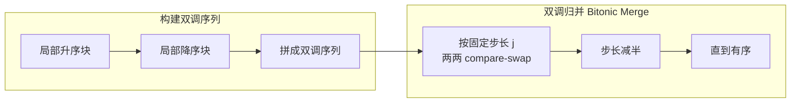
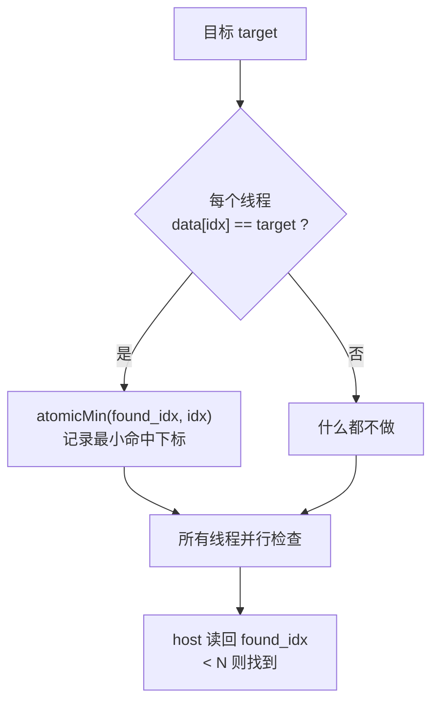
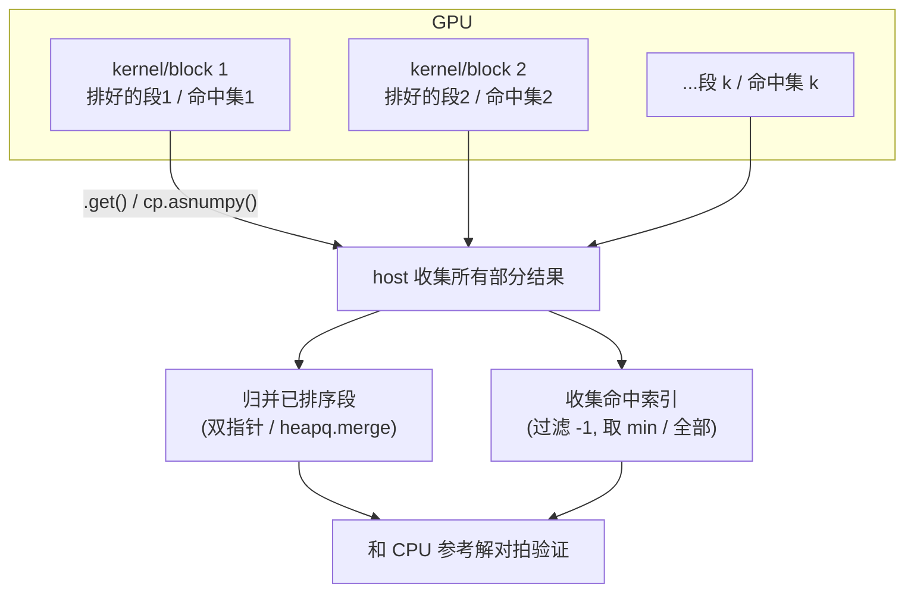

# 第 7 章 · 实用排序与搜索（Practical Sorting and Search）

> 对应原书 *Practical GPU Programming* 第 7 章（PDF 第 149–166 页）。
> 本章把"排序 / 搜索"这类最基础的数据操作搬到 GPU 上，讲清楚**为什么 CPU 上好用的算法不一定适合 GPU**、**双调排序（bitonic sort）与基数排序（radix sort）的并行原理**、**并行线性搜索的写法**，以及**如何在 CPU 端把 GPU 产出的分块结果归并回一个正确答案**。

---

## 🗺️ 本章地图

```mermaid
flowchart TD
    A["数据操作:排序 & 搜索"] --> B["排序 Sorting"]
    A --> C["搜索 Searching"]
    A --> D["结果归并 Merging"]

    B --> B1["双调排序 Bitonic Sort<br/>比较型·固定阶段·适合 GPU"]
    B --> B2["基数排序 Radix Sort<br/>非比较型·按位分桶·整数之王"]

    C --> C1["并行线性搜索<br/>一线程一元素 + atomicMin"]

    D --> D1["把分块结果传回 host<br/>.get() / cp.asnumpy()"]
    D --> D2["归并已排序段 / 收集命中索引"]
    D --> D3["和 CPU 参考解对拍验证正确性"]

    B1 -.PyCUDA 手写 kernel.-> E["动手实现"]
    B2 -.CuPy cp.sort 一行.-> E
    C1 -.PyCUDA 手写 kernel.-> E
    E --> F["性能对比 + 正确性校验"]
```

一句话概括本章的思想脉络：

> **CPU 的排序算法（快排、归并）依赖数据相关的分支和递归划分，天然是"串行 + 不规则"的；GPU 要的是"规则 + 无数据相关分支 + 海量独立线程"。** 于是我们改用**双调排序**（步骤完全由数据长度决定，可预先算好）和**基数排序**（根本不比较，按二进制位分桶），再配上**并行线性搜索**，最后用 host 端归并把碎片拼成完整答案。

---

## 7.0 为什么排序 / 搜索值得单开一章？

排序（sorting）和搜索（searching）是数据处理、分析、仿真流水线里的**基石操作**（cornerstone operation）。随着数据集越来越大，高效排序 / 搜索的重要性也越来越高。

- **是什么**：把一堆无序数据按大小排好（排序），或在一堆数据里找到目标（搜索）。
- **为什么难搬上 GPU**：CPU 上成熟好用的算法（quicksort、mergesort）**并不能很好地映射到 GPU 这种大规模并行架构**。原因见下表。

| 维度 | CPU 友好的算法（快排/归并） | GPU 想要的特性 |
|---|---|---|
| 控制流 | 自适应分支（adaptive branching）、递归划分 | 固定、规则、可预测的步骤 |
| 数据相关性 | 划分点、递归深度都依赖数据 | 无数据相关分支（no data-dependent branches） |
| 并行度 | 递归天然串行，难切成上千独立任务 | 上千个独立线程同时干活 |
| 同步 | 频繁、不规则 | 阶段之间少量、规则的同步 |

> 🔬 **第一性原理｜GPU 的 SIMT 执行模型决定了它讨厌分支**
> GPU 一个 warp（通常 32 个线程）**共用一条取指流水**，走同一条指令。如果 warp 里的线程因为 `if` 走了不同分支，硬件只能**串行执行每条分支路径**（warp divergence，线程束发散），有效并行度直接腰斩。快排的划分、递归深度全是"看数据脸色"的分支——放到 GPU 上就是发散重灾区。而双调排序 / 基数排序的每一步走什么、比哪两个元素，**只由数组长度决定**，与数据内容无关，warp 里所有线程步调完全一致，这才是 GPU 的舒适区。

---

## 7.1 GPU 加速的双调排序（Bitonic Sort）

### 7.1.1 双调排序是什么

**双调排序（bitonic sort）** 是一种**经典的、基于比较（comparison-based）的排序算法，专为并行硬件设计**。

它和快排 / 归并最大的不同：

- 快排 / 归并：需要自适应分支 + 递归划分。
- 双调排序：遵循一套**固定的比较-交换（compare-and-swap）操作序列**，组织成预先定义好的若干"阶段（stages）"。

> **每一步都能映射成一组独立、规则的 GPU 线程。** 正是这种"可预测性"让双调排序特别适合 GPU——可以让一大批数据**同时被排序**，吞吐量高、同步开销小。

它的三大卖点（原书原话转述）：

1. 🚀 算法的**每一个阶段**都能并发跑**上千个** compare-and-swap 操作。
2. 🎯 因为**规则、无数据相关分支**，生成的 GPU kernel 非常高效。
3. ⏱️ 适合**延迟敏感**或**数据要边到边排**的场景：仿真流水线、图形渲染、实时分析。

### 7.1.2 核心概念：什么是"双调序列"

**双调序列（bitonic sequence）** = 元素先**单调递增**再**单调递减**的数组（或反过来，先降后升）。例如：

```
[1, 3, 5, 8, 7, 4, 2, 0]     ← 先升(1→8)后降(8→0),这是双调序列
 └── 递增 ──┘└── 递减 ──┘
```

双调排序的核心思想：

> 通过一套**固定的 compare-and-swap 阶段**，**迭代地构建并归并（build and merge）双调序列**，最终得到全有序数组。每个阶段是一种**特定模式的两两比较**，天生适合并行线程。

关键一点：

> **阶段的数量、每一步比较哪些"配对"，完全由输入的大小（size）决定。** 这意味着 kernel 逻辑可以**预先算好**，然后分成一系列步骤启动，每个阶段之间做一次同步。



> 🔬 **第一性原理｜为什么复杂度是 O(n·log²n) 却仍然快**
> 双调排序总共有 log₂n 个"外层阶段（k）"，每个外层阶段里又有最多 log₂n 个"内层子阶段（j）"，所以一共约 **(log₂n)² 次 kernel 启动**，每次启动处理全部 n 个元素的比较——总比较次数是 O(n·log²n)，比快排的 O(n·logn) 更多。**但**：这 n 个比较**全部并行**！在有几千核的 GPU 上，"多做了 log n 倍比较但每步只花 O(1) 墙钟时间"是笔划算的买卖。这是并行算法里典型的"**用更多总工作量换更低并行深度**"的权衡（work vs. depth）。

### 7.1.3 准备数据

原书用 PyCUDA 为 **1D float32 数组**实现一个简洁有效的双调排序。第一步照例准备数据：

```python
import numpy as np
import pycuda.autoinit
import pycuda.driver as drv
import pycuda.gpuarray as gpuarray
from pycuda.compiler import SourceModule
import time

# 为了最佳性能,数组长度用 2 的幂
N = 2**15  # 32768 个元素
arr_host = np.random.rand(N).astype(np.float32)
arr_gpu = gpuarray.to_gpu(arr_host)
```

逐行讲解：

| 代码 | 含义 |
|---|---|
| `import pycuda.autoinit` | 自动初始化 CUDA 上下文（自动选卡、建 context），省去手动样板代码 |
| `N = 2**15` | **必须是 2 的幂**！双调排序的固定步长逻辑依赖这一点（见下方⚠️坑） |
| `arr_host = np.random.rand(N).astype(np.float32)` | 生成 N 个 `[0,1)` 的随机 float32 |
| `gpuarray.to_gpu(arr_host)` | 把 host 数组拷到 GPU 显存，得到一个 `gpuarray`（PyCUDA 的 GPU 数组对象） |

> ⚠️ **常见坑｜长度必须是 2 的幂**
> 教科书版双调排序**要求数组长度是 2 的幂**（`N = 2**15`）。因为异或步长 `j` 都是 2 的幂，`idx ^ j` 恰好在 `[0, N)` 内配对。若 N 不是 2 的幂，配对会越界或漏配，结果错。工业实现（如 CUB / Thrust）会**把数组 pad 到下一个 2 的幂**（用 +∞ 填充，排完丢弃），或改用 bitonic 的变体。自己写时若 N 非 2 的幂，最省事的做法就是补齐到 `2**ceil(log2(N))`。

### 7.1.4 双调排序 Kernel —— 逐行拆解

下面这个 kernel 实现**双调排序的单个阶段（a single stage）**。每个线程比较并有条件地交换两个元素，具体行为取决于当前阶段和方向。

```cpp
__global__ void bitonic_step(float *data, int j, int k, int n)
{
    unsigned int idx = threadIdx.x + blockDim.x * blockIdx.x;   // (1) 全局线程号
    if (idx >= n) return;                                       // (2) 越界保护

    unsigned int ixj = idx ^ j;                                 // (3) 配对元素下标

    if (ixj > idx) {                                            // (4) 只让"小下标"那个线程动手,避免重复交换
        if ((idx & k) == 0) {                                  // (5) 决定这一段是升序还是降序
            if (data[idx] > data[ixj]) {                       // (6) 升序:大的在后 → 若前>后则交换
                float tmp = data[idx];
                data[idx] = data[ixj];
                data[ixj] = tmp;
            }
        } else {
            if (data[idx] < data[ixj]) {                       // (7) 降序:大的在前 → 若前<后则交换
                float tmp = data[idx];
                data[idx] = data[ixj];
                data[ixj] = tmp;
            }
        }
    }
}
```

**这是本章最烧脑的一段，逐行讲透：**

- **(1) `idx = threadIdx.x + blockDim.x * blockIdx.x`**
  经典的"全局线程 ID"计算。每个线程负责数组里的一个位置 `idx`。

- **(2) `if (idx >= n) return;`**
  因为 grid 的线程总数是"向上取整到 block 的整数倍"，末尾可能有多余线程，越界的直接退出。

- **(3) `ixj = idx ^ j`（异或！本 kernel 的灵魂）**
  用**位异或**求出当前线程要比较的**配对下标**。`j` 是当前的比较步长（stride），且总是 2 的幂。异或运算的妙处：`idx ^ j` 会翻转 `idx` 二进制的某一位，恰好得到配对元素的下标，且配对是**对称的**（`idx ^ j` 与 `(idx^j) ^ j == idx` 互为配对）。这就是双调网络"蝶形连线（butterfly）"的实现。

- **(4) `if (ixj > idx)`**
  一对元素 `(idx, ixj)` 会被**两个线程**同时看到（`idx` 那个线程和 `ixj` 那个线程），如果两个都去交换就会**互相抵消 / 数据竞争**。所以约定：**只让下标较小的那个线程执行 compare-swap**，另一个什么都不做。

- **(5) `if ((idx & k) == 0)`（决定升 / 降方向）**
  `k` 是当前"外层阶段"的大小，也是 2 的幂。用 `idx & k` 检查 `idx` 的某一位：为 0 的段要排成**升序**，为 1 的段排成**降序**。**升降交替**正是"构建双调序列"的关键——只有相邻块一升一降，才能拼成双调序列供下一阶段归并。

- **(6)(7) 条件交换**
  - 升序段（`(idx & k) == 0`）：希望小的在前，所以 `if (data[idx] > data[ixj])` 才交换。
  - 降序段（else）：希望大的在前，所以 `if (data[idx] < data[ixj])` 才交换。

```python
mod = SourceModule(bitonic_kernel_code)
bitonic_step = mod.get_function("bitonic_step")
```

`SourceModule` 把 CUDA C 源码在运行时编译成可调用的 GPU 函数，`get_function` 拿到句柄。

> 💡 **实战/面试高频｜为什么用 XOR 求配对下标？**
> 双调排序的比较网络是"**蝶形网络（butterfly network）**"。在步长为 `j` 的一轮里，下标 `idx` 和 `idx ^ j` 组成一对——它们只在第 `log2(j)` 位不同。用 XOR 一次运算就得到配对，**无分支、无查表、O(1)**，完美契合 GPU。面试若被问"双调排序里 `idx ^ j` 是干嘛的"，答：**计算蝶形网络中当前线程的配对元素下标**。

### 7.1.5 Host 端逻辑：双层循环驱动阶段

双调排序在 host 端组织成一个**双层循环（外层 k、内层 j）**，我们反复启动 kernel，每次指定当前的 `j` 和 `k`：

```python
def gpu_bitonic_sort(arr_gpu, n, threads_per_block=256):
    blocks_per_grid = (n + threads_per_block - 1) // threads_per_block
    for k in [2**i for i in range(1, int(np.log2(n)) + 1)]:          # 外层:k = 2,4,8,...,n
        for j in [2**i for i in range(int(np.log2(k)), -1, -1)]:     # 内层:j = k/2,...,2,1
            bitonic_step(
                arr_gpu, np.int32(j), np.int32(k), np.int32(n),
                block=(threads_per_block, 1, 1),
                grid=(blocks_per_grid, 1)
            )
```

**循环结构讲解：**

| 层 | 变量 | 取值 | 含义 |
|---|---|---|---|
| 外层 | `k` | 2, 4, 8, …, n | 当前正在归并的**双调序列的大小**，逐步翻倍直到覆盖全数组 |
| 内层 | `j` | k/2, k/4, …, 2, 1 | 当前的**比较步长**，从 k/2 一路减半到 1 |

- `blocks_per_grid = (n + tpb - 1) // tpb` 是标准的"向上取整"块数计算，确保覆盖全部 n 个元素。
- **每次 kernel 启动就是一个"阶段（stage）"**，一次内层迭代 = 一次全数组的 compare-swap。启动次数约 `(log2 n)²` 次。
- **同步在哪？** 每次 `bitonic_step(...)` 启动是异步排队到同一个默认 stream，CUDA 保证**同一 stream 的 kernel 顺序执行**，所以下一阶段自动等上一阶段结束——不需要手动插 `synchronize`，靠 stream 的顺序语义就实现了"阶段间同步"。

> ⚠️ **常见坑｜为什么不能把双层循环塞进一个 kernel？**
> 因为**阶段之间需要全局同步**（下一步要读上一步交换后的结果，且跨 block）。CUDA 里**没有跨 block 的全局 barrier**（`__syncthreads()` 只同步一个 block 内的线程）。要跨 block 同步，最可靠的办法就是**结束 kernel、回到 host、再启动下一个 kernel**——kernel 边界天然是全局同步点。这就是为什么双调排序要在 host 端跑 (log n)² 次启动。高阶优化：把同一个 block 内能完成的连续小步长阶段合并进一个 kernel（用 shared memory + `__syncthreads()`），减少 kernel 启动次数——这正是 CUB 的做法。

### 7.1.6 性能测量与验证

```python
start_gpu = time.time()
gpu_bitonic_sort(arr_gpu, N)
drv.Context.synchronize()          # 关键:等所有 kernel 真正跑完再停表
end_gpu = time.time()
sorted_gpu = arr_gpu.get()         # 结果拷回 host

arr_host_copy = arr_host.copy()
start_cpu = time.time()
arr_host_copy.sort()               # numpy 原地排序作参考
end_cpu = time.time()

print("GPU bitonic sort time: {:.4f} sec".format(end_gpu - start_gpu))
print("CPU numpy sort time:   {:.4f} sec".format(end_cpu - start_cpu))
print("Are results close?", np.allclose(arr_host_copy, sorted_gpu, atol=1e-6))
```

**要点：**

- `drv.Context.synchronize()` **必须在停表前调用**。GPU kernel 是**异步**的，`gpu_bitonic_sort` 返回时 kernel 可能还没跑完，不 sync 你测到的是"发射时间"而非"执行时间"。
- `np.allclose(..., atol=1e-6)`：float 排序结果和 numpy 对拍，允许 1e-6 的浮点误差。

**结论（原书）：** GPU 加速的双调排序**比 CPU 排序好得多**，尤其在中等规模和批处理场景。在 2 的幂大数组上，GPU 版可比 CPU **快数倍**（取决于硬件和 kernel 调优）。当你要处理**多个数组**，或它是**更大的 GPU 工作流的一环、数据全程留在设备上**时，差距会更大。

> 💡 **实战/面试高频｜"数据全程留在设备上"是关键**
> 单看一次排序，`to_gpu`（拷入）+ 排序 + `.get()`（拷回）的 PCIe 传输可能吃掉大部分时间，得不偿失。GPU 排序真正发光的场景是：数据本来就在 GPU 上（比如上一步的仿真 / 渲染输出），排完接着喂给下一个 GPU kernel——**避免了往返 host 的传输**。面试答"什么时候该用 GPU 排序"，一定要提到 **data locality / 减少 host-device 传输**。

---

## 7.2 整数数组的基数排序（Radix Sort）

### 7.2.1 为什么还需要基数排序

双调排序靠**规则的、基于比较的结构**在 GPU 上高效。但——

> **基于比较的算法（如双调排序）并不总是最高效的，尤其在排序大整数数组时。**

**基数排序（radix sort）** 走了一条根本不同的路：

> 它**按数字的二进制表示（binary representation）排序，一次处理一组比特位**，从而**完全去掉了比较（removes the need for comparisons altogether）**。

在 GPU 上，这意味着基数排序可以用**一系列快速、确定性的 pass**处理数据集，根据"数位值（digit values）"来**分发（distribute）和收集（gather）**元素，每一步都榨取并行度。

| 对比 | 双调排序 Bitonic | 基数排序 Radix |
|---|---|---|
| 原理 | 比较-交换 | 按位分桶（bucket），不比较 |
| 复杂度 | O(n·log²n) | O(d·(n+b))，d=位数轮数，b=桶数 |
| 适合数据 | float / 任意可比较类型 | **整数**（或可映射成整数位模式的类型） |
| 分支 | 无数据相关分支 | 无数据相关分支 |
| 大整数数组 | 慢 | **快，业界首选** |


> 🔬 **第一性原理｜为什么"不比较"能更快**
> 基于比较的排序有**信息论下界 Ω(n·log n)**：因为 n 个元素有 n! 种排列，每次比较最多区分 2 种情况，至少需要 log₂(n!) ≈ n·log n 次比较。基数排序**绕过了这个下界**——它不问"a 和 b 谁大"，而是直接读 a 的第 k 组比特位是几，把它扔进对应的桶。对固定位宽的整数（比如 32 位），轮数 d 是常数，于是复杂度退化成 **O(n)**（线性！）。代价：只能用于"位模式能定义顺序"的类型（整数、可转成序保持位模式的 float），且需要额外的桶 / 计数空间。

### 7.2.2 用 CuPy 跑基数排序（一行搞定）

原书这里**不再手写 kernel**，而是用 **CuPy**——它的 `cp.sort` 在数据量够大时，底层自动用基数排序。

先准备一个大整数数组：

```python
import cupy as cp
import numpy as np
import time

N = 2**20  # 1,048,576 个整数
arr_host = np.random.randint(0, 10_000_000, size=N, dtype=np.int32)
arr_cupy = cp.array(arr_host)      # 拷到 GPU
```

排序（`cp.sort` 对够大的整数数组底层走基数排序）：

```python
start_gpu = time.time()
sorted_cupy = cp.sort(arr_cupy)
cp.cuda.Stream.null.synchronize()  # 等 GPU 真正排完
end_gpu = time.time()
sorted_host_radix = cp.asnumpy(sorted_cupy)   # 拷回 host
```

逐点讲：

- `cp.array(arr_host)`：CuPy 版的 `to_gpu`，把 numpy 数组搬进显存。
- `cp.sort(arr_cupy)`：**API 和 numpy 几乎一样**，但在 GPU 上执行。CuPy 内部对大整数数组调用高度优化的**基数排序**（底层是 CUB / Thrust 的实现）。
- `cp.cuda.Stream.null.synchronize()`：`null` 是默认流，同步它 = 等所有默认流的操作跑完。**又是那句：GPU 异步，停表前必须 sync。**
- `cp.asnumpy(...)`：CuPy 版的 `.get()`，把 GPU 结果拷回 host。

> 💡 **实战/面试高频｜CuPy vs PyCUDA 的定位**
> - **PyCUDA**：你写 CUDA C kernel，手动控制一切——学习成本高、最灵活，适合定制算法（如上面的双调排序）。
> - **CuPy**：几乎就是"GPU 版 numpy"，`cp.sort / cp.sum / cp.dot` 直接可用，底层调用 NVIDIA 官方优化库（cuBLAS / cuRAND / CUB / Thrust）。**能用 CuPy 就别自己造轮子**——`cp.sort` 的基数排序比你手写的强得多。本章的教学价值正在于：**懂原理（手写双调）+ 会用生产级 API（CuPy 基数）**。

### 7.2.3 双调 vs 基数：同台竞技

原书接着用**之前写的双调排序**和 CuPy 基数排序在**同一批数据**上对比。由于双调排序处理的是 float，先把整数数组转成 float 以求公平：

```python
import pycuda.gpuarray as gpuarray
import pycuda.autoinit

arr_gpu_bitonic = gpuarray.to_gpu(arr_host.astype(np.float32))

start_bitonic = time.time()
gpu_bitonic_sort(arr_gpu_bitonic, N)   # 复用 7.1 定义的函数
pycuda.autoinit.context.synchronize()
end_bitonic = time.time()
sorted_host_bitonic = arr_gpu_bitonic.get()
```

打印计时并校验正确性：

```python
# 计时对比
print("CuPy radix sort time:   {:.4f} sec".format(end_gpu - start_gpu))
print("PyCUDA bitonic sort time: {:.4f} sec".format(end_bitonic - start_bitonic))

# 两种结果都和 CPU 参考解对拍
reference = np.sort(arr_host)
match_radix   = np.allclose(reference, sorted_host_radix)
match_bitonic = np.allclose(reference, sorted_host_bitonic, atol=1)
print("Radix sort matches reference:", match_radix)
print("Bitonic sort matches reference:", match_bitonic)
```

**注意两个细节：**

- 双调对拍用了 `atol=1`（而基数用默认 `atol`）。因为整数被转成 float32 排序，**float32 只有约 7 位有效十进制数字**，当整数大到 10⁷ 量级时无法精确表示，会有舍入误差，所以放宽容差到 1。这本身也是一个警示 ⬇️。
- `reference = np.sort(arr_host)` 用原始整数做参考——这才是"金标准"。

> ⚠️ **常见坑｜别拿 float 排序器去排大整数**
> 上面为了"公平对比"把 int32 转成 float32——但 **float32 的 23 位尾数只能精确表示约 ±1.6×10⁷ 以内的整数**。超过后不同整数会映射到同一个 float，排序结果就错了（所以要 `atol=1` 才勉强通过）。**真实工程里排整数就用整数排序器（基数排序 / `cp.sort`），绝不要绕道 float。** 这也从侧面说明：双调排序（比较型、适配 float）和基数排序（位模式、适配 int）各有其数据类型的"主场"。

**结论（原书）：** GPU 上的基数排序（经 CuPy `sort` API 暴露）是"**用基于数位的并行分区做高速整数排序**"的典范。实测中，**对大数组，基数排序明显甩开双调排序**，坐实了它作为"**高吞吐 GPU 整数排序首选算法**"的地位。

> 💡 **实战/面试高频｜"什么排序上 GPU 用什么"速查**
> - **大整数数组** → 基数排序（`cp.sort` / CUB `DeviceRadixSort`）。业界默认。
> - **浮点 / 自定义比较 / 中小规模批处理** → 双调排序（规则、易并行、延迟低）。
> - **键值对（key-value）排序** → CUB 的 radix sort by key。
> - **段排序（segmented sort，一批小数组各自排序）** → 双调排序批处理，或 CUB segmented sort。

---

## 7.3 并行线性搜索 Kernel（Parallel Linear Search）

### 7.3.1 为什么要并行线性搜索

线性搜索（linear search）是数据库查询、模式匹配、数据分析的**基础操作**。通常它是**串行**的：CPU 一次查一个元素，从头扫到尾直到命中。简单，但对大数据集**慢**——因为**每个 CPU 周期只查一个元素**。

GPU 有**上千个线程**，天生适合这活儿：

> 给**每个线程分配数组的一部分（甚至就一个元素）**，就能**同时检查一大批元素**。只要**任何一个线程找到目标，搜索就结束**。

适用场景：

- 大数据集，且**不知道目标在哪**。
- 需要**一次跑一大批搜索**。
- 数据**无序（unsorted）**或做**批量模式查询（bulk pattern queries）**。

不适用 / 有更优解的场景：

- **已排序数组** → 二分搜索（binary search）或基于 scan 的搜索更快（O(log n) 而非 O(n)）。



### 7.3.2 准备数据

```python
import numpy as np
import pycuda.autoinit
import pycuda.driver as drv
import pycuda.gpuarray as gpuarray
from pycuda.compiler import SourceModule

N = 2_000_000
target_value = 123456

# 把目标放到一个随机位置(确保数组里真的有它)
arr_host = np.random.randint(0, 1_000_000, N).astype(np.int32)
rand_index = np.random.randint(0, N)
arr_host[rand_index] = target_value      # 确保目标存在
arr_gpu = gpuarray.to_gpu(arr_host)
```

> 💡 **小技巧**：先随机填充，再**手动在随机位置塞入 target**，保证目标一定存在——这样才能验证 kernel 是否找对了位置。

### 7.3.3 搜索 Kernel —— atomicMin 是灵魂

kernel 启动**一个线程一个元素**，各自把自己的值和 target 比较。命中就用**原子操作（atomic operations）**把索引写进输出数组，避免竞态。

```cpp
__global__ void parallel_search(const int *data, int *found_idx, int target, int n)
{
    int idx = blockIdx.x * blockDim.x + threadIdx.x;
    if (idx < n && data[idx] == target) {
        atomicMin(found_idx, idx);   // 记录命中的最小下标
    }
}
```

**逐行讲：**

- `idx = blockIdx.x * blockDim.x + threadIdx.x`：全局线程号，每个线程负责 `data[idx]`。
- `if (idx < n && data[idx] == target)`：**短路求值**——先做越界检查 `idx < n`，通过了再访问 `data[idx]`，避免越界读。命中则进入。
- **`atomicMin(found_idx, idx)`（核心！）**：原子地把 `*found_idx` 更新为 `min(*found_idx, idx)`。

> 🔬 **第一性原理｜为什么必须用原子操作 atomicMin**
> 上千个线程可能**同时**命中（如果数组里有多个 target），它们会**同时写同一个 `found_idx`**——这就是**数据竞争（race condition）**：普通写 `found_idx[0] = idx` 会互相覆盖，结果不可预测（可能留下一个随机的命中下标，甚至撕裂写入）。`atomicMin` 保证"读-比较-写"三步**不可分割（atomic）**，多个线程排队进行，最终 `found_idx` 一定是**所有命中里最小的那个下标**。这既解决了竞态，又顺带实现了"返回第一个命中位置"的语义——一举两得。

### 7.3.4 准备输出缓冲 + 启动

```python
mod = SourceModule(kernel_code)
parallel_search = mod.get_function("parallel_search")

# 用 N(最大值)初始化 found_idx —— 这样任何真实下标都比它小
found_idx = gpuarray.to_gpu(np.array([N], dtype=np.int32))
```

**为什么初始化成 `N`？** 因为要用 `atomicMin` 求最小。初值必须**大于任何合法下标**（合法下标是 `0..N-1`），`N` 正好合适。搜索结束后若 `found_idx` 仍是 `N`，说明**没找到**（没有任何线程用更小的值把它压下去）。这是"哨兵值（sentinel）"的经典用法。

```python
threads_per_block = 256
blocks_per_grid = (N + threads_per_block - 1) // threads_per_block

parallel_search(
    arr_gpu, found_idx, np.int32(target_value), np.int32(N),
    block=(threads_per_block, 1, 1),
    grid=(blocks_per_grid, 1)
)
drv.Context.synchronize()

result = found_idx.get()[0]
if result < N:
    print(f"Target found at index {result}")
else:
    print("Target not found")
```

- `blocks_per_grid` 照例向上取整，保证 200 万个元素每个都有线程负责。
- 判定：`result < N` → 找到；`result == N`（初值没被改）→ 没找到。

### 7.3.5 和串行搜索对比

```python
import time
start_cpu = time.time()
for i, val in enumerate(arr_host):
    if val == target_value:
        cpu_idx = i
        break        # 找到就停,CPU 线性搜索的典型"提前退出"
end_cpu = time.time()
print(f"CPU search index: {cpu_idx}, time: {end_cpu - start_cpu:.4f} sec")
```

**结论（原书）：** 对大数组，并行 kernel **大幅降低搜索时间**，因为**所有元素并行检查**。实际中，总延迟只受限于**最慢的线程**或**kernel 启动 + 同步的开销**——对大数组，这通常比串行 CPU 搜索**快几个数量级**。

而且这套方法**高度可扩展**，同样的思路可以扩展去：**搜索多个目标、统计出现次数、甚至跑更复杂的并行匹配操作**。

> ⚠️ **常见坑｜别忘了 CPU 串行搜索能"提前退出"**
> CPU 的 `break` 让它平均只扫一半数组（若目标随机分布）。而 GPU **无论如何都要检查全部元素**（每个线程都跑）——它没有"找到就全体停下"的廉价机制（提前终止需要额外的 flag + 反复读，通常不值）。所以：**目标在数组很靠前时，CPU 的提前退出可能反而快**；只有当数组够大、目标位置不确定、或要批量搜索时，GPU 的全并行才真正碾压。评估性能别只看"数组多大"，还要看"目标在哪 / 有几个 / 搜几次"。

> 💡 **实战/面试高频｜有序数据别用线性搜索**
> 如果数组**已排序**，O(n) 的并行线性搜索是浪费——用 **二分搜索 O(log n)**（GPU 上可批量并行二分，CuPy 有 `cp.searchsorted`）。GPU 线性搜索的主场是**无序数据 + 批量查询**。面试被问"GPU 上怎么搜索"，一定要先反问 / 声明"**数据有没有排序**"——这决定了算法选型。

---

## 7.4 在 Host 端归并结果（Merging Results on Host）

### 7.4.1 为什么要在 CPU 端归并

到这里我们已经会用 PyCUDA / CuPy 加速排序和搜索了。但很多 kernel 产出的是**部分结果（partial results）或按 block 划分的输出**，必须**收集、归并、终结（collected, merged, finalized）在 host（CPU）上**才能完成整个工作流。

> 无论是**分段排序大数据集**，还是**跑并行搜索查询**，**在 host 端归并结果**都是保证**正确性、可扩展性、以及与下游任务集成**的必备套路。

典型需要 host 归并的情形：

| 情形 | 问题 | host 端要做什么 |
|---|---|---|
| 数组切块并行排序 | 得到多个"已排序段" | 归并成一个整体有序数组 |
| 多线程 / 多 block 各自找到命中 | 得到一堆命中索引 | 收集最小的（或全部）匹配索引 |
| 数据跨 block / 跨 kernel 划分 | 块**边界处**的元素易乱序 | 归并时特别处理边界，保持顺序与准确 |



### 7.4.2 第一步：把设备结果收集回 host

跑完 GPU kernel，先用 `.get()`（PyCUDA）或 `cp.asnumpy()`（CuPy）把结果数组从设备传回 host：

```python
# 排序结果
sorted_gpu  = arr_gpu.get()                 # PyCUDA
sorted_cupy = cp.asnumpy(arr_cupy_sorted)   # CuPy

# 搜索结果(部分索引)
partial_indices_gpu = found_idx_gpu.get()
```

### 7.4.3 归并已排序的段（Merging Sorted Chunks）

假设我们把数组**分段排序**（对大数组或显存受限时，用独立 kernel 各排一段）。host 只需把这些**有序段合并成一个有序输出**。

```python
import numpy as np

# 例:归并两个已排序数组
segment1 = np.sort(np.random.randint(0, 100, size=5000))
segment2 = np.sort(np.random.randint(0, 100, size=5000))

merged = np.empty(len(segment1) + len(segment2), dtype=segment1.dtype)
i = j = k = 0
while i < len(segment1) and j < len(segment2):
    if segment1[i] < segment2[j]:
        merged[k] = segment1[i]; i += 1
    else:
        merged[k] = segment2[j]; j += 1
    k += 1

# 拷贝剩余元素(谁没走完就把剩下的整段搬过去)
merged[k:] = segment1[i:] if i < len(segment1) else segment2[j:]
```

**这就是归并排序里的"归并"步骤**——经典**双指针（two-pointer）**：

- `i, j` 分别指向两个有序段的当前元素，`k` 指向输出位置。
- 每次挑两者中较小的放进 `merged`，对应指针前进。
- 循环结束时必有一段走完，另一段还剩一截**已经有序**的尾巴，直接整段搬过去。

**多于两块怎么办？** 原书建议：用 `np.merge1d`（原文如此）或 Python 的 **`heapq.merge()`** 做通用的 **K 路归并（K-way merge）**。

> ⚠️ **勘误提示**：`np.merge1d` 在 NumPy 里**并不存在**（书中笔误）。通用 K 路归并请用标准库 **`heapq.merge(*iterables)`**——它接受任意多个有序可迭代对象，惰性地产出一个全局有序序列，内存友好。例如：`list(heapq.merge(seg1, seg2, seg3))`。

> 💡 **实战/面试高频｜为什么把归并放 CPU 而不放 GPU？**
> K 路归并是**串行依赖强、分支多、访问不规则**的操作——恰恰是 GPU 的软肋。当段数不多、每段不小时，**GPU 排各段（并行）+ CPU 归并（串行但量小）** 往往是最优拆分。当然，若追求极致，GPU 上也有并行归并（merge path 算法，CUB 的 `DeviceMergeSort`），但复杂度和代码量陡增。**先用简单的 host 归并跑通，profile 发现它是瓶颈了再上 GPU 归并**——不要过早优化。

### 7.4.4 归并搜索结果（Merging Search Results）

如果做的是并行搜索，每个 block / kernel 把自己的命中索引（没找到就写 -1）写进一个数组。host 收集所有**有效索引**，取最小（或全部）：

```python
partial_indices = np.array([12, -1, -1, 78, -1])   # GPU 的示例输出
hits = partial_indices[partial_indices != -1]      # 布尔掩码过滤掉 -1

if len(hits) > 0:
    print("Target found at indices:", hits)
    print("First occurrence:", hits.min())
else:
    print("Target not found")
```

- `partial_indices[partial_indices != -1]`：**布尔掩码索引（boolean mask）**，一步过滤掉所有"未命中"的哨兵值 -1。
- `hits.min()`：取最小下标 = 第一个出现位置。

### 7.4.5 归并时的三条铁律

原书特别提醒，归并不同段 / 部分搜索结果时要注意：

1. **检查段边界的重复（duplicates at boundaries）**：如果分块时有**重叠元素**（同一个元素被多个 block 包含），归并后会出现重复，要去重。
2. **保持整体顺序（preserve overall order）**：归并有序块时不能有"乱序元素（out-of-place elements）"。
3. **校验索引正确性（index correctness）**：搜索务必用**全局位置（global positions）**，而不是"块内局部索引"——第 3 块的第 5 个元素，全局下标是 `3*chunk_size + 5`，别直接报 5。

> ⚠️ **常见坑｜局部索引 vs 全局索引，最容易翻车的地方**
> 当你把大数组切成 k 块，每块启动独立 kernel 搜索时，kernel 里的 `idx` 是**块内的局部下标**（从 0 开始）。若直接把这个 `idx` 返回给 host，你得到的是"在第几块的第几个"，**不是在原数组里的真实位置**。必须换算：`global_idx = chunk_id * chunk_size + local_idx`。这个 off-by-chunk 错误极其隐蔽——单块测试全对，一分块就错，且错得"看起来像合理下标"。归并前务必确认所有索引已转成全局坐标。

### 7.4.6 最后一步：和 CPU 参考解对拍

归并完成后，**把最终结果和"完全在 CPU 上算出的参考解"对比**，确保正确：

```python
reference_sorted = np.sort(complete_input_array)
if np.array_equal(merged, reference_sorted):
    print("Merged sort result is correct!")
else:
    print("Merged sort result is incorrect.")

# 搜索:确认所有位置确实是目标值
if all(complete_input_array[idx] == target_value for idx in hits):
    print("Search indices are valid.")
else:
    print("One or more search indices are incorrect.")
```

- 排序验证：`np.array_equal(merged, reference_sorted)` 精确逐元素比对（整数用 `array_equal`，浮点才用 `allclose`）。
- 搜索验证：不光"报了几个下标"，还要**回查这些下标处的值是否真的等于 target**——防止索引换算出错。

> 🔬 **第一性原理｜"对拍（differential testing）"为什么是 GPU 编程的保命符**
> GPU 代码的 bug 往往是**竞态、边界、索引换算**这类"大部分数据对、极少数错"的问题，肉眼极难发现。最可靠的验证方法就是**对拍**：用一个**简单到不可能写错**的 CPU 参考实现（`np.sort` / 朴素循环）算出金标准，再逐元素比对 GPU 结果。这在竞赛和工业界都是标准做法。养成"**写完 GPU kernel 立刻和 CPU 对拍**"的肌肉记忆，能省下无数 debug 时间。

**收束（原书）：** 把两种途径（GPU 的并行威力 + host 的灵活归并）的长处结合起来，就能为**大规模数据的排序、搜索、分析**构建**既快又稳（fast and strong）**的实用方案。

---

## 7.5 三个操作横向对比（速查表）

| 操作 | 用什么 | 关键机制 | 复杂度 | 适用场景 | 主要坑 |
|---|---|---|---|---|---|
| 双调排序 | PyCUDA 手写 | XOR 蝶形配对 + 升降交替 + kernel 边界同步 | O(n·log²n)，并行深度 O(log²n) | float / 中小规模 / 批处理 / 数据留在设备 | N 必须 2 的幂 |
| 基数排序 | CuPy `cp.sort` | 按位分桶，不比较 | O(d·n)，整数近似 O(n) | 大整数数组（业界首选） | 别拿 float 排大整数 |
| 并行线性搜索 | PyCUDA 手写 | 一线程一元素 + `atomicMin` + 哨兵初值 | O(n)（全并行 O(1) 深度） | 无序数据 / 批量查询 | 有序数据该用二分；局部→全局索引 |
| host 归并 | numpy / heapq | 双指针 / K 路归并 / 掩码过滤 | 取决于段数 | 分块排序、多命中收集 | 边界重复、局部索引、务必对拍 |

---

## 📌 小结

本章围绕 GPU 上的**排序与搜索**这两大基石操作，讲了四件事：

1. **为什么 CPU 算法不能直接搬 GPU** —— GPU 要"规则 + 无数据相关分支 + 海量独立线程"，快排 / 归并的自适应分支和递归是 warp divergence 的重灾区。

2. **双调排序（Bitonic Sort，PyCUDA 手写）** —— 用**固定的 compare-and-swap 阶段**构建 / 归并双调序列；kernel 里 `idx ^ j`（XOR 蝶形配对）、`(idx & k)`（升降方向）、`ixj > idx`（防重复交换）是三个关键位运算；host 端双层循环 (k, j) 驱动约 (log n)² 次 kernel 启动，靠**kernel 边界**实现跨 block 全局同步；长度须是 2 的幂。

3. **基数排序（Radix Sort，CuPy 一行）** —— **不比较**，按二进制位分桶，绕过 O(n·log n) 比较下界，对大整数近似 O(n)；`cp.sort` 底层自动用它，**大整数排序完胜双调**；懂原理 + 会用生产 API 是本章双重目标。

4. **并行线性搜索 + host 归并** —— 一线程一元素、`atomicMin` 解竞态并顺带返回首个命中、哨兵初值 `N` 判"未找到"；分块产出的部分结果要拷回 host 做**双指针 / K 路归并**、**布尔掩码收集命中**、**局部→全局索引换算**，最后**和 CPU 参考解对拍**保正确。

**贯穿全章的三条工程直觉**：
- ⏱️ GPU 异步——**停表 / 取结果前必须 `synchronize()`**。
- 📦 GPU 排序 / 搜索的真正价值在**数据全程留在设备上**，减少 host-device 传输。
- ✅ GPU 代码的 bug 隐蔽——**写完立刻和简单 CPU 实现对拍**是保命符。

---

## 🔗 延伸阅读

- **CUB**（`cub::DeviceRadixSort` / `DeviceMergeSort` / `DeviceSelect`）：NVIDIA 官方的设备级并行原语库，本章 CuPy 的 `sort` 底层就靠它。生产环境排序 / 归约 / scan 首选。
- **Thrust**：CUDA 的"STL"，`thrust::sort` / `thrust::sort_by_key` 一行完成键值对排序，内部按类型自动选基数 / 归并。
- **双调排序网络（bitonic sorting network）** —— Batcher 1968 的原始论文，理解"蝶形网络"和 (log n)² 深度的由来。
- **Merge Path 算法** —— GPU 上做**并行归并**的经典方法（Green, McColl, Bader），当 host 归并成为瓶颈时的进阶方案。
- **CuPy 文档** `cupy.sort` / `cupy.searchsorted` / `cupy.argsort` —— 有序数组上的**并行二分搜索**用 `searchsorted`。
- 本书后续章节：把排序 / 搜索作为子步骤嵌入更大的 GPU 数据流水线（reduction、scan、直方图），体会"数据留在设备上"的复利效应。
