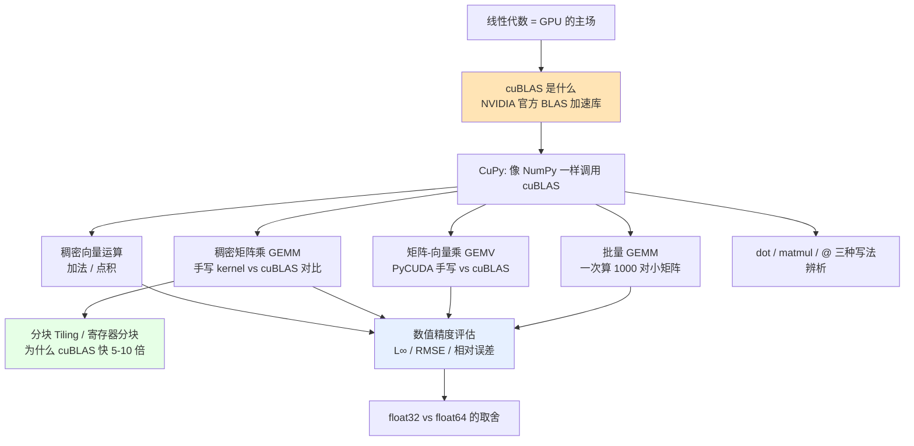
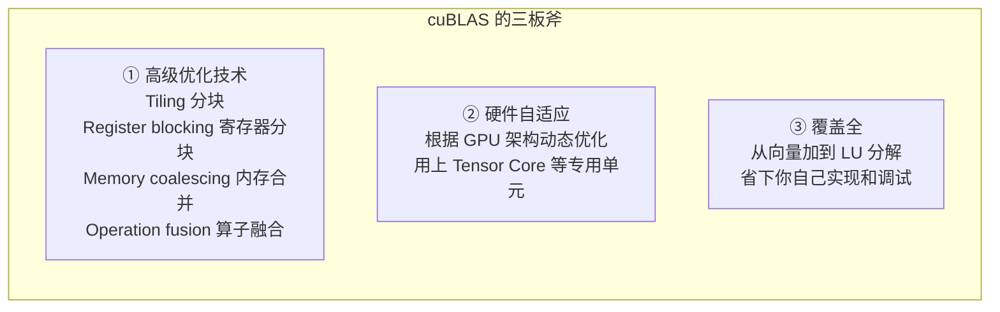
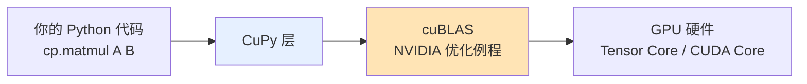
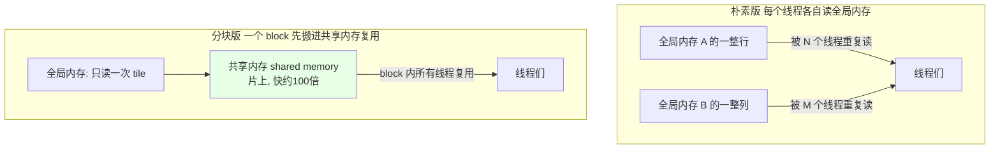
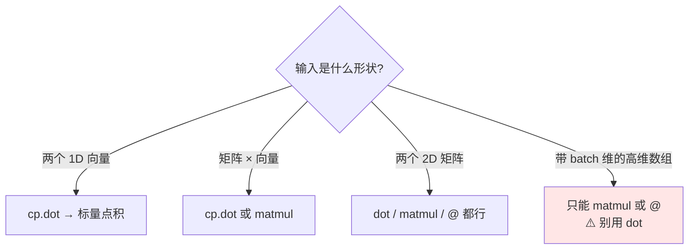
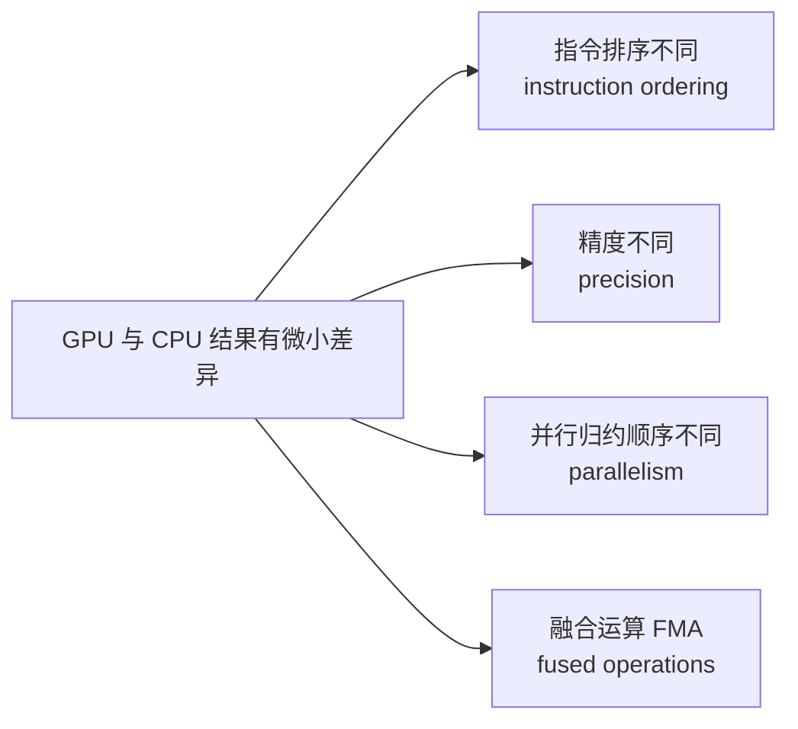
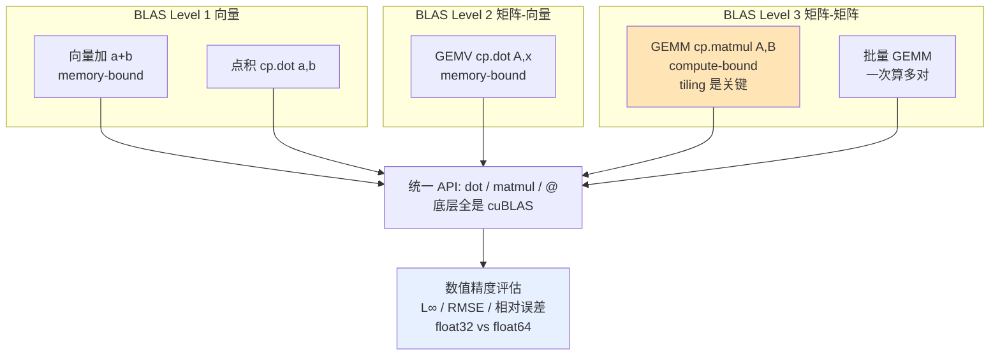

# 第 8 章 🧮 GPU 上的线性代数基础

> 对应原书 *Practical GPU Programming* (Fenlor M., 2025) **Chapter 8: Linear Algebra Essentials on GPU**（PDF 第 167–188 页）
>
> 本章是全书从"手写 kernel"过渡到"用工业级库"的分水岭。前面几章我们亲手写 CUDA kernel、亲手管理线程与内存；这一章我们学会一个更重要的工程判断：**什么时候不要自己写 kernel，而是调用 cuBLAS**。这句话听起来是"偷懒"，其实是高性能计算最核心的一条工程纪律。

---

## 🗺️ 本章地图



**一句话主线**：线性代数（矩阵乘、向量运算）是 GPU 天生擅长的计算模式；`cuBLAS` 是 NVIDIA 官方写好、调优到极致的库；`CuPy` 让你用写 NumPy 的方式无痛调用它；本章教你**怎么用、为什么它比你手写快、以及怎么验证结果对不对**。

学完本章你应该能回答：

1. 为什么我手写的矩阵乘 kernel 比 cuBLAS 慢 5–10 倍？差在哪？
2. `分块 (tiling)`、`寄存器分块 (register blocking)`、`内存合并 (coalescing)` 分别解决什么问题？
3. 要算 1000 对 32×32 的小矩阵，for 循环调 1000 次 matmul 为什么慢，`批量 GEMM` 为什么快一个数量级？
4. `cp.dot`、`cp.matmul`、`@` 有什么区别？什么时候用哪个？
5. GPU 算出来的结果和 CPU 不完全一样，是 bug 吗？怎么判断"够准了"？

---

## 8.0 🔬 第一性原理：为什么线性代数是 GPU 的主场？

在深入 cuBLAS 之前，先想清楚一件事——**为什么整本书讲 GPU，偏偏用一整章讲线性代数？**

> 🔬 **第一性原理**
> GPU 的本质是"海量简单核心 + 极高内存带宽"。它的算力（TFLOPS）只有在**同一条指令作用在成千上万个数据上**（SIMT，Single Instruction Multiple Threads）时才能榨干。而矩阵乘法恰恰是这种模式的完美化身：
> - 一个 $M\times K$ 乘 $K\times N$ 的矩阵乘，输出 $M\times N$ 个元素，**每个元素的计算彼此独立**，可以同时算 → 天然的并行。
> - 计算密度高（compute-bound）：一次数据搬进来，能做 $K$ 次乘加，**算术强度 (arithmetic intensity) 高**，能把内存带宽的钱花在刀刃上。

这就是为什么现代深度学习（Transformer 的注意力、全连接层）、科学计算（有限元、CFD）、图形学（3D 变换）本质上都是**一大堆矩阵乘**。谁把矩阵乘做到极致，谁就掌握了 GPU 性能的命门。而 NVIDIA 自己最清楚自家硬件，于是有了 `cuBLAS`。

| 计算类型 | 并行度 | 算术强度 | GPU 适合度 |
|---|---|---|---|
| 标量循环（如 `for i: s += a[i]`） | 低 | 低 | ❌ 很差 |
| 向量加 `c = a + b` | 高 | **极低**（1 次加/2 次读） | ⚠️ 受带宽限制 |
| 点积 `dot(a,b)` | 高（含归约） | 低 | ⚠️ 受带宽限制 |
| **矩阵乘 GEMM** | **极高** | **高**（$O(N^3)$ 算 / $O(N^2)$ 读） | ✅ **完美** |

> 💡 **实战洞察**：注意上表——向量加法虽然并行度高，但**算术强度极低**（每读 2 个数只做 1 次加法），它是 **memory-bound（受内存带宽限制）** 的；而矩阵乘是 **compute-bound（受算力限制）** 的。这个区别决定了你优化的方向完全不同：memory-bound 要省内存访问，compute-bound 要喂饱计算单元。**这是面试高频考点。**

---

## 8.1 📚 cuBLAS 是什么？—— NVIDIA 的线性代数兵器库

### 8.1.1 是什么（What）

`cuBLAS` 是 **NVIDIA GPU 加速的线性代数库**，从最简单的向量加法，到大规模矩阵-矩阵乘法，全都覆盖。它的每一个例程（routine）都是 NVIDIA 的工程师**亲手编写、亲手调优、亲自维护**的，目的就是把 CUDA 硬件的性能榨到极致——用上专用指令、优化的内存布局、批量并行等你手写很难复现的技巧。

名字拆开看：

- **BLAS** = **B**asic **L**inear **A**lgebra **S**ubprograms（基础线性代数子程序）。这是科学计算领域 1979 年就有的经典 API 标准，凡是搞过 Fortran/MATLAB/NumPy 的人都眼熟。
- **cu** = CUDA。也就是"把经典 BLAS 搬到 GPU 上，并为 GPU 超频加速"。

因为它沿用了科学界人人熟悉的 BLAS API，又为 GPU 做了深度优化，所以 cuBLAS 成了机器学习、仿真、信号处理等**稠密线性代数（dense linear algebra）** 工作负载的**首选（go-to choice）**。

> 📖 **BLAS 三个等级（补充背景，书中未展开但极重要）**
> | Level | 操作类型 | 例子 | 复杂度 |
> |---|---|---|---|
> | **Level 1** | 向量-向量 | `axpy` (y=αx+y)、`dot`（点积） | $O(N)$ |
> | **Level 2** | 矩阵-向量 | `gemv`（矩阵×向量） | $O(N^2)$ |
> | **Level 3** | 矩阵-矩阵 | `gemm`（通用矩阵乘） | $O(N^3)$ |
>
> 本章从 Level 1（向量加/点积）讲到 Level 3（GEMM），正好走完 BLAS 三级台阶。**记住这三个词：`gemv` 和 `gemm` 后面反复出现。** GEMM = GEneral Matrix-Matrix multiplication。

### 8.1.2 为什么它比你手写快？（Why）

书里给了三条硬核理由，我们逐条讲透：



| 理由 | 原文关键词 | 通俗解释 | 你手写时的痛点 |
|---|---|---|---|
| ① 高级技术 | tiling, register blocking, memory coalescing, fusion | 把大矩阵切成小块（tile）塞进共享内存复用；把数据囤在寄存器里减少访存；让线程访问连续内存地址；把多个操作融合成一个 kernel 减少往返 | 你要手动切块、手动管共享内存、手动对齐访问模式，一个细节写错性能就腰斩 |
| ② 硬件自适应 | dynamically adapts to the GPU architecture | 同一个 `gemm` 调用，在不同代 GPU（Volta/Ampere/Hopper）上自动选最优实现，自动用 Tensor Core | 你写死的 block 大小换台卡就不是最优了 |
| ③ 覆盖广 | from vector add to LU decomposition | 上千个例程随手可用，从最基础到 LU 分解这种复杂算法 | 你自己实现 LU 分解要写几百行还容易出数值 bug |

> ⚠️ **常见坑：不要重复造轮子**
> 很多初学者的直觉是"我懂 CUDA 了，矩阵乘我自己写更可控"。**这在生产环境几乎总是错的。** 你手写的 kernel 除非需求极其特殊（非标准数据布局、要和其它算子深度融合），否则**性能、数值稳定性、可维护性三方面都打不过 cuBLAS**。本章后面会用实测数据（5–10× 加速）打脸这种直觉。

> 💡 **面试高频**：面试官问"手写 CUDA GEMM 和 cuBLAS 差距为什么这么大？"——标准答案就是上表三条：**tiling + 共享内存复用降低了访存、寄存器分块提高了计算/访存比、以及在新硬件上用 Tensor Core**。能说出"算术强度"和"Tensor Core"两个词就是加分项。

---

## 8.2 🐍 用 CuPy 调用 cuBLAS —— 像写 NumPy 一样简单

### 什么是 CuPy？

`CuPy` 给了 cuBLAS 一个**无缝的 Python 接口**，让你像调用 NumPy 函数一样调用高性能 GPU 例程。你写的代码几乎和 NumPy 一模一样，只是把 `numpy` 换成 `cupy`（约定俗成缩写 `cp`），数据就跑在 GPU 上，底层自动走 cuBLAS。



> 💡 **心智模型**：`CuPy = NumPy on GPU`。你脑子里的 NumPy 知识 90% 能直接迁移，只是数据在显存里、计算在 GPU 上。这是本章最省心也最实用的一课。

---

## 8.3 🧊 稠密向量运算：向量加法 & 点积（BLAS Level 1）

我们从最简单的向量加法和点积开始热身。书中代码逐行讲解：

```python
import cupy as cp
import numpy as np
import time

N = 1_000_000            # 一百万个元素的向量
a = cp.random.rand(N, dtype=cp.float32)   # 直接在 GPU 上生成随机向量 a
b = cp.random.rand(N, dtype=cp.float32)   # GPU 上生成 b

# ---- 向量加法（逐元素相加）----
start = time.time()
c = a + b               # 底层走 cuBLAS（逐元素并行）
cp.cuda.Stream.null.synchronize()   # ⚠️ 关键！等 GPU 真正算完
elapsed_add = time.time() - start

# ---- 点积（内积）----
start = time.time()
dot_result = cp.dot(a, b)           # cuBLAS 加速的点积
cp.cuda.Stream.null.synchronize()   # 同样要同步
elapsed_dot = time.time() - start

print(f"Vector add (cuBLAS) time: {elapsed_add:.5f} sec")
print(f"Dot product (cuBLAS) time: {elapsed_dot:.5f} sec")
```

**逐行拆解：**

| 代码行 | 干了什么 | 为什么这么写 |
|---|---|---|
| `cp.random.rand(N, dtype=cp.float32)` | 直接在**显存**里生成随机数 | 避免先在 CPU 生成再拷贝，省去 PCIe 传输 |
| `c = a + b` | 逐元素加法，底层是并行 kernel | 语法和 NumPy 一模一样，但跑在 GPU |
| `cp.dot(a, b)` | 一维向量的点积 $\sum_i a_i b_i$ | 走 cuBLAS Level-1 例程 |
| `cp.cuda.Stream.null.synchronize()` | **阻塞等待 GPU 完成** | 见下方⚠️，不写会测出假的"超快"时间 |

> ⚠️ **本章第一大坑：GPU 是异步的，必须 synchronize 才能正确计时！**
> GPU 计算是**异步下发**的——`c = a + b` 这行只是把任务"扔"给 GPU 队列就立刻返回了，GPU 可能还没算完。如果你直接 `time.time()` 减一下，测到的是"下发命令的时间"，**不是真实计算时间**，会得到荒谬的"0.00001 秒算完一百万加法"。
> `cp.cuda.Stream.null.synchronize()` 的作用就是**卡住 CPU，直到 GPU 把当前流（null stream，默认流）里的活全干完**。所有 GPU 计时代码都必须这么写。**这是新手最容易踩的性能测量坑，也是面试常问的"你怎么给 GPU 代码计时"。**

> 🔬 **第一性原理：为什么向量加法在 GPU 上未必"很快"？**
> 一百万次浮点加法，GPU 眨眼就算完。但**瓶颈根本不在算，而在读写内存**：要读 `a`（4 MB）+ 读 `b`（4 MB）+ 写 `c`（4 MB）= 12 MB 内存流量，却只做了 100 万次加法。这就是典型的 **memory-bound**。所以向量加法的性能上限由**显存带宽**决定，而不是算力。理解这点，你就明白为什么"逐元素操作融合（fusion）"能提速——把多个逐元素操作合并成一个 kernel，数据只读写一遍。

---

## 8.4 🎯 稠密矩阵乘 GEMM：手写 kernel vs cuBLAS 的正面对决（BLAS Level 3）

矩阵乘法是 cuBLAS 的**终极舞台（ultimate showcase）**。书里做了一场精彩的对比实验：先用 cuBLAS 算，再手写一个朴素 kernel 算，然后比速度、验正确性。

### 8.4.1 用 cuBLAS 算 GEMM（一行搞定）

```python
M, K, N_ = 2048, 2048, 2048       # 三个 2048×2048 的大矩阵
A = cp.random.rand(M, K, dtype=cp.float32)
B = cp.random.rand(K, N_, dtype=cp.float32)

start = time.time()
C = cp.matmul(A, B)               # cuBLAS 驱动的 GEMM，就这一行！
cp.cuda.Stream.null.synchronize()
elapsed_mm = time.time() - start
print(f"Matrix multiply (cuBLAS) time: {elapsed_mm:.5f} sec")
```

一行 `cp.matmul(A, B)` 就完成了 $2048^3 \approx 86$ 亿次乘加。底层自动走 cuBLAS 的 `gemm`。

### 8.4.2 手写一个"朴素"kernel 做对比

现在我们故意写一个**没有分块、没有共享内存优化**的朴素矩阵乘 kernel，看看差距有多大：

```python
from cupy import RawKernel

matmul_kernel = RawKernel(r'''
extern "C" __global__
void matmul(const float* A, const float* B, float* C,
            int M, int K, int N) {
    int row = blockDim.y * blockIdx.y + threadIdx.y;  // 该线程负责的行
    int col = blockDim.x * blockIdx.x + threadIdx.x;  // 该线程负责的列
    if (row < M && col < N) {
        float sum = 0.0f;
        for (int i = 0; i < K; ++i)                    // 沿 K 维累加
            sum += A[row * K + i] * B[i * N + col];    // C[row][col] += A[row][i]*B[i][col]
        C[row * N + col] = sum;                        // 写回结果
    }
}
''', 'matmul')

C_manual = cp.zeros((M, N_), dtype=cp.float32)
block = (16, 16)                          # 每个 block 16×16=256 线程
grid = (N_ // block[0], M // block[1])    # 网格划分覆盖整个输出矩阵

start = time.time()
matmul_kernel(
    grid, block,
    (A, B, C_manual, np.int32(M), np.int32(K), np.int32(N_))
)
cp.cuda.Stream.null.synchronize()
elapsed_manual = time.time() - start
print(f"Matrix multiply (manual kernel) time: {elapsed_manual:.5f} sec")
```

**逐行拆解这个 kernel：**

| 代码 | 含义 |
|---|---|
| `int row = blockDim.y * blockIdx.y + threadIdx.y` | 计算全局行号：block 在 y 方向的偏移 + 线程在 block 内的 y 偏移 |
| `int col = blockDim.x * blockIdx.x + threadIdx.x` | 计算全局列号（x 方向同理） |
| `if (row < M && col < N)` | 边界检查，防止越界（矩阵尺寸不是 block 整数倍时） |
| `for (int i = 0; i < K; ++i) sum += A[row*K+i] * B[i*N+col]` | **核心**：一个线程算一个输出元素 $C_{row,col}=\sum_i A_{row,i}B_{i,col}$ |
| `C[row * N + col] = sum` | 把累加结果写回 C（行主序展平索引） |

> 🔬 **这个 kernel 慢在哪？（第一性原理拆解）**
> 每个线程要读 $K=2048$ 个 A 元素 + $K$ 个 B 元素才算出 1 个输出。问题是：**相邻线程读了大量重复数据，却各自去慢速的全局内存（global memory）里重复读取**——同一行 A 被这一行所有 col 的线程读了 N 遍，同一列 B 被读了 M 遍。全局内存访问延迟高达几百个时钟周期，这就是性能杀手。
> cuBLAS 的 **tiling（分块）** 就是来治这个病的：把 A、B 的小块（tile）先搬进**共享内存（shared memory，片上高速缓存）**，让一个 block 内的线程**共享复用**这些数据，把对全局内存的重复访问变成对共享内存的复用访问（快 ~100 倍）。见 8.4.4。

### 8.4.3 性能对比与正确性验证

```python
max_diff = cp.max(cp.abs(C - C_manual))
print("Maximum difference between cuBLAS and manual kernel:", max_diff)
print(f"Speedup (cuBLAS / manual): {elapsed_manual / elapsed_mm:.2f}x")
```

**书中给出的典型结论：**

| 观察项 | 结果 |
|---|---|
| 速度 | cuBLAS **通常快 5–10 倍**（than a naive kernel） |
| 精度 | cuBLAS 数值精度很高（`max_diff` 极小，量级 ~$10^{-3}$ 或更小，属浮点正常误差） |
| 规模效应 | **问题越大，差距越大**——大矩阵乘或批量运算时效率鸿沟进一步拉大 |

> 💡 **实战 & 面试高频**：这个 5–10× 的数字要记住。面试时若问"朴素 GEMM 和 cuBLAS 差多少"，答"朴素实现慢一个数量级左右（5–10×），主要输在没有共享内存分块导致的重复全局访存，以及没用 Tensor Core"。注意 `max_diff` 不为 0 是**正常的**——两者浮点累加顺序不同，不是 bug（详见 8.8）。

### 8.4.4 📐 深入：分块（Tiling）到底怎么加速的？

书中反复提到 tiling 是 cuBLAS 快的核心，这里补充一个直观图解（书正文未画，但这是理解本章的钥匙）：



**分块的核心思想**：把 $M\times K$ 和 $K\times N$ 的大矩阵切成若干 $T\times T$ 的小方块。计算某个输出 tile 时，把对应的 A tile 和 B tile **一次性搬进共享内存**，block 内所有线程从共享内存反复取用，算完一对 tile 再搬下一对。这样每个数据从全局内存**只读一次**，之后都在快速的共享内存里复用。

| 技术 | 英文 | 解决的问题 | 收益 |
|---|---|---|---|
| **分块** | Tiling | 重复的全局内存访问 | 数据只读一次，共享内存复用 → 大幅省带宽 |
| **寄存器分块** | Register blocking | 共享内存访问也有开销 | 让每个线程算多个输出元素，把中间值囤寄存器 → 提高计算/访存比 |
| **内存合并** | Memory coalescing | 分散的内存访问浪费带宽 | 让同一 warp 的线程访问连续地址 → 一次事务读一整段 |
| **算子融合** | Operation fusion | 多个 kernel 反复读写内存 | 把 `matmul + bias + relu` 合并成一个 kernel → 少读写几遍 |

> 🔬 **第一性原理**：这四个技术全都在做**同一件事——减少慢速内存（全局内存）的访问次数，提高算术强度**。GPU 的算力（TFLOPS）远远超过它的内存带宽（GB/s），所以高性能 GEMM 的艺术本质是"**如何让搬进来的每个数据被复用更多次**"。这就是 cuBLAS 工程师和你手写 kernel 的真正差距所在。

---

## 8.5 ➗ 矩阵-向量乘 GEMV：PyCUDA 手写 vs cuBLAS（BLAS Level 2）

矩阵-向量乘 $y = A \times x$ 是**神经网络推理、迭代求解器**的骨架操作，无处不在。书里换了个工具——用 **PyCUDA** 手写 kernel，再和 cuBLAS 对比。（PyCUDA 是另一个 Python-CUDA 绑定，比 CuPy 更底层、更贴近手写 CUDA。）

### 8.5.1 准备数据

```python
import numpy as np
import pycuda.autoinit          # 自动初始化 CUDA 上下文
import pycuda.driver as drv
import pycuda.gpuarray as gpuarray
from pycuda.compiler import SourceModule
import cupy as cp
import time

M, N = 2048, 2048
A_host = np.random.rand(M, N).astype(np.float32)   # CPU 上的矩阵
x_host = np.random.rand(N).astype(np.float32)      # CPU 上的向量

A_gpu = gpuarray.to_gpu(A_host)                     # 拷到 GPU
x_gpu = gpuarray.to_gpu(x_host)
y_gpu = gpuarray.zeros(M, dtype=np.float32)         # 输出向量，先清零
```

### 8.5.2 PyCUDA kernel 实现

```python
kernel_code = """
__global__ void matvec(const float *A, const float *x, float *y, int M, int N)
{
    int row = blockIdx.x * blockDim.x + threadIdx.x;   // 一个线程负责一行
    if (row < M) {
        float sum = 0.0f;
        for (int col = 0; col < N; ++col)              // 遍历该行所有列
            sum += A[row * N + col] * x[col];          // y[row] = Σ A[row][col]*x[col]
        y[row] = sum;
    }
}
"""
mod = SourceModule(kernel_code)          # 编译 CUDA 源码
matvec = mod.get_function("matvec")      # 取出 kernel 函数句柄
```

**拆解**：这是个**一维并行**的 kernel——每个线程负责输出向量 `y` 的**一个元素**（即 A 的一整行和 x 做点积）。比 8.4 的二维 GEMM kernel 简单。

### 8.5.3 启动 kernel

```python
threads_per_block = 256
blocks_per_grid = (M + threads_per_block - 1) // threads_per_block   # 向上取整

start = time.time()
matvec(
    A_gpu, x_gpu, y_gpu, np.int32(M), np.int32(N),
    block=(threads_per_block, 1, 1),
    grid=(blocks_per_grid, 1)
)
drv.Context.synchronize()               # PyCUDA 的同步方式
elapsed_pycuda = time.time() - start
y_result_pycuda = y_gpu.get()           # 结果拷回 CPU
```

> 💡 **`(M + threads_per_block - 1) // threads_per_block` 是啥？**
> 这是 CUDA 里**求块数的向上取整**惯用法。M=2048、每块 256 线程，正好 8 块。但如果 M=2050，这个公式给 9 块（多出的线程被 kernel 里的 `if (row < M)` 挡掉），保证覆盖所有行。**记住这个惯用写法，几乎每个 CUDA 程序都用。**

### 8.5.4 用 cuBLAS 做同样的事（一行）

```python
A_cupy = cp.array(A_host)
x_cupy = cp.array(x_host)

start = time.time()
y_cupy = cp.dot(A_cupy, x_cupy)         # 底层走 cuBLAS 的 gemv！
cp.cuda.Stream.null.synchronize()
elapsed_cublas = time.time() - start
y_result_cublas = cp.asnumpy(y_cupy)    # 拷回 CPU
```

`cp.dot(矩阵, 向量)` 自动识别形状，调用 cuBLAS 的 **`gemv`** 例程。

### 8.5.5 对比

```python
max_diff = np.max(np.abs(y_result_pycuda - y_result_cublas))
print("Maximum difference:", max_diff)
print(f"PyCUDA kernel time: {elapsed_pycuda:.5f} sec")
print(f"cuBLAS (CuPy) time: {elapsed_cublas:.5f} sec")
print(f"Speedup (PyCUDA / cuBLAS): {elapsed_pycuda / elapsed_cublas:.2f}x")
```

> 📖 **书中结论**："对于真实应用，稠密的矩阵-向量（和矩阵-矩阵）运算几乎总是首选 cuBLAS，除非你的需求极其特殊或数据布局非标准。它的速度、稳定性、简洁性使其成为 GPU 上科学计算和 ML 的基石。"

> ⚠️ **注意 GEMV 的性质**：矩阵-向量乘 $A(2048\times2048)\times x(2048)$ 里，A 的每个元素**只被用一次**（乘 x 对应元素后就丢弃），没有 GEMM 那样的数据复用机会。所以 GEMV 本质是 **memory-bound**——性能由读 A 的带宽决定。这也是为什么 GEMV 的加速比通常不如 GEMM 那么夸张。理解"哪些操作 compute-bound、哪些 memory-bound"是 GPU 性能分析的核心功力。

---

## 8.6 📦 批量 GEMM：一次算一千对小矩阵

### 8.6.1 为什么需要批量 GEMM？（Why）

很多场景不是算"一对大矩阵"，而是要算"**成百上千对小矩阵**"：

- **小批量神经网络推理**（mini-batch inference）：batch 里每个样本一套矩阵乘
- **3D 图形变换**：大量顶点各自乘变换矩阵
- **物理系统仿真**：许多小系统并行演化

如果你用 for 循环**一对一对地算**，GPU 根本**吃不饱**——每次只给一小撮活干，大量核心闲着，浪费周期、吞吐惨淡。

> 🔬 **第一性原理：小矩阵为什么"喂不饱"GPU？**
> 一个 32×32 的矩阵乘只有 ~3 万次乘加，而现代 GPU 有几千个核心。单独一次 32×32 GEMM，大部分核心是空转的，而且**每次 kernel 启动都有固定开销（launch overhead，几微秒）**。for 循环 1000 次 = 1000 次启动开销 + 1000 次半空跑。批量 GEMM 则把 1000 个任务**一次性提交**，GPU 内部并行调度，把所有核心填满，启动开销也只付一次。

### 8.6.2 准备多个矩阵

```python
import cupy as cp
import numpy as np
import time

batch_size = 1000
M = N = K = 32                                    # 1000 对 32×32 小矩阵
A = cp.random.rand(batch_size, M, K).astype(cp.float32)   # 形状 (1000, 32, 32)
B = cp.random.rand(batch_size, K, N).astype(cp.float32)
```

注意数据形状多了一个 **batch 维度**：`(batch_size, M, K)`。

### 8.6.3 批量 GEMM（CuPy 自动识别）

```python
start = time.time()
C_batched = cp.matmul(A, B)      # 形状 (batch_size, M, N)——一次算完 1000 对！
cp.cuda.Stream.null.synchronize()
elapsed_batched = time.time() - start
```

**关键**：当你对**带匹配 batch 维的高维数组**调 `cp.matmul` 或 `@`，CuPy 自动走 cuBLAS 的**批量 GEMM** 例程。你什么都不用改，只是数据多了个维度。

### 8.6.4 对比：老实用 for 循环逐对算

```python
C_sequential = cp.empty_like(C_batched)
start = time.time()
for i in range(batch_size):
    C_sequential[i] = cp.matmul(A[i], B[i])     # 一次只算一对
cp.cuda.Stream.null.synchronize()
elapsed_sequential = time.time() - start

# 验证 + 测加速比
max_diff = cp.max(cp.abs(C_batched - C_sequential))
print("Maximum difference between batched and sequential:", float(max_diff))
print(f"Batched GEMM time:    {elapsed_batched:.5f} sec")
print(f"Sequential GEMM time: {elapsed_sequential:.5f} sec")
print(f"Speedup: {elapsed_sequential / elapsed_batched:.2f}x")
```

> 📖 **书中结论**：批量 GEMM **持续碾压顺序执行，常常快一个数量级甚至更多**。库在内部并行化这些操作，利用 GPU 架构、重叠内存与计算以达最大利用率。这套方法对各种 batch 大小和矩阵形状都高效，从小实验一路扩展到生产级工作流。

| 方式 | 提交给 GPU | kernel 启动次数 | GPU 利用率 | 相对速度 |
|---|---|---|---|---|
| for 循环逐对 | 一对一对提交 | **1000 次** | 低（大量空转） | 慢（基准） |
| **批量 GEMM** | **一次性提交 1000 对** | **~1 次** | 高（填满核心） | **快 10× 以上** |

> 💡 **面试高频**：这就是深度学习框架里 `torch.bmm`（batched matrix multiply）存在的原因。Transformer 的多头注意力里，每个 head 的 Q·Kᵀ 就是靠批量 GEMM 一次算完所有 head。**"为什么要用 batched matmul 而不是 for 循环"——答：省 kernel 启动开销 + 填满 GPU 提高利用率。**

---

## 8.7 🔧 CuPy 的 `dot`、`matmul`、`@` 三种写法辨析

书里专门用一节讲这三个函数的区别，因为初学者经常搞混。它们**底层都走 cuBLAS**，但适用形状不同。

### 8.7.1 `cp.dot` vs `cp.matmul` 的分工

| 函数 | 支持的操作 | 是否支持批量/广播 | 记忆口诀 |
|---|---|---|---|
| **`cp.dot`** | 向量点积、矩阵×向量、**2D** 矩阵×矩阵 | ❌ 不支持批量 | "点积起家，管到 2D 矩阵乘" |
| **`cp.matmul`** / **`@`** | 矩阵乘，**支持广播和高维批量** | ✅ 支持 | "专业矩阵乘，能批量能广播" |

- `cupy.dot`：根据输入形状，自动做**标量（内）积、矩阵-向量乘、或矩阵-矩阵乘**。
- `cupy.matmul`（等价于 `@` 运算符）：用于矩阵乘，**支持广播和对更高维数组的批量运算**。

用它们的好处：**不用写显式循环，不用管 kernel 启动**，专注科学/数据分析任务，同时全速吃到 GPU 加速。

### 8.7.2 代码示例串讲

```python
import cupy as cp
import numpy as np

# ---- ① 向量点积（标量结果）----
N = 500_000
a = cp.random.rand(N, dtype=cp.float32)
b = cp.random.rand(N, dtype=cp.float32)
dot_result = cp.dot(a, b)                 # 一个标量
print("Dot product:", float(dot_result))

# ---- ② 矩阵-向量乘 ----
M, N = 1024, 1024
A = cp.random.rand(M, N, dtype=cp.float32)
x = cp.random.rand(N, dtype=cp.float32)
y = cp.dot(A, x)                          # 形状 (M,)
print("Matrix–vector result shape:", y.shape)

# ---- ③ 矩阵-矩阵乘：dot / matmul / @ 三种写法等价（2D 时）----
K = 512
B = cp.random.rand(N, K, dtype=cp.float32)
C1 = cp.dot(A, B)          # 写法一
C2 = cp.matmul(A, B)       # 写法二
C3 = A @ B                 # 写法三（@ 运算符，最简洁）
print("Matrix–matrix result shape (dot):", C1.shape)
print("Matrix–matrix result shape (matmul):", C2.shape)
print("Matrix–matrix result shape (@):", C3.shape)

# ---- ④ 批量矩阵乘：只有 matmul/@ 能做，dot 不行！----
batch = 100
A_batch = cp.random.rand(batch, M, N, dtype=cp.float32)
B_batch = cp.random.rand(batch, N, K, dtype=cp.float32)
C_batch = cp.matmul(A_batch, B_batch)     # 形状 (batch, M, K)
print("Batched matrix–matrix shape:", C_batch.shape)
```

> ⚠️ **关键区别（书中原文精髓）**：
> - `cp.dot` 处理向量点积、矩阵-向量、**2D** 矩阵-矩阵三种。
> - `cp.matmul`（和 `@`）**泛化**到 2D 和**更高维（批量）** 数组。
> - **所以：2D 场景三者等价随便用；一旦有 batch 维度，只能用 `matmul`/`@`，`cp.dot` 对高维数组的语义不是你想要的批量乘！**

> 💡 **实战建议**：日常写代码**优先用 `@` 运算符**——最简洁、可读性最好、自动支持批量广播，和 NumPy/PyTorch 习惯完全一致。`cp.dot` 只在你明确要点积或习惯性写法时用。



---

## 8.8 🎯 评估数值精度：GPU 算的结果可信吗？

### 8.8.1 为什么 GPU 和 CPU 结果不完全相同？

书里强调：GPU 加速虽爽，但要确保结果**和传统 CPU 工作流一致可靠**。而现实是——**GPU 和 CPU 的浮点结果常常略有不同**。原因：



> 🔬 **第一性原理：浮点加法不满足结合律！**
> 数学上 $(a+b)+c = a+(b+c)$，但**浮点数不是**——因为每步都有舍入误差，加法顺序不同，累积的舍入误差就不同。GPU 是**大规模并行归约**（成千上万线程分头累加再合并），累加顺序天然和 CPU 的串行顺序不同，所以结果末几位不一样是**必然的、正常的，不是 bug**。
> 再加上 GPU 常用 **FMA（Fused Multiply-Add，融合乘加）**——`a*b+c` 一条指令算完、中间只舍入一次，而分开算 `a*b` 再 `+c` 舍入两次，结果也会差一点点。

### 8.8.2 用标准误差指标衡量差异

书里给出准备相同输入 + 分别 CPU/GPU 计算的代码：

```python
import numpy as np
import cupy as cp

M, N, K = 512, 512, 512
A_cpu = np.random.rand(M, N).astype(np.float32)
B_cpu = np.random.rand(N, K).astype(np.float32)
A_gpu = cp.array(A_cpu)                # 用完全相同的输入
B_gpu = cp.array(B_cpu)

# CPU 结果（NumPy）
C_cpu = np.dot(A_cpu, B_cpu)
# GPU 结果（CuPy，走 cuBLAS）
C_gpu = cp.dot(A_gpu, B_gpu)
C_gpu_cpu = cp.asnumpy(C_gpu)          # 拷回 CPU 才能比较
```

然后计算三种标准误差指标：

```python
abs_diff = np.abs(C_cpu - C_gpu_cpu)
max_error = np.max(abs_diff)                              # ① 最大绝对误差 (L∞)
rmse = np.sqrt(np.mean((C_cpu - C_gpu_cpu) ** 2))        # ② 均方根误差 (L2)
relative_error = rmse / np.linalg.norm(C_cpu)            # ③ 相对误差

print(f"Max absolute error: {max_error:e}")
print(f"Root mean squared error: {rmse:e}")
print(f"Relative error (L2 norm): {relative_error:e}")
```

**三种误差指标详解：**

| 指标 | 英文 / 范数 | 公式 | 含义 | 什么时候关注 |
|---|---|---|---|---|
| **最大绝对误差** | Max Absolute Error（L∞ 范数） | $\max_i \lvert c_i - \hat c_i\rvert$ | 任意对应元素间**最大**的绝对差 | 关心"最坏情况"、单点是否离谱 |
| **均方根误差** | RMSE（L2 范数） | $\sqrt{\dfrac{1}{n}\sum_i (c_i-\hat c_i)^2}$ | 平方差均值再开方，反映**整体**偏差 | 关心整体分布是否偏 |
| **相对误差** | Relative Error | $\dfrac{\text{RMSE}}{\lVert C\rVert}$ | 误差按参考量级**归一化** | **最重要**——大数小数一视同仁 |

> 💡 **为什么相对误差最有用？** 绝对误差 $10^{-2}$ 到底大不大？如果矩阵元素本身是 $10^6$ 量级，那 $10^{-2}$ 微不足道；如果元素是 $10^{-4}$ 量级，那就是灾难。**相对误差把"误差"除以"参考值的量级"，给你一个尺度无关的可信度判断。** float32 的 GEMM 相对误差通常在 $10^{-6} \sim 10^{-3}$ 量级都算正常。

### 8.8.3 float32 vs float64 的取舍

> 📖 **书中建议**：对于更高精度或关键工作流，考虑用 **float64（双精度）**；但要记住**很多消费级 GPU 是为 float32 优化的，跑双精度会慢很多**。

| 精度 | 位数 | 有效数字 | 消费级 GPU 速度 | 何时用 |
|---|---|---|---|---|
| **float32** 单精度 | 32 位 | ~7 位十进制 | **快**（游戏/消费卡的主场） | 深度学习、大多数科学计算 |
| **float64** 双精度 | 64 位 | ~16 位十进制 | **慢很多**（消费卡 FP64 吞吐常是 FP32 的 1/32） | 高精度科学计算、数值敏感的迭代 |

> ⚠️ **常见坑**：在游戏卡（如 RTX 系列）上盲目用 float64 求"更准"，性能可能暴跌几十倍却收益甚微。**先用相对误差判断 float32 是否够用，不够再上 float64**，而不是无脑双精度。数据中心卡（如 A100/H100）的 FP64 才有专门加速。

> 💡 **面试高频**：深度学习里甚至反向操作——用**更低**精度（FP16/BF16/FP8）换速度，配合 Tensor Core 和混合精度训练（mixed precision）。**"精度换速度"是 GPU 计算永恒的权衡主题**，本节的误差评估方法正是你判断"降精度是否安全"的工具。

---

## 8.9 🧩 把本章拼成一张完整图景



---

## 📌 小结

本章我们围绕"**在 GPU 上做线性代数**"建立了从底层到高层的完整认知：

1. **cuBLAS 是 NVIDIA 官方的 GPU 线性代数库**，沿用经典 BLAS API，是稠密线性代数的**首选**。它靠 `tiling（分块）`、`register blocking（寄存器分块）`、`memory coalescing（内存合并）`、`fusion（算子融合）` 四板斧，加上硬件自适应，跑得比手写 kernel 快 **5–10 倍**。

2. **CuPy 让你像写 NumPy 一样调用 cuBLAS**——`cupy` 换 `numpy`，计算自动上 GPU。心智模型：`CuPy = NumPy on GPU`。

3. **我们走完了 BLAS 三级台阶**：
   - Level 1 向量加/点积（memory-bound，瓶颈在带宽）；
   - Level 2 矩阵-向量乘 GEMV（memory-bound，A 只读一次无复用）；
   - Level 3 矩阵-矩阵乘 GEMM（compute-bound，**tiling 复用数据是加速核心**）。

4. **手写 vs cuBLAS 的实测对比**证明：朴素 kernel 慢在**重复的全局内存访问**，cuBLAS 用共享内存分块复用数据取胜。除非需求极特殊，**生产环境总是用 cuBLAS**。

5. **批量 GEMM** 把成百上千对小矩阵**一次性提交**，省下重复的 kernel 启动开销、填满 GPU 核心，比 for 循环快**一个数量级以上**——这正是深度学习 `bmm` 存在的理由。

6. **`dot` / `matmul` / `@` 辨析**：2D 场景三者等价，**带 batch 维只能用 `matmul`/`@`**，日常优先用 `@`。

7. **数值精度评估**：GPU 与 CPU 浮点结果**必然有微小差异**（浮点加法不满足结合律 + FMA + 并行归约顺序），这不是 bug。用 **L∞（最大绝对误差）、RMSE（L2）、相对误差**三把尺子衡量，其中**相对误差最有参考价值**。高精度需求可上 float64，但消费级 GPU 双精度慢很多，要权衡。

8. **贯穿全章的两个第一性原理**：
   - **compute-bound vs memory-bound**——决定你优化的方向（喂饱计算 vs 省内存访问）；
   - **算术强度 / 数据复用**——高性能 GEMM 的本质是"让搬进来的每个数据被复用更多次"。

> ⚠️ **三个最容易踩的坑复盘**：① GPU 异步，计时必须 `synchronize`；② 别无脑手写 GEMM kernel，打不过 cuBLAS；③ GPU/CPU 结果末位不同是正常浮点行为，用相对误差判断而非要求逐位相等。

---

## 🔗 延伸阅读与练习

**动手练习：**

1. 把 8.4 的手写 GEMM kernel 加上**共享内存分块**（16×16 tile），实测能追近 cuBLAS 多少，体会 tiling 的威力。
2. 对向量加法这种 memory-bound 操作，尝试**融合**多个逐元素操作（如 `d = a*b + c`）成一个 CuPy `ElementwiseKernel`，对比未融合版的耗时。
3. 改变批量 GEMM 的 `batch_size`（10 / 100 / 1000 / 10000）和矩阵大小（8×8 / 32×32 / 256×256），画出批量 vs 顺序的加速比曲线，找出"批量优势最明显"的甜区。
4. 同一个 GEMM 分别用 float32 和 float64 跑，对比**速度**和**相对误差**，验证书中"消费卡双精度慢很多"的说法（若你手上是消费级卡）。

**关联章节：**
- 本章的手写 kernel 用到的线程/block/grid 索引、共享内存、`synchronize` 等基础，来自前面的 CUDA 编程章节。
- `tiling`、`memory coalescing` 的更底层机制，与内存层级（全局内存 / 共享内存 / 寄存器）章节相通。
- 批量 GEMM 与 Tensor Core、混合精度，是后续深度学习加速章节的地基。

**进阶资料：**
- NVIDIA cuBLAS 官方文档（`gemm` / `gemv` / `gemmBatched` / `gemmStridedBatched` 的完整参数）。
- CuPy 官方文档的 `cupy.dot` / `cupy.matmul` / `cupy.linalg` 部分。
- 若想深入理解"如何手写一个接近 cuBLAS 的 GEMM"，可搜索经典博客系列 *"How to Optimize a CUDA Matmul Kernel step by step"*，一步步从朴素版优化到 90%+ cuBLAS 性能，是理解本章四板斧的最佳实战。
- 深度学习框架里的对应物：PyTorch `torch.matmul` / `torch.bmm` / `torch.einsum`，底层同样是 cuBLAS/cuBLASLt。
