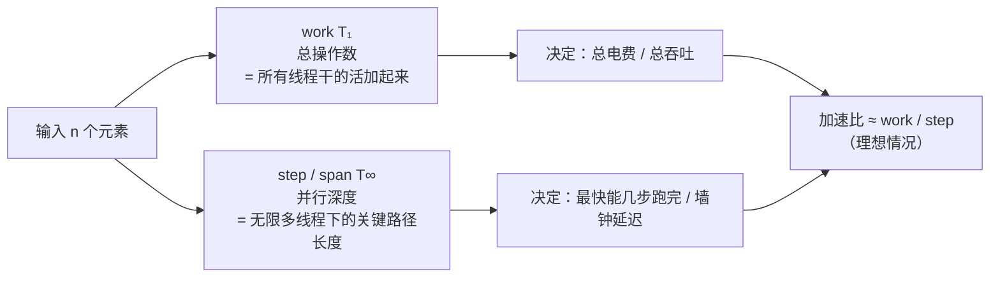
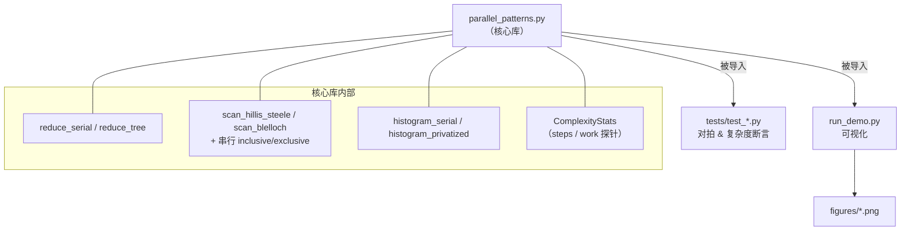
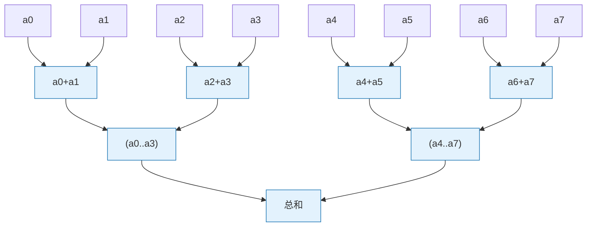
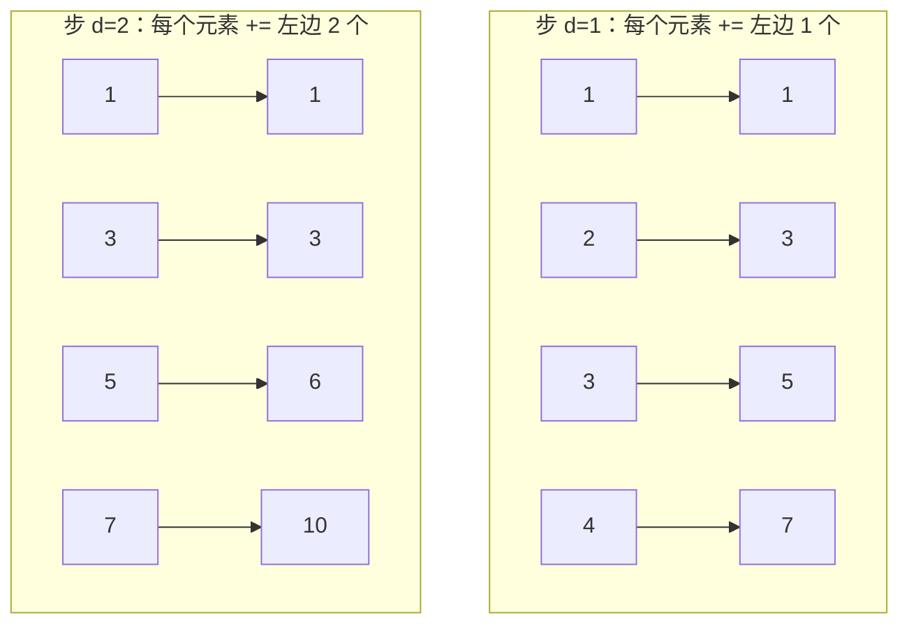
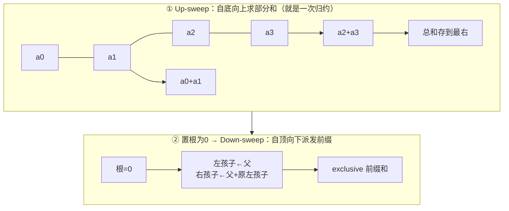
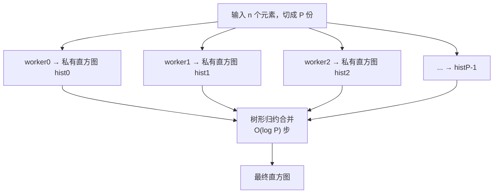
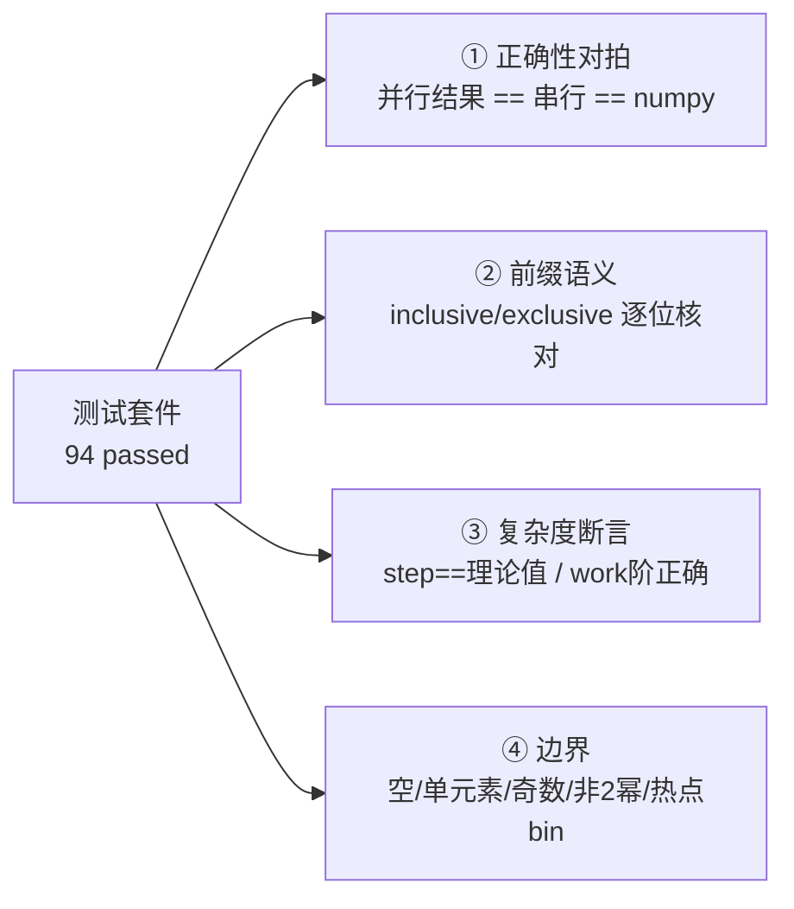

# 🧩 并行模式实验室 (Parallel Patterns Lab)

> 配套《Practical GPU Programming》—— 用 **numpy 模拟 GPU 思路**，把三大并行原语
> **reduction / scan / histogram** 从「串行」重写成「按步并行」，并亲手量出
> **step 复杂度 O(log n)** 与 **work 工作量**，用图看懂「GPU 为什么快」。
>
> 🖥️ 全程 **离线可跑**：Python 3.13 + numpy + matplotlib，**不需要 GPU、不需要 CUDA、不联网**。

---

## 📑 目录

- [0. 一句话看懂这个项目](#0-一句话看懂这个项目)
- [1. 背景：GPU 为什么快？work 与 step 两把尺子](#1-背景gpu-为什么快work-与-step-两把尺子)
- [2. 项目结构](#2-项目结构)
- [3. 如何运行](#3-如何运行)
- [4. 模式一：Reduction（归约，树形）](#4-模式一reduction归约树形)
- [5. 模式二：Scan（扫描 / 前缀和）](#5-模式二scan扫描--前缀和)
- [6. 模式三：Histogram（直方图，私有化）](#6-模式三histogram直方图私有化)
- [7. 测试怎么写、断言了什么](#7-测试怎么写断言了什么)
- [8. run_demo：三张图讲清 O(log n)](#8-run_demo三张图讲清-olog-n)
- [9. 💡 面试高频题速查](#9--面试高频题速查)
- [10. ⚠️ 常见坑合集](#10--常见坑合集)
- [📌 小结](#-小结)
- [🔗 延伸阅读](#-延伸阅读)

---

## 0. 一句话看懂这个项目

在 CPU 上你习惯写 `for` 循环把数组累加成一个数——这是 **串行（serial）**，深度是 `n` 步。
GPU 有成千上万个线程，它不会一个一个加，而是**把加法排成一棵树**，`log₂ n` 步就搞定。

**本项目就是把这个「排成树」的思路用 numpy 显式写出来，并测量它。** 你会得到三样东西：

| 你会拿到 | 具体是什么 |
| --- | --- |
| ✅ **可对拍的实现** | 每个并行模式都配一个串行参考版，`pytest` 逐元素验证「并行结果 == 串行结果」 |
| 📏 **复杂度探针** | 每次运行都记录 `steps`（并行深度）和 `work`（总操作数），并断言它们等于理论值 |
| 📊 **三张图** | `step vs n` 直观对比 `O(log n)` 与 `O(n)`；`work vs n` 揭示「步高效 ≠ 工作高效」 |

---

## 1. 背景：GPU 为什么快？work 与 step 两把尺子

分析并行算法，业界用 **work-span 模型**（也叫 **PRAM 模型** 的两个量）：



- **work（工作量，记 `T₁`）**：假设只有 **1 个处理器**，要做多少次有效操作。衡量「一共要干多少活」。
- **step / span（步数 / 深度，记 `T∞`）**：假设有 **无限多个处理器**，关键路径有多长。衡量「最快几步能完」。

> 🔬 **第一性原理**：一次加法 `a+b` 必须等 `a`、`b` 都就绪。把 `n` 个数两两相加成一棵二叉树，
> 树高就是 `log₂ n`——这是**信息合并的物理下界**，任何比较/加法型归约都逃不掉 `Ω(log n)` 的深度。
> GPU 快，本质是它有足够多的线程把每一层的活**同时**干完，于是墙钟时间正比于**深度**而非**总活**。

**理想加速比 ≈ work / step。** 归约的 work 是 `O(n)`、step 是 `O(log n)`，
所以理论加速比 `≈ n / log n`——`n=100 万` 时约 **5 万倍** 的并行潜力。这就是 GPU 的魔法来源。

| 模式 | work（工作量） | step（并行深度） | 一句话 |
| --- | --- | --- | --- |
| Reduction 树形 | `O(n)` | `O(log n)` | work 不变，深度从 n 砍到 log n |
| Scan Hillis-Steele | `O(n log n)` ⚠️ | `O(log n)` | **步少但活更多**（work-inefficient） |
| Scan Blelloch | `O(n)` ✅ | `O(log n)` | **步少且活也省**（work-efficient，两趟扫描） |
| Histogram 私有化 | `O(n)` | 合并 `O(log P)` | 用私有副本躲开原子争用 |

---

## 2. 项目结构

```
01_parallel_patterns_lab/
├── README.md                      # 你正在读的这份（原理 + 逐行讲解 + 面试点 + 坑）
├── parallel_patterns.py           # 核心：三大模式的串行版 + 并行版 + 复杂度探针
├── run_demo.py                    # 出图：step vs n、work vs n、每步工作量（Agg + 中文字体）
├── requirements.txt               # 依赖（numpy / matplotlib / pytest，全离线）
├── figures/                       # run_demo 生成的 3 张 PNG
│   ├── fig_steps_vs_n.png
│   ├── fig_work_vs_n.png
│   └── fig_work_per_step.png
└── tests/
    └── test_parallel_patterns.py  # 94 个测试：对拍 + 前缀语义 + 复杂度断言 + 边界
```



---

## 3. 如何运行

```bash
# 进入项目目录
cd 01_parallel_patterns_lab

# （可选）安装依赖——本机若已装 numpy/matplotlib/pytest 可跳过
python -m pip install -r requirements.txt

# 1) 跑测试：应显示 94 passed
python -m pytest -q

# 2) 出图 + 打印复杂度对照表：图写入 figures/
python run_demo.py
```

运行 `run_demo.py` 后终端会打印一张对照表（示例 `n=4096`）：

```
====================================================================
 并行模式复杂度对照（示例 n=4096）
====================================================================
模式                        step        work       step阶         work阶
--------------------------------------------------------------------
Reduction (树形)              12        4095    O(log n)          O(n)
Scan Hillis-Steele          12       45057    O(log n)    O(n log n)
Scan Blelloch               24        8190    O(log n)          O(n)
====================================================================
```

> ⚠️ **Windows 终端可能显示中文乱码**（GBK 代码页问题），但**不影响正确性**——
> 图片里的中文是正常的。若想终端也正常，可先执行 `chcp 65001` 切到 UTF-8。

---

## 4. 模式一：Reduction（归约，树形）

### 4.1 是什么

**归约（reduction）** = 用一个满足结合律的二元运算（`+`、`max`、`min`、`&`…）把整个数组合并成一个标量。
求和是最典型的归约。深度学习里 `loss.sum()`、`softmax` 的分母、`LayerNorm` 的均值/方差，底层全是归约。

### 4.2 串行版（对拍基准）

```python
def reduce_serial(x):
    acc = np.array(0.0, dtype=np.float64)
    for v in x:            # 一个一个累加：深度 = n-1，完全串行
        acc = acc + v
    return float(acc)
```

- **work = n-1** 次加法，**step = n-1**（每次加法都依赖上一次的结果，无法并行）。

### 4.3 树形并行版（GPU 标准思路）



上图 `n=8`，只需 **3 步**（`log₂ 8 = 3`）。每一步内的各对加法**彼此独立**，可同时进行。

代码逐行讲解（节选自 `parallel_patterns.py`）：

```python
def reduce_tree(x):
    buf = x.astype(np.float64).copy()   # ① float64 累加，避免 float32 误差，便于严格对拍
    stats = ComplexityStats(n=len(x))
    size = len(buf)
    if size == 0:
        return 0.0, stats                # ② 空数组：归约为 0，0 步

    while size > 1:                       # ③ 每步规模减半，共 ceil(log2 n) 步
        half = size // 2                  #    能配成对的对数
        left  = buf[:half]                # ④ 前半段
        right = buf[half:2 * half]        #    与「中段」配对
        buf[:half] = left + right         # ⑤ 向量化：一条语句 = 同一步内多线程并行加法
        if size % 2 == 1:                 # ⑥ 奇数长度：最后一个落单元素直接搬上来，不参与本步加法
            buf[half] = buf[size - 1]
            size = half + 1
        else:
            size = half
        stats.add_step(half)              # ⑦ 记录：本步做了 half 次加法（= 本步活跃线程数）
    return float(buf[0]), stats
```

- **⑤ 是全篇题眼**：`buf[:half] = left + right` 用一条 numpy 向量化语句，**模拟了「同一步内所有线程同时相加」**。
  在真正的 CUDA kernel 里，这一行对应 `if (tid < half) buf[tid] += buf[tid+half];` 再跟一个 `__syncthreads()`。
- **⑥ 处理奇数长度**：GPU 里也常见——落单的元素（tail）单独搬运，保证不丢数据。

### 4.4 复杂度

| 量 | 值 | 阶 |
| --- | --- | --- |
| step | `ceil(log₂ n)` | **O(log n)** |
| work | `n-1` | **O(n)**（和串行一样，加法总数一个不多） |

> 💡 **实战 / 面试高频**：「树形归约把 work 优化掉了吗？」——**没有**。加法总数还是 `n-1`，
> 优化的是**深度**（step），从 `O(n)` 砍到 `O(log n)`。work 相同、step 更浅 = 用更多线程换更短墙钟时间。

> ⚠️ **常见坑：线程闲置（thread divergence / idle）**。看 `figures/fig_work_per_step.png`：
> 每步活跃线程数减半——第一步 2048 个线程干活，最后一步只剩 1 个。后期大量线程闲着，
> 是归约优化（如 warp-shuffle、`__shfl_down_sync`、多元素/线程 grid-stride）要解决的核心痛点。

---

## 5. 模式二：Scan（扫描 / 前缀和）

### 5.1 是什么

**扫描（scan / prefix sum）** = 输出每个位置「到自己为止」的累积结果。看似简单，却是**并行算法的瑞士军刀**：
流压缩（stream compaction）、基数排序（radix sort）、稀疏矩阵、分配内存偏移……全靠它。

- **inclusive（包含式）**：`y[i] = x[0]+...+x[i]`，含自己。例：`[1,2,3,4] → [1,3,6,10]`。
- **exclusive（排他式）**：`y[i] = x[0]+...+x[i-1]`，不含自己，`y[0]=0`。例：`[1,2,3,4] → [0,1,3,6]`。

> 🔬 **第一性原理**：scan 看起来每个输出都依赖前面所有输入，「天然串行」。但因为 `+` 满足**结合律**，
> 我们可以重新给加法**加括号**，把长链拆成 `log n` 层——这正是并行 scan 的全部秘密：**结合律 = 可重排 = 可并行**。

### 5.2 Hillis-Steele：步高效，工作不省



```python
def scan_hillis_steele(x):
    y = x.astype(np.float64).copy()
    stats = ComplexityStats(n=len(x))
    n = len(y)
    if n <= 1:
        return y, stats
    d = 1
    while d < n:                          # d = 1,2,4,...  共 ceil(log2 n) 步
        prev = y.copy()                   # ★ 双缓冲：先拍旧值快照，避免同一步内读写互相污染
        y[d:] = prev[d:] + prev[:n - d]   # 并行：所有 i>=d 的位置 y[i] = prev[i] + prev[i-d]
        stats.add_step(n - d)             # 本步有 n-d 个位置做加法
        d *= 2
    return y, stats
```

- **★ 双缓冲（double buffering / ping-pong）是最容易踩的坑**：如果就地读写，`y[i]` 更新后又被 `y[i+d]`
  读到，就会算错。GPU 上要么用两块 buffer 交替，要么在 `__syncthreads()` 之间做。这里用 `prev = y.copy()`
  模拟「本步开始时的旧状态」。

**复杂度**：step = `ceil(log₂ n)`（**O(log n)** ✅），work = `Σ(n-d) ≈ n·log n`（**O(n log n)** ⚠️——比串行还多！）

### 5.3 Blelloch：工作高效，两趟扫描

Blelloch 用 **up-sweep（归约建树）+ down-sweep（派发前缀）** 两趟，把 work 压回 `O(n)`，产出 **exclusive** 前缀和。



```python
def scan_blelloch(x):
    stats = ComplexityStats(n=len(x))
    n = len(x)
    if n == 0:
        return np.zeros(0), stats
    m = 1
    while m < n:                           # 补零到最近的 2 的幂（padding，保证完美二叉树）
        m *= 2
    a = np.zeros(m, dtype=np.float64)
    a[:n] = x.astype(np.float64)

    # ---- ① Up-sweep：归约建部分和树 ----
    d = 1
    while d < m:
        idx = np.arange(0, m, 2 * d)              # i = 0, 2d, 4d, ...
        a[idx + 2*d - 1] += a[idx + d - 1]        # 右孩子 += 左孩子
        stats.add_step(len(idx))
        d *= 2

    a[m - 1] = 0.0                                # ★ 置根为 0 —— 造就 exclusive 语义的关键一步

    # ---- ② Down-sweep：派发前缀 ----
    d = m // 2
    while d >= 1:
        idx  = np.arange(0, m, 2 * d)
        left  = idx + d - 1
        right = idx + 2*d - 1
        t = a[left].copy()                        # 暂存左孩子旧值
        a[left]  = a[right]                       # 左孩子 ← 父（= 左侧前缀）
        a[right] = a[right] + t                   # 右孩子 ← 父 + 原左孩子
        stats.add_step(len(idx))
        d //= 2
    return a[:n], stats                            # 截断回原长度
```

- **★ `a[m-1] = 0`** 是 exclusive 的灵魂：把树根（总和）换成 0，向下派发时每个节点收到的就是「它左边所有元素之和」。
- **补零到 2 的幂**：GPU 上极常见的 padding，保证是完美二叉树；最后 `a[:n]` 截断回去。

**复杂度**：step = `2·log₂ m`（**O(log n)** ✅，两趟所以是 2 倍），work = `2(m-1)`（**O(n)** ✅✅，work-efficient）。

### 5.4 两种 scan 怎么选？

| | Hillis-Steele | Blelloch |
| --- | --- | --- |
| step | `log n` | `2 log n` |
| work | `O(n log n)` | `O(n)` |
| 语义 | inclusive | exclusive |
| 常数因子 / 代码复杂度 | 小、简单 | 大、复杂（两趟、索引跳步） |
| **什么时候用** | **数组小 / 单个 warp 内 / 追求最低延迟** | **数组大 / 在意吞吐与能耗** |

> 💡 **面试高频陷阱**：「并行 scan 是 O(log n)，所以一定比串行快？」——要分清是 **step** 还是 **work**。
> Hillis-Steele 的 step 是 `O(log n)`，但 **work 是 `O(n log n)`，比串行 `O(n)` 做的加法更多**。
> 如果没有足够的处理器把这些额外的活并行掉，它在实际硬件上反而可能**更慢、更费电**。
> 「步高效 ≠ 工作高效」正是本项目 `fig_work_vs_n.png` 要你亲眼看到的结论。

---

## 6. 模式三：Histogram（直方图，私有化）

### 6.1 是什么 & 难在哪

**直方图（histogram）** = 统计每个「桶（bin）」里落了多少个元素。图像处理、量化、词频统计都要它。

朴素并行直方图有个致命问题：多个线程同时对同一个 bin 做 `hist[b] += 1`，这是一个
**read-modify-write（读-改-写）**，必须用**原子操作 `atomicAdd`**。当很多元素落进同一个 bin（**热点 bin**），
成百上千个线程排队抢同一个地址——**争用（contention）** 把并行硬生生退化回串行。

### 6.2 私有化（privatization）解法



**思路**：给每个线程 / block 一份**私有副本**，各自**无冲突**累加，最后把 P 份副本用**归约**合并。
把「一个全局热点」拆成「P 个互不干扰的局部计数」，再花 `O(log P)` 步合并。

```python
def histogram_privatized(x, num_bins, num_workers=8):
    stats = ComplexityStats(n=len(x))
    workers = max(1, int(num_workers))
    private = np.zeros((workers, num_bins), dtype=np.int64)   # 每个 worker 一份私有副本
    chunks = np.array_split(np.arange(len(x)), workers)        # 把输入切成 P 段
    for w, idx in enumerate(chunks):
        if len(idx) == 0:
            continue
        vals = x[idx].astype(np.int64)
        # 各 worker 在自己的副本上无冲突累加（bincount 向量化模拟）
        private[w] += np.bincount(vals, minlength=num_bins)[:num_bins]

    # 树形归约合并所有私有副本（沿 worker 维，O(log P) 步）
    size = workers
    buf = private
    while size > 1:
        half = size // 2
        buf[:half] = buf[:half] + buf[half:2 * half]
        if size % 2 == 1:
            buf[half] = buf[size - 1]
            size = half + 1
        else:
            size = half
        stats.add_step(half * num_bins)     # 本步合并 half 份、每份 num_bins 个 bin
    return buf[0].copy(), stats
```

**复杂度**：私有累加阶段 work = `O(n)`；合并阶段 step = `ceil(log₂ P)`（**O(log P)**）。
用私有副本把原子争用降到最低，代价是 **P × num_bins 的额外显存**。

> 💡 **实战 / 面试高频**：这就是 CUDA 里经典的 **shared-memory histogram**——
> 每个 block 在**片上共享内存（shared memory）** 里建私有直方图（快、无全局原子），
> block 内累加完再 `atomicAdd` 到全局。私有化 = 「先局部无冲突、再全局少量合并」。

> ⚠️ **坑 1：bin 数太多**，`P × num_bins` 的私有副本放不进 shared memory → 只能减少并行度或退回全局原子。
> ⚠️ **坑 2：数据倾斜（skew）**，若所有元素都进同一个 bin（见测试 `test_histogram_hot_bin_contention`），
> 私有化仍能正确无损计数，但合并前每个 worker 的那个热点 bin 计数很大——正确性不受影响，负载均衡受影响。

---

## 7. 测试怎么写、断言了什么

`tests/test_parallel_patterns.py` 共 **94 个测试**，四类断言全覆盖：



| 测试 | 验证的命题 |
| --- | --- |
| `test_reduce_tree_matches_serial` | 树形归约结果 == 串行 == `x.sum()`（12 种规模） |
| `test_reduce_step_is_log_n` | 归约 step **恰好** == `ceil(log₂ n)`——**O(log n) 的硬证据** |
| `test_reduce_work_is_n_minus_1` | 归约 work == `n-1`——**work 没被优化掉** |
| `test_hillis_steele_matches_serial_inclusive` | HS 结果 == 串行 inclusive 前缀和 |
| `test_hillis_steele_work_is_superlinear` | HS work == `Σ(n-d)` 且 **> n-1**——**work-inefficient 的硬证据** |
| `test_blelloch_matches_serial_exclusive` | Blelloch == 串行 exclusive（含非 2 的幂，内部补零截断） |
| `test_blelloch_work_is_linear` | Blelloch work == `2(n-1)` **且 < 同规模 HS**——**work-efficient 的硬证据** |
| `test_blelloch_vs_hillis_relationship` | `inclusive[i] == exclusive[i] + x[i]`（两种 scan 互相验证） |
| `test_histogram_matches_serial` | 私有化直方图 == 串行 == `bincount`，且计数守恒 `sum == n` |
| `test_histogram_hot_bin_contention` | 全部落进同一 bin，私有化不丢计数 |
| `test_histogram_merge_step_is_log_workers` | 合并 step == `ceil(log₂ P)` |
| `test_step_grows_logarithmically_not_linearly` | **题眼**：n ×1024，step 只 +10（=log₂1024），不是 ×1024 |

运行结果：

```
$ python -m pytest -q
..............................................................................
..............................
94 passed in 0.11s
```

> 💡 **为什么这些复杂度断言重要**：普通测试只查「结果对不对」，
> 但并行算法的价值在于**深度**。我们把 `steps`/`work` 做成可读探针并写进断言，
> 相当于把「这个算法真的是 O(log n) 深度、O(n) 工作」这件事**用代码钉死**——重构后一眼就知道有没有退化。

---

## 8. run_demo：三张图讲清 O(log n)

`python run_demo.py` 生成到 `figures/`：

### 图1 `fig_steps_vs_n.png` —— step vs n

双对数轴上：串行 `n-1` 是一条 45° 直冲天花板的斜线（`O(n)`）；三条并行曲线几乎**贴地平走**（`O(log n)`）。
`n` 从 2 涨到 65536（×32768 倍），并行 step 只从 1 涨到 16——**这就是 GPU 快的可视化证据**。

### 图2 `fig_work_vs_n.png` —— work vs n

**本项目最反直觉的一张图**：Hillis-Steele 的 work 曲线明显高于 Blelloch 和串行。
它提醒你 —— **「步高效」不等于「工作高效」**。选算法要同时看两把尺子。

### 图3 `fig_work_per_step.png` —— 归约每步工作量

柱状图：`n=4096` 的归约共 12 步，第一步 2048 次加法，逐步减半到最后 1 次。所有柱子加起来 = `4095 = n-1`。
直观展示 GPU 归约后期的**线程闲置**——为什么要用 warp shuffle / grid-stride 去优化尾部。

> ⚠️ **matplotlib 中文/无显示环境坑（本项目已处理）**：
> ① 必须在 `import pyplot` **之前** `matplotlib.use("Agg")`，否则无 GUI 的服务器/CI 会报错或卡住；
> ② `rcParams["font.sans-serif"] = ["Microsoft YaHei","SimHei"]` 才能显示中文，否则中文变「豆腐块 □□□」；
> ③ `rcParams["axes.unicode_minus"] = False`，否则坐标轴负号 `−` 显示异常；
> ④ 避免在图上用 emoji / 下标（`₂`）等 YaHei 缺字的字符——本项目已把图内文字换成 `log2` 等 ASCII 写法。

---

## 9. 💡 面试高频题速查

| 问题 | 要点 |
| --- | --- |
| **work 和 span/step 分别是什么？** | work=总操作数（1 处理器），span/step=关键路径深度（∞ 处理器）；理想加速比 ≈ work/span。 |
| **树形归约的复杂度？** | step `O(log n)`，work `O(n)`。work 没变，深度砍到对数。 |
| **归约为什么要求运算满足结合律？** | 因为要重新加括号（重排合并顺序）才能排成树；`+`/`max`/`min` 可以，减法/除法不行。 |
| **Hillis-Steele vs Blelloch？** | HS：step `log n`、work `O(n log n)`、inclusive、简单；Blelloch：step `2log n`、work `O(n)`、exclusive、work-efficient。 |
| **exclusive scan 怎么由 up/down-sweep 得来？** | up-sweep 建部分和树 → 置根为 0 → down-sweep 派发。置根为 0 是 exclusive 的关键。 |
| **并行直方图的核心难点？** | 多线程写同一 bin 的原子争用（contention）；解法是私有化 + 归约合并（CUDA shared-memory histogram）。 |
| **私有化的代价？** | P × num_bins 的额外内存；bin 太多放不进 shared memory 时受限。 |
| **归约后期线程闲置怎么办？** | 一线程处理多元素（grid-stride）、warp shuffle `__shfl_down_sync` 免同步归约。 |
| **步高效一定更快吗？** | 不一定。work 更多时，若处理器不够多，实际更慢更费电（见 fig_work_vs_n）。 |

---

## 10. ⚠️ 常见坑合集

1. **scan 就地读写污染** → 同一步内 `y[i]` 改了又被读，结果错。用双缓冲 / `prev = y.copy()` 拍旧值快照。
2. **float32 求和误差** → 大数组 float32 归约会有可见误差，导致「并行≟串行」对拍失败。本项目统一用 **float64** 累加。
3. **Blelloch 忘了置根为 0** → 得到的是 inclusive 而非 exclusive，或整体错位。`a[m-1]=0` 不能漏。
4. **非 2 的幂输入** → Blelloch 要求完美二叉树；不补零会索引越界或算错。本项目**补零到 2 的幂再截断**。
5. **奇数长度归约丢尾元素** → 每步配对后要把落单元素搬上来；漏了就少加一个数。
6. **直方图值越界** → `x` 里出现 `>= num_bins` 或负数会写坏内存 / 索引错。上游需保证 `x ∈ [0, num_bins)`。
7. **matplotlib 无显示后端** → 不设 `Agg` 在服务器/CI 上崩；中文不设字体变豆腐块；负号不设 `unicode_minus` 异常。
8. **把 work 优化和 step 优化混为一谈** → 树形归约只优化 step，不优化 work；说反了面试直接扣分。

---

## 📌 小结

- **两把尺子**：`work`（总活）和 `step/span`（并行深度）。GPU 快 = 用海量线程把每层活并行掉，墙钟时间正比于 **step**。
- **Reduction**：把加法排成树，work 不变 `O(n)`、step 砍到 `O(log n)`。结合律是前提。
- **Scan**：`+` 的结合律让「天然串行」的前缀和也能 `O(log n)`。Hillis-Steele 步高效但工作多，Blelloch 两趟换来 work-efficient。
- **Histogram**：私有化把原子争用拆成局部无冲突计数 + `O(log P)` 归约合并，对应 CUDA shared-memory histogram。
- **本项目把这些结论用 94 个测试钉死、用 3 张图画出**——`step` 是对数级、`work` 因算法而异，是「GPU 为什么快」最直观的第一课。

---

## 🔗 延伸阅读

- 📖 《Practical GPU Programming》—— 并行模式（parallel patterns）章节（本项目配套）。
- 📖 《Programming Massively Parallel Processors》(PMPP, Hwu/Kirk) —— reduction / scan / histogram 三章是本项目的 CUDA 对应实现。
- 📄 Blelloch, *Prefix Sums and Their Applications* (1990) —— work-efficient scan 的原始论文。
- 📄 Hillis & Steele, *Data Parallel Algorithms* (CACM 1986) —— Hillis-Steele scan 出处。
- 🔧 CUDA 实战：`cub::DeviceReduce` / `cub::DeviceScan`、Thrust 的 `reduce`/`inclusive_scan`——生产级并行原语库，思路与本项目一致。
- 🧠 warp 级原语：`__shfl_down_sync`（免共享内存的 warp 内归约）、cooperative groups——归约尾部优化的进阶武器。
- 🔗 本仓库姊妹项目：`llm-action/ai-infra/`、`cuda-mastery/`（CUDA 编程逐章精讲 + 6 个算子实战）。

---

> 🧪 **自检记录**：`python -m pytest -q` → **94 passed**；`python run_demo.py` → 生成 3 张 PNG + 打印复杂度对照表。
> 全程离线、无 GPU、无 CUDA、无网络。
