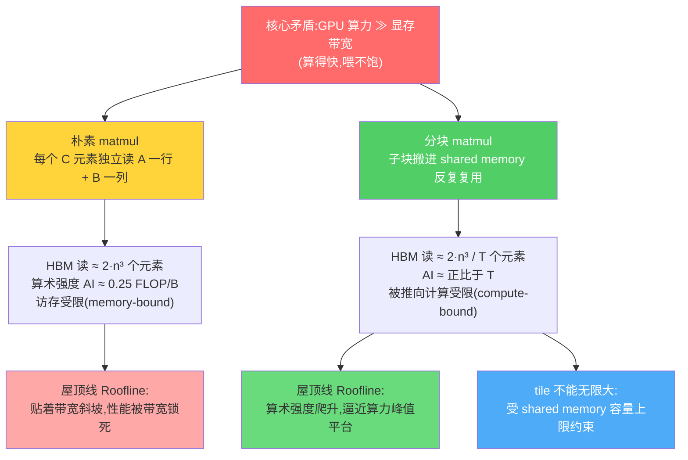
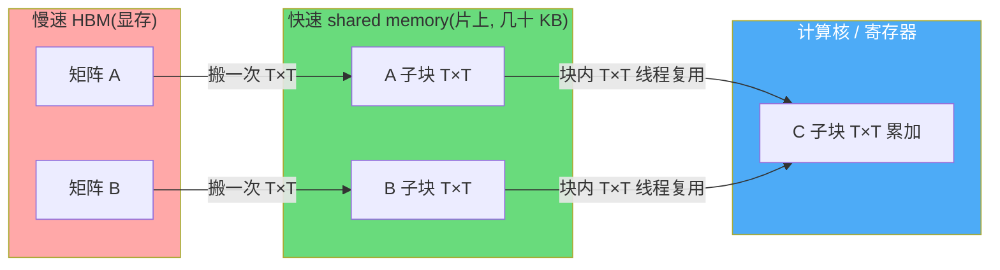
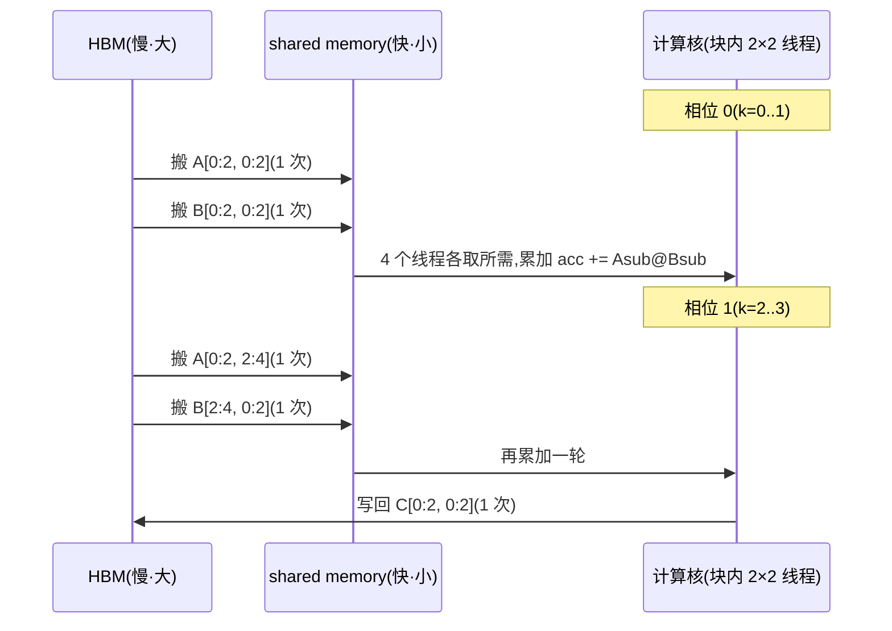
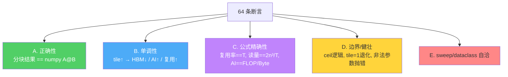

# 🧱 项目 02 · 分块矩阵乘与访存模型(Tiled MatMul & Memory Model)

> 配套《Practical GPU Programming》第 5 章「共享内存分块(Shared Memory Tiling)」。
> **一句话**:同一个 matmul,朴素写法把显存(HBM)带宽撑爆,分块(tiling)写法把数据搬一次、在片上反复用 —— 本项目用**纯 CPU、numpy** 把「分块为什么能减少访存」从**代码**和**公式**两头讲穿,并画成曲线。
>
> 本机环境:Python 3.13 / numpy 2.3 / matplotlib 3.10 / 无 GPU / 无网络。**开箱即跑**。

---

## 🗺️ 本项目地图

在动手前,先把这张图钉进脑子。矩阵乘是深度学习里**最耗算力也最耗带宽**的核心算子,而它恰好是理解「计算 vs 访存」这对永恒矛盾的最佳教具。



| 你将带走的东西 | 对应产物 |
| --- | --- |
| 分块 matmul 的**循环结构**(和 GPU kernel 一一对应) | `tiled_matmul.py::matmul_tiled` |
| 一套能**手算**的访存模型(HBM 量 / 算术强度 / 复用率) | `tiled_matmul.py::analyze` |
| 「tile 越大越省访存,但受 SMEM 上限约束」的**定量证据** | `tests/` 60+ 断言 + `run_demo.py` 曲线 |
| 面试高频:算术强度、roofline、为什么 matmul 要分块 | 本 README 的 💡 小框 |

---

## 📂 目录结构

```
02_tiled_matmul_memory_model/
├── README.md                 # 你正在读的这份(原理 + 逐行讲解 + 面试点 + 坑)
├── tiled_matmul.py           # 核心:分块 matmul + 解析访存模型
├── run_demo.py               # 出图:tile vs HBM/算术强度/复用率 + roofline
├── requirements.txt          # numpy / matplotlib / pytest(全 CPU 离线)
└── tests/
    └── test_tiled_matmul.py  # 64 条断言:正确性/单调性/公式/边界
```

---

## 🚀 如何运行

```bash
# 1) 进入项目目录
cd book-practical-gpu-programming/projects/02_tiled_matmul_memory_model

# 2)(可选)装依赖 —— 本机通常已装
pip install -r requirements.txt

# 3) 跑测试:必须全绿(本机 64 passed)
python -m pytest -q

# 4) 出图 + 打印对照表:生成 3 张 PNG
python run_demo.py
```

运行 `run_demo.py` 后会得到:

- `fig1_hbm_vs_tile.png` —— HBM 访问量随 tile 增大而**指数级下降**(双对数轴,直线下滑)。
- `fig2_intensity_reuse.png` —— 算术强度 & 复用率随 tile **上升**(双 Y 轴)。
- `fig3_roofline.png` —— 屋顶线:naive 点贴在带宽墙上,分块点一路爬向算力峰值。

> ⚠️ **中文乱码坑**:终端里表头/字段可能显示成乱码,那只是 **Windows 控制台的 GBK 编码**在作怪,**文件本身与图片里的中文都是正常的 UTF-8**。图里中文能正常显示,靠的是 `run_demo.py` 顶部这三行:
> ```python
> matplotlib.use("Agg")                                  # 无界面后端,直接写文件
> plt.rcParams["font.sans-serif"] = ["Microsoft YaHei", "SimHei"]
> plt.rcParams["axes.unicode_minus"] = False             # 负号正常显示
> ```

---

## 🔬 第一性原理:为什么 matmul 一定要分块?

### 1. GPU 的「贫富差距」:算力富,带宽穷

先记住一个数量级事实(以一块典型数据中心 GPU 为例,数字仅示意):

- **算力(compute)**:几十 TFLOP/s ~ 上百 TFLOP/s(fp32)。
- **显存带宽(HBM bandwidth)**:几百 GB/s ~ ~3 TB/s。

两者一比,你会发现:**每从显存读 1 个字节,硬件其实"有空"做几十次浮点运算**。如果你的 kernel 每读 1 字节只算了 0.25 次浮点(这正是朴素 matmul!),那**算力单元大部分时间在饿肚子等数据** —— 这就叫 **访存受限(memory-bound)**。

> 💡 **算术强度(Arithmetic Intensity, AI)** 是这一切的度量衡:
> $$ \text{AI} = \frac{\text{浮点运算次数 (FLOPs)}}{\text{从 HBM 搬运的字节数 (Bytes)}} \quad [\text{FLOP/Byte}] $$
> AI 越低越「费带宽」,AI 越高越「吃算力」。**优化 kernel 的一大目标就是抬高 AI**。

### 2. 朴素 matmul 的访存为什么爆炸?

看这段最朴素的实现(`tiled_matmul.py::matmul_naive`,刻意写成三重循环,好让你**数得出访存**):

```python
C = np.zeros((M, N))
for i in range(M):
    for j in range(N):
        acc = 0.0
        for k in range(K):
            acc += A[i, k] * B[k, j]   # ← 每步读 2 个「全局内存」元素
        C[i, j] = acc
```

**逐行数访存**:

- 内层 `k` 循环走 $K$ 步,每步读 `A[i,k]` 和 `B[k,j]` 共 **2 个元素**。
- 一个 `C[i,j]` 要读 $2K$ 个元素;整个 `C` 有 $M \cdot N$ 个元素。
- **总读入 = $2 \cdot M \cdot N \cdot K$**。方阵 $M=N=K=n$ 时就是 **$2n^3$**。

而 FLOPs 只有 $2 \cdot M \cdot N \cdot K$(每个 C 元素做 $K$ 乘 + $K$ 加)。于是:

$$ \text{AI}_{\text{naive}} = \frac{2 M N K \cdot \text{FLOP}}{2 M N K \cdot \text{elem} \times \text{dtype\_bytes}} = \frac{1}{\text{dtype\_bytes}} $$

fp32 是 4 字节 → **AI ≈ 0.25 FLOP/Byte**,这正是 `run_demo.py` 打印出的 naive 值!**0.25 意味着每搬 4 字节才算 1 次浮点** —— 带宽被撑爆,算力闲置。

> 🔬 **本质**:朴素写法里,`A[i,k]` 这个元素在算 `C[i,0], C[i,1], ..., C[i,N-1]` 时**被重复读了 N 次**(每次都从慢速全局内存拉),完全没利用「同一行会被同一批输出复用」这个事实。**分块就是来拯救这个浪费的。**

### 3. 分块 matmul:搬一次,用很多次



思想:把输出 $C$ 切成 $T \times T$ 的小块,一个「线程块」负责算一个 $C$ 子块。沿内维 $K$ 分阶段推进,每阶段:

1. 把 $A$ 的一个 $T\times T$ 子块、$B$ 的一个 $T\times T$ 子块**从 HBM 搬进 shared memory 各一次**;
2. 块内 $T\times T$ 个线程**共享**这两个子块,做一次小矩阵乘累加到 $C$ 子块。

关键在于**复用**:一个 $A$ 子块被这一「块行」上的 $\lceil N/T\rceil$ 个输出块复用;一个 $B$ 子块被这一「块列」上的 $\lceil M/T\rceil$ 个输出块复用。于是每个 $A/B$ 元素从 HBM 读入的次数从「$N$ 次 / $M$ 次」降到「$\lceil N/T\rceil$ 次 / $\lceil M/T\rceil$ 次」。方阵整除时:

$$ \text{read}_{\text{tiled}} = \underbrace{n^2 \cdot \frac{n}{T}}_{A} + \underbrace{n^2 \cdot \frac{n}{T}}_{B} = \frac{2n^3}{T} $$

**相比朴素的 $2n^3$,分块把 HBM 读整整除以了 $T$。** 复用率、算术强度也随之乘以约 $T$。这就是分块的全部魔法,**一条 $1/T$ 曲线**。

### 4. 手把手算一个具体例子(把公式落到数字)

抽象公式看着容易忘,我们用一个**小到能手算**的方阵把每一步钉死:$n=4$,$T=2$,fp32(4 字节)。

**朴素方案**:每个 $C[i,j]$ 读 $A$ 第 $i$ 行($4$ 个)+ $B$ 第 $j$ 列($4$ 个)= $8$ 个元素;$C$ 共 $4\times4=16$ 个元素。

$$ \text{read}_{\text{naive}} = 16 \times 8 = 128 = 2 n^3 = 2\times4^3 \checkmark $$

**分块方案**($T=2$):$C$ 切成 $2\times2$ 个输出块(共 $4$ 块)。算一个输出块,沿 $K$ 分 $\lceil4/2\rceil=2$ 个阶段,每阶段搬一个 $A$ 子块($2\times2=4$ 元素)+ 一个 $B$ 子块($4$ 元素)。

$$ \text{read}_{\text{tiled}} = \underbrace{4\ \text{输出块}}_{} \times \underbrace{2\ \text{阶段}}_{} \times \underbrace{(4+4)\ \text{元素}}_{A\text{子块}+B\text{子块}} = 64 = \frac{2n^3}{T} = \frac{128}{2}\ \checkmark $$

**复用率** $= 128/64 = 2 = T\ \checkmark$;**FLOPs** 两方案都是 $2\times4^3=128$;**算术强度**(本项目的 AI 分母含读+写,更贴近真实):朴素 $128/((128+16)\times4)=128/576\approx0.222$,分块 $128/((64+16)\times4)=128/320=0.40$。你可以把这几个数丢进 `analyze_square(4, 2)` 逐字段核对 —— 测试里就是这么干的。

> ⚠️ **一个易混点**:前文「AI≈0.25」是**只算读**的近似($\frac1{\text{dtype\_bytes}}$),用来讲直觉;而 `analyze` 里的 AI **分母是读+写总字节**,所以小矩阵上会略低于 0.25($n$ 越大,写量 $M N$ 相对读量 $2n^3$ 越可忽略,两者越接近)。两种口径都对,别混着比。

> 🔬 **本质复盘**:朴素方案里 $A[0,0]$ 被 $C[0,0..3]$ 各读一次共 **4 次**;分块方案里它所在的 $A$ 子块只被搬进 shared memory **2 次**($\lceil N/T\rceil=2$),块内两个输出列共享。**读的次数从 4 降到 2,正好是复用率 $T=2$。**

### 5. 一次分块 kernel 的「相位循环」时序

把上面 $n=4,T=2$ 里**左上角那个输出块** $C[0{:}2, 0{:}2]$ 的计算过程,按 GPU kernel 的相位(phase)展开:



数一数这个块的 HBM 访问:$2$ 相位 $\times$($1$ 个 $A$ 子块 $+1$ 个 $B$ 子块)$\times 4$ 元素 $= 16$ 元素读 $+ 4$ 元素写。四个输出块合计 $64$ 读 —— 与上面公式**分毫不差**。这张时序图就是 `matmul_tiled` 里 `for k0 in range(0, K, tile)` 那层循环的「慢动作回放」。

### 6. ⚠️ 分块的暗礁:Bank Conflict(共享内存的隐藏成本)

分块把数据搬进了 shared memory,但 shared memory **不是随便怎么访问都一样快**。它被切成若干个 **bank**(NVIDIA 上通常是 32 个),一个 warp(32 线程)若在同一周期访问**落在同一个 bank 的不同地址**,就会**串行化(bank conflict)**,快内存瞬间变慢。

- **典型触发**:朴素地按列访问一个 $T\times T$ 的 shared 数组,当 $T$ 是 32 的倍数时,一列上的元素恰好落进同一个 bank → 32 路冲突,慢 32 倍。
- **经典解法**:**padding**,把 shared 数组声明成 `tile[T][T+1]`,多出一列把地址错开,冲突消失。

本项目是**访存量模型**,不建模 bank conflict 的**时间**代价(那属于更细的性能模拟),但你必须知道:**「HBM 访问量降下来」只是第一步,片上访问是否高效是第二道关**。这也是为什么真实 tile 常取 16/32 而非理论上限 —— 既要装得下,又要 bank 友好。

> 💡 **面试点**:被问「分块后还有什么坑?」,答 **bank conflict + occupancy 下降**。tile 越大,shared memory 占用越多,每个 SM 能同时驻留的线程块越少,延迟隐藏变差 —— 所以分块是「省 HBM 带宽」和「保 occupancy」之间的权衡,不是越大越好。

---

## 🧩 核心代码逐行讲解:`tiled_matmul.py`

### (1) 分块计算 `matmul_tiled` —— 复刻 GPU kernel 的循环骨架

```python
def matmul_tiled(A, B, tile):
    M, K = A.shape
    K2, N = B.shape
    C = np.zeros((M, N))
    for i0 in range(0, M, tile):        # ← 输出块的「块行」
        i1 = min(i0 + tile, M)          #   边界截断:最后一块可能不满 T
        for j0 in range(0, N, tile):    # ← 输出块的「块列」
            j1 = min(j0 + tile, N)
            acc = np.zeros((i1 - i0, j1 - j0))
            for k0 in range(0, K, tile):        # ← 沿内维 K 的「阶段」循环
                k1 = min(k0 + tile, K)
                Asub = A[i0:i1, k0:k1]  # 「搬进 shared memory」的 A 子块
                Bsub = B[k0:k1, j0:j1]  # 「搬进 shared memory」的 B 子块
                acc += Asub @ Bsub       # 子块在「片上」高速累乘
            C[i0:i1, j0:j1] = acc
    return C
```

逐行读:

- **`for i0 ... for j0`**:两层外循环遍历每个输出 $C$ 子块的左上角。这对应 CUDA 里 `blockIdx.y / blockIdx.x` 定位「这个线程块负责哪个输出块」。
- **`i1 = min(i0+tile, M)`**:**边界处理**。矩阵尺寸不必被 `tile` 整除,最后一块自动截断成不满 $T$ 的小块 —— 真实 kernel 里靠 `if (row < M)` 边界判断实现,这里靠 `min` 截断,效果一致。
- **`for k0 ... `**:内维分阶段推进。这正是 CUDA 分块 kernel 里那个 `for (int ph = 0; ph < K/T; ph++)` 的「相位循环」。
- **`Asub = A[i0:i1, k0:k1]`**:一次 numpy 切片 = 一次「把子块从 HBM 搬进 shared memory」。**注意每个子块在这段循环里只被切一次**,却参与了块内所有输出元素的计算 —— 这就是复用。
- **`acc += Asub @ Bsub`**:子块进片上后的高速小矩阵乘。我们用 numpy 的 `@` 代表「片上算力」,所以**数值结果与 `A @ B` 完全一致**(测试保证)。

> ⚠️ **坑 1:浮点累加顺序**。分块把大点积拆成若干小段再相加,累加顺序与朴素三重循环不同 → 结果可能在最后几位 bit 上有极小差异。所以测试用 `np.allclose(..., rtol=1e-10)` 而**不是** `==`。这在真实 GPU 上同样存在,是「为什么 GPU 结果和 CPU 差一点点」的常见根因之一。

> ⚠️ **坑 2:不要以为这段代码"快"**。它的价值是**行为可读**、**访存可数**,不是性能。真正的加速发生在 GPU 上把子块放进物理 shared memory。CPU 上 numpy 的 `A @ B` 已经调了 BLAS,比这段循环快得多。

### (2) 解析访存模型 `analyze` —— 不跑 kernel,用公式定量

这是本项目的「大脑」。它**不真正搬数据**,而是把上面推的公式写成代码,输入维度和 tile,输出一张 `MemoryModel` 报告:

```python
if scheme == "naive":
    read_elems = 2.0 * M * N * K              # 每个 C 元素读 2K,共 M*N 个
else:  # tiled
    n_col_blocks = (N + tile - 1) // tile     # ceil(N/T):A 每元素被读几次
    n_row_blocks = (M + tile - 1) // tile     # ceil(M/T):B 每元素被读几次
    read_A = float(M * K) * n_col_blocks       # A 的总读入
    read_B = float(K * N) * n_row_blocks       # B 的总读入
    read_elems = read_A + read_B

ai = flops / hbm_bytes_total                    # 算术强度
reuse = (2.0*M*N*K) / read_elems                # 复用率 = 朴素读量 / 实际读量
```

逐行讲透:

- **`(N + tile - 1) // tile`** 是**整数版 `ceil(N/T)`** 的标准写法。为什么用 ceil?因为 $N$ 不被 $T$ 整除时,最后一列块也要完整读一次子块 —— **向上取整才是真实的访存次数**。
- **`read_A = M*K * ceil(N/T)`**:$A$ 有 $M\cdot K$ 个元素,每个被读 $\lceil N/T\rceil$ 次(它所在块行对应多少个输出块列)。$B$ 对称。
- **`reuse = 2·M·N·K / read_elems`**:以「朴素读量」为分母基线,衡量「一个搬入元素平均被算了几次」。方阵整除时精确 $= T$(测试 `test_reuse_factor_equals_tile_when_divisible` 逐个校验)。
- **`ai = flops / hbm_bytes_total`**:FLOPs 与方案无关(恒 $2MNK$),分母随分块骤降,所以 AI 被抬高约 $T$ 倍。

`MemoryModel` 是个 `frozen dataclass`(不可变),把 FLOPs / HBM 读写 / 算术强度 / 复用率一次性打包返回,方便测试逐字段核对、方便 `run_demo` 画图。

### (3) `max_tile_for_smem` —— tile 为什么不能无限大?

```python
def max_tile_for_smem(smem_bytes, dtype_bytes=4, num_tiles=2):
    # 同时放 A、B 两个 T×T 子块:num_tiles * T^2 * dtype_bytes <= smem
    # → T <= sqrt(smem / (num_tiles * dtype_bytes))
    t = int(np.floor(np.sqrt(smem_bytes / (num_tiles * dtype_bytes))))
    return max(1, t)
```

分块 kernel 通常把 $A$、$B$ 两个子块**同时**放进 shared memory,占用 $2T^2 \cdot \text{dtype}$ 字节。片上 shared memory 很小(典型 48KB~228KB/SM),所以 $T$ 有物理上限。

代入 48KB / fp32 / 2 子块:$T \le \sqrt{48\cdot1024 / (2\cdot4)} \approx 78$。这就是曲线上「tile 再大也没意义」的那道墙 —— **你不可能把整个 1024×1024 的矩阵塞进 48KB**。

> 💡 **面试高频**:「分块 tile 选多大?」标准答案分三层:① 受 **shared memory 容量**上限(本函数);② 受 **occupancy** 制约(tile 越大,每 SM 能同时驻留的线程块越少,延迟隐藏变差);③ 常取 **16 或 32**(与 warp=32 对齐,且 32×32×4B×2 = 8KB,留足余量给多个块驻留)。所以实践里很少真取到理论上限 78,而是 16/32 这种「甜点值」。

---

## 🧪 测试讲解:`tests/test_tiled_matmul.py`(本机 64 passed)

测试分五组,每组回答一个「凭什么相信这个模型」的问题:



| 组 | 代表用例 | 断言的本质 |
| --- | --- | --- |
| A 正确性 | `test_tiled_equals_numpy`(6 形状 × 6 tile 参数化) | 分块 + 边界截断后结果仍 `allclose(A@B)`;含 `10×7×13` 互质、`K=1`、`tile>矩阵` 等极端 |
| B 单调性 | `test_hbm_read_strictly_decreases_with_tile` | tile 从 1→256,HBM 读**严格**逐步下降 |
| B 单调性 | `test_arithmetic_intensity_increases_with_tile` | AI 严格上升 —— 定量证明「走向计算受限」 |
| B 上限 | `test_smem_upper_bound_caps_useful_tile` | 容量↑ tile 上限↑;dtype↑ tile 上限↓;放进去恰不超容 |
| C 公式 | `test_reuse_factor_equals_tile_when_divisible` | 整除时复用率**精确等于 $T$**(12 个 tile 值) |
| C 公式 | `test_tiled_read_elems_closed_form_divisible` | 读量精确 $= 2n^3/T$ |
| C 公式 | `test_arithmetic_intensity_definition` | AI 逐字段 $=$ FLOPs / HBM总字节 |
| D 边界 | `test_non_divisible_tile_uses_ceil` | $n{=}10,T{=}3$ → $\lceil10/3\rceil{=}4$ → 读量 800,比整除近似 $666.7$ 偏大(正确) |
| D 退化 | `test_tile_one_tiled_equals_naive_read` | $T{=}1$ 的分块读量退回朴素 $2n^3$,复用率 $=1$ |
| D 健壮 | `test_invalid_tile_raises` / `test_inner_dim_mismatch_raises` | 非法 tile、内维不匹配、非二维 → 抛 `ValueError` |

> 💡 **为什么要测「非整除用 ceil」?** 因为教科书上都写 $2n^3/T$,那是**整除近似**。真实矩阵尺寸五花八门,漏掉 ceil 会**低估访存**,在带宽预算里埋雷。`test_non_divisible_tile_uses_ceil` 就是钉死这一点:$n{=}10,T{=}3$ 时真实读量是 $2\times10^2\times\lceil10/3\rceil = 800$,而不是 $2000/3\approx667$。

跑测试:

```bash
python -m pytest -q
# ................................................................  [100%]
# 64 passed in 0.15s
```

---

## 📊 `run_demo.py` 输出解读

终端会先打印一张对照表(方阵 $n=1024$,fp32),核心数字:

| tile T | HBM 读 | 算术强度 AI | 复用率 |
| ---: | ---: | ---: | ---: |
| naive | 8.00 GB | 0.25 FLOP/B | 1.0× |
| 8 | 1.00 GB | 1.99 FLOP/B | 8.0× |
| 16 | 512 MB | 3.97 FLOP/B | 16.0× |
| 32 | 256 MB | 7.88 FLOP/B | 32.0× |
| 64 | 128 MB | 15.52 FLOP/B | 64.0× |
| 128 | 64 MB | 30.12 FLOP/B | 128.0× |

**读法**:每把 tile 翻倍,HBM 读量**减半**、复用率和 AI **翻倍** —— 一条干净的 $1/T$ 与 $T$ 对偶曲线。naive 那一行 AI = 0.25,正是「每 4 字节才算 1 次浮点」的带宽灾难。

> ⚠️ **坑 3:表里 tile=1024 时读量只有 8MB,是不是"越大越好、无脑取满"?** 不是!$T=1024$ 意味着把整个 $1024\times1024$ 的子块塞片上,需要 $2\times1024^2\times4\text{B} = 8\text{MB}$ shared memory —— 而真实 SM 只有几十 KB。表的最后一行 `48KB SMEM 下最大方形 tile ≈ 78` 就是提醒你:**曲线右端是"物理上不可达"的理想区**。真实收益止步于 SMEM 上限。

三张图:

- **fig1(HBM vs tile)**:双对数轴上是一条**下滑直线**(斜率 −1,即 $1/T$),配一条 naive 基线(红虚线)和 SMEM 上限竖线(绿点线)。
- **fig2(AI & 复用率 vs tile)**:双 Y 轴,两条上升曲线,直观展示「分块把 kernel 从访存受限推向计算受限」。
- **fig3(roofline)**:naive 点死死贴在带宽斜坡上(被带宽锁死),tile=16/32/64/128 的点一路右移、逼近算力峰值平台。这是**面试白板最爱画的一张图**。

---

## 🧠 深入:把这套模型接到真实硬件(选读)

模型输出的是「元素/字节/强度」这些**与设备无关**的量。要落到「这个 kernel 在某块卡上大概多快」,再乘上两个硬件常数即可:

$$ T_{\text{mem}} = \frac{\text{HBM 字节}}{\text{带宽 (B/s)}}, \qquad T_{\text{compute}} = \frac{\text{FLOPs}}{\text{峰值算力 (FLOP/s)}} $$

$$ T_{\text{kernel}} \approx \max(T_{\text{mem}},\ T_{\text{compute}}) \quad(\text{理想重叠下取较大者}) $$

- 当 $T_{\text{mem}} > T_{\text{compute}}$ → **访存受限**,优化方向是**抬 AI**(分块、融合算子、用更小 dtype 时反而降 AI 要小心)。
- 当 $T_{\text{compute}} > T_{\text{mem}}$ → **计算受限**,优化方向是**提利用率**(Tensor Core、更好的指令排布)。

**分块的作用,就是把 matmul 从左边(访存墙)搬到右边(算力平台)。** roofline 的脊点算术强度 $= \text{峰值算力} / \text{带宽}$,只有 AI 超过脊点,kernel 才可能吃满算力 —— 而朴素 matmul 的 AI=0.25 离脊点(常在 20~40)差着近两个数量级,这就是**为什么 matmul 必须分块**的终极量化答案。

> 🔬 **本质一句话**:分块不改变**做多少计算**(FLOPs 恒定),只改变**为此要搬多少数据**(HBM 骤降 $T$ 倍)。它是一次纯粹的「访存换片上存储」的交易 —— 用宝贵但极快的 shared memory,买下宝贵的 HBM 带宽。

### (可选)torch 对照片段

本机装了 torch 2.12(CPU),可以顺手验证「分块结果 == torch matmul」(核心与测试**不依赖** torch):

```python
import torch, numpy as np
from tiled_matmul import matmul_tiled
A = np.random.randn(64, 48); B = np.random.randn(48, 32)
mine  = matmul_tiled(A, B, tile=16)
torch_ref = (torch.from_numpy(A) @ torch.from_numpy(B)).numpy()
print(np.allclose(mine, torch_ref, rtol=1e-10))   # True
```

---

## 💡 面试高频问答速记

| 问题 | 一句话答案 |
| --- | --- |
| 朴素 matmul 为什么慢? | AI 只有 $1/\text{dtype\_bytes}$(fp32≈0.25),**访存受限**,算力单元饿死等数据 |
| 分块(tiling)省的是什么? | 省 **HBM 带宽**:把 $A/B$ 子块搬进 shared memory 复用,HBM 读从 $2n^3$ 降到 $2n^3/T$ |
| 复用率 = ? | 方阵整除时 **精确等于 tile 边长 $T$** |
| 算术强度公式? | $\text{AI} = \text{FLOPs} / \text{HBM 字节}$;分块把它抬高约 $T$ 倍 |
| tile 选多大? | 受 **SMEM 容量**(≈$\sqrt{\text{smem}/(2\cdot\text{dtype})}$)与 **occupancy** 双重约束,实践常取 **16/32**(对齐 warp) |
| FLOPs 会因分块变化吗? | **不会**,恒为 $2MNK$;变的只有访存量 |
| roofline 的脊点? | $\text{AI}_{\text{ridge}} = \text{峰值算力}/\text{带宽}$;AI 越过它才可能计算受限 |
| 分块和 FlashAttention 有啥关系? | FlashAttention 本质就是**对 attention 的 $QK^\top V$ 做分块 + 在线 softmax**,靠分块把 $O(n^2)$ 的中间矩阵**不落 HBM**,同一套「搬一次片上复用」思想 |

---

## ⚠️ 常见坑合集

1. **用 `==` 比较分块与直接 matmul 结果** → 浮点累加顺序不同,几乎必挂;用 `np.allclose`。
2. **访存公式漏掉 `ceil`** → 非整除时低估 HBM 读,带宽预算埋雷。本项目一律用 `(x+T-1)//T`。
3. **以为 tile 越大越好、无脑取满** → 忽略 shared memory 物理上限,真实 kernel 直接启动失败或退化。见 `max_tile_for_smem`。
4. **把 CPU 上这段分块循环当"快实现"** → 它是**教学模型**,快的是 GPU 上的物理 shared memory + 并行,不是 numpy 循环。
5. **matplotlib 中文/负号乱码** → 必须设 `font.sans-serif` + `axes.unicode_minus=False`;无显示器环境必须 `use("Agg")`。
6. **终端表格乱码就以为程序错了** → 那是 Windows 控制台 GBK 编码显示问题,文件与图片内容都是对的。
7. **把「复用率=T」当普适真理** → 只在**方阵 + tile 整除**时精确成立;非整除是 $\frac{2n^3}{2n^2\lceil n/T\rceil}$,略小于 $T$。

---

## 📌 小结

- 一个 matmul 的 **FLOPs 是定死的**($2MNK$),真正决定它快慢的是**要为此搬多少字节**。
- **朴素写法**让每个元素被重复读 $O(n)$ 次 → HBM 读 $2n^3$、AI≈0.25 → **访存受限**。
- **分块写法**把子块搬进 shared memory 复用 → HBM 读降到 $2n^3/T$、复用率=$T$、AI 抬高 $T$ 倍 → 被推向**计算受限**。
- 但 tile 受 **shared memory 容量**上限约束(≈$\sqrt{\text{smem}/(2\cdot\text{dtype})}$),实践取 **16/32** 甜点值。
- 本项目用 `matmul_tiled` 复刻 kernel 循环、用 `analyze` 给出可手算的解析模型、用 64 条测试钉死每条公式、用 `run_demo` 把结论画成 roofline 曲线 —— **代码与公式两头对齐,离线 CPU 秒级复现。**

## 🔗 延伸阅读

- 《Practical GPU Programming》第 5 章「Introduction to Kernel Optimization」—— 共享内存分块、合并访存、bank conflict、occupancy。
- 本仓库 `book-guide/05_内核优化导论.md` —— 中文精讲版,与本项目互为「理论 ↔ 动手」。
- Williams et al., *Roofline: An Insightful Visual Performance Model* (CACM 2009) —— 屋顶线模型原始论文。
- NVIDIA CUDA C++ Programming Guide · Shared Memory 一节 —— 官方 tiled matmul 示例的权威出处。
- FlashAttention(Dao et al., 2022)—— 把「分块 + 不落 HBM」思想推到 attention 的现代经典,理解本项目后再读事半功倍。
