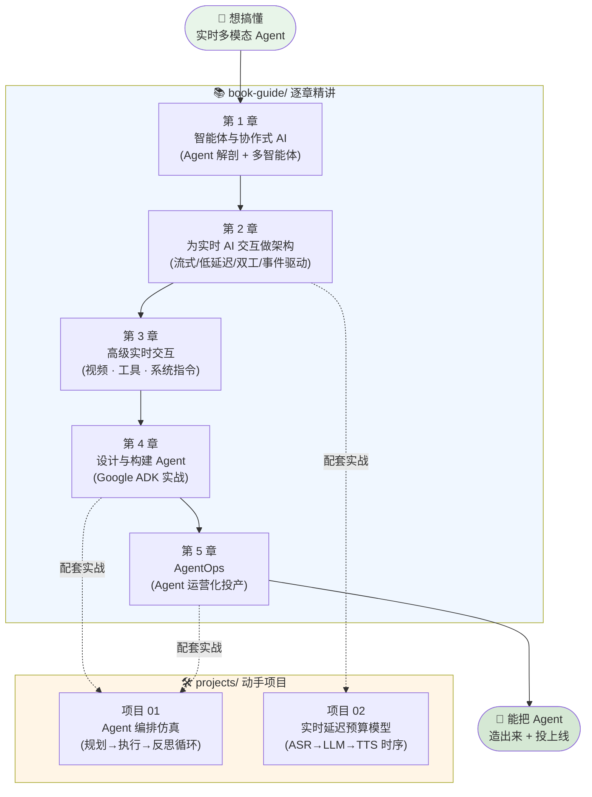

# 🎙️ Multimodal Real-Time AI Agent Systems · 中文逐章精讲 + 实战合集

> 本目录是 O'Reilly《**Multimodal Real-Time AI Agent Systems**》(Heiko Hotz & Sokratis Kartakis, Early Release) 的**中文逐章精讲 + 动手实战合集**。
>
> 原书讲的是「怎么造一个**能听会说、可打断、能看视频、会调工具、能投产**的多模态实时 AI Agent」。本合集做两件事：
>
> 1. **[`book-guide/`](book-guide/)** —— 5 章逐章精讲。每章一份 Markdown，配 mermaid 图、逐行代码解读、面试高频题、第一性原理拆解。把「智能体是什么」→「实时架构」→「多模态（视频/工具/系统指令）」→「用 ADK 造 Agent」→「AgentOps 投产」串成一条完整学习线。
> 2. **[`projects/`](projects/)** —— 2 个离线可跑的实战项目。**纯 CPU、零 API key、可复现**，各带 `pytest` + `run_demo.py`。把书里最硬的两块——「Agent 编排循环」和「实时延迟预算」——落成能跑、能测、能出图的代码。

---

## 🗺️ 学习路径



**建议路线**：
- 🎓 **想读懂全书** → 按 `book-guide/` 第 1 → 5 章顺序精读，每章末尾都有面试题与第一性原理小结。
- 🛠️ **想动手先跑** → 直接进 `projects/`，两个项目都 `python -m pytest -q` 一把过、`python run_demo.py` 出图，读代码比读书更快建立直觉。
- 🎯 **面试冲刺** → 讲义的「面试高频」小节 + 项目的「常见坑/第一性原理」串讲，覆盖 Agent 工程与实时延迟工程两大高频考点。

---

## 📚 一、逐章精讲（`book-guide/`）

> 5 章，逐章对应原书 PDF，每份 Markdown 都含：🗺️ 本章地图（mermaid）+ 逐行代码讲解 + 💡 面试高频 + ⚠️ 常见坑 + 🔬 第一性原理。

| # | 章节（点击进入） | 一句话简介 |
|---|---|---|
| 1 | [`01_智能体与协作式AI.md`](book-guide/01_智能体与协作式AI.md) | 全书地基。拨开炒作看 Agent「引擎盖下」怎么跑：五阶段演化史 → 严格定义 → 从零手搓「感知→推理→行动」五步执行循环 → 加记忆 → 拼成多智能体系统。 |
| 2 | [`02_为实时AI交互做架构.md`](book-guide/02_为实时AI交互做架构.md) | 为什么「和电脑自然对话」直到 **Transformer + WebSocket** 才可能。解剖 Siri/Alexa 的架构病灶，讲透**流式 / 低延迟 / 双工 / 事件驱动**四大支柱，用 Gemini Live API 搭可打断的实时语音应用。 |
| 3 | [`03_高级实时交互_视频工具与系统指令.md`](book-guide/03_高级实时交互_视频工具与系统指令.md) | 给「会聊天的嘴」装上**性格（系统指令）+ 眼睛（live video）+ 手（function calling）+ 身体（移动端 UI + Cloud Run 部署）**。周期抽帧、七步工具调用循环、OpenWeather 实战。 |
| 4 | [`04_设计与构建Agent.md`](book-guide/04_设计与构建Agent.md) | 从纸面到键盘：用 **Google ADK** 把「数学 Agent」蓝图落成真应用。设计四步法、从无工具→加工具→变实时→评估，工程化拆分（tools/context/examples/prompt/agent 分文件）+ ADK Web 调试。 |
| 5 | [`05_AgentOps_Agent运营化导论.md`](book-guide/05_AgentOps_Agent运营化导论.md) | 从「怎么造」跨到「怎么投产」的分水岭。**DevOps → MLOps → GenAIOps → AgentOps** 演进链、两条河流（模型开发 vs 应用开发）、三支柱（人/流程/技术）、四大新挑战（轨迹评估 / 工具治理 / Agent 治理 / 记忆治理）。 |

---

## 🛠️ 二、动手项目（`projects/`）

> 2 个项目，**全部离线、零 API key、纯 CPU、可复现**。各带完整 `pytest` 套件 + `run_demo.py`（跑演示并出图）。核心思路：**用确定性仿真替代真 LLM**，把控制流/时序本身看清楚——真实工程里换成一次 LLM 调用，骨架原封不动。

| # | 项目（点击进入） | 一句话简介 | 配套章节 |
|---|---|---|---|
| 01 | [`01_agent_orchestration_sim/`](projects/01_agent_orchestration_sim/) | **Agent 编排仿真**。把「规划 → 执行(调工具) → 反思」循环 + 工具路由拆到最底层，焊上**两层护栏**（`max_steps` 硬 + `max_reflections` 软）确保绝不死循环。招牌场景：`flaky` 工具「先失败后成功」，实测反思把完成率从 **71.4% → 85.7%**。 | 第 4 / 5 章 |
| 02 | [`02_realtime_latency_budget/`](projects/02_realtime_latency_budget/) | **实时交互延迟预算模型**。把 `ASR → LLM(prefill+decode) → TTS → 播放` 建成可计算的延迟模型。讲透 **TTFA（首响）vs E2E**、prefill(compute-bound) vs decode(memory-bound)，用一个 `yield` 说清「流式」的本质——实测流式把首响从 **1730ms 砍到 410ms（4.2×）**。 | 第 2 / 3 章 |

### ▶️ 如何跑（两个项目都一样）

```bash
# 项目 01：Agent 编排仿真
cd book-realtime-ai-agents/projects/01_agent_orchestration_sim
pip install -r requirements.txt      # 可选，本机已装则跳过
python -m pytest -q                  # → 36 passed（全绿）
python run_demo.py                   # 打印执行轨迹 + 出图到 outputs/

# 项目 02：实时延迟预算模型
cd book-realtime-ai-agents/projects/02_realtime_latency_budget
pip install -r requirements.txt      # 可选
python -m pytest -q                  # → 19 passed（全绿）
python run_demo.py                   # 出 3 张图（瀑布图 / TTFA 分解 / prompt 扫描）
python latency_budget.py             # 直接打印一份延迟报告
```

| 项目 | 测试数 | `run_demo.py` 产物 |
|---|---|---|
| 01 编排仿真 | **36 passed** | `outputs/metrics.png`（完成率/轨迹准确率/分类型/步数）、`outputs/reflection.png`（无反思 vs 有反思 +14% 对比） |
| 02 延迟预算 | **19 passed** | `latency_waterfall.png`（流式 vs 非流式瀑布图）、`ttfa_breakdown.png`（首响预算分解）、`prompt_sweep.png`（prompt 越长越慢曲线） |

> ⚠️ **Windows 中文/emoji 编码坑**（两个项目都已处理）：Windows 控制台默认 GBK，直接 `print` emoji 或中文会抛 `UnicodeEncodeError`。入口脚本均已 `sys.stdout.reconfigure(encoding="utf-8")`；matplotlib 也已设 `Microsoft YaHei` 字体 + `axes.unicode_minus=False` 防乱码。

---

## 🎯 三、面试 / 实战怎么用

### 💡 面试冲刺（Agent 工程 + 实时延迟两大方向）

| 高频问题 | 去哪找答案 |
|---|---|
| Agent 的核心循环是什么？（ReAct 骨架） | 项目 01 §5.2 + 讲义第 1 章 |
| 怎么防止 Agent 死循环？ | 项目 01「两层护栏」（`max_steps` 硬 + 停机条件） |
| 工具路由是什么？路由失败/幻觉怎么办？ | 项目 01 §4.2（未命中降级为失败结果，不崩溃） |
| 怎么评估一个 Agent？ | 项目 01 §4.4（response match + tool trajectory 双指标） |
| 怎么安全地实现一个「计算器工具」？ | 项目 01 §5.1（AST 白名单，绝不 `eval`） |
| TTFT / prefill vs decode 有什么区别？ | 项目 02 §2.2（compute-bound vs memory-bound） |
| 「流式」在代码上和非流式差在哪？ | 项目 02 §四（本质就是一个 `yield`） |
| 实时首响（TTFA）的头号敌人是什么？ | 项目 02（常是 prefill/prompt 太长，不是模型太大） |
| DevOps → MLOps → AgentOps 演进链怎么讲？ | 讲义第 5 章 |
| 实时语音助手为什么需要 WebSocket？ | 讲义第 2 章（持久双向连接 vs 邮政式请求） |

### 🔧 实战改造建议

- **把仿真换成真 LLM**：项目 01 里 `Planner.plan()` 换成一次 `claude -p` / 本地小模型调用，观察循环骨架**完全不用改**——这就是「编排控制流才是护城河」的最好验证。
- **把延迟预算写进 CI**：项目 02 的 `check_budget()` 写进 pytest，任何人给 system prompt 加长导致 TTFA 破 500ms，当场红灯（防「延迟回归」悄悄发生）。
- **加网络延迟项**：项目 02 给每级 config 加 `network_rtt_ms`，把纸面模型逼近真实分布式系统。
- **加新工具/新策略**：项目 01 新增一个 `Tool` 只需实现 `run()` 并 `register`，体会「可插拔」；给 `Reflector` 加「换工具」策略体会真反思 ⊋ 无脑重试。

---

## 📂 目录总览

```
book-realtime-ai-agents/
├── README.md                       # 本文件
├── book-guide/                     # 📚 5 章逐章精讲
│   ├── 01_智能体与协作式AI.md
│   ├── 02_为实时AI交互做架构.md
│   ├── 03_高级实时交互_视频工具与系统指令.md
│   ├── 04_设计与构建Agent.md
│   └── 05_AgentOps_Agent运营化导论.md
└── projects/                       # 🛠️ 2 个离线实战项目
    ├── 01_agent_orchestration_sim/   # 规划→执行→反思循环（36 tests）
    │   ├── agent.py / tools.py / tasks.py / simulation.py
    │   ├── run_demo.py / tests/ / README.md
    │   └── outputs/                  # run_demo 出图
    └── 02_realtime_latency_budget/   # ASR→LLM→TTS 延迟模型（19 tests）
        ├── latency_budget.py
        ├── run_demo.py / tests/ / README.md
        └── *.png                     # run_demo 出图
```

---

> 📖 每章讲义与每个项目都各带自己的详细 README/正文，本页只做导航。
> ✅ 两个项目共 **55 个 pytest 全绿**，全部离线、可复现、零 API key —— clone 下来即可跑。
