# 第 1 章 · 智能体与协作式 AI（Intelligent Agents and Collaborative AI）

> 本章对应《Multimodal Real-Time AI Agent Systems》(Heiko Hotz & Sokratis Kartakis, O'Reilly Early Release) 第 1 章，PDF 第 7–49 页。
>
> 这是全书的地基章。它回答一个被"炒作"淹没了的问题：**AI Agent 到底是什么？拨开营销话术，它在"引擎盖下"是怎么跑起来的？** 我们会从零手搓一个 Agent 的执行循环，再一路扩展到记忆、再到多智能体系统（Multi-Agent Systems）。

---

## 🗺️ 本章地图

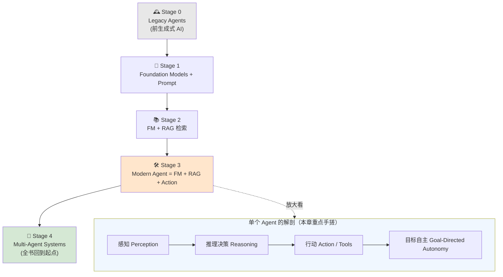

本章的叙事线索是**两条**：

1. **历史线（Stage 0 → 4）**：AI 从"被动的聊天机器人"进化到"主动替你办事的行动者"，一共五个阶段，最后回到几十年前多智能体研究的老命题——但换了一台革命性的推理引擎。
2. **工程线（从零手搓）**：给出 Agent 的严格定义 → 拆解三大核心组件（模型 / 工具 / 指令）→ 用 Google Gen AI SDK 一行一行搭出**五步执行循环** → 加上短期/长期记忆变成多轮 Agent → 最后把多个 Agent 拼成一支"专家团队"。

| 小节 | 你会学到 | 对应 PDF 页 |
|---|---|---|
| 智能体的诞生 | 五阶段演化史、经典 vs 现代 Agent 对比表 | 8–17 |
| 什么是 AI Agent | 四大永恒原则、一句话严格定义 | 17–18 |
| 用工具定义行动 | Function Declaration 的三种写法（docstring / OpenAPI JSON / SDK） | 18–23 |
| 编排 Agent 核心 | 三大组件、`agent_core` 函数、Function Calling 本质 | 24–29 |
| 闭合循环 | 五步执行循环全流程代码 | 29–34 |
| 多轮 Agent 与记忆 | 短期/长期记忆、三家厂商策略、存储选型 | 34–43 |
| 多智能体系统 | 单体 Agent 之痛、五种协作架构 | 44–48 |

---

## 🕰️ 1.1 智能体的诞生：五个阶段的演化

我们与人工智能交互的方式正在发生根本性转变：**从"被动回答问题的聊天机器人"，走向"主动替你把事情办成的行动伙伴"。** 这条从"健谈者"到"复杂行动者"的路，正是 AI Agent 激动人心的新世界。

作者把这段旅程切成了**五个清晰的阶段**：

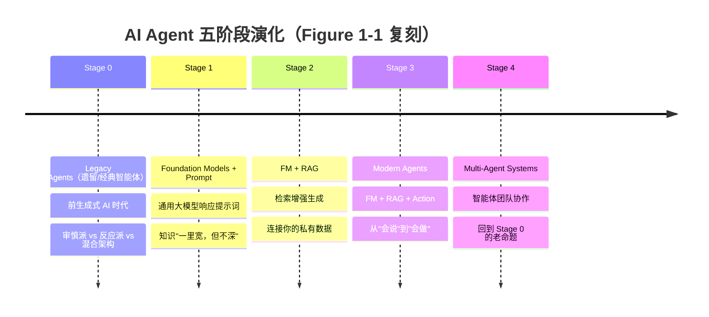

### Stage 0：Legacy Agents（经典/遗留智能体）

早在今天的 AI 出现之前，第一批智能体就诞生自一个简单却强大的念头：**如果一台计算机能感知它所处的世界，并自主行动去达成一个目标，会怎样？** 这一"计算自主性"（computational autonomy）的追求，掀起了一场影响学科几十年的架构大辩论。

| 范式 | 核心主张 | 代表 | 优点 | 致命伤 |
|---|---|---|---|---|
| **审慎派（Deliberative）** | 智能体要真正聪明，必须持有一张关于世界的**详细内部地图**，先做形式化推理与规划，再行动 | Shakey the Robot (1972)、**BDI 模型**（Belief 信念 / Desire 愿望 / Intention 意图） | 会"深谋远虑"、能规划 | 太慢，跟不上真实世界 |
| **反应派（Reactive）** | 真正的智能不来自缓慢复杂的内部地图，而来自**与世界快速、直接的交互**。用分层的简单行为（如"避障"）叠加出复杂动作，不做深度思考 | 分层行为架构 | 快、反应灵敏 | 无法提前规划 |
| **混合架构（Hybrid）** | 两派各有道理 → 取长补短：**规划者的远见 + 反应系统的快速反射** | —— | 两全其美 | 工程更复杂 |

> 🔬 **第一性原理**：这场"审慎 vs 反应"之争，本质是**"想清楚再动"与"边动边应"的时间权衡**。现代 LLM Agent 里 Chain-of-Thought（先想）和 ReAct（想一步动一步）之争，就是同一枚硬币的另一面——历史从未真正翻篇。

一旦学会造出**单个**有能力的智能体，下一个自然的问题就是：**把很多个放到一起会怎样？** 这把学科推向了**多智能体系统（Multi-Agent Systems, MAS）**。这不只是理论——人们把多智能体协作的核心原理，用到了制造业、电信业，乃至电商最早的自动购物机器人上。这段厚重的历史，奠定了推理、规划、社会化协调的基础，而它们至今仍是我们构建 AI Agent 的核心。

> 💡 **实战 / 面试高频**：面试官问"AI Agent 是不是 2023 年才有的新东西？" —— 标准的加分回答是：**不是**。Agent 的架构蓝图（deliberative / reactive / MAS）在前生成式 AI 时代就已成熟。LLM 的到来没有让这些蓝图作废，而是**给这些久经考验的设计塞进了一台全新的、无比强大的推理引擎（Foundation Model）**。这句话直接来自本书原文，非常好记也非常"显功底"。

### Stage 1：Foundation Models 与 Prompt

生成式 AI 时代从我们熟悉的**大语言模型（LLM）**开始。LLM 是在海量文本与代码上训练出的强大 AI 模型，是理解和生成人类语言的大师。你抛给它一个基于文本的问题（即 **prompt / 提示词**），它就基于自己的通用知识给你一个文本答案。很快，这些模型变得**多模态（multimodal）**——不只懂文本，你还能丢给它一张图、一段音频，然后就此提问。这些强大的通用模型，常被称为 **Foundation Models（FM，基础模型）**。

FM 虽强，却有一个**直接源自其"出身"的重大局限**：它们是在海量公开数据（开放互联网、书籍、图片、代码库）上训练的，因此成了**通用知识**的大师——历史、科学、流行文化都能聊。但正因如此，**它不了解"你"**：不知道你公司的私有文档，不知道你项目的具体数据。它的知识"**一里宽，但在任何私有/专有语境上都不深**"。

> 📖 **贯穿全章的例子——AI 助教（AI Teaching Assistant）**
> 在 Stage 1，它是个**通用知识库**：学生问"什么是机器学习？"能给出百科式回答，也能用多模态能力"描述一下这张附图"。但它**与真实课程材料脱节**——不知道教授的讲义、教学大纲、本周必读的主题。

### Stage 2：Foundation Models 与上下文检索（RAG）

对专有知识的渴求，催生了下一个重大突破：**检索增强生成（Retrieval Augmented Generation, RAG）**。它把 FM 连到你的私有数据源上。可以把它想成：**在助教需要的那一刻，让它以超快速度"翻阅"讲师的特定课程材料。**

关键在于——系统**不会**用教授的笔记去重训整个模型。而是当学生提问时，RAG 系统先在课程资料（讲义、大纲、书单）里搜出**最相关的片段**，再把这一小段特定的、相关的上下文交给 FM 去组织答案。

RAG 一举解决了两个根本问题：

| 问题 | RAG 如何解决 |
|---|---|
| **上下文相关性（Contextual Relevance）** | 只检索回答该问题**最相关**的信息片段，保证回答"对症"而非泛泛而谈 |
| **上下文窗口管理（Context Window Management）** | FM 有有限的"注意力跨度"即 **context window**（一次能考虑的最大信息量，含输入/输出）。RAG 只塞入"刚好够用"的相关信息，恰好装进窗口 |

> 📖 **助教升级**：接上课程大纲后，它能回答"我们本周机器学习讲座的关键主题是什么？"——它不再是通用家教，而是**这门课的专家**。

### Stage 3：现代 AI Agent = FM + 检索 + 行动

一旦模型能**检索**信息，一个强有力的问题就自然浮现：**"如果模型能找信息来帮我们，为什么不能用工具来帮我们？"**

这一火花点燃了现代智能体革命。**现代 AI Agent 是一个由 FM 驱动的系统，它不仅能检索上下文信息，还能执行行动。** 它会**智能地选择并使用"工具"**——日历、邮件、计算器——来完成一个目标。

> 这就是**"会告诉你怎么订机票的聊天机器人"**与**"问你日期、然后真的替你把机票订了的 AI 方案"**之间的区别——**从"知道（knowing）"到"做到（doing）"**。

> 📖 **助教成为真正的 Agent**：学生卡住时可以让它**做事**："帮我算一下这道预测题的计算" → 它调用计算器工具给出答案；或"帮我写个简单的 Python 小游戏起个头" → 它调用代码生成工具，产出可直接运行的功能代码。

#### 🔑 经典 Agent vs FM 驱动 Agent（Table 1-1 完整复刻）

LLM 驱动的 Agent 代表了一次**根本性的范式转变**：创造自主、目标驱动智能体的**目标**没变，但"**怎么做**"被彻底改写了。

| 类别 | 经典 Agent（Then，2020 前） | FM 驱动 Agent（Now） | 巨大转变（The Big Shift） |
|---|---|---|---|
| **推理引擎<br/>Reasoning Engine** | 用**显式、人写的规则**和搜索算法思考，像传统下棋程序 | "大脑"是一个 **LLM**，靠在海量文本/代码中**识别模式**来推理 | 从可预测的**规则逻辑**，转向更强大但**更不透明**、从数据中涌现的推理 |
| **知识来源<br/>Knowledge Source** | 知识由专家精心整理、**硬编码**进结构化数据库/规则手册——精确但**脆弱** | 知识来自训练时吸收的**海量非结构化**公网信息——广博而灵活 | 知识从**结构化/精选**变为**非结构化/概率化** |
| **规划<br/>Planning** | 遵循**僵硬的预定义计划**，或用形式化规划软件从有限选项库里挑下一步 | **即时生成灵活计划**，用 Chain-of-Thought 等推理技术在运行时适应新情况 | 规划不再是"从静态清单里选"，而是**动态、当下的问题求解** |
| **工具使用<br/>Using Tools** | 只有当开发者写好一段**硬编码流程**、给出何时/如何用的形式化指令时，才能用某工具 | 只需**读工具的自然语言描述**（像用户手册或 docstring）就能动态选择并使用工具 | 加新工具的门槛**大幅降低**——接口从僵硬代码变成**对话式语言** |
| **透明度<br/>Transparency** | 是"**透明盒**"：逻辑基于可检视的人写规则，可**逐步追踪**决策过程 | 常是"**不透明盒**"：LLM 内部推理路径复杂晦涩，**难以调试或完全解释** | 用旧系统的**可预测性**，换来了力量与灵活性的巨大提升 |

> ⚠️ **常见坑（透明度换来的代价）**：从 Table 1-1 最后一行读出的工程含义是——现代 Agent 的推理是"opaque box"。这意味着**当 Agent 做错时，你很难像调试 if-else 那样逐步定位**。这正是为什么后面章节要引入 metrics 记录、guardrails、以及可观测性（observability）——这些不是锦上添花，而是"不透明"这一根本属性逼出来的刚需。

> 📌 **术语约定（原文 NOTE）**：讲完经典智能体的历史后，**本书从此处起，"Agent" 一词专指现代 Agent**——即用 Foundation Model 作为核心推理引擎的那种。

### Stage 4：多智能体系统（Multi-Agent Systems）

单个 Agent 会用工具、会用记忆之后，下一个合乎逻辑的步骤，就是让它们**组队协作**。这就是 Stage 4——它在很多意义上让我们**兜了一整圈，回到了 Stage 0 里那些开创性的 MAS 研究**。前生成式时代研究者攻关的核心难题——"如何让一群自主智能体互动以解决复杂问题"——如今再度站上 AI 发展的最前沿。

**这次有什么不同？** 根本变化在于：如今每个个体 Agent，都由一台**能力惊人的 Foundation Model** 驱动。这台新的"推理引擎"，让我们能以过去遥不可及的**规模与精巧程度**，重访多智能体协作的原始原理。我们其实是**接着几十年前研究戛然而止的地方往下做，只是手里换了一套革命性的新工具箱。**

---

## 🎯 1.2 什么是 AI Agent？给一个严格定义

拨开营销话术。要得出一个有力的定义，作者回到那些**几十年来（自 Stage 0 起）统一 Agent 研究的原则**。尽管学派不同，有几个核心思想反复出现：

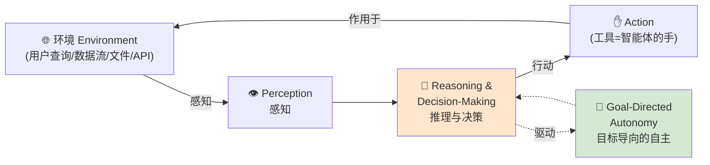

| 核心原则 | 含义 | 现代 Agent 里对应什么 |
|---|---|---|
| **感知 Perception** | 智能体必须能感知环境 | "环境"可以是用户查询、数据流、文件内容、来自 API 的信息 |
| **推理与决策<br/>Reasoning & Decision-Making** | 这是智能体的**大脑**。感知环境后，它要决定下一步做什么以达成目标——**这是智能体行为的心脏** | Foundation Model 负责"思考" |
| **行动 Action** | 智能体必须能**作用于**环境。这就是工具登场之处——工具是智能体的"**手**"，让它执行代码、调 API、改数据 | Tools |
| **目标导向的自主<br/>Goal-Directed Autonomy** | 朝一个具体目标努力，并具备**一定程度的独立性**。你无需每一步都指挥它——**你给目标，它自己想出到达的步骤** | Agent 的"自主"本质 |

把这四条永恒原则合起来，作者给出全书的核心定义：

> ### 💠 "**An Agent is an autonomous system, powered by a foundation model, that perceives its environment, makes decisions, and uses tools to achieve a specific goal.**"
>
> **"智能体是一个由基础模型驱动的自主系统，它感知其环境、做出决策、并使用工具以达成一个特定目标。"**

这个定义之所以有力，是因为它把 Agent 框定为一个**能感知、能思考、能行动的完整系统**。FM 负责"思考"，而"**行动**"的能力才是把 Agent 从一个"思考者"变成"行动者"的关键。而这份行动能力，**完全押在一个关键组件上：工具（tools）**。

> 🔬 **第一性原理**：这句定义把 "prompt + tools" 的碎片视角，升级成了**"感知—思考—行动"的完整自主循环视角**。记住这个升维——它是本章后面所有代码、也是全书的"母题"。一个 Agent 的能力上限，等于**它被赋予的工具的能力上限**（"An agent is only as capable as the tools it's given"）。

于是最重要的实践问题浮现：**模型如何知道一个工具是什么、以及何时该用它？** 答案藏在我们**描述工具**的方式里——一切从 **function declaration（函数声明）** 开始。

---

## 🛠️ 1.3 用工具定义行动：让 Agent 从"会说"变"会做"

当你给 Agent 一个工具时，**你给的不是实际代码**，而是一份详尽的**描述**，它扮演模型的"**用户手册（user manual）**"。这份"声明（declaration）"告诉模型三件事：**何时该用这个工具、要提供什么输入、以及如何理解拿回来的输出。**

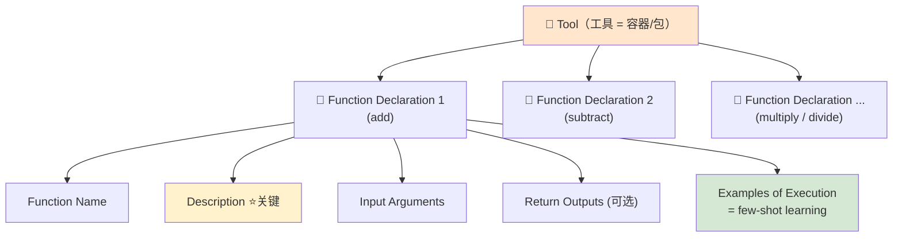

> **术语关系（原文 NOTE）**：口语里 "tool" 和 "function" 常被混用（尤其当一个 tool 只含一个 function 时），这没问题。但正式关系是：**Tool 是容器，Function 是容器里具体的动作。** 一个 Tool 打包一个或多个 Function Declaration。

一份高质量的 Function Declaration 应含以下要素：

| 要素 | 说明 |
|---|---|
| **Function Name（函数名）** | 唯一、清晰的标识符 |
| **Description（描述）** | 对函数用途的**全面**解释。⭐ **这是最关键的一项**——模型靠它理解"这函数干嘛、什么时候该用" |
| **Input Arguments（输入参数）** | 清楚列出参数：名字、期望的数据类型、简短描述 |
| **Return Outputs（返回，可选）** | 描述函数会送回的预期结果 |
| **Examples of Execution（执行示例）** | 一个或多个简单示例，展示如何调用、期望输出是什么 |

> 💡 **实战 / 面试高频（为什么"示例"如此强大）**：给出几个具体示例，本质上是在做一种 **few-shot learning（少样本学习）**——用少量"shots"帮模型抓住"如何调用该函数、以及会拿回什么"的模式。写工具声明时，别省 `Examples` 那几行，它对函数调用准确率的提升往往立竿见影。

### 三种等价写法：docstring / OpenAPI JSON / SDK

作者用一个贯穿全章的 **Math Agent（数学智能体）** 做例子：它专门替用户解算术题。要让它会算，得先给它数学工具。从最基础的 **add（加法）** 开始。

#### 写法一：Python docstring 风格（人机双友好）

作者发现，**类似 Python "docstring" 的格式**往往是组织这份信息的最佳方式。

**Example 1-1**：
```python
""" 
Function Name: add 
  
Function Description: 
  Calculates the sum of a list of integers. 
  
Function Args: 
  numbers: A list of integers to be added. 
  
Function Returns: 
  The sum of the integers in the input list. Returns 0 if the input 
list is empty. 
  
Examples of Execution: 
  add([1, 2, 3]) == 6 
  add([-1, 0, 1]) == 0 
  add([]) == 0 
"""
```

**逐段拆解**：
- `Function Name: add` —— 唯一函数名。
- `Function Description` —— "计算一组整数的和"，一句话讲清用途，是模型判断"该不该用"的核心依据。
- `Function Args: numbers` —— 输入是一个整数列表。
- `Function Returns` —— 返回整数和；**注意它连边界情况都写了**："空列表返回 0"。这类边界说明能显著减少模型误用。
- `Examples of Execution` —— 三个 few-shot 示例，尤其 `add([]) == 0` 把空列表这个坑直接示范给模型看。

这段纯文本**人能读、模型也能读**，是一份结构化的"手册"。

#### 写法二：OpenAPI / JSON（跨系统标准）

docstring 对"人 + Agent"都很棒，但你的工具往往有"应用之外的生命"——你会想把它托管在服务器上，作为 **API** 暴露给其他系统/用户。这时需要一个**更结构化、更标准化**的定义，来保证不同系统间可靠通信。

最常遇到的标准是 **OpenAPI 规范**，通常用 **JSON** 写。用这种正式标准的好处：**可预测性、健壮性、可扩展性、与其他服务的无缝集成**。

**Example 1-2**（同一个 add，换成 OpenAPI/JSON）：
```json
{  
   "tools": [  
   { 
      "functionDeclarations": [  
      { 
         "name": "add",  
         "description": "Calculates the sum of a list of integers.",  
         "parameters":  
         { 
            "type": "object",  
            "properties":  
            { 
              "numbers":  
              {  
                 "type": "array",  
                 "items": { "type": "integer" },  
                 "description": "A list of integers to be added." } 
              },  
              "required": ["numbers"] },  
              "returns":  
              { 
                 "type": "integer",  
                 "description": "The sum of all integers in the list."  
              }  
           }  
        ]  
     } 
  ] 
}
```

**关键点**：承载的**本质信息与 docstring 完全一致**（函数名、用途、输入、输出），区别只在于——**JSON 结构无歧义**，让传统软件应用能**轻松解析、可靠地知道如何执行**你的 add。照这个模式，你能轻松再写出 `subtract` / `multiply` / `divide`，全部塞进 `functionDeclarations` 列表，就补齐了整个 Math tool。

> 💡 **实战承接**：这套"标准化工具定义"是后续高级主题的地基——作者预告，后面章节会在此之上讲 **API Hubs、Model Context Protocol（MCP）、Agent-to-Agent（A2A）协议**。换句话说，**MCP 本质上就是"把这份 JSON 工具声明标准化到跨进程/跨厂商可复用"**。今天你手写的这段 JSON，就是明天 MCP server 暴露 tools 的雏形。

#### 写法三：用 SDK 以编程方式定义（真实项目做法）

手写 JSON 是理解结构的好办法，但真实应用里，你多半会**以编程方式**定义工具——用代码来构建声明，从而能**动态地即时创建与管理**工具。

**Example 1-3**（用 Google Gen AI SDK 定义 add 并打包成 Tool）：
```python
from google import genai 
from google.genai import types 

# Create Function Declarations 
add_func = FunctionDeclaration( 
    name="add", 
    description="Calculates the sum of a list of integers.", 
    parameters={ 
        "type": "object", 
        "properties": { 
            "numbers": { 
                "type": "array", 
                "items": {"type": "integer"}, 
                "description": "A list of integers to be added.", 
            } 
        }, 
        "required": ["numbers"], 
    }, 
) 
# ... provide more Function Declarations 

# Define the list of the available functions to FM as a tool 
math_tool = types.Tool( 
    function_declarations=[ 
        add_func, 
        # ... Other Function Declarations 
    ], 
)
```

**逐行讲解**：
- `FunctionDeclaration(...)` —— 用代码构造与 Example 1-2 **完全同构**的声明对象：`name` / `description` / `parameters`（内部就是那份 JSON Schema：`type=object`、`properties.numbers` 是 `array of integer`、`required=["numbers"]`）。
- `types.Tool(function_declarations=[add_func, ...])` —— 把**一批** function declaration 打包成**一个 Tool 对象**。这在代码里精确对应了图 1-2 的 "Tool = 容器，Function = 内容物"。
- 注释 `# ... Other Function Declarations` 提示你：subtract/multiply/divide 也这样加进同一个列表。

> ⚠️ **常见坑**：`description` 写得含糊，是新手最容易踩的雷。模型选不选这个工具、参数填得对不对，**几乎全靠 description + examples**。把 description 当成"写给一个聪明但从没见过你代码的实习生看的说明"来写——别写 "adds numbers"，要写 "Calculates the sum of a list of integers. Returns 0 if empty."

---

## ⚙️ 1.4 编排 Agent 的核心：三大组件

到目前为止，我们只是给 Agent 造了一本"能力用户手册"（定义工具与函数）。但手册只是**静态文档**；真正的魔法在于——**构建能读这本手册、听取一个请求、并决定做什么的核心逻辑**。这个编排（orchestration）过程遵循一个你会反复见到的基本模式：**Agent 执行循环（agent execution loop）**。

作者刻意**不用任何高级 Agent 框架**（如 Google ADK 或 LangGraph），而是直接用 FM 的核心能力手搓。原因很关键：**要让你看见让 Agent 跑起来真正需要的力气与逻辑**，从而在后面用高级框架时，能真正体会到它们替你省掉了什么。（对应仓库文件：`Chapter-01/agent-with-manual-function-calling.py`）

### 模型如何拿到这本"手册"？

**Example 1-4**（Agent 核心函数，配置并调用生成模型）：
```python
def agent_core(contents, tools=math_tool): 
    """Sends a request to the generative model with a specific configuration. 
    
    This function is the core of an agent and packages the conversation history,  
    a system instruction, and a set of tools, then sends it to the model.  
    It's configured for manual function calling, allowing the calling code  
    to handle tool execution. 
    … 
    """ 
    # Define the system instruction, which sets the context for the model's behavior. 
    instruction_prompt = """You are a specialized math assistant. 
Your sole purpose is to solve arithmetic problems involving 
addition, subtraction, multiplication, and division. Handle multi-
step calculations and number ranges. Decline all non-mathematical 
requests.""" 
     
    # Call the generative model's API specifying the model version and the tools it can use. 
    return client.models.generate_content( 
            model=MODEL, # e.g. "gemini-2.5-flash" 
            contents = contents, 
            config={ 
                "tools": [tools], 
                "system_instruction": instruction_prompt, 
                "automatic_function_calling": { "disable": True } 
            } 
        )
```

**逐行讲解**：
- `def agent_core(contents, tools=math_tool)` —— 这就是 Agent 的"核心"。`contents` 是对话历史，`tools` 默认就是上面打包好的 `math_tool`。
- `instruction_prompt`（**系统指令 / system_instruction**）—— 用自然语言给模型**画定人设与边界**："你是专职数学助手，只解决加减乘除、能处理多步计算与数字区间，**拒绝一切非数学请求**"。这句 `Decline all non-mathematical requests` 是最朴素的一层 **guardrail**。
- `client.models.generate_content(...)` —— 真正的 API 调用，三个关键 config：
  - `"tools": [tools]` —— 把工具交给模型（**注意这一步的"幕后"最重要，见下**）。
  - `"system_instruction"` —— 上面的指令。
  - `"automatic_function_calling": { "disable": True }` —— **关掉自动函数调用**。作者故意关掉它，是为了让你亲手走完整个循环、看清底层。

> **SDK 的"幕后"做了什么（关键理解）**：从开发者视角，你只是把 `math_tool` 对象传进 `tools` 参数，很干净。但 **SDK 在幕后把你结构化的 `math_tool` 对象转成一段标准化文本，拼进给模型的指令 prompt 里**。你**不必**每次手动把工具定义格式化成长字符串再粘进 prompt——SDK 替你干了。这给了模型足够上下文，去推理"该不该用某工具、用哪个、参数填什么"。

至此，Agent 核心的**三大组件**全部到齐（Figure 1-3）：

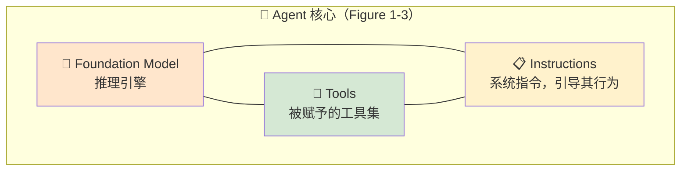

| 组件 | 角色 | 在代码里 |
|---|---|---|
| **Foundation Model** | 推理引擎（"大脑"） | `model=MODEL` |
| **Tools** | 被赋予的能力集（"手") | `"tools": [tools]` |
| **Instructions** | 引导行为的系统指令（"人设/边界") | `"system_instruction": instruction_prompt` |

---

## 🔁 1.5 闭合循环：五步执行流程全程解剖

核心就绪，下一步是**给它一个任务**。

**Example 1-5**（准备用户查询与对话历史）：
```python
# Prepare your query/question for the LLM 
query = "Could you add all the numbers between 1 and 5?" 

# Format the user's query into the required 'Content' object structure. 
user_prompt_content = types.Content(role='user', parts=[types.Part.from_text(text=query)]) 

# Send the first request to the model with the user's query. 
response = agent_core(user_prompt_content) 

# Initialize conversation history with the user's first message. 
content_history = [user_prompt_content]
```

- `query` —— 用户问："能把 1 到 5 之间所有数字加起来吗？"
- `types.Content(role='user', parts=[...])` —— 把查询包成 SDK 要求的 `Content` 结构，标明这是 `user` 角色的一条消息。
- `response = agent_core(user_prompt_content)` —— 发出**第一次**请求。
- `content_history = [user_prompt_content]` —— 用用户的第一条消息**初始化对话历史**。这个 `content_history` 后面会不断追加，就是 Agent 的短期记忆雏形。

> 🤔 **暂停思考（原文设置的悬念）**：模型的响应会长什么样？它会去调我们给的 `add` 函数吗？如果会，是不是意味着**我们的 Python 代码已经被执行了**？

### 模型的响应：一次"行动召唤"，而非直接答案

**这是函数调用（function calling）里你必须理解的最重要概念**：

> ### ⚠️ **Foundation Model 没有权限执行你的代码。**

模型不会自己执行行动，而是**返回一个结构化的请求**，相当于说："我分析了用户的提示词，判断你应该用这些具体参数去运行 `add` 函数。" 它像一个**聪明的电话总机接线员**——告诉你该接哪根线，但**真正把线接上的活儿留给你**。

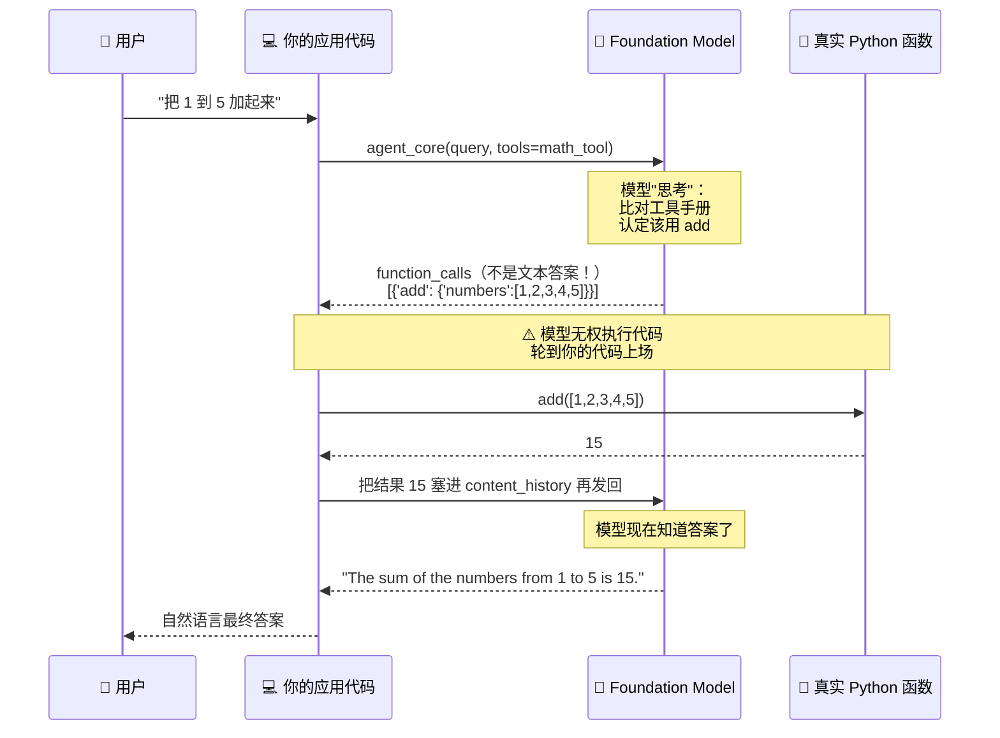

> **原文 NOTE**：较新版本的模型支持**自动函数调用（automatic function calling）**。但为了展示底层原理，Example 1-4 里用 `"automatic_function_calling": { "disable": True }` **关掉了它**。

检查模型响应，你会发现它含一个 `function_calls`。对本查询，它含**两条关键信息——函数名 + 输入参数**：
```python
[{'add': {'numbers': [1, 2, 3, 4, 5]}}]
```
注意：模型很聪明地把"1 到 5 之间所有数字"**展开成了 `[1, 2, 3, 4, 5]`**——这正是 FM 推理能力的体现（经典 Agent 时代需要开发者硬编码这一步）。

### 从请求到执行：你的代码登场

模型已经做完它那部分（告诉你该做什么），**现在轮到你真正去做**。这意味着：**你为工具里声明的每个函数，都得有一个对应的、真实的 Python 函数（或 API）来干活。**

**Example 1-6**（add 的真实 Python 实现，与之前的声明匹配）：
```python
# Implement a Python function per Declaration 
def add(numbers: list[int]) -> int: 
  """Calculates the sum of a list of integers. 
  
    This function takes a list of integers as input and returns the sum of all 
    the elements in the list.  It uses the built-in `sum()` function for efficiency. 
  
    Args: 
        numbers: A list of integers to be added. 
  
    Returns: 
        The sum of the integers in the input list.  Returns 0 if the input 
        list is empty. 
  
    Examples: 
        add([1, 2, 3]) == 6 
        add([-1, 0, 1]) == 0 
        add([]) == 0 
    """ 
  return sum(numbers) 

# ... Other function implementations
```
- 注意这个真实实现的 **docstring 与 Example 1-1 的声明几乎一字不差**——这是刻意的：**声明（给模型看的手册）与实现（真正跑的代码）应保持一致**，否则模型的"预期"会与"现实"脱节。
- 实现本身极简：`return sum(numbers)`，用内置 `sum()`。

现在我们手里有了两样东西：**模型的请求（函数名字符串）** 与 **实现（真实 Python 函数）**。最后一步是**把两者接上**。作者推荐建一个 **"function handler"**——一个简单的 Python 字典，充当**注册表**，把工具声明里的函数名映射到真实 Python 函数。

**Example 1-7**（function handler 字典）：
```python
# This dictionary maps the function names (as strings) to the actual Python function objects. 
function_handler = { 
   "add": add, 
   ..., 
}
```
- key 是**字符串** `"add"`（模型返回的就是这个字符串），value 是**函数对象** `add`（真实可调用）。
- 有了它，你就能写 `function_handler[function_name](**args)` 这样的通用派发逻辑，而不必为每个函数写一堆 if-else。

### 闭合循环：执行 + 送回结果 + 生成最终答案

有了 `function_calls`（模型的请求）和 `function_handler`（名字→真实代码的映射），就能闭合循环了。执行后把结果包成一条 `role='tool'` 的消息追加进历史：

**Example 1-8（片段）**：
```python
         function_response_content = types.Content(role='tool',  
                                        parts=[types.Part.from_function_response( 
                                                  name=function_name, 
                                                  response={"result": function_response})]) 

         # Add the tool's response to our conversation history. 
         content_history.append(function_response_content)
```
- `function_response` 此刻已持有代码执行结果——本例中就是整数 **15**。
- 用 `role='tool'` + `from_function_response(...)` 把结果包成模型能识别的"工具返回"结构，并**追加进 `content_history`**。

但活儿还没完：**我们算出了答案，模型却还不知道这个答案是什么。** 最后一步，把"初始用户查询 + 函数调用请求 + 函数结果"（都已存进 `content_history`）**送回模型**，让它组织成一句友好的自然语言回复：

**Example 1-9**：
```python
# Send the return value of the function to the LLM to generate the final answer 
response = agent_core(content_history)
```
模型此刻拥有全部信息——它懂原始问题（"把 1 到 5 加起来"），也知道算出的答案（15）——于是生成最终的、人类可读的回复：

> **"The sum of the numbers from 1 to 5 is 15."**

### 🎬 完整的五步执行循环（Figure 1-5）

> 每个 Agent，无论多复杂，都建立在这个**推理—行动**的基本循环之上。

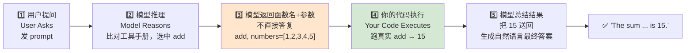

| 步骤 | 谁在动 | 干什么 |
|---|---|---|
| 1️⃣ 用户提问 | 用户 | 发出请求 prompt |
| 2️⃣ 模型推理 | 模型 | 分析请求，比对工具手册，认定 `add` 是对的工具 |
| 3️⃣ 返回函数名+参数 | 模型 | **不直接答复**，而是返回 `{name: add, args: numbers=[1,2,3,4,5]}` |
| 4️⃣ 代码执行 | **你的应用** | 解析函数名与参数，跑真实 `add` → 得 15 |
| 5️⃣ 模型总结 | 模型 | 收到 15，生成友好自然语言回复 |

> 💡 **实战 / 面试高频**：这五步（也叫 "function calling loop"）是**所有** Agent 框架的公约数。面试被问"function calling 到底怎么工作的"，照这五步答，并强调第 3–4 步之间那道**"模型只请求、代码才执行"的权限边界**——这是最能体现你真懂原理的一句。

> **框架帮你省了什么**：手搓一个单轮 Agent 就要——定义工具、解析模型响应、执行自己的代码、把结果送回——才闭合**一次**交互。好消息是多数现代 SDK（含 Google 的）能**替你处理整个函数调用循环**，代码量能砍掉一半以上（仓库里 `Chapter-01/agent-with-automatic-function-calling.py` 就是自动版）。

> **部署视角**：你手搓的这段 Agent 逻辑是一个**自包含应用**。开发时可直接跑在笔记本上；生产环境可部到专用服务器，或打包成**容器跑在 Kubernetes 集群**（自建硬件或云上）；也可走 **serverless**，用 **Google Cloud Run / AWS Lambda** 这类托管服务，把底层基础设施全交给云厂商。

---

## 🧠 1.6 走向多轮 Agent：短期与长期记忆

五步循环只处理**单轮**——一个问题、一次工具调用、一个最终答案。但真实交互很少这么"干净"：

- **追问**："100 + 50 是多少？" → "很好，现在把结果乘以 2。"
- **多步单请求**："先从 50 里减去 10，再把结果除以 4。"

处理追问、串联多次工具调用的能力，定义了**多轮 Agent（multi-turn agent）**。要做到这点，模型必须在**每一轮都依赖完整的对话历史**。这份过往交互记录——你可以理解为一个 **session（会话）**，或 Agent 的**短期记忆（short-term memory）**——让它记住之前的结果、理解对话流程。

有了记忆，Agent 每一步都会看一眼对话历史，然后决定最佳下一步。这正是其推理力的真正威力所在——它通常有**三个选项**：

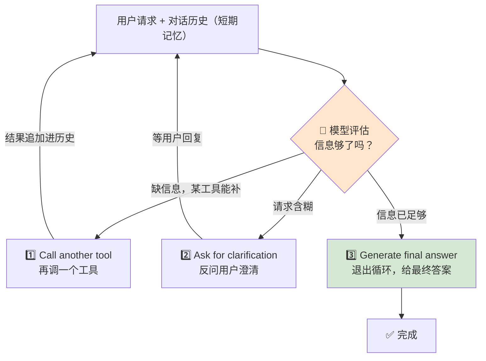

| 选项 | 触发情形 | 例子 |
|---|---|---|
| **1️⃣ 再调一个工具** | 意识到还需某工具能提供的信息 | 返回又一个 tool call 请求 |
| **2️⃣ 反问澄清** | 收到含糊请求，如"我有 100 和 20 两个数" | 生成"你要对 100 和 20 做什么运算？加/减/乘/除？"并等你回复 |
| **3️⃣ 给出最终答案** | 判断已有满足请求的全部信息 | 退出循环，给出完整答案 |

**在"再调工具、反问求助、结束任务"之间做选择**的能力，正是多轮 Agent 强大而灵动的原因——它能通过从多个来源（**包括你**）智能地收集信息，来穿越复杂问题。

> 💡 **TIP（原文实战建议）**：随着 Agent 变复杂，明智的做法是**为每一轮存储运营指标（operational metrics）**——执行时间、延迟（latency）、token 用量。这些数据对**调试、实验、成本计算、后续性能优化**都极其宝贵。（Agent 是"不透明盒"，metrics 是你为数不多的"探照灯"。）

> ⚠️ **WARNING（原文警告 · 最经典的多轮坑）**：多轮 Agent 的一大陷阱是**无限循环（infinite loop）**。Agent 有时会"卡住"，反复调工具却始终凑不齐能下结论的信息。防范的**关键最佳实践是加护栏（guardrails）**，比如**设置最大迭代次数**：若 5 轮或 10 轮后仍没结束，你的代码应**停止循环并给用户一条有帮助的提示**。（后续第 5 章起会深入更多此类情况。）

### 长期记忆：跨会话记住"你"

短期记忆只让 Agent 记住**单次会话内**发生了什么。可用户明天、下周再回来呢？要提供真正个性化的体验，Agent 需要**长期记忆（long-term memory）**。

> 📖 **助教/数学 Agent 例子**：你常用数学 Agent 算含 20% 销售税的最终价。某天你在对话里确立了"我这里税率 20%"这个事实。若 Agent 有长期记忆，一周后你再问"一件 50 美元的东西最终价多少？"，它能**回忆起你的偏好，自动套用 20% 税**，你无需重复说明。

长期记忆的本质：**跨越较长时间，存储并检索关键信息、用户偏好、或过往会话摘要的能力**。它让 Agent 从一个**事务性工具**，进化成一个**有帮助的、个性化的助手**。它通常通过**为每次交互存储短期对话历史的摘要或完整记录**来构建。

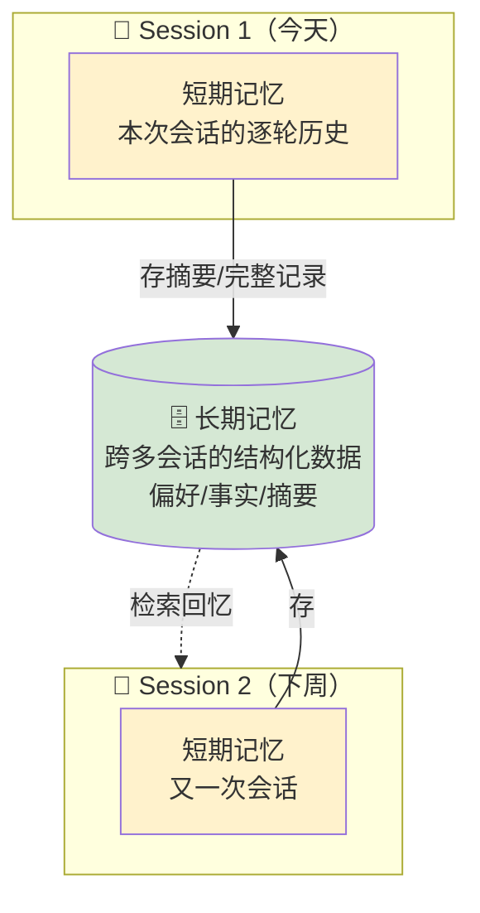

### 🔬 三大厂商的长期记忆策略（各走各路，很值得记）

这一领域太新，主流 AI 厂商**没有收敛到单一标准**，而是各自选了不同的路——路线往往反映其目标用户，给开发者留下一组权衡：

| 厂商 | 记忆策略 | 定位/取舍 |
|---|---|---|
| **Google（Gemini）** | 靠基础设施优势，提供**超大 context window**——把海量信息塞进单个 prompt，作为强大的"**会话级记忆**"；辅以专门服务，抽取并存储跨对话复用的关键事实 | 用**巨大上下文**当记忆 |
| **OpenAI（ChatGPT）** | 聚焦**深度个性化的消费者体验**：给 Agent 两类记忆——从你日常聊天里**隐式学习**，也允许你**显式地说"记住这个事实"**；并配**细粒度隐私控制**（能看到记住了什么、可删除任意条目） | 面向 C 端，**隐式 + 显式**双记忆 |
| **Anthropic（Claude）** | 更**面向开发者/企业**：提供**显式的、基于文件的**记忆工具——例如创建特殊文件持有持久上下文（团队编码规范、项目专属 API key 等），给你**透明、可预测的控制**权 | 面向企业开发者，**基于文件、可控透明** |

> 💡 **面试高频**：被问"不同大模型厂商的记忆方案有什么差异"时，用这张表答——**Google = 超大上下文当记忆；OpenAI = C 端隐式+显式；Anthropic = 开发者友好的文件式显式记忆**。并点出作者的洞见：这是一个**在试验各自独特价值主张、而非统一成 one-size-fits-all** 的市场。

### 短期 vs 长期记忆的实现选型

虽然两者都帮 Agent"记事"，但用途与常用技术很不同：

**短期记忆 = Agent 当前对话的"草稿纸（scratchpad）"**，存单次会话内的来回（用户查询、模型工具调用、工具返回）。常见实现：

| 实现 | 特点 | 适用 |
|---|---|---|
| **In-Memory 变量** | 存进代码里的 list/变量，简单；但**应用一停就没了** | 简单脚本、测试 |
| **数据库 / 缓存** | SQL/NoSQL 或 Redis 等快缓存，**更健壮**，能可靠存取（甚至含图像/音频的复杂交互） | 生产应用 |
| **客户端存储** | 存在用户设备上（如浏览器 session storage），**减轻服务器负载**；但控制力弱、有容量限制 | 降低服务端压力 |
| **云日志 + 存储** | 用 Google Cloud Logging / Amazon CloudWatch 存文本逐轮历史；遇大数据（图像/音频）则配 **Cloud Storage / S3** 存大文件、日志只存引用 | 云原生应用 |

**长期记忆 = 跨多会话存过往交互信息**，让 Agent 学偏好、给个性化推荐、越用越高效。常见实现：

| 实现 | 原理 | 适用 |
|---|---|---|
| **向量数据库（Vector DB）** ⭐ | **现代 Agent 记忆最常用、最强**的选择。不存原始文本，而存 **vector embeddings**（语义的数学表示），做超快 **similarity search** 检索相关记忆——这正是 **RAG 的核心组件** | 语义检索型记忆 |
| **图数据库（Graph DB）** | 完美存储与查询**关系**，如"该用户常问这些话题""该用户买过这三件产品" | 关系型记忆 |
| **传统数据库 / 云存储** | 存过往对话的**完整原始日志**（传统库或 S3/GCS），提供完整历史记录，利于审计与分析；也很适合用音频/视频/图像的**多模态 Agent** | 审计/分析/多模态 |

> 🔬 **第一性原理**：为什么向量数据库成了长期记忆的主力？因为 Agent 检索记忆要的是**"语义相似"**而非"字面匹配"——"20% 销售税"和"sales tax rate"字面不同但语义相同。Embedding 把语义投影到向量空间，"相似度"变成向量距离，于是"回忆相关往事"退化成一次**最近邻搜索**。这也解释了为什么**长期记忆与 RAG 在技术上是同源的**——两者都是"把相关片段捞回来喂给模型"。

> 📎 后续第 5 章会更详细讲记忆；作者还援引 "Context Engineering: Sessions & Memory"，其中把**短期记忆称作 session、长期记忆称作 memory**。

---

## 👥 1.7 Agent 调用 Agent：多智能体系统的威力

有了短/长期记忆，单个 Agent 已能成为强大的个性化助手。但**造一个"包打天下"的单体（monolithic）Agent 有其极限**，这把我们引向一个更可扩展、更健壮的架构模式：**造一支专家 Agent 团队，彼此可互相调用来解决复杂问题。**

### 单体 Agent 之痛（The Monolithic Agent Problem）

有软件开发背景的人都熟悉那次转变：**从庞大的单体应用（monolith），转向更小、独立的微服务（microservices）**。单体代码库能干很多事，却往往变得复杂、难测试、难扩展；微服务把应用拆成小而专的服务协同工作来破局。**这套思路可以原样搬到 AI Agent 设计上。**

设想造一个"包打天下"的 Agent：要它处理数学、历史、语法、旅行预订、天气预报……你可能得塞给它**几百个工具**。虽然可行，却常出问题——当 FM 面对**一份巨大的工具清单**时，它会**犯迷糊**：得在超大上下文里推理才能选对工具，于是**响应更慢、准确率更低、系统极难调试与维护**。这就是**单体 Agent 问题**。

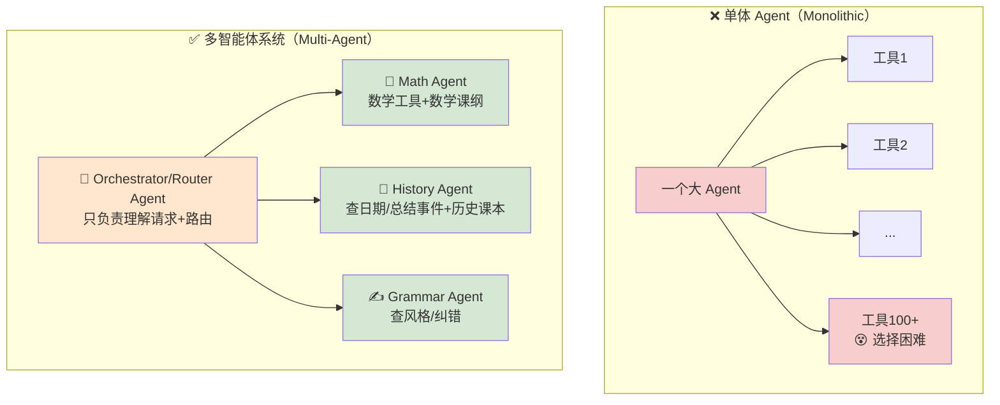

**多智能体系统（Multi-Agent System）**让多个 Agent 协作，**每个专精一个子任务**。这种协作把复杂问题**分解**成更小、更可管理的部分，得到更高效、更健壮、也更易测试/扩展/复用的方案。

以 AI 助教为例，与其造一个巨型助教，不如造一支**团队**：

| 角色 | 职责 |
|---|---|
| **Orchestrator / Router Agent（编排/路由）** | 用户直接交互的主"助教"。**唯一的活是理解学生的初始请求、并路由给正确的专家**。它自己不懂数学也不懂历史 |
| **Math Agent（专家）** | 能访问 Math 工具，扎根于**数学课纲** |
| **History Agent（专家）** | 有查日期、总结事件的工具，**只**能访问历史课本 |
| **Grammar Agent（专家）** | 有检查风格、纠错的工具 |

> **关键洞见**：每个专家 Agent 都是**其狭窄领域的专家**，其知识被**限定（scoped）**在相关材料上，而不是"整座国家图书馆"，因此**更快也更准**。

### 五种多智能体协作架构（Figure 1-9）

"路由到专家"只是组织 MAS 的一种常见方式，绝非唯一。按你要解决的问题，可把 Agent 排成不同模式，各有所长。作者给出最常见的**五种**：

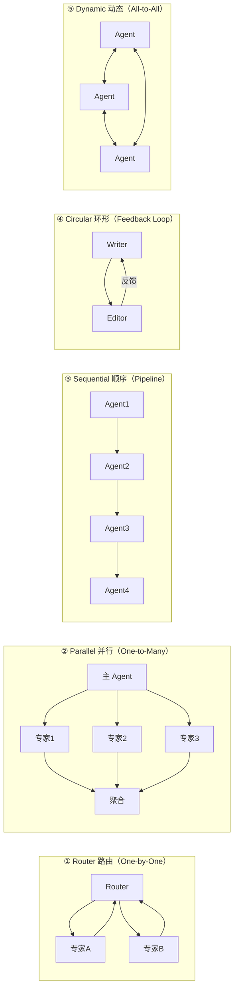

| 模式 | 结构 | 何时用 | 例子 |
|---|---|---|---|
| **① Router（一对一）** | 中央 Router 像**智能交通管制**，收请求→委派给最合适的专家；专家做完把结果传回，Router 再决定下一步（叫另一个专家 or 给最终答案） | **生产中最常见**，尤其各类客服 chatbot（订票/查价/退款） | 助教：学生问"上周历史讲座主题？再给道数学练习题" → Router 先叫 History Agent、再叫 Math Agent，然后一并呈现 |
| **② Parallel（一对多）** | 主 Agent 把子任务**同时**分给多个专家并发执行，全部完成后回传给主 Agent 聚合 | 问题能拆成**独立、可并发**的部分，**显著缩短总耗时** | 旅行 Agent："找巴黎下周末的航班+酒店+本地活动" → 同时让 Flight/Hotel/Events Agent 各自搜，一次性汇总 |
| **③ Sequential（流水线）** | 预定义的**装配线**：上一个 Agent 的输出**直接作为**下一个的输入，固定线性顺序 | 有**明确定义工作流**的任务 | 数据分析流水线：Ingestion（下载销售报告）→ Data Cleaning → Summarization → Report Generation（排版 PDF） |
| **④ Circular（反馈环）** | 类似顺序，但**最后一个 Agent 的输出传回第一个**，形成环 | **迭代精炼**、集体打磨的过程 | 写作团队：Writer 出初稿 → Editor 提修改建议回传给 Writer → 产出更优稿，**循环直到达标** |
| **⑤ Dynamic（全对全）** | **无中央协调者、无预定义流程**：任意 Agent 可与任意 Agent 通信，动态交换信息、协商以达成共同目标。灵活强大但**难管理** | 高复杂、需自由协商的场景 | 网络安全响应：Network Agent 检测到可疑登录 → 直接问 Authentication Agent 核验 → 后者又问 Geo-location Agent 查登录地点，各方自由共享数据评估威胁 |

> 💡 **实战 / 面试高频**：面试被问"多智能体系统有哪些编排模式"，就报这五个并给一句话场景——**Router（客服分流）、Parallel（并发子任务提速）、Sequential（数据/内容流水线）、Circular（写-审迭代）、Dynamic（安全响应自由协商）**。能把"何时选哪个"讲清楚，比只背名字强得多。

> 🔬 **第一性原理（本章最重要的收束）**：无论 MAS 变得多复杂，它都建立在你本章学到的同一套基本原理上——**每一次 Agent 之间的交互，本质上仍然只是一次 tool call：一个 Agent 只是把另一个 Agent 当作一个高度专精、能力强大的"工具"来用而已。** 这句话把 §1.3 的 function calling、§1.5 的五步循环、§1.7 的多智能体，**焊成了同一个内核**。这就是为什么后续 A2A（Agent-to-Agent）协议能站在 §1.3 那份工具声明 JSON 之上——"调 Agent"和"调工具"在接口层面是同构的。

> ⚠️ **常见坑（Dynamic 模式）**：All-to-All 看着最"智能"，但**最难管理**——没有中央协调者意味着难以调试、难以防死锁/风暴、成本难控。生产中**优先考虑 Router**（最常见、最可控），只有确实需要自由协商时才上 Dynamic。

---

## 📌 小结

本章带你完成了对现代 AI Agent 底层机制的一次深潜。核心收获：

1. **五阶段演化（Stage 0→4）**：Legacy Agents（审慎/反应/混合/MAS）→ FM+Prompt → FM+RAG → Modern Agent（FM+RAG+Action）→ Multi-Agent Systems。**LLM 没让老蓝图作废，而是给它换了台强大的推理引擎**；Stage 4 让整个领域**兜圈回到** Stage 0 的 MAS 老命题。
2. **经典 vs 现代 Agent（Table 1-1）**：推理引擎、知识来源、规划、工具使用、透明度五个维度全变了——**用可预测性换来了力量与灵活性**（代价是"不透明盒"，逼出了 metrics 与 guardrails）。
3. **一句话定义**：*Agent 是一个由基础模型驱动的自主系统，它感知环境、做出决策、并使用工具以达成一个特定目标。* 四大永恒原则：**感知 / 推理决策 / 行动 / 目标导向的自主**。
4. **工具即行动**：给 Agent 的不是代码而是**声明（description ⭐ + args + examples）**。三种等价写法——docstring（人机双友好）、OpenAPI/JSON（跨系统标准，MCP/A2A 的地基）、SDK（真实项目做法）。
5. **五步执行循环**：用户问 → 模型推理选工具 → **模型只返回函数名+参数（无权执行代码）** → 你的代码执行 → 结果送回、模型总结。**这是所有 Agent 框架的公约数。**
6. **记忆**：短期（session/草稿纸，In-Memory/DB/客户端/云日志）让 Agent 多轮；长期（跨会话，向量库/图库/传统库）让 Agent 个性化。三家厂商策略各异（Google 超大上下文 / OpenAI 隐式+显式 / Anthropic 文件式）。⚠️ 记得加**最大迭代护栏**防无限循环。
7. **多智能体系统**：破解"单体 Agent 塞几百个工具就迷糊"之痛，仿微服务拆成专家团队。五种架构：**Router / Parallel / Sequential / Circular / Dynamic**。**最深的洞见——Agent 调 Agent 本质仍是一次 tool call。**

---

## 🔗 延伸

- **下一章预告**：作者说，有了这套坚实地基，下一章将**拓展 Agent 的感官超越文字**——让 Agent 通过图像与音频去**看、听、并与世界交互**（多模态 Agent）。本书标题里的 "Multimodal" 与 "Real-Time" 将从这里展开。
- **后续章节钩子**：
  - **第 5 章**：Agent 框架（**Google ADK / LangGraph**）——它们把你本章手搓的函数调用循环、记忆管理封装起来；以及更深入的记忆、guardrails、多轮复杂情形。
  - **高级主题**：**API Hubs、Model Context Protocol（MCP）、Agent-to-Agent（A2A）协议**——都建立在本章 §1.3 的标准化工具声明之上。
- **官方代码**（书籍仓库，Early Release 阶段稍后开放）：
  - `Chapter-01/agent-with-manual-function-calling.py`（本章手搓版）
  - `Chapter-01/agent-with-automatic-function-calling.py`（自动函数调用版，代码量减半）
- **作者援引的外部读物**：
  - *"Context Engineering: Sessions & Memory"*（短期记忆=session，长期记忆=memory）
  - *"Choose a design pattern for your agentic AI system"*（更多多智能体设计模式）
- **动手建议**：把本章五步循环用你熟悉的任一 FM SDK（Google Gen AI / Anthropic / OpenAI 都行——function calling 是通用范式）亲手实现一遍 Math Agent，先手动版跑通、再切自动版对比，你会对"框架替你省了什么"有切肤之感。

> 🧭 **一句话记住本章**：*一个 Agent = 模型（脑）+ 工具（手）+ 指令（人设），跑在"感知—推理—行动"的循环里；把很多个这样的 Agent 当"工具"互相调用，就成了多智能体系统。*
