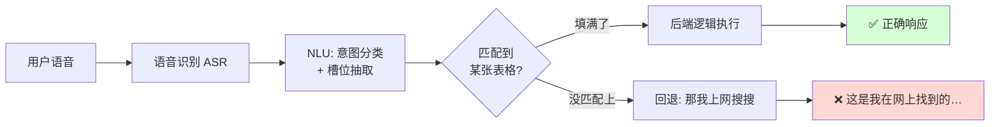
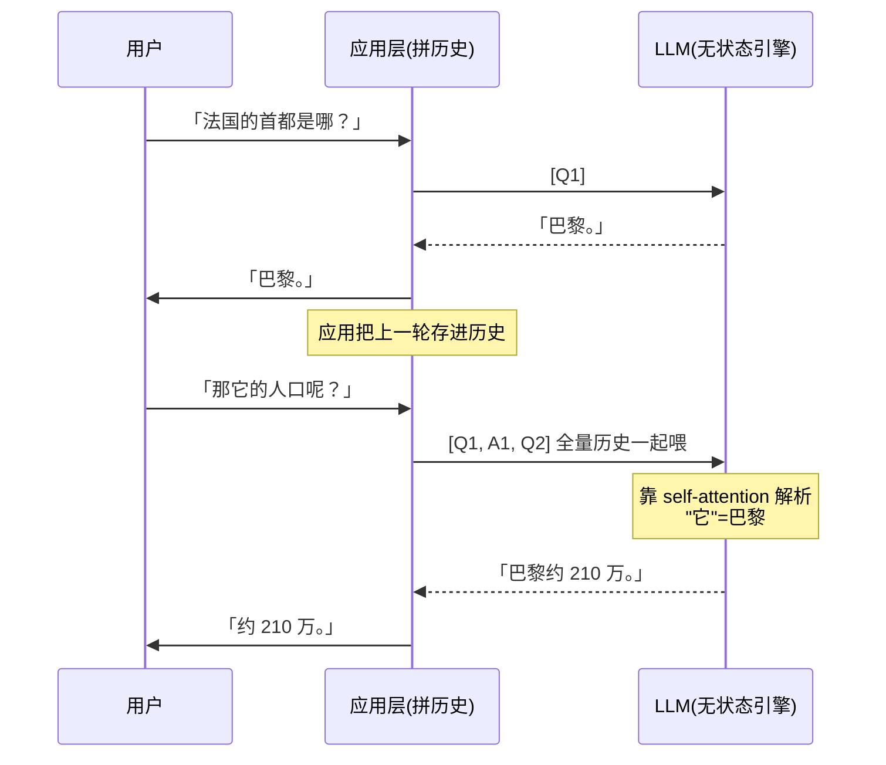
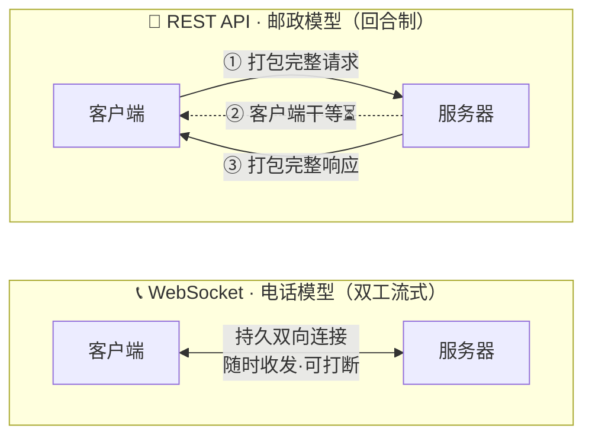
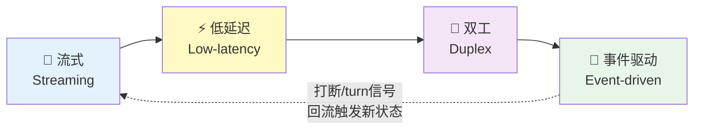
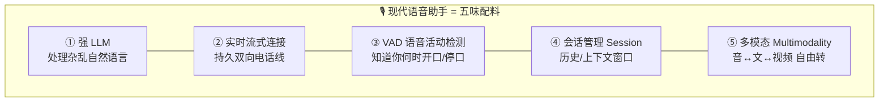
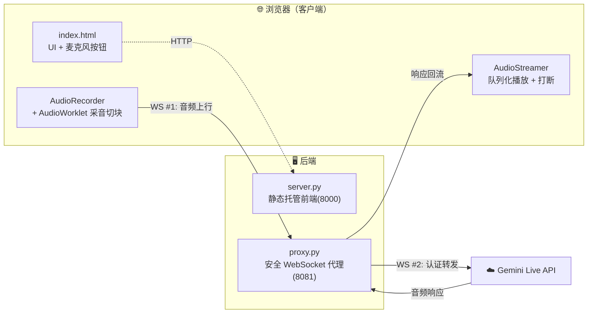
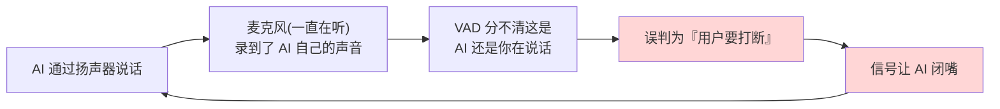
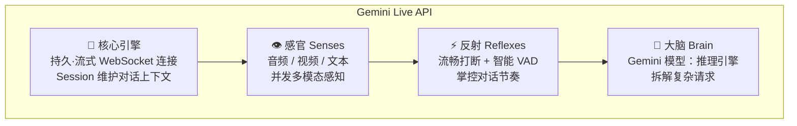
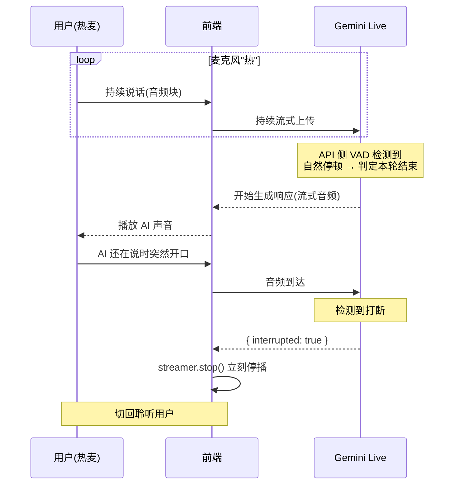
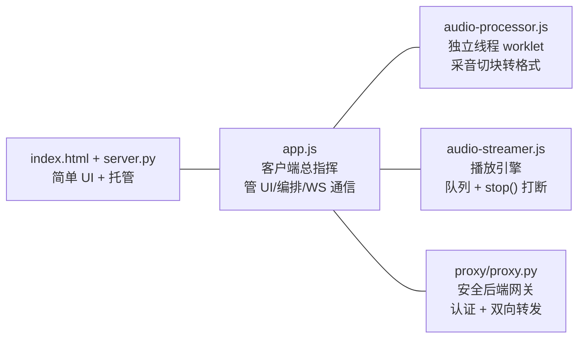

# 第 2 章 · 为实时 AI 交互做架构（Architecting for Real-Time AI Interaction）

> 对应原书 *Multimodal Real-Time AI Agent Systems*（Heiko Hotz & Sokratis Kartakis, O'Reilly Early Release）第 2 章，PDF 第 50–93 页。
>
> 本章的核心命题只有一句话：**为什么科幻电影里那种「和电脑自然对话」的体验，直到 WebSocket + Transformer 这对组合出现才真正可能**。我们会先解剖第一代语音助手（Siri / Alexa）的架构病灶，再讲透「流式（streaming）、低延迟（low-latency）、双工（duplex / bidirectional）、事件驱动（event-driven）」这四大实时架构支柱，最后动手用 Gemini Live API 从零搭一个可打断、可对话的实时语音应用。

---

## 🗺️ 本章地图

```mermaid
mindmap
  root((实时 AI 交互<br/>架构))
    第一代为何失败
      Intent + Slot 填表模型
      回合制 turn-based
      无上下文 stateless
      "帮你在网上搜到了…"
    两根新支柱
      Transformer
        self-attention 抓上下文
        LLM 本质 stateless
        全量历史回灌 = 记忆魔术
      WebSocket
        邮政 vs 电话 比喻
        持久 双向 连接
        可打断 low dead-air
    四大架构属性
      流式 Streaming
      低延迟 Low-latency
      双工 Duplex
      事件驱动 Event-driven
    现代语音助手解剖
      强 LLM
      实时流式连接
      VAD 语音活动检测
      会话管理 Session
      多模态 Multimodality
    动手实战
      两服务器架构
      浏览器回声消除 AEC
      Gemini Live API
      Hot Mic 热麦模型
      AudioWorklet 高性能音频
      Streamer + 打断 stop()
```

学完本章你会拿到三样东西：
1. **一套心智模型**——能一眼看穿任何「实时 AI」系统是不是真的实时，还是套着流式外衣的回合制假货。
2. **四大架构属性的第一性理解**——流式、低延迟、双工、事件驱动，每一个都能讲清「是什么 / 为什么 / 怎么用 / 代价」。
3. **一个能跑的完整语音 App**——浏览器采音 → 代理转发 → Gemini Live 推理 → 浏览器播放，全链路可打断。

> ⚠️ **本章边界**：原书特别强调，这一章造的是**语音助手（voice assistant）**，不是完整的**智能体（agent）**。区别在于：agent 有记忆、能替你执行动作（调工具、改数据库）；voice assistant 只让你「说话对话」。真正的 agent 要到本书第 3 部分才建。本讲义严格贴合这个边界。

---

## 一、📻 第一代的溃败：为什么 Siri 和 Alexa 从没配得上宣传

### 1.1 一段「看起来像对话」的对话

2011 年 iPhone 4s 发布，Siri 登场，全世界以为科幻照进现实了。但很快，那层「对话」的幻象就碎了。原书给了一个极其精准的例子：

```
用户：「嘿，帮我找几家不错的意大利餐厅。」
助手：「好的，我找到几家。你想要城里哪个区域的？」
用户：「嗯，我办公室附近的吧。」
助手：「这是我在网上帮你搜到的关于『我办公室附近的吧』的结果。」
```

前两轮天衣无缝，第三轮直接原地爆炸。**助手把「我办公室附近的吧」当成了一个要拿去网页搜索的字符串**，完全不知道这句话是在延续「找意大利餐厅」这个上下文。

> 🔬 **第一性原理：这不是 bug，是架构宿命**
>
> 这个失败不是某个工程师写错了 if-else，而是**整个系统的架构范式（paradigm）根本不具备承载对话的能力**。它从设计之初就不打算「理解上下文」，它只想「匹配命令」。你换任何一个更聪明的程序员都救不了，因为病根在架构层。

### 1.2 病灶解剖：Intent（意图）+ Slot（槽位）填表机

第一代助手的骨架是一套刚性的 **Intents & Slots** 模型。它的全部工作就两步：

1. **识别 Intent**：搞清楚你想触发哪条预定义命令。
2. **抽取 Slots**：从你的句子里挖出这条命令需要的关键参数。

以「嘿 Siri，播放 Queen 的 *Bohemian Rhapsody*」为例：

| 环节 | 系统的动作 | 结果 |
|---|---|---|
| Intent 识别 | 匹配到预定义意图 | `PlayMusic` |
| Slot 抽取 1 | 找 `song_title` | `Bohemian Rhapsody` |
| Slot 抽取 2 | 找 `artist_name` | `Queen` |
| 执行 | 把槽位塞进后端逻辑 | 播放歌曲 ✅ |

**本质上，它就是在填一张表格（filling out a form）。** 只要你说的话恰好能把某张预定义表格的空格填满，它工作得很好。



### 1.3 崩溃的临界点

现在你说：「我想听点 70 年代的摇滚。」

- 大概率**没有**一张预定义表格叫「按年代+风格随便推荐」。
- 系统匹配不到 Intent，也就填不了任何 Slot。
- 于是整个流程崩掉，回退到那句经典的：**「这是我在网上帮你找到的…」**

> 💡 **一句话记住第一代的病**
>
> 我们以为在和它对话，其实我们只是在拼命说出「能成功填满它某张表格的咒语」。最后我们没得到一个学会我们语言的助手，我们得到的是一个**逼我们去学它语言**的助手。

> 🎯 **面试高频**：「第一代语音助手为什么做不了多轮上下文对话？」
> 标准答案要点：① Intent/Slot 是**离散封闭**的分类问题，泛化能力接近零；② 系统**无状态、回合制（turn-based）**，每一轮独立处理，不携带历史语义；③ 一旦落到预定义意图集合之外就只能回退网页搜索。根因是架构范式，不是模型精度。

---

## 二、🧠 对话的新地基：两根支柱

要造出真正的对话，需要两块新地基同时到位。原书反复强调一句非常重要的话：**「WebSocket 和强大的 LLM，任何一个单独拿出来都不够。」**

- 只有一条实时双向连接、底层却听不懂上下文 → 白搭（无脑的电话线）。
- 只有一个绝顶聪明的 LLM、连接却是慢吞吞的回合制 REST → 残废（天才被慢连接卡死）。

**两者缺一不可，这是任何真正对话式 AI 不可协商（non-negotiable）的新地基。**

### 2.1 支柱一：Transformer —— 让 AI 抓住「上下文」

2017 年 Google 的 *Attention Is All You Need* 给出了 Transformer 架构蓝图。它革命性的地方在于：**极其擅长在长序列里理解上下文（context）**，这直接铺就了今天大语言模型（LLM）的路。

核心机制是 **自注意力（self-attention）**。第一代助手孤立地看每个词，而 self-attention 让模型能衡量句子里**每个词相对于其他每个词的重要性**。

原书的经典例句：

> He dropped the glass on the floor, and it shattered.
> （他把玻璃杯掉在地上，它碎了。）

人类瞬间就知道「it」指的是「glass（玻璃杯）」而不是「floor（地板）」。Transformer 复现了这种直觉——处理「it」时，self-attention 回望前文，计算出「glass」比「floor」更可能是「shattered（碎了）」的主语。

> 🔬 **第一性原理：不是匹配关键词，而是映射关系**
>
> 第一代是 keyword matching（关键词匹配），Transformer 是 mapping context（上下文映射）。前者问「句子里有没有出现某个词」，后者问「这些词彼此之间是什么关系」。理解关系的能力，才让 AI 第一次抓住了人类语言的**微妙之处（nuance）**。

用一张对比表钉死这个飞跃：

| 维度 | 第一代 (Intent/Slot) | Transformer / LLM |
|---|---|---|
| 处理粒度 | 孤立看词、抽槽位 | 全句相互加权 (self-attention) |
| 是否懂上下文 | ❌ 不懂 | ✅ 懂长距离依赖 |
| 泛化能力 | 封闭集合，出集即崩 | 开放语言，未见过也能推 |
| 「it 指代谁」 | 无法处理 | 自动归因到 glass |
| 落集外输入 | 回退网页搜索 | 照样推理生成 |

### 2.2 一个新麻烦：LLM 本质是「无状态」的

Transformer 带来了理解力，却也带来了新的实现难题：**LLM 本质上是无状态（stateless）的**。原书打了个绝妙的比方——

> LLM 记不住上一轮对话，就像**计算器记不住上一次运算**一样。

那 ChatGPT 明明「记得」我们刚聊的东西？这靠的是一个**记忆魔术（memory trick）**：

> 我们把 LLM 当成一个**无状态的文本处理引擎**，在**每一轮**都把**整段对话历史**重新喂给它。这样就模拟出了「记忆」。



关键点：LLM 之所以能正确解读「它的人口」中的「它 = 巴黎」，是因为**应用层把 Q1、A1、Q2 整段历史一起发过去了**，而不是只发最新那句。**记忆不在模型里，记忆在「每次回灌历史」这个工程动作里。**

> ⚠️ **常见坑：把「记忆魔术」当成免费午餐**
>
> 这个 trick 的代价是——**上下文越长，每一轮要发的数据就越大、越慢、越贵**。对文本聊天（回合制）还能忍，但一旦要做**实时语音对话**，这个不断膨胀的历史块在传统 Web 技术上来回传，就会**慢、卡、完全不可用**。这就把我们逼向第二根支柱。

### 2.3 支柱二：WebSocket —— 从「邮政」升级到「电话」

罪魁祸首是 **REST API**——长期以来 Web 世界的通用通信方式。原书用了一个人人秒懂的比喻：

**REST API = 邮政服务（postal service）**

> 你（客户端）把一个**完整的请求**打包好 → 寄出去 → **等** → 服务器收到、思考、把**完整的响应**打包好 → 寄回来。

对回合制的文字聊天，这种「寄信—等回信」的事务型（transactional）模型没问题。但要做**真正的实时对话**，它就彻底不行了。

**解决方案：把邮政换成电话（telephone）。最流行的技术就是 WebSocket。**

**WebSocket = 电话服务**

> 不是寄一封信等回信，而是**开一条持久的、双向的连接——一条永远在线的电话线**。因为线一直开着，双方随时都能说话。你可以**打断**助手，助手也可以**在你还没说完时就开始回应**。



这种 **双向流式（bidirectional streaming）** 正是消灭「死气（dead air，尴尬空白）」、让对话真正流畅鲜活的关键。

> 💡 **一图记住两根支柱的分工**
>
> - Transformer 负责**「听得懂」**（理解上下文）——给 AI 一颗懂语言的大脑。
> - WebSocket 负责**「插得进嘴」**（实时双向）——给 AI 一张能实时说话、能被打断的嘴。
> - 两者相乘，才等于「真正的对话」。

---

## 三、🏛️ 四大架构属性：流式 · 低延迟 · 双工 · 事件驱动

这一节是本章要点的核心。前面讲的 Transformer + WebSocket，落到**架构属性**上，可以提炼成四个必须同时满足的性质。它们不是四个独立特性，而是一套互相咬合的系统。



### 3.1 🌊 流式（Streaming）

| 项目 | 内容 |
|---|---|
| **是什么** | 数据以连续小块（chunk）持续流动，而非攒成一个完整大包再一次性传输。音频每 ~2048 采样点就切一块发出去；LLM 回复也是逐块（token/音频帧）返回。 |
| **为什么** | ① 用户不必等「整句说完 / 整段生成完」才开始处理；② AI 可以**在你还没说完时就开始理解**、边生成边播放，把首字延迟（time-to-first-byte）压到最低。 |
| **怎么用** | 前端 `AudioWorklet` 把麦克风流切块 → WebSocket 逐块 `send`；后端 `async for` 逐块转发；播放端用队列（queue）把回流的音频块缝成连续声音。 |
| **代价** | 需要处理**分块边界**：音频块拼接不当会产生咔哒声（clicks/pops）；需要缓冲队列平滑播放；协议更复杂。 |

> 🔬 **第一性原理**：流式的本质是**把「批处理（batch）」拆成「管道（pipeline）」**。批处理的延迟 = 最慢环节的总耗时；管道的延迟 ≈ 第一块流过管道的时间。对话体验对「首响应延迟」极度敏感，所以必须流式。

### 3.2 ⚡ 低延迟（Low-latency）

| 项目 | 内容 |
|---|---|
| **是什么** | 从用户停止说话到听到 AI 开口的时间窗口尽可能短（人类自然对话的轮换间隔约 200ms 量级，超过就会明显「卡顿感」）。 |
| **为什么** | 对话的「自然感」几乎完全由延迟决定。REST 的「寄信等回信」天然引入完整往返 + 排队 + 冷启动，无法满足。 |
| **怎么用** | ① 用持久 WebSocket 省掉每轮重新握手；② 流式让首块尽早返回；③ 音频重活挪到独立高优先级线程（`AudioWorklet`）避免主线程阻塞；④ 就近部署（region）缩短物理往返。 |
| **代价** | 为了低延迟要牺牲一部分简单性（引入 worklet、队列、双服务器）；模型侧要用为实时优化的 `*-flash-live` 变体，可能牺牲一点单次质量换速度。 |

> ⚠️ **常见坑**：很多「伪实时」系统前端看着在流式打字，但后端其实是等 LLM 整段生成完才开始往外吐，首响应延迟一点没降。判断真伪实时的金标准是：**首个可感知的响应块，是否在完整生成之前就到达了用户**。

### 3.3 🔁 双工（Duplex / Bidirectional）

| 项目 | 内容 |
|---|---|
| **是什么** | 通信双方可以**同时**收发，而不是「你说完我才能说」的半双工（half-duplex，对讲机模式）。 |
| **为什么** | 真实人类对话充满重叠：你话没说完对方就点头、插话、打断。**双工是「可打断（interruptibility）」的物理前提**——没有双工，AI 说话时根本听不到你在说话。 |
| **怎么用** | WebSocket 天生全双工。后端用 `asyncio.gather()` 同时跑两个方向的转发协程：`forward_client_to_gemini`（上行音频）和 `forward_gemini_to_client`（下行响应），两条流独立并行。 |
| **代价** | 并发编程复杂度上升（要同时管理两个方向、处理竞态、正确关闭连接）；打断逻辑要精细（收到 `interrupted` 要立刻停播 + 清空队列）。 |

原书里那句 `asyncio.gather()` 的注释一针见血：

```python
await asyncio.gather(
    forward_client_to_gemini(client_ws, gemini_session),   # 上行：浏览器 → Gemini
    forward_gemini_to_client(client_ws, gemini_session),   # 下行：Gemini → 浏览器
)
```

> **逐行讲解**：`asyncio.gather()` 让两个协程「同时运行」。这正是真正双向「电话线」的精髓——两端可以**各自独立**地发送数据，互不阻塞。少了它，你就只能「先收完再发」，退化回半双工。

### 3.4 📨 事件驱动（Event-driven）

| 项目 | 内容 |
|---|---|
| **是什么** | 系统不主动轮询「有没有新数据」，而是被**事件**触发：一块音频到了、VAD 判定用户说完了、检测到打断、一轮结束（turn_complete）……每个事件触发对应的处理器（handler）。 |
| **为什么** | 实时对话里「什么时候发生什么」是不可预测的——用户可能随时打断，AI 可能随时吐出下一块音频。事件驱动是应对这种**异步、不可预测**流的唯一自然模型。 |
| **怎么用** | 前端 `ws.onmessage` 根据消息类型分派：`interrupted` → 停播；`inline_data` → 播音；`turn_complete` → 转听。后端 `async for message in client_ws` 逐事件消费。 |
| **代价** | 控制流从「顺序脚本」变成「回调 / 处理器网络」，可读性下降；状态散落在各 handler，需要显式的会话状态管理（session state）。 |

原书前端那段 `ws.onmessage` 就是事件驱动的教科书范例（后文详解）：一个 handler，靠消息里的字段判定「这是什么事件」，再分派到「停播 / 播音 / 转听」三条路径。

> 💡 **四属性一句话串联**：**流式**把数据切成流，**低延迟**要求这条流尽快见效，**双工**让两条流同时对冲（才能打断），**事件驱动**决定每一块流到达时该干嘛。四者缺一，实时对话就塌一角。

> 🎯 **面试高频**：「设计一个实时语音对话系统，你会关注哪些架构属性？」
> 按「流式 / 低延迟 / 双工 / 事件驱动」四点展开，每点都能说出「是什么—为什么—代价」，再补一句「底层用 WebSocket 承载全双工 + Transformer 承载上下文理解」，基本就是满分框架。

---

## 四、🔬 现代语音助手的解剖：五味「配料」

有了架构属性，原书给出了搭一套对话式 AI 系统的**配料清单（ingredient list）**——五样缺一不可：



| # | 配料 | 作用 | 对应架构属性 |
|---|---|---|---|
| ① | **强大的 LLM** | 处理杂乱、自然的人类语言（核心大脑） | 上下文理解 (Transformer) |
| ② | **实时流式连接** | 持久、双向的「电话线」承载音频流 | 流式 + 低延迟 + 双工 |
| ③ | **VAD（语音活动检测）** | 判断用户何时开始/结束说话，实现自然轮换与打断 | 事件驱动的触发源 |
| ④ | **会话管理（Session）** | 维护对话历史（记忆魔术）、管理上下文窗口 | 状态化 (stateful) |
| ⑤ | **多模态（Multimodality）** | 无缝处理不同输入输出：音→音、音→文、文→音、视频→… | 感知能力 |

> ⚠️ **常见坑：只堆配料不管咬合**。五样配料不是独立零件，而是互相依赖：VAD 产生的「用户说完了」事件驱动 LLM 开始生成；会话管理决定每次喂给 LLM 的历史长度；流式连接决定这一切能否实时发生。缺了会话管理，多轮上下文就断；缺了 VAD，就退回「push-to-talk 按住说话」的对讲机体验。

好消息：**今天不必从零手搓这整套栈**。像 Google 的 **Gemini Live API** 这类现代平台，把这五样开箱即用地封装好了。下面进入动手环节。

---

## 五、🛠️ 动手实战：从零搭一个实时语音 App

### 5.1 架构总览：为什么是「两个服务器」

我们要造一个**浏览器端、实时、音频对音频（audio-to-audio）**的聊天应用。它有两个协同工作的服务器：



| 组件 | 角色 | 端口 |
|---|---|---|
| **客户端应用** | HTML/CSS/JS，跑在浏览器：管 UI、采麦克风、放 AI 声音 | 8000（由 server.py 托管） |
| **后端 WebSocket 代理** | 小而关键的 Python 服务器：**认证** + 转发音频 + 中转响应；下一章还会加工具处理逻辑 | 8081 |

**注意**：这个架构需要**两条独立的 WebSocket 连接**——一条在「客户端 ↔ 代理」之间，一条在「代理 ↔ Live API」之间。这是构建**安全、企业级** AI 应用的基石。

> 🔬 **第一性原理：代理（proxy）为什么不可省？**
>
> 因为**认证凭据（credentials）绝不能出现在浏览器**。浏览器里的任何 JS 代码用户都能看到，把 GCP 服务账号密钥放前端 = 把家门钥匙贴在门上。代理把凭据牢牢锁在服务器端，浏览器永远碰不到。这是安全的硬约束，不是架构洁癖。

### 5.2 为什么用 Web App？浏览器自带的回声消除（AEC）

一个很自然的质疑：「两个服务器好复杂，为啥不直接写个 Python + PyAudio 读麦克风？」答案揭示了语音 AI 的一个致命难题——**反馈回路（feedback loop）**。

**声学回声（acoustic echo）的死亡循环**：



结果：助手永远说不完一句话，体验支离破碎、结结巴巴。

- **纯 Python 方案的出路**：要么逼用户戴耳机（体验糟糕），要么自己实现 **AEC（Acoustic Echo Cancellation，声学回声消除）**——这是信号处理里出了名难的问题，要实时分析输出音频信号并从麦克风输入里减掉它。
- **浏览器方案的杀手锏**：Google / Mozilla / Apple 为了 Google Meet、Discord、FaceTime 打磨了多年，把**硬件加速的 AEC 直接内建进了浏览器媒体栈**。当你用浏览器 API 请求麦克风权限时，**AEC 是白送的**——浏览器自动在音频进入你的 JS 之前就滤掉了自己的输出声音。

| 方案 | AEC 怎么解决 | 复杂度 | 体验 |
|---|---|---|---|
| 纯 Python + PyAudio | 自己写 AEC，或逼用户戴耳机 | 极高（信号处理难题） | 差 |
| **Web App（本书选择）** | **浏览器白送硬件加速 AEC** | 换成两服务器的少量复杂度 | 好，无需耳机 ✅ |

> 💡 **架构权衡（trade-off）的典范**：我们**主动接受**「两服务器」的一点设置复杂度，来**彻底绕开**回声消除这个大坑。把难题**外包给已经解决它的浏览器开发者**——这是全章最优雅的架构决策。

### 5.3 Gemini Live API：感官 · 反射 · 大脑

Gemini Live API 不是传统 API，而是一整套构建「能感知、会推理、可实时交互」应用的工具箱。原书用三个拟人比喻讲透它：



**🔌 核心引擎**：最重要的一点——Live API **只在 WebSocket 上工作**。连接内建立一个 **session（会话）**，维护对话上下文，让 AI「记得」之前说过什么。这个**流式、有状态**的地基，是后面一切特性的前提。

**👁️ 感官（多模态感知）**：一个 session 里可并发流入三种输入：
- **音频**：不只是转录，API 理解语音的细微处，能判断「说了什么」和「何时在说」——自然轮换的关键。
- **视频**：摄像头/屏幕共享可与音频并流，给 AI「眼睛」（比如看着技师修机器、看着学生的数学题）。
- **文本**：传统文字命令，作为后备或补充输入。

**⚡ 反射（对话动态）**：
- **流畅打断（Fluid Interruptibility）**：用户在 AI 说话时开口，API 立刻检测到并**发信号让应用切断 AI 音频**——终结「干等机器人念完独白」的尴尬。
- **智能 VAD**：持续分析音频流判断「谁在说、何时说完」，能把主讲人和背景噪声区分开（不会被路过的车、旁边的闲聊带偏）。需要极致控制时，VAD **可调参甚至完全关闭**，自己实现「按住说话（push-to-talk）」。

**🧠 大脑**：核心的 Gemini 模型不只是语言模型，而是一个**推理引擎**——理解对话细微处、调动庞大知识、把复杂请求拆成可执行步骤。它把感官（音/视/文）的综合输入 + 反射管理的对话流，一起分析出最佳行动。

### 5.4 交互模型：Hot Mic（热麦）+ 流畅对话

我们不做传统的「Start / Stop 按住说话」，而是造一个更雄心、更流畅的 **「热麦（hot mic）」** 模型。它靠三条核心原则：**持久流（persistent streams）+ 本地用户控制（local control）+ API 驱动的轮次检测（API-driven turn detection）**。

**UI：没有 Stop 按钮，只有一个切换按钮**

| 操作 | 行为 |
|---|---|
| **第一次按** | 激活整个 session，按钮变色表示麦克风「热」了，音频开始持续流向 Gemini |
| **第二次按（Mute）** | 静音麦克风，音频流停，但**会话仍然存活** |
| **第三次按（Unmute）** | 取消静音，恢复音频流 |

**没有 Stop 按钮，助手怎么知道该回应了？** 全靠 Live API 的两个智能特性：



- **API 侧 VAD**：麦克风热时前端持续送音频块，API 内部 VAD 分析流，一旦检测到用户说话的**自然停顿**，自动判定本轮结束、开始生成响应。
- **流畅打断**：热麦下用户无需等 AI 说完，一开口 API 立刻检测、发 `interrupted` 信号，前端代码瞬间停掉 AI 声音去听新命令。

> 🎯 **面试高频**：「push-to-talk 和 hot-mic（VAD 驱动）有什么区别？各自代价？」
> push-to-talk：用户显式按住/松开界定回合，实现简单、无误触，但体验僵硬像对讲机；hot-mic：靠 VAD 自动界定回合 + 支持打断，体验自然，但代价是 VAD 误判风险（背景噪声、抢话）、以及必须解决声学回声。

### 5.5 项目结构与两服务器骨架

**目录结构**（原书用 `mkdir`/`touch` 逐条创建）：

```
gemini-live-agent/
├── frontend/
│   ├── index.html         # UI 主页面
│   ├── app.js             # 客户端主逻辑（总指挥）
│   ├── audio-processor.js # 高性能音频 worklet（切块+转格式）
│   └── audio-streamer.js  # AI 音频播放引擎（队列+打断）
└── backend/
    ├── server.py          # 托管前端的简单服务器
    └── proxy/
        ├── proxy.py           # 安全 WebSocket 代理
        ├── requirements.txt   # Python 依赖
        └── .env               # 环境变量（凭据配置）
```

**① 前端静态服务器 `server.py`**——为什么需要它？因为浏览器出于安全策略（CORS，跨源资源共享），**不允许用 `file:///` 直接打开的网页去和服务器通信**，必须用 HTTP「服务」出去。

```python
# file: backend/server.py
from http.server import HTTPServer, SimpleHTTPRequestHandler
import os

class CORSRequestHandler(SimpleHTTPRequestHandler):
    """给响应加 CORS 头，允许和另一端口(8081)的代理通信"""
    def end_headers(self):
        self.send_header('Access-Control-Allow-Origin', '*')   # 允许任意源
        self.send_header('Access-Control-Allow-Methods', 'GET')
        self.send_header('Cache-Control', 'no-store, no-cache, must-revalidate')  # 禁缓存，改代码即生效
        return super().end_headers()

if __name__ == '__main__':
    os.chdir(os.path.dirname(os.path.abspath(__file__)))
    os.chdir('../frontend')          # 从 frontend 目录提供文件
    port = 8000
    httpd = HTTPServer(('localhost', port), CORSRequestHandler)
    httpd.serve_forever()
```

> **逐行要点**：`CORSRequestHandler` 加的那几个响应头，是在告诉浏览器「运行在 8000 端口的网页，去请求 8081 端口的代理是 OK 的」。没有这个，跨端口请求会被浏览器直接拦掉。

**② 依赖与配置**：

```txt
# requirements.txt
websockets      # WebSocket 服务端
google-genai    # Gemini/Vertex 官方 SDK
python-dotenv   # 读 .env
```

认证有两条路（`.env` 二选一）：

| | 路径 1：Vertex AI（ADC） | 路径 2：Gemini API Key |
|---|---|---|
| 定位 | 企业级、最安全，本地开发/云端都用 | 快速测试、轻量项目 |
| `.env` | `GOOGLE_GENAI_USE_VERTEXAI=1`<br/>`GOOGLE_CLOUD_PROJECT="..."`<br/>`GOOGLE_CLOUD_LOCATION="us-central1"` | `GOOGLE_GENAI_USE_VERTEXAI=0`<br/>`GOOGLE_API_KEY="..."` |
| 凭据来源 | `gcloud auth application-default login`（无需密钥文件） | 从 Google AI Studio 拿 key |

> ⚠️ **常见坑**：走 Vertex 路径时务必保证 `GOOGLE_API_KEY` **为空**，否则 SDK 可能走错分支；反之走 API Key 路径要把 `GOOGLE_GENAI_USE_VERTEXAI` 设 `0`。

**③ 代理骨架 `proxy.py`（占位版）**——先只做两件事：初始化 Google 连接 + 起一个能接受连接的 WebSocket 服务器。

```python
# file: backend/proxy/proxy.py（骨架）
import asyncio, os, websockets
from google import genai
from dotenv import load_dotenv
load_dotenv()

client = None
PROJECT_ID = os.environ.get("GOOGLE_CLOUD_PROJECT")
if PROJECT_ID:                                   # 优先尝试 Vertex AI
    LOCATION = os.environ.get("GOOGLE_CLOUD_LOCATION", "us-central1")
    try:
        client = genai.Client(vertexai=True, project=PROJECT_ID, location=LOCATION)
    except Exception as e:
        print(f"Vertex 失败: {e}，回退 API key")
        client = None

if not client:                                   # 回退到 API Key
    API_KEY = os.environ.get("GEMINI_API_KEY")
    if API_KEY:
        client = genai.Client(api_key=API_KEY)

if not client:
    raise ValueError("无法创建 client，检查 .env 配置")   # 快速失败

# --- 占位处理器：只打日志 ---
async def handle_connection(client_ws, path):
    print(f"客户端连接：{client_ws.remote_address}")
    try:
        await client_ws.wait_closed()
    finally:
        print(f"{client_ws.remote_address} 断开")

async def main():
    port = 8081
    async with websockets.serve(handle_connection, "localhost", port):
        print(f"WebSocket 代理启动于 ws://localhost:{port}")
        await asyncio.Future()   # 永远阻塞，保持服务器存活

if __name__ == "__main__":
    asyncio.run(main())
```

> **这个骨架做了两个关键测试**：① `genai.Client()` 若 `GOOGLE_CLOUD_PROJECT` 配错会**立即启动失败**，给你快速反馈；② `websockets.serve` 起一个能接连接的服务器。
> **✅ 检查点**：两个终端分别跑 `python frontend/server.py`（见 8000 启动）和 `python backend/proxy.py`（见认证成功 + 8081 启动）。浏览器开 `localhost:8000` 看到页面，代理终端出现「Client connected → disconnected」即成功。

### 5.6 前端：采集并流式发送用户音频

**关键工具：`AudioWorklet`**——原始音频处理很吃 CPU，若放在**主线程**（同时管 UI）会让页面卡顿。`AudioWorklet` 是跑在**独立高优先级音频线程**的脚本，保证处理音频时 UI 依然丝滑。这正是 §3.2「低延迟」里说的「重活挪出主线程」。

```javascript
// file: frontend/audio-processor.js
class AudioProcessor extends AudioWorkletProcessor {
  buffer = new Int16Array(2048);   // 攒够 2048 个采样点再发
  bufferIndex = 0;

  process(inputs) {
    const channelData = inputs[0][0];        // 取第一个输入的第一个声道
    if (!channelData) return true;           // 防空输入
    for (let i = 0; i < channelData.length; i++) {
      // ① 格式转换：Float32(-1.0~1.0) → Int16(-32768~32767)
      this.buffer[this.bufferIndex++] = channelData[i] * 0x7FFF;
      // ② 缓冲满了就发给主线程（发一份拷贝，避免复用冲突）
      if (this.bufferIndex === this.buffer.length) {
        this.port.postMessage(this.buffer.buffer.slice(0));
        this.bufferIndex = 0;
      }
    }
    return true;   // 返回 true = 继续处理
  }
}
registerProcessor('audio-processor', AudioProcessor);
```

> **逐行讲解**：worklet 干两件事——**转格式**（浮点转 16 位整型 PCM，Gemini 要这个格式）和**切块**（每 2048 采样点一块，这就是 §3.1 流式的物理实现）。`0x7FFF` = 32767，是 Int16 的正向最大值，用来把 [-1,1] 缩放到整型范围。

**指挥者：`AudioRecorder` 类** —— 封装麦克风 + worklet 的编排。

```javascript
// file: app.js（开头）
class AudioRecorder {
  constructor() { this.audioContext = null; this.workletNode = null; this.stream = null; }
  async start() {
    // ① 向用户请求麦克风权限（此处顺带白拿浏览器 AEC）
    this.stream = await navigator.mediaDevices.getUserMedia({ audio: true });
    // ② Gemini 要求 16kHz 采样率
    this.audioContext = new AudioContext({ sampleRate: 16000 });
    await this.audioContext.audioWorklet.addModule('audio-processor.js');
    this.workletNode = new AudioWorkletNode(this.audioContext, 'audio-processor');
    // ③ 把麦克风流接到 worklet，开始处理
    const source = this.audioContext.createMediaStreamSource(this.stream);
    source.connect(this.workletNode);
  }
}
```

**接线：把音频块发给代理**——worklet 每吐一块，就 Base64 编码塞进 Gemini 期望的 JSON 结构，经 WebSocket 发出：

```javascript
// file: app.js
const ws = new WebSocket('ws://localhost:8081');
const recorder = new AudioRecorder();

micButton.addEventListener('click', async () => {
  await recorder.start();
  recorder.workletNode.port.onmessage = (event) => {          // ← 事件驱动！worklet 发来块
    const base64String = btoa(String.fromCharCode(...new Uint8Array(event.data)));
    const message = { realtimeInput: { mediaChunks: [{ mime_type: "audio/pcm", data: base64String }] } };
    if (ws.readyState === WebSocket.OPEN) ws.send(JSON.stringify(message));
  };
});
```

> ✅ **检查点（单向流）**：刷新页面 → 点 Start → 允许麦克风 → 说话。代理终端应看到「Client connected」后随你说话滚动一串编码字符串（音频数据）。看到数据到达 = 采集与上行流式已通。

### 5.7 后端：实现安全代理逻辑（双工核心）

把占位 `handle_connection` 升级为真正的双向网关：先做一次「握手」收 setup 消息 → 连 Gemini → 用 `asyncio.gather` 并行跑两个方向。

```python
# file: backend/proxy/proxy.py（升级版）
import json, base64
from google.genai import types

async def handle_connection(client_ws, path):
    try:
        # ① 等客户端首条 setup 消息（10 秒超时）并校验
        setup_message_str = await asyncio.wait_for(client_ws.recv(), timeout=10)
        setup_data = json.loads(setup_message_str)
        if 'setup' not in setup_data or 'model' not in setup_data['setup']:
            await client_ws.close(1003, "首条消息必须是含 'model' 的 setup 对象")
            return
        session_config = setup_data['setup']

        # ② 用 setup 信息连 Gemini Live API
        async with client.aio.live.connect(
            model=session_config['model'],
            config=session_config.get('generation_config', {})
        ) as gemini_session:
            # ③ 双工核心：两个方向并行跑
            await asyncio.gather(
                forward_client_to_gemini(client_ws, gemini_session),
                forward_gemini_to_client(client_ws, gemini_session),
            )
    except (asyncio.TimeoutError, json.JSONDecodeError, KeyError) as e:
        await client_ws.close(1008, "无效或缺失的 setup 消息")
    except Exception as e:
        print(f"会话出错：{e}")
    finally:
        print("客户端断开")
```

**上行转发**（浏览器 → Gemini）——解码 Base64、包成 SDK 要的 `types.Blob`：

```python
async def forward_client_to_gemini(client_ws, gemini_session):
    try:
        async for message in client_ws:                    # ← 事件驱动：逐条消息
            data = json.loads(message)
            if 'realtimeInput' in data:
                chunk_data = data['realtimeInput']['mediaChunks'][0]['data']
                audio_bytes = base64.b64decode(chunk_data)
                audio_blob = types.Blob(data=audio_bytes, mime_type='audio/pcm;rate=16000')
                await gemini_session.send_realtime_input(audio=audio_blob)
    except websockets.exceptions.ConnectionClosed:
        print("-> 客户端连接关闭")
```

**下行转发**（Gemini → 浏览器）——注意那个「双重循环」的巧思：

```python
class BytesJSONEncoder(json.JSONEncoder):     # 把 bytes 编码成 base64 才能进 JSON
    def default(self, obj):
        if isinstance(obj, bytes):
            return base64.b64encode(obj).decode('utf-8')
        return super().default(obj)

async def forward_gemini_to_client(client_ws, gemini_session):
    try:
        while True:                            # 外层循环：跨多个对话回合 ← 关键
            async for response in gemini_session.receive():   # 内层：单个回合内所有消息
                if hasattr(response, 'model_dump'):
                    message_dict = response.model_dump()
                    json_message = json.dumps(message_dict, cls=BytesJSONEncoder)
                    await client_ws.send(json_message)
            # 内层结束后回到外层，等下一回合
    except websockets.exceptions.ConnectionClosed:
        print("<- 客户端连接关闭")
```

> ⚠️ **常见坑（原书特别标 CRITICAL）**：那个 `while True` 外层循环**不能省**。`gemini_session.receive()` 的 `async for` 只覆盖**一个回合**内的消息，回合结束它就退出。少了外层 `while True`，第二轮对话就再也收不到响应了——用户会觉得「AI 只回一句就死了」。

> ✅ **检查点（完整往返）**：在 `app.js` 里补发初始 setup 消息（指定 `model` 和 `response_modalities: ["audio"]`），刷新、开控制台、点 Start 说话。停顿后浏览器控制台应出现从 Gemini 经代理回流的 JSON 对象 = 全双工数据链路打通。此时还听不到声，因为播放端还没写。

### 5.8 前端：给 AI 一个声音 + 流畅打断

**播放引擎 `AudioStreamer`**——若来一块播一块会有咔哒/爆音/断裂，解法是**队列（queue）平滑连续播放**：

```javascript
// file: frontend/audio-streamer.js
export class AudioStreamer {
  constructor() {
    this.audioContext = new AudioContext({ sampleRate: 24000 });  // 注意：播放是 24kHz
    this.audioQueue = []; this.isPlaying = false; this.sourceNode = null;
  }
  async receiveAudioChunk(base64Audio) {
    const binaryString = atob(base64Audio);
    const bytes = new Uint8Array(binaryString.length);
    for (let i = 0; i < binaryString.length; i++) bytes[i] = binaryString.charCodeAt(i);
    const int16Array = new Int16Array(bytes.buffer);
    // 16 位 PCM → 32 位 Float（播放要浮点）
    const float32Array = new Float32Array(int16Array.length);
    for (let i = 0; i < int16Array.length; i++) float32Array[i] = int16Array[i] / 32768.0;
    const audioBuffer = this.audioContext.createBuffer(1, float32Array.length, 24000);
    audioBuffer.getChannelData(0).set(float32Array);
    this.audioQueue.push(audioBuffer);                 // 入队
    if (!this.isPlaying) { this.isPlaying = true; this.playNextChunk(); }
  }
  playNextChunk() {
    if (this.audioQueue.length === 0) { this.isPlaying = false; return; }
    this.isPlaying = true;
    const audioChunk = this.audioQueue.shift();
    this.sourceNode = this.audioContext.createBufferSource();
    this.sourceNode.buffer = audioChunk;
    this.sourceNode.connect(this.audioContext.destination);
    this.sourceNode.onended = () => this.playNextChunk();   // 播完一块自动接下一块 → 连续
    this.sourceNode.start();
  }
}
```

> 💡 **采样率的坑**：**采音是 16kHz，播音是 24kHz**——两个 `AudioContext` 用了不同的 `sampleRate`。这是因为 Gemini 输入侧期望 16kHz、输出侧音频是 24kHz。搞混会导致声音变调（快放/慢放）。

**打断的「紧急刹车」`stop()`**——Gemini 检测到你在 AI 说话时开口，会发 `{ "interrupted": true }`，我们要立刻停播 + 清队列：

```javascript
// audio-streamer.js（加进类里）
stop() {
  this.isPlaying = false;
  this.audioQueue = [];                    // 清空所有待播块
  if (this.sourceNode) {
    this.sourceNode.onended = null;        // 断开链条，防止它继续触发下一块
    this.sourceNode.stop();
    this.sourceNode = null;
  }
}
```

> **逐行要点**：`onended = null` 是精髓——若不断开，当前块 `stop()` 后仍会触发 `onended → playNextChunk`，队列虽空但链条没断，容易出诡异残响。这里把「链条、当前声、队列」三样一起清干净。

**事件驱动的总分派 `ws.onmessage`**——一个 handler 按消息类型分三路（这正是 §3.4 事件驱动的活教材）：

```javascript
// file: app.js
ws.onmessage = async (event) => {
  const response = JSON.parse(event.data);

  // ① 打断信号（用 ?. 可选链防空）
  if (response.server_content?.interrupted) {
    streamer.stop();
    statusElement.textContent = 'I was interrupted. Listening...';
    return;
  }
  // ② 音频数据 → 入队播放
  const audioData = response.server_content?.model_turn?.parts?.[0]?.inline_data?.data;
  if (audioData) {
    statusElement.textContent = 'Gemini is speaking...';
    await streamer.receiveAudioChunk(audioData);
  }
  // ③ 一轮结束
  if (response.server_content?.turn_complete) {
    if (!streamer.isPlaying) statusElement.textContent = 'Listening...';
  }
};
```

**热麦 UI 控制**——`AudioRecorder` 加 `mute()/unmute()`（靠 `connect/disconnect` worklet 实现），按钮做「首击起会话、后续切静音」状态机：

```javascript
// AudioRecorder 里
mute()   { if (this.source && this.workletNode) this.source.disconnect(this.workletNode); }
unmute() { if (this.source && this.workletNode) this.source.connect(this.workletNode); }

let isSessionActive = false, isMicMuted = false;
micButton.addEventListener('click', async () => {
  if (!isSessionActive) {                       // 首击：起 session
    await recorder.start();
    ws.send(JSON.stringify({ setup: { model: "gemini-2.0-flash-live-preview-04-09",
                                      generation_config: { response_modalities: ["audio"] } } }));
    isSessionActive = true;
    micButton.textContent = 'Mute Mic';
  } else {                                       // 后续：切静音
    isMicMuted = !isMicMuted;
    if (isMicMuted) { recorder.mute();   micButton.textContent = 'Unmute Mic'; }
    else            { recorder.unmute(); micButton.textContent = 'Mute Mic'; }
  }
});
```

> ✅ **最终检查点**：重启双服务器 → 刷新 → 点 Start 允许麦克风 → 说「给我讲个机器人的短故事」→ **它说话时你喊「停」**。AI 声音应几乎瞬间切断、状态转为「Listening...」。恭喜——你造出了一个**端到端、实时、可自然打断**的语音应用。

---

## 六、🧩 回扣架构：五个原则如何落地

原书最后把成品逐条对回开篇的架构原则，我们整理成一张对照表：

| 架构原则 | 在代码里的具体体现 | 对应四属性 |
|---|---|---|
| **流式范式（Streaming Paradigm）** | 彻底抛弃请求-响应模型；`proxy.py` 的 `async for` 循环 + AudioWorklet 的连续流 | 流式 + 低延迟 |
| **热麦 + 流畅打断** | 不用 push-to-talk，激活后持续听；靠 API 的 VAD 判定回合结束；`app.js` 监听 `interrupted` 调 `streamer.stop()` | 双工 + 事件驱动 |
| **安全后端代理** | `proxy.py` 用 `google-genai` 在服务端持有服务账号凭据；敏感凭据永不落到浏览器 | 安全（架构硬约束） |
| **高性能音频处理** | 把格式转换等重活挪进 `AudioWorklet`（`audio-processor.js`）独立线程，UI 不卡 | 低延迟 |
| **白嫖浏览器（AEC）** | 选择做 Web App，回声消除完全交给浏览器免费解决，无需耳机 | 体验（外包难题） |

**四个主文件各司其职**：



---

## 📌 小结

1. **第一代溃败的根因是架构范式，不是模型精度**：Intent/Slot 是「填表机」，回合制 + 无状态 + 封闭意图集，一旦落到预定义之外就崩，回退「网上帮你搜到了」。

2. **两根新支柱缺一不可**：**Transformer**（self-attention 抓上下文，但 LLM 本质无状态，靠「每轮回灌全量历史」的记忆魔术模拟记忆）+ **WebSocket**（从「邮政」升级到「电话」，持久双向连接，可打断、无死气）。任一单独都不够。

3. **四大实时架构属性**贯穿全章：
   - 🌊 **流式**：数据切块连续流动，把批处理拆成管道，压低首响应延迟。
   - ⚡ **低延迟**：持久连接 + 流式 + 重活挪出主线程 + 就近部署，代价是复杂度与质量的权衡。
   - 🔁 **双工**：全双工是「可打断」的物理前提，`asyncio.gather` 并行双向转发。
   - 📨 **事件驱动**：`onmessage`/`async for` 按事件类型分派（打断/播音/转听/上行），应对异步不可预测流。

4. **现代语音助手 = 五味配料**：强 LLM + 实时流式连接 + VAD + 会话管理 + 多模态，互相咬合缺一塌角。

5. **动手成品的三大架构决策**：① **两服务器 + 安全代理**（凭据锁在服务端）；② **选 Web App 白嫖浏览器硬件级 AEC**（绕开回声消除大坑）；③ **热麦交互模型**（VAD 驱动回合 + 流畅打断）。关键实现坑：采音 16kHz / 播音 24kHz 别搞混、下行转发的 `while True` 外层循环不能省、`stop()` 要断 `onended` 链 + 清队列。

6. **本章边界**：这是**语音助手**不是**智能体**——能听会说，但还不能记忆和替你执行动作。下一章会给它装上「工具」，让健谈者变成能干活的助手。

---

## 🔗 延伸阅读

- **原书出处**：Heiko Hotz & Sokratis Kartakis, *Multimodal Real-Time AI Agent Systems*, O'Reilly（Early Release）第 2 章，pp. 50–93。
- **Transformer 原始论文**：Vaswani et al., *Attention Is All You Need*（2017）——self-attention 的一切起点，配合本仓库 `sutskever-list/` 里 Transformer 章一起读。
- **WebSocket 协议**：RFC 6455——理解全双工持久连接的底层握手与帧格式。
- **Web Audio API / AudioWorklet**：MDN 文档，重点看 `AudioWorkletProcessor`、`AudioContext.sampleRate`、`getUserMedia` 的 `echoCancellation` 约束。
- **Gemini Live API**：Google 官方文档（Live API / Vertex AI Live），关注 session、`send_realtime_input`、VAD 配置与 `response_modalities`。
- **VAD 深入**：Silero VAD、WebRTC VAD——当你想「自己实现 push-to-talk 或自定义轮次逻辑」时的开源起点。
- **本仓库延伸**：`applied-rl/`、`llm-inference/` 里关于流式推理与低延迟服务的章节，可与本章「流式 + 低延迟」互相印证。
- **下一章预告**：第 3 章「Advanced Live Interactions」——给助手加系统指令塑造人格、加视频「眼睛」、加工具（function calling）「双手」，并部署到 Google Cloud Run。
