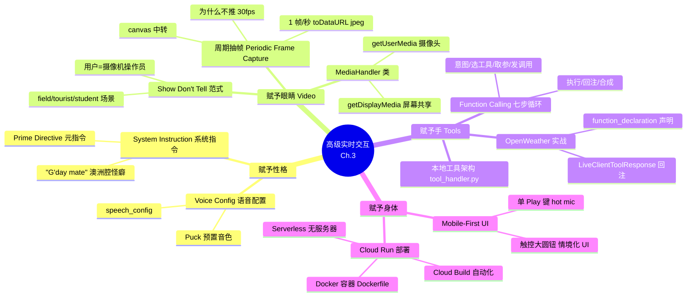
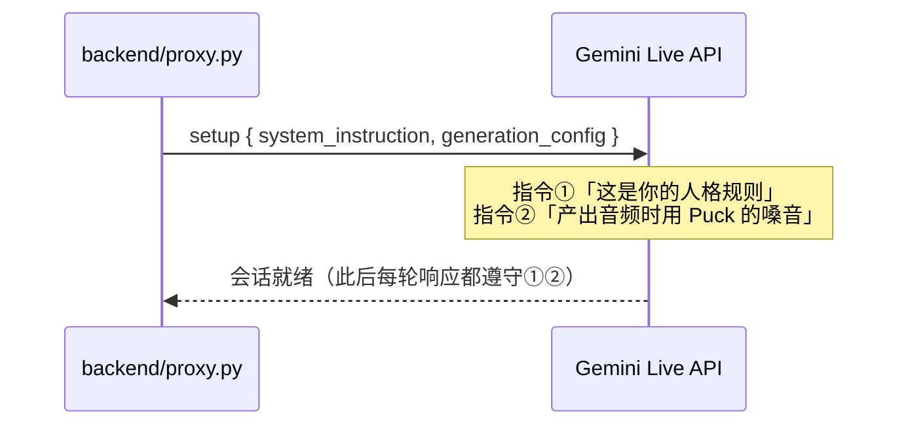
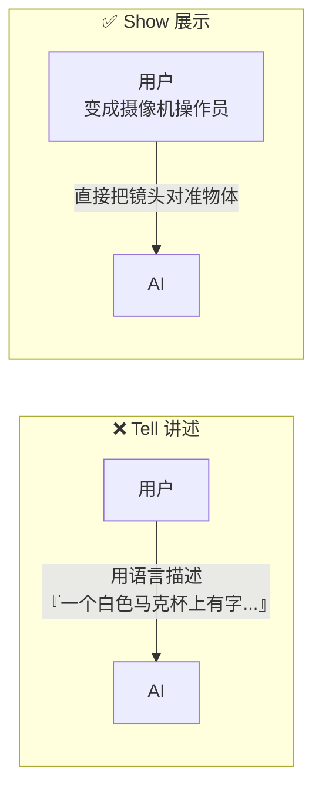
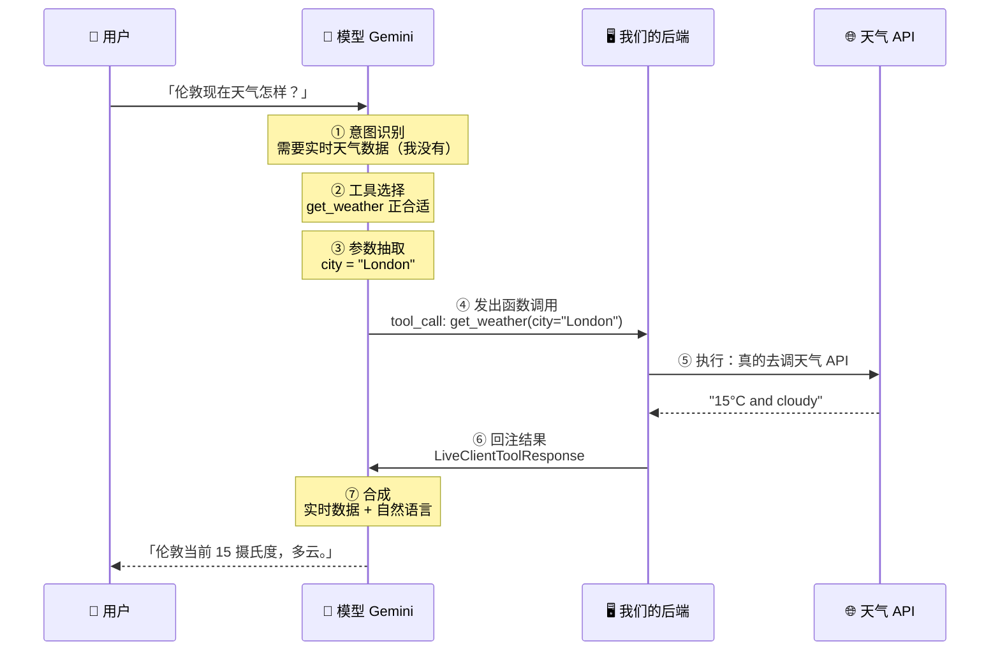
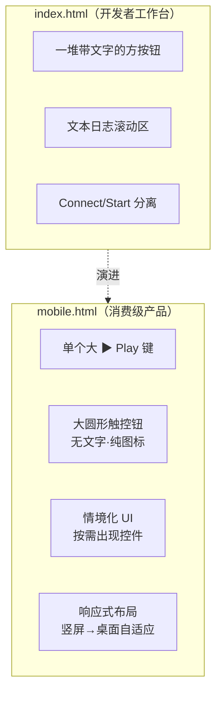
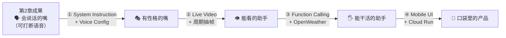

# 第 3 章 · 高级实时交互：视频、工具与系统指令（Advanced Live Interactions: Video, Tools, and System Instructions）

> 对应原书 *Multimodal Real-Time AI Agent Systems*（Heiko Hotz & Sokratis Kartakis, O'Reilly Early Release）第 3 章，PDF 第 94–121 页。
>
> 上一章我们从零搭出了一个「能听会说、可打断」的实时语音应用——但它终究只是个会聊天的嘴巴。本章要给这张嘴装上**性格（system instruction）**、**眼睛（live video）**、**手（function calling / tools）**，再给它一副**能带出门的身体（mobile UI + Cloud Run 部署）**。一章之内，你会把一个困在 `localhost` 的开发原型，变成一个挂在公网 URL、能用手机随时召唤、能看能说能干活的多模态助手。

---

## 🗺️ 本章地图



学完本章，你手里会多出四样东西：

1. **一套「人格控制面板」**——用系统指令 + 音色配置，精确控制助手「说什么」和「听起来是谁」。
2. **一条高效的视频管线**——理解为什么「周期抽帧」比「推流 30fps」优越，并能从零实现浏览器端的 `MediaHandler`。
3. **一个跑通的 Function Calling 全生命周期**——从模型发出 `tool_call` 到本地执行、再到 `LiveClientToolResponse` 回注的七步闭环。
4. **一次真实的云部署**——把「两服务器架构」打包成容器，用一条命令推上 Google Cloud Run，拿到公网 `https://` URL。

> ⚠️ **本章边界**：这一章造的仍然是「能力增强版的助手」，还**不是完整的 Agent**。原书末尾明确点出：真正的 Agent 需要**记忆（memory）**和**复杂多步任务规划**——那是下一章的内容。本章把「感知 + 行动」的地基打牢，为 Agent 铺路。

---

## 一、🎭 赋予性格：System Instruction 与 Voice

在给助手装眼睛和手之前，先给它一个「灵魂」。一个助手的**人格（persona）**——它的语气、行为准则、甚至嗓音——决定了它是一个「泛泛的工具」还是一个「让人记得住的伙伴」。原书用两个配置项来塑造人格：

| 配置项 | 英文 | 控制什么 | 类比 |
|---|---|---|---|
| 系统指令 | System Instruction | **说什么内容**（语气、规则、身份） | 角色的「人物设定卡」/「元指令 Prime Directive」 |
| 语音配置 | Voice Config / `speech_config` | **听起来是谁**（嗓音的声学特征） | 给角色选配音演员 |

### 1.1 System Instruction 是什么，为什么它是「元指令」

> 🔬 **第一性原理：为什么一句系统指令能贯穿整场对话？**
>
> 回顾上一章讲的 LLM 本质——它是 **stateless（无状态）** 的，每次推理都要把全部历史「回灌」进去。系统指令的魔法就在于：它被放在**上下文窗口（context window）的最前面**，且在每一轮推理时都**恒定地**跟着历史一起被喂给模型。于是它成了一个「永不消退的背景压力」，持续影响每一个 token 的生成概率分布。这就是为什么它被称作「prime directive（元指令）」——不是它优先级最高，而是它**位置最靠前、存在最持久**。

原书用了一个非常聪明的教学技巧：**故意加一个可观测的怪癖（quirk）**，好让你一眼确认系统指令确实生效了。

**Step 1 — 写系统指令文件 `backend/system-instructions.txt`：**

```text
You are a friendly and helpful assistant. You must begin every single
response with the phrase 'G'day mate,'.
```

（中译：你是一个友好、乐于助人的助手。你必须在每一次回应的开头都加上这句话：'G'day mate,'。）

这里的 `G'day mate` 是澳洲俚语「你好，伙计」。选它当怪癖的妙处在于：它**不可能被模型的默认行为偶然触发**，所以一旦你听到助手开口就是「G'day mate...」，你就 100% 确认系统指令加载成功了。这是一种**可验证的探针（verifiable probe）**思路。

> 💡 **实战技巧：把系统指令抽成独立文件，而不是硬编码进 Python。**
> 原书把指令放进 `system-instructions.txt` 再由 `proxy.py` 读取，看似多此一举，实则是工程上的关键决策：
> - **迭代零成本**——改人格只需编辑一个纯文本文件，改完重启 proxy 即可，不用碰任何逻辑代码。
> - **非工程师可维护**——产品经理、运营也能直接调语气，不用会 Python。
> - **版本可控**——可以把不同人格（客服版/技术版/搞笑版）存成不同文件切换。

### 1.2 Voice Config：给嗓音选一个「人」

Gemini API 提供了一组**预置的高质量音色（pre-built voices）**，每个都有名字和独特的声学画像。原书为「友好澳洲老哥」这个人设选了一个叫 **`Puck`** 的音色。

**Step 2 — 在 `backend/proxy.py` 里改会话配置**（原书此处为占位描述，下面是符合 Gemini Live API 语义的重建代码，逐行讲解）：

```python
# backend/proxy.py（节选：建立 Gemini 会话时的配置）

# 1) 读取系统指令文件
with open("system-instructions.txt", "r", encoding="utf-8") as f:
    system_instruction_text = f.read()

# 2) 组装会话配置
config = {
    # 系统指令：告诉模型「你的人格规则在这里」
    "system_instruction": system_instruction_text,

    # 生成配置：控制模型如何产出内容/音频
    "generation_config": {
        # 语音配置：产出音频时用名为 "Puck" 的预置音色
        "speech_config": {
            "voice_config": {
                "prebuilt_voice_config": {
                    "voice_name": "Puck"
                }
            }
        }
    },
}
```

逐行拆解：

| 行 | 作用 | 你需要知道的坑 |
|---|---|---|
| `open(..., encoding="utf-8")` | 读取指令文件 | ⚠️ Windows 上不写 `encoding="utf-8"` 会因默认 GBK 编码在遇到特殊字符时报错 |
| `"system_instruction"` | 挂载人格 | 键名和大小写必须与 SDK 精确匹配，写错会被静默忽略、人格「没生效」 |
| `"generation_config"` | 生成参数容器 | `speech_config` 必须嵌在它内部，放外层无效 |
| `"voice_name": "Puck"` | 选音色 | 音色名是固定枚举，拼错会回退到默认音色 |

**这套配置在会话启动时对模型说了两件事：**



### 1.3 Checkpoint：新人格 + 新嗓音

原书的验收方法极简：重启前后端两个服务器，浏览器打开 `http://localhost:8000`，开会话后只说一句 "Hello"。

**成功指标（两个可观测变化）：**
1. 回应开头变成自定义问候：「**G'day mate,** how can I help you today?」
2. 嗓音本身和第 2 章的默认音色**明显不同**。

> ⚠️ **常见坑：改了指令却没生效。** 90% 的原因是——**忘了重启 proxy**。系统指令是在会话建立那一刻注入的，进程不重启，旧配置就一直缓存着。改任何 `.txt` / 配置后，务必重启 `backend/proxy.py`。

---

## 二、👁️ 赋予眼睛：Show, Don't Tell

助手现在只能靠你「用嘴描述世界」，这往往笨拙又低效——你试试用语言精确描述一张复杂电路图或一条报错信息。解决办法：**给它接上实时视频流，让它自己看。**

### 2.1 「Show, Don't Tell（展示而非讲述）」范式



原书的洞见很精辟：接入视频后，**用户不再是「旁白解说员」，而升级成了「摄像机操作员（camera operator）」，引导 AI 的目光。** 这在桌面上已经很强，在手机上更是质变——

> 「笔记本摄像头看到的是**你**；手机摄像头看到的是**你和你身处的世界**。」

三个原书给的真实场景：

| 角色 | 动作 | 提问 |
|---|---|---|
| 🔧 现场技术员 | 把手机对准一台机器 | 「你看这是标准阀门还是高压阀门？」 |
| 🧳 游客 | 把手机对准一栋建筑 | 「跟我讲讲这个地标的建筑风格？」 |
| 📚 学生 | 把手写作业举给它看 | 「我这道方程哪一步算错了？」 |

三个场景的共同点：**「展示」比「讲述」既更快又更准。**

### 2.2 关键架构决策：周期抽帧（Periodic Frame Capture）

这是本节**最重要、也最考验工程直觉**的一处。原书提出一个反直觉但正确的做法：

> **不要把整段视频流推给模型。抽帧就够了——每秒一帧。**

> 🔬 **第一性原理：视频是什么？** 一段「实时视频」不是一个文件，而是**一串快速连续播放的静态图像（still images）**。人眼需要 30fps 才觉得流畅，但**模型不需要看流畅的运动**——它只需要「对用户环境的清晰、周期性的快照」来推理。

我们来算一笔账，看看为什么推 30fps 是灾难：

$$
\text{每秒数据量} = f_{\text{rate}} \times S_{\text{frame}}
$$

假设每帧 JPEG 压缩后约 100 KB：

| 策略 | 帧率 $f_{\text{rate}}$ | 每秒数据量 | 每分钟 | 相对成本 |
|---|---|---|---|---|
| 全推流 | 30 fps | 3000 KB/s ≈ 3 MB/s | ~180 MB | **30×** |
| 周期抽帧 | **1 fps** | 100 KB/s | ~6 MB | **1×** |

抽帧带来**三重收益**：

1. **带宽骤降 30 倍**（bandwidth）——省流量、更稳。
2. **成本骤降**（cost）——多模态推理按输入 token/图片计费，图片数量直接决定账单。
3. **给模型充足处理时间**——不会被 30fps 的洪流淹没，每张图都能从容推理。

而且用户体验**丝毫不受影响**——因为本地 `<video>` 元素仍以全速播放给用户看，只是**发给 AI 的是精挑的快照**。这叫「鱼与熊掌兼得」。

### 2.3 实现载体：隐藏的 `<canvas>` 中转

浏览器里做抽帧最高效的姿势，是用一个**隐藏的 `<canvas>` 元素**当中转站：


**为什么必须经过 canvas？** 因为 `<video>` 元素本身不能直接「导出某一瞬间的像素」，但你可以把它的当前画面**绘制（draw）**到 canvas 上，canvas 再提供 `toDataURL()` 把像素编码成 Base64 文本。canvas 就是「视频 → 图片」的转换枢纽。

### 2.4 Hands-On：`MediaHandler` 类逐段讲解

原书把所有视频逻辑封装进一个 `MediaHandler` 类（放在 `frontend/media-handler.js`）。下面是符合原书描述的完整重建，逐方法拆解：

```javascript
// frontend/media-handler.js
class MediaHandler {
    constructor() {
        this.videoElement = null;     // 关联的 <video> 元素
        this.currentStream = null;    // 当前活跃的媒体流
        this.frameCaptureInterval = null; // 抽帧定时器句柄
        this.onFrame = null;          // 抓到帧后的回调
    }

    // ① 初始化：把类和页面上的 <video> 元素绑定
    initialize(videoElement) {
        this.videoElement = videoElement;
    }

    // ② 开摄像头：请求用户摄像头权限
    async startWebcam() {
        this.currentStream = await navigator.mediaDevices.getUserMedia({
            video: { facingMode: "environment" }, // 优先后置摄像头（手机场景）
            audio: false                            // 音频走另一条链路，这里只要画面
        });
        this.videoElement.srcObject = this.currentStream;
        this.videoElement.classList.remove("hidden"); // 显示预览
        await this.videoElement.play();
    }

    // ③ 屏幕共享：弹窗让用户选屏幕/窗口/标签页
    async startScreenShare() {
        this.currentStream = await navigator.mediaDevices.getDisplayMedia({
            video: true
        });
        this.videoElement.srcObject = this.currentStream;
        this.videoElement.classList.remove("hidden");
        await this.videoElement.play();
    }

    // ④ 停止所有：清理定时器 + 关闭所有轨道 + 隐藏预览
    stopAll() {
        this.stopFrameCapture();
        if (this.currentStream) {
            this.currentStream.getTracks().forEach(track => track.stop());
            this.currentStream = null;
        }
        this.videoElement.classList.add("hidden");
    }

    // ⑤（为移动端预埋）切换前/后摄像头——本章暂不接按钮
    async switchCamera() { /* 移动 UI 章节再接线 */ }
}
```

**四个核心方法一览表：**

| 方法 | 底层 API | 干什么 | 关键点 |
|---|---|---|---|
| `initialize()` | — | 绑定 `<video>` 元素 | 简单的「接线」 |
| `startWebcam()` | `getUserMedia()` | 请求摄像头 | 浏览器会弹权限框 |
| `startScreenShare()` | `getDisplayMedia()` | 请求屏幕共享 | 弹窗让用户选屏/窗/页 |
| `stopAll()` | `track.stop()` | 清理关流 | ⚠️ 必须遍历**所有 track** 逐个 stop，否则摄像头指示灯不灭 |

> 💡 **实战：为什么 `stopAll()` 要 `forEach` 遍历 track？** 一个 `MediaStream` 可能同时含视频轨 + 音频轨。只关流对象引用不会真正释放硬件；必须对每条 `track` 调用 `.stop()`，摄像头/麦克风才会真正关闭（那盏让人安心的硬件指示灯才会熄灭）。这是隐私合规的硬要求。

> ⚠️ **常见坑：`switchCamera()` 已写好但本章不接按钮。** 原书特意保留了这个方法却不在简版 `index.html` 里连按钮——这是**为后面移动 UI 埋的伏笔**。移动端才需要「前/后摄像头切换」，桌面开发 UI 用不上。别以为是 bug。

### 2.5 抽帧方法 `startFrameCapture()` 的三步

原书说这个方法「是我们高效视频策略的心脏」，工作分三步。重建 + 逐步注释：

```javascript
// 追加进 MediaHandler 类

startFrameCapture() {
    const canvas = document.createElement("canvas"); // 隐藏 canvas，不加进 DOM
    const ctx = canvas.getContext("2d");

    const captureFrame = () => {
        if (!this.videoElement.videoWidth) return;   // 视频还没就绪就跳过
        // 让 canvas 尺寸 = 当前视频帧尺寸
        canvas.width = this.videoElement.videoWidth;
        canvas.height = this.videoElement.videoHeight;

        // 【第 2 步·截图】把 <video> 此刻的画面画到 canvas 上
        ctx.drawImage(this.videoElement, 0, 0, canvas.width, canvas.height);

        // 【第 3 步·编码并送出】canvas → JPEG 的 Base64 字符串
        const dataUrl = canvas.toDataURL("image/jpeg");
        if (this.onFrame) this.onFrame(dataUrl); // 交给回调（主脚本负责发 WS）
    };

    // 【第 1 步·定节奏】每 1000ms 执行一次 —— 1 帧/秒
    this.frameCaptureInterval = setInterval(captureFrame, 1000);
}

stopFrameCapture() {
    if (this.frameCaptureInterval) {
        clearInterval(this.frameCaptureInterval);
        this.frameCaptureInterval = null;
    }
}
```

| 步骤 | 代码 | 本质 |
|---|---|---|
| **1. 定节奏** | `setInterval(captureFrame, 1000)` | 低频定时器，1 秒抓一帧 |
| **2. 截图** | `ctx.drawImage(video, ...)` | 把视频「此刻的瞬间」画进隐藏 canvas |
| **3. 编码送出** | `canvas.toDataURL('image/jpeg')` | 像素 → Base64 文本 → `onFrame` 回调 → WebSocket |

> 🔬 **为什么是 Base64 而不是二进制？** WebSocket 既能传二进制也能传文本。原书选 Base64 文本，是为了**把图片塞进已有的 JSON 消息协议**里——统一走 `{ "type": "image", "data": "..." }` 这种结构化消息，代价是体积膨胀约 33%（Base64 固有开销）。在 1fps 下这点膨胀无所谓，换来的是协议统一、调试直观。这是「简单性 > 极致效率」的工程权衡。

### 2.6 前后端接线

**前端（`index.html` 的 `<script>`）** 把 `MediaHandler` 接到按钮上：

```javascript
import { MediaHandler } from "./media-handler.js";
const mediaHandler = new MediaHandler();
mediaHandler.initialize(document.getElementById("videoPreview"));

webcamButton.onclick = async () => {
    if (webcamActive) {
        mediaHandler.stopAll();          // 再点一次 → 关闭
        webcamActive = false;
    } else {
        await mediaHandler.startWebcam();
        mediaHandler.onFrame = (dataUrl) => {
            // 每抓一帧就发一条 image 消息
            ws.send(JSON.stringify({ type: "image", data: dataUrl }));
        };
        mediaHandler.startFrameCapture();
        webcamActive = true;
    }
};
```

关键三点（原书原话拆解）：
- 点摄像头按钮 → `startWebcam()`；点屏幕共享 → `startScreenShare()`。
- 流成功启动后立刻 `startFrameCapture()`，回调把 Base64 图打包成 **`{ "type": "image", "data": "..." }`** 发过 WebSocket。
- **再点一次同一按钮 → `stopAll()`** 结束流（按钮 toggle 逻辑）。

**后端（`backend/proxy.py` 的 `forward_client_to_gemini`）** 加一个 `elif` 认出 image 消息：

```python
async def forward_client_to_gemini(client_ws, gemini_session):
    async for message in client_ws:
        data = json.loads(message)

        if data["type"] == "audio":
            # ... 已有的音频转发逻辑 ...
            pass

        elif data["type"] == "image":                       # 👈 本章新增
            # data["data"] 形如 "data:image/jpeg;base64,/9j/4AAQ..."
            header, b64 = data["data"].split(",", 1)         # 去掉 dataURL 头
            image_bytes = base64.b64decode(b64)              # 解码回二进制
            await gemini_session.send(input={
                "mime_type": "image/jpeg",
                "data": image_bytes
            })
```

原书强调：**这个改动很小但必不可少**。改完后，proxy 就成了「音频 + 图像」两种多模态输入的**透明网关（transparent gateway）**——它只认消息类型、原样转发，不做任何理解。

### 2.7 Checkpoint：一个「能看」的 AI


验收：开会话 → 点 Webcam 允许权限 → 把镜头对准马克杯/键盘/手机 → 问「你看到了什么？」

**成功指标**：AI 语音回答出**准确的物体描述**，例如「我看到一个白色陶瓷马克杯，上面有些文字」。同时它也证明了应用能**并发处理音频 + 图像两条流**。

---

## 三、🖐️ 赋予手：用 Function Calling 掌控工具

助手现在能听、能说、能看了，但它仍是个**被动的观察者**：它能看到购物网站上的一件商品，却**没法把它加进购物车**；它知识渊博，却**冻结在训练截止那一刻**——你问它「巴黎现在几度」，它只能干瞪眼。

要让它从「博学的旁观者」变成「能干活的助手」，得给它**手**。在 LLM 世界里，「手」就是**工具（tools）**，而连接「AI 推理大脑」与「外部工具」的机制，叫 **Function Calling（函数调用）**。

> Function Calling 是把 LLM 从「文本生成器」升级为「动态问题求解引擎」的枢纽概念。它允许模型**暂停自己的回答**，请求执行我们代码里的某个函数（带上具体参数），然后**拿着结果继续**它的回答。

### 3.1 Function Calling 的七步循环

原书用「用户问伦敦天气」这个例子，把幕后的七步拆得极清楚：



| 步骤 | 英文 | 谁在做 | 干什么 |
|---|---|---|---|
| ① 意图识别 | Intent Recognition | 模型 | 判断出「这需要实时天气数据，我没有」 |
| ② 工具选择 | Tool Selection | 模型 | 从我们给的工具清单里选中 `get_weather` |
| ③ 参数抽取 | Parameter Extraction | 模型 | 从问句里抠出 `city: "London"` |
| ④ 发出调用 | Function Call Emission | 模型 | **暂停口头回答**，发一条结构化 `tool_call` 消息 |
| ⑤ 执行 | Execution | 我们的后端 | 真的去调 API，拿到「15°C 多云」 |
| ⑥ 回注 | Response Injection | 我们的后端 | 用特殊消息把结果送回模型 |
| ⑦ 合成 | Synthesis | 模型 | 结合实时数据 + 语言能力，给出最终语音回答 |

> 🔬 **第一性原理：模型并不「执行」代码，它只「请求」执行。** 这是 Function Calling 最容易被误解的地方。模型本身是个纯文本预测器，它**碰不到你的服务器、API、数据库**。它能做的只有一件事：**生成一段结构化的 JSON**，内容等价于「请帮我跑 `get_weather(city='London')`」。真正跑代码的永远是**你的后端**。模型 = 决策者（decide what），你的代码 = 执行者（do it）。这个「脑手分离」是安全边界的根基——你可以在执行前审查、限权、拒绝。

> 💡 **面试高频：Function Calling vs. 传统 API 调用有何不同？**
> - 传统 API：**开发者**在代码里硬编码「什么时候调哪个接口、传什么参数」。
> - Function Calling：**模型**在运行时**自主决定**要不要调、调哪个、传什么参数。开发者只负责「声明有哪些工具可用」和「实际执行」。
> 一句话：把「调度决策权」从编译期的人，交给了运行期的模型。

### 3.2 本地工具架构：`tool_handler.py`

在写工具前先决定「代码放哪」。原书为当前阶段选了**最简架构：工具逻辑直接放在后端项目里**，新建一个 `backend/tool_handler.py` 专门存放和执行工具函数。当 `proxy.py` 收到模型的函数调用请求，就 `import` 并调用 `tool_handler.py` 里对应的函数。

**这套本地架构的三大好处：**

| 优势 | 英文 | 含义 |
|---|---|---|
| 简单 | Simplicity | 所有代码在一处，数据流一眼看穿 |
| 快速迭代 | Rapid Development | 改工具函数 → 重启本地 proxy → 立刻见效，无需部署 |
| 零依赖 | Zero Dependencies | 不需要云账号或任何外部基建就能开发测试核心逻辑 |

> ⚠️ **这是「学习/原型」架构，不是「生产」架构。** 原书明确说：本地内联工具适合学习函数调用的机制。生产环境会把工具拆成**独立的 serverless functions（无服务器函数）**——这样工具可独立扩缩、独立部署、故障隔离。本书后面章节会讲。别把这个「一锅炖」直接搬上线。

### 3.3 Hands-On：天气工具四步走

#### Step 1 — 拿 OpenWeather API Key

用 **OpenWeatherMap** 的「Current Weather Data」API，免费额度很慷慨：**60 次/分钟、1,000,000 次/月**，练习完全够用。注册 → 邮箱验证 → 在「API keys」标签页拿默认 key → 存进 `backend/.env`：

```bash
# backend/.env
OPENWEATHER_API_KEY="your_key_here"
```

> ⚠️ **原书亲测坑：新 key 有激活延迟。** 刚生成的 key 可能要**几分钟、极端情况最长 1 小时**才生效。如果头几次测试报**认证错误（401）**，八成不是你代码写错，而是 key 还没激活——**先等等再排查**。

> 💡 **为什么把 key 放 `.env` 而不是代码里？** 三重原因：① 避免明文密钥被 `git commit` 泄露上传到公开仓库；② 不同环境（开发/生产）用不同 key，改配置不改代码；③ 符合「配置与代码分离」的十二要素应用（12-Factor App）原则。

#### Step 2 — 写工具逻辑 `get_weather`

新建 `backend/tool_handler.py`，重建符合原书描述的函数：

```python
# backend/tool_handler.py
import os
import requests

def get_weather(city: str) -> dict:
    """按城市名查询当前天气，返回干净的字典。"""
    api_key = os.environ["OPENWEATHER_API_KEY"]      # 从环境读 key
    url = "https://api.openweathermap.org/data/2.5/weather"
    params = {
        "q": city,
        "appid": api_key,
        "units": "metric",   # 用摄氏度
    }
    resp = requests.get(url, params=params, timeout=10)
    resp.raise_for_status()  # 非 2xx 直接抛异常
    data = resp.json()

    # 只挑我们需要的字段，返回一个干净、简单的字典
    return {
        "city": data["name"],
        "temperature": data["main"]["temp"],
        "description": data["weather"][0]["description"],
    }
```

别忘了装依赖：把 `requests` 加进 `backend/requirements.txt`，跑 `pip install -r requirements.txt`。

> 💡 **实战：为什么要「过滤」返回值，只挑 3 个字段？** OpenWeather 的原始响应有几十个字段（风速、气压、日出日落、云量……）。全塞给模型不但**浪费 token、增加成本**，还会**稀释信号、分散模型注意力**。工具函数的一大职责就是**做「信息压缩」**——只把「回答用户所需的最小信息集」交给模型。返回值越干净，模型合成的答案越准。

#### Step 3 — 教 AI 认识这个工具

光写函数不够，得**显式告诉 Gemini「有这个工具、怎么用」**。这通过在会话配置里提供 **`function_declaration`（函数声明）** 实现——它就像给模型看的一份 **API 规格说明书**。

在 `backend/proxy.py` 的会话配置里加 `tools`：

```python
config = {
    "system_instruction": system_instruction_text,
    "generation_config": { "speech_config": { ... } },  # 上面已有
    "tools": [{
        "function_declarations": [{
            "name": "get_weather",
            # 描述：告诉模型「这工具什么时候有用」
            "description": "Get weather information for a location",
            # 参数 schema：告诉模型「怎么调、参数叫什么、什么类型」
            "parameters": {
                "type": "object",
                "properties": {
                    "city": {
                        "type": "string",
                        "description": "The city to get weather for"
                    }
                },
                "required": ["city"]
            }
        }]
    }]
}
```

原书强调这份声明**至关重要**，两个字段各司其职：

| 字段 | 作用 | 写不好的后果 |
|---|---|---|
| `description` | 告诉模型**何时**该用（「查某地天气」） | 写模糊 → 模型该调时不调，或不该调时乱调 |
| `parameters` schema | 告诉模型**如何**调（参数名 `city`、类型 `string`、必填） | 写错 → 模型传错参数名/类型，执行必挂 |

> 🔬 **第一性原理：`description` 是「提示工程」不是「文档」。** 很多人以为函数描述只是给人看的注释，其实它**直接进模型的上下文、参与推理**。模型完全靠这段自然语言来判断「用户这句话该不该触发这个工具」。所以描述要写得**像在对模型下指令**：清楚、无歧义、覆盖典型触发场景。这是 Agent 工程里回报最高的一处「提示工程」。

接着，**在系统指令里加一条硬规则**，明确何时用工具。打开 `backend/system-instructions.txt` 追加一行：

```text
When asked about the weather, you must use the get_weather tool.
```

因为 `proxy.py` 已经会加载整个指令文件，**无需改任何其他代码**。模型现在同时知道了自己的「人格」和「用天气工具的义务」。

> 💡 **双保险设计：`description` + 系统指令规则。** 注意原书用了**两层**引导：函数声明里的 `description` 提供「软提示」，系统指令里的「must use」提供「硬规则」。两者叠加大幅提高模型在该调工具时**真的去调**的可靠性。生产 Agent 里这种「声明 + 系统规则」的组合拳很常见。

#### Step 4 — 在 proxy 里接线执行

最后一步：让 proxy 监听模型的函数调用请求并执行本地代码。改 `backend/proxy.py` 的 `forward_gemini_to_client`（它本就在循环处理 Gemini 的响应，现在加个 `tool_call` 分支）：

```python
from tool_handler import get_weather   # 导入本地工具

async def forward_gemini_to_client(gemini_session, client_ws):
    async for response in gemini_session.receive():

        # 👇 本章新增：检测函数调用请求
        if response.tool_call:
            for fc in response.tool_call.function_calls:
                if fc.name == "get_weather":
                    # ① 用模型给的参数调本地函数
                    result = get_weather(city=fc.args["city"])

                    # ② 把返回字典包成 LiveClientToolResponse
                    tool_response = LiveClientToolResponse(
                        function_responses=[{
                            "name": fc.name,
                            "id": fc.id,
                            "response": result,
                        }]
                    )
                    # ③ 送回 Gemini 会话，喂给它实时数据
                    await gemini_session.send(input=tool_response)
            continue  # 处理完工具调用，继续下一条响应

        # ... 已有的「把音频/文本转发给客户端」逻辑 ...
```

这段逻辑**闭合了整个循环**。当 proxy 看到 Gemini 发来 `tool_call`：

1. **调用**本地 `get_weather()`（`tool_handler.py`）。
2. 把返回字典**包装**成特殊的 `LiveClientToolResponse` 对象。
3. **送回** Gemini 会话，把它请求的实时数据交给它。

模型随后用这份数据**合成最终的语音回答**。助手至此拥有了它的第一只手。

> ⚠️ **常见坑：`function_responses` 里要带 `id` 回填。** Live API 是**异步流式**的，同一时刻可能有多个工具调用在飞。回注结果时必须带上原调用的 `id`（和 `name`），模型才能把「这份结果」对上「那次请求」。漏了 `id`，模型可能张冠李戴或直接忽略结果。

### 3.4 Checkpoint：一个「能干活」的助手

验收：装好新依赖 → 起两个服务器 → 打开浏览器 **Console** 和 **proxy 终端** 一起盯 → 问「柏林天气怎样？」

**观察点**：
- proxy 终端应打出 **收到 `get_weather` 的 `tool_call`** 的日志，紧接着是 `tool_handler` **正在调 OpenWeather API** 的日志。
- 短暂停顿后，听到 AI 语音回答。

**成功指标**：AI **绝不能**给泛泛的答案，必须报出**真实的实时天气**，例如「柏林当前 18 摄氏度，多云」。听到这句，你就跑通了**完整的函数调用生命周期**——这是任何真正 AI 助手的**基石**。

---

## 四、📱 从原型到产品：移动 UI + 云部署

我们造出了一个能听、说、看、用工具的多模态原型。但**原型不是产品**。它有两个致命局限：

1. **界面是「开发者工作台」**（一堆按钮 + 文本日志），不是给普通用户用的。
2. **它被拴在 `localhost`**，出不了这台电脑。

> 「一个你带不走的助手，只是个新奇玩具（a mere curiosity）。」

解决分两大步：先做**移动优先（mobile-first）**的界面，再**部署上云**。

### 4.1 移动优先 UI 的四个设计原则

从开发用的 `index.html` 切到用户用的 `mobile.html`（配套 `frontend/styles/mobile-style.css`）。本地测试访问 `http://localhost:8000/mobile.html`。



| 原则 | 英文 | 具体做法 |
|---|---|---|
| 极简启动 | Streamlined Start | 一个大 **▶ Play 键**同时完成「建 WebSocket 连接 + 开麦」，直接进入「热麦（hot mic）」体验，去掉分离的 connect/start |
| 触控友好 | Touch-Friendly | 控件**大、圆、间距足**，好点准；用「停止/麦克风/摄像头」的通用图标，**无需文字标签** |
| 情境化 UI | Contextual UI | 界面动态：会话启动后 Play 键换成媒体控件；**「切换摄像头」按钮只在移动端且摄像头激活时才出现** |
| 响应式布局 | Responsive Layout | 现代 CSS 让布局从手机竖屏优雅适配到桌面；优先展示最重要的元素（视频 + 控件） |

> 💡 **实战：`switchCamera()` 的伏笔在这里回收了。** 还记得 2.4 节 `MediaHandler` 里那个「写好但不接按钮」的 `switchCamera()` 吗？移动 UI 的「情境化」原则正是它的归宿——**只有在移动端 + 摄像头开启时**，才动态渲染出「切换前/后摄像头」按钮。这就是**为什么当初要把逻辑先写进类里**：能力先备好，UI 按需接线。

移动 UI 的 HTML 骨架（`mobile.html`）包含这些关键容器：

```html
<!-- 关键结构（原书描述重建） -->
<div id="functionInfo"></div>              <!-- 显示函数调用信息 -->
<video id="videoPreview" class="hidden"></video>
<div id="output"></div>                    <!-- 聊天输出 -->

<!-- 两个「情境化」控件容器，靠 .hidden 类切换显隐 -->
<div id="playButtonContainer">
    <button id="connectButton">▶</button>  <!-- 初始只有这个大 Play -->
</div>
<div id="mediaButtonsContainer" class="hidden">
    <button id="stopButton">⏹</button>
    <button id="micButton">🎤</button>
    <button id="webcamButton">📷</button>
    <!-- switchCameraButton 由 JS 在移动端动态插入 -->
</div>
```

CSS 的核心是那个 **`.hidden` 类**——所有「情境化」显隐都靠 JS 增删这个类实现。

### 4.2 部署上云：理解 Cloud Run

要让助手「从口袋里随时召唤」，得把它从私人电脑搬到公网。原书选 **Google Cloud Run** 部署。先理解它是什么。

**Cloud Run = 无服务器容器平台（serverless container platform）。** 拆开看：


| 概念 | 英文 | 通俗解释 | 常见误解 ⚠️ |
|---|---|---|---|
| 无服务器 | Serverless | **不是没有服务器**，而是「**你不用管**服务器」——租机器、装系统、配 Web 服务器、打补丁这些全归 Google | 以为字面意思是「没服务器」 |
| 容器平台 | Container Platform | Cloud Run 不直接跑你的 `.py`/`.js`，而是跑**容器**——把应用打成标准化的包 | 以为能直接扔源码上去跑 |

**Cloud Run 为何完美契合我们的助手？** 三大优势：

| 优势 | 英文 | 为什么重要 |
|---|---|---|
| 缩容到零 | Scales to Zero | 没人用时容器数自动降到 **0**，**空闲不计费**——个人项目/间歇流量极省钱 |
| 自动扩容 | Scales Automatically | 突然火了、几百人涌入，自动多开实例扛住负载，保持响应 |
| 安全公网 URL | Secure Public URL | 部署即得 `https://` URL，手动搭这种安全端点极复杂，Cloud Run 全自动 |

> 🔬 **第一性原理：为什么「缩容到零」对语音助手是杀手锏？** 传统部署（租一台常驻虚拟机）不管有没有人用，**24 小时都在烧钱**。而语音助手的流量是**极度间歇**的——你一天可能只召唤它几次。「Scale to Zero」让你**只为真正的对话时间付费**，闲置成本 = 0。对个人项目，这可能是「月账单 $30」和「月账单 $0.05」的差别。这是 serverless 相对传统托管的本质经济优势。

### 4.3 Docker 与容器：解决「在我机器上明明能跑」

要上 Cloud Run，先把应用打包成**容器**。这就要用到 **Docker**。

> 经典开发者噩梦：「**在我机器上明明能跑啊！**（Well, it works on my machine!）」——因为你的开发环境有特定 Python 版本、系统库、各种独特配置，云端服务器一样都没有。

**容器（container）**通过把「应用代码 + 全部依赖」打包成一个**标准化、可运输的单元**来根治这个问题。打包配方就是一个叫 **`Dockerfile`** 的文本文件，给出一步步指令：

```dockerfile
# Dockerfile（原书描述的四步配方）
# ① 从一个基础 Python 环境起步
FROM python:3.11-slim
# ② 把我的应用文件拷进容器
WORKDIR /app
COPY . /app
# ③ 按 requirements.txt 装依赖
RUN pip install -r requirements.txt
# ④ 指定容器启动时运行 server.py
CMD ["python", "server.py"]
```

| 指令 | 对应原书的四步 | 作用 |
|---|---|---|
| `FROM` | ① 基础环境 | 选一个干净的 Python 底座 |
| `COPY` | ② 拷代码 | 把应用装进镜像 |
| `RUN pip install` | ③ 装依赖 | 把 `requirements.txt` 里的库固化进镜像 |
| `CMD` | ④ 启动命令 | 容器一启动就跑服务器 |

> 💡 **一句话理解容器 vs 虚拟机：** 虚拟机（VM）是「连操作系统一起虚拟一整台电脑」，重、慢、几个 GB；容器只打包「你的应用 + 依赖」，**共享宿主机内核**，轻、快、几十到几百 MB。Cloud Run 用容器，所以能秒级冷启动、缩容到零。

### 4.4 Hands-On：一条命令部署

原书用 **Cloud Build** 自动化整个流程。项目里前后端各有一个 `cloudbuild.yaml`，它是「遥控机器人」，替你干四件事：


**Step 2 — 部署后端（先）：**

```bash
gcloud builds submit --config backend/cloudbuild.yaml
```

跑完输出一个 **Service URL**（形如 `https://....a.run.app`）——这是后端的公网地址，**立刻复制下来**，下一步要用。

**Step 3 — 部署前端（后），把后端 URL 注入进去：**

```bash
gcloud builds submit --config frontend/cloudbuild.yaml \
    --substitutions=_BACKEND_URL='wss://....a.run.app'
```

> ⚠️ **最关键的一处坑：协议要从 `https://` 改成 `wss://`。** 复制来的后端 URL 是 `https://`，但前端连后端走的是 **WebSocket**，所以必须手动把协议头换成 **`wss://`**（WebSocket Secure）。`--substitutions` 这个 flag 就是把这个安全 WebSocket 地址**在构建时注入**进前端配置——这样用户打开网页时，前端才知道该连哪。写成 `https://` 会导致前端连不上后端，表现为「点了 Play 没反应」。

部署顺序也不能反：**必须先后端、再前端**，因为前端构建时需要后端已经生成的 URL 作为输入。

### 4.5 Checkpoint：口袋里的助手

拿到第二个 Service URL（`livewire-ui` 服务的），在电脑浏览器打开，**更重要的是在手机浏览器打开**。

**成功指标**：你亲手做的移动优先界面从**公网 URL** 加载出来；点 ▶ Play，之前做的**所有功能**——自定义人格、音色、实时摄像头、天气工具——**全部可用**。你能**用手机和助手进行实时、多模态的对话**。

至此，你把一个复杂 AI 应用从**本地原型**变成了**全球可访问、移动优先的产品**。

---

## 五、🧩 全章串讲：四次「进化」如何叠加

把本章四大步骤放在一张演进图上，你会看到一条清晰的「从嘴到全身」的进化线：



| 步骤 | 赋予 | 核心机制 | 关键工程决策 |
|---|---|---|---|
| ① | 性格 | System Instruction + `speech_config` | 指令抽成独立文件；用怪癖当可验证探针 |
| ② | 眼睛 | Live Video + `MediaHandler` | **周期抽帧 1fps**（而非推流 30fps） |
| ③ | 手 | Function Calling 七步循环 | 脑手分离：模型决策、后端执行 |
| ④ | 身体 | Mobile UI + Cloud Run | Serverless 缩容到零；容器解决环境一致性 |

**四条贯穿全章的工程哲学：**

1. **效率优先的权衡（Efficiency Trade-off）**——抽帧 1fps、只回传 3 个天气字段，都是「用可接受的信息损失，换 30 倍的成本/带宽收益」。
2. **配置与代码分离（Config/Code Separation）**——系统指令进 `.txt`、API key 进 `.env`、后端 URL 靠 `--substitutions` 注入，全都不硬编码。
3. **脑手分离的安全边界（Decide vs. Do）**——模型只发调用请求，永远由你的代码执行，天然可审查、可限权。
4. **原型架构 ≠ 生产架构**——本地内联工具、一锅炖 proxy 适合学习；生产要拆 serverless、独立扩缩。原书反复提醒别混淆。

---

## 📌 小结

- **性格 = 系统指令（说什么）+ 音色配置（听起来是谁）**。系统指令是「元指令」，靠「位置最前、每轮回灌」贯穿整场对话；把它抽成 `.txt` 文件是回报极高的工程习惯。用一个可观测怪癖（`G'day mate`）当探针，能一眼验证是否生效。
- **视频的灵魂是「周期抽帧」**：视频本质是一串静态图，模型不需要 30fps 的流畅运动，只要 **1fps 的清晰快照**。用隐藏 `<canvas>` 做「video → JPEG Base64」中转，带宽/成本降 30 倍而用户体验无损。这是本章最重要的架构直觉。
- **Function Calling 是「脑手分离」的七步循环**：意图→选工具→抽参→发调用→执行→回注→合成。**模型只决策、你的代码才执行**，这是安全边界的根基。`function_declaration` 的 `description` 本质是提示工程，回注结果时务必带 `id`。
- **从原型到产品 = 移动 UI + 云部署**。Mobile-first 靠单 Play 键、大圆触控钮、情境化 UI、响应式布局；Cloud Run 靠 serverless（缩容到零、空闲不计费）+ Docker 容器（根治「在我机器上能跑」）。部署顺序**先后端再前端**，且前端连后端要把 `https://` 换成 `wss://`。
- **本章造的仍是「增强版助手」，不是完整 Agent**——它有了感知（看）和行动（工具），但还缺**记忆**和**多步任务规划**。那是下一章的地基。

---

## 🔗 延伸

- **上一章回看**：第 2 章「为实时 AI 交互做架构」——WebSocket、AudioWorklet、hot mic、打断机制。本章的视频/工具消息全都复用了那套「两服务器 + WebSocket」的骨架。
- **下一章预告**：给助手加**记忆（memory）**，让它能从过往交互学习、执行复杂多步任务——从「增强助手」真正跨入「Agent」。
- **官方文档**：
  - Gemini Live API — System Instruction / Voice Config / Function Calling 的权威参数说明。
  - MDN `getUserMedia` / `getDisplayMedia` / `Canvas.toDataURL` — 浏览器媒体与抽帧 API。
  - OpenWeatherMap Current Weather Data API — 本章天气工具的数据源，免费额度 60 次/分。
  - Google Cloud Run + Cloud Build + Dockerfile — serverless 容器部署官方指南。
- **动手扩展建议**：
  1. 把 `get_weather` 换成你自己的工具（如查日历、发消息），走一遍「声明→执行→回注」全流程。
  2. 给 `MediaHandler` 接上 `switchCamera()`，在移动端实测前/后摄像头切换。
  3. 把抽帧频率从 1fps 调到 2fps 和 0.5fps，对比成本与识别延迟，亲手感受那个「效率权衡」曲线。
