# 第 4 章 · 设计与构建 Agent（Designing and Building Agents）

> 对应原书 *Multimodal Real-Time AI Agent Systems*（Heiko Hotz & Sokratis Kartakis, O'Reilly Early Release）第 4 章（终稿第 6 章），PDF 第 122–168 页。
>
> 上一章我们解剖了「现代 AI Agent 的理论解剖学」——运行时（runtime）、记忆系统（memory）等五大核心组件。这一章从纸面走向键盘：用 **Google Agent Development Kit（ADK）** 这套开源 Python 框架，一步步把一个抽象的「数学 Agent」设计蓝图，变成一个能调工具、有记忆、可实时语音对话、还能被系统化评估的真实应用。核心命题是：**Agent 的概念很强大，但造一个 Agent 是「具体且可达成」的工程活儿——前提是你手里有对的框架。**

---

## 🗺️ 本章地图

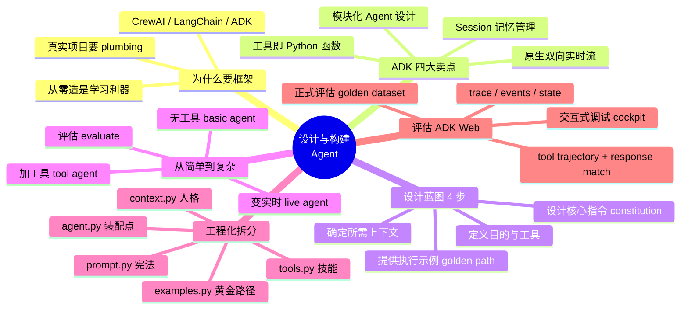

学完本章你会拿到四样东西：

1. **一张可复用的 Agent 设计蓝图**——四步走：目的与工具、上下文、核心指令、执行示例。任何 Agent 都能套这个模板。
2. **一套「从骨架到活体」的构建路径**——无工具 Agent → 有工具 Agent → 实时语音 Agent，每一步的 ADK 组件（`Agent` / `Runner` / `Session` / `LiveRequestQueue`）都讲透。
3. **一种工程化拆分范式**——把 prompt / tools / context / examples 拆成独立 `.py` 文件，理解为什么「用 Python 文件而不是 txt」是可扩展性的关键。
4. **一套系统化评估方法论**——从 ADK Web 的交互式调试，到用 golden dataset 做 tool trajectory + response matching 的正式回归测试。

> ⚠️ **本章边界**：这是一章**动手实战**（hands-on）。原书选定 ADK 而非 CrewAI/LangChain，是因为 ADK 有一个「行业首创」的特性——**原生双向实时流（bidirectional streaming）**，这是造实时语音 Live Agent 的地基。多 Agent 协作（multi-agent patterns）不在本章，留到原书第 7 章（本讲义对应第 5 章）。

---

## 一、🏗️ 为什么真实项目要用框架，而不是从零手搓

### 1.1 从零手搓 vs. 站在框架肩上

在第 1 章里，你已经见识过：哪怕只是编排（orchestrate）一个最简单的 Agent，都要写大量逻辑——管理会话历史、把上下文回灌给模型、解析模型想调哪个工具、执行工具、再把结果喂回去……这些代码枯燥、重复、且极易出 bug。

原书的态度很务实：

> **「从零造是学习的绝佳方式，但真实项目里，你通常想用一个专门的框架，替你把这些基础『管道工程（plumbing）』搞定。」**

这就是 **CrewAI**、**LangChain** 这类框架爆火的原因——它们把「造 / 启动 / 维护 Agent」的流程标准化，让你（开发者）专注于**创新**，而不是陷在重复的地基代码里。

> 🔬 **第一性原理｜框架的本质是什么？**
> 框架不是「魔法」，它只是把「每个 Agent 都要写一遍的东西」抽象成了可复用组件。想想 Web 开发：你不会每次都手写 HTTP 解析、路由、连接池，而是用 Flask/Django。Agent 框架同理——它把「Agent Core 的那一圈循环」（收到 query → 组装上下文 → 调 LLM → 解析工具调用 → 执行 → 回灌 → 出最终答案）封装成 `Runner` 这样的引擎。**你付出的代价是：接受框架的抽象和约定；换来的是：不用重造轮子，且能白嫖框架内建的高级能力（如实时流）。**

### 1.2 为什么本章选 ADK

原书明确列出 ADK（Agent Development Kit）被选中的四个理由，我们逐个拆解：

| ADK 卖点 | 是什么 | 为什么重要 |
| :--- | :--- | :--- |
| **模块化 Agent 设计**（Modular Agent Design） | 帮你构建独立、专职的 Agent 作为系统的基本积木；有的用 Gemini 这样的 LLM 做复杂推理，有的只当简单控制器（controller）导流 | 复杂系统 = 多个简单 Agent 的组合，而不是一个万能巨兽 |
| **工具创建极简**（Easy Tool Creation） | Tool 往往就是一个普通 Python 函数，让 Agent 能与外部世界交互 | Agent 若不能「行动（act）」就没用；ADK 把行动的门槛降到「写个函数」 |
| **完备的 Session 管理**（Session Management） | 提供健壮灵活的会话管理，是 Agent 记忆的关键；短期/长期记忆都能实现，state 可存内存、数据库或其他后端 | 记忆是 Agent 区别于「一次性问答」的核心 |
| **实时双向通信**（Live, Bidirectional Communication） | 内建实时双向流（bidirectional streaming）——**这是 Agent 框架市场的首创** | 这是造能用音频/视频流畅实时交互的 Live Agent 的地基 |

> 💡 **实战｜框架选型别只看 star 数**
> 选 Agent 框架时，问自己三个问题：（1）**工具怎么定义？** 越接近「写普通函数」越好。（2）**记忆/状态怎么管？** 能不能无痛切换「内存 → 数据库」后端。（3）**要不要实时？** 如果你的产品是语音/视频实时交互，`bidirectional streaming` 是硬门槛——大多数框架（含早期 LangChain）是回合制（turn-based）的，硬套实时会非常痛苦。ADK 在这一条上是本章选它的决定性理由。

### 1.3 本章的四步实战路线

原书给出的构建计划，也是本讲义的骨架：

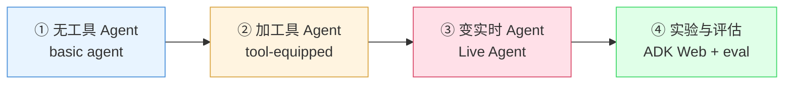

1. **无工具 Agent**：熟悉 `Agent` / `Runner` / `Session` 三大核心组件与基本模式。
2. **加工具**：把「数学 Agent」设计落地，学 ADK 如何用**函数 docstring** 理解工具，如何处理更丰富的事件流（event stream）。
3. **变实时**：把文本回合制 Agent 变成能实时语音对话的 Live Agent，看框架如何抹平实时音频流的巨大复杂度。
4. **评估**：用 ADK Web 做交互式调试 + 正式评估。

---

## 二、📐 设计你的 Agent：一张四步蓝图

> **「在写第一行代码之前，退一步、拿张纸和笔，先设计你的 Agent。」**

原书反复强调：造 Agent 和任何好的软件项目一样，都始于清晰的计划。一张**蓝图（blueprint）**能确保你清楚知道 Agent 该做什么、需要什么能力、人格与边界是什么。这一步把「抽象想法」变成「具体规格（concrete specification）」。

我们用贯穿全书的 **数学 Agent（Math Agent）** 为例，走完四步。

### 2.1 第一步：定义目的与工具（Purpose & Tools）

**最重要的第一问：这个 Agent 要解决什么问题？**

- 数学 Agent 的目的很简单：**为用户求解基础算术问题**。

**第二问：为达成目的，Agent 必须执行哪些动作？这些动作就变成工具（Tools）。**

数学 Agent 要完成四则运算，因此直接推导出需要四个工具：

| 工具 | 作用 |
| :--- | :--- |
| `add` | 加法 |
| `subtract` | 减法 |
| `multiply` | 乘法 |
| `divide` | 除法 |

> 🔬 **第一性原理｜「目的 → 动作 → 工具」的推导链**
> 注意这个推导方向：**先有目的，再倒推出必要动作，动作即工具。** 很多人反过来——「我有个搜索 API，那就给 Agent 加个搜索工具」——这是工具驱动，容易造出一堆没人用的工具。正确姿势是**目的驱动**：从「Agent 要达成什么」出发，只给它达成目的所必需的工具。工具越少、越正交（orthogonal），模型选错工具的概率越低。

### 2.2 第二步：确定所需上下文（Required Context）

**Agent 需要什么超出基础模型通用训练数据的专业知识？** 这就是**上下文（context）**。

一个基础数学 Agent 没上下文也能跑，但一个**真正有用、能自适应**的 Agent，会因为「知道自己在跟谁说话」而大不相同。原书为数学 Agent 定义的上下文是**学生画像（student profile）**：

| 上下文字段 | 示例 |
| :--- | :--- |
| **年级**（Grade Level） | "year 5"（五年级） |
| **当前课程**（Current Class） | "Introduction to Algebra"（代数入门） |
| **近期表现**（Recent Performance） | 过往作业的成绩 |

有了这些**动态上下文**，Agent 就能个性化：给低年级学生简化解释、给学有余力的学生更高难度挑战、引用他们具体课程里的话题。

> 💡 **实战｜上下文 ≠ 系统提示词**
> 新手常把上下文一股脑塞进系统提示词，导致提示词又长又乱。更好的心智模型：**指令（instruction）是「谁都一样」的规则和人格；上下文（context）是「因人而异」的动态数据。** 前者写死在 prompt 里，后者在运行时注入（后面会看到 ADK 用 `state` 和 `{占位符}` 优雅地做这件事）。

### 2.3 第三步：设计核心指令——Agent 的「宪法」

这一步定义 Agent 的**人格、规则和边界**。这些指令构成系统提示词（system prompt）的核心，原书称之为 Agent 的**宪法（constitution）**。要考虑四件事：

| 维度 | 关键问题 | 数学 Agent 的答案 |
| :--- | :--- | :--- |
| **人格**（Persona：Tone & Style） | Agent 该怎么表现？ | 一个「专职数学助手」，乐于助人、直截了当 |
| **边界与规则**（Boundaries & Rules） | Agent **不该**做什么？ | 「拒绝一切非数学请求（decline all non-mathematical requests）」——这对可靠性至关重要 |
| **工具使用引导**（Guidance on Tool Use） | 怎么帮用户/Agent 理解如何用工具？ | 在指令里给例子，如「你可以说 'add 3 5' 或 'Subtract 10 from 20'」 |
| **响应格式**（Response Format） | 最终答案怎么呈现？ | 结构化（如 JSON）还是自然语言？数学 Agent 用简单自然语言即可（如「The answer is 10.」） |

> ⚠️ **常见坑｜没有明确的「不该做什么」**
> 边界（boundaries）是最容易被忽略、却最影响可靠性的一环。一个只被告知「你是数学助手」的 Agent，用户问它天气它也会热心回答——这就跑偏了。**明确写下否定规则（「拒绝一切非数学请求」）是 Agent 稳定的护栏。** 在生产环境里，这一条往往还要配合护栏机制（guardrails）和输出校验。

### 2.4 第四步：提供执行示例（Golden Path Examples）

最后，给 Agent 一个**端到端的行为示例**，展示它在具体场景下该如何把「指令 + 上下文 + 工具」组合起来，产出高质量、人格一致的响应。原书给的例子：

- **给定上下文**：一个 `grade_level` 为 "year 5" 的学生画像。
- **用户 query**："multiply all the numbers between 1 and 10"（把 1 到 10 所有数相乘）。

**Agent 的期望行为分三步：**

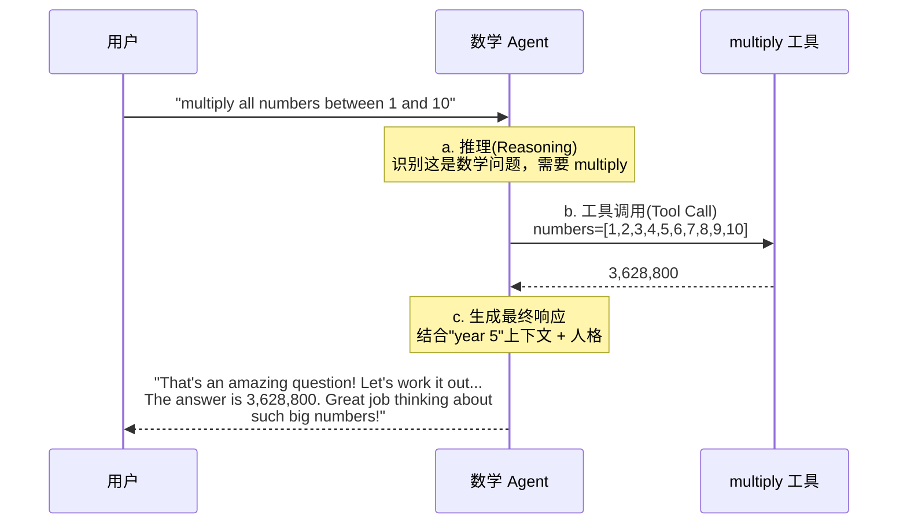

注意第三步：Agent 拿到工具结果后，用学生的上下文（"year 5"）和自己的人格，生成一个**对孩子友好、鼓励式**的答案，而不是冷冰冰的「3628800」。

> 🔬 **第一性原理｜为什么示例（few-shot）比再多的规则都管用？**
> 语言模型是「模式补全器」。你可以用一千字描述「鼓励式的语气」，但模型对**一个具体范例**的模仿能力，远强于对**抽象描述**的遵循能力。一个端到端的黄金示例（golden path），等于给了模型一个「目标靶子」——它不仅知道**做什么**，还知道**怎么做**。这就是 few-shot prompting 的威力，也是后面 `examples.py` 存在的理由。

### 2.5 蓝图全景（图 4-1）

四步走完，我们就有了完整蓝图。原书图 4-1 展示了四大核心组件如何互联：

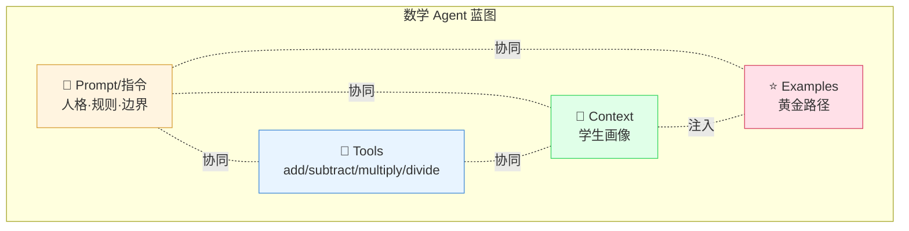

> **对更复杂的项目**，原书建议把这些设计资产拆进独立文件——`tools.py`、`context.py`、`prompt.py`、`examples.py`——保持项目整洁。这正是 2.6 节工程化拆分的伏笔。

---

## 三、🛠️ 搭建工作台：环境准备

蓝图在手，先把「数字工作台」搭好。整个过程几分钟即可，分三步。

### 3.1 拉代码

```bash
git clone https://github.com/sokart/oreilly-multimodal-agent-systems
```

代码托管在配套 GitHub 仓库的 `Chapter-06` 目录。

### 3.2 建 Python 虚拟环境

进入 `Chapter-06` 目录，用 Python 内建的 `venv` 建一个隔离环境（最佳实践，避免依赖冲突）：

```bash
python -m venv .adk_venv
source .adk_venv/bin/activate
```

> ⚠️ **常见坑｜Python 版本**
> ADK 在 **Python 3.11** 下工作最佳。如果你用别的版本，下一步安装库时可能需要加 `--ignore-requires-python` 标志。版本不匹配是 ADK 新手最常踩的第一个坑。

### 3.3 装 ADK + 配置凭据

```bash
pip install google-adk==1.16.0
```

然后配置凭据。仓库 `Chapter-06/basic_agent/` 里有个 `dotenv.example`，复制并改名为 `.env`。ADK 给你**两种连接方式**：

| 方式 | 配置 |
| :--- | :--- |
| **直接 API Key** | `GOOGLE_GENAI_USE_VERTEXAI=0`，把 key 填进 `GOOGLE_API_KEY` |
| **Google Cloud（Vertex AI）** | `GOOGLE_GENAI_USE_VERTEXAI=1`，填 `GOOGLE_CLOUD_PROJECT` 和 `GOOGLE_CLOUD_LOCATION` |

`.env` 模板与示例：

```bash
# 模板
GOOGLE_GENAI_USE_VERTEXAI=FILL_0_or_1  # 0=API key, 1=Vertex AI
GOOGLE_API_KEY=<API Key>               # 当 USE_VERTEXAI=0 时设置
GOOGLE_CLOUD_PROJECT=FILL_YOUR_PROJECT_ID
GOOGLE_CLOUD_LOCATION=FILL_YOUR_LOCATION
MODEL=FILL_THE_DEFAULT_MODEL           # 例：gemini-2.0-flash-exp

# 一个真实示例
GOOGLE_GENAI_USE_VERTEXAI=1
GOOGLE_CLOUD_PROJECT=gcp-project-genai
GOOGLE_CLOUD_LOCATION=us-central1
MODEL='gemini-2.0-flash'
```

跑个快速测试确认环境 OK：

```bash
> python3 section1_main_basic.py

User Query: Hi, how are you?
>>> Inside final response <<<
Agent: basic_agent
Response time: 1675.186 ms
Final Response:
I am doing well, thank you for asking. How can I help you today?
```

看到这个输出，工作台就绪。

---

## 四、🤖 构建基础 Agent（无工具版）

从最简单的版本起步：一个**没有任何自定义工具**的 Agent，目的是熟悉 ADK 的三大核心组件与「创建 → 运行 → 交互」的基本模式。对应文件 `Chapter-06/basic_agent/section1_main_basic.py`。

### 4.1 导入与实例化 Agent

```python
import asyncio  # ADK 要求异步交互

# 从 ADK 导入
from google.adk.agents import Agent
from google.adk.artifacts import InMemoryArtifactService
from google.adk.runners import Runner
from google.adk.sessions import InMemorySessionService
from google.genai import types
```

ADK 的中心组件是 `Agent` 类——它是 Agent 身份与核心逻辑的蓝图。实例化时，你就在定义它的「章程（charter）」：

```python
# 只带 name、description、instruction 的基础 Agent
basic_agent = Agent(
    model=MODEL,
    name="agent_basic",
    description="This agent responds to inquiries about its creation "
                "by stating it was built using the Google Agent "
                "Development Kit.",
    instruction="If they ask you how you were created, tell them you "
                "were created with the Google Agent Development Kit.",
    generate_content_config=types.GenerateContentConfig(temperature=0.2),
)
```

**逐字段拆解：**

| 字段 | 作用 | 讲解 |
| :--- | :--- | :--- |
| `model` | 底层基础模型 | Agent 的「推理引擎」。换模型只需改这一行 |
| `name` / `description` | 清晰的身份标识 | 对你、对未来与之交互的其他 Agent 都有用（多 Agent 系统里靠它路由） |
| `instruction` | **最重要**——Agent 的「宪法」 | 核心规则与人格所在。这就是 2.3 节设计的落地 |
| `generate_content_config` | 调模型行为 | 如 `temperature=0.2` 控制随机性——数学场景要确定性，所以调低 |

> 💡 **实战｜temperature 怎么定？**
> 数学 Agent 设 `temperature=0.2` 是有讲究的：算术要**确定、可复现**，高温会让模型「发挥创造力」把答案搞错。经验法则：**需要事实/精确/工具调用 → 低温（0~0.3）；需要创意/多样性 → 高温（0.7~1.0）。** Agent 场景大多偏向前者。

### 4.2 让 Agent 活起来：Session + Runner

定义好的 `Agent` 还只是个静态对象。要让它活起来，需要两样东西：**管记忆的系统** 和 **跑它的引擎**。

**先设置记忆（两个内存服务）：**

```python
session_service = InMemorySessionService()
artifact_service = InMemoryArtifactService()
```

| 服务 | 作用 |
| :--- | :--- |
| `InMemorySessionService` | 管**短期/会话记忆**——存单次连续对话的消息历史与数据 |
| `InMemoryArtifactService` | 存 Agent 产生/使用的**文件（artifacts）**，如图片、文本文件。本节不用它，但 `Runner` 要求必须定义 |

**再设置引擎——`Runner`：**

> 如果说 `Agent` 是蓝图，`Runner` 就是执行蓝图的**引擎**。它编排整个交互：接 query、管 session、把上下文发给 LLM、调对应工具、处理返回的事件流。整体上，它包裹了第 1 章讲的完整 Agent Core 交互循环。

把运行逻辑封进一个辅助函数：

```python
AGENT_APP_NAME = 'agent_basic'

async def send_query_to_agent(agent, query, user_id='user',
                              session_id="user_session"):
    # 1. 为本次交互创建 session
    session = await session_service.create_session(
        app_name=AGENT_APP_NAME,
        user_id=user_id,
        session_id=session_id)

    # 2. 把用户 query 包成 Content 对象
    content = types.Content(role='user', parts=[types.Part(text=query)])

    # 3. 实例化 Runner
    runner = Runner(app_name=AGENT_APP_NAME,
                    agent=agent,
                    artifact_service=artifact_service,
                    session_service=session_service)

    # 4. 执行 Agent，拿回事件流(event stream)
    events = runner.run_async(user_id=user_id,
                              session_id=session_id,
                              new_message=content)

    # 5. 处理事件流，找最终响应
    async for event in events:
        if event.is_final_response():
            final_response = event.content.parts[0].text
```

**关键认知：`Runner` 不返回单个答案，而是一个事件流（stream of events）。** 基础 Agent 不用工具，所以只关心最终响应，用 `is_final_response()` 找到它。

启动：

```python
asyncio.run(send_query_to_agent(basic_agent, "Hi, how are you?"))
```

> ⚠️ **常见坑｜每次都建新 session = Agent 失忆**
> 上面的代码**每次 query 都新建 session**，意味着 Agent 对过往交互毫无记忆。原书的 TIP：如果想让 Agent 记住对话，把 `session` 对象在 `send_query_to_agent` **函数外**创建一次，然后每次跟进都复用同一个 session。这是「短期记忆」最朴素的实现——**记忆不是模型的属性，而是「复用同一个会话容器」的工程选择。**

多 query 循环示例：

```python
queries = ["Hi, I am Tom",
           "Could you let me know what you could do for me?",
           "How were you built?"]
for query in queries:
    asyncio.run(send_query_to_agent(basic_agent, query))
```

到这里，你已经有了一个能跟指令、能简单对话的 Agent——但它的能力**局限于底层模型的知识**。要让它真正有用，得让它能**行动**。工具登场。

---

## 五、🔧 给 Agent 装上工具

在 ADK 里，**工具就是你提供给 Agent 的 Python 函数**。这一节把数学 Agent 的设计落地。对应 `section2_main_single_agent.py` 与 `agent_math/agent.py`。

### 5.1 写工具函数——docstring 是灵魂

以 `add` 为例：

```python
def add(numbers: list[int]) -> int:
    """Calculates the sum of a list of integers.

    This function takes a list of integers as input and returns
    the sum of all the elements in the list. It uses the built-in
    `sum()` function for efficiency.

    Args:
        numbers: A list of integers to be added.

    Returns:
        The sum of the integers in the input list. Returns 0 if the
        input list is empty.

    Examples:
        add([1, 2, 3]) == 6
        add([-1, 0, 1]) == 0
        add([]) == 0
    """
    return sum(numbers)
```

函数逻辑极简（就一句 `return sum(numbers)`），但**对 Agent 最关键的部分是 docstring**。

> **这个 docstring 不是给其他开发者看的注释，而是 ADK 读取以理解工具的「用户手册」。** ADK 解析它的描述、参数、返回值、示例，生成一份正式的**函数声明（Function Declaration）**——即第 1 章讲的工具 schema——交给基础模型。**写好 docstring，是确保 Agent 知道「何时用、如何用」工具的关键。**

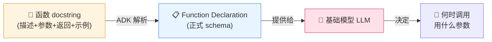

> 🔬 **第一性原理｜为什么 docstring 决定成败？**
> 模型看不到你的函数体（`return sum(numbers)`），它**只能看到 docstring 生成的 schema**。所以模型判断「这个问题该不该用 `add`」「参数该填什么」，全靠 docstring 说清楚。一个含糊的 docstring（如只写 "adds numbers"）会让模型频繁选错工具或填错参数。**docstring 的质量 = 工具的可用性。** 这也是为什么 ADK 把「函数即工具」做得如此轻——因为好的 Python 函数本来就该有好 docstring。

> 💡 **面试高频｜LLM 是怎么「调用函数」的？**
> 澄清一个常见误解：LLM **不会真的执行你的 Python 函数**。它做的是：根据 schema，输出一段结构化的「意图」——「我想调 `multiply`，参数 `numbers=[1,2,3]`」（即一个 **Function Call 事件**）。真正执行函数的是**框架/运行时（ADK 的 Runner）**，执行完把结果（**Function Response 事件**）回灌给模型，模型再决定下一步。**LLM 负责「决策调什么」，运行时负责「实际执行」——职责分离。**

### 5.2 把工具挂给 Agent

定义完四个工具函数后，挂载极简——把函数对象放进列表传给 `tools` 参数：

```python
agent_math = Agent(
    model=MODEL,
    name="simple_math_agent",
    description="This agent performs basic arithmetic operations "
                "(addition, subtraction, multiplication, and division) "
                "on user-provided numbers, including ranges.",
    instruction="""
        I can perform addition, subtraction, multiplication, and
        division operations on numbers you provide.
        Tell me the numbers you want to operate on.
        For example, you can say 'add 3 5', 'multiply 2, 4 and 3',
        'Subtract 10 from 20', 'Divide 10 by 2'.
        You can also provide a range: 'Multiply the numbers between 1 and 10'.
    """,
    generate_content_config=types.GenerateContentConfig(temperature=0.2),
    tools=[add, subtract, multiply, divide],  # ← 就这一行
)
```

### 5.3 查询工具型 Agent——三种事件

交互模式和之前一样，但 `Runner` 返回的事件流现在丰富多了。当你问一个需要工具的问题，Agent 的「思考过程」会分几步展开，每步生成不同类型的事件：

| 事件类型 | 何时发生 | 含什么 |
| :--- | :--- | :--- |
| **Function Call**（函数调用） | Agent 决定要用某个工具 | 要调的函数名 + 准备好的参数 |
| **Function Response**（函数响应） | ADK 执行完函数后 | 你的工具代码返回的结果 |
| **Final Response**（最终响应） | Agent 拿齐所需信息后 | 给你的最终自然语言答案 |

事件处理循环要同时判断这三种可能：

```python
async for event in events:
    print(f'Agent: {event.author}')
    is_final_response = event.is_final_response()
    function_calls = event.get_function_calls()
    function_responses = event.get_function_responses()

    if is_final_response:
        final_response = event.content.parts[0].text
        print(f'Final Response {final_response}')
    elif function_calls:
        for function_call in function_calls:
            print(f'Call Function: {function_call.name}')
            print(f'Argument: {function_call.args}')
    elif function_responses:
        for function_response in function_responses:
            print(f'Function Name: {function_response.name}')
            print(f'Function Results: {function_response.response}')
```

### 5.4 见证多步推理：工具链（tool chaining）

发一个需要**串两个工具**的多步 query：

```python
if __name__ == '__main__':
    asyncio.run(send_query_to_agent(
        agent_math, "First multiply numbers 1 to 3 and then add 4"))
```

运行后，Agent 的整个推理过程在终端展开——它先调 `multiply` 得到 6，再把 6 用在后续的 `add` 调用里，最后才生成答案：

```text
User Query: First multiply numbers 1 to 3 and then add 4
+++ Inside function call +++
Agent: agent_math
Call Function: multiply
Argument: {'numbers': [1, 2, 3]}
- Inside function response -
Function Name: multiply
Function Results: {'result': 6}
+++ Inside function call +++
Agent: agent_math
Call Function: add
Argument: {'numbers': [6, 4]}      ← 注意：6 是上一步的结果
- Inside function response -
Function Name: add
Function Results: {'result': 10}
>>> Inside final response <<<
Response time: 4685.989 ms
Final Response:
The answer is 10.
```

这段输出把 **Agent 的「规划（planning）」能力**暴露得淋漓尽致：

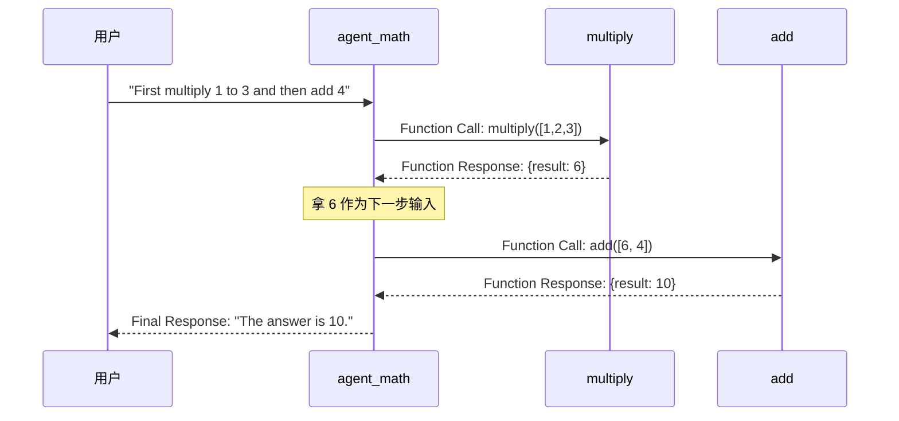

> 🔬 **第一性原理｜这就是「规划 + 工具编排」的最小样本**
> 别小看这个玩具例子——它展示了 Agent 三大能力的交汇：（1）**规划（planning）**：模型把「先乘再加」的自然语言拆成两步有序动作；（2）**工具编排（tool orchestration）**：按正确顺序调用工具，且**把前一步的输出（6）当作后一步的输入**；（3）**观察-行动循环（observe-act loop）**：每次工具返回后，模型重新观察结果、决定下一步。这正是 ReAct（Reason + Act）范式的本质。生产级 Agent 编排几十个工具、跑几十步，底层逻辑和这个 4 步例子完全一样。

> ⚠️ **常见坑｜工具链越长，出错概率越高（且会累积）**
> 每一步工具调用，模型都有一定概率选错工具或填错参数。假设单步正确率 95%，串 10 步的整体正确率就只有 0.95¹⁰ ≈ 60%。这就是为什么**长链条 Agent 需要（a）尽量少而正交的工具、（b）健壮的错误处理、（c）系统化评估（本章第八节）**。别指望「多加几个工具、prompt 里多写几句」就能让长链稳定——要靠工程和评估。

---

## 六、🎙️ 把数学 Agent 变成 Live Agent

到目前为止，交互都是**文本、回合制（turn-by-turn）**的。本书的终极目标是造能**实时语音对话**的 Live Agent。这一节我们重新改造第 2 章的实时流方案，用 ADK Live Agent 替换后端。对应目录 `Chapter-06/live_agent/`。

### 6.1 先重构：把设计组件拆进独立文件

Agent 变复杂后，所有逻辑塞一个文件难以维护。更好的做法是把设计组件——prompt、tools、context、examples——各自拆进独立文件（图 4-2）：

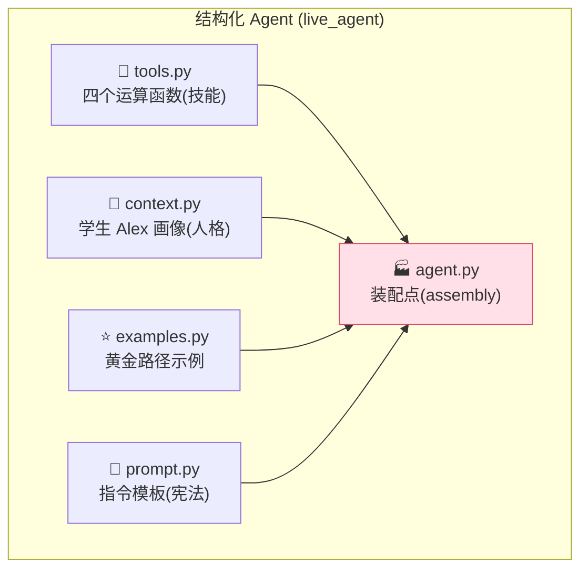

> ⚠️ **关键设计决策｜为什么用 `.py` 而不是 `.txt`/`.json`？**
> 原书专门用一个 NOTE 回答这个问题：静态文件（txt/json）对简单 Agent 够用，但**用 Python 文件给你远超静态文件的灵活性**，能构建**可扩展、动态**的方案。比如：
> - `context.py` 里可以放一个**从数据库拉取用户实时数据的函数**，而不是硬编码的学生画像；
> - `examples.py` 可以**为特定 query 动态检索最相关的示例**。
>
> 这种「程序化」方式是打造「能实时自适应、个性化」Agent 的最佳实践。**记住：Agent 的 prompt/context/examples 不该是死数据，而应是能在运行时计算的活代码。**

### 6.2 五个组件文件逐一拆解

**① `tools.py`——Agent 的技能**

最直接的改动：把 `add/subtract/multiply/divide` 四个函数搬进独立文件，代码和 docstring 原封不动。

```python
# tools.py
def add(numbers: list[int]) -> int:
    """Calculates the sum of a list of integers.
    ...
    Examples:
        add([1, 2, 3]) == 6
        add([-1, 0, 1]) == 0
    """
    return sum(numbers)
# ... subtract, multiply, divide 类似
```

**② `context.py`——Agent 的人格（专业知识）**

这里定义让 Agent 自适应的专业知识。不是泛泛的数学导师，而是一个**懂用户**的助手。`context.py` 持有一个描述学生 Alex 的详细 JSON——年级、学习目标、以及**非常具体的教学偏好**：

```python
# context.py
context = {
    "student_profile": {
        "name": "Alex",
        "age": 10,
        "grade_level": "Year 5",
        "learning_goals": [
            "Understand how to solve for variables.",
            "Build confidence in math problem-solving."
        ],
        "preferences": {
            "tone_and_personality": {
                "primary_tone": "Friendly, encouraging, and patient.",
                "personality": "Act like a fun and helpful study buddy...",
                "humor": "Incorporate age-appropriate math jokes and puns..."
            },
            "explanation_style": {
                "method": "Always prioritize the step-by-step process...",
                "analogies": "Use simple, real-world analogies..."
            }
        }
    }
}
```

有了这个结构化上下文，Agent 能动态调整人格、类比、整套教学法，精准匹配 Alex 的需要（比如用 Alex 的名字和偏好跟他说话）。

**③ `examples.py`——黄金路径（The Golden Path）**

如果说 `tools.py` 的 docstring 教模型「怎么调函数」，那 `examples.py` 教模型「**怎么表现**」。它提供一个完整的端到端理想交互场景，给模型一条「黄金路径」去模仿：

```python
# examples.py
examples = """
    Example Scenario:
        Student asks: "What is $3x + 5 = 20$?"
        Your Ideal Response: "Awesome question! Let's solve this mystery...
        To start, we need to get the part with the 'x' all by itself.
        What do you think we could do to get rid of that '+ 5'?"
    """
```

注意这个理想响应**不直接给答案**——它鼓励式、用类比（「天平 balancing scale」）、解释目标（「把 x 单独拿出来」）、还用一个问题反过来引导学生。这远超一个简单的工具演示。

**④ `prompt.py`——Agent 的宪法（模板化）**

这个文件是 Agent 的宪法 `instruction_prompt`，被改造成一个**把所有其他组件粘合起来的主模板**：

```python
# prompt.py
instruction_prompt = """
    You are a specialized math agent...

    2. Critical Rule:
    You must derive all answers by using your available tools...

    3. Target Audience:
    Your target audience is {student_profile}.

    Reference Examples:
    For the ideal response format, tone, and interaction flow, refer
    to the following examples.
    {examples}
    """
```

**关键改进是两个占位符 `{student_profile}` 和 `{examples}`。** 它们不是注释，是**动态字段**：运行时 ADK 会自动把 `context.py` 的整个 JSON 对象、`examples.py` 的完整场景，注入这两个槽位。这样每一轮对话，模型都拿到一份**上下文丰富、完整**的指令。

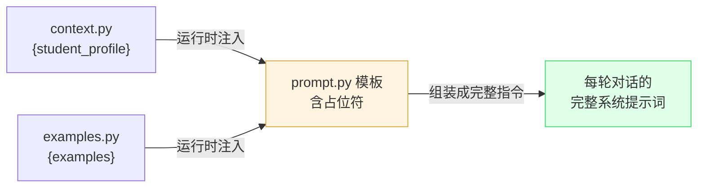

**⑤ `agent.py`——干净的装配点**

`agent.py` 变成纯粹的组装点。`create_math_agent` 工厂函数导入所有独立组件，实例化时拼到一起：

```python
# agent.py
from .tools import add, subtract, multiply, divide
from .prompt import instruction_prompt
from .context import context
from .examples import examples

def create_math_agent(model=MODEL):
    # 创建前把 examples 注入 context 字典
    context["examples"] = examples

    math_agent = Agent(
        model=model,
        name="agent_math",
        instruction=instruction_prompt,
        tools=[add, subtract, multiply, divide],
        # ...
    )
    # 返回 agent 和它运行所需的 context
    return math_agent, context
```

这种模块化结构是最佳实践——Agent 不仅更强，还**更易维护、更易扩展**。

> 💡 **面试高频｜「工厂函数」模式的价值**
> `create_math_agent()` 是一个**工厂函数（factory function）**，返回 `(agent, context)` 二元组。为什么这么设计？（1）**可测试**：测试时能轻松换掉 model、context；（2）**可复用**：同一份组件能装配出针对不同用户的 Agent（换 context 即可）；（3）**关注点分离**：装配逻辑（agent.py）和内容（其他四个文件）彻底解耦。这是把「玩具脚本」升级为「生产代码」的标志性重构。

### 6.3 从「实时流模型」到「实时 Agent」——架构的化繁为简

回顾第 2 章：你造过一个能直接与 Gemini 模型双向流式传输音频的方案。但那套架构相当复杂（图 4-3）——你要**手动管理两条 WebSocket 连接**：一条前端↔后端，一条后端↔Gemini Live Streaming API。而且很难集成工具、记忆、上下文这些核心 agentic 特性。

**ADK 的 Live Agent 正是来解决这个问题的（图 4-4）：**

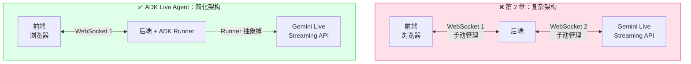

**ADK Runner 完全抽象掉了与 Gemini Live Streaming API 的直接交互**——它替你处理第二条 WebSocket 连接和所有底层音频流。这大幅简化后端代码，更重要的是，无缝集成了你已学的所有 agentic 组件（工具、session 记忆）。

ADK 为 Live Agent 引入的两个关键新组件：

| 新组件 | 作用 |
| :--- | :--- |
| **Live Request Queue**（实时请求队列） | 缓冲来自用户的输入音频 |
| **Live-specific Events**（实时专用事件） | 包含音频数据 + 控制标志，如「打断（interruption）」「回合完成（turn complete）」 |

### 6.4 Live Agent 三大函数深入

`backend.py` 里有三个核心函数驱动 Live Agent。先调工厂函数实例化 Agent：

```python
root_agent, context = create_math_agent(model=MODEL)
```

**① `start_agent_session`——配置并初始化实时会话**

它定义 Agent 的语音能力（如声音）、设置 session 记忆、创建一个特殊的 LiveRunner，返回 `live_request_queue` 和 `live_events` 流：

```python
async def start_agent_session(root_agent, session_id: str,
                              app_name="agent_math", user_id="user",
                              context: Dict[str, Any] = {}) -> Any:
    """创建并存储新 session，用 ADK 的实时 session runner。"""

    ### 配置
    response_modalities_from_config = ["AUDIO"]
    voice = 'Aoede'
    language_code = 'en-GB'

    run_config = RunConfig(
        response_modalities=response_modalities_from_config,
        speech_config=types.SpeechConfig(
            voice_config=types.VoiceConfigDict(
                {"prebuilt_voice_config": {"voice_name": voice}}),
            language_code=language_code))

    # 通过 Live Runner 启动 Agent
    runner = InMemoryRunner(app_name=app_name, agent=root_agent)

    session_obj = await runner.session_service.create_session(
        app_name=app_name, user_id=user_id,
        state=context,)   # ← 关键：把 context 注入 session state

    live_request_queue = LiveRequestQueue()
    live_events = runner.run_live(
        session=session_obj,
        live_request_queue=live_request_queue,
        run_config=run_config)

    return live_events, live_request_queue
```

> 🔬 **第一性原理｜`state=context` 是记忆系统的核心**
> 原书专门用 NOTE 强调这行 `state=context`：这是把整个 context 字典（含详细学生画像和 examples）**注入 session 的 state** 的关键一步。**state 是 ADK 最重要的概念之一——它是一次 session 的「共享工作记忆（shared working memory）」**，让不同的 Agent 和工具在 Agent 运行时能访问、交换信息。换句话说：`instruction` 是静态宪法，`state` 是动态的、可被读写的「便签本」。多 Agent 协作时，一个 Agent 写进 state 的东西，另一个 Agent 能读到——这就是它们「通信」的方式。

**② `handle_frontend_messages`——监听麦克风音频，塞进队列**

它监听浏览器麦克风传来的音频块，唯一的活儿就是把它们放上 `live_request_queue`，等 ADK Runner 来取：

```python
async def handle_frontend_messages(client_ws, live_request_queue):
    """监听浏览器消息并转发给 Gemini。"""
    async for message in client_ws:
        data = json.loads(message)
        if 'realtimeInput' in data and 'mediaChunks' in data['realtimeInput']:
            for chunk in data['realtimeInput']['mediaChunks']:
                if chunk.get('mime_type') == 'audio/pcm':
                    audio_bytes = base64.b64decode(chunk['data'])
                    audio_blob = types.Blob(
                        data=audio_bytes,
                        mime_type='audio/pcm;rate=16000')
                    live_request_queue.send_realtime(audio_blob)  # ← 塞进队列
```

**③ `handle_agent_responses`——监听 Agent 返回流，转发给前端**

它监听 Agent 回来的 `live_events` 流，处理不同事件类型：把音频数据送去浏览器播放，把控制信号（用户打断、回合完成）也转发出去：

```python
async def handle_agent_responses(client_ws, live_events):
    """监听 Gemini session 消息并转发给浏览器，处理多个对话回合。"""
    async for event in live_events:
        # --- 打断(Interruption) ---
        if event.interrupted:
            await client_ws.send(json.dumps({
                "type": "interrupted",
                "data": {"message": "Response interrupted by user input"}}))
            continue

        if event.content is None:
            if event.turn_complete:   # 回合完成信号
                await client_ws.send(json.dumps({
                    "type": "backend", "data": "turn_complete"}))
            continue

        inline_data = (event.content and event.content.parts
                       and event.content.parts[0].inline_data)

        if inline_data and inline_data.mime_type.startswith('audio/pcm'):
            audio_base64 = base64.b64encode(inline_data.data).decode('utf-8')
            await client_ws.send(json.dumps({
                "type": "audio", "data": audio_base64}))   # ← 音频送去播放
            continue
        await asyncio.sleep(0)
```

> 💡 **实战｜「打断（barge-in）」为什么是实时体验的灵魂**
> 注意 `event.interrupted` 的处理。真实对话中人会插话打断——如果 Agent 只会「说完一整段才停」，体验就很机械。ADK 把「打断」做成一个一等公民的事件（first-class event），前端一收到就立刻停止播放当前音频。**「可打断（barge-in）」+「低 dead-air（沉默间隙）」是区分「真实时」和「假流式」的关键指标**，也是本书第 2 章四大实时属性（流式/低延迟/双工/事件驱动）的落地体现。

### 6.5 跑起来

```bash
# 后端
cd Chapter-06/live_agent/backend
cp dotenv.example .env      # 填凭据
python backend.py           # 起在 localhost:8081

# 前端（新开一个终端）
cd Chapter-06/live_agent/frontend
python -m http.server 8000  # 起在 localhost:8000
```

浏览器打开 `http://localhost:8000`，点「Start Session」，就能**实时语音**跟你的数学 Agent 对话了（图 4-5）。

> ⚠️ **常见坑｜Live streaming 只支持特定模型版本**
> 实时流不是所有模型都支持。`dotenv.example` 里列了兼容模型清单——用错模型版本会直接连不上 Live API。这是 Live Agent 上手时容易忽略的一个坑。

**这一节的成就**：你看到了如何为可维护性重构 Agent（六个文件），更重要的是，如何利用 ADK 的 Live Agent 能力，把一个文本工具 Agent 变成实时语音应用，**同时大幅简化后端架构**。

---

## 七、🧩 承上启下：设计模式、记忆、规划、工具编排的统一视角

在进入评估之前，我们把本章散落的概念收拢成一张「Agent 五大主题」的统一地图——这也是很多面试和系统设计会问的框架。

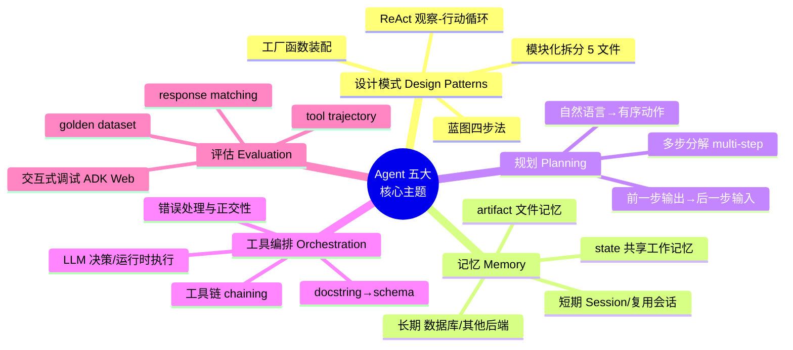

### 7.1 设计模式（Design Patterns）

本章其实演示了几个可迁移的 Agent 设计模式：

| 模式 | 本章体现 | 迁移到哪 |
| :--- | :--- | :--- |
| **蓝图先行**（Blueprint-first） | 四步设计法（目的/上下文/指令/示例） | 任何 Agent 项目的第一步 |
| **模块化拆分**（Modular separation） | prompt/tools/context/examples/agent 五文件 | 任何复杂到单文件难维护的 Agent |
| **工厂装配**（Factory assembly） | `create_math_agent()` 返回 `(agent, context)` | 需要多实例/可测试的场景 |
| **观察-行动循环**（ReAct loop） | 「multiply→观察 6→add」的多步链 | 所有需要多步工具调用的 Agent |

### 7.2 记忆（Memory）的三个层次

原书把记忆拆得很清楚，我们对齐 ADK 的实现：

| 记忆类型 | 是什么 | ADK 里怎么实现 |
| :--- | :--- | :--- |
| **短期/会话记忆**（Short-term/Session） | 单次连续对话的消息历史 | `InMemorySessionService`；**复用同一个 session 对象**即获得记忆 |
| **共享工作记忆**（Working memory / state） | Agent 运行中读写的「便签本」 | session 的 `state`（`state=context` 注入），跨 Agent/工具共享 |
| **长期记忆**（Long-term） | 跨会话持久化 | 把 SessionService 后端换成**数据库或其他后端** |
| **文件记忆**（Artifacts） | Agent 产生/使用的文件 | `InMemoryArtifactService`（或持久化版本） |

> 🔬 **第一性原理｜LLM 本身是无状态的，记忆全靠外部工程**
> 底层模型每次调用都是「无状态（stateless）」的——它不记得上一句。所谓「Agent 有记忆」，本质是**运行时把历史/state 在每次调用时重新回灌给模型**（第 2 章讲的「记忆魔术」）。所以记忆的强弱不取决于模型，而取决于你**怎么存、存多少、存哪里**——内存快但易失，数据库持久但慢。这是纯粹的工程权衡。

### 7.3 规划与工具编排

本章 5.4 的「先乘再加」例子，就是**规划（planning）**和**工具编排（orchestration）**的最小完整样本，前面已深入讲过。核心记住三点：

1. **规划** = 把自然语言意图分解为有序动作序列；
2. **编排** = 按正确顺序调用工具，且能把前一步输出接到后一步输入；
3. **LLM 决策、运行时执行** = 职责分离，这是所有 Agent 框架的共同底层。

---

## 八、📊 改进与评估 Agent：从随手调试到系统化质检

从终端跑 Agent 适合初测，但 Agent 一复杂（多工具、多回合），你就需要更强、更可视化的方式。在控制台里翻长串文本调试特定推理步骤，很痛苦。ADK 生态提供了一个 Web UI——**ADK Web**，把它当作 Agent 的「可视化驾驶舱（cockpit）」。它覆盖从「随手聊天」到「结构化正式评估」的全流程。

### 8.1 交互式调试：Agent 的驾驶舱

ADK Web 的核心是交互式聊天界面，**无需写任何自定义 Python 脚本**（不用再写 `send_query_to_agent`）。

启动只需两步。先在 agent 文件里把要测的 Agent 定义为 `root_agent`：

```python
# agent.py 末尾
root_agent = agent_math
```

然后在 `Chapter-06/basic_agent` 目录跑：

```bash
$ adk web
```

它会启动 Web 服务器，给你一个本地 URL（图 4-6，通常是 `http://127.0.0.1:8000`）。打开后你会看到一个综合界面（图 4-7）：主区是聊天窗口，**真正的威力在左侧调试面板**——它给你 session 的 **trace（追踪）、events（事件）、state（状态）** 等等。

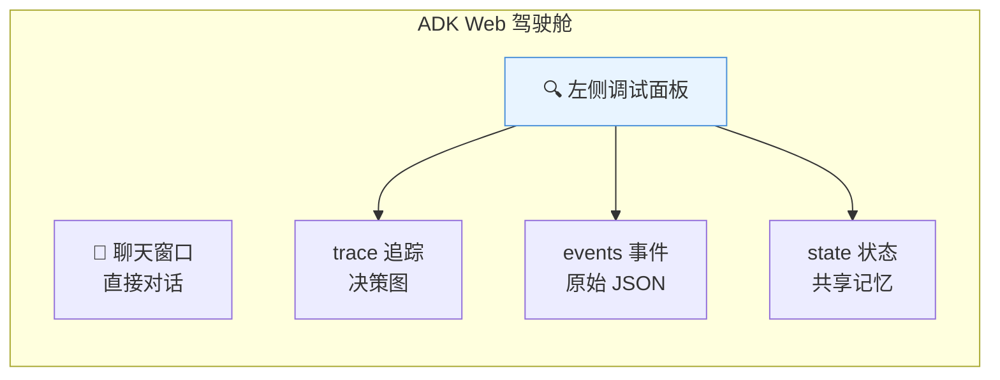

**这个界面让调试变直观**：每次 Agent 行动（如调工具），聊天记录里就出现一个图标。点它，立刻看到**原始事件数据**（图 4-8）——模型决定做什么、调了哪个函数、用了什么参数。这是「掀开引擎盖偷看（peek under the hood）」的无价工具。

> 💡 **实战｜微软图标一点，胜过读千行日志**
> ADK Web 把「事件流」这个原本要在终端里 `print` 才能看的东西，变成了可点击、带决策图（graph of agent decisions）+ JSON 详情的可视化。**调 Agent 的 80% 时间花在「搞清楚模型为什么做了这个决定」上**，一个好的 trace 可视化能把这个时间砍掉一大半。你也能在聊天框点麦克风图标，把任意 Agent 变成 live agent 快速实验（但生产级 live agent 仍需要前面那套专门的前后端架构）。

### 8.2 正式评估：用 golden dataset 做回归测试

聊天对开发很关键，但你还需要**系统化地度量性能与质量**。这就是 ADK 正式评估（formal evaluation）的用武之地。

**核心思想**：用一个预定义的**评估数据集（evaluation dataset）**测 Agent——这是一个文件，含一组测试用例，每例有一个样本 query 和你期望的**「黄金（golden）」答案**。

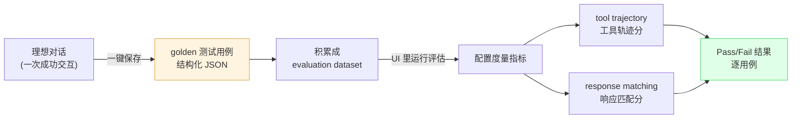

**从「一次好对话」到「一个测试用例」（图 4-9、4-10）：**
创建数据集本来很枯燥，但 ADK Web 让它变简单——当你有一次「代表理想交互」的对话，**一键就能把这次 session 存为一个新的评估用例**，自动生成结构化 JSON 加进测试套件。JSON 里存的就是用户 query 和最终响应。

**运行评估（图 4-11、4-12）：**
积累若干用例后，直接在 UI 里跑评估。你能配置度量指标：

| 度量指标 | 检验什么 |
| :--- | :--- |
| **Tool Trajectory**（工具轨迹） | Agent 有没有**按正确顺序调用正确的工具**（过程对不对） |
| **Response Matching**（响应匹配） | 最终答案和「黄金答案」的匹配度（结果对不对） |

工具给出每个用例清晰的 **Pass/Fail** 结果，让你快速定位**回归（regression）**或需要改进的逻辑。

> 🔬 **第一性原理｜为什么要同时评「轨迹」和「结果」？**
> 只看最终答案对不对（response matching）是不够的——Agent 可能**用错误的过程蒙对了答案**（比如该用 multiply 却瞎猜出对的数），这种「对得不稳」的 Agent 迟早翻车。**Tool trajectory 评的是「过程正确性」，response matching 评的是「结果正确性」，两者结合才能测出「稳定可靠」的 Agent。** 这对应软件测试里「不仅要结果对，实现路径也要对」的理念。生产 Agent 尤其看重 trajectory——因为过程稳，结果才能持续稳。

> 💡 **面试高频｜Agent 评估和传统 ML 评估有什么不同？**
> 传统 ML 评估：输入 → 单个输出 → 和标签比（准确率/F1）。Agent 评估更难，因为：（1）**输出是多步轨迹**，不是单个值；（2）**同一问题可能有多条正确路径**；（3）**自然语言答案难精确匹配**（要用语义相似度或 LLM-as-judge）。所以 ADK 用 **tool trajectory + response matching 双指标**，而不是单一准确率。这也是为什么 Agent 评估常需要「golden dataset + 人工构造理想交互」。

> ⚠️ **规模提醒**：这套 UI 工作流适合实验。**生产系统往往需要成百上千条评估记录。** 原书说会在第 15、16 章深入大规模评估数据集的准备与管理。本章只教你「评估的心智模型和最小闭环」。

---

## 九、🎯 全章串讲：一条从蓝图到实时应用的完整链路

把八节内容拧成一条线，你会看到一个 Agent 是如何「从想法长成产品」的：

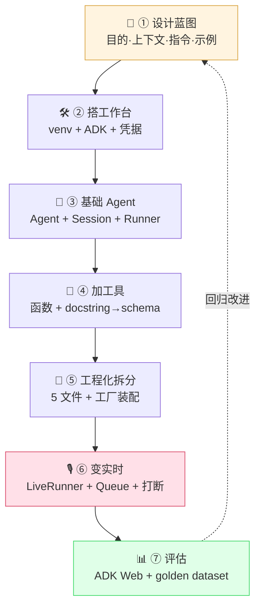

注意最后那条虚线——**评估的结果会反哺设计**，形成「设计 → 构建 → 评估 → 再设计」的迭代闭环。这才是真实 Agent 开发的样子，而不是一次性写完就完事。

---

## 📌 小结

| # | 核心要点 | 一句话本质 |
| :--- | :--- | :--- |
| 1 | **为什么用框架** | 框架把「每个 Agent 都要写的 plumbing」抽象成可复用组件，让你专注创新；ADK 因**原生双向实时流**被本章选中 |
| 2 | **设计蓝图四步法** | 目的与工具 → 所需上下文 → 核心指令（宪法）→ 执行示例（黄金路径）；**目的驱动，不是工具驱动** |
| 3 | **三大核心组件** | `Agent`（蓝图）、`Session`（记忆容器）、`Runner`（执行引擎）；Runner 返回**事件流**而非单个答案 |
| 4 | **工具即函数，docstring 是灵魂** | ADK 解析 docstring 生成 Function Declaration schema 给模型；**LLM 决策调什么、运行时实际执行** |
| 5 | **三种事件 + 工具链** | Function Call / Function Response / Final Response；「先乘再加」= 规划 + 工具编排 + 观察-行动循环的最小样本 |
| 6 | **工程化五文件拆分** | tools/context/examples/prompt/agent；**用 `.py` 而非 txt/json** 是为了动态可扩展；`{占位符}` 运行时注入 |
| 7 | **Live Agent** | ADK Runner 抽象掉第二条 WebSocket；`state=context` 注入共享工作记忆；「打断（barge-in）」是实时体验灵魂 |
| 8 | **系统化评估** | ADK Web 驾驶舱（trace/events/state）做交互式调试；golden dataset + **tool trajectory（过程）+ response matching（结果）双指标** |
| 9 | **记忆三层次** | 短期（复用 session）/ 共享工作记忆（state）/ 长期（换数据库后端）；**LLM 无状态，记忆全靠外部工程回灌** |

**一句话总结全章**：造 Agent 不神秘——先画一张四步蓝图，再用框架把蓝图装配成「有工具、有记忆、能实时、可评估」的活体，最后用 golden dataset 让它稳定可靠。概念很强大，工程很具体。

---

## 🔗 延伸

- **原书前后章**：第 3 章讲 Agent 的理论解剖学（五大核心组件），是本章的理论前置；**第 7 章（本讲义对应第 5 章）** 讲多 Agent 协作模式（multi-agent patterns），是本章「单 Agent」的自然延伸——把多个专职 Agent 编成团队解决复杂问题。第 15、16 章深入大规模评估数据集。
- **ADK 官方**：`pip install google-adk`；核心类 `google.adk.agents.Agent`、`google.adk.runners.Runner`、`google.adk.sessions.InMemorySessionService`；实时相关 `LiveRequestQueue` / `RunConfig` / `runner.run_live()`；命令行 `adk web` 启动调试驾驶舱。
- **配套代码**：`github.com/sokart/oreilly-multimodal-agent-systems` 的 `Chapter-06/`（`basic_agent/` 和 `live_agent/` 两个子目录）。
- **横向对比**：可对比 **LangChain / LangGraph**（生态最大、图式编排）、**CrewAI**（多 Agent 协作友好）、**AutoGen**（微软，多 Agent 对话）——它们的「工具定义 / 记忆管理 / 是否支持实时流」各有取舍，本章的蓝图四步法和评估双指标在任何框架下都通用。
- **范式溯源**：本章「观察-行动循环」对应经典的 **ReAct（Reasoning + Acting）** 论文；「工具编排」对应 **Function Calling / Tool Use** 的模型能力；「golden dataset 评估」对应 **LLM-as-a-judge** 和 Agent evaluation 的前沿方向。

> 🧭 **给读者的下一步**：clone 配套仓库，亲手把 `basic_agent` 从无工具跑到有工具，再启动 `adk web` 点开一次工具调用的 trace 看看 JSON——「看见模型的决策过程」这一刻，是理解 Agent 最关键的顿悟点。
