# 第 5 章 · AgentOps：Agent 运营化导论（The Birth of AgentOps）

> 对应原书 *Multimodal Real-Time AI Agent Systems*（Heiko Hotz & Sokratis Kartakis, O'Reilly Early Release）第 5 章（原书目录里是最终版第 15 章），PDF 第 169–250 页。
>
> 本章是全书从「怎么造 Agent」跨到「怎么把 Agent 投产」的**分水岭**。前面几部分你已经会搭多智能体系统、会用工具、会走 A2A / MCP 协议了；但一个能在 demo 里跑通的原型，和一个能安全、可靠、可扩展地跑在生产环境、服务真实用户的系统，中间隔着一整个学科——这个学科叫 **AgentOps（Agent Operations，智能体运营化）**。
>
> 一句话概括本章的立场：**AgentOps 不是从天而降的新东西，而是 DevOps → MLOps → GenAIOps 这条演进链的下一环。** 老学科不会消失，它们只是被叠加、被扩展。看懂这条继承链，你才真正拿得到把 Agent 送进生产的「架构蓝图」。

---

## 🗺️ 本章地图

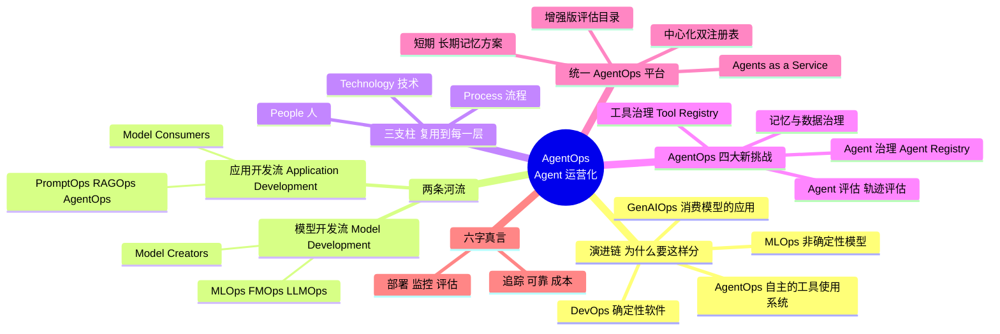

学完本章你会拿到四样东西：

1. **一条清晰的演进链**——DevOps → MLOps → FMOps/LLMOps → GenAIOps（PromptOps / RAGOps / AgentOps），每一环解决什么新问题、继承了上一环什么，你都能讲清楚。
2. **「模型创造者 vs 模型消费者」这把手术刀**——它决定了一个组织到底该用 MLOps 还是 GenAIOps，是本章最重要的战略分野。
3. **AgentOps 四大独有挑战的第一性理解**——Agent 评估（尤其是**轨迹评估 trajectory evaluation**）、工具治理、Agent 治理、记忆治理。
4. **一张企业级的统一 AgentOps 平台参考架构**——从 Agents as a Service，到中心化的 Tool / Agent Registry，到短期/长期记忆方案，能照着它设计真实系统。

> ⚠️ **本章边界**：这是一章**导论 / 蓝图**，不是深挖。原书反复用 NOTE 提醒：高级评估算法在第 16 章、Tool Registry 实现细节在第 17 章、Agent Registry 深挖在第 18 章、CI/CD 自动化在第 19 章、安全与 IAM 在第 20 章。本章的任务是**把地图画全**，让你知道每块拼图在哪、为什么需要它。本讲义严格贴合这个「先建全景、再挖深井」的定位。

> 💡 **贯穿全章的六字真言**：题目要求讲透 AgentOps 的六个面向——**部署、监控、评估、追踪、可靠性、成本**。原书没有把它们列成一张清单，而是把它们**编织进演进链和平台架构里**。我在每讲到相关处会用「🎯 六字真言映射」小框把它拎出来，帮你把散落的点连成线。

---

## 一、🧭 从 MLOps 到 AgentOps：为什么需要一条「演进链」

### 1.1 一个反直觉的起点：老学科不会死

大多数人第一次听到 AgentOps，会以为它是又一个要从头学的新框架。原书开篇就把这个误会掐灭了：

> **这个演进是「叠加式（additive）」的——老学科不会消失。** Agent 仍然跑在需要健壮工程的应用里，仍然经常依赖定制 ML 模型。所以之前那些运营层，依旧是技术栈里不可或缺的组成部分。

这句话是本章的**第一性原理**。翻译成大白话：

> 🔬 **第一性原理：每一层「Ops」都在处理一种新增的「不确定性」**
>
> - **DevOps** 处理的是**确定性（deterministic）软件**：同样的输入 → 同样的输出。它的挑战是「怎么让交付快而可靠」。
> - **MLOps** 多了一层不确定性：模型的输出**取决于数据**，是**非确定性（non-deterministic）**的。你不能「部署完就忘了它」——数据会漂移，模型会退化。
> - **GenAIOps** 又多一层：你消费的是别人训练的**基础模型（Foundation Model）**，你控制不了模型权重，只能控制 prompt、上下文、护栏。
> - **AgentOps** 再多一层：Agent 会**自主决策**——它自己决定调哪个工具、按什么顺序调。不确定性从「输出内容」升级到了「**行动路径**」。
>
> 每往上一层，你要驯服的「野性」就更强一分，但下面每一层的纪律（版本控制、CI/CD、监控、治理）一分都不能少。这就是「叠加式」的本质。

### 1.2 三块基石：People、Process、Technology

原书用一套贯穿全章的框架来拆解每一种「Ops」——**任何成功的运营策略，都由三根支柱撑起**：

| 支柱 | 英文 | 它回答的问题 | AgentOps 里的例子 |
|---|---|---|---|
| 👥 **人** | People | 谁来做？需要哪些角色/画像（persona）？ | Prompt Engineer、AI Engineer、DevOps/AppDev、Governance |
| 🔄 **流程** | Process | 按什么步骤做？ | 模型选型三步法、五步 Agent 评估、HIL→LLM-judge→自动化的评估演进 |
| 🛠️ **技术** | Technology | 用什么工具/架构支撑？ | 参考架构、Tool Registry、Agent Registry、记忆方案 |

> 💡 **实战 & 面试高频**：「People / Process / Technology」这个三角是所有 Ops 类讨论的万能提纲。面试被问「你怎么把一个 Agent 投产？」时，别只答技术；用这三根支柱各答一段（谁负责、走什么流程、上什么平台），立刻显得体系化。原书 Figure 5-1 画的就是这三者的交集。

### 1.3 演进链全景图

先把整条链一次性画出来，后面逐段拆：

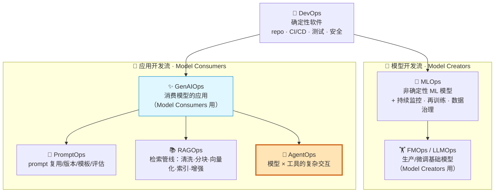

原书 Figure 5-5 把整个「Ops 版图」劈成两条大河：**模型开发流（Model Development）** 和 **应用开发流（Application Development）**。这条分界线极其关键，下一节专讲。

---

## 二、🌊 两条河流：模型创造者 vs 模型消费者

### 2.1 生成式 AI 制造的「生态大分裂」

传统 ML 世界里，训模型的人和用模型的人常常是同一拨。生成式 AI 来了之后，因为基础模型「大到、贵到」个人和大多数公司根本训不动，生态被劈成两半：

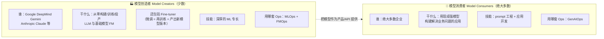

原书 Figure 5-3 就是这张「创造者 vs 消费者」对比表。核心洞察一句话：

> **在当下的 GenAI 时代，绝大多数公司不造模型，而是用别人造的强模型来造应用。** 这个「从造模型到造应用」的焦点转移，正是催生 GenAIOps 的根本原因。

### 2.2 新冒出来的术语：FMOps 与 LLMOps

当 MLOps 被拉去处理这些巨型模型的独特规模时，市场上诞生了两个更细的词：

| 术语 | 全称 | 管什么 | 归属 |
|---|---|---|---|
| **FMOps** | Foundation Model Operations | 投产**预训练或定制化的基础模型（FM）** | 模型开发流 |
| **LLMOps** | Large Language Model Operations | FMOps 的**纯文本子集**（只针对语言模型） | 模型开发流 |

> ⚠️ **常见坑：微调（fine-tuning）到底算哪一边？**
>
> 很多人以为「我只是微调一下现成模型，那还是在用模型，应该算 GenAIOps」。**错。** 原书讲得很死：微调（无论是领域自适应 domain adaptation 还是指令微调 instruction tuning）在本质上是**在重新训练一个模型**，产出物是**一个新的模型版本**。因此它稳稳落在 **MLOps / FMOps** 的地盘（模型开发流），而不是应用开发流。判断标准就一条：**你产出的是「新模型」还是「新应用」？**

### 2.3 新角色登场：GenAI 应用层的三种人

生成式 AI 时代催生了一批新岗位。原书 Figure 5-14 把它们叠加在原有 MLOps 版图之上，形成「生成式 AI 应用层」：

| 新角色 | 英文 | 一句话画像 | 打个比方 |
|---|---|---|---|
| **Prompt 工程师** | Prompt Engineer | 领域专家，知道该问什么、期望答案长啥样 | 会盘问的老练侦探，能设计出最精准的问话线 |
| **AI 工程师** | AI Engineer | 技术专家，懂不同模型家族的脾气（Gemini vs Claude），会写取得最佳性能的后端逻辑 | 懂车的调校师，知道每台引擎怎么压榨到极限 |
| **DevOps / 应用开发** | DevOps / AppDev | 角色进化：从做传统网站，到做实时聊天机器人和响应式语音系统 | 造仪表盘和方向盘的人 |

> 💡 **面试高频**：被问「Prompt Engineer 和 AI Engineer 有啥区别？」——记住原书的切法：**Prompt Engineer 偏领域/业务（问对问题），AI Engineer 偏技术/模型（把后端逻辑写对、把模型性能榨干）。** 一个负责「问什么」，一个负责「怎么让模型答得又快又好又省」。

---

## 三、✨ GenAIOps 深潜：Agent 的直接前身

AgentOps 直接站在 GenAIOps 的肩膀上，所以必须先把 GenAIOps 吃透。这一节按「流程 → 技术」的顺序走一遍，你会发现**AgentOps 的每个新增件，都是在这些流程上「加一层」**。

### 3.1 流程 · 用三步法在 2 万个模型里选对一个

原书说现在有超过 **20,000 个基础模型**可选，企业很容易「淹死在特性的海里」。解法是把混乱变成系统化流程——**三步选型法**（Figure 5-15）：

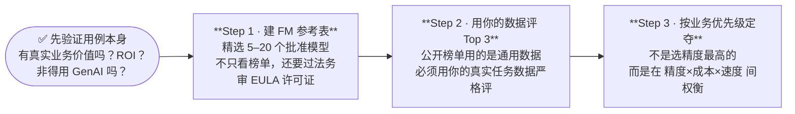

**每一步的关键提醒：**

- **Step 0（前置）——先质疑用例本身**：原书特意插一句「别被新技术冲昏头」——先问 ROI，再问「是不是一个更简单的传统方案更合适」。这是最容易被跳过、又最省钱的一步。
- **Step 1——FM 参考表（FM Reference Table）**：一张组织内部「预批准」的模型短名单。筛选维度（Figure 5-16）包括：闭源 vs 开源、许可证、可否微调、上下文窗口大小、是否支持**多模态 / 实时流式**，以及一个极实际的因素——**团队现有技能**（你的 AI 工程师已经熟 Gemini 还是 Claude，会直接加速开发）。
- **Step 2——用自己的数据评**：榜单靠通用数据集，未必反映你的数据。这一步要在**你的真实任务**上量。
- **Step 3——业务权衡**：最终决策不是「精度最高者胜」，而是精度、成本、速度的战略取舍。

> 🎯 **六字真言映射 · 成本**：Step 3 就是「成本」在选型阶段的第一次登场。原书 Figure 5-24/5-25 的做法很实用：**先定优先级，只优化三者里的两个**——比如「优先级 0 = 成本、优先级 1 = 精度，速度先忽略」，然后挑「表现够好（不一定最好）但成本最低」的那个。这套「优化二取三」的思路，后面 Agent 的运营指标里会再次出现。

### 3.2 流程 · 从一句 prompt 到 Prompt Catalog 再到 Prompt 优化

GenAIOps 的一条主线是「**prompt 的工业化**」。它经历三级跳：

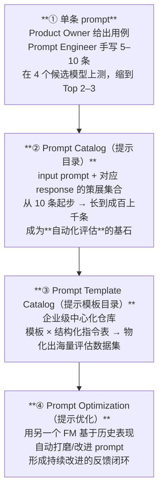

**为什么 Prompt Template Catalog 值得单独建？**（原书列了四条收益）

| 收益 | 英文 | 含义 |
|---|---|---|
| 提效 | Increased Efficiency | 直接复用经过验证的模板，不用从零写 |
| 提质 | Improved Performance | 存下来的模板通常已被测试/优化过，结果更稳更一致 |
| 协作顺畅 | Streamlined Collaboration | 共享的版本管理、归属信息、元数据 |
| 简化模型迁移 | Simplified Model Migration | 为不同模型家族存好 prompt 变体，换模型时不用大改 |

> 💡 **实战**：注意「简化模型迁移」这条——很多模型（如 Llama）依赖**特定的 prompt 模板格式**。把「同一个任务、不同模型的 prompt 变体」都存进 Template Catalog，等你想从 Claude 换到 Gemini 时，就不必把 prompt 全部重写一遍。这就是「防供应商锁定」的工程手段。

### 3.3 流程 · 评估：如何定义「成功」

有了定制评估数据集，下一个问题是——**用什么指标（metric）**？原书 Figure 5-22 给了一棵决策树，核心变量是**「有没有带标注的数据（labeled data）」**：

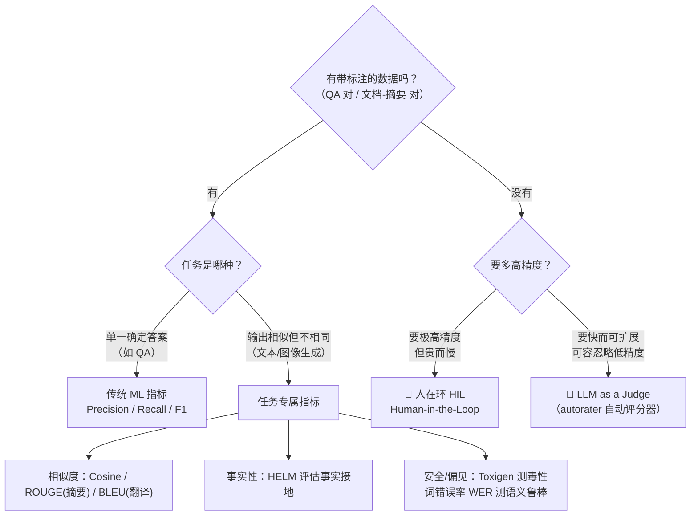

**两种「无标注」时的评估法，各有代价：**

| 方法 | 英文 | 优点 | 代价 |
|---|---|---|---|
| 人在环 | Human-in-the-Loop (HIL) | 精度最高、可给定性反馈 | 慢、贵、耗人力 |
| LLM 当裁判 | LLM as a Judge / autorater | 快、可扩展 | 精度可能不如人，适合「精度不那么关键」的场景 |

原书还点出一条**企业里评估的典型演进路径**（非常值得记）：

> **HIL（高精度冷启动）→ 半自动（部分数据交给 LLM-judge）→ 全自动（攒够标注数据后，用任务专属指标全自动评估）。**

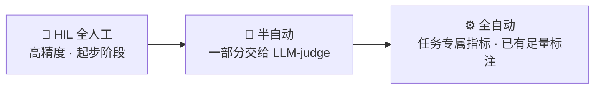

> 🎯 **六字真言映射 · 评估 & 监控**：原书在这里埋了一个绝妙的观点——**「监控（monitoring）可以看作评估（evaluation）的实时版本」**，因为两者往往用**同一批指标**（比如毒性 toxicity）。离线你用它评估选型，上线后你用它实时监控。记住这句，你就理解了为什么很多团队把「评估平台」和「监控平台」建成同一套底座。

> 🔬 **第一性原理：为什么不能只信公开榜单？**
>
> 因为**榜单跑的是通用数据集，你的业务数据不通用**。一个在 MMLU 上排第一的模型，未必最懂你公司的保险条款、你医院的病历格式。「用你自己的 Prompt Catalog 派生出的定制数据集来评」——这不是流程洁癖，而是唯一能给出「真实能力」可靠信号的做法。榜单选入围，自有数据定生死。

### 3.4 技术 · GenAIOps 平台如何在 MLOps 上「长出来」

原书先铺了一遍 MLOps 的参考架构（基于 Google Cloud，但强调**换任何云、任何三方服务，架构骨架一样**），核心是**关注点分离（separation of concerns）**，用一串独立的「项目环境」串起模型的一生：

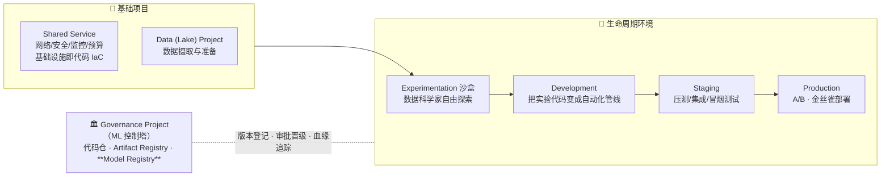

**GenAIOps 相对 MLOps 的四点关键进化**（原书 Figure 5-27～5-30）：

| # | 进化点 | MLOps 里 | GenAIOps 里 |
|---|---|---|---|
| 1 | **数据层被增强** | 只准备训练数据 | 增加 RAG 数据准备（清洗/分块/向量化）+ **Evaluation Prompt Catalog** 作为测试基准真值 |
| 2 | **晋级的是整个应用** | 晋级的核心产物是**训练好的模型** | 晋级的是**整个应用**——CI/CD 把 GenAI 后端 + 前端当一个整体构建/测试/部署 |
| 3 | **Development 成实验中枢** | 训练管线为主 | AI/Prompt 工程师在这里做模型选型、prompt 血缘管理、评估 |
| 4 | **Staging 引入人在环** | 自动化测试为主 | 因输出主观，用 **GenAI App Testing Project** 做 HIL 测试，Prompt Tester 用沙盒 UI 评质量/相关性/安全 |

同时，原书专门讲了 GenAI **后端**必备的四大组件（这四个直接是「可靠性、监控、成本」的落点）：

| 后端组件 | 英文 | 职责 | 对应六字真言 |
|---|---|---|---|
| **护栏与安全** | Guardrails & Security | 过滤所有输入/输出，防数据投毒（data poisoning）、对抗攻击（adversarial attack）；可对高频输出做缓存 | 可靠性 + 成本 |
| **上下文检索** | Context Retrieval | 接入实时知识源，用 RAG 或 Agent 技术保证回答有据 | 可靠性 |
| **持续监控** | Continuous Monitoring | 分析每一次交互，实时发现问题、追踪指标（如毒性） | 监控 |
| **反馈与评分** | Feedback & Rating | 👍/👎 收集用户反馈，回灌评估数据，形成良性循环 | 评估闭环 |

> 💡 **实战 & 成本坑**：注意「护栏」组件里顺带提到的 **caching（缓存高频输出）**——这是最朴素也最有效的降本手段之一。同一个 FAQ 被问一万次，你没理由让模型算一万次。原书把缓存放在护栏组件里讲，暗示了一个好习惯：**在入口网关层就把「安全过滤 + 缓存命中」一起处理掉**，既挡攻击又省 token。

> ⚠️ **常见坑：前端和后端不要绑死生命周期**。原书强调，**前端有它自己独立的开发生命周期（独立仓库、独立 CI/CD）**，这样 DevOps/AppDev 团队可以独立更新界面外观，而不必碰后端的 AI 逻辑。很多团队图省事把前后端塞进一个 repo 一起发版，结果每改一个按钮颜色都要重跑整条 AI 测试管线——这是自找的耦合。

---

## 四、🦾 AgentOps：从「被动响应」到「自主行动」的跃迁

铺垫完毕，进入正题。原书对 Agent 的定义（呼应第 1 章）是理解一切的锚点：

> Agent 远不只是一个「调工具的东西」；它的核心是一个**自主系统（autonomous system）**：它**感知环境、做决策、用工具去达成一个特定目标**。

**从「被动模型」到「主动系统」——这一步跳跃，正是 AgentOps 成为一门独立学科的原因。**

### 4.1 先回忆：一个 Agent 是怎么跑起来的

原书 Figure 5-31 用一张图复盘了 Agent 的**多轮执行循环（multi-turn execution loop）**：

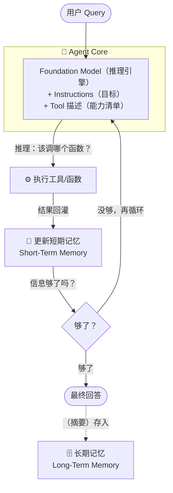

一个极其重要、极其容易搞错的细节：

> 🔬 **第一性原理：工具（Tool）不是可执行代码本身，而是一组「描述」**
>
> 原书原话：*"The tool itself isn't the executable code, but rather a set of descriptions that the foundation model uses to understand what functions are available and how to call them."*
>
> 也就是说，模型看到的「工具」是一份**说明书**（这个函数叫什么、干什么、要哪些参数），模型据此决定「调不调、怎么调」，真正的执行发生在模型之外。理解这一点，你才明白为什么**工具评估**要单独做（模型选对工具是一回事，工具本身跑得对不对是另一回事），也才明白为什么后面 Tool Registry 存的是**元数据（描述）**而不是代码。

> 一句话收束：**这个循环描述的是 Agent「理论上」怎么工作；让它在生产环境里「可靠且安全」地工作，才是 AgentOps 的核心使命。**

### 4.2 AgentOps 的四大新挑战（全章骨架）

原书把 Agent 的自主性和用工具的本性，归结为**四个 GenAIOps 覆盖不到的新领域**。这四个是本章后半的全部骨架：

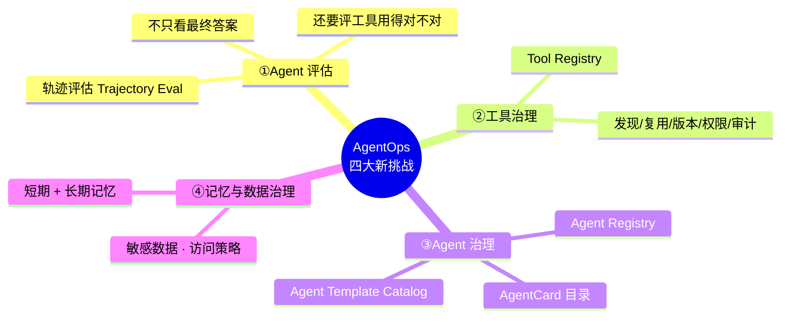

| 挑战 | 为什么 GenAIOps 不够 | AgentOps 的答案 |
|---|---|---|
| **① 自主决策 / Agent 评估** | 输入→输出的黑盒评估，测不出「它为什么这么做」 | 增加**工具选择评估**和**轨迹评估**（trajectory evaluation） |
| **② 工具编排与治理** | Agent 的能力上限 = 它拥有的工具；散落各处无法管理 | 中心化 **Tool Registry**，管生命周期/版本/归属/安全 |
| **③ 多智能体系统** | 从单 Agent 到 Agent 团队，运营复杂度暴涨 | **Agent Registry** + 把 Agent 当分布式微服务来编排/监控/调试 |
| **④ 复杂记忆管理** | 短期+长期记忆里含敏感数据，且会影响评估 | 记忆组件对接**数据治理层**，强制访问策略 |

下面逐个深挖。

---

## 五、🎯 挑战一：Agent 评估——「轨迹」比「答案」更重要

### 5.1 为什么 Agent 评估要「加码」

GenAIOps 里，我们靠 Prompt Catalog 评「最终答案对不对」。但 Agent 的成功**不只取决于最终答案，还取决于它有没有正确地使用工具**。同样一个正确答案，可能是「用对工具、走对路径」得来的，也可能是「瞎蒙对了」——后者在生产里是定时炸弹。

原书 Figure 5-32 给出**五步 Agent 评估流程**：

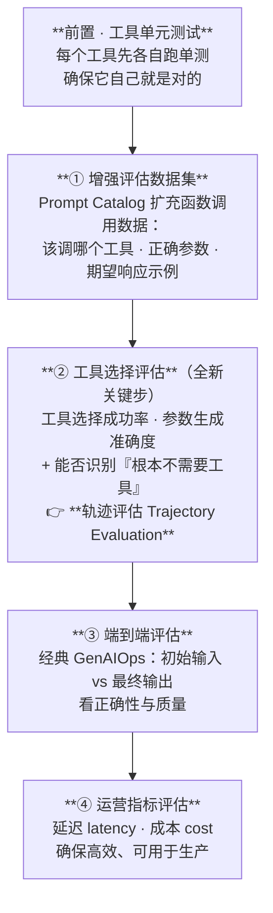

### 5.2 核心概念：轨迹评估（Trajectory Evaluation）

这是本章最该背下来的术语之一：

> **轨迹评估**：把**期望的工具调用序列（expected sequence of tool calls）**和 **Agent 实际走的路径（actual path）**做对比。

工具选择评估要量三件事：
1. **工具选择成功率**——该调 A 却调了 B？
2. **参数生成准确度**——工具选对了，但参数填错了？
3. **正确识别「无需工具」**——有些问题直接答就好，Agent 会不会画蛇添足乱调工具？

> 💡 **面试高频：轨迹评估 vs 端到端评估**
>
> - **端到端（E2E）评估**：只看「进去的问题」和「出来的答案」——黑盒。
> - **轨迹评估**：看中间「它一步步调了哪些工具、按什么顺序」——白盒/过程。
>
> 面试官爱问「Agent 答对了，但你怎么知道它是‘真的会’还是‘蒙对的’？」——答案就是**轨迹评估**。只有把实际路径和期望路径逐步对齐，你才能区分「可靠的正确」和「侥幸的正确」。

> 🎯 **六字真言映射 · 评估 + 成本 + 可靠性一次到齐**：五步流程完美对应了三个面向——第 ② 步「轨迹评估」是**可靠性**的核心度量，第 ③ 步端到端是**评估**的经典部分，第 ④ 步「延迟 + 成本」直接就是**成本**面向。所以一次完整的 Agent 评估，本身就是对「它是否又对、又快、又省」的三合一体检。

> ⚠️ **实时/多模态的坑**：原书特别提醒，当你处理**流式音频、图像、视频**时，评估会难得多——因为你必须在测试中**模拟这种实时行为**。你没法像评一段文本那样，把一段「用户说到一半被打断、Agent 需要边听边反应」的交互静态地喂进去打分。这也是为什么高级评估要留到第 16 章专门讲。

---

## 六、🧰 挑战二：工具治理——Tool Registry

### 6.1 从「写一个工具」到「管几百个工具」

原书一句话点出痛点：

> **给一个 Agent 写一个工具很简单；在一个大企业里管理成百上千个工具，是巨大的挑战。**

没有统一目录，会发生什么？开发者 A 写了个「查汇率」工具，开发者 B 不知道，又写了一个——**重复造轮子（reinventing the wheel）**、版本混乱、安全无人负责、出了事没法审计。

**Tool Registry（工具注册表）** 就是解药：一个**统一的、中心化的、组织内所有可用工具的目录**，充当工具元数据的**单一事实来源（single source of truth）**。

### 6.2 Tool Registry 带来什么

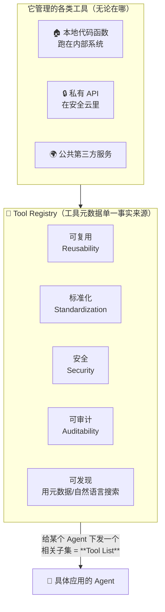

几个关键设计点：

- **管理不问出身**：不管工具是本地函数、私有云 API，还是公共第三方服务，Registry 都能统一登记（Figure 5-33）。
- **自然语言可搜索**：开发者可以用元数据甚至自然语言搜「有没有现成的查天气工具」，避免重复开发。
- **Tool List（工具清单）**：为了**优化性能**，不会把整个 Registry 的几百个工具全塞给一个 Agent——而是给它一个**相关子集**。这既省 token（工具描述越多，prompt 越长越贵），也降低模型「选错工具」的概率。

> 🔬 **第一性原理：为什么给 Agent 的工具越少越好？**
>
> 每个工具的描述都要放进模型的上下文，让它「知道有这个工具可用」。工具越多：① 上下文越长 → 成本越高、延迟越大；② 选项越多 → 模型「选错/选混」的概率越大。所以「从大 Registry 里切一个精准 Tool List 给具体 Agent」不是偷懒，而是**同时优化成本、延迟和可靠性**的必然设计。这正是「治理集中、下发精简」的智慧。

> 💡 **实战 · MCP 就是一种 Tool Registry 实现**：原书明说，Tool Registry 可以用 **MCP（Model Context Protocol，第 11 章介绍过）** 来实现，也可以用任意 API Hub 技术、自研方案，或一到多个 MCP 服务器。换句话说，你在前面章节学的 MCP，到了运营化视角，本质就是「工具的标准化注册与发现协议」。深挖在第 17 章。

---

## 七、🕸️ 挑战三：Agent 治理——Agent Registry

### 7.1 工具会爆炸，Agent 也会爆炸

同样的剧情，换个主角：大组织很快会开发出**海量专门化 Agent**。没有目录，开发者不知道哪些 Agent 已经存在、能力是什么、怎么和它交互。于是需要 **Agent Registry（Agent 注册表）**。

原书把它和第 8 章的 **A2A（Agent-to-Agent）协议**接上了：

> A2A 协议里，每个 Agent 都有一张「名片」叫 **AgentCard**，描述它的能力。**Agent Registry 就可以理解为「组织内所有 AgentCard 的集合」**，外加治理功能。

### 7.2 Agent Registry 管什么

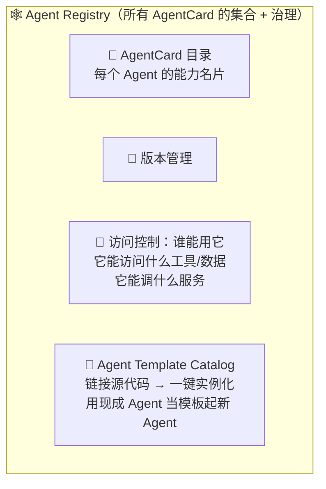

三大能力：

1. **发现与协作**——存下所有 AgentCard，让 Agent 之间能互相发现、互相通信。
2. **治理**——集中管理版本和访问控制：谁能用这个 Agent、它能碰哪些工具和数据、能调哪些服务。
3. **Agent Template Catalog（Agent 模板目录）**——通过链接到 Agent 的源代码，Registry 还能兼任模板库，让开发者**一键实例化一个现成 Agent 的代码**，作为新 Agent 的脚手架，不必从零开始。

### 7.3 全景：Router Agent 如何用两个注册表编排多智能体

原书 Figure 5-34 画了一个典型的多智能体系统，把 Tool Registry 和 Agent Registry 一起用起来：

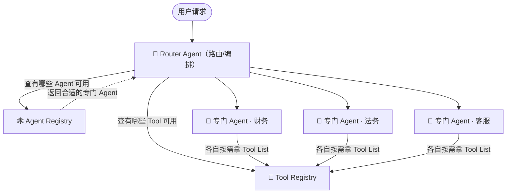

> 💡 **面试高频：Tool Registry 和 Agent Registry 有什么区别？** 一句话——**Tool Registry 管「能力（工具）」，Agent Registry 管「能动的实体（Agent）」**。工具是被调用的死物（一组描述），Agent 是会自主决策的活物（有 AgentCard、有版本、有权限、甚至能当模板）。一个 Agent 会从 Tool Registry 领工具用；一个 Router Agent 会从 Agent Registry 找同事协作。深挖在第 18 章。

> ⚠️ **常见坑：把多智能体当「一个大程序」而不是「分布式系统」**。原书反复强调，当你从单 Agent 走向 Agent 团队时，运营复杂度会**暴涨**，正确的心智模型是**把它们当成一个分布式的微服务网络**来编排、监控、调试。谁调用了谁、哪一跳超时了、哪个 Agent 挂了导致整链失败——这些都是分布式系统的经典问题，别指望用「读一遍主函数」的方式 debug。

---

## 八、🗄️ 挑战四：记忆与数据治理

### 8.1 记忆里藏着敏感数据

Agent 依赖两种记忆：
- **短期记忆（short-term memory）**：处理进行中的多轮对话。
- **长期记忆（long-term memory）**：跨会话回忆用户偏好、过往交互。

问题在于：**这两种记忆里都可能含有机密或敏感的用户数据。** 原书点出一个特别现实的风险场景——**测试时把生产记忆暴露给开发者**。所以：

> 你的记忆组件必须对接一个**健壮的数据治理层（data governance layer）**，它能强制执行访问策略、恰当地处理敏感信息。

> 🎯 **六字真言映射 · 可靠性 & 追踪**：记忆治理不只是隐私合规，它还牵动「可观测性（observability）日志」——从 observability logs 到 memory 里的交互历史，这些「Agent 创造和使用的数据」都要被管理。这正是「追踪（tracing）」面向的落点：你要能追溯 Agent 每一步用了什么记忆、读了什么数据，才能既 debug 又合规。

---

## 九、🏛️ 统一 AgentOps 平台：把四大挑战焊进架构

前面讲的是**流程和挑战**，这一节讲**技术落地**——GenAIOps 架构要加哪些新组件，才升级成真正的 AgentOps 平台。原书 Figure 5-35～5-38 逐个介绍，最后合成一张统一蓝图。

### 9.1 四个关键新增组件

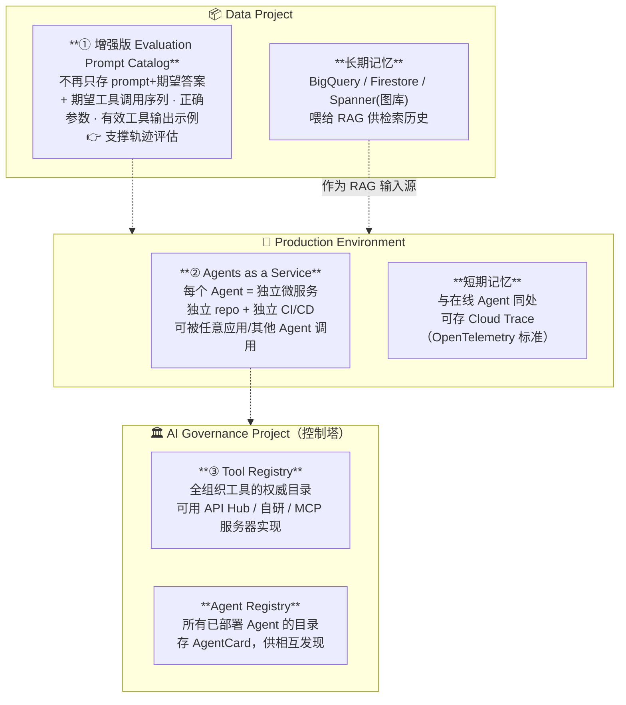

**逐个说透：**

**① 增强版 Evaluation Prompt Catalog**（在 Data Project）
- 不再只存「prompt + 期望最终答案」，而要为每个测试场景加上：**期望的工具调用序列、每次调用的正确参数、有效工具输出的示例**。
- 这个「加料版」目录，正是做 Agent 独有的**轨迹评估**的燃料。

**② Agents as a Service（Agent 即服务）**——原书最看重的架构决策
- 核心问题：Agent 应该**直接嵌进某个应用的后端**，还是**作为独立微服务部署**？
- 原书旗帜鲜明推荐后者：把每个 Agent 当成**独立、可复用的组件**，有自己专属的 repo 和 CI/CD 管线，可以独立开发、测试、伸缩。
- 一旦部署到生产环境，它能被**任意数量的其他应用（网站、移动 App）甚至其他 Agent 调用**——尤其配合 **A2A 协议**，威力倍增。

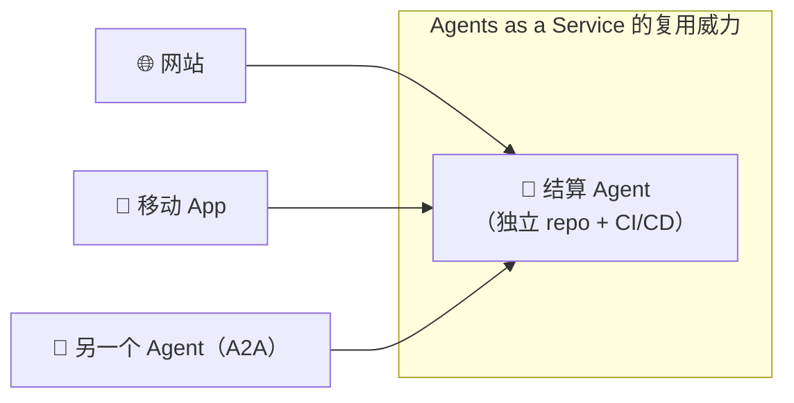

**③ 中心化的 Tool Registry + Agent Registry**（在 AI Governance Project）
- 这两个注册表由 **CI/CD 管线自动更新**（自动化细节在第 19 章）。
- Tool Registry 可用任意 API Hub、自研方案或一到多个 **MCP 服务器**实现。
- Agent Registry 在多智能体环境里充当所有已部署 Agent 的中央目录，存 AgentCard，让 Agent 互相发现、互相通信。

**④ 专门的记忆方案**——短期与长期分处不同地方：

| 记忆类型 | 位于 | 用什么存 | 特点 |
|---|---|---|---|
| **短期记忆** | Production 环境，与在线 Agent 同处 | **Cloud Trace（实现 OpenTelemetry 标准）** | 追踪单次进行中对话的上下文 |
| **长期记忆** | Data Project，持久化存储 | BigQuery / Firestore / 图数据库（如 Spanner） | 捕捉多 Agent 间复杂关系；**可喂给 RAG 系统**，让 Agent 检索最相关的历史 |

> 🎯 **六字真言映射 · 追踪 = OpenTelemetry**：注意短期记忆用 **Cloud Trace / OpenTelemetry** 这个细节——这就是「追踪（tracing）」在架构里的具体落地。OpenTelemetry 是可观测性的行业标准，把 Agent 的每一次工具调用、每一轮推理当成分布式追踪里的一个 span 记下来。你在 debug 一个「Agent 为什么走错路」时，靠的就是这条 trace。**短期记忆和可观测性追踪，在实现上常常是同一份数据。**

### 9.2 统一 AgentOps 平台全景

把上面所有组件合起来，就是原书 Figure 5-38 的**统一 AgentOps 平台**——投产、管理、治理端到端 Agent 系统的企业级蓝图：

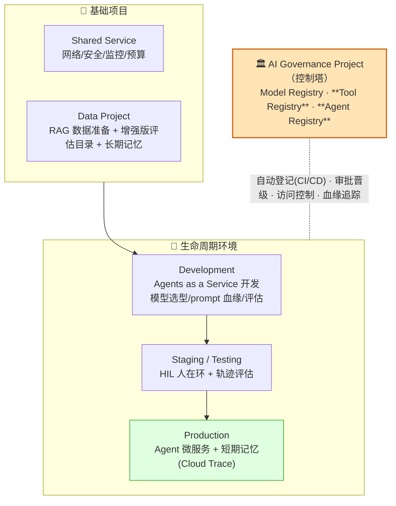

> ⚠️ **别把参考架构当圣旨**：原书态度非常务实——「把这套架构当**骨架（skeleton）**，它在我们大多数客户那里都 work」。你可以根据组织规模和成熟度调整环境/项目数量；**哪怕你把所有流程塞进单一环境，你需要的核心能力、服务和人一模一样**。它推荐这套模式的理由是：清晰的关注点分离、遵循开发最佳实践、允许对网络和 IAM 做细粒度安全设计（第 20 章深挖）。换云、换第三方服务，架构骨架都相似。

> 💡 **面试高频：为什么要「关注点分离 + 多环境」？** 三个理由背下来：① **关注点分离**（数据/开发/测试/生产/治理各司其职）；② **符合开发最佳实践**（可复现、可回滚、可审批晋级）；③ **细粒度安全**（对网络和 IAM 策略做精细控制）。这三条是「为什么不把所有东西堆在一个项目里」的标准答案。

---

## 十、🔗 加分节：统一 MLOps 与 GenAI/AgentOps

全章一直把「模型开发（MLOps）」和「应用开发（GenAIOps/AgentOps）」当两条独立的河。对绝大多数组织（纯消费者）来说，这就是现实——它们只用别人的模型造应用，**一套 GenAIOps 平台就够了**。

但有一类大企业，**既是消费者又是创造者**（会微调现有模型、甚至自研模型）。它们需要一个**两个世界共存的统一平台**：

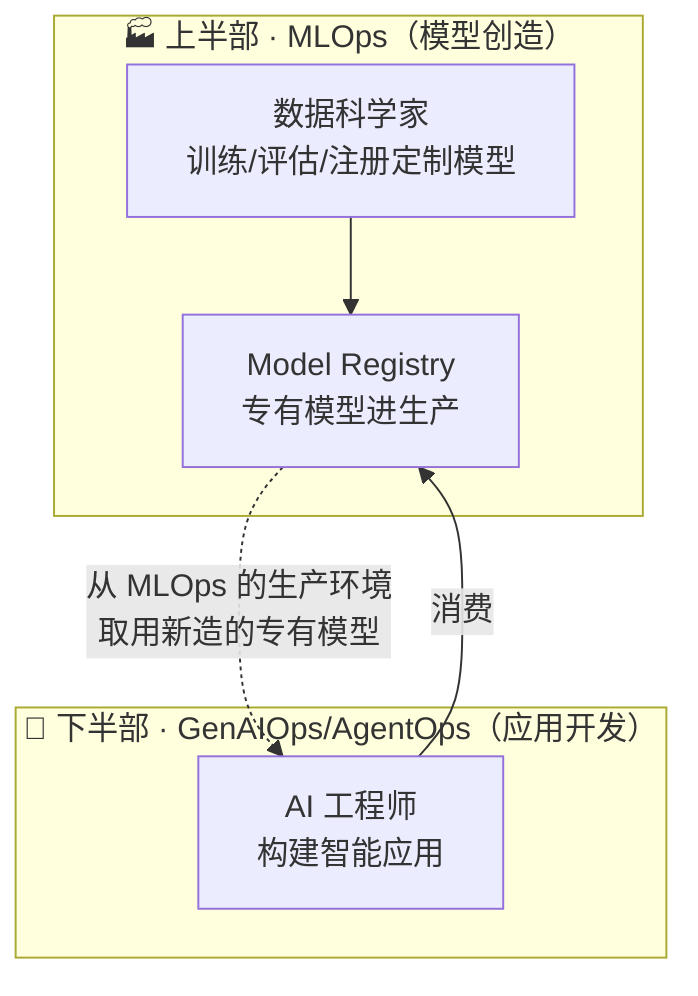

原书 Figure 5-39 就是这张「主蓝图」：上半部是 MLOps 的模型创造环境，下半部是 GenAIOps/AgentOps 的应用开发环境；数据科学家在上面训出专有模型、注册进生产，AI 工程师在下面消费这些模型来造应用。**这就是一个既造模型又用模型的成熟 AI 企业的端到端运营全景。**

---

## 📌 小结：把六字真言织回一张网

回到题目要求的六个面向，现在我们能把它们精确地钉在架构上了：

| 六字真言 | 在 AgentOps 里的落点 | 关键机制/术语 |
|---|---|---|
| 🚀 **部署** | Agents as a Service（独立 repo + CI/CD 的微服务）；多环境晋级（Dev→Staging→Prod） | 微服务化、CI/CD、A/B & 金丝雀部署 |
| 👀 **监控** | 持续监控每次交互；「监控 = 评估的实时版」，共用毒性等指标 | Continuous Monitoring、反馈评分闭环 |
| 🎯 **评估** | 五步 Agent 评估；工具选择 + 端到端 + 运营指标 | **轨迹评估（Trajectory Eval）**、HIL→LLM-judge→自动化 |
| 🔍 **追踪** | 短期记忆存 Cloud Trace；observability 日志与记忆数据治理 | **OpenTelemetry**、数据血缘、Governance 层 |
| 🛡️ **可靠性** | 护栏/安全、工具单元测试、轨迹评估验证行动路径、多智能体当分布式系统治理 | Guardrails、Tool/Agent Registry、单一事实来源 |
| 💰 **成本** | 选型阶段「优化二取三」；缓存高频输出；给 Agent 精简 Tool List；运营指标里测 cost | 优先级权衡、caching、Tool List 裁剪 |

**一句话把整章串起来**：

> AgentOps 不是新大陆，而是 DevOps → MLOps → GenAIOps 这条演进链的**下一环**。它继承下面每一层的全部纪律，再针对 Agent 的**自主性**和**用工具的本性**，新增四件事——**评估要看轨迹、工具要进 Registry、Agent 要进 Registry、记忆要上治理**。把这四件事焊进一张「统一 AgentOps 平台」的蓝图（Agents as a Service + 双注册表 + 分层记忆 + 增强版评估目录），你就拿到了把 Agent 从原型送进企业级生产的完整地图。

> 🔬 **最后一条第一性原理**：为什么这一切最终都收敛到「注册表 + 治理 + 分离」？因为**规模（scale）**。一个 Agent、一个工具、一段记忆，你手工就能管好。可一旦到了「几百个工具、几十个 Agent、无数条含敏感数据的记忆」，唯一能对抗混乱的武器就是**中心化的单一事实来源 + 强制的治理策略 + 清晰的关注点分离**。MLOps 当年靠「标准化」把「一年」压到「几周」、把速度提升 6 倍——AgentOps 靠同样的哲学，把「能跑的 demo」变成「敢投产的系统」。

---

## 🔗 延伸阅读与深挖指引

原书本章是**导论**，后续每个挑战都有专章深挖。这张表帮你规划后续学习路线：

| 主题 | 本章讲到哪一步 | 深挖章节（原书） |
|---|---|---|
| 高级评估（多模态 / 实时 Agent） | 五步流程 + 轨迹评估概念 | **第 16 章 · Agent Evaluation** |
| Tool Registry 架构与实现（含 MCP） | 概念 + 收益 + Tool List | **第 17 章** |
| Agent Registry（多智能体系统中的角色与治理） | AgentCard 目录 + 模板库 | **第 18 章** |
| CI/CD 自动更新注册表 | 提了一句「自动更新」 | **第 19 章** |
| 安全、网络与 IAM 策略 | 提了「细粒度安全设计」 | **第 20 章** |
| MCP（Model Context Protocol） | Tool Registry 的一种实现 | 第 11 章（已学） |
| A2A（Agent-to-Agent）协议与 AgentCard | Agent Registry 的理论基础 | 第 8 章（已学） |

**外部资料（原书 TIP 提到）**：
- 博客《MLOps foundation roadmap for enterprises》——想更深入预测式 ML 的 MLOps。
- 《Automated Prompt Engineering: The Definitive Hands-On Guide》——Prompt 优化那张 Figure 5-21 的灵感来源。

**几个值得自己动手/延伸思考的点**：
1. 用 **OpenTelemetry** 给你自己的一个小 Agent 加上追踪，把每次工具调用变成一个 span，亲手体验「短期记忆 ≈ 可观测性追踪」这句话。
2. 为一个有 3–5 个工具的 Agent 写一份**增强版评估集**（含期望工具序列 + 参数），亲手做一次轨迹评估，感受它和端到端评估的差别。
3. 画一张你所在（或想象）组织的 **Tool List 裁剪策略**：从一个大 Tool Registry，如何为「客服 Agent」和「财务 Agent」各切一份精简清单？这直接关系成本与可靠性。

> 下一章预告（原书）：既然拿到了完整的架构蓝图，下一步就聚焦其中**最关键的过程——Agent 评估**，超越基础，去啃「测试实时、交互式 Agent」这块硬骨头，那里的「成功标准」本身都在不停变化。
