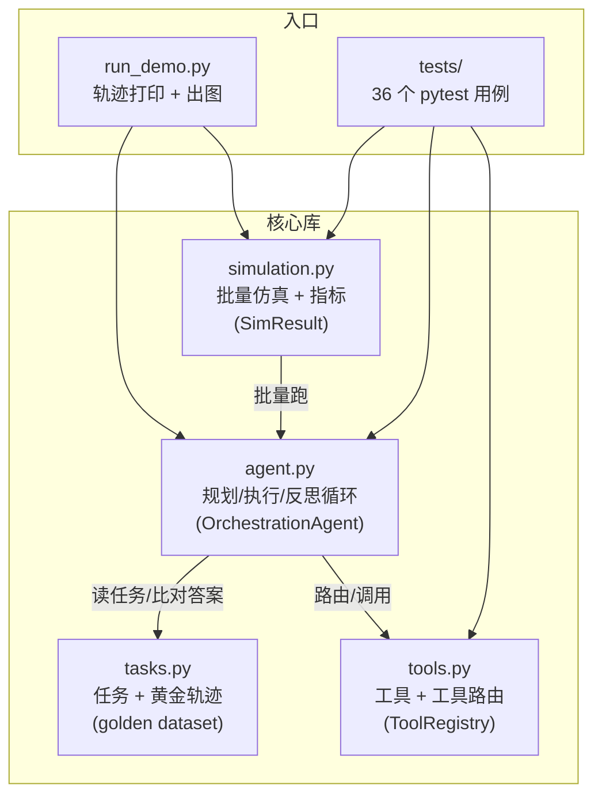
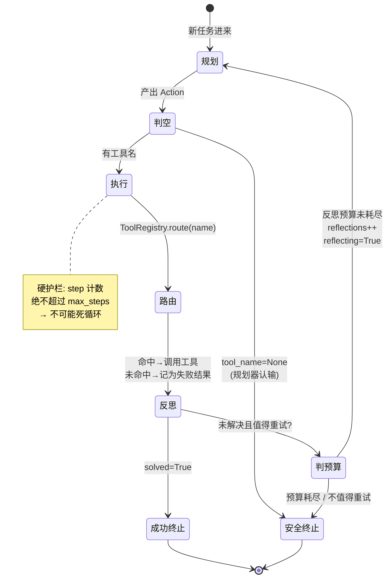
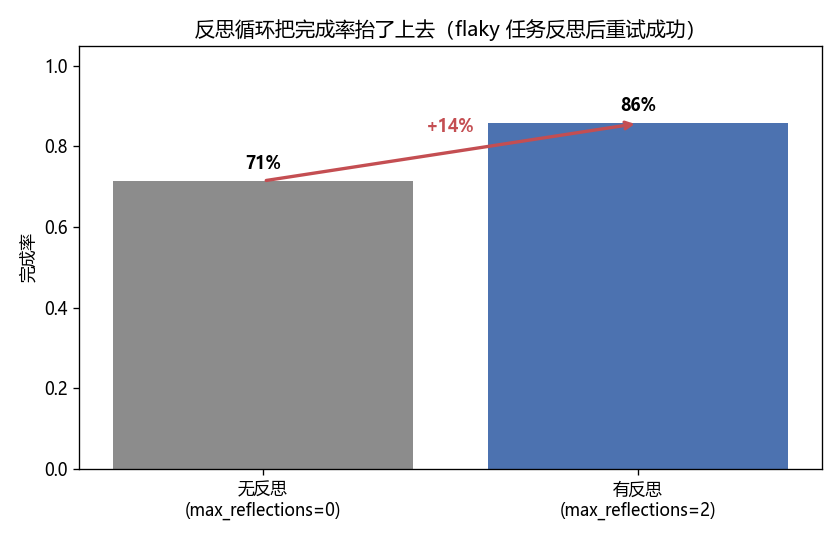

# 🤖 项目 01 · Agent 编排仿真（Agent Orchestration Simulation）

> 《Multimodal Real-Time AI Agent Systems》（Heiko Hotz & Sokratis Kartakis, O'Reilly）配套实战项目 · 对应本书第 4 章「设计与构建 Agent」与第 5 章「AgentOps」。
>
> 一句话：**用纯离线、可复现的 Python 仿真，把一个 Agent 的「规划 → 执行（调工具）→ 反思」循环 + 「工具路由」拆到最底层，亲手测出「完成率 / 平均步数 / 工具调用正确性」，并用一个「会失败→反思重试」的场景证明反思循环真能把成功率抬上去。**

本项目**不接任何真 LLM、不联网、不需要 API key**。因为教学目标是「**Agent 编排的控制流本身**」，而不是「模型有多聪明」。我们用一个**确定性规划器（rule-based planner）**替代大模型——这样循环的每一个决策（何时停、何时重试、步数上限）都看得一清二楚，而且 `pytest` 能断言确定的结果。真实工程里，只要把 `Planner.plan()` 换成一次 LLM 调用，**循环骨架原封不动**。

---

## 📚 目录

- [一、这个项目在讲什么（是什么 / 为什么）](#一这个项目在讲什么是什么--为什么)
- [二、5 分钟跑起来（怎么用）](#二5-分钟跑起来怎么用)
- [三、整体架构（两张 mermaid 图）](#三整体架构两张-mermaid-图)
- [四、核心概念逐个击破](#四核心概念逐个击破)
- [五、代码逐行讲解](#五代码逐行讲解)
- [六、指标：我们到底测了什么](#六指标我们到底测了什么)
- [七、失败→反思→重试 场景全解](#七失败反思重试-场景全解)
- [八、测试清单（pytest 逐条对应）](#八测试清单pytest-逐条对应)
- [九、💡 面试高频 & ⚠️ 常见坑 & 🔬 第一性原理](#九-面试高频---常见坑---第一性原理)
- [📌 小结](#-小结)
- [🔗 延伸](#-延伸)

---

## 一、这个项目在讲什么（是什么 / 为什么）

### 1.1 是什么

一个 **Agent 编排器（orchestrator）** 的最小可运行仿真。它把书里反复出现的 Agent 骨架落成代码：

| 阶段 | 英文 | 干的事 | 本项目里由谁负责 |
|---|---|---|---|
| 规划 | Plan | 看任务，决定「下一步调哪个工具、传什么参数」 | `Planner`（LLM 的确定性替身） |
| 执行 | Execute | 把工具名**路由**到真正的函数并调用 | `ToolRegistry.route()` + `Tool.__call__()` |
| 反思 | Reflect | 看执行结果，判断「成了没 / 要不要再来一次」 | `Reflector` |

三个阶段被 `OrchestrationAgent` 编排成一个**带护栏的循环**：解决了就停，失败就（在预算内）反思重试，实在无解就安全退出——**绝不死循环**。

### 1.2 为什么这么设计（第一性原理）

> 🔬 **第一性原理：Agent = 循环 + 工具 + 停机条件**
>
> 剥到最底层，一个 Agent 不神秘。它就是「**一个 while 循环，每轮问模型『下一步干嘛』，执行，再问『成了没』**」。真正难的不是「让它动」，而是「**让它在正确的时候停**」——既不能没解决就早退，也不能陷进去无限烧钱。本项目把这个「停机问题（termination）」做成了一等公民：`max_steps`（硬护栏）+ `max_reflections`（软护栏）+ 规划器可主动认输（`tool_name=None`）。

为什么用规则替代 LLM？三条硬理由：

1. **离线可复现**：本机无网络、无 key。同样输入永远同样输出，`pytest` 才能断言「反思后成功率必然提升」。
2. **看得清控制流**：LLM 会把「为什么重试」藏进不可解释的权重里；规则把它写成明晃晃的 `if/else`，教学上一目了然。
3. **接口对齐真实系统**：`Planner.plan(task, last_result, reflecting) -> Action` 这个签名，和真实 Agent 里「带工具菜单的 prompt → LLM → 结构化 tool call」完全同构。换掉实现，骨架不变。

---

## 二、5 分钟跑起来（怎么用）

### 2.1 环境

- Python 3.13（3.8+ 均可）
- 依赖：`numpy` / `matplotlib` / `pytest`（见 `requirements.txt`，本机已装）
- **无需联网、无需 GPU、无需任何 API key**

```bash
# 进入项目目录
cd book-realtime-ai-agents/projects/01_agent_orchestration_sim

# （可选）安装依赖
pip install -r requirements.txt

# 1) 跑测试 —— 应当全绿
python -m pytest -q

# 2) 跑演示 —— 打印执行轨迹 + 出两张图到 outputs/
python run_demo.py
```

### 2.2 你会看到什么

`run_demo.py` 打印三条任务的完整轨迹（一条反思重试、一条普通计算、一条无解安全终止），然后是批量仿真统计：

```
任务总数        : 7
完成率          : 85.7%
平均执行步数    : 1.14
工具轨迹准确率  : 100.0%
总工具调用次数  : 8
总反思次数      : 1
分类型完成率    : {'calc': 1.0, 'lookup': 1.0, 'flaky': 1.0, 'unknown': 0.0}

反思对比:
  无反思完成率 : 71.4%
  有反思完成率 : 85.7%
```

并在 `outputs/` 生成两张图：
- `metrics.png`：完成率 / 轨迹准确率 / 分类型完成率 / 平均步数
- `reflection.png`：**无反思 vs 有反思** 的完成率对比（能看到那条 +14% 的提升箭头）

> ⚠️ **Windows 控制台中文坑**：Windows 默认 GBK 编码，直接 `print` emoji（🧭🛠️🤔）或中文会抛 `UnicodeEncodeError`。`run_demo.py` 开头用 `sys.stdout.reconfigure(encoding="utf-8")` 强制切 UTF-8 解决。这是国内做 Python 项目最常踩的坑之一。

---

## 三、整体架构（两张 mermaid 图）

### 3.1 组件依赖图



### 3.2 单个任务的执行状态机（这是全项目的灵魂）



> 💡 **实战要点**：这张状态机里有**三个出口**——`成功终止(solved)`、`安全终止(dead_end / 预算耗尽)`、以及被 `max_steps` 强行截断。真实 Agent 出事，99% 是因为缺了后两个出口，于是「无限重试→烧光 token 预算」。面试时能画出这三个出口，就说明你真懂 Agent 工程，而不只是会调 API。

---

## 四、核心概念逐个击破

### 4.1 工具即函数（Tool as Function）

书里第 4 章的核心断言之一：**Agent 的「技能」就是一组普通 Python 函数**。本项目把它再抽象一层，定义统一协议：

- 每个工具继承 `Tool`，只需实现 `run(**kwargs) -> ToolResult`。
- 统一入口 `__call__` 负责：① 调用计数 ② 异常兜底（工具炸了绝不能拖垮整个 Agent）。
- 返回统一为 `ToolResult(ok, output, error, tool_name)`——**把「成功/失败」显式建模**。

> 🔬 **第一性原理：为什么必须显式建模失败？** 因为「反思」的触发信号就是 `ok=False`。如果工具失败时直接抛异常或返回 `None`，Agent 就无从判断「该重试还是该换招」。**可观测的失败，是可恢复的前提。**

### 4.2 工具路由（Tool Routing）

`ToolRegistry` 是「工具路由」的物理载体：一个 `名字 -> 工具实例` 的字典。

```python
tool = registry.route("calculator")   # 命中 -> 返回 CalculatorTool 实例
tool = registry.route("不存在的工具")   # 未命中 -> 返回 None（不抛错！）
```

- **路由命中**：等价于真实 Agent 里 LLM 输出 `tool_name="calculator"` 后，运行时去查「这个名字对应哪个可执行函数」。
- **路由未命中**：这就是一次 **工具幻觉（tool hallucination）**——模型编了个不存在的工具。我们**故意返回 `None` 而非抛异常**，让 Agent 把它当成一次失败结果，走进反思循环，而不是整个崩掉。

> ⚠️ **常见坑：路由未命中直接 `raise`**。很多人第一版会写 `registry[name]`，KeyError 一抛，整个 Agent 挂掉。正确做法是 `.get(name)` 返回 `None`，让上层的反思逻辑决定怎么办——**局部失败不应升级为全局崩溃**。

### 4.3 反思（Reflection / Self-Correction）

`Reflector.reflect(task, result) -> (solved, should_retry)` 做两件判断：

1. **response match（答案匹配）**：工具输出和任务的 `expected`（黄金标准答案）比对。浮点数用 `abs(a-b) < 1e-9`，字符串用 `==`。
2. **值不值得重试**：
   - `flaky` 任务失败 → 是「抖动」，**值得重试**。
   - `unknown` 任务失败 → 是「本质无解」，**不重试**（否则推向死循环）。
   - `calc/lookup` 失败 → 给一次重试机会（比如表达式一时非法）。

> 💡 **面试高频：「反思」和「重试」是一回事吗？** 不是。**重试（retry）**是无脑再来一次；**反思（reflection）**是「看着上一次的失败原因，调整下一次的策略」。本项目里，规划器在 `reflecting=True` 时会产出不同的 `thought`（「上一步失败，反思后决定重试」），真实系统里这里会把错误信息塞回 prompt 让模型换个参数/换个工具。反思 ⊇ 重试。

### 4.4 黄金轨迹（Golden Trajectory）& 评估

书里第 4 章「评估」一节讲了两种 metric，本项目都实现了：

| 评估维度 | 英文 | 怎么算 | 代码 |
|---|---|---|---|
| 答案对不对 | response match | Agent 最终答案 == `task.expected` | `Reflector._is_answer_valid` |
| 路径对不对 | tool trajectory | Agent 实际调的工具序列 == `task.golden_tools` | `SimResult.tool_trajectory_acc` |

> 🔬 **第一性原理：为什么光看「答案对不对」不够？** 因为 Agent 可能**蒙对**——用错工具、绕远路，碰巧答案对了。只测 response match，你会给一个「歪打正着」的 Agent 满分，一上线换个任务就崩。**tool trajectory 测的是「它是不是用对了方法」**，这才是可泛化的能力。这正是工业界 AgentOps 同时盯这两个指标的原因。

---

## 五、代码逐行讲解

下面挑最关键的三段代码逐行讲。完整代码见对应 `.py` 文件。

### 5.1 计算器的「安全求值」——为什么不能用 `eval`

`tools.py` 里 `CalculatorTool` 绝不用 `eval`，而是走 AST 白名单：

```python
def _safe_eval(node: ast.AST) -> float:
    if isinstance(node, ast.Expression):        # 顶层表达式，递归求值 body
        return _safe_eval(node.body)
    if isinstance(node, ast.Constant):          # 数字字面量（Python 3.8+ 用 Constant）
        if isinstance(node.value, (int, float)) and not isinstance(node.value, bool):
            return float(node.value)
        raise ValueError(...)                    # 字符串/布尔等一律拒绝
    if isinstance(node, ast.BinOp):             # 二元运算 a op b
        op_type = type(node.op)
        if op_type not in _BIN_OPS:             # 只放行白名单里的 + - * / // % **
            raise ValueError(...)
        return _BIN_OPS[op_type](_safe_eval(node.left), _safe_eval(node.right))
    if isinstance(node, ast.UnaryOp):           # 一元运算 -a / +a
        ...
    raise ValueError(...)                        # 其它任何节点（函数调用、属性访问）→ 拒绝
```

**逐行拆解**：
- `ast.parse(expr, mode="eval")` 把字符串解析成语法树，但**不执行**。
- 我们只递归放行「表达式 / 数字 / 白名单二元运算 / 白名单一元运算」四类节点。
- 一旦遇到 `ast.Call`（函数调用）、`ast.Attribute`（属性访问）、`ast.Name`（变量名）等节点，直接 `raise` 拒绝。

> ⚠️ **致命坑：`eval` 是远程代码执行漏洞**。`eval("__import__('os').system('rm -rf /')")` 会真的删你的盘。任何让「用户/模型的字符串」进 `eval` 的代码都是安全灾难。测试 `test_calculator_rejects_injection` 专门验证 `__import__(...)`、`().__class__`、`print(1)` 全被拒。**面试被问「怎么安全地做一个计算器工具」，答案就是 AST 白名单，不是 eval + try/except。**

### 5.2 主循环——护栏在哪里

`agent.py` 里 `OrchestrationAgent.run` 的主循环，逐行看护栏怎么焊进去：

```python
for step in range(1, self.max_steps + 1):        # ← 硬护栏①：step 有上限，物理上不可能死循环
    action = self.planner.plan(task, last_result, reflecting)   # 规划
    ...
    if action.tool_name is None:                 # ← 出口①：规划器主动认输
        reason = "dead_end"; break

    tool = self.registry.route(action.tool_name) # 工具路由
    if tool is None:                             # ← 路由未命中：当失败结果，不崩溃
        result = ToolResult(ok=False, error="工具路由失败：不存在的工具 ...")
    else:
        result = tool(**action.args)
        used_tools.append(action.tool_name)      # ← 只有真调用了才记入轨迹
    ...
    solved, should_retry = self.reflector.reflect(task, result)  # 反思
    if solved:                                   # ← 出口②：解决了
        success = True; answer = result.output; reason = "solved"; break

    if should_retry and reflections < self.max_reflections:      # ← 软护栏②：反思预算
        reflections += 1; reflecting = True; continue            # 回到循环顶，带重试意图重规划
    else:
        reason = "dead_end" if not should_retry else "max_reflections"
        break                                    # ← 出口③：不值得重试 / 预算耗尽
```

**三道保险**：
1. `for step in range(1, max_steps+1)`：**无论如何最多转 `max_steps` 圈**。这是终止性的物理保证。
2. `reflections < self.max_reflections`：反思是有预算的，烧完就停。
3. 规划器返回 `tool_name=None` 时主动 `break`：**让 Agent 有权诚实地说「我不会」**，而不是硬凑。

> 💡 **面试高频：「怎么保证 Agent 不死循环？」** 标准答案是「**两层护栏**」：① 一个硬性的最大迭代数（本项目 `max_steps`），无论如何都会退出；② 一个业务层的停机条件（本项目 `solved` 或规划器认输）。只有硬护栏没停机条件，Agent 会转满圈浪费算力；只有停机条件没硬护栏，一旦停机条件永远不满足就无限循环。**两者缺一不可。**

### 5.3 规划器的「反思态」——重试不是无脑重来

```python
if kind == "flaky":
    thought = ("首次调用不稳定服务 flaky" if not reflecting
               else "上一步失败，反思后决定重试 flaky（真实系统可加退避/换参）")
    return Action("flaky", {"payload": task.payload.get("payload")}, thought=thought)

if kind == "unknown":
    if reflecting:
        return Action(None, {}, thought="反思后仍找不到可用工具/答案，主动放弃以避免死循环")
    return Action("retriever", {"query": ...}, thought="尝试检索，但预期可能没有")
```

- `reflecting` 这个布尔量，就是「**上一步是不是失败了、现在是不是在反思**」的信号。
- `flaky` 在反思态**换了 `thought`**（真实系统这里会加指数退避、换参数、换工具）。
- `unknown` 在反思态**直接认输**（`tool_name=None`）——这是防死循环的关键：无解的任务，反思一次发现还是无解，就该体面退出。

---

## 六、指标：我们到底测了什么

`simulation.py` 的 `SimResult` 聚合出 AgentOps 关心的核心指标：

| 指标 | 属性 | 含义 | 越高/低越好 |
|---|---|---|---|
| 完成率 | `completion_rate` | 成功任务 / 总任务 | 越高越好 |
| 平均步数 | `avg_steps` | 平均每任务执行了几步 | 越低越好（省延迟/算力） |
| 工具轨迹准确率 | `tool_trajectory_acc` | 实际工具序列 == golden 的占比 | 越高越好 |
| 总工具调用 | `total_tool_calls` | 累计工具调用次数 | 观测成本 |
| 总反思次数 | `total_reflections` | 累计反思几次 | 观测「纠错努力」 |
| 分类型完成率 | `by_kind()` | 每类任务各自完成率 | 定位短板 |

本项目 7 个任务的仿真结果：

- **完成率 85.7%**（6/7）——唯一失败的是 `t7`（`unknown` 无解任务，**本就该失败**，是设计出来测「安全终止」的）。
- **平均步数 1.14**——绝大多数任务一步就解决，只有 flaky 任务花了 2 步（失败一次+重试一次）。
- **工具轨迹准确率 100%**——每个任务都用对了工具、走对了路径。

> 💡 **实战：完成率不是越高越好地追求 100%**。`t7` 这种「无解任务」**就该失败**——一个把无解任务也硬报成功的 Agent，是在幻觉。健康的 AgentOps 会区分「**可解任务的完成率**」和「**无解任务的正确拒答率**」。本项目的 `by_kind()` 就是干这个的：`calc/lookup/flaky` 全 1.0，`unknown` 是 0.0 且**这是对的**。

---

## 七、失败→反思→重试 场景全解

这是本项目的**招牌场景**，用 `flaky` 工具实现。

### 7.1 flaky 工具的脚本

`FlakyMockTool(fail_times=1)`：**前 1 次调用注定失败，第 2 次才成功**。它模拟真实世界里工具的「抖动」——超时、限流、瞬时故障。用它，我们能在**确定性**仿真里精确复现「工具会失败」这一现实。

### 7.2 一条 flaky 任务的完整轨迹（`run_demo.py` 实测输出）

```
任务 t6: 调用不稳定服务拿一个结果（会先失败再成功）
任务类型: flaky | 标准答案: 'mock-成功结果'
----------------------------------------------------------------------
[step 1] 🧭 plan    tool=flaky | 想法: 首次调用不稳定服务 flaky
[step 1] 🛠️ execute tool=flaky | 结果: ToolResult(ok=False, error='临时故障（第 1 次尝试，注定失败 1 次）')
[step 1] 🤔 reflect tool=flaky | solved=False, should_retry=True
[step 2] 🧭 plan    tool=flaky | 想法: 上一步失败，反思后决定重试 flaky
[step 2] 🛠️ execute tool=flaky | 结果: ToolResult(ok=True, output='mock-成功结果')
[step 2] 🤔 reflect tool=flaky | solved=True, should_retry=False
----------------------------------------------------------------------
最终: success=True | answer='mock-成功结果' | steps=2 | reflections=1 | terminated=solved
```

**读图**：step 1 调 flaky 失败 → 反思判定「值得重试」→ step 2 带着「重试意图」再调 flaky → 成功。整个过程消耗 2 步、1 次反思。

### 7.3 反思的价值：一张图说清

`compare_with_without_reflection()` 用**关掉反思**（`max_reflections=0`）和**开启反思**（`max_reflections=2`）跑同一批任务：

| 配置 | flaky 任务结局 | 整体完成率 |
|---|---|---|
| 无反思 | 第一次失败后无法重试 → **失败** | **71.4%**（5/7） |
| 有反思 | 反思后重试 → **成功** | **85.7%**（6/7） |



> 🔬 **第一性原理：反思为什么有效？** 因为现实世界的失败**大部分是暂时的**（transient）——网络抖一下、服务限一下流。对暂时性失败，「再试一次」的期望收益是正的。反思循环的本质，是**把 Agent 从「一击不中就放弃」升级成「带着对失败的理解再战」**。但注意：**反思不是万能药**——对 `unknown` 这种**本质无解**的任务，反思再多也没用，硬反思只会烧钱、甚至死循环。所以本项目里 `unknown` 任务的反思器**故意返回 `should_retry=False`**。**知道什么时候该反思、什么时候该认输，才是成熟的 Agent。**

---

## 八、测试清单（pytest 逐条对应）

`python -m pytest -q` 结果：**36 passed**。分三个文件：

### `tests/test_tools.py`（工具层，17 项）
- 计算器：基本运算、除法幂运算、**拒绝代码注入**、除零、空输入
- 检索器：精确命中、模糊命中、未命中、自定义知识库
- flaky：先失败后成功、reset 重置
- **工具路由**：命中、**未命中返回 None**、重复注册报错、名字列表、调用计数、**工具异常不拖垮 Agent**

### `tests/test_agent.py`（编排循环，13 项）
- **工具路由正确性**：calc→calculator、lookup→retriever、整套轨迹匹配 golden
- **终止性（不死循环）**：unknown 任务安全终止、每个任务不超 max_steps、flaky 给再多反思也受 max_steps 约束
- **反思提升成功率**：有反思 flaky 成功、无反思 flaky 失败
- 反思器/规划器单元：浮点匹配、unknown 不重试、规划器认输、幻觉工具当失败处理

### `tests/test_simulation.py`（批量仿真，8 项）
- 跑完所有任务、完成率区间、平均步数有界、轨迹准确率高
- **核心：`test_reflection_improves_completion_rate`——断言「有反思完成率 > 无反思」**
- 空结果不除零崩溃、分类型完成率正确

> ⚠️ **测试设计坑：仿真的可复现性**。`flaky` 工具有内部状态（尝试计数），如果不在每个任务前 `reset()`，任务间会「串味」——上个任务把它调成功了，下个任务一上来就成功，测不出反思。`run_simulation` 里每个任务前都 `flaky.reset()`，两组对比实验还各用**独立的 registry**，就是为了杜绝状态污染。

---

## 九、💡 面试高频 & ⚠️ 常见坑 & 🔬 第一性原理

### 💡 面试高频题（Agent 工程方向）

1. **「Agent 的核心循环是什么？」** → 规划(Plan) → 执行/调工具(Act) → 观察反思(Reflect/Observe)，循环直到停机条件满足或达到迭代上限。这就是 ReAct 范式的骨架。
2. **「怎么防止 Agent 死循环？」** → 两层护栏：硬性最大迭代数 + 业务停机条件，缺一不可。（见 §5.2）
3. **「工具路由是什么？路由失败怎么办？」** → 名字→可执行函数的映射；路由失败是工具幻觉，应降级为失败结果走反思，而非崩溃。（见 §4.2）
4. **「怎么评估一个 Agent？」** → 双指标：response match（答案对不对）+ tool trajectory（路径对不对）。只看前者会给「歪打正着」满分。（见 §4.4）
5. **「反思 / self-correction 为什么有效？又为什么不是万能的？」** → 对暂时性失败有效（再试期望收益为正）；对本质无解任务无效，硬反思会烧钱/死循环。（见 §7.3）
6. **「怎么安全地实现一个『计算器工具』？」** → AST 白名单求值，绝不 `eval`。（见 §5.1）

### ⚠️ 常见坑汇总

| 坑 | 后果 | 本项目怎么防 |
|---|---|---|
| 用 `eval` 做计算器 | 远程代码执行漏洞 | AST 白名单 `_safe_eval` |
| 路由未命中直接 `raise` | 局部失败升级为全局崩溃 | `.route()` 返回 `None` |
| 只有停机条件没硬护栏 | 停机条件永不满足→死循环 | `for step in range(max_steps)` |
| 工具内部异常向上抛 | 一个工具炸了整个 Agent 挂 | `Tool.__call__` 统一 try/except 兜底 |
| 仿真状态不重置 | 任务间串味、结果不可复现 | 每任务前 `flaky.reset()` + 独立 registry |
| Windows 直接 print emoji/中文 | `UnicodeEncodeError` | `sys.stdout.reconfigure(encoding="utf-8")` |
| matplotlib 中文乱码/负号方块 | 图看不懂 | `font.sans-serif=["Microsoft YaHei"]` + `axes.unicode_minus=False` |
| 把无解任务硬报成功 | 幻觉、指标虚高 | `unknown` 任务 `should_retry=False` 且如实报 fail |

### 🔬 第一性原理串讲

- **Agent = 循环 + 工具 + 停机条件**。神秘感来自 LLM，工程内核是可控的控制流。
- **可观测的失败，是可恢复的前提**。把 `ok/error` 显式建模，反思才有信号。
- **局部失败不应升级为全局崩溃**。工具炸了、路由丢了，都该降级成一次失败结果。
- **测「方法对不对」比测「答案对不对」更能泛化**。tool trajectory > response match。
- **知道何时认输，和知道何时坚持，同等重要**。反思与终止是一体两面。

---

## 📌 小结

这个项目用**不到 700 行离线 Python**，把一个 Agent 编排器的骨架完整拆开了：

1. **工具即函数 + 统一 `ToolResult`**：把成功/失败显式建模，为反思提供信号。
2. **`ToolRegistry` = 工具路由**：名字→函数的映射，未命中降级不崩溃。
3. **`OrchestrationAgent` = 规划→执行→反思循环**，焊上**两层护栏**（`max_steps` 硬 + `max_reflections` 软 + 规划器可认输），**物理上不可能死循环**。
4. **双指标评估**：response match + tool trajectory，用 golden dataset 做回归。
5. **招牌场景**：`flaky` 工具「先失败后成功」，实测反思把完成率从 **71.4% → 85.7%**。
6. **36 个 pytest 全绿**，覆盖路由正确性、终止性、反思增益、步数上限。

把 `Planner.plan()` 换成一次真 LLM 调用，这套骨架就能直接支撑生产级 Agent——**编排的控制流，才是 Agent 工程真正的护城河。**

---

## 🔗 延伸

- 本书第 4 章《设计与构建 Agent》：Google ADK 的 `Agent`/`Runner`/`Session`、工程化拆分（tools/context/examples/prompt/agent 分文件）、ADK Web 评估。
- 本书第 5 章《AgentOps》：tracing / events / state 的运营化，本项目的 `TraceStep` 就是最小版 trace。
- 经典范式：**ReAct**（Reasoning + Acting 交替）、**Reflexion**（把失败反思写进记忆再战）、**Toolformer / Function Calling**（工具调用）。
- 进阶练习建议：
  1. 给 `flaky` 加**指数退避**，在轨迹里体现「等待时间」。
  2. 新增一个工具（比如「单位换算器」），只需实现 `Tool` 并 `register`，体会「可插拔」。
  3. 把 `Planner` 换成真 LLM（`claude -p` / 本地小模型），观察循环骨架**不用改**。
  4. 给 `Reflector` 加「换工具」策略：计算器算不出时，尝试用检索器。

---

> 运行入口：`python -m pytest -q`（测试）· `python run_demo.py`（演示 + 出图）
> 全部离线、可复现、零 API key。
