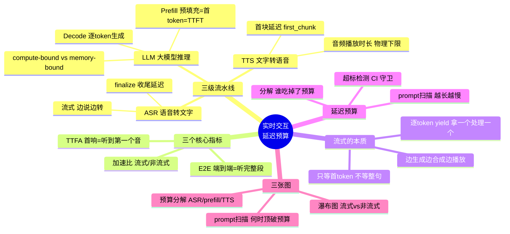
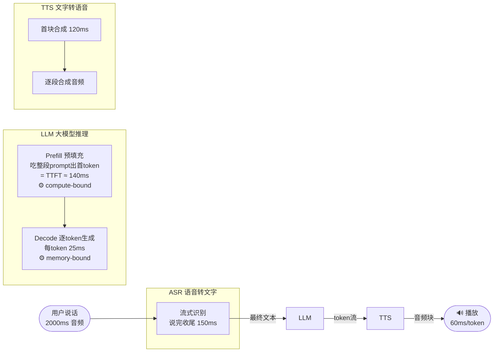
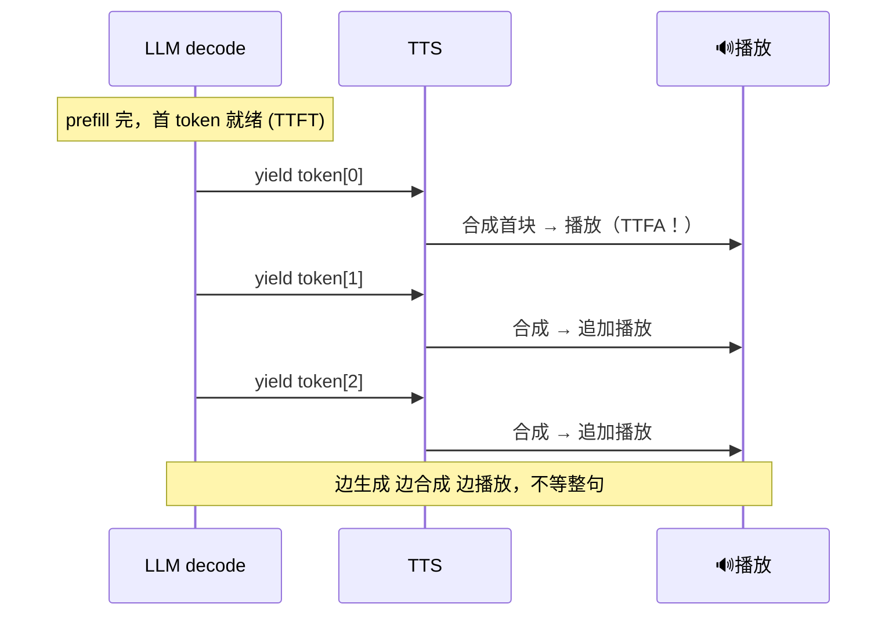

# 项目 02 · 实时交互延迟预算模型（Real-Time Interaction Latency Budget）

> 配套《**Multimodal Real-Time AI Agent Systems**》(Heiko Hotz & Sokratis Kartakis, O'Reilly) 第 2 章「为实时 AI 交互做架构」。
>
> 一句话主题：**一句「你好」进麦克风，到你耳朵里听见第一个音节回音，中间到底经历了哪些延迟？为什么「流式（streaming）」能把「首响延迟」砍到非流式的几分之一？代价是什么？**
>
> 本项目把 `ASR → LLM(prefill+decode) → TTS` 这条实时语音流水线，建成一个**可计算、可验证、可分解**的延迟预算模型。纯 CPU、离线、零外部模型——所有「模型」都是**确定性的延迟仿真器**，用「每 token 多少毫秒」这类物理参数精确复现时序。这正是延迟工程（latency engineering）在纸面上该做的第一步：**先把预算算清楚，再去堆工程实现。**

---

## 🗺️ 本项目地图



学完这个项目你会拿到四样东西：

1. **一套心智模型**——能把任何「实时 AI」系统的延迟，拆成 ASR / prefill / decode / TTS / 播放五段，并说清每段是 compute-bound 还是 memory-bound。
2. **两个关键指标的第一性理解**——TTFA（首响）和 E2E（端到端）到底量的是什么、为什么人对 TTFA 极其敏感。
3. **「流式」的代码级本质**——不是玄学，就是一个 `yield`：**拿到首个 token 就往下游送，不等整句写完**。
4. **一套可执行的延迟预算守卫**——把 SLO（如「首响 < 500ms」）写进 pytest，一旦某次改动顶破预算立刻红灯。

---

## 📂 文件结构

```
02_realtime_latency_budget/
├── latency_budget.py            # 核心：延迟仿真模型（纯标准库，零第三方依赖）
├── run_demo.py                  # 演示：跑仿真 + 出三张图（Agg 后端，中文字体）
├── conftest.py                  # 让 tests/ 能 import 父目录的 latency_budget
├── requirements.txt             # 依赖（matplotlib + pytest）
├── tests/
│   └── test_latency_budget.py   # 19 个单元测试（覆盖四条硬性验证）
└── (运行 run_demo.py 后生成)
    ├── latency_waterfall.png    # 流式 vs 非流式 延迟瀑布图
    ├── ttfa_breakdown.png       # 首响 TTFA 预算分解
    └── prompt_sweep.png         # prompt 长度扫描
```

---

## 一、🎯 先搞懂：我们到底在量什么？

实时语音对话的用户体验，几乎全由**两个延迟数字**决定：

| 指标 | 英文 / 全称 | 量的是什么 | 为什么重要 |
|---|---|---|---|
| **TTFA** | Time-To-First-Audio（首响延迟） | 用户说完最后一个字 → 听到系统回答的**第一个音** | 人对「对方开始回应」的等待**极其敏感**。超过 ~500ms 就感觉「卡了、没听见我说话」。这是实时体验的头号杀手。 |
| **E2E** | End-to-End（端到端延迟） | 用户说完 → 系统**整段回答播放完毕** | 决定「一轮对话总共多久」，影响对话节奏和可打断性。 |

> 🔬 **第一性原理：为什么 TTFA 比 E2E 更要命？**
>
> 人类对话里，「对方开口回应」和「对方说完」是两件事。你问完问题，只要对方 **0.2 秒内「嗯…」了一声**，你就知道「他听见了、在想」，心里踏实。哪怕他要说 5 秒。反过来，你问完后**死寂 2 秒**（哪怕之后秒回全文），你已经开始怀疑「是不是没网 / 没听见」。**TTFA 管的是「有没有回应」，E2E 管的是「回应多长」——前者是信任，后者是耐心。** 所以实时系统砸最多工程量去优化的，永远是 TTFA。

还有一个物理量贯穿始终——**音频播放时长（playback duration）**：把回答那句话用语音放出来，本身就要占那么多墙钟时间。它是 E2E 的**物理下限**：哪怕你把所有计算延迟压到 0，用户听完这句话也得花这么久。

---

## 二、🧩 三级流水线拆解：每一级的延迟从哪来



### 2.1 ASR（自动语音识别）：`ASRConfig`

真实世界 ASR 有两种形态：
- **非流式**：等你把整句说完，再一次性转文字（准，但慢）。
- **流式**：边说边转，说完瞬间吐出最终文字（快，靠增量解码）。

我们用两个参数刻画（`latency_budget.py`）：

```python
@dataclass
class ASRConfig:
    finalize_ms: float = 150.0       # 收尾延迟：说完到出最终文本
    realtime_factor: float = 0.3     # 处理倍率：0.3 = 处理速度是音频时长的 3.3 倍
```

> **逐行讲**：`finalize_ms` 是**流式 ASR 的核心指标**——因为识别工作在你说话的同时就并行做完了，说完那一刻只剩「收尾」这一小段。我们**故意不把「用户说话 2000ms」算进 ASR 延迟**：那是用户自己占的时间，不是系统的账。这就是为什么 `asr_latency_ms()` 只返回 `finalize_ms`。

### 2.2 LLM（大模型推理）：`LLMConfig` —— 全项目最重要的一节

LLM 推理分**物理上完全不同的两个阶段**，理解这一点是理解整个实时延迟的钥匙：

```python
@dataclass
class LLMConfig:
    prefill_base_ms: float = 40.0        # prefill 固定开销
    prefill_ms_per_token: float = 0.5    # prefill 每个输入 token 的增量耗时
    ms_per_token: float = 25.0           # decode 每个输出 token 的耗时（≈40 tok/s）
```

| 阶段 | 干什么 | 瓶颈 | 耗时公式 | 对应指标 |
|---|---|---|---|---|
| **Prefill**（预填充） | 把整段 prompt 一次性喂进模型，并行算完所有输入 token 的注意力，产出**第一个**输出 token | **compute-bound**（算力密集） | `base + per_token × prompt_tokens` | **TTFT** = 首 token 延迟 |
| **Decode**（解码） | 之后每生成一个新 token，读一遍 KV cache | **memory-bound**（访存密集） | `ms_per_token × 输出token数` | 每 token 恒定耗时 |

```python
def llm_prefill_ms(cfg):
    # prompt 越长，prefill 越慢——这就是「精简 prompt / 裁剪历史」是降延迟头号手段的原因
    return cfg.llm.prefill_base_ms + cfg.llm.prefill_ms_per_token * cfg.prompt_tokens

def llm_decode_ms(cfg, n_tokens=None):
    if n_tokens is None:
        n_tokens = cfg.response_tokens
    return cfg.llm.ms_per_token * n_tokens        # decode 匀速，token 数 × 单价
```

> 💡 **实战 / 面试高频：为什么 prefill 是 compute-bound，decode 是 memory-bound？**
>
> - **Prefill** 一次要算完 `prompt_tokens × prompt_tokens` 的注意力矩阵，是一次大规模并行矩阵乘法——GPU 的**算力（FLOPs）**被喂满，所以叫 compute-bound。prompt 越长，算得越久。
> - **Decode** 每步只新增 1 个 query token，但要把**整个 KV cache**从显存搬进计算单元、只做一点点乘加。瓶颈在**显存带宽**而非算力，所以叫 memory-bound。这也是为什么 decode 速度（tok/s）主要由显存带宽决定、batch 起来能显著提升吞吐（摊薄了权重搬运成本）。
>
> ⚠️ **常见坑**：新手以为「LLM 慢 = 模型大 = 算不过来」，于是拼命想优化 decode。但对**实时首响（TTFA）**而言，卡脖子的往往是 **prefill**（prompt 太长）。先量清楚 `prefill_ms` 占 TTFA 多少，再决定优化谁。

### 2.3 TTS（文字转语音）：`TTSConfig`

```python
@dataclass
class TTSConfig:
    first_chunk_ms: float = 120.0        # 首个音频块的合成延迟（流式关键指标）
    ms_per_token: float = 8.0            # 每 token 的合成【计算】耗时
    audio_ms_per_token: float = 60.0     # 每 token 对应的音频【播放】时长
```

> ⚠️ **最容易搞混的坑：合成「计算耗时」 vs 音频「播放时长」是两回事！**
>
> - `ms_per_token = 8ms`：合成 1 个 token 的音频，CPU/GPU 要**算** 8ms。
> - `audio_ms_per_token = 60ms`：这 1 个 token 合成出来的音频，**放出来要占** 60ms 墙钟时间。
>
> 一个是「造声音要多久」，一个是「这声音本身多长」。造 40 个 token 的音频只要算 `120 + 8×40 = 440ms`，但放出来要 `60×40 = 2400ms`。**播放时长远大于合成时长**——这正是流式能「边合成边放、不断流」的前提（合成永远追得上播放）。

---

## 三、⚡ 核心对比：非流式 vs 流式，差在哪一刀

### 3.1 非流式（non-streaming）：串行、每级等上一级做完

```python
def simulate_non_streaming(cfg):
    # 时序：[ASR收尾] → [prefill] → [decode整句] → [TTS整段合成] → [播放整段]
    t = 0.0
    t += asr_latency_ms(cfg)              # ASR 收尾
    t += llm_prefill_ms(cfg)              # 出首 token
    t += llm_decode_ms(cfg)               # ⚠️ 等生成【整句】！
    t += tts_full_synthesis_ms(cfg)       # ⚠️ 等合成【整段】！
    ttfa = t                              # 第一个音频要到这里才播 → TTFA 巨大
    t += audio_playback_ms(cfg)           # 播放整段
    return LatencyResult(ttfa_ms=ttfa, e2e_ms=t, ...)
```

**要命之处**：第一个音频要等 LLM 把**整句**生成完、TTS 把**整段**合成完才可能播放。用户会经历一段死寂的「空气时间（dead air）」。用默认参数：TTFA = `150 + 140 + 1000 + 440 = 1730ms`。**近 2 秒才出声**——这正是第一代语音助手体验糟糕的技术根源之一。

### 3.2 流式（streaming）：各级尽早开工，首个 token 一出就往下送

```python
def simulate_streaming(cfg):
    t = 0.0
    t += asr_latency_ms(cfg)              # ASR 收尾
    t += llm_prefill_ms(cfg)              # 出【第一个 token】就停手往下走
    t += tts_first_chunk_ms(cfg)          # TTS 合成【第一小段】
    ttfa = t                              # ✅ 第一个音频可播 → TTFA！只等了首 token

    # 首响之后：剩余 token 的 decode+合成 与 播放【并行】
    remaining_tokens = max(cfg.response_tokens - 1, 0)
    remaining_compute = (llm_decode_ms(cfg, remaining_tokens)
                         + cfg.tts.ms_per_token * remaining_tokens)
    remaining_play = audio_playback_ms(cfg, remaining_tokens)
    tail = max(remaining_compute, remaining_play)   # 谁慢谁卡脖子
    e2e = ttfa + tail
    return LatencyResult(ttfa_ms=ttfa, e2e_ms=e2e, ...)
```

> **逐行讲关键点**：流式 TTFA = `ASR收尾 + prefill + TTS首块` = `150 + 140 + 120 = 410ms`。**它只等 LLM 吐出「第一个 token」（prefill 结束），完全不含 decode 整句！** 这就是流式把首响从 1730ms 砍到 410ms（4.2×）的根本原因。
>
> 尾巴 `tail = max(remaining_compute, remaining_play)`：首响之后，播放会不会断，取决于「后续 token 生成+合成的速度」能否跟上「播放速度」。用 `max` 取二者上界——若计算比播放快（本项目就是：计算 1287ms < 播放 2340ms），播放就流畅不断流，E2E ≈ 首响 + 播放时长。

### 3.3 延迟瀑布图（运行 `run_demo.py` 生成 `latency_waterfall.png`）

```mermaid
gantt
    title 延迟瀑布对比（t=0 = 用户说完）
    dateFormat X
    axisFormat %L
    section 非流式
    ASR收尾 150ms      :0, 150
    prefill 140ms      :150, 290
    decode整句 1000ms  :290, 1290
    TTS整段 440ms      :1290, 1730
    播放整段 2400ms    :crit, 1730, 4130
    section 流式
    ASR收尾 150ms      :0, 150
    prefill首token 140ms :150, 290
    TTS首块 120ms      :290, 410
    首响后并行 2340ms  :crit, 410, 2750
```



红色标记处是「首个音频出现」的时刻——非流式在 1730ms，流式在 410ms。**同样的活，流式只是换了个「什么时候开始播」的策略，首响就快了 4 倍多。**

---

## 四、🔑 「流式」的代码级本质：一个 `yield`

很多人以为「流式」是什么高深的架构。不是。它的本质就是：**别把整句话算完再 return list，而是算一个 `yield` 一个，让调用方拿到一个就处理一个。**

```python
def stream_decode(cfg):
    """以生成器形式逐个产出 decode token，复现「流式一个一个出」。"""
    first_ready = asr_latency_ms(cfg) + llm_prefill_ms(cfg)   # 首 token 就绪时刻 = TTFT
    for i in range(cfg.response_tokens):
        ready_at = first_ready + cfg.llm.ms_per_token * i      # 之后每隔 ms_per_token 出一个
        yield TokenEvent(index=i, ready_at_ms=ready_at, is_first=(i == 0))
```



> 💡 **面试高频：流式和非流式在代码上差在哪？**
>
> **非流式 = `return [token0, token1, ..., tokenN]`（等全部算完）；流式 = `yield token` 一个一个出。** 对应到 API 层，就是 OpenAI/Gemini 的 `stream=True`——服务端边 decode 边用 SSE（Server-Sent Events）把 token 推给你。测试 `test_stream_decode_is_lazy_generator` 就验证了这个「惰性」本质：能 `next()` 只取前 3 个而不算完全部。

---

## 五、💰 延迟预算：把 SLO 变成可执行的守卫

「延迟预算（latency budget）」= 给每个指标定一条红线（SLO），并**把总预算分给各级**，超标就报警。

```python
def ttfa_breakdown(cfg):
    # 把流式 TTFA 拆成三个可归因的部分，三者之和 == 流式 TTFA
    return [("ASR 收尾", asr_latency_ms(cfg)),
            ("LLM prefill", llm_prefill_ms(cfg)),
            ("TTS 首块", tts_first_chunk_ms(cfg))]

def check_budget(cfg, target_ttfa_ms):
    parts = ttfa_breakdown(cfg)
    actual = sum(ms for _, ms in parts)
    return BudgetCheck(
        target_ttfa_ms=target_ttfa_ms,
        actual_ttfa_ms=actual,
        within_budget=actual <= target_ttfa_ms,     # ✅ 超标检测就这一行
        breakdown=[(n, ms, ms/actual*100) for n, ms in parts],
        headroom_ms=target_ttfa_ms - actual,         # 正=余量，负=超标多少
    )
```

用默认参数、目标「TTFA < 500ms」：

| 组成 | 毫秒 | 占比 |
|---|---|---|
| ASR 收尾 | 150.0 | 36.6% |
| LLM prefill | 140.0 | 34.1% |
| TTS 首块 | 120.0 | 29.3% |
| **合计（实测 TTFA）** | **410.0** | 100% |

实测 410ms ≤ 预算 500ms → **达标**，余量 +90ms。

> 💡 **实战：这张分解表是延迟工程里最有用的东西。** 它直接告诉你「要把首响再砍 100ms，该去优化哪一级」。这里 ASR 占比最大（36.6%），说明想提速应先看 ASR 收尾能不能更快，而不是盲目换更小的 LLM。

> ⚠️ **常见坑：延迟回归（latency regression）悄悄发生。** 某天有人给 system prompt 加了 300 token 的「人设描述」，prefill 从 140ms 涨到 290ms，TTFA 破 500ms——但没人发现，因为「功能没坏」。**把 `check_budget` 写进 CI**（见 `test_budget_violation_detected`），这类回归当场红灯。`prompt_sweep.png` 就画出了这条「prompt 越长越慢」的曲线和它穿过预算线的点。

---

## 六、🚀 如何运行

### 6.1 安装依赖（本机已装则跳过）

```bash
pip install -r requirements.txt
```

> 核心模型 `latency_budget.py` **零第三方依赖**（只用标准库 dataclasses/typing），`import` 和纯逻辑测试都不需要装任何东西。matplotlib/pytest 只被出图和测试运行器用到。

### 6.2 跑测试（必过）

```bash
python -m pytest -q
```

预期输出：

```
...................                                                      [100%]
19 passed in 0.03s
```

### 6.3 跑演示 + 出图

```bash
python run_demo.py
```

会在当前目录生成三张 PNG：
- **`latency_waterfall.png`**——流式 vs 非流式 延迟瀑布图（核心图）。
- **`ttfa_breakdown.png`**——首响 TTFA 预算分解 + 预算线。
- **`prompt_sweep.png`**——prompt 长度扫描，标出「首响何时顶破预算」。

### 6.4 快速自检核心模型

```bash
python latency_budget.py    # 直接打印一份延迟报告
```

> ⚠️ **Windows 中文/emoji 编码坑**：Windows 控制台默认 GBK，直接 `print` emoji（✅/❌）会抛 `UnicodeEncodeError`。三个入口脚本都在 `__main__` 里做了 `sys.stdout.reconfigure(encoding="utf-8")`；命令行也可 `set PYTHONIOENCODING=utf-8`。**画图时更进一步：图上一律不用 emoji**，因为 Microsoft YaHei 没有 ✅ 的字形，会渲染成「豆腐块」——图上改用纯文字「达标/超标」。

---

## 七、🧪 测试怎么覆盖四条硬性验证

`tests/test_latency_budget.py` 共 19 个用例，题目要求的四条硬性验证逐一对应：

| # | 硬性要求 | 对应测试 | 怎么验证 |
|---|---|---|---|
| 1 | **流式首响 < 非流式** | `test_streaming_ttfa_beats_non_streaming` | `streaming.ttfa < non_streaming.ttfa` 且加速比 > 1 |
| 2 | **端到端 = 各级之和** | `test_e2e_equals_sum_of_stages` | 两种模式的 `e2e_ms` 都 == `sum(stage 时长)` |
| 3 | **decode 流式按 token 出** | `test_stream_decode_yields_per_token` 等 4 个 | 生成器逐 token 产出、只有首个 `is_first`、时刻单调匀速、可惰性 `next()` |
| 4 | **预算超标检测** | `test_budget_violation_detected` | 严苛预算(100ms)下 `within_budget=False` 且余量为负 |

额外的物理自洽测试（保险）：

- `test_streaming_ttfa_only_waits_first_token`：流式 TTFA 严格等于 `ASR+prefill+TTS首块`，**不含 decode 整句**。
- `test_longer_prompt_increases_prefill_and_ttfa`：prompt 越长 → prefill 越慢 → TTFA 越大（compute-bound 直觉）。
- `test_more_response_tokens_increase_e2e_not_ttfa`：回答更长 → E2E 更久，但**流式首响不变**（首响只取决于首 token）。
- `test_playback_is_e2e_floor`：E2E ≥ 首响 + 剩余播放时长（音频播放是物理下限）。
- `test_stages_are_contiguous_when_sequential`：非流式各级首尾相接、无重叠（验证串行模型）。

```bash
$ python -m pytest -q
...................                                                      [100%]
19 passed in 0.03s
```

---

## 八、🔬 深入：几个第一性追问

> 🔬 **追问 1：流式的 E2E 一定比非流式小吗？**
>
> 不一定「小很多」，但**不会更大**（`test_streaming_e2e_not_worse_than_non_streaming`）。本项目里流式 E2E=2750ms、非流式 E2E=4130ms，流式确实更小——因为非流式把「decode 整句 + 合成整段」这段时间**串在播放之前**白白等了，而流式把它藏进了播放的并行时间里。极端情况下（回答极短、播放时长 < 计算时长），二者 E2E 会趋近。**流式真正稳赢的永远是 TTFA，不一定是 E2E。**

> 🔬 **追问 2：为什么尾巴用 `max(计算, 播放)` 而不是相加？**
>
> 因为首响之后，「生成+合成」和「播放」是**并行**的两条流水线。播放第 k 个 token 的音频时，第 k+1 个 token 早已在后台生成好了。总尾巴由**较慢的那条**决定（木桶效应）。若相加，就等于假设它们串行——那又退化成非流式了。这也解释了一个真实工程指标 **RTF（Real-Time Factor）**：只要 `token生成速度 ≥ 音频消耗速度`（即计算 RTF < 1），播放就永不断流。

> 🔬 **追问 3：这个模型没算网络延迟，现实里能忽略吗？**
>
> **绝不能。** 真实系统里 ASR/LLM/TTS 常在不同服务甚至不同机房，每一跳都有网络 RTT（几十 ms 起）。本项目为聚焦「计算侧延迟预算」故意省略了网络项——但扩展极简单：给每级 config 加一个 `network_rtt_ms`，累加进 `*_latency_ms` 即可。这也是为什么第 2 章反复强调 **WebSocket 持久双向连接**：它省掉了每轮重建连接的握手开销，把网络这一项压到最低。

---

## 📌 小结

- **实时体验由两个数字决定**：TTFA（首响，管信任）和 E2E（端到端，管耐心）；工程量优先砸向 TTFA。
- **LLM 推理分两段**：Prefill（compute-bound，= TTFT，随 prompt 长度涨）+ Decode（memory-bound，每 token 恒定）。**实时首响的头号敌人常是 prefill（prompt 太长），不是模型太大。**
- **流式的本质是一个 `yield`**：拿到首个 token 就往下游送，**只等首 token，不等整句**——这把 TTFA 从 1730ms 砍到 410ms（4.2×）。
- **合成计算耗时 ≠ 音频播放时长**：后者远大于前者，是流式「边合成边放不断流」的前提，也是 E2E 的物理下限。
- **延迟预算要可执行**：把 SLO 写进 `check_budget` + CI，用分解表定位「谁吃掉了预算」，用 prompt 扫描防「延迟回归」。

## 🔗 延伸

- 📖 本书第 2 章「为实时 AI 交互做架构」——四大架构支柱：流式 / 低延迟 / 双工 / 事件驱动。
- 📖 本书第 3 章——视频工具与系统指令下的高级实时交互（多模态延迟叠加）。
- 🔧 扩展练习：给每级 config 加 `network_rtt_ms`，把网络延迟纳入预算；或加入 **VAD（语音活动检测）** 的「端点判定延迟」，模型化「用户说完」这一刻本身也有不确定性。
- 🔧 进阶指标：把 decode 的 `ms_per_token` 换成随 batch 变化的函数，观察 batching 如何在**吞吐**和**单请求延迟**之间权衡（实时系统往往要牺牲一点吞吐换低延迟）。
- 📚 关键词延伸阅读：`TTFT`、`ITL (Inter-Token Latency)`、`RTF (Real-Time Factor)`、`prefill/decode disaggregation`、`speculative decoding`（都是把上面这些延迟项继续往下压的手段）。
