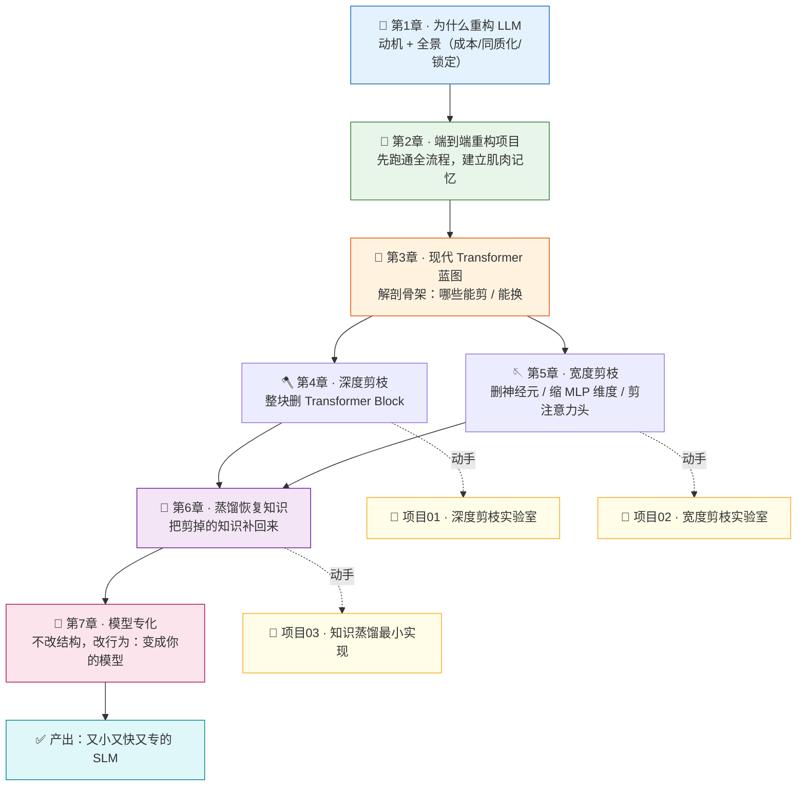

# 🏗️ Rearchitecting LLMs · 中文逐章精讲 + 实战合集

> 本目录是 Manning MEAP 新书 **《Rearchitecting LLMs》**（作者 **Pere Martra**）的**中文逐章精讲（book-guide/）** 加 **可本机跑通的实战项目（projects/）** 合集。
>
> 这本书回答一个越来越值钱的工程问题：**怎么把一个又大又通用的 LLM，动手改造成又小又快又专的模型（SLM，Small Language Model）**。全书围绕一条「**模型再架构流水线**」展开：
>
> ```
> 选基座模型 → 剪枝(Pruning) → 知识恢复(Distillation) → 专化(Specialization) → 部署
>   变小又变快 ──────────┘          └── 把丢的知识补回来   └── 变成"你的"模型
> ```
>
> 精讲部分**逐节讲透原理**（对应原书 PDF 页码），实战部分**纯 PyTorch、CPU 即可、零联网、零 GPU、零 API key**，把方法论**跑通、测对、画出来**。

---

## 🎯 这个合集适合谁

| 你是谁 | 怎么用 |
|---|---|
| 🎓 **想搞懂模型压缩的学生/自学者** | 按 `book-guide/` 章号顺序读，遇到"剪枝/蒸馏"就去对应 `projects/` 亲手跑一遍 |
| 💼 **准备 AI-Infra / LLM 岗面试的人** | 直奔每篇末尾的「面试高频题库」+ 项目里的 `pytest`，把"能说清 + 能写对"一起练 |
| 🛠️ **要在业务里把大模型做小的工程师** | 精讲给方法论与踩坑，项目给可复用的**结构化剪枝 / 蒸馏**代码骨架 |

---

## 🗺️ 学习路径图



**建议顺序**：`01 → 02 → 03`（打地基）→ 遇到 `04/05` 就跳去 `projects/01`、`projects/02` 亲手剪一遍 → 读 `06` 时配 `projects/03` 蒸馏 → 最后读 `07` 收束到"专化"。

---

## 📂 目录结构一览

```
book-rearchitecting-llms/
├── README.md                    ← 你在这里（总入口 / 学习地图）
├── book-guide/                  ← 📚 7 篇逐章精讲（对应原书 7 章）
│   ├── 01_为什么重构 LLM 很重要.md
│   ├── 02_端到端重构项目.md
│   ├── 03_现代 Transformer 蓝图.md
│   ├── 04_深度剪枝：更小更快.md
│   ├── 05_宽度剪枝：塑形模型.md
│   ├── 06_蒸馏恢复知识.md
│   └── 07_模型专化.md
└── projects/                    ← 🧪 3 个可跑实战（各含 pytest + run_demo + 图）
    ├── 01_depth_pruning_lab/    ← 配套第 4 章
    ├── 02_width_pruning_lab/    ← 配套第 5 章
    └── 03_distillation_mini/    ← 配套第 6 章
```

> 精讲讲透「**是什么 / 为什么 / 怎么用 / 代价**」，项目负责「**亲手写一遍 + 测对 + 出图**」。两者一一对应、互为验证。

---

## 📚 目录一 · 逐章精讲（`book-guide/`）

> 每篇都是「**本章地图 → 第一性原理 → 逐节精讲 → 代码/公式 → 踩坑 ⚠️ → 面试高频题 💡**」的结构，对应原书 PDF 页码，读完能"讲得清、答得上"。

| # | 章节（点开即读） | 一句话精讲 | 原书页码 |
|---|---|---|---|
| 1️⃣ | [01_为什么重构 LLM 很重要](book-guide/01_为什么重构%20LLM%20很重要.md) | 动机篇：通用大模型的成本/同质化/不可解释/供应商锁定四宗罪，引出三阶段重构流水线与全书路线 | p.9–22 |
| 2️⃣ | [02_端到端重构项目](book-guide/02_端到端重构项目.md) | 全书第一个动手项目：用 `gemma-3-270m` 走一遍「选模型→剪层→评估损失→蒸馏恢复→对比定稿」的完整闭环 | p.23–50 |
| 3️⃣ | [03_现代 Transformer 蓝图](book-guide/03_现代%20Transformer%20蓝图.md) | 把经典（DistilGPT2）与现代（Llama-3.2）Transformer 并排解剖，定位显存瓶颈（KV Cache）与算力瓶颈（MLP 膨胀维度） | p.51–88 |
| 4️⃣ | [04_深度剪枝：更小更快](book-guide/04_深度剪枝：更小更快.md) | 整块删 Transformer Block；讲清"加速真正来自少搬数据（memory-bound）"，并用 hook+Block Influence 数据驱动选层 | p.89–128 |
| 5️⃣ | [05_宽度剪枝：塑形模型](book-guide/05_宽度剪枝：塑形模型.md) | 删 MLP 神经元 / 缩 `intermediate_size` / 剪注意力头；GLU「神经元对」、重要性评分与结构化重建三铁律 | p.129–181 |
| 6️⃣ | [06_蒸馏恢复知识](book-guide/06_蒸馏恢复知识.md) | 全流程最关键一环：用「软标签 + 温度 + 复合损失」把剪掉的知识补回来，决定小模型"能用"还是"能打" | p.182–233 |
| 7️⃣ | [07_模型专化](book-guide/07_模型专化.md) | 不改结构、改行为：让通用模型学会你的数据/格式/任务，流水线最后一环，落地上线 | p.234–271 |

---

## 🧪 目录二 · 实战项目（`projects/`）

> 三个项目均为**纯 PyTorch、CPU 即可、零联网/零 GPU/零 API key**，用手写玩具模型把书里方法论**跑通 + `pytest` 测对 + `run_demo.py` 出中文图**。追求的是**可验证的机械正确性**（形状对、参数按比例降、结果确定可复现），而非"模型说人话"。

| 项目 | 配套章节 | 一句话 | 如何跑 |
|---|---|---|---|
| [projects/01_depth_pruning_lab](projects/01_depth_pruning_lab/) 🪓 | 第 4 章 | **深度剪枝实验室**：手写多层 Transformer，用 hook 探针 + Block Influence(1−余弦相似度) 给每层打分，按"护首尾、避相邻"启发式删块，证明剪得对 | `cd projects/01_depth_pruning_lab`<br/>`pip install -r requirements.txt`<br/>`python -m pytest -q`<br/>`python run_demo.py` → `figures/` 出 2 图 |
| [projects/02_width_pruning_lab](projects/02_width_pruning_lab/) 🪡 | 第 5 章 | **宽度剪枝实验室**：对玩具 MLP / 注意力做结构化宽度剪枝，按重要性删神经元/头并**物理重建更小权重矩阵**，用曲线证明"小剪误差小、大剪误差大、重要神经元被保留" | `cd projects/02_width_pruning_lab`<br/>`pip install -r requirements.txt`<br/>`python -m pytest -q`<br/>`python run_demo.py` → 出 4 张中文图 |
| [projects/03_distillation_mini](projects/03_distillation_mini/) 🧠➡️🎓 | 第 6 章 | **知识蒸馏最小实现**：老师陪练学生，用「软标签 + 温度 T + 复合损失 α·CE+(1−α)·T²·KL」把暗知识喂给小模型，几十秒内实证蒸馏比单练更准 | `cd projects/03_distillation_mini`<br/>`pip install -r requirements.txt`<br/>`python -m pytest -q`<br/>`python run_demo.py` → `figures/` 出 4 图 |

> 💡 每个项目根目录都有独立 `README.md`，含逐行代码精讲、测试设计思路与面试题库，比上表详细得多。

---

## 🚀 面试 / 实战用法

**📌 面试速用（把"懂"变成"答得上"）**

- **三大动作要能一句话说清**：深度剪枝=整块删 Block（省的是**搬数据**，memory-bound）；宽度剪枝=删神经元/缩 MLP/剪头（要**物理重建权重矩阵**）；蒸馏=软标签+温度把知识补回来。
- **最容易被追问 / 最容易写错的点**：
  - 为什么剪枝加速主要来自"少搬数据"而不是"少算乘法"？（第 4 章）
  - GLU-MLP 为什么必须成对删"神经元对"、`intermediate_size` 怎么保持一致？（第 5 章）
  - 蒸馏损失里 `T²` 是干嘛的、`F.kl_div` 的 `input`/`target` 谁是 log 谁是概率？（第 6 章）
- **打法**：读对应精讲 → 直接看该章末尾「面试高频题库 💡」→ 打开配套项目把关键函数**默写一遍**，`pytest` 绿了就算过关。

**🛠️ 实战速用（把方法论搬进你的项目）**

1. **建基线**：先按第 2 章跑通端到端闭环，心里有"剪多少掉多少"的量级感。
2. **挑剪法**：延迟/显存吃紧→深度剪枝（`projects/01` 的 Block Influence 选层逻辑可直接迁移）；参数量/单层算力吃紧→宽度剪枝（`projects/02` 的结构化重建三铁律照抄）。
3. **补知识**：剪完必掉点，用第 6 章 / `projects/03` 的蒸馏复合损失把能力捞回来。
4. **做专化**：最后按第 7 章微调成"你的模型"，再上线。

> 所有项目都用**确定性随机种子**，结果可复现——适合直接改成你自己数据/结构的**起步脚手架**。

**🧩 三大动作速查表（面试前扫一眼）**

| 动作 | 改什么 | 加速/省显存来自 | 关键坑 | 章 / 项目 |
|---|---|---|---|---|
| 深度剪枝 Depth Pruning | 删整个 Transformer Block | **少搬数据**（memory-bound），非少算乘法 | 别删首尾、别删相邻块；用 Block Influence 量化 | 第 4 章 / `projects/01` |
| 宽度剪枝 Width Pruning | 删神经元、缩 `intermediate_size`、剪注意力头 | 参数量 + 单层算力同时降 | GLU 要成对删"神经元对"、重建后形状必须一致 | 第 5 章 / `projects/02` |
| 知识蒸馏 Distillation | 不删结构，训练小模型 | —（补知识，不提速） | `T²` 缩放、`F.kl_div` 的 log/prob 方向别写反 | 第 6 章 / `projects/03` |

---

## 📄 关于原书

- **书名**：*Rearchitecting LLMs*（Manning，MEAP 进行中）
- **作者**：Pere Martra
- **主线模型**：`google/gemma-3-270m`、`Llama-3.2-1B`、`DistilGPT2` 等（精讲复现原书实验）
- **本合集定位**：中文二次精讲 + 可跑实验，**仅供学习**；支持原书请购买 Manning 正版。

---

> 🧭 **从这里开始**：打开 [book-guide/01_为什么重构 LLM 很重要](book-guide/01_为什么重构%20LLM%20很重要.md)，读完第 1 章你就知道"为什么要动这一刀"了。祝你把模型越改越小、越改越快、越改越是你自己的。💪
