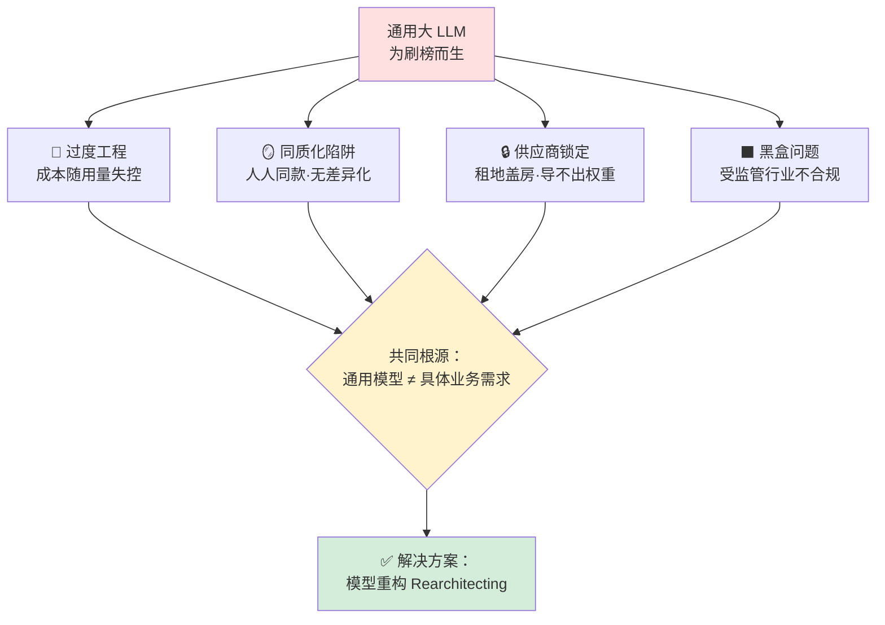
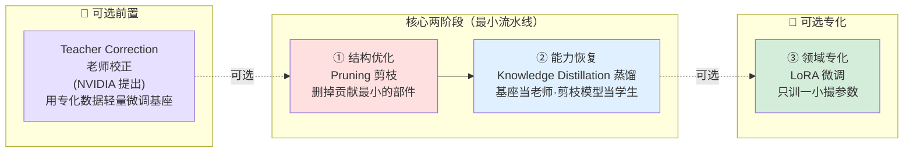
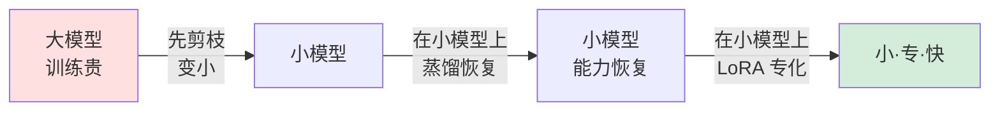
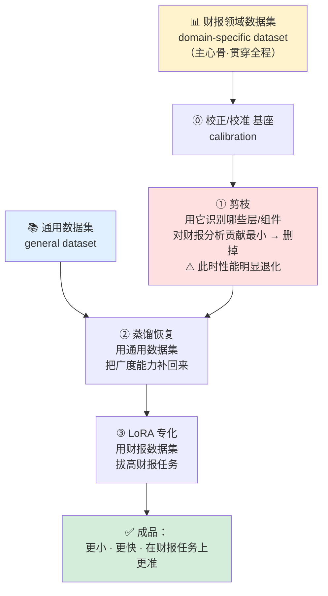
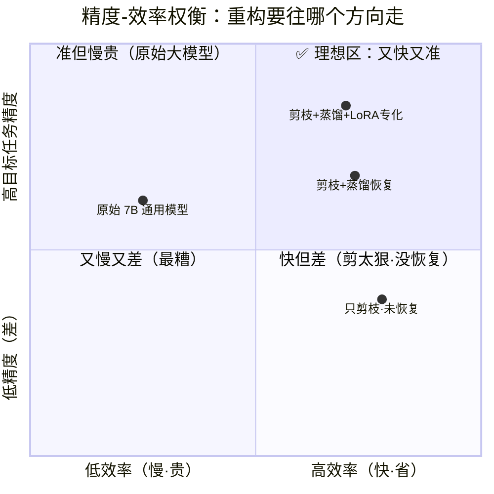
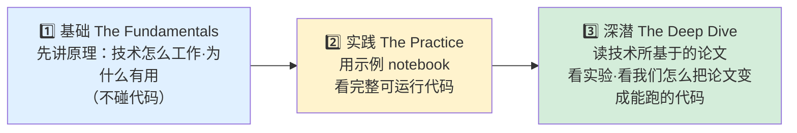

# 第 1 章 · 为什么重构 LLM 很重要（Why Rearchitecting LLMs Matters）

> 对应原书：*Rearchitecting LLMs*（MEAP，作者 Pere Martra）第 1 章，PDF 第 9–22 页。
> 本篇是「逐章精讲」系列的第 1 篇，定位：**动机篇 + 全景篇**。

---

## 🗺️ 本章地图（读完你能会什么）

这是全书的**第一块地基**。整本书要教你一件事：**把一个又大又通用的 LLM，动手改造成又小又快又专的模型**——作者把这个过程叫做 **模型重构（model rearchitecting）**，把改造出来的成品叫做 **小语言模型（SLM, Small Language Model）**。

第 1 章不写一行可运行代码，它要回答三个「为什么」和一个「怎么走」：

| 问题 | 本章小节 | 本篇对应 |
|---|---|---|
| 通用大模型到底哪里不行？（成本/同质化/不可解释/供应商锁定） | 1.1 | §2 |
| 解决方案长什么样？（三阶段重构流水线） | 1.2 | §3 §4 |
| 需要什么工具？ | 1.3 | §5 |
| 全书学习路线怎么排？ | 1.4 / 1.5 | §6 |

读完本篇，你应该能：

- 🎯 说清楚 **为什么要重构**——用「过度工程 / 同质化陷阱 / 黑盒问题 / 供应商锁定」四个词跟别人讲明白。
- 🎯 画出 **重构流水线三阶段图**：剪枝（结构优化）→ 蒸馏（能力恢复）→ 微调（领域专化），并说清每一阶段解决什么、代价是什么。
- 🎯 理解 **剪枝 / 蒸馏 / 专化** 三者不是并列的三选一，而是**流水线上环环相扣的接力**。
- 🎯 建立 **精度–效率权衡（accuracy–efficiency trade-off）** 的直觉，看懂论文里「减 30% 参数、掉 10% 精度」这类数字。

> 💡 **一句话抓住本章**：通用大模型像一把「瑞士军刀」——什么都能干，但干每一件具体事都不是最趁手的。重构就是把这把瑞士军刀，回炉重铸成一把**专门给你这道工序用的手术刀**。

---

## 1️⃣ 先厘清几个基本概念（是什么）

在读动机之前，先把书里反复出现的名词一次讲清。零基础也能跟上。

### 📖 LLM / SLM / 参数量

- **LLM（Large Language Model，大语言模型）**：在海量、跨语言、跨领域文本上训练出来的通用模型。参数量常在**几百亿到接近一万亿（trillion）**之间。能写诗、能读财报、能写代码、能翻译——**广度**是它的力量来源。
- **参数（parameter）**：模型内部一个可训练的数字（权重）。参数越多，模型「记住/表达」的能力越强，但**算得越慢、占显存越多、推理越贵**。
- **SLM（Small Language Model，小语言模型）**：书里的核心主角。**几百万到几十亿参数**的专用模型，天生轻量、快。作者的愿景是：让多个 SLM 像乐高积木一样互相协作、和其他软件组件拼在一起，组成一个生态。

> 🔬 **第一性原理｜为什么「大」会变成「贵」**
> Transformer 每生成一个 token，前向计算量大致正比于**参数量**（记作 $N$）。对稠密（dense）模型，单 token 的浮点运算量约为 $2N$ FLOPs（每个参数一次乘、一次加）。也就是说：
> $$\text{单 token 计算量} \approx 2N \ \text{FLOPs}$$
> 参数从 70 亿（7B）砍到 50 亿（5B），单 token 计算量直接下降约 $ (7-5)/7 \approx 29\% $。**参数是效率账单的分母**——这就是为什么全书都在「想办法减少 $N$」。

### 📖 三种「适配」手段，别搞混

书里在动机部分，把「让通用模型为我所用」的常见做法排了个队，逐个指出局限：

| 手段 | 英文 | 做了什么 | 改变了模型本身吗？ | 局限（书中原话精神） |
|---|---|---|---|---|
| 提示工程 | Prompt Engineering | 精心写指令/提示链引导行为 | ❌ 完全没有 | 模型底层「本事」一点没变，天花板很低 |
| 检索增强 | RAG | 让模型能查外部/私有资料 | ❌ 没有 | 只是喂新信息，**处理信息的方式仍然是通用的** |
| 微调 | Fine-tuning | 在特定数据上继续训练，调权重 | ✅ 调权重，但**不改结构** | 改的是几百亿参数、每个 token 都要花钱，闭源模型还导不出权重 |
| **重构** | **Rearchitecting** | **物理改变结构**：删层、旁路、改注意力、重塑内部块 | ✅✅ **改结构** | 本书主题，从根上解决 |

> ⚠️ **常见坑｜以为 RAG = 专化**
> 很多人上来就用 RAG 想让模型「变专业」。作者点得很直白：RAG 给的是**新信息（information）**，不是**新能力（capability）**。模型拿到你的私有财报后，**理解和推理这些财报的方式，依旧是那个通用大脑**。真正的差异化，必须动到模型内部。

> 💡 **面试高频**：「Prompt / RAG / Fine-tuning / Rearchitecting 的区别？」
> 标准答法——**一句话四层递进**：Prompt 不碰模型（只改输入）→ RAG 不碰模型（只加外部知识）→ Fine-tuning 碰**权重**（不碰结构）→ Rearchitecting 碰**结构**（删/改物理组件）。越往后，差异化越深、迁移越彻底、也越难做。

---

## 2️⃣ 为什么必须重构：通用 LLM 的四大痛点（为什么）

作者从「一个企业最关心的维度」出发，摆出通用大模型规模化到生产时的四类问题。这一节是全书的**动机根**，务必吃透。

### 💸 痛点一：过度工程与失控成本（Overengineering & Cost）

**POC 阶段一切都好**：用 API 调模型，几行调用就能验证想法，按 token 付费，还不涉及真实数据。

**进了生产就翻车**：

- 调用量从「每天几十次」→「每天成千上万次」，token 数还持续膨胀。
- 成本**不仅涨，而且难以控制**：输入 token 你能估，**输出 token 几乎无法预测**——尤其在 Agent 系统里，工具调用、Agent 之间的递归调用，让输出量成了脱缰野马。

作者讲了一个真实故事（**药企案例**，务必记住）：

> 一支药企团队，为一个「一天只用几次」的模型，**7×24 小时开着高端 GPU**，烧钱如流水。他们提出的解决方案是——换成 API 模型。

作者点破：问题的本质**不是「本地 vs API」**，而是**工具和任务严重不匹配**——他们用了一个远大于需求的模型。**正确的解法不是迁移，而是替换**：换成一个针对他们数据和任务、**小得多的专用 SLM**。结果是「变革性」的：

- 成本大降；
- 推理变快 → 团队开始**越来越多地做实验**；
- 一个「昂贵、受控」的资源，变成了「敏捷、人人可用」的工具。

> 🔬 **第一性原理｜为什么小模型让人「敢用」**
> 成本不只是财务数字，它是**行为的闸门**。当一次推理很贵，团队会本能地「省着用」，创新被抑制；当推理便宜到可以随便跑，实验频率上升，迭代速度上升。**降本的真正红利，是解锁了「敢于试错」的组织行为**。这也是为什么作者反复强调「更快 → 更多实验」。

### 🪞 痛点二：同质化陷阱（The Generic Trap）

如果**每家公司都用同一个 GPT-5 / Claude / Gemini**，喂进去的数据也差不多，那么：

- 所有金融分析软件会给出**一模一样的推荐**。
- 想象一下：大量投资推荐软件同时对某几只 Nasdaq 股票发出相同的「买入」——这不仅会**扭曲股价本身**，更致命的是：**这个推荐对你的客户毫无价值**，因为连用 ChatGPT 聊天的普通人都能得到同样答案。

**你没有差异化。** 而 Prompt 工程、RAG 都堵不住这个洞（见 §1 那张表），因为它们改不动模型的底层专长。

> 💡 **实战｜「差异化」是商业护城河**
> 这一段的商业含义极强：在一个人人都能调同一个 API 的世界里，**模型本身不再是护城河，「你怎么改造模型」才是**。重构 = 把公有大脑，塑造成只属于你的专有大脑。

### 🔒 痛点三：供应商锁定（Vendor Lock-in）

作者对「在闭源模型上做微调」有一个精彩的比喻，**建议原样记住**：

> **在闭源模型上微调，就像在租来的地上盖定制别墅。**

具体含义（逐条）：

- 你微调出来的模型，是**托管的产物（hosted artifact）**，被绑死在供应商的基础模型上。
- **你导不出权重（can't export the weights）**。
- 你能锁定某个版本求稳定，但一旦基础模型被升级或下线，你**得拿同样的数据集和评测，重跑一遍微调**。
- 叠加价格的不可预测 → 经典的 **AI 版供应商锁定**：换供应商在**财务上和技术上都贵到做不动**。

而且，微调**不是一劳永逸的省钱**：你**付钱去适配**（每个 token 都计费），拿到微调模型后，**每次推理还更贵**。

### 📈 补充：开源大模型也逃不掉「过度工程」

别以为只有 API 有问题。很多开源模型（尤其最大最强的那些）是为了**刷通用榜单（benchmark）** 设计的——追求榜首、追求最长上下文窗口。

- 像 **MoE（Mixture of Experts，混合专家）**、**超长上下文窗口** 这些特性，在你的领域专用场景里**常常用不上，甚至拖累性能**。
- 根源：这些基础模型多来自**学术实验室或大厂研究团队**，它们的成功指标是「刷榜 + 可发表」，而不是「解决你的法律文档分析或医疗诊断」。→ 造出来的是**擅长考试、而非擅长干活**的模型。

### ⬛ 痛点四：黑盒问题（The Black-Box Problem）

在**金融、医疗**这类受监管行业，**可解释性不是可选项，是法律强制要求**。

- **API 模型**：问题是**绝对的**——你只有一个 API 端点，内部什么都看不到。更糟的是**不通知的更新**会悄悄改变行为，无预警地搞崩生产系统。
- **开源模型**：虽然能拿到权重，但神经网络太复杂，实践中**依旧被当黑盒**。

作者给出的差异化解法（也是全书最后一部分的重头戏）：**分析神经元激活（neuron activations，模型各层的内部数值输出）**，观察处理信息时哪些组件在「放电（fire）」。这让你能**理解甚至影响**模型行为——把黑盒撬开一道缝。

### 🗺️ 用一张 mermaid 图把四大痛点串起来

> 💡 **面试高频**：「为什么不直接用 GPT-5 / Claude，非要自己重构模型？」
> 答题四连：**成本失控（尤其 Agent 输出不可预测）→ 无差异化（人人同款）→ 供应商锁定（租地盖房、导不出权重、随基础模型升级重跑）→ 不可解释（受监管行业不合规）**。这四点的共同根源是「**通用模型是为刷榜造的，和具体业务需求根本不匹配**」。

---

## 3️⃣ 解决方案：模型重构流水线（怎么做 · 全景）

痛点的**共同根源**是：用了「为 benchmark 而生」的通用模型，去解「和 benchmark 完全不同」的业务问题。

作者的方案不是在「行为层」小修小补（那是 Fine-tuning 干的事），而是**从根上动 LLM 的架构**。它由一组技术组合而成：

- **剪枝（Pruning）**：外科式地**删除**模型组件。
- **知识蒸馏（Knowledge Distillation）**：让小「学生（student）」模型向大「老师（teacher）」学习。
- **微调（Fine-tuning，本书用 LoRA）**：做领域专化。
- **研究内部行为**：精确纠正不想要的响应（激活分析）。

### 🔗 三阶段流水线（Figure 1.1 精讲）

整个流程是**三个顺序阶段**，后一阶段建立在前一阶段之上：

**逐阶段讲透**：

#### ① 结构优化 = 剪枝（Pruning）

- **做什么**：模型**删掉对目标任务贡献最小的部分**。
- **谱系（书中明确的范围）**：从**激进（aggressive）**——删掉整块（entire blocks），必须配后续恢复；到**外科（surgical）**——只删几个神经元，改行为而几乎不动通用能力。
- **代价**：性能会掉，掉多少取决于**技术**和**重构幅度**。删得越狠，掉得越多，越需要恢复。

#### ② 能力恢复 = 知识蒸馏（Knowledge Distillation）

- **做什么**：用蒸馏把剪枝时丢掉的能力**补回来**。**基座模型（base）当老师**，**剪枝后的模型当学生**。
- **关键洞察（务必记住）**：学生学的**不只是「正确答案（what to respond）」，还有老师内部的推理模式（how it arrives at the answer, step by step）**——一步步怎么想出来的。
- **好处**：传递的知识更深，**恢复更高效、更省算力时间**。（第 2 章初步、第 6 章深入。）

#### ③ 领域专化 = LoRA 微调（可选）

- **做什么**：模型恢复通用能力后，用 **LoRA（Low-Rank Adaptation，低秩适配）** 做专化。
- **为什么用 LoRA**：这是**参数高效（parameter-efficient）** 技术，**只训一小撮参数**，相比传统全量微调，大幅降低算力和训练时间。

#### ⓪ 老师校正（Teacher Correction，可选前置）

- **术语来源**：**NVIDIA** 在造它的模型家族时提出。
- **做什么**：在流程开始前，对基座模型做一次**轻量微调**，用的数据就是后面「决定删哪里」和「专化微调」要用的同一份数据。
- **目的**：让基座对齐，使得**能力恢复阶段效果更好**。

### 💰 为什么是「剪枝 → 蒸馏 → 专化」这个顺序？

作者点了关键的一句：**这个顺序最省算力**，因为——

> 每一个微调阶段（蒸馏恢复、LoRA 专化）都跑在**更小、更便宜训练**的模型上。

> 🔬 **第一性原理｜为什么「先瘦身再训练」省钱**
> 训练/微调的成本正比于**模型大小 × 数据量 × 轮数**。如果你**先剪枝把模型变小**，那么后续每一次「蒸馏恢复」「LoRA 专化」都在**更小的分母**上跑——反过来，如果你先在大模型上微调再剪枝，那些昂贵的训练算力就白花在了「即将被删掉的参数」上。**先删后练 = 不为将死的组件付学费。**

> ⚠️ **常见坑｜以为「剪枝 vs 蒸馏 vs 专化」是三选一**
> 新手最容易把这三者理解成「三种独立的压缩方法，挑一个用」。**错。** 在本书的框架里它们是**接力**：剪枝负责「变小」（但会掉能力）→ 蒸馏负责「把掉的能力补回来」→ 专化负责「针对你的领域再拔高」。剪枝制造损伤，蒸馏治疗损伤，专化增强特长。**它们解决的是流水线上不同工位的问题。**

---

## 4️⃣ 数据集是主心骨：一个金融例子跑通流水线（Figure 1.2 精讲）

作者反复强调：**领域专用数据集（domain-specific dataset）是整个重构过程的「主心骨（backbone）」**，它贯穿每一个决策。

同时还有**一份通用数据集（general dataset）** 专门服务于「能力恢复」阶段，确保剪枝后的模型在专化之前，**先保住广度**。这种「双数据集」设计，让每个阶段都为项目目标而优化。

### 🏦 例子：把 7B 通用模型，改造成「季度财报分析」专用模型

一家金融服务公司，要把一个 7B 通用模型优化成能分析季度财报（quarterly earnings reports）的模型。按图 1.2 的走法：

**逐步走一遍（对照上图）**：

1. **校准（calibration）**：用财报数据集校准基座模型。
2. **剪枝（pruning）**：用**同一份数据集**识别哪些层/组件对财务分析贡献最小 → 剪掉，让结构变轻。⚠️ **此刻剪枝后的模型性能会退化**——不仅通用指标掉，甚至连你正在准备的财务任务也暂时变差。
3. **能力恢复（knowledge recovery / distillation）**：用**通用数据集**，通过蒸馏把广度能力恢复回来。
4. **专化（LoRA）**：在恢复好的模型上，用**财报数据集**做 LoRA 微调，拔高财报任务。

**最终结果**：一个**显著更小、明显更快、且在你的具体用例上更准**的模型——三个维度同时改善。

### 🔀 流水线不止一种走法：专化 vs 纯优化

作者特别指出，流水线**很灵活**，目标不一定是「专化」：

| 目标 | 要不要专用数据集？ | 剪枝依据 | 典型场景 |
|---|---|---|---|
| **领域专化（specialize）** | ✅ 要（财报/医疗/生物…） | 用领域数据识别「对该任务最不重要」的组件 | 造财报分析专家模型 |
| **纯效率优化（optimize）** | ❌ 可不用 | 基于**通用结构重要性指标** | 让模型跑上**边缘设备（edge device）**，保住通用能力 |
| **提升某项能力** | ✅ 用某个 benchmark 数据集 | 用如 **BoolQ**（阅读理解）、**IFEval**（指令遵循）来引导 | 定向增强某一能力 |

> 💡 **实战｜最小流水线（two-phase）**
> 如果你**只想让模型能跑在边缘设备上**、同时保住通用能力，那么专化阶段（③ LoRA）可以整个跳过，只用**核心两阶段**：**结构优化（剪枝）+ 能力恢复（蒸馏）**。记住这个「最小可用配方」，面试和实战都常考。

---

## 5️⃣ 工具箱与技术栈（1.3 节）

书里的实验环境，对做过 LLM 的人会很眼熟：

### 🖥️ 硬件

| 项 | 要求 |
|---|---|
| **GPU（最关键）** | 首选**支持 CUDA 的 NVIDIA GPU**；自有或云（Google Colab / Kaggle）皆可 |
| **Colab 免费档** | 一块 **T4 GPU** 就够；每个 notebook 会标注推荐 GPU + 一键打开 Colab 的按钮 |
| **自有 GPU** | 中端即可，关键是 **约 12 GB 显存 + CUDA 支持** |

### 🧰 软件

- **PyTorch** + **Hugging Face 生态**（`transformers` 等核心库；`huggingface.co` 是社区中枢）。
- **lm-evals**（书中写作 lm-evals / lm-eval 家族）：业界标准评测库，用来 benchmark 性能、量化计算效率。
- 📌 **TIP**：在 Colab 里把密钥 `HF_TOKEN` 设为你的 Hugging Face API key，才能用 notebook 拉模型。

### 📦 optiPfair —— 本书自带的开源库

- 作者开源了一个叫 **optiPfair** 的库，**从书中讲解的代码沉淀而来**。
- 教学策略（**很重要的学习方法论**）：**先教「手动（manual）」过程**，让你把每个技术吃透 → 之后为了让 notebook 保持清爽，**用 optiPfair 把复杂度封装起来**。
- 开源项目，欢迎报 bug、也欢迎贡献代码。

### 🤖 会用到的模型家族

- 从经典的 **DistilGPT**，到更现代的 **LLaMA、Gemma、Qwen**（第 3 章深入架构）。
- 作者强调：这些现代家族代表 LLM 前沿，**共享一些结构特征，使它们特别适合重构技术**。（小结里还点了 **Mistral**。）

> ⚠️ **常见坑｜为什么先手动、再用库**
> 直接用 optiPfair 一把梭当然快，但你会**只会调 API、不懂原理**——一旦模型换代、库不支持，你就抓瞎。作者的顺序（手动 → 封装）是刻意的：**先理解「手术怎么做」，再用「手术机器人」提速**。这也正是本「逐章精讲」系列的价值所在——盯着手动过程逐行讲。

---

## 6️⃣ 精度–效率权衡：把数字算给你看（本章核心量化直觉）

重构的本质是一场**交易**：用一点点精度，换大量的效率。看懂这笔账，是本章最该带走的硬核能力。

### 📊 书中给出的真实数据：FinerScope 论文（arXiv 2505.00624）

作者用 **FinerScope 论文**证明「不只是超大模型能受益，7B 这类小模型专化后也能大幅提升」。做法：**先造领域数据集当「地图」**，标出哪些部件对任务是必要的、哪些能安全删 → **定向剪枝 + 知识蒸馏**。结果：

| 模型 | 参数削减 | 精度损失 | 备注 |
|---|---|---|---|
| **Vicuna（剪枝后）** | **↓ 30%** | 专业数学任务上**平均只掉约 10%** | 定向剪枝 + 蒸馏 |
| **Llama 3.1（剪枝后）** | **↓ 25%** | benchmark 性能**几乎无变化** | 展示「定向剪枝 + 知识恢复」的威力 |

**怎么读这两行数字**：

- Vicuna 那行：**30% 的参数没了，精度只付了 10% 的代价**——这是一笔非常划算的交易（后面会看到为什么「不成比例」是好事）。
- Llama 3.1 那行：**砍掉 1/4 参数，性能几乎不掉**——因为大模型里存在大量**对你这个任务而言的冗余（redundancy）**。

### 🔬 第一性原理：为什么「减 30% 参数 ≠ 掉 30% 精度」？

这是精度–效率权衡里最反直觉、也最关键的一点：

> **能力和参数量不是线性关系。**

- 一个通用大模型，把海量参数摊给了「写诗、代码、翻译、法律、医疗……」成百上千种能力。
- 当你只关心「财报分析」这**一种**任务时，**绝大多数参数对你是死重（dead weight）**。
- 定向剪枝删掉的，正是这些「对你的任务贡献最小」的参数 → 所以**参数掉得多，任务精度掉得少**。
- 而蒸馏（能力恢复）又把误删造成的损伤**补回来一部分** → 净损失进一步缩小。

$$
\boxed{\ \text{参数削减比例} \ \gg\ \text{目标任务精度损失比例}\ } \quad\text{（在定向剪枝 + 蒸馏下成立）}
$$

### 📈 一张概念图：帕累托前沿（Pareto Frontier）

把「效率」和「精度」画在两个轴上，重构的目标是把模型**往左上角推**（更快 + 更准）：

**怎么读这张图**（点位为示意，非精确复现）：

- **原始 7B 通用模型**（左中）：精度尚可，但慢而贵。
- **只剪枝、不恢复**（右下）：变快了，但精度掉进坑里——这就是「剪太狠又不治疗」的下场。
- **剪枝 + 蒸馏恢复**（右上偏中）：既快，精度又被拉回来。
- **剪枝 + 蒸馏 + LoRA 专化**（右上）：在**目标任务**上精度甚至**超过原模型**，同时又快又省——这就是「理想区」，也是整条流水线的终点。

> 💡 **面试高频｜「模型压缩后精度掉了怎么办？」**
> 答：**第一，剪枝要「定向（targeted）」**——用领域数据当地图，只删对目标任务贡献最小的部件，而不是无差别地砍。**第二，剪枝之后必须有「恢复」阶段**——用知识蒸馏（老师=原模型，学生=剪枝模型）把损伤补回来。**这两点合起来，就是「减 30% 参数只掉 10% 精度」的秘诀。**

> ⚠️ **常见坑｜剪枝后忘了恢复**
> 只做剪枝、跳过蒸馏，会得到图里那个「右下角：快但差」的模型。**剪枝制造的能力损伤，必须靠蒸馏来治疗**——这正是为什么它俩在最小流水线里是「不可分割的核心两阶段」。

---

## 7️⃣ 全书路线图与「章节结构」（1.4 / 1.5）

### 🧭 每一章的固定三段式结构

作者承诺，每一个技术章都按 2~3 段推进，带你从基础到前沿：

### 🚪 全书终点：可解释性（Explainability）

书的最后一部分**超越传统优化，打开一个新维度**：

- **分析内部激活**，可视化模型「怎么思考」。
- 由此引出 **公平性剪枝（fairness pruning）**：用「识别行为 + 删神经元」的能力，去**修正不想要的模型行为，而不损害性能**。
- 作者说这正是 **AI 前沿研究的方向**，而本书教的基础技术，源自 **NVIDIA、DeepSeek、慕尼黑工业大学（TU Munich）、帝国理工（Imperial College London）、NEC Labs** 等产业与顶尖学术的混合研究。

### 🎓 从「模型用户」到「模型架构师」

全书的目标用一句话概括：

> **让你从 LLM 的「使用者（user）」变成「架构师（architect）」。**

不只是学会用现有结构，而是获得**能研究、优化甚至创造任意未来架构**的底层能力——这些技术既能用在小模型，也能用在当下最大的模型上，让它们更高效、甚至在特定领域更强。

---

## 📌 本章小结（对齐原书 1.5 Summary）

1. **通用大模型的三宗罪**：过度、通用的 LLM 会带来**高昂的生产成本、与对手毫无差异、决策不可解释**（外加供应商锁定）。
2. **解药是改架构**：模型通过**把架构适配到具体领域和任务**，变得更有效、更高效。
3. **三阶段流水线**：**结构优化（剪枝）→ 能力恢复（蒸馏）→ 专化（LoRA）**；专化可选，最小配方是核心两阶段。
4. **数据集是主心骨**：**领域专用数据集**贯穿校准/剪枝/蒸馏目标/专化全程，是把每一步对齐到最终目标的共同主线；另有通用数据集专服务能力恢复。
5. **蒸馏传的是「推理过程」**：知识蒸馏把老师（原模型）的能力传给学生（剪枝模型），学生不仅学**正确答案**，还学**得到答案的推理过程**。
6. **LoRA 让专化便宜**：只训**一小撮参数**，大幅降低成本和时间。
7. **现代架构天生适合重构**：LLaMA、Mistral、Gemma、Qwen 共享的结构特征使它们非常适合重构技术。
8. **精度–效率是一笔划算的交易**：定向剪枝 + 蒸馏下，**参数削减远大于目标任务精度损失**（FinerScope：Vicuna 减 30% 只掉约 10%，Llama 3.1 减 25% 几乎不掉）。
9. **终局能力**：掌握这些技术，你就从**模型用户**升级为**模型架构师**，并推开「LLM 可解释性」这扇多数人未及的门。

---

## 🔗 延伸阅读

**本书后续章节（顺着流水线往下读）**：

- 第 2 章 · 知识蒸馏初探 —— 流水线「能力恢复」阶段的第一次动手（老师→学生）。
- 第 3 章 · 现代 LLM 架构深潜 —— 讲清 LLaMA / Gemma / Qwen 的结构，为什么它们适合重构。
- 第 6 章 · 知识蒸馏深入 —— 蒸馏「学推理过程」的完整原理与实现。
- 后续章节 · **结构化剪枝（structured pruning）**、**LoRA 专化**、**自适应推理（Adaptive Inference）/ 注意力旁路（Attention Bypass）**、**激活分析与公平性剪枝**。

**本仓库（llm-action）相关目录**：

- `llm-inference/` —— LLM 推理优化实战；本章「更小更快更省」的动机，在推理侧有大量量化/KV-Cache/批处理的落地手段可对照。
- `ai-infra-architecture/` —— AI 基础设施架构；对应本章「过度工程与失控成本」——从系统层理解「为什么 7×24 开高端 GPU 烧钱」。
- `llm-compression/`（若有）/ 模型压缩相关 —— 剪枝、量化、蒸馏在工程侧的更多手段。
- `llm-fine-tuning/` —— LoRA / PEFT 参数高效微调实践，直接对应本书「专化」阶段。

**外部论文/资源**：

- **FinerScope**（arXiv:2505.00624）—— 本章「定向剪枝 + 蒸馏」的数据来源论文。
- **optiPfair** —— 本书配套开源库（手动过程的封装）。
- **Hugging Face** `transformers` / **lm-evals** —— 全书代码与评测的基础设施。

> 🧭 **下一篇预告**：进入第 2 章，我们将第一次真正动手——用**知识蒸馏**，让一个小学生模型向大老师模型学习，把「能力恢复」这一步从概念变成能跑的代码。
