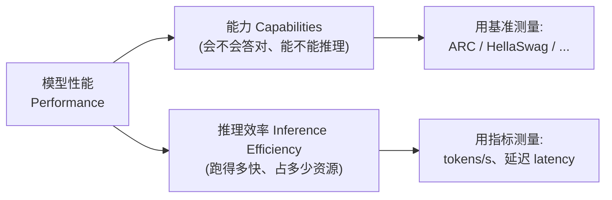
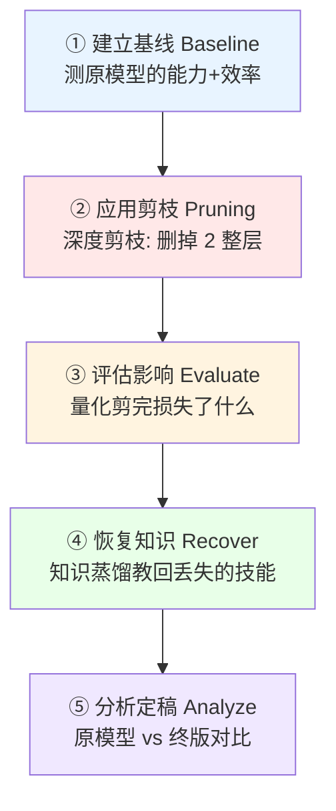
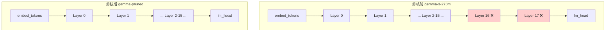
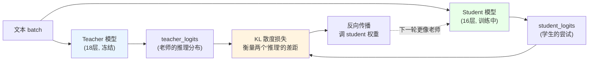
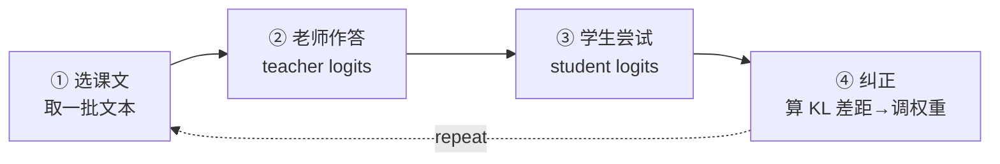
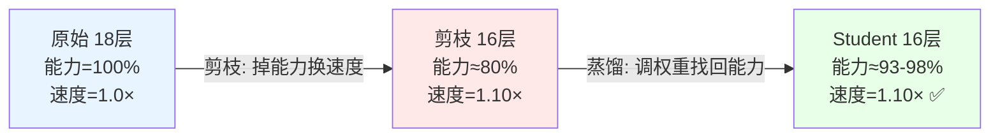
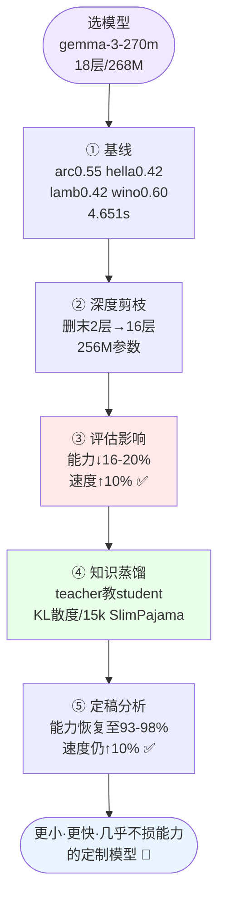

# 第 2 章 端到端重构项目（An End-to-End Rearchitecting Project）逐节精讲

> 本章对应原书《Rearchitecting LLMs》(Pere Martra, MEAP) 第 2 章，PDF 第 23–50 页。

---

## 🗺️ 本章地图（这章在全书的位置 & 读完能会什么）

第 1 章抛出了全书的核心方法论——**模型定制流水线（model-tailoring pipeline）**，它有三个阶段：

1. **结构优化（Structural Optimization）**：动模型的架构，让它更小更快；
2. **知识恢复（Knowledge Recovery）**：把大模型的知识"补"回被削弱的小模型；
3. **领域/任务定制（Task Tailoring）**：为具体场景微调（本书后面的章节才讲）。

第 1 章讲的是"为什么"和"是什么"，还很抽象。**第 2 章是全书第一个动手项目**，它把前两个阶段（结构优化 + 知识恢复）走一遍完整闭环，用一个真实的小模型（`google/gemma-3-270m`）现场演示：**选模型 → 剪层 → 评估损失 → 蒸馏恢复 → 对比定稿**。

作者刻意把"动手"放在"讲透理论"（第 3 章讲 Transformer 内部解剖、第 4 章讲怎么挑层剪、第 6 章讲知识蒸馏细节）**之前**。理由很朴素：先建立肌肉记忆和直觉，再回头填理论，你才不会被术语吓退。所以本章的定位是 **"先跑通全流程，把每个坑踩一遍"**，很多"为什么这样做"会在后面章节展开。

**读完本章你能做到：**

- 🎯 说清"重构一个 LLM"的**五步标准流程**，以及每一步产出什么、用什么工具；
- 🔧 亲手用 `transformers` 加载模型、检查它的层结构、剪掉最后 2 层（**深度剪枝 depth pruning**）；
- 📏 用 `lm-eval` 在 ARC-Easy / HellaSwag / LAMBADA / Winogrande 四个基准上量化**能力损失**，用推理时间量化**效率收益**；
- 🧑‍🏫 用**知识蒸馏（Knowledge Distillation, KD）**，以 KL 散度为损失，把大模型（teacher）的"推理分布"教给小模型（student），恢复 93%–98% 的能力；
- 📊 读懂"参数量 / 推理时间 / 各基准准确率"三维对比表，做出"值不值"的工程判断。

> 💡 **一句话本质**：重构 LLM = **先做减法（剪枝换来速度），再做补偿（蒸馏找回能力）**。全书后面所有花活，都是在这个"减—补"骨架上加精度。

---

## 2.0 为什么工业界这么干？（第一性原理）

> 🔬 **第一性原理：为什么不直接训练一个小模型，非要"大剪小 + 蒸馏"？**

原书在开篇给了一个极有说服力的产业实例（NOTE 框）：

> **NVIDIA** 把结构优化（剪枝）和知识恢复（蒸馏）组合起来生产它的模型家族（family），这样它**只需要完整训练家族里最大的那个模型**，其余尺寸都用"剪+蒸"派生。

这背后是三条硬约束：

| 约束 | 说明 | 为什么"剪+蒸"是解 |
|---|---|---|
| **训练成本** | 从零预训练一个模型要烧掉海量算力和数据 | 只训一次最大模型，其它尺寸"派生"，边际成本极低 |
| **知识浓度** | 小模型从零学，很难达到大模型的知识密度 | teacher 已把知识压进权重，student 直接"抄" |
| **产品矩阵** | 云端要大模型、手机要小模型，得覆盖多尺寸 | 一个 family 多尺寸，架构一致、行为一致，便于维护 |

所以"大剪小 + 蒸馏"不是学术玩具，而是 **NVIDIA、Google、Meta 造模型家族的标准工艺**。本章就是这套工艺的最小可运行示例（minimal working example）。

> 💡 **面试高频**：被问"如何得到一个又小又强的模型？"标准答案不是"训练一个小的"，而是"**从一个训好的大模型剪枝得到小模型，再用知识蒸馏恢复能力**"——这正是本章的主线。

---

## 2.1 重构工作流（The Rearchitecting Workflow）

原书先解决一个心理障碍：

> "我连架构都还没搞懂，怎么改它的结构？"——这很正常。所以我们**用一个纯实操的例子来祛魅（demystify）**，先熟悉流程，第 3 章再补理论。

### 📐 先厘清一个关键定义：什么叫"模型性能（performance）"？

原书给了一个**贯穿全书**的定义（务必记住），性能 = 两个同等重要的维度：



- **能力（Capabilities）**：模型的推理和答对能力，用 ARC、HellaSwag 这类基准（benchmark）测。
- **推理效率（Inference Efficiency）**：运行速度和资源占用，用 tokens/秒、延迟（latency）测。

> ⚠️ **常见坑**：很多人一提"性能"只想到"准确率"。在 LLM 重构里，**"性能"永远是"能力 × 效率"两条腿**。剪枝就是在拿一点能力去换效率——如果不同时盯住这两个数，你根本不知道自己赚了还是亏了。

### 🔁 五步工作流

结构优化 + 知识恢复这两个阶段，拆成 5 个具体步骤：



| 步骤 | 英文 | 干什么 | 产出 | 本章用什么工具 |
|---|---|---|---|---|
| ① 建立基线 | Establish a baseline | 测标准模型的性能，确定起点 | 一张"基线基准表" | `lm-eval` + 计时函数 |
| ② 应用剪枝 | Apply pruning | 主刀：删掉几整层（深度剪枝） | 一个更小的模型 | `nn.ModuleList` / `optiPfair` |
| ③ 评估影响 | Evaluate the impact | 量化剪完丢了哪些能力 | "剪枝 vs 基线"对比表 | `lm-eval` |
| ④ 恢复知识 | Recover the knowledge | 用知识蒸馏"教会"小模型 | 恢复后的 student 模型 | PyTorch 训练循环 + KL 散度 |
| ⑤ 分析定稿 | Analyze the final result | 原模型 vs 终版全面对比 | "恢复分析表" | `lm-eval` + 计时 |

> 💡 **实战心法**：这个五步是**通用模板**。无论你以后剪的是注意力头、MLP 中间维度还是量化，流程都是"**基线 → 干预 → 评估 → 恢复 → 定稿**"。记住这个循环，比记住某个具体技巧值钱得多。

### 🎯 选模型：为什么是 gemma-3-270m？

原书选了 **`google/gemma-3-270m`**（Google 的紧凑模型），理由有三：

1. **小（270M 参数）**：能在 Google Colab 免费档的最小 GPU——**T4**——上流畅跑；
2. **架构现代**：反映了当前架构趋势（第 3 章细讲），不是过时结构；
3. **甜蜜点**：够先进能演示真实优化技术，又够小方便动手。

> ⚠️ **访问门槛坑**：Gemma 家族在 Hugging Face Hub 上是 **gated（受限）访问**。要下载得两步走：① 去模型页面**接受许可条款**；② 在 notebook 里**认证**——在 Colab 里配一个名为 `HF_TOKEN` 的密钥，值是你的 HF User Access Token。忘了这步会直接 401/403 报错。

---

## 2.2 建立基线（Establishing the Baseline）

> 📏 **这一步的目标**：为原模型定一个性能基线。**没有清晰基线，你根本无法判断模型是变好了还是变差了、变了多少。**

### 🛠️ 第一步：装库

原书用 pip 一次装齐（版本号锁死，是为了可复现）：

```python
!pip install -q \
    "torch==2.8.0+cu126" \
    "transformers==4.55.4" \
    "accelerate==1.10.1" \
    "lm_eval==0.4.9.1" \
    "sentencepiece==0.2.1" \
    "sentence-transformers==5.1.0" \
    "optipfair==0.1.4"
```

**逐个说清每个库干嘛：**

| 库 | 作用 | 在本章哪一步用 |
|---|---|---|
| `torch` | 深度学习框架（张量、自动求导、训练） | 全程 |
| `transformers` | 从 HF Hub 加载模型/分词器 | 加载、生成 |
| `accelerate` | 自动把模型放到合适的设备（GPU/CPU） | 加载时 `device_map="auto"` |
| `lm_eval` | 标准化 LLM 评测框架（下载基准、格式化、算分） | 步骤①③⑤ |
| `sentencepiece` | 分词器底层（Gemma 用 SP 词表） | 分词 |
| `sentence-transformers` | 句向量（后续可能的分析辅助） | 辅助 |
| `optipfair` | 作者自研的开源剪枝/偏差分析库 | 步骤④用它一行剪枝 |

> 💡 **关于 optiPfair（原书专门开了个框讲）**：这是作者自己开发的**开源支持库（support library）**。作者反复强调：**本书的主旨是让你亲手写每个技术的核心代码、真正学懂概念**，`optiPfair` 只是用来**简化那些不是本章重点的重复/辅助代码**，让你专注核心逻辑。它也是一个**真实可用于生产的活跃开源项目**，欢迎去它的仓库探索、报 bug、提 PR。
>
> 换句话说：**核心逻辑自己手写一遍（2.2 节手动剪层），生产里用库封装（2.5 节用 `prune_model`）**——这就是本章"同一件事教两遍"的深意。

### 🛠️ 第二步：导包 + 验 GPU

```python
import torch
import torch.nn as nn
import torch.nn.functional as F
from transformers import AutoModelForCausalLM, AutoTokenizer
from optipfair.pruning.depth import prune_model_depth
from lm_eval import evaluator
from lm_eval.models.huggingface import HFLM
import time
import json

device = torch.device('cuda' if torch.cuda.is_available() else 'cpu')
print(f"Using device: {device}")
if torch.cuda.is_available():
    print(f"GPU: {torch.cuda.get_device_name(0)}")
```

**逐行解读：**

- `import torch.nn as nn`：`nn` 里有 `ModuleList` 等容器，剪层时要用（把新层列表包起来）。
- `import torch.nn.functional as F`：`F` 里有 `kl_div`、`log_softmax`、`softmax` 等**函数式**算子，蒸馏 loss 要用。
- `from transformers import AutoModelForCausalLM, AutoTokenizer`：`Auto*` 系列会根据模型名**自动**选对应的模型类和分词器类，不用你手动指定 `Gemma3ForCausalLM`。
- `from optipfair.pruning.depth import prune_model_depth`：导入 optiPfair 的深度剪枝函数。
- `from lm_eval ...`：评测框架的入口和 HF 模型适配器 `HFLM`。
- `device = torch.device('cuda' if ... else 'cpu')`：**有 GPU 用 GPU，没有退回 CPU**。这是标准写法。
- 输出应类似 `GPU: Tesla T4`。

> 🔬 **为什么剪枝能用 CPU、评测/蒸馏要用 GPU？**（原书专门点了）
> **剪枝本质是"删列表元素"**——把 18 层的 ModuleList 切成 16 层，几乎不涉及计算，CPU 秒完。而**建立基线的推理测试、跑基准评测、蒸馏训练**都要大量前向/反向传播（矩阵乘法），这些才是 GPU 大显身手的地方。所以后面 2.5 节作者会**专门换到第二个 notebook** 去做蒸馏（因为要 GPU 训练）。

### 🛠️ 第三步：加载模型

```python
MODEL_NAME = "google/gemma-3-270m"
model = AutoModelForCausalLM.from_pretrained(
    MODEL_NAME,
    device_map="auto"
)
tokenizer = AutoTokenizer.from_pretrained(MODEL_NAME)
if tokenizer.pad_token is None:
    tokenizer.pad_token = tokenizer.eos_token
```

**逐行解读：**

- `device_map="auto"`：注意——前面我们已经手动探测过 `device`，但**加载模型时改用 `device_map="auto"`**。这样 `accelerate` 会**自动优化模型在内存里的摆放**，必要时甚至把不同层拆分到 GPU 和 CPU 上。对大模型这很关键，对 270M 小模型则是"顺手"。
- `AutoTokenizer.from_pretrained(...)`：加载配套分词器（把文本 ↔ token id 互转）。
- `if tokenizer.pad_token is None: tokenizer.pad_token = tokenizer.eos_token`：**很多生成式模型没有专门的 pad token**（因为生成不需要 padding）。但我们后面批量处理时需要 padding，所以**借用 eos（句末）token 当 pad token**。这是一个几乎所有 LLM 代码都会写的"标准补丁"。

> ⚠️ **常见坑**：忘了设 `pad_token` → 后面 `tokenizer(..., padding=...)` 会直接报错 `Asking to pad but the tokenizer does not have a padding token`。记住这三行是"防坑咒语"。

### 🔍 第四步：检查内部结构（关键！）

改结构之前，必须先看清模型长什么样：

```python
original_params = sum(p.numel() for p in model.parameters())
print(f"Total parameters: {original_params}")
print(f"Original layers: {len(model.model.layers)}")
print("=" * 20)
print(model)
```

**逐行解读：**

- `sum(p.numel() for p in model.parameters())`：遍历所有参数张量，`p.numel()` 数它的元素个数，加总 = **总参数量**。
- `len(model.model.layers)`：`model.model.layers` 是**装 Transformer 块的容器**，取长度 = **层数**。
- `print(model)`：打印完整结构树。

**输出（Listing 2.1，Gemma3 模型结构）关键信息：**

```
Total parameters: 268098176      #A  ← 约 2.68 亿参数
Original layers: 18              #B  ← 18 层
====================
Gemma3ForCausalLM(
  (model): Gemma3TextModel(
    (embed_tokens): Gemma3TextScaledWordEmbedding(262144, 640, ...)   ← 词嵌入
    (layers): ModuleList(
      (0-17): 18 x Gemma3DecoderLayer(          ← 18 个解码器块 (核心!)
        (self_attn): Gemma3Attention(
          (q_proj): Linear(in=640, out=1024, ...)   ← Query 投影
          (k_proj): Linear(in=640, out=256,  ...)   ← Key 投影 (注意 256 < 1024!)
          (v_proj): Linear(in=640, out=256,  ...)   ← Value 投影
          (o_proj): Linear(in=1024, out=640, ...)   ← 输出投影
          (q_norm): Gemma3RMSNorm((256,), eps=1e-06)
          (k_norm): Gemma3RMSNorm((256,), eps=1e-06)
        )
        (mlp): Gemma3MLP(
          (gate_proj): Linear(in=640, out=2048, ...)   ← 门控投影
          (up_proj):   Linear(in=640, out=2048, ...)   ← 上投影
          (down_proj): Linear(in=2048, out=640, ...)   ← 下投影
          (act_fn): PytorchGELUTanh()                  ← 激活函数
        )
        (input_layernorm):            Gemma3RMSNorm((640,), eps=1e-06)
        (post_attention_layernorm):   Gemma3RMSNorm((640,), eps=1e-06)
        (pre_feedforward_layernorm):  Gemma3RMSNorm((640,), eps=1e-06)
        (post_feedforward_layernorm): Gemma3RMSNorm((640,), eps=1e-06)
      )
    )
    (norm): Gemma3RMSNorm((640,), eps=1e-06)
    (rotary_emb):       Gemma3RotaryEmbedding()
    (rotary_emb_local): Gemma3RotaryEmbedding()
  )
  (lm_head): Linear(in=640, out=262144, bias=...)   ← 输出头 (映射回词表)
)
```

**现在只需盯住两个数：`268098176`（参数）和 `18`（层）。** 其它组件（GQA 的非对称 K/V 投影、GLU 风格的 MLP、RMSNorm、旋转位置编码 RoPE）都是第 3 章的主菜，本章先不展开。

> 💡 **术语提醒**：原书说 `18 x Gemma3DecoderLayer` 这些叫 **"层（layer）"** 还是 **"块（block）"**？技术上有区别（第 3 章讲），但**本章按惯例统一叫"层"**。你心里知道"这里的一层 = 一个完整的 Transformer 解码器块（含注意力 + MLP + 几个 Norm）"就行。

### 🧪 第五步：冒烟测试（sanity check）——它能好好说话吗？

原书封装了一个复用函数 `generate_text`：

```python
def generate_text(model, tokenizer, prompt, max_new_tokens):
    inputs = tokenizer(prompt, return_tensors='pt').to(device)
    with torch.no_grad():
        outputs = model.generate(
            inputs['input_ids'],
            attention_mask=inputs['attention_mask'],
            max_new_tokens=max_new_tokens,
            num_return_sequences=1,
            pad_token_id=tokenizer.pad_token_id,
            do_sample=False,        # 关掉随机采样
            num_beams=3,            # 用 beam search
            no_repeat_ngram_size=2  # 不重复 2-gram
        )
    return tokenizer.decode(outputs[0], skip_special_tokens=True)
```

**逐行/逐参数解读（这些生成参数是"确定性 + 高质量"的经典配方）：**

- `tokenizer(prompt, return_tensors='pt').to(device)`：文本 → PyTorch 张量（`'pt'` = PyTorch），并搬到 GPU。
- `with torch.no_grad()`：**推理不需要梯度**，关掉能省显存、加速。
- `max_new_tokens`：最多生成多少新 token。
- `do_sample=False`：**关闭随机采样**。目的是让测试**确定性（deterministic）**——每次调用返回相同结果，方便对比。
- `num_beams=3`：改用 **束搜索（beam search）**。它同时探索 3 条可能序列而不是只走一条，产出**更连贯、更高质量**的文本。
- `no_repeat_ngram_size=2`：禁止连续重复同一个 2-token 序列，**防止模型"复读机"式循环**。
- `tokenizer.decode(..., skip_special_tokens=True)`：token id → 文本，并跳过 `<eos>` 等特殊符号。

**调用测试：**

```python
MAX_NEW_TOKENS = 50
TEST_PROMPT = "Paris is the capital of"
generated_text = generate_text(model, tokenizer, TEST_PROMPT, MAX_NEW_TOKENS)
print(f"Prompt: '{TEST_PROMPT}'")
print(f"Generated Text: '{generated_text}'")
```

**基线模型的回答（贯穿全章的"巴黎测试"⭐）：**

> *Paris is the capital of France. It is located in the middle of the country and has a population of about 10 million people. Paris is a city with a rich history and culture...*

**怎么读这段输出？**
- ✅ **语言连贯**、基本知识正确（巴黎是法国首都）；
- ❌ 但也有**事实错误**（"位于国家中部""约 1000 万人口"都不准）。

原书借此点明一个重要事实：**这么小的模型（SLM, small language model），在没有专门适配的情况下，通用领域的精确事实召回本来就弱。** 但对这个尺寸的基座模型来说，**整体结构和连贯性合理，足以当基线**。

> 💡 **贯穿全书的"巴黎例子"**：这个 `"Paris is the capital of"` 提示会在本章出现 **3 次**——基线（现在）、剪枝后（2.4 节）、蒸馏恢复后（2.6 节）。它是一把**定性的直觉标尺**：让你不用看数字，也能"肉眼"感受模型退化和恢复。**记住这三段巴黎回答的变化，就抓住了本章的灵魂。**

### 📊 第六步：跑四个基准，量化能力

冒烟测试只是定性。要**定量**就得上基准。原书选了 **4 个基准**：

| 基准 | 全称 / 测什么 | 一句话 |
|---|---|---|
| **ARC-Easy** | AI2 Reasoning Challenge (Easy) | 小学科学题，测**推理 + 事实知识** |
| **Winogrande** | 大规模 Winograd | 消解代词指代歧义，测**常识** |
| **HellaSwag** | — | 四选一选最合理的情境续写，测**常识推理** |
| **LAMBADA** | LAnguage Modeling Broadened... | 预测一段话的**最后一个词**，测**长程叙事理解** |

> 💡 原书 NOTE：本可以再加 **GSM8K**（数学）、**MMLU**（多领域知识）、**BoolQ**（阅读理解 yes/no）等。但对本章"**控制剪枝退化 + 评估蒸馏恢复**"这个目标，这 4 个已经够用。**选基准要贴合你的目标，不是越多越好。**

**用 `lm-eval` 评测：**

```python
benchmark_tasks = ['arc_easy', 'winogrande', 'hellaswag', 'lambada_openai']
baseline_results = model_evaluation(model, tokenizer, benchmark_tasks, limit=100)
```

- `lm-eval` = **LLM 的自动化测试框架**（原书类比 "automated testing harness"）。它在幕后干这些脏活累活：**下载标准数据集 → 把题目格式化成提示 → 喂给模型 → 根据回答算准确率**。
- `model_evaluation` 是作者封装的辅助函数，输入模型 + 任务列表，返回干净结果。
- `limit=100`：**每个基准只取 100 行样本**来加速。

> ⚠️ **常见坑（评测的可信度）**：`limit=100` 是**为了 demo 提速**。想要更可靠的评测，把 `limit` 调大或设成 `None`（跑全量）——但代价是**评测可能要几个小时**。**基准分数的置信度和样本量正相关**，论文级结论别用 100 条就下。

**基线结果（记住这四个数，后面全在跟它比）：**

| arc_easy | hellaswag | lambada_openai | winogrande |
|---|---|---|---|
| **0.55** | **0.42** | **0.42** | **0.60** |

### ⏱️ 第七步：测推理效率

原书用 `measure_inference_time`（书里没贴代码），逻辑是：**GPU 预热（warm-up）后，跑一批测试提示，返回平均时间 ± 偏差**。

> ⚠️ **常见坑（时间不稳定）**：原书专门提醒——**推理时间每次跑都可能明显不同**，取决于运行环境。即使同一环境的不同 run 也会有差异，尤其在 Colab 这种**共享 GPU** 上（别人也在用同一块卡）。所以时间数字要看**平均 ± 偏差**，别拿单次结果当真理。

**为什么用"预热"？** 第一次前向传播要初始化 CUDA 上下文、编译 kernel、分配显存，**天然慢**。不预热就计时，会把这些一次性开销算进去，严重高估延迟。

### 📋 基线汇总（Table 2.1）

| model | arc_easy | hellaswag | lambada_openai | winogrande | inference (秒) |
|---|---|---|---|---|---|
| **gemma-3-270m** | 0.55 | 0.42 | 0.42 | 0.60 | **4.651 ± 0.213** |

> ✅ **至此，我们有了一个"清晰、可量化的起点"**：2.68 亿参数、18 层、四个能力分数、一个效率数字。**下面才能操刀。**

---

## 2.3 应用深度剪枝（Applying Depth Pruning）

> ✂️ 第一次重构。选了最直接、强力、简单的方式：**删层来改深度——所以叫"深度剪枝（depth pruning）"。**

**目标：18 层 → 16 层。**



### 🤔 删哪几层？——本章的关键选择

原书直面这个"深度剪枝的核心问题"：删**前面**的、**中间**的、还是**最后**的层？

- **本章的选择：删最后两个 Transformer 块（layer 16 和 17）。**
- **假设（hypothesis）**：**最后几层高度专门化于打磨输出的细微差别（refining nuances）**，删掉它们，也许能**保住模型更通用的知识**。

> ⚠️ 原书**明确警告**：这**不一定是最优策略**！这只是一个"优秀的、简单的**起点**"，用来学流程。**第 4 章**会发展出技术去**识别哪些层才是理想的剪枝候选**，在能力和效率间取得最佳平衡。**本章聚焦"怎么剪（how）"，第 4 章才讲"剪哪个（which）"。**

### 🛠️ 手动剪层（核心逻辑，务必手写一遍）

**第一步：深拷贝，保留原模型。**

```python
import copy
pruned_model = copy.deepcopy(model)
```

- 为什么要 `deepcopy`？**因为知识恢复阶段需要"原模型（teacher）+ 剪枝模型（student）"两个都在场**。如果直接改 `model`，就没有 teacher 了。`deepcopy` 是**完整独立复制**，改 `pruned_model` 不影响 `model`。

**第二步：切列表，只留前 16 层。**

```python
LAYERS_TO_REMOVE = 2
original_layers_count = len(pruned_model.model.layers)   # 18
new_layers_count = original_layers_count - LAYERS_TO_REMOVE  # 16
new_layers = pruned_model.model.layers[:new_layers_count]    # 取索引 0~15
```

- 原书点破关键：`pruned_model.model.layers` 是一个**特殊的 PyTorch 容器（`ModuleList`），但它的行为跟 Python list 一模一样**——能取 `len()`、能切片。所以**剪层本质就是"列表切片"**，简单到不可思议。
- `[:16]` 保留索引 0–15（前 16 层），**丢掉 16、17（最后两层）**。

**第三步：装回模型 + 更新配置。**

```python
pruned_model.model.layers = nn.ModuleList(new_layers)
pruned_model.config.num_hidden_layers = len(pruned_model.model.layers)
```

**逐行解读（这两行是"坑最多"的地方）：**

- `nn.ModuleList(new_layers)`：**不能直接把 Python list 赋值回去**！必须用 `nn.ModuleList` 包起来。为什么？因为 `ModuleList` 会**把每一层注册为模型的子模块（submodule）**。只有注册了，PyTorch 才能**识别这些参数、训练它们、正确地搬到 GPU**。直接赋普通 list，PyTorch 会"看不见"这些层。
- `pruned_model.config.num_hidden_layers = ...`：更新 `.config`。原书类比 **`.config` 是模型的"内部说明书（instruction manual）"**——记录层数、嵌入维度、注意力头数等，PyTorch 和 transformers 库会去**查阅**它。**如果配置和实际结构不一致**，模型试图用"已经不存在的信息"时就会报错。所以**改了结构必须同步改 config**。

> ⚠️ **常见坑（两个都要做，缺一不可）**：
> 1. 忘了 `nn.ModuleList` 包裹 → 参数不注册，训练/搬 GPU 出错；
> 2. 忘了改 `config.num_hidden_layers` → 配置与结构不符，某些操作崩溃。
> **"包 ModuleList + 改 config" 是深度剪枝的两条铁律。**

### 📉 剪完了，参数少了多少？——一个反直觉的数字

> **"就这？"** 对，你已经完成了第一次模型重构。现在是 **16 层、2.56 亿参数——尺寸减少了 4.16%。**

**等等——删了 2/18 = 11% 的层，参数怎么才少 4.16%？**（原书专门解释这个反直觉点）

原因：**模型还有 Transformer 层之外的大块组件。** 回看 Listing 2.1：

- **开头的 `embed_tokens`**（词嵌入）：`262144 × 640` ≈ **1.68 亿参数**！
- **结尾的 `lm_head`**（输出头）：`640 × 262144` ≈ **1.68 亿参数**（Gemma 常做 tie-weights 共享，但概念上同量级的大矩阵）。

这俩**巨型矩阵在删层时纹丝不动**。它们占了总参数的绝大头，所以**删几个中间层，对总参数量的撬动有限**。

> 🔬 **第一性原理（极其重要的直觉）**：**Transformer 的参数不是均匀分布在各层的。** 词表越大（Gemma 词表高达 26 万），embedding 和 lm_head 就越"重"。**深度剪枝主要买的是"计算/延迟"，而不是"参数量"**——因为每删一层，前向传播就少走一遍注意力 + MLP 的矩阵乘法，**速度立竿见影，但参数账面变化小**。理解这一点，你就懂为什么"删 11% 层只省 4% 参数，却能省 10% 时间"。

**结构差异只有一行：**

```
(0-15): 16 x Gemma3DecoderLayer     ← 从 18 x 变成 16 x
```

---

## 2.4 评估剪枝的影响（Evaluating the Impact of Pruning）

> 🔍 现在看看删掉最后两层，我们**丢了什么、赚了什么**。注意：目前**只做了"变轻"这一个动作，还没做任何恢复/适配**。

### 🧪 定性：再问一次巴黎

同样的提示 `"Paris is the capital of"`，**剪枝后**的回答：

> *Paris is the capital of France and one of the largest cities in Europe. It occupies approximately **2.5 million hectares** of land surrounded by **mountains and forests**. Parisians love to travel abroad because they enjoy sightseeing tours abroad...*

**怎么读？**
- ✅ 仍然**连贯**，仍然**知道巴黎是法国首都**（核心知识还在）；
- ❌ 但**事实退化明显**：幻觉出"占地 250 万公顷""被山脉和森林环绕"（都是**编的**）；
- ❌ **发散、跑题**：讲着讲着扯到"巴黎人爱出国旅游"，比原模型更容易**失焦（loses focus）**。

原书总结：**如果不跟原模型对比，你会觉得这就是个正常 SLM 的回答。但一对比，退化的迹象很清楚。**

### 📊 定量：同一套基准再跑一遍

```python
pruned_results = model_evaluation(pruned_model, tokenizer, benchmark_tasks, limit=100)
```

**结果（arc_easy: 0.46, hellaswag: 0.34, lambada_openai: 0.34, winogrande: 0.48）全面低于基线。**

### 📋 剪枝 vs 基线（Table 2.2）

| Metric / Model | gemma-3-270m | gemma-pruned | Change |
|---|---|---|---|
| **Parameters** | 268,098,176 | 256,950,912 | **-4.16%** |
| **Inference Time** | 4.651s | 4.181s | **+10.1% 更快** ✅ |
| **arc_easy** | 0.55 | 0.46 | **-16.36%** ❌ |
| **winogrande** | 0.60 | 0.48 | **-20%** ❌ |
| **hellaswag** | 0.42 | 0.34 | **-19.05%** ❌ |
| **lambada_openai** | 0.42 | 0.34 | **-19.05%** ❌ |

**一句话战报：我们造了个"小 4.16%、快 10%"的模型，代价是"各基准掉了 16%–20%"。**

```python
pruned_timing = measure_inference_time(pruned_model, tokenizer, speed_test_prompts)
# 推理时间从 4.651s 降到 4.181s → 确实更快了
```

> 💡 **工程判断力（本章最重要的思维）**：现在的状态是 **"用 ~18% 的能力，换了 10% 的速度 + 4% 的体积"**——**这笔买卖单看是亏的！** 但故事没完。下一步的知识蒸馏会**在不动架构（保住速度）的前提下，把能力大部分找回来**。**剪枝制造"速度红利"，蒸馏回收"能力欠债"**——两步合起来才是净赚。

> 🔬 **关键洞察**：蒸馏**"不碰架构，只调现有权重"**。所以剪枝赚到的速度**一分不丢**，我们只是在这个更快的骨架上，把权重重新调教得"更聪明"。

---

## 2.5 恢复知识（Recovering Knowledge）——知识蒸馏

> 🧑‍🏫 第一个重构循环里**最有成就感的一步**：把丢掉的知识补回来。

### 🖥️ 为什么换到第二个 notebook？

原书把这一步搬到 `CH02_NB02_Knowledge_Recovery.ipynb`，理由纯实用：

- **剪枝**是轻量结构操作，CPU 都能干；
- **知识恢复要训练（training）**，需要**大得多的算力，必须上 GPU**。

> 📌 本章的模型是这么炼成的（原书 NOTE）：**删了 2 层，用 SlimPajama 数据集的 15,000 行做训练恢复。**

### 🎓 什么是知识蒸馏（Knowledge Distillation, KD）？

一个当 **老师（teacher）**、一个当 **学生（student）**：

| 角色 | 是谁 | 特点 |
|---|---|---|
| **Teacher（老师）** | 原始 18 层 gemma-3-270m | 专家，握有全部要传授的知识 |
| **Student（学生）** | 16 层剪枝模型 | 更快更轻，但需要找回丢失的技能 |

> 🎯 **KD 的核心目标（务必吃透这句话）**：让 student **模仿 teacher 的完整预测分布（full prediction distribution）**——**不只是最终答案，而是"它对其它可能性有多自信"**。通过匹配这些概率模式，student 实际上是在**模仿 teacher 的推理过程**，而不是死记答案。

> 🔬 **第一性原理：为什么学"分布"比学"答案"强？**
> 假设问"巴黎是____的首都"。teacher 的输出可能是 `{France: 0.85, Europe: 0.06, French: 0.03, ...}`。这个"软标签（soft label）"里藏着**远比"答案是 France"丰富的信息**：它告诉 student "France 最对，但 Europe 也有点沾边，French 是相关词"——这些**类别间的相似度结构（dark knowledge，暗知识）**，正是 teacher 泛化能力的来源。只学硬标签 `France` 就丢了这些。**这就是蒸馏比重新训练更省数据、更高效的根本原因。**

### 🛠️ 用 optiPfair 一行剪枝（生产写法）

2.2 节我们**手动**改 `ModuleList` 学了原理，这里换用库封装：

```python
teacher_model = AutoModelForCausalLM.from_pretrained(MODEL_NAME, device_map="auto")
tokenizer = AutoTokenizer.from_pretrained(MODEL_NAME)

student_model = prune_model(                        # A
    model=copy.deepcopy(teacher_model),             # A  传 teacher 的副本，将被改造成 student
    pruning_type="DEPTH",                           # A  剪枝类型：删整层
    num_layers_to_remove=LAYERS_TO_REMOVE,          # A  删几层
    layer_selection_method="last",                  # A  从末尾删（延续之前策略）
    show_progress=True                              # A  显示进度
)
```

**逐参数解读：**
- `model=copy.deepcopy(teacher_model)`：传 teacher 的**副本**去改造成 student（保住 teacher）。
- `pruning_type="DEPTH"`：指定**删整层**（深度剪枝）。
- `num_layers_to_remove`：删几层。
- `layer_selection_method="last"`：**从模型末尾删**，延续 2.3 节"删最后两层"的策略。
- `prune_model` 封装的就是 2.2 节手动做的事，**外加进度追踪等便利功能，让工作流更干净、更健壮**。

### 📚 准备"学习材料"：SlimPajama 数据集

要教学生，得有课本。因为造的是**通用模型**、关心**所有基准**，所以用**通用大语料 SlimPajama** 的一个子集：

```python
from datasets import load_dataset
dataset = load_dataset(
    "MBZUAI-LLM/SlimPajama-627B",
    split="train",
    streaming=True   # A  流式加载，不一次性下全部
)
RECOVERY_SAMPLES = 15000                       # B
distillation_dataset = dataset.take(RECOVERY_SAMPLES)  # 取前 15000 行
```

- `streaming=True`：**流式加载**——SlimPajama-627B 有 6270 亿 token，不可能全下。流式模式**按需拉取**。
- `dataset.take(15000)`：只取 15,000 行做蒸馏。

> 💡 **为什么恢复通用能力要用通用语料？** 因为我们没有针对某个特定任务，而是要在**四个基准上全面恢复**。用通用语料（web + 书 + 代码的混合）覆盖面广，才能把 teacher 的"通才知识"整体传给 student。**如果只想在 LAMBADA 上恢复，就该换成偏向那个任务的数据**（这正是 2.7 节实验室的进阶题）。

### 🔧 数据管线三步走：文本 → 可训练的 batch

**第一步：分词（tokenization）。**

```python
def tokenize_for_kd(examples, max_length=128):
    texts = [ex["text"] for ex in examples]
    tokenized = tokenizer(
        texts,
        padding="max_length",     # 补齐到固定长度
        truncation=True,          # 超长截断
        max_length=max_length,    # 固定 128
        return_tensors="pt"
    )
    return {
        "input_ids": tokenized["input_ids"],
        "attention_mask": tokenized["attention_mask"],
        "labels": tokenized["input_ids"].clone()   # 标签 = 输入的副本
    }

recovery_samples = list(distillation_dataset)
tokenized_data = tokenize_for_kd(recovery_samples)
```

**逐行解读：**
- `texts = [ex["text"] for ex in examples]`：从每行取出 `text` 字段。
- `padding="max_length"` + `max_length=128`：**所有样本补/截到 128 token**，这样能堆成规整的张量。
- `truncation=True`：超过 128 的截断。
- `return_tensors="pt"`：返回 PyTorch 张量。
- **产出三个张量**：
  - `input_ids`：文本的数字表示（每个 token → 词表里的唯一编号）；
  - `attention_mask`：一串 0/1，**1 = 真实 token，0 = padding 填充**，告诉模型别理会 padding；
  - `labels`：这里等于 `input_ids.clone()`——**自监督语言建模**的标准做法（预测下一个 token，标签就是输入本身错位）。

**第二步：包成 Dataset 类。**

```python
class KDDataset(torch.utils.data.Dataset):
    def __init__(self, tokenized_data):
        self.input_ids = tokenized_data["input_ids"]
        self.attention_mask = tokenized_data["attention_mask"]
        self.labels = tokenized_data["labels"]
    def __len__(self):
        return len(self.input_ids)
    def __getitem__(self, idx):
        return {
            'input_ids': self.input_ids[idx],
            'attention_mask': self.attention_mask[idx],
            'labels': self.labels[idx]
        }

kd_dataset = KDDataset(tokenized_data)
```

- 继承 `torch.utils.data.Dataset` 必须实现 `__len__`（数据集大小）和 `__getitem__`（按索引取一条）。这是 PyTorch 数据加载的**标准协议**。

**第三步：DataLoader，自动打乱 + 分批。**

```python
kd_dataloader = DataLoader(
    kd_dataset,
    batch_size=8,     # A  每批 8 条
    shuffle=True      # 打乱顺序
)
```

- `batch_size=8`：每次喂 8 条给模型（**batch 训练**，比逐条快、梯度更稳）。
- `shuffle=True`：每个 epoch 打乱数据顺序，**防止模型记住数据的排列顺序**。

### 🧠 蒸馏的损失函数：KL 散度（KL Divergence）

**怎么衡量 teacher 和 student 两个分布的差距？** 用信息论的**Kullback-Leibler 散度（KL divergence）**。

> 💡 原书的绝妙类比：**把 KL 散度想成"惊讶度（surprise）"**——衡量两个概率分布的差异。
> - student 的预测概率**很接近** teacher → KL **低**（没啥惊讶）；
> - 两者**差很多** → KL **高**。
>
> **蒸馏的目标 = 调 student 权重，最小化这个 KL 散度**，逼着 student 的概率分布向 teacher 靠拢。

### 🔁 知识蒸馏循环（Figure 2.3）



**一个 batch 一次的"教学循环"，就四步：**



### 🛠️ 逐 Listing 手写训练循环（本章代码高潮）

**Listing 2.2　第①步：选课文（取一个 batch）**

```python
input_ids = batch['input_ids'].to(device)
attention_mask = batch['attention_mask'].to(device)
```

- 从 DataLoader 取一批，把 `input_ids` 和 `attention_mask` **搬到同一设备（GPU）**，准备处理。
- 复习：`input_ids` = 文本的数字表示（每个 token 一个唯一编号）；`attention_mask` = 1/0 标记（1 真实词、0 padding），让模型**不去注意 padding**。

**Listing 2.3　第②步：老师作答（拿 teacher 的 logits）**

```python
with torch.no_grad():
    teacher_outputs = teacher_model(
        input_ids=input_ids,
        attention_mask=attention_mask
    )
    teacher_logits = teacher_outputs.logits
```

- **关键：`with torch.no_grad()`** 包住 teacher 的前向。含义：**不给 teacher 算梯度**——因为**我们不训练 teacher，只训练 student**。
- 关掉梯度带来两个好处：**省大量 GPU 显存**、**明显更快**（跳过所有训练相关计算）。
- `logits` = 模型输出的**原始分数**（还没过 softmax），维度是 `[batch, seq_len, vocab_size]`——对词表里每个 token 的"打分"。

**Listing 2.4　第③步：学生尝试（拿 student 的 logits）**

```python
student_outputs = student_model(
    input_ids=input_ids,
    attention_mask=attention_mask
)
student_logits = student_outputs.logits
```

- 代码几乎和 Listing 2.3 一样，只换了模型——**但有一个巨大区别：没有 `torch.no_grad()` 块！**
- **为什么？** 因为我们**要训练 student**，所以必须让 PyTorch **计算 student 的梯度**（后面才能 `backward()` 更新它）。

> ⚠️ **常见坑（本章最容易错的地方）**：
> - teacher **必须** `torch.no_grad()`（不训练它，省显存/提速）；
> - student **绝不能** `torch.no_grad()`（要训练它，需要梯度）。
> **这一"有"一"无"，是整个蒸馏循环正确性的命门。搞反了要么训练不动，要么显存爆炸。**

**Listing 2.5　第④步：纠正（算 KL + 更新权重）**

```python
optimizer = AdamW(student_model.parameters(), lr=1e-5)   # A

loss = F.kl_div(
    F.log_softmax(student_logits, dim=-1),   # 学生：log 概率
    F.softmax(teacher_logits, dim=-1),       # 老师：概率
    reduction='batchmean'
)
loss.backward()        # B  反向传播，算梯度
optimizer.step()       # C  按梯度更新 student 权重
optimizer.zero_grad()  # D  清空梯度，准备下一批
```

**逐行深挖（这是全章最核心的 8 行）：**

- `optimizer = AdamW(student_model.parameters(), lr=1e-5)`：
  - **优化器（optimizer）= "学习引擎"**（原书类比）。它拿着我们算出的误差，**决定怎么调每个权重去减小误差**。
  - **只传 `student_model.parameters()`**——只更新学生，不动老师。
  - `AdamW`：LLM 训练的**事实标准**优化器。
  - `lr=1e-5`：**学习率**，控制每步调整的幅度。太大会震荡发散，太小学得慢。

- `F.kl_div(...)`：计算 teacher 和 student 两个"推理"（logits）的"距离"。**注意两个输入的非对称性（极易错）**：
  - **第一个参数要传 `log_softmax`（对数概率）**——PyTorch 的 `kl_div` 约定 student 侧用 log 空间；
  - **第二个参数传 `softmax`（普通概率）**——teacher 侧用概率空间；
  - `dim=-1`：在**词表维度**上做 softmax（对每个位置的所有候选 token 归一化）；
  - `reduction='batchmean'`：对整个 batch 取平均（这是 KL 散度**数学上正确**的归约方式）。

- `loss.backward()`：**反向传播**，沿计算图算出 loss 对每个 student 参数的梯度。
- `optimizer.step()`：优化器**按梯度更新** student 权重——让它"更像老师"一点点。
- `optimizer.zero_grad()`：**清空梯度**。PyTorch 梯度默认累加，不清零下一批会把梯度叠加，训练就错了。

> ⚠️ **常见坑（KL 参数顺序 + log/prob 空间）**：
> `F.kl_div(input, target)` 里 **`input` 必须是 log-probabilities，`target` 是 probabilities**。写成 `F.kl_div(F.softmax(student), F.softmax(teacher))`（都用 softmax）是**经典错误**——数值会算错甚至出 NaN。**记死："学生 log_softmax，老师 softmax"。**

> ⚠️ **常见坑（四件套顺序）**：`backward → step → zero_grad` 顺序不能乱，且 `zero_grad` 别漏。漏了 `zero_grad`，梯度跨 batch 累加，loss 会诡异地不下降。

**训练循环整体：** 上面 Listing 2.2–2.5 组成循环的心脏，**每个 batch 跑一遍**，整个循环再重复若干 **epoch（对整个数据集的完整遍历）**。**几个 epoch 后，student 就内化了 teacher 的大部分知识，学会模仿它的推理方式。**

> 💡 原书两次预告：**第 6 章会详细展开完整的 KD 循环**（本章是"logits-only"最简版：student 直接匹配 teacher 的概率分布）。本章的目标是先跑通，不追求最优。

---

## 2.6 分析最终结果（Analyzing the Final Result）

> 🏁 **见证时刻。** 跑同一套评测，看 student 恢复了多少。

### 📋 知识恢复分析（Table 2.3）⭐ 本章最重要的表

| Metric / Model | gemma-3-270m<br/>(原始) | gemma-pruned<br/>(剪枝后) | Student<br/>(蒸馏后) | 保留能力<br/>剪后 / 蒸后 |
|---|---|---|---|---|
| **Parameters** | 268,098,176 | 256,950,912 | 256,950,912 | **-4.16%** |
| **Inference Time** | 4.651s | 4.181s | 4.181s | **10.1% 更快** ✅ |
| **arc_easy** | 0.55 | 0.46 | **0.52** | 83.64 / **94.5%** |
| **winogrande** | 0.60 | 0.48 | **0.58** | 80 / **96.7%** |
| **hellaswag** | 0.42 | 0.34 | **0.41** | 80.95 / **97.6%** |
| **lambada_openai** | 0.42 | 0.34 | **0.39** | 80.95 / **92.9%** |

**怎么读这张表（三列的故事）：**

1. **第 1 列（原始）→ 第 2 列（剪枝后）**：能力**掉到 80%–84%**（跌了 16%–20%）——这是剪枝的代价。
2. **第 2 列（剪枝后）→ 第 3 列（蒸馏后）**：能力**回升**——arc 0.46→0.52、winogrande 0.48→0.58、hellaswag 0.34→0.41、lambada 0.34→0.39。
3. **最后一列**：相对**原始模型**，蒸馏后**保留了 93%–98% 的能力**！
4. **参数和推理时间**：第 2、3 列**完全相同**——因为**蒸馏只调权重、不动架构**，所以**剪枝赚的速度和体积一分不丢**。

> ✅ **原书的定稿评语**：对一个"只用了标准通用知识数据集的一部分（15000 行）"的过程来说，**结果非常好——在所有受控基准上恢复了原模型 93%–98% 的能力**。



### 🧪 最后一测：再问一次巴黎（贯穿全章的收尾）

**蒸馏后**的回答：

> *Paris is the capital of France and one of the most famous cities...*

**变化：**
- ✅ **山没了**——剪枝模型幻觉的"被山脉环绕"消失了；
- ⚠️ 仍有一处**关于城市大小的严重混淆**（不能既是欧洲最大又是法国第三）；
- 原书评：**若不是那处大小错误，这个回答就是"事实且合乎逻辑，与基座模型不相上下"了。**

> 💡 **三段巴黎回顾（本章灵魂）：**
> | 阶段 | 巴黎回答的特征 |
> |---|---|
> | 基线（原始） | 连贯，知道是法国首都，有小事实错（人口/位置） |
> | 剪枝后 | 幻觉冒出（"250万公顷""被山环绕"），发散跑题 |
> | 蒸馏后 | 山消失了，回归连贯，仅剩一处大小混淆 |
>
> **这条定性曲线，和 Table 2.3 的定量曲线完全吻合——退化，然后恢复。**

---

## 2.7 动手实验室（Hands-on Lab）

原书鼓励你**别只跑代码，去改它，建立对权衡的直觉**。给了几个实验方向：

| 实验 | 怎么做 | 要回答的问题 |
|---|---|---|
| **① 改剪枝层数** | 改 `LAYERS_TO_REMOVE`，试删 4、6 层甚至更多 | 更激进的剪枝丢多少能力？同样的蒸馏数据能恢复多少？ |
| **② 改恢复数据量** | 改 `RECOVERY_SAMPLES`，试 5000 vs 15000 vs 30000 | 数据量对恢复的边际效应？有没有"加数据不再显著提升"的拐点？ |
| **③ 改选层策略** | `layer_selection_method="first"`（删前面层）；或传 `layer_indices=[2,5,8]` 删指定非相邻层 | 删前面的层是不是比删中间/末尾更伤知识？ |
| **④ 换专用数据集（进阶）** | 把蒸馏数据换成贴合某个基准的数据 | 用偏向 LAMBADA 的数据能否超过它的恢复率？会不会拖累其它基准？ |

**③ 的代码示例（删指定层）：**

```python
student_model = prune_model(
    model=copy.deepcopy(teacher_model),
    pruning_type="DEPTH",
    layer_indices=[2, 5, 8],   # 直接指定删第 2、5、8 层
    show_progress=True
)
```

> 💡 **面试高频思考题**：实验②本质在问"**蒸馏恢复的数据效率**"——通常恢复曲线**先陡后平**（前几千条样本收益最大，之后边际递减）。实验③在预告第 4 章的核心："**层的重要性不均等，删哪层大有讲究**"。实验④揭示"**数据分布决定恢复方向**"——用啥数据蒸，就往啥能力上恢复。

---

## 📌 2.8 小结（Summary）

原书四条要点，我逐条加了注解：

1. **建立量化基线是任何优化项目不可或缺的第一步**——因为它提供一个客观指标，让你能衡量每次干预的成功或失败。
   > 👉 *没有基线，你连"变好了还是变差了"都说不清。基线 = 一切对比的锚点。*

2. **深度剪枝删掉整个 Transformer 层来减小体积、加速推理**——通常瞄准**末尾层**（它们持有"打磨细节"而非"核心知识"）。
   > 👉 *但"删末尾层"只是本章的简单起点，不一定最优——第 4 章教你科学选层。*

3. **知识蒸馏让小 student 通过模仿大 teacher 的推理模式来恢复丢失的能力。**
   > 👉 *学的是 teacher 的"完整概率分布/软标签"，不是死记答案——这是它高效的根本。*

4. **结构剪枝 + 知识蒸馏结合，能造出保留大部分原能力的、更高效的模型。**
   > 👉 *"剪枝换速度，蒸馏补能力"——本章造出了小 4.16%、快 10%、却保留 93%–98% 能力的模型。*

### 🎯 一图总览本章闭环



### 🧩 核心概念速查表

| 概念 | 一句话本质 | 关键代码/工具 |
|---|---|---|
| **基线 Baseline** | 优化的锚点，测能力+效率 | `lm-eval` + 计时 |
| **深度剪枝 Depth Pruning** | 删整层改深度，切列表就行 | `layers[:16]` + `nn.ModuleList` + 改 config |
| **能力 vs 参数** | 删层主要省"计算/速度"，省参数有限 | embed/lm_head 才是参数大头 |
| **知识蒸馏 KD** | student 模仿 teacher 的概率分布 | `F.kl_div(log_softmax(s), softmax(t))` |
| **teacher/student 梯度** | 老师 no_grad，学生要梯度 | 命门，搞反即错 |
| **软标签/暗知识** | 分布里的类间相似度信息 | 蒸馏高效的根源 |
| **AdamW + lr** | 学习引擎，控制调整幅度 | `AdamW(student.parameters(), lr=1e-5)` |

---

## 🔗 延伸阅读

**本书内（承上启下）：**
- **第 1 章《模型定制流水线》**：本章是流水线**前两阶段（结构优化 + 知识恢复）**的动手落地；第三阶段（领域/任务定制）在后续章节。
- **第 3 章《现代 Transformer 蓝图》**（PDF 51 页起）：补上本章跳过的理论——从经典的 DistilGPT2 讲到现代架构（Llama/Gemma），细讲 **GQA（分组查询注意力，解释本章 Listing 2.1 里 K/V 投影为何是 256 而 Q 是 1024）** 和 **GLU（门控线性单元，解释 MLP 的 gate/up/down 三投影）**，并指出**注意力的 KV cache 是显存瓶颈、MLP 是参数/算力大头**——这决定"该剪哪里"。
- **第 4 章《深度剪枝进阶》**：本章"删末尾两层"只是起点；第 4 章教你**科学识别该剪哪些层**，在能力/效率间求最优（回答本章反复推迟的"which"问题）。
- **第 6 章《知识蒸馏》**：本章用的是"logits-only"最简版 KD；第 6 章展开完整 KD 损失设计（温度、软硬标签混合、中间层对齐等）。

**本仓库相关（llm-action）：**
- `llm-inference/`：本章"推理效率（tokens/s、延迟）"的工程延伸——KV cache、量化、批处理、投机解码等**推理加速**主题，和本章"剪层提速"是一条线上的不同刀法。
- `ai-infra-architecture/`：本章 NOTE 提到的 **NVIDIA"训一次最大模型 + 剪蒸派生家族"**，正是模型工厂/AI-Infra 的产线思维；这里可深入分布式训练、模型并行、算子优化等底层基建。
- `llm-interview/`：本章的"剪枝 vs 蒸馏""软标签 vs 硬标签""KV cache 瓶颈"都是**面试高频**——去这里刷相关题目。

---

> 📎 **本章金句**：*"We don't always need bigger models, but smarter ones."*（我们并不总是需要更大的模型，而是更聪明的模型。）
> 本章用一个 270M 的小模型，把"剪枝换速度、蒸馏补能力"的完整工艺跑通，证明了这句话——**重构，而非放大，才是造高效模型的正道。**
