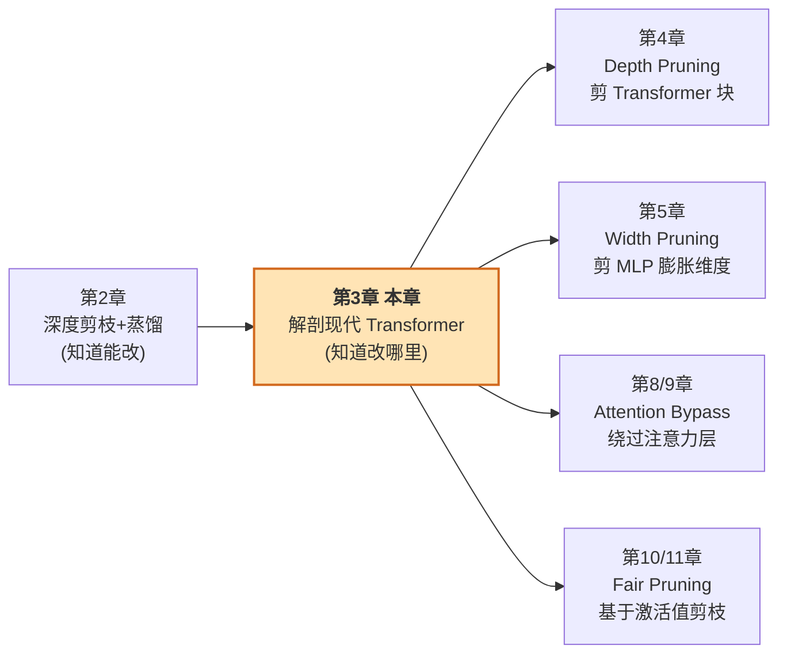
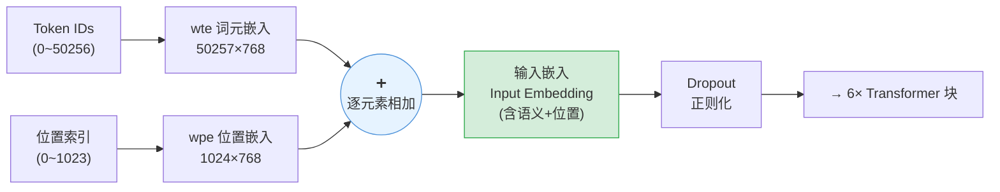
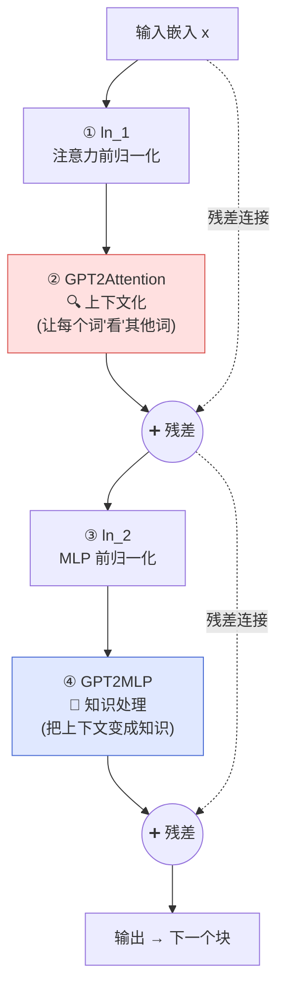
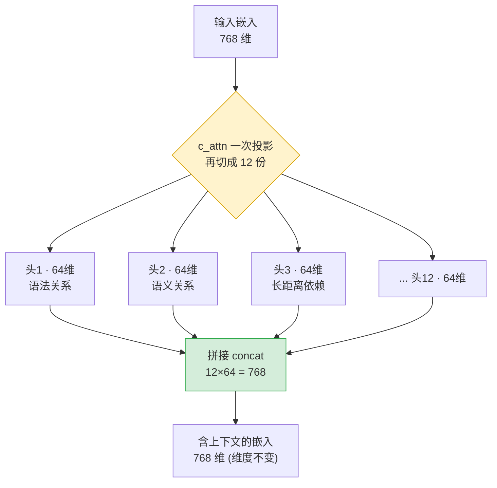
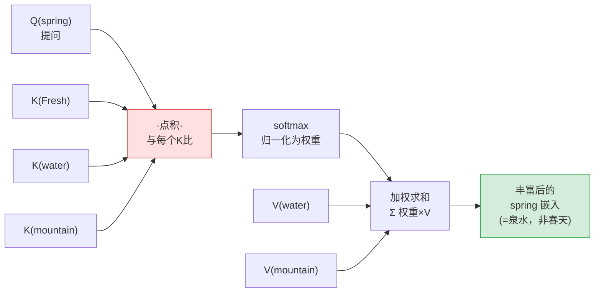
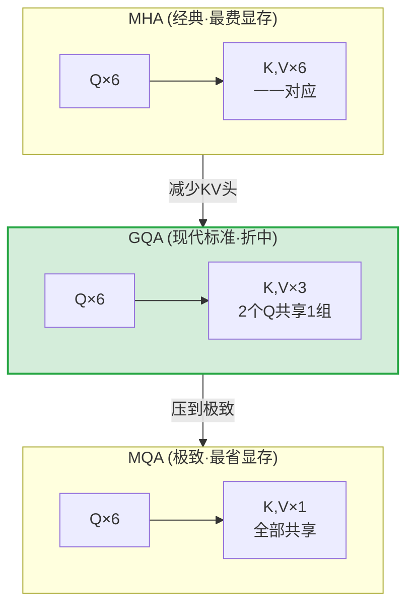
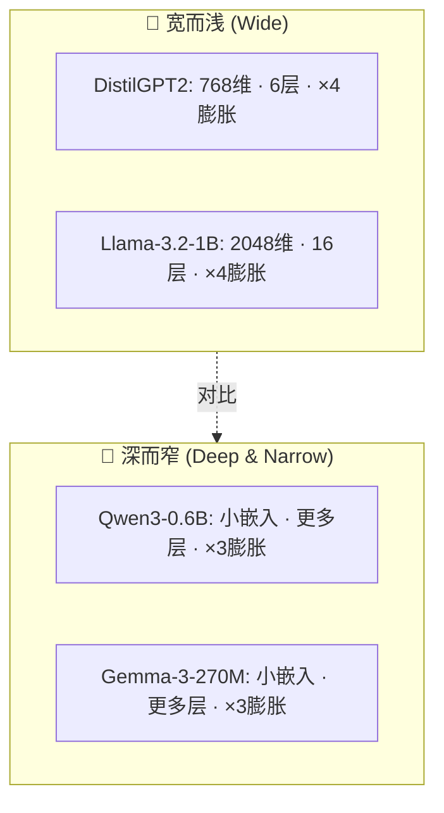
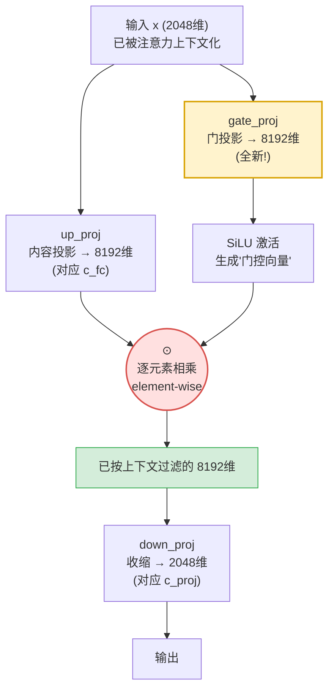
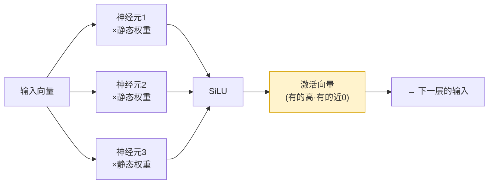
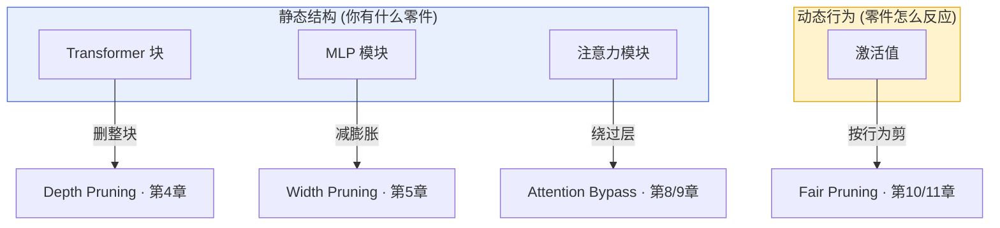

# 第 3 章 现代 Transformer 蓝图（A Blueprint to Modern Transformers）

> 📖 对应原书 *Rearchitecting LLMs* (Pere Martra, MEAP) 第 3 章，PDF 第 51–88 页。
> 本章把「经典 Transformer（DistilGPT2）」和「现代 Transformer（Llama-3.2）」并排解剖，找出**哪些部件是骨架、哪些部件可以剪 / 可以换**，为后续所有"重构（rearchitecting）"技术打地基。

---

## 🗺️ 本章地图：这一章在全书的位置

在上一章里，你完成了人生第一个"重构项目"——从一个 Transformer 里**删掉几层（depth pruning，深度剪枝）**，再用**知识蒸馏（knowledge distillation）**把能力从基座模型里"救"回来，最后得到了一个基于 Gemma-3 的全新模型。那一章告诉你"**能改**"；这一章告诉你"**改哪里、为什么改、改了付出什么代价**"。

作者的原话很直白：

> 当你加载一个模型做推理时，你可能以为显存占用就等于模型大小。但真正吃显存的是 **注意力机制（attention）产生的缓存**——它随着每个 token 增长，常常在一篇文档还没跑完时就把 GPU 显存吃光了。与此同时，**MLP 块**（负责"处理知识"的那一半）吞掉了模型大部分的参数量和计算时间。

所以这一章要回答两个第一性问题：

1. 🧠 **显存瓶颈在哪？** → 在注意力的 **KV Cache**。
2. ⚙️ **算力/参数瓶颈在哪？** → 在 MLP 的 **膨胀维度（expansion）**。

**读完这一章你能会：**

- 📐 说清一个 Transformer 块里的四个部件（归一化 → 注意力 → 归一化 → MLP）各自干什么；
- 🔍 对着 `print(model)` 的输出，逐行看懂 DistilGPT2 和 Llama-3.2-1B 的结构差异；
- 🚀 讲透四个现代化改进——**RoPE、RMSNorm、GQA/MQA、SwiGLU（GLU 家族）**——的"是什么 / 为什么 / 怎么用 / 代价"；
- 🗂️ 建立一张"**部件 → 优化技术**"的对照表，知道后面每一章的剪枝/改造技术该往哪个部件上打。



> 💡 **一句话总结本章思路**：先用最"素"的 DistilGPT2 认清 Transformer 的**通用骨架**，再用 Llama-3.2 看**现代改进换掉了骨架的哪几块零件**，最后把"零件"和"改造工具"配成对。

---

## 3.1 经典架构解剖：DistilGPT2 🏛️

作者选 **DistilGPT2** 作为起点，原因很纯粹：它只有 **8200 万（82M）参数**，非常轻，却完整保留了引爆语言模型革命的那套**基础结构**，同时**不含**任何现代花活。用它当"标本"，能把 Transformer 从零讲清楚。

先把模型加载进内存，打印结构：

```python
model = AutoModelForCausalLM.from_pretrained(
    "distilbert/distilgpt2",
    torch_dtype="auto",
    device_map="cpu",
)
print(model)
```

**逐行解读这段加载代码：**

| 代码片段 | 含义 |
|---|---|
| `AutoModelForCausalLM` | HuggingFace 的"自回归语言模型"通用入口类，会自动识别 `distilgpt2` 属于 GPT2 家族。**Causal（因果）**指每个 token 只能看到自己左边的历史，看不到未来——这正是"生成式"模型的定义。 |
| `torch_dtype="auto"` | 让框架按权重文件里存的精度自动选 dtype（fp32/fp16/bf16），不用手写。 |
| `device_map="cpu"` | 强制放 CPU。解剖结构不需要 GPU，省显存。 |
| `print(model)` | PyTorch 会递归打印模块树——这就是我们要读的"地图"。 |

### 📋 Listing 3.1：DistilGPT2 的结构（三段式）

```text
GPT2LMHeadModel(
  (transformer): GPT2Model(
    (wte): Embedding(50257, 768)          # 词元嵌入 Word Token Embedding
    (wpe): Embedding(1024, 768)           # 位置嵌入 Word Position Embedding
    (drop): Dropout(p=0.1, inplace=False)
    (h): ModuleList(
      (0-5): 6 x GPT2Block(               # 6 个堆叠的 Transformer 块
        (ln_1): LayerNorm((768,), eps=1e-05, elementwise_affine=True)
        (attn): GPT2Attention(
          (c_attn): Conv1D(nf=2304, nx=768)   # 一次生成 Q,K,V（768×3=2304）
          (c_proj): Conv1D(nf=768,  nx=768)   # 输出投影
          (attn_dropout): Dropout(p=0.1)
          (resid_dropout): Dropout(p=0.1)
        )
        (ln_2): LayerNorm((768,), eps=1e-05, elementwise_affine=True)
        (mlp): GPT2MLP(
          (c_fc):   Conv1D(nf=3072, nx=768)   # 膨胀 768→3072
          (c_proj): Conv1D(nf=768,  nx=3072)  # 收缩 3072→768
          (act): NewGELUActivation()          # 非线性激活
          (dropout): Dropout(p=0.1)
        )
      )
    )
    (ln_f): LayerNorm((768,), eps=1e-05, elementwise_affine=True)  # 最终归一化
  )
  (lm_head): Linear(in_features=768, out_features=50257, bias=False)  # 语言建模头
)
```

作者提醒了一个**关键的工程细节**：这张"地图"是**静态**的。要理解它怎么"活起来"，你得记住——**一个 PyTorch 模型不过是一个 Python 类**，它有两个决定行为的核心方法：

- `__init__()`：**构造函数**，声明并初始化模型要用的所有层。它对应 Listing 3.1 里"有哪些零件"。
- `forward()`：**前向传播**，决定这些层**以什么顺序执行**。

> ⚠️ **常见坑：`print(model)` 的顺序 ≠ 执行顺序！**
> PyTorch 打印模块时是按 `__init__()` 里**声明**的先后打印的，而**真正的执行顺序由 `forward()` 决定**。后面看 MLP 时你会发现，打印出来的层序和实际数据流的层序对不上。**永远以 `forward()` 为准。**

注意：`__init__()` 里其实**没有** `lm_head`，因为 Listing 3.1 展示的是 `GPT2LMHeadModel`（专门做语言建模的外壳类），它把基础的 `GPT2Model` 包了一层，再在外面加上 `lm_head`。

```python
# GPT2Model 的构造函数（节选）
def __init__(self, config):
    super().__init__(config)
    self.embed_dim = config.hidden_size
    self.wte = nn.Embedding(config.vocab_size, self.embed_dim)          # 词元嵌入
    self.wpe = nn.Embedding(config.max_position_embeddings, self.embed_dim)  # 位置嵌入
    self.drop = nn.Dropout(config.embd_pdrop)                          # Dropout
    self.h = nn.ModuleList([GPT2Block(config, layer_idx=i)
                            for i in range(config.num_hidden_layers)])  # 堆叠 N 个块
    self.ln_f = nn.LayerNorm(self.embed_dim, eps=config.layer_norm_epsilon)  # 最终归一化
```

**逐行讲：**
- `self.embed_dim = config.hidden_size` → 隐藏维度 = 768，全模型的"主干带宽"。
- `self.wte` → 大小 `(50257, 768)` 的查找表：把每个 token ID 映射成一个 768 维向量。
- `self.wpe` → 大小 `(1024, 768)`：把每个"位置"（0~1023）映射成一个 768 维向量。**1024 就是这个模型的最大上下文长度**。
- `self.h` → 用列表推导式一口气造出 6 个 `GPT2Block`。改这里的 `num_hidden_layers` 就是**改深度（depth）**。
- `self.ln_f` → 出口处的最终 LayerNorm。

### 3.1.1 Transformer 的总体数据流 🌊

执行顺序由一条**嵌套调用链**驱动：

1. `GPT2Model.forward()` 被调用，定义高层数据流：取输入嵌入 → 依次穿过块列表 `h` → 最后过 `ln_f`。
2. 遍历到 Transformer 块时，逐个调用每个 `GPT2Block.forward()`。
3. 每个 `GPT2Block.forward()` 再调用自己的子模块：**先注意力（GPT2Attention），后 MLP（GPT2MLP）**。

**输入块（input block）**由嵌入层 + dropout 组成，数据流是这样的（对应原书图 3.1）：



**为什么两个嵌入能直接相加？** 因为它们维度一样（都是 768），向量加法合法。相加后得到的 **input embedding** 同时携带了"**是哪个词**"和"**在第几位**"两种信息。

> 🔬 **第一性原理：位置信息为什么非要不可？**
> 作者用了一个绝妙的例子：`"The worker called the lawyer"`（工人打给律师）和 `"The lawyer called the worker"`（律师打给工人）——**用词完全一样，含义完全相反**。如果没有位置嵌入，模型看到的两句话的"词集合"一模一样，无法区分谁打给谁。位置嵌入就是给每个词打上"你排第几"的标签，让语序变得可感知。

`Dropout` 是训练期的正则化：随机"关掉"一些神经元，防止模型过度依赖特定模式（**过拟合 overfitting**）。推理期它自动失效。

### 📦 一个 Transformer 块的内部：四件套

结果被送进模型的心脏——6 个堆叠的 Transformer 块。对应原书图 3.2，每个 `GPT2Block` 里**按顺序**装着四个部件：



作者用一句话点破了这套设计的**分工哲学（division of responsibilities）**：

- 🔍 **注意力（Attention）= 上下文化（contextualization）**：让每个词能"看向"并连接序列里的其他词。经典例子——`"Fresh water flows from the mountain spring daily"`（清泉每日从山间涌出）里的 `spring`，必须去关注 `water / flows / mountain`，才知道它是"泉水"而不是"春天"或"弹簧"。
- 🧠 **MLP（多层感知机）= 知识处理（knowledge processing）**：拿到被上下文化的信息后，用训练时学到的知识去转化它。注意力说"`spring` 在这里跟 `mountain`、`water` 相关"，MLP 用知识推断出这蕴含着"自然""清新""地理"等概念。

> 💡 **面试高频：注意力和 MLP 到底谁负责什么？**
> 记住这个二分法就赢了一半：**Attention 负责"混"（跨 token 交互，让信息在序列内流动），MLP 负责"想"（逐 token 独立地做知识变换，不跨 token）**。这也解释了为什么后面 MLP 是"width（宽度）"、Transformer 块数是"depth（深度）"——MLP 的膨胀维度决定单步能想多复杂，块数决定能反复精炼多少次。

**出口两步走：** 6 个块处理完后，`ln_f`（最终 LayerNorm）先稳定输出向量，然后 `lm_head` 把每个向量投影到**词表大小（50257）**，得到 **logits**。例如对 `"The mountain was covered in..."`，logits 可能给 `snow` 30%、`trees` 15%、`fog` 10%。别嫌 30% 低——在 5 万多个候选里，30% 已经是相当强的预测了，剩下的概率被极稀薄地摊到几千个更不可能的 token 上。

> ⚠️ **常见坑：Token ≠ Word。** 为了讲解方便，作者一直用"1 token = 1 词"简化，但真实世界不是这样。转换取决于语言：**英文通常 1.3~1.5 token/词** 才算正常。中文更碎。做显存/成本估算时别把 token 当词数。

---

### 3.1.2 经典注意力机制：QKV 与多头 🔍

注意力来自那篇著名的 *Attention is All You Need*（Vaswani 等，2017，arxiv 1706.03762），被公认为现代 LLM 时代的起点。

**为什么需要它？** 输入嵌入虽然有"词义 + 位置"，却有个根本缺陷：**它不知道自己和其他词的关系**。作者的例子：`spring` 的词元嵌入在 `"...mountain spring daily"` 和 `"...during the spring"` 里**完全相同**——位置嵌入让最终向量有点差别，但模型**还没用邻居的信息去消歧**。它知道"用了哪个词、在第几位"，却不知道"周围是什么"。

注意力的职责就是：**用序列其余部分的信息去丰富每个 token 的嵌入**，让 `spring` 的向量在被 `water/mountain` 包围时和被 `flowers/season` 包围时**分化开来**。

#### 多头（Multi-Head）：并行的专家

上下文化发生在 `attn` 模块里，靠的是**多个并行工作的子机制——注意力头（attention heads）**。每个头本质上是**一套完整、独立的注意力机制**，专门盯一类关系。这种专业化是**训练中自然涌现**的：一个头可能变成"主谓语法关系"专家，另一个专攻"同义词语义"，还有的盯"长距离依赖"。

```python
config = model.config
print(f"Attention heads: {config.n_head}")
print(f"Head dimensions: {config.n_embd // config.n_head}")
# 输出:
# Attention heads: 12
# Head dimensions: 64
```

DistilGPT2 有 **12 个头**，每个头把完整的 768 维嵌入投影到一个更小的、专门化的 **64 维子空间**（$768 / 12 = 64$）。`c_attn` 层的设计就是**一次性、极高效地为所有头同时生成投影**。



#### QKV 机制：Query / Key / Value

每个头内部，从每个 token 的嵌入生成三个不同角色的向量：

| 向量 | 角色 | 类比 | 例子（`spring`） |
|---|---|---|---|
| **Query（Q，查询）** | 当前词在"找信息" | 提问者 | `spring` 主动在句子里找线索来定义自己 |
| **Key（K，键）** | 一个词"提供"什么 | 标签 | `mountain` 的 Key 表明它和"自然"相关 |
| **Value（V，值）** | 词真正的语义内容 | 内容本体 | 如果 Key 是标签，V 就是内容 |

**目标**：用序列里所有其他 token 的 **Value** 的一部分，来丰富当前 token 的嵌入。**问题是：每个 Value 该取多少比例？** 这由 Q-K 决定：

$$
\text{score}(Q_i, K_j) = Q_i \cdot K_j \quad(\text{点积衡量两向量有多"对齐"})
$$

`spring` 的 Query 和 `mountain` 的 Key 点积很大 → 相似度高。然后用 **softmax** 归一化，把分数变成"每个词的 Value 该贡献多少比例"的权重：

$$
\text{Attention}(Q,K,V) = \underbrace{\text{softmax}\!\left(\frac{QK^\top}{\sqrt{d_k}}\right)}_{\text{注意力权重}} \, V
$$

其中 $\sqrt{d_k}$（这里 $d_k = 64$）是**缩放因子**，防止点积过大导致 softmax 梯度消失。



#### 经典 MHA 的实现：一层搞定三件事

DistilGPT2 用最直接的方式实现——12 个头各自生成自己独立的 Q/K/V 投影，全由 `(c_attn): Conv1D(nf=2304, nx=768)` 一次性完成。这就是 **多头注意力（Multi-Head Attention, MHA）**。

这一层把 768 维嵌入投影到 **2304 维**，正好是 $768 \times 3 = 2304$（Q、K、V 各一份）。这 2304 维内部再切分，为 12 个头各生成 Q/K/V。

#### 💣 致命瓶颈：KV Cache

作者在这里点出了整章最重要的痛点：

> 生成文本时，模型**一次预测一个 token**，每个新 token 都要"关注"**之前所有**的 token。为了不重复计算已处理 token 的 Key 和 Value，它们被存进一个**缓存（KV Cache）**。这个缓存**随每个生成的 token 增长**，成为一个**限制上下文窗口长度、逼你买大显存 GPU 的显存瓶颈**。

来算一笔账（原书图 3.6 的例子）。句子 `"Fresh water flows from the mountain spring daily"` 有 8 个 token。要预测下一个 token，DistilGPT2 必须为这 8 个 token 在 KV Cache 里保留 Key 和 Value，跨 **12 个头**、**2 份（K 和 V）**、**6 层**：

$$
8 \text{ tokens} \times 12 \text{ heads} \times 2 \text{ (K,V)} \times 6 \text{ layers} = 1152 \text{ 个"槽位"}
$$

而且每个"槽位"实际占的远不止一个向量，真实显存增长比这个示意计算更陡。**随着层数、头数、文本长度增加，显存需求持续膨胀。**

> ⚠️ **常见坑：能不能干脆关掉 KV Cache？**
> 技术上 HuggingFace `transformers` 允许关。但**几乎永远不该这么做**，即便对 DistilGPT2 这种经典架构。关掉 KV Cache 会**逼模型对每个 token 重算 Key 和 Value**，引入巨量重复计算——你只是把"显存问题"换成了"算力问题"，推理会变得**极慢**。这是典型的用时间换空间反向操作。

**这就是现代架构最大的改进动机。** 为了解决它，业界发展出两种减少 KV 头数量的注意力架构（把 KV 头分组、在多个 Q 头间共享）：

- **多查询注意力（Multi-Query Attention, MQA）**：所有头共享**一套** Key-Value。
- **分组查询注意力（Grouped-Query Attention, GQA）**：KV 头**分组**，每个 Q 头分到一个组。



同样 1152 个向量的显存预算下，三种机制能缓存的 token 数天差地别：

| 机制 | 每 token 的 KV 头 | 1152 向量能缓存多少 token | 相对 MHA |
|---|---|---|---|
| **MHA** | 12 | 8 | 基准 |
| **GQA (4:1)** | 3 | **32** | **+300%** 🚀 |
| **MQA** | 1 | **96** | **+1100%** 🚀🚀 |

作者点评：**GQA 已成为实际标准**——它拿到了 MQA 绝大部分的显存节省，又避免了 MQA 那种"压得太狠导致质量下降"的问题。

> 🔬 **第一性原理：为什么共享 K/V 不共享 Q 就能省显存？**
> KV Cache 存的是 **K 和 V**（要跨 token 累积），**Q 不进缓存**（每步现算现用、用完即弃）。所以把 K/V 头数从 12 砍到 3，缓存直接缩到 1/4，而 Q 头仍是 12（模型表达"从多少个角度提问"的能力基本不减）。**这就是"省显存但基本不掉质量"的秘诀：砍的是缓存里的东西，留的是表达力。**

> 💡 **面试高频：GQA 里的"4:1"是什么意思？**
> 指 **Q 头数 : KV 组数 = 4 : 1**，即每 4 个 Q 头共享 1 组 K/V。MHA 是 $n{:}n$（1:1），MQA 是 $n{:}1$。GQA 是二者之间的连续谱，$g=1$ 退化成 MQA，$g=n$ 退化成 MHA。

---

### 3.1.3 经典 MLP 机制：膨胀 → 激活 → 收缩 🧠

DistilGPT2 的 6 个块里，每个都是"注意力 → MLP"的顺序，**逐块交替**跑：Attention → MLP → Attention → MLP……**不是**先把所有注意力跑完再跑所有 MLP。每个块内部两步都做完，才进下一个块。

MLP 的职责：**把注意力上下文化后的信息，用训练时学到的知识去处理转化**。注意力判定 `spring` 强连 `water/mountain`，MLP 才是那个"用内部知识推断出这蕴含'自然/地理/水'而非'季节/机械'"的部件。**Attention 上下文化，MLP 把上下文化变成知识。**

看它的内部结构：

```text
(mlp): GPT2MLP(
    (c_fc):   Conv1D(nf=3072, nx=768)   # 膨胀
    (c_proj): Conv1D(nf=768,  nx=3072)  # 收缩
    (act): NewGELUActivation()          # 激活
    (dropout): Dropout(p=0.1)
)
```

**再次强调：打印顺序 ≠ 执行顺序。** 用 `inspect` 看真正的 `forward()`：

```python
import inspect
mlp_layer = model.transformer.h[0].mlp
print(inspect.getsource(mlp_layer.forward))
```

```python
def forward(self, hidden_states):
    hidden_states = self.c_fc(hidden_states)     # ① 膨胀 768→3072
    hidden_states = self.act(hidden_states)      # ② 激活（打破线性）
    hidden_states = self.c_proj(hidden_states)   # ③ 收缩 3072→768
    hidden_states = self.dropout(hidden_states)  # ④ 正则化
    return hidden_states
```

**逐行讲：**
- ① `c_fc`：把 768 维**膨胀**到 3072 维。膨胀让模型能表达远比 768 维更复杂的信息。
- ② `act`：非线性激活。**这是整段的灵魂**——见下方原理框。
- ③ `c_proj`：**收缩**回 768 维，好接回主干残差流。
- ④ `dropout`：训练期正则化，推理期失效。

> 🔬 **第一性原理：为什么膨胀和收缩之间非放一个激活不可？**
> 作者讲得极清楚：如果把膨胀（`c_fc`）和收缩（`c_proj`）**直接串起来、中间什么都不放**，整个操作在数学上**等价于一次矩阵乘法**——因为**线性变换叠加起来还是线性的**（$W_2(W_1 x) = (W_2 W_1) x$）。那你堆再多层也白搭，表达力等于一层。**激活函数（GELU）是一个平滑的非线性"开关+调节器"**：它为 3072 个神经元中的每一个决定"这个信号够不够重要、以多大强度放行"。正是"改变哪些神经元通过、以何种强度通过"这个动作**打破了线性**，模型才能学复杂模式。

**GELU（Gaussian Error Linear Unit，高斯误差线性单元）** 是一个平滑非线性函数：

$$
\text{GELU}(x) = x \cdot \Phi(x) = x \cdot \frac{1}{2}\left[1 + \text{erf}\!\left(\frac{x}{\sqrt{2}}\right)\right]
$$

其中 $\Phi(x)$ 是标准正态分布的累积分布函数（CDF）。直觉：输入越大越可能被完整放行，越负越可能被压到接近 0，但**过渡是平滑的**（不像 ReLU 在 0 处硬拐角）。

膨胀阶段，每个神经元倾向于**专门化**去检测特定模式：有的被地理概念激活，有的被时间关系激活，有的被句法结构激活——**和注意力头一样，这种专业化在训练中自然涌现**。

> 💡 **实战：神经元专业化 → 宽度剪枝（width pruning）的理论基础**
> 作者在这里埋了后续第 5 章的伏笔：一个通用模型里有专攻上千个主题（历史、生物、编程……）的神经元。但如果你的目标是造一个**只做金融分析**的专家模型，那些专门检测"菜谱模式"的神经元有什么必要还开着、还占资源？**宽度剪枝就是一门外科手术，选择性地删掉贡献最小的神经元**（第 5 章详解）。

---

### 3.1.4 Transformer 的两个维度：深度与宽度 📐

拆完注意力和 MLP，你现在能看懂两个最重要的结构优化技术要动的东西：

| 维度 | 定义 | 在 DistilGPT2 里 | 改它的技术 | 代价/收益 |
|---|---|---|---|---|
| **深度（Depth）** | 堆叠的 Transformer 块数量 | **6 个块** | **深度剪枝**（删整块，第 4 章） | 深 → 顺序精炼更复杂，但**延迟更高** |
| **宽度（Width）** | 内部层大小（尤指 MLP 中间维度） | **3072 神经元** | **宽度剪枝**（减膨胀，第 5 章） | 宽 → 单步处理知识能力强，直接影响**参数量和显存** |

不同模型的"形状"差异很大（原书图 3.7 对比了本书要用的四个模型）：



- 🍔 **宽模型（Wide）**：如 Llama-3.2-1B、DistilGPT2，用大嵌入 + 大 MLP 膨胀（这里 ×4），每层处理能力强。
- 🥖 **深而窄模型（Deep & narrow）**：如 Qwen3-0.6B、Gemma-3-270M，小嵌入 + ×3 膨胀，更深更窄，优先"多做几次顺序变换"。

> 💡 **面试高频：给定参数预算，该"宽"还是"深"？**
> 没有绝对答案，是设计权衡：**深**擅长需要多步推理的任务（每层做一点，层层精炼），但**延迟高**（层是串行的，没法并行）；**宽**单步表达力强、层数少延迟低，但**显存/参数吃得多**。理解深宽平衡是 LLM 架构师的基本功。

---

## 3.2 现代 Transformer 架构：Llama-3.2 🚀

注意力和 MLP 是 Transformer 的两根支柱。DistilGPT2 展示了它们最经典的形态——革命性，但扩展模型时暴露了两个问题：

1. ⚠️ **注意力机制计算代价极高**，主因是**显存消耗**（KV Cache）。
2. ⚠️ **MLP 模块**虽有效，但对更深、更依赖上下文的知识处理**能力受限**（静态激活不随上下文调整）。

现代标准的回应是两个基础性创新：

- **GQA（分组查询注意力）**：优化注意力的显存（上一节已讲原理）。
- **GLU（Gated Linear Units，门控线性单元）**：革新 MLP 处理。

作者选 **Llama 家族**来讲，因为它推广了今天多数开源模型采用的结构。

```python
model = AutoModelForCausalLM.from_pretrained(
    "meta-llama/Llama-3.2-1B",
    torch_dtype="auto",
    device_map="cpu",
    trust_remote_code=True,
)
```

> ⚠️ **常见坑：Llama-3.2 是门禁模型（gated access）。** 下载要两步：① 去 HF Hub 模型页**接受许可条款**；② 在环境里配置名为 `HF_TOKEN` 的密钥（你的 HuggingFace User Access Token）。少一步就 401/403。

### 📋 Listing 3.2：Llama-3.2-1B 的结构

```text
LlamaForCausalLM(
  (model): LlamaModel(
    (embed_tokens): Embedding(128256, 2048)        # 词表大10倍，嵌入更宽
    (layers): ModuleList(
      (0-15): 16 x LlamaDecoderLayer(              # 16 层 (比 GPT2 深)
        (self_attn): LlamaAttention(
          (q_proj): Linear(2048, 2048, bias=False)   # Q: 满维 2048
          (k_proj): Linear(2048,  512, bias=False)   # K: 只有 512! (GQA)
          (v_proj): Linear(2048,  512, bias=False)   # V: 只有 512! (GQA)
          (o_proj): Linear(2048, 2048, bias=False)   # 输出重组投影
        )
        (mlp): LlamaMLP(
          (gate_proj): Linear(2048, 8192, bias=False)  # 门 gate (GLU 新增!)
          (up_proj):   Linear(2048, 8192, bias=False)  # 内容 (对应 c_fc)
          (down_proj): Linear(8192, 2048, bias=False)  # 收缩 (对应 c_proj)
          (act_fn): SiLU()                             # 激活换成 SiLU
        )
        (input_layernorm):          LlamaRMSNorm((2048,), eps=1e-05)  # RMSNorm!
        (post_attention_layernorm): LlamaRMSNorm((2048,), eps=1e-05)
      )
    )
    (norm): LlamaRMSNorm((2048,), eps=1e-05)
    (rotary_emb): LlamaRotaryEmbedding()             # RoPE! 取代 wpe
  )
  (lm_head): Linear(2048, 128256, bias=False)
)
```

### 🔬 四大差异一览（经典 → 现代）

| 部件 | DistilGPT2（经典） | Llama-3.2-1B（现代） | 改进目的 |
|---|---|---|---|
| **位置编码** | `wpe` 绝对位置嵌入（上限 1024） | `rotary_emb` **RoPE 旋转位置编码** | 编码**相对**距离 → 支持 128K 长上下文 |
| **归一化** | `LayerNorm` | **`RMSNorm`** | 算得更便宜，效果相近 |
| **注意力** | `c_attn` 单层 MHA（Q=K=V=768） | 分离的 **GQA**（Q=2048, K=V=512） | KV Cache 缩 4 倍，省显存 |
| **MLP** | 2 层（膨胀+收缩）+ GELU | 3 层 **GLU/SwiGLU**（gate+up+down）+ SiLU | 让过滤**随上下文动态调整** |
| 词表 / 嵌入 / 深度 | 50257 / 768 / 6 层 | 128256 / 2048 / 16 层 | 规模扩展（非架构性） |

下面逐一讲透四个**架构性**改进。前两个（RoPE、RMSNorm）书里点到为止，我们补足第一性原理；后两个（GQA、GLU）是本书重点。

---

### 3.2.0 现代化改进之一：RoPE 旋转位置编码 🌀

**是什么？** RoPE（Rotary Position Embedding，旋转位置编码）取代了 DistilGPT2 里的 `wpe`。两者目的相同——**告诉模型每个 token 在序列里的位置**。

**关键区别（作者原话）：** 经典嵌入编码的是**绝对位置**（"你是第 5 个词"）且**有固定上限**；RoPE 编码的是 token 之间的**相对距离（relative distance）**，从而支持长得多的上下文窗口。**这正是现代模型能处理 128K token、而 DistilGPT2 卡在 1024 的原因。**

> 🔬 **第一性原理：RoPE 怎么用"旋转"编码位置？**
> RoPE 不再"加"一个位置向量，而是**按位置角度旋转 Q 和 K 向量**。把每个头的 64 维切成 32 个二维平面，第 $m$ 个位置的 token 在第 $i$ 个平面上旋转角度 $m\theta_i$：
> $$\theta_i = 10000^{-2i/d}$$
> 妙处在于：两个 token 做注意力点积时，$Q_m \cdot K_n$ 的结果**只依赖它们的相对位置 $m-n$**，绝对位置被"旋转"抵消了。所以模型学到的是"相隔多远"而非"各自第几"——**训练时没见过的更长位置，也能靠相对关系外推**。这就是长上下文外推的数学根基。

**怎么用？** 在 HF 里 RoPE 是即插即用的：Llama 的 `LlamaRotaryEmbedding` 在注意力计算前对 Q、K 施加旋转，你几乎不用管。重构时若要扩上下文，常用 **RoPE scaling**（如 NTK-aware、linear interpolation）调 `theta` 基频。

**代价？** RoPE 只作用于 Q/K（不作用于 V），几乎零额外参数；但极端外推时质量会下降，需要 scaling 技巧校正。

---

### 3.2.1 现代化改进之二：RMSNorm 均方根归一化 📏

**是什么？** `LlamaRMSNorm` 取代经典的 `LayerNorm`。两者都是**稳定训练**的归一化技术，但作者一针见血：**RMSNorm 计算更便宜，效果相近**。

**为什么更便宜？** 对比两个公式：

$$
\text{LayerNorm}(x) = \frac{x - \mu}{\sqrt{\sigma^2 + \epsilon}} \odot \gamma + \beta
\qquad\text{(要算均值 } \mu \text{ 和方差 } \sigma^2\text{，还有偏置 } \beta)
$$

$$
\text{RMSNorm}(x) = \frac{x}{\sqrt{\frac{1}{d}\sum_{i=1}^{d} x_i^2 + \epsilon}} \odot \gamma
\qquad\text{(只算均方根 RMS，去掉减均值和 } \beta)
$$

> 🔬 **第一性原理：RMSNorm 省在哪？**
> LayerNorm 做两件事：**重新居中（re-centering，减均值 $\mu$）+ 重新缩放（re-scaling，除标准差）**。研究发现真正起稳定作用的主要是**缩放**那一步，**居中可以省掉**。RMSNorm 就砍掉了减均值、砍掉了偏置 $\beta$，只保留"除以均方根 + 一个可学缩放 $\gamma$"。**少一次求均值遍历、少一组偏置参数**——在千亿次前向里累积起来，省的算力和显存很可观，而质量几乎不掉。

**怎么用？** HF 里换成 `LlamaRMSNorm` 即可，`eps=1e-05` 是防除零的小量。Llama 每个块用两个：`input_layernorm`（注意力前）和 `post_attention_layernorm`（MLP 前），出口再加一个 `norm`——**位置和 DistilGPT2 的 `ln_1/ln_2/ln_f` 一一对应**，只是换了实现。

**代价？** 几乎没有。RMSNorm 已是现代 LLM 的默认选择（Llama、Qwen、Gemma、Mistral 全用它）。

---

### 3.2.2 现代化改进之三：MHA → GQA（注意力显存优化）🔍

上一节讲了 GQA 的理论和显存收益，这里看**现代实现的解剖**。对比两种写法——

**DistilGPT2 的经典 MHA：**
```text
(c_attn): Conv1D(nf=2304, nx=768)   # Q,K,V 挤在一层，forward 里再切
```

**Llama-3.2 的 GQA：**
```text
(q_proj): Linear(in_features=2048, out_features=2048, bias=False)   # Q: 满 2048
(k_proj): Linear(in_features=2048, out_features=512,  bias=False)   # K: 仅 512
(v_proj): Linear(in_features=2048, out_features=512,  bias=False)   # V: 仅 512
(o_proj): Linear(in_features=2048, out_features=2048, bias=False)   # 输出重组
```

**逐行读出 GQA：**
- DistilGPT2 把 Q/K/V 塞进一层，靠 `forward()` 的 PyTorch 代码在需要时切开；**Llama 给三者各用一层独立投影**。
- `o_proj` 作用不同：所有注意力头算完输出后，它把它们**重新组合回单一嵌入表示**。
- **最能说明问题的是维度**：`q_proj` 输出 **2048**，但 `k_proj` 和 `v_proj` 只输出 **512**——正是 GQA 在优化架构。

**为什么 K/V 是 512？** Llama-3.2-1B 头维度 64，Q 有 $2048/64 = 32$ 个头，K/V 只有 $512/64 = 8$ 组 → **GQA 比例 32:8 = 4:1**。每 4 个 Q 头共享 1 组 K/V。

用同样的账再算一遍（原书图 3.6）：

$$
\begin{aligned}
\text{MHA: } & 8 \text{ tokens} \times 12 \text{ KV头} \times 2 \times 6 \text{ 层} = 1152 \text{ 向量} \\
\text{GQA: } & 32 \text{ tokens} \times 3 \text{ KV头} \times 2 \times 6 \text{ 层} = 1152 \text{ 向量}
\end{aligned}
$$

**同样 1152 的显存，GQA 能装 4 倍长的文本。**

> ⚠️ **常见坑（超重要）：GQA 时代，"剪注意力头"这招失效了！**
> 作者专门警告：在经典 MHA 里，每个头有**自己独立**的 Q/K/V 权重，剪掉一个头 = 删掉它的投影 + 调输出维度，**局部、简单**。但 **GQA 里同组的头共享 K/V 投影**——这种相互依赖让"删单个头"不但收益变小，**实现上还很危险**：删一个头会影响**别的头也在用的共享张量**，一旦对不齐就**破坏模型完整性**。所以现代注意力要用**不一样的技术**——比如第 8 章的 **注意力旁路（Attention Bypass，绕过整层而非删单头）**——才能安全有效地优化。

> 💡 **面试高频：为什么不用 MQA 而用 GQA？** MQA（所有头共享 1 组 K/V）省显存最狠，但把表达力压得太扁，某些任务质量掉得明显。GQA 保留多组 K/V，是"显存省 + 质量稳"的甜点区，成了 Llama/Qwen/Mistral 的共同选择。

作者还谦虚地推荐：想看 QKV 完整实现代码，去读 Sebastian Raschka 的 *Build a Large Language Model (From Scratch)*。

---

### 3.2.3 现代化改进之四：MLP → GLU / SwiGLU（门控线性单元）🚪

经典 MLP 的局限**更多是概念性的，而非算力**。问题在于：它是个**简单机制，信息过滤依赖一个固定的激活函数，永远用同一套标准，不随上下文调整**。作者的例子：模型处理 `spring` 时，无论上下文是 `water` 还是 `season`，**GELU 激活都不变**——上下文明明在输入里，MLP 却不动态调整它的过滤。

**GLU（Gated Linear Units）就是来解决这个"过滤缺乏上下文适应"的问题**，用一个**能学着适应输入具体内容的过滤器**，取代静态的激活层。

**结构对比：**

```text
# DistilGPT2 经典 MLP —— 2 层
(mlp): GPT2MLP(
    (c_fc):   Conv1D(nf=3072, nx=768)   # 膨胀
    (c_proj): Conv1D(nf=768,  nx=3072)  # 收缩
    (act): NewGELUActivation()
)

# Llama-3.2-1B 的 GLU —— 3 层
(mlp): LlamaMLP(
    (gate_proj): Linear(2048, 8192, bias=False)  # 门 (新增)
    (up_proj):   Linear(2048, 8192, bias=False)  # 内容
    (down_proj): Linear(8192, 2048, bias=False)  # 收缩
    (act_fn): SiLU()
)
```

**差异一眼可见：DistilGPT 有 2 个主线性层（膨胀+收缩），Llama 有 3 个**，各司其职。

#### GLU 的四步数据流（对应原书图 3.8）



**逐步讲（作者原文精读）：**

1. **内容投影（up_proj）**：生成内容的变换，产出信息丰富的中间表示，**类比经典 MLP 的膨胀**。作者强调："这里没什么新东西，这一层就对应 DistilGPT2 的 `c_fc`。"
2. **门投影（gate_proj）**：**并行地**生成一个**控制向量 / 门（gate）**。它**本身不含知识**，而是经过 **SiLU 激活**后，**学着判断 up_proj 变换里哪些元素对当前上下文相关**。
3. **逐元素组合（element-wise combination）**：两个结果做**逐元素相乘**，生成同尺寸但**已按上下文过滤**的向量。SiLU 倾向于把很负的输入压到接近 0、把正的平滑放行，**让门不仅能衰减、还能更灵活地调制信息**。
4. **收缩（down_proj）**：信息再收缩回原维度，**等价于 DistilGPT2 的 `c_proj`**。

用 `spring` 的例子串起来：`up_proj` 展开表示，激活出"泉水/溪流（自然）"、"季节（时间）"、"金属弹簧（机械）"等多义神经元；**同时** `gate_proj` 处理同样的上下文，学着生成一个门——给"地理神经元"高值、给"金融神经元"接近 0 的低值。两者相乘产生**带上下文的过滤效果**：`gardens/flowers` 信息被压制，`mountains/water` 被增强。**控制向量在信息进入最终收缩层前调制了内容表示。**

数学表达（这正是 **SwiGLU**，Llama 用的具体 GLU 变体）：

$$
\text{SwiGLU}(x) = \big(\underbrace{\text{SiLU}(x W_{\text{gate}})}_{\text{门}} \;\odot\; \underbrace{x W_{\text{up}}}_{\text{内容}}\big)\, W_{\text{down}}
$$

其中 SiLU（也叫 Swish）：$\text{SiLU}(x) = x \cdot \sigma(x) = \dfrac{x}{1 + e^{-x}}$。

> 🔬 **第一性原理：GLU 到底"动态"在哪？**
> 经典 MLP 的激活是**逐坐标固定函数**：`GELU(z)` 对第 $i$ 个神经元的输出只取决于它自己的 $z_i$，和别的上下文无关。GLU 的门是**由输入 $x$ 经 gate_proj 算出来的**——**同一个内容神经元，在不同上下文下会被乘上不同的门值**。这就是"静态过滤"到"内容自适应过滤"的本质跃迁：**过滤规则本身成了输入的函数**。代价是多了一整套 `gate_proj` 参数（MLP 参数量约增加 50%），但换来的表达力被证明非常划算，已成现代标配。

> 💡 **面试高频：GELU、SiLU、SwiGLU、GEGLU 什么关系？**
> - **GELU / SiLU**：都是**单个激活函数**（逐坐标非线性）。
> - **GLU 家族**：是**结构**（gate ⊙ content），要配一个激活修饰门。
> - **SwiGLU** = GLU 用 **SiLU(Swish)** 做门激活（Llama/Mistral/Qwen）；**GEGLU** = GLU 用 **GELU** 做门激活（Gemma、部分 T5 变体）。
> 记法：`XxxGLU` = "用 Xxx 激活的门控 MLP"。原书 3.4 节留了个练习——Qwen 和 Gemma 的 MLP 共享一个和 Llama 不同的元素，答案线索就在这里。

#### 🎯 GLU 也能宽度剪枝，但有个新约束

两种架构都保留了"膨胀 + 收缩"这个共同元素，所以**宽度剪枝同样适用于 GLU**。但作者标了个 **IMPORTANT**：

> ⚠️ **常见坑（GLU 剪枝特有）：`gate_proj` 和 `up_proj` 是成对工作的！** 你**不能只删一个层里的神经元而不删另一个层里对应的那个**——否则会破坏逐元素相乘所需的一一对应关系。因此，**决定剪哪些神经元的计算方式必须不同：要成对地、联合地评估每对神经元的重要性。**

作者还透露了自己的研究发现（预印本 *Exploring GLU expansion ratios: Structured pruning in Llama-3.2 models*）：**膨胀比例存在"甜点（sweet spot）"**。通过宽度剪枝，他们发现**更低的膨胀比不仅能大幅缩小模型体积和算力，在某些任务上甚至能超过原模型的表现**。但**不是所有模型都这样**——Gemma 家族的实验给出了完全不同的结果。第 5 章会把这套发现落到实践（经典架构和 GLU 架构的宽度剪枝都讲）。

---

## 3.3 连接结构、行为与优化 🔗

前面解剖的都是**静态结构（static structure）**。作者在这一节引入了动态的另一半——**激活值（activations）**。

**什么是激活值？** 一个神经元处理完输入、经过数学函数后**产出的输出值**。以 Llama-3.2-1B 为例：每个 MLP 层有 **8192 个神经元**，每个神经元有自己学到的权重——每个输入嵌入维度一个权重，所以**每个神经元 2048 个权重**。

> 🔑 **权重 vs 激活值，一句话分清：**
> **权重（weights）= 训练时学到的静态参数**（模型加载后就固定）；**激活值（activations）= 处理每个具体输入时、在网络里流动的动态数值**。同一组权重，喂不同输入，产生不同激活值。



**静态结构告诉你模型有什么部件：** 16 层、×4 膨胀 MLP、GQA 4:1、GLU + SiLU。
**动态行为揭示这些部件如何反应：** 处理 `doctor` 时神经元 1247 和 2891 剧烈激活；`he` 和 `she` 在第 8–12 层的激活差异高 300%……

> 💡 **实战：激活值能"看见偏见（bias）"。** 上面那个 `he/she` 激活差 300% 的例子，暗示模型把特定人群和特定角色关联了起来。**通过激活值研究行为，能定位模型的哪一部分产生了偏见，从而外科手术式地去纠正它**——这就是第 10/11 章 **Fair Pruning（公平剪枝，行为驱动剪枝）** 的思路。分析激活值让我们能诊断模型"怎么想"，既能优化效率，也能矫正行为。

### 📊 Table 3.1：优化地图（部件 → 技术 → 章节）

| 结构部件 | 优化技术 | 描述 | 章节 |
|---|---|---|---|
| **Transformer 块** | Depth Pruning（深度剪枝） | 删除整个 Transformer 块 | 第 4 章 |
| **经典 MLP 模块** | Width Pruning（宽度剪枝） | 减少膨胀维度 | 第 5 章 |
| **GLU MLP 模块** | Width Pruning | **同步**减少膨胀（gate/up 成对剪） | 第 5 章 |
| **注意力模块** | Attention Bypass（注意力旁路） | 旁路整层注意力 | 第 8 章 |
| | Adaptive Attention Bypass（自适应旁路） | 自适应地旁路 | 第 9 章 |
| **激活值** | Fair Pruning（公平剪枝） | 行为驱动的剪枝 | 第 10/11 章 |

这张表把你刚学的**解剖学**和后面要学的**实操技术**直接连了起来：每个部件都有为它设计的专属技术，你现在知道**要达成什么目标就往哪个部件上打**了。



---

## 3.4 动手实验（Hands-on Lab）🧪

配套 notebook 里有本章所有模型的结构，末尾"Exploring Other Notable Architectures"还有没细讲的模型（Qwen3-0.6B、Microsoft Phi-4）。作者给了几个上手实验：

1. **对比各模型的 GLU 实现**：加载 Qwen3-0.6B 和 Gemma-3-270M 的 MLP，和 Llama-3.2-1B 对比。**问题**：Qwen 和 Gemma 共享哪个（和 Llama 不同的）MLP 架构元素？为什么这么设计？
   - 💡 *线索*：回看 3.2.3 的"面试高频"框——GEGLU vs SwiGLU 的区别（门激活用 GELU 还是 SiLU）。
2. **分析膨胀比与设计哲学**：用 `gate_proj` 和 hidden 维度算各模型膨胀比。**问题**：Qwen3 用多大膨胀比？按"层数 vs MLP 大小"判断它是"宽"还是"深"模型？各有何优劣？
3. **探索高级注意力**：看 Phi-4 的 `qkv_proj` 结构，和别的模型分离的 Q/K/V 对比。**问题**：Phi-4 用什么注意力机制？和标准 MHA 相比特别在哪？
4. **探索多模态模型**：在 HF Hub 找 `gemma-3n-E4B-it`，看它的 `config.json`。**问题**：它的配置和纯文本模型有何不同？能否识别出明显不属于标准文本 Transformer 的键或整段？

> 💡 **实战建议**：把 `print(model)` 当成你读任何开源模型的第一件事。看到 `k_proj`/`v_proj` 比 `q_proj` 小 → GQA；看到 `gate_proj` → GLU；看到 `rotary_emb` → RoPE；看到 `RMSNorm` → 现代归一化。四个信号一扫，架构代际立判。

---

## 📌 小结（Summary）

1. 🏗️ **Transformer 由重复的块（block）堆成**，每块含两个核心模块：**注意力（上下文化信息）** 和 **MLP（处理知识）**。分工是 Attention "混"、MLP "想"。
2. 📐 **重构模型的两个基本维度**：**深度（depth，堆叠的块数）** 和 **宽度（width，MLP 内膨胀大小）**。深→顺序精炼强但延迟高；宽→单步能力强但吃显存。
3. 💣 **经典架构的两大痛点**：注意力的 **KV Cache 吃显存**、MLP 的**静态过滤不随上下文适应**。
4. 🚀 **现代架构（Llama）的四项进化**：**RoPE**（相对位置 → 长上下文）、**RMSNorm**（去均值省算力）、**GQA**（共享 K/V 省 KV Cache）、**GLU/SwiGLU**（门控 → 上下文自适应过滤）。
5. 🔬 **静态结构定义部件，动态激活值揭示行为**。权重是训练学到的死参数，激活值是推理时流动的活数值——后者能诊断偏见、驱动公平剪枝。
6. 🗂️ **建立"部件 → 技术"映射**：块→深度剪枝(4)、MLP→宽度剪枝(5)、注意力→旁路(8/9)、激活值→公平剪枝(10/11)。**知道改哪里，比知道怎么改更重要。**

> ⚠️ **本章最该记住的两个"反直觉"结论：**
> ① **别关 KV Cache** —— 省显存变成爆算力，推理慢到不可用。
> ② **GQA 时代别剪单个注意力头** —— 共享 K/V 让删头既没收益又会破坏模型，要改用注意力旁路（第 8 章）。

---

## 🔗 延伸阅读

**本书内部：**
- 📖 **第 2 章**：深度剪枝 + 知识蒸馏（你已完成的第一个重构项目，本章的前置）。
- 📖 **第 4 章**：Depth Pruning —— 把本章的"深度"维度落地，删整个 Transformer 块。
- 📖 **第 5 章**：Width Pruning —— 把本章的"宽度"维度落地，剪 MLP 膨胀（含 GLU 的**成对同步剪枝**难点、以及作者关于"膨胀比甜点"的研究）。
- 📖 **第 8 / 9 章**：Attention Bypass / Adaptive Attention Bypass —— GQA 时代安全优化注意力的正确姿势（替代已失效的"剪头"）。
- 📖 **第 10 / 11 章**：Fair Pruning —— 用本章讲的"激活值"做行为驱动、可纠偏的剪枝。

**仓库内既有教程（llm-action）：**
- 🔧 `llm-inference/` —— KV Cache 优化、PagedAttention/vLLM、量化推理：本章"KV Cache 是显存瓶颈"结论的工程落地。
- 🏛️ `ai-infra-architecture/` —— 分布式推理与显存/算力权衡的系统视角：把本章"深度=延迟、宽度=显存/参数"的单模型直觉，放大到集群尺度。
- 📚 `llm-interview/` —— GQA/MQA、RoPE、RMSNorm、SwiGLU 都是国内 AI-Infra 面试的高频考点，本章的"面试高频"框可直接当答题模板。

**书外经典（作者亲荐）：**
- 📕 *Attention is All You Need*（Vaswani et al., 2017，arxiv 1706.03762）—— 注意力机制的原点。
- 📗 *Build a Large Language Model (From Scratch)*（Sebastian Raschka）—— 想看 QKV / GQA 的完整实现代码。
- 📄 *Exploring GLU expansion ratios: Structured pruning in Llama-3.2 models*（Pere Martra）—— 本章作者关于"膨胀比甜点"的研究预印本。

---

> 🎓 **下一步**：你已经拿到了现代 Transformer 的完整"解剖图"和"部件-技术对照表"。从第 4 章起，我们将逐个拿起手术刀——先从最直观的 **Depth Pruning（删整块）** 开始。
