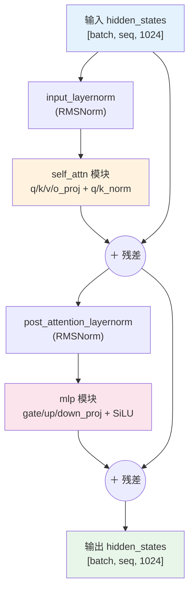
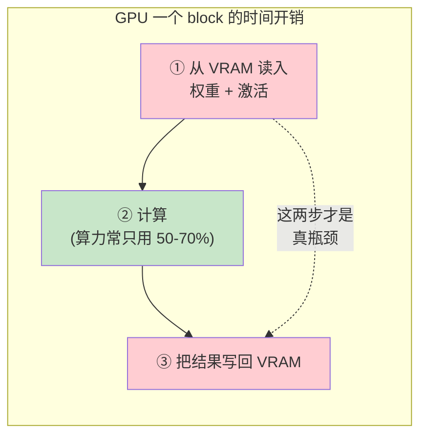
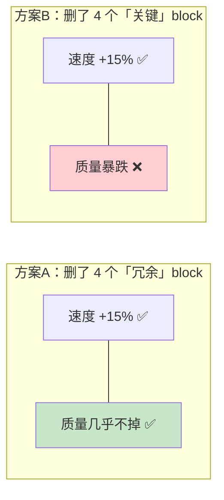
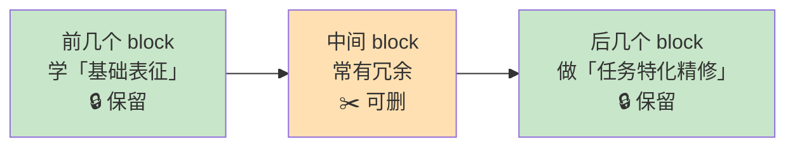
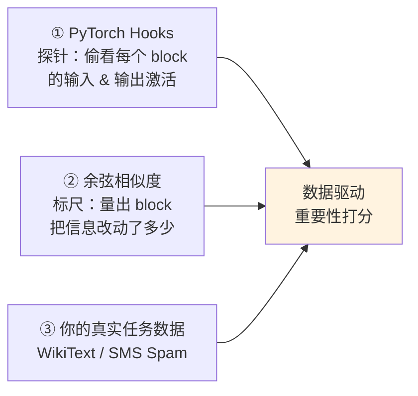
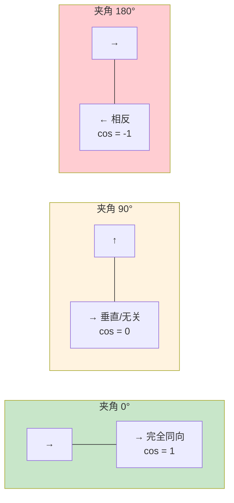
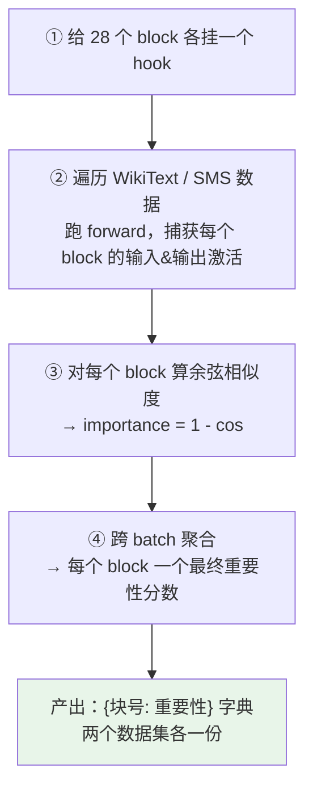
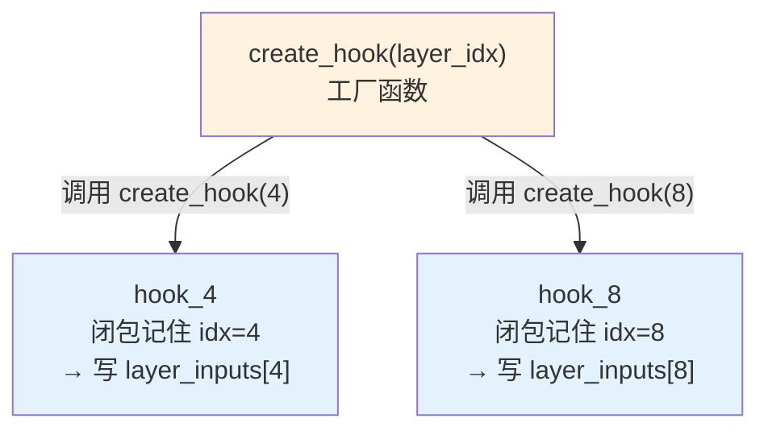
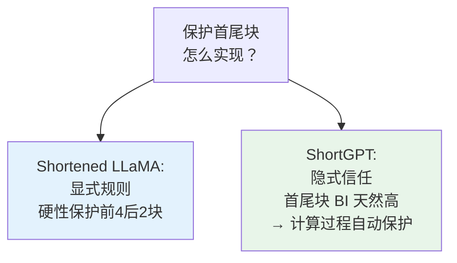
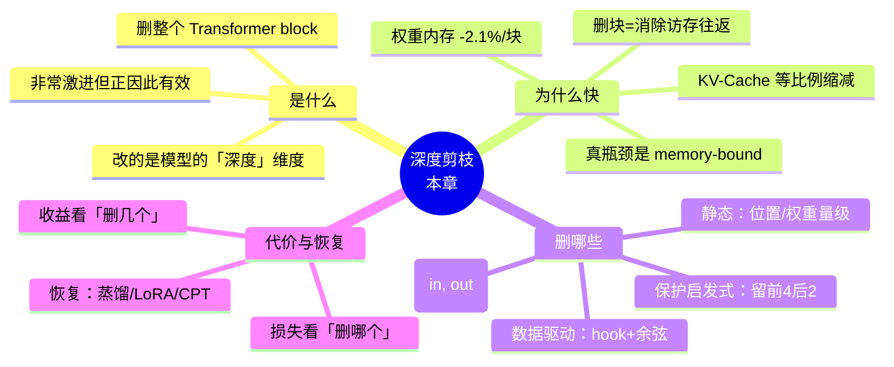

# 第 4 章 · 深度剪枝：更小更快 🪓

> 对应原书：**Chapter 4 — Building smaller and faster LLMs with depth pruning**（MEAP，Pere Martra），PDF 第 89–128 页。

---

## 🗺️ 本章地图（这章在全书的位置 & 读完你能会什么）

在前几章里，你已经把「重新架构（re-architecting）一个 LLM」这件事拆成了一条流水线：

```
选基座模型 → 【剪枝 Pruning】 → 知识恢复（蒸馏/微调） → 评估 → 部署
                    ↑ 你在这里
```

第 2、3 章你用过一招「粗暴」的做法——直接把模型**最后两个 block 砍掉**，看看会怎样。那属于「拍脑袋剪枝」。本章要做的，是把这个动作**从直觉升级成方法论**：

- **是什么**：深度剪枝（depth pruning）= 整块整块地删除 Transformer block（不是删单个权重）。
- **为什么快**：真正的加速来源不是「少算了几次乘法」，而是**少搬了几次数据**（memory-bound 瓶颈）。这是本章最反直觉、也最重要的一句话。
- **删哪些**：从最简单的**静态选择**（按位置、按权重大小），一路进阶到**数据驱动选择**（用 PyTorch hook 探针 + 余弦相似度，量出每个 block 对**你的数据**到底改动了多少信息）。
- **代价**：删得越多、选得越错，丢失的知识越多，后面「知识恢复」阶段就越费 GPU。
- **有没有理论撑腰**：本章方法直接对应两篇论文 **Shortened LLaMA**（Kim et al., 2024）和 **ShortGPT**（Men et al., 2024），后者的「Block Influence（BI）」指标和你手写的 `calculate_cosine_importance` 本质上是同一个东西，而且在 70B 模型上验证过。

读完本章，你将能够：亲手给 **Qwen3-0.6B** 装上「内部活动探针」，对 **WikiText**（通用长文本）和 **SMS Spam**（短信分类）两个截然不同的数据集分别算出「哪些层是打酱油的」，并据此剪出**两个特化模型**，最后用 loss / perplexity / 推理速度三类指标验证「按数据剪」确实优于「拍脑袋剪」。

---

## 4.1 深度剪枝的本质与好处 🧱

### 4.1.1 先统一术语：block / module / layer（别再混着叫了）

本书（以及 ShortGPT 等近期论文）沿用 Transformer 文献的标准三级术语，**面试和读论文都会用到**，务必分清：

| 术语 | 含义 | Qwen3 里的例子 | HuggingFace 里的位置 |
|---|---|---|---|
| **block（块）** | 完整的重复单元 = Attention + MLP + 归一化 | `Qwen3DecoderLayer` | `model.model.layers[i]` |
| **module（模块）** | block 内的功能组件 | `self_attn`、`mlp` | `layers[i].self_attn` |
| **layer（层）** | 单个计算操作 | `Linear`、`RMSNorm`、`SiLU` | `layers[i].mlp.gate_proj` |

> ⚠️ **常见坑**：HuggingFace 里那个属性偏偏叫 `model.model.layers`，但里面装的其实是**block**（`Qwen3DecoderLayer`）。所以「删一层 layer」在代码里对应的是「删一个 block」。本章说的「剪层」= 剪 block，这是全章的默认口径。

一个 Transformer block 的内部结构（对应原书 图 4.1）：



**深度剪枝 = 把上图这样一整个 block 从模型里抽掉**。抽掉它，你同时丢掉了一整套「信息变换过程」，这套变换是模型在**整个训练过程中一直存在**的。所以这是一种**非常激进（aggressive）**的剪枝——但正是这份激进，带来了下面要讲的好处。

> 🔬 **第一性原理：为什么删 block 而不是删权重？**
> 语言模型可以「深而窄」（deep & narrow，很多个 block、每个 block 处理能力小，靠层数堆变换）或「浅而宽」（wide，block 少但每层很能算）。删 block 改的是模型的**竖直维度（depth）**——把一个深模型变浅。经验规律：**初始越深（block 越多）的模型越扛得住深度剪枝**，因为 block 多 → block 之间的**功能冗余（functional redundancy）**多 → 删掉几个的影响被稀释。

### 4.1.2 好处：省内存 + 提速（而且主要不是因为「少算了」）

这一节是全章**最反直觉**的地方，务必吃透。

先看一个残酷的事实：**GPU 在推理时常常吃不饱**。它们贵、还越来越稀缺，但推理时**很少用到 50–70% 以上的数学算力**——大部分时间在「等数据到货」。这个状态叫 **memory-bound（访存受限）**：瓶颈不在「算」，在「搬」。



每删掉一个 block，你省下的**不只是那点乘法**，而是**一整轮「读 VRAM → 算 → 写回 VRAM」的访存往返**。这才是深度剪枝提速的主力。

深度剪枝带来三层收益：

**① 模型体积（权重内存）↓**
以 Qwen3-0.6B 为例：所有 Transformer block 加起来占模型大小的 **58%**，平均**每个 block 占 2.1%**。所以每删一个 block，加载模型所需内存就少 **2.1%**。

**② KV-Cache 增长 ↓（这个更关键）**
LLM 是**自回归（autoregressive）**逐 token 生成的：每生成一个新 token，都依赖前面所有 token。为此每一层都要在内存里**缓存之前所有 token 的 Key/Value 张量**——这就是 **KV-Cache**。

> 🔬 **第一性原理：KV-Cache 为什么是隐形吞内存怪兽？**
> KV-Cache **随序列长度线性增长**，长上下文时甚至能**超过模型参数本身的大小**。而它是**逐层**存的——你删掉一个 attention block，就等比例砍掉了这一层的 KV-Cache 增长。**删掉 25% 的层 ⇒ 每多生成一个 token，内存增长少 25%**。上下文越长，这个收益越夸张。

**③ 推理速度 ↑**
访存少了 → GPU 等待少了 → 直接体现为**推理更快**。既省了运算次数，又消除了访存瓶颈，双重加速。

> 💡 **实战 / 面试高频**：被问到「为什么剪层能加速，而不只是省显存？」——标准答案是：**LLM 推理是 memory-bound 的，删 block 消除的是访存往返，而不仅仅是 FLOPs**。能把 KV-Cache 那条线性增长讲清楚，基本就过了。

### ⚖️ 收益 vs. 代价：删多少 与 删哪些 是两件事

原书 图 4.2 传达了一个关键区分，**记牢**：

| 维度 | 取决于 | 例子 |
|---|---|---|
| **性能收益（+速度）** | **删了几个** block（跟删哪个无关） | 删 4 个 → 推理 +15%，无论删的是哪 4 个 |
| **知识损失（-质量）** | **删了哪几个** block（跟数量无关） | 删对了几乎无损，删错了质量崩塌 |



**结论**：既然「删几个」就锁定了加速幅度，那我们唯一能优化的就是「**删哪几个**」——选得越准，损失越小，后面知识恢复越省 GPU、恢复得越好。于是本章后半程全在解决一个问题：**怎么选**。

选择策略分两大流派：**静态（static / data-free）** 和 **数据驱动（data-driven）**。

---

## 4.2 静态 block 选择（简单、零成本、但"睁眼瞎"）👁️‍🗨️

**静态方法**只看模型的**结构和初始权重**，**不跑数据**。优点：极简、选择过程**零计算成本**、在通用模型上出奇地有效。适合「你对哪些 block 可删有直觉」的场景。

### 4.2.1 按位置删：首 / 尾 / 中间

最直接的思路——按 block 在模型里的位置来删。第 2 章你删「末尾两块」用的就是这招。这次演示**删中间 4 块**，稍微麻烦一点：得算出中间段的起止，切成前后两截再拼起来。

**Listing 4.1｜删除中间的 4 个 block**（逐行讲解）：

```python
from copy import deepcopy

num_to_remove = 4                                  # ① 打算删几个 block
num_layers = len(model.model.layers)               # ② 当前 block 总数（Qwen3-0.6B = 28）
mid_point = num_layers // 2                         # ③ 模型正中位置 = 14
start_remove_index = mid_point - (num_to_remove // 2)   # ④ 删除起点 = 14 - 2 = 12
end_remove_index = start_remove_index + num_to_remove   # ⑤ 删除终点(不含) = 12 + 4 = 16

print(f"Number of layers: {num_layers}")
print(f"Layers to remove {num_to_remove}.")
print(f"removing from {start_remove_index} to {end_remove_index - 1}")

pruned_model = deepcopy(model)                      # ⑥ 深拷贝一份，别动原模型
layers_before = pruned_model.model.layers[:start_remove_index]   # ⑦ 前半截：block 0~11
layers_after  = pruned_model.model.layers[end_remove_index:]     # ⑧ 后半截：block 16~27
pruned_model.model.layers = layers_before + layers_after         # ⑨ 拼接 → 新的 layers

print(f"Layers in pruned model: {len(pruned_model.model.layers)}")
print(f"Removed layers: {num_layers - len(pruned_model.model.layers)}")
```

**逐行拆解**：
- ①②③：先拿到总层数 28，算出正中点 `mid_point = 14`。
- ④⑤：以中点为轴，向两边各扩 `num_to_remove//2 = 2`，得到删除区间 `[12, 16)`，即 block **12、13、14、15**。
- ⑥ `deepcopy`：**关键**！不深拷贝的话你会改到内存里那个原始 `model`，后续实验就没参照了。
- ⑦⑧⑨：Python 切片把要保留的两段（`[:12]` 和 `[16:]`）取出来，用 `+` 拼成新的 `ModuleList` 赋回去。**删 block 在代码上就是「重建一个更短的 layers 列表」这么朴素**。

**输出**：
```
Number of layers: 28
Layers to remove 4.
removing from 12 to 15
Layers in pruned model: 24
Removed layers: 4
```

**为什么倾向于删中间 / 保留首尾？** 经验直觉是：



- **前几层**学的是**基础表征**（fundamental representations）；
- **后几层**做**任务相关的精修**（task-specific refinements）；
- **中间层**往往**冗余**。所以在一个 32 层模型里删中间 4 块 → 保留了 **87.5% 的深度**，同时基础变换和特化变换都还在。

由此演化出一条业界广泛接受的**保护启发式（preservation heuristic）**：

> 💡 **保护启发式（要记）**：**保留前 4 个 + 后 2 个 block**，其余的才作为剪枝候选。（具体数字随模型大小/层数微调。）

> ⚠️ **常见坑**：这仍然是**静态规则**。它默认「所有模型、所有任务的重要性分布都长得差不多」——这个假设**并不总成立**，尤其对经历过多轮微调的现代模型。后面 4.3 会用数据打脸它。

### 4.2.2 按权重大小删（magnitude-based）

比「看位置」更聪明一点：用**权重的量级（magnitude）**推断重要性。假设——**权重越小的 block，对数据的改动越小，贡献越小**。给每个 block 算一个聚合量级，删掉分数最低的几个。

**Listing 4.2｜删除量级最小的 block**：

```python
def calculate_layer_magnitude(layer):
    total_magnitude = 0
    for param in layer.parameters():                 # ① 遍历这个 block 的所有参数张量
        total_magnitude += torch.norm(param).item()  # ② 累加每个张量的 L2 范数
    return total_magnitude                            # ③ 返回该 block 的「总量级」

layer_magnitudes = []
for i, layer in enumerate(model.model.layers):        # A：逐个 block
    magnitude = calculate_layer_magnitude(layer)
    layer_magnitudes.append((i, magnitude))           # 记 (块号, 量级)

layer_magnitudes.sort(key=lambda x: x[1])             # B：按量级升序排（小的在前）
layers_to_remove = [idx for idx, _ in layer_magnitudes[:4]]   # C：取最小的 4 个块号
print(layers_to_remove)
```

**逐行拆解**：
- ①②③：一个 block 的「量级」= 它**所有参数张量的 L2 范数之和**（`torch.norm` 默认算 L2）。范数越大 ≈ 权重整体越「大」≈ 假定改动越多。
- A：对 28 个 block 各算一次，存成 `(块号, 量级)`。
- B：升序排序，最小的排最前。
- C：取前 4 个块号 = 理论上「贡献最小」的 4 个。

**这段代码选出的是**：`[8, 2, 7, 6]`。

> ⚠️ **常见坑**：注意 block **2** 落在了「保护启发式」圈定的前 4 块里！要不要强行套用保护启发式**由你决定**——但用静态方法时，**通常会保留它**。也就是说 magnitude 方法和保护启发式会打架，需要人工裁决。

### 4.2.3 静态 vs. 权重：都逃不过一个致命伤——不看上下文

**静态方法（无论按位置还是按权重）的共同软肋：对上下文一无所知（ignorance of the context）。**

| 反例 | 为什么静态方法会翻车 |
|---|---|
| 某 block 权重量级很小 | 可能只是**训练数据没激活**它的某些模式，但它对**你的特定任务**可能是命门 |
| 「最后几层可删」的架构假设 | 对**现代模型**或**多轮微调过**的模型未必成立——「保留后 2 层」这条启发式的存在，本身就说明这个问题真实存在 |
| 两个量级相近的 block | **功能可能天差地别**——量级相近 ≠ 角色相同 |

> 🔬 **第一性原理**：静态方法**忽略了 block 的功能**。一句「一般规则」在你的特定领域可能**完全说反**，删掉的恰好是你最需要保住的能力。

**什么时候用静态就够了？** 做**通用模型**、或者**手头没有任务数据**时。一旦要做**领域特化优化**，就必须上数据驱动方法——只有它能告诉你「对**你的**用例，哪些 block 真的重要」。

---

## 4.3 数据驱动的 block 选择（给模型装探针）🔬

核心洞见一句话：

> **一个 block 的重要性不是模型的绝对属性，而是相对于「它要处理的数据和任务」而言的。**

为了证明这点，本章用**两个截然不同的数据集**做对照：

| 数据集 | 内容 | 对模型的要求 | HuggingFace |
|---|---|---|---|
| **WikiText** | 维基百科文章，复杂叙事、长上下文 | 理解叙事结构、跨段落概念关系、深层文本连贯性 | `Salesforce/wikitext` |
| **SMS Spam** | 短信，标注为 spam / 正常 | 短、直接、词汇有限、句法简单，**不需要**长程关系 | `ucirvine/sms_spam` |

这俩差异是**故意**的：对 WikiText 关键的 block，处理 SMS 时可能**完全无关紧要**。用**静态方法根本没法**分辨「哪些层对哪类任务关键」。

要做数据驱动分析，需要**三样东西**：



在动手之前，先熟悉一下被试对象 **Qwen3-0.6B** 的结构。

**Listing 4.3｜Qwen3-0.6B 结构（精简标注）**：

```
Qwen3ForCausalLM(
 (model): Qwen3Model(
   (embed_tokens): Embedding(151936, 1024)        # 词表 15.2 万，隐藏维 1024
   (layers): ModuleList(                           # ← 这就是我们要剪的 block 列表
     (0-27): 28 x Qwen3DecoderLayer(               # 28 个完全相同结构的 block
       (self_attn): Qwen3Attention(
         (q_proj): Linear(1024 -> 2048, bias=False)   # 注意 q 投影到 2048（多头）
         (k_proj): Linear(1024 -> 1024, bias=False)
         (v_proj): Linear(1024 -> 1024, bias=False)
         (o_proj): Linear(2048 -> 1024, bias=False)
         (q_norm): Qwen3RMSNorm((128,), eps=1e-06)    # Qwen3 特有的 QK-Norm
         (k_norm): Qwen3RMSNorm((128,), eps=1e-06)
       )
       (mlp): Qwen3MLP(
         (gate_proj): Linear(1024 -> 3072, bias=False)  # SwiGLU 的门控分支
         (up_proj):   Linear(1024 -> 3072, bias=False)  # SwiGLU 的上投影分支
         (down_proj): Linear(3072 -> 1024, bias=False)  # 降回 1024
         (act_fn): SiLU()                               # SiLU/Swish 激活
       )
       (input_layernorm): Qwen3RMSNorm((1024,), eps=1e-06)
       (post_attention_layernorm): Qwen3RMSNorm((1024,), eps=1e-06)
     )
   )
   (norm): Qwen3RMSNorm((1024,), eps=1e-06)
   (rotary_emb): Qwen3RotaryEmbedding()             # RoPE 旋转位置编码
 )
 (lm_head): Linear(1024 -> 151936, bias=False)      # 输出投影回词表
)
```

**读懂它**：28 个 `Qwen3DecoderLayer` 是**堆叠**的，结构完全一样。这是一个**深而窄**（28 层深、隐藏维仅 1024）的模型——正是深度剪枝的理想被试。我们的目标：找出「对 WikiText / 对 SMS 各自打酱油」的 block，剪出**两个特化模型**。

### 4.3.1 用 PyTorch Hooks 偷看内部激活 🪝

**hook（钩子）是什么**：PyTorch 提供的机制，让你把一个函数**挂在任意 module 上**，数据每次流过这个 module 时函数就**自动执行**——**无需改模型代码、也无需改运行它的库**。这对「不侵入地观测内部」简直完美。

**forward hook 的函数必须是固定签名**，收 3 个参数：

| 参数 | 含义 |
|---|---|
| `module` | 挂钩子的那个 module 本身（如某个 `Qwen3DecoderLayer`） |
| `input` | **元组**，装着传给该 module `forward` 的输入张量 |
| `output` | 该 module `forward` 返回的输出张量（或张量元组） |

**先做个最小例子**：打印流过第 0 个 block 的张量形状。

```python
def print_shape_hook(module, input, output):
    input_tensor = input[0]                                  # A：input 是元组，取第 0 个才是张量
    print(f"Module class: {module.__class__.__name__}")
    print(f"Module id: {id(module)}")
    print(f"Input shape:  {input_tensor.shape}")
    print(f"Output shape: {output.shape}")
```

**挂钩子 + 触发**：

```python
first_layer = model.model.layers[0]                          # 拿到第 0 个 block
hook_handle = first_layer.register_forward_hook(print_shape_hook)  # 注册，返回 handle

test_text = "He sat on the river bank to fish"
inputs = tokenizer(test_text, return_tensors="pt").to(device)
with torch.no_grad():                                        # 只观测，不要梯度
    outputs = model(**inputs)
```

**输出**：
```
Module class: Qwen3DecoderLayer
Module id: 139523145412304
Input shape:  torch.Size([1, 8, 1024])
Output shape: torch.Size([1, 8, 1024])
```

**读懂形状 `[1, 8, 1024]`**：1 个序列（batch size=1）、8 个 token（这句话切出来 8 个）、每个 token 用 1024 维向量表示（= 模型隐藏维）。**注意输入和输出形状一模一样**——因为 block 只是「变换」信息，不改维度。这正是我们能拿输入 vs 输出比对的前提。

**用完记得摘钩子**：

```python
hook_handle.remove()   # 好习惯：不再分析时摘掉，避免每次前向都白跑一遍钩子
```

> 💡 **实战 / 面试高频**：hook 不只能「看」，还能「改」——你可以在 hook 里给激活**乘个系数、加噪声、甚至清零**（这其实就是一种「消融实验 / 临时删层」的做法）。但本章只用它**捕获输入/输出激活**，喂给重要性指标。

### 4.3.2 理解余弦相似度（为什么不用欧氏距离）📐

有了输入/输出激活，还需要一把**标尺**量「信息在 block 里被改了多少」。

Qwen3-0.6B 里信息以 **1024 维向量**流动。比较两个高维向量，最朴素的是**欧氏距离（Euclidean distance）**——但它**同时对「长度（magnitude）」和「方向（direction）」敏感**。

> 🔬 **第一性原理：为什么选余弦而不是欧氏？**
> 向量的**长度可以变，但含义不变**；真正编码语义的是**方向**。余弦相似度只量**两向量之间的夹角**，只关心方向/朝向，正好过滤掉「长度」这个噪声。

把向量想成从同一原点出发的箭头（原书 图 4.4）：



| 夹角 | 余弦相似度 | 含义 |
|---|---|---|
| 0° | **1** | 方向完全相同，朝向一致 |
| 90° | **0** | 垂直，方向完全不相关 |
| 180° | **-1** | 方向相反 |

**用到剪枝上**：若某 block **几乎不改动**信息 → 输入向量和输出向量方向几乎一致 → 相似度 **≈ 1.0**；若 block 做了**大变换** → 两向量方向差得多 → 相似度**下降**。

**动手验证一下**（用 `sentence_transformers` 造三句话的向量，两句语义相近、一句离题）：

```python
from sentence_transformers import SentenceTransformer
import torch
import torch.nn.functional as F

modelst = SentenceTransformer('all-MiniLM-L6-v2')      # A：小而好用的句向量模型
sentences = [
    "The cat naps on the sofa.",                       # 句1
    "The feline is peacefully slumbering on the couch.",  # 句2：和句1同义、更长
    "The bus stops at the corner."                     # 句3：完全另一个话题
]
embeddings = modelst.encode(sentences, convert_to_tensor=True)
print(f"Embedding shape: {embeddings.shape}")          # -> torch.Size([3, 384])
```

3 句各变成 384 维向量。**算余弦相似度（两步走）**：

```python
embeddings_normalized = F.normalize(embeddings, p=2, dim=1)   # A：先 L2 归一化（长度化为 1）
# 归一化后，点积 = 余弦相似度
similarity_matrix = torch.mm(embeddings_normalized,
                             embeddings_normalized.t())        # 一次矩阵乘算出所有两两组合
print(f"Sentence 1 vs 2: {similarity_matrix[0][1]:.4f}")
print(f"Sentence 1 vs 3: {similarity_matrix[0][2]:.4f}")
```

**输出**：
```
Sentence 1 vs Sentence 2: 0.6106
Sentence 1 vs Sentence 3: 0.0563
```

符合预期：句 1↔2 语义相近（0.61，虽然长度不同），句 1↔3 几乎无关（0.06 ≈ 0）。

> 🔬 **点积 = 余弦（归一化后）为什么成立？**
> 余弦相似度公式 $\cos\theta = \dfrac{\mathbf{a}\cdot\mathbf{b}}{\|\mathbf{a}\|\,\|\mathbf{b}\|}$。**先把向量归一化**（$\|\mathbf{a}\|=\|\mathbf{b}\|=1$），分母就变成 1，于是**余弦相似度直接等于点积**。点积就是「对应元素相乘再全部求和」，例如归一化后的 `[0.6, 0.8]` 和 `[1, 0.0]`，点积 = $0.6\times1 + 0.8\times0 = 0.6$。代码里用 `torch.mm` 做矩阵乘，**一次性**算出所有两两组合，高效。

### 4.3.3 跨数据集分析 block 贡献（完整流水线）🔧

把两块拼起来，构成**完整评估流水线**（原书 图 4.5）：



**第一步 · 挂钩子（工厂函数写法）**

**Listing 4.4｜配置 hook 捕获激活**：

```python
def setup_layer_hooks(model):
    num_layers = len(model.model.layers)
    layer_inputs = {}    # A：块号 -> 该块输入激活
    layer_outputs = {}   # A：块号 -> 该块输出激活
    hooks = []

    def create_hook(layer_idx):                 # B：工厂函数（不是 hook 本身！）
        def hook(module, input, output):        # C：真正的 hook
            input_tensor = input[0] if isinstance(input, tuple) else input
            layer_inputs[layer_idx] = input_tensor.detach()      # E：存输入（detach 脱离计算图）
            output_tensor = output[0] if isinstance(output, tuple) else output
            layer_outputs[layer_idx] = output_tensor.detach()    # E：存输出
        return hook

    for i, layer in enumerate(model.model.layers):
        hooks.append(
            layer.register_forward_hook(create_hook(i))          # F：给每个 block 挂上带 i 的 hook
        )
    return hooks, layer_inputs, layer_outputs, num_layers
```

**两个关键点必须懂**：

**① 工厂函数（factory function）技巧——为什么不直接写 hook？**
我们有 28 个 block，需要 28 个 hook，且**每个要把激活存进不同的键**（`layer_inputs[0]`、`layer_inputs[1]`…）。如果直接写一个 hook，它内部的 `layer_idx` 会共享，全存到同一个键。解法：用 `create_hook(layer_idx)` 这个**工厂**，每次调用返回一个**记住了当时 `layer_idx` 值**的新 hook（**闭包 closure**）。调 `create_hook(4)` 和 `create_hook(8)` 返回的代码一样，但一个内部是 `layer_inputs[4]`、另一个是 `layer_inputs[8]`。



**② `.detach()`——为什么必须调？**
`.detach()` 创建一个**共享底层数据、但脱离计算图（computational graph）**的新张量。这样能**阻止梯度累积**、**释放本会用于存梯度的 GPU 显存**。我们只观测、不训练，梯度是纯浪费——不 detach 会白白吃显存甚至 OOM。

> ⚠️ **常见坑**：`input` 是**元组**，`output` 有时也是元组（取决于 module 返回啥）。所以要 `input[0]` / `output[0] if isinstance(...)` 判断一下，直接当张量用会报错。

**第二步 · 算余弦重要性**

**Listing 4.5｜计算 block 重要性**：

```python
def calculate_cosine_importance(input_tensor, output_tensor,
                                layer_idx, is_first_batch=False):
    if input_tensor.numel() == 0 or output_tensor.numel() == 0:
        return 0.0                                       # A：空张量直接给 0，防崩

    input_flat  = input_tensor.view(input_tensor.size(0), -1)    # B：展平成 [batch, 特征]
    output_flat = output_tensor.view(output_tensor.size(0), -1)  # B：同上
    similarities = F.cosine_similarity(input_flat, output_flat, dim=1)  # 逐样本算余弦

    finite_similarities = similarities[torch.isfinite(similarities)]    # C：滤掉 inf/nan
    if finite_similarities.numel() == 0:                 # D：全是 inf/nan 的兜底
        if is_first_batch:
            print(f"Warning: Layer {layer_idx} produced all inf/nan")
        return 0.0

    importance = 1.0 - finite_similarities.mean().item() # E：重要性 = 1 - 平均余弦相似度
    return importance
```

**核心一行是 E**：

$$\text{importance} = 1 - \overline{\cos(\text{input}, \text{output})}$$

**为什么是「1 减」？** 相似度高（≈1）= block 几乎没改动信息 = **重要性低**（≈0）。反过来相似度低 = 改动大 = 重要性高。举例：

| 余弦相似度 | 含义 | → 重要性 |
|---|---|---|
| 0.99 | 几乎没变 | **0.01**（打酱油，可删） |
| 0.60 | 大幅变换 | **0.40**（干实事，别删） |

**B 行 `.view(batch, -1)`**：把 `[batch, seq, 1024]` 展平成 `[batch, seq*1024]`，这样每个样本变成一个长向量，逐样本算余弦。C 行滤 `inf/nan` 是**数值鲁棒性**——高维运算偶尔会溢出。

**第三步 · 编排整个流程**

**Listing 4.6｜完整 block 重要性分析流水线**：

```python
def calculate_layer_importance_cosine(model, dataloader, device):
    hooks, layer_inputs, layer_outputs, num_layers = setup_layer_hooks(model)  # A：挂钩子
    layer_importance_scores = {i: [] for i in range(num_layers)}

    with torch.no_grad():                                          # B：不要梯度
        for batch_idx, batch in enumerate(tqdm(dataloader, desc="Processing batches")):
            inputs = {k: v.to(device) for k, v in batch.items()}   # C：搬到 GPU
            model(**inputs)                                        # D：跑前向，hook 自动填激活

            for layer_idx in range(num_layers):                    # E：逐 block 算重要性
                if layer_idx not in layer_inputs or layer_idx not in layer_outputs:
                    layer_importance_scores[layer_idx].append(0.0)
                    continue
                importance = calculate_cosine_importance(
                    layer_inputs[layer_idx],
                    layer_outputs[layer_idx],
                    layer_idx)
                layer_importance_scores[layer_idx].append(importance)

            layer_inputs.clear()                                   # 清掉本 batch 激活，省显存
            layer_outputs.clear()

    [hook.remove() for hook in hooks]                              # F：全部摘钩子

    final_scores = {}
    for layer_idx, scores in layer_importance_scores.items():
        valid_scores = [s for s in scores if np.isfinite(s)]
        if not valid_scores:
            raise RuntimeError(f"Layer {layer_idx} not captured. Hook 失败")
        else:
            final_scores[layer_idx] = np.mean(valid_scores)        # 跨 batch 求平均
    return final_scores
```

**流程串起来**：挂钩子 → 每个 batch 跑一次前向（钩子自动把激活填进 `layer_inputs/outputs`）→ 逐 block 算重要性 → 存进列表 → 清激活（省显存）→ 所有 batch 跑完后摘钩子、跨 batch 求平均 → 得到每个 block 的最终分。

> 💡 **实战 / 面试高频（生产 vs 实验的取舍）**：这份代码为了**实验灵活**，把张量返回出来供你算各种指标。但**生产环境**应该把「重要性计算」直接搬进 hook 里——这样就**不用把巨大的输入/输出张量存在字典里**，只留标量分数聚合即可，**大幅省显存**。这正是 4.5 实战题「优化 hook」的方向。

**跑起来**（对两个数据集各跑一遍）：

```python
wiki_importance = calculate_layer_importance_cosine(model, dataloaderwiki, device)
sms_importance  = calculate_layer_importance_cosine(model, dataloadersms,  device)
```

得到两个字典，形如（`sms_importance` 节选）：

```python
{0: 0.8968,   # block 0：重要性极高（改动巨大）
 1: 0.2781,
 2: 0.9489,   # block 2：SMS 下最重要
 3: 0.00145,  # block 3：几乎打酱油！
 4: 0.00196,
 5: 0.00242,
 ...
 25: 0.0212,
 26: 0.0171,
 27: 0.1465}  # block 27（末层）：重要性回升
```

### 4.3.4 挑出要删的 block 🗑️

有了重要性分数，就能删「对**你的数据**影响最小」的 block 了。但**决策不是无脑取最小**——重要性分数是**指南（guide），不是绝对真理**。

> ⚠️ **常见坑**：有些低分 block 可能在做**微妙但关键**的变换，只在数据集的**特定样本**上才显现。别只看分数一刀切。

**几条实操原则**：

1. **首尾 block 永远保留**（保护启发式，always good practice）。
2. **删连续块 还是 删分散块？取决于你用什么指标评估**：

| 评估指标 | 更优的删法 | 原因 |
|---|---|---|
| **困惑度（perplexity）** | 删**分散**的块（按重要性挑） | 语言建模层面，分散删损失更小 |
| **实际任务**（分类/问答/推理） | 删**连续**的块 | 实际任务上连续删往往更有效 |

**两数据集结果对比（原书 图 4.6 + 表 4.1）**——**最重要的 block**（改动信息最多）：

**表 4.1｜Top blocks（两数据集的高分块）**

| Block Id | WikiText | SMS_Spam |
|---|---|---|
| Block **0** | **0.890** | 0.897 |
| Block 1 | 0.308 | 0.277 |
| Block **2** | 0.772 | **0.949** |
| Block 27 | 0.173 | 0.147 |

**读表**：两数据集**最重要的三块都是前三块（0/1/2）**，只是排序不同——WikiText 头名是 block 0（.890），SMS 头名是 block 2（.949）。**这正好印证了「保留前 4 后 2」的保护启发式**。

**最不重要的 block（删除候选）** 就大不一样了：

**表 4.2｜SMS_Spam 下最不重要的块**

| Block | SMS_Spam | WikiText | 对比 |
|---|---|---|---|
| Block 3 | **0.0015** | 0.044 | WikiText 高 ~29 倍 |
| Block 4 | 0.0019 | 0.051 | WikiText 高 ~27 倍 |
| Block 5 | 0.0023 | 0.048 | WikiText 高 ~21 倍 |
| Block 6 | 0.0028 | 0.047 | WikiText 高 ~17 倍 |

**表 4.3｜WikiText 下最不重要的块**

| Block | WikiText | SMS_Spam |
|---|---|---|
| Block 7 | 0.0334 | 0.0030 |
| Block 18 | 0.0379 | 0.0090 |
| Block 8 | 0.0402 | 0.0034 |
| Block 20 | 0.0424 | 0.0168 |

> 🔬 **第一性原理：这两张表讲了整章最核心的故事**
>
> **① SMS 的酱油块「扎堆在前部」（3/4/5/6，紧挨初始层），且分数极低（0.0015~0.0028）**——因为短信简单，模型早早就「处理完了」，中间那些为复杂叙事准备的变换根本没被激活。→ **SMS 适合激进深度剪枝**。
>
> **② 同样这几块，在 WikiText 下分数高一个数量级（0.044~0.051）**——证明它们**不是模型里的死重（redundant）**，只是**SMS 用不上**而已。
>
> **③ WikiText 的酱油块「分散在全网络」（7/18/8/20），且最低分（0.0334）也比 SMS 最低分（0.0015）活跃 20 多倍**——复杂任务的「精修工作」是**分布式**的，很难找到成片的冗余。→ **WikiText 只适合有限剪枝**。
>
> 一句话：**block 重要性不是固定的，它随数据/任务而变**。这就是数据驱动方法击败静态方法的根本原因。

**用辅助函数选块**：

**Listing 4.7｜选择要删的 block**：

```python
def select_layers_to_prune(importance_scores,
                           num_layers=2,
                           heuristic_protection=True,     # 是否保护首尾块
                           adjacent_protection=True):     # 是否禁止删相邻块
    sorted_layers = sorted(importance_scores.items(), key=lambda x: x[1])  # 按分数升序（最不重要在前）
    selected = []
    for layer, score in sorted_layers:
        if heuristic_protection and layer in [0, 1, 2, 3, 27]:   # 保护前4后1（首尾）
            continue
        if adjacent_protection and any(abs(layer - l) == 1 for l in selected):  # 已选的相邻位不再选
            continue
        selected.append(layer)
        if len(selected) >= num_layers:
            break
    return selected
```

**逐行**：升序排 → 遍历「最不重要」的块 → 若开了 `heuristic_protection` 就跳过首尾保护名单 `[0,1,2,3,27]` → 若开了 `adjacent_protection` 就跳过与已选块**相邻**的块（避免删连续段）→ 选够 `num_layers` 个为止。

**跑一下**：

```python
wiki_layers_2_remove = select_layers_to_prune(wiki_scores,   num_layers=3)  # -> [7, 18, 20]
sms_layers_2_remove  = select_layers_to_prune(sms_importance, num_layers=3)  # -> [4, 6, 8]
```

- WikiText 删 `[7, 18, 20]`（分散）；
- SMS 删 `[4, 6, 8]`（都在前中部，且因 adjacent 保护跳过了 5/7，避免连续）。

**造出两个特化模型**：

```python
wiki_model = prune_model(model=deepcopy(model), pruning_type="DEPTH",
                         layer_indices=wiki_layers_2_remove, show_progress=True)
sms_model  = prune_model(model=deepcopy(model), pruning_type="DEPTH",
                         layer_indices=sms_layers_2_remove,  show_progress=True)
```

现在你有两个模型：**层数相同（都少了 3 块）、但行为不同**——理论上各自为一个数据集做了特化。下面用基准验证。

### 4.3.5 基准评估：真的「按数据剪」更好吗？📊

我们要验证的不只是「掉了多少」，而是——**用某数据集引导剪出的模型，在同数据集上是否真的更强**。分三类指标看。

#### ① 任务专属性能（Loss / Perplexity，越低越好）

**Listing 4.8｜计算 loss 与 perplexity**：

```python
def evaluate_metrics(model, dataloader, device='cuda'):
    model.eval(); model.to(device)
    total_loss = 0; total_tokens = 0
    with torch.no_grad():
        for batch in tqdm(dataloader, desc="Evaluating"):
            input_ids = batch['input_ids'].to(device)
            attention_mask = batch['attention_mask'].to(device)

            labels = input_ids.clone()                    # A：标签 = 输入本身（预测下一个 token）
            labels[attention_mask == 0] = -100            # padding 位置设 -100 → loss 忽略

            outputs = model(input_ids, attention_mask=attention_mask, labels=labels)  # B

            num_real_tokens = attention_mask.sum().item() # C：本 batch 真实 token 数
            total_loss += outputs.loss.item() * num_real_tokens   # 按真实 token 数加权
            total_tokens += num_real_tokens

    avg_loss = total_loss / total_tokens
    perplexity = np.exp(avg_loss)                         # 困惑度 = e^(平均loss)
    return {'loss': avg_loss, 'perplexity': perplexity}
```

**逐点讲**：
- **A**：语言模型的任务是「预测下一个 token」。所以标签直接用 `input_ids` 自己（HF 内部会自动错位对齐）。`labels[mask==0]=-100` 让 **padding 位置不计入 loss**（-100 是 PyTorch 交叉熵的忽略标记）。
- **B**：传入 `labels`，模型内部就算好 loss。
- **C**：按**真实 token 数加权**累加，最后除以总真实 token 数得平均 loss——这样不同长度的 batch 权重公平。
- **困惑度（perplexity）= $e^{\text{avg\_loss}}$**，直观理解为「模型对这段文本有多困惑」。

> 🔬 **Loss 与 Perplexity 的第一性原理**：对每个 token，模型输出整个词表上的概率分布。**Loss** = 预测分布与真实 next-token 的差距（交叉熵）。**Perplexity** = loss 取指数，可粗略理解为「模型平均在多少个候选里犹豫」——PPL=40 ≈ 平均在 40 个词里纠结。两者都越低越好。

**结果（都未做任何知识恢复，纯剪完直接测）**：

**表 4.4｜在 SMS_Spam 数据集上**

| 模型 | SMS Loss | SMS Perplexity |
|---|---|---|
| Base（原模型） | **5.617** | **275.2** |
| **SMS model** | 6.009 | **407.2** ✅ |
| Wiki model | 6.098 | 445.1 |

**表 4.5｜在 WikiText 数据集上**

| 模型 | Wiki Loss | Wiki Perplexity |
|---|---|---|
| Base（原模型） | **3.720** | **41.3** |
| **Wiki model** | 4.410 | **82.3** ✅ |
| SMS model | 4.504 | 90.4 |

**结论**：两个剪枝模型都比原模型差（意料之中，删了 3 块又没恢复）。**但关键在对比**：在 SMS 上，**SMS model（407.2）> Wiki model（445.1）**；在 WikiText 上，**Wiki model（82.3）> SMS model（90.4）**。**「按数据引导选块」确实降低了在该数据集上的剪枝损失**——这份更小的能力损失，会让后续「知识恢复」阶段更省力、效果更好。

#### ② 通用推理能力（跑通用 benchmark）

**表 4.6｜通用基准结果（越高越好）**

| 模型 | ARC-Easy | HellaSwag | Lambada | WinoGrande |
|---|---|---|---|---|
| Base | **0.59** | **0.43** | **0.41** | **0.62** |
| SMS model | 0.38 | 0.35 | 0.16 | 0.50 |
| **Wiki model** | **0.50** | **0.38** | **0.24** | 0.49 |

**读表**：两个剪枝模型都比 Base 弱（意料之中）。但 **Wiki model 在 4 个里的 3 个上都赢过 SMS model**。合理——WikiText 又丰富又复杂，需要广博的推理和世界知识；**保住了 WikiText 关键块 = 间接保住了模型的通用知识底座**。而 SMS model 删掉的 block 4/6/8 位置偏前，虽然对短信不关键，却对**通用推理有贡献**——所以通用能力掉得更狠。

> 💡 **实战决策**：
> - 只做**单一任务的极致高效模型**（如 SMS 分类）→ 选 **SMS model**，它丢的通用能力对你没用。
> - 要**多面手、跨任务表现好** → 选 **Wiki model**。
> **没有绝对更好的剪法，只有更适合你目标的剪法。**

#### ③ 性能收益（这才是深度剪枝的初衷：更快）

三个关键推理指标：

| 指标 | 含义 |
|---|---|
| **Inference Time** | 生成固定长度回复的总耗时 |
| **TTFT（Time To First Token）** | 出**第一个 token**的时间，交互式应用里用户「感觉快不快」的命门 |
| **Throughput** | 每秒生成 token 数，算力效率的直接指标 |

**表 4.7｜推理性能基准（T4 GPU，Colab，GPU 预热 + 各 10 条数据）**

| 模型 | Inference Time | TTFT | Throughput |
|---|---|---|---|
| Base（wiki 数据） | 2.273s ± 0.044 | 53.59ms ± 1.59 | 22.01 tok/s ± 0.43 |
| **Wiki model** | 2.049s（**+9.8%**） | 47.98ms（**+9.0%**） | 24.40 tok/s（**+10.9%**） |
| Base（SMS 数据） | 2.290s ± 0.005 | 52.39ms ± 0.34 | 21.84 tok/s ± 0.05 |
| **SMS model** | 2.023s（**+11.7%**） | 46.03ms（**+11.6%**） | 24.72 tok/s（**+13.2%**） |

**结论**：仅删 3 块，所有指标就有 **9%~13%** 的稳定提升。

> ⚠️ **常见坑（别被小模型骗了）**：这里用的是**极小模型**，对 GPU 造不成大压力，所以提升「只有」9~13%。**模型越大、搬的数据越多，深度剪枝的加速越明显**（下一节 LLaMA-7B 的数据就夸张多了）。重复实验数字会略有波动，但**趋势不变**。

---

## 4.4 从论文到实践（两篇论文给你撑腰）📄

本章方法建立在两篇论文上，理解它们能让你在面试/汇报时「说得出处」：

### 📗 Shortened LLaMA（Kim et al., 2024）

**核心贡献**：证明**小 batch 场景下，深度剪枝比宽度剪枝更能加速推理**。其分析印证了本章的前提——删 block 不只减参数，更**消除了每块的「读写内存」昂贵往返**，直接改善延迟。

**震撼数据**：对 LLaMA-7B 剪 **35%**，其深度剪枝方法把**延迟降低 33%（2.4s → 1.6s）**、**吞吐提升 49%（53.7 → 80.1 tok/s）**；而**宽度剪枝方法反而拖慢了推理**。这坐实了：若主要目标是提速，**深度剪枝是正确策略**。

**它怎么选块（两种指标）**：

| 指标 | 怎么算 | 代价 |
|---|---|---|
| **Perplexity** | 逐个临时删块，看模型困惑度涨多少；涨得猛=关键，几乎不涨=可删 | **贵**：28 块模型要在校准集上跑 **28 次**推理 |
| **Taylor 近似** | 估计「删该块后 loss 会涨多少」 | 中等：只需**一次 forward/backward**，但**要算梯度**（额外开销） |

### 📘 ShortGPT（Men et al., 2024）——本章方法的直系亲属

**核心贡献**：提出 **Block Influence（BI）** 指标。而 **BI 的定义就是 `1 - 块输入输出的余弦相似度`**——

> 🔬 **BI ≡ 你手写的 `calculate_cosine_importance`**。本章 4.3 实现的绝不是「土办法」，而是**有正式研究背书、在最高 70B 参数模型上验证过**的指标。

**为什么这个「一次前向」的简单指标这么猛（原书引论文 Table 2）**：

| 方法 | 剪 27.1% 后保留的平均性能（14 个 benchmark 均值，**未做知识恢复**） |
|---|---|
| **ShortGPT（BI）** | **86.3%** ✅ |
| LLMPruner | 72.8% |
| SliceGPT | 68.7% |

**一个简单的、只需单次前向的指标，反超了需要梯度信息或多次迭代的复杂方法。** 论文还给出相关性证据：对 Llama2-7B，**低 BI（≈0.05）的中间块删掉几乎不涨困惑度，高 BI（>0.4）的初始块一删困惑度暴涨**——与本章表 4.1~4.3 的观察完全吻合。

### 🔒 关于「保护首尾块」，两篇论文态度不同



### 🔧 关于「知识恢复」——剪完之后怎么补回来（下几章的活）

两篇论文都强调**必须做知识恢复**来抵消性能下降：

| 论文 | 恢复策略 | 结论 |
|---|---|---|
| Shortened LLaMA | **LoRA** vs **Continued Pretraining (CPT)** | 中等剪枝 LoRA 够用；**激进剪枝（>40%）CPT 更好** |
| ShortGPT | 用**轻量 MLP 层替换被删块**后再训练 | 也能显著恢复 |

> 💡 **本书的选择**：后续章节主力恢复工具是**知识蒸馏（Knowledge Distillation）**；**LoRA 不当通用恢复手段用，而是留作「领域特化」工具**（见第 7 章）。本章方案是「混搭」——没有哪篇论文 100% 对得上本章开发，这很正常：**从各研究里取最适合自己需求的部分**。很多时候我们要的不是新技术，而是**对自己想法的验证**——ShortGPT 在 70B 上的实验，恰好验证了本章在 0.6B 小模型上的选块技巧**能 scale 上去**。

---

## 4.5 动手实验室（Hands-on Lab）🧪

原书给了 5 个练习，用来培养「何时用哪种选块策略、能剪多激进、怎么为生产优化」的直觉：

| # | 做什么 | 要回答的问题 |
|---|---|---|
| **1｜静态 vs 数据驱动** | 用 4.2.2 的 magnitude 法选出的 `[8,2,7]` 剪枝 | 它在困惑度/通用基准上比 wiki_model、sms_model 差多少？ |
| **2｜关掉保护启发式** | 对 SMS 数据集，逐一关闭 `heuristic_protection`、`adjacent_protection` | 现在选出哪些块？包含首 4 / 末块吗？保护是**真防灾**还是**过度保守**？ |
| **3｜渐进退化分析** | 数据驱动地依次删 2/3/4/5/6 块，画退化曲线 | 退化是线性还是**某点突然加速**？能找到「崩溃点」吗？ |
| **4｜为生产优化 hook** | 把重要性计算**搬进 hook 内部**，只保留标量分数（不存大张量） | 耗时变化大吗？**内存效率 vs 可调试性**的权衡如何？ |
| **5｜换更大模型** | 用 Qwen3-1.7B 重跑核心实验 | 重要性模式变了吗？首尾块仍最关键吗？同比例剪枝时大模型保得更好吗？SMS 的「酱油块」还扎堆在前中部（4-10）吗？ |

> ⚠️ **实验坑**：分析更大模型**慢得多**。Colab 免费版（T4，~15GB VRAM）**装不下多份模型副本**——可分次跑、存中间结果、最后聚合出图。遇到 OOM 就调小 `RECOVERY_SAMPLES`（如 500）或减小 batch size。

---

## 📌 小结



- **深度剪枝删的是整个 block**，虽激进，但精准打击了 LLM 推理的真瓶颈——**内存与计算单元之间的数据搬运**，而不只是运算量。
- **首要收益是减少 memory-bound 操作**：每删一块 = 少一轮「读 VRAM → 算 → 写回」，直接改善延迟与吞吐；同时 KV-Cache 等比例缩减，长上下文时收益更大。
- **静态选块**（按位置/按权重）简单且零计算成本，但**无视模型如何处理你的数据**；「保前 4 后 2」的启发式给了些安全垫，但仍是一刀切的通用规则。
- **PyTorch hooks** 让你在推理时**不改代码**就拦截并捕获任意 module 的输入/输出激活——用 `register_forward_hook()` 挂上收 `(module, input, output)` 的函数。
- **block 重要性不是绝对的，随数据/任务而变**：对 WikiText 复杂叙事关键的块，处理 SMS 短信时可能近乎打酱油，反之亦然。
- **Shortened LLaMA 与 ShortGPT 两篇论文** 验证了深度剪枝在降延迟上**优于宽度剪枝**，且确认**基于余弦的重要性指标（BI）在最高 70B 参数模型上都有效**——你手写的那个指标，是有正式研究背书的。

---

## 🔗 延伸阅读

**本书内**：
- 第 2、3 章 — 剪枝流水线的起点（你在那里第一次「删末尾两块」，本章把它升级成方法论）。
- 第 5 章「宽度剪枝」 — 与本章「深度剪枝」对照：宽度剪枝删的是 attention 头 / MLP 维度，加速逻辑不同（论文显示小 batch 下宽度剪枝反而可能变慢）。
- 第 6 章「蒸馏恢复知识」 — 用**知识蒸馏**把剪枝损失补回来（本章最后强调的第二阶段）。
- 第 7 章「模型专化」 — **LoRA 做领域特化**（本书不把 LoRA 当通用恢复，而留作特化工具）。

**仓库内（llm-action / Enigneer-infra 相关）**：
- `llm-inference/` — KV-Cache、memory-bound、TTFT/Throughput 等推理指标的系统讲解，与本章 4.1.2、4.3.5 深度互补。
- `ai-infra-architecture/` — GPU 利用率、访存瓶颈、算力 vs 带宽（roofline 模型）的第一性原理，解释「为什么 GPU 推理常吃不饱」。
- `llm-compression/`（如有）— 剪枝 / 量化 / 蒸馏三大压缩技术的横向对比与选型。

**原始论文**：
- Kim et al., 2024. *Shortened LLaMA: Depth Pruning for Large Language Models with Comparison of Retraining Methods.*
- Men et al., 2024. *ShortGPT: Layers in Large Language Models are More Redundant Than You Expect.*（Block Influence 指标出处）
