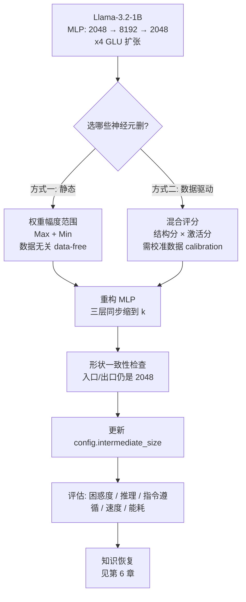
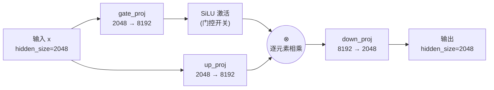
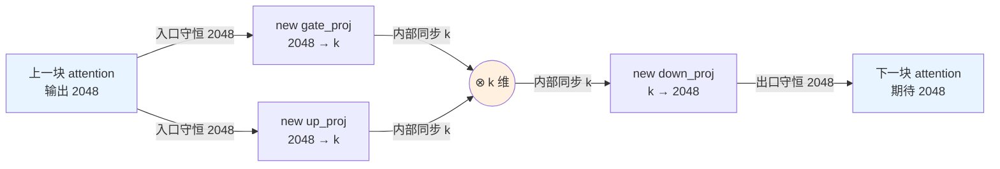
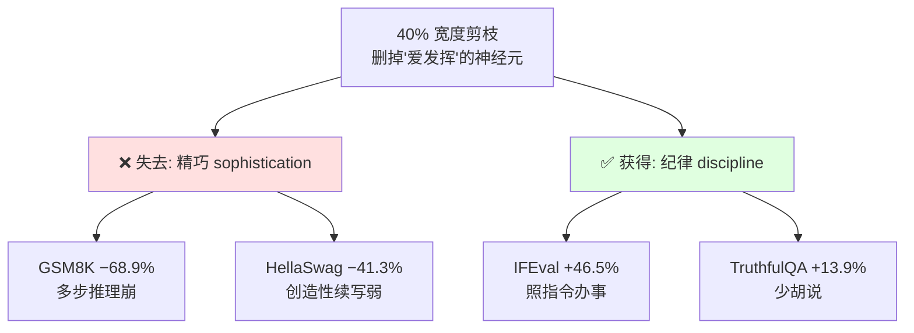
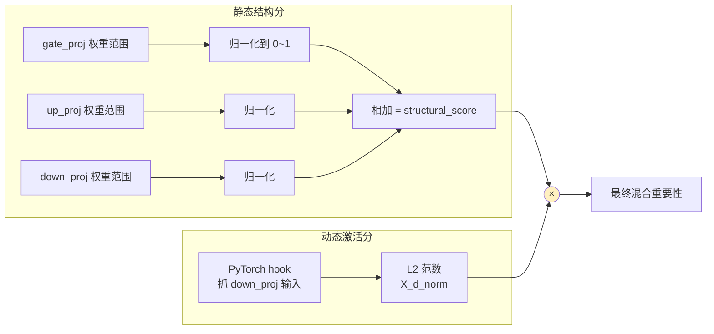
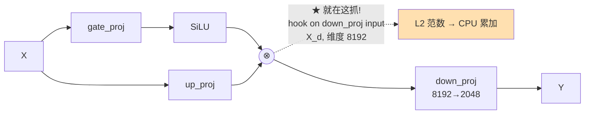

# 第 5 章 · 宽度剪枝：塑形模型（Width Pruning：Shaping Model Architectures）

> 逐章精讲《Rearchitecting LLMs》(Pere Martra, Manning MEAP)
> 对应原书第 5 章 "Shaping model architectures via width pruning"（PDF p.129–181）
> 主线模型：**Llama-3.2-1B**（MLP 采用 x4 GLU 扩张）

---

## 🗺️ 本章地图（这章在全书的位置 & 读完能会什么）

《Rearchitecting LLMs》的核心是一条**「模型再架构流水线」**：
`建立基线 → 剪枝（Pruning）→ 知识恢复（Knowledge Recovery）→ 专精化（Specialization）`。

前面几章你已经学过：

| 章 | 主题 | 剪枝粒度 | 一句话 |
|---|---|---|---|
| 2 | 端到端项目 | 深度 | 把整条流水线跑一遍，先建立直觉 |
| 3 | 现代 Transformer 蓝图 | —— | 认识 GLU / SwiGLU / SiLU 等零件 |
| 4 | **深度剪枝**（Depth Pruning）| 整块 Transformer Block | 最猛的刀：一刀砍掉一整层 |
| **5** | **宽度剪枝**（Width Pruning）| **单个神经元 / 神经元对** | **本章：绣花针，逐个删 MLP 神经元** |
| 6 | 知识恢复（蒸馏）| —— | 剪完变笨了，用蒸馏把知识补回来 |
| 7 | 模型专精（QLoRA/QDoRA）| —— | 量化 + 微调，最终交付 |

**深度剪枝 vs 宽度剪枝**，一句话记住区别：

- **深度剪枝 = 拆楼层**：删掉整个 Transformer Block，模型「变矮」。猛、快、掉能力也快。
- **宽度剪枝 = 拆房间**：删掉 MLP 里的单个神经元，模型「变瘦」。精细、可控，甚至能**改变模型性格**。

📌 **读完本章你能会：**

1. 说清 **宽度剪枝（width pruning）** 到底删什么——神经元 / 注意力头 / 通道，以及为什么本章聚焦「MLP 神经元对」。
2. 亲手实现 **静态重要性评分**（peak-to-peak 权重范围）和 **数据驱动混合评分**（权重 × 激活）。
3. 讲透 **结构化 vs 非结构化剪枝** 的本质区别，理解为什么大模型只用结构化。
4. 掌握剪枝后最容易翻车的点——**形状一致性（shape consistency）**：`gate_proj`/`up_proj`/`down_proj` 三层如何协同缩，怎样才不破坏 Transformer 的对接。
5. 用 PyTorch `hooks` 抓激活，做**领域专精模型**（同一个 base，喂不同数据 → 不同性格）。
6. 看懂 width pruning 的**能力二分性（dichotomy）**：推理崩、指令遵循反而涨——以及背后的第一性原理。

---

## 5.0 先建立总览：一张 mermaid 看清全章



本章的两条主线：
1. **Static selection（静态选择）**：只看权重「幅度范围」，假设范围小的神经元贡献小。零成本、数据无关。
2. **Data-driven selection（数据驱动选择）**：用 PyTorch hooks 监听神经元的真实激活，把「有没有被真正用到」也算进去 → 能做**领域专精**。

---

## 5.1 宽度剪枝到底删什么？—— 三种「宽度」目标

「宽度（width）」指的是**层内的维度**，与「深度（depth，层数）」相对。宽度剪枝就是把某个维度变窄。在 LLM 里，能被「变窄」的宽度主要有三类：

| 删的东西 | 位置 | 缩小的维度 | 本章是否重点 |
|---|---|---|---|
| **神经元 neurons** | MLP 中间层（intermediate）| `intermediate_size`（8192）| ✅ **本章核心** |
| **注意力头 attention heads** | Multi-Head Attention | `num_heads` | 提及，非本章重点 |
| **通道 channels** | 卷积网络里的 filter/channel | 通道数 | CV 常见，LLM 少用 |

🔬 **第一性原理：为什么本章专挑「MLP 神经元」下刀？**

1. **MLP 占了大头**。现代 Transformer 里，MLP（前馈层）的参数量通常是注意力的 2–3 倍。Llama-3.2-1B 用 **x4 扩张**：`hidden_size=2048` → `intermediate_size=8192`。这 8192 维就是最肥、冗余最多的地方。
2. **注意力层不动，反而保住了「内存大头」**。原书特别指出：注意力层负责模型**大部分内存消耗**（主要来自 **KV cache**）。宽度剪枝**完整保留注意力**，只在 MLP 内部动刀——这是它和深度剪枝的一大区别（深度剪枝把整块 attention+MLP 都删了）。
3. **删 MLP 神经元不破坏层间对接**。只要 MLP 的入口和出口维度不变（都是 `hidden_size`），下一块的注意力照样收到它期待的 2048 维张量。原书原话：**"It's internal surgery to the MLP module."（这是对 MLP 模块的内部手术。）**

> ⚠️ **常见坑：别把「宽度剪枝」和「稀疏化」混为一谈。**
> 稀疏化（把个别权重置零）是**非结构化**的，删完矩阵形状没变、还是 8192 维，只是里面很多 0——普通 GPU 跑起来**不会更快**。宽度剪枝是**结构化**的，物理上把 8192 缩成 4915，矩阵真的变小了，**才会真的省显存、提速度**。这个区别是本章的灵魂，5.1.2 后详解。

---

## 5.2 先复习靶子：GLU 结构长什么样

要剪 MLP 神经元，得先看懂 Llama-3.2-1B 的 MLP 到底怎么算。它用的是 **GLU（Gated Linear Unit，门控线性单元）** 结构，第 3 章讲过，这里快速回顾。



**GLU 数学表达式**（`⊙` 表示逐元素相乘 element-wise）：

$$
\text{MLP}(x) = \text{down\_proj}\Big(\ \underbrace{\text{SiLU}\big(\text{gate\_proj}(x)\big)}_{\text{门 gate}} \ \odot\ \underbrace{\text{up\_proj}(x)}_{\text{值 value}}\ \Big)
$$

逐个零件解释（**是什么 / 为什么**）：

| 层 | 形状 | 干什么 |
|---|---|---|
| `gate_proj` | `Linear(2048 → 8192)` | 生成「门信号」，经 SiLU 变成 0~1 附近的开关强度 |
| `up_proj` | `Linear(2048 → 8192)` | 生成「值信号」，即要被门控的内容 |
| **SiLU** | 激活函数 | 又叫 Swish，`SiLU(x)=x·sigmoid(x)`，充当「带调节器的开关」，决定哪些信号通过、通过多少 |
| **⊗** | 逐元素乘 | 把门信号乘到值信号上——门关（≈0）则对应神经元被「静音」 |
| `down_proj` | `Linear(8192 → 2048)` | 把 8192 维压缩回 2048，对接下一块 |

> 💡 **面试高频：SiLU / Swish 和 GELU 有什么关系？**
> 两者都是「平滑版 ReLU」。`SiLU(x)=x·σ(x)`，`GELU(x)≈x·Φ(x)`（Φ 是标准正态 CDF）。都在 0 附近平滑、负区有小的非零输出，让梯度更好传。现代 GLU（SwiGLU/GeGLU）分别用 SiLU/GELU。**关键结论：剪枝技术与激活函数无关**——原书验证过 SwiGLU / GeGLU / ReGLU 都能用同一套剪枝法。

🔑 **本章要动的是「扩张维度」`intermediate_size`（8192）**。为什么只动它？因为：
- `hidden_size`（2048）是**层间的对接尺寸**，一动就断链。
- `intermediate_size`（8192）是 MLP **内部**的临时维度，缩它不影响外部——**这是形状一致性的核心思想，请记牢**。

---

## 5.3 静态神经元选择（Static Selection）：只看权重

### 5.3.1 核心难点：为什么不能单独删一个神经元？

宽度剪枝比深度剪枝的「删块」更难，难在**神经元不是孤立工作的**。原书原话：

> "Neurons don't work in isolation. ... gate_proj and up_proj operate as a coordinated pair. ... If we remove a neuron from one projection, we must remove its counterpart in the other; otherwise, we break the gating synchronization."
> （神经元不孤立工作。gate_proj 和 up_proj 是一对协同工作的搭档。如果你从一个投影里删了某个神经元，就必须在另一个里删掉它的对应神经元；否则门控同步就被打破了。）

所以本章处理的最小单位不是「一个神经元」，而是 **神经元对（neuron pair）**：`gate_proj` 的第 i 行 + `up_proj` 的第 i 行 + `down_proj` 的第 i 列，**一起留或一起删**。

```mermaid
flowchart TB
    subgraph 一个"神经元对 i"
      GI["gate_proj 第 i 行<br/>[1×2048]"]
      UI["up_proj 第 i 行<br/>[1×2048]"]
      DI["down_proj 第 i 列<br/>[2048×1]"]
    end
    GI -.删则一起删.-> UI
    UI -.删则一起删.-> DI
    note["⚠️ 只删 gate 不删 up<br/>= 门控错位 = 模型崩"]
```

### 5.3.2 重要性评分：peak-to-peak 权重范围（Max + |Min|）

**怎么衡量一个神经元对的重要性？** 本章用一个简单又有效的指标：**权重的峰峰值范围（peak-to-peak range）**。

**是什么**：对每个神经元，取它一行权重里的「最大正值」加上「最负值的绝对值」。

$$
\text{range}(neuron) = \max(w) + |\min(w)|
$$

**为什么有效**：范围大 = 这个神经元能产生「幅度更大的变换」，表达能力强、更重要；范围小 = 变换弱、可牺牲。原书原话：**"a neuron with a very high range has a very large capacity to generate significant activations."**

**三个数值例子**（书中原例）：

| 神经元 | 权重区间 | range 计算 | 重要性 |
|---|---|---|---|
| X | [-0.2, 0.1] | 0.1 + 0.2 = **0.3** | 最低 → **删** |
| Y | [-0.5, 0.4] | 0.4 + 0.5 = **0.9** | 最高 → 留 |
| Z | [0.0, 0.4] | 0.4 + 0.0 = **0.4** | 中等 → 留 |

由于是「对」，要把 `gate` 和 `up` 两条范围**相加**，得到这对的总变换潜力。

**代码逐行讲解**（Listing 5.0，`compute_neuron_pair_importance` 静态版）：

```python
def compute_neuron_pair_importance(gate_weight, up_weight):
    gate_max_abs = torch.max(gate_weight, dim=1).values + \
                   torch.abs(torch.min(gate_weight, dim=1).values)
    up_max_abs   = torch.max(up_weight,   dim=1).values + \
                   torch.abs(torch.min(up_weight,   dim=1).values)
    importance_scores = gate_max_abs + up_max_abs
    return importance_scores
```

- `gate_weight`、`up_weight`：两个权重矩阵，形状都是 `[intermediate_size, hidden_size]` = `[8192, 2048]`。
  - PyTorch 的 `Linear(in, out)` 权重存成 `(out_features, in_features)`，所以 `Linear(2048→8192)` 的 `.weight` 是 `[8192, 2048]`。
  - **行（8192）= 神经元**，**列（2048）= 该神经元从上一层收到的 2048 个输入连接**。
- `torch.max(gate_weight, dim=1).values`：沿 `dim=1`（列方向，即每行内部）取最大 → 得到 8192 个「每个神经元的最大权重」。
- `torch.min(...).values` 取最小，`torch.abs(...)` 取绝对值 → 「最负权重的幅度」。
- 相加 = 每个神经元的峰峰范围。`gate_max_abs`、`up_max_abs` 各是长度 8192 的向量。
- 两者再相加 → **每个神经元对的总重要性分**，返回一个长度 8192 的向量。

> 💡 **实战：这是一个「data-free」评分。** 它不需要任何数据、不需要知道模型将来干嘛，纯看权重。优点是零成本、秒出；缺点是「一刀切」——不知道哪些神经元对你的具体任务真的重要。5.4 节的数据驱动法就是来补这个缺陷的。

### 5.3.3 重构 MLP 模块：形状一致性的关键手术

有了分数，就要真正「动刀」——创建更小的 `Linear` 层，把留下的神经元权重搬过去。这是**全章最容易翻车、也是最能体现「形状一致性」的地方**。

**Listing 5.1 — 创建新的 MLP 层（逐行精讲）**：

```python
def prune_neuron_pairs(mlp, prune_percent):
    gate_weight = mlp.gate_proj.weight.data.float()        # #1 提权重，转 float32
    up_weight   = mlp.up_proj.weight.data.float()          # #1
    importance_scores = compute_neuron_pair_importance(    # #2 算重要性
        gate_weight, up_weight)
    original_intermediate_size = gate_weight.size(0)       # = 8192

    num_neuron_pairs_to_prune = min(                       # #3 算删多少，封顶保护
        int(prune_percent * original_intermediate_size),
        original_intermediate_size - 1)                    # 永远至少留 1 个

    k = original_intermediate_size - num_neuron_pairs_to_prune   # #4 新尺寸 k

    _, indices_to_keep = torch.topk(importance_scores,     # #5 选 top-k 最重要
                                    k, largest=True, sorted=True)
    indices_to_keep = indices_to_keep.sort().values        # #6 按原顺序重排 ★

    new_gate_proj = nn.Linear(mlp.gate_proj.in_features, k, bias=False).to(device)  # #7
    new_up_proj   = nn.Linear(mlp.up_proj.in_features,   k, bias=False).to(device)
    new_down_proj = nn.Linear(k, mlp.down_proj.out_features, bias=False).to(device)

    new_gate_proj.weight.data = mlp.gate_proj.weight.data[indices_to_keep, :]  # #8 选行
    new_up_proj.weight.data   = mlp.up_proj.weight.data[indices_to_keep, :]    # #8 选行
    new_down_proj.weight.data = mlp.down_proj.weight.data[:, indices_to_keep]  # #9 选列 ★

    return new_gate_proj, new_up_proj, new_down_proj, k
```

**逐个标注点讲透**：

- **#1 转 float32**：模型通常以 float16/bfloat16 加载，转 float32 是为了**减少 topk 排序里的舍入误差**，避免因精度问题误删该留的神经元。代价：临时占更多内存（对超大模型可能是问题，这里选择「精度优先」）。
- **#2** 调静态评分函数，拿到 8192 维分数向量。
- **#3 封顶保护 `min(...)`**：万一 `prune_percent` 设成 100%，`int(1.0*8192)=8192` 会把神经元删光 → 模型报废。`min(..., 8191)` 保证**至少留 1 个**。这是防御性编程。
- **#4 新尺寸 k**：`k = 8192 - 删掉数`。**例：40% 剪枝 → k = 8192 - 3277 = 4915，扩张比从 4x 降到约 2.4x。**
- **#5 `torch.topk(largest=True)`**：选出分数最高的 k 个神经元的**索引**。
- **#6 ★ 关键：`.sort()` 重排索引**。`topk` 返回的索引是**按分数从高到低**排的（比如 `[5000, 12, 8000, ...]`），如果直接用会**打乱神经元在矩阵里的原始排列顺序**。`.sort().values` 把它们按**原始位置升序**重排（→ `[12, 5000, 8000, ...]`）。
  - 为什么重要？保持权重的内部结构尽量接近原始，**对下一章的知识蒸馏（Knowledge Distillation）很关键**——teacher 和 student 结构越像，恢复越快。
- **#7 创建新扩张层**：`gate/up` 的 `in_features` 仍是 2048（**入口不变！**），`out_features` 从 8192 缩成 k。
- **#8 搬扩张层权重——选「行」**：`weight.data[indices_to_keep, :]` 取出保留神经元对应的**行**（因为神经元是行），列（2048 输入连接）全保留。
- **#9 ★ 搬收缩层权重——选「列」**：`down_proj` 的输入是 gate/up 的输出，所以它的神经元是**列**。要 `weight.data[:, indices_to_keep]`，选列不选行。**行列搞反 = 形状对不上 = 直接报错**。

> 🔬 **第一性原理：形状一致性（shape consistency）的三条铁律**
>
> 记住 MLP 手术后必须满足的三个维度约束（下图）：
>
> 1. **入口守恒**：`gate_proj.in = up_proj.in = 2048`（永远等于 hidden_size，让上游注意力能对接）。
> 2. **内部同步**：`gate_proj.out = up_proj.out = down_proj.in = k`（三层用同一个 k，门控才不错位）。
> 3. **出口守恒**：`down_proj.out = 2048`（永远等于 hidden_size，让下游注意力能对接）。



只要「入口 2048、内部 k、出口 2048」这三条守住，无论中间 k 是多少，整个 Transformer 都察觉不到内部动过手术——**这就是宽度剪枝能「安全瘦身」的数学保证**。

### 5.3.4 编排到所有层：`update_model`

单层会剪了，接下来把它套到 16 个 Transformer Block 上。

**Listing 5.2 — 编排所有块的剪枝**：

```python
def update_model(model, prune_percent):
    new_intermediate_size = None
    for idx, layer in enumerate(model.model.layers):       # #A 遍历每一层
        mlp = layer.mlp                                    # #1 拿到该层的 MLP
        new_gate_proj, new_up_proj, new_down_proj, new_size = \
            prune_neuron_pairs(mlp, prune_percent)         # #2 剪单层
        mlp.gate_proj = new_gate_proj                      # #3 就地替换
        mlp.up_proj   = new_up_proj                        # #3
        mlp.down_proj = new_down_proj                      # #3
        new_intermediate_size = new_size
    model.config.intermediate_size = new_intermediate_size # #4 更新配置 ★★★
    return model
```

- **#A/#1**：`layer` 是一个 `LlamaDecoderLayer`，内含 Attention、MLP、LayerNorm。我们**只碰 `layer.mlp`**，attention 完整保留。
- **#2/#3**：调 `prune_neuron_pairs` 剪单层，然后**就地（in-place）替换**三个投影层。
- **#4 ★★★ 全章最容易被忘的一行：更新 `model.config.intermediate_size`**。
  - **为什么关键**：Transformers 库、以及任何检查模型结构的下游代码，都会读 config。如果不更新，config 里还写着 8192，但实际层是 4915 → **保存 / 重新加载模型时直接报错**（维度对不上）。
  - 原书原话：**"Without this line, any code that inspected the model's architecture would still see the old dimensions, which could cause errors when trying to load the model."**

> ⚠️ **常见坑排行榜（宽度剪枝翻车 Top 3）**
> 1. **忘了改 `config.intermediate_size`** → 保存/加载报错。（#4）
> 2. **`down_proj` 用选行而不是选列** → 形状不匹配。（#9）
> 3. **`topk` 后没 `.sort()`** → 权重顺序被打乱，蒸馏恢复变慢。（#6）

### 5.3.5 应用到 Llama-3.2-1B：40% 剪枝的实际效果

```python
prune_percent = 0.4
model_pruned = update_model(copy.deepcopy(model), prune_percent)
```

- **`copy.deepcopy(model)`**：先深拷贝，保留原模型不动，方便前后对比。**别忘了，否则原模型被就地改掉，没法比较。**

数参数：

```python
def count_parameters(model):
    return sum(p.numel() for p in model.parameters())
```

结果（书中数值）：

```
Pruned model parameters: 913,770,496
Reduction in parameters:  322,043,904
Percentage of weight savings: 26.06%
```

📊 **40% MLP 剪枝的「换算直觉」**：

| 指标 | 数值 |
|---|---|
| 剪枝比例（MLP intermediate）| 40% |
| 扩张比 | 4x → **~2.4x** |
| 删掉参数 | **~3.22 亿** |
| 总参数下降 | **26.06%**（注意：不是 40%，因为 attention 没动）|
| 等价于 | 删掉 **约 5 个完整 Transformer Block** 的内容量（每块 ≈ 6000 万参数）|
| 但是 | **16 个块全部保留，深度不变！** |

> 💡 **面试高频：为什么删了 40% 的 MLP 神经元，总参数只降 26%？**
> 因为 40% 只针对 MLP 的 intermediate 维度，而模型里还有 attention、embedding、LayerNorm 等没动。**「局部剪枝比例」≠「全局参数下降比例」**，这个换算是面试常考点。

> 💡 **实战：怎么选剪枝比例（prune_percent）？**
> 原书给的经验法则：
> - 这是**工程决策**，不是数学公式，取决于你的资源约束、意图、可接受的性能损失。
> - **扩张比越大的模型越耐剪**：Llama-3.2-1B（4x 扩张）比 Gemma3-270m（紧凑模型）更能承受激进剪枝，因为它有更多「冗余」可以牺牲。
> - **保守起步**：先 10–20%，性能可接受再逐步加。本章用 40% 是为了让效果「清晰可见、方便教学」。

> 📝 **架构无关性（architecture-agnostic）**：这套剪枝法适用于所有现代 GLU 变体（**SwiGLU / GeGLU / ReGLU**），因为它们共享同样的三层结构；激活函数（SiLU / GELU / ReLU）不影响剪枝。已在 **LLaMA、Gemma、Qwen** 家族验证成功。

---

## 5.4 剪完之后：能力二分性（The Dichotomy）

剪完先做个「活体检测」。让模型续写 `"Paris is the capital of"`：

> Paris is the capital of France. It is also known as Paris, the city of the France, is located in the center of this country. Paris is a capital city...

有点啰嗦、有小错，但**结构完整、切题**——注意：这是 **26% 掉参 + 零微调 + 零恢复** 的裸剪枝结果，已经很不错了。

### 5.4.1 全面基准测试：不是一个数，是一张能力光谱

宽度剪枝的能力**不是均匀下降**的——因为训练时神经元会在不同领域「专精」，你删掉的可能恰好毁了某类能力、保住了另一类。所以需要一整套 benchmark（用 EleutherAI 的 **`lm-evaluation-harness`** 标准工具，封装在 `model_evaluation` 里）：

| 类别 | Benchmark | 测什么 |
|---|---|---|
| **推理/知识** | MMLU | 57 学科多选，百科知识 + 分析力 |
| | GSM8K | 小学数学多步推理（**思维链 CoT 的最佳指标**）|
| | ARC-C | 小学科学难题，需推理非记忆 |
| | HellaSwag | 常识：选最合逻辑的情景续写 |
| **语言连贯** | WikiText/Lambada PPL | 困惑度，语言流畅度（**越低越好**，Lambada 测长距依赖）|
| | BoolQ | 是非题，基础阅读理解 |
| | PIQA | 物理常识（拿什么工具做家务）|
| **指令/真实性** | IFEval | 精确遵循指令（格式/长度/约束）|
| | MUSR | 多步软推理，长叙事+复杂约束 |
| | TruthfulQA | 抗「听起来对但错」的误导 |
| | WinoGrande | 代词消歧，常识推理 |

### 5.4.2 三张对比图 → 一个惊人的二分性

**① 困惑度（PPL，越低越好）**：40% 剪枝后 WikiText/Lambada 困惑度**暴涨**——模型不再是好的「通才写手」，文本连贯性严重下降。

**② 推理与知识 benchmark（下跌）**：

| Benchmark | 变化 | 解读 |
|---|---|---|
| **GSM8K** | **−68.9%**（论文数据 −85.7%）| 崩得最惨，多步数学推理被摧毁 |
| HellaSwag | −41.3% | 常识续写变差 |
| ARC-C | −30.8% | 科学推理变差 |
| PIQA | −16.2% | 物理常识 |
| MMLU | −13.6% | 陈述性知识（事实）——**掉得少！**（存储的事实还在，是「串联推理」的能力弱了）|
| WinoGrande | −4.8% | 局部语法/语义结构**很抗剪** |
| BoolQ | −1.9% | 基础阅读理解**几乎不掉** |

规律：**需要「多步推理（CoT）」的任务崩得惨，纯「语言理解」的任务很稳。**

**③ 指令遵循与真实性 benchmark（反而上涨！🤯）**：

| Benchmark | 变化 | 解读 |
|---|---|---|
| **IFEval** | **+46.5%**（3B 模型甚至 +74.4%）| 精确遵循指令能力大涨 |
| MUSR | +26.1% | 约束下多步推理 |
| TruthfulQA-MC2 | +13.9% | 更诚实，更少「自信地胡说」|

### 5.4.3 🔬 第一性原理：为什么剪枝能「涨」能力？

这是本章最反直觉、也最深刻的洞察，原书称为 **width pruning dichotomy（宽度剪枝二分性）**。

> "we've obtained a model that has lost sophistication but has gained discipline."
> （我们得到了一个**失去了精巧、却获得了纪律**的模型。）

**机理**：宽 MLP（4x 扩张）里有大量神经元，倾向于给回答「加戏」——补充没被要求的上下文、润色、发散。删掉这些「爱发挥」的神经元后：
- ❌ 复杂推理、创造性发挥变弱（GSM8K 崩）；
- ✅ **老老实实照指令办事**的能力变强（IFEval 涨），**更少一本正经地胡说八道**（TruthfulQA 涨）。

原书原话点破本质：**"the neurons we removed were contributing to the model's tendency to elaborate beyond what it reliably knows."**（我们删掉的神经元，正是让模型「超出它可靠所知范围去发挥」的元凶。）



### 5.4.4 💡 实战：什么场景反而想要这种「更守纪律」的模型？

原书列了四个「纪律 > 创造」的高价值场景：

1. **结构化数据抽取（ETL）**：把上万份 PDF 发票转 JSON。「创造型」模型可能自作主张改地址错字、总结条目；「纪律型」模型**照原样抽取**，不给下游会计系统塞「幻觉修正」。
2. **Agent 工具调用（Tool Calling）**：LLM 作为 agent 触发银行转账 API，必须给严格 schema 的 `account_id` 和 `amount`。一个爱加「友好前言」或「解释推理过程」的模型会**直接把系统搞崩**。
3. **PII 脱敏（隐私）**：指令「把所有名字换成 [REDACTED]」。创造型模型可能觉得「这个名字对上下文很重要」而漏掉一个；纪律型模型**照字办事**，降低隐私泄露风险。
4. **确定性分类**：高吞吐内容审核，只要输出 `SPAM` / `NOT_SPAM` 单标签。剪枝模型更不会「解释」自己的决定，**省 output token、防止模型开始跟自己辩论标签（drift）**。

> 结论：**这不是一个「更差」的模型，而是一个「能力画像不同」的模型（a model with a different capabilities profile）。** 宽度剪枝不仅是优化手段，更是一种**主动塑造模型行为**的工具。

---

## 5.5 数据驱动神经元选择：从「大神经元」到「大且活跃的神经元」

静态法的根本局限：**只看权重，不看数据**——它把所有神经元一视同仁，不知道哪些对你的具体任务真的重要。5.4 节里能力的改变是「意外副产品」；本节要把它变成**可控、有意的设计**。

### 5.5.1 混合评分（Hybrid Score）：结构分 × 激活分

**核心思想**：一个神经元要活下来，必须同时满足两个条件——

$$
\text{Importance} = \underbrace{\text{StructuralScore}}_{\text{结构分（权重）}} \times \underbrace{\text{X\_d\_norm}}_{\text{动态分（激活）}}
$$

- **结构分（静态）**：权重范围，代表「结构潜力 / 变换能力」。这次把 **三层（gate/up/down）** 都算进来。
- **动态分（激活）**：用真实数据跑一遍，测每个神经元被激活的强度，代表「实际有没有被用到」。
- **用「乘法」融合**：任一项低，最终分就低。原书原话：**"if a neuron has large weights but activation close to zero, its score will be low and it'll be a candidate for pruning."**（有大权重但激活近零 → 低分 → 该删。）



**三个具体例子**（书中 Figure 5.6，看懂乘法融合的威力）：

| 神经元 | 权重（结构分）| 激活 | 混合分 | 结果 |
|---|---|---|---|---|
| [0] | 中等 (0.9) | **高 (32)** | 高 | ✅ **保留** |
| [1] | 与 [0] 相同 | 近零 (0.7) | 低 | ❌ 删 |
| [2] | **高** | 近零 (0.2) | 低 | ❌ 删 |

**震撼点**：神经元 [2] 权重比 [0] 还大，但因为**在你的数据上几乎不激活**，照样被删。**同样的权重、不同的数据 → 完全不同的命运**——这就是数据驱动的精髓。

### 5.5.2 混合评分代码（Listing 5.3）逐行讲

```python
def compute_neuron_pair_importance(gate_weight, up_weight, down_weight, X_d_norm):
    gate_weight = gate_weight.float()                     # #A 三层都转 float32
    up_weight   = up_weight.float()                       # #A
    down_weight = down_weight.float()                     # #A
    X_d_norm    = X_d_norm.float().to(gate_weight.device)

    # gate/up: 神经元是行 → dim=1
    gate_score = torch.max(gate_weight, dim=1).values + \
                 torch.abs(torch.min(gate_weight, dim=1).values)   # #1
    up_score   = torch.max(up_weight,   dim=1).values + \
                 torch.abs(torch.min(up_weight,   dim=1).values)   # #1
    # down: 神经元是列 → dim=0 ★
    down_score = torch.max(down_weight, dim=0).values + \
                 torch.abs(torch.min(down_weight, dim=0).values)   # #1

    gate_norm = gate_score / (gate_score.max() + 1e-8)    # #2 归一化到 0~1
    up_norm   = up_score   / (up_score.max()   + 1e-8)    # #2
    down_norm = down_score / (down_score.max() + 1e-8)    # #2

    structural_score = down_norm + gate_norm + up_norm    # #3 三层相加 = 结构分
    importance_scores = structural_score * X_d_norm       # #4 结构 × 激活 ★★★
    return importance_scores
```

- **#1 三层都算范围**：注意维度差异——`gate/up` 神经元是**行**（`dim=1`），`down` 神经元是**列**（`dim=0`）。这反映架构事实：`down_proj` 的输入正是 gate/up 的输出。**行列方向搞错 = 分数全错。**
- **#2 ★ 归一化到 [0,1]**：这是和静态版的关键区别。现代 LLM 里，扩张层和收缩层的权重尺度可能相差**几个数量级**。不归一化，数值大的那层会**完全压过**另外两层，让它们的贡献变得无关紧要。加 `1e-8` 防除零。
- **#3 三层相加** = 总结构容量分。
- **#4 ★★★ 结构分 × 激活分** = 混合重要性。这一乘就是整个方法的灵魂：**既有结构分量、又真的被用到，才能拿高分。**

### 5.5.3 用 PyTorch Hooks 抓激活：抓在哪、抓什么

**关键决策：在哪个点抓激活？** 答案：**`down_proj` 的输入端**（即门控相乘之后、降维之前）。



🔬 **第一性原理：为什么偏偏抓这个点？**

- **不能抓 `up_proj` 输出（门控之前）**：那是神经元的「潜力」，但如果门控（gate + SiLU）决定把它静音了，你看不到——测到的不是「真实贡献」。
- **不能抓 `down_proj` 输出（降维之后）**：信息已经从 8192 压回 2048，**无法追溯是哪个中间神经元贡献的哪个信号**（traceability 丢失）。
- **✅ 抓 `down_proj` 输入端**：信号刚经过门 + SiLU 过滤，8192 维还在，每个神经元的真实贡献一目了然。

**Listing 5.4 — 配置 hooks（逐行）**：

```python
_accumulated_act_norms = {}                               # #1 全局字典存累加范数

def setup_mlp_hooks_for_importance(model, device):
    global _accumulated_act_norms
    _accumulated_act_norms.clear()                        # #2 清空
    gc.collect(); torch.cuda.empty_cache()                # #2 释放显存

    handles = []
    for idx, layer in enumerate(model.model.layers):
        intermediate_size = layer.mlp.down_proj.in_features
        _accumulated_act_norms[idx] = torch.zeros(
            intermediate_size, dtype=torch.float32,
            device='cpu')                                 # #3 ★ 存在 CPU!

    def make_hook(layer_idx):                             # #4 工厂函数(闭包)
        def hook(module, input, output):                 # #5 PyTorch 自动调用
            X_d = input[0].detach()                       # #6 取输入,断开计算图
            act_norms_L2 = torch.norm(
                X_d.to(torch.float32),
                p=2, dim=(0, 1))                          # #7 L2 范数,压 batch&seq
            _accumulated_act_norms[layer_idx] += act_norms_L2.cpu()   # #8 CPU 累加
        return hook

    for idx, layer in enumerate(model.model.layers):
        handle = layer.mlp.down_proj.register_forward_hook(make_hook(idx))  # #9
        handles.append(handle)
    return handles
```

- **#1/#2**：全局字典累加所有层的激活范数；每轮校准前清空、释放显存防 OOM。
- **#3 ★ 存 CPU 不存 GPU**：激活统计量很小，放 CPU 累加**不会有性能损失，却能防止 GPU 显存溢出**（尤其在 Colab T4 免费卡上）。这是**最佳实践**，无论显存多大都推荐。
- **#4 工厂函数模式（闭包）**：每层需要记住自己的 `layer_idx`，工厂函数创建一个「捕获了该 idx 的闭包」。**这是 Python hook 注册的经典写法，面试可能问「为什么不能直接在循环里定义 hook？」——因为循环变量会被后续迭代覆盖，闭包捕获的是引用。**
- **#5** hook 签名固定为 `(module, input, output)`，PyTorch 在 forward 时自动调用。
- **#6 `input[0].detach()`**：`input` 是元组，取第一个元素；`.detach()` 断开计算图，防止梯度累积、省显存。
- **#7 L2 范数，`dim=(0,1)`**：把 `[Batch, Seq, Intermediate]` 沿 batch 和 seq 压掉，得到 `[Intermediate]` = 每个神经元一个重要性分数。
- **#8 `+=` 累加到 CPU**：跨 batch 求和，逐渐建立整个校准集上的聚合重要性。
- **#9 `register_forward_hook`**：挂在 `down_proj` 上，每次数据流过就自动触发抓取。

> 💡 **面试高频：为什么用 L2 范数，不用简单求和或 L1？**（书中专门解释）
> 以一个输出 `[+5, -5, +5, -5]` 的神经元为例：
> - **简单求和** = 0 → 正负抵消，明明在工作却显示「不活跃」。❌
> - **L1（绝对值和）** = 20 → 捕获总活动，但**一视同仁**。
> - **L2** = √(5²+5²+5²+5²) = √100 = **10** → 捕获活动，且**平方放大了大值**。
>
> 再对比：`[10,0,0,0]` 的 L1=10, L2=10；`[5,5,0,0]` 的 L1=10, L2≈7.07。
> **L2 奖励「有尖峰的专才神经元」，惩罚「低水平持续背景噪声的神经元」**——正是我们想保留的那种专家。

### 5.5.4 数据驱动版重构 & 校准循环

重构函数（Listing 5.5）和静态版几乎一样，唯一区别是**多接收并传递 `X_d_norm`**，把选择标准从「大神经元」变成「大且活跃的神经元」。形状一致性三铁律**完全不变**（入口 2048 / 内部 k / 出口 2048）。

**Listing 5.6 — 校准循环**：

```python
handles_wiki = setup_mlp_hooks_for_importance(model, device)   # #1 挂 hook
model.eval()                                                   # #2 评估模式
with torch.no_grad():                                          # #2 关梯度
    for batch_idx, batch in enumerate(tqdm(dataloaderwiki, desc="Wiki Calibration")):  # #3
        inputs = {'input_ids': batch['input_ids'].to(device),
                  'attention_mask': batch['attention_mask'].to(device)}  # #4 搬 GPU
        outputs = model(**inputs)                              # #5 前向 → hook 自动触发
        if (batch_idx + 1) % 10 == 0:
            torch.cuda.empty_cache()                           # #6 定期清缓存
for handle in handles_wiki:
    handle.remove()                                            # #7 ★ 用完摘 hook!
activation_norms_wiki = get_activation_norms()                 # #8 取回累加范数
```

- **#2 `eval()` + `no_grad()`**：eval 关 dropout 保证确定性；no_grad 因为我们只「观察」不训练，省显存和时间。
- **#5 前向即抓取**：不用你手动干任何事，forward 一跑，注册的 hook 自动抓 X_d、算 L2、累加到 CPU。**这就是 hook 的优雅之处——非侵入式监听。**
- **#6 每 10 步清缓存**：防 T4 这种小卡 VRAM 慢慢涨爆；大卡可改 50 步或删掉。
- **#7 ★ 循环后必须 `handle.remove()`**：否则 hook 会在后续所有 forward 里继续乱触发。**忘了摘 hook 是 PyTorch hook 编程最常见的坑之一。**
- **#8** 换个 `dataloadersms` 重跑一遍，就得到 `activation_norms_sms`。两套字典 → 两个不同性格的模型。

---

## 5.6 领域专精：同一个 base，喂不同数据 → 不同性格

用两套激活范数字典分别剪枝（这里用 **20% 剪枝**）：

```python
wiki_model = update_model(copy.deepcopy(model), PRUNE_PERCENT, activation_norms_wiki)
sms_model  = update_model(copy.deepcopy(model), PRUNE_PERCENT, activation_norms_sms)
```

结果：

```
Original:    1,235,814,400 params
wiki_model:  1,074,792,448 params (13.03% reduction)
sms_model:   1,074,792,448 params (13.03% reduction)
```

**两个模型：外形完全相同（参数量、矩阵维度一致），但内部保留的神经元不同 → 性格不同。**

同样续写 `"Paris is the capital of"`：

- **wiki_model**：`Paris is the capital of France and the largest city in France. It is located in the north-east... population of 2.1 million...`（正式、百科风、事实较准）
- **sms_model**：`Paris is the capital of the French region of Paris... larger than New York City, Los Angeles, and Chicago combined...`（口语、更直白、**事实错误更多**）

原书解读：wiki_model 保留了「对复杂语法结构和丰富词汇有反应」的神经元；sms_model 保留了「对口语、缩写、短句有反应」的神经元。**我们强迫模型在物理上专精到了它校准数据的领域。**

### 5.6.1 量化专精效果：困惑度交叉表（Table 5.1）

用 `evaluate_metrics`（第 4 章的困惑度函数）交叉评估三个模型 × 两个数据集：

| 模型 | 参数 | **Wiki PPL** | **SMS PPL** |
|---|---|---|---|
| Base | 1.24B | **25.69** | 122.91 |
| Wiki model | 1.07B (~87%) | **36.28** ✅ | 182.54 |
| SMS model | 1.07B (~87%) | 48.65 | **165.54** ✅ |
| Static 20% pruned | 1.07B (~87%) | **52** ❌ | **217** ❌ |

**读表三个结论**：

1. **每个模型在「自己校准的数据集」上表现更好**：Wiki 模型 Wiki PPL(36.28) < 它自己的 SMS PPL(182.54)；SMS 模型 SMS PPL(165.54) < 它自己的 Wiki PPL(48.65)。**校准数据成功引导剪枝去保护特定领域能力。**（注意：跨数据集绝对值仍受基础难度影响，SMS 本身 PPL 就偏高。）
2. **纯静态剪枝在两个数据集上都最差**（52 / 217）。因为它盲选，数据驱动至少保住了「参与文本生成」的神经元。
3. **剪枝模型 PPL 都比 base 高（更差）**：删了 20% 参数，模型表征知识的总容量必然下降。

> 💡 **实战的正确心态**：数据驱动剪枝的价值**不是**在原模型的赛道上超过它，而是**在你关心的领域把损伤降到最小**。这样后续的**知识恢复（第 6 章的微调/蒸馏）会更快、更便宜、最终数字更好**。原书金句：**"The complete pipeline isn't just pruning; it's pruning plus recovery."**（完整流水线不只是剪枝，而是剪枝 + 恢复。）

### 5.6.2 静态 vs 数据驱动：对比总表

| 维度 | 静态选择 Static | 数据驱动 Data-driven（混合）|
|---|---|---|
| 评分依据 | 只看权重范围 | 权重范围 × 激活范数 |
| 涉及的层 | gate + up | **gate + up + down** |
| 需要数据？ | ❌ data-free | ✅ 需校准集 calibration |
| 需要 hooks？ | ❌ | ✅ `register_forward_hook` |
| 成本 | 秒级，零成本 | 需跑一遍校准前向 |
| 能否领域专精 | ❌（改性格是意外副产品）| ✅ **有意设计要保护哪类能力** |
| 典型用途 | 快速通用瘦身 | 定向做 domain-specialized 模型 |

---

## 5.7 推理性能与能耗：只跟「剪多少」有关，跟「剪哪个」无关

关键洞察：**能力好坏取决于「校准数据」；但计算性能和能耗只取决于「剪枝百分比」，与删了哪些具体神经元无关。** 因为两个专精模型的**物理架构（矩阵维度）完全一样**。

**Table 5.2 推理速度（T4 GPU, tokens/秒）**：

| 模型 | tok/s (Wiki) | tok/s (SMS) | 提升 |
|---|---|---|---|
| Base | 18.31 | 18.26 | —— |
| Wiki model | 21.90 | 21.93 | **+19.6% / +20.1%** |
| SMS model | 21.83 | 21.89 | +19.2% / +19.9% |

→ **一致提速约 20%**，两个剪枝模型几乎相同（因为架构维度一样）。

**Table 5.3 能耗（每 token 焦耳，用 `codecarbon` 测）**：

| 模型 | Joules/Token | 效率提升 |
|---|---|---|
| Base | 1.322 | —— |
| Wiki model | 1.236 | **6.5%** |
| SMS model | 1.239 | 6.3% |

> ⚠️ **坑：Colab 上的能耗数只能当「相对基线」，别当绝对值。** 共享环境 GPU 会变、负载会变；CodeCarbon 基于云厂商公开数据估算，不含具体数据中心的完整碳足迹。**要准，得在有硬件传感器的私有机器/专用集群上测。**

🔬 **第一性原理：宽度剪枝的提速有天花板——被 attention「卡脖子」**

原书重要提醒：**减少 MLP 扩张能省 compute 和显存，但如果 GPU 没被算力打满，提升只是边际的。** 因为模型真正的性能瓶颈往往在 **attention 模块的内存搬运**，不在 MLP 的计算量。

结论：
- **只为提速**：宽度剪枝**在「GPU 算力受限（compute-bound）」时才真正有用**。
- 若是**内存带宽受限（memory-bound，如 T4）**：MLP 变小了，Tensor Core 还在等数据，提速有限。

### 5.7.1 💡 硬件对齐：intermediate_size 要能被 32/64/128/256 整除

一个容易忽略但在生产里很重要的优化：

- 现代 GPU（NVIDIA Ampere/Hopper）用 **Tensor Core** 把矩阵切成小块（tiles）并行算，一个时钟周期能处理 16×16 块（FP16）。
- 要吃满 Tensor Core，**矩阵维度最好是 32/64/128/256 的倍数**。
- 如果你剪出来 `intermediate_size = 6554`（不是整数倍），GPU 得**补零 padding**，浪费算力。

本书配套的 **Optipfair** 库有 `expansion_divisor` 参数，自动调整保留神经元数，让结果维度对齐：

```python
pruned_model, stats = prune_model(
    model=model,
    pruning_type="MLP_GLU",
    neuron_selection_method="PPM",   # peak-to-peak magnitude
    pruning_percentage=20,
    expansion_divisor=64,            # ★ 强制 intermediate_size 是 64 的倍数
    dataloader=dataloaderwiki,
    show_progress=True)
```

> ⚠️ **坑：在 T4 上你可能看不到对齐带来的提速**——因为 T4 是内存带宽受限的，Tensor Core 常在等数据而空转。**维度对齐只在 compute-bound 场景（A100/H100 上训练或高流量推理）才明显见效。**

---

## 5.8 从论文到实践（From Paper to Practice）

本章的方法融合了两篇论文，但都做了**简化**：

| 论文 | 贡献 | 本章怎么用 |
|---|---|---|
| **"Fragile Knowledge, Robust Instruction-Following"**（Martra, 2025）| 证明宽度剪枝**能力不均匀退化**，系统测了 10–60% 各比例、1B/3B 模型 | 取其**静态幅度评分**（gate+up 的 Max+\|Min\|），并记录了那张二分性 |
| **"CFSP"**（Wang et al., 2024）| 用激活信息做**粗到细（coarse-to-fine）**的结构化剪枝 | 只取其**「在 down_proj 处抓激活」的核心思路**，没搬它复杂的多项公式 |

论文里 1B 模型 40% 剪枝的代表性数字（比章内更精确）：

- **崩的**：MMLU 0.3111→0.2689(−13.6%)，GSM8K 0.0637→0.0091(**−85.7%**)，ARC-C −30.8%，HellaSwag −41.3%；**WikiText PPL +387%、Lambada PPL +1472% 🤯**。
- **涨的**：IFEval 0.1035→0.1516(+46.5%)，MUSR +26.1%，TruthfulQA-MC2 +13.9%。
- 3B 模型 IFEval 甚至 **+74.4%**（峰值到基线的 174%，在 1.6x 扩张处）。
- 趋势非完美线性但清晰：IFEval 随剪枝逐步走高（0.1035→0.1423→0.1275→0.1811→0.1516→0.1534），同时推理在崩。

> 🎓 **本节最重要的一课（原书金句）**：
> **"academic papers aren't bibles you need to follow to the letter. They're sources of fundamental ideas you can adapt to your context."**
> （论文不是要你逐字照搬的圣经，而是可以适配到你自己场景的「基础思想来源」。）
> 本章把两篇论文的**核心直觉**——「结构幅度」+「实际激活」——揉成一个**更简单的混合乘法公式**，照样有效。这就是工程师读论文的正确姿势。

---

## 5.9 结构化 vs 非结构化剪枝：一节讲透本质

本章反复强调「结构化」，这里系统对比，这是**面试必考、也是理解「为什么大模型剪枝这么做」的关键**。

| 维度 | **非结构化剪枝 Unstructured** | **结构化剪枝 Structured**（本章）|
|---|---|---|
| 删什么 | 单个**权重**（置零）| 整个**神经元 / 头 / 通道** |
| 矩阵形状 | **不变**（还是 8192，里面很多 0）| **真的变小**（8192 → 4915）|
| 稀疏度 | 高，但是「散点稀疏」| 无稀疏，就是变小的稠密矩阵 |
| 普通 GPU 提速？ | ❌ **几乎不提速**（稠密算子照跑满 0）| ✅ **真提速**（矩阵真的小了）|
| 省显存？ | ❌（0 也要存，除非特殊格式）| ✅ **真省**（少存权重）|
| 需要特殊硬件/内核？ | ✅（如 2:4 稀疏需 Ampere+专用内核）| ❌ 通用 |
| 精度保持 | 通常更高（粒度细）| 通常略低（粒度粗），靠恢复补回 |


🔬 **第一性原理：为什么 LLM 剪枝几乎都用结构化？**

因为 LLM 推理是**在通用 GPU 上跑稠密矩阵乘法**。非结构化稀疏虽然理论上删得更少更准，但**普通稠密算子不认识那些 0**，照样把它们乘进去——白删了。只有把矩阵**物理变小**（结构化），才能落地成真实的「更快、更省」。这就是本章从头到尾坚持「神经元对一起删、维度真的缩、形状要一致」的根本原因。

> 💡 **面试高频串讲**：
> - Q：宽度剪枝属于结构化还是非结构化？→ **结构化**。
> - Q：为什么删 MLP 神经元要成对删？→ GLU 里 gate/up **门控同步**，单删破坏对齐。
> - Q：形状一致性怎么保证？→ **入口/出口守恒 hidden_size，内部三层用同一个 k**。
> - Q：数据驱动比静态好在哪？→ 能**定向保护**你关心的领域能力（激活 × 结构）。
> - Q：剪枝为什么能让 IFEval 涨？→ 删掉了「爱发挥/超出可靠范围去阐述」的神经元 → 更守纪律。

---

## 5.10 动手实验（Hands-on Lab）

原书给了四个练习，用来扩展你对宽度剪枝的直觉：

1. **硬件对齐（Tensor Cores）**：改 `prune_neuron_pairs` 或用 `expansion_divisor`，让 `intermediate_size` 恒为 64 的倍数。
   - 思考：为满足约束，实际剪的神经元数怎么变？在你的硬件上，对齐后 tokens/秒相比任意尺寸（如 6554）有提升吗？
2. **找崩溃点（压力测试）**：用静态法生成 **60% 和 75%** 剪枝的模型，喂复杂 prompt。
   - 思考：到几 % 模型开始生成语法错误的句子？崩溃是渐进还是突然？是变重复还是纯噪声？
3. **反转验证（Sanity Check）**：把选择逻辑反过来——**删掉最重要的神经元、留最弱的**。
   - 思考：这个「反转模型」的困惑度对比正确剪枝的？如果幅度指标有效，反转模型应该几乎不可用。真的是吗？
4. **混合领域校准**：把两个对比数据集各取 50%（如 50% WikiText + 50% GSM8K）做校准，20% 剪枝，对比纯 Wiki / 纯 SMS 模型。
   - 思考：混合校准是「两边都中庸」，还是在各自领域都不如专精模型？多领域校准有价值吗？意外能力（指令遵循）会怎样？

---

## 📌 本章小结

1. **宽度剪枝（width pruning）删的是层内维度**——本章聚焦 **GLU MLP 的中间神经元（`intermediate_size`）**，注意力头/通道是同类思想的其它靶子。它比深度剪枝更精细、更可控。
2. **GLU 里 `gate_proj` 和 `up_proj` 是同步搭档**，必须**成对剪**（外加 `down_proj` 的对应列），否则打破门控同步。
3. **形状一致性三铁律**：入口守恒 `hidden_size`、内部三层同步用 `k`、出口守恒 `hidden_size`——只要守住，Transformer 外部察觉不到内部手术。剪完**必须更新 `config.intermediate_size`**。
4. **重要性评分两条路线**：
   - **静态**：权重峰峰范围（`Max + |Min|`），data-free、零成本。
   - **数据驱动（混合）**：结构分（三层归一化范围和）**×** 动态分（L2 激活范数），能**定向做领域专精**。乘法融合保证「结构强 + 真的被用」才留。
5. **PyTorch hooks 抓激活**：挂在 `down_proj` 输入端（门控之后、降维之前），用 **L2 范数** 奖励「有尖峰的专才神经元」；激活统计**存 CPU** 防 OOM，用完**务必 `handle.remove()`**。
6. **能力二分性（dichotomy）**：40% 剪枝让推理（GSM8K −68.9%）崩、指令遵循（IFEval +46.5%）和真实性（TruthfulQA +13.9%）反涨——**失去精巧、获得纪律**。适合 ETL/Agent 工具调用/PII 脱敏/确定性分类等「纪律 > 创造」场景。
7. **结构化 vs 非结构化**：只有**结构化**（矩阵物理变小）才能在通用 GPU 上真的提速省显存；非结构化置零不改形状、不提速。这是 LLM 剪枝的根本选择。
8. **性能/能耗只跟剪枝比例有关，跟剪哪个神经元无关**；提速约 20%，但被 **attention 内存瓶颈**限制天花板；**维度对齐 64/128/256** 只在 compute-bound（A100/H100）才见效。
9. **完整流水线 = 剪枝 + 恢复**。剪枝把损伤降到最小，恢复（下一章）把知识补回来。

---

## 🔗 延伸阅读

**本书内联动**：
- ← 第 3 章《现代 Transformer 蓝图》：GLU / SwiGLU / SiLU / GELU 的结构基础，本章的「靶子」在那里定义。
- ← 第 4 章《深度剪枝》：对比篇——深度剪枝删整块（拆楼层），本章删神经元（拆房间）；校准数据集、`hooks` 抓激活的思路都是从第 4 章延续下来的（那里是块粒度，这里是神经元粒度）。
- → 第 6 章《知识恢复（蒸馏）》：**本章的下一半**。剪枝后能力受损，用**知识蒸馏（teacher→student，soft labels）** 恢复；本章刻意保持「权重原始顺序（`.sort()`）」正是为了让蒸馏更顺。原书金句：「知识恢复不是从蒸馏开始，而是从你决定保留哪些部分开始。」
- → 第 7 章《模型专精（QLoRA/QDoRA）》：剪枝 + 恢复之后，用量化 + 高效微调把模型定向交付到具体任务。

**配套代码 & 论文**：
- 主 notebook：`CH05/CH05_NB01_width_pruning.ipynb`（静态剪枝）、`CH05/CH05_NB02_data_sms_wiki.ipynb`（数据驱动）。
- 结果仓库：`github.com/peremartra/llama-glu-expansion-pruning`（base + 各剪枝配置的全 benchmark 结果）。
- Optipfair 库：`expansion_divisor` 硬件对齐、`prune_model(neuron_selection_method="PPM")`。
- 论文：**"Fragile Knowledge, Robust Instruction-Following"**（Martra, 2025）；**"CFSP"**（Wang et al., 2024）；评估工具 **EleutherAI `lm-evaluation-harness`**、能耗 **`codecarbon`**。

**与 llm-action 仓库其它模块的联系**：
- `llm-inference/`：本章「结构化剪枝 → 真提速」的动机，直接对接推理优化——结合 KV cache、continuous batching、量化一起看，能理解「为什么 attention 内存搬运才是真瓶颈」。
- `ai-infra-architecture/` / AI-Infra 面试：结构化 vs 非结构化剪枝、Tensor Core 维度对齐、compute-bound vs memory-bound，都是**模型压缩 & 推理加速**面试的高频考点，本章可作为「宽度剪枝」专题的中文精读底本。
- 与仓库里量化（quantization）、蒸馏（distillation）章节配合，构成完整的「模型压缩四件套」：**剪枝（本章）/ 量化 / 蒸馏 / 低秩分解**。

---

> 🧭 一句话记住本章：**宽度剪枝是给 LLM 的 MLP「绣花针式瘦身」——成对删神经元、守住形状一致性、用激活做数据驱动，既能省显存提速度，更能主动塑造模型的「性格」。剪枝不是终点，恢复才是。**
