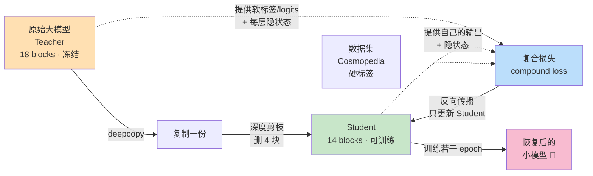
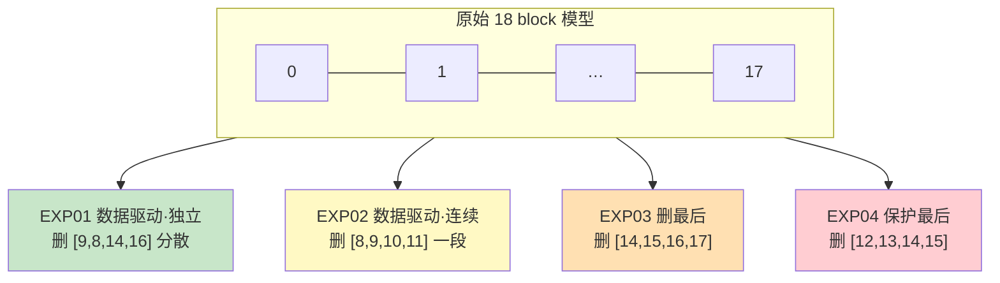
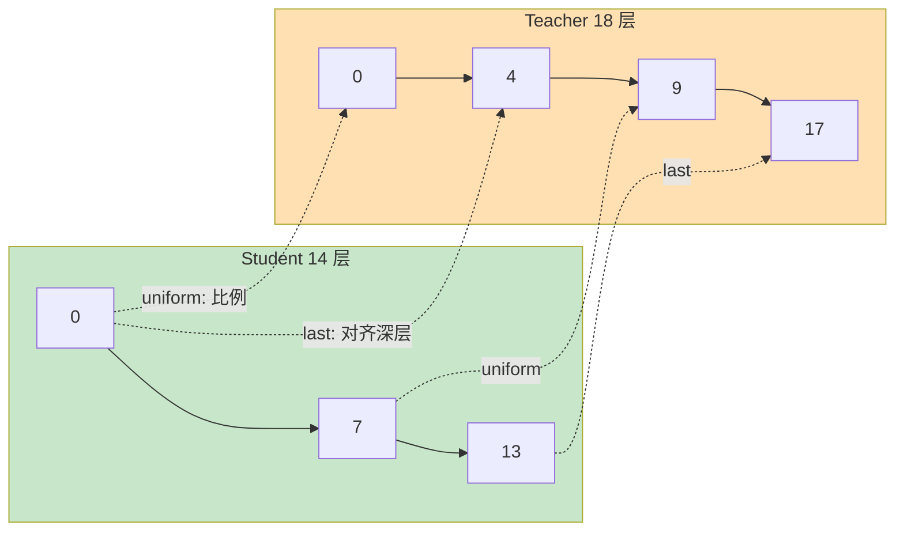
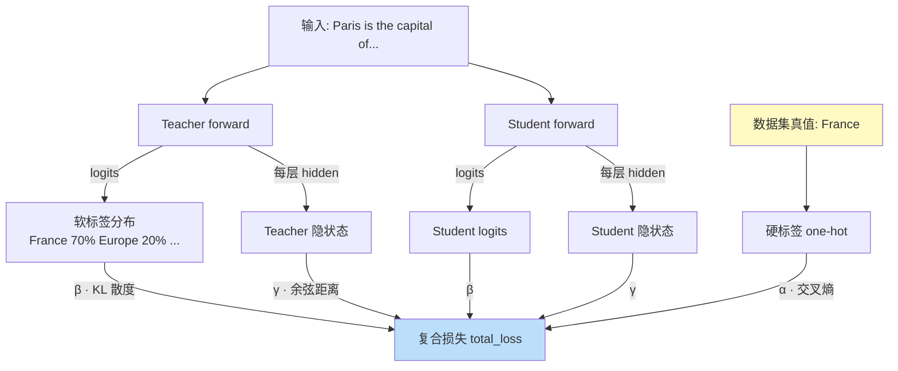
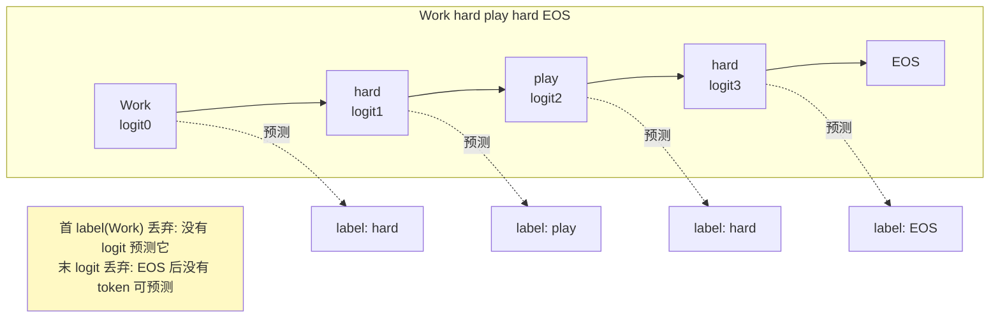
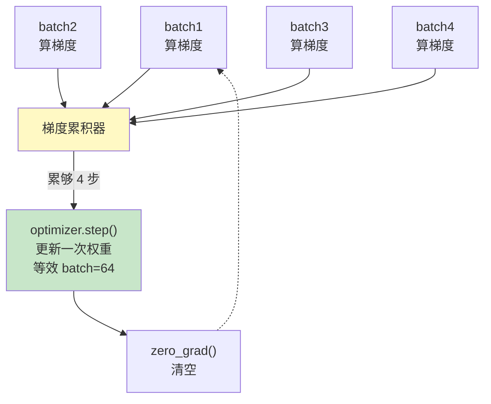
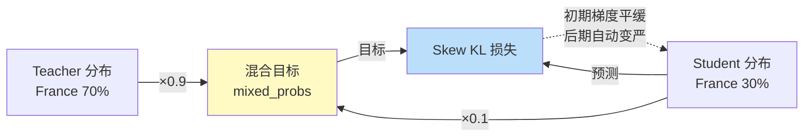
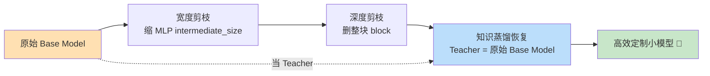

# 第 6 章 · 蒸馏恢复知识（Knowledge Recovery through Distillation）🧠➡️🎓

> 对应原书：**Chapter 6 — Knowledge recovery through distillation**（PDF 第 182–233 页，作者 Pere Martra，MEAP 版）
> 本篇是《Rearchitecting LLMs》逐章精讲的第 6 篇，隶属 `llm-action/book-rearchitecting-llms/book-guide/`。

---

## 🗺️ 本章地图（这章在全书哪里、读完你能会什么）

前面几章讲的是**如何"拆"模型**：

- 第 2 章：端到端跑通一次"重构"（rearchitecting）项目，第一次见到知识蒸馏（KD）。
- 第 3 章：现代 Transformer 的解剖蓝图。
- 第 4 章：**深度剪枝（depth pruning）**——整块删掉 Transformer block。
- 第 5 章：**宽度剪枝（width pruning）**——删 MLP 里的神经元、缩小 `intermediate_size`。

问题来了：**剪枝一定掉知识，剪得越狠掉得越多**。第 6 章就是全流程里最关键的一环——**把剪掉的知识"补回来"**。它决定了你的小模型到底是"能用"还是"能打（甚至超过原模型）"。

本章作者反复强调一句话，值得先记住：

> **"知识恢复不是从我们跑 KD 那一刻开始的，而是从我们决定保留模型哪些部分那一刻就开始了。"**
> （Knowledge recovery doesn't start when we apply Knowledge Distillation; it starts when we decide which parts of the model to keep.）

📖 **读完这一章你将能够：**

1. 说清**知识蒸馏（teacher → student）**的本质，以及"软标签 / 硬标签 / 中间层"三种知识信号分别是什么。
2. 亲手实现一个**复合损失函数（compound loss）**：`α·任务损失 + β·logits损失 + γ·隐状态损失`，并知道每个权重怎么调。
3. 解决"教师 18 层、学生 14 层，中间层怎么对齐"的**层映射（layer mapping）**难题。
4. 掌握两个进阶技巧：**Skew KLD**（偏移 KL 散度）和 **FDD**（特征动力学蒸馏），在数据稀缺 / 剪枝激进时救命。
5. 用一张"配置速查表"决定：什么场景该开什么、`α/β/γ/skew_alpha/delta` 各取多少。

本章用的实验模型是 **`google/gemma-3-270m`**（18 个 Transformer block，隐藏维度 640），删掉 4 块（约 22% 深度）后再蒸馏恢复。所有数字都是书里真实跑出来的，我们逐一讲透。

---

## 🔬 第一性原理：为什么剪枝后能"恢复"，而不是永久损坏？

先想一个最朴素的问题：**你把 4 个 Transformer block 直接删掉，剩下的 14 层为什么还能"学回"丢掉的能力？**

答案有两层：

1. **知识是分布式冗余存储的。** LLM 的能力不是"某个 block 独占某个知识点"，而是弥散在所有层里。删掉几块，就像从一张有冗余的网里剪掉几个节点——信息通路受损，但没有彻底消失。剩下的层通过**重新训练**可以把原本流经被删层的"信息流"重新路由到自己身上。

2. **teacher 还在，它是"标准答案本身"。** 恢复训练时我们不是让学生瞎猜，而是让原始的、未剪枝的大模型（teacher）当"陪练"，学生每一步都能对着 teacher 的输出（甚至 teacher 每一层的中间表示）"抄"。这不是从零学，是**有监督地追平一个已知的强者**。

所以"恢复"= 用蒸馏，把 teacher 的行为**焊回**到被剪小了的 student 身上。剪掉的越多、起点越差，恢复要花的时间越长、天花板越低——这就是为什么**"剪哪几块"这个决策，早在训练前就锁死了恢复的上限**。



---

# 6.1 选择剪掉哪些块（Choosing what to prune）✂️

## 💡 核心观点：恢复从"选块"开始，不是从"训练"开始

作者讲了一个亲身经历：他做过两个恢复实验，**都删了同样数量的 Transformer block**，唯一区别是——

- 实验 A：按**重要性**删（删最不重要的块）；
- 实验 B：删**最后几块**（简单粗暴的启发式）。

结果差距巨大：**按重要性剪的那个模型，只用一小部分训练时间就恢复了性能**。

为什么这件事这么重要？因为 **KD 训练极其烧资源**——在 GPU 上跑几小时甚至几天，最后才发现"块选错了"，既痛苦又费钱。所以**在投入 GPU 时间之前，先选对块**，是省钱省时的第一原则。

## 深度剪枝的两大流派 + 一个假设

| 流派 | 做法 | 代表 |
|---|---|---|
| **数据驱动（data-driven）** | 用标定数据（calibration data）跑重要性分析，删贡献最低的块 | EXP01 / EXP02 |
| **静态启发式（static）** | 不看数据，按简单规则删（如"删最后 N 块"） | EXP03 / EXP04 |
| **保护假设（protection hypothesis）** | 一种主张：**永远保留最后几个 block**，因为它们负责输出的最终精修 | EXP04 采纳 |

⚠️ **常见坑：不要迷信任何一个"理论"。** 每种策略在文献里都能找到支持它的论文，但**实践里最靠谱的做法是跑实验**。这个选择决定的不只是"要花多少小时恢复"，还有"恢复的天花板有多高"。

## 6.1.1 实验配置：四种策略同台竞技

- **基座模型**：`google/gemma-3-270m`，18 个 Transformer block。
- **删多少**：删 4 块 ≈ **22% 深度**。作者称这是"足够激进能测出退化、又还落在标准硬件可恢复范围内"的甜点区。
- **对比数据**：Cosmopedia 数据集先取 **2000 条**做快速筛选（决定策略只需这么多），选出赢家后再放大到 15K、40K。

四种策略（对应四个 Research Experiment notebook：EXP01–04）：

| 实验 | 策略 | 删哪几块 | 说明 |
|---|---|---|---|
| **EXP01** | 数据驱动·独立（individual） | 余弦相似度选出**最不重要的 4 块**，不管连不连续 | 第 4 章学的重要性分析 |
| **EXP02** | 数据驱动·连续（consecutive） | 同样重要性分析，但**强制 4 块必须连续** | 加了"连续"约束 |
| **EXP03** | 删最后几块（last blocks） | 删 block 14–17 | 最简单启发式，第 2 章用的就是它 |
| **EXP04** | 保护最后块（protection） | 删 block 12–15，**保住最后两块** | 采纳"保护假设" |

> 🔬 **数据驱动怎么选块？** 用**余弦相似度分析**衡量"每个 block 对表示变换（representation transformation）的贡献"——某块的输入和输出如果几乎一样（余弦相似度≈1），说明这块几乎没干活，是删除的头号候选。这就是第 4 章的核心技术，落到代码里就是 `optipfair.analyze_layer_importance()`。



## 6.1.2 准备恢复数据集：Cosmopedia

**为什么数据集选择这么关键？** 因为它决定了你恢复时"优先补哪种知识"。本章用的是 **Cosmopedia**（HuggingFace 出品），特点：

- **高质量合成数据**：由 SOTA LLM 生成 + HuggingFace 严格清洗流水线过滤，没有残缺文章、垃圾、噪声文本——这些噪声会**干扰蒸馏过程**。
- **主题多样**：分成 stories（故事）、tutorials（教程）、educational（教育）、web samples（网页样本）等子集，覆盖不同写作风格和知识域。多样性让模型恢复的是**通用能力**，而不是偏科到某一种文本。

> 💡 **实战小贴士**：真实项目里，你可以**用基座模型自己生成合成数据集**来蒸馏；即使用标准数据集（Cosmopedia）或更"原始"的数据（SlimPajama），也可以用基座模型补一些样本来完善数据集。核心思想：让 teacher 自己"出题"，学生学起来最对味。

### 📜 Listing 6.1 加载并混合 Cosmopedia 的四个子集

```python
from datasets import load_dataset, Dataset
from torch.utils.data import TensorDataset, DataLoader, random_split

MAX_LENGTH = 512
RECOVERY_SAMPLES = 2000

def tokenize_function(examples):
   texts = examples['text'] if isinstance(examples, dict) else examples
   return tokenizer(
       texts,
       truncation=True,
       padding="max_length",
       max_length=MAX_LENGTH,
       return_tensors="pt"
   )

dataset_name = "HuggingFaceTB/cosmopedia"
subsets = ["stories", "wikihow", "openstax", "web_samples_v1"]   # A：四个子集
samples_per_subset = int(RECOVERY_SAMPLES / 4)                   # B：每子集 500 条
num_samples = samples_per_subset * len(subsets)

all_samples = []
for subset in subsets:
   print(f"  Loading {subset}...")
   subset_data = load_dataset(dataset_name,
       subset, split="train",
       streaming=True)                                          # C：流式加载，省内存
   subset_samples = list(subset_data.take(samples_per_subset))
   all_samples.extend(subset_samples)
   print(f"    ✓ {len(subset_samples):,} samples from {subset}")

distillation_dataset = Dataset.from_dict({'text': [s['text'] for s in all_samples]})
```

**逐行讲解：**

- `MAX_LENGTH = 512`：每条样本最多 512 个 token，超了截断。
- `RECOVERY_SAMPLES = 2000`：总共取 2000 条做快速筛选。
- **A** `subsets = [...]`：挑了 4 个子集，**故意让写作风格和知识域尽量多样**。
- **B** `samples_per_subset = 2000/4 = 500`：每个子集取 500 条，凑成一个**平衡数据集**。作者说：2000 条里每子集 500 条，通常就足够决定"哪种策略最好"了。
- **C** `streaming=True`：**流式加载**，不一次性把整个数据集下载到内存，只 `take` 需要的量——Cosmopedia 很大，这一步很关键。
- 最后把四个子集的文本拼成一个 `Dataset` 对象。

### 📜 Listing 6.2 配置 teacher 模型和分词器

```python
MODEL_NAME = "google/gemma-3-270m"
teacher_model = AutoModelForCausalLM.from_pretrained(
   MODEL_NAME,
   torch_dtype=torch.bfloat16 if torch.cuda.is_available() else torch.float32,
   device_map="auto" if torch.cuda.is_available() else None
)
teacher_model.eval()                          # B：推理模式（关 dropout 等）
for param in teacher_model.parameters():
   param.requires_grad = False                # C：冻结所有参数
tokenizer = AutoTokenizer.from_pretrained(MODEL_NAME)
if tokenizer.pad_token is None:
   tokenizer.pad_token = tokenizer.eos_token
```

**逐行讲解：**

- `torch_dtype=bfloat16`：有 GPU 时用 bf16 半精度，省一半显存、更快；没 GPU 退回 fp32。
- `teacher_model.eval()`：teacher 只做推理，进入 eval 模式。
- **C** `param.requires_grad = False`：**冻结 teacher 的所有参数**。作者原话：我们不需要给 teacher 算梯度，这样**省显存、加速训练**。teacher 只负责"当标准答案"，自己不学习。
- `pad_token = eos_token`：Gemma 没有专门的 pad token，用 eos（句末）token 顶替，保证 padding 不报错。

### 📜 Listing 6.3 批量分词（batch tokenization）

```python
dataset_list = list(distillation_dataset)
texts = [item['text'] for item in dataset_list]
tokenized_data = []
batch_size = 100                              # A：一次分 100 条
for i in tqdm(range(0, len(texts), batch_size), desc="Tokenizing"):
   batch_texts = texts[i:i+batch_size]
   batch_tokens = tokenizer(
       batch_texts,
       truncation=True,
       padding="max_length",
       max_length=MAX_LENGTH,
       return_tensors="pt"
   )
   tokenized_data.append(batch_tokens)

input_ids = torch.cat([batch['input_ids']
                       for batch in tokenized_data], dim=0)      # B：拼成大张量
attention_mask = torch.cat([batch['attention_mask']
                            for batch in tokenized_data], dim=0)
full_dataset = TensorDataset(input_ids, attention_mask)          # C：打包成 TensorDataset
```

**逐行讲解：**

- **A** `batch_size = 100`：**批量分词比逐条快得多**，尤其数据量大时。作者说他在 A100 上用的是 batch=1000，因为资源更充裕。HF 的 tokenizer 天生支持批处理并行。
- **B** `torch.cat(..., dim=0)`：把所有小批的 `input_ids` 沿第 0 维（样本维）拼成一个大张量。
- **C** `TensorDataset`：把 `input_ids` 和 `attention_mask` 打包，方便后面喂给 DataLoader。

### 📜 Listing 6.4 训练/验证集划分 + 建 DataLoader

```python
generator = torch.Generator().manual_seed(42)      # A：固定随机种子，可复现
train_size = int(0.9 * len(full_dataset))
val_size = len(full_dataset) - train_size
train_dataset, val_dataset = random_split(
   full_dataset,
   [train_size, val_size],
   generator=generator                             # B：用固定种子的 generator
)
train_dataloader = DataLoader(
   train_dataset,
   batch_size=BATCH_SIZE,
   shuffle=True                                    # C：训练集打乱
)
eval_dataloader_raw = DataLoader(
   val_dataset,
   batch_size=BATCH_SIZE,
   shuffle=False                                   # D：验证集不打乱
)
```

**逐行讲解 + 为什么必须划分验证集：**

- **A/B** 固定种子 `42`，保证每次划分一样，实验可复现。
- **90/10 划分**：90% 训练、10% 验证。
- **C** 训练集 `shuffle=True`（每 epoch 打乱防过拟合）；**D** 验证集 `shuffle=False`（评估要稳定）。

⚠️ **常见坑：为什么不能用训练数据来评估？** 如果你在**训练用过的数据**上算困惑度（perplexity），会得到"人为乐观"的假成绩——你测的是**记忆能力**，不是**抽象/泛化能力**。验证集给的才是"知识到底转移得好不好"的诚实度量。作者补充：后面放大到更多样本时，划分改成 **80/20**，让验证集样本更多、指标更可靠。

## 6.1.3 选出最佳候选：用 PPL + 5 个基准

**评估指标的选择要对齐你的最终目标。** 本章目标是"通用模型"，所以主指标用 **困惑度（Perplexity, PPL）**（衡量流畅度），再配 5 个标准基准衡量具体能力：

`arc_easy`、`hellaswag`、`lambada_openai`、`piqa`、`winogrande`

> 💡 **面试高频 / 实战警示**：**指标必须跟着用途走。** 如果你优化的是"Agent 里的工具调用（tool calling）"模型，主指标应该是**工具选择准确率**，而不是 PPL。专门项目往往需要**自定义基准**去精确捕捉你应用需要的能力。

### 📊 表 6.1：四种策略"刚剪完、还没恢复"时的退化

| 实验 | 策略 | 删的块 | PPL | 能力保留率 % |
|---|---|---|---|---|
| **Teacher** | — | — | **13.38** | **100** |
| **EXP01** | 数据驱动 | [9, 8, 14, 16] | **125.65** | **77.88** |
| EXP02 | 数据驱动·连续 | [8, 9, 10, 11] | 490.22 | 65.49 |
| EXP03 | 删最后 | [14, 15, 16, 17] | 263.69 | 75.97 |
| EXP04 | 保护最后 | [12, 13, 14, 15] | 463.83 | 67.40 |

**怎么读这张表：**

- **EXP01 完胜。** PPL 125.65 ≈ teacher 的 9 倍（其他都是 20~36 倍）；能力保留 77.88%（五个基准平均）。
- **EXP04（保护最后两块）和 EXP02（连续）退化最惨**：PPL 都在 460+，能力保留跌破 68%。
- 🔥 **这直接打脸"保护假设"**：保留最后几块**并不保证更好**——如果被删的中间块对信息处理更关键，保护末尾也白搭。

### 📊 表 6.2：跑一次基础 KD（2000 条、5 epoch）后的恢复

| 实验 | 策略 | PPL | 能力保留 % | 恢复增益（pp）|
|---|---|---|---|---|
| Teacher | — | 13.38 | 100 | — |
| **EXP01** | 数据驱动 | **23.99** | **85.64** | +7.76 |
| EXP02 | 数据驱动·连续 | 29.10 | 80.81 | +15.32 |
| EXP03 | 删最后 | 28.65 | 75.97 | +5.93 |
| EXP04 | 保护最后 | 26.18 | 67.40 | +15.97 |

**关键洞察：**

- **EXP01 恢复后依然领先**：PPL 23.99、能力保留 85.64%，两个维度都是最优。
- "恢复增益"列有个陷阱：EXP02（+15.32）、EXP04（+15.97）看着涨得多，但那是因为**它们起点太烂**，恢复空间大。即便涨这么多，**终点还是追不上 EXP01**。
- EXP01 从 77.88% → 85.64%，涨 **+7.76 pp**，超过第二名 EXP03 的 +5.93 pp——**起点更好，绝对恢复量也更多**。

> ✅ **结论：数据驱动·独立（EXP01）是唯一赢家。本章后面全程只用它。**

### 📜 Listing 6.5 删掉 4 个最不重要的层（生成 Student）

```python
import optipfair as opf
from copy import deepcopy

student_model = deepcopy(teacher_model)                 # A：复制 teacher
importance_scores = opf.analyze_layer_importance(       # B：余弦相似度算每块重要性
   student_model,
   train_dataloader,
   show_progress=True
)
LAYERS_TO_REMOVE = sorted(                               # C：按重要性升序，取最低的 4 个
   importance_scores.keys(),
   key=lambda x: importance_scores[x]
)[:4]
print(LAYERS_TO_REMOVE)
student_model = opf.prune_model_depth(                  # D：真正把这 4 块删掉
   model=student_model,
   layer_indices=LAYERS_TO_REMOVE,
   show_progress=True,
)
for param in student_model.parameters():
   param.requires_grad = True                           # E：解冻！让 student 能学
```

**逐行讲解（这里藏着一个"静默失败"的大坑）：**

- **A** `deepcopy(teacher_model)`：从 teacher 深拷贝一份当 student 的起点。
- **B** `analyze_layer_importance`：对每个 block 跑余弦相似度分析，返回 18 个块各自的重要性分数。
- **C** `sorted(...)[:4]`：按分数**升序**排，取前 4 个（最不重要的）作为删除对象。
- **D** `prune_model_depth`：把这 4 块从模型里真正切除，得到 14 层的 student。
- **E** ⚠️ **重中之重**：`deepcopy` 会**连同 `requires_grad=False` 一起复制过来**（Listing 6.2 冻结 teacher 时设的）。如果不显式改回 `requires_grad=True`，PyTorch **不会给 student 算梯度**，训练时**看起来在跑、实际啥也没学**——这就是作者说的 **"静默训练失败（silent training failure）"**，一个极易犯又极难查的错。

---

# 6.2 对齐 Teacher 和 Student（层映射）🔗

现在你手上有个 **14 层的 student** 和一个 **18 层的 teacher**。

如果只做**经典蒸馏**（硬标签 + 软标签），**层数不匹配根本无所谓**——你只比较两个模型的**最终输出**，算个损失就完了。

但本章的目标更高：**不只要 student 得出和 teacher 一样的结论，还要它用同样的"思路"得出结论。** 这就要用 **特征对齐（Feature Alignment）**——对齐每个中间 Transformer block 产出的隐状态（hidden states）。

**问题来了：teacher 18 层、student 14 层，谁对谁？** 书里测了三种映射策略：



## 三种映射策略

### 1️⃣ 均匀映射（uniform mapping）——按比例分配

```python
n_student = len(student_model.model.layers)   # 14
n_teacher = len(teacher_model.model.layers)   # 18
uniform_map = []
for i in range(n_student):
   teacher_idx = int(i * n_teacher / n_student)   # A：按位置比例映射
   uniform_map.append(teacher_idx)
```

- **原理**：student 第 `i` 层映射到 teacher 第 `i × 18/14` 层。
- **效果**：student 的第 7 层（中间）映射到 teacher 第 9 层（也大致中间）。student 能接触到 teacher **早、中、晚各个"区域"**的知识。

### 2️⃣ 末端映射（last mapping）——只学最终推理

```python
offset = n_teacher - n_student                    # A：18 - 14 = 4
last_map = [i + offset for i in range(n_student)]
```

- **原理**：student 第 0 层 → teacher 第 4 层，第 1 层 → 第 5 层……student 第 13 层 → teacher 最后一层。
- **假设**：**最后几层含最精炼的知识、最抽象的表示**，所以让 student 全体去对齐 teacher 的深层。

### 3️⃣ 原始映射（original mapping）——保留剪枝前的连接

```python
def create_layer_map_original_indices(student_model, teacher_model, removed_layers):
   n_teacher = len(teacher_model.model.layers)
   original_indices = []
   for i in range(n_teacher):
       if i not in removed_layers:            # A：跳过被删的层
           original_indices.append(i)         # B：保留原始编号
   layer_map = original_indices
   return layer_map                           # C

original_map = create_layer_map_original_indices(
   student_model, teacher_model, LAYERS_TO_REMOVE)
```

- **原理**：不搞位置比例，而是**保留剪枝前就存在的架构关系**。student 每一层映射回它在 teacher 里**原本的那一层**——被删的层就留个"空洞"，剩下的层各归各位。
- **效果**：这是最"忠实原架构"的映射，也就是表格里的 **"Selected"**。

> 💡 **三种策略怎么选？** 剧透一下 6.6：**中等压缩（删 <50% 层）用 uniform 就很好；"last" 只在激进剪枝（删掉一半以上）时才真正有用。** 本章删 22%，属于中等，所以 uniform / Selected 差别不大。

---

# 6.3 恢复知识：三层信号的复合损失 🎯

第 2 章只用 **logits（软标签）** 蒸馏——让 student 学会模仿 teacher 的"不确定性"和"次优候选"。

本章要在此基础上再加两层信号，**三级同步**：

| 信号 | 英文 | 学的是什么 | 来源 |
|---|---|---|---|
| **硬标签** | hard labels | "标准答案"（正确的下一个 token）——学**答什么** | 数据集 |
| **软标签** | soft labels / logits | teacher 对整个词表的**置信度分布**——学**推理的细腻度** | teacher 的 logits |
| **隐状态** | hidden states | 每层的**中间思考过程**——学**怎么想** | teacher 每个 block 的输出 |

> 🔬 **为什么硬标签会"丢失推理的细腻"？** 硬标签只告诉你"正确答案是 France"，它是个 one-hot：France=1，其他全是 0。它**不告诉你** teacher 其实也觉得 "Europe" 有点道理、"Other" 完全离谱。而软标签保留了这些"言外之意"——这正是蒸馏比普通监督训练强的地方。

## 6.3.1 复合损失函数（compound loss function）

### 📜 Listing 6.6 复合损失函数的总体结构（签名）

```python
def compute_compound_loss(
   student_logits,
   teacher_logits,
   student_hiddens,
   teacher_hiddens,
   labels,
   layer_map,
   alpha=0.4,
   beta=0.4,
   gamma=0.2,
   temperature=2.0
):
   loss_task   = ...    # 硬标签：交叉熵
   loss_logits = ...    # 软标签：KL 散度
   loss_hidden = ...    # 隐状态：余弦距离
   total_loss  = alpha * loss_task + beta * loss_logits + gamma * loss_hidden
   loss_dict = {
        'total':  total_loss.item(),
        'task':   loss_task.item(),
        'logits': loss_logits.item(),
        'hidden': loss_hidden.item()
    }
   return total_loss, loss_dict
```

**逐行讲解参数：**

- `student_hiddens` / `teacher_hiddens`：元组/列表，装着**所有 block 的激活张量**。
- `layer_map`：上一节那三种映射之一，决定"student 哪层对 teacher 哪层"。
- `alpha / beta / gamma`：三个信号的权重——**任务损失 / logits 损失 / 隐状态损失**。
- 默认 `(0.4, 0.4, 0.2)`：**两个"面向最终输出"的信号（α、β）合占 80%**，隐状态对齐（γ）只当"次要稳定器"占 20%。

### ⚖️ 权重为什么常常"求和=1.0"？

作者讲得很透——**权重和=1.0 不是强制，但强烈推荐**：

- 求和=1.0，你就能把每个权重**直接读成"相对重要性百分比"**，方便解释和跨实验对比。
- **求和 > 1.0**：会**放大梯度**，可能**训练不稳定**。
- **求和 < 1.0**：梯度变小，**学习无谓地变慢**。
- 🔑 **黄金法则**：**调高一个，就要调低另一个来补偿**，保持总和不变。

### 📊 图 6.3 的核心：一个例子看懂三种信号

输入 `"Paris is the capital of..."`，teacher 和 student 都跑一遍，产生最终预测 + 每层中间表示。复合损失**同时抓三种知识转移**：

- **硬标签**：数据集里的真值 `"France"`（one-hot）。
- **软标签**：teacher 在整个词表上的概率分布（France 高、Europe 中、其他低）。
- **隐状态**：对应 block 之间的中间表示对齐。



### 🌡️ 温度（temperature）：把 teacher 的"过度自信"摊平

📊 **图 6.4 的数值（提示词 `"Work hard play"`）：**

| 候选词 | T=1.0（原始）| T=2.0（软化）|
|---|---|---|
| hard | **94.5%** | **23.9%** |
| well | 3.7% | 4.7% |
| good | 0.3% | 1.3% |
| harder | 0.2% | 1.2% |

**为什么要软化？** 在 T=1.0 时，teacher 几乎把全部概率（94.5%）压在 "hard" 上，其他候选被压到几乎为 0。**如果不软化，student 只会学到"hard 是对的"，完全忽略其他选项。**

用 **T=2.0** 后，概率被"摊开"："hard" 从 94.5% 降到 23.9%，其他候选浮出水面。这告诉 student：**teacher 其实也考虑过 "well"，"good"/"harder" 在某些语境下也不算离谱。** 这些"暗知识"（dark knowledge）才是蒸馏的精华。

> 🔬 **第一性原理**：温度 T 作用在 softmax 上 —— $\text{softmax}(z_i / T)$。T 越大，指数项差距被压缩，分布越平坦；T=1 是原始分布；T→∞ 趋于均匀分布。温度让 student 看到 teacher 的"完整推理谱系"而不只是"最终决定"。

### 🧮 组件 1：任务损失（task loss，交叉熵 + 硬标签）

```python
shift_logits = student_logits[..., :-1, :].contiguous()   # A：去掉最后一个 logit
shift_labels = labels[..., 1:].contiguous()               # B：去掉第一个 label
loss_task = F.cross_entropy(
   shift_logits.view(-1, shift_logits.size(-1)),          # C：展平成 [N, vocab]
   shift_labels.view(-1),
   ignore_index=-100                                       # D：忽略 padding
)
```

**逐行讲解——关键是"token shifting"（图 6.5）：**

- **A/B token 移位**：语言模型学的是"预测下一个 token"。如果数据是 `"Work hard play hard"`，我们要模型预测 `["hard", "play", "hard", "<eos>"]`。这意味着：
  - 位置 0（"Work"）的 logit，要跟位置 1（"hard"）的 label 比；
  - 位置 1 的 logit，跟位置 2 的 label 比……
  - 实现方法：**logits 去掉最后一个**（它没有"下一个 token"可预测）、**labels 去掉第一个**（它不被任何东西预测）。
- **C** `.view(-1, vocab)`：把 `[batch, seq, vocab]` 展平成二维，交叉熵按 token 逐个算。
- **D** `ignore_index=-100`：⚠️ **PyTorch 约定**——分词时 padding 位置标成 -100，这行告诉损失函数**别把 padding 算进去**。否则你会在训练模型去"预测 padding token"，毫无意义。



### 🧮 组件 2：logits 损失（软标签，KL 散度）

```python
student_soft = F.log_softmax(student_logits / temperature, dim=-1)   # A：student 用 log_softmax
teacher_soft = F.softmax(teacher_logits / temperature, dim=-1)       # B：teacher 用 softmax
student_soft = student_soft[..., :-1, :].contiguous()
teacher_soft = teacher_soft[..., :-1, :].contiguous()
loss_logits = F.kl_div(
   student_soft.view(-1, student_soft.size(-1)),
   teacher_soft.view(-1, teacher_soft.size(-1)),
   reduction='batchmean'                                             # C：按 batch 求平均
) * (temperature ** 2)                                               # D：乘 T²
```

**逐行讲解：**

- **A/B 为什么 student 用 `log_softmax`、teacher 用 `softmax`？** 这**不是随意的**：PyTorch 的 `kl_div` 要求第一个参数（预测方）必须是**对数空间（log space）**，以避免概率极小时的**数值下溢（underflow）**。
- **C** `reduction='batchmean'`：KL 散度按 batch 求平均，得到每个样本的平均散度。
- **D** `* (temperature ** 2)`：⚠️ **必须补上 T² 缩放**。因为软化时除了 T，梯度会缩小 T 倍，乘回 T² 让梯度量级恢复正常（这是 Hinton 蒸馏原论文的经典细节）。

> 📝 **NOTE：softmax vs log_softmax 的区别**
> logits `[2.0, 1.0, 0.1]`：
> - `softmax` → `[0.659, 0.242, 0.099]`（概率，和为 1）
> - `log_softmax` → `[-0.417, -1.417, -2.317]`（上面那些概率的自然对数）
>
> PyTorch 在 `kl_div` 里内部用 log_softmax，因为**对数空间避免极小概率的数值问题**：比如 0.0001 → -9.21，是个好处理的数。如果你先 softmax 再 `log(0.0001)`，极端情况下可能算出无效值。

### 🧮 组件 3：隐状态损失（hidden loss / 特征对齐，余弦距离）

**目的**：强迫 student 的中间层，用和 teacher **相似的方式处理信息**。用**余弦距离**衡量——只看**方向**，不看**大小**。

> 🔬 **为什么用余弦相似度而不是欧氏距离？** 把表示想成 640 维空间里的向量（Gemma-270M 的 hidden size 就是 640）。**重要的不是向量各分量"多大"，而是向量"指向哪个方向"。** 例如 `[1,2,3]` 和 `[10,20,30]` 方向完全相同（余弦相似度=1.0），尽管大小差 10 倍。语义方向一致就够了，量级差异不该被惩罚。

```python
if gamma > 0:
   loss_hidden = 0.0
   num_aligned_layers = len(layer_map)
   for student_idx, teacher_idx in enumerate(layer_map):     # 遍历映射
       student_h = student_hiddens[student_idx]
       teacher_h = teacher_hiddens[teacher_idx]
       student_flat = student_h.reshape(-1, student_h.size(-1))   # A：展平成矩阵
       teacher_flat = teacher_h.reshape(-1, teacher_h.size(-1))   # A
       student_norm = F.normalize(student_flat, p=2, dim=1)       # B：L2 归一化
       teacher_norm = F.normalize(teacher_flat, p=2, dim=1)       # B
       cos_sim = (student_norm * teacher_norm).sum(dim=1).mean()  # C：余弦相似度
       loss_hidden += (1 - cos_sim)                               # D：距离 = 1 - 相似度
   loss_hidden = loss_hidden / num_aligned_layers                 # E：按层数平均
else:
   loss_hidden = torch.tensor(0.0, device=student_logits.device)
```

**逐行讲解 + reshape 到底在干嘛：**

- 循环 `layer_map` 就是**三种映射策略真正生效的地方**：用 uniform 就学 teacher 全深度的均匀分布表示；用 last 就只学最深层；用 original 就各学各的原位置。
- **A** `reshape(-1, hidden_dim)`：把 `[batch, seq_len, hidden]` 的三维张量，压成 `[batch×seq_len, hidden]` 的二维矩阵——**每一行是一个 token 的表示向量**。

  📌 **举个具体例子**（书里的简化版，把 640 维简化成 4 维）。batch 有两句话，每句 3 个 token：
  ```
  reshape 前，形状 [2, 3, 4]:
    句1 "Sand and Sun": [[0.1,0.2,0.5,0.9], [0.8,0.1,0.1,0.5], [0.3,0.9,0.2,0.4]]
    句2 "Time to go"  : [[0.5,0.5,0.1,0.1], [0.2,0.2,0.8,0.8], [0.9,0.1,0.5,0.3]]

  reshape 后，形状 [6, 4]（2×3=6 行）:
    [0.1,0.2,0.5,0.9]  # Sand
    [0.8,0.1,0.1,0.5]  # and
    [0.3,0.9,0.2,0.4]  # Sun
    [0.5,0.5,0.1,0.1]  # Time
    [0.2,0.2,0.8,0.8]  # to
    [0.9,0.1,0.5,0.3]  # go
  ```
  现在有 6 个独立的 4 维向量。L2 归一化和余弦相似度**逐行（逐 token）独立计算**，不管它原来属于哪句、哪个位置。
  在真实 Gemma-270M 里，`BATCH_SIZE=8`、512 个 token、640 维，就是 `[8, 512, 640] → [4096, 640]`。
- **B** `F.normalize(p=2)`：L2 归一化，把每个向量变成单位长度——这样点积就直接等于余弦相似度。
- **C** `(student_norm * teacher_norm).sum(dim=1)`：归一化后逐元素相乘再求和 = 余弦相似度，再 `.mean()` 对所有 token 求平均。
- **D** `1 - cos_sim`：**余弦距离 = 1 − 余弦相似度**。方向越一致，损失越小。
- **E** 除以层数，得到"每层平均隐损失"。
- **性能优化**：`if gamma > 0` 才算——`gamma=0` 时直接跳过，**省掉一大坨计算**。

### ⚖️ 权重的平衡与解释

```python
total_loss = alpha * loss_task + beta * loss_logits + gamma * loss_hidden
```

作者的分配逻辑：

- **80% 给"最终回答质量"**（0.4 task + 0.4 logits），三个权重和为 1.0，可直接读成百分比。这让模型**优先生成正确文本 + 复现 teacher 的置信度分布**。
- **20% 给隐状态**（gamma=0.2），只有其他两个的一半。为什么只给一半？因为 **Transformer block 当初训练时，压根不是为了产出"外部系统可解释/可比较的中间表示"**——它们的目标只是"合作预测下一个 token"。所以中间表示对齐只是"锦上添花的稳定器"。但给 0.2 的权重，能**借用 teacher 训练/对齐阶段学到的语义结构**，把稳健性传给 student，又不至于**束缚 student 自己适应的自由**。

### 🎛️ 6.3.1 按目标调权重

| 模型类型 | gamma 建议 | 理由 |
|---|---|---|
| **Embedding / 分类模型** | ↑ **0.3~0.4** | 中间表示（向量）**就是最终产品**（RAG 检索、特征分类），下游系统直接消费，质量至关重要 |
| **纯生成模型** | ↓ **0.1** | 只关心文本输出，给 student 自由——小模型能找到更高效的"殊途同归"，尤其 teacher/student 尺寸差很大时 |

## 6.3.2 训练循环（training loop）

### 📜 Listing 6.7 训练循环（核心节选 + 逐段讲解）

```python
def train_student(
   student_model, teacher_model, dataloader,
   layer_map, alpha=0.4, beta=0.4, gamma=0.2, temperature=2.0,
   epochs=3, learning_rate=1e-5, experiment_name="experiment", accumulation_steps=4
):
   optimizer = torch.optim.AdamW(                    # 1：AdamW 优化器
       student_model.parameters(),
       lr=learning_rate
   )
   student_model.train()                             # A：student 训练模式
   teacher_model.eval()                              #    teacher 推理模式
   request_hidden_states = (gamma > 0)               # B：gamma>0 才要隐状态

   for epoch in range(epochs):
       for batch_idx, (input_ids, attention_mask) in enumerate(dataloader):
           input_ids = input_ids.to(device)
           attention_mask = attention_mask.to(device)
           labels = input_ids.clone()                #   自回归：标签就是输入本身

           student_outputs = student_model(
               input_ids=input_ids,
               attention_mask=attention_mask,
               output_hidden_states=request_hidden_states   # 2：要不要返回隐状态
           )
           with torch.no_grad():                     # 3：teacher 不算梯度
               teacher_outputs = teacher_model(
                   input_ids=input_ids,
                   attention_mask=attention_mask,
                   output_hidden_states=request_hidden_states
               )

           student_hiddens = (student_outputs.hidden_states[1:]   # 4：丢掉第 0 个
                              if request_hidden_states else None)
           teacher_hiddens = (teacher_outputs.hidden_states[1:]
                              if request_hidden_states else None)

           loss, loss_dict = compute_compound_loss(
               student_logits=student_outputs.logits,
               teacher_logits=teacher_outputs.logits,
               student_hiddens=student_hiddens,
               teacher_hiddens=teacher_hiddens,
               labels=labels, layer_map=layer_map,
               alpha=alpha, beta=beta, gamma=gamma, temperature=temperature
           )
           scaled_loss = loss / accumulation_steps   # 5：梯度累积，先除
           scaled_loss.backward()

           if (batch_idx + 1) % accumulation_steps == 0:          # 6：累够步数才更新
               torch.nn.utils.clip_grad_norm_(student_model.parameters(), 1.0)
               optimizer.step()
               optimizer.zero_grad()
       # 7：末尾不满一组的余数也要处理（省略）
   return student_model, loss_history
```

**逐段讲解关键点（编号对应代码里的 `#数字`）：**

- **1 AdamW 优化器**：只优化 `student_model.parameters()`。它把复合损失测出的误差，翻译成对 student 参数的具体更新，让 student 一步步逼近 teacher 的行为。
- **2 `output_hidden_states`**：告诉 Transformers API"连同每层隐状态一起返回"。`gamma=0` 时设为 False，**省内存省时间**。
- **3 `torch.no_grad()` 包住 teacher 的前向**：⚠️ 关键优化——teacher 只提供输出用于对比，**不需要梯度**。加上这个，**显存直接省约一半、速度更快**。
- **4 `hidden_states[1:]` 丢掉第 0 个**：`.hidden_states` 返回的元组里，**位置 0 是 embedding 层的输出**（不对应任何 Transformer block），位置 1 及之后才是各 block 的输出。我们要对齐的是**block 表示**，所以切掉第 0 个。
- **5/6 梯度累积（gradient accumulation）**：这是**在有限硬件上训 LLM 的核心技巧**。
  - 不是每个 batch 都更新权重，而是**攒几个 batch 的梯度再更新一次**。
  - `accumulation_steps=4` + batch=16 → 优化器看到的等效 batch = 64（16×4），但 **GPU 只需装下 16 个样本的内存**。
  - `loss / accumulation_steps`（#5）保证累积后**平均值正确**。
  - `clip_grad_norm_(..., 1.0)`：梯度裁剪，防止梯度爆炸。
- **7 处理余数**：如果总 batch 数不能被 `accumulation_steps` 整除，末尾那组不完整的也要单独走一次 `optimizer.step()`，**避免丢训练数据**。



## 📊 结果分析：加不加隐状态、用哪种映射？（表 6.3）

作者用三种数据规模训练（2K 用 5 epoch，15K/40K 用 3 epoch），核心结论直接颠覆直觉：

| 实验 | 技术 | 映射 | PPL (2K/15K/40K) | 能力保留 (2K/15K/40K) | LAMBADA (2K/15K/40K) |
|---|---|---|---|---|---|
| Teacher | 基线 | — | 13.38 / 12.96 / 12.91 | 100/100/100 | 0.422/0.427/0.427 |
| Pruned | 剪枝后 | — | 125.65/121.84/120.66 | 77.88/78.30/78.30 | 0.184/0.178/0.178 |
| **Labels-Only** | 软+硬标签 KD | — | **23.46 / 13.16 / 12.11** | **86.74/88.52/89.99** | 0.274/0.315/0.335 |
| Features (last) | 特征对齐 | 末端 | 23.71 / 13.28 / — | 85.93/88.56/— | 0.274/0.319/— |
| Features (Selected) | 特征对齐 | 原始 | 24.00 / 13.23 / 12.11 | 85.35/88.91/89.39 | 0.272/0.316/0.334 |

> 📝 能力保留 % = 在 arc_easy / hellaswag / piqa / winogrande 上相对 teacher 的平均表现。LAMBADA 单列，因为它测**长叙事上下文理解**，是**深度剪枝后掉得最惨的能力（跌 56%）**。

**三个爆点结论：**

1. **数据量是恢复的命脉。** 2K 时所有实验 PPL 都在 23~24（离 teacher 13.4 很远）；15K 时 Labels-Only 到 13.16（几乎追平 teacher）；40K 时到 **12.11，竟然略超 teacher（12.91）**！`23.46 → 13.16 → 12.11` 这条曲线说明：**基础的硬+软标签蒸馏，只要数据够，效果好到离谱，而且给更多数据还在涨。**

2. 🔥 **加隐状态对齐，对纯生成模型几乎没用。** 2K 时特征对齐反而让 PPL 略升（23.71~24.00 vs 23.46）；15K 追平 Labels-Only 但不超；40K 时 PPL 打平（12.11）但能力保留略低（89.39% vs 89.99%）。**额外算力成本只有约 2%，所以问题不是效率，是"没效果"。**

3. **但在某些场景隐状态对齐有效**：当**隐状态本身就是最终产品**时——embedding 模型（RAG）、直接消费向量的分类器、以及**多模态/视觉模型**（中间表示常含物体检测、图像识别、多模态融合等关键信息）。这时特征对齐是有效的，因为你在直接优化下游要消费的输出。

⚠️ **常见坑 / 反直觉**：很多人以为"对齐中间层 = 蒸馏更强"，本章用数据打脸——**对纯生成任务，logits 蒸馏 + 足够数据就够了**，中间层对齐是"看场景的可选项"，不是"越多越好"。

---

# 6.4 进阶恢复技术：FDD + Skew KLD 🚀

既然基础蒸馏已经能追平甚至超过 teacher，为什么还要进阶技术？

**因为进阶技术能用更少的数据、更低的成本，达到同样甚至更好的结果。** 在**数据稀缺、无法生成合成数据**的项目里，这俩是救命稻草。

两个技术：

- **Skew KLD（偏移 KL 散度）**：改造 logits 损失。当 student 剪枝后分布和 teacher 差太远时，标准 KL 惩罚方式不最优，Skew KLD 修正它，让 student **从"离 teacher 很远"的起点也能高效学习**。
- **FDD（Feature Dynamics Distillation，特征动力学蒸馏）**：捕捉**内部表示在层与层之间"如何演化"**（变化率），而不只是"某层像不像"。

**效果预览（PPL）：**

| 数据量 | 之前最好 | FDD+Skew | 说明 |
|---|---|---|---|
| 2K | 23.75 | **21** | 大幅改善，能力保留 84% → 83.6%（微降）|
| 15K | 12.95(teacher) | **12.73** | 追平 teacher，能力保留降 ~1% |
| 40K | 12.91(teacher) | **11.52** | 超过 teacher，能力保留降 ~1% |

> 📝 **NOTE**：含这两个技术的复合损失函数叫 `compute_compound_loss_advanced`，代码在实验 notebook 和 `CH06_NB01_Knowledge_Recovery_T4.ipynb` 里。

## 6.4.1 Skew KLD：修正分布偏差

**标准 KL 的毛病在哪？** 举例：teacher 给 "Paris is the capital of" 后的 "France" 打 **70%**，而刚剪完的 student 只给 **30%**（因为它丢了关于 France 的部分知识）。标准 KL 会产生一个**极陡的梯度**，**逼 student 过早地模仿 teacher 的高置信度**——这反而不利于学习。

**Skew KLD 的巧思**：不拿 teacher 直接跟 student 比，而是拿 **teacher 跟"两者的混合"比**。混合由新参数 `skew_alpha` 控制。用 `skew_alpha=0.1`：目标 = **90% teacher + 10% student**。

- **训练初期**，student 离得很远时，那 10% 的"自己的声音"混进来，**梯度变平缓**，不至于被硬拽。
- **随着 student 收敛**，那 10% 越来越像 teacher，**目标自动变严**——先松后紧，自适应。

```python
# 标准 KL（之前用的）
student_soft = F.log_softmax(student_logits / temperature, dim=-1)
teacher_soft = F.softmax(teacher_logits / temperature, dim=-1)
# ... F.kl_div(student_soft, teacher_soft, reduction='batchmean') * temperature**2

# Skew KLD（新增一步"混合"）
with torch.no_grad():
   student_probs = F.softmax(student_logits[..., :-1, :] / temperature, dim=-1)
   teacher_probs = F.softmax(teacher_logits[..., :-1, :] / temperature, dim=-1)
   mixed_probs = skew_alpha * student_probs + \
                 (1 - skew_alpha) * teacher_probs                  # A：混合目标
student_log_probs = F.log_softmax(student_logits[..., :-1, :] / temperature, dim=-1)
kl_elementwise = student_probs * (student_log_probs -
                 torch.log(mixed_probs + 1e-9))                    # B：对着 mixed 算
loss_logits = kl_elementwise.sum(dim=-1).mean() * (temperature ** 2)
```

**逐行讲解：**

- **A** `mixed_probs = 0.1·student + 0.9·teacher`：这就是"90% 老师 + 10% 学生自己"的混合目标。训练初期这 10% 软化惩罚；student 变强后这 10% 收敛到 teacher，有效目标自动变硬。
- **B** 不再直接拿 student 比 teacher，而是**比 `mixed_probs`**。
- `+ 1e-9`：⚠️ **数值稳定常数**，防止 `mixed_probs` 极小时算 `log(0)`。



**什么时候用 Skew KLD？** 两个场景：① **激进剪枝**（对 Gemma-270M 这种小模型，删 >20% 块就算激进，student 起点很烂）；② **数据集有限**（<10000 条），因为平滑梯度能让模型从每个样本里学得更充分。反过来，**数据 >30K + 中等剪枝，标准 KL 就够，还更简单。**

## 6.4.2 FDD：特征动力学蒸馏

之前的特征对齐是**逐层比绝对状态**："你的第 5 层像不像我的第 9 层？" 但这**抓不住表示的变化速率（rate of change）**。

**FDD 的做法**：不比"绝对状态"，而是比**层间差分（delta）**——"从第 5 层到第 6 层，表示是怎么变的？" 对 student 和 teacher 都算这个 delta，再用余弦相似度对齐。

```python
# 之前的特征对齐（比绝对状态）
for student_idx, teacher_idx in enumerate(layer_map):
    student_h = student_hiddens[student_idx]          # A：绝对状态
    teacher_h = teacher_hiddens[teacher_idx]
    # ... 归一化 + 余弦相似度
    loss_hidden += (1 - cos_sim)

# FDD（比"变化量" delta）
for student_idx in range(len(layer_map) - 1):         # A：到倒数第二层
   teacher_idx = layer_map[student_idx]
   teacher_idx_next = layer_map[student_idx + 1]
   student_delta = student_hiddens[student_idx + 1] - \
                   student_hiddens[student_idx]        # B：student 的层间变化
   teacher_delta = teacher_hiddens[teacher_idx_next] - \
                   teacher_hiddens[teacher_idx]        #    teacher 的层间变化
   student_delta_flat = student_delta.reshape(-1, student_delta.size(-1))   # C
   teacher_delta_flat = teacher_delta.reshape(-1, teacher_delta.size(-1))
   student_delta_norm = F.normalize(student_delta_flat, p=2, dim=1)         # D
   teacher_delta_norm = F.normalize(teacher_delta_flat, p=2, dim=1)
   cos_sim_deriv = (student_delta_norm *
                    teacher_delta_norm).sum(dim=1).mean()                   # E
   loss_derivative += (1 - cos_sim_deriv)
```

**逐行讲解：**

- **关键差异在 B**：`student_delta = hidden[idx+1] - hidden[idx]`——**比的是"变换向量"（transformation vector），而不是绝对状态**。
- **C/D/E** 后面的展平、L2 归一化、余弦相似度，和特征对齐一模一样——**为什么还是用余弦？** 因为我们关心的是**变化的方向**，不是它的绝对大小（跟上一节同样的道理）。

> 🔬 **直觉**：特征对齐是"你到达的位置像不像我"；FDD 是"你走每一步的方向像不像我"。让 student 不仅**结果对**，连**推理的动力学轨迹**都跟 teacher 一致。数据稀缺时，这种"过程监督"能榨干每个样本的信息。

## 6.4.3 结果：进阶技术何时真正管用（表 6.4）

| 实验 | 技术 | 映射 | PPL (2K/15K/40K) | 能力保留 (2K/15K/40K) | LAMBADA |
|---|---|---|---|---|---|
| Teacher | 基线 | — | 13.38/12.96/12.91 | 100/100/100 | 0.422/0.427/0.427 |
| Pruned | 剪枝后 | — | 125.65/121.84/120.66 | 77.88/78.30/78.30 | 0.184/0.178/0.178 |
| Labels-Only | 硬+软标签 | — | 23.46/13.16/12.11 | 86.74/88.52/89.99 | 0.274/0.315/0.335 |
| Features | 特征对齐 | 末端 | 23.71/13.28/— | 85.93/88.56/— | 0.274/0.319/— |
| Features | 特征对齐 | 原始 | 24.00/13.23/12.11 | 85.35/88.91/89.39 | 0.272/0.316/0.334 |
| **Advanced KD** | 特征+FDD+KLD | 均匀 | **20.22**/12.88/— | 86.15/87.69/— | 0.288/0.306/— |
| **Advanced KD** | 特征+FDD+KLD | 原始 | **21.00**/**12.73**/**11.53** | 87.18/87.16/**88.41** | 0.298/0.308/0.325 |

**分数据量看规律：**

- **2K（数据稀缺）：进阶技术差异明显。** Skew+FDD 的 PPL 达 20.22~21.00，**比标准技术的 23.46~24.00 好约 15%**。数据少时，同时捕捉概率分布和内部变换动力学至关重要。
- **15K：所有技术都向 teacher 收敛。** Labels-Only 13.16、特征对齐 13.23~13.28、Advanced 12.73~12.88。数据够多，连简单技术都能有效恢复；Skew+FDD 优势缩到 ~3~4%。
- **40K：恢复并超越 teacher。** Selected Advanced KD 到 **11.53 PPL**（优于 teacher 12.91），但**能力保留只有 88.41%**——⚠️ **PPL 变好不等于基准能力变好**：恢复的模型在通用任务上仍比 teacher 低约 12%。
- **LAMBADA 一致规律**：所有方法都能从剪枝后的灾难性 0.178 恢复到 ~0.315~0.335，但**没一个追平 teacher 的 0.427**。这说明**长上下文语言建模是层删除后最受伤、最难完全恢复的能力**。

> 💡 **一句话总结**：**FDD 和 Skew KLD 在数据有限时特别有用。** 数据管够时它们的优势会被"数据本身"稀释掉。

---

# 6.5 知识恢复实战指南 🧭

没有万能公式。你得分析、跑实验、慢慢培养直觉。但作者把整章浓缩成了可执行的决策。

## 6.5.1 复合损失配置

**第一个决策：要不要用特征对齐（gamma）？**

- `gamma=0`：完全关掉隐损失，**降计算成本**。实验表明，**纯生成模型 `gamma=0.2` 甚至 `gamma=0` 都能给出相当或更好的结果**。
- `gamma=0.3~0.4`：**只留给"中间表示就是最终产品"的场景**——embedding（RAG）、直接消费隐状态的分类器、多模态模型（信息在中间层融合）。

**第二个决策：α（硬标签）和 β（软标签）怎么平衡？**（两者都作用于最终输出，但目标不同：α 逼正确预测、β 传 teacher 置信度细腻度）

- 通用模型（gamma=0.2）：**0.4/0.4 就很好**。
- 数据集**质量高、且完美对齐最终任务**：可 **α=0.5、β=0.3**（更信数据标签）。
- 数据集**有噪、很泛**：**优先 β**，让 student 主要跟 teacher 的推理学。

**第三个决策：温度（temperature）。**

- 大多数场景 **≈2.0**。
- teacher 分布**极度集中**（单 token >90%）、你想让 student 学到备选：用 **2.5~3.5**。
- teacher 分布**本来就平滑**：用 **1.0~2.0**。

## 6.5.2 什么时候用进阶技术

`compute_compound_loss_advanced` 里加了两个：

- **Skew KLD**：集成在 logits 损失里，`skew_alpha` 控制。推荐 **0.1**（90% teacher + 10% student）。关掉设 `skew_alpha=0`。
- **FDD**：第四个参数 `delta` 控制。`delta=0` 关，`delta=0.1` 开（对齐相邻层动力学）。
  - ⚠️ **用 FDD 时记得调其他参数保持总和 1.0**：例如 `delta=0.1`、`gamma=0.2`，就把 `alpha=0.35`、`beta=0.35`。

**两者尤其适合**：激进剪枝（删 >20% 块）或小数据集（<10000 条），能加速收敛。**大数据集（>30000）用基础蒸馏就够，可以 `delta=0`、`skew_alpha=0` 简化流程。**

## 6.5.3 与宽度剪枝组合

**好消息：本章所有东西，对"先做过宽度剪枝的 student"照样成立。**

**为什么天然兼容？** 宽度剪枝改的是 MLP 的 `intermediate_size`（`gate_proj`、`up_proj`、`down_proj` 的内部维度），但 **Transformer block 的 `hidden_dim` 保持不变**。这意味着**每个 block 的输入/输出表示维度完全一样**，teacher↔student 的对齐**不需要任何改动**。

`CH06_NB02_Width_Pruned_Model_Recovery.ipynb` 验证了这一点：**先宽度剪枝（缩 MLP）→ 再深度剪枝（删块）→ 最后蒸馏恢复**，整条流水线**完全可叠加**。



## 📋 表 6.5：推荐配置速查表（写代码时直接查）

| 场景 | alpha | beta | gamma | Skew KLD (skew_alpha) | FDD (delta) | 备注 |
|---|---|---|---|---|---|---|
| **通用（>30K）** | 0.4 | 0.4 | 0.0–0.2 | 0 | 0 | 基础蒸馏就够 |
| **通用·数据有限（<10K）** | 0.35 | 0.35 | 0.2 | 0.1 | 0.1 | 进阶技术加速收敛 |
| **激进剪枝（>20% 块）** | 0.25 | 0.45 | 0.2 | 0.1–0.15 | 0.1 | 优先模仿 teacher |
| **Embedding/RAG 模型** | 0.25 | 0.25 | 0.4 | 0.1 | 0.1–0.2 | 隐状态是最终产品 |
| **高质量数据·特定任务** | 0.5 | 0.3 | 0.1 | 0 | 0.1 | 更信数据标签 |

> ⚠️ **这些是起点，不是铁律。** 每个模型/数据集都有脾气，优化工作的一部分就是**根据验证集观察调参**。

---

# 6.6 从论文到实践（From paper to practice）📄

**这套流程是学术练习还是真·工业标准？** 答案：**两篇近期论文证明这就是工业标准。**

- **Minitron（2024, Nvidia）** — arxiv 2408.11796
- **Ministral 3（2026, Mistral AI）** — arxiv 2601.08584

两篇都确认：**"结构剪枝 → 蒸馏"是当前造高性能 SLM（小语言模型）的行业标准。** 论文《LLM Pruning and Distillation in Practice: The Minitron Approach》正是本书第 1 章流水线的主要灵感（作者做了适配，面向比 Nvidia 更受限的环境造 SLM）。

**几个论文级的印证：**

1. **标准蒸馏（硬+软标签）出奇地稳健。** 大规模上被验证有效。
2. 🔥 **Mistral 提到：只用 logits 蒸馏目标，就胜过任何加权组合**——暗示**任务损失（硬标签）可能是可选的**。本章不丢硬标签，是为了**更早地跟 teacher 结果汇合**；典型取值 α∈(0.3–0.5)、β∈(0.5–0.7)。逻辑是：训练特定任务时想优先该任务的结果；logits 用来**稳定学习、帮泛化**。

## 6.6.1 层选择与对齐

- **删哪些层**：最直接是删最后 N 层（假设末层是精修、早层是根本模式）；但**数据驱动**（用激活分析测每层真实贡献）能**更好识别删除候选**。
- **Nvidia 的三种映射**：uniform（比例）、last（学 teacher 末层）、original（保留特定层）。
  - **中等压缩（删 <50% 层）：uniform 就很好。**
  - **"last" 只在激进（删 >一半层）时才相关。**

> 📝 **NOTE**：Nvidia 说的"激进"是 +50%，本书是 +20%——差别源于**模型规模**：**模型越大，越能扛深度剪枝。**

- **特征对齐的效果看场景**：中等剪枝 + 数据充足时改善很小（知识早已被硬/软标签转移）；激进压缩或数据有限时，这个额外信号帮 student"导航"teacher 的表示空间。

## 6.6.2 进阶技术：数据稀缺时

Nvidia 和 Mistral 都用**海量数据**（多数公司够不着）。当**数据 <10K、压缩比高、或专门领域**时，6.4 的 Skew KLD 和 FDD 提供可量化的优势——它们**榨干每个可用样本**，加速师生收敛。

> ⚠️ **IMPORTANT**：**进阶技术不能替代高质量数据和扎实的剪枝策略。** 数据有噪、块选得烂，**没有任何损失函数能完全弥补。**

---

# 6.7 动手实验（Hands-on lab）🧪

**主挑战：打败基线。** 官方发布的基线模型 `oopere/gemma-3-270m-14L-distilled`，用 **40K 样本 + 纯软&硬标签蒸馏**，达到 **88.75% 能力保留、11.06 PPL**。你的任务：用本章技术**超过它**。

> 📝 基线训练（`CH06_NB03_Hands_on.ipynb`）在 A100 上跑约 **68 分钟**（40K 样本）。没这硬件？还是能玩：调配置参数（损失权重、映射策略、块选择），在论坛/GitHub 讨论区分享你的优化思路。

三个练习方向：

1. **打败基线（Main Challenge）**：用 `CH06_NB03_Hands_on.ipynb` 造 14 块 student，在 5 个基准（arc_easy/winogrande/hellaswag/lambada_openai/piqa）里**至少赢 1 个**且整体恢复更好。可改任何环节。要回答：哪个基准提升最大、为什么？提升一个是否拖垮另一个？总训练时间 vs 基线 68 分钟？哪个单一改动影响最大？
2. **数据效率前沿**：基线用 40K，你**只用 15K** 达到相近结果（能力保留差 <2%）。开 FDD（`delta=0.1~0.2`）+ Skew KLD（`skew_alpha=0.1`）。要回答：进阶技术相比 logits-only 加速多少？能保留 >85% 能力的最少样本数是多少？
3. **组合宽度+深度剪枝（进阶）**：在 `CH06_NB02_Width_Pruned_Model_Recovery.ipynb`（已做宽度剪枝）基础上，蒸馏前**再删 2 块**（用 6.1 的重要性分析选），然后跑复合损失蒸馏。要回答：组合两种剪枝的总参数缩减？先剪宽度会不会影响该删哪些块？双向剪枝的模型损失权重要不要单独调？哪类能力（推理/指令遵循/事实记忆）掉得最狠？

---

# 📌 本章小结（Summary）

回到那句贯穿全章的话——**"高效的模型恢复不始于训练，而始于设计阶段"**：

1. 🎯 **恢复从"选块"开始，不是从"训练"开始。** 聪明地选择保留哪些块（而非盲剪），能**大幅降低后续计算成本**。数据驱动（余弦相似度选最不重要的块）> 静态启发式，且**"保护假设"（保留末层）被实验证伪**。

2. ⚖️ **复合损失 = 三种互补信号**：硬标签（任务损失，学答什么）+ 软标签（logits 损失，学 teacher 的置信度）+ 隐状态（hidden 损失，学怎么想）。权重要对齐最终目标：**生成模型重 logits，embedding 模型重隐损失**。默认 α=0.4、β=0.4、γ=0.2，和为 1.0 便于解释。

3. 🔗 **层映射解决"师生层数不等"**：uniform（比例）、last（对齐深层）、original（保留原位）。中等剪枝 uniform/original 够用，last 留给"删一半以上层"的激进场景。

4. 🚀 **进阶技术为数据稀缺 / 激进剪枝而生**：**Skew KLD**（拿 teacher 比"90% teacher + 10% student"的混合，先松后紧）+ **FDD**（对齐层间"变化量"而非绝对状态）。数据 <10K 时能带来 ~15% 的 PPL 改善；数据管够（>30K）时优势被稀释，基础蒸馏就够。

5. 🌡️ **温度**软化 teacher 的过度自信，把"暗知识"（次优候选）暴露给 student；**T² 缩放**必须补上；student 用 `log_softmax`、teacher 用 `softmax` 是为了数值稳定。

6. 🏭 **这不是玩具，是工业标准**：Nvidia（Minitron）、Mistral（Ministral）都在用"结构剪枝 → 蒸馏"造 SLM。本章教你在**没有大厂海量算力**的现实条件下应用同一套原则。

7. ⚠️ **两个必踩坑警示**：`deepcopy` 会带走 `requires_grad=False` → 记得给 student **解冻**，否则"静默训练失败"；padding 的 label 要标 `-100` + `ignore_index=-100`，否则在训模型预测垃圾 token。

> **一句话记住整章**：剪枝掉的知识，靠**"teacher 当陪练 + 三级信号（硬/软/隐）复合损失 + 对齐映射"** 补回来；补得好不好，一半取决于**训练技巧**，另一半取决于**你剪之前有没有选对块**。

---

# 🔗 延伸阅读

**本书内其他章节：**

- 📖 [第 2 章 · 端到端重构项目](./02_端到端重构.md)：知识蒸馏的第一次登场（仅 logits / 软标签），本章是它的完整加强版。
- 📖 [第 4 章 · 深度剪枝](./04_深度剪枝.md)：余弦相似度重要性分析、`analyze_layer_importance`、保护假设的出处——本章"选块"直接建立在它之上。
- 📖 [第 5 章 · 宽度剪枝](./05_宽度剪枝.md)：缩 MLP `intermediate_size`；6.5.3 讲了它与深度剪枝 + 蒸馏如何**叠加**。
- 📖 [第 7 章 · 模型专业化](./07_模型专业化.md)：蒸馏恢复后，用 QLoRA / QDoRA + 量化把模型**专业化 + 落地部署**。

**仓库内相关目录（`llm-action/`）：**

- 📂 [`llm-compression/`](../../llm-compression/)：模型压缩总览——量化 / 剪枝 / 蒸馏三大家族，本章是"蒸馏 + 剪枝恢复"的深度实战。
- 📂 [`llm-inference/`](../../llm-inference/)：小模型恢复后**如何高效推理服务**（KV Cache、连续批处理、投机解码等）。
- 📂 [`ai-infra-architecture/`](../../ai-infra-architecture/)：把"剪枝 + 蒸馏"流水线放进**生产级基础设施**的架构考量。

**论文原始出处（书中引用）：**

- Minitron — *LLM Pruning and Distillation in Practice: The Minitron Approach*（Nvidia, 2024）· arxiv 2408.11796
- Ministral 3（Mistral AI, 2026）· arxiv 2601.08584
- 经典蒸馏温度 / T² 缩放思想源自 Hinton et al. *Distilling the Knowledge in a Neural Network*（2015）
