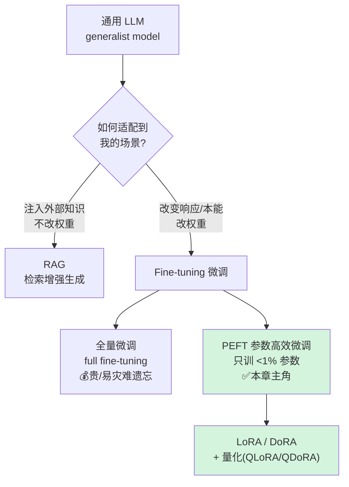
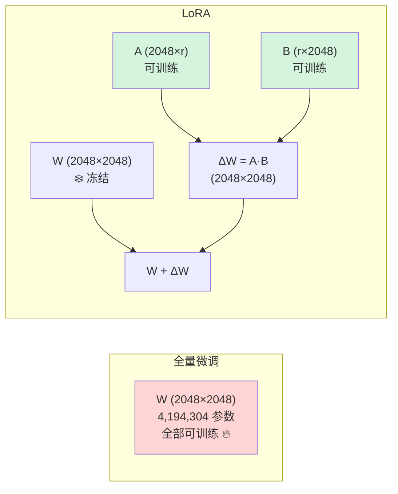
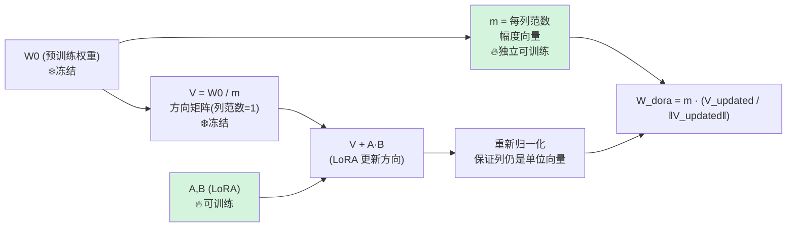
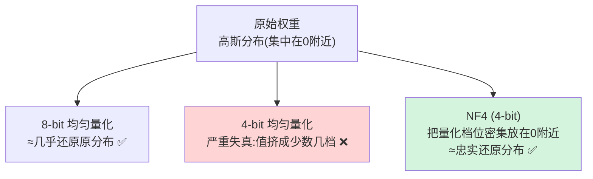
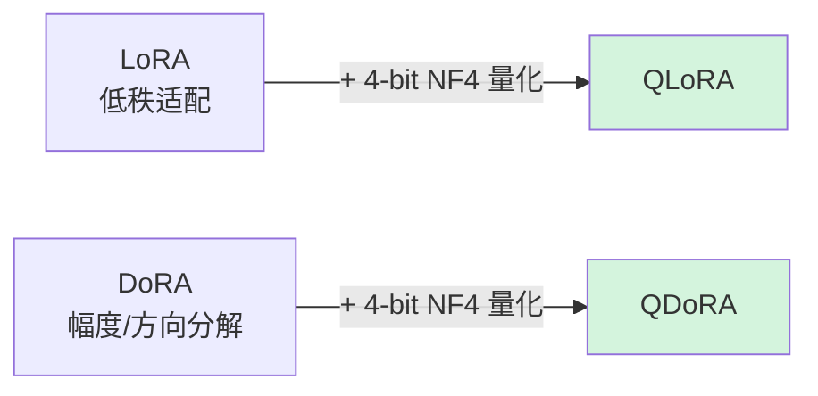
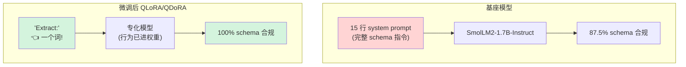
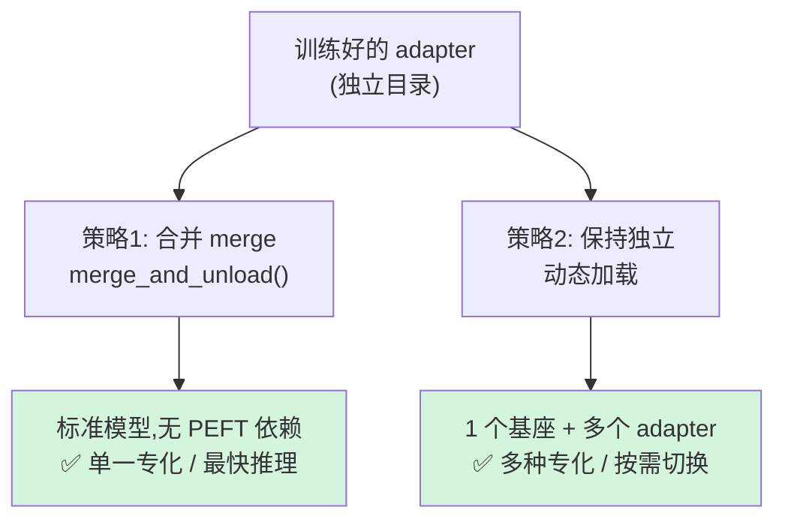
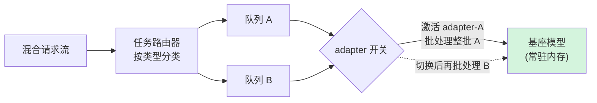
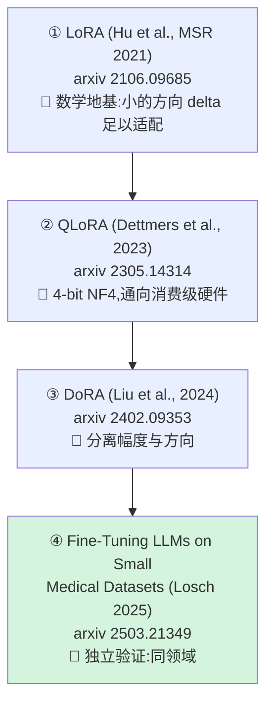

# 第 7 章 模型专化（Model Specialization）🎯

> 逐章精讲 ·《Rearchitecting LLMs》(MEAP, Pere Martra) · 对应原书 pp.234–271

---

## 🗺️ 本章地图

前面第 4–6 章我们一直在动模型的**结构**：深度剪枝（depth pruning）、宽度剪枝（width pruning）、知识蒸馏（distillation），目标是**在不丢通用能力的前提下让模型更小更快**。那是"做减法"。

本章的焦点彻底转向：不再改结构，而是**改行为**——让一个通用大模型学会你自己的数据、你自己的格式、你自己的任务。这就是**模型专化（specialization）**。

在全书流水线里，本章处于最后一环：

```
剪枝(变小) → 蒸馏(补回知识) → 【专化(变成你的模型)】 → 上线
```

读完这一章，你将能够：

- 🧩 说清 **LoRA** 为什么只训练不到 1% 的参数就能改变模型行为，并手写出它的低秩分解（low-rank decomposition）
- 🧭 理解 **DoRA** 如何把权重拆成"幅度 + 方向"，以及它相对 LoRA 到底强在哪、什么时候强不起来
- 💾 明白 **NF4 量化**为什么能把 65B 模型塞进单张消费级 GPU，以及它是"存储格式"而非"计算格式"的关键区别
- 🏥 完整跑通一个真实生产任务：把 SmolLM2-1.7B 专化成**临床结构化信息抽取器**（自由文本病历 → 严格 JSON schema）
- 📊 用 **schema compliance（模式合规率）** 和 **5 大通用基准**两根轴，量化"专化收益 vs 通用能力损失"这个核心取舍
- 🔀 掌握上线两条路：**merge 合并权重** vs **动态 adapter 路由**

一句话总结本章的核心洞见：

> **微调的本质，是把原本写在 prompt 里的指令，永久搬进模型的权重里。** 你不是在写更好的提示词，你是在重塑模型学到的东西。

---

## 7.0 为什么要专化？三种手段的定位 🔬

先把"专化"放进更大的图里。让一个通用 LLM 适配到你的场景，业界有三条路：



| 手段 | 是否改权重 | 解决什么 | 典型代价 |
|---|---|---|---|
| **RAG**（检索增强） | ❌ 否 | 注入**外部/时效性知识** | 依赖检索质量、上下文变长、每次推理都要检索 |
| **全量微调** | ✅ 全部 | 改变响应方式 + 注入领域词汇/概念 | VRAM 爆炸（梯度+优化器状态 ×4~8）、易**灾难遗忘** |
| **PEFT（LoRA/DoRA）** | ✅ 极小一部分 | 同上，但只训 <1% 参数 | 表达能力受秩 r 限制、需要调超参 |

**本章讲的是第三条路里最主流的 LoRA/DoRA，并叠加量化。**

### 一个最具代表性的专化场景：结构化输出 📦

通用 LLM 有个"毛病"：你让它输出 JSON，它偏要加一句 *"Here's the JSON you requested..."*，或者补一段解释。这些废话会**直接打断生产管线**（下游 `json.loads()` 直接崩）。

传统做法是写一个又臭又长的 prompt 反复叮嘱"只输出 JSON、不要 markdown、不要解释……"。但 prompt 有个硬上限：**它能定义任务，却无法泛化到它没预料到的输入**（本章后面会用真实数据证明这一点——基线模型在"含噪声"样本上直接掉到 50% 合格率）。

> 💡 **实战 / 面试高频**
> "为什么不用更强的 prompt engineering 解决结构化输出，非要微调？"
> 标准答案：**prompt 只能约束任务定义，不能改变模型的先验分布**。当输入偏离 prompt 预设的形态时，prompt-only 系统会脆断。微调把"指令"从输入侧（prompt）搬到权重侧，是从根上（at the root）修复问题，得到**鲁棒、可预测**的输出，同时省掉了长 prompt 的 token 成本。

---

## 7.1 高效微调：PEFT 的核心思想 ⚡

用微调给模型加领域知识或改行为，会撞上**两堵墙**：

1. **💰 算力/显存成本**：更新一个几十亿参数模型的**全部**权重，不仅要在显存里放权重，还要放**梯度（gradients）** 和**优化器状态（optimizer states）**。这会让 VRAM 消耗相对模型本身**放大 4×~8×**。
   - 直觉算一笔账：一个 fp16 权重占 2 字节。用 Adam 优化器时，还要存 fp32 的权重副本、一阶动量、二阶动量，外加梯度。粗略地，权重 + 梯度 + 优化器状态加起来 ≈ 权重的 4~8 倍。
2. **🧠 灾难遗忘（catastrophic forgetting）**：改权重可能破坏模型预训练时学到的、我们想保留的知识。

**PEFT（Parameter-Efficient Fine-Tuning，参数高效微调）** 就是为这两堵墙而生。

> 🔬 **第一性原理：PEFT 到底在做什么**
> 核心想法就一句话：**冻结原架构，在它上面策略性地加一小撮新参数去学习"delta（增量）"**。
> - 基座模型（base model）**原封不动**（frozen）；
> - **adapter（适配器）** 只学那点"最小必要的参数调整"，让模型行为发生偏移。
>
> 这样一来，我们只需训练**不到 1%**（有时甚至不到 0.1%）的参数，就能改变模型行为。梯度和优化器状态只针对那一小撮参数，显存压力骤降。

HuggingFace 的 **PEFT 库**（`github.com/huggingface/peft`）提供了多种实现。本章聚焦两种：**LoRA** 及其进化版 **DoRA**。两者数学基础相同——**低秩矩阵分解（low-rank matrix decomposition）**。

---

### 7.1.1 LoRA 的地基：低秩分解 🧩

先感受一下"全量微调有多重"。本章用的模型是 **SmolLM2-1.7B**，它的 `q_proj` 层（属于注意力模块 Attention）是一个 **2048 × 2048** 的矩阵——**4,194,304（约 400 万）个参数**。而这样的注意力矩阵，每个 Transformer Block 里有 4 个（q/k/v/o），全模型有 **24 个 Block**。

**Listing 7.1　SmolLM2-1.7B 的注意力结构**

```python
(0-23): 24 x LlamaDecoderLayer(
   (self_attn): LlamaAttention(
       (q_proj): Linear(in_features=2048, out_features=2048, bias=...)
       (k_proj): Linear(in_features=2048, out_features=2048, bias=...)
       (v_proj): Linear(in_features=2048, out_features=2048, bias=...)
       (o_proj): Linear(in_features=2048, out_features=2048, bias=...)
)
```

**逐行解读**：一个 decoder 层里，`self_attn` 就有 4 个 2048×2048 的线性层。光注意力就是 `24 层 × 4 矩阵 × 400 万 ≈ 4 亿参数`——这还没算 MLP。全量微调要为这几亿参数同时算梯度、存优化器状态。

**LoRA（Low-Rank Adaptation，低秩适配）的做法**：不训练原矩阵 $W$（保持冻结），而是训练一个**插进去的增量矩阵 $\Delta W$**。关键在于——**$\Delta W$ 不直接存，而是拆成两个小矩阵 $A$、$B$ 的乘积**：

$$\Delta W = A \cdot B, \qquad W_{\text{adapted}} = W + \Delta W = W + AB$$



**尺寸怎么定？** 由两个值决定：

- $d$：原矩阵 $W$ 的维度（这里 2048）
- $r$（rank，秩）：**你自己设的超参**。$A$ 是 $d \times r$，$B$ 是 $r \times d$。

**为什么维度能对上？** 因为 $r$ 在矩阵乘法里被"消掉"了：$A$ 是 $(d \times r)$、$B$ 是 $(r \times d)$，乘积 $AB$ 是 $(d \times d)$——**和 $W$ 一模一样**，所以推理时能直接相加。

$$\underbrace{(d \times r)}_{A} \cdot \underbrace{(r \times d)}_{B} = \underbrace{(d \times d)}_{\Delta W}$$

- **$r$ 越大** → $\Delta W$ 表达能力越强，但要训的权重越多；
- **$r$ 越小** → 越省，但可能学不动复杂变化。

**省了多少？** 对 `q_proj`，取 rank=8：

$$\text{原}=2048 \times 2048 = 4{,}194{,}304 \quad\longrightarrow\quad \text{LoRA}=2048 \times 8 + 8 \times 2048 = 32{,}768$$

**减少了 99.2%！** 🎉

---

**Listing 7.2　把 LoRA 分解应用到 SmolLM2-1.7B 的 q_proj**（逐行讲解）

```python
import torch
d = 2048              # #1 与 q_proj 的维度相同
r = 8                 # #2 控制 adapter 大小的超参，后面 LoRA 配置里还会用
W = torch.randn(d, d) # #3 原始权重矩阵，真实训练中它完全冻结
A = torch.randn(d, r)
B = torch.zeros(r, d) # #4 B 初始化为全 0（遵循原始 LoRA 论文）
delta_W = A @ B

print(f"W dimensions:        {W.shape}")
print(f"ΔW dimensions:       {delta_W.shape}")
print()
params_W    = d * d
params_lora = d * r + r * d
reduction   = (1 - params_lora / params_W) * 100
print(f"Parameters in W:     {params_W:,}")
print(f"Parameters in A + B: {params_lora:,}")
print(f"Reduction:           {reduction:.1f}%")

B_trained = torch.randn(r, d) * 0.01  # #5 模拟训练后的 B（值很小）
delta_W_trained = A @ B_trained
W_adapted = W + delta_W_trained       # #6 W_adapted = W + ΔW
print(f"\nW dimensions (unchanged):        {W_adapted.shape}")
print(f"Sample weights before adaptation: {W[0, :4]}")
print(f"Sample weights after adaptation:  {W_adapted[0, :4]}")
```

**逐行中文讲解**：

- `#1` `d=2048`：和真实 `q_proj` 一样的维度，让演示贴近实际。
- `#2` `r=8`：adapter 大小的超参，也是后面 `LoraConfig(r=8)` 里的那个 `r`。
- `#3` `W = torch.randn(d, d)`：随机造一个"原始权重"代替真实权重。**记住：真实训练里它是冻结的**。
- `#4` `B = torch.zeros(r, d)`：**B 初始化为全 0，是 LoRA 论文的关键设计**。这样训练一开始 $\Delta W = AB = 0$，模型行为**和微调前完全一致**，不会一上来就被随机噪声破坏。（$A$ 可以随机初始化，只要 $A$ 或 $B$ 有一个为 0，乘积就是 0。）
- `@` 运算符：Python 里的**矩阵乘法**，取 $A$ 的行 × $B$ 的列做点积，产出与 $W$ 同尺寸的 $\Delta W$。
- `#5` `B_trained = torch.randn(r, d) * 0.01`：模拟训练**结束后**的 B。用 `0.01` 这个小尺度，因为微调后观察到的典型幅度就这么小。
- `#6` `W_adapted = W + delta_W_trained`：把增量加回去。

**运行结果**：

```
W dimensions:        torch.Size([2048, 2048])
ΔW dimensions:       torch.Size([2048, 2048])
Parameters in W:     4,194,304
Parameters in A + B: 32,768
Reduction:           99.2%
W dimensions (unchanged):        torch.Size([2048, 2048])
Sample weights before adaptation: tensor([-1.1684, -0.1492, -0.48...])
Sample weights after adaptation:  tensor([-1.1576, -0.1631, -0.48...])
```

**看懂了什么？** 加回增量后的 $W_{\text{adapted}}$ **尺寸和 $W$ 完全相同**（2048×2048），权重被**微妙地调整了一点点**（-1.1684 → -1.1576），但**结构完好无损**。这就是 LoRA 的"理论承诺"被代码验证：**用 32,768 个可训练参数，撬动一个 419 万参数矩阵的行为。**

> 💡 **面试高频：LoRA 推理为什么零额外开销？**
> 因为 $\Delta W = AB$ 和 $W$ 同尺寸，训练完把 $W + AB$ **合并（merge）** 成一个新矩阵后，推理时就是一个普通的 2048×2048 矩阵乘法，**没有任何额外的延迟或结构**。这也是 LoRA 能成为"事实标准"的重要原因。

> ⚠️ **常见坑：B 一定要初始化为 0**
> 如果 A、B 都随机初始化，训练第一步 $\Delta W \neq 0$，相当于给冻结的好模型**上来就注入一坨随机扰动**，训练前期极不稳定。务必保证 $A$ 或 $B$ 有一个初始化为 0。

LoRA 极其高效，已成为**微调的事实标准（de facto standard）**。最近它有了一个进化版——**DoRA**，能在微调时做**更精细的控制**。

---

### 7.1.2 DoRA：把权重拆成"幅度 + 方向" 🧭

**LoRA 的主要局限**：计算 $\Delta W = A \cdot B$ 时，它**同时改变了向量的幅度（magnitude）和方向（direction）**，无法分开控制。

回忆第 4 章我们量 Transformer block 输出的**余弦相似度**时区分过这两个分量：

- **幅度（magnitude）** → 影响"强度/力度"（strength）
- **方向（direction）** → 代表"语义含义"（semantic meaning）

**关键观察（来自论文）**：

| 微调方式 | 幅度与方向的相关性 | 含义 |
|---|---|---|
| **全量微调** | **−0.62** | 一个增大、另一个倾向减小——**解耦、灵活** |
| **LoRA** | **+0.83** | 幅度和方向几乎**总是一起变**——**被绑死、不灵活** |
| **DoRA** | **−0.31** | 明显更接近全量微调的行为 ✅ |

> 🔬 **第一性原理：为什么"绑在一起"是坏事？**
> 全量微调能做到"幅度大改、方向微动"或反过来，LoRA 做不到——它俩总是同增同减（+0.83）。这**限制了表达能力**：有些任务需要"只改语义方向、几乎不动强度"，LoRA 被迫连带改了强度，反而破坏了基座能力。

**DoRA（Weight-Decomposed Low-Rank Adaptation，权重分解低秩适配）** 的解法：把原矩阵 $W$ 显式拆成两部分——

$$W = m \cdot \frac{V}{\|V\|}, \qquad m = \|W\|_{\text{col}}, \quad V = \frac{W}{m}$$

- **幅度向量 $m$**：每列的范数，作为**独立的可训练参数**单独更新。
- **方向矩阵 $V$（列范数=1）**：由 **LoRA 负责调整**（$\Delta V = AB$）。



**DoRA 带来的三大专化优势**：

1. **能力退化更小**：不强迫改动幅度 → 基座知识受影响小得多。而且这种高效允许用**更小的 rank（r）** 而不崩。
2. **语义学习能力更强**：解耦幅度和方向后，更新模式**模仿全量微调**，能更精确地吸收新领域知识和复杂推理。
3. **小数据集也有效**：简化了优化问题 → 即使训练样本很少，DoRA 也能比 LoRA 更好地适配。

---

**Listing 7.3　把 DoRA 分解应用到 q_proj**（逐行讲解）

```python
import torch
d = 2048
r = 4                                  # #1 故意调小 r=4，展示 DoRA 低秩下仍稳
W0 = torch.randn(d, d)                 # #2 冻结的预训练权重
m = torch.norm(W0, dim=0, keepdim=True)# #3 取每一列的范数 → 幅度
V = W0 / m                             # #4 除以幅度 → 方向(每列单位范数)
A = torch.randn(d, r)
B = torch.zeros(r, d)
B_trained = torch.randn(r, d) * 0.01   # #5 模拟训练后的 B(小值)
V_updated     = V + A @ B_trained      # #6 LoRA 只更新方向 V
V_updated_norm = torch.norm(V_updated, dim=0, keepdim=True)
W_dora = m * (V_updated / V_updated_norm)  # #7 重组:学到的幅度 × 更新后的方向
params_lora   = d * r + r * d
params_dora_m = d
print(f"W0 shape:                    {W0.shape}")
print(f"W_dora shape:                {W_dora.shape}")
print()
print(f"Parameters in A + B:         {params_lora:,}")
print(f"Additional magnitude params: {params_dora_m:,}")
print()
print(f"Sample W0[0, :4]:     {W0[0, :4]}")
print(f"Sample W_dora[0, :4]: {W_dora[0, :4]}")
```

**逐行中文讲解**：

- `#1` `r=4`：这里故意把 r 调到 4（比 LoRA 那个 8 还小），**就是为了展示 DoRA "低秩下也不崩"的理论优势**。⚠️ 注意：后面真正的对比实验里，两种技术都用 `r=8` 以求公平；实际中 r 取多少仍是**经验决定**。
- `#2` `W0`：冻结的预训练权重。
- `#3` `m = torch.norm(W0, dim=0, keepdim=True)`：沿列（`dim=0`）取范数，抽出**每列的幅度**。这和第 4 章算余弦相似度前做的归一化是同一套操作。
- `#4` `V = W0 / m`：除以幅度 → 得到 $V$，**每列都是单位范数**，只表示"方向"。
- `#5` `B_trained`：同 Listing 7.2，用小值模拟训练后的状态。
- `#6` `V_updated = V + A @ B_trained`：**LoRA 只作用在方向 $V$ 上**，把 $V$ 往学到的方向推。
- `V_updated_norm` + `#7`：重新归一化保证列仍是单位向量，再乘回**学到的幅度 $m$**，重组出最终权重 `W_dora`。**它的尺寸和 W0 完全相同——推理时和 LoRA 一样精确合并，零额外成本。**

**运行结果**：

```
W0 shape:                    torch.Size([2048, 2048])
W_dora shape:                torch.Size([2048, 2048])
Parameters in A + B:         16,384
Additional magnitude params: 2,048     ← DoRA 多出来的幅度参数 m
Sample W0[0, :4]:     tensor([-1.3111, -0.1597, -0.5458,  0.9187])
Sample W_dora[0, :4]: tensor([-1.0166, -0.3212, -0.2501,  1.6506])
```

**注意那 2048 个"额外幅度参数"**：这正是 DoRA 每列多加的幅度向量 $m$。后面真实训练里，你会看到 QDoRA 比 QLoRA 恰好多出约 63.9 万个可训练参数——就是这些 $m$。

> 💡 **一句话记住 LoRA vs DoRA**
> - **LoRA**：一把整体调整方向+幅度（绑在一起）。
> - **DoRA**：先拆成方向和幅度，**方向交给 LoRA 学，幅度单独学** → 更像全量微调，退化更小。

到这里我们把分解讲清楚了。但下一步是把它**塞进一张真实的 GPU**——这就需要**量化**。

---

## 7.2 量化与显存瓶颈 💾

PEFT 已经把"梯度 + 优化器状态"的显存问题解决了（因为基座冻结、只训小 adapter）。但还有一个问题：**冻结的基座模型本身仍然占满它原来的显存**——光这一项就可能让模型**塞不进你手头的 GPU**。

**量化（Quantization）** 的思路极其简单：**降低基座权重的数值精度**。

> 🔬 **第一性原理：量化省的是什么**
> 与其用 **32 位浮点**表示每个权重，改用 **16、8 甚至 4 位**。基座模型占用的显存大幅缩小，**腾出的空间就留给训练需要的梯度和优化器状态**。

| 精度 | 相对 fp32 大小 | 相对 fp16 大小 | 说明 |
|---|---|---|---|
| **FP32** | 100% | 200% | 基准 |
| **FP16 / BF16** | 50% | 100% | 半精度 |
| **INT8 (8-bit)** | 25% | 50% | 分布保持好，但省得不够狠 |
| **4-bit (NF4)** | 12.5% | **25%** | 直接砍到 1/4，往往决定"能不能塞进 GPU" |

> ⚠️ **NOTE：量化不是万能规则**
> 量化不是必做项。**如果模型本来就能装进显存，不量化训练更快**。只有当**显存是真正的瓶颈**时才量化——而在没有专用硬件的实验室外，这是常见场景。

**代价：精度损失。** 见下图（原书 Figure 7.3）的直觉：



**既然 8-bit 保真度这么好，为什么不永远用 8-bit？** 因为：

- 16 → 8 位，模型大小**减半**；
- 16 → 4 位，模型大小**砍到 1/4**。

**而这个差别，往往正是"训练时模型能不能塞进 GPU"的分水岭。**

---

### NF4：为 LLM 权重量身定做的 4-bit 格式 🎯

**NF4（NormalFloat 4-bit）** 是 QLoRA 论文（[arxiv 2305.14314](https://arxiv.org/abs/2305.14314)）为预训练 LLM 权重引入的数据类型。

- 4 位只能表示 **16 个不同的值**，模型每个权重都必须映射到这 16 个之一。
- **均匀量化（uniform）** 把这 16 档**等间距**铺在整个范围上。若权重从 −1.0 到 1.0，档位就是 −1.0, −0.87, −0.73 … 0.0, 0.13, 0.27 … 1.0。

> 🔬 **第一性原理：均匀量化为什么对 LLM 是灾难**
> **LLM 权重服从正态分布——绝大多数挤在 0 附近。** 在这个密集区，原本是 0.08、0.10、0.12 的权重可能**全被四舍五入成同一个值 0.13**，它们之间的差异彻底丢失。而在两端稀疏区，档位却浪费了。

**NF4 的修正**：把**更多量化档位塞到 0 附近，两端放少一点**。结果就是——**4-bit 的最小内存占用 + 远小于均匀量化的退化**。这就是 NF4 成为 **LLM 量化事实标准**的原因。

> ⚠️ **NOTE：NF4 是存储格式，不是计算格式！（超高频面试点）**
> 目前**没有任何 GPU 架构（包括 NVIDIA Ampere、Hopper）能原生做 4-bit 矩阵乘法**。实际执行时，权重会在每次运算前**即时反量化（dequantize on the fly）回 16 位**再算。
> **→ 内存节省是真的；计算仍在更高精度下进行。**
> 这解释了为什么 QLoRA 能省显存但不一定省算力——你换来的是"能跑起来"，不是"跑得更快"。

把 **LoRA/DoRA + 量化**组合起来，就得到本章要实测的两把武器：**QLoRA** 和 **QDoRA**。



---

## 7.3 用 QLoRA 和 QDoRA 做专化：临床信息抽取实战 🏥

理论地基已搭好：LoRA 把权重更新拆成两个小矩阵、DoRA 分离幅度与方向、NF4 让原本装不下的模型能跑。现在把它们**全部组合起来解决一个真实问题**。

**任务**：把 **SmolLM2-1.7B-Instruct** 专化成从**医疗病历自由文本**中抽取临床信息、返回**严格 JSON schema** 的抽取器。

**双目标**：① 把 15+ 行的长 prompt 换成**一条指令**；② 尽可能保留模型的通用能力。

> 对应 notebook：`CH07_NB02_L4_QLoRA_QDoRA.ipynb`（完整训练管线 + 全套 benchmark）；小显存版 `CH07_NB02_T4_QLoRA_QDoRA.ipynb`（不跑完整基准）。

---

### 7.3.1 基座模型与临床数据集 📋

**任务本质**：结构化临床信息抽取（structured clinical NER）——给一段病历自由文本，模型要识别**症状、药物、生命体征**等实体，返回符合严格 schema 的 JSON。

**这是一个典型的生产问题**：模型**已经具备**所需知识，但**没有非常详细的指令就不可靠**。SmolLM2-1.7B-Instruct 能识别这些实体，但需要你喂一个很完整的 prompt 才肯遵守 schema——**即便如此也不总遵守**。

**Listing 7.4　临床 NER 的 JSON schema**

```json
{
 "patient_age": int or null,
 "symptoms": [list of normalized strings],
 "vital_signs": {
   "temperature": float or null,
   "heart_rate": int or null,
   "blood_pressure": string or null
 },
 "medications": [
   {"name": string, "dose": string, "frequency": string}
 ],
 "duration_days": int or null
}
```

⚠️ **任何缺失的键、或错误的数据类型**（比如把年龄返回成字符串 `"32"` 而非整数 `32`）都算**验证失败（validation failure）**。这就是生产环境的严苛之处——"差不多对"等于错。

**数据集**：一个专门合成的数据集（HF: `oopere/clinical-ner-qdora`），**400 条**（360 训练 / 40 测试），把医疗文本和 Listing 7.4 的结构化输出配对。

为了让模型学会**内化结构、隔离有用信息**，数据集**故意注入噪声**，分 5 类：

| 类别 | 样本数 | 说明 |
|---|---:|---|
| **Clean**（干净） | 100 | 标准、书写规范的专业病历 |
| **Abbreviations**（缩写） | 80 | 含常见医学行话和缩写 |
| **Implicit**（隐含） | 80 | 症状被间接描述（如"病人觉得房间在转"= 眩晕 vertigo） |
| **Typos**（错字） | 70 | 拼写错误、口语化语法 |
| **Irrelevant**（无关） | 70 | 掺入个人背景/轶事细节，模型要学会**丢弃** |

> 💡 数据集用 **LiteLLM** 跨多个 LLM 合成，每条**入库前都对 schema 做自动校验**。仓库还带了 `CH07_NB_dataset_generator.ipynb` 供你复现——**合成数据生成本身就是很多真实项目的重要一步**。

**三个可量化目标**（结尾要逐一评估）：

1. **推理效率**：把多行 system prompt 换成一个单词指令 `"Extract:"`，**大幅削减 token 消耗**。
2. **可靠性**：至少维持、最好超过基座模型用长 prompt 达到的可靠性。
3. **知识保留（capabilities）**：在专化的同时**避免灾难遗忘**。

---

### 7.3.2 建立基线：可靠性 + 通用能力 📏

任何实验第一步都是**建立基线**。这里要在**两个维度**评估：① 模型生成合规响应的可靠性；② 训练前的通用能力水平。

> 🔬 **为什么必须量通用能力基线？**
> 因为**即便你只为一个很窄的任务训练，你也在改动可能影响其他领域行为的权重**。不先量基线，就无法事后判断专化到底损失了多少通用能力（灾难遗忘）。

**第一步：用 NF4 以 4-bit 加载模型。**

**Listing 7.5　加载量化后的 SmolLM**

```python
bnb_config = BitsAndBytesConfig(
   load_in_4bit=True,
   bnb_4bit_quant_type="nf4",              #A 用 NF4 而非均匀量化
   bnb_4bit_compute_dtype=torch.bfloat16,  #B 计算时反量化到 bf16
   bnb_4bit_use_double_quant=True,         #C 双重量化,再省一点显存
)
tokenizer = AutoTokenizer.from_pretrained(MODEL_NAME)
tokenizer.pad_token = tokenizer.eos_token
tokenizer.padding_side = "right"
model = AutoModelForCausalLM.from_pretrained(
   MODEL_NAME,
   quantization_config=bnb_config,
   device_map="auto",
)
```

**逐行讲解**：
- `#A` `bnb_4bit_quant_type="nf4"`：呼应 7.2 讲的——用 NF4 存储，忠实还原正态分布。
- `#B` `bnb_4bit_compute_dtype=torch.bfloat16`：**印证了"存储 4-bit、计算高精度"** ——每次运算前反量化到 bf16 再算。
- `#C` `use_double_quant=True`：**双重量化**，连量化常数本身也量化，再挤出一点显存。
- `pad_token = eos_token` / `padding_side="right"`：SmolLM 没有专门 pad token，借用结束符；右侧填充是因果 LM 的常规做法。

**第二步：定义什么叫"正确响应"。** 这个任务**不用 perplexity 或 accuracy**，而是逐字段检查 JSON 是否符合 schema。

**Listing 7.6 / 7.6b　Schema 校验函数**

```python
REQUIRED_SCHEMA = {
   "patient_age":  (int, type(None)),
   "symptoms":     list,
   "vital_signs":  dict,
   "medications":  list,
   "duration_days": (int, type(None)),
}
VITAL_SIGNS_KEYS = {"temperature", "heart_rate", "blood_pressure"}

def check_schema_compliance(response_text: str) -> dict:
   cleaned = response_text.strip()\
                     .removeprefix("```json")\
                     .removesuffix("```").strip()      #A 去掉 markdown 围栏
   try:
       parsed = json.loads(cleaned)
   except json.JSONDecodeError as e:
       return {"is_valid_json": False, "matches_schema": False,
               "failure_reason": f"JSON parse error: {e}"}

   for key, expected_type in REQUIRED_SCHEMA.items():   #B 逐键检查存在+类型
       if key not in parsed:
           return {"is_valid_json": True, "matches_schema": False,
                   "failure_reason": f"Missing key: '{key}'"}
       if not isinstance(parsed[key], expected_type):
           return {"is_valid_json": True, "matches_schema": False,
                   "failure_reason": f"Wrong type for '{key}': ..."}

   for vk in VITAL_SIGNS_KEYS:                          #C 检查嵌套的生命体征键
       if vk not in parsed["vital_signs"]:
           return {"is_valid_json": True, "matches_schema": False,
                   "failure_reason": f"Missing vital_signs key: '{vk}'"}

   return {"is_valid_json": True, "matches_schema": True, "failure_reason": None}
```

**逐行讲解**：
- `#A`：模型爱在 JSON 外面套 ` ```json ... ``` ` 围栏，先剥掉。
- `#B`：**遍历必需 schema，逐键检查"存在性 + 类型"**。类型用元组 `(int, type(None))` 表示"整数或 null 都行"。这正是抓 `"32"` vs `32` 这类类型错误的地方。
- `#C`：`vital_signs` 是嵌套字典，单独检查它内部三个键是否齐全。

函数返回三个字段：`is_valid_json`（能否解析）、`matches_schema`（是否符合完整契约）、`failure_reason`（到底哪里错了）。

**第三步：定义基线要用的严格 prompt。**

```python
STRICT_PROMPT = """You are an automated medical data extraction system.
Your only task is to extract clinical information into a strict JSON.
Use EXACTLY this schema:
{  ...（完整重复 Listing 7.4 的 15 行 schema）...  }
Respond ONLY with the raw JSON. No markdown, no explanation, no extra text."""
```

**这就是那个"15 行的长 prompt"** ——把整个 schema 塞进系统提示里反复叮嘱。

**基线评测结果**：在 40 条测试集上，用这个 STRICT_PROMPT，聚合合规率 **87.5%**。但**按类别拆开看更有意思**：

| category | samples | valid_json_pct | schema_ok_pct |
|---|---:|---:|---:|
| abbreviations | 6 | 100.0 | **100.0** |
| clean | 8 | 100.0 | **100.0** |
| implicit | 7 | 100.0 | **100.0** |
| **irrelevant** | 12 | **50.0** | **50.0** ⚠️ |
| typos | 7 | 100.0 | **100.0** |

**模型不是随机失败的**：干净病历、缩写、隐含症状、错字它都轻松应对；**它专门栽在 irrelevant（无关噪声）上**——当文本混入 prompt 指令没预料到的上下文噪声，模型就"迷路"了。

> ⚠️ **IMPORTANT：这 50% 揭示了 prompt-only 系统的硬上限**
> **prompt 能定义任务，却无法把模型行为泛化到它从未被设计去处理的输入。** 微调恰恰填补这个鸿沟——**不是靠写更好的指令，而是靠重塑模型学到的东西。**

**第四步：量通用能力基线。** 跑 5 个标准 benchmark，各 500 样本：

**Listing 7.7　获取 benchmark**

```python
BENCHMARK_TASKS = ["arc_easy", "winogrande", "hellaswag",
                   "lambada_openai", "piqa"]
BENCHMARK_LIMIT = 500
baseline_benchmarks = model_evaluation(
   model, tokenizer, BENCHMARK_TASKS,
   device=DEVICE, limit=BENCHMARK_LIMIT, batch_size=4)
```

**基线结果**：

| benchmark | 指标 | 值 |
|---|---|---|
| arc_easy | acc_norm | 0.6200 |
| hellaswag | acc_norm | 0.6100 |
| lambada_openai | accuracy / perplexity | 0.6020 / 6.08 |
| piqa | acc_norm | 0.7940 |
| winogrande | accuracy | 0.6540 |

至此**完整基线**到手：**87.5% schema 合规**（严格 prompt）+ **5 个参考 benchmark**。这两根轴，就是后面评判专化是否达标的标尺。

---

### 7.3.3 QLoRA 训练：把 15 行 prompt 压成一个词 🗜️

目标：让模型执行同样的功能，但只用**一个词的 prompt——`"Extract:"`**。



> **行为指令从 prompt 搬进了模型权重。** 这就是"prompt 压缩（prompt compression through fine-tuning）"。

**第一步：把数据格式化成对话结构。** Instruct 模型不吃扁平字符串，它按**三种角色**的对话结构来理解：

- **System**：全局上下文/规则。这里注入 `MINIMAL_PROMPT = "Extract:"`。
- **User**：输入数据。这里放病历自由文本。
- **Assistant**：模型输出。**训练时这里放 ground truth（结构化、已校验的 JSON）**。

> 🔬 **本质：我们在教模型一个"关联"**
> 当 system 说 `"Extract:"`、user 给一段医疗文本时，**assistant 唯一合法的回答就是严格 JSON schema**。三个角色一组，把这个映射关系焊进权重。

**Listing 7.8　格式化训练样本**

```python
def format_training_example(sample: dict) -> str:
   label = json.loads(sample["label"]) if isinstance(sample["label"], str) \
           else sample["label"]
   messages = [
       {"role": "system",    "content": MINIMAL_PROMPT},           #A "Extract:"
       {"role": "user",      "content": sample["note"]},
       {"role": "assistant", "content": json.dumps(label, indent=2)},
   ]
   return tokenizer.apply_chat_template(                            #B 套聊天模板
       messages, tokenize=False,
       add_generation_prompt=False,                                #C 训练不加生成提示
   )

train_dataset = dataset["train"].map(
   lambda x: {"text": format_training_example(x)},
   remove_columns=dataset["train"].column_names,
)
```

**逐行讲解**：
- `#A`：system 里放极简指令 `"Extract:"`，模型会把它当作主指令。
- `#B` `apply_chat_template`：用 tokenizer 自带的聊天模板把三条消息拼成模型认识的格式（带特殊 token 分隔角色）。
- `#C` `add_generation_prompt=False`：**训练时不加"该模型说话了"的生成提示**（因为 assistant 内容已经给全了）；推理时才需要设 True。

**第二步：让量化模型能算梯度。** 4-bit 加载的权重格式**不允许直接算梯度**。

**Listing 7.9　准备量化模型接收梯度**

```python
from peft import LoraConfig, get_peft_model, prepare_model_for_kbit_training
model = prepare_model_for_kbit_training(model)
```

`prepare_model_for_kbit_training` 会做一些手脚（如把 layernorm 转回 fp32、开启梯度检查点、让输入 require_grad），**让 4-bit 模型能参与反向传播**。

**第三步：配置 LoRA adapter。**

**Listing 7.10　LoRA 配置**

```python
lora_config = LoraConfig(
   r=8,                #1 秩,与 7.1.1 演示同值(99.2% 省参)
   lora_alpha=16,      #2 缩放系数,常取 2×rank
   lora_dropout=0.05,  #3 训练时随机丢 5% 连接防过拟合
   bias="none",
   task_type="CAUSAL_LM",
   use_dora=False,     #4 用 QLoRA(下一节改成 True 就是 QDoRA)
   target_modules=[    #5 注意力全模块 + MLP 全模块
       "q_proj", "k_proj", "v_proj", "o_proj",
       "gate_proj", "up_proj", "down_proj",
   ],
)
model = get_peft_model(model, lora_config)
model.print_trainable_parameters()
# → trainable params: 9,043,968 || all params: 1,720,420,352 || trainable%: 0.53%
```

**逐行讲解**：
- `#1` `r=8`：就是 7.1.1 里那个 rank，产出 99.2% 的参数节省。
- `#2` `lora_alpha=16`：**缩放 adapter 对原权重的贡献**，遵循"取两倍 rank"的常规实践。有效缩放 ≈ `alpha / r = 16/8 = 2`。
- `#3` `lora_dropout=0.05`：训练中随机禁用 5% 连接，防过拟合。
- `#4` `use_dora=False`：**声明用 QLoRA**。下一节把这**唯一一个值**改成 `True`，在完全相同条件下重跑，就是 QDoRA。
- `#5` `target_modules`：7 个模块覆盖**完整注意力模块**（q/k/v/o_proj）+ **完整 MLP 模块**（gate/up/down_proj，即第 3 章讲的 GLU 结构），让微调既能调"如何关注信息"又能调"如何变换信息"。

**关键数字**：`trainable% = 0.53%`——**只训练 904 万 / 17 亿参数**，其余全冻结。

**第四步：配置并启动训练。**

**Listing 7.11　配置并训练 QLoRA**

```python
from trl import SFTTrainer, SFTConfig     #1
training_args = SFTConfig(
   output_dir="./qlora_output",
   num_train_epochs=3,                    #2 训练 3 轮
   per_device_train_batch_size=8,
   gradient_accumulation_steps=1,
   learning_rate=2e-4,                    #3 LoRA 常用学习率
   lr_scheduler_type="cosine",            #4 余弦退火
   warmup_steps=7,                        #5 预热(软启动)
   fp16=False,
   bf16=True,                             #6 L4 架构原生支持,比 fp16 稳
   logging_steps=10,
   save_strategy="no",
   max_length=MAX_SEQ_LENGTH,
   dataset_text_field="text",             #7 告诉 trainer 用哪列
   report_to="none",
)
trainer = SFTTrainer(model=model, train_dataset=train_dataset, args=training_args)
trainer.train()
```

**逐行讲解 + 关键算术**：
- `#1` `SFTConfig`/`SFTTrainer`：来自 `trl` 库，专做监督微调（SFT, Supervised Fine-Tuning）。
- `#2` 3 个 epoch。
- **步数怎么算**：360 训练样本 ÷ batch 8 = 45 步/epoch × 3 epoch = **135 步**。模型在整个训练中更新可训练权重 **135 次**。
- `#3` `learning_rate=2e-4`：LoRA 训练的标准值。
- `#4` `cosine`：学习率在训练中沿余弦曲线逐渐降到 0。
- `#5` `warmup_steps=7`：⚠️ **为什么要预热**——adapter 矩阵刚初始化，第一步就上满学习率会导致**过于激进的权重更新**。warmup 让学习率从 0 逐步爬到目标值，是"软启动"。
- `#6` `bf16=True`：**L4 GPU 原生支持 bfloat16**，它比 float16 更稳——**保留了和 float32 相同的动态范围，避免溢出（overflow）**。
- `#7` `dataset_text_field="text"`：告诉 trainer 用 Listing 7.8 格式化好的 `text` 列。

**训练后评测**（在 40 测试样本上，只用 `"Extract:"`）：

| category | samples | valid_json_pct | schema_ok_pct |
|---|---:|---:|---:|
| abbreviations | 6 | 100.0 | **100.0** |
| clean | 8 | 100.0 | **100.0** |
| implicit | 7 | 100.0 | **100.0** |
| **irrelevant** | 12 | **100.0** | **100.0** ✅ |
| typos | 7 | 100.0 | **100.0** |

```
Baseline strict prompt : 87.5%
QLoRA   minimal prompt : 100.0%
```

🎉 **模型在所有类别都达到 100%！** 最惊艳的是——**基线在 irrelevant 上那个 50% 的失败率被彻底修好了**。

> 💡 **本质发生了什么**
> "如何组织输出、如何忽略上下文噪声"这些知识**不再活在输入文本里，它已被永久吸收进 LoRA 权重**。你不只是缩短了 prompt——你还得到了一个**实际上超越了基线**的模型。

**代价：通用能力有多少损失？**（原书 Figure 7.5/7.6）

| benchmark | Baseline | QLoRA | 变化 |
|---|---:|---:|---:|
| **arc_easy** | 0.6200 | ~0.556 | **−10.3%** ⚠️ 唯一明显下降 |
| hellaswag | 0.6100 | ≈ | < 3% |
| lambada (acc) | 0.6020 | ≈ | −1% |
| lambada (perplexity) | 6.08 | 7.04 | +15.8% |
| piqa | 0.7940 | ≈ | < 3% |
| winogrande | 0.6540 | ≈ | < 3% |

**加权平均退化 3.3%** → **灾难遗忘只是边际级别**。专化后的模型**本质上还是那个通用模型**。

**唯一值得注意的是 arc_easy 跌了 10.3%**（相对）：ARC-Easy 测的是小学科学的常识推理，**和临床病历毫无关系**。最可能的假说是——**模型把一部分生成分布重定向到了结构化医学语言，这个重定向轻微影响了通用推理**。

同样，lambada 的 perplexity 从 6.08 涨到 7.04（+15.8%），但 accuracy 几乎没动（−1%）。**这证实模型把内部概率分布调向了临床领域**：它预测通用文本时"信心"稍降，但"答对"的能力没受显著影响。

---

### 7.3.4 QDoRA 训练：改一个参数会怎样？🔁

**从 QLoRA 切到 QDoRA，只需改一个参数**：`use_dora=True`，然后在新模型上重跑。

**Listing 7.12　为 QDoRA 重新加载基座**

```python
del model
torch.cuda.empty_cache()               # 清干净显存
model = AutoModelForCausalLM.from_pretrained(
   MODEL_NAME, quantization_config=bnb_config, device_map="auto")  #A
model = prepare_model_for_kbit_training(model)                     #B
```

**Listing 7.13　QDoRA 配置**（和 QLoRA 几乎一模一样）

```python
dora_config = LoraConfig(
   r=8, lora_alpha=16, lora_dropout=0.05,
   bias="none", task_type="CAUSAL_LM",
   use_dora=True,                       #A ← 唯一的改动!
   target_modules=["q_proj","k_proj","v_proj","o_proj",
                   "gate_proj","up_proj","down_proj"],
)
model = get_peft_model(model, dora_config)
model.print_trainable_parameters()
# → trainable params: 9,682,944 || all params: 1,721,059,328
```

**看那 63.9 万的差**：QLoRA 是 9,043,968，QDoRA 是 9,682,944，**多出约 639,000**。**这不是随机的——正是 DoRA 为每个目标矩阵的每一列加的幅度向量 $m$**（就是 7.1.2 里从方向 $V$ 中分离出来的那个）。`SFTConfig` 和 `SFTTrainer` **一个超参都没动**，训练过程完全相同。

**QDoRA 结果**：

```
Baseline strict prompt : 87.5%
QLoRA   minimal prompt : 100.0%
QDoRA   minimal prompt : 100.0%    ← 同样 100%
```

两种方法都达到 100% schema 合规，都把 prompt 吸收进了权重。

**benchmark 对比**：两种技术都比基线有**中等程度下降**（预期之内，因为在把通用权重专化成单一结构任务），**ARC-Easy 都是最大跌幅 −10.3%**。**关键：QDoRA 相对 QLoRA 一丁点都没改善，数值几乎可互换。**

> 🔬 **为什么 DoRA 的理论优势没兑现？（重要洞察）**
> DoRA 理论预测的优势特别体现在**小数据集 + 低秩**上。但本实验没出现。合理假说是：
> **这个合成数据集的输出 schema 极其确定性（deterministic），缺乏"语义变化（semantic variation）"** ——而幅度/方向分解要想带来可测量的提升，正需要语义变化。
> 一句话点睛：**"Papers propose; data disposes."（论文提出，数据裁决。）**

---

### 7.3.5 对照三个目标验收 ✅

| 目标 | 结论 |
|---|---|
| **① 推理效率**：15 行 prompt → 一个词 | ✅ **无保留达成**。QLoRA/QDoRA 都对 `"Extract:"` 100% 正确响应，包括基线的软肋 irrelevant（曾 50%）。**知识从 prompt 搬进了模型。** |
| **② 可靠性**：≥ 基线 87.5% | ✅ **超额达成**。两种技术都到 100%（还用的是极简 prompt）。不仅没因简化指令掉可靠性，**反而提升了**。 |
| **③ 保留通用知识** | ⚠️ **有代价但可接受**。两模型 benchmark 中等下降，ARC-Easy −10.3% 最明显，其余更温和。**这是用通用能力换专化行为的必然取舍，在多数生产场景完全可接受。** |
| **QLoRA vs QDoRA** | 🤷 **本实验不分伯仲**，结果几乎一致。7.4 会讲 DoRA 真正该赢的条件。 |

> 💡 **面试高频：如何量化"专化 vs 通用"的取舍？**
> 用**两根轴**：领域指标（这里是 schema compliance，从 87.5%→100%，**大涨**）和通用 benchmark（加权平均 −3.3%，**小跌**）。判断标准是——**领域收益是否远大于通用损失，且损失落在可接受阈值内**。本例领域可靠性从"生产不可用"变成"生产可用"，代价仅 3.3% 通用退化，是笔极划算的买卖。

---

### 7.3.6 上线两条路：合并权重 vs 动态 adapter 路由 🔀

训练时基座冻结，是 PEFT 库偷偷造了一组可训练权重（**adapter**）在推理时透明地和模型组合。adapter 就是一个目录：

```python
model.save_pretrained("./qdora_adapter")
```

用 adapter 有**两种策略**：



**策略 1：合并（merge）—— 最简单。** 把 adapter 权重加到原权重上、移除所有 PEFT 基础设施，得到一个**标准模型，无外部依赖**，加载和服务和任何普通模型一样。**当你只有一个专化、想要最快推理速度时，这是自然之选。**

**Listing 7.14　把 adapter 合并进基座**

```python
merged_model = model.merge_and_unload()          #1 权重合并,返回标准模型
merged_model.save_pretrained("./qdora_merged")   #2 序列化
tokenizer.save_pretrained("./qdora_merged")
```
- `#1` `merge_and_unload()`：执行 $W_{\text{new}} = W + \Delta W$ 并卸载 PEFT 结构。
- `#2` 之后可用普通 `AutoModelForCausalLM.from_pretrained()` 加载，**完全没有 PEFT 依赖**。

**策略 2：动态加载 —— 一个基座配多个 adapter。** 若你有不同 adapter（比如不同诊所/医院要不同格式），可只在内存里留**一个基座**，按需加载对应 adapter。

**Listing 7.15　在同一基座上动态加载多个 adapter**

```python
from peft import PeftModel
base_model2 = AutoModelForCausalLM.from_pretrained(
   MODEL_NAME, quantization_config=bnb_config, device_map="auto")  #1 基座只加载一次
model_with_adapter = PeftModel.from_pretrained(base_model2, "./qdora_adapter")  #2
model_with_adapter = PeftModel.from_pretrained(base_model2, "./qlora_adapter")  #3
```
- `#1` 基座加载一次，整个会话常驻内存。
- `#2`/`#3` `PeftModel.from_pretrained()` 用指定 adapter **包裹**基座、**不改动其原始权重**。LoRA/DoRA 都兼容这个模式，因为每个 PeftModel 独立管理自己的 adapter 架构。

> ⚠️ **常见坑：每次请求都切 adapter 会抵消性能收益！**
> 切 adapter 有真实的操作成本（要时间）。在生产里**逐个请求切换 adapter，会把性能优势全吃掉**。
> **正确姿势**：**按任务类型对请求分组，批量处理**——某个 adapter 激活时把整批同类请求跑完，再切下一个。

**Adapter 路由模式**（原书 Figure 7.7）：



一个**路由器（router）** 按任务类型分类请求、缓冲进各自队列；一个**开关**选哪个 adapter 激活：模型跑完一整批 → 换 adapter → 跑下一批。**基座全程常驻内存，只有轻量 adapter 在批次间切换。**

> 💡 **合并 vs 可换 adapter，怎么选？** 没有普适答案，取决于：**你需要多少种专化、切换多频繁、硬件资源多少**。但两者共享同一起点：**扎实的基座 + 训练良好的 adapter + 对结果的严格测量**。

---

## 7.4 从论文到实践 📚

本章工作扎根于**四篇论文**：



| # | 论文 | 贡献 | 对应本章代码 |
|---|---|---|---|
| ① | **LoRA** (Hu et al., 2021) | 证明**算一个小的方向性 delta 就足以适配新任务** | Listing 7.10：只训 0.53% 参数就重构了输出 |
| ② | **QLoRA** (Dettmers et al., 2023) | 引入 **4-bit NormalFloat 量化**，为 LLM 权重的自然分布优化；证明可在 48GB GPU 上微调 65B 模型 | Listing 7.5：`bnb_4bit_quant_type="nf4"` |
| ③ | **DoRA** (Liu et al., 2024) | 观察到全量微调时幅度/方向近乎独立更新（相关性 −0.62），LoRA 却把它俩拽在一起（+0.83）；显式分解后 DoRA 达到 −0.31 | Listing 7.3 的分解 |
| ④ | **Fine-Tuning LLMs on Small Medical Datasets** (Losch et al., 2025) | 几乎相同领域的独立验证 | 见下 |

**关于 QLoRA/QDoRA 为何近乎持平的深挖**：如果看 DoRA 论文里在 Llama-7B 上、**恰好用 rank=8**（就是我们实验用的值）的对比，DoRA 结果**明显更好**。为什么这里没复现？

> 🔬 **本质：DoRA 论文验证的是"深度语义适配"任务**
> DoRA 论文的实验是在**常识推理、视觉理解、多模态指令**上验证的——这些任务要求模型**改变某个东西的含义（what something means）**。
> 而**我们的实验只做结构适配（structural adaptation）**：模型只需改变**它怎么说（how it says it）**，不需要改变**它说的意思**。缺乏语义变化，幅度/方向分离就带不来可测量的优势。
> **一句话：DoRA 为"改变语义"而生；结构化抽取只是"改变表达格式"。**

**第 4 篇论文（Losch et al., 2025 年 3 月）** 工作在几乎相同的领域——从医疗自由文本抽取临床实体、输出结构化 JSON。它的两个数据点直接支撑我们：

- **仅用 300 个样本微调**，就让 **LLaMA3-8B 匹敌零样本的 LLaMA3-70B**；
- **解析错误从 17 个降到 1 个**（随专化）——这**直接呼应** 7.3.2：未训练基座在 irrelevant 上 50% 合规，微调后全类别 100%。

> 💡 **本章最大的方法论收获**
> **顶会论文给你 DoRA 这样的精巧技术，但决定你是否真的需要这份复杂度的，是你的问题约束和你自己的数据。** 同时，像那篇临床研究一样的应用研究证明——**你不需要大厂预算就能解决真实问题**。只要你**理解权重背后的理论基础、并严格测量结果**，就能用手头现有的硬件，构建高度专化、可上生产的模型。

---

## 7.5 动手实验（Hands-on Lab）🔬

本章用的是标准配置（r=8、3 epoch）。实验室换一个**更激进的配置：r=1、单 epoch、大得多的 lr**——**schema 合规仍保持 100%，但能力保留得更好**。三个练习：

| 练习 | 做什么 | 要回答的问题 |
|---|---|---|
| **① 数据效率前沿** | 用标准配置，把训练子集从 250 逐步降到 30 样本训练多个版本，测试集不变 | schema 合规在哪个点崩塌？是渐变还是有陡峭阈值？哪个类别**先崩**（irrelevant/typos/implicit）？恢复全类别 100% 需要多少样本？ |
| **② 目标模块选择** | 训 3 个 QLoRA 变体，只改 `target_modules`：仅注意力（q/k/v/o）、仅 MLP（gate/up/down）、仅 q+v（原始 LoRA 论文的最小配置） | 哪个变体能到 100%？注意力和 MLP 哪个对任务影响更大？可训练参数量和合规率是线性关系，还是有**边际递减点**？ |
| **③ 找一个 DoRA 会赢的任务** | 把临床数据集换成需要**语义适配/推理**的（如 databricks-dolly-15k 子集），其余代码超参不变 | 要求语义变化后，两技术的"平局"会打破吗？QDoRA 是否更好保留通用能力、或训练更稳定收敛？ |

> 💡 练习 ③ 正是对 7.4 假说的实证检验——**如果 DoRA 的优势真来自"语义变化"，那么换到需要语义适配的任务上，它就该赢。** 这是把"论文提出、数据裁决"落到自己手上的最佳练习。

---

## 📌 小结

| 关键点 | 一句话本质 |
|---|---|
| **微调的本质** | 把**行为指令从 prompt 搬进权重**，省 token、省内存、降延迟；能把长复杂 prompt 换成单词触发器。 |
| **PEFT** | 冻结基座、只学**低秩权重更新**，训练 <1% 参数就能改行为，大幅降训练成本。 |
| **LoRA** | $\Delta W = AB$，两个小矩阵撬动大矩阵；rank=8 时对 2048² 矩阵省 99.2% 参数；推理可合并、零额外开销。B 初始化为 0 保证起点不扰动。 |
| **DoRA** | 把权重拆成**幅度 $m$ + 方向 $V$**，方向交 LoRA 学、幅度独立学；更新模式更像全量微调（相关性 −0.31）。**在需要深度语义适配时防退化更好，纯结构任务里收益边际。** |
| **NF4 量化** | 4-bit NormalFloat 把量化档位密集放在 0 附近，解决"基座塞不进 GPU"的显存瓶颈。**是存储格式不是计算格式——运算前反量化到 16 位。** |
| **量化基线 + 评估** | 训练前必须用标准 benchmark 建**通用能力基线**才能量灾难遗忘。成功专化 = 领域可靠性大涨（87.5%→100%）+ 通用能力仅边际、可接受的下降（−3.3%）。 |
| **上线** | `merge_and_unload()` 合并成无 PEFT 依赖的标准模型（单一专化、最快）；或 `PeftModel.from_pretrained()` 动态换 adapter（多专化、按任务批处理）。 |
| **务实哲学** | 专化生产模型**不需要巨额预算或百万数据**——小合成数据集 + 消费级硬件足矣。**论文提出，数据裁决。** |

---

## 🔗 延伸阅读

**本书内**：
- **第 3 章《现代 Transformer 蓝图》**：本章 `target_modules` 里的注意力（q/k/v/o_proj）和 GLU-MLP（gate/up/down_proj）结构、以及幅度/方向分解的余弦相似度直觉都来自这里。
- **第 4 章《深度剪枝》**：DoRA 分离"幅度/方向"的思想直接沿用第 4 章测 block 输出余弦相似度时对这两个分量的区分。
- **第 5 章《宽度剪枝》**：其 5.1.8 "创建领域专化模型"与本章互补——剪枝先把模型裁到领域，再用本章微调补齐行为。
- **第 6 章《蒸馏恢复知识》**：蒸馏"补回被剪掉的知识"、本章"注入新领域行为"，共同构成"减法后如何恢复/增强"的完整闭环。

**关键论文**：
- LoRA — [arxiv 2106.09685](https://arxiv.org/abs/2106.09685)
- QLoRA — [arxiv 2305.14314](https://arxiv.org/abs/2305.14314)
- DoRA — [arxiv 2402.09353](https://arxiv.org/abs/2402.09353)
- Fine-Tuning LLMs on Small Medical Datasets — [arxiv 2503.21349](https://arxiv.org/abs/2503.21349)
- HF PEFT 库 — <https://github.com/huggingface/peft>

**llm-action 仓库内相关目录**：
- `llm-fine-tune/` / PEFT/LoRA/QLoRA 系列教程 —— LoRA/QLoRA 更多工程实践与源码解读，可与本章互印证。
- `llm-inference/` —— adapter 合并 vs 动态路由、多 LoRA 服务（如 S-LoRA、多 adapter 批处理）的推理侧落地。
- `llm-compression/` 量化章节 —— bitsandbytes / NF4 / GPTQ / AWQ 等量化方法的横向对比。
- `ai-infra-architecture/` —— 7.3.6 的"任务路由 + 批处理 + adapter 切换"是典型的推理服务架构问题，可延伸到批调度、显存管理。

---

> 🎓 **一章读完，你收获的核心心智模型**：
> **专化 = 把 prompt 里的隐性契约，通过 PEFT + 量化，永久焊进权重。** 判断成功只有一把尺子——**领域收益是否远大于通用损失，且损失在可接受阈值内。** 至于用 LoRA 还是 DoRA、量化到几位、合并还是路由——**永远是你的数据和约束说了算，不是论文。**
