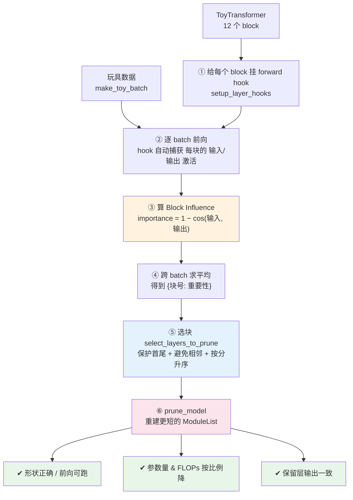
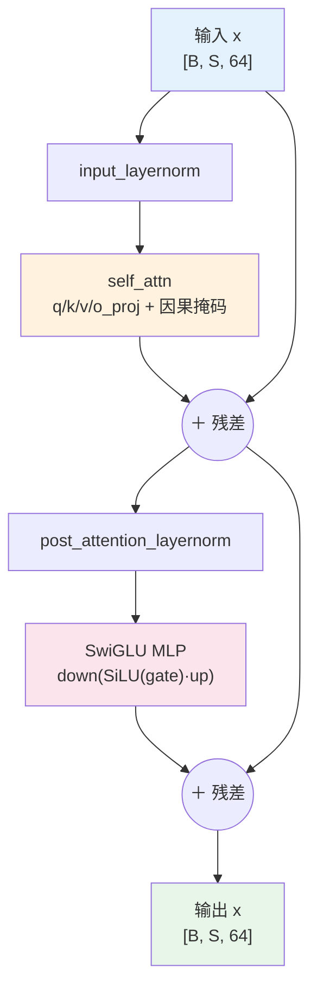
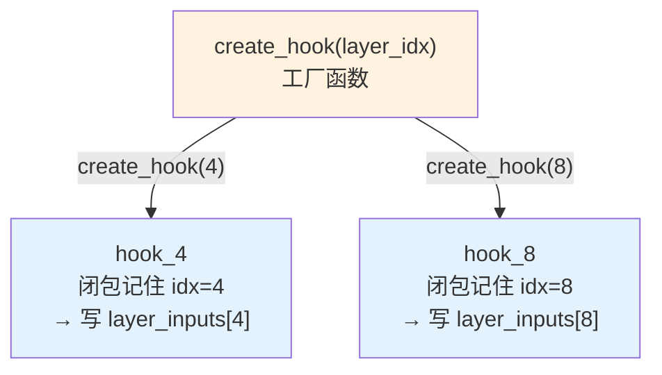
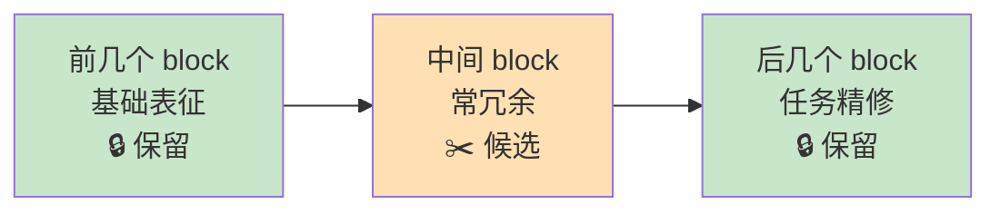

# 项目 01 · 深度剪枝实验室(Depth Pruning Lab)🪓

> 《Rearchitecting LLMs》**第 4 章「深度剪枝：更小更快」**的配套动手实验。
> **零依赖外网、零 GPU、零下载模型** —— 用一个自己手写的**玩具多层 Transformer**（纯 `torch`，CPU），
> 把书里「按层重要性删 block」的全套方法论**跑通、测对、画出来**。

```
选基座 → 【深度剪枝】 → 知识恢复 → 评估 → 部署
              ↑ 你在这里(本 lab 聚焦「怎么选块 + 剪完对不对」)
```

本 lab 回答一个工程问题：**给定一个多层 Transformer，怎么科学地删掉几层、并证明「删对了」？**
我们不追求「模型说人话」（那要真权重 + 联网），而是死磕两件**可验证**的事：

1. **机械正确性**：剪完形状对不对、前向跑不跑得通、参数量/FLOPs 是否按比例降、保留层是否一致。
2. **重要性方法论**：用 **PyTorch hook 探针 + Block Influence（BI = 1 − 余弦相似度）** 给每层打分，
   按「保护首尾 + 避免相邻」的启发式选出最该删的层，并保证**结果确定可复现**。

---

## 🗺️ 目录

- [1. 30 秒看懂：这个 lab 在干什么](#1-30-秒看懂这个-lab-在干什么)
- [2. 快速开始（如何运行）](#2-快速开始如何运行)
- [3. 全景图：数据如何流过整条流水线](#3-全景图数据如何流过整条流水线)
- [4. 原理逐层拆解（是什么/为什么/怎么用/代价）](#4-原理逐层拆解)
  - [4.1 玩具 Transformer：为什么长成这样](#41-玩具-transformer为什么长成这样)
  - [4.2 深度剪枝 = 重建一个更短的 layers 列表](#42-深度剪枝--重建一个更短的-layers-列表)
  - [4.3 PyTorch Hook 探针：不改代码偷看激活](#43-pytorch-hook-探针不改代码偷看激活)
  - [4.4 Block Influence：BI = 1 − cos](#44-block-influencebi--1--cos)
  - [4.5 选块：保护启发式 + 相邻保护](#45-选块保护启发式--相邻保护)
  - [4.6 收益量化：参数量 & FLOPs](#46-收益量化参数量--flops)
- [5. 代码逐行讲解（核心片段）](#5-代码逐行讲解核心片段)
- [6. 测试都测了什么（24 个用例）](#6-测试都测了什么24-个用例)
- [7. 看图说话：两张 demo 图](#7-看图说话两张-demo-图)
- [8. 💡面试高频 / ⚠️常见坑 / 🔬第一性原理 汇总](#8-面试高频--常见坑--第一性原理-汇总)
- [9. 📌小结 & 🔗延伸阅读](#9-小结--延伸阅读)

---

## 1. 30 秒看懂：这个 lab 在干什么

| 文件 | 作用 |
|---|---|
| `toy_transformer.py` | 手写玩具 Transformer（12 个 block，结构对齐 Qwen3DecoderLayer），CPU 秒跑 |
| `depth_pruning.py` | **核心**：hook 探针 / BI 重要性 / 选块 / `prune_model` / 参数量 & FLOPs 度量 |
| `run_demo.py` | 跑全流程 + 出两张图（重要性柱状图、剪枝比例 vs 参数量/FLOPs 曲线） |
| `tests/test_depth_pruning.py` | 24 个 pytest 用例，覆盖「参数按比例降 / 形状对 / 排序确定」等硬性质 |
| `requirements.txt` | 依赖（torch / numpy / matplotlib / pytest，全离线） |

**一句话价值**：把 ShortGPT 论文的 **Block Influence** 指标和 Shortened-LLaMA 的**保护启发式**，
浓缩成一个**你能读懂每一行、能一键复现、能拿去面试讲**的最小实现。

---

## 2. 快速开始（如何运行）

```bash
# 进入项目目录
cd book-rearchitecting-llms/projects/01_depth_pruning_lab

# (可选)装依赖 —— 本机若已有 torch/numpy/matplotlib/pytest 可跳过
pip install -r requirements.txt

# ① 跑测试(必须全绿)
python -m pytest -q
# 期望输出: 24 passed in ~2.5s

# ② 跑 demo(打印全流程 + 出两张图到 ./figures/)
python run_demo.py
```

`run_demo.py` 会在 `./figures/` 生成：
- `01_block_importance.png` —— 各 block 重要性柱状图（绿=保护、红=删除、灰=候选未删）
- `02_pruning_ratio_vs_size.png` —— 剪枝比例 vs 参数量/FLOPs 曲线

> ⚠️ **Windows 控制台编码坑**：默认 GBK 控制台 print 中文/emoji 会 `UnicodeEncodeError`。
> `run_demo.py` 开头已 `sys.stdout.reconfigure(encoding="utf-8")` 兜底；若你在别处调用记得比照处理。

---

## 3. 全景图：数据如何流过整条流水线



一个 block 的内部结构（和 Qwen3DecoderLayer 同构，Pre-Norm + 残差）：



> 🔬 **第一性原理：为什么「输入输出相似度」能当重要性？**
> 注意上图两条 `＋ 残差` 连线：block 的写法是 `x = x + sublayer(norm(x))`，输出 = 输入 + **增量变换**。
> 如果一个 block 的增量很小（sublayer 输出≈0），那输出向量≈输入向量 → **余弦相似度≈1** → 它几乎没干活（打酱油）。
> 反过来，改动大 → 相似度低 → 重要。这就是把 `1 − cos(输入, 输出)` 当「层重要性」的物理基础。

---

## 4. 原理逐层拆解

### 4.1 玩具 Transformer：为什么长成这样

书里的被试是 **Qwen3-0.6B**（28 层、隐藏维 1024，需要联网下载）。本 lab **不能下载**，
所以手写一个**结构同构、维度缩小**的玩具版（`toy_transformer.py`）：

| 维度 | Qwen3-0.6B | 本 lab 玩具版 | 为什么能缩 |
|---|---|---|---|
| block 数 `n_layers` | 28 | **12** | 剪枝逻辑与层数无关，12 层足够演示「删几层」 |
| 隐藏维 `d_model` | 1024 | **64** | 只影响算得快慢，不影响机械正确性 |
| 注意力头 `n_heads` | 16 | **4** | 需整除 d_model 即可 |
| 权重 | 预训练 | **随机初始化(固定种子)** | 我们验证的是「剪得对不对」，不是「说得好不好」 |

**关键设计**：每个 `TransformerBlock` 的 `forward` 保证**输入输出同维**（靠残差），
且所有 block 结构完全相同、装在一个 `nn.ModuleList` 里 —— 这正是「深度剪枝 = 换一个更短的 ModuleList」成立的前提。

> ⚠️ **常见坑：术语别混**。HF 里 `model.model.layers[i]` 这个属性叫 `layers`，但里面装的其实是 **block**
> （`Qwen3DecoderLayer`）。本 lab 沿用书里口径：**「剪层」= 剪 block**。`ToyTransformer.layers` 里每个元素就是一个 block。

**制造重要性梯度（仅为演示）**：随机初始化的玩具模型，各层 BI 都很小且接近（残差主导，柱状图偏平）。
为了让 demo 图像书里图 4.6 那样**有明显高低**，`build_toy_model(vary_blocks=True)` 会给不同 block 的输出投影
乘一个**确定性振幅曲线**（首尾放大、中段压低、中间挑两块压到极低）。**这只改可视化，不改任何剪枝逻辑**。

---

### 4.2 深度剪枝 = 重建一个更短的 layers 列表

深度剪枝在代码上朴素到令人意外 —— 就是**把要保留的 block 挑出来，重新拼成一个 ModuleList**：

```python
def prune_model(model, layer_indices, inplace=False):
    target = model if inplace else deepcopy(model)   # 默认深拷贝,不动原模型
    to_remove = set(layer_indices)                   # 去重
    kept = [blk for i, blk in enumerate(target.layers) if i not in to_remove]
    target.layers = nn.ModuleList(kept)              # ← 换成更短的列表,就删完了
    return target
```

> 💡 **面试点**：被问「深度剪枝具体怎么删」——标准答案就是这句：
> **不是删单个权重，而是从 `ModuleList` 里整块摘掉 block、重建列表**。删的是模型的**深度维度**。

> ⚠️ **常见坑：一定要 `deepcopy`**。不深拷贝的话，你 `pruned.layers = ...` 会连原 `model` 一起改掉，
> 后续「剪枝前 vs 剪枝后」的对照实验就没有参照物了。本实现默认 `inplace=False` 帮你兜住。

---

### 4.3 PyTorch Hook 探针：不改代码偷看激活

**hook（钩子）** 是 PyTorch 让你「把一个函数挂在任意 module 上，数据每次流过就自动执行」的机制 ——
**无需改模型代码、无需改运行它的库**，完美适合「不侵入地观测内部激活」。

forward hook 的函数**固定签名** `(module, input, output)`：

| 参数 | 含义 | 坑 |
|---|---|---|
| `module` | 挂钩子的那个 block 本身 | — |
| `input` | **元组**，装着传给 `forward` 的输入张量 | 要 `input[0]` 取张量 |
| `output` | `forward` 的返回 | 可能是张量**或元组**，要判断 |

**工厂函数（闭包）技巧** —— 12 个 block 要 12 个 hook，且每个要把激活存进**不同的键**：

```python
def create_hook(layer_idx):          # 工厂:每次调用"记住"当时的 idx
    def hook(module, inp, out):      # 真正的 hook
        input_tensor  = inp[0] if isinstance(inp, (tuple, list)) else inp
        output_tensor = out[0] if isinstance(out, (tuple, list)) else out
        layer_inputs[layer_idx]  = input_tensor.detach()   # detach:脱离计算图,省内存
        layer_outputs[layer_idx] = output_tensor.detach()
    return hook

for i, layer in enumerate(model.layers):
    hooks.append(layer.register_forward_hook(create_hook(i)))
```



> ⚠️ **常见坑三连**：
> ① 不用工厂函数、直接写一个 hook → 所有 block 的激活会写进同一个键（闭包变量共享），全乱套。
> ② 忘了 `input[0]` → 把元组当张量用直接报错。
> ③ 忘了 `.detach()` → 梯度图一直挂着，白吃内存甚至 OOM（我们只观测不训练，梯度纯浪费）。
> ④ **用完不 `hook.remove()`** → 之后每次前向都白跑一遍 hook，拖慢速度还可能内存泄漏。

---

### 4.4 Block Influence：BI = 1 − cos

有了每个 block 的输入/输出激活，用**余弦相似度**量「信息被改了多少」：

$$\text{importance} = 1 - \overline{\cos(\text{input},\ \text{output})}$$

**为什么用余弦而不是欧氏距离？**

> 🔬 **第一性原理**：高维激活向量的**长度可变但语义不变，真正编码含义的是方向**。
> 余弦只量夹角（方向），过滤掉「长度」这个噪声。欧氏距离对长度也敏感 → 不合适。

| 余弦相似度 | 含义 | → 重要性 BI |
|---|---|---|
| 0.99 | block 几乎没改动 | **0.01**（打酱油，可删） |
| 0.60 | 大幅变换 | **0.40**（干实事，别删） |
| −1.00 | 方向完全反转 | **2.00**（改动到极致） |

**为什么是「1 减」**：相似度高（≈1）= 没改动 = 重要性低。反过来相似度低 = 改动大 = 重要性高。
所以 `1 − cos` 把「相似度」翻成了「重要性」，且天然落在 `[0, 2]` 区间。

> 🔬 **BI ≡ ShortGPT 的 Block Influence**：这**不是土办法**。Men et al. 2024 的 ShortGPT 论文
> 用的正是这个「一次前向、单指标」的 BI，在**最高 70B 参数**模型上验证过，剪 27% 后还能保留 86.3% 平均性能，
> **反超**需要梯度信息或多次迭代的复杂方法（LLMPruner 72.8% / SliceGPT 68.7%）。你手写的这个指标，有正式研究背书。

---

### 4.5 选块：保护启发式 + 相邻保护

有了 `{块号: 重要性}`，选块不是「无脑取最小」，而是叠加两条业界启发式：

```python
def select_layers_to_prune(importance_scores, num_layers_to_prune=2,
                           heuristic_protection=True, adjacent_protection=True,
                           protect_front=4, protect_back=1):
    protected = protected_layer_set(...)                       # 首尾保护名单
    # 关键:排序键用 (分数, 块号) —— 分数相同也有稳定顺序 => 结果确定!
    sorted_layers = sorted(importance_scores.items(), key=lambda kv: (kv[1], kv[0]))
    selected = []
    for layer, _ in sorted_layers:                             # 从最不重要往上挑
        if layer in protected:                                # 保护首尾
            continue
        if adjacent_protection and any(abs(layer - s) == 1 for s in selected):
            continue                                           # 已选块的相邻位不再选
        selected.append(layer)
        if len(selected) >= num_layers_to_prune:
            break
    return selected
```

- **保护启发式（heuristic_protection）**：前几层学「基础表征」、后几层做「任务精修」，中间常冗余。
  所以默认保护**前 4 + 后 1** 块，其余才作剪枝候选。
- **相邻保护（adjacent_protection）**：避免删出「连续大段」。



| 评估指标 | 更优删法 | 原因 |
|---|---|---|
| **困惑度（perplexity）** | 删**分散**的块 | 语言建模层面，分散删损失更小 → 开 `adjacent_protection` |
| **实际任务**（分类/问答） | 删**连续**的块 | 实际任务上连续删往往更有效 → 关 `adjacent_protection` |

> 💡 **面试点：收益 vs 代价是两件事**。**速度收益只取决于「删了几个」**（跟删哪个无关）；
> **知识损失取决于「删了哪几个」**（跟数量无关）。既然删几个就锁定了加速幅度，我们唯一能优化的就是「**删哪几个**」——
> 这就是整个「选块」环节存在的意义。

> ⚠️ **常见坑：排序不确定 = bug**。若排序只按分数、遇到相同分数就**顺序未定义**，那「重要性排序确定」这条性质就废了。
> 本实现排序键用 `(分数, 块号)`，平局用块号打破，保证**每次跑结果完全一致**（见测试 `test_selection_stable_on_ties`）。

---

### 4.6 收益量化：参数量 & FLOPs

深度剪枝的初衷是**更小、更快**。本 lab 用两个可量化指标验证：

**① 参数量（`count_params` / `params_breakdown`）**
玩具模型 12 个 block 结构相同，每块参数量相等（本机实测 **65,792 参数/块**）。
所以**删 k 块 ⇒ 参数量精确下降 k × per_block**，非 block 部分（embed/lm_head/norm）纹丝不动。

```
剪前: 830,592  →  剪后(删3块): 633,216   (降 23.8%)
```

**② FLOPs（`estimate_flops`）**
近似只数 `nn.Linear` 的矩阵乘（占绝对大头）：一个 `[.., in] → [.., out]` 的 Linear，
对 `batch*seq` 个 token 约 `2 * batch * seq * in * out` FLOPs（乘加各一次）。

```
剪前: 38,535,168  →  剪后(删3块): 29,097,984   (降 24.5%)
```

> 🔬 **第一性原理：删块为什么真加速（不止省显存）？** 书里最反直觉的一句：**LLM 推理是 memory-bound（访存受限）**。
> 每删一个 block，省的不只是那点乘法，而是**一整轮「读 VRAM → 算 → 写回 VRAM」的访存往返**；
> 同时该层的 **KV-Cache 增长也等比例砍掉**（KV-Cache 随序列长度线性增长、逐层存储）。上下文越长，收益越夸张。
> 本 lab 的 FLOPs 曲线体现的是「算得少」，真实加速的主力其实是「搬得少」——这点在小模型上看不出来，但趋势对。

> ⚠️ **常见坑：别被小模型骗了**。玩具模型对硬件毫无压力，所以你只看到「参数/FLOPs 线性降」。
> **模型越大、搬的数据越多，深度剪枝的实际提速越明显**（书里 LLaMA-7B 剪 35%，延迟降 33%、吞吐升 49%）。

---

## 5. 代码逐行讲解（核心片段）

### 5.1 block 的 `forward`（`toy_transformer.py`）

```python
def forward(self, x):
    # Pre-Norm 残差:x = x + sublayer(norm(x))
    x = x + self._attn(self.input_layernorm(x))              # ① 注意力子层 + 残差
    x = x + self._mlp(self.post_attention_layernorm(x))      # ② MLP 子层 + 残差
    return x
```
- **① / ②**：都是「先归一化，再过子层，最后加回残差」。`+ x` 保证输入输出**同维**，这是 BI 指标成立的前提。
- **`_attn` 里的因果掩码**：`torch.triu(..., diagonal=1)` 造上三角布尔阵，`masked_fill(..., -inf)`
  把「未来位置」的注意力分数设成 −∞，softmax 后≈0 —— 第 i 个 token 只能看 ≤ i 的 token（自回归的硬约束）。

### 5.2 完整重要性流水线（`depth_pruning.py`）

```python
def calculate_layer_importance_cosine(model, batches, device="cpu"):
    hooks, layer_inputs, layer_outputs, num_layers = setup_layer_hooks(model)   # A 挂钩子
    scores = {i: [] for i in range(num_layers)}
    with torch.no_grad():                                    # B 不要梯度
        for input_ids in batches:
            model(input_ids.to(device))                      # C 前向,hook 自动填激活
            for idx in range(num_layers):                    # D 逐块算 BI
                scores[idx].append(
                    calculate_cosine_importance(layer_inputs[idx], layer_outputs[idx], idx))
            layer_inputs.clear(); layer_outputs.clear()      # E 清激活,省内存
    for h in hooks: h.remove()                               # F 摘钩子
    return {idx: float(np.mean(lst)) for idx, lst in scores.items()}   # G 跨 batch 平均
```
串起来：**挂钩子 → 逐 batch 前向（钩子填激活）→ 逐块算 BI → 清激活 → 摘钩子 → 跨 batch 求平均**。
`G` 得到每个 block 的最终分。`E` 每 batch 清一次，是省内存的关键（生产环境更应把 BI 计算搬进 hook 内部，只留标量分数）。

---

## 6. 测试都测了什么（24 个用例）

`python -m pytest -q` → **24 passed**。分六组，直接对应硬性质：

| 组 | 用例（节选） | 验证的性质 |
|---|---|---|
| **① 参数按比例降** | `test_pruning_reduces_params_proportionally`、`test_param_drop_scales_with_k[1/2/3/5]` | 删 k 块 ⇒ 参数量精确降 `k × per_block`，非 block 部分不变 |
| **② 形状 & 前向** | `test_pruned_model_forward_shape`、`test_pruned_model_loss_runs`、`test_layer_count_matches_module_list` | 剪后 logits 形状 `[B,S,vocab]` 与层数无关；带 labels 能算 loss；`n_layers==len(layers)` |
| **③ 排序确定** | `test_importance_is_deterministic`、`test_selection_is_deterministic`、`test_selection_orders_by_importance`、`test_selection_stable_on_ties` | 同输入两次算的重要性逐块相等；选块可复现；严格按分升序；**平局用块号打破** |
| **④ 保护启发式** | `test_protection_set`、`test_heuristic_protection_never_prunes_ends`、`test_adjacent_protection_avoids_consecutive` | 首尾块绝不被删；选中块两两不相邻 |
| **⑤ 保留层一致性** | `test_retained_layers_before_cut_are_bit_identical`、`test_calculate_cosine_importance_edge_cases` | **剪掉后面的块，其之前保留块的输出与原模型逐位相等**；BI 边界（相同→0，反向→2，空→0） |
| **⑥ FLOPs / 边界** | `test_flops_decrease_with_pruning`、`test_prune_does_not_mutate_original_by_default`、`test_prune_inplace_mutates`、`test_prune_out_of_range_raises`、`test_prune_duplicate_indices_dedup` | FLOPs 随删块降 15%~25%；默认不改原模型；越界报错；重复块号去重 |

> 🔬 **第一性原理：为什么「保留层一致性」这条能测得如此严格（逐位相等，diff=0.0）？**
> 因为删的是「最早被删块之前」的块 —— 它们的输入完全没被触碰（前向是顺序的），
> 所以输出必然**逐比特相同**。这是深度剪枝「结构正确」的最强证据：不是「差不多」，是「一模一样」。

---

## 7. 看图说话：两张 demo 图

**图 1 · block 重要性柱状图**（`figures/01_block_importance.png`）
- 绿=保护区（前 4 + 后 1），红=选中删除，灰=候选未删。
- 典型结果：**block 0/1/2 与 10/11 高（首尾干实事）、中段低、block 6/8 近乎 0（死重）** → 被选中删的是 `[4, 6, 8]`。
- 有意思的一点：**block 10 数据上很重要（灰高柱）但不在保护名单**（只保护后 1 块）。
  这恰好演示了「**启发式 ≠ 数据真相**」——保护规则是一刀切的通用垫子，数据驱动才知道谁真重要。

**图 2 · 剪枝比例 vs 参数量/FLOPs**（`figures/02_pruning_ratio_vs_size.png`）
- 横轴：删除 block 数 / 总 block 数（%）；纵轴：相对原始模型（%）。
- 参数量 & FLOPs **随剪枝比例线性下降**（删 33% 的层 → 剩约 68% 参数 / 67% FLOPs）。
- 两条线略有差异：FLOPs 降得比参数略快一点点，因为 embed/lm_head 参数占比在总参数里更大而在 FLOPs 里相对小。

---

## 8. 💡面试高频 / ⚠️常见坑 / 🔬第一性原理 汇总

**💡 面试高频**
- 「深度剪枝怎么删」→ 从 `ModuleList` 整块摘 block、重建更短列表，删的是**深度维度**。
- 「怎么选该删哪层」→ **Block Influence = 1 − cos(输入,输出)**（ShortGPT），叠加「保护首尾 + 避免相邻」启发式。
- 「删层为什么加速，不只是省显存」→ LLM 推理 **memory-bound**，删块消除**访存往返** + 等比例砍 **KV-Cache** 增长。
- 「收益 vs 损失」→ **速度看删几个，质量看删哪个**，两件事。
- 「余弦 vs 欧氏」→ 语义在**方向**不在长度，余弦过滤长度噪声。

**⚠️ 常见坑**
- `prune_model` 忘 `deepcopy` → 改掉原模型。
- hook 不用工厂函数 → 闭包变量共享，激活全写同一键。
- hook 忘 `input[0]` / 忘判断 output 是否元组 → 报错。
- hook 忘 `.detach()` → 梯度图挂着吃内存。
- 用完忘 `hook.remove()` → 每次前向白跑 hook。
- 选块排序遇平局不打破 → 结果不确定，破坏可复现。
- Windows 控制台 GBK → print 中文/emoji 崩，需 `sys.stdout.reconfigure(encoding="utf-8")`。
- matplotlib 中文乱码/缺字 → `rcParams["font.sans-serif"]=["Microsoft YaHei","SimHei"]` + `axes.unicode_minus=False` + `use("Agg")`。

**🔬 第一性原理**
- **残差** `x = x + Δ` ⇒ Δ 小则输入输出方向几乎不变 ⇒ 余弦≈1 ⇒ 该层可删。这是 BI 的物理基础。
- **删块加速的主力是「少搬数据」不是「少算」**（roofline / memory-bound）。
- **重要性不是模型的绝对属性**，而是相对「它要处理的数据/任务」而言 —— 同一层对复杂长文关键、对短文本可能打酱油。

---

## 8.5 🧪 动手扩展实验（Hands-on Lab）

书里第 4.5 节给了 5 个练习。下面把它们**改写成本 lab 能直接跑的版本**——每个都只需改几行代码，
帮你建立「何时用哪种选块策略、能剪多激进」的直觉。

| # | 做什么 | 怎么改 | 期望观察 |
|---|---|---|---|
| **1｜静态 vs 数据驱动** | 对比「按权重量级删」和「按 BI 删」 | 写个 `calculate_layer_magnitude`（累加每块参数的 L2 范数），删范数最小的 3 块，和 BI 选的 `[4,6,8]` 对比 | 两种方法选出的块**未必一样**——量级小 ≠ 对数据不重要 |
| **2｜关掉保护启发式** | 观察保护到底防了什么 | `select_layers_to_prune(imp, 3, heuristic_protection=False)` | 关掉后可能选中首/尾块 → 前向 loss 明显变差 → 证明保护**真防灾** |
| **3｜渐进退化分析** | 依次删 2/3/4/5/6 块看 loss 曲线 | 循环调 `select_layers_to_prune(imp, k)` + `prune_model`，用固定数据算 `model(x, labels=x).loss` | 退化一开始平缓，删到某点后**突然加速**——找「崩溃点」 |
| **4｜为生产优化 hook** | 把 BI 计算搬进 hook 内部 | 在 hook 里直接算 `1-cos` 存标量，不存大张量 | 内存占用大降；代价是不能再复用激活做别的分析 |
| **5｜换更大玩具模型** | `ToyConfig(n_layers=24, d_model=128)` 重跑 | 改配置即可 | 层越多，中段冗余越多 → **同比例剪枝时保得更好** |

**练习 1 参考实现**（静态量级法，和书里 Listing 4.2 对齐）：

```python
import torch

def calculate_layer_magnitude(block):
    total = 0.0
    for p in block.parameters():          # 遍历该 block 所有参数张量
        total += torch.norm(p).item()     # 累加 L2 范数
    return total

mags = [(i, calculate_layer_magnitude(b)) for i, b in enumerate(model.layers)]
mags.sort(key=lambda x: x[1])             # 升序,最小的在前
static_pick = [i for i, _ in mags[:3]]    # 量级最小的 3 块
print("静态量级法选:", static_pick)
print("数据驱动 BI 选:", select_layers_to_prune(importance, 3))
```

> ⚠️ **练习坑**：静态量级法**完全不看数据**——它可能选中一个「量级小但对你任务是命门」的块。
> 这正是 4.4 节讲的：静态方法的软肋是「对上下文一无所知（ignorance of the context）」。

---

## 8.6 ❓ FAQ / 排错

**Q：为什么随机初始化的模型，各层 BI 都那么小（≈0.003）？**
A：残差 `x = x + Δ` 里，未训练的 Δ 相对 x 很小，输入输出方向几乎不变 → 余弦≈1 → BI≈0。
这是**正常且正确**的。要看到明显高低差，用 `build_toy_model(vary_blocks=True)`（demo 默认已开）。

**Q：`run_demo.py` 报 `UnicodeEncodeError: 'gbk' codec ...`？**
A：Windows 控制台默认 GBK 编码。脚本开头已 `sys.stdout.reconfigure(encoding="utf-8")` 兜底；
若仍报错，命令行前置 `set PYTHONIOENCODING=utf-8`（PowerShell：`$env:PYTHONIOENCODING="utf-8"`）。

**Q：matplotlib 图里中文显示成方框/缺字？**
A：确认三件事都在 `run_demo.py` 顶部：`matplotlib.use("Agg")`、
`rcParams["font.sans-serif"]=["Microsoft YaHei","SimHei"]`、`rcParams["axes.unicode_minus"]=False`。
本机无雅黑时会退回 SimHei；两者都无则需装中文字体。

**Q：`prune_model` 传了越界块号会怎样？**
A：抛 `IndexError`（见 `test_prune_out_of_range_raises`）。传重复块号会自动去重（`test_prune_duplicate_indices_dedup`）。

**Q：为什么保留层一致性能做到 `diff=0.0`（逐位相等），而不是「近似相等」？**
A：因为验证的是「最早被删块**之前**」的块——它们的输入完全没被触碰，前向是确定性的纯函数，
所以输出必然逐比特相同。若你验证「被删块**之后**」的保留块，它们的输入变了（少了中间几层），输出当然会变。

**Q：这个 lab 和跑真 Qwen3-0.6B 的差别？**
A：**方法论 100% 一致**（BI 指标、hook、保护启发式、prune_model 都同构）；差别只在
「真模型有预训练权重 + 能算 perplexity/跑 benchmark 看质量掉多少」。本 lab 聚焦**机械正确性 + 可复现方法论**，
真机质量评估留给读者用有网环境跑第 4 章原代码。

**Q：`estimate_flops` 只数 Linear，会不会太粗？**
A：Transformer 的 FLOPs 绝大部分（>95%）来自矩阵乘（Linear + attention 里的两个 matmul）。
本估计忽略了 attention 的 QK^T / AV 两个 batched matmul 和 elementwise 算子，属**下界近似**，
但足以体现「删块 ⇒ FLOPs 按比例降」的**趋势**——这正是我们要验证的。想更精确可以把 attention matmul 也加进去。

---

## 9. 📌小结 & 🔗延伸阅读

```mermaid
mindmap
  root((深度剪枝 lab))
    是什么
      整块删 Transformer block
      = 重建更短的 ModuleList
      改模型的「深度」维度
    怎么选
      hook 探针捕获激活
      BI = 1 − cos(输入, 输出)
      保护首尾 + 避免相邻
      排序用 (分数, 块号) 保确定
    怎么验证
      参数量按 k×per_block 精确降
      FLOPs 随比例下降
      形状对 / 前向可跑
      保留层输出逐位相等
    收益本质
      收益看删几个
      损失看删哪个
      真加速 = 少访存 + 缩 KV-Cache
```

- 深度剪枝**删的是整个 block**，代码上朴素到就是「切片 + 重建 ModuleList」。
- **PyTorch hook** 让你不改代码就拦截任意 module 的输入/输出激活；**工厂函数 + detach + remove** 是三大要点。
- **Block Influence（1 − cos）** 是有 ShortGPT 论文背书、在 70B 上验证过的强指标，一次前向即可打分。
- **确定性**是可复现实验的底线：排序用 `(分数, 块号)` 打破平局，测试专门守住这条。
- 本 lab 用玩具模型把「机械正确性」测到**逐位相等**，把「方法论」讲到能上面试白板。

**🔗 延伸阅读**

*本书内*
- 本项目对应 **第 4 章「深度剪枝：更小更快」**（`book-guide/04_深度剪枝：更小更快.md`）—— 完整原理、Qwen3 真机实验、两篇论文。
- **第 5 章「宽度剪枝」** —— 对照：删的是 attention 头 / MLP 维度，加速逻辑不同（小 batch 下宽度剪枝可能反而变慢）。
- **第 6 章「蒸馏恢复知识」** —— 剪完之后怎么把损失补回来（本 lab 只做「剪」，不做「恢复」）。
- **第 7 章「模型专化」** —— LoRA 做领域特化。

*仓库内（llm-action / Enigneer-infra 相关）*
- `llm-inference/` —— KV-Cache、memory-bound、TTFT/Throughput 的系统讲解，与本 lab 4.6「收益量化」深度互补。
- `ai-infra-architecture/` —— GPU 利用率、访存瓶颈、算力 vs 带宽（roofline 模型），解释「为什么删块真加速」。

*原始论文*
- Kim et al., 2024. *Shortened LLaMA: Depth Pruning for LLMs with Comparison of Retraining Methods.*
- Men et al., 2024. *ShortGPT: Layers in Large Language Models are More Redundant Than You Expect.*（Block Influence 出处）
```
