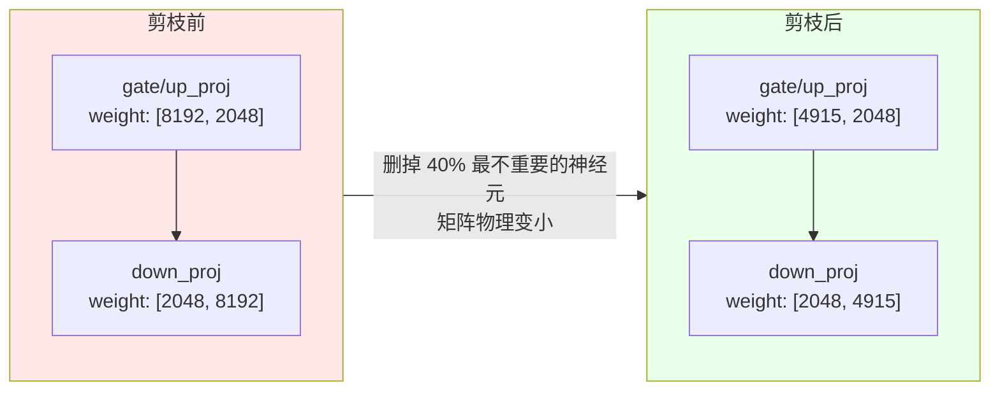
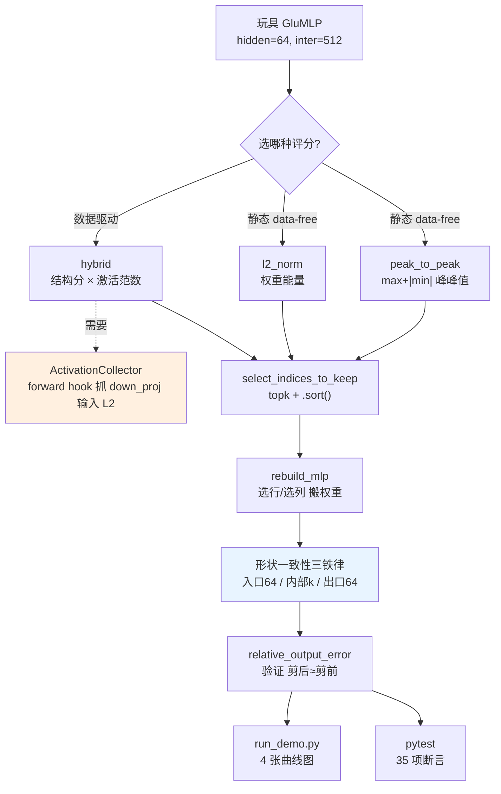
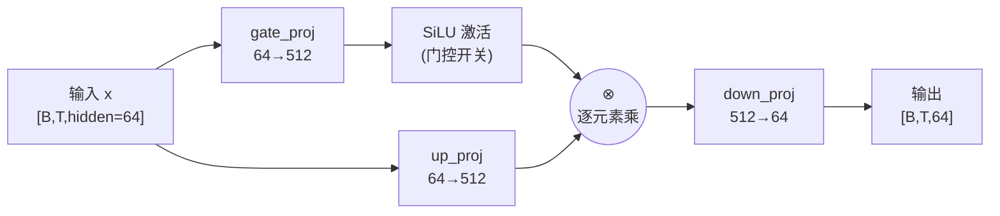
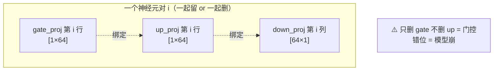
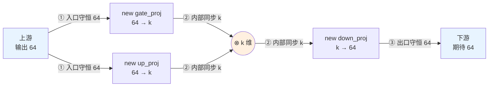
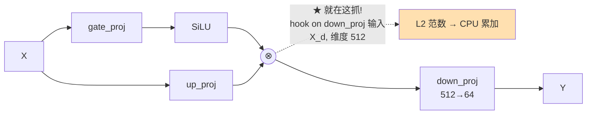
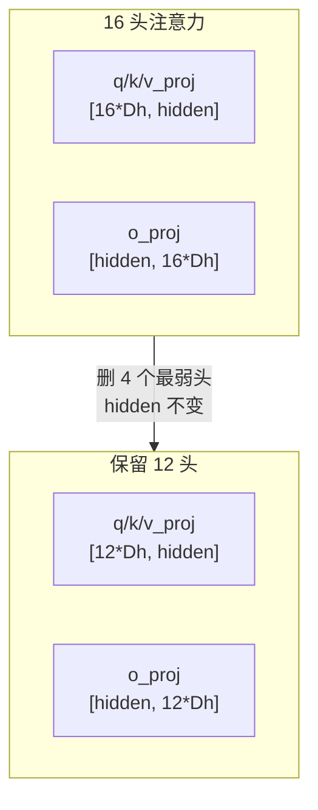

# 🪡 宽度剪枝实验室（Width Pruning Lab）

> 《Rearchitecting LLMs》(Pere Martra, Manning MEAP) **第 5 章「宽度剪枝：塑形模型」** 的**本机可跑**配套实战项目。
>
> 一句话：**给玩具 MLP / 注意力做「结构化宽度剪枝」——按重要性删神经元/头，物理上重建更小的权重矩阵，并用曲线证明「小剪枝比误差小、大剪枝比误差大、重要神经元被保留」。**
>
> 纯 `torch` CPU，零联网、零 GPU、零 API key。`pytest` 35 项全绿，`run_demo.py` 出 4 张中文图。

---

## 📖 目录

1. [这个项目在解决什么问题](#1-这个项目在解决什么问题)
2. [30 秒跑起来](#2-30-秒跑起来)
3. [第一性原理：宽度剪枝到底在做什么](#3-第一性原理宽度剪枝到底在做什么)
4. [项目全景（一张 mermaid 看懂）](#4-项目全景一张-mermaid-看懂)
5. [核心概念 1：GLU-MLP 与「神经元对」](#5-核心概念-1glu-mlp-与神经元对)
6. [核心概念 2：三种重要性评分](#6-核心概念-2三种重要性评分)
7. [核心概念 3：结构化重建与形状一致性三铁律](#7-核心概念-3结构化重建与形状一致性三铁律)
8. [核心概念 4：用 hook 抓激活做数据驱动剪枝](#8-核心概念-4用-hook-抓激活做数据驱动剪枝)
9. [核心概念 5：按注意力头剪枝](#9-核心概念-5按注意力头剪枝)
10. [代码逐行精讲](#10-代码逐行精讲)
11. [如何运行 & 看懂输出](#11-如何运行--看懂输出)
12. [测试怎么设计的](#12-测试怎么设计的)
13. [💡 面试高频题库](#13--面试高频题库)
14. [⚠️ 踩坑合集](#14-️-踩坑合集)
15. [📌 小结](#15--小结)
16. [🔗 延伸阅读](#16--延伸阅读)

---

## 1. 这个项目在解决什么问题

大模型太大了，跑起来又慢又费显存。**模型压缩四件套**（剪枝 / 量化 / 蒸馏 / 低秩分解）里，**剪枝（pruning）** 是最直接的一招：把「用处不大」的部分从模型里**物理删掉**。

剪枝又分两种粒度：

| 粒度 | 删什么 | 类比 | 特点 |
|---|---|---|---|
| **深度剪枝**（Depth Pruning）| 整个 Transformer Block | 拆楼层，模型「变矮」 | 猛、快、掉能力也快（第 4 章） |
| **宽度剪枝**（Width Pruning）| MLP 里的单个神经元 / 注意力头 | 拆房间，模型「变瘦」 | 精细、可控（**本章 & 本项目**） |

本项目**只做宽度剪枝**，而且把书中在 Llama-3.2-1B 上的做法，**浓缩到一个纯 CPU 玩具模型上**，让你在自己的破笔记本上：

- 亲手实现三种**重要性评分**（peak-to-peak / L2 范数 / 数据驱动混合）；
- 亲手做**结构化重建手术**（topk 选神经元 → 搬权重 → 造更小的矩阵）；
- 用**曲线 + 单元测试**验证剪枝的三条基本规律：
  1. **剪枝后 shape 一致**（入口/出口不变，内部三层同步缩）；
  2. **参数量真的下降**（结构化 = 矩阵物理变小）；
  3. **剪得越多，输出误差越大；重要神经元被优先保留**。

> 💡 **为什么用玩具模型而不是真 Llama？** 三个原因：① 本机无 GPU、无网络，下不了 1B 模型；② 剪枝的**逻辑**（选谁、删谁、怎么搬权重、怎么保形状）在玩具模型上和真模型**一模一样**——这是可迁移的第一性原理；③ 玩具模型能构造「重要性有梯度」的权重，让曲线漂亮、规律清晰、测试稳定可复现。真模型的权重你没法控制，误差曲线会很「脏」。

---

## 2. 30 秒跑起来

```bash
# 进入项目目录
cd book-rearchitecting-llms/projects/02_width_pruning_lab

# （可选）装依赖，本机通常已装好
pip install -r requirements.txt

# 跑测试（应看到 35 passed）
python -m pytest -q

# 跑演示，出 4 张中文图 + 终端报告
python run_demo.py
```

产出：

```
fig1_error_vs_ratio.png    剪枝比 vs 输出误差（三策略对比）—— 核心结论图
fig2_importance_hist.png   神经元重要性分布 + 剪枝阈值
fig3_param_vs_error.png    参数下降 vs 误差（帕累托权衡）
fig4_attention_heads.png   注意力剪头：保留头数 vs 误差
```

---

## 3. 第一性原理：宽度剪枝到底在做什么

🔬 **一个神经元 = 权重矩阵里的一行（或一列）。删一个神经元 = 删掉那一行（列）。**

现代 Transformer 的 MLP（前馈层）用 **x4 扩张**：先把 `hidden_size`（比如 2048）投影到 `intermediate_size`（8192），过激活，再投回 2048。这 8192 维就是模型里**最肥、冗余最多**的地方。宽度剪枝就是把 8192 缩成比如 4915——**这不是把权重置零，而是真的把矩阵变小**。



**为什么「物理变小」很重要？** 这是**结构化剪枝（structured pruning）** vs **非结构化剪枝（unstructured pruning）** 的核心区别：

| | 非结构化（把小权重置 0）| 结构化（删整行/列，本项目）|
|---|---|---|
| 矩阵形状 | **不变**（8192，里面很多 0）| **真的变小**（8192 → 4915）|
| 普通 GPU 提速？ | ❌ 稠密算子照样把 0 乘进去 | ✅ 矩阵真小了，真提速 |
| 省显存？ | ❌（0 也要存）| ✅（少存权重）|

🔬 **第一性原理结论：LLM 在通用 GPU 上跑稠密矩阵乘法，只有把矩阵物理变小（结构化），才能落地成真实的「更快、更省」。** 这就是本项目从头到尾坚持「神经元成对删、维度真的缩、形状要一致」的根本原因。

---

## 4. 项目全景（一张 mermaid 看懂）



**文件结构**：

```
02_width_pruning_lab/
├── README.md                    ← 你正在读的这份（极详教程）
├── width_pruning.py             ← 核心库：模型 + 评分 + 重建 + hook
├── run_demo.py                  ← 出图演示（Agg + 雅黑）
├── requirements.txt             ← 依赖清单
└── tests/
    └── test_width_pruning.py    ← 35 项 pytest 断言
```

---

## 5. 核心概念 1：GLU-MLP 与「神经元对」

### 5.1 GLU 长什么样

Llama / Qwen 的 MLP 用 **GLU（Gated Linear Unit，门控线性单元）** 结构，公式：

$$
\text{MLP}(x) = \text{down\_proj}\Big(\ \underbrace{\text{SiLU}\big(\text{gate\_proj}(x)\big)}_{\text{门 gate}} \ \odot\ \underbrace{\text{up\_proj}(x)}_{\text{值 value}}\ \Big)
$$

其中 `⊙` 是逐元素相乘。本项目的 `GluMLP` 完全复刻它：



| 层 | PyTorch 形状 | `.weight` 形状 | 神经元在哪个维度 |
|---|---|---|---|
| `gate_proj` | `Linear(64→512)` | `[512, 64]` | **行**（512 行 = 512 个神经元）|
| `up_proj` | `Linear(64→512)` | `[512, 64]` | **行** |
| `down_proj` | `Linear(512→64)` | `[64, 512]` | **列**（512 列 = 512 个神经元）|

> ⚠️ **坑（面试常考）：PyTorch `Linear(in, out)` 的 `.weight` 是 `[out, in]`，不是 `[in, out]`！** 所以 `gate_proj = Linear(64, 512)` 的权重形状是 `[512, 64]`——**行是输出维（神经元），列是输入维**。搞反行列，剪枝时选错方向，直接报错或结果全错。

### 5.2 为什么必须「成对删神经元」

🔬 **第一性原理**：GLU 里 `gate_proj` 和 `up_proj` 是一对**协同工作的搭档**——第 i 个神经元的门信号（gate）和值信号（up）在 `⊗` 处逐元素相乘。如果你只删 gate 的第 i 行、不删 up 的第 i 行，**门控就错位了**（第 i 个门去乘第 i+1 个值），模型直接崩。

所以本项目处理的最小单位是 **神经元对（neuron pair）**：



---

## 6. 核心概念 2：三种重要性评分

**怎么判断一个神经元「重不重要」？** 本项目实现三种打分器，都返回一个长度 = `intermediate_size` 的分数向量。

### 6.1 静态法一：peak-to-peak 峰峰值（data-free）

$$
\text{score}(neuron) = \big[\max(w) + |\min(w)|\big]_{\text{gate}} + \big[\max(w) + |\min(w)|\big]_{\text{up}}
$$

- **是什么**：一行权重里「最大正值 + 最负值的绝对值」，即这行权重能张开的**幅度范围**。
- **为什么有效**：范围大 → 能产生更大幅度的变换 → 表达能力强 → 更重要。原书原话：*"a neuron with a very high range has a very large capacity to generate significant activations."*
- **代价**：完全不看数据，零成本秒出；但「一刀切」，不知道你的具体任务真正需要谁。

三个数值例子（书中原例）：

| 神经元 | 权重区间 | range = max+\|min\| | 结论 |
|---|---|---|---|
| X | [-0.2, 0.1] | 0.1+0.2 = **0.3** | 最低 → 删 |
| Y | [-0.5, 0.4] | 0.4+0.5 = **0.9** | 最高 → 留 |
| Z | [0.0, 0.4] | 0.4+0.0 = **0.4** | 中等 → 留 |

### 6.2 静态法二：L2 范数（data-free）

$$
\text{score}(neuron) = \|w_{\text{gate}}\|_2 + \|w_{\text{up}}\|_2 = \sqrt{\textstyle\sum_i w_i^2}\Big|_{\text{gate}} + \sqrt{\textstyle\sum_i w_i^2}\Big|_{\text{up}}
$$

- **是什么**：一行权重的 L2 范数（能量），gate + up 相加。
- **相比 peak-to-peak 的优点**：更平滑、**抗单点极值**——一个巨大离群权重不会独占整行的分数（peak-to-peak 只看最大最小两个点，L2 看全部）。
- **代价**：同样 data-free。

### 6.3 数据驱动法：hybrid 混合评分（结构 × 激活）

$$
\text{Importance} = \underbrace{(\hat{s}_{\text{gate}} + \hat{s}_{\text{up}} + \hat{s}_{\text{down}})}_{\text{结构分（三层归一化范围和）}} \times \underbrace{\|X_d\|_2}_{\text{激活分（真实被用到的强度）}}
$$

- **核心思想**：一个神经元要活下来，**既要结构强（权重有潜力），又要真的被数据用到（激活大）**。用**乘法**融合——任一项低，最终分就低。
- **为什么归一化**：现代 LLM 里三层权重尺度可能差几个数量级，不归一化会让数值大的那层压过其它两层。各自除以自己的 max 归到 [0,1] 再相加。
- **代价**：需要跑一遍**校准数据（calibration data）**，比静态法贵；但能**定向做领域专精**（喂不同数据 → 保留不同神经元 → 不同「性格」的模型）。

震撼点（书中 Figure 5.6）：

| 神经元 | 结构分 | 激活 | 混合分 | 结果 |
|---|---|---|---|---|
| [0] | 中 (0.9) | **高 (32)** | 高 | ✅ 保留 |
| [2] | **高** | 近零 (0.2) | 低 | ❌ 删 |

**神经元 [2] 权重比 [0] 还大，但在你的数据上几乎不激活，照样被删**——这就是数据驱动的精髓。

---

## 7. 核心概念 3：结构化重建与形状一致性三铁律

有了分数，就要**真正动刀**：选出要留的神经元，造出更小的 `Linear` 层，把权重搬过去。这是**全项目最容易翻车、也最能体现工程功力的地方**。

🔬 **形状一致性（shape consistency）三铁律** —— 守住这三条，Transformer 外部完全察觉不到内部动过手术：



1. **入口守恒**：`gate.in = up.in = hidden`（永远 = hidden_size，让上游能对接）；
2. **内部同步**：`gate.out = up.out = down.in = k`（三层用同一个 k，门控才不错位）；
3. **出口守恒**：`down.out = hidden`（永远 = hidden_size，让下游能对接）。

**搬权重时的行列陷阱**：

- `gate/up` 神经元是**行** → 选行：`weight[keep_idx, :]`；
- `down` 神经元是**列** → 选列：`weight[:, keep_idx]`。

> ⚠️ **翻车 Top 1：`down_proj` 用选行而不是选列** → 形状对不上直接报错。记住：**down 的输入是 gate/up 的输出，所以它的神经元在列上。**

> ⚠️ **翻车 Top 2：topk 后不 `.sort()`** → `topk` 返回的索引是**按分数从高到低**排的（如 `[500, 12, 800]`），直接用会打乱神经元在矩阵里的原始排列。`.sort()` 按**原始位置升序**重排（→ `[12, 500, 800]`），保持权重内部结构接近原始，**对下一章的知识蒸馏（teacher/student 结构越像恢复越快）很关键**。

---

## 8. 核心概念 4：用 hook 抓激活做数据驱动剪枝

hybrid 评分需要「每个神经元的真实激活强度」。怎么在**不改模型代码**的前提下抓到它？答案：**PyTorch forward hook（前向钩子）**。

### 8.1 抓在哪个点？



🔬 **第一性原理：为什么偏偏抓 `down_proj` 的输入端？**

- ❌ 抓 `up_proj` 输出（门控之前）：那是神经元的「潜力」，若被门静音了你看不到，测到的不是真实贡献；
- ❌ 抓 `down_proj` 输出（降维之后）：信息已从 512 压回 64，**无法追溯是哪个中间神经元贡献的**（traceability 丢失）；
- ✅ 抓 `down_proj` 输入（门控之后、降维之前）：512 维还在，每个神经元的真实贡献一目了然。

### 8.2 为什么用 L2 范数

💡 **面试高频**：以输出 `[+5, -5, +5, -5]` 的神经元为例：

| 度量 | 计算 | 问题 |
|---|---|---|
| 简单求和 | `+5-5+5-5 = 0` | ❌ 正负抵消，明明在工作却显示「不活跃」 |
| L1（绝对值和）| `20` | 捕获活动，但**一视同仁** |
| **L2** | `√(25+25+25+25) = 10` | ✅ 捕获活动，且**平方放大大值** |

**L2 奖励「有尖峰的专才神经元」，惩罚「低水平持续背景噪声的神经元」**——正是我们想保留的那种专家。

### 8.3 本项目的实现：`ActivationCollector` 上下文管理器

本项目把书中「全局字典 + 手动 remove」的写法，升级成更 Pythonic 的**上下文管理器（context manager）**，`with` 块退出时**自动摘 hook**，杜绝「忘了 remove」这个最常见的坑：

```python
with ActivationCollector(mlp) as collector:
    for batch in dataloader:
        mlp(batch)          # forward 一跑，hook 自动抓 → 累加
norms = collector.norms     # with 退出后 hook 已自动 remove
```

---

## 9. 核心概念 5：按注意力头剪枝

宽度剪枝不止能删 MLP 神经元，也能删**注意力头（attention heads）**——思想完全同构：

- 一个头占据 q/k/v 权重矩阵里**连续的 head_dim 行**、o_proj 里**连续的 head_dim 列**；
- 删一个头 = 同时删 q/k/v 的那 head_dim 行 + o_proj 的那 head_dim 列；
- hidden 入口/出口不变，只有 `num_heads` 变小。



> ⚠️ **坑（本项目实测踩过）**：剪头后 `new_num_heads * head_dim` 可能**不再整除 hidden_size**（比如 hidden=64、保留 6 头，6 不整除 64）。若走标准构造函数会触发「hidden 必须能被 num_heads 整除」的断言。本项目在 `rebuild_attention` 里用 `__new__` 造空壳、手动填字段、**强制沿用旧 head_dim**，绕开这个约束——真实的 GQA/MQA 剪枝也会遇到同类问题。

---

## 10. 代码逐行精讲

### 10.1 重要性评分：`hybrid_importance`（最有料的一个）

```python
def hybrid_importance(gate_weight, up_weight, down_weight, act_norm):
    gate_weight = gate_weight.float()                        # #1 转 float32 减少排序舍入误差
    up_weight   = up_weight.float()                          # #1
    down_weight = down_weight.float()                        # #1
    act_norm    = act_norm.float().to(gate_weight.device)    # #1

    gate_score = torch.max(gate_weight, dim=1).values + \
                 torch.abs(torch.min(gate_weight, dim=1).values)   # #2 gate 神经元=行→dim=1
    up_score   = torch.max(up_weight, dim=1).values + \
                 torch.abs(torch.min(up_weight, dim=1).values)     # #2 up 同理
    down_score = torch.max(down_weight, dim=0).values + \
                 torch.abs(torch.min(down_weight, dim=0).values)   # #3 ★ down 神经元=列→dim=0

    gate_norm = gate_score / (gate_score.max() + 1e-8)       # #4 归一化到 [0,1]，防除零
    up_norm   = up_score   / (up_score.max()   + 1e-8)       # #4
    down_norm = down_score / (down_score.max() + 1e-8)       # #4

    structural = gate_norm + up_norm + down_norm             # #5 三层相加=结构分
    return structural * act_norm                             # #6 ★★★ 结构 × 激活=混合分
```

- **#1 转 float32**：模型常以 float16/bf16 存，转 float32 减少 topk 排序的舍入误差，避免误删该留的神经元。代价：临时多占内存（玩具模型无所谓）。
- **#2 gate/up 用 `dim=1`**：`gate_weight` 形状 `[inter, hidden]`，神经元在行上，沿列方向（`dim=1`）取 max/min = 每个神经元一行内部的峰峰值。
- **#3 ★ down 用 `dim=0`**：`down_weight` 形状 `[hidden, inter]`，神经元在**列**上，所以沿行方向（`dim=0`）取。**这一处 dim 搞错，分数就全错。**
- **#4 归一化**：三层各除以自己的 max，压到 [0,1]，避免尺度大的层碾压其它层；`+1e-8` 防除零。
- **#5** 三层归一化分相加 = 总结构容量。
- **#6 ★★★ 乘法融合**：结构分 × 激活分。这一乘是整个方法的灵魂——**既有结构潜力、又真的被用到，才拿高分。**

### 10.2 选保留索引：`select_indices_to_keep`

```python
def select_indices_to_keep(importance, prune_ratio, divisor=None):
    total = importance.numel()
    n_prune = _num_to_prune(prune_ratio, total)              # #1 算删几个（含封顶保护）
    k = total - n_prune                                      # #2 保留数 k
    if divisor is not None and divisor > 0:                  # #3 可选硬件对齐
        k_aligned = (k // divisor) * divisor
        k = max(k_aligned, divisor)
        k = min(k, total)
    _, idx = torch.topk(importance, k, largest=True, sorted=True)  # #4 选 top-k 最重要
    return idx.sort().values                                 # #5 ★ 按原始位置升序
```

- **#1 `_num_to_prune` 封顶保护**：`min(int(round(ratio*total)), total-1)`，保证**至少留 1 个神经元**——`ratio=1.0` 会把神经元删光让模型报废，这是防御性编程。
- **#2** 保留数 = 总数 − 删除数。
- **#3 硬件对齐（divisor）**：把 k 向下取整到 divisor 的倍数。现代 GPU 用 Tensor Core 把矩阵切成 16×16/32×32 的 tile 并行算，维度是 32/64/128 的倍数才吃满算力，否则要补零 padding 浪费。（玩具模型上纯演示，T4 这种 memory-bound 卡上看不出提速。）
- **#4 `torch.topk(largest=True)`**：选分数最高的 k 个的**索引**。
- **#5 ★ `.sort()`**：见 §7 的翻车 Top 2——保持原始顺序，利于蒸馏恢复。

### 10.3 结构化重建：`rebuild_mlp`

```python
def rebuild_mlp(mlp, keep_idx):
    k = keep_idx.numel()
    has_bias = mlp.gate_proj.bias is not None
    new_mlp = GluMLP(mlp.hidden_size, k, bias=has_bias)      # #1 造更小的 MLP，入口=hidden，内部=k

    new_mlp.gate_proj.weight.data = mlp.gate_proj.weight.data[keep_idx, :].clone()  # #2 选行
    new_mlp.up_proj.weight.data   = mlp.up_proj.weight.data[keep_idx, :].clone()    # #2 选行
    new_mlp.down_proj.weight.data = mlp.down_proj.weight.data[:, keep_idx].clone()  # #3 ★ 选列

    if has_bias: ...                                         # #4 bias 同步搬（gate/up 按行，down 不变）
    new_mlp.intermediate_size = k
    return new_mlp
```

- **#1** 新 MLP 的 `hidden_size` 不变（入口/出口守恒），`intermediate_size = k`（内部同步）。
- **#2 选行**：gate/up 神经元是行，取保留神经元对应的行，列（输入连接）全保留。
- **#3 ★ 选列**：down 神经元是列，`[:, keep_idx]`。**行列搞反 = 形状报错。**
- **#4 `.clone()`**：拷贝一份，切断与原模型 tensor 的共享存储，保证**原模型不被就地改动**（有测试专门验证这点）。

---

## 11. 如何运行 & 看懂输出

### 11.1 终端报告

```
====================================================================
宽度剪枝报告  (玩具 GLU-MLP: hidden=64, intermediate=512)
====================================================================
method          ratio     inter      params      省%      误差
--------------------------------------------------------------------
peak_to_peak     0.20  512->410       78,720   19.9%    0.0061
peak_to_peak     0.40  512->307       58,944   40.0%    0.0502
peak_to_peak     0.60  512->205       39,360   60.0%    0.1815
l2               0.20  512->410       78,720   19.9%    0.0062
...
hybrid           0.60  512->205       39,360   60.0%    0.1847
--------------------------------------------------------------------
```

**怎么读**：
- 同一 ratio 下三种评分**参数量完全一致**（因为结构一样，只是保留的神经元不同）；
- **误差随 ratio 单调上升**（0.006 → 0.05 → 0.18）；
- 20% 剪枝误差仅 0.6%——**重要神经元被优先保留，小剪枝比几乎无损**。

### 11.2 四张图

| 图 | 结论 |
|---|---|
| **fig1** 剪枝比 vs 误差 | 三条曲线都单调上升；小剪枝比贴地，大剪枝比翘起 → **核心规律** |
| **fig2** 重要性直方图 | 绿色（保留）在阈值右侧、红色（删除）在左侧 → **谁去谁留一目了然** |
| **fig3** 参数下降 vs 误差 | 帕累托曲线，越靠右下越好（省得多、误差小）→ **工程权衡** |
| **fig4** 注意力剪头 | 保留头越少误差越大 → **剪头与剪神经元同构** |

> ⚠️ **坑：matplotlib 中文乱码 / 缺字体**。本项目已在 `run_demo.py` 顶部设好：
> ```python
> matplotlib.use("Agg")                                        # 无显示器也能出图
> plt.rcParams["font.sans-serif"] = ["Microsoft YaHei", "SimHei"]
> plt.rcParams["axes.unicode_minus"] = False                   # 负号不变成方块
> ```
> 若你的系统没有微软雅黑，会 fallback 到 SimHei；两者都没有则中文显示为方块（但图本身正常）。

---

## 12. 测试怎么设计的

`tests/test_width_pruning.py` 共 **35 项断言**，分七组，直接对应题目要求：

| 组 | 验证什么 | 关键测试 |
|---|---|---|
| 1. 形状一致性 | 入口/出口守恒、内部三层同步 k | `test_shape_consistency_entry_exit_preserved`（参数化 2 评分 × 4 比例）|
| 2. 参数量下降 | 剪后参数严格 < 剪前，下降量与统计一致 | `test_param_count_decreases`、`test_param_reduction_scales_with_ratio` |
| 3. 误差单调 | 剪枝比越大误差越大 | `test_error_monotonic_increasing_with_ratio`、`test_small_ratio_small_error` |
| 4. 重要神经元保留 | top-importance 全存活、bottom 被删、索引升序 | `test_top_important_neurons_preserved`、`test_least_important_neurons_dropped` |
| 5. 数据驱动 hybrid | hook 累加、退出摘 hook、需 dataloader | `test_activation_collector_accumulates_and_removes_hook` |
| 6. 注意力剪头 | shape 一致、能前向、参数降 | `test_attention_prune_shape_and_forward` |
| 7. 硬件对齐 & 边界 | divisor 整除、ratio 越界报错、不剪到 0、原模型不被改 | `test_divisor_alignment`、`test_never_prune_to_zero` |

🔬 **测试设计的关键决策：为什么用「重要性有梯度」的 MLP 而非纯随机？**

纯随机初始化的 MLP，所有神经元重要性**趋同**——删哪个都差不多，误差会「一次性跳满」，**无法验证单调性**。所以 `make_graded_mlp` 给第 i 个神经元乘一个从 1.0 平滑衰减到 0.05 的 scale，制造**清晰的重要性梯度**：剪掉弱的误差小、剪到强的误差才快速上升。这样单调性、重要神经元保留等断言才**稳定可复现**。

```bash
$ python -m pytest -q
...................................                                       [100%]
35 passed in 1.99s
```

---

## 13. 💡 面试高频题库

> 把这些答出来，模型压缩 & 推理加速方向的面试基本稳了。

**Q1：宽度剪枝属于结构化还是非结构化？两者区别？**
→ **结构化**。非结构化把单个权重置零，矩阵形状不变（还是 8192，里面很多 0），普通 GPU 稠密算子照样把 0 乘进去，**不提速、不省显存**；结构化删整行/列，矩阵物理变小（8192→4915），**真提速真省显存**，无需特殊硬件。LLM 推理是通用 GPU 上的稠密矩阵乘法，所以几乎都用结构化。

**Q2：为什么删 MLP 神经元要「成对删」？**
→ GLU 里 `gate_proj` 和 `up_proj` 是门控搭档，在 `⊗` 处逐元素相乘。只删一个的第 i 行会让门控错位（第 i 个门乘第 i+1 个值），破坏门控同步（gating synchronization）。

**Q3：形状一致性怎么保证？**
→ 三铁律：**入口守恒 hidden_size、内部三层同步用同一个 k、出口守恒 hidden_size**。守住则 Transformer 外部察觉不到内部动过刀。

**Q4：PyTorch `Linear(in, out)` 的 weight 形状是什么？剪枝时 gate 和 down 分别选行还是选列？**
→ weight 是 `[out, in]`。gate/up 神经元在**行**（选行 `[keep, :]`），down 神经元在**列**（选列 `[:, keep]`）。

**Q5：数据驱动比静态好在哪？为什么用乘法融合结构分和激活分？**
→ 静态只看权重、盲选；数据驱动能**定向保护你关心领域的能力**（激活 × 结构）。用乘法是因为「权重大但激活≈0」的神经元该删——乘法保证任一项低则总分低。

**Q6：为什么抓激活抓在 down_proj 输入端，而不是 up_proj 输出或 down_proj 输出？**
→ up 输出是门控前的「潜力」（可能被门静音，非真实贡献）；down 输出已降维（无法追溯是哪个神经元）；down 输入是门控后、降维前，512 维真实贡献一目了然。

**Q7：为什么激活重要性用 L2 范数，不用求和或 L1？**
→ 求和会正负抵消（`[+5,-5,+5,-5]→0`）；L1 一视同仁；L2 平方放大大值，**奖励有尖峰的专才神经元，惩罚背景噪声**。

**Q8：topk 之后为什么要 `.sort()`？**
→ topk 按分数从高到低返回索引，会打乱神经元原始排列。sort 按原始位置升序重排，保持权重内部结构接近原始，**对后续知识蒸馏（teacher/student 越像恢复越快）有利**。

**Q9：为什么剪了 40% 的 MLP 神经元，模型总参数只降约 26%（书中真实数据）？**
→ 40% 只针对 MLP 的 intermediate 维度，而模型还有 attention、embedding、LayerNorm 没动。**局部剪枝比例 ≠ 全局参数下降比例**。

**Q10：宽度剪枝的提速有天花板吗？**
→ 有。减小 MLP 能省 compute 和显存，但模型真正的瓶颈常在 **attention 的内存搬运（KV cache）**，不在 MLP 计算。在 memory-bound 场景（如 T4）提速有限；只有 compute-bound（A100/H100 高流量）才明显。这也是为什么维度对齐（32/64/128 倍数）在小卡上看不出效果。

---

## 14. ⚠️ 踩坑合集

> 本项目开发过程中**真实踩过**的坑，按翻车概率排序。

1. **`down_proj` 选行不选列** → 形状不匹配直接报错。记死：down 神经元在列。
2. **topk 后忘 `.sort()`** → 权重顺序被打乱，蒸馏恢复变慢（本项目有 `test_keep_indices_are_sorted_ascending` 兜底）。
3. **剪头后 num_heads 不整除 hidden** → 标准构造函数断言失败。本项目用 `__new__` + 手动填字段绕开（见 `rebuild_attention`）。
4. **忘记摘 hook** → hook 在后续所有 forward 乱触发。本项目用上下文管理器 `with ActivationCollector(...)` 自动 remove，从根上杜绝。
5. **ratio=1.0 把神经元删光** → 模型报废。`_num_to_prune` 用 `min(..., total-1)` 封顶，至少留 1。
6. **就地修改了原模型** → 前后对比失效。`rebuild_mlp` 全程 `.clone()` 搬权重，原模型只读（`test_original_model_not_mutated` 验证）。
7. **matplotlib 中文乱码 / 无显示器崩溃** → 用 `Agg` 后端 + 微软雅黑 + `axes.unicode_minus=False`。
8. **纯随机 MLP 测不出单调性** → 用 `make_graded_mlp` 造重要性梯度（见 §12）。
9. **float16 排序舍入误差误删神经元** → 评分前统一 `.float()` 转 float32。
10. **激活统计放 GPU 会 OOM**（真模型场景）→ 本项目累加张量存 CPU（`ActivationCollector` 里 `torch.zeros(..., )` 默认 CPU）。

---

## 15. 📌 小结

1. **宽度剪枝 = 删层内维度**：本项目聚焦 GLU-MLP 的中间神经元（`intermediate_size`），并同构地演示了注意力剪头。它比深度剪枝更精细、更可控。
2. **必须成对剪 + 守形状一致性三铁律**（入口/内部 k/出口），守住则外部无感知。
3. **三种重要性评分**：静态 peak-to-peak、静态 L2、数据驱动 hybrid（结构 × 激活，乘法融合，能做领域专精）。
4. **结构化重建的核心是「选行 vs 选列」**：gate/up 选行、down 选列；topk 后 `.sort()` 保原始顺序。
5. **forward hook 抓 down_proj 输入端的 L2 激活范数**做数据驱动；用上下文管理器自动摘 hook。
6. **实验证明三条规律**：shape 一致、参数量降、剪枝比越大误差越大且重要神经元被保留——`pytest` 35 项全绿，`run_demo` 4 张曲线图印证。
7. **结构化才能在通用 GPU 上真提速省显存**，但提速被 attention 内存瓶颈限制天花板。

> 🧭 一句话记住：**宽度剪枝是给 LLM 的 MLP「绣花针式瘦身」——按重要性成对删神经元、守住形状一致性、用激活做数据驱动。它省显存提速度，更能主动塑造模型的「性格」。剪枝不是终点，恢复才是。**

---

## 16. 🔗 延伸阅读

**本书内联动（book-guide/）**：
- ← [第 3 章《现代 Transformer 蓝图》](../../book-guide/03_现代%20Transformer%20蓝图.md)：GLU / SwiGLU / SiLU / GELU 的结构基础，本项目的「靶子」在那里定义。
- ← [第 4 章《深度剪枝》](../../book-guide/04_深度剪枝：更小更快.md)：对比篇——深度剪枝删整块（拆楼层），本项目删神经元（拆房间）；hook 抓激活的思路从第 4 章延续（那里块粒度，这里神经元粒度）。
- → [第 5 章《宽度剪枝：塑形模型》](../../book-guide/05_宽度剪枝：塑形模型.md)：**本项目的理论底本**，含书中在 Llama-3.2-1B 上的完整实验、能力二分性（GSM8K 崩 / IFEval 涨）、领域专精交叉表。
- → [第 6 章《蒸馏恢复知识》](../../book-guide/06_蒸馏恢复知识.md)：剪枝后能力受损，用知识蒸馏补回来；本项目刻意保持权重原始顺序（`.sort()`）正是为让蒸馏更顺。
- → [第 7 章《模型专化》](../../book-guide/07_模型专化.md)：剪枝 + 恢复之后，用量化 + 高效微调交付到具体任务。

**与 llm-action 仓库其它模块的联系**：
- `llm-inference/`：本项目「结构化剪枝 → 真提速」直接对接推理优化——结合 KV cache、continuous batching、量化，能理解「为什么 attention 内存搬运才是真瓶颈」。
- `ai-infra-architecture/` / AI-Infra 面试：结构化 vs 非结构化、Tensor Core 维度对齐、compute-bound vs memory-bound，都是模型压缩 & 推理加速的高频考点，本项目可作「宽度剪枝」专题的中文动手底本。
- 与仓库里量化（quantization）、蒸馏（distillation）章节配合，构成完整的「模型压缩四件套」：**剪枝（本项目）/ 量化 / 蒸馏 / 低秩分解**。

**论文出处**：
- *"Fragile Knowledge, Robust Instruction-Following"*（Martra, 2025）——静态幅度评分、能力二分性。
- *"CFSP"*（Wang et al., 2024）——在 down_proj 处抓激活的核心思路。
- 评估工具：EleutherAI `lm-evaluation-harness`；能耗：`codecarbon`；配套库：`optipfair`（`expansion_divisor` 硬件对齐）。

---

> 🪡 **动手建议**：改 `run_demo.py` 里的 `build_demo_mlp` 试试——把「重要性梯度」换成「一半神经元近乎死亡」，看误差曲线怎么变；或把 `divisor` 设成 128，观察 pruned_inter 怎么被对齐。改完重跑 `pytest` 确保没破坏不变量。这就是工程师读书的正确姿势：**代码不是圣经，是你可以拆开重装的乐高。**
