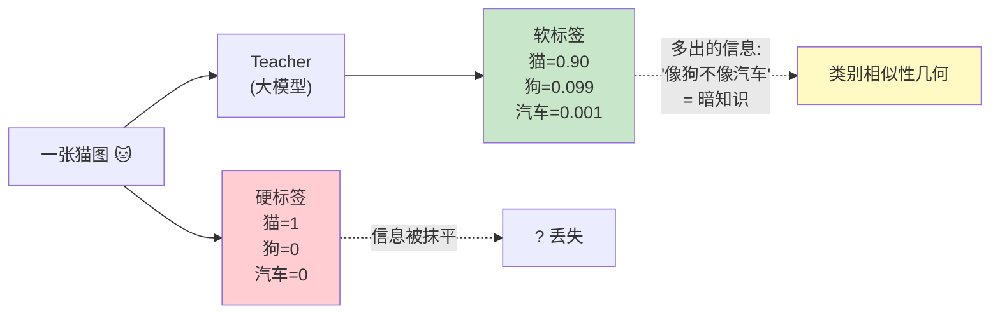
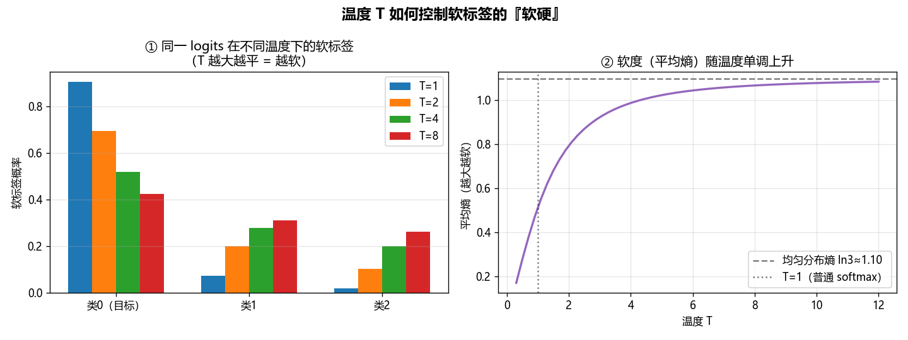
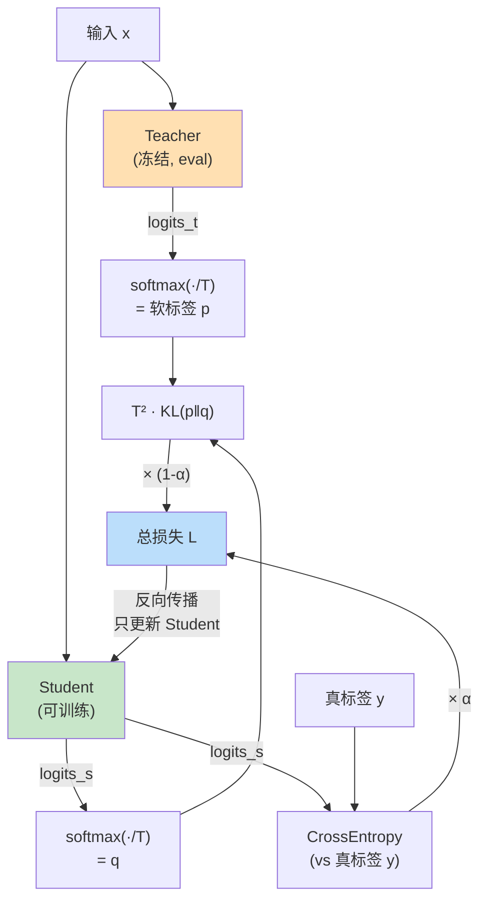
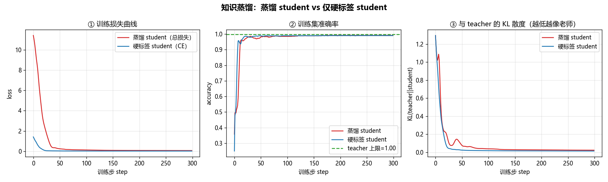

# 🧠➡️🎓 项目 03 · 知识蒸馏最小实现（Knowledge Distillation from Scratch）

> 配套《Rearchitecting LLMs》**第 6 章「蒸馏恢复知识」**（`book-guide/06_蒸馏恢复知识.md`）的**动手实战项目**。
> 用一份 **纯 PyTorch（CPU 即可）** 的玩具分类器，把「知识蒸馏」这件事从公式到代码、从直觉到坑，**一次讲透、亲手跑通**。
>
> 目标读者：**零基础也能读懂，进阶者也有得挖**。每个概念都讲清楚「**是什么 / 为什么 / 怎么用 / 代价**」，不跳步。

---

## 📌 一句话总结

**知识蒸馏（Knowledge Distillation, KD）= 让一个「大而准」的老师模型（teacher）当陪练，指导一个「小而快」的学生模型（student），用「软标签 + 温度」把老师的『暗知识』喂给学生，让小模型学得比自己单练更好。** 本项目在 CPU 上用几十秒证明这件事。

---

## 🎯 你将学到（Learning Objectives）

1. **软标签 vs 硬标签**：为什么 `[0.7, 0.2, 0.1]` 比 `[1, 0, 0]` 含的信息多。
2. **温度 T（temperature）**：一个标量如何控制标签的「软硬」，以及为什么损失里要乘 `T²`。
3. **复合损失（compound loss）**：`L = α·CE(hard) + (1-α)·T²·KL(soft)` 每一项的物理意义。
4. **KL 散度**：怎么用 `F.kl_div` 正确实现，`input`/`target` 谁是 log 谁是概率（**最容易写错的地方**）。
5. **蒸馏为什么有用**：从「暗知识」到「正则化」两个视角，并用**测试集准确率**实证。
6. 一堆 **面试高频点 💡** 和 **踩坑 ⚠️**，都是真会被问 / 真会翻车的。

---

## 🗂️ 项目结构

```
03_distillation_mini/
├── README.md              ← 你正在看的这份（原理 + 逐行讲解 + 面试点 + 坑）
├── distill.py             ← 核心库：数据 / 模型 / 蒸馏损失 / 训练循环 / 评估
├── run_demo.py            ← 端到端演示，出 4 张图（Agg 后端 + YaHei 中文字体）
├── requirements.txt       ← 依赖（torch / numpy / matplotlib / pytest）
├── tests/
│   └── test_distill.py    ← 20 个单元测试（公式正确性 / KL 下降 / 温度软度 / 泛化收益）
└── figures/               ← run_demo.py 生成的图（运行后出现）
    ├── training_curves.png
    ├── temperature_softness.png
    ├── decision_boundary.png
    └── low_data_generalization.png
```

---

## 🚀 如何运行（Quick Start）

本项目**完全离线**：不联网、不下载任何预训练模型、不需要 GPU、不需要 API key。

```bash
# 0) （可选）装依赖 —— 你机器上大概率已经有了
pip install -r requirements.txt
# CPU 版 torch:  pip install torch --index-url https://download.pytorch.org/whl/cpu

# 1) 跑测试（必须全绿）
python -m pytest -q
#   预期： 20 passed

# 2) 跑演示（出 4 张图到 figures/）
python run_demo.py
```

`run_demo.py` 的终端输出长这样（数字会因随机而略有浮动，但趋势稳定）：

```
[实验1] 训练 teacher / 蒸馏 student / 硬标签 student（steps=300, T=4.0, alpha=0.5）
    teacher 准确率 = 0.998
    蒸馏  student 准确率 = 0.991 | 与 teacher 的 KL = 0.0224
    硬标签 student 准确率 = 0.990 | 与 teacher 的 KL = 0.0131

[实验2] 温度 T 对软标签软度的影响
    T=   1  软标签 = [0.905, 0.074, 0.020]  熵=0.362
    T=   2  软标签 = [0.696, 0.200, 0.104]  熵=0.809
    T=   4  软标签 = [0.520, 0.278, 0.201]  熵=1.019
    T=   8  软标签 = [0.425, 0.311, 0.264]  熵=1.079

[实验4] 小样本蒸馏的泛化收益（student 只用 30 个样本，跨 8 个 seed 平均测试准确率）
    蒸馏  student 测试准确率 = 0.963 ± 0.009
    硬标签 student 测试准确率 = 0.956 ± 0.022
    ✅ 蒸馏泛化更好（差值 +0.0075）
```

---

## 🔬 第一性原理：为什么「软标签」比「硬标签」信息量大？

先看一个直觉例子。假设我们做「猫 / 狗 / 汽车」三分类，给模型看一张**猫**的图。

- **硬标签（hard label / one-hot）**：`[猫=1, 狗=0, 汽车=0]`。
  它只说了「这是猫」，**丢掉了所有相对关系**。

- **软标签（soft label）**：teacher 输出的概率 `[猫=0.90, 狗=0.099, 汽车=0.001]`。
  它多告诉你两件事：**「这张猫图有点像狗（0.099），但极不像汽车（0.001）」**。

这个「像狗、不像汽车」的相对结构，就是 Hinton 说的 **暗知识（dark knowledge）**——它编码了**类别之间的相似性几何**。硬标签把这些信息全抹成 0 了，软标签保留了下来。

> 🔬 **第一性原理**：监督学习的本质是「拟合一个从输入到分布的映射」。one-hot 是一个**退化的分布**（只有一个尖峰），它对「非目标类之间谁更接近」这件事**零约束**。软标签给出了一个**信息更丰富的目标分布**，等价于给 student 增加了额外的、免费的监督信号。这也是为什么在**数据稀缺**时蒸馏收益最大——每个样本都携带了更多监督。



---

## 🌡️ 核心概念一：温度（Temperature）

软标签有个问题：训练好的 teacher 通常**很自信**，softmax 出来接近 one-hot（比如 `[0.999, 0.0009, 0.0001]`），暗知识被压得很扁，student 学不到多少。

**温度 T** 就是用来「把分布拉软」的旋钮。公式很简单——在 softmax 前把 logits 除以 T：

$$
p_i(T) = \frac{\exp(z_i / T)}{\sum_j \exp(z_j / T)}
$$

其中 $z_i$ 是第 $i$ 类的 logit。

| 温度 | 效果 | 直觉 |
|------|------|------|
| `T = 1` | 普通 softmax | 原始尖锐分布 |
| `T > 1` | 分布变**软**（平） | 暗知识被**放大**，非目标类概率抬升 |
| `T < 1` | 分布变**尖** | 更接近 one-hot（很少用） |
| `T → ∞` | 趋于**均匀分布** | 熵趋于 `ln(类别数)` |

本项目 `run_demo.py` 实验 2 用同一个 logits `[4.0, 1.5, 0.2]` 扫不同 T，画出下图（左：软标签条形；右：软度=平均熵随 T 单调上升）：



看数字（终端实测）：

```
T=1  软标签=[0.905, 0.074, 0.020]  熵=0.362   ← 尖，暗知识微弱
T=4  软标签=[0.520, 0.278, 0.201]  熵=1.019   ← 软，暗知识清晰
T=8  软标签=[0.425, 0.311, 0.264]  熵=1.079   ← 更软，趋近均匀
```

> 💡 **面试高频**：「温度在蒸馏里起什么作用？」
> 标准答案：**温度平滑 teacher 的输出分布，放大『暗知识』（非目标类的相对概率），让 student 能学到类别间的相似结构。** 加一句进阶：`T` 太大也不好——分布过软会趋于均匀，信号淹没在噪声里；实践中 `T ∈ [2, 5]` 最常用。

---

## 🧮 核心概念二：为什么损失要乘 `T²`？（最容易讲不清的点）

这是蒸馏里**最经典、最容易被面试官追问**的细节。

**现象**：当你在 softmax 前除以 `T`，对 logits 求梯度时，链式法则会带出一个 `1/T` 因子；而 KL 里有两处（student 和 teacher）都被 `T` 缩放，**软标签项的梯度整体缩小约 `1/T²`**。

**后果**：如果不补偿，`T` 一变，软标签项的梯度量级就变，你之前调好的 `α`（硬 / 软权重）就全废了，得重调。

**Hinton 的解法**：把 KL 项**乘回 `T²`**，让软标签项的梯度量级与硬标签项**始终可比**，这样 `T` 和 `α` 就**解耦**了——调温度不影响权重平衡。

$$
\mathcal{L}_{\text{KD}} = T^2 \cdot \mathrm{KL}\!\left(p^{(T)} \,\|\, q^{(T)}\right)
$$

其中 $p^{(T)} = \mathrm{softmax}(z^{\text{teacher}}/T)$，$q^{(T)} = \mathrm{softmax}(z^{\text{student}}/T)$。

> 💡 **面试追问**：「不乘 `T²` 会怎样？」
> 答：软标签项的梯度会随 `T` 增大而急剧衰减（∝ 1/T²），软标签的监督几乎不起作用，蒸馏退化成只用硬标签。乘 `T²` 是为了让软 / 硬两项梯度**量级对齐**，是一个**梯度尺度归一化**技巧。
>
> ⚠️ **坑**：`T²` **只乘在 KL 项上，不乘在 CE 项上**（CE 用的是 `T=1` 的原始 logits 算真标签，没有被温度缩放，自然不需要补偿）。很多人复制代码时把 `T²` 乘错地方。

---

## 🍱 核心概念三：复合损失（Compound Loss）

student 的总损失是**两项的加权和**：

$$
\boxed{\;\mathcal{L} = \underbrace{\alpha \cdot \mathrm{CE}(z^{\text{student}}, y_{\text{true}})}_{\text{硬标签：贴近真值}} \;+\; \underbrace{(1-\alpha)\cdot T^2 \cdot \mathrm{KL}\!\big(p^{(T)}\|q^{(T)}\big)}_{\text{软标签：模仿老师}}\;}
$$

- **CE 项（hard）**：用**真实标签**做交叉熵，保证 student 不跑偏——就算 teacher 有错，真标签能拉回来。
- **KL 项（soft）**：让 student 的**软分布**逼近 teacher 的软分布，注入暗知识。
- **`α`（权重）**：`α=1` 退化成普通监督训练（无蒸馏）；`α=0` 变成纯模仿老师（忽略真标签）。常用 `α ∈ [0.1, 0.5]`。

> 📖 **与本书第 6 章的对应**：书里写的是 `α·任务损失 + β·logits损失 + γ·隐状态损失`。本项目是**最小实现**，只做前两项（任务损失=CE、logits损失=KL），并令 `α + β = 1`（用 `α` 和 `1-α`）更直观。隐状态蒸馏（`γ·隐状态损失`，即让 student 每层的中间表示也贴近 teacher）是进阶话题，本项目留作延伸（见文末）。



---

## 📖 核心代码逐行讲解（`distill.py`）

下面把**最关键的三个函数**逐行拆开讲。完整文件见 `distill.py`。

### 1️⃣ 软标签：`soft_targets`

```python
def soft_targets(logits: torch.Tensor, T: float) -> torch.Tensor:
    return F.softmax(logits / T, dim=-1)
```

- `logits / T`：温度缩放。`T>1` 时把 logits 压小，softmax 后分布变软。
- `F.softmax(..., dim=-1)`：在**最后一维**（类别维）做归一化，得到概率分布。
- 返回形状 `(B, C)`，每行和为 1。就这么简单——温度的全部魔法就在「除以 T」这一步。

### 2️⃣ 蒸馏 KL 损失：`kl_divergence_loss`（本项目的心脏）

```python
def kl_divergence_loss(student_logits, teacher_logits, T):
    log_q = F.log_softmax(student_logits / T, dim=-1)   # ① student → log 概率
    p     = F.softmax(teacher_logits / T, dim=-1)       # ② teacher → 概率
    kl    = F.kl_div(log_q, p, reduction="batchmean")   # ③ KL(p‖q)
    return (T * T) * kl                                 # ④ 乘回 T²
```

**逐行讲：**

**① `log_q = F.log_softmax(student_logits / T, ...)`**
student 侧要的是 **log 概率**（下面 `F.kl_div` 的约定）。为什么用 `log_softmax` 而不是 `log(softmax(...))`？——**数值稳定**。`log_softmax` 内部用了 log-sum-exp 技巧，避免 `softmax` 出现极小值后再取 log 得到 `-inf`。这是深度学习里的标准操作。

**② `p = F.softmax(teacher_logits / T, ...)`**
teacher 侧要的是**普通概率**（作为 KL 的 target）。注意在训练循环里，teacher 的前向是在 `torch.no_grad()` 下做的，`p` 不带梯度——**梯度只回传给 student**。

**③ `kl = F.kl_div(log_q, p, reduction="batchmean")`** ⚠️ **全项目最容易写错的一行**
PyTorch 的 `F.kl_div(input, target)` 有个**反直觉的约定**：
- `input` 必须是 **log 概率**（这里是 `log_q`）；
- `target` 必须是 **普通概率**（这里是 `p`）；
- 它计算的是 $\sum_i \text{target}_i \cdot (\log \text{target}_i - \text{input}_i) = \sum_i p_i(\log p_i - \log q_i) = \mathrm{KL}(p\|q)$。

也就是说，**第一个参数放 student 的 log 概率、第二个参数放 teacher 的概率**，算出来正好是 `KL(teacher ‖ student)`——「让 student 逼近 teacher」的正确方向。
`reduction="batchmean"`：对 batch **求平均**（除以样本数 B）。**别用默认的 `"mean"`**——`"mean"` 会额外除以类别数 C，得到的不是数学上的 KL 期望（这是官方文档都提醒的坑）。

**④ `return (T*T) * kl`**
乘回 `T²`，补偿温度带来的梯度缩放（原理见上文「为什么乘 T²」）。

> ⚠️ **三大 KL 坑速记**：
> 1. `F.kl_div` 第一个参数要 **log 概率**，忘了取 log → 结果全错。
> 2. `reduction` 要用 **`batchmean`** 不是 `mean`。
> 3. `KL(p‖q)` **不对称**！`KL(teacher‖student)` ≠ `KL(student‖teacher)`。蒸馏标准是前者（forward KL / mode-covering），让 student 覆盖 teacher 的所有模式。

### 3️⃣ 复合损失：`distillation_loss`

```python
def distillation_loss(student_logits, teacher_logits, labels, T=4.0, alpha=0.5):
    ce    = F.cross_entropy(student_logits, labels)                 # 硬标签 CE（用原始 logits）
    kl    = kl_divergence_loss(student_logits, teacher_logits, T)   # 软标签 KL（已含 T²）
    total = alpha * ce + (1.0 - alpha) * kl
    return total, ce, kl
```

- `F.cross_entropy(student_logits, labels)`：**直接吃原始 logits**（内部自己做 log_softmax + NLL），**不要**手动 softmax 再传进去——否则 softmax 做两次。这里**不用温度**（真标签就是 `T=1` 的世界）。
- `total = α·ce + (1-α)·kl`：两项凸组合。返回 `ce`、`kl` 分量是为了**日志和画图**（能分别看两项怎么变）。

### 4️⃣ 训练循环里 teacher 的冻结（`train_student`）

```python
if teacher is not None:
    teacher.eval()                      # ① 关 dropout / 固定 batchnorm
    for p in teacher.parameters():
        p.requires_grad_(False)         # ② 不给 teacher 建梯度
...
with torch.no_grad():                   # ③ 前向不建计算图，省内存又提速
    t_logits = teacher(X)
```

- **① `teacher.eval()`**：切到评估模式。本项目 teacher 没 dropout，但真实模型有，**忘了 eval 会让 teacher 每次输出都带随机性**，软标签飘忽。
- **② `requires_grad_(False)`**：明确告诉 autograd「别管 teacher 的参数」。
- **③ `torch.no_grad()`**：teacher 前向不需要反传，包起来能省内存、加速。三件套缺一不可，是**冻结 teacher 的标准姿势**。

---

## 🧪 测试讲解（`tests/test_distill.py`，20 个）

测试分四组，全部 `python -m pytest -q` 一次跑过（实测 **20 passed**）。挑最有代表性的讲：

### A 组 · 公式正确性（最硬核）

```python
def test_kl_loss_matches_manual_formula():
    student, teacher, _ = _fixture_logits()
    T = 4.0
    got = kl_divergence_loss(student, teacher, T).item()
    # 手写参考：T² * Σ p*(log p - log q) / B
    p = F.softmax(teacher / T, dim=-1)
    logq = F.log_softmax(student / T, dim=-1)
    logp = F.log_softmax(teacher / T, dim=-1)
    manual = (T*T) * (p * (logp - logq)).sum(dim=-1).mean().item()
    assert math.isclose(got, manual, rel_tol=1e-5)
```

这是「**对拍**」——用**手写的 KL 定义**跟我们封装的函数比，逐位对齐才算公式对。还测了：
- `test_kl_loss_is_zero_when_identical`：teacher==student 时 KL=0（自己对自己无散度）。
- `test_kl_loss_non_negative`：KL 恒 ≥ 0（信息论基本性质）。
- `test_temperature_squared_scaling`：验证 `T²` 缩放确实存在。
- `test_distillation_loss_alpha_endpoints`：`α=1` → 纯 CE，`α=0` → 纯 KL（端点行为）。

### B 组 · 温度影响软度

```python
def test_higher_temperature_increases_softness():
    logits = torch.randn(64, 5) * 3.0
    assert softness(logits, T=1.0) < softness(logits, T=3.0) < softness(logits, T=10.0)
```

`softness` = 软标签分布的**平均熵**。断言「T 越大熵越大（越软）」。还测了 `T→1000` 时熵趋于 `ln(C)`（均匀分布）、`T<1` 时变尖。

### C 组 · 训练后 KL 下降 + 蒸馏泛化收益（本项目的两个「主结论」）

```python
def test_distillation_reduces_student_teacher_kl():
    ...
    kl_before = student_teacher_kl(student, teacher, X)   # 随机 student
    train_student(student, teacher, X, y, ...)
    kl_after  = student_teacher_kl(student, teacher, X)   # 蒸馏后 student
    assert kl_after < 0.5 * kl_before                     # 至少腰斩
```

**主结论 1**：训练后 student 与 teacher 的分布 KL **大幅下降**（实测约 `1.3 → 0.02`）。这是最稳的现象——因为 KL 项的直接优化目标就是拉近二者。`test_distillation_reduces_kl_across_many_seeds` 进一步跨 5 个 seed 验证，杜绝「碰巧一个 seed 成功」。

```python
def test_distillation_beats_hard_label_on_test_accuracy():
    # 数据稀缺（每 student 仅 30 样本）+ 跨 8 seed 求均值 + 在测试集评估
    ...
    assert mean_distill >= mean_hard - 1e-6
```

**主结论 2**：**数据稀缺**时，蒸馏 student 的**测试集**准确率（跨 seed 平均）**优于**仅硬标签 student。这是 Hinton 的经典正则化收益。

> ⚠️ **为什么要「跨 seed 求均值」而不是单次比较？** 玩具问题上，单个 seed 的差距会被随机噪声淹没，甚至偶尔反向。**科学的做法是报均值 ±方差**（这也是论文里为什么都写 `acc ± std`）。本测试正是这么做的，避免「运气型」断言导致 flaky test。这本身就是一个**实验设计**的实战教训。

### D 组 · 守门测试

数据形状、确定性（同 seed 同结果）、模型前向、student 参数量 < teacher/3（否则谈不上「蒸馏到小模型」）。

---

## 📊 四张图讲了什么（`figures/`）

| 图 | 讲什么 | 结论 |
|----|--------|------|
| `training_curves.png` | 蒸馏 vs 硬标签 的损失 / 准确率 / **与 teacher 的 KL** 三联图 | 蒸馏 student 的 KL 随训练**从 ~1.3 跌到 ~0.02**，越来越像老师 |
| `temperature_softness.png` | 同一 logits 在 `T=1,2,4,8` 下的软标签 + 熵随 T 曲线 | **T 越大越软**，熵单调上升趋于 `ln(C)` |
| `decision_boundary.png` | Teacher / 蒸馏 Student / 硬标签 Student 三者的决策边界 | 蒸馏 student 的边界更贴近 teacher |
| `low_data_generalization.png` | 小样本（30 样本）下两种 student 的**测试准确率**柱状图（8 seed 均值 ±std） | 蒸馏**均值更高、方差更小**（更稳） |



> 💡 **一个额外的洞察**（图 4 里能看到）：蒸馏不仅**均值更高**（0.963 vs 0.956），而且**方差更小**（±0.009 vs ±0.022）。软标签像一个「平滑的监督信号」，让小样本训练**更稳定**——这在面试里是个能加分的观察点。

---

## ⚙️ 关键超参怎么调（Config 速查）

| 超参 | 含义 | 常用范围 | 调大 / 调小的代价 |
|------|------|----------|-------------------|
| `T`（温度） | 软标签的软硬 | `2 ~ 5` | 太大→分布趋均匀、信号淹没；太小→暗知识压扁、蒸馏≈无 |
| `α`（硬标签权重） | CE 项占比 | `0.1 ~ 0.5` | `α=1` 退化成无蒸馏；`α=0` 完全信老师（老师错了就跟着错） |
| `lr`（学习率） | student 优化步长 | `0.01 ~ 0.05` | 太大→震荡不收敛；太小→训不动 |
| `steps` | 训练步数 | `几十 ~ 几百` | 玩具问题几十步就够；真实模型要看验证集 |

> 💡 **面试高频**：「`T` 和 `α` 怎么选？」
> 答：先固定 `T=3~4`（经验值），再调 `α`——数据多、任务简单时 `α` 大一点（更信真标签）；数据少、想让 student 尽量学老师时 `α` 小一点（更信软标签）。两者要**一起在验证集上网格搜索**。加一句：因为损失乘了 `T²`，`T` 和 `α` 是**近似解耦**的，可以分开调。

---

## 💡 面试高频问题清单（附标准答案要点）

<details>
<summary><b>Q1: 知识蒸馏的核心思想？软标签为什么有用？</b></summary>

用大 teacher 指导小 student。软标签携带**暗知识**（类别间相似性），信息量比 one-hot 大，相当于给每个样本增加了额外监督，尤其在**数据稀缺**时收益明显。
</details>

<details>
<summary><b>Q2: 温度 T 的作用？为什么损失乘 T²？</b></summary>

T 平滑 teacher 分布、放大暗知识。乘 `T²` 是补偿「除以 T」带来的 `1/T²` 梯度缩放，让软 / 硬两项梯度量级可比，从而让 `T` 与 `α` 解耦。
</details>

<details>
<summary><b>Q3: KL(p‖q) 里 p 和 q 谁是 teacher？方向能反吗？</b></summary>

标准蒸馏用 `KL(teacher ‖ student)`（forward KL，mode-covering），让 student 覆盖 teacher 所有模式。反过来 `KL(student‖teacher)`（reverse KL，mode-seeking）会让 student 只抓一个峰——某些生成式蒸馏（如 MiniLLM）反而故意用 reverse KL。**方向不能随便反，取决于你要什么行为。**
</details>

<details>
<summary><b>Q4: 只用软标签（α=0）行不行？</b></summary>

可以但有风险：teacher 会犯错，纯模仿会把错误也学过来。加一点 CE（真标签）能兜底。实践中很少 `α=0`。
</details>

<details>
<summary><b>Q5: 蒸馏和剪枝、量化的关系？（本书主线）</b></summary>

它们是模型压缩的三把刀，常**组合使用**。本书的流程是：**先剪枝/改结构缩小模型 → 再蒸馏把丢掉的知识补回来**。蒸馏是「知识恢复」的关键一环（见第 6 章）。
</details>

<details>
<summary><b>Q6: teacher 一定要比 student 大吗？</b></summary>

通常是，但不绝对。有**自蒸馏（self-distillation）**（teacher=student 同结构）、**互蒸馏（mutual/DML）**（两个同级模型互相学）等变体，同样能涨点——说明蒸馏的收益部分来自「软标签正则化」，不只是「大教小」。
</details>

<details>
<summary><b>Q7: 除了 logits，还能蒸馏什么？</b></summary>

① logits/软标签（response-based，本项目做的）；② 中间层隐状态（feature-based，本书的 `γ·隐状态损失`）；③ 层间关系（relation-based，如注意力图）。LLM 蒸馏里 feature-based 很重要，因为对齐每层表示能传递更细的知识。
</details>

---

## ⚠️ 常见坑合集（Debug 清单）

| 坑 | 症状 | 正解 |
|----|------|------|
| `F.kl_div` 第一个参数没取 log | loss 是负数 / 数值乱 | 第一个参数传 `log_softmax`，不是 `softmax` |
| 用 `reduction="mean"` | KL 值偏小（被额外除以 C） | 用 `reduction="batchmean"` |
| `T²` 乘错项 | 调 T 后要重调 α | `T²` **只乘 KL 项**，不乘 CE 项 |
| CE 前手动 softmax | loss 不下降 | `F.cross_entropy` 吃**原始 logits**，别先 softmax |
| teacher 忘了 `eval()` | 软标签每次不一样 | teacher `.eval()` + `requires_grad_(False)` + `no_grad()` |
| teacher 梯度回传了 | 训练变慢 / teacher 被改 | teacher 前向包 `torch.no_grad()` |
| 单 seed 比较蒸馏优劣 | 结论时好时坏（flaky） | **跨多 seed 求均值**再比（本项目测试就是这么做的） |
| KL 方向搞反 | student 只学到一个峰 | 蒸馏标准用 `KL(teacher‖student)` |
| Windows 控制台打印 emoji 报错 | `UnicodeEncodeError: 'gbk'` | `sys.stdout.reconfigure(encoding="utf-8")`（`run_demo.py` 已处理）|
| matplotlib 中文变方块 | 图里中文乱码 | `rcParams["font.sans-serif"]=["Microsoft YaHei","SimHei"]` + `axes.unicode_minus=False` |

> ⚠️ **本项目实测踩到的坑**：一开始把玩具数据造得太简单（3 类、类间分得很开），teacher 和两个 student 都轻松 100% 准确、KL 都趋于 0，**根本看不出蒸馏优劣**。教训：**验证蒸馏收益必须让 student「单练学不太动」**——本项目最终用 4 类 + 中等噪声 + 小 student，再在**测试集 + 跨 seed 均值**上比，才得到稳健结论。这正是**「实验要设计在能区分假设的工况上」**的第一性原理。

---

## 🧩 从玩具到真实 LLM：这个最小实现少了什么？

本项目是**教学用最小骨架**，真实的 LLM 蒸馏（如本书第 6 章的 `gemma-3-270m` 剪枝恢复）还要加：

1. **中间层蒸馏**（feature-based）：`γ·隐状态损失`，让 student 每层表示贴近 teacher。teacher 18 层、student 14 层时还要解决**层映射**（layer mapping）。
2. **序列建模**：LLM 是逐 token 预测，蒸馏在**每个位置的词表分布**上做 KL（词表几万维，`T²·KL` 照样成立）。
3. **数据规模**：真实蒸馏在大语料（如 Cosmopedia）上跑，本项目是几百个合成点。
4. **进阶技巧**：Skew KLD（偏移 KL，数据稀缺时救命）、FDD（特征动力学蒸馏）——见本书第 6 章。

但**核心公式和坑，本项目已经全覆盖**：软 / 硬标签、温度、`T²`、`F.kl_div` 的正确用法、teacher 冻结、复合损失。把这些吃透，再看真实代码就只是「加维度、加层」而已。

---

## 📌 小结（一页背下来）

```mermaid
mindmap
  root((知识蒸馏 KD))
    是什么
      大teacher教小student
      软标签传暗知识
    核心公式
      "L = α·CE + (1-α)·T²·KL"
      "KL(teacher ‖ student)"
    温度T
      放大暗知识
      "损失乘T² 补偿梯度"
      "常用 T=2~5"
    为什么有用
      暗知识=类别相似性
      正则化 小样本更泛化
    工程坑
      "kl_div 第一参数要 log"
      "reduction=batchmean"
      teacher要冻结eval
      跨seed求均值再比
```

- **一个公式**：`L = α·CE(hard) + (1-α)·T²·KL(teacher‖student)`。
- **一个旋钮**：温度 `T`，软化分布、放大暗知识，损失乘 `T²` 补偿。
- **两个结论**：训练后 student-teacher **KL 大降**；数据稀缺时蒸馏 student **泛化更好**。
- **三个必记坑**：`kl_div` 第一参数要 log、`reduction=batchmean`、teacher 要冻结。

---

## 🔗 延伸阅读

**本书其它章**（`book-guide/`）：
- `04_深度剪枝：更小更快.md` / `05_宽度剪枝：塑形模型.md` —— 先剪枝再蒸馏，本项目是「剪完之后」的知识恢复。
- `06_蒸馏恢复知识.md` —— 本项目的理论母章：复合损失三项、层映射、Skew KLD、FDD 全在这。
- `07_模型专化.md` —— 蒸馏出小模型后，进一步专化到特定任务。

**llm-action 仓库相关目录**：
- `llm-inference/` —— 蒸馏得到的小模型，最终要落到高效推理（KV cache、量化、vLLM）。
- `ai-infra-architecture/` / `ai-infra/` —— 训练 / 蒸馏的分布式基建视角。
- `llm-interview/` —— 本项目的💡面试点可与其中「模型压缩」条目对照复习。

**经典论文**：
- Hinton, Vinyals, Dean. *Distilling the Knowledge in a Neural Network* (2015) —— 温度 + `T²` 的出处。
- DistilBERT (2019) —— 把 KD 用到 Transformer 的里程碑（三重损失：CE + KL + cosine 隐状态）。
- MiniLLM (2023) —— 用 **reverse KL** 蒸馏生成式 LLM，Q3 提到的方向反转的实例。

---

*本项目隶属 `llm-action/book-rearchitecting-llms/projects/`，纯 CPU、离线、可复现。`python -m pytest -q` 应输出 **20 passed**；`python run_demo.py` 应在 `figures/` 生成 4 张图。*
