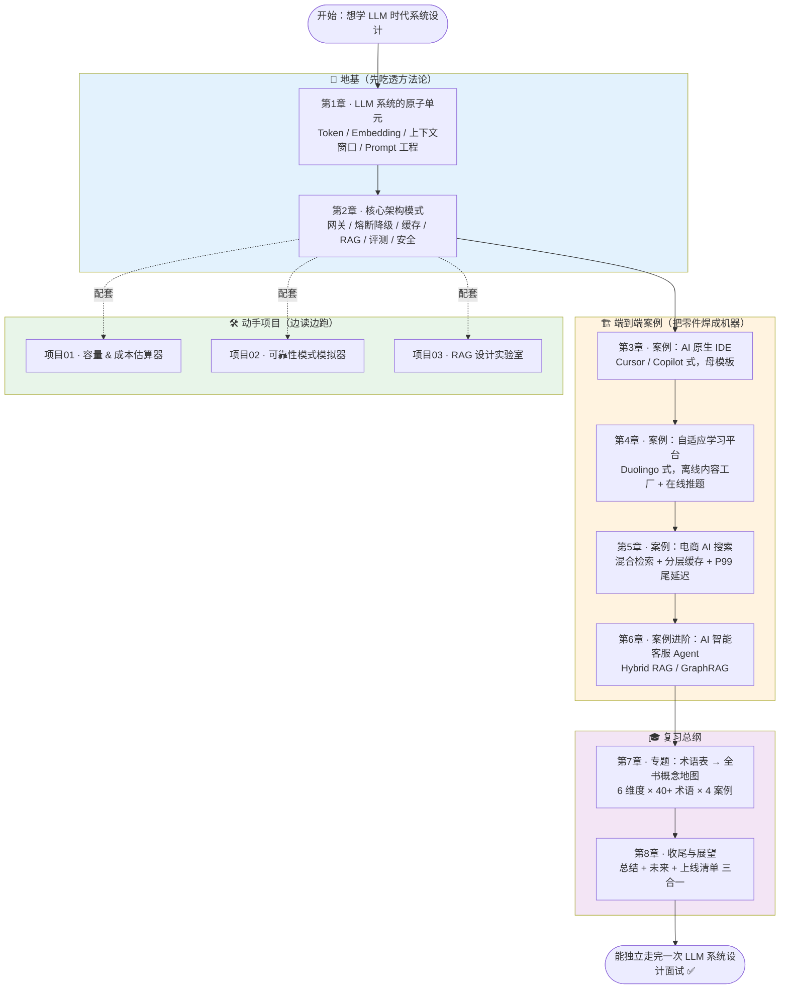

# 📚 《Systems Design in the LLM Era》· 中文逐章精讲 + 动手实战合集

> 原书：**《Systems Design in the LLM Era》**（作者 Sampriti Mitra，Packt）。
> 本仓库是这本书的 **中文逐章精讲**（`book-guide/`，8 章）＋ **3 个可跑可测的实战项目**（`projects/`）。
>
> 一句话定位：**把「LLM 时代怎么做系统设计」从一本英文书，翻译成一套「读得懂 + 跑得起来 + 面得下去」的中文学习资料。**

- 🎯 **给谁看**：准备国内外大厂 **System Design 面试**（尤其 LLM/AI 方向）的工程师；想把 RAG / 网关 / 缓存 / 可靠性 / 评测这些「零件」焊成生产系统的人。
- 🈶 **风格**：术语中英并列、从零基础到进阶；大量 mermaid 图、LaTeX 公式、权衡表格；每章都有「面试高频问答」+「常见坑合集」。
- 🔬 **贯穿全书的第一性原理**：传统软件是**确定性**的（`if x then y`），LLM 系统是**概率工程**——所有章节（缓存 / 路由 / 评测 / 多 Agent / 可观测性）都在解决同一件事：**把不确定性收敛成可靠的生产系统**。作者的口头禅：**「Patterns are Trade-offs（模式即权衡）」**、**「Architectural decisions are now financial decisions（架构决策就是财务决策）」**。

---

## 🗺️ 学习路径图



> 💡 **建议节奏**：先读第 1~2 章打地基 → 挑 1 个案例（推荐先读**第 3 章**，它是后面所有案例的「母模板」）→ 每读到成本 / 可靠性 / RAG 时，配套跑一个 `projects/` 项目把概念变成手感 → 最后用第 7 章的概念地图 + 第 8 章的上线清单收网复习。

---

## 📖 逐章精讲目录（`book-guide/`）

| 章 | 讲义（相对路径链接） | 一句话简介 |
|---|---|---|
| 01 | [`book-guide/01_LLM 系统的原子单元.md`](book-guide/01_LLM%20系统的原子单元.md) | 全书地基：讲清 AI→ML→LLM 的「套娃」术语，以及决定**成本/延迟/能力上限**的三大物理量 Token / Embedding / 上下文窗口，并教你写结构化 Prompt。 |
| 02 | [`book-guide/02_LLM 系统设计的核心架构模式.md`](book-guide/02_LLM%20系统设计的核心架构模式.md) | 「架构师手册」：把老工程师早会的可靠性原则**适配**到 LLM 这个「非确定性依赖」上——网关 / 熔断降级 / 缓存 / RAG / 评测 / 安全。 |
| 03 | [`book-guide/03_案例_AI原生IDE.md`](book-guide/03_案例_AI原生IDE.md) | 第一个真刀真枪的端到端案例：设计一个 Cursor/Copilot 式 **AI 原生 IDE**，从需求拆解到 P99<200ms 量化；**后续所有案例的母模板**。 |
| 04 | [`book-guide/04_案例：自适应学习平台.md`](book-guide/04_案例：自适应学习平台.md) | Duolingo 式**自适应学习平台**：从 DAU 反推 350K RPS 峰值，核心心法是**「离线内容工厂 + 在线实时推题」双系统解耦** + 主动预取。 |
| 05 | [`book-guide/05_案例：电商 AI 搜索.md`](book-guide/05_案例：电商%20AI%20搜索.md) | **电商 AI 搜索**（大厂高频面试题）：在几百毫秒延迟里塞进又慢又贵的 LLM——**混合检索**（关键词+语义）+ **分层缓存**（80/20 绕开 LLM）+ P99 尾延迟权衡。 |
| 06 | [`book-guide/06_案例进阶.md`](book-guide/06_案例进阶.md) | 难度最高的进阶案例：用 **Hybrid RAG（向量搜索 + 知识图谱 = GraphRAG）** 从零设计生产级 **AI 智能客服 Agent**（以 MongoDB 官方客服为背景）。 |
| 07 | [`book-guide/07_专题(读章定题).md`](book-guide/07_专题(读章定题).md) | 收官专题：把原书**术语表**反向建构成一张**全书概念地图**——按 6 大设计维度重排 40+ 术语，每个都连回前 6 章的模式与案例，形成面试作战地图。 |
| 08 | [`book-guide/08_收尾展望.md`](book-guide/08_收尾展望.md) | 收尾与展望：原书没写总结章，本篇「读章定题」把散落 6 章的原则收束成一张网——**总结 + 未来展望 + 上线自查清单** 三合一。 |

> 📝 **文件名小注**：Windows 文件名不允许冒号 `:`，所以第 3/6/8 章落盘为子目录（`03_案例/`、`06_案例/`、`08_收尾/`）下的 md 文件。链接里的 `%20` 是空格的 URL 转义，GitHub / Obsidian 都能正常跳转。

---

## 🛠️ 动手项目目录（`projects/`）

三个项目全部 **离线、确定性、无需 API key、无需 GPU**：纯 Python / numpy，几秒跑完，同 seed 必得同结果。每个项目都带 `pytest` 测试 + `run_demo.py` 出图。

| 项目 | 路径 | 一句话 | 怎么跑 |
|---|---|---|---|
| 01 · 容量 & 成本估算器 | [`projects/01_capacity_cost_estimator/`](projects/01_capacity_cost_estimator/) | 给 QPS / token / 模型规模 / 目标 P99，用一张公式表算出**要几张 GPU、显存够不够、每月烧多少钱、每百万 token 成本**——把架构决策翻译成财务决策。 | `pip install -r requirements.txt`<br/>`python -m pytest -q`（31 passed）<br/>`python run_demo.py`（出 2 张图） |
| 02 · 可靠性模式模拟器 | [`projects/02_reliability_patterns_sim/`](projects/02_reliability_patterns_sim/) | 在「有故障率的下游依赖」上仿真四种可靠性模式——**重试 / 超时 / 断路器 / 降级**——量化它们对**可用性 / 尾延迟 / 成功率**的影响；核心是断路器状态机。 | `pip install -r requirements.txt`<br/>`python -m pytest -q`<br/>`python run_demo.py`（出 3 张对比图） |
| 03 · RAG 设计实验室 | [`projects/03_rag_design_lab/`](projects/03_rag_design_lab/) | 纯 numpy 手写完整 RAG 管线（chunk→向量化→检索→重排→缓存→生成），拧 **chunk 大小 / top-k / 缓存** 旋钮画出「检索质量↔延迟/成本」权衡曲线，答案带**可回溯引用**。 | `pip install -r requirements.txt`<br/>`python -m pytest -q`（31 passed）<br/>`python run_demo.py`（出 3 张权衡图） |

> ⚠️ **Windows 中文乱码提示**：`run_demo.py` 输出是 UTF-8，老式 `cmd`/GBK 代码页会显示成乱码，但**数据和 PNG 图都是好的**。想在终端看清中文：先 `chcp 65001`，或设 `PYTHONIOENCODING=utf-8 python run_demo.py`。图里的中文用微软雅黑渲染，始终清晰。

---

## 🎯 面试 / 实战用法

这套资料不是拿来「读一遍」的，而是拿来「练打法」的。推荐三种用法：

### 1️⃣ 冲刺 System Design 面试
- **按案例练框架**：第 3~6 章每章都走一遍**「需求拆解（FR/NFR）→ 规模估算 → API → 蓝图 → 数据建模 → Deep Dive → 权衡」**的标准七步。被问「设计一个 XX AI 系统」时，照着这个骨架就能开口。
- **背概念地图**：第 7 章把 40+ 术语按 6 大维度分层，被问到 `Coalesce caching` / `GraphRAG` / `Circuit breaker`，能立刻说出它属于哪个维度、解决什么问题、代价是什么。
- **刷高频问答**：每章末尾的「💡 面试高频问答」直接就是面试题库。

### 2️⃣ 上线前做工程决策
- **算成本**：跑 `projects/01`，在写代码前就把 GPU 数量、月成本、每百万 token 成本的**数量级**算对。
- **选可靠性策略**：跑 `projects/02`，用仿真数据决定「重试几次 / 超时设多少 / 断路器阈值怎么定 / 降级降到哪」。
- **调 RAG 旋钮**：跑 `projects/03`，用权衡曲线为你的语料选 chunk 大小和 top-k，而不是拍脑袋。

### 3️⃣ 边读边跑，把概念变肌肉记忆
- 读第 2 章的**成本**小节 → 跑项目 01；读**熔断降级** → 跑项目 02；读 **RAG** → 跑项目 03。
- 每个项目的 `README.md` 都有「代码逐行讲解 + 公式推导 + 测试在验证什么」，看完能自己改参数复现结论。

---

## ✅ 快速自检（跑通全部测试）

```bash
# 在仓库根目录，逐个项目跑测试
cd projects/01_capacity_cost_estimator && pip install -r requirements.txt && python -m pytest -q && cd ../..
cd projects/02_reliability_patterns_sim && pip install -r requirements.txt && python -m pytest -q && cd ../..
cd projects/03_rag_design_lab          && pip install -r requirements.txt && python -m pytest -q && cd ../..
```

全绿即环境就绪，可以开始「边读讲义、边跑 demo」了。祝学习顺利，面试全过 🚀
