# 第 1 章 · LLM 系统的原子单元（Atomic Units of LLM Systems）

> 对应原书：《Systems Design in the LLM Era》(Sampriti Mitra) 第 1 章，PDF 第 28–57 页。
> 本篇是逐章精讲 + 中文补充实战，术语中英并列、从零基础到进阶。

---

## 🗺️ 本章地图：这一章在全书的位置

这是全书的**地基章**。作者的核心论点只有一句话：

> **传统软件是确定性的（deterministic）：`if x then y`，一个单元测试通过一次就永远通过。而用 LLM 搭系统，是一次向"概率工程（probabilistic engineering）"的根本转变：同样的输入 `x`，可能吐出 `y`、`y'`，有时甚至是 `z`。**

后面所有章节（缓存、路由、评估、多 Agent、可观测性……）都在解决同一个问题：**如何把这种不确定性，收敛成可靠的生产系统。** 而要谈"收敛"，你得先认识组成系统的**原子单元（atomic units）**——就像学化学得先认识元素周期表。

读完这一章，你应该能：

- 说清 AI → ML → 深度学习 → 生成式 AI → NLP → LLM/SLM 这条"套娃"关系，不再混用术语；
- 理解 **Token / Embedding / 上下文窗口** 这三个决定**成本、延迟、能力上限**的物理量；
- 会写结构化 Prompt（指令/上下文/角色/格式）并掌握 5 大 Prompt 工程策略；
- 讲清 **RAG / GraphRAG / 上下文工程（context engineering）/ Agent** 之间的递进关系；
- 掌握选型的**四维权衡**（上下文/延迟/隐私/成本）和 **temperature** 这个关键旋钮；
- 了解**模态、数据合规（data residency）、性能基准（benchmarking）、三类故障**的处理框架。

一句话：**这一章教你认元素，后面的章教你搭分子。**

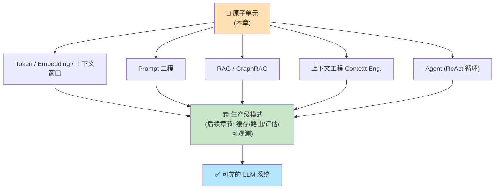

---

## 1️⃣ 通往语言模型之路：先把术语套娃拆开

初学者最容易犯的错，就是把 AI、机器学习、深度学习、生成式 AI、NLP、LLM 当成同义词乱用。它们其实是**层层嵌套的包含关系**。作者用一张"套娃图"（原书 Figure 1.1）把它们排好了序：

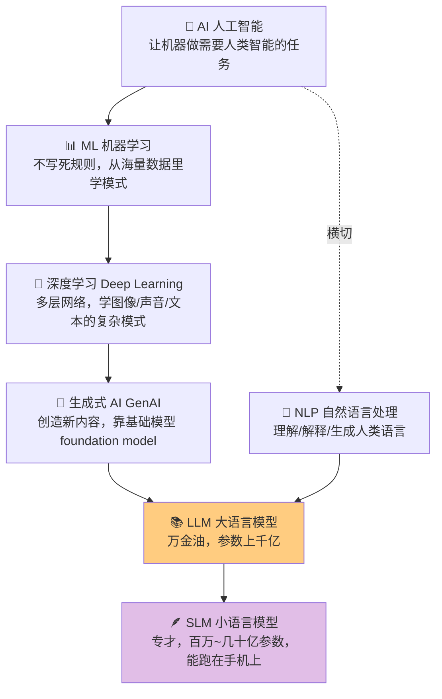

逐个讲**是什么 / 为什么这样分**：

| 术语 | 是什么 | 关键区别 | 生活化例子 |
|---|---|---|---|
| **AI（人工智能）** | 计算机科学的一个分支，让机器做需要人类智能的任务（学习、推理、感知、理解语言） | 最大的伞，包含下面所有 | "会思考的机器"这个总目标 |
| **ML（机器学习）** | AI 的**子集**，系统**不写死规则**，而是从大量数据里学 | 不是人告诉它规则，是它自己找规律 | 垃圾邮件过滤：不教它规则，给它几百万封邮件让它学模式 |
| **深度学习（Deep Learning）** | ML 的**更高级子集**，用**多层**网络从原始非结构化数据（图像/声音/文本）里学复杂模式 | "深"= 层数多 | 自动驾驶、语言翻译、生成式 AI 的底层技术 |
| **生成式 AI（GenAI）** | 能**创造新原创内容**（而不只是分析数据）的 AI，靠**基础模型（foundation model）** | 关键词是"创造" | 给个 prompt，它生成一段"统计上可能"的新输出 |
| **NLP（自然语言处理）** | AI + 计算语言学的分支，聚焦**理解/解释/生成**人类语言（口语和书面） | 专门管"语言" | 几十年研究让计算机有语言能力，LLM 让它梦想成真 |
| **LLM（大语言模型）** | 巨型 AI 模型，在**海量、多样**数据（几乎半个互联网）上训练，通用 | **万金油（jack-of-all-trades）** | 能写诗、总结法律文书、翻译、写代码、答历史题 |
| **SLM（小语言模型）** | 更**紧凑、聚焦**的模型，在**更小、更精、高质量**的领域数据（医疗/金融/客服）上训练 | **专才**，几百万~几十亿参数 | 高效、便宜、快，能**直接跑在手机/笔电/车里**，不用连数据中心 |

> 🔬 **第一性原理｜"深"和"大"到底指什么？**
> - **深度学习的"深"** = 神经网络的**层数**多。层越多，越能从原始像素/字符里逐层抽象出高级特征（边缘→形状→物体）。
> - **LLM 的"大"** = **参数量**大（千亿级）+ **训练数据**大（半个互联网）。参数是模型"记住"的可调数字，越多，能容纳的知识和模式越多，但推理时也越吃显存、越慢、越贵。
> - **SLM 的价值** = 用"数据质量"换"参数数量"。在一个窄领域里，一个训练精良的小模型可以**又快又准又便宜**，还能本地部署（隐私友好）。这就是后面"选型三角"里"低成本 + 低延迟"那一角的物理基础。

> 💡 **面试高频**：被问"LLM 和 SLM 怎么选？"——标准答案是**按任务的通用性和部署约束选**。通用、开放域、要强推理 → LLM；单一垂直任务、要低延迟/低成本/本地隐私 → SLM（甚至微调过的）。不要一上来就"用最强模型"，那是烧钱。

---

## 2️⃣ LLM 拆解：Token、Embedding、训练、上下文窗口

作者把 LLM 的运作拆成若干过程（原书 Figure 1.2）。我们从最底层的两个"物理量" Token 和 Embedding 讲起，因为**它们直接决定你的成本、延迟和能力上限**。

### 2.1 Token（词元）——账单和物理上限的计量单位

**是什么**：Token 是模型能处理的**最小文本片段**。把句子拆成一个个 token 的过程叫**分词（tokenization）**。

**为什么重要**：模型不像人一样读单词/句子，它眼里的世界是**一串数字**。Token 就是"被转换成数字"的那个单位。

书里的例子：

```
文本(Text):   "The cat sat on the mat."
分词(Tokens): [ "The", "cat", "sat", "on", "the", "mat", "." ]
```

Token 定义了我们的**硬性上限和计费成本**。作者点出三个致命影响：

| 维度 | 机理 | 工程后果 |
|---|---|---|
| **延迟与吞吐（Latency & throughput）** | LLM **并行处理输入 token**，但**串行逐个生成输出 token**。生成 50 个 token 远比处理 50 个输入 token 慢。 | 要低延迟，就得**限制输出长度**。 |
| **COGS（销货成本）** | 按**每百万 token** 计费，啰嗦的 prompt 直接吃掉利润。用 2000 token 的 prompt 做一个是/否分类，就是在烧钱。 | 尽量**预计算和缓存 prompt**。 |
| **上下文窗口硬上限** | 每个模型有**最大上下文窗口**（模型的短期记忆），如 8k、32k、128k token。 | 不能把用户全部历史塞进 prompt，要设计**滑动窗口或摘要系统**来管理状态。 |

> 🔬 **第一性原理｜为什么输入并行、输出串行？**
> Transformer 处理输入时，所有 token 一次性喂进去，靠自注意力（self-attention）**并行**算完（这一步叫 prefill / 预填充）。但生成输出时是**自回归（autoregressive）**的：第 N+1 个 token 依赖前面已生成的第 1..N 个 token，所以只能**一个一个吐**（这一步叫 decode / 解码）。这就是为什么"输出 token 数"是延迟的主要驱动因素，而"输入 token 数"主要驱动一次性的 prefill 开销。

> ⚠️ **常见坑｜token ≠ 单词，也 ≠ 字符**
> 英文里 1 个 token 约等于 0.75 个单词；中文一个汉字可能是 1~2 个 token；标点、空格也算。**永远不要用"字符数 / 4"当作精确 token 数去卡预算**，要用官方 tokenizer（如 `tiktoken`）实测。一个隐蔽的爆预算场景：把一大段 JSON/日志原样塞进 prompt，token 数会暴涨。

**上下文窗口策略（原书 Figure 1.3）**：当对话超出窗口，怎么办？两条主流路子：

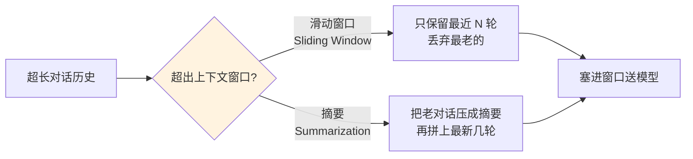

### 2.2 Embedding（嵌入）——把"意义"变成可比较的坐标

**是什么**：Embedding 是数据（文本、图像等）的**数值表示（向量 vector）**，捕捉词、图像等之间的**语义关系（semantic relationship）**。它把高维复杂数据变成低维向量，提升比较的计算效率。在本书的场景里，embedding 就是代码、文档的向量表示。

**核心性质**：一段文本的 embedding 向量捕捉它的**语义本质**，**意义相近的文本，向量在向量空间里也靠得近**。

**为什么强大**：不像哈希表（hash map）要求**精确匹配 key**，embedding 让我们能找**最近邻（nearest neighbors）**——即使一个关键词都不共享，也能找到概念相关的内容。

原书 Figure 1.4 展示了相关词如何"聚类"：

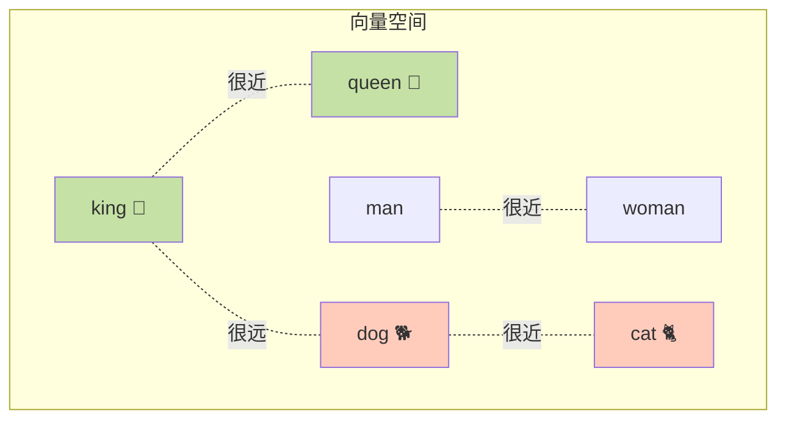

**维度（dimension）的取舍**：向量维度数很关键。**更大的维度（如 3072 vs 1536）捕捉更多细微差别，但增加存储成本和搜索延迟**。作者给出黄金法则：

> **在满足精度要求的前提下，选最小的维度，让索引查询保持快速。**

> 💡 **实战｜embedding 维度怎么定？**
> 别默认"越大越好"。先用一个小的 golden set（几十条查询）测两档维度（如 768 vs 1536），看召回率/准确率有没有实质差距。如果 768 就够用，你能省下将近一半的向量库存储和查询延迟。**存储成本和 QPS 延迟随维度近似线性增长，而精度的边际收益却在递减。**

### 2.3 训练两阶段：预训练（Pre-training）与微调（Fine-tuning）

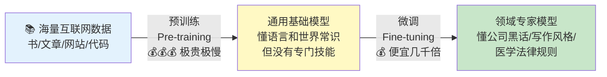

| 阶段 | 是什么 | 目标 | 代价 |
|---|---|---|---|
| **预训练（Pre-training）** | 创建大模型的**第一步也是最重要一步**。喂进巨量、多样数据（几乎是互联网快照：书、文章、网站、代码） | 教它**语言本身**：语法怎么运作、词义、词与概念的关系、世界常识、句子构建的统计模式 | 极贵极慢。产物是**通用**理解，没有针对任何具体任务 |
| **微调（Fine-tuning）** | 拿一个通用的**预训练模型**，在**更小、更具体**的数据上再训练一点点，让它成为**单一专业任务的专家** | 学会公司内部黑话、某人写作风格、niche 领域（医/法）的规则 | **比从头预训练便宜、快几千倍** |

作者举了个关键场景：如果预训练模型知识**截止在 2023 年**，可以用 2024、2025 的新文档微调，把它在那个专题上的知识更新。

> ⚠️ **常见坑｜微调 ≠ 教新知识的首选**
> 很多人一想到"模型不知道我们公司的东西"就去微调。但**微调擅长教"风格/格式/技能"，教"事实知识"效率低且容易过时**。要注入可变的事实知识，**RAG（下文）通常比微调更划算、更实时**——你改文档就行，不用重新训练。这也是为什么本章后面会花大篇幅讲 RAG。

---

## 3️⃣ Prompt 工程基础：把话说清楚，就是一半的工程

**Prompt（提示词）是什么**：我们给 AI 模型的**指令、问题或文本**，用来让它执行任务。Prompt 是我们**与 AI 沟通、引导它**的方式。**AI 答案的质量，高度依赖 prompt 的质量。**

一个简单的 prompt 就是一个问题。但**进阶 prompt 可以分成几部分**来更好地引导 AI（原书 Figure 1.6）：

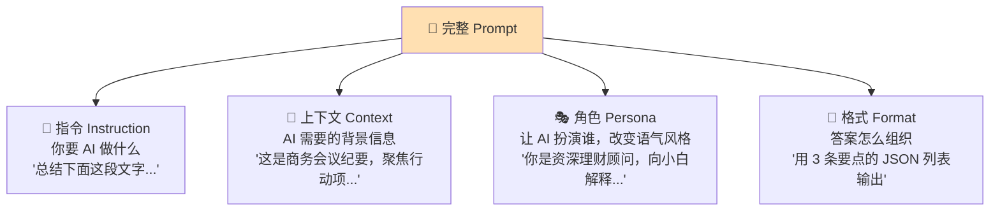

| 组成 | 作用 | 书中例子 |
|---|---|---|
| **指令（Instruction）** | 你想让 AI 执行的具体命令 | "Summarize the following text..." |
| **上下文（Context）** | AI 理解任务所需的背景信息 | "...这段文字是商务会议的转录。聚焦行动项..." |
| **角色（Persona）** | 告诉 AI 它应该是谁，改变语气和风格 | "你是专家级理财顾问，向一个完全的新手解释这个概念..." |
| **格式（Format）** | 告诉 AI 如何组织答案 | "...以 3 条要点的 JSON 格式给出答案。" |

### 3.1 上下文窗口（Context window）——AI 的"工作内存"

**是什么**：上下文窗口是 AI 模型的**工作内存 / 短期记忆**。它是模型在**任一时刻**能看到并记住的**固定信息量（以 token 计）**。

**关键规则**：**我们发给模型的一切 + 模型生成的一切，都必须塞进这个窗口**。包括：

- 最近的 prompt；
- 对话历史（之前的问题和 AI 的回答）；
- 你提供的任何文档、数据或系统指令。

**一旦对话太长、溢出窗口，模型就会忘记对话最早的部分。**

### 3.2 推理（Reasoning）与思维链（Chain-of-Thought, CoT）

**是什么**：推理是**接收信息、逻辑处理、产出新结论/决策**的能力，是智能的"思考"部分。

**机理**：它是一种**涌现行为（emergent behavior）**——模型基于训练数据里的逻辑模式，**统计地预测下一个最可能的词**。通过生成**思维链（chain-of-thought，逐步思考）**，模型**模拟人类的推理过程**来解题。

书里给了个真实的 CoT 例子（模型被问"Define AI"时的内部思考）：

```
location: "Hyderabad, Telangana, India"  time: "Saturday, November 8, 2025..."
thought: 我需要定义人工智能(AI)。这是个宽泛主题，所以我应该搜一个清晰、
         通用的定义，AI 的主要类型（窄 vs 通用），以及它和机器学习、
         深度学习等关键子领域的关系。我还会找些常见应用让解释更具体。
print(google.search.search(queries=["什么是人工智能定义",
      "人工智能的类型和例子", "什么是机器学习和深度学习", "AI 的常见应用"]))
```

> 🔬 **第一性原理｜为什么"逐步想"能提升准确率？**
> LLM 本质是"预测下一个 token"。当你逼它一步一步写出中间推理，它就把一个**难的一步跳跃**（容易蒙错）拆成了**多个简单的下一步预测**（每步都在它的能力舒适区内）。中间步骤又成了后续预测的上下文，形成"自己给自己搭脚手架"。这就是 CoT 能显著提升数学/逻辑任务准确率的根本原因——**用更多输出 token 换更高的正确率**（代价见 §2.1，输出越长越慢越贵）。

### 3.3 五大 Prompt 工程策略（配好坏对比）

**Prompt 工程（Prompt engineering）** 就是**通过调整 prompt 来得到想要的输出**的实践。书里给了 5 条经得起考验的策略，每条都有 Bad/Good 对照——把它们背下来：

**① 上下文增强（Context enrichment）**：给 LLM 提供周边代码、文档等更多上下文。

```text
❌ Bad:  "Fix this bug"（修这个 bug）
✅ Good: "这是错误日志：第 45 行 NullPointerException。这是 User 表的数据库
         schema。这是 UserService 类的代码。基于这些上下文，找出为什么
         user 对象是 null。"
```
🔎 逐行解读：Good 版本把**报错、数据结构、相关代码**三块背景一次性给全，模型不用猜，直接定位。

**② 角色扮演（Role assumption）**：让 LLM 扮演某个角色。

```text
❌ Bad:  "Explain this code."（解释这段代码）
✅ Good: "你是一名首席安全工程师(Principal Security Engineer)，正在审计这段
         代码找漏洞。向一名初级开发者解释这个函数的风险。聚焦 SQL 注入
         和输入校验。"
```
🔎 解读：给角色 = 给它一套**专业视角和评判标准**，输出立刻从泛泛而谈变成聚焦安全。

**③ 提供示例（Provide examples）**：给 LLM 好回答的样例（即 few-shot）。

```text
❌ Bad:  "Convert this log to JSON"
✅ Good: "把日志行转成 JSON。
         Input: [ERROR] 2024-01-01: DB fail
         Output: {'level':'ERROR','date':'2024-01-01','msg':'DB fail'}
         Input: [INFO] 2024-01-02: Started
         Output: {'level':'INFO','date':'2024-01-02','msg':'Started'}
         Input: [WARN] 2024-01-05: High CPU"
```
🔎 解读：示例把"字段名、大小写、结构"这些隐性约定**演示**出来，比用文字描述规则更精确，模型照葫芦画瓢。

**④ 提供护栏（Provide guardrails）**：显式说明**不允许**的行为，避免幻觉/危险操作。

```text
❌ Bad:  "写个脚本删除旧文件。"
✅ Good: "写个 Python 脚本删除超过 30 天的文件。
         约束(CONSTRAINT)：不要立即执行任何破坏性命令(如 os.remove)。
         而是打印一个将被删除文件的 'DRY RUN'（空跑）列表。
         删除前要求用户确认。"
```
🔎 解读：护栏是**负向约束**（"不要做 X"），把危险操作变成"先预演、再确认"，这在生产 Agent 里是保命的。

**⑤ 思维链（Chain-of-thought）**：明确要求逐步思考。

```text
❌ Bad:  "有多少个不同的 IP 命中了服务器？"
✅ Good: "分析服务器日志找出不同 IP 的数量。逐步思考(Think step-by-step)：
         1. 先识别日志里 IP 地址的模式；
         2. 把所有 IP 实例抽到一个列表；
         3. 过滤列表去重；
         4. 数剩下的条目。返回最终计数。"
```
🔎 解读：把一个"心算"任务拆成 4 个确定性步骤，模型不容易漏、不容易错。

> 💡 **面试高频**：这 5 条按首字母好记——**上下文、角色、示例、护栏、思维链**。被问"如何提升 LLM 输出质量"时，先说 Prompt 工程这 5 招（零成本），再说 RAG（注入知识）、再说微调（改风格），最后才是换更大模型（最贵）。**成本从低到高的排序，就是解决问题的正确顺序。**

---

## 4️⃣ 让 LLM 理解代码：向量搜索、AST、知识图谱

作者用"AI 辅助编程工具"这个高速增长的场景，把前面的概念串起来。要理解代码，光有语义还不够，还得抓住**结构和关系**。于是引入三件套：**向量搜索、AST、知识图谱**。

### 4.1 向量搜索（Vector search）——按"意义"检索

**是什么**：一种**按意义而非精确关键词匹配**找信息的技术。比如开发者提问时，语义化地检索代码块。

**流程**：查询进来 → 经**嵌入模型**转成向量 → 与向量库（如 **Pinecone**、**pgvector**）里预先算好的向量比对 → 用**余弦相似度（cosine similarity）**或**点积（dot product）**等度量算相似度 → **空间上更近 = 语义上更相似** → 取 top 匹配结果作为上下文送给 LLM。

### 4.2 文本自动补全 vs 代码补全（原书 Figure 1.7）

| | 文本自动补全（Text autocompletion） | 代码补全（Code completion） |
|---|---|---|
| **依据** | 纯粹按**前面词的序列**预测下一个词 | 需要**语法正确 + 语义 + 结构感知** |
| **理解力** | **不理解意义或上下文** | 补全结果依赖代码定义**在文件/类/方法里的位置** |
| **例子** | 手机输入法猜下一个词 | IDE 里同名变量在不同作用域补出不同结果 |

### 4.3 抽象语法树（AST, Abstract Syntax Tree）——代码的"结构骨架"

**是什么**：AST 是**代码的结构化表示**，帮助**语法纠错、重构、语义编辑**。它是一棵**树**，展示代码各组件之间的**层次关系**。

**为什么对代码补全有用**：IDE 在索引后内部生成 AST，这个结构用于**分块（chunking）**，可送给 LLM 提供 repo/代码的上下文。

书里的例子，这段代码：

```python
class Calculator:
    def add(self, x, y):
        return x + y
    def subtract(self, x, y):
        return x - y
```

对应的 AST 长这样：

```
ClassDef (Calculator)
├── FunctionDef (add)
│   ├── Arguments: self, x, y
│   └── Return: BinOp (x + y)
└── FunctionDef (subtract)
    ├── Arguments: self, x, y
    └── Return: BinOp (x - y)
```

🔎 逐行解读：
- `ClassDef (Calculator)` —— 根节点是类定义，名叫 Calculator；
- `├── FunctionDef (add)` —— 第一个子节点是函数定义 add；
  - `Arguments: self, x, y` —— add 的参数列表；
  - `Return: BinOp (x + y)` —— 返回一个**二元运算（BinOp）** `x + y`；
- `subtract` 同理。

**大型代码库的 AST（原书 Figure 1.8/1.9）**：AST 特别适合**语义化的代码库分块**——把文件夹当父节点、文件里的类当子节点、类里的方法当更深的子节点，逐层嵌套。

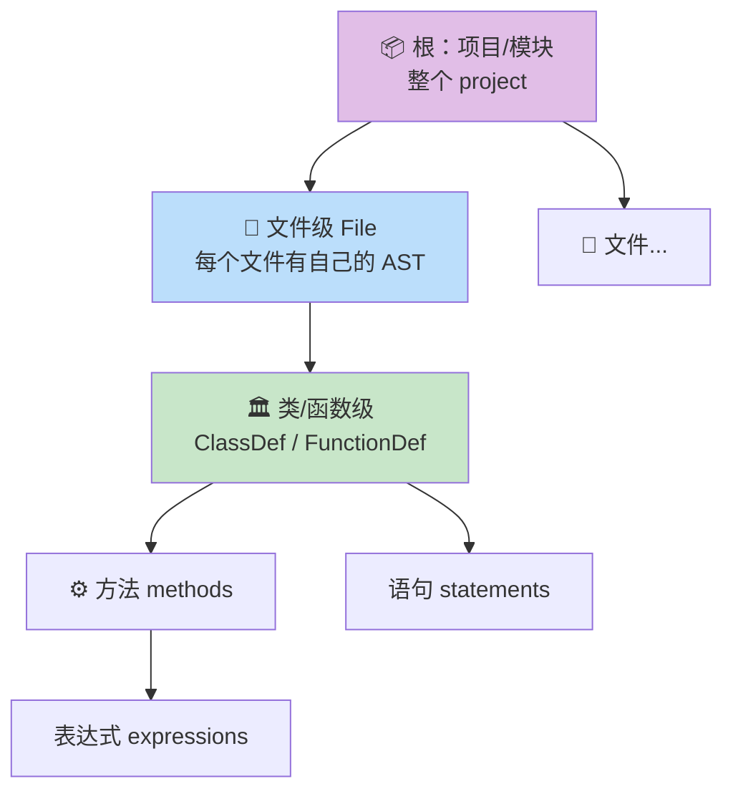

**分块规则**：
- **类定义块**：整个 `ClassDef` 节点（含所有函数）算**一个 chunk**；
- **函数定义块**：整个 `FunctionDef` 节点（如 `add` 方法连同参数和返回）算**一个 chunk**。

> 💡 **实战｜为什么按 AST 分块比"按固定字符数切"强？**
> 朴素分块（每 500 字符切一刀）会**把一个函数拦腰斩断**，检索到半个函数对 LLM 毫无用处。按 AST 分块保证**每个 chunk 是一个语法完整的单元**（完整的类/函数），送给 LLM 的上下文才是可用的、自包含的。这正好呼应 §5 要讲的"朴素 RAG 因烂分块而失效"的问题。

### 4.4 知识图谱（Knowledge Graph, KG）——代码的"关系网"

**是什么**：由**节点（node，代表实体）**和**边（edge，代表关系）**组成的数据结构。社交平台里，节点可以是用户、帖子、话题标签，边捕捉 `follows`、`liked`、`tagged in` 等关系。这样图就能回答"哪些用户点赞了同一个帖子？""哪些话题标签常一起出现？"

**在代码场景**：捕捉函数、类、方法之间的关系，回答"**这个方法从哪里被调用？**"这类问题。

书里给了个 FinanceApp 的例子（节选边关系）：

| From（起点） | Relationship（关系） | To（终点） |
|---|---|---|
| FinanceApp | hasModule | main |
| FinanceApp | hasModule | calculators |
| main | hasFile | main.py |
| calculators | hasFile | interest_calculators.py |
| interest_calculators.py | containsClass | TaxCalculator |
| TaxCalculator | hasMethod | calculate_tax |
| helpers.py | containsFunction | format_currency |

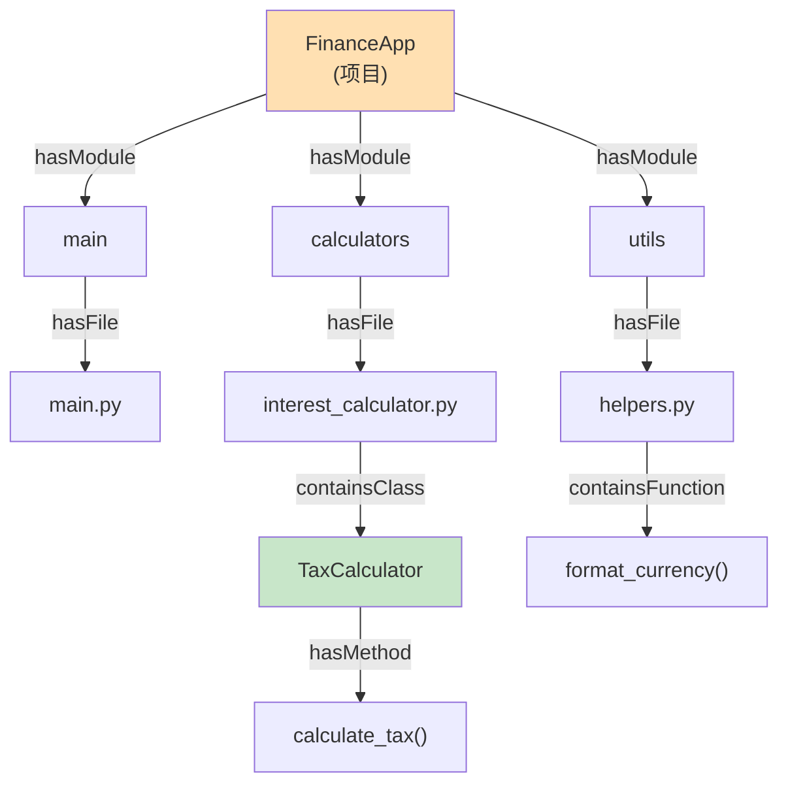

> 🔬 **第一性原理｜向量搜索 vs 知识图谱，本质差别？**
> - **向量搜索**回答"**什么东西和这个意思相近？**"——擅长**模糊的语义相似**，但不懂**精确的逻辑关系**。
> - **知识图谱**回答"**这个东西和那个东西是什么关系？**"——擅长**多跳的、确定的关系遍历**（A 调用 B，B 定义在 C）。
> 二者是**互补**的：一个管"意义空间的距离"，一个管"关系空间的路径"。§5 的 GraphRAG 就是把两者焊在一起。

---

## 5️⃣ LLM 的权衡与选型：没有"一个模型统治所有"

作者直言：**"There is no 'one model to rule them all'"**（没有一个模型能统治所有）。每个架构选择都要在**四个维度**间平衡：

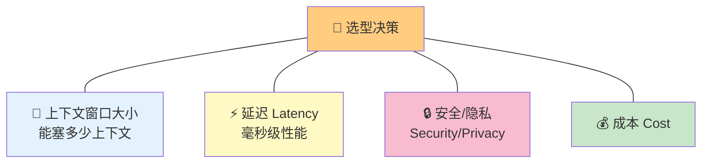

书里的实际观察（把它当选型直觉记住）：

| 模型/方向 | 强项 | 代价 |
|---|---|---|
| **Claude** | 大上下文表现好 | —— |
| **GPT-5** | 推理极强 | **延迟和成本更高** |
| **小模型（可微调）** | 低延迟 | **精度可能下降** |

### 5.1 确定性 vs 随机性（Deterministic vs Stochastic）与 temperature

- **确定性（Deterministic）**：同一输入**永远产生完全相同的输出**，可预测、一致、遵循固定规则。
- **随机性（Stochastic）**：同一输入**可能产生不同输出**，涉及随机和概率，结果不完全可预测。

**LLM 是概率性的**：不像 `input(x)` 恒等于 `output(y)`，LLM 会变。工程师控制这个行为的**首要旋钮是温度（temperature）**：

| 温度 | 行为 | 适用场景 |
|---|---|---|
| **低温（0.1~0.2）** | 模型选**最可能**的下一个 token | 代码生成、数据抽取、分类——**一致性至上** |
| **高温（≈0.7~1.0）** | **提高随机性**，增大选到低概率 token 的可能 | 创意写作、头脑风暴、生成多样的合成数据 |

**非确定性的架构含义**，作者点了三个致命细节：

1. **不能用字符串相等断言（string equality）来单元测试 LLM 输出**。必须设计**能容忍波动**的测试套件，或**回归测试时把温度强制设为 0**。
2. **temperature 影响重试逻辑**：温度 = 0 时，一个校验失败（如 JSON 格式错误）的请求，重试会**以完全相同的方式再失败一次**（毫无意义）；温度 > 0 时，重试**可能**修好。
3. 换言之，**温度 0 = 可复现但重试无用；温度 > 0 = 有波动但重试有价值**。

> ⚠️ **常见坑｜温度 0 ≠ 完全确定**
> 即便 temperature=0，由于浮点运算、GPU 并行归约顺序、批处理等底层因素，输出仍可能**偶尔**有微小差异。所以书里说的是"容忍波动"而非"假设绝对确定"。**测 LLM 系统要用语义等价 / 评分区间断言，而不是 `assert output == "预期字符串"`。** 这是 LLM 时代测试范式的根本转变。

> 💡 **面试高频**：被问"LLM 输出不稳定怎么做测试？"——答：① 回归测试固定 temperature=0 降低方差；② 用 LLM-as-a-Judge 或 golden set 打分而非精确匹配；③ 对结构化输出（JSON）加 schema 校验 + 重试（此时温度 > 0 反而帮忙）；④ 断言用"包含关键事实/评分 ≥ 阈值"这类**容差断言**。

---

## 6️⃣ RAG：检索增强生成——给模型"开卷考试"

### 6.1 为什么需要 RAG

核心问题：**如何检索语义相关的文档，覆盖那些"意思相同但措辞不同"的情况？** 这正是 **RAG（Retrieval-Augmented Generation，检索增强生成）**的最大强项。

**RAG 的定义**：在把 prompt 送进 LLM 之前，用**相关且事实性的数据**来增强/丰富 prompt，让 LLM 给出更准确、更相关的结果。它是**确保高准确率、最小化幻觉**的基础方法——通过把 LLM 的回答**锚定（ground）在经过验证的、专有的知识**上。

RAG 分几个清晰步骤：

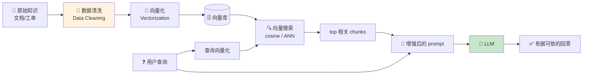

**① 数据清洗（Data cleaning）**：分块或嵌入前，原始数据必须严格清洗——**不只是去空格**，而是：

- **去噪（De-noising）**：剥离 HTML 标签、样板页眉页脚、导航链接，这些会**稀释文本的语义密度**；
- **PII 清除（PII scrubbing）**：用正则移除邮箱、SSN（社保号）、API key，**在数据接触外部模型 API 之前**；
- **归一化（Normalization）**：标准化 unicode 字符和日期格式，让**向量空间保持一致**。

**② 向量化（Vectorization）**：把原始知识（文档、已关闭工单等）用专门的**嵌入模型**（如 OpenAI 的 `text-embedding-ada-002`）转成高维数值数组（向量/embedding），捕捉语义。

**③ 向量搜索（Vector search）**：用户查询也向量化，用**余弦相似度**或**近似最近邻（ANN, Approximate Nearest Neighbor）**在向量库里找最相关的文档块。这保证检索到"意思和意图相同"的文档。

> 🔬 **第一性原理｜RAG 治的是什么病？**
> LLM 的知识**冻结在训练截止时刻**，且是"闭卷"的——它只能靠"记忆"答题，记不清就**编（幻觉）**。RAG 把它变成**开卷考试**：先从可信知识库里检索相关材料，塞进上下文，让模型**基于给定材料**作答。所以 RAG 同时解决三大痛点：① 幻觉（有据可依）；② 知识过时（改文档即更新）；③ 私有知识（模型没见过的内部数据）。

### 6.2 朴素 RAG 为什么不够？（原书 Figure 1.12）

作者点出**两个致命局限**：

| 问题 | 机理 | 后果 |
|---|---|---|
| **相似 ≠ 相关** | 向量搜索擅长找**相似**，但相似不总是**严格相关**。多个文档措辞相近，会检索出一堆语义相似的冗余 chunk | LLM 收到**冗余、压倒性的上下文**，反而难以定位真正需要的答案 |
| **烂分块导致低效检索** | 文档常是**层级结构**（标题 → 章节 → 子章节）。若查询匹配了标题，系统可能只取到**高层摘要**，而漏掉**深藏在下面第 5 节的关键信息** | 用户真正需要的核心信息被漏掉，因为嵌入模型没识别出"高层匹配"和"底层细节"之间的联系 |

### 6.3 用知识图谱补救 → GraphRAG

**为什么要知识图谱**：为缓解"仅靠语义"检索的局限，可以用**知识图谱（KG）**。图数据库如 **Neo4J** 或 **Amazon Neptune** 可用于此。KG 让检索**基于实体间的关系**，而不是靠词相似度：

```
Document A -[is_part_of]-> Section 3
Ticket X   -[resolved_by]-> Code Commit Y
```

这让检索引擎能**遍历复杂的逻辑路径**，找到确定的解决方案集。

**什么是 GraphRAG**：把**知识图谱和 LLM 结合**，提升生成回答的准确度和上下文——这个进阶 RAG 方法就叫 **GraphRAG**。它让系统能**遍历实体间的复杂关系**，找到高度相关、相互关联的信息，特别适合**导航结构化、领域特定的数据**。

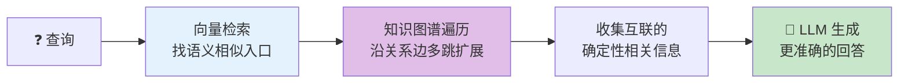

> 💡 **实战｜什么时候上 GraphRAG？**
> 当你的数据有**强关系结构**（代码库、法规条文的引用链、组织架构、供应链），且用户问题是**多跳关系型**（"这个 API 被哪些服务间接依赖？"）时，纯向量 RAG 会力不从心，GraphRAG 才值得那份额外的建图/维护成本。**如果只是问答式的文档检索，先把朴素 RAG 的分块和重排做好，别过早上图。**

---

## 7️⃣ 上下文工程（Context Engineering）：这是数据管道问题，不是提示词问题

作者抛出全章最重要的观点之一：

> **"Building with LLMs is a data pipeline problem, not a prompting problem."**
> （用 LLM 搭系统，是一个**数据管道问题**，不是提示词问题。架构控制上下文的流动。）

**目标**：搭一条管道，在**推理的确切时刻**，把数据从**长期记忆（向量数据库）**搬到**短期工作记忆（上下文窗口）**里。

**上下文工程（Context engineering）的定义**：在 AI 模型生成回答**之前**，**战略性地设计、构建、管理它所看到的一切相关信息、工具和约束**的实践。

它有几个不同侧面：

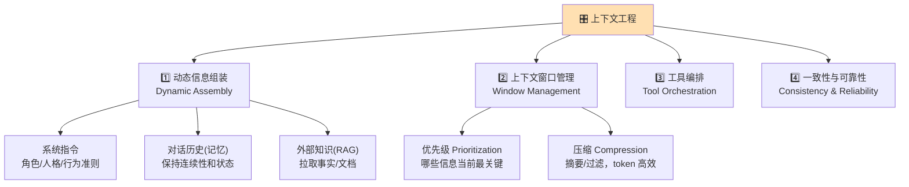

**① 动态信息组装（Dynamic information assembly）**：系统主动收集适配当前任务/对话轮次的多样信息：
- **系统指令（System instructions）**：定义 AI 的角色、人格、行为准则（"你是一个乐于助人的客服"）；
- **对话历史（记忆 memory）**：提供之前交互的相关摘录，维持连续性和有状态性（statefulness）；
- **外部知识（RAG）**：从外部源（公司数据库、网络）检索事实、文档、数据，把回答**锚定**在最新、具体的信息上，减少幻觉。

**② 上下文窗口管理（Context window management）**：因为窗口有限，需要：
- **优先级（Prioritization）**：决定当前步骤哪些信息最关键；
- **压缩（Compression）**：用摘要或过滤把大量数据浓缩成最相关、最 token 高效的格式。

**③ 工具编排（Tool orchestration）**：整合并管理对外部工具/API 的访问。AI 必须被正确提示并被给予上下文，来决定**何时用工具、怎么用、怎么把结果并入最终答案**。

**④ 确保一致性与可靠性**：通过系统化地控制 AI 的信息环境，让模型在不同交互和用户间产出**准确、一致、合规**的输出。

> 🔬 **第一性原理｜为什么说是"管道"而非"提示词"？**
> 提示词工程是**静态**的——你手写一段固定的 prompt。但真实系统里，每一次推理需要的上下文都**不一样**（不同用户、不同对话轮、不同检索结果）。你需要一条**程序化管道**：实时决定"这一轮该检索什么、保留哪些历史、调用什么工具、如何压缩"，然后**动态拼装**出上下文。这已经是**软件架构**问题了，不是"写好一句话"的问题。这也是这本书叫《Systems Design in the LLM Era》而不是《Prompt Engineering》的原因。

---

## 8️⃣ 智能体 AI（Agentic AI）：从"回答"到"自主行动"

**是什么**：Agentic AI（AI 智能体）指一个**自主系统（autonomous system）**，用 AI 模型（如 LLM）来**推理、规划、执行一系列动作**，以达成一个**高层目标**。

**关键**：路径是**动态且随机的（dynamic and stochastic）**。**AI 是编排者（orchestrator）**：给它一个目标，它**自己**想出要走的步骤。

**ReAct 循环（Reason + Act）**：Agent 在一个**持续的推理循环**里工作：

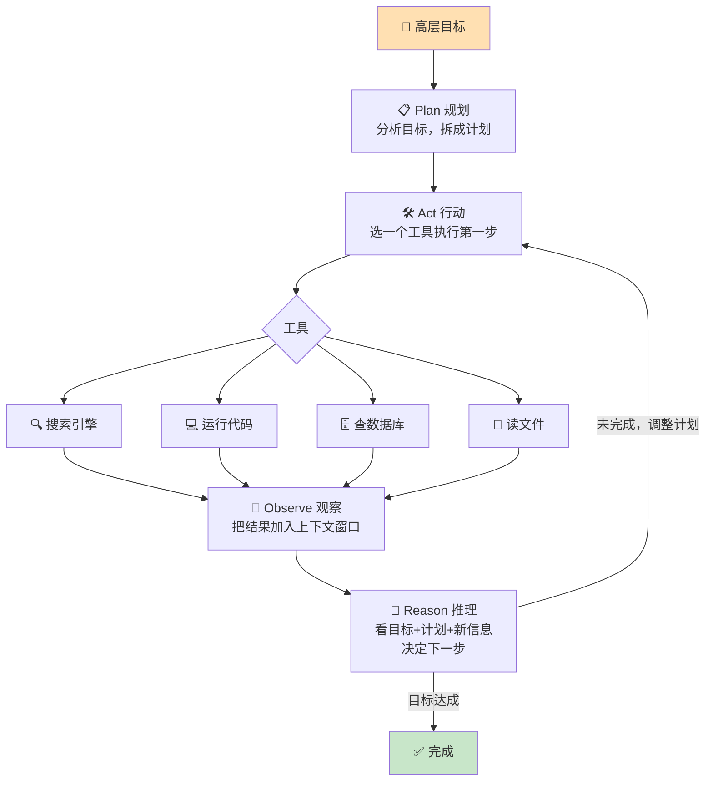

四步逐个讲：
- **Plan（规划）**：AI 分析目标，拆解成一个计划；
- **Act（行动）**：执行第一步，**选一个工具**——可能是用搜索引擎、运行一段代码、查数据库、读文件；
- **Observe（观察）**：拿到那个动作的结果（如一列搜索结果），加入上下文窗口；
- **Reason（推理）**：看目标、看计划、看新信息，**决定下一步**——可能调整计划、执行下一步、或判定目标已完成。**循环重复直到目标达成。**

> ⚠️ **常见坑｜Agent 是"非确定性 × 非确定性"**
> 单次 LLM 调用已经是概率性的了；Agent 把**多次**这样的调用**串成一条动态路径**，不确定性是**叠加放大**的。一步选错工具或读错结果，可能沿着错误路径越走越远。所以生产级 Agent 必须配：**步数上限、每步护栏（§3.3 的策略④）、可观测性/追踪、以及"人在环（human-in-the-loop）"确认危险操作**。这些正是本书后续章节的主题。

> 💡 **面试高频**：区分"LLM 应用"和"Agent"——**LLM 应用的控制流由代码写死**（RAG：先检索再生成，固定两步）；**Agent 的控制流由 LLM 自己决定**（动态选工具、动态决定何时停）。灵活性更高，但可控性、可测性、成本都更差。**能用固定流程解决的，不要用 Agent。**

---

## 9️⃣ 模态（Modality）：AI 不只读文字

人类不只通过文字感知世界，现代 AI 也是。要搭真正沉浸式的系统，得理解 AI 能处理的不同**输入通道（modality）**：

| 模态 | 是什么 | 典型应用 |
|---|---|---|
| **文本（Text）** | 书面语言 | 翻译、摘要、聊天机器人 |
| **图像（Images）** | 静态视觉信息 | 物体识别、人脸检测 |
| **音频（Audio）** | 口语、音乐、声音 | 语音识别（如 Siri）、音乐生成 |
| **视频（Video）** | 复杂模态，**移动图像(帧) + 音频** 的组合 | 视频理解/生成 |
| **空间（Spatial）** | 理解**深度和 3D 结构** | **自动驾驶**（对深度感知至关重要） |

---

## 🔟 数据合规（Data Residency & Compliance）：企业架构的头号约束

**是什么**：数据驻留（data residency）—— **数据（包括 AI 模型数据）存在哪里、怎么存**——如今是**企业系统架构的首要约束**，其重要性超越了延迟和成本。

三种部署形态的合规权衡：

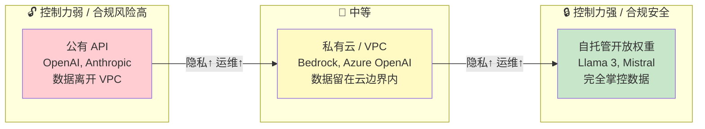

| 形态 | 数据在哪 | 适用/不适用 | 代价 |
|---|---|---|---|
| **公有 API**（OpenAI, Anthropic） | **数据离开 VPC**（虚拟私有云） | 没有零留存协议时，**不可接受** PII / PHI（受保护健康信息）/ 严格 PCI（支付卡）环境 | 便捷，但合规风险高 |
| **私有云 / VPC**（Bedrock, Azure OpenAI） | 数据**留在云边界内** | 大多数企业合规够用 | **依赖厂商可用性** |
| **自托管开放权重**（Llama 3, Mistral） | **完全掌控数据** | 严格**气隙（air-gapped）**环境或强合规要求 | **用运维复杂度（GPU 管理）换合规安全** |

> 💡 **面试高频**：被问"金融/医疗客户要求数据不出境/不出私有环境，怎么选模型？"——答：优先看**数据驻留约束**，它常常**一票否决**公有 API。次选 VPC 内的托管服务（Bedrock/Azure OpenAI），最强合规就自托管开放权重（Llama/Mistral），代价是自己扛 GPU 运维。**合规约束是硬约束，先满足它，再谈性能和成本。**

---

## 1️⃣1️⃣ 性能基准（Performance Benchmarking）：不度量就无法改进

**根本原则**：**"你无法改进你不度量的东西（you cannot improve what you do not measure）。"**

但**速度和智能是根本不同的两类指标**，所以拆成两大类分开测：

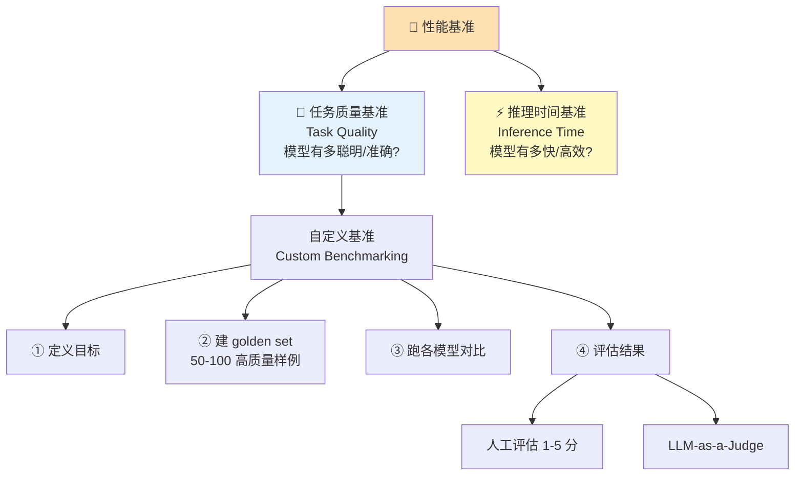

- **任务质量基准（Task quality benchmarking）**：测模型**多聪明、多准确**（"有没有高中水平知识？""是不是好的摘要器？"）。跑标准化数据集打分。
- **推理时间基准（Inference time benchmarking）**：测模型**多快、多高效**（每秒多少 token、首 token 多快）。回答商业关键问题：**这个模型跑起来多快、多贵？**

### 11.1 自定义基准（Custom benchmarking）四步法

它是任务质量基准的一种，衡量能否达成既定目标：

1. **定义目标**：LLM 必须做好的**那一件事**是什么？例："必须准确总结我们的客服工单。"
2. **建 golden set（黄金集）**：手工造 **50–100 个高质量**的输入/理想输出样例。
   - Input：一条又长又愤怒的客户工单；
   - Ideal Output：`{"summary": "用户对发票 #1234 的账单错误很生气", "sentiment": "negative", "topic": "billing"}`
3. **各模型跑一遍**：拿要对比的模型（如 Llama 3 vs GPT-5）跑完 golden set 全部输入。
4. **评估结果**，两种方式：
   - **人工评估（Human evaluation）**：**最可靠**，专家把输出对照理想输出打 1–5 分；
   - **LLM-as-a-Judge**：现代、可扩展。用一个强力的裁判 LLM（如 GPT-5）给被测 LLM 的输出打分。
     - 裁判 prompt 示例：`你是专家。这里有一个输入、一个理想回答、一个模型实际回答。从 1-5 给模型回答的准确性打分。Response: [模型输出]`

### 11.2 关键指标速查表

| 指标 | 英文/缩写 | 测什么 | 直觉 |
|---|---|---|---|
| **首 token 时间** | Time to First Token (**TTFT**) | 用户看到**第一个词**前等多久 | 决定"感觉快不快"（流式体验的第一印象） |
| **每秒 token 数** | Tokens Per Second (**TPS**) | 首 token 之后每秒生成多少 token | 整体生成速度 |
| **总延迟** | Total Latency | 从 prompt 到回答结束的**全程**时间 | 端到端耗时 |
| **吞吐** | Throughput (Requests/sec) | 系统能扛多少**并发用户** | 容量 |
| **资源占用** | Resource usage | **GPU 显存（VRAM）**消耗 | 决定买/租什么硬件 |

> 🔬 **第一性原理｜为什么 TTFT 和 TPS 要分开看？**
> 它们对应推理的两个阶段（回顾 §2.1）：**TTFT 主要由 prefill 决定**（处理完整个输入 prompt 才吐第一个字），**TPS 由 decode 决定**（逐个吐后续 token）。一个长 prompt 会拖慢 TTFT 但不影响 TPS；一个慢 GPU 会拖慢 TPS。用户体验上，**流式输出下 TTFT 决定"等待焦虑"，TPS 决定"阅读跟得上吗"**。所以优化手段也不同：降 TTFT 靠缩短/缓存 prompt，升 TPS 靠更快硬件/更小模型/推理引擎优化。

---

## 1️⃣2️⃣ 故障处理（Handling Failure）：LLM 的三大"病"

LLM 输出主要有三类故障，各有对症疗法：

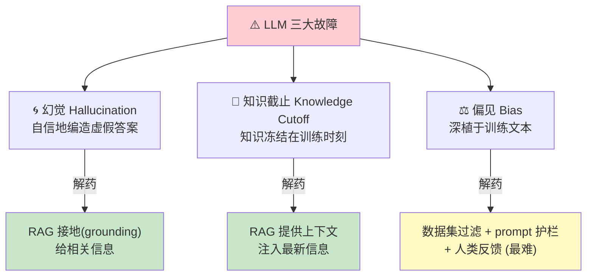

| 故障 | 是什么 | 根因 | 解药 |
|---|---|---|---|
| **幻觉（Hallucination）** | 模型**自信地编造**虚假或荒谬的答案，因为它**统计上看似合理** | 模型本质是"猜下一个最可能的 token"，记不清就编 | **RAG 接地（grounding）**——给它相关信息 |
| **知识截止（Knowledge cutoff）** | 模型知识是**静态的**，冻结在训练数据收集的时刻（"我只有到 2023 年 4 月的知识"） | 训练是一次性的快照 | **用 RAG 提供足够上下文**，注入最新信息 |
| **偏见（Bias）** | 输出带有偏见 | **最难的问题**——偏见深植于训练用的 PB 级人类文本里 | **数据集过滤 + prompt 护栏 + 人类反馈**共同管理 |

> ⚠️ **常见坑｜RAG 不是幻觉的银弹**
> RAG 能大幅**降低**幻觉，但不能**根除**。如果检索到的文档本身是错的、或模型**忽略给定材料自己发挥**，照样会幻觉。所以生产系统还要加：**引用/溯源（让模型标注答案来自哪段材料）、事实校验、以及对"检索为空"的兜底**（宁可答"我不知道"也别编）。偏见问题更棘手，光靠 prompt 护栏治标不治本，需要数据层面的治理 + 人类反馈（RLHF）。

---

## 📌 本章小结

作者的收尾一针见血：

> **"LLMs are not magic; they are probabilistic compute engines bound by rigid resource constraints."**
> （LLM 不是魔法；它们是**受刚性资源约束的概率计算引擎**。）

**每个架构决策都要权衡三对依赖：**

| 维度 | 由什么决定 |
|---|---|
| **成本（Cost）** | **输入 token 量** + 模型大小 |
| **延迟（Latency）** | **输出 token 量** + 检索开销 |
| **质量（Quality）** | 上下文窗口用量 + 模型推理能力（尺寸） |

**"不可能三角"——你的优先级决定你放弃什么：**

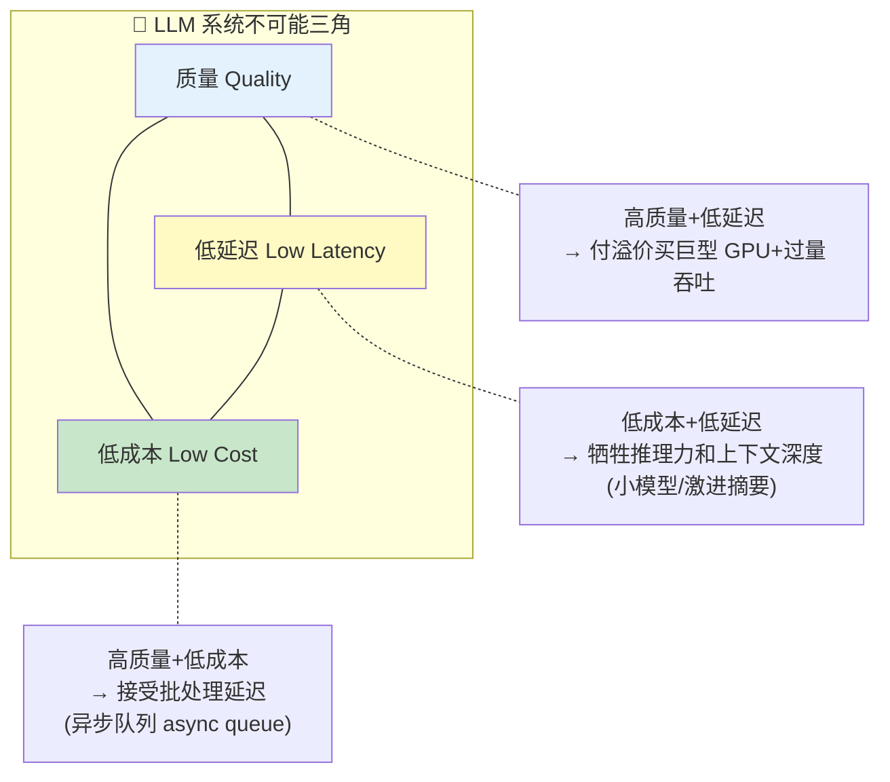

三种典型取舍（书里原话）：
- **高质量 + 低延迟** → 要付溢价买**巨型 GPU 和过量吞吐**；
- **低成本 + 低延迟** → 要牺牲**推理能力和上下文深度**（小模型、激进摘要）；
- **高质量 + 低成本** → 可以接受**批处理延迟**（异步队列）。

> **"AI 工程的魔法不在提示词，而在管理这些约束。"** 本书余下部分讲的都是**克服这个三角的模式**：用 **RAG 换取无限上下文**、用**缓存换取低延迟**……

**认全了元素（本章），接下来就是学怎么把它们装配成分子（后续章节）。**

一句话记住全章：**Token 定成本与上限，Embedding 定语义检索，Prompt/RAG/上下文工程/Agent 是四级能力阶梯，temperature 是确定性旋钮，四维（上下文/延迟/隐私/成本）权衡是选型铁律，三大故障（幻觉/知识截止/偏见）用 RAG + 护栏 + 人类反馈治。**

---

## 🔗 延伸阅读

**本书内（后续章节将展开的模式）：**
- **缓存（Caching）** —— 兑现本章"预计算/缓存 prompt 降成本、降延迟"的承诺；
- **RAG 高级模式** —— 从朴素 RAG → 重排（re-ranking）→ GraphRAG 的工程化；
- **评估与可观测性（Eval & Observability）** —— 把 §11 的 golden set / LLM-as-a-Judge 做成 CI；
- **多 Agent 编排** —— 把 §8 的 ReAct 循环扩展到多智能体协作，附加护栏与追踪。

**本仓库既有教程（把本章概念落到系统实现）：**
- `llm-inference/` —— 推理引擎深潜：`KV-Cache优化.md`（对应本章"输入并行/输出串行"的底层优化）、`PD分离.md`（Prefill/Decode 分离，直接对应 TTFT vs TPS 的两阶段）、`Flash-Decoding.md`、`Mooncake.md`（缓存驱动的推理架构）；
- `ai-infra-architecture/`（若有）—— 数据合规、GPU 资源管理、吞吐/延迟工程的基础设施视角；
- `llm-interview/` —— 本章各处 💡面试高频框可对照仓库面试题库刷题（选型四维、temperature、RAG vs 微调、Agent vs 应用）。

**姊妹知识库（本机 brain vault / 其它库）：**
- `Desktop/worldmodel/` —— 世界模型库，可对照本章"模态（尤其空间 spatial 模态）"深入；
- `Desktop/RL/Curriculum/` 的 RLHF 模块 —— 对应本章"偏见用人类反馈管理"的 RLHF 实现细节。
