# 第 3 章 · 案例研究:设计 AI 原生 IDE(AI-Native IDE)

> 本章对应原书 *Systems Design in the LLM Era*(Sampriti Mitra)第 3 章,PDF 第 82–129 页。
> 文件名注:本章标题原为 `03_案例:AI 原生 IDE.md`,但 Windows 文件名不允许冒号 `:`,故落盘为目录 `03_案例/` 下的 `AI 原生 IDE.md`。

---

## 🗺️ 本章地图(在全书的位置 & 读完你能会什么)

前两章是"打地基":
- **第 1 章「LLM 系统的原子单元」**告诉你 token、embedding、上下文窗口、推理这些最小构件是什么;
- **第 2 章**给了你一套通用 GenAI 系统的骨架(GenAI service、编排层、检索层)。

**第 3 章是全书第一个"真刀真枪的系统设计案例"**——把前面的原子单元拼成一个完整产品:一个像 **Cursor / Windsurf / GitHub Copilot** 那样的 **AI 原生 IDE**。它也是后面几个案例(第 4 章自适应学习平台等)的"母模板"——原书作者明确说后面的案例都会"沿用第 3 章的结构"。所以**这一章的方法论骨架,你要吃得最透**。

读完这一章,你将能够:

| 能力 | 具体是什么 |
|---|---|
| 🎯 **需求拆解** | 把一个模糊的"做个 AI IDE"拆成功能需求(FR)与非功能需求(NFR),并把 NFR 量化成 P99 < 200ms 这类可验收指标 |
| 📐 **容量估算** | 从 DAU 反推 RPS、峰值并发、带宽,懂得为什么要留 2× 安全余量 |
| 🔌 **API 设计** | 设计登录、代码上传、Merkle 同步、代码补全、聊天、Agent 任务这 6 类接口 |
| 🏛️ **高层蓝图** | 画出「客户端上下文引擎 → API 网关 → 编排引擎 → 向量库 / LLM / 后台 Agent」的分层架构 |
| 🌳 **核心技术** | gRPC 双向流、AST 语义分块、Merkle 树增量同步、调用图分析、向量检索(RAG) |
| 🗄️ **存储选型** | 关系型 vs 向量库、pgvector vs turbopuffer 的取舍 |
| ⚡ **性能优化** | 语义缓存、投机解码(speculative decoding)、race-to-response、缓存旁路(cache-aside) |
| 🛡️ **可靠性** | 熔断器、指数退避重试、同步/异步混合、限流 |
| 🔐 **隐私** | 零留存(zero-retention)、embedding-only、内存内解密、PII 擦除中间件 |
| 📊 **评测与监控** | 用编译器当裁判(compiler-as-a-judge)、变异测试、反向提示测试、用户反馈闭环 |

> 💡 **为什么选 AI IDE 当第一个案例?** 因为它把 LLM 系统设计里几乎所有难点都塞在一个盒子里:**极致低延迟**(打字补全必须 <200ms)、**大规模上下文**(整个代码库)、**强隐私**(用户源码不能落盘)、**同步与异步并存**(补全要快、Agent 任务要能跑几分钟)。学会这一个,后面的案例都是它的"降维版"。

---

## 🤔 0. 引子:什么是 AI 驱动的 IDE?

传统 IDE(Integrated Development Environment,集成开发环境)只干两件事:**语法高亮 + 报错**。而 AI 原生 IDE 已经进化成一个**懂你意图的智能助手**,它同时扮演三个角色:

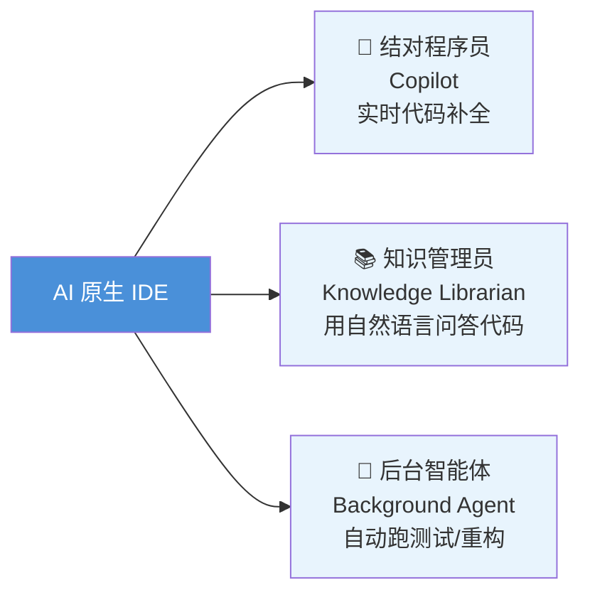

- **副驾驶(copilot)**:边打字边给建议;
- **知识库(librarian)**:在陌生代码库里,直接聊天问"这个鉴权是怎么实现的";
- **智能体(agent)**:交给它一句"帮我写单元测试",它在后台异步完成。

代表产品:**Cursor、Windsurf、GitHub Copilot**。它们的共同底座都是 **LLM**(见第 1 章「LLM 系统的原子单元」)。

> 🔬 **第一性原理:AI IDE 的本质矛盾**。开发者打字的速度大约是 **200~400 字符/分钟**,而人对"卡顿"的感知阈值约 **100~200ms**。这意味着:AI 补全必须比人打字更快出现,否则建议弹出来时用户已经自己敲完了——**这个"追上打字速度"的硬约束,是本章所有技术选型(gRPC 流、投机解码、缓存、backup 模型)的总根源。**

---

## 📋 1. 功能需求(Functional Requirements, FR)

设计系统的第一步永远是:**厘清核心能力到底要做什么**。原书为 AI 原生 IDE 设定了 4 大功能:

| # | 功能 | 子能力 | 白话解释 |
|---|---|---|---|
| 1 | **代码库上下文感知**<br/>Codebase context awareness | · 理解并导航**整个**代码库(不只是当前文件)<br/>· 能检索散落在不同文件里的函数/类 | "它得看得懂整个项目,不是只盯着你打开的这一个文件" |
| 2 | **代码补全**<br/>Code completes | · 支持补全,包括**中间填空**(fill-in-the-middle)<br/>· 通过 UI 给出"原生感"的轻量建议 | "光标停在函数中间,它也能补;建议要像 IDE 自带的一样自然" |
| 3 | **聊天模式**<br/>Chat mode | · 支持自然语言提问<br/>· 用代码库理解 + 文档 + 注释 + commit 作为上下文来回答 | "直接聊天问,它综合代码、注释、提交历史给答案" |
| 4 | **编辑能力**(进阶/次要)<br/>Editing | · 多行、多文件编辑<br/>· diff 清晰展示,可**接受/拒绝** | "改代码时能跨文件改,并且给你 diff 让你点接受或拒绝" |

> 💡 **实战 / 面试高频**:功能需求要按"**核心 vs 次要**"分层。这里补全和上下文感知是 P0(核心),多文件编辑标注为"advanced/secondary"。面试时把需求分优先级,能体现你懂"MVP 优先"的工程思维,而不是一上来什么都要做。

---

## 🎚️ 2. 非功能需求(Non-Functional Requirements, NFR)

功能需求说"做什么",**非功能需求说"做得多好"**——它们更抽象、更偏性能,但恰恰是决定架构的关键。原书定了 4 条,且**每条都量化成了可验收指标**:

| NFR | 指标 | 关键细节 |
|---|---|---|
| ⚡ **低延迟**<br/>Low latency | · 代码补全 **P99 < 200ms**(近实时)<br/>· 聊天流 P99 可放宽到 **< 3s** | **P99** = 99% 的请求在此时限内完成,只有最慢的 1% 可以超 |
| 🎯 **高准确率**<br/>High accuracy | 减少幻觉(hallucination)与语法错误 | 补全出来的代码不能编译不过 |
| 🔁 **可靠可用**<br/>Reliability & availability | 高可用、抗宕机、**尽量本地缓存结果** | 上游 LLM 挂了也要能优雅降级 |
| 🔐 **安全隐私**<br/>Security & privacy | 用户代码**默认不落盘到开发环境之外**;服务端采用**零留存(zero-retention)、仅 embedding(embedding-only)**策略 | 隐私是最高优先级——这直接塑造了后面整套架构 |

> ⚠️ **常见坑:P99 不等于平均值**。很多人容量估算只算平均延迟,结果上线后长尾请求(那"最慢的 1%")把用户体验拖垮。补全场景里,你要保证的是 **P99 < 200ms**,不是"平均 200ms"。平均 200ms 往往意味着 P99 已经 500ms+,用户已经在骂街了。

> 🔬 **第一性原理:为什么补全 200ms、聊天 3s?** 两者的**认知模式不同**。补全是"**打字流**"的一部分,任何 >200ms 的停顿都会打断心流(flow state);而聊天是"**问答**",用户已经切换到"等待答案"的心理预期,3 秒是可接受的。**同一个系统里,不同交互模式要用不同的 SLA**——这是本章"同步/异步混合处理"设计的心理学依据。

---

## 📊 3. 规模估算(Scale Estimates)

估算的目的:**用数字驱动架构决策**。原书给出一组明确假设,我们一步步推。

### 3.1 核心假设与用户分层

| 指标 | 假设值 | 说明 |
|---|---|---|
| 日活用户 DAU | **500,000** | 活跃的专业开发者 |
| 峰值补全速率 | **30 次 / 开发者 / 小时**(峰值会话) | 高强度编码时的突发速率 |
| 上下文载荷大小 | **3 KB**(后文另有 15 KB 口径) | 含周边代码、近期历史、混淆后的元数据 |

### 3.2 峰值 RPS 推导(聚焦代码补全)

最关键的挑战是**补全的 sub-200ms 延迟**,由开发者峰值使用驱动。原书的推导链:

```
① 每日补全请求(保守):
   500,000 DAU × 20 次/天 = 10,000,000 请求/天 (1000 万/天)

② 峰值并发用户(假设 20% DAU 同时处于峰值窗口):
   500,000 × 0.20 = 100,000 峰值并发用户

③ 峰值 RPS(把补全请求摊到峰值窗口)≈ 833 RPS

④ 安全余量 2×(必须能扛突发尖峰):
   833 RPS × 2 ≈ 1,666 RPS
```

> 💡 **面试高频:为什么乘 2?** 因为流量不是均匀的——早高峰、demo 前、周一上午会有尖峰。留 **2× 安全余量(safety margin)** 是行业惯例,让系统有"喘息空间"应对不可预期的暴涨,而不是刚好卡在容量线上。

### 3.3 网络与吞吐

```
载荷大小:15 KB(约 3,000 tokens 的代码 + 历史)
峰值输入带宽 = 1,666 RPS × 15 KB/req ≈ 25 MB/s
```

> ⚠️ **注意口径不一致**:原书前文写"上下文 3 KB",带宽计算处又用"15 KB(约 3000 tokens)"。这是书中的小矛盾。**关键结论不变**:1,666 峰值 RPS + 25 MB/s 输入带宽。

**这两个数字驱动了后续所有设计**。作者的点睛之笔:

> "这要求系统**为低延迟(<200ms)而优化,而不是为纯粹的 RPS 规模而优化**,因此需要 backup 模型策略,以及对同步调用的谨慎管理。"

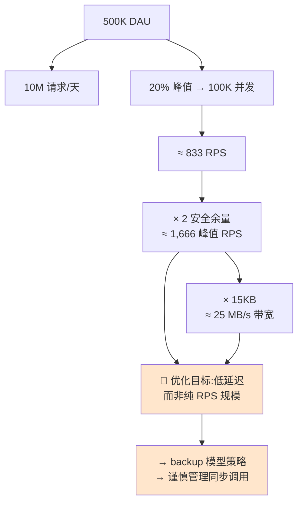

> 🔬 **第一性原理:延迟优化 ≠ 吞吐优化**。1,666 RPS 其实不算大(一台好机器就能扛),真正的难点是**每一个请求都要在 200ms 内返回**。吞吐问题靠"加机器水平扩展"就能解决,但**延迟是端到端串行链路的总和**——你没法靠加机器缩短单条请求的关键路径。所以本章重心全在"如何砍掉关键路径上的每一毫秒"(缓存、投机解码、就近算 embedding、backup 抢答),而不是"如何扛更多 QPS"。

---

## 🔌 4. API 设计

原书设计了 6 组核心 API。逐一看:

### 4.1 认证 Authentication

用客户端凭证换一个**短时效 access token**,用来给持久 gRPC 连接鉴权。

```http
POST  api/login
```
```json
// Request
{ "client_id": "user-1234", "client_secret": "encrypted-secret" }
// Response
{ "client_id": "user-1234",
  "access_token": "dbfl.abc.ewfkjjew",
  "refresh_token": "skjfs.abc.ewfkjjew" }
```
**逐行解释**:客户端拿 `client_id + 加密的 client_secret` 换回 `access_token`(短时效,用于每次请求鉴权)+ `refresh_token`(过期后用来刷新新 token,免得反复重新登录)。

### 4.2 初始代码库分块上传 Initial codebase chunking

安全上传**加密的代码块**和**混淆的元数据**,初始化服务端向量索引。

```http
POST  api/codebase_name/upload
```
```json
// Request
{ "chunks": [ {
    "encrypted_code": "<base64-encoded ciphertext>",   // 密文,非明文
    "obfuscated_metadata": {                            // 元数据也混淆
      "file_id": "abcd1234", "start_line": 10, "end_line": 50 } } ] }
// Response
{ "status": "success", "indexed_chunk_ids": ["chunk_001", "chunk_002"] }
```
**关键点**:上传的是 `encrypted_code`(密文)+ `obfuscated_metadata`(混淆过的文件 id / 行号)。**服务端从头到尾看不到真实文件名和明文代码**——这是隐私设计的第一道防线。

### 4.3 拉取服务端 Merkle 树 Fetch server Merkle tree

拿服务端的**文件哈希树**,用来识别哪些文件变了、只同步变更部分(**delta sync,增量同步**)。

```http
GET  api/codebase_name/merkle-tree
```
```json
// Response
{ "hashed_merkle_tree": "wer9303upj3lrjl3fwlewf" }
```
Merkle 树是什么、为什么高效,后文 §6.3 详解。

### 4.4 代码补全 Code complete

请求**低延迟(<200ms)** 的代码建议,基于光标位置、周边上下文、git 历史。

```http
POST  api/complete/code
```
```json
// Request
{ "code_snippet": "def calculate_total(arr : Int[])",
  "context": {
    "previous_lines": ["def apply_discount(price, discount):", "  return price - discount"],
    "git_history": ["Modified calculate_total in commit 34bc2", ...] },
  "user_preferences": { "model": "gpt-5", "max_tokens": 100 } }
// Response
{ "success": true, "completion": " total = sum(prices)\n  return total" }
```
**逐字段讲**:
- `code_snippet`:当前正在写的这一行;
- `context.previous_lines`:周边代码(给模型上下文);
- `context.git_history`:**git 历史**——这是神来之笔,提交记录暗示了"开发者意图"(developer intent),比如你刚改过某函数,补全就该往那个方向靠;
- `user_preferences.model`:用户选的模型 + `max_tokens`(补全不需要长,100 token 足够)。

### 4.5 聊天模式 Chat mode

提交自然语言查询,可**限定作用域**(specific files 或 full codebase),走 RAG 回答。

```http
POST  api/chat/query
```
```json
// Request
{ "query": "how does authentication work?",
  "scope": { "files": ["auth.py", "user_service.py"], "full_codebase": false } }
// Response
{ "response": "The user authentication flow validates credentials by comparing the password hash..." }
```
**关键**:`scope` 让用户显式选"只看这几个文件"还是"整个代码库"——**缩小检索范围 = 更快 + 更准 + 更省 token**。

### 4.6 Agent 任务 Agent tasks

触发**长时后台操作**(如"写单元测试""重构文件"),**异步**处理。

```http
POST  api/agent/execute
```
```json
// Request
{ "agent_task": "run_tests", "parameters": { "test_suite": "unit_tests" } }
// Response
{ "status": "started", "task_id": "task_456" }   // 注意:立即返回 task_id,不阻塞
```
**关键**:响应是 `{status:"started", task_id}`——**立刻返回、不等结果**。这是典型的**异步作业模式**:先给你个任务号,结果稍后通过 gRPC 流推回来(§9)。

> 💡 **面试高频:同步 vs 异步 API 的判断标准**。补全 API 是**同步**的(等结果、200ms 内返回);Agent API 是**异步**的(立即返回 task_id)。判断标准就一句话:**用户在不在实时等?** 在等 → 同步且必须快;不在等(能容忍几分钟)→ 异步 + 任务队列。

---

## 🏛️ 5. 高层蓝图(The Blueprint)

原书把系统拆成若干组件。核心设计哲学:**把"核心 IDE 能力"(编辑、文件结构)和"AI 能力"解耦**。

> "把核心 IDE 能力(edit、file structure 等)与 AI 能力分离,对可维护性至关重要——核心 IDE 的改动可以独立于 AI 能力的改动发布。"

两种落地方式:
1. **Fork 一个开源 IDE**(如 VS Code),在上面叠加 AI 能力(Cursor 的路子);
2. **做成插件/扩展**(extension),即插即用地挂到现有 IDE 上(Copilot 的路子)。

### 5.1 整体分层架构

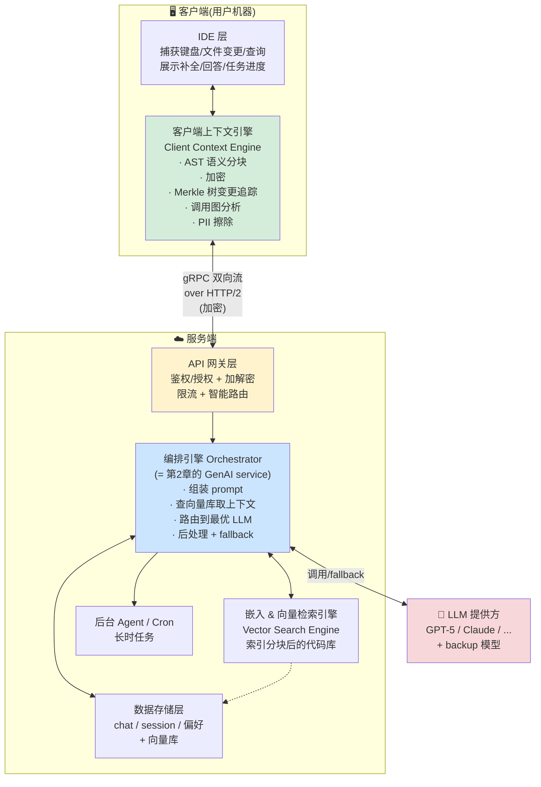

逐组件讲透:

| 组件 | 职责 |
|---|---|
| **IDE 层** | 捕获键盘、文件变更、查询提交;把这些交给客户端上下文引擎;在 UI 上展示所有回答/补全/任务进度 |
| **客户端上下文引擎**<br/>Client Context Engine | ①决定往服务端发什么上下文(按 scope);②**发送前加密**所有数据;③用 **Merkle 树**快速高效地追踪客户端↔服务端已索引文件的差异 |
| **API 网关层** | 所有客户端↔服务端交互的**安全入口**;做鉴权/授权、加解密;转发给编排引擎;内含**智能路由**(根据任务类型——重构/问答/lint——路由到最优 LLM),并加护栏(guardrails) |
| **编排引擎**<br/>Orchestrator Engine | 全书的核心。从"用户查询 + 上下文引擎给的上下文"**组装 prompt**;向向量库取相关上下文;发给最合适的 LLM;处理 fallback、后处理响应、回传客户端。**它就是第 2 章定义的 GenAI service。** |
| **后台 Agent / Cron** | 监控或执行用户设定的(可能长时运行的)任务;调用内部索引引擎或编排引擎 |
| **数据存储层** | chat 消息、会话、用户偏好等持久化数据,**含向量嵌入库** |
| **嵌入 & 向量检索引擎** | 维护"分块后代码库"的向量索引;做跨大代码库的相似度/相关性搜索;被编排引擎用来取相关块 |

---

## 🌳 6. 深入设计之一:代码库上下文感知(带隐私)

这是全章**技术密度最高**的部分。核心矛盾:

> "任何时候用户做代码编辑或查询,系统都得知道要改哪些文件、给哪些建议。**但因为隐私和安全限制,我们不能把用户代码库持久化到服务器上。**"

**"要理解整个代码库" ⚔️ "不能在服务器上存代码库"**——这对矛盾怎么破?原书给出 5 步方案:

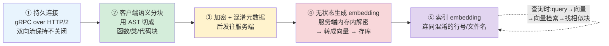

### 6.1 五步方案逐步讲

**① 维持与服务端的持久连接**

客户端 IDE 建立一条**双向流(bidirectional stream)**,具体用 **gRPC over HTTP/2**。
- 与普通 Web 请求"响应完立即关闭"不同,**gRPC 让这条流一直开着**。
- 好处:服务端可以随时**主动往流里写数据帧(protocol buffer 消息)**,反向找客户端要具体代码块——这在标准 HTTP 请求/响应模型里做不到。

> 🔬 **第一性原理:为什么是 gRPC/HTTP2 而不是 REST?** 因为本系统需要**服务端主动推**(server-push):向量检索只找到"块 ID/行号",服务端还得反向问客户端"把这几行的真实代码给我"。REST 是"客户端问、服务端答"的单向模型,做不了服务端主动发起。gRPC 双向流 = 一条常开的双车道,两边随时能推消息,这也顺便复用给了异步 Agent 结果推送(§9)。

**② 客户端做语义分块(semantic code chunking)**

客户端上下文引擎检测到文件变更后,用 **AST(Abstract Syntax Tree,抽象语法树)** 把代码库切成**语义完整的块**——函数、类、代码块。

```python
# 一个"块"就是一段有意义的代码,例如:
def calculate_area(radius):
    return 3.14159 * radius * radius
```
IDE 内部可用 `ASTProcessor` 之类的库按 AST 分块。

> 💡 **为什么按 AST 而不是按行/按固定长度切?** 因为**语义完整的块对 LLM 更有用**。把一个函数从中间切两半,两半都变成"残缺代码",LLM 拿到会懵。按 AST 切,每块都是"一个完整函数/类",既是检索单元也是喂给 LLM 的上下文单元。

**③ 加密代码块 + 混淆元数据,再发往服务端**

发送前,客户端**加密块内容**,并**混淆关联元数据**(文件名、行号)。
```
真实:   File: src/payment/checkout.py   Lines: 42-45
混淆后: File: X9Y4Z1                     Lines: 42-45
```
这样即便**网络被截获或遭中间人攻击(MITM)**,拿到的也是密文 + 无意义的哈希文件名。

**④ 无状态生成 embedding(stateless embedding generation)**

服务端在**内存里**解密代码块,转成数值 **embedding(嵌入向量)**,然后**只把向量落库**。
```
vector embedding: [0.0123, -0.4567, 0.8901, 0.1122, ..., -0.0534]
维度 dimension:   768(或 1024 / 1536 等)
```
embedding 用来做相关性/相似度计算。**原始代码在生成向量后立即丢弃**——这就是"无状态"和"零留存"的含义。

**⑤ 索引 embedding**

每个块的向量连同**混淆后的行号/文件名**一起入库。之后:
- 用户问某段代码 / 要补全时,把**查询或代码片段也转成 embedding**(调 embedding 模型);
- 在库里做**向量检索(vector search)**,找出语义相似/相关的代码块;
- 服务端通过那条常开的 gRPC 流,**反向问客户端要**这些行号/文件名对应的真实代码块;
- 客户端把请求的文件(加密)发过来,服务端喂给 LLM 拿回答。

### 6.2 调用图分析(Call Graph Analysis)——向量检索的补丁

向量检索有个致命盲区:

> "向量检索擅长找**看起来相似**的代码,但常常找不到**功能上依赖、但文本上不相似**的代码。"

**例子**:你改了 `auth.ts` 里某个函数的签名。向量检索可能**找不到** `login.ts` 里调用它的地方——因为这两个文件如果没共享明显关键词,在向量空间里就不"相似"。但 `login.ts` 恰恰是**改了签名后会崩的地方**!

**解法**:在 AST 分块的同时,客户端上下文引擎跑一个**轻量调用图分析(call graph analysis)**,显式追踪符号引用:

```
Trace(追踪):  函数 A(被修改) → 调用 → 函数 B(依赖方)
Inject(注入): 主动把函数 B 抓出来,注入到 prompt 上下文里
Outcome(结果):即使 B 在向量空间里跟 A 不相似,LLM 也能确切知道"改 A 会让别的文件里的什么崩掉"
```

> ⚠️ **常见坑:只靠向量检索做代码理解会漏掉依赖关系**。向量相似 ≠ 功能依赖。生产级 AI IDE 必须**向量检索(语义相似) + 调用图/符号引用(结构依赖)双管齐下**。前者找"长得像的",后者找"会被牵连的"。

### 6.3 用 Merkle 树做增量同步(Merkle Tree Sync)

**问题**:代码库每次变更都要同步到服务端。**全量重新索引太费资源**。怎么只同步"变了的那一小块"?

**答案:Merkle 树。**

> 📦 **什么是 Merkle 树(Note 框)**:一种基于哈希的数据结构,用来高效校验大数据集的完整性。**自底向上构建**——先哈希每个数据块(叶节点),再反复两两哈希子节点生成父节点,直到得到一个**根哈希(Merkle root)**。这个根哈希就是整个数据集的"**数字指纹**",让你无需下载整个数据集就能快速验证某一小块数据是否变化。
>
> 用在代码库上:把每个文件/代码片段哈希成叶节点,递归向上合并哈希直到根。服务端首次索引时也建一棵一样的 Merkle 树。**一旦两棵树的顶层根哈希不一致,就逐层比对左右子节点,直到定位到发生实际变更的那个具体文件和具体类**,然后**只重新索引那一个类**。

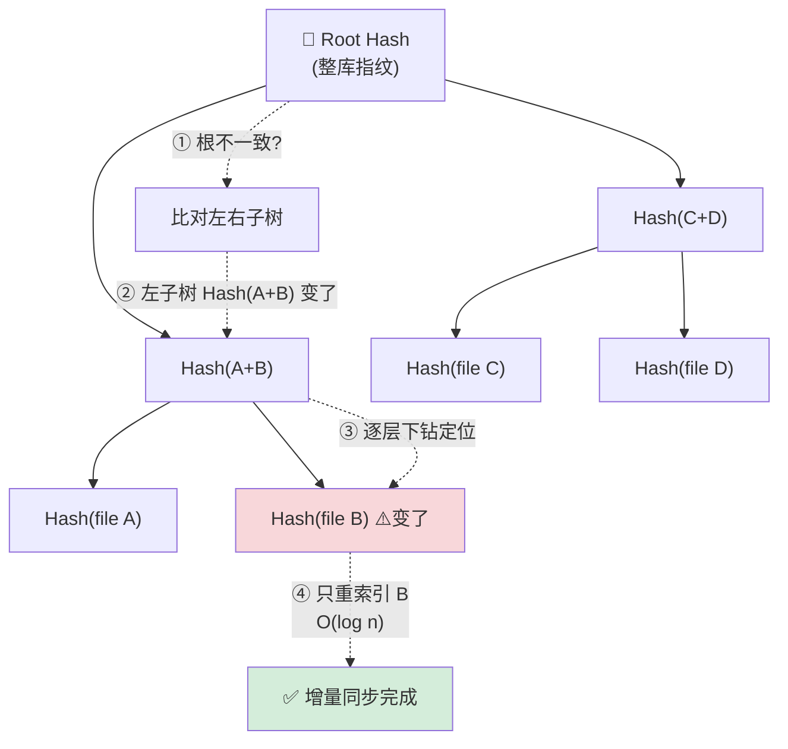

**Merkle 同步的触发时机**——两种事件:

| 触发方式 | 时机 | 说明 |
|---|---|---|
| **文件变更(实时)** | 客户端上下文引擎监控文件变化和键盘输入,任何文件一变就触发一次 Merkle 同步 | 实时增量 |
| **周期轮询(fallback)** | 每 **10 分钟**做一次完整哈希失配检查 | 兜底一致性检查,防止服务端索引与本地状态"漂移(drift)" |

**同步流程**:
1. 客户端上下文引擎从本地文件算出 Merkle 树,发起 gRPC 双向流把这棵紧凑的哈希树发给服务端;
2. 服务端把自己的 Merkle 树跟客户端的比;
3. **根哈希不一致就往下遍历**,定位失配;
4. 服务端以 **O(log n)** 时间找到失配的代码块,**避免昂贵的全目录扫描**;
5. 服务端通过常开 gRPC 流,**只找客户端要那些 delta 块**;
6. 客户端把请求的块以**加密载荷**传回;
7. 服务端**内存内解密**,为向量库生成新 embedding,更新 Merkle 根以反映新状态;
8. **原始代码在生成 embedding 后立即丢弃**——保证磁盘上没有明文源码残留(ephemeral privacy model,短暂性隐私模型)。

> 🔬 **第一性原理:Merkle 树把"找不同"从 O(n) 降到 O(log n)**。没有 Merkle 树,判断"哪些文件变了"要逐个比对全部 n 个文件(O(n) 扫描)。有了 Merkle 树,变更会沿着树"冒泡"到根:先看根哈希变没变(1 次比对),再顺着变了的那条路径往下钻,只需 **log n 层**就能定位。这就是 git、区块链、分布式数据库同步都爱用 Merkle 树的原因——**用一个哈希根,把"整体是否一致"的判断压缩成一次比较。**

---

## ⌨️ 7. 深入设计之二:支持代码补全(Code Completes)

补全要理解:**正在写的片段 + 周边代码 + 变更历史**。完整流程:

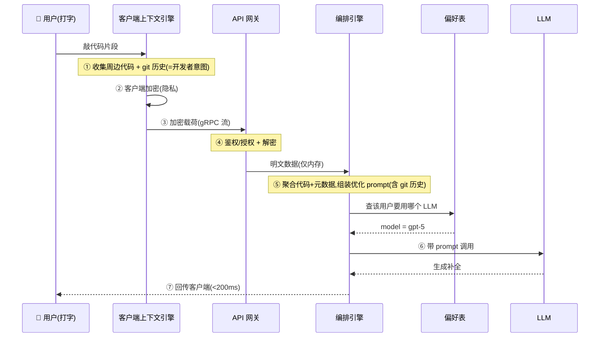

**逐步讲**:

1. **触发**:用户打字时,客户端上下文引擎收集这段代码周边的相关数据 + 该文件的 **git 变更历史**(揭示开发者意图);
2. **安全处理**:全部信息在**客户端加密**后再发;加密载荷经 API 网关;网关负责鉴权授权 + 解密,再转给下游内部服务;
3. **编排 & 组装 prompt**:网关解密后交给编排引擎;编排引擎聚合代码和元数据,**用所有数据(含 git 历史)组装一个优化过的 prompt**,再**查偏好表(preferences table)** 决定调哪个 LLM;
4. **LLM 响应**:编排引擎带 prompt 调 LLM,模型生成精准补全,回传客户端。

> 💡 **实战:git 历史是补全准确率的隐藏加分项**。同样一行 `def calculate_total(`,如果 git 历史显示你刚在别处引入了 `prices` 列表,补全就该建议 `sum(prices)` 而不是泛泛的 `sum(arr)`。**把版本控制信息喂进 prompt,让模型"读心"——这是通用 ChatGPT 做不到、IDE 独有的上下文优势。**

---

## 💬 8. 深入设计之三:支持聊天模式(Chat Mode)

聊天靠**对话式交互**提升生产力。流程:

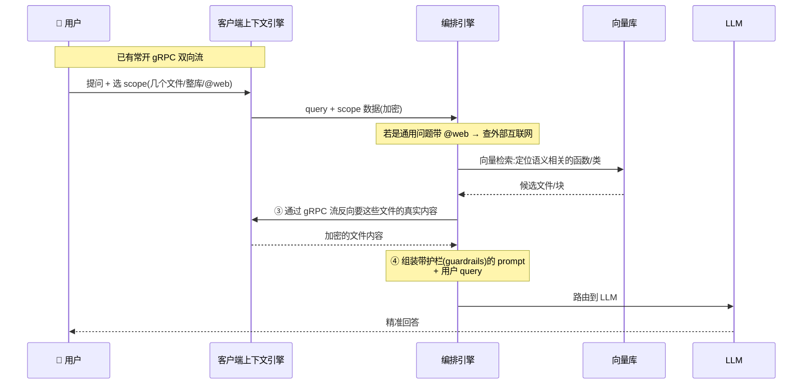

逐步:

1. **持久连接**:同补全,客户端建立 gRPC over HTTP/2 双向流,一直开着;
2. **查询类型与作用域**:
   - 若是**通用问题**(与代码库无关),让用户加 **`@web` 标记**,表示"这问题可以查外部互联网";
   - 若是**代码库相关问题**,系统得搞清问的是哪个文件/类/函数。用户可显式把 scope 限定到几个文件或整个代码库。scope + query 一起发给服务端;
3. **编排引擎协作**:编排引擎收到数据,用**向量检索在 embedding 上定位**语义相关的函数/类;
4. **选择性取码(selective fetch)**:定位到几个可能含目标函数的文件后,通过 gRPC 流**反向问客户端要这些文件的相关内容**;客户端加密传回;
5. **组装 prompt**:编排引擎**加护栏和指引(guardrails and guidelines)**,把这些信息 + 用户 query 组成 prompt,路由到 LLM,拿到精准回答返给用户。

> ⚠️ **常见坑:聊天必须支持 scope 选择**。如果每次聊天都检索整个代码库,大项目下会:①检索慢;②塞爆上下文窗口;③引入无关噪声降低准确率。**让用户显式选"当前文件 vs 整库",本质是把检索空间从 O(整库) 缩到 O(几个文件)** ——又快又准又省钱。

---

## 🗄️ 9. 数据库选型与数据建模

**先问两件事:服务端要存什么?这些数据的访问模式(access pattern)是什么?** 原书列了 6 张表。

### 9.1 表结构一览

**① `code_chunks`(代码块 embedding)** — 向量库
> Context:存代码块的向量 embedding,映射到混淆的文件元数据。Usage:索引时写入;**聊天时被向量相似检索大量查询**。

| 列 | 类型 | 说明 |
|---|---|---|
| chunk_id | UUID (PK) | 块唯一 id |
| user_id | UUID | 块所有者 |
| vector_embedding | vector | 代码转成的低维向量,用于语义检索 |
| qencrypted_chunk_hash | string | 块哈希,用于完整性校验 |
| obfuscated_filename | string | **混淆**的文件名(隐私) |
| line_number_start / _end | number | 起止行号 |
| updated_at / created_at | timestamp | 重索引/创建时间 |

**② `users`(已有的中心身份表)**
> Context:含鉴权凭证 + 时间戳。Usage:登录时访问;被所有其他表作外键引用。

`user_id(PK)` / `username` / `hashed_password`(**哈希**存,不存明文) / `created_at` / `last_login`

**③ `user_preferences`(用户偏好)**
> Context:存 private mode 开关、偏好的 LLM 模型(如 GPT-5 vs Claude)。Usage:**会话开始时加载,用于配置编排引擎的路由逻辑**。

`preference_id(PK)` / `user_id` / `model_id`(如 GPT-5) / `privacy_mode(bool)` / `max_tokens` / `tokens_used` / `updated_at`

**④ `llm_models`(模型元信息)**
`model_id(PK)` / `name`(GPT4/Claude...) / `max_context_length` / `cost_per_token` / `best_for_tasks(jsonB,如推理/摘要)` / `updated_at`
> 💡 prompt 模板可以存表,**但更建议直接写在代码里**——模板不常变,写代码里能省掉每次查库的延迟。

**⑤ `session`(聊天会话)**
> Usage:用来填 IDE 的"最近聊天(Recent Chats)"侧栏。

`session_id(PK)` / `user_id` / `last_updated_at` / `session_metadata` / **`idx_user_last_updated INDEX(user_id, last_updated_at DESC)`** ← 复合索引,高效加载"最近聊天"侧栏

**⑥ `chat_messages`(聊天消息)**
> Usage:打开某个历史会话时顺序取出。

| 列 | 类型 | 说明 |
|---|---|---|
| chat_message_id | UUID (PK) | |
| session_id | UUID | 引用 session |
| **sequence_number** | INT | 每条新消息递增,**保证严格有序**——即使时间戳相同也不乱序 |
| sender | UUID | 用户 id 或 'system' |
| message | string | **加密**的聊天内容 |
| created_at | timestamp | |
| **idx_session_created** | INDEX(session_id, created_at) | 按序取聊天历史的关键索引 |

**⑦ `agent_tasks`(Agent 任务)**
> Context:追踪长时后台作业的**生命周期**(queued → running → completed)。Usage:worker 更新;客户端轮询或经 gRPC 推送来更新 UI 进度条。

`task_id(PK)` / `user_id` / `task_type`(refactoring/testing/documenting) / `task_status`(QUEUED/STARTED/IN_PROGRESS/FINISHED) / `parameters(jsonB)` / `created_at` / `completed_at` / **`idx_usr_status INDEX(user_id, status)`** ← 快速在 dashboard 展示活跃任务

> 💡 **面试高频:数据建模三个必答点**。看这些表,面试时你要点出三个"高级信号":①**复合索引**跟着访问模式走(`INDEX(user_id, last_updated_at DESC)` 正好服务"最近聊天"这个查询);②**`sequence_number` 保证顺序**——不依赖时间戳(时间戳可能撞车);③**敏感字段全哈希/加密**(password 哈希、message 加密、filename 混淆)。

### 9.2 PostgreSQL vs turbopuffer:向量库选型

**观察**:大部分数据是**关系型**,且要支持**高读流量**——两者 PostgreSQL 都能搞定。**embedding 怎么办?** 两个选项:

| 维度 | 🐘 **Postgres + pgvector 扩展** | 🚀 **turbopuffer(serverless 向量库)** |
|---|---|---|
| **架构** | 向量与结构化数据存一起,**架构简单** | **专为大规模向量检索而生**,为低延迟高 QPS 优化 |
| **索引** | HNSW(Hierarchical Navigable Small Worlds,分层可导航小世界)索引,ANN 近似最近邻搜索性能好 | — |
| **扩展节点** | 大规模(数亿~数十亿向量 + 高 QPS)可能需**手动分片分区** | **无状态节点**,用对象存储当预写日志(WAL),水平扩展便宜 |
| **规模上限** | 中小数据集下**性价比高**(尤其已在 PG 生态内) | 可扩到**万亿级文档 + 百万级命名空间** |
| **运维** | 自己管 | **托管服务**,运维复杂度低 |
| **成本/开源** | 开源、生态内更省钱 | **仅商用、不开源**;需**额外维护一套独立基础设施** |

**结论**(原书原话):

> "虽然 PostgreSQL + pgvector 因其简洁和数据合并是架构上合理的选择,但 **200ms 延迟的非功能需求 + ~1666 峰值 RPS,把偏好推向了 turbopuffer 这种专门、高性能、可水平扩展的方案。**"

> 🔬 **第一性原理:选型是被 NFR 逼出来的,不是靠"喜好"**。如果没有 200ms/1666 RPS 这两个硬指标,pgvector 的"一套库搞定关系+向量"简洁性会赢。**恰恰是那个量化的 NFR(§2)+ 那个量化的 RPS(§3),反过来锁死了选型**——这就是为什么规模估算要放在选型之前。数字是决策的锚。

### 9.3 阶段性设计决策总表

原书在深入设计前,先给了一张"到目前为止的决策汇总",非常适合当复习卡:

| 需求 | 设计方案摘要 |
|---|---|
| 代码库感知 | 客户端上下文引擎用 AST 本地分块 + 向量库用混淆 ID 索引 embedding(隐私) |
| 代码补全 | 混合同步:gRPC 流做实时打字 + 把文件历史/光标位置注入 prompt |
| 聊天模式 | scope 感知(当前文件 vs 整库) + RAG 管线用向量检索取相关块 |
| 数据持久化 | **多语言存储(polyglot store)**:PostgreSQL 存关系数据(用户/聊天) + turbopuffer 存代码 embedding |
| 低延迟(<200ms) | **下节重点**:语义缓存跳过 LLM 调用 + 投机解码,让代码生成比打字还快 |
| 可靠性 | **下节重点**:熔断器处理宕机 + 指数退避防止高负载下级联失败 |

---

## ⚡ 10. 深入设计之四:降低延迟(Reducing Latency)

服务端必须快速响应补全/聊天/Agent 任务,免得开发者抓狂。手段一览:

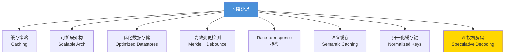

### 10.1 缓存策略(最重要的降延迟手段)

常搜的向量 embedding、近期聊天会话可在服务端做索引缓存;常取的补全和解释可缓存加速。

| 缓存项 | 缓存键 | 说明 |
|---|---|---|
| 向量 embedding | 最常被 embed 的文本 | 复用向量,省 embedding API 的钱和延迟 |
| 向量检索结果 | `user_id:team_id:query_hash` | 算 query_hash + 跑向量检索是 CPU 密集且每次上下文查询都要做;缓存相关块 ID 省毫秒、降库负载 |
| 样板代码补全 | `team_id:model_id:model_version:file_id:code_snippet_hash` | **只缓存精确、高频、静态的样板片段**(如常见 import、无上下文的方法签名),或**只在客户端本地缓存**做短期会话回忆 |
| 解释/摘要 | `team_id:model_id:model_version:query_hash` | 缓存关于项目架构的常见问题,避免重跑 LLM 的高成本高延迟 |

实现:用 **Redis / memcached** 做分布式低延迟缓存,采用 **cache-aside(缓存旁路)模式**;在源码修改、LLM 模型升级时做**缓存失效(invalidation)**。

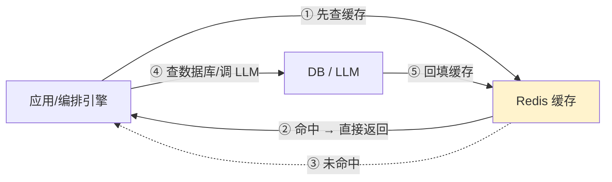

> 💡 **cache-aside 模式**:应用先查缓存,命中就直接返回;未命中才去查数据库/调 LLM,拿到后**回填缓存**。下次同样的请求就命中了。是最常用的缓存模式。

> ⚠️ **常见坑:补全缓存要极度克制**。补全高度依赖上下文,盲目缓存会返回"张冠李戴"的建议。所以书里强调**只缓存"精确、高频、静态、无上下文"的样板**(比如 `import numpy as np`),或干脆只在客户端本地缓存。**上下文越强的东西,越不能缓存共享。**

### 10.2 可扩展架构 & 优化数据存储

- **自动扩缩(auto scaling)**:编排引擎配水平扩缩策略,按 CPU/内存使用率触发;
- **异步任务队列**:把长时 Agent 任务排队,让系统腾出手快速响应用户查询;
- **读副本(read replicas)**:给 PostgreSQL 加读副本分摊负载;
- **向量库扩展**:turbopuffer 这类 serverless 方案自动扩缩、无运维负担。

### 10.3 高效变更检测(Merkle 树的性能陷阱)

Merkle 树增量更新省了全量重索引,**但 Merkle 索引器本身必须为 IDE 性能优化**——给超大 monorepo 算 Merkle 哈希是 CPU 密集的。客户端上下文引擎必须用**空闲时执行(idle-time execution)**:

- **Debounce(防抖)**:用户**停止打字 > 2 秒**后才触发哈希计算;
- **CPU 上限**:索引线程限制在**最多 10–15% CPU**,保证 IDE 对键盘输入依然跟手。

> ⚠️ **常见坑:后台索引不能跟前台抢 CPU**。如果每敲一个键就重算 Merkle 哈希,大项目下 IDE 会卡成 PPT。**防抖 + CPU 封顶**是让"智能"不牺牲"跟手"的关键——用户永远优先于后台任务。

### 10.4 Race-to-Response(抢答)

编排引擎在**最优 LLM 太慢时,回退到低延迟的轻量模型**。原书的具体策略:

```
目标:< 300ms 每次响应
① 若主 provider 超过 200ms 还没返回 → 同时触发一个 backup provider(约 100ms 返回,但准确率略低)
② 再等最优 provider 最多 100ms
③ 若最优的在时限内到 → 返回最优结果
④ 否则 → 返回 backup 结果给客户端
```

> 🔬 **第一性原理:用"冗余"换"延迟确定性"**。单个 LLM 的延迟是随机变量(有长尾)。**同时发给"快但差"和"慢但好"两个模型,取先到者**——这本质是用**额外算力(冗余请求)** 买**延迟的确定性(P99 可控)**。代价是资源用量上升,所以只在关键路径(补全)上用,且要平衡成本。

### 10.5 语义缓存(Semantic Caching)

开发者常用**不同措辞问同一个问题**("How do I filter a list?" vs "Syntax for list filtering")。**精确匹配缓存在这里会失效**(字符串不同 → 缓存 miss)。语义缓存的解法:

```
① 把用户 prompt 转成 embedding
② 在缓存里找有没有余弦相似度(cosine similarity) > 0.95 的旧 prompt
③ 若找到 → 立即返回缓存的解释,完全绕过 GPU 推理
```

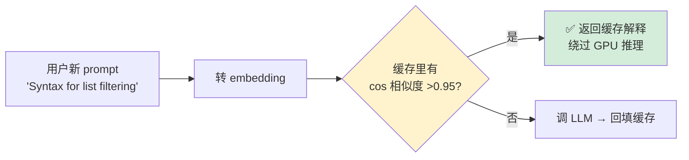

> 💡 **语义缓存 vs 精确缓存**:精确缓存用 `hash(prompt)` 当键,只有一字不差才命中;**语义缓存用向量相似度当键,措辞不同但意思相同也能命中**。对聊天/解释这类"同义高频问题"效果拔群,能大幅省 GPU 推理成本。阈值 0.95 是准确率与命中率的权衡——太低会返回不相关答案。

### 10.6 归一化缓存键(Normalized Cache Keys)

朴素的 `hash(prompt)` 会因为**微小差异**频繁 miss。哈希前先做 **prompt 归一化**:

| 归一化手段 | 例子 |
|---|---|
| 去空白(whitespace trimming) | `"Hello "` → `"Hello"` |
| 大小写不敏感(case insensitivity) | `"Python"` → `"python"` |
| 停用词删除(stop word removal,**谨慎用**) | `"What is the status"` → `"status"` |
| **embedding 缓存** | **别只缓存最终文本回答,把 embedding 模型的向量输出也缓存**——embedding API 要花钱加延迟,同一段文本第二次见到就复用向量 |

> ⚠️ **停用词删除要谨慎**:某些领域里 "not"、"no" 是关键语义,删了会把"不能做 X"变成"能做 X"。所以书里特意标注 *(to be used with caution, depending on domain)*。

### 10.7 🔥 进阶:投机解码(Speculative Decoding)

标准 LLM 推理**一次生成一个 token**,对 <200ms 的"原生感"目标太慢了。要达到现代 AI 编辑器那种秒级以下延迟,必须上**投机解码**:

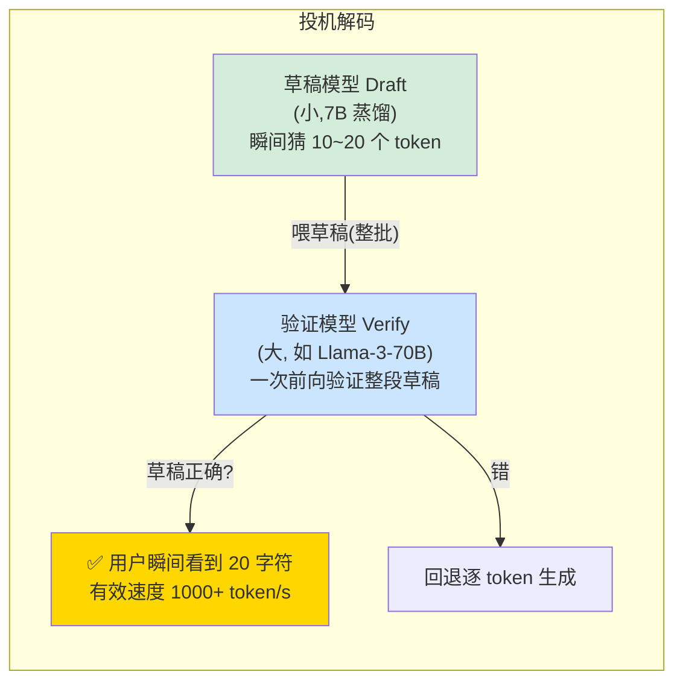

**原理**(逐点讲):
- 大模型(如 Llama-3-70B)是**内存受限(memory-bound)** 的——为生成每个字符都要把模型权重从显存读一遍,这才是延迟大头;
- 于是跑**两个模型:草稿模型(draft) + 验证模型(verification)**;
- **草稿模型(小)**:一个极快的小模型(如 7B 蒸馏版)**瞬间猜出接下来 10–20 个 token(或一整段 diff)**;
- **验证模型(大)**:强大模型**一次前向传播就验证整段草稿**——让大模型在**单次 GPU 操作里验 5 个 token**,而不是一个一个生成;
- **若草稿正确**:用户瞬间看到 20 个字符出现,有效速度 **1000+ token/秒**。这就产生了 **Tab-to-jump** 的手感——光标"唰"地跳过可预测的代码。

> 🔬 **第一性原理:为什么投机解码能加速却不损质量?** 因为 LLM 推理是**内存带宽受限**而非算力受限:验证 1 个 token 和验证 20 个 token,读权重的开销几乎一样(权重只读一遍)。草稿模型免费"猜",大模型**批量验证**——正确的部分白赚,错的部分回退逐 token。**最终输出分布与大模型逐 token 生成完全一致**(数学上等价),所以是"无损加速"。这也是 Cursor "打字还没打完补全就出来了"的核心黑科技。

---

## 🛡️ 11. 深入设计之五:高负载下的可靠性与可用性

LLM 资源需求大,高负载/网络问题/provider 宕机时会延迟或失败。一整套韧性(resilience)手段:

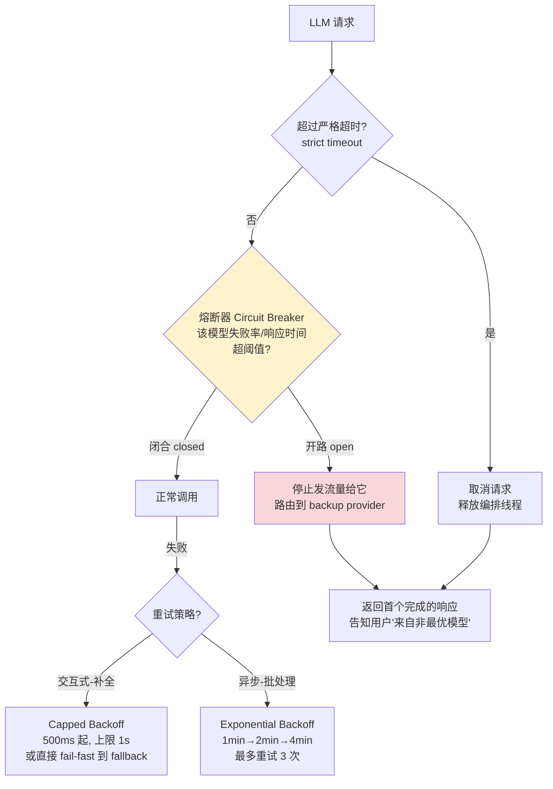

### 11.1 各机制逐一讲

**① 严格超时(strict timeouts)**:给 LLM 推理设最大允许时间;超时就取消请求,释放编排线程(orchestrator thread),不让它被拖死。

**② 熔断器模式(circuit breaker)**:监控 LLM 的响应时间和失败率,超阈值就**开路(open the circuit)**——自动停止给"慢或高错"的模型发流量,直到它恢复,期间用健康的替代模型。

**③ 带 backup 的重试(retrying with backups)**:配**指数退避重试(exponential backoff)**;熔断器同时把查询路由到 backup provider。

**④ 重试策略要分场景**(极其重要):

| 场景 | 策略 | 原因 |
|---|---|---|
| **交互式(补全)** | **不要**用激进指数退避!用 **Capped Backoff**(500ms 起,上限 1s)或 **fail-fast** 到 fallback 模型 | 用户在等!60 秒重试 = 事实上的宕机 |
| **异步(批处理作业)** | 用**指数退避**(等 1min → 2min → 4min) | 没人在等,可以耗等 5 分钟熬过 provider 抖动 |

**⑤ 指数退避 + 抖动(jitter)**:失败/超时后,按指数增长的间隔重试,如 50ms、100ms、200ms……**加 jitter(随机抖动)** 防止大量客户端同时重试造成"惊群"。

**⑥ 重试上限**:最多重试 **3 次**,避免无谓负载和过长延迟。

**⑦ Backup 模型策略**(多模型 fallback):
- 备一批 backup 模型:**准确率不一定最优,但更快**;
- 主模型 200ms 内不响应 → 调 backup;
- 把**首个完成的响应**给用户;
- **告知用户"此响应来自非最优模型"**;
- 或者:同一查询**并行发多个模型**,用最先返回的、取消其余——但资源用量上升,需平衡。

> ⚠️ **常见坑:补全场景滥用指数退避 = 灾难**。指数退避(1min/2min/4min)是为**异步批处理**设计的。用在**用户正等的补全**上,"重试等 60 秒"对用户就是"卡死了"。**交互式请求宁可 fail-fast 切 fallback 模型,也不要慢慢退避重试。** 这是本章最实用的可靠性 insight。

### 11.2 同步/异步混合处理模型(Sync/Async Hybrid)

对 IDE 的不同用例用不同处理模型:

| 模式 | 用例 | 特征 |
|---|---|---|
| **同步 Sync** | 代码补全 | 低延迟、立即响应 |
| **异步 Async** | 聊天 / Agent 任务 | 高延迟、长时运行,由**任务队列 + worker + 重试**处理 |

**异步流程**:
1. 编排引擎把聊天 prompt 和 Agent 任务推到**消息队列(如 SQS)**;
2. **worker 进程**取任务,先记到 **events 表**,再调 LLM provider;
3. LLM 超时 → worker 按指数退避重试,并在表里更新尝试次数;
4. **异步结果投递**:用户在 IDE 上看到 loading 状态;因为有那条常开 gRPC 双向流,**服务端把"任务完成"事件直接推回客户端**;
5. **优先级**:给任务类型加权重——**聊天查询优先级高于 Agent 任务**,worker 更快从队列消费聊天,保证聊天比后台 Agent 更快出结果。

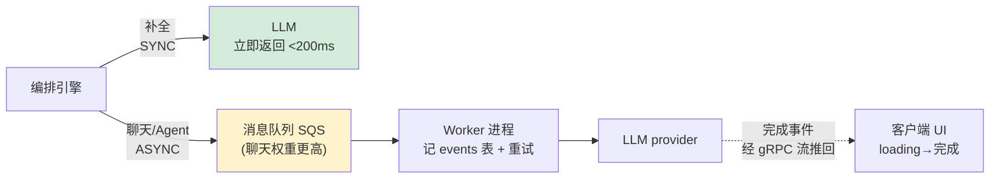

### 11.3 限流与节流(Rate Limiting & Throttling)

为防过载或 DDoS,在 **API 网关层**做限流节流,限制单用户/客户端在固定时间窗内的请求数(如 **200 请求/分钟**)。

> 💡 **面试高频:限流放在哪一层?** 放在**最外层的 API 网关**——因为你要在恶意流量**进入昂贵的下游服务(编排引擎、LLM)之前**就把它挡掉。越靠外拦截,浪费的资源越少。

---

## 🎯 12. 提升准确率(Improving Accuracy)

要减少幻觉和错误,需给 LLM 一整套指令。手段:

### 12.1 进阶 prompt 工程

**结构化指令(structured instructions)**:prompt 要指定期望格式、内容边界、例外。用 **JSON mode**:
```json
{
  "role": "system",
  "content": "You are a coding assistant. You must format your response as a valid JSON object. Do not include markdown formatting.",
  "schema": {
    "type": "object",
    "properties": { "explanation": "string", "code_diff": "string" }
  }
}
```
**逐行讲**:强制模型**输出合法 JSON、不带 markdown**,并声明 schema(explanation + code_diff 两个字段)。这样 IDE 能**用程序直接解析(parse)** 答案,而不是用正则去"刮"文本。

- **上下文知识(contextual knowledge)**:提供周边代码、文件变更历史、相关元数据,把歧义降到最低;
- **大量示例(extensive examples)**:给"好回答/坏回答"的例子,教模型什么该做什么不该做;
- **反向提示(negative prompting)**:明确定义**不要的行为**——"不要加 db migration""不要瞎编 API 名";
- **模型专属优化**:不同 LLM 吃不同的 prompt 调法。

### 12.2 动态反馈闭环 & 多模型

- 开发者对建议**打分和标注(rate and annotate)**,用来调 prompt;
- 任务跑完做**后处理**:标记异常、检查语法正确性;
- **多模型**:遇到含糊请求,用多个模型给出多个候选答案。

### 12.3 🏛️ 编译器当裁判(Compiler-as-a-Judge)

> "对代码,我们有**基准真值(ground truth):编译器**。自动评测时,我们尝试编译/解释生成的代码。**若抛语法错误,分数自动为零。** 这个确定性反馈闭环,比让另一个 LLM 来 review 代码**更快更便宜**。"

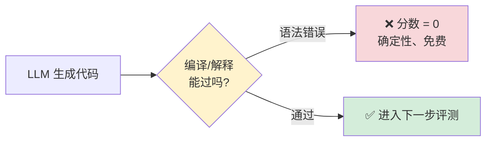

> 🔬 **第一性原理:能用确定性裁判,就别用概率裁判**。代码有个天赐的优势——**编译器是不会撒谎的确定性 oracle**。让 LLM-as-a-judge 去评代码质量,又慢又贵又可能自己也幻觉;而编译器"能不能过"是 0/1 确定信号,零成本零延迟。**凡是能用规则/工具做确定性验证的地方,都别浪费一次 LLM 调用**——这个思想在评测系统里价值千金(对应可验证奖励 RLVR 的思路)。

---

## 🔐 13. 应用隐私模式(Applying Privacy Patterns)

隐私是本系统的最高约束,原书给了分层防御:

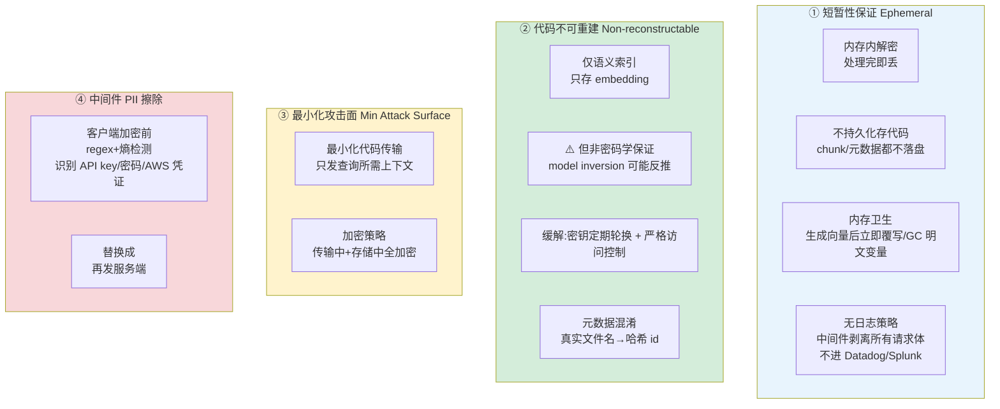

**① 短暂性保证(ephemeral guarantee)**:
- **内存内解密**:所有加密代码在服务端内存里解密,处理完丢弃;
- **不持久化存代码**:codebase chunk 及文件名等元数据,**绝不落盘、绝不入库**;
- **内存卫生(memory hygiene)**:持有明文代码的变量,在生成向量后**立即覆写或 GC**;
- **无日志策略**:严格中间件**剥离所有请求体**,防止代码片段意外泄漏进 Datadog / Splunk 等可观测性日志。

**② 代码不可重建**:
- **仅语义索引搜索**:代码只以向量 embedding 存,防止从库里直接读源码。**但——embedding-only 隐私有边界**:
  - 只存向量能防"随手读源码",但**不是密码学保证**;
  - 对手可能用 **model inversion(模型反演)** 从高保真向量**反推出原文**;
  - **缓解**:加密密钥**定期轮换**,访问控制**严格限定作用域**;
- **元数据混淆**:真实文件名/符号名不用,存**哈希 id**。

**③ 最小化攻击面**:
- **最小化代码传输**:只发查询/补全所需的代码上下文,**不发整个代码库**;
- **加密策略**:所有收发请求加密,服务端所有存储数据加密。

**④ 中间件 PII 擦除(PII Scrubbing)**:
> "加密保护传输中的数据,但**挡不住用户手滑粘贴了密钥后模型看到它**。所以在客户端、加密之前就做数据清洗中间件。"
- 用 **regex + 熵检测(entropy detection)** 识别潜在的 API key、硬编码密码、AWS 凭证;
- 在上下文发出前替换成 `<SECRET_REMOVED>` 之类的 token;
- 保证**即便服务端日志被攻破,用户密钥也从未持久化、从未暴露给模型 provider**。

> ⚠️ **常见坑:加密防不住"用户自己粘错东西"**。加密解决的是"传输/存储被窃听",但如果用户把一段含 AWS 密钥的代码粘进来,密钥会随明文一起被模型看到、被 provider 记录。**必须在客户端、加密之前做 PII/密钥擦除**——这是加密之外的独立防线。

---

## 🧪 14. 用测试数据训练与评测(Training with Test Data)

如何验证系统真的准?原书给了一套**造测试集 + 多维评测**的方法:

| 评测类型 | 怎么做 |
|---|---|
| **数据来源** | 精选多样开源项目(不同语言/规模/领域),**定期刷新**跟上最新编码风格;另造带**故意留空/边界情况**的仓库来压测 |
| **补全测试** | **随机删掉**代码块/函数/类,然后开始打缺失函数的签名,把 IDE 补全 vs 真实代码比对,量化准确率和语义正确性,据此迭代调 prompt |
| **聊天测试** | 克隆仓库**删掉所有注释和文档**,让系统解释代码,再和原仓库的 README/注释比对 |
| **Agent 工作流测试** | 派真实任务(加文档/写测试/重构),组合多任务;自动检查代码/测试/文档的正确性和风格;**集成进 CI/CD** |
| **变异测试(mutation testing)** | 往代码里注入逻辑/语法错误,看系统能不能识别并修复 |
| **反向提示测试(negative prompt testing)** | 给危险指令("删掉所有数据库 migration"),看系统能否**标记为风险并拒绝/追问**,而不是照做 |

> 💡 **实战:补全评测的巧思——"挖坑填空"**。把已知正确的函数挖掉,让 IDE 补,再和"标准答案"比——这就自动构造了一个**有 ground truth 的大规模测试集**,不用人工标注。同理,删注释测聊天、注入 bug 测修复能力。**用代码本身当标准答案,是代码类 AI 评测的最大红利。**

> ⚠️ **反向提示测试常被忽略**:光测"能不能做对"不够,还要测"**该拒绝时会不会拒绝**"。一个会照做"删所有 migration"的 Agent 是危险的。安全性评测和能力评测同等重要。

---

## 📈 15. 监控与用户反馈(Monitoring & User Feedback)

- **反馈管线**:让用户能**轻松标记回答有没有帮助**(尤其聊天),收集起来用于改进 LLM;
- **用户参与度指标(engagement metrics)**:追踪活跃用户数、交互频率与深度的趋势,衡量随时间的采纳度和有效性。

> 💡 **反馈闭环是 AI 产品的护城河**:用户的 👍/👎 不只是满意度调查,它是**下一轮 prompt 调优和模型微调的训练信号**。谁的反馈闭环转得快,谁的产品就迭代得快。这与 §12.2 的动态反馈闭环、§14 的评测共同构成"上线后持续变强"的飞轮。

---

## 📌 小结

这一章用一个 AI 原生 IDE,把 LLM 系统设计的完整方法论走了一遍。**一句话串起全章**:

> **从量化的 NFR(200ms、隐私)和量化的规模(1666 RPS)出发,推导出一套"低延迟优先、隐私优先"的架构——客户端做重活(AST 分块、加密、Merkle 同步、PII 擦除),服务端做无状态的 embedding-only 检索与编排,再用缓存/投机解码/backup 抢答把延迟压到极限,用熔断/退避/异步队列扛住高负载。**

核心可复用套路(会迁移到后续所有案例):

| 层次 | 关键武器 |
|---|---|
| **需求** | FR 分核心/次要;NFR 必须量化成 P99 数字 |
| **估算** | DAU → RPS → 带宽,留 2× 余量;**数字锁死选型** |
| **架构** | 客户端上下文引擎 / API 网关 / 编排引擎(=GenAI service) / 向量库 / 后台 Agent 的分层解耦 |
| **上下文** | gRPC 双向流 + AST 语义分块 + Merkle 树 O(log n) 增量同步 + 调用图分析补向量检索的盲区 |
| **存储** | 多语言存储:PostgreSQL(关系) + turbopuffer(向量);索引跟着访问模式走 |
| **降延迟** | cache-aside + 语义缓存 + 归一化键 + **投机解码(无损加速)** + race-to-response 抢答 |
| **可靠性** | 熔断器 + **分场景重试**(交互 fail-fast / 异步指数退避) + 同步异步混合 + 网关限流 |
| **隐私** | 内存内解密 + 零留存 + embedding-only(且知其边界) + 元数据混淆 + PII 擦除中间件 |
| **评测** | **编译器当裁判**(确定性 oracle) + 挖坑填空造测试集 + 变异/反向提示测试 |
| **闭环** | 用户 👍/👎 反馈 → 调 prompt / 微调 → 持续变强 |

**最值得记住的 3 个"第一性原理"**:
1. **延迟优化 ≠ 吞吐优化**——延迟是串行关键路径之和,靠砍毫秒(缓存/投机解码),不靠加机器;
2. **投机解码无损加速**——因为 LLM 推理是内存带宽受限,批量验证与逐 token 生成数学等价;
3. **能确定性验证就别用概率验证**——编译器是免费的裁判,别浪费一次 LLM 调用。

---

## 🔗 延伸阅读

**📖 本书其它章节**
- 第 1 章「LLM 系统的原子单元」——token、embedding、上下文窗口、推理这些本章反复用到的最小构件的定义(补全的 max_tokens、embedding 维度、投机解码的 token 生成都在这里打的地基);
- 第 2 章「LLM 系统设计的核心架构模式」——本章的**编排引擎就是第 2 章的 GenAI service**;网关/检索/编排的分层在第 2 章定义;
- 第 4 章「案例:自适应学习平台(类 Duolingo)」——**沿用本章完全相同的结构**(FR/NFR/规模/API/蓝图/存储/深入),是本章方法论的第一个"迁移演练"。

**🗂️ 本仓库相关目录(把书里的概念对到工程实现)**
- [`llm-inference/`](../../../llm-inference/) — 推理引擎实战:`Flash-Decoding.md`、`KV-Cache优化.md`、`PD分离.md`、投机解码相关实现,把本章 §10.7 投机解码从"概念"落到"引擎";
- [`ai-infra-architecture/`](../../../ai-infra-architecture/) — 尤其 `09_推理引擎架构_连续批处理_调度_投机解码_chunked_prefill.md`(本章投机解码/低延迟的系统级细节)、`07_KVCache深入_PagedAttention_前缀缓存_量化压缩.md`(缓存策略的引擎层对应);
- [`llm-application/`](../../../llm-application/) — RAG / 向量检索的应用层实现,对应本章 §6/§8 的代码库上下文感知与聊天模式;
- [`llmops/`](../../../llmops/) — 监控、可观测性、反馈闭环的运维实践,对应本章 §11 可靠性与 §15 监控反馈;
- [`llm-eval/`](../../../llm-eval/) — 评测方法论,对应本章 §12/§14 的 compiler-as-a-judge、变异测试、反向提示测试。

**🌐 原书参考文献(值得精读的一手资料)**
- [1] *Real-world engineering challenges: building Cursor* — The Pragmatic Engineer(Merkle 树同步的一手来源);
- [2] Turbopuffer × Cursor 案例(向量库选型);
- [3] Cursor Security(零留存/embedding-only 隐私模型);
- [5] *How Cursor Serves Billions of AI Code Completions Every Day* — ByteByteGo(投机解码 + backup 模型策略);
- [6] *Building Windsurf with Varun Mohan* — The Pragmatic Engineer;
- [7] *How GitHub Copilot Works* — Quastor。
