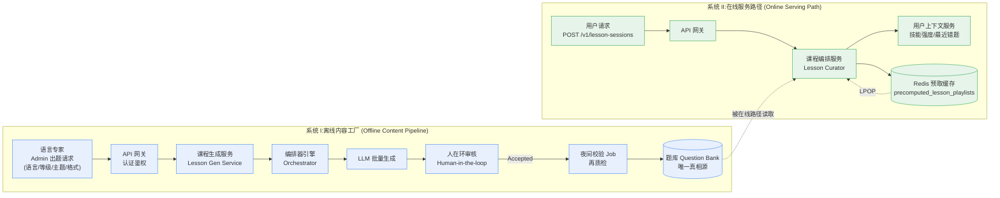
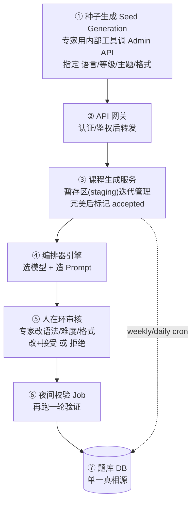
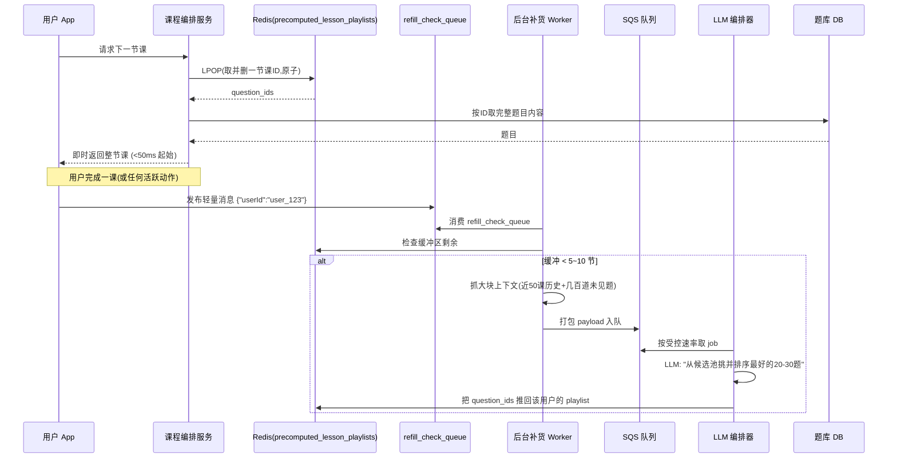
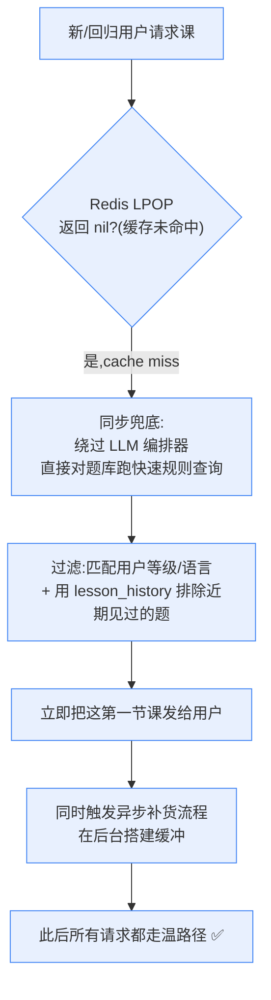
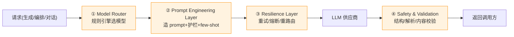
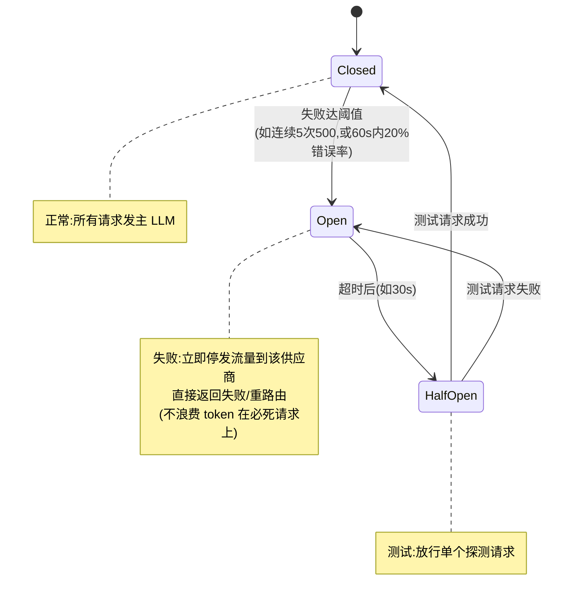
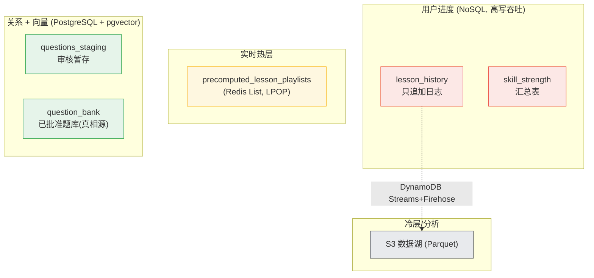
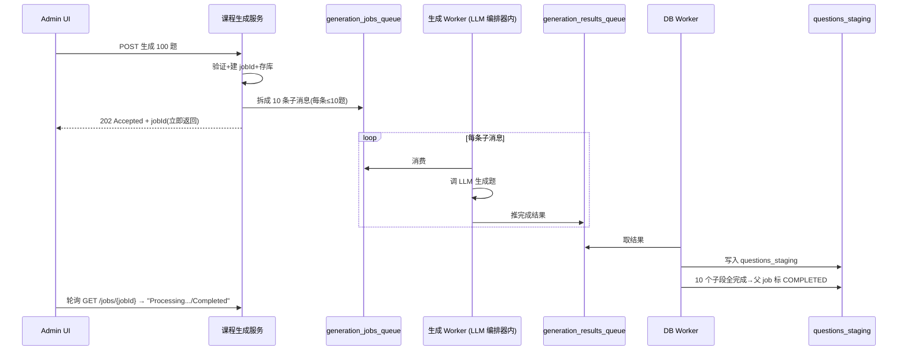

# 第 4 章 · 案例:自适应学习平台(Adaptive Learning Platform)🎓

> 逐章精讲 ·《Systems Design in the LLM Era》(Sampriti Mitra)· 对应原书 PDF 第 130–167 页

---

## 🗺️ 本章地图

这是全书**第二个完整案例研究**(第 3 章讲 AI-Native IDE,像 Cursor;本章讲**自适应语言学习平台**,原型是 Duolingo)。它把第 1、2 章讲过的"原子单元"和"架构模式"落到一个真实产品上,回答一个非常经典的系统设计面试题:

> **"用 LLM 设计一个像 Duolingo 那样、能给 5000 万日活用户自动出题 + 千人千面推题的学习平台。"**

读完这一章你会具备三件"工程内功":

1. **会拆需求、会估算规模**:从 DAU 反推到 350K RPS 峰值,知道每个数字是怎么来的。
2. **会画蓝图 + 建数据模型**:掌握本章的**核心心法——"离线内容工厂" + "在线实时推题"双系统解耦**,以及配套的**主动预取(proactive curation)"温路径/冷路径"模式**,还有多态数据库选型(PostgreSQL / DynamoDB / Redis 各司其职)。
3. **会做深入设计与权衡**:异步任务队列、编排器(model router + resilience layer)、**用 function calling 做确定性判题**、混沌测试、监控告警——以及贯穿全章的一条主线:**个性化系统的取舍(personalization trade-offs)**。

> 🔬 **一句话抓住本章的第一性原理**:LLM 又贵、又慢、又会乱说话(概率性),但它有**规模化创造力**;人类专家慢、贵、但**可信**。本章所有架构决策,本质都是在为这两个矛盾找**解耦点**——把"创造"放到离线让 LLM 放飞、让人兜底质量;把"实时"做成预取缓存让用户零等待、让规则兜底可用性。

---

## 1️⃣ 需求分析 · 我们到底要造什么?

### 1.1 功能需求(Functional Requirements)

一个高效的学习平台核心就一句话:**适配每个用户独特的节奏**。已掌握的概念少花时间,难但不至于劝退的内容多花时间——这对"学习者留存(engagement)"至关重要。同时内容要**频繁更新**,跟上语言的细微变化、根据用户反馈引入新课。

本章聚焦**两个功能域**(其余如详细计分系统显式声明"超出范围",专注 AI 架构本质):

| 功能 | 英文 | 说的是什么 |
|---|---|---|
| **课程生成** | Lesson generation | 为不同语言、不同等级(A1/A2/B1…)批量设计练习和课程,保证**内容源源不断、常新常鲜** |
| **自适应难度的课程编排** | Lesson curation with adaptive difficulty | 看用户过去的答题记录,算出"下一道最合适的题"——不太难、不太易(即所谓 *Goldilocks* 恰到好处区) |

> 💡 **面试高频**:面试官问"LLM 在这个产品里到底用在哪?"标准答案是**两条主线**——(1) **curate**(为用户编排个性化课程序列)、(2) **generate**(生成全新练习)。很多候选人只答出"生成",漏掉"编排",直接暴露对个性化系统理解不深。

### 1.2 非功能需求(Non-Functional Requirements, NFRs)

NFR 决定了架构长什么样。本案例给出 6 条,请**把每条和后面的设计决策一一对应**记忆:

| NFR | 具体指标 | 对应到后面哪个设计 |
|---|---|---|
| **低延迟** Low latency | 从提交答案到拿到反馈/下一题,**P99 < 500 ms** 往返 | Redis 预取缓存(温路径)+ 语义/精确缓存 |
| **高准确** High accuracy | 关乎信任——不能给错答案或烂解释 | 人在环审核 + function calling 判题 + 安全校验层 |
| **高可用** High availability | 单个 LLM 供应商挂了,**不能拖垮整个平台** | 编排器:熔断 + 重试 + 重路由 + 冷路径规则兜底 |
| **高度个性化** Highly personalized | 不太难也不太易,贴合用户 | 用户上下文(技能强度/最近错题) + LLM 排序 |
| **成本有效** Cost effectiveness | LLM API 很贵,得有"何时/何处调用"的策略 | model router 分级模型 + 离线批量 + 缓存 |
| **可扩展** Scalability | 扛住**时区重叠**造成的峰值 | 水平扩容 + 队列削峰 + 读副本 + 多态数据库 |

> ⚠️ **常见坑**:P99 < 500 ms 是"提交答案→下一题"的往返,**不是** LLM 生成的往返。若你天真地"每次都实时调 LLM 出题",单次 LLM 调用轻松几百毫秒到几秒,P99 直接爆表。这正是本章要用**预取缓存**绕开实时 LLM 的根本动机。

---

## 2️⃣ 规模估算 · 数字是怎么算出来的

系统设计的灵魂是"先摸清体量再动手"。本章的数字链条一定要能**自己从头推一遍**:

### 2.1 基础参数

| 参数 | 值 |
|---|---|
| 日活用户 DAU | **5000 万(50M)** |
| 支持语言总数 | 50 种 |
| 最热门语言 | 4 种 |
| 每种语言课程数 | 最热门 250 个 / 最冷门 70 个 |
| 每课题目数 | 最多 10 道 |
| 每用户每天上课数 | 3 节 |

### 2.2 RPS 推导(逐步不跳步)

**第一步:服务课程的基础 RPS**

$$
\text{RPS}_{\text{base}} = \frac{\text{DAU} \times \text{每人每天课数} \times \text{每课题数}}{\text{一天的秒数}} = \frac{50{,}000{,}000 \times 3 \times 10}{60 \times 60 \times 24} \approx 17{,}340 \text{ RPS}
$$

**第二步:每道题最少 3 个核心 API 调用**

1. `GET` 题目内容
2. `POST` 用户答案
3. `GET` 反馈/结果

$$
\text{平均 RPS} = 17\text{K} \times 3 = 51\text{K RPS}
$$

**第三步:峰值系数 5×(时区重叠/晚高峰)**

$$
\text{峰值 RPS} = 51\text{K} \times 5 = 255\text{K RPS}
$$

**第四步:附加负载**

- 会话练习(conversation practice):+20% RPS
- 实时反馈与分析:+15% RPS

$$
\boxed{\text{总峰值负载} \approx 350\text{K RPS}}
$$

> 💡 **面试高频**:考官爱追问"峰值 5× 从哪来?"。答:**时区重叠** + 晚高峰通勤/睡前学习。Duolingo 这类产品用户全球分布,当北美晚高峰和欧洲晚高峰在 UTC 上错峰叠加,峰谷比很容易到 5×。这就是为什么要"可扩展"这条 NFR。

> ⚠️ **常见坑**:很多人算完 17K RPS 就收手了。**真正决定架构的是 350K 峰值和 255K 写入**——后面选 DynamoDB 而不是单机 PostgreSQL 存用户进度、选 Redis 集群做预取,全是被这个数字逼出来的。规模估算不是走过场,是**选型的依据**。

---

## 3️⃣ API 设计 · 两类角色两套接口

平台有**两类使用者**,对应两套 API:

- **Admin(语言专家/内容团队)**:7 个 API,围绕"生成题→审核题→改题"。
- **Curator(面向终端用户)**:1 个 API,"给我一节个性化课"。

### 3.1 Admin 出题与审核 API(7 个)

#### ① 同步出题 `Generate questions (sync)`

**用途**:生成一小批题(如 < 5 道),用于快速测试/低量需求,**不入队**、直接返回。

```http
POST /api/v1/admin/questions
Authorization: Bearer {admin_token}
```
```json
// 请求体 Body
{
  "format" : "fill-in-the-word",
  "count" : 2,
  "level": "A2",
  "language" : "Spanish",
  "topic": "prepositions"
}
```
```json
// 响应 Response
{
  "metadata": {
    "count_requested": 2,
    "count_generated": 2,
    "initial_status": "IN_REVIEW"     // ← 注意:一生成就是"待审"状态
  },
  "questions": [
    {
      "id": "question_137293",
      "text": "El libro está ___ la mesa.",   // 西语:书在桌子___(上)
      "type": "FILL_IN_THE_BLANK",
      "choices": ["en", "sobre", "hacia", "entre", "según"]
    },
    { "id": "question_137294", "text": "Caminamos ___ el parque.", "type": "FILL_IN_THE_BLANK",
      "choices": ["en", "sobre", "hacia", "entre", "según"] }
  ]
}
```
**逐行看点**:
- `format` / `level` / `language` / `topic` 是"**种子(seed)**"——把出题空间约束到 A2 西语介词的填空题。
- 响应里 `initial_status: "IN_REVIEW"` 是灵魂:**AI 生成的东西默认进不了用户面前**,必须先"待审"。这是"人在环"质量闸门的接口层体现。

#### ② 异步出题 `Generate questions (async)`

**用途**:提交批量任务(如 100+ 道)进后台队列,**避免阻塞 Admin UI**。

```http
POST /api/v1/admin/question-generation-jobs
```
```json
// 响应:立即返回 job_id + 轮询地址,不等结果
{
  "job_id": "job_d9e8f7a6",
  "status": "PENDING",
  "message": "Question generation has been queued.",
  "status_check_url": "/api/v1/admin/question-generation-jobs/job_d9e8f7a6"
}
```

#### ③ 查询任务状态 `Retrieve questions status`

```http
GET /api/v1/admin/question-generation-jobs/job_d9e8f7a6
```
```json
// 处理中 → { "status": "PROCESSING", "message": "Generating questions..." }
// 完成时 → { "status": "COMPLETED", "message": "Successfully generated 10 questions.",
//            "results_url": "/api/v1/admin/questions?job_id=job_d9e8f7a6" }
```

#### ④ 取回生成结果 `Retrieve questions`

任务 `COMPLETED` 后拉取最终题目列表(每题带 `question_id / text / type / language / lesson_id / job_id`)。

#### ⑤ 审阅单题 `Review question`

```http
GET /api/v1/questions/{questionId}
```
返回单题**完整元数据 + 内容**,供专家验证(含 `answer`、`status: "IN_REVIEW"`、`level`、`topic`)。

#### ⑥ 批量改状态 `Bulk edit status`

```http
POST /api/v1/questions/batchUpdateStatus
```
```json
{ "question_ids": ["question_1", "question_2"], "status": "ACCEPTED" }
```
专家一键**批准/拒绝多道题**,加速审核流水线。

#### ⑦ 编辑单题 `Edit question`

```http
PATCH /api/questions/question_137293
```
在最终批准前修正 AI 的错误(改题干/选项/难度)。

> 🔬 **第一性原理:为什么同步 + 异步两套出题 API 都要?**
> 这是**延迟 vs 吞吐**的经典分裂。少量题(≤5)用同步——省去队列开销、即时反馈,人机交互爽;大批量(100+)用异步——单次 LLM 调用几秒,100 道题串行就是几分钟,浏览器必然超时,只能"提交即返回 202 + 轮询"。**同一功能因量级不同而选择不同交付模型**,这是本书反复出现的模式,后面数据库、缓存都会再见到。

### 3.2 Curator API(1 个)· 面向用户

#### 生成一节新课 `Generate a new lesson session`

**用途**:创建并返回一节**完整、个性化**的课(10–20 题),贴合用户当前水平与学习历史。

```http
POST /v1/lesson-sessions
```
```json
// 请求
{
  "skill_id": "skill_verb_conjugation_past_tense",   // 技能:动词过去时变位
  "type": "PRACTICE",       // 也可为 TEST / REVIEW 等
  "preferred_question_count": 10
}
```
```json
// 响应
{
  "lesson_session_id": "session_a4b1c2d3",
  "skill_id": "skill_verb_conjugation_past_tense",
  "estimated_duration_seconds": 300,
  "questions": [
    { "question_id": "q_12483240", "type": "MULTIPLE_CHOICE",
      "prompt": "She ___ to the store yesterday.",
      "options": [ {"option_id":"opt_1","text":"go"},
                   {"option_id":"opt_2","text":"went"},
                   {"option_id":"opt_3","text":"gone"} ] },
    { "question_id": "q_43854", "type": "FILL_IN_THE_BLANK",
      "prompt": "We ___ the movie last night." }
  ]
}
```
**看点**:响应里直接带**整节课的题目数组**,而不是一题一题地要——这暗示**服务端已经把整节课预备好了**(预取缓存!),用户拿到就能连答,零等待。

---

## 4️⃣ 蓝图 · 双系统解耦(全章最重要的心法)🏛️

> **核心决策**:在线学习平台里,课程的安全与质量**不可妥协**。让原始 LLM **实时**出题风险极大——可能引入错误、不一致、不当内容。所以:
> - **让 LLM 离线生产内容**,由专家审核放行进"题库";
> - **让系统实时从题库里为每个用户编排**。
> - 这样就把**质量**和**实时服务**两条关注点彻底解耦。

于是整个设计**一分为二**:



> 💡 **这套双系统给你"两全其美"**:AI 的**规模 + 创造力**(离线放飞)、人类的**质量 + 安全**(审核把关)。这就是本章的中心思想,任何变体面试题(设计 AI 教辅、AI 出题系统、AI 内容平台)都能套用。

### 4.1 系统 I:离线内容工厂 · 逐环节拆解

**唯一目标**:往一个中心题库里灌入**大量、高质量、已批准**的教育内容。全程离线,**不碰线上流量**。



**各环节要点**:

| # | 组件 | 职责 | 关键细节 |
|---|---|---|---|
| ① | **种子生成** | 专家指定语言/等级/主题/格式请求一批题 | 约束 LLM 的生成空间 |
| ② | **API 网关** | 认证/鉴权后转发 | 统一入口 |
| ③ | **课程生成服务** | 内容的**暂存区(staging area)**,支持多轮人工迭代 | 完美后标 `accepted`;**每周/每日 cron** 把 accepted 课经 lessons service 灌进题库 |
| ④ | **编排器引擎** | 按请求类型选最优模型,再造 prompt 传给 LLM | 下节详解 |
| ⑤ | **人在环审核** | 专家校验、改错、确保符合平台标准 | 修改并**接受/拒绝** |
| ⑥ | **夜间入库 Job** | 定时把新接受的题**再做一轮质检**后入库 | 双重保险 |
| ⑦ | **题库 Question Bank** | 所有已批准内容的**单一真相源** | 由 lesson service 维护 |

**④ 编排器给 LLM 的 Prompt 示例**(原书原文,值得抄下来体会"约束式提示"):

> Generate 10 lessons for Spanish A2 learners to practice future tense. The sentences should be about food. For each sentence give one answer and three distractors. Tag the question with the correct grammar tag. Output as a JSON array.
>
> (为西语 A2 学习者生成 10 节练习将来时的课。句子围绕"食物"。每句给 1 个正确答案 + 3 个干扰项。给题打上正确的语法标签。以 JSON 数组输出。)

> 🔬 **拆这条 prompt 你能学到 5 个"结构化生成"要素**:①数量(10)②受众(A2)③语法点(future tense)④主题域(food,防止 LLM 天马行空)⑤输出契约(1 正确 + 3 干扰 + 语法标签 + JSON)。**没有第 5 点,下游解析必崩**——这是 LLM 系统里最容易翻车的地方,后面"安全与校验层"专门兜这个。

### 4.2 系统 II:在线服务路径 · 主动预取的精髓

用户 `POST /v1/lesson-sessions` → 网关认证 → **课程编排服务(Lesson Curator)**。编排服务在幕后从**已批准的题库**里取下一节课。

- **取哪节课**?依据用户的**等级、理解、学习进度**动态适配。
- **用户上下文服务(User Context Service)** 维护**用户进度表**:课程完成记录、各类课分数、**已知词汇、强度分(strength score)、最近错题**。

#### ⚡ 为什么必须"主动编排(Proactive Curation)"?

> **我们不可能为每个用户实时跑一次又慢又贵的 LLM 调用。**

若"等用户答完 → 才触发编排服务 → 算下一题",用户等待时间会飙升。解决之道:**异步、批量地提前把课备好**。这就是**温路径 / 冷路径**模式。

---

## 5️⃣ 主动课程编排 · 温路径 vs 冷路径 🔥❄️

### 5.1 温路径(Warm Path):活跃用户,零等待

这是**活跃用户流**——缓存里已经预备好课。



**逐步拆解**(务必能复述):

1. **即时命中缓存**:用户请求课时,编排服务用 **`LPOP`** 从 `precomputed_lesson_playlists`(Redis List)取出题目集,**瞬间**返回。
2. **事件驱动触发**:用户**完成一课**(或任何"用户活跃"信号)时,处理该动作的服务顺手向一个专用低优先级队列 `refill_check_queue` **发布轻量消息** `{ "userId": "user_123" }`。
3. **缓冲检查**:编排服务里的**后台 worker** 消费该队列,检查该用户在 Redis 里的**课程缓冲区**。若快见底(如剩 < 5~10 节),**启动补货流程**。
4. **异步编排**:后台 worker 抓一**大块用户上下文**——近期进度、**最近 50 节课历史**、题库里**几百道未见题**的候选池——打包成 payload,发到 **SQS 队列**。
5. **LLM 编排器**:编排 worker 以**受控速率**(避免打垮自己服务)从队列取 job,拿 payload 命中 LLM,清晰指令:*"基于该用户历史,从候选池里挑并排序出最好的 20-30 题"*。拿回 ID 列表后推进该用户的 `precomputed_lesson_playlists`。
6. **缓存补货**:用户开始下一课时,编排服务直接用**原子 `LPOP`** 从缓存取下一道练习。

**`LPOP` 三条铁律**:
- 单次原子操作里**取出并删除**下一节课 ID;
- 这节课**已用**,不会再从缓存里重复发;
- 服务再从题库取完整内容返回用户。

> 💡 **这个预取缓冲的本质是"生产者-消费者 + 削峰"**:LLM 编排(慢生产者)在后台稳定造课塞进 Redis;用户(快消费者)用 `LPOP` 秒取。缓冲的存在让**后台的分钟级处理延迟对用户完全不可见**。这就是我们前面 P99 < 500 ms 能达成的根本原因——**用户根本没在等 LLM**。

> ⚠️ **常见坑:为什么用 `LPOP` 而不是"读了再删"两步?**
> 两步之间存在**竞态**——同一用户两个并发请求可能读到同一题、发两遍。`LPOP` 的**原子性**从根上杜绝重复发题。面试里能点出"原子操作解决并发重复"是加分项。

### 5.2 冷路径(Cold Path):新用户/回归用户,规则兜底

处理**没有预取缓冲**的用户(新注册、久违回归)。



**逐步**:
1. **缓存未命中**:`LPOP` 返回 `nil`。
2. **同步兜底**:不让用户等后台流程,服务**立刻为这一节课做实时同步编排**。关键——**绕过 LLM 编排器**,直接对题库跑一个**快速、基于规则**的查询:过滤出匹配用户技能等级和语言、且用 `lesson_history` 表**排除最近见过**的题。虽不完美优化,但**更快更可靠**。
3. **服务并触发**:把这第一节课发给用户,**同时**触发异步补货,在后台搭起缓冲,保证后续请求都走温路径。

**这套设计的三重好处**:

| 好处 | 说的是什么 |
|---|---|
| **解耦(Decoupling)** | 个性化引擎和用户动作解耦;LLM 负载被**削平**成稳定可预测的流,而非突发洪峰 |
| **缓冲(Buffering)** | 预取 20-30 个课程 ID 当缓冲,让系统对流水线临时延迟有韧性 |
| **优雅降级(Graceful degradation)** | **若 LLM 供应商挂了或超慢**,直接退化成"取同等级、近 20 课没见过的题",不走编排器 |

> 🔬 **第一性原理:冷路径为什么故意"不用 LLM"?**
> 这是**可用性优先于最优性**的经典取舍。新用户第一课,你对他一无所知,LLM 的"个性化增益"本来就低;此刻更该保证的是**这一课一定能出得来、出得快**。用一条确定性 SQL 兜底,既避免了冷启动时打 LLM 的延迟与失败风险,又能立刻把用户转入温路径。**个性化系统的智慧,一半在于知道"什么时候不需要那么智能"。**

---

## 6️⃣ 编排器引擎 · 可靠性与成本的中枢 🧠

编排器负责为 LLM 造详细 prompt,并根据 **LLM 可用性、响应时间、用例**(要准确?还是要低延迟?)决定发给哪个 LLM。响应经过**安全与校验**后才返回调用方。



### 6.1 Model Router(模型路由)· 省钱的关键

跑一个规则引擎决定"哪个模型最适合这活",**防止用昂贵的强模型干简单活**:

| 规则 | 场景 | 路由到 |
|---|---|---|
| **规则 1(简单任务)** | 简单语法检查? | **小而快、内部自托管**的模型 |
| **规则 2(复杂任务)** | 复杂对话的一部分? | 如 **Gemini 2.5 / Claude** |
| **规则 3(高级功能)** | 付费用户要深度讲解与分析? | **顶级模型**如 GPT-4.0 |

> 💡 **面试高频:成本优化第一招永远是"分级路由"**。别的书叫它 *model cascade* / *LLM router*。核心公式:**把请求按复杂度分桶,让 80% 的简单请求走便宜小模型,只有少数难请求上贵模型**。这一招通常能砍掉 60-80% 的 LLM 账单。本书第 2 章的 "Pattern: the model router" 就是它的通用形态。

### 6.2 Prompt Engineering Layer(提示工程层)

按路由到的具体 LLM + 用户进度上下文造 prompt,包含**指南、护栏、期望的响应格式,以及 few-shot 示例**以确保输出符合预期。

### 6.3 Resilience Layer(韧性层)· 三大机制

编排器依赖第三方 API,它们会遭遇:**瞬时网络故障**、**过载/限流(429)**、**供应商宕机(5xx)**、**高延迟/超时**。三招应对:

#### 🔁 自动重试(Automatic Retries)

初次调用遇**瞬时错误**(429 限流 / 503 不可用)时,自动重提。

- **目的**:无需人工、无需换模型,解决短命小故障。
- **策略——指数退避(exponential backoff)**:不立即重试,而是**指数级增长**等待时间。防止把已经受压的供应商彻底压垮,即避免**重试风暴(Retry Storm)**。
- **限制**:通常**上限 3 次**,避免堆积过多延迟。3 次全失败 → 判定为非瞬时问题 → **触发熔断器**。

#### ⚡ 熔断器(Circuit Breaker)· 三状态机

阻止编排器继续向**明显且持续失败**的供应商发请求。



| 状态 | 触发条件 | 编排器动作 |
|---|---|---|
| **Closed(正常)** | 一切正常 | 全部请求发主 LLM |
| **Open(失败)** | 达到失败阈值(如连续 5 个 500,或 60 秒内 20% 错误率) | **立即停止**向该供应商发流量,直接返回失败/重路由——不浪费时间和 token 在必死请求上,同时保护正在挣扎的服务 |
| **Half-Open(测试)** | 超时期(如 30 秒)后进入 | 放行**单个**探测请求;成功→回 Closed;失败→回 Open |

#### 🔀 重路由(Rerouting)· 换供应商续命

- **触发**:熔断器 Open,或主 LLM 重试后仍持续超时。
- **动作**:切到**备用 LLM 供应商**(如主用 OpenAI,重路由到 Anthropic 或 Google 的更便宜/替代模型)。
- **智能重路由**:
  - **分级兜底(Tiered fallback)**:先切**高成本高性能**备份,再切**低成本低质量**模型做优雅降级。
  - **上下文保全(Context preservation)**:编排器确保 **prompt、上下文、对话历史**被正确翻译/格式化,适配新供应商的 API。

> ⚠️ **常见坑:换供应商≠改个 base_url**。不同厂商的 message 格式、system prompt 位置、tool-calling 协议、token 计数都不同。"上下文保全"这一步(prompt 翻译/重格式化)才是重路由真正难的地方,面试里点破这一点显示你真做过多供应商集成。

### 6.4 Safety & Validation Layer(安全与校验层)

校验 LLM 返回的**结构**;丢弃不当或不合规响应;检查**结构、解析、内容**并更新**反馈回路**。这是把 4.1 里"输出契约(JSON)"落地兜底的地方——**LLM 说它输出 JSON,不代表它真的输出了合法 JSON**。

### 6.5 数据湖(Data Lake for Analysis)

标准分析流水线:各服务的事件 → 中心事件流平台 → 基于云对象存储的数据湖 → 用**现代开放表格式(open table format,如 Iceberg/Delta)**跑大规模处理。这构成**持续改进 AI 模型和内容的反馈回路**。

---

## 7️⃣ 数据库选型与数据建模 · 一态一库 🗄️

**核心原则:不同的活用不同的库**,以在系统每个部分都拿到最佳性能/可扩展/可靠性。这叫 **polyglot persistence(多语持久化)**。



### 7.1 用户进度数据(高吞吐 NoSQL:Cassandra / DynamoDB)

处理用户活动的**海量写**(峰值 255K RPS)。拆成**两个模型**,把原始历史和计算汇总分开。

#### `lesson_history`(课程历史)· 只追加日志

- **上下文**:不可变、只追加(append-only)的每次课程会话完成日志。
- **用途**:课程完成时实时写入;经 **DynamoDB Streams** 流到数据湖供离线模型再训练。

| 字段 | 类型 | 说明 |
|---|---|---|
| `user_id` | UUID(分区键 partition key) | 用户唯一 ID |
| `session_id#lesson_id` | STRING(排序键 sort key) | 会话#课程复合键 |
| `evaluation_score` | INTEGER | 该课得分 |
| `completed_at` | TIMESTAMP | 会话结束时间 |

> ⚠️ **原书点破的一个"财务反模式"**:把**无限**的只追加历史存在高性能库(DynamoDB)里是**烧钱反模式**。解法——**生命周期策略(lifecycle strategy)**分层:
>
> | 层 | 技术 | 内容 | 用途 |
> |---|---|---|---|
> | **热存(Hot store)** | DynamoDB + **TTL** | 仅**近 90 天** | 冷路径做**亚毫秒去重检查**;TTL 自动删旧记录**不耗写容量** |
> | **冷存(Cold store)** | S3 数据湖 | 全量历史(Parquet) | DynamoDB Streams 捕获每次写/删 → **Kinesis Firehose** 批成 Parquet 落 S3 → 离线再训练与长期分析 |

#### `skill_strength`(技能强度)· 汇总表

- **上下文**:如 `user_skill_strength`,跟踪用户对**每个具体技能**(如"西语将来时")的**当前计算出的熟练度**。
- **用途**:被课程编排器**重度读取**以决定难度;由后台聚合器**异步更新**——**不实时更新**,而是由离线处理 Job 定期分析 `lesson_history` 原始数据**重算**。

| 字段 | 类型 | 说明 |
|---|---|---|
| `user_id` | UUID(分区键) | 用户唯一 ID |
| `skill_id` | UUID(排序键) | 技能 ID |
| `strength_percent` | INTEGER | 熟练度百分比 |
| `updated_at` | TIMESTAMP | 更新时间 |

需支持**高达 90K 写/秒**,所以选 Cassandra / DynamoDB 这类高写吞吐 NoSQL。

> 💡 **面试高频:为什么 `skill_strength` 不实时更新?**
> 答:**读写分离 + CQRS 思想**。这张表是**读密集**(每次编排都读)、写可容忍延迟(晚几分钟更新熟练度不影响体验)。把"每次答题实时重算熟练度"改成"离线批量从 `lesson_history` 重算",既省了实时计算成本,又把写压力从热路径移走。**能容忍最终一致的地方,就别追求强一致。**

### 7.2 已编排课程缓存(Redis List)

存 `curated_lessons`,配**轻量 RDB 快照(RDB snapshotting)**便于 Redis 节点故障后快速恢复。选 Redis 就为它的**毫秒级延迟**——用户实时体验的命脉。

**`precomputed_lesson_playlists` / `curated_lessons`**:

- **上下文**:临时缓冲,装为某用户**下一节课**编排好的 question ID 列表。
- **用途**:用户开始上课时经**原子 `LPOP`** 访问,保证 **< 50 ms 起始**。

| 字段 | 类型 | 说明 |
|---|---|---|
| `user_id` | Text | 用户唯一 ID |
| `question_ids` | Text | 该用户接下来几节课的 question_id 列表/队列 |

### 7.3 Admin 审核数据(`questions_staging`)

- **上下文**:AI 生成、等待**自动校验**的题的**暂存区**。
- **用途**:由 LLM 编排器写入,被 admin 门户轮询做审核看板。

| 字段 | 类型 | 说明 |
|---|---|---|
| `id` | UUID | 题唯一 ID |
| `difficulty_level` | Text | 难度 |
| `language` | Text | 语言 |
| `content` | **JSONB** | 实际内容的 JSON |
| `question_type` | Text | fill in blank / match / dialogue |
| `concept_tags` | Array | 考查的概念 |
| `score` | Integer | — |
| `status` | Text | **New / In-Review / Accepted / Rejected** |

可存关系库;但因要按**语义相似**搜题,可用专用向量库(turbopuffer / Pinecone),或直接 **PostgreSQL + pgvector 扩展**。本书选后者——因为用户数据也用 PostgreSQL。

### 7.4 课程数据(`question_bank`)· 真相源

既要存结构化题目,又要支持**语义搜索**找相似题(内容创作时用)。**PostgreSQL + pgvector** 一库搞定关系数据 + 灵活 JSON + 向量嵌入,**避免单独向量库的复杂度**。

- **上下文**:所有**已批准、上线**教育内容的单一真相源,含向量嵌入。
- **用途**:**读密集**。按 ID 查(热路径)或按语义相似/标签查(冷路径/内容创作)。

| 字段 | 类型 | 说明 |
|---|---|---|
| `id` | UUID | 题唯一 ID |
| `difficulty_level` | Text | 难度 |
| `language` | Text | 语言 |
| `content` | JSONB | 内容 JSON |
| `question_type` | Text | fill in blank / match / dialogue |
| `concept_tags` | Array | 考查概念 |
| `embedding` | **Vector(768), Index** | 语义搜索用的向量嵌入 |
| `score` | Integer | — |

用 PostgreSQL 存——读吞吐高,且 RDBMS 用**读副本(read replicas)**扩读很容易;写吞吐不高,无写压力顾虑。

> 🔬 **第一性原理:为什么用户进度选 DynamoDB,题库选 PostgreSQL?**
> 一句话:**沿"读写比"和"一致性需求"两个轴切**。
> - **用户进度**:写多(255K/90K RPS)、可最终一致、访问模式固定(按 user_id 查)→ **NoSQL 水平扩写**最优。
> - **题库**:读多写少、需要复杂查询(按标签/语义/难度过滤组合)+ 关系完整性 + 向量搜索 → **PostgreSQL + pgvector + 读副本**最优。
> **同一个系统里用两种数据库不是"技术不统一",而是"用对工具"。** 这是 polyglot persistence 的精髓,也是高级系统设计面试的必答点。

---

## 8️⃣ 深入设计 · 扩展、异步与确定性判题 🔬

先回顾一下我们已搭好的架构(原书的"设计方案总表"):

| 功能需求 | 设计方案摘要 |
|---|---|
| 课程生成 | **离线流水线**:解耦的"工厂"模型,LLM 批量创作;**人在环**专家审核确保安全后再入库 |
| 自适应编排 | **主动编排**:预取个性化课程缓冲进 Redis(温路径);**混合兜底**:冷启动用规则逻辑 |
| 高可用 | **编排器引擎**:熔断 + 重试 + 模型重路由处理 LLM 宕机 |
| 数据持久化 | **PostgreSQL(内容)+ DynamoDB(用户进度)** |
| 扩展 | 下节焦点:设计**异步 worker 模式**应对生成峰值 + 题库**读副本** |
| 判题准确 | 下节焦点:用 **function calling(工具调用)**防止 LLM 判题时数学幻觉 |

### 8.1 内容生成的异步处理

对**上百道题批量生成**这种重活,阻塞式同步调用体验极差——锁死屏幕、必然超时。用**异步处理模式**:消息队列把"初始请求"和"实际干活"解耦。



**逐步**:
1. **提交任务**:admin 请求生成 100 题,客户端调 API,API 服务受理。
2. **课程生成服务**:验证请求 → 建带唯一 `jobId` 的任务条目存库 → 把任务详情推 `generation_jobs_queue` → **立即返回 202 Accepted + jobId**。因单个 worker 一次处理**最多 10 题**,100 题请求会被**拆成 10 条子消息**入队。
3. **消息队列解耦**:`generation_jobs_queue` 当缓冲——解耦生成服务与处理 worker、扛住流量尖峰的**背压(backpressure)**、worker 挂了也**不丢请求**。
4. **生成 Worker**:LLM 编排器里的 worker 是队列消费者,干"调 LLM 生成新题"这种长耗时活,把完成的题推 `generation_results_queue`。
5. **DB 入库**:课程生成服务里的 DB worker 从结果队列取题填 `questions_staging`;并检查**父任务的全部 10 个子段是否都完成**,全完成才把父 job 标 `COMPLETED` 并编好最终 `results_url`。
6. **客户端查状态**:Admin UI 不被阻塞,用 `jobId` 轮询状态端点,实时显示"Processing..."/"Completed"。

**混合模式**:若题数 **≤ 5** 切**同步**——省去异步开销、即时响应。

> 💡 **面试高频:"扇出-扇入(fan-out / fan-in)"模式**。把 100 题的父任务**扇出**成 10 个子任务并行跑,再**扇入**汇总——这是批处理的标准套路。关键难点是**父任务的完成判定**:必须等所有子段回来才能标 COMPLETED,DB worker 里那句"检查 10 个子段是否全完成"就是 fan-in 的同步点。

### 8.2 扩展策略(Scaling)

分**服务扩展**(算力)和**数据层扩展**(信息流)。

**① 服务扩展**:**水平扩展**(加实例)。为撑 90K RPS,扩容编排服务实例和编排 worker。编排 worker 的**自动扩缩基于双信号**——**队列积压消息数** + **CPU 利用率**。消息多→扩 worker;API 请求多→扩编排服务实例。

**② 数据层扩展 + 缓存**(每种库不同策略):

| 库 | 特性 | 扩展策略 |
|---|---|---|
| **题库(PostgreSQL)** | 读密集 | 按 exercise_id 缓存 exercise 对象 + 加**读副本**分散读流量 |
| **用户进度(DynamoDB)** | 高写 + 尖峰读 | 天然**水平扩写**;编排消费者写 ID(高写)、用户取下一题(尖峰读) |
| **预取缓存(Redis)** | 实时热层 | 跑 **Redis 集群**扩展 |

> 🔬 **Redis 全挂了会怎样?——设计的"可失败性(failability)"**
> 原书专门讨论:若 Redis 集群故障丢光数据,**没有用户会丢进度或历史**(那些在 DynamoDB/PostgreSQL 里)。个性化流水线只需**重跑一遍**,用新 playlist 重填缓存。最坏情况不过是**一小段时间课程交付慢一点或个性化弱一点**。
> **这是把缓存设计成"纯派生数据(derived data)"的威力**——缓存里的一切都能从真相源重建,所以缓存可以随便挂、随便清。判断一个缓存设计好不好,就看它挂了会不会丢真数据。

**③ 依赖扩展**(外部 LLM 依赖,由编排器负责):
- **多供应商冗余**:接多个 LLM 供应商避免单点故障。
- **分级 LLM**:按紧急度/复杂度路由,简单编排用便宜小模型,GPT-4.0 留给对话。
- **熔断器**:每个供应商包一层熔断,延迟飙升/错误过多就跳闸,**瞬时重路由到快速备份**,或**降级到非 AI 响应**。

### 8.3 用 Function Calling 做确定性判题 🎯(全章最精彩的一招)

> **LLM 是概率性的,做精确数学验证会翻车。** 与其问 LLM"这答案对吗?",不如用 **function calling**。

用户提交数值答案时,LLM 被提示去**调用工具** `verify_math_solution(user_answer, correct_formula)`。工具在**沙箱(如 Python)里确定性地执行运算**,返回二值 `True/False`。LLM 再拿这结果生成反馈话术。**这样保证 100% 判题准确,同时保留 AI 友好、对话式的人设。**


> 🔬 **第一性原理:这是 LLM 系统设计里最重要的一个模式——"把确定性的活交给确定性的工具"。**
> LLM 擅长**语言/意图/风格**(生成友好反馈),不擅长**精确计算/逻辑/事实核验**(判对错)。Function calling 的本质就是**在概率系统里嵌入一个确定性内核**:让 LLM 当"翻译官 + 主持人",把需要 100% 正确的部分外包给可信代码。凡是涉及金额、日期、数学、库存、权限的地方,**永远别信 LLM 自己算**——让它调工具。这一招同样适用于订单系统、金融助手、代码判题(第 3 章的 "Compiler-as-a-judge" 是它的孪生兄弟)。

---

## 9️⃣ 测试场景 · 用混沌验证韧性 🧪

| 测试类型 | 工具/手段 | 验证目标 |
|---|---|---|
| **性能与负载测试** | k6 / JMeter,模拟成千上万用户同时开会话,逐级加压(10K/50K/100K) | 找出**系统崩溃点**、测等待时间、验证**自动扩缩规则**是否真生效 |
| **韧性与混沌测试** | 混沌工程,在负载下**故意注入故障** | 验证系统**真正容错** |

**混沌测试的三种注入**:

1. **杀掉一个服务实例(Kill a service instance)**:随机终止一个会话服务实例。**通过标准**:用户的活跃会话**从 Redis 恢复 session** 后无缝切到另一个 pod 继续。
2. **模拟网络延迟(Simulate network latency)**:在服务与 Redis 间引入延迟,确认**超时和重试逻辑**正确触发。
3. **降级 LLM(Degrade the LLM)**:模拟 LLM API 变慢或报错——这是对**编排器的真正考验**:看它是否正确**跳闸熔断并切到备份**。

**AI 质量与回归测试(AI quality & regression testing)**:LLM 有点不可预测,要防质量**漂移(drift)**。维护一个**数百条常见对话问题 + 理想响应**的数据集(即"黄金数据集 golden dataset");每次改 prompt 或升级模型,**跑这套测试套件**确认响应仍**准确、安全、语气对**。

> 💡 **面试高频:LLM 系统怎么做回归测试?** 传统软件回归靠"断言精确输出",但 LLM 输出不确定。答案是**黄金数据集 + LLM-as-a-Judge / 语义相似度打分**——不比对逐字输出,而比对"意思对不对、语气对不对、有没有幻觉"。改 prompt / 换模型前后跑一遍,分数掉了就说明**回归**了。这是本书第 2 章的核心可测试性模式。

---

## 🔟 监控与告警 · 看这几个信号就够了 📊

监控哲学围绕几个**关键信号(key signals)**,盯住它们就基本掌握系统健康:

| 信号 | 是什么 | 为什么关键 |
|---|---|---|
| **P99 课程服务延迟** | 端到端服务一节课的时间 | **用户体验的首要度量** |
| **缓存命中率** Cache hit rate | Redis 命中率 | **关键告警**:命中率骤降 = 更多用户被迫走慢的同步兜底路径,必须查 |
| **队列深度** Queue depth | 队列里等待的消息数 | **首要告警**:持续增长 = worker 跟不上,得扩容 |
| **端到端任务时长** | 任务从入队到最终结果缓存的 P99 | 定位 LLM 或数据库步骤的瓶颈 |
| **Worker 与依赖健康** | 消费 worker 和外部依赖的错误率 | LLM 供应商错误激增 = **兜底逻辑可能正在启动** |
| **流量 Traffic** | 对下游依赖的 RPS | 系统当前负载 |
| **错误 Errors** | 所有内外部的 HTTP 5xx 错误率 | 错误骤增 = 问题的关键指标 |
| **饱和度 Saturation** | 离容量上限多近(CPU、尤其 **Redis 内存**) | 提前预警扩容 |

全部汇入中心可观测平台(**Grafana / Datadog**),给全团队一个实时、统一的系统健康视图。

> 🔬 **这套指标其实就是 Google SRE 的"四个黄金信号"** + LLM 特化:**延迟(Latency)、流量(Traffic)、错误(Errors)、饱和度(Saturation)**。本章在此之上加了两个 LLM 系统专属信号——**缓存命中率**(因为整个架构靠预取缓存续命)和**队列深度**(因为异步编排靠队列削峰)。**告诉你一个规律:一个系统最该监控的指标,就是它架构里最脆弱的假设。** 这里最脆弱的假设就是"缓存总能命中"和"worker 总能跟上"。

---

## 🎭 贯穿全章的主线:个性化系统的取舍(Personalization Trade-offs)

把散落各处的取舍收拢成一张表,这是本章真正想教你的"系统品味":

| 取舍维度 | 一端 | 另一端 | 本章的选择 |
|---|---|---|---|
| **实时性 vs 成本/延迟** | 每次实时调 LLM 出题(最优个性化) | 预取批量编排(便宜/快) | **预取**为主,牺牲一点"最新鲜"换来 P99<500ms 和低成本 |
| **个性化 vs 可用性** | 冷启动也上 LLM(更懂用户) | 规则兜底(一定出得来) | 冷路径**规则兜底**,可用性优先 |
| **质量 vs 规模** | 纯人工出题(最可信) | 纯 LLM 出题(最快) | **LLM 造 + 人审**,离线解耦两全 |
| **准确 vs 灵活** | 让 LLM 自己判题(灵活) | 确定性代码判题(准确) | **function calling**,判对错交给沙箱,话术交给 LLM |
| **一致性 vs 吞吐** | 实时更新技能强度(强一致) | 离线重算(最终一致) | 技能强度**离线批算**,换写吞吐 |
| **新鲜 vs 稳定** | 内容实时上线 | 夜间 cron 入库 | **批量入库**,牺牲实时换质量闸门 |

> 💡 **面试终极心法**:个性化系统的设计,不是"怎么让它更聪明",而是"**在什么地方允许它不那么聪明,以换取快、省、稳、可信**"。本章每一个架构决策,都是在这张取舍表上做点。当面试官问"你怎么权衡?"时,能画出这张表的候选人,就是懂系统设计的候选人。

---

## 📌 小结

- **中心心法:双系统解耦**。离线内容工厂(LLM 造 + 人审 + 夜间入库,质量优先)与在线服务路径(实时从题库编排,延迟优先)彻底分离——这是所有"AI 内容平台"类题的通用骨架。
- **规模驱动选型**:50M DAU → 350K 峰值 RPS / 255K 写 → 逼出 DynamoDB(用户进度,高写)+ PostgreSQL+pgvector(题库,读密集+向量)+ Redis(预取,毫秒级)的多态持久化。
- **主动预取(温/冷路径)**是达成 P99<500ms 的关键:温路径用原子 `LPOP` 秒取预备好的课,冷路径用规则查询兜底并触发后台补货。**用户从不直接等 LLM。**
- **编排器引擎**是可靠性与成本的中枢:model router 分级省钱 + resilience layer(指数退避重试 / 三态熔断 / 分级重路由 + 上下文保全)+ 安全校验层兜 LLM 输出。
- **两个必背的 LLM 模式**:① **function calling 做确定性判题**(把 100% 正确的活外包给沙箱代码);② **黄金数据集回归测试**(防 AI 质量漂移)。
- **监控 = 四个黄金信号 + 缓存命中率 + 队列深度**,盯住架构里最脆弱的假设。
- **一条主线贯穿始终:个性化系统的取舍**——聪明的系统懂得在正确的地方"不那么智能",以换取快、省、稳、可信。

---

## 🔗 延伸阅读

**本书其它章节**(同系列案例研究,互为对照):
- **第 1 章《Atomic Units of LLM Systems》**:Token / Embedding / RAG / 上下文工程等原子概念——本章的"用户上下文注入""向量嵌入语义搜题"都源于此。
- **第 2 章《Core Architectural Patterns》**:本章用到的**熔断+分级兜底、缓存三级(精确/语义/主动)、model router、function calling、LLM-as-a-Judge、golden datasets** 的通用形态都在这一章定义。
- **第 3 章《Case Study: Designing AI-Native IDEs》**(Cursor 类):同样的"离线索引 + 在线服务""编排器 + 多模型路由"骨架;其 **Compiler-as-a-judge** 是本章 **function-calling 判题** 的孪生兄弟;**speculative decoding、Merkle 树增量同步、race-to-response** 可对照本章的异步/缓存设计。
- **第 5 章《AI-Powered Search for E-Commerce》**(下一章):把"个性化"从学习平台迁移到电商搜索——离线 query 处理 + 在线个性化重排,和本章"离线造课 + 在线编排"是同一模式的另一化身。
- **第 6 章《AI-Powered Customer Support Agent》**:GraphRAG + 知识图谱,把本章的"RAG 上下文注入"推向更复杂的关系检索。

**仓库内相关目录**(把本章工程点接到底层实现):
- [`llm-inference/`](../../llm-inference/) — 本章反复出现的"LLM 调用又慢又贵"的根因在推理层:见 [`KV-Cache优化.md`](../../llm-inference/KV-Cache优化.md)、[`PD分离.md`](../../llm-inference/PD分离.md)、投机解码等,理解为什么要在架构层用缓存/路由绕开实时 LLM。
- [`ai-infra-architecture/`](../../ai-infra-architecture/) — [`09_推理引擎架构_连续批处理_调度_投机解码_chunked_prefill.md`](../../ai-infra-architecture/09_推理引擎架构_连续批处理_调度_投机解码_chunked_prefill.md)(编排 worker 的受控速率消费 ≈ 连续批处理调度)、[`13_可观测性与性能剖析_profiling_DCGM_瓶颈方法论.md`](../../ai-infra-architecture/13_可观测性与性能剖析_profiling_DCGM_瓶颈方法论.md)(呼应本章监控告警的四黄金信号)、[`10_集群调度与编排_k8s_slurm_gang_弹性_容错.md`](../../ai-infra-architecture/10_集群调度与编排_k8s_slurm_gang_弹性_容错.md)(服务水平扩缩与容错)。
- [`llm-application/`](../../llm-application/) 与 [`llm-eval/`](../../llm-eval/) — 落地 RAG / function calling / LLM-as-a-Judge 与黄金数据集评测的具体工程实践。

---

> 🧭 **一句话记住这一章**:**"离线让 LLM 放飞 + 人兜质量;在线用缓存零等待 + 规则兜可用;判题交给确定性代码;监控盯最脆弱的假设。"** 这四句话,就是用 LLM 造任何"个性化内容平台"的通用配方。
