# 🛒 第 5 章 案例：电商 AI 搜索(AI-Powered Search for E-Commerce)

> 逐章精讲 ·《Systems Design in the LLM Era》(Sampriti Mitra)· 对应原书第 168–215 页

---

## 🗺️ 本章地图:你在全书的哪里,读完能会什么

这是全书**第一个大型端到端案例**。前面几章讲的是"零件"——LLM 网关、RAG、缓存、评估、资源约束;从本章开始,书把这些零件**焊成一台真机器**。作者用一个所有人都用过的产品——**电商搜索框**——把"传统关键词检索"和"LLM 时代的语义/意图检索"缝在一起,回答一个非常工程的问题:

> **在延迟只有几百毫秒、成本必须压到最低、可用性要求极高的约束下,怎么把又慢又贵的 LLM 塞进一个每秒近 3000 次查询的实时系统里,还能让它真正"懂用户想要什么"?**

读完这一章,你应该能:

- 📐 独立完成一次**电商搜索系统设计面试**(这是国内外大厂 System Design 面试的高频题):从功能/非功能需求 → 规模估算 → API → 蓝图 → 数据建模 → 深挖(Deep Dive)一条龙走下来;
- 🧩 理解 **离线智能构建 + 在线实时服务** 这套"用离线换在线延迟"的核心架构范式(Lambda 架构的一个真实落地);
- 🔀 讲清楚 **混合检索(Hybrid Search)= 关键词(Elasticsearch)+ 语义(向量库)** 为什么必须两条腿走路;
- 🪜 设计一套 **分层缓存(L1/L2/语义暖层)**,用 80/20 法则让 80% 的流量绕开 LLM;
- ⚖️ 权衡 **P99 尾延迟的"快速失败 vs 慢而成功"** 这个经典 trade-off;
- 🔬 挑选 **ANN 向量检索算法**(HNSW vs 倒排分区)并说清代价;
- 🛡️ 从 **可用性 / 可扩展 / 弹性(availability / scalability / resilience)** 三个维度把系统做"鲁棒";
- 🧪 用 **LLM-as-a-Judge + 黄金集回归 + A/B + 人审** 搭一套评估闭环。

> 💡 **面试高频**:这一章几乎就是一份"电商搜索 System Design 标准答案"。面试官问"设计一个 Amazon 搜索",你能把本章的 8 大板块背下来并解释每个取舍,基本就稳了。

下一章(第 6 章)会把同样的思路推进到**多轮对话的客服 Agent**——它和本章共享 NLU、RAG、低延迟推理的底子,但因为要维护对话历史、护栏更严、成功指标不同,设计会分叉。本章是那一章的地基。

---

## 🎯 5.1 从"关键词匹配"到"懂意图":问题到底难在哪

先建立直觉。传统搜索是**精确关键词 / 全文匹配**:你搜 "butter chicken"(黄油鸡),它去倒排索引里找包含这些词的文档。这对"明确说出商品名"的查询很好用。

但真实用户的查询经常是**模糊的、口语的、带情绪和上下文的**。书里给了几个非常传神的例子:

| 用户查询 | 用户真正想要的 | 传统关键词匹配的下场 |
|---|---|---|
| `post-workout food`(健身后吃的) | 高蛋白零食、能量棒、蛋白粉 | ❌ 商品标题里根本没有 "post-workout" 这个词 |
| `cheeseburst pizza`(爆浆芝士披萨) | 披萨 **+ 可乐/百事**(搭配着卖) | ❌ 只会返回披萨,不懂"配着喝的" |
| `old people home footwear`(老人居家鞋) | 软底拖鞋 | ❌ 商品叫 "soft-soled slippers",一个词都对不上 |
| `healthy snacks without nuts for kids` | 无坚果、儿童向、健康零食 | ❌ 长尾+否定条件(without nuts)完全搞不定 |

> 🔬 **第一性原理**:关键词匹配是**字符串层面的相等**,而用户表达的是**语义层面的意图**。这两个层面之间隔着一整个"世界知识"——只有知道"健身后要补蛋白""披萨配可乐""老人需要软底防滑"才能翻译。**LLM 恰恰把整个互联网的世界知识压进了参数里**,所以它天然擅长这种"从模糊查询到具体意图"的翻译。这就是本章要把 LLM 请进搜索系统的根本理由。

传统上大家会打补丁:同义词表、拼写纠错、自动补全。作者的评价很中肯——**"有用,但不是万无一失"(useful to an extent, but not foolproof)**。同义词表是人肉维护的、覆盖不全;拼写纠错管不了语义。LLM 是这些补丁的"通用替代"。

---

## 📋 5.2 需求:功能性 & 非功能性(Requirements)

任何 System Design 的第一步都是**把需求钉死**。作者把需求拆成"功能"和"非功能(NFR)"两类。

### ✅ 功能性需求(Functional Requirements)

| 需求 | 含义 | 例子 |
|---|---|---|
| **自然语言理解(NLU)** | 能处理自然语言、复杂、长尾查询 | "healthy snacks without nuts for kids"、"一条不太正式的夏季连衣裙" |
| **语义搜索(Semantic Search)** | 理解查询背后的**意图**,即使没有关键词精确匹配也能给相关结果 | 搜"warm coat"能返回标题里写"fleece jacket"的商品 |
| **商品推荐(Recommendations)** | 推荐相关商品,包括其他人常一起买的**互补品** | 搜"brownie"推"ice cream" |
| **个性化(Personalization)** | 基于用户历史行为、偏好、购买记录调整结果 | 常买某品牌 → 该品牌排前面 |

### ⚙️ 非功能性需求(NFR)——这才是系统设计的"约束"

| NFR | 具体指标 | 为什么关键 |
|---|---|---|
| **相关性 & 准确性** | 结果高度相关 | 直接决定转化率(conversion),搜不准就没订单 |
| **低延迟(Low Latency)** | **P90 < 1s,P99 < 5s**,理想是几百毫秒 | 搜索慢一秒,用户就跑了 |
| **高可用(High Availability)** | 对故障(尤其 **LLM 供应商挂掉**)有韧性 | 搜索是电商命脉,不能宕 |
| **成本(Cost-effectiveness)** | LLM 调用极贵,设计必须省钱 | 每天 5000 万次查询,全走 LLM 会破产 |
| **新鲜度(Freshness)** | 索引近实时更新,反映**上新、改价、缺货** | 展示已缺货商品 = 糟糕体验 |

> ⚠️ **常见坑**:很多人只盯着"功能"做设计,把 NFR 当摆设。但**本章后面 80% 的架构决策都是被 NFR 逼出来的**——离线管线是为了满足"低延迟+低成本",分层缓存是为了"低延迟+低成本",缓存 ES 查询而不是结果列表是为了"新鲜度",多 AZ 部署是为了"高可用"。**记住:NFR 是设计的驱动力,不是背景板。**

---

## 📏 5.3 规模估算(Scale Estimates):先算清楚再设计

面试里这一步叫 "back-of-the-envelope estimation"(信封背面估算)。作者假设一个**中到大型电商平台**:

```
日活用户(DAU)           = 10 M(1000 万)
人均每天搜索次数          = 5
每日总搜索量              = 10M × 5 = 50 M(5000 万次)

平均 QPS = 50M / (60×60×24) = 50M / 86400 ≈ 579 RPS
峰值 QPS = 平均 × 5(假设峰值是均值 5 倍)= 579 × 5 ≈ 2,895 RPS

商品目录规模              = 10 M(1000 万个商品)
```

### 💾 存储估算

| 数据 | 单位大小 | 计算 | 总量 |
|---|---|---|---|
| 商品数据 | 1 KB/商品 | 1 KB × 10M | **10 GB** |
| 向量嵌入 | 1536 维 × 4 字节(OpenAI Ada v2)| 1536 × 4 × 10M | **60 GB** |
| 用户数据 | — | — | **10 GB** |
| **合计** | | | **80–100 GB** |

> 🔬 **第一性原理:向量存储为什么是大头?** 一个 1536 维 `float32` 嵌入 = 1536 × 4 字节 ≈ **6 KB**,是原始商品数据(1 KB)的 6 倍。1000 万商品就是 60 GB。**这解释了后面为什么要专门讨论向量压缩(倒排分区)和 serverless 向量库**——向量的内存/存储成本是这类系统的核心矛盾之一。记住这个换算:`维度 × 4 字节 = 单向量大小`。

> 💡 **面试技巧**:估算时**先报数字再报公式**,让面试官看到你的计算链条。QPS 用 `日量 / 86400`,峰值用 `平均 × 峰谷比(3~5x)`,存储用 `条数 × 单条大小`。这三板斧几乎适用于所有 System Design。

---

## 🔌 5.4 API 设计(API Design)

搜索系统对外主要就一个入口——搜索结果端点。

### 主搜索端点

```
Method:  GET
URI:     /v1/search
Query params:  q, userId, sessionId, page, filters, sortBy
```

| 参数 | 类型 | 说明 |
|---|---|---|
| `q` | string | 用户查询,如 `"hill station outfits"`(山区度假穿搭) |
| `userId` | string | 用户唯一 ID,用于个性化 |
| `sessionId` | string | 当前会话 ID |
| `page` | int | 分页页码 |
| `filters` | string | URL 编码的 JSON 过滤条件,如 `{"brand":"Decathlon","size":"S"}` |
| `sortBy` | string | 排序方式:`relevance` / `price_asc` / `price_desc` |

### 响应体(节选并逐字段解读)

```json
{
  "searchId": "b4a8-f2c1-e9d0-a7b6",          // 本次搜索的唯一 ID,用于日志追踪/埋点
  "correctedQuery": "hill station outfits",    // 系统纠错/理解后的查询(可能改写过原始 q)
  "results": [
    {
      "productId": "DEC-FLC-001S",             // 商品唯一 ID
      "title": "Quechua Women's Hiking Fleece Jacket - MH120",
      "description": "A warm and breathable fleece jacket ...",
      "imageUrl": "https://example.com/images/decathlon_fleece_blue.jpg",
      "price": { "amount": 1499.00, "currency": "INR" },
      "brand": "Decathlon",
      "rating": 4.7
    }
    // ... 更多结果
  ],
  "relatedSearches": [                         // 相关搜索/查询扩展,提升发现
    "winter trekking clothes", "waterproof jackets Decathlon",
    "thermal wear for women", "hiking shoes"
  ],
  "pagination": { "currentPage": 1, "totalPages": 1, "totalResults": 2 }
}
```

> 💡 **设计细节**:注意响应里同时有 `searchId`(可观测性)、`correctedQuery`(告诉前端"我把你的查询理解成了什么",可展示 "Showing results for ...")、`relatedSearches`(横向拓展发现)。**一个好的 API 契约里,埋点字段和体验字段一样重要。**

---

## 🏛️ 5.5 背景:传统搜索是怎么工作的(Background)

在设计 AI 搜索前,先搞懂传统搜索的底盘。

### 摄取(Ingestion):商家上架 → 富化元数据 → 建索引

商家上架商品时,系统把每个商品作为**文档(document)** 摄入到搜索库(如 **Elasticsearch, ES**)。摄取过程中,系统给每个商品**富化元数据属性(metadata attributes)**,帮助归类和分类。

例如上架 `Diet Coke 500ml can`(健怡可乐 500ml 罐装):

```
Brand:    Coca-Cola     (品牌)
Category: soft drink     (品类:软饮)
Sub type: Diet Coke      (子类:健怡)
Form:     Can            (形态:罐装)
Size:     500ml          (规格)
```

再如上架一道菜 `spicy ghee rava masala dosa`(香辣酥油粗麦马萨拉多萨饼):

```
Dish:        Dosa           (菜品:多萨饼)
Flavour:     ghee           (风味:酥油)
Grain:       Rava           (谷物:粗麦)
SubType:     Masala Dosa    (子类)
Spice Level: Spicy          (辣度)
```

这些属性可以**人工打**,也可以(大公司做法)用**自动化管线**(规则系统 + ML 模型 + 供应商数据)来抽取和规范化。这条自动化管线做三件事:

1. **用 LLM 读商品信息,自动抽结构化标签**(颜色、材质等);
2. **为关键词搜索建索引**:把商品文本 + 新标签写进 Elasticsearch;
3. **为语义搜索建索引**:生成商品语义的**向量嵌入**,存进向量库。

> 📌 **本章的重要前提**:作者明确说,后面**假设这条摄取/富化管线已经跑完**——所有商品都已经**同时**建好了关键词索引和语义索引。本章聚焦"查询侧",不再重复讲摄取侧。

### 传统 ES 的软肋

原生 Elasticsearch(不加向量插件)本质是**词法/关键词匹配**,不是真正的语义相似。用户查询往往模糊、多义,或者是一堆词让系统分不清指的是一个还是多个商品。同义词、拼写纠错、自动补全能缓解,但**不是万无一失**。

**LLM 的用武之地**就在这里:

- **查询分段(segmentation)**:把查询拆成结构化属性,理解意图;把摄取阶段建好的分类体系(taxonomy)作为上下文喂给 LLM,让它判断查询里含哪些属性——**顺带就把拼写纠错和自动补全做了**。
- **护栏(guardrails)**:限制 LLM 只能返回我们上下文里给的类目,**防止幻觉**。
- **查询扩展(query expansion)**:用"我们系统里真实存在"的替代词扩展查询。
- **发现新商品**:把分段+扩展后的查询发给 LLM,让它推荐能搭配的商品;再喂上**行为分析数据**(哪些商品被一起买、转化率),LLM 就能做更聪明的互补推荐。

---

## 🧱 5.6 蓝图:高层设计(Blueprint High-Level Design)

这是全章的**架构骨架**。核心矛盾是:**AI 计算又慢又贵,但实时搜索要求 sub-second(亚秒)**。作者的答案是一句话原则:

> **把计算密集的 AI 任务从实时查询里剥离出去(decouple the computationally expensive AI tasks from the real-time search queries)。**

据此,架构分三块:

1. **离线查询处理管线(Offline Query Processing Pipeline)**:把重活挪到后台离线跑,产出灌进一个低延迟缓存;
2. **实时搜索流(Real-time Search Flow)**:双路径(fast path + fallback path)服务用户,主打亚秒响应;
3. **商品发现流(Product Discovery Flow)**:检索互补品,提升发现和转化。

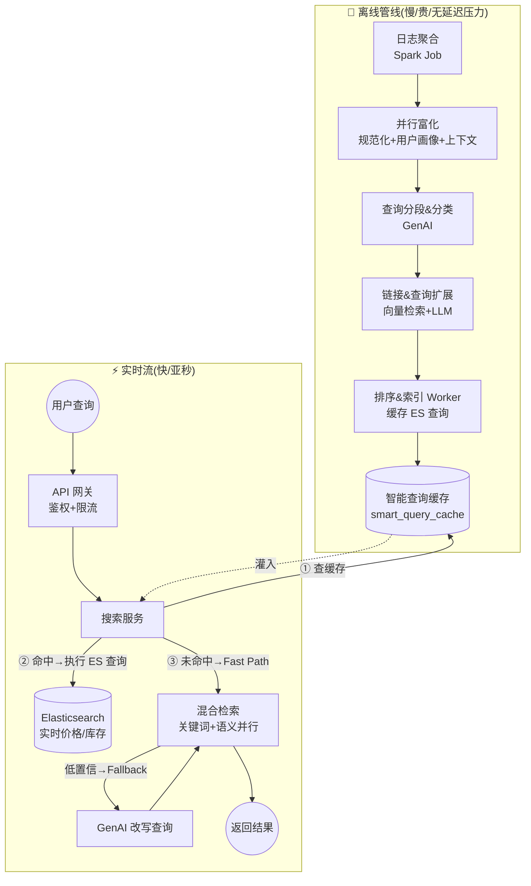

> 🔬 **第一性原理:为什么"离线换在线"是这类系统的通用范式?** LLM 推理动辄几百毫秒到几秒,而用户等不了。但**大量查询是重复的**(80/20 法则:20% 的查询占 80% 流量)。所以对热门查询,你完全可以**提前一次性算好**(离线),把结果缓存起来,让在线路径变成一次廉价的缓存查找。**这就是"用离线的贵换在线的快"**——是 Lambda 架构在 AI 系统里的经典应用,后面第 6/7 章也会反复出现。

---

## 🌙 5.7 离线查询处理管线(逐段拆解)

离线管线**每天(或更频繁)** 跑一次,分析过去一天的用户搜索行为,持续提升搜索准确性。它把重活集中在这里,因为**离线没有延迟压力**。

### ① 日志聚合(Log Aggregation)——Spark Job

一个 **Spark 作业**从分析数据湖读取用户查询的**原始日志**(查询 + 点击 + 购买),按**会话(session)** 分组,推进 **Kafka** 之类的处理队列。它产出一份"富事件"清单:

```
(UserID: "a", Query: "sofa",     Clicked: "Product #123", AddedToCart: "Product #123")
(UserID: "b", Query: "couch",    Clicked: "Product #123", Purchased:   "Product #123")
(UserID: "c", Query: "hot dogs", Purchased: "Product #456" AND "Product #789")
```

这份原始数据**把"用户查了什么"和"最终买了什么"连起来**。注意:上例里 "sofa" 和 "couch" 都点了同一个 #123——这就是模型学"沙发=couch"的语义信号来源。

> ⭐ **关键一步:统计查询频率(query frequency)**。聚合阶段**显式统计每个查询出现的次数**。这个频率后面决定**哪些查询要预处理、缓存到哪一层**——它是整个分层缓存策略的数据基础。

### ② 并行富化(Parallelized Enrichment)

数百万条日志通过**跨实例分发**并发处理。日志聚合和富化之间用 **Kafka 队列解耦**——这样两边可以**独立扩容**,而且富化 Worker 临时挂了也有韧性(消息还在队列里)。

每条结构化日志过三层并行富化:

| 富化层 | 做什么 |
|---|---|
| **查询规范化(Query Normalization)** | 纠正拼写、统一大小写、去无关字符 |
| **用户画像富化(User Profile Enrichment)** | 注入用户历史:过往购买、品牌偏好 |
| **上下文富化(Contextual Enrichment)** | 地理位置、时段、设备、本地趋势等影响购买的因素 |

富化后的查询作为 payload 发到 `query_process` 队列(Kafka topic)。

### ③ 查询分段与分类服务(Query Segmentation & Classification)

这一步**解码用户意图**。Worker 消费 `query_process` 里的富化 payload,连同平台的**分类体系(taxonomy)** 一起发给 GenAI 服务。

**分段(Segmentation)**:按平台分类法把查询拆开。例:`"organic aged basmati rice"`(有机陈年印度香米)拆成:

```
organic  → Attribute/Tag(属性/标签)
aged     → Attribute/Tag
Basmati  → Product Quality(产品品质)
rice     → Product Category(产品品类)
```

**分类(Classification)**:把识别出的品类(rice)映射到内部商品层级中的精确位置:

```
Groceries > Rice, Flour & Pulses > Basmati rice
（食品杂货 > 米面豆类 > 印度香米）
```

输出是一个结构化 JSON payload,推到 `segmented_queries` 队列:

```json
{
  "original_query": "organic aged basmati rice",
  "normalized_query": "organic aged basmati rice",
  "user_profile": {
    "user_id": "user-abc-123",
    "past_purchases": ["p-987", "p-321"],
    "brand_preferences": ["OrganicIndia"]
  },
  "context": { "geolocation": "Mumbai", "time_of_day": "evening", "device": "mobile" },
  "segmentation_results": {
    "attributes": ["organic", "aged"],
    "product_category": "rice",
    "product_quality": "Basmati"
  },
  "classification_results": {
    "taxonomy_path": "Groceries >Rice,Flour&Pulses> Basmati Rice"
  }
}
```

### ④ 链接与查询扩展服务(Linking & Query Expansion)

这一步做两件事:**弥合"用户说的"和"用户真正想要的"之间的鸿沟**,并**主动推荐用户没想到的相关替代品**。

**核心约束:上下文窗口(context window)**。作者在这里插了一段科普——LLM 有固定的短期记忆叫上下文窗口,以 token 计,**输入 prompt + 输出都算在里面**。我们有海量商品目录,**不可能把整个目录塞进 prompt**。

**解法 = RAG 的雏形**:先检索一小撮相关商品(能塞进上下文窗口),再让 LLM 智能提炼扩展。

- **实体检索与链接(Entity Retrieval & Linking)**:向量库 `semantic_search_index` 存了商品描述+标签的嵌入形式(带 `product_id` 关联)。把分段后的查询组件(如 "rice")转成嵌入,在向量库做**相似度检索**——不仅能召回 "rice",还能召回语义相近的 "grains"、"poha"(印度炒米片)、"millets"(小米)。
- **智能查询扩展(Intelligent Query Expansion)**:把这些召回的商品发给 GenAI,让它从中挑最相关的,和原始属性(organic, aged)组合。

发给 LLM 的 prompt payload:

```json
{
  "original_query": "organic aged basmati rice",
  "segmented_query": {
    "attributes": ["organic", "aged"], "product_category": "rice", "product_quality": "basmati"
  },
  "semantic_alternatives": [
    {"product_id": "p-987", "name": "Organic Poha"},
    {"product_id": "p-654", "name": "Barnyard Millet"},
    {"product_id": "p-321", "name": "Brown Rice Flakes"},
    {"product_id": "p-111", "name": "Aged Sona Masoori Rice"}
  ],
  "instructions": "You are a search relevance expert ... Analyze the semantic alternatives and select the most relevant ones ... combine the original attributes with the base product and its best alternatives."
}
```

LLM 输出一个**高度富化的 ES 查询 payload**(含同义词和替代品),用的是 Elasticsearch 的 bool 查询 DSL:

```json
{
  "search_query_payload": {
    "bool": {
      "must": [                                   // 必须命中(硬条件)
        { "match": { "attributes": "organic" } },
        { "match": { "attributes": "aged" } }
      ],
      "should": [                                 // 加分项(命中越多分越高)
        { "match": { "product_type": "basmati rice" } },
        { "match": { "product_type": "sona masoori rice" } },
        { "match": { "product_type": "poha" } },
        { "match": { "product_type": "millet" } }
      ],
      "minimum_should_match": 1                    // should 里至少命中 1 个
    }
  }
}
```

> 💡 **逐行读懂这个 ES 查询**:`must` 是**硬条件**(必须有机、必须陈年),`should` 是**软条件/加分项**(是香米最好,是 sona masoori 米/炒米片/小米也行),`minimum_should_match: 1` 表示 should 里**至少满足一个**。这样"有机陈年"的核心诉求被锁死,而"具体哪种米"被放宽到系统里真实存在的替代品——**既精准又能扩大召回**。

### ⑤ 排序与索引 Worker(Ranking & Indexing Worker)——本章最精妙的决策

最终的"分段+扩展"查询被 ES worker 消费,用来做关键词检索。但**关键决策来了**:

> **我们缓存的是"富化后的 ES 查询",而不是"最终的商品列表"。**

为什么?为了解决两个致命缺陷:

| 缓存内容 | 优点 | 致命缺陷 |
|---|---|---|
| ❌ 缓存**商品 ID 列表** | 延迟最低(直接返回) | ① **数据陈旧**:改价/缺货后,列表要等整条离线管线重跑才更新;② **内存爆炸**:给数百万条唯一查询各存一长串 ID,内存吃不消 |
| ✅ 缓存 **ES 查询(JSON)** | ① **新鲜度**:每次拿缓存的查询去**实时** ES 索引上跑,价格/库存/评分永远最新;② **内存高效**:一个 JSON 查询对象比一长串 ID 小得多 | 需要一次 ES 往返(比直接命中稍慢) |

> 🔬 **第一性原理:缓存"查询"而非"结果"是一种"计算 vs 数据"的权衡艺术。** 昂贵的部分是**"理解意图 + 生成好查询"**(LLM 那步),这部分适合缓存,因为它不常变。而**"查询在当前库存上的执行结果"**是易变的实时数据,不该缓存。**把"稳定的智能"缓存下来,把"易变的事实"留给实时执行**——这个原则可以迁移到几乎所有 RAG/搜索系统。⚠️ 常见坑:新手图快缓存最终结果列表,上线后必被"缺货商品还在搜索页"这类新鲜度 bug 反噬。

---

## ⚡ 5.8 实时搜索流(Real-time Search Flow)

用户在搜索框输入查询,客户端调服务端。这条路径**为速度而生**,用**两级(fast path + fallback path)**。

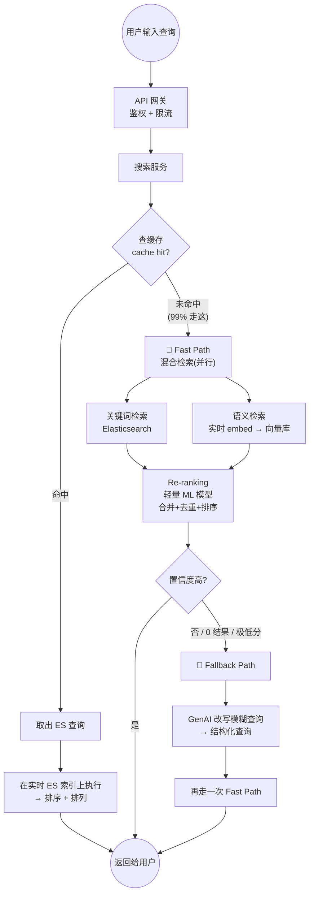

### API 网关(API Gateway)
在这里做**鉴权(authentication)+ 限流(rate limiting)**,然后把请求路由给搜索服务。

### 搜索服务(Search Service)
处理实时搜索、追求亚秒响应。**先查缓存**:
- **缓存命中**:拿出 ES 查询,去实时索引执行、排序、返回;
- **缓存未命中**:走下面的 fast path。

### 🏃 Fast Path(快路径,99% 的未缓存查询走这)
**并行执行混合检索(Hybrid Search)**:

1. **关键词检索**:拿查询去文档搜索库(ES)召回相关文档;
2. **语义检索**:把查询**实时**转成向量嵌入(用嵌入缓存或调嵌入模型),去向量库找语义相近商品;
3. **重排序(Re-ranking)**:两路结果**合并、去重**,用**轻量 ML 重排模型**排序,依据 = 关键词得分 + 语义得分 + 商品热度;
4. **响应**:置信度高就直接返回。

### 🐢 Fallback Path(兜底路径,给复杂查询/零结果/极低置信度)
- **触发**:fast path 返回 0 结果或置信度极低;
- **LLM 理解查询**:调 GenAI 把模糊查询**改写(rewrite)** 成系统能懂的结构化查询。例:`"stuff for my dorm party"`(给我宿舍派对的东西)→ `(category: "snacks" OR category: "drinks") AND (attribute: "party size")`;
- **重试**:改写后的查询**再走一次 fast path**;
- **响应**:第二次(更成功的)结果返回给用户。

> 💡 **这个双路径的精髓**:99% 的查询用便宜的混合检索秒回,只有那 1% 的"疑难杂症"才动用昂贵的 LLM 改写。**"让简单的事情快,让困难的事情有解",而不是让所有查询都为那 1% 的复杂度买单。**

### 🚪 GenAI 服务(LLM 网关)——第 2 章思想的复现

GenAI 服务是**所有 LLM 交互的集中式智能网关**,把对第三方 LLM 供应商的依赖**从其余系统组件中封装出来**。四大职责:

| 职责 | 说明 |
|---|---|
| **供应商抽象(Provider Abstraction)** | 对内暴露**单一统一 API**,内部服务只调这一个通用端点,换供应商无感 |
| **动态模型路由(Dynamic Model Routing)** | 按任务选模型:高频简单任务→便宜低延迟模型(如 Gemini 2.5 Flash);查询改写等复杂任务→更强模型(书里写 GPT-5o)。维护"任务→模型"的配置映射 |
| **韧性与可靠性(Resiliency)** | **断路器(circuit breaker)**:某供应商挂了就切下一个;**超时(timeout)**:超阈值取消;**重试(retry)**:指数退避重试瞬时错误 |
| **Prompt 模板** | 集中存放 prompt 模板,快速生成 prompt |

**底层 LLM 供应商**三类:
- **托管 AI 平台**:一个 API 访问多家模型,如 AWS Bedrock、Google Vertex AI;
- **直连模型 API**:AI 实验室官方 API,如 OpenAI(GPT)、**Anthropic(Claude)**;
- **开源模型**:自托管求隐私和成本可控,如 Llama 系列、Hugging Face。

> 🔗 这就是全书反复出现的 **LLM Gateway 模式**(见本仓 `llm-inference/` 里关于推理网关/路由的讨论)。**把 LLM 当成一个不可靠的外部依赖来治理**,而不是当成一个稳定函数调用,是 LLM 时代系统设计的心法。

---

## 🎁 5.9 商品发现流(Product Discovery Flow)

目标:返回**互补品 / 搭配品**,提升发现和转化。例:搜 "brownie" → 推 "ice cream"。同样遵循"离线换在线延迟"原则。

### 离线流(Offline)
`segmented_queries` 队列有消息后触发,富化服务**并行**做两件事:
- **搜索富化**:执行链接&扩展,把 ES 查询缓存进 `smart_query_cache`(前面讲过);
- **发现富化(Discovery Enrichment)**:拉取商品的**共同购买(co-purchase)分析数据**,连同主商品发给 GenAI。Prompt 长这样:

```
You are an expert e-commerce merchandiser. Given a primary product and data
on what customers often buy with it, generate a list of 3-5 complementary
products ... Return the output as a JSON array.

Input:
{ "primary_product": "brownie",
  "co_purchase_data": ["chocolate chips", "eggs", "vanilla extract",
                       "vanilla ice cream", "chocolate sauce", "whipped cream"] }
Output:
["vanilla ice cream", "chocolate sauce", "whipped cream"]
```

结果存进 Redis 的 `discovery_products` 缓存,**主商品名做 key**。

> 💡 注意 LLM 的判断力:输入里既有 "chocolate chips / eggs / vanilla extract"(**做布朗尼的原料**)也有 "vanilla ice cream / chocolate sauce / whipped cream"(**吃布朗尼时的搭配**)。LLM 聪明地只挑了**搭配品**做推荐——因为搜 brownie 的人是想**吃**,不是想**做**。这种常识判断正是纯规则系统很难做到的。

### 在线流(Online)
用户搜 "brownie",主搜索照常跑;**并行**调发现缓存拿相关商品,展示在 "Pairs well with"(绝配)或 "Users also bought"(买了还买)专区。

---

## 🗄️ 5.10 数据建模(Data Modelling)

系统里数据种类繁多,**存储和访问模式差异极大**,要为每种数据选对存储。

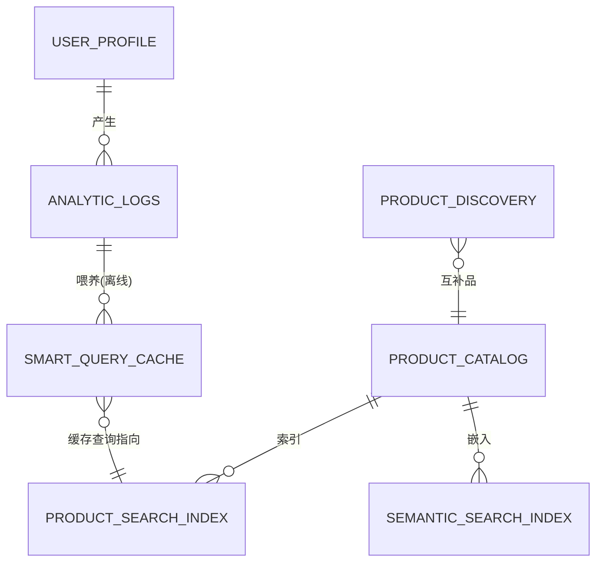

| 数据存储 | 定位 | 读写特征 | 选型 | 关键字段/设计 |
|---|---|---|---|---|
| **product_catalog**(商品目录) | 商品数据的**唯一真相源**(价格/描述/库存) | 高读高写:摄取管线写,结算/索引器读 | **DynamoDB**(NoSQL,快) | 分区键 `productId`(单商品数据聚在一起);GSI 用 `category_id` 分区键 + `price` 排序键,支持"看某品类按价排序"不全表扫描 |
| **smart_query_cache**(智能查询缓存) | 把自然语言查询映射到预算好的 ES 查询 | **极高读**,搜索服务第一个查 | 内存 + DynamoDB(持久层) | Key = 用户查询(或其哈希),Value = ES 查询 JSON |
| **product_search_index**(关键词索引) | **倒排索引**,快速关键词匹配+过滤+分面(faceting) | fast path 里被查,亚秒执行 | **Elasticsearch / OpenSearch** | `name/description`=Text(全文检索);`brand/category_path`=keyword(过滤);`price`=float(范围查询);`in_stock`=boolean;`attributes`=nested(保留 key-value 关系做多属性精确过滤) |
| **semantic_search_index**(向量库) | 存商品高维向量嵌入,做概念匹配 | 在线极高读;离线富化时高写 | **serverless 向量库(如 Turbopuffer)** 自动扩缩 | `productid` / `embedding` / `category_id` / `metadata`;查询时算 query 嵌入 → 做 **ANN(近似最近邻)** 搜索 |
| **product_discovery**(发现缓存) | 存互补品 | 读多 | Redis | Key = 用户查询,Value = 取互补品的查询 |
| **analytic_logs**(分析日志/数据湖) | **不可变、只追加**的搜索/点击/购买全量流水 | **写重**(流式),Spark 消费来训排序模型+算热门榜 | 数据湖 | `event_id/timestamp/user_id/session_id/raw_query/filters_applied/search_type/displayed_product_ids/clicked_product_id/added_to_cart_product_id/device_type` |
| **user_profile**(用户画像) | 用户买偏好和历史 | 快取 | **DynamoDB** | 分区键 `userId`;`searchHistory/purchaseHistory/preferences` |

### 语义文档(Semantic Document)——向量化前的关键一步

给商品建向量前,要把**多个字段拼成一句自然语言的"语义文档"** 再喂嵌入模型。例:

```
name: "Men's Terra Running Shoe"
brand: "Olympus Athletics"
category_path: "Apparel/Footwear/Running Shoes"
attributes: ["trail running", "waterproof", "breathable"]

↓ 拼成语义文档 ↓

"Men's Terra Running Shoe by Olympus Athletics. Category: Footwear, Running Shoes.
 A waterproof and breathable shoe for trail running."
```

> 🔬 **第一性原理:为什么要拼成一句话?** 嵌入模型是在**自然语言**上训练的,它对"一句通顺的描述"的理解远好于"一堆孤立字段"。把结构化字段"叙事化",能让嵌入更准确地捕捉商品的**语义**,从而让"trail running shoe" 能被 "waterproof hiking footwear" 这类查询召回。⚠️ 坑:直接把 JSON 字段拼接(如 `name|brand|category`)喂嵌入,效果会明显变差。

---

## 🔬 5.11 系统深挖(System Design Deep Dive)

作者先用一张表把前面的设计和需求对上号,这张表**就是面试收尾时的"总结页"**:

| 功能需求 | 设计方案摘要 |
|---|---|
| 自然语言理解 | **查询分段**:LLM 把查询拆成结构化属性("red"→Color,"dress"→Category) |
| 语义搜索 | **混合检索**:关键词(ES)+ 向量(HNSW)并行,兼顾精确匹配和意图 |
| 低延迟(<1s) | **分层缓存**:L1(本地)+ L2(Redis)+ 暖层(向量缓存),让 **80% 流量绕过 LLM** |
| 个性化 | **重排服务**:轻量模型按用户偏好(品牌/价格)实时重排 Top-50 |
| 商品发现 | **离线富化**:批处理预算"绝配"推荐,实现零延迟推荐 |
| 高扩展 | **Lambda 架构**处理实时趋势 + **HNSW 图优化**应对向量规模 |

下面逐个深挖。

### 5.11.1 离线管线该多久跑一次?近实时路径(Near-Real-Time / Lambda)

日跑是标准;大促/秒杀期可提到小时级。但**如果一个查询几分钟内就爆火(viral)** 呢?整条管线跑太勤又太贵。答案是 **Lambda 架构**:保留日批做深度全局分析,**额外加一条轻量流式路径**。

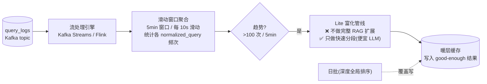

- **监控趋势**:独立轻量流路径直接消费 `query_logs`,用流引擎(Kafka Streams / Flink)做实时聚合。用**滑动窗口**(5 分钟窗口、每 10 秒滑动)统计各归一化查询的出现次数。
- **Lite 富化管线**:检测到新的爆火查询(如 5 分钟内 >100 次),**只把这个查询**过一遍**精简版**分段/扩展管线——**跳过慢而贵的步骤**:❌ 不做完整的 RAG 查询扩展(向量查找 + 复杂 LLM 推理);✅ 只做简单快速的分段(调便宜的快模型 + 紧凑 prompt,拿到"还不错"的结构化查询)。
- **填充暖层**:这个 "good enough" 的查询立刻写进**暖层缓存**。5 分钟前还是新查询,现在下一个搜它的用户就命中暖缓存了。
- **处理数据覆盖(Overwrite)**:日批跑的时候,它的写入**必须覆盖** NRT 速度层之前写的数据。这样"够用的临时结果"最终被"完美的全局排序结果"替换,长期保持缓存高质量。

> 🔬 **第一性原理:Lambda 架构 = 批处理层(准) + 速度层(快)。** 批处理层慢但**准且全局最优**;速度层快但**只求"够用"**。两者写同一个视图,**批处理最终覆盖速度层**——用"最终一致"换"实时捕捉趋势"。这是大数据系统的经典范式,在 AI 系统里同样成立。

### 5.11.2 缓存三件事:缓存什么 / 分几层 / 怎么失效

#### (1) 缓存什么(What to cache)
- **默认**:缓存 **ES 查询**(LLM 扩展的产物)——保证实时价格/库存/评分,且比存 ID 列表省内存;
- **优化**:对一小撮**结果稳定的热门通用查询**,缓存**最终商品列表 + 短 TTL**——这层"护盾"挡住数据库压力。但 **ES 查询缓存仍是核心策略**。

> 权衡:缓存查询要多一次 ES 往返(比直接命中慢,且加 DB 负载);缓存结果列表最快但有陈旧+内存风险。所以是**混合策略**。

#### (2) 分几层(Cache Tiers)——80/20 法则

**20% 的查询贡献 80% 的流量**。按频率(日志聚合阶段已统计)分层:

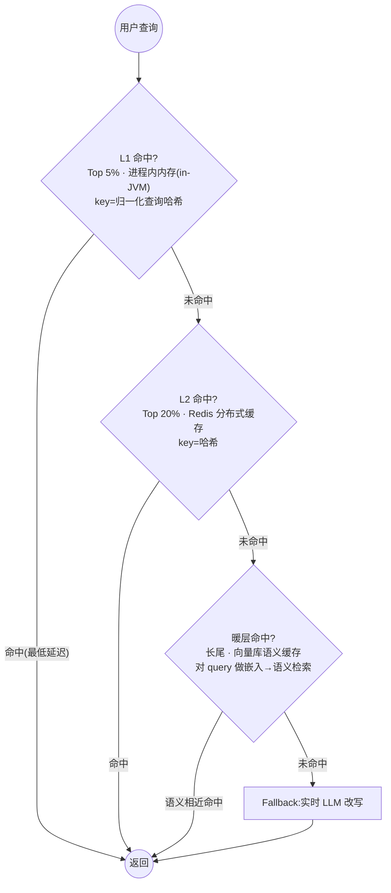

| 层 | 覆盖 | 存储 | key 类型 | 适合 |
|---|---|---|---|---|
| **L1** | Top 5% | 进程内内存(in-JVM,如 ConcurrentHashMap) | 归一化查询的**哈希** | 超高频精确查询:"iphone"、"running shoes" |
| **L2** | Top 20% | 分布式缓存 **Redis** | 哈希 | 高频精确查询 |
| **暖层(Warm Tier)** | 长尾 | **向量库**(OpenSearch k-NN 或专用向量库),存预处理好的 ES 查询 | **语义**(嵌入) | 长尾查询:"winter wear for women"——两个用户很难打一模一样的字,**哈希 key 在这里没用**,必须语义缓存 |

**暖层查找流程**:L1/L2 未命中 → 搜索服务对用户查询做嵌入 → 在暖层向量库做**语义检索** → 找到语义相近的预处理查询就返回它缓存的 ES payload。**这比对每个长尾查询都跑完整 fallback(实时 LLM)快得多也便宜得多。**

> 💡 **面试高频:为什么长尾查询要用"语义缓存"而不是普通 KV 缓存?** 因为长尾查询几乎不会**字面重复**("给女生的冬装" vs "女士冬季保暖衣"),普通哈希 key 命中率趋近于 0。但它们**语义高度重复**。语义缓存用向量相似度命中,把"意思一样"的查询归到同一份缓存结果——这是 LLM 时代缓存设计的一个关键升级。

#### (3) 缓存预热(Cache Warming)

应用实例启动时**不能瞎猜** Top 5%,得从中心持久源拉:

1. **离线作业**跟踪最频繁查询;
2. **生成热榜**:管线最后一步产出 JSON/CSV(Top 5% 查询 + 对应预算 ES 查询),传到 **S3**;
3. **存热榜**:发通知(含 bucket URL)到 `list_update` topic,搜索服务订阅;
4. **应用启动**:从 S3 拉这份文件;
5. **填充缓存**:解析后灌进本地内存(如 ConcurrentHashMap);
6. **运行时更新**:所有实例订阅 `list_update`,收到事件就重新拉取、刷新 L1。

这让内存缓存**永远反映当前 Top 5%**,对趋势变化高度自适应。

#### (4) 缓存失效(Cache Invalidation)

| 缓存 | 失效策略 |
|---|---|
| **查询缓存(L2/暖层)** | **简单**:预算好的查询只是数据,只在离线管线跑出更好查询时更新即可 |
| **结果缓存(L1/热层)** | **有陈旧风险**:主用**短 TTL(5–10 分钟)**;对关键商品可加**事件驱动失效**(商品目录更新 → 发事件失效缓存条目)。但 TTL 在简单和新鲜之间平衡最好 |

### 5.11.3 延迟与 P99 取舍(Latency & the P99 Trade-off)

Fast/缓存路径的 **P90 应远低于 1 秒**。但对完全没命中任何缓存层、语义也匹配不上的**复杂长尾查询**,触发 fallback(实时 LLM 改写),这时在 **P99** 面临一个尖锐取舍:**效用(utility)vs 延迟(latency)**。

| 选项 | 结果 | 代价 |
|---|---|---|
| **求快(Be fast)** | <200ms 直接返回 "No results found" | 用户撞死胡同,跳出流失 |
| **求有结果(Show results)** | 实时 LLM 链理解意图 + 改写,慢但让用户找到东西 | 延迟高(3–5s) |

**本设计选"求有结果"**:有意识地**牺牲速度以避免死胡同体验**。P90 路径严格追求亚秒;但 fallback 路径遵循一个信念——

> **一次"慢但成功"的搜索,对业务和用户的价值,远大于一次"快速失败"。**

所以对这类 P99 场景,**接受更高延迟预算(如 <3–5 秒)**,避免返回 0 结果或低置信结果。这样 90% 用户即时得到结果,剩下 1% 的疑难查询用户也能转化,而不是因为没结果而弹走。

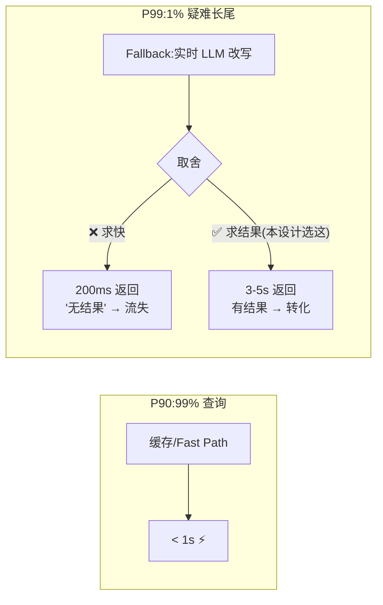

> ⚠️ **常见坑**:很多人一味优化"平均延迟"或"P50",忽视 P99。但 **P99 = 你最重要/最难伺候的那 1% 用户的体验**,而且这 1% 往往是"意图明确但表达刁钻"的高价值用户。**为尾延迟单独设计策略(而不是用同一套 SLO 一刀切)是成熟系统设计的标志。**

### 5.11.4 优化向量检索:ANN(HNSW vs 倒排分区)

选 ANN(近似最近邻)算法要看几个指标:**高召回/准确率、单核 QPS(吞吐)、低内存、低延迟**;还取决于向量存哪(SSD/云存储、内存/二级持久存储)。

| 算法族 | 原理 | 最适合 | 关键弱点 |
|---|---|---|---|
| **HNSW**(图分区,Hierarchical Navigable Small Worlds) | 用互联向量建**多层图**;检索从顶层稀疏层定位大致邻域,再下潜到底层稠密层。图遍历近邻 → **高召回 + 高查询性能** | **中等规模(百万级,1M–10M)** 的高准确+低延迟 | **内存占用大**(不压缩向量,吃 RAM),索引构建时间长 |
| **倒排分区**(Inverted Partitioning / IVF) | 向量**聚类**成簇并**压缩**;查询时先定位最近的几个簇,再在**压缩数据**里搜 | **超大规模(十亿级,1B+)**、内存是硬约束时 | 延迟比 HNSW 高,**召回更低**(压缩有损) |

**本案例的决策**:目录 1000 万,在 HNSW 的舒适区(1M–10M),内存占用中等可接受,所以**选 HNSW**——保证高准确 + 低延迟。

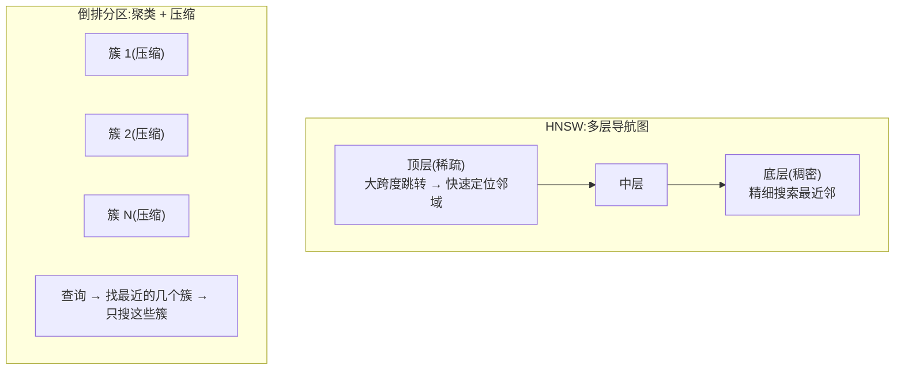

> 🔬 **第一性原理:精确最近邻(k-NN)太慢,所以"近似"(ANN)。** 在 6 万维空间里对 1000 万向量做暴力精确检索是 O(N),每次查询扫全库,不可能亚秒。ANN 用"空间结构"(图/簇)把搜索范围**指数级缩小**,用**一点点召回损失换几个数量级的速度**。HNSW 用"小世界图"(六度分隔那种结构)让你几跳就到目标附近;IVF 用"先选筐再翻筐"减少比较次数。**规模决定选型:百万级用 HNSW(准快但费内存),十亿级用 IVF(省内存但牺牲召回)。**
>
> 🔗 向量检索的更多底层原理(HNSW 参数 ef/M、量化 PQ/SQ、索引构建)可参考本仓 `llm-inference/` 与向量数据库相关材料。

### 5.11.5 高效排序:两次排序(Efficient Ranking)

为了"高相关 + 个性化 + 低延迟",**排两次**:离线全局排(建基线)+ 在线个性化重排(为每个用户定制)。

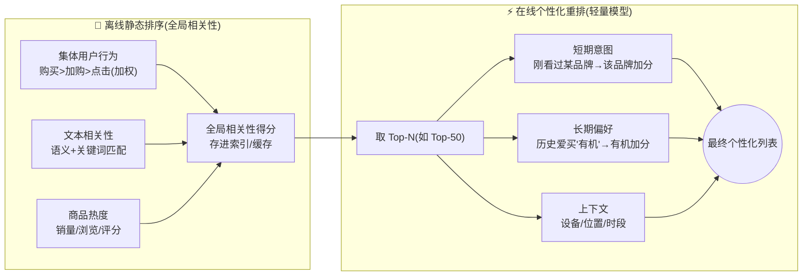

**离线静态排序(全局相关性)**:基于**所有用户的集体行为**给每个"商品—查询"对打分,不针对特定用户。信号:
- **集体行为**:哪些商品对某查询表现最好——**购买 > 加购 > 点击**(权重递减);
- **文本相关性**:查询和商品标题/描述/属性的语义+关键词匹配;
- **商品热度**:整体销量、浏览量、评分(与具体查询无关)。

输出一个**全局相关性得分**,和商品一起存进索引和缓存。

**在线个性化重排**:对召回列表按**当前搜索的这个用户**重排(轻量模型,只重排 Top-50):
- **短期意图**:刚看过某品牌的鞋 → 同品牌加分;
- **长期偏好**:历史爱买"有机" → 有机商品加分;
- **上下文**:设备、位置、时段微调。

> 💡 **两阶段排序(Retrieval + Ranking)是工业推荐/搜索的标准范式**:第一阶段(离线/召回)在**海量**候选里用便宜方法粗排出 Top-N;第二阶段(在线/精排)在**少量** Top-N 上用精细特征做个性化。**为什么不一步到位?** 因为精细个性化模型跑一次很贵,只能作用在几十个候选上,不可能对全库 1000 万商品每次实时跑。**"先粗后精、先全局后个人"是延迟和质量的最优折中。**

---

## 🛡️ 5.12 保障鲁棒性:可用性 / 可扩展 / 弹性

这三个词是 NFR "高可用"的三根支柱。

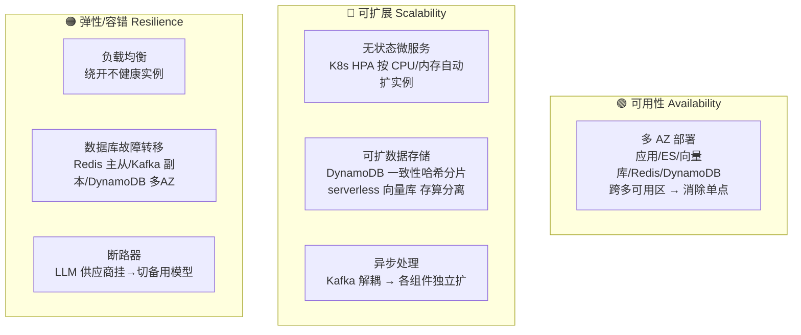

### 🟢 可用性(Availability)
- **多 AZ 部署(Multi-AZ)**:在线路径所有关键组件(应用服务、ES 集群、向量库、Redis、DynamoDB)**跨多个可用区(AZ)部署**,消除单点故障——一个 AZ 数据中心挂了不影响服务。

### 🔵 可扩展性(Scalability)
- **服务水平扩展**:微服务(搜索、排序)**无状态**——任意实例处理任意请求,加机器即扩容。用 **K8s HPA(Horizontal Pod Autoscaler)** 按实时 CPU/内存自动扩缩实例数;
- **可扩数据存储**:DynamoDB 和 serverless 向量库自动分片扩缩。DynamoDB 用**一致性哈希**高效扩展,提供**托管分片**(自动切分数据到不同服务器)和**托管吞吐**(按需模式自动扩缩算力);
- **向量库扩展(存算分离)**:serverless 向量库把**存储**(向量+HNSW 图放 S3 这类对象存储,可长到 PB 级)和**计算**(查询来时按需激活无状态计算节点)解耦。查询**并行**发给多个无状态节点,各自从对象存储加载所需索引分片、搜自己那部分、返回 Top 结果,最后一个服务**聚合**所有并行结果得全局最近邻。动态加节点、按计算秒付费;
- **异步处理**:离线管线用 **Kafka 解耦**(日志聚合 Spark 作业 ↔ 富化 Worker ↔ GenAI 服务),各组件按 CPU/内存 + 队列长度**独立扩缩**。

### 🟠 弹性与容错(Resilience & Fault Tolerance)
处理**部分故障**:

| 组件 | 容错机制 |
|---|---|
| **负载均衡** | 每个服务前置 LB,均衡分流 + 自动把流量从无响应实例移开(隔离故障) |
| **Redis** | 跨 AZ 主从(primary-replica),主挂了副本自动升主,备份集群做故障转移 |
| **Kafka** | 副本复制:每分区 1 leader + 多 follower,follower 持续复制 leader;leader 挂了 controller(ZooKeeper/KRaft)秒级把某个 in-sync follower 升为新 leader,生产者/消费者重定向 |
| **DynamoDB** | AWS 全托管、多 AZ,数据同步复制到 ≥3 个物理数据中心;一个数据中心挂了自动路由到健康副本,**无数据丢失** |
| **Turbopuffer(serverless 向量库)** | 数据跨 AZ 复制到对象存储(持久);计算无状态(挂了 LB 直接摘掉换健康节点)→ 数据持久 + 高可用 |
| **断路器(Circuit Breaker)** | 第三方 LLM 天生不可靠;GenAI 服务给**每个 LLM 模型**配断路器,主模型超时/失败就**开路**,流量切到备用模型,防止单个失败依赖冻结整条管线 |

> ⚠️ **常见坑**:很多人把"高可用"简单等同于"多部几台机器"。但真正的鲁棒性是**三件事的合力**:可用性(去单点,多 AZ)、可扩展(无状态 + 自动扩缩)、弹性(优雅处理部分失败,断路器/故障转移)。**尤其在 LLM 时代,"外部 LLM 供应商会挂"必须当成一等公民来设计**——断路器 + 备用模型 + 超时 + 重试,四件套缺一不可。

---

## 📊 5.13 监控与告警(Monitoring & Alerting)

要从**技术**和**用户**两个视角看系统健康——"看机器的健康,也看用户的脉搏"。

| 监控指标 | 视角 | 含义 |
|---|---|---|
| **搜索 API 延迟(P95/P99)** | 技术 | 最慢 5%/1% 用户的体验 |
| **错误率(5xx)** | 技术 | 服务/依赖失败的**最早预警** |
| **吞吐(QPS)** | 技术 | 容量规划、识别异常流量(秒杀 or DDoS) |
| **CPU/内存利用率** | 技术 | 成本优化 + 触发自动扩缩;持续高 = 该扩容 |
| **发现点击率(CTR)** | 用户 | 相关性直接信号:"我们展示的东西用户感兴趣吗?" |
| **搜索/发现转化率(Conversion)** | 用户 | **终极业务指标**:搜索是否真在带来收入 |

**告警(Alerting)** 只在需要人工介入的异常上触发:
- **严重错误**:API 错误率骤升;
- **性能退化**:P99 延迟超阈值(如 500ms);
- **资源耗尽**:CPU/内存打满 → 扩容信号;
- **业务指标下跌**:CTR/转化率无故骤降 → 可能是新算法上线出了问题。

> 💡 **黄金法则**:监控要**技术指标 + 业务指标并重**。P99 延迟正常但转化率暴跌,说明"系统很健康但推荐变差了"——纯技术监控看不出这种"静默的相关性退化",而它恰恰是最伤钱的故障。

---

## 🧪 5.14 测试与评估(Testing & Evaluation)

搜索质量是**主观且难量化**的,作者给了一套四位一体的评估闭环。

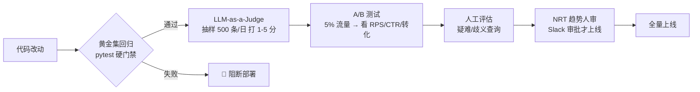

### ① LLM 即评委(LLM-as-a-Judge)

用强 LLM(如 GPT-4o / Claude 3.5 Sonnet,**高推理能力**)当**中立专家**,给新旧算法的结果**大规模、定性**打分。用**黄金数据集(golden dataset)** 建"理想答案"基线。

- **打分尺度**:1–5(1=无关,5=完美匹配);
- **成本控制**:只在**每日随机抽 500 条查询**上跑,**不碰线上实时流量**。

书里的实现(逐行讲解):

```python
from pydantic import BaseModel
from openai import OpenAI
client = OpenAI()

class RelevanceScore(BaseModel):   # ① 用 Pydantic 定义结构化输出的 schema
    score: int                      #    分数(1-5)
    reasoning: str                  #    打分理由(强制模型解释,便于 debug)

def evaluate_relevance(user_query, product_title, product_desc):
    """用 GPT-4o 当中立的搜索质量评委"""
    prompt = f"""
You are a Search Quality Rater. Rate the relevance of the product to the query.
Query: "{user_query}"
Product: "{product_title}" - {product_desc}
Scale:
1: Completely irrelevant (Query: "Phone", Result: "Socks")
3: Tangentially relevant (Query: "Nike Shoes", Result: "Adidas Shoes")
5: Perfect match (Query: "iPhone 15", Result: "Apple iPhone 15 Pro")
Return JSON with 'score' (1-5) and short 'reasoning'.
"""
    completion = client.beta.chat.completions.parse(   # ② 结构化解析:强制输出符合 schema
        model="gpt-4o-2024-08-06",
        messages=[{"role": "user", "content": prompt}],
        response_format=RelevanceScore,                 # ③ 关键:把输出直接解析成 RelevanceScore 对象
    )
    return completion.choices[0].message.parsed         # ④ 拿到强类型对象,可直接 .score / .reasoning
```

> 💡 **逐行要点**:① `BaseModel` 定义"我要什么形状的输出";② prompt 里**给了 1/3/5 的锚点例子**(few-shot),让不同评委的打分标准对齐——这是 LLM-as-Judge 稳定性的关键;③ `response_format=RelevanceScore` 让模型**必须**吐合法 JSON,省掉手写解析和容错;④ 强制模型给 `reasoning`,一来提升打分质量(思维链效应),二来出问题能溯因。
>
> ⚠️ **坑**:LLM 评委也会有偏差(偏爱长答案、位置偏好、自我偏好等)。作者用**黄金集校准 + 抽样(非全量)** 来控成本和噪声。**不要把 LLM-Judge 的分数当绝对真理,只当"方向是否变好"的规模化信号。**

> 🔗 LLM-as-a-Judge 的偏差与缓解(位置偏好、长度偏好、成对比较 vs 打分),可结合本书评估相关章节与本仓评估类材料对照阅读。

### ② 黄金集回归套件(Golden Set Regression)

上线前**必须过黄金集**——一组不可妥协的高价值查询("iphone" 必须返回 Apple)。用 **pytest 做部署门禁**:

```python
# test_search_quality.py
import pytest
from search_client import get_search_results

# 黄金集:必须返回特定品牌/品类的查询
GOLDEN_CASES = [
    ("iphone", "Apple", "brand"),
    ("running shoes", "Footwear", "category"),
    ("protein powder", "Supplements", "category"),
    ("sony headphones", "Sony", "brand"),
]

@pytest.mark.parametrize("query, expected_value, field", GOLDEN_CASES)  # 参数化:每个用例独立跑
def test_golden_set_accuracy(query, expected_value, field):
    results = get_search_results(query, limit=3)
    # 0 结果 = 立即阻断
    assert len(results) > 0, f"Critical: No results for golden query '{query}'"
    # 检查 Top-1 是否符合预期
    top_result = results[0]
    assert expected_value in top_result[field], \
        f"Regression: '{query}' returned {top_result[field]}, expected {expected_value}"
```

> 💡 `@pytest.mark.parametrize` 把 4 个用例展开成 4 个独立测试,任何一个挂了都**阻断部署**。**核心思想:把"搜索质量"变成 CI 里的一道红绿灯**——核心查询退化就直接卡住上线,不给"我以为没影响"的机会。

### ③ A/B 测试

新算法(如新排序)先灰度给 **5%(或 50%)** 用户,对照组用旧系统。盯 **CTR、转化率、每会话收入(RPS,Revenue Per Session)**。**只有统计显著改善才逐步全量。**

```python
import hashlib

def get_experiment_bucket(user_id, salt="experiment_v2"):
    """确定性分桶:同一个用户在整个实验期永远落同一个桶"""
    hash_input = f"{user_id}-{salt}".encode('utf-8')
    bucket_val = int(hashlib.sha256(hash_input).hexdigest(), 16) % 100  # 哈希→0~99
    if bucket_val < 50:
        return "CONTROL"     # 50% 流量:老的可靠系统
    else:
        return "TREATMENT"   # 50% 流量:新的 AI 系统

def handle_search_request(request):
    bucket = get_experiment_bucket(request.user_id)
    if bucket == "TREATMENT":
        return run_new_ai_search(request.query)   # 新系统
    else:
        return run_legacy_search(request.query)   # 老系统
```

> 🔬 **第一性原理:为什么用"哈希取模"而不是"随机数"分桶?** 因为需要**确定性 + 一致性**:同一个用户每次请求都必须落在同一个桶,否则用户一会儿看新系统一会儿看旧系统,体验错乱、指标也没法归因。`sha256(user_id + salt) % 100` 保证:① 同用户永远同桶(确定性);② `salt` 换实验就重新洗牌(实验间独立);③ 哈希均匀 → 分桶均衡。**这是 A/B 实验框架的标准做法。**

### ④ 人工评估(Human Evaluation)

人类评委审一批**challenging & ambiguous(疑难歧义)** 查询,看自动系统抓不到的**上下文恰当性、惊喜感(serendipity)、公平性**。这种 human-in-the-loop 对**边界 case** 极有价值。

**NRT 趋势的人审护栏**:NRT 管线能检测爆火趋势,但**用便宜 LLM 自动把趋势查询推上线有"病毒式幻觉(viral hallucination)"风险**。所以:
- **护栏**:NRT 输出先进**暂存缓存(staging cache)**;
- **审核**:高速趋势触发 **Slack 告警**给运营经理,必须**点 Approve** 才把 AI 生成的结果推到线上公开缓存。

> ⚠️ **常见坑**:爆火趋势最容易被恶意/异常流量刷出来(比如竞品刷词、突发舆情)。如果无人审直接自动上缓存,一个错误的 AI 理解会被瞬间放大给所有搜这个词的用户。**"越自动、越要在关键放大环节留一道人工闸门"**——这就是 NRT 人审护栏的意义。

---

## 📌 小结(Summary)

构建电商 AI 搜索是个复杂系统工程。核心是**借 LLM 和向量检索之力,打造智能、个性化的发现体验**——未来的电商搜索不只是"找到商品",而是"**理解顾客,帮他们发现会爱上的东西**"。

一图记住本章骨架:

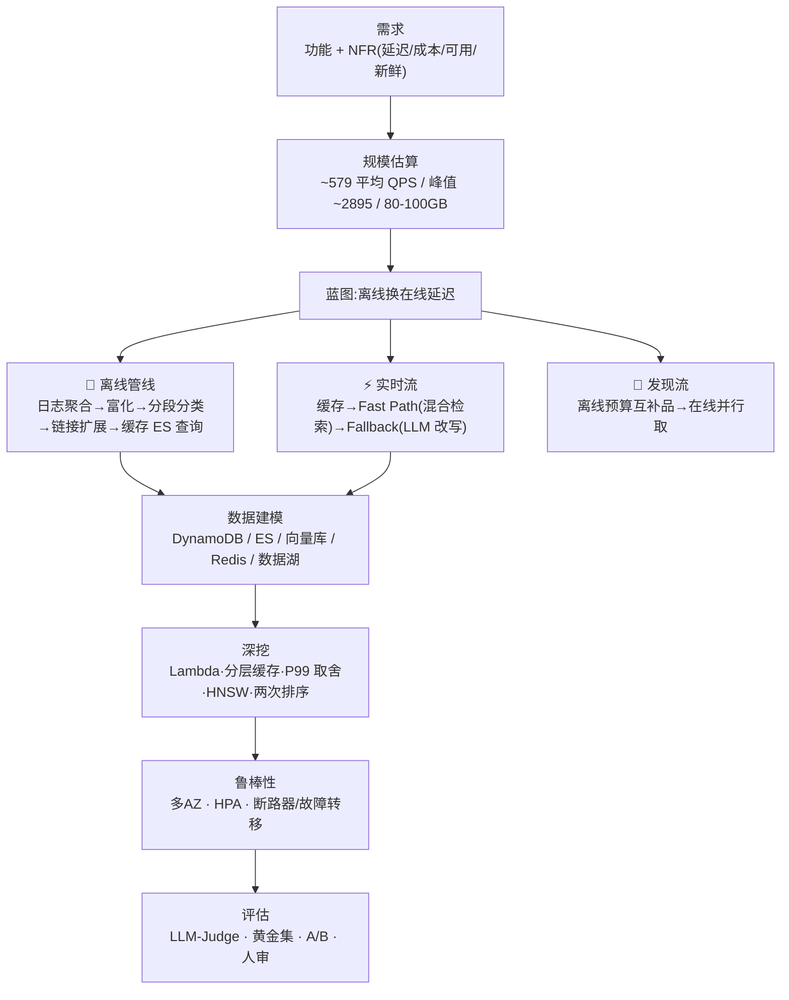

**本章可迁移的 8 条核心心法**:

1. 🧩 **离线换在线延迟**:重的 AI 计算挪到离线,产出灌进低延迟缓存(应对"低延迟 + 低成本");
2. 🔀 **混合检索两条腿**:关键词(精确)+ 语义(意图),缺一不可;
3. 🪜 **分层缓存 + 80/20**:L1/L2 用哈希 key 抓热门,暖层用**语义 key** 抓长尾;
4. 🎯 **缓存"稳定的智能"(ES 查询)而非"易变的事实"(结果列表)**——兼顾新鲜度和内存;
5. ⚖️ **P99 单独设策**:对疑难长尾选"慢而成功",拒绝"快速失败";
6. 🔬 **按规模选 ANN**:百万级 HNSW(准快费内存),十亿级 IVF(省内存牺牲召回);
7. 🪜 **两阶段排序**:离线全局粗排 + 在线个性化精排(只重排 Top-N);
8. 🛡️ **鲁棒性三支柱 + LLM 当不可靠依赖治理**:多 AZ / 无状态自动扩缩 / 断路器故障转移。

---

## 🔗 延伸阅读(Further Reading)

### 本书其它章
- **第 2 章 · LLM 网关 / 提供商抽象**:本章 5.8 的 GenAI 服务(供应商抽象、动态路由、断路器、prompt 模板)是那一章模式的直接落地。
- **第 3–4 章 · RAG 与缓存 / 资源约束**:本章的"链接与查询扩展"(先检索一小撮商品再喂 LLM)就是 RAG 雏形;分层/语义缓存和上下文窗口约束呼应资源约束章。
- **第 6 章 · AI 客服 Agent(下一章)**:与本章共享 NLU、RAG、低延迟推理的底子;不同在于**多轮对话**(要维护对话历史、护栏更严、成功指标从"露出商品"变成"回答问题")。作者在本章末尾专门做了这个对比:电商搜索基本是**无状态(一问一答)**,客服 Agent 是**有状态多轮**。

### 本仓(llm-action)配套
- 📁 `llm-inference/` —— LLM 推理服务、路由/网关、KV Cache、批处理:深挖本章 GenAI 服务和"模型路由 + fallback"的底层。
- 📁 `ai-infra-architecture/`(或 `ai-infra/`)—— 分布式系统、Kafka/消息队列、缓存架构、多 AZ 与自动扩缩:本章"鲁棒性"三支柱的工程细节。
- 📁 向量数据库 / 语义检索相关材料 —— HNSW 参数调优、量化(PQ/SQ)、召回-延迟权衡:本章 5.11.4 的深水区。
- 📁 `llm-eval/` 或评估相关 —— LLM-as-a-Judge 偏差、黄金集构建、离线/在线评估闭环:本章 5.14 的方法论扩展。

### 书中参考文献(工业实践博客,强烈建议原文精读)
- **[1] Picnic**:*Enhancing Search Retrieval with Large Language Models (LLMs)*
- **[2] DoorDash**:*How DoorDash Leverages LLMs for Better Search Retrieval*(本章"属性富化""分段分类"的原型)
- **[3] Instacart**:*How Instacart Uses Embeddings to Improve Search Relevance*
- **[4] Grab**:*LLM-assisted Vector Similarity Search*

> 💡 这四篇是**真实电商/外卖平台的搜索工程博客**,本章的很多设计(属性富化、语义嵌入文档、混合检索、LLM 扩展)都源自它们。想把本章从"会背"变成"会做",精读这四篇是最短路径。
