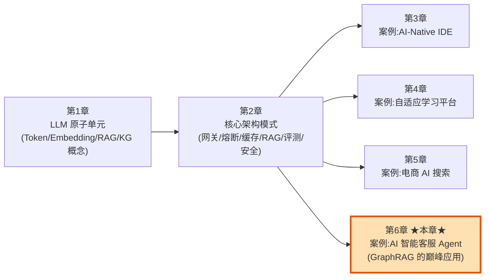
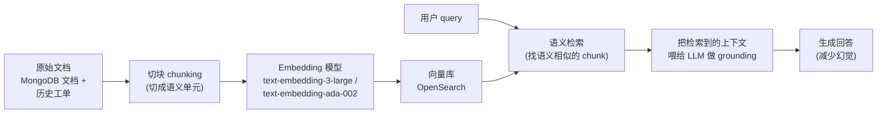
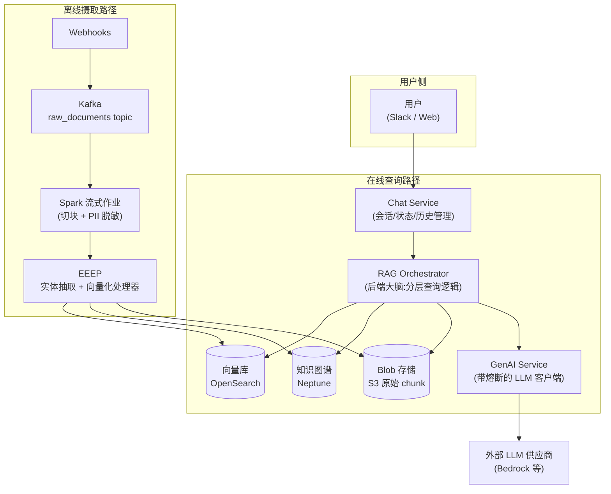
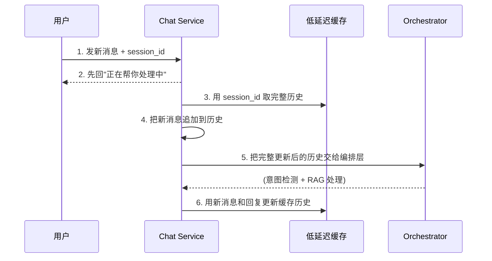
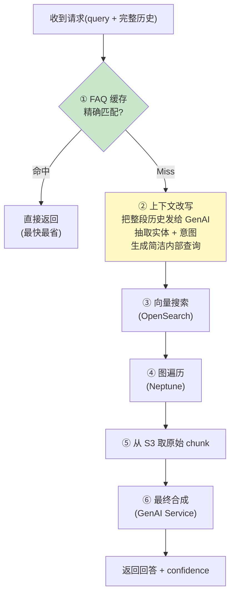
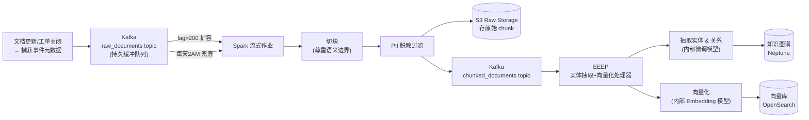
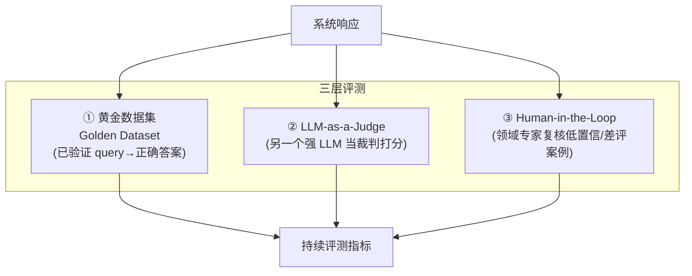
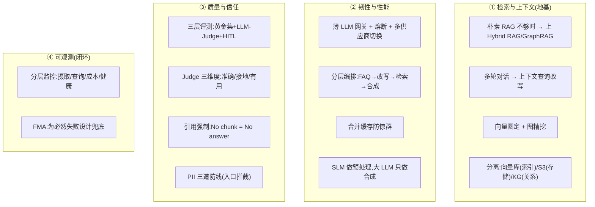

# 📘 第 6 章精讲 · 案例进阶：AI 智能客服 Agent（Hybrid RAG / GraphRAG）

> 本文对应《Systems Design in the LLM Era》(Sampriti Mitra) 第 6 章，PDF 第 216–251 页。
> 这是全书**最后一个案例章**，也是**难度最高、最"进阶"的一章**。

---

## 🗺️ 本章地图（先读这里）

我拿到的任务是"读章定题"——先把这段书吃透，再定主题。读完 216–251 页后，主题已经清清楚楚：

**第 6 章 = 用 Hybrid RAG（向量搜索 + 知识图谱 = GraphRAG）从零设计一个生产级 AI 智能客服 Agent（以 MongoDB 官方客服为背景）。**

它在全书里的位置：



前 5 章分别教你"零件"（第 1、2 章）和"怎么把零件拼成系统"（第 3、4、5 章的三个案例）。**第 6 章是三个案例里最硬核的**——因为客服域有一个前几章没有的痛点：**"语义相似 ≠ 真正相关"**。这一句话逼着我们从"朴素 RAG"进化到"GraphRAG"，这也是全书的技术高潮。

**读完这一章你能会什么：**

1. ✅ 说清楚**为什么朴素 RAG（naive RAG）在复杂技术客服里会翻车**，以及知识图谱（KG）如何补救——这是本章的灵魂。
2. ✅ 走完一套完整的 LLM 系统设计流程：**需求 → 规模估算 → API → 蓝图 → 数据建模 → 深潜 → 监控 → 失败模式分析（FMA）**。这是"LLM 系统设计面试"的标准答题模板。
3. ✅ 掌握一批**可复用模式**：分层编排（Tiered Orchestration）、上下文改写（Contextual Query Rewriting）、合并缓存（Coalesce Caching）、引用强制（Citation Enforcement）、LLM-as-a-Judge 三种打分维度、PII 脱敏三道防线。
4. ✅ 学会把这些模式抽象成"任何 LLM 产品都能套用的骨架"。

> 💡 **面试高频**：LLM 系统设计面试（尤其是国内外大厂 AI-Infra / 应用架构岗）几乎必考"设计一个 RAG 客服/问答系统"。本章就是一份满分答卷的逐行拆解。读完请务必自己能默画出图 6.2 和图 6.5。

---

## 🎬 一、问题场景：为什么要做这个系统？

### 1.1 业务痛点（是什么 / 为什么）

书的开篇给了三个扎心的现实：

- 一家公司**每天能收到几千张客服工单（support tickets）**，客服主管要在几小时到几天内处理完，运营压力巨大。
- 纯靠**人工客服 → 工单处理时长（TAT, Turn Around Time）极长 → 用户体验很差**。
- 传统的**自动客服**（写死的预定义工作流）：只要用户的问题**稍微偏离预期分类或简单 FAQ**，就会失败。

再叠加一个**架构级约束**：公司维护的**知识库巨大、复杂、且不断演进**。传统系统很难：

- 高效遍历一个庞大且持续变化的知识库；
- 在一篇长文档里**精准定位到那一个上下文相关的段落**。

> 书里选了 **MongoDB 生态**做案例，理由很讲究：MongoDB 的功能广度极大、官方 + 社区知识库规模巨大，**完美暴露传统客服系统的局限，正好凸显 GraphRAG 的必要性**。开发者可能遇到的问题五花八门：从"这个功能怎么用"到"该死的连接问题怎么修"。

### 1.2 我们想造什么（目标）

一个**AI 客服 Agent**，要足够聪明：

1. 能自动回答的问题就**自动回答**；
2. 答不了的就**转人工（redirect to human agent）**；
3. 转人工时，还要**把聊天记录总结成一份简洁、可执行的概览**，方便人工客服接手。

---

## 🧩 二、本章的技术灵魂：从朴素 RAG 到 GraphRAG

这是全章**最重要的一节**，务必嚼烂。前面五章讲的 RAG 到这里"升级打怪"了。

### 2.1 先回顾标准 RAG（第 2 章的地基）

书里明确说："As established in Chapter 2, our foundation is a standard RAG pipeline."

标准 RAG 流程：



**逐步拆解（零基础也能懂）：**

| 步骤 | 干什么 | 为什么 |
|---|---|---|
| **Ingest（摄取）** | 把 MongoDB 文档 + 历史工单读进来 | 这是知识来源 |
| **Chunking（切块）** | 切成"语义单元（semantic units）" | Embedding 模型有大小限制，不能整篇塞 |
| **Embedding（向量化）** | 用 `text-embedding-3-large` 等把 chunk 变成向量 | 把文字变成"数学坐标"，才能算相似度 |
| **Store（存储）** | 存进向量库 OpenSearch | 支持高速语义检索 |
| **Retrieve（检索）** | 拿用户 query 找语义相似的 chunk | 给 LLM 提供"上下文"，把它"钉"在事实上（grounding） |

正常情况下这套很好用。**但书里紧接着抛出致命一击**👇

### 2.2 🔬 第一性原理：为什么朴素 RAG 在这里不够？

> **原文金句**："In a complex technical support domain, **semantic similarity is not the same as relevance**（语义相似不等于相关）."

书举了一个极精彩的例子：

> 向量搜索可能找到**十篇看起来都像"error E11000"的文档**，但**恰恰漏掉了那一篇解释根因（root cause）的文档**——因为它的措辞（phrasing）不一样。

**书里列的两大失败原因：**

**❌ 失败原因 1：相似 ≠ 相关，导致上下文冗余**

向量搜索擅长找"相似"，但相似不代表"相关"。多篇文档措辞相近 → 检索出一堆语义相似的 chunk → **LLM 收到的是冗余的、压倒性的上下文（redundant, overwhelming context）** → 反而难以定位那个真正需要的解法。

**❌ 失败原因 2：切块粗糙导致检索低效**

文档往往是**层级结构**的：`标题(Title) → 章节(Section) → 子章节(Sub-section)`。
如果用户 query 匹配到了**文档标题**，系统可能只检索到**高层摘要**，却**漏掉了藏在五个章节之下的关键信息**。核心内容被漏掉，是因为**Embedding 模型没能识别"高层匹配"和"低层细节"之间的连接**。

> ⚠️ **常见坑**：很多人以为"把文档切碎、灌进向量库、加个 top-K 检索"就是 RAG 的全部。本章告诉你：**在专业域（技术支持、法律、医疗），朴素 RAG 的召回质量会系统性地失败**。这不是调参能救的，是范式问题。

### 2.3 ✅ 解药：引入知识图谱（Knowledge Graph, KG）

> **原文**："To solve this, we must **evolve from standard RAG to GraphRAG**."

**KG 是什么**（是什么）：一种**结构化的数据表示，定义实体（entities）之间的关系（relationships）**。可以用图数据库 Neo4j 或 Amazon Neptune 来存。

**KG 的核心价值**（为什么）：不靠"词的相似度"，而靠"关系"。举两个书里的例子：

```
document A  -[is_part_of]->  section 3
ticket X    -[resolved_by]-> code commit Y
```

**怎么用**：这让检索引擎能**遍历复杂的逻辑路径（traverse complex, logical paths）**，找到**确定性的解法集（definitive solution set）**。书把这套叫 **GraphRAG 模式**——用图遍历来穿越实体之间的复杂关系，为导航结构化、领域专属的数据拿到相关的、互联的信息。

> 🔬 **第一性原理对比**：
> - **向量搜索**回答的是"**哪些文本长得像我的问题？**"（模糊、概率、可能带来噪声）
> - **图遍历**回答的是"**跟这个实体有确定关系的东西是什么？**"（精确、确定、可追溯）
> - **GraphRAG = 用向量搜索先"圈定候选实体"，再用图遍历"精确挖出结构化答案"**。两者互补，这就是"Hybrid RAG"的本质。

**朴素 RAG vs GraphRAG 对比表：**

| 维度 | 朴素 RAG（Naive RAG） | GraphRAG（本章方案） |
|---|---|---|
| 检索依据 | 向量语义相似度 | 语义相似 **+** 结构化关系遍历 |
| 擅长 | 开放式、模糊问题 | 需要根因、解法步骤、依赖链的复杂技术问题 |
| 典型失败 | 找到 10 篇"像"的、漏掉 1 篇"对"的 | （被 KG 补齐）|
| 层级信息 | 容易漏掉深层子章节 | `IS_PART_OF` 关系可回溯父上下文 |
| 可追溯性 | 弱 | 强（每条边都记录 `source_context`）|
| 存储 | 只需向量库 | 向量库 + 图数据库（双写）|

---

## 📋 三、需求（Functional / Non-Functional Requirements）

这是 LLM 系统设计答题的**第一步**：把需求列清楚。

### 3.1 功能需求（Functional Requirements, FR）

| # | 功能需求 | 关键点 |
|---|---|---|
| FR1 | **查询意图检测（Query intent detection）** | 准确理解自然语言 query 的意图和上下文；**必须记住对话历史**来处理多轮往返对话 |
| FR2 | **准确检索解法（Accurately retrieve solutions）** | 用语义搜索横扫知识库 + 历史工单，检索相关解法，准确回答客户 |
| FR3 | **智能升级与移交（Intelligent escalation & handoff）** | 可靠地检测"这个 query 我答不了"（低置信度分数）→ 无缝转人工，**并附上聊天记录的总结** |
| FR4 | **维持新鲜度（Maintaining freshness）** | 摄取管线必须保证检索数据与公司文档库、最新补丁说明**在一定周期内同步刷新** |

### 3.2 非功能需求（Non-Functional Requirements, NFR）

| # | NFR | 具体指标 |
|---|---|---|
| NFR1 | **TAT 工单响应时长** | 首次回复 ≤ **3 秒**；后续跟进 / 结案 / 转人工 ≤ **1 分钟** |
| NFR2 | **准确性 & 幻觉控制** | 准确解答用户 query，**避免幻觉** |
| NFR3 | **可靠性 & 容错** | 即使部分系统宕机，也能可靠回答 |
| NFR4 | **可扩展性** | 支持最多 N 个并发会话，能扛住峰值增长 |
| NFR5 | **数据安全 & 隐私** | 遵守 GDPR、CCPA；**处理/存储前对 PII 做脱敏或删除（masking/redaction）** |

> 💡 **实战提示**：注意 NFR1 里的"3 秒首回复 / 1 分钟结案"这种**分层延迟预算（tiered latency budget）**——不是所有响应都要求同样快。首回复可以是"我正在帮你查"，真正的解法可以慢一点。这个思路后面的"混合同步/异步处理"会用到。

---

## 📊 四、规模估算（Scale Estimates）

> **原文**："We must quantify the expected load to properly size the infrastructure for the NFRs."
> 面试时这一步能体现你**会用数字说话**，非常加分。

### 4.1 输入指标（Input Metrics）

| 指标 | 基线估算 | 说明 |
|---|---|---|
| 峰值工单/天 | **3000** | — |
| Agent 自动处理率（目标） | **70%** | 自动化掉大部分基础/中级工单 |
| 峰值并发会话 | **200** | 峰值小时流量约为每日总量的 5–10% |

### 4.2 源文档量（Source Document Volume）

| 来源组件 | 估算量 | 说明 |
|---|---|---|
| MongoDB 官方文档 | 5000–7000 篇核心页/文章 | 文档、指南、教程 |
| 内部历史工单 | **50k** 已解决工单 | 含 RCA（根因分析）和解决日志 |
| 社区论坛 / StackOverflow / GitHub Issues / Reddit | **100k** 帖子/线程 | 常见问题的高产源头 |
| **原始源条目总计** | **≈ 160k** | 摄取管线要管理的数据量 |

### 4.3 向量库容量（Vector DB Volume）—— 逐步算给你看

| 指标 | 估算 | 计算依据 |
|---|---|---|
| 平均 chunk 大小 | 256–512 tokens | 在"保留上下文"和"别撑爆 LLM 上下文窗口"之间平衡 |
| 切块比 | **10 chunks / item** | 各文档差异大，取 10 为平均 |
| 总向量数 | **~1.6 Million** | `160k 源条目 × 10 chunk/源` |
| 向量维度 | 768–1536 维 | 取决于所选 Embedding 模型 |
| **存储大小** | **~9.8 GB + 元数据 = 20GB** | `1.6M 向量 × 1536 维 × 4 字节(float32)` |

**手动验算**（书里的第一性原理算法，务必自己会算）：

$$
1.6 \times 10^6 \text{ 向量} \times 1536 \text{ 维} \times 4 \text{ 字节} \approx 9.83 \times 10^9 \text{ 字节} \approx 9.8\,\text{GB}
$$

加上元数据 ≈ **20GB**。

**聊天消息数据量：**

- 每条消息假设 500B，每聊 20 条消息：
$$
3\text{k 工单/天} \times 20 \text{ 消息} \times 500\text{B} \approx 30\,\text{MB/天}
$$
- 每日摄取文档数：假设 160k 总条目里 **1% 每日更新** → **≈ 2k 文档/天**。

> 🔬 **第一性原理**：`float32 = 4 字节`是所有向量库容量估算的起点。记住这条公式：**存储 ≈ 向量数 × 维度 × 4 字节**。降存储的手段就三个方向：减向量数（更聪明地切块）、降维（换模型/量化）、换更小的 float 类型（float16/int8 量化）。

---

## 🏗️ 五、高层设计（High-Level Design）

先给一张系统全景（对应书里 Figure 6.1）：



书里点出的**三个核心组件**：

| 组件 | 职责 | 类比 |
|---|---|---|
| **Chat Service（Web/Slack）** | 管理用户会话、状态、聊天历史 | 前台接待 |
| **GenAI Service** | 一个**简单、有韧性**的客户端（**带熔断器 circuit breaker**），**只负责调 LLM API**（如 Bedrock） | 与外部供应商打交道的采购部 |
| **RAG Orchestrator** | **后端大脑**，执行**分层查询逻辑（tiered query logic）** | 总指挥 |

> 💡 **可复用模式 #1 —— 关注点分离**：注意 GenAI Service **只做一件事**（调 LLM + 熔断 + 重试 + 切换供应商），RAG Orchestrator 做另一件事（编排检索）。这种"薄封装 LLM 网关"是全书反复出现的黄金模式，第 3、4、5 章都有。**把"跟 LLM 供应商打交道的脆弱逻辑"隔离在一个服务里**，其余系统就不用关心供应商切换、限流、熔断的细节。

---

## 🔌 六、API 设计（三件套）

书里定义了三个 API。抄录并逐行讲解。

### 6.1 实时源 Webhook（`/api/ingest/collect`）

> 职责：只要有文档更新、或工单/Issue 关闭，就往 `raw_documents` topic 写一条。

```json
// 请求 Body
{
  "source_id": "TICKET-1990",   // 源条目唯一 ID(这里是工单号)
  "url": "...",                  // 该条目的原始链接
  "type": "TICKET"               // 类型:TICKET / DOC / GITHUB
}

// 响应
{
  "status": "QUEUED",                                    // 已入队
  "message": "Source item added to raw_documents buffer."// 已加入缓冲队列
}
```

**逐行讲**：这个 API **不做重活**——它只是把"有东西变了"这个事件塞进 Kafka 缓冲区就返回 `QUEUED`。真正的处理是异步的。

书里补了触发规则（**可复用模式 #2 —— 混合触发**）：
> Spark 作业在 Kafka `raw_documents` topic **lag 超过 200 条消息时自动从 0 扩到 N**（保证峰值时的即时新鲜度）；否则**保证每天凌晨 2:00 通过 AWS Step Functions 跑一次**（做低成本的夜间清理）。

### 6.2 用户聊天 API（`/api/v1/chat`）

```json
// 请求
{
  "initial_query": "how to connect to db driver?", // 用户的初始问题
  "channel": {
    "ctype": "slack",   // 渠道类型
    "cid": "s3289710"   // 渠道会话 ID
  },
  "is_faq": false,      // 是否命中预定义 FAQ
  "faq_id": null        // 若是 FAQ,对应的 ID
}

// 响应
{
  "session_id": "s1",   // ★关键★ 会话 ID(后续多轮对话用它取历史)
  "response": "Here is the relevant documentation to help you out..",
  "confidence_score": 7.2,  // ★关键★ 置信度分数(决定要不要转人工)
  "channel": {
    "ctype": "slack",
    "cid": "s1382ry3",
    "sent": true          // 消息是否已送达
  }
}
```

**两个必须记住的字段：**

- `session_id`：**多轮对话的钥匙**。有了它，后续每一轮**不用把整段历史塞进请求体**，而是用 `session_id` 从低延迟缓存里取历史。
- `confidence_score`：**智能升级的触发器**。低于阈值 → 转人工（FR3）。

### 6.3 内部 Embedding API（`/internal/ingest/chunk/embed`）

```json
// 请求:接收一段文本 chunk
{
  "chunk_id": "c12",
  "content": "this is a sample chunk...",
  "embedding_model": "text-embedding-ada-002"
}

// 响应:返回高维向量
{
  "chunk_id": "c12",
  "vector": [-1219, 32432, 35434, -4353, 43534], // 高维向量(示意)
  "dimensions": 1536,
  "model_used": "text-embedding-ada-002",
  "processing_time_ms": "100"  // 向量化耗时
}
```

**逐行讲**：这是**内部 API**（`/internal/`），只在摄取管线里被调用，把文本 chunk 变成向量。注意它把 `processing_time_ms` 返回出来——这个数字后面会进监控（"Vectorization latency"告警：P95 > 500ms 就说明 Embedding 端点资源不足）。

> ⚠️ **常见坑**：面试里很多人把"embedding 服务"和"生成 LLM"混为一谈。它们是**两个完全不同的模型端点**：Embedding 模型输出**向量**（用于检索），生成 LLM 输出**文本**（用于回答）。它们的扩容、监控、成本模型都不一样。

---

## 🧭 七、系统蓝图（Blueprint）：用户查询流

这是全章**最精华的流程**，对应书里 Figure 6.2、6.3、6.4。

### 7.1 Chat Service 与状态管理

**核心思想**：系统需要分析**整段聊天历史**，而不只是最新一条消息。

用 `session_id` 做钥匙，把完整对话历史存在**专用的、低延迟的缓存**里。这样避免每轮都在 API 请求体里传整段历史（保持请求体小）。

**当用户发来新消息时的 6 步（书里编号流程，逐行抄录讲解）：**



| 步 | 动作 | 为什么这么设计 |
|---|---|---|
| 1 | Chat Service 收到新消息 + `session_id` | — |
| 2 | **先回一句"正在处理"** | 满足 NFR1 的"3 秒首回复"；给用户即时反馈 |
| 3 | 用 `session_id` 从缓存取完整历史 | 避免请求体臃肿 |
| 4 | 把新消息追加进历史 | 构建完整上下文 |
| 5 | 把完整历史交给编排层做意图检测 + RAG | 见下节 |
| 6 | 用新消息和回复更新缓存历史 | 为下一轮做准备 |

### 7.2 RAG Orchestrator：分层编排与意图路由（★核心模式★）

Chat Service 是个**轻量的、面向用户的 API 网关**（管认证、会话）。真正的重活交给 **RAG Orchestrator**，它负责所有下游调用：查 FAQ 缓存、向量搜索、图遍历、调 GenAI Service 做最终合成。

系统通过**分层（tiered）方法**优先保证**速度和成本效率**（对应 Figure 6.3）：



**分三层，从快到慢、从便宜到贵：**

**① 预定义工作流 / FAQ 重定向（最快一层）**
Orchestrator 先做一次**快速、低延迟检查**：查一个**高速缓存**里有没有对已知简单 FAQ 的**精确匹配**。命中就直接返回，连 LLM 都不用调。

**② 实体抽取与上下文查询改写（Contextual Query Rewriting）——本节的灵魂**

> **原文的经典多轮例子**（务必背下来）：
> - Turn 1（用户）："My app isn't connecting."（我的应用连不上）
> - Turn 2（机器人）："What error code do you see?"（你看到什么错误码？）
> - Turn 3（用户）："E11000"
>
> 如果我们**直接把 `E11000` 拿去向量化**，搜索引擎**缺上下文**——这是账单错误？连接超时？它只是在给一个**有歧义的字母数字串**做搜索。

所以在向量搜索**之前**，Orchestrator 把**整段聊天历史**发给 GenAI Service，让 LLM 分析上下文，**抽取主要实体和意图**，生成一条**简洁、上下文感知的内部搜索查询**和结构化实体：

```
({Component: 'Auth', ErrorCode: 'E11000'})
```

> 🔬 **第一性原理**：**"上下文查询改写"是多轮 RAG 的命门。**用户的最新一句话，脱离上下文往往是残缺的。不改写就检索，等于蒙着眼睛搜。这个模式（把整段历史压缩成一条自包含的查询）适用于**任何多轮对话式 RAG 系统**。

### 7.3 Hybrid RAG 检索四步（对应 Figure 6.4）

拿到改写后的查询，Orchestrator 开始**混合检索**，四步走：

| 步 | 动作 | 引擎 | 干什么 |
|---|---|---|---|
| **① 向量搜索** | 语义搜相似 chunk | OpenSearch | 找到 top-K 相关文档/工单；**按语义相似度打分，分数按文档累加**得出 top-K |
| **② 图遍历** | 查结构化路径 | Neptune | 找到与检索项相连的**根因、解决步骤**；直接从 KG 抽出完整、结构化的解法 |
| **③ chunk 检索** | 取原始文本 | S3 | KG 节点上挂着 S3 chunk URL，据此从 S3 取回原始文本块 |
| **④ 最终合成** | 生成回答 | GenAI Service | 把"综合的、grounded 的上下文 + 聊天历史"发给 LLM，合成高准确度回答 |

> 💡 **可复用模式 #3 —— 向量搜索圈定 + 图遍历精挖**：这是 GraphRAG 的标准打法。**先用向量搜索快速圈定"少量相关实体 ID"，再把昂贵的图遍历约束在这几个 ID 上**（第九节"降延迟"会再强调：`Neptune 遍历只对 OpenSearch 返回的少数已验证 ID 执行`，避免全图扫描）。

---

## 🏭 八、摄取管线（Ingestion Pipeline）：离线的重活

对应 Figure 6.5–6.9。这是一套**多阶段、事件驱动（event-driven）**的架构，目标：**在不影响实时延迟的前提下持续刷新知识库**。



### 8.1 异步触发与弹性伸缩（可复用模式 #2 展开）

所有更新都从**一个事件**开始 → 发布到 Kafka `raw_documents` topic（这个 topic 是**持久缓冲队列**）。因为负载是**突发性（bursty）**的，用**混合触发模型**：

| 触发方式 | 触发条件 | 目的 |
|---|---|---|
| **负载触发（Load-based）** | Kafka lag > 200 → CloudWatch 把 Spark 从 **0 扩到 N** pod | 峰值即时处理；空闲时缩到 0 省钱 |
| **时间触发（Time-based）** | AWS Step Function 每天 2:00am 跑一次 | 兜底清理剩余小积压，避开高峰 |

### 8.2 数据摄取与切块（Spark）

Spark 流式作业消费 `raw_documents` 的积压，读取更新文档/关闭工单的链接（**处理与源系统解耦**）。

关键点：**Embedding 模型对输入大小有限制**，不能整篇塞（比如整本 MongoDB 手册），即使小文档也低效。所以：

- 把文档切成**章节**，把 JIRA 工单切成**组件**；
- **切块尊重语义边界**（sections、paragraphs、JIRA components）——这对**保留上下文**至关重要；
- 每个 chunk 分配**唯一 id**，并保留对原始文档/工单 ID 的引用。

### 8.3 ⚠️ 关键安全设计：Spark 作业里的 PII 脱敏

> **原文金句（务必理解）**："**once PII is embedded in a vector it is extremely difficult to selectively delete it without re-indexing the entire corpus**（PII 一旦被嵌进向量，想选择性删除它，几乎必须重建整个语料库的索引）。"

所以：**在任何 chunk 被向量化或存进 S3 之前，必须先过一道 PII 脱敏过滤器。**

处理完的 raw chunk 存进 S3（做持久化），再把 S3 链接 + 元数据发布到另一个 Kafka topic（`chunked_documents`）以通知下游就绪。

> 🔬 **第一性原理**：**向量是"单向压缩"，无法反删。**你可以从数据库删一行，但你**没法从一个已训练/已索引的向量空间里"抠掉"某人的信用卡号**——它已经融进高维几何里了。所以隐私必须在**入口**（摄取时）拦截，而不是事后补救。这是 LLM 系统隐私设计的铁律。

### 8.4 EEEP：实体抽取与向量化处理器

EEEP 消费 `chunked_documents` topic，下载 S3 chunk，调内部模型处理：

**① 抽取实体与关系**（用内部托管的、微调过的模型）。书里的例子极好：

> 句子："The MongoDB find() method returns documents from a collection"
>
> - **实体（Entities）**：`find()`, `method`, `document`, `collection`
> - **关系（Relationships）**：
>   - `find() -[is_a]-> method`
>   - `method -[returns]-> documents`
>   - `documents -[are_in]-> collection`

**② 向量化（Vectorization）** —— 这里有个**重要优化**：

> **原文**："We **don't embed the raw text**... Embed only dense, searchable content."

**不要把整段原始 chunk 嵌进向量库！** 向量库的职责是**语义索引，不是原始数据存储**。真正需要嵌入的是：**抽取出的实体、关系、以及它们对父文档的引用**（还有文档/工单标题等元数据）。原始 chunk 放在 S3，在 KG 和向量库里只**引用**它。

> 💡 **可复用模式 #4 —— 分离"索引"与"存储"**：向量库存"能被搜索的稠密内容"（实体/关系/元数据），S3 存"原始大文本"，KG 存"结构化关系 + 指向 S3 的引用"。**三层各司其职**。好处：向量库更小 → 检索更快更准；原始数据在 S3 更便宜更持久。

---

## 🗃️ 九、数据建模（Data Modelling）

### 9.1 关系型表（PostgreSQL 类）

| 表 | 上下文 | 使用模式 |
|---|---|---|
| **tickets** | 追踪一个工单从创建到解决的完整生命周期（中央账本） | **高并发**。AI（加标签/摘要）和人工客服（改状态）都频繁更新 |
| **messages** | 对话记录的**不可变日志**，含"谁发的（机器人 vs 人工）"等元数据 | **一次写、任意读**。用来构建 AI 的 prompt 上下文和用户的聊天 UI |

### 9.2 Blob 存储（S3）：所有知识的不可变真相源

- **技术选型**：S3（或 Azure Blob / GCP Cloud Storage），用**低成本高耐久层**（S3 Standard 或 Infrequent Access）。
- **访问模式**：
  - **高吞吐批量写**：夜间/阈值触发时 Spark 批量追加新文件；
  - **低频精确读**：主检索走向量库/KG，S3 只在检索层定位到 top-K `chunk_id` **之后**才直接按不可变路径读。
- **S3 路径设计**（按摄取日期组织，便于治理和生命周期管理）：

```
s3://[bucket-name]/[source_type]/[year]/[month]/[day]/[chunk_id].txt
例:  s3://kb-storage/DOC/2025/10/01/c123456789.txt
```

### 9.3 向量库（OpenSearch）：`knowledge_chunks`

技术选型：需要为**高维 ANN（近似最近邻）搜索**而生的托管服务 → **AWS OpenSearch**。负载：摄取时高吞吐批量写 + 查询时高速 ANN 搜索（常配合元数据过滤，如按 `source_type`）。

`knowledge_chunks` 关键字段：

| 字段 | 类型 | 必需 | 说明 |
|---|---|---|---|
| `id` | String | 主键 | chunk 唯一标识 |
| `vector` | Array of floats | ✅ | 高维向量（来自 /embed 服务）|
| `source_metadata` | Object | ✅ | 用于搜索过滤和 RAG grounding 的关键元数据 |
| `doc_id` | String | ✅ | 原始文档/工单/Issue 的 ID |
| `source_type` | String | ✅ | 类型：`DOC` / `TICKET` / `GITHUB` |
| `update_timestamp` | ISO 8601 | ✅ | 最后更新时间，用于新鲜度检查 |
| `security_level` | String | 可选 | `PUBLIC` / `INTERNAL`——**按客户权限级别过滤响应的关键** |
| `chunk_url` | String | ✅ | 该 chunk 在 S3 的路径 |

### 9.4 知识图谱（Neptune）：节点 + 边

技术选型：Amazon Neptune 或 Neo4j。Neptune 有**托管、无服务器架构**，自动伸缩、免去手动配实例的运维负担。负载：摄取时重写入（新增节点/边）+ 检索时对特定 ID 做**定向遍历（targeted traversal）**。

**节点结构（Node / 实体）：**

| 字段 | 类型 | 约束 | 示例 |
|---|---|---|---|
| `id` | String | 主键 | `E-5f72a4c` |
| `name` | String | 必需 | `"MongoDB Node.js Driver"` |
| `labels` | Array of Strings | 必需（**图遍历过滤的关键**） | `["Driver","Component","Software"]` |
| `attributes` | Object | 可选 | `{"version":"4.5.0","language":"JavaScript"}` |
| `chunk_id_ref` | String | 条件必需 | 引用向量库/S3 里的 `chunk_id`，如 `c12345` |

**边结构（Edge / 关系）：**

| 字段 | 类型 | 约束 | 说明 |
|---|---|---|---|
| `source_id` | String | 必需 | 起点节点 ID |
| `target_id` | String | 必需 | 终点节点 ID |
| `relationType` | String | 必需 | 关系类型（定义遍历路径），如 `"DEPENDS_ON"` |
| `attributes` | Object | 可选 | 关系自身属性，如 `{"weight":0.8,"verified":true}` |
| `source_context` | String | 必需 | **明确陈述此关系的文档/chunk ID —— RAG 可追溯性的关键** |

**RAG 优化的关键关系类型（这张表是 GraphRAG 的精华）：**

| 关系类型 | 连接的节点 | 在 RAG 检索中的用途 |
|---|---|---|
| `IS_PART_OF` | `[Section] → [Article/Ticket]` | 匹配到某章节时，**回溯取回整个父上下文**（解决"漏掉深层章节"的问题！）|
| `REFERENCES` | `[Article] → [Article]` | **扩展检索**到高度相关的其他文档 |
| `HAS_ROOT_CAUSE` | `[Ticket] → [Concept/Entity]` | 用户提到某概念 → 回溯到有相同根因的工单 |
| `USES_COMPONENT` | `[Ticket] → [Driver/Service]` | 过滤检索，确保答案匹配用户的版本/驱动（如"Node.js"）|
| `RESOLVES` | `[Resolution Chunk] → [Problem/Error]` | 为已知错误 ID **取回权威"解决步骤"** |

> 💡 **面试高频**：为什么 KG 每条边都要存 `source_context`？—— **可追溯性（traceability）**。当 LLM 说"E11000 的根因是 X"时，系统能指出这个关系是**哪一篇文档明确陈述的**。这是"引用强制（citation enforcement）"能落地的前提，也是反幻觉的根基。

---

## ⚡ 十、深潜（Deep Dive）：把 NFR 一条条落地

书先给了一张**功能需求 → 设计方案**的回顾表（很适合当"答题小抄"）：

| 功能需求 | 设计方案摘要 |
|---|---|
| 知识检索 | RAG 管线：文档 chunk 向量搜索 + 混合关键词搜索 |
| 上下文感知 | 对话缓冲：把最近 N 轮注入 prompt，让机器人记住"我的服务器版本是 5.0" |
| **幻觉控制** | **引用强制（Citation enforcement）：UI 只在 LLM 引用了具体 Chunk ID 时才渲染答案** |
| 工单管理 | 状态机：在 PostgreSQL 里追踪工单生命周期 `Open → Bot_Active → Escalated → Closed` |
| 智能升级 | 下一步：情感分析自动检测愤怒用户 → 实时转人工 |
| 动作执行 | 下一步：Tool use（函数调用）让机器人真的能干活（如"重启集群"）|

### 10.1 可扩展性（Scalability）

| 组件 | 扩容策略 |
|---|---|
| **Spark 摄取作业** | CloudWatch 监控 Kafka（AWS MSK）lag → AWS Glue 把 Spark 集群从 **0 扩到 N** worker pod，**由数据量驱动**，省成本 |
| **OpenSearch Serverless** | 按负载自动扩容，免手动分片，弹性扛住写吞吐 + 读并发 |
| **S3** | AWS 托管，用**线程池**管理连接 |
| **Graph DB（Neptune Serverless）** | 按复杂遍历查询的变化需求调整计算资源，免容量管理 |
| **GenAI Service** | **可能成瓶颈！** 用**熔断器**监控外部 LLM 供应商延迟，给慢的端点跳闸，自动重路由到可用的备用模型 |

### 10.2 降低延迟（Reducing Latency）—— 满足 < 60 秒 NFR

| 优化 | 做法 | 原理 |
|---|---|---|
| **检索优化** | 先 OpenSearch 向量搜索定位 ID，再对**这少数已验证 ID** 做 Neptune 遍历 | **把昂贵的图遍历约束在少量 ID 上**（对应第七节的"圈定+精挖"）|
| **SLM 预处理** | 用小的、微调过的模型做意图检测、实体抽取；大 LLM 只留给**最终答案合成** | 小模型快又便宜，把慢模型的调用降到最少 |
| **响应缓存** | key = `hash(上下文化 query + LLM 模型 ID)` | 相同问题直接返回缓存答案 |
| **Prompt 缓存** | key = `prompt ID`（缓存静态 prompt 模板）| 免重复构建 prompt |
| **同地部署 + 连接池** | 所有核心服务（orchestrator/OpenSearch/Neptune/LLM 区域端点）**同一 AWS region**；对外部 LLM API 用**连接池** | 减少网络往返和 HTTP 开销 |

### 10.3 ★合并缓存（Coalesce Caching / Request Collapsing）★ —— 最亮的模式

> **原文场景**：部分服务故障时，**成千上万用户同时冲进来问同一个问题**。标准缓存会对**第一个请求 miss（对所有人都 miss）**，引发**惊群效应（thundering herd）**，可能**打垮你的 LLM 网关**。

**解法**：在 API 网关实现**合并缓存（请求折叠）**：
1. 网关识别出**正在处理中（in-flight）的相同请求**；
2. **暂停所有后续相同请求**；
3. 等第一个 LLM 响应完成；
4. **把这一个响应一次性发给全部 1 万个等待用户**。

> 🔬 **第一性原理**：普通缓存解决的是"**已完成**的重复"（第二次问就命中）。合并缓存解决的是"**进行中**的重复"（1 万个请求几乎同时到、缓存还没来得及填）。**它把对 LLM 供应商的负载在关键事故期间降低几个数量级。** 这是防"惊群"的经典手段，值得刻进脑子。

---

## 🎯 十一、准确性：如何避免幻觉

> **原文**：确保系统返回**可验证、正确**的响应，对拿到高 CSAT（客户满意度）至关重要。

### 11.1 显式 Prompt 护栏（Explicit Guardrails）

在 LLM 的 **system prompt** 里植入强硬、明确的指令：**必须不许幻觉**，若从 KG 或向量库检索到的上下文**不足**，就回一句**标准兜底话术**（如 `'I cannot find the relevant information...'`）。

### 11.2 验证与评测套件：三管齐下



**① 黄金数据集（Golden Dataset）—— 四个精心设计的测试类别：**

| 例 | 测什么能力 | Query 示例 |
|---|---|---|
| **例1 简单 FAQ / 意图检测** | 处理简单常见问题、给准确代码 | "how to connect to db driver?" |
| **例2 复杂 query / RAG 检索** | **检索 + 合成 + 关联多个概念**（find/sort/index/explain）解决细腻性能问题 | "find() 加 sort() 慢，我已经在 sort 字段建了索引" |
| **例3 错误码 / GraphRAG 遍历** | **把常见实体（错误码）映射到根因和解决步骤**——KG 的杀手锏 | "我看到日志里有 'E11000' 错误" |
| **例4 不可答 / 智能升级** | 正确识别低置信/越界 query 并优雅转人工 | "我觉得账单错了，你们这个月扣了我两次钱" → 转人工 |

> 💡 例4 极重要：账单问题，Agent 应回答"**出于隐私原因我无权处理账单，我把你转给能安全协助的人工客服**"。**知道自己"不知道"、并优雅移交，是生产级 Agent 的成熟标志。**

**② LLM-as-a-Judge —— 三种打分维度（务必分清）：**

书给了三个真实的"裁判 prompt + 裁判输出"例子。这三种维度是评测 RAG 系统的**标准三件套**：

| 维度 | 测什么 | 书里例子的裁判结论 |
|---|---|---|
| **准确性/正确性（Accuracy）** | 对比黄金答案，答案是否**事实正确** | E11000 例：Agent 只说是 `_id` 重复，漏了"任何唯一索引" → **3/5** |
| **可靠接地/groundedness（反幻觉）** | 答案是否**完全建立在检索到的上下文上**，有没有编造 | Agent 编了个上下文里没有的 `setQueryOptimizer()` → **Grounded: No（部分）**，判为潜在幻觉 |
| **有用性 & 语气（Helpfulness & Tone）** | 开放式 query（无黄金答案）时，是否**解决问题 + 处理情绪 + 可执行** | "这破驱动连不上，一直超时" → Agent 先共情再给三个可执行方案 → **5/5** |

抄录一段书里的 groundedness 裁判 prompt（第 244 页），感受它怎么"抓幻觉"：

```
Retrieved Context: "[chunk_1]: ...优化 find() 最重要的工具是索引。用
'.explain('executionStats')'... [chunk_2]: ...如果 query 过滤 fieldA、
排序 fieldB,则 { fieldA:1, fieldB:1 } 的复合索引最有效..."

Agent Response: "...你还可以试试 'setQueryOptimizer()' 函数,常有帮助。"

问:Agent 的回答是否完全接地于检索上下文?有没有上下文不支持的陈述?
```
```
LLM-Judge output:
Grounded: No (Partially)
Reasoning: "index" 和 ".explain()" 是接地的。但 setQueryOptimizer() 在
提供的上下文里根本不存在。这是一个可能误导用户的潜在幻觉,接地分数很低。
```

> 🔬 **第一性原理**：**"准确"和"接地"是两回事。** 一个答案可以碰巧事实正确、却不接地（模型从训练记忆里编的，恰好对）；也可以接地、却因上下文本身错而错。生产系统里**接地分数（grounding score）比准确性更能预防幻觉**——因为它直接惩罚"上下文里没有的话"。

**③ Human-in-the-Loop（HITL）**：一支领域专家团队持续复核**被低置信度分数或差评标记**的案例。这个反馈闭环用来快速发现**漂移（drift）**并重训/精修知识库，也包括评测不同模型 × 不同 prompt 哪个组合最好。

### 11.3 智能切块与元数据

> **原文金句**："**Accuracy starts at ingestion.**（准确性始于摄取。）"

强制**智能切块**：每个 chunk 的元数据里都带上**必要的连续性上下文（父章节、标题）**。这保证向量库检索到的不只是"语义相似"，还是"结构良好"的上下文 → 生成质量更高。

---

## 🔒 十二、隐私：三道防线

> **原文**：强制严格的**数据隔离**，确保机密/内部知识**永不泄漏进公开响应**。

| 防线 | 位置 | 做法 |
|---|---|---|
| **① 摄取隔离（Ingestion isolation）** | 摄取入口 | Spark 作业/数据源连接器**严格只爬取标记为 "PUBLICLY AVAILABLE" 的文档**（MongoDB 官方文档、公开 GitHub Issue）|
| **② 查询时过滤（Query-time filtering）** | 检索时 | 向量库/KG 按用户会话的 `security_level` 元数据过滤结果——即使内部数据存在，也不会暴露给公开用户 |
| **③ 中间件 PII 脱敏** | prompt 构建前 | **不能信任 LLM 会自觉忽略敏感数据。** 中间件层检测模式（信用卡号、SSN）→ 替换成 token（如 `<CREDIT_CARD_MASKED>`），保证敏感数据**永不进入上下文窗口或第三方供应商日志** |

> ⚠️ **常见坑**："让 LLM 在 prompt 里自己别输出敏感信息" —— **这是错的**。书明确说"We cannot trust the LLM to ignore sensitive data"。脱敏必须在**代码中间件**里做，在数据进入上下文窗口**之前**，而不是靠 prompt 指令。第三方供应商的日志也是泄漏面。

---

## 📈 十三、监控与告警（Monitoring & Alerting）

分层监控，覆盖从摄取到用户响应的全链路（用 CloudWatch、Prometheus/Grafana）。

### 13.1 摄取管线指标（新鲜度 & 成本）

| 指标 | 告警阈值 | 含义 |
|---|---|---|
| Kafka `raw_documents` lag | > 200（触发扩容）、> 5000（高优告警）| 源产数据快过 Spark 消费 |
| 端到端摄取延迟 | 单文档 > 30 分钟 | 知识陈旧，查 Kafka-Spark 连接 |
| 向量化延迟 | `/embed` P95 > 500ms | Embedding 端点资源不足 |

### 13.2 查询路径指标（体验 & 性能）

| 指标 | 告警阈值 | 动作 |
|---|---|---|
| 端到端 RAG 延迟 | `/api/v1/chat/message` P90 > 5s | **NFR 违约，立即严重告警**，触发扩容审查 |
| 检索延迟（向量库+KG） | P90 > 1.2s | OpenSearch/Neptune 饱和，自动扩读副本 |
| LLM 推理延迟 | TTLT > 4s 或 TTFT > 1s | 供应商性能退化 → **触发熔断，切备用供应商** |

> 💡 **TTFT vs TTLT**：`TTFT`（Time To First Token，首 token 时间）衡量"用户多久看到第一个字"；`TTLT`（Time To Last Token，末 token 时间）衡量"整段答案多久生成完"。流式响应里 TTFT 尤其重要——它决定"感知延迟"。

### 13.3 财务与质量指标

| 指标 | 告警阈值 | 含义 |
|---|---|---|
| LLM token 用量 & 成本 | 日成本超基线 150% | 检测低效 prompt、无限对话循环 |
| **接地分数（Grounding score）** | **< 90%** 或 差评 > 5% | RAG 没拿到相关上下文 → 需检查切块/向量库 |
| **升级率（Escalation rate）** | 高于基线 20% | Agent 解不了题，可能意图检测模型失效 |

### 13.4 系统健康

- **资源利用率**：CPU > 85% 或内存 > 90% → 水平扩容
- **错误率**：5xx > 1% → 服务不健康
- **依赖健康**：S3 等连接持续失败 → 网络隔离或服务故障

---

## 💥 十四、失败模式分析（Failure Mode Analysis, FMA）

> **原文**："We must **design for the inevitable failure of the non-deterministic components**（必须为非确定性组件的必然失败而设计）。"

书给了两个经典失败模式（表格抄录）：

| 组件 | 失败模式 | 影响 | 缓解策略 |
|---|---|---|---|
| **LLM 供应商** | **幻觉** | Agent 给出自信但错误的技术建议 | **接地 + 引用强制：UI 只在答案引用了具体 chunk ID 时才显示。没 chunk = 没答案。** |
| **LLM 供应商** | **延迟飙升（>10s）** | 用户放弃对话；API 网关级联超时 | **流式 + 兜底：立刻流式吐 token 显示活动。若 TTFT > 5s，自动切到一个"更笨但更快"的本地模型。** |

> 💡 **可复用模式 #5 —— "No chunk = No answer"**：这是整章反幻觉的**终极兜底**。哪怕护栏、评测都失效，只要 UI 层强制"没有可引用的 chunk ID 就不渲染答案"，用户就**永远看不到无根据的编造**。宁可说"我查不到"，也不给错答案。

---

## 🧠 十五、提炼可复用模式（本章 → 任何 LLM 产品）

读完这一章，我把它的骨架抽象成一套**可以套到任何 LLM 系统上的清单**：



**书的结尾总结（全书四大主题，非常精辟，直接引用）：**

1. **检索和上下文注入是根基。** 无论是第 4 章个性化课程、第 5 章推荐商品、还是本章解决工单，**LLM 的好坏取决于你为它检索到的上下文。模型周边的管线和模型本身一样重要。**
2. **人类始终在环。** 从审核课程的专家、到引导 AI 代码建议的开发者、到标记低接地响应的 HITL 审核员——**最终的质量把关都靠人类专家。**
3. **可靠性从不假设。** 延迟预算、接地分数、护栏、兜底路径都是**一等公民级的设计决策**——这是"能演示的 Demo"和"生产系统"的分水岭。
4. **可观测闭合了循环。** 每一章都回到那个问题：**你怎么知道它在工作？** 指标、反馈信号、评测框架建立起对产品的信心。

> **原文最后一句金句**："As LLMs continue to evolve, the specific models will change. **The design principles are the only constant.**（模型会变，设计原则是唯一的常量。）"

---

## 📌 小结

- 本章是全书**最进阶的案例**：用 **Hybrid RAG（向量 + 知识图谱 = GraphRAG）** 设计生产级 MongoDB AI 客服 Agent。
- **灵魂洞见**：在专业技术域，**"语义相似 ≠ 相关"**——朴素 RAG 会"找到 10 篇像的、漏掉 1 篇对的"。知识图谱通过**结构化关系遍历**补上这个缺口。
- 完整走了一遍 LLM 系统设计**标准流程**：需求 → 规模估算（记住 `向量数 × 维度 × 4 字节`）→ API 三件套 → 分层编排蓝图 → 三层数据建模 → 深潜（延迟/扩容/合并缓存）→ 准确性（护栏 + 三层评测 + 引用强制）→ 隐私三防线 → 分层监控 → FMA。
- **五大可复用模式**：① 上下文查询改写 ② 薄 LLM 网关 + 熔断多供应商 ③ 合并缓存防惊群 ④ 分离索引/存储/关系 ⑤ "No chunk = No answer" 引用强制。
- 记住结尾那句：**"模型会变，设计原则是唯一的常量。"**

---

## 🔗 延伸阅读

**本书内其他章节：**
- **第 1 章《LLM 系统的原子单元》**：Token / Embedding / RAG / 知识图谱 / GraphRAG 的基础概念——本章的所有零件都在这里定义。
- **第 2 章《核心架构模式》**：LLM 网关、熔断 + 分层兜底、缓存策略、合并缓存、RAG、LLM-as-a-Judge、golden datasets、Prompt 注入防护——**本章几乎每个模式的"模式卡"都出自第 2 章**。
- **第 3 章《AI-Native IDE》**：同样用了语义缓存、race-to-response、熔断、隐私 PII 脱敏——对比看"同样的模式在不同域怎么变形"。
- **第 4 章《自适应学习平台》**：模型路由器、异步内容生成、函数调用做确定性评分、混沌测试——本章的"混合触发/异步摄取"可与之对照。
- **第 5 章《电商 AI 搜索》**：离线/在线双路径、多级缓存、ANN 向量搜索（HNSW）、LLM-as-a-Judge、A/B 测试——本章的"离线摄取 + 在线查询"双路径与之同构。

**llm-action 仓库既有目录：**
- `llm-inference/` —— 本章的 TTFT/TTLT、推理延迟、模型路由、投机解码等，在这里有推理引擎（vLLM/TensorRT-LLM）层面的深入实现。
- `ai-infra-architecture/` —— 本章的服务编排、Kafka/Spark 事件驱动摄取、向量库/图数据库选型、多供应商网关等基础设施架构落地。
- `llm-interview/` —— 本章的"LLM 系统设计答题模板"（需求→估算→蓝图→深潜→监控→FMA）正是面试高频题，可与题库对照演练。

**个人知识库（可选串联）：**
- `Desktop/worldmodel/`（世界模型库）与 `Desktop/RL/Curriculum/`（RL 课程库）——本章"非确定性组件必然失败、为其设计兜底"的思路，与 RL/世界模型里"处理随机性和不确定性"的哲学一脉相承。
