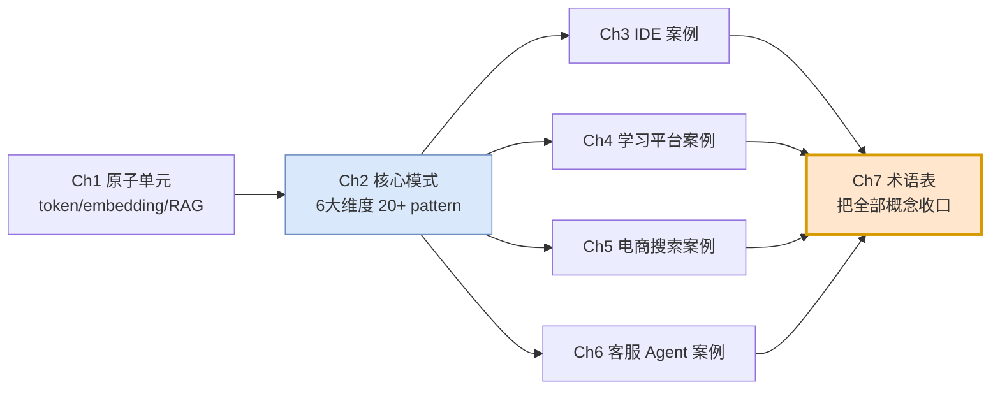
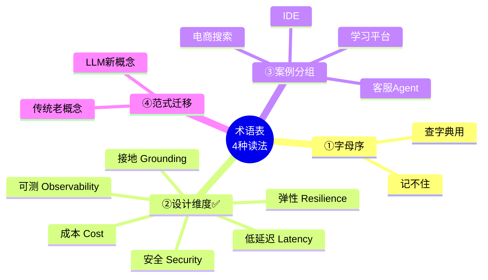
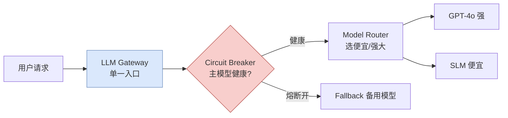
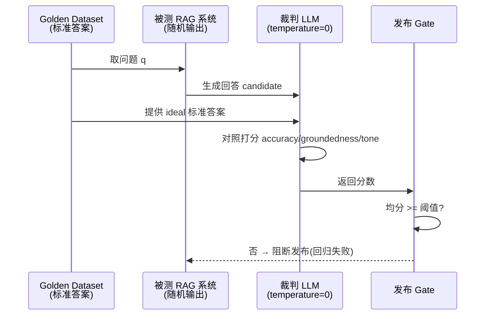
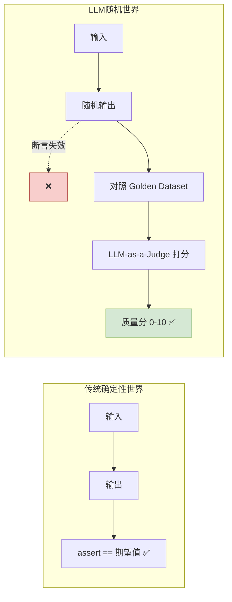
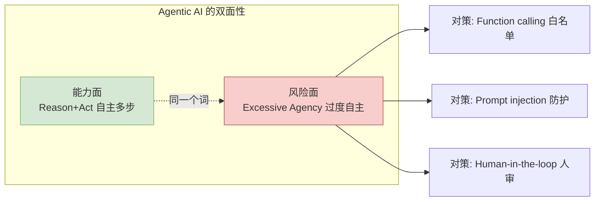
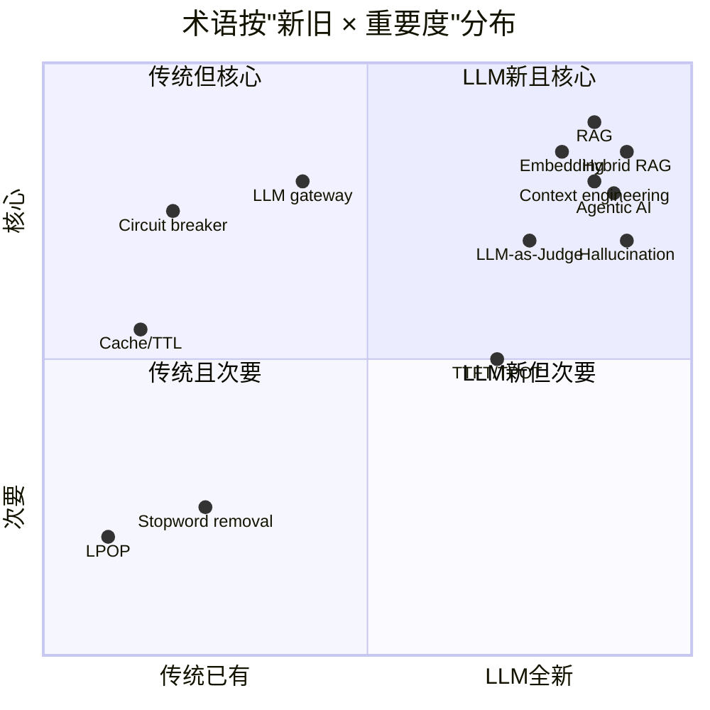
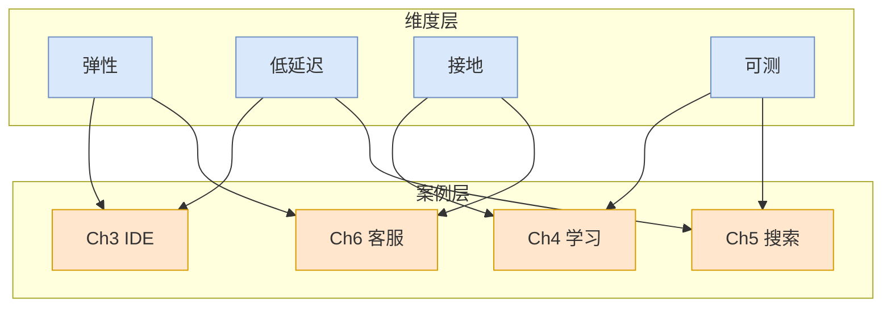
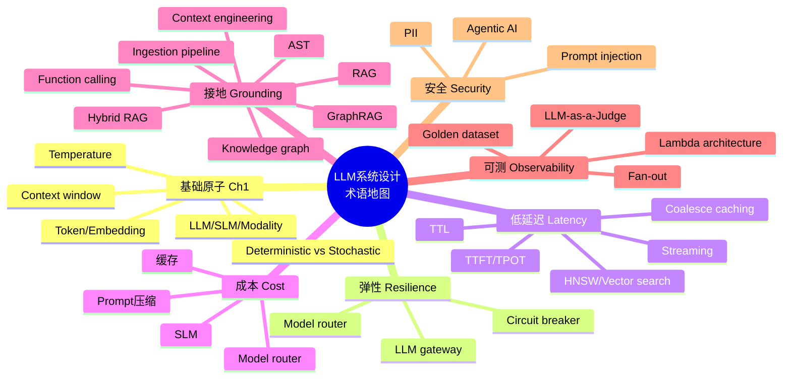

# 第 7 章 专题精讲 · 用「术语表(Glossary)」反向建构全书概念地图 🗺️

> 对应原书 **Chapter 7: Glossary**(PDF 第 252–257 页,书内页码 225–229)。
> 本篇是《Systems Design in the LLM Era》(Sampriti Mitra)逐章精讲的**收官专题**。

---

## 🧭 本章地图(读完能会什么)

原书第 7 章是一份 **Glossary(术语表)**——从 `A` 到 `V` 一共 40+ 个词条,每个词条一两句话给定义。表面看它"没内容",只是查字典用的附录。**但这正是我给本专题定的题眼:**

> **📌 定题:把术语表当作一张"全书概念地图(Concept Map)"来读——不是按字母 A→Z 背单词,而是按"系统设计维度"把 40+ 术语重新分层归类,并把每个术语显式连回前面 6 章讲过的模式(pattern)与案例(case study)。**

这是"读章定题"专题的标准打法:一份看似平淡的材料,只要换一个组织维度,就能变成把整本书**串成一条线**的复习总纲。读完这一篇你将能:

1. **一眼看懂**这本书的知识结构:6 大设计维度 × 40+ 术语 × 4 个案例是怎么咬合的;
2. 拿到任何一个术语(比如 `Coalesce caching`、`GraphRAG`、`Circuit breaker`),**立刻说出**它属于哪个维度、解决什么问题、在哪一章的哪个案例里被用过、代价是什么;
3. 建立**面试作战地图**:被问到"你会怎么设计一个 XX AI 系统",能按维度逐一点出应该动用哪些 pattern;
4. 理解 LLM 时代系统设计**区别于传统系统设计**的第一性原理(确定性 → 随机性、精确匹配 → 语义匹配、无状态 → 上下文工程)。

> 🔬 **第一性原理:术语表是一本书的"压缩表示(compressed representation)"。** 一个作者选择把哪些词收进 Glossary,就等于声明"这些是本书的核心概念"。所以逆向读术语表 = 读作者亲手标注的"知识点清单"。我们要做的,是给这份清单**补上关系(edges)**,把一份"节点列表"升级成一张"知识图谱(knowledge graph)"——这本身就是本书 GraphRAG 一章的思想!

---

## 0️⃣ 先看全貌:这本书在讲什么(1 分钟回顾前 6 章)

在深入术语之前,先用一张表把全书骨架立起来。术语表里的每个词,都是从这 6 章里"抽"出来的。

| 章 | 主题 | 一句话 | 产出的核心术语 |
|---|---|---|---|
| **Ch1** | Atomic Units of LLM Systems(原子单元) | LLM 系统的"最小零件":token / embedding / RAG / context | `Token` `Embedding` `Context window` `RAG` `GraphRAG` `Deterministic vs Stochastic` |
| **Ch2** | Core Architectural Patterns(核心架构模式) | 6 大设计维度下的 20+ 个可复用 pattern | `LLM gateway` `Circuit breaker` `Coalesce caching` `Model router` `LLM-as-a-Judge` |
| **Ch3** | Case Study: AI-Native IDE(如 Cursor) | 代码补全 + 聊天 + 后台 agent | `AST` `Merkle tree`(增量同步) `Speculative decoding` |
| **Ch4** | Case Study: Adaptive Learning(自适应学习) | 离线出题 + 在线推题 | `Fan-out` `Function calling`(确定性判分) `Golden dataset` |
| **Ch5** | Case Study: E-Commerce Search(电商搜索) | 离线查询处理 + 实时搜索 | `HNSW` `Vector search` `TTFT/TPOT` `Lambda architecture` |
| **Ch6** | Case Study: Customer Support Agent(客服) | Hybrid RAG + 知识图谱 | `Hybrid RAG` `Knowledge graph` `Ingestion pipeline` `PII` |
| **Ch7** | **Glossary(本章)** | 把上面所有概念**收口成词典** | —— 全部 —— |



**关键洞察:** Ch2 是"模式库",Ch3–6 是"模式的四次实战应用",Ch7 术语表则是"模式库 + 实战里所有名词的索引"。所以**读术语表 = 同时复习 Ch1–6**。这就是为什么我把本专题定为"用术语表反建全书地图"。

---

## 1️⃣ 定题的方法论:一份术语表,四种读法 📖

拿到一份术语表,新手会"从 A 背到 V";高手会先问"**用什么维度重排它**"。同一份 40 词的表,不同维度会长出完全不同的复习效果:

| 读法 | 组织维度 | 适合场景 | 缺点 |
|---|---|---|---|
| ① 字母序(原书顺序) | A→Z | 查字典 | 相邻词毫无关系,记不住 |
| ② **按设计维度分层** ✅ | 弹性/延迟/成本/接地/可测/安全 | **系统复习 + 面试** | 需要自己重组 |
| ③ 按案例分组 | 挂到 4 个 case study 上 | 项目实战 | 通用概念无处安放 |
| ④ 按"传统 vs LLM 新增" | 老概念 / LLM 时代新概念 | 理解范式迁移 | 不利于查询 |

**本专题主选 ②,辅以 ④** 收尾。理由:读法 ② 正好对齐 Ch2 那"6 个 Designing for …"小节标题,能把术语表和全书主线焊死。



> 💡 **面试高频套路:** 面试官问"介绍下你对 LLM 系统设计的理解",最掉分的答法是列名词。最高分的答法是**先给维度(弹性/延迟/成本/接地/可测/安全),再往每个维度里填 pattern**。这份"维度骨架"就是本章要帮你建的。

---

## 2️⃣ 核心:按 6 大设计维度重排术语表 🏗️

这是全篇的主体。我把原书 40+ 术语,按 Ch2 的 6 个设计维度(外加"基础概念层")重新归类。**每个术语都给出:是什么 / 属于哪个维度 / 在哪章用过 / 代价**。

### 🧱 第 0 层:基础原子概念(Ch1,一切的地基)

这些是"LLM 系统的原子单元",没有它们后面全塌。

| 术语(中英) | 是什么(书中定义精炼) | 为什么重要 | 代价 / 坑 ⚠️ |
|---|---|---|---|
| **Token(词元)** | LLM 处理文本的**最小单位**(一个词的一部分);用量与计费都按 token 算 | 成本、延迟、上下文长度全部以 token 计量 | 中文/代码的 token 密度不同,估算易偏 |
| **Embedding(嵌入)** | 表示文本**语义**的高维数值向量;让机器按"意思"而非"关键词"比较 | 向量检索、语义缓存、RAG 的基础 | 维度高→存储/检索贵;模型换了要重灌 |
| **Context window(上下文窗口)** | LLM 的**短期记忆**;一次能处理的 token 硬上限(含 prompt + 生成) | 决定你能塞多少历史/RAG 上下文 | 塞满→贵 + "lost in the middle" |
| **Pre-training(预训练)** | 在海量数据上训练、教模型语言与世界知识的**初始昂贵阶段** | 通用能力的来源 | 极贵,普通团队不做 |
| **Fine-tuning(微调)** | 在小而专的数据上**继续训练**,提升某领域(医疗/法律)专长 | 领域定制 | 需数据 + 有遗忘/过拟合风险 |
| **Prompt(提示词)** | 给模型触发响应的**输入指令** | 交互入口 | —— |
| **Prompt engineering(提示工程)** | 用上下文/人设/约束**优化输入**以提升输出质量 | 最便宜的效果提升手段 | 脆弱,模型一换就可能失效 |
| **Reasoning(推理)** | LLM **逻辑处理**信息得出结论(常靠 chain-of-thought 模拟) | 复杂任务能力 | 慢 + 贵(更多 token) |
| **Deterministic(确定性)** | 相同输入**永远**得到相同输出;传统软件几乎都是 | 传统系统的假设 | LLM **不满足** |
| **Stochastic(随机性)** | 含随机;LLM 按概率选下一个 token,**同输入可能异输出** | 理解 LLM 一切"不稳"的根源 | 测试/缓存/复现都变难 |
| **Temperature(温度)** | 控制输出随机性的参数;低(0.1)确定/聚焦,高(0.8)创意/发散 | 一个旋钮平衡稳定 vs 创意 | 调高→幻觉/跑题风险↑ |
| **AI / ML / DL / NLP / GenAI** | 从大到小的同心圆:AI ⊃ ML ⊃ DL;NLP 是语言分支;GenAI 会"生成"新内容 | 术语坐标系 | 概念混用易露怯 |
| **LLM / SLM** | 大语言模型(互联网级、通用) / 小语言模型(紧凑、专用、可本地、低延迟低成本) | SLM 是省钱/降延迟的关键选项 | SLM 能力弱,需选型 |
| **Modality(模态)** | 模型能处理的数据格式:文本/图像/音频/视频 | 多模态系统设计 | 每增一模态复杂度↑ |

> 🔬 **第一性原理——为什么 Ch1 要先讲 "Deterministic vs Stochastic"?** 因为传统系统设计的所有工具(单元测试、精确缓存、幂等重试)都**默认确定性**。LLM 一旦变成 stochastic,这些工具全部需要"改造":测试要变成 `Golden dataset` + `LLM-as-a-Judge`,精确缓存要退化成**语义**缓存,重试要配 `Temperature=0` 才能勉强复现。**整本书的后半段,本质上都是在为"随机性"打补丁。** 抓住这条主线,术语表就活了。

---

### 🛡️ 维度一:弹性与可靠性(Designing for Resilience,Ch2)

**要解决的问题:** LLM API 会超时、限流、宕机、乱价。系统怎么"不被外部依赖拖垮"。

| 术语 | 是什么 | 关联章节 | 类比 |
|---|---|---|---|
| **LLM gateway(LLM 网关)** | 所有 LLM 调用的**单一入口**微服务,统管路由/鉴权/限流/failover | Ch2 首个 pattern;Ch5 叫 "GenAI service" | API 网关的 LLM 版 |
| **Circuit breaker(熔断器)** | 检测外部 provider 失败时**临时停发请求**(打开电路),防级联雪崩,常转发到 fallback 模型 | Ch2 + Ch3/4/5 全部案例都用 | 家里的保险丝 |
| **Model router(模型路由器)** | 网关内的逻辑组件,按任务复杂度/成本**动态选模型**(便宜 vs 强大) | Ch2 + Ch4/5 | 分诊台 |



> 💡 **实战:** 这三个术语几乎总是**一起出现**——网关是壳,熔断是壳里的安全阀,路由是壳里的分诊。面试里说"我会加个 LLM gateway",紧接着一定要能补出"里面挂 circuit breaker 做 tiered fallback,挂 model router 做成本路由",才算完整。

---

### ⚡ 维度二:低延迟(Designing for Low Latency,Ch2)

**要解决的问题:** LLM 生成慢(逐 token 吐字)。怎么让用户"感觉快"。

| 术语 | 是什么 | 关联章节 | 代价 ⚠️ |
|---|---|---|---|
| **TTFT(首 token 时间)** | 用户发 prompt → 看到**第一个字符**的耗时 | Ch1/Ch5 指标 | 决定"卡不卡"的第一印象 |
| **TPOT(每 token 时间)** | 生成**单个 token** 的耗时;高=模型慢/过载 | Ch1/Ch5 指标 | 决定"吐字流不流畅" |
| **Response streaming(流式响应)** | 边生成边推给前端,不等全文 | Ch2 pattern | 前端要支持 SSE/流 |
| **Coalesce caching(合并缓存)** | 流量尖峰时,中间件识别**完全相同的在途请求**,暂停后续,让一个 LLM 响应服务所有等待用户 | Ch2 + Ch6 客服 | 只对"同一瞬间同请求"有效 |
| **Vector search(向量检索)** | 用 embedding 找**语义相似**数据,哪怕无共同关键词('pay' 匹配 'salary') | Ch1/5/6 | 需向量库 + 索引 |
| **HNSW(分层可导航小世界)** | 向量库(如 pg_vector)**极快找最近邻**的算法,不用扫全库 | Ch5 电商搜索 | 近似≠精确,召回有损 |
| **TTL(存活时间)** | Redis 等的功能,数据到点(如 5 分钟)**自动删除** | Ch2/5/6 缓存 | 设短→命中低;设长→数据陈旧 |
| **LPOP** | Redis 操作:移除并返回列表**首元素** | Ch2/4 队列 | 单纯的实现细节 |

> 🔬 **第一性原理——延迟的"三段式攻击":** 一次 LLM 请求的延迟 = 检索(vector search + HNSW) + 首字(TTFT) + 逐字(TPOT × token 数)。三段各有武器:检索段用 **HNSW** 加速,首字段用 **streaming + coalesce caching** 掩盖,逐字段用 **SLM / speculative decoding** 提速。**背延迟术语时,就往这三段里塞。**

```mermaid
gantt
    title 一次请求的延迟拆解与对应武器
    dateFormat X
    axisFormat %s
    section 检索段
    Vector search + HNSW :0, 3
    section 首字段 TTFT
    命中语义缓存/streaming :3, 4
    section 逐字段 TPOT
    SLM/投机解码逐token生成 :4, 10
```



---

### 💰 维度三:成本优化(Designing for Cost,Ch2)

**要解决的问题:** LLM 按 token 计费,规模一上来账单爆炸。

| 术语 | 是什么 | 关联章节 | 省钱原理 |
|---|---|---|---|
| **Model router(模型路由)** | (同弹性维度)简单任务走便宜模型,难任务才走贵模型 | Ch4/5 | 只为难题付贵价 |
| **SLM(小模型)** | 紧凑、可本地、低延迟低成本 | Ch6 客服(预处理用 SLM) | 用小模型做粗活 |
| **Prompt engineering / 压缩** | 优化并压缩 prompt,减少 token | Ch2/3 | token 少=钱少 |
| **各级缓存(Exact/Semantic/Proactive)** | 命中缓存 = 0 次 LLM 调用 | Ch3/5/6 | 不调用最省钱 |

> ⚠️ **常见坑:** 只盯着"换便宜模型"省钱,忽略了**缓存才是省钱之王**——一次语义缓存命中省下的是"整次 LLM 调用"。术语表里 `Coalesce caching` + `TTL` + `Vector search`(做语义缓存 key)这一串,本质都是成本优化。缓存维度和延迟维度**高度重叠**,这不是巧合:少调一次 LLM,既快又省。

---

### 📚 维度四:接地与数据管理(Designing for Grounding,Ch2 + Ch1/6)

**要解决的问题:** LLM 会一本正经胡说(幻觉)。怎么让它"有据可依"。**这是全书术语最密集的一块。**

| 术语 | 是什么 | 关联章节 | 层级 |
|---|---|---|---|
| **Hallucination(幻觉)** | LLM **自信地生成错误/无意义**信息,因为它统计上"看着合理" | 贯穿全书的敌人 | 问题 |
| **RAG(检索增强生成)** | 从外部源检索相关私有数据,**注入上下文窗口**,把回答"锚定"在事实上 | Ch1/6 核心 | 解法·基础 |
| **Ingestion pipeline(摄取管线)** | **异步**数据管线:清洗→分块→嵌入→入向量库,为 RAG 备料 | Ch6 客服 | 解法·上游 |
| **Embeddings / Vector search** | (见基础层)RAG 的检索引擎 | Ch1/5/6 | 解法·检索 |
| **Knowledge graph(知识图谱,KG)** | 以**实体(节点)+ 关系(边)** 存储,支持按逻辑连接检索 | Ch1/6 | 解法·结构化 |
| **GraphRAG** | 结合知识图谱与 LLM,能**遍历实体间关系**,不只靠向量相似 | Ch1/6 | 解法·进阶 |
| **Hybrid RAG(混合 RAG)** | **同时查向量库(语义)+ 知识图谱(结构关系)**,拼出更丰富上下文 | Ch6 客服 | 解法·终极 |
| **AST(抽象语法树)** | 源码的树状结构表示,捕捉类/函数/方法层级;用于**语义化代码分块** | Ch1/3 IDE | 解法·代码域 |
| **Function calling(函数调用)** | LLM 输出**结构化请求**(如 JSON `verify_math(2+2)`)去调工具/API,而非生成文本 | Ch1/4 判分 | 解法·工具 |
| **Context engineering(上下文工程)** | 战略性设计数据管线,**组装**(历史+RAG+指令)刚好塞进上下文窗口 | Ch1 | 解法·总控 |
| **Stopword removal(停用词过滤)** | NLP 预处理,滤掉 'the/a/is' 等**语义贫乏**的高频词 | Ch5/6 预处理 | 解法·清洗 |

```mermaid
flowchart TD
    Q[用户问题] --> HR{Hybrid RAG}
    HR --> VS[Vector Search<br/>语义相似]
    HR --> KG[Knowledge Graph<br/>结构关系遍历 = GraphRAG]
    VS --> CTX[Context Engineering<br/>组装上下文]
    KG --> CTX
    CTX -->|注入 context window| LLM[LLM 生成]
    LLM --> A[有据可依的回答<br/>幻觉↓]

    subgraph 上游·离线
    ING[Ingestion Pipeline<br/>清洗→分块→嵌入→入库] --> VS
    ING --> KG
    end
    style HR fill:#d5e8d4,stroke:#82b366
    style A fill:#d5e8d4,stroke:#82b366
```

> 🔬 **第一性原理——RAG 的进化阶梯:** `RAG(纯向量)` → `GraphRAG(纯图)` → `Hybrid RAG(向量+图)`。为什么要进化?**因为向量检索只会"找相似",不会"找关系"。** 客服问"错误码 E-501 的上游依赖是什么"——向量检索找到的是"和 E-501 文字相似"的段落,而知识图谱能顺着 `E-501 --依赖--> 服务A --调用--> 服务B` 的**边**走过去。Ch6 之所以是全书最难的案例,就是因为它把这条阶梯走到了顶(Hybrid RAG)。术语表里 `RAG / GraphRAG / Hybrid RAG / KG` 这 4 个词,记的时候要连成一条**进化线**,而不是 4 个孤立词。

> 💡 **面试高频:** "RAG 和 Fine-tuning 怎么选?"——标准答案:**RAG 换的是"知识"(外挂事实库,实时更新、可溯源),Fine-tuning 换的是"技能/风格"(改模型行为,但知识固化、难更新)。** 需要最新/私有事实 → RAG;需要固定输出格式/领域语气 → Fine-tuning。这两个词在术语表里离得很远(F 和 R),但必须一起记。

#### 🧩 代码走读 A:`Function calling` —— 让 LLM 从"会说"变成"会做"(呼应 Ch4 确定性判分)

术语表说 Function calling 是"LLM 输出结构化请求(如 `verify_math(2+2)`)去调工具"。抽象。我们把 Ch4 学习平台"用函数调用做**确定性判分**"这个场景补成可运行伪码,逐行拆:

```python
# ① 定义"工具"——一个纯 Python 的确定性判分函数(注意:这里没有 LLM,是普通代码)
def verify_math(expression: str, student_answer: float) -> bool:
    """把学生答案和标准答案做精确比较。确定性(deterministic)!"""
    correct = eval(expression)          # 生产环境要用安全求值,别真用 eval
    return abs(correct - student_answer) < 1e-6

# ② 把工具的"说明书"用 JSON Schema 描述给 LLM(这是 function calling 的核心:告诉模型有哪些工具、参数长啥样)
tools = [{
    "type": "function",
    "function": {
        "name": "verify_math",                       # 工具名,必须和上面函数名对得上
        "description": "校验一道数学题学生答案是否正确",   # 描述越准,LLM 越会在对的时候调它
        "parameters": {
            "type": "object",
            "properties": {
                "expression":     {"type": "string", "description": "标准算式,如 '2+2'"},
                "student_answer": {"type": "number", "description": "学生填的答案"}
            },
            "required": ["expression", "student_answer"]
        }
    }
}]

# ③ 把题目 + 工具清单一起发给 LLM
response = llm.chat(
    messages=[{"role": "user", "content": "学生对 '2+2' 答了 5,对吗?"}],
    tools=tools                                       # 关键:把工具说明书塞进去
)

# ④ LLM 不会自己算数(它随机、会算错),而是"输出一个结构化调用请求"
tool_call = response.tool_calls[0]
# tool_call.function.name      == "verify_math"
# tool_call.function.arguments == '{"expression": "2+2", "student_answer": 5}'  ← LLM 只负责"填参数"

# ⑤ 我们的代码真正执行那个确定性函数(判分这一步不能交给随机的 LLM!)
import json
args = json.loads(tool_call.function.arguments)
result = verify_math(**args)                          # -> False,永远是 False,可复现

# ⑥ 把确定性结果回喂给 LLM,让它组织自然语言反馈
final = llm.chat(messages=[
    {"role": "user", "content": "学生对 '2+2' 答了 5,对吗?"},
    {"role": "tool", "content": str(result)}          # 告诉 LLM:工具算出来是 False
])
# final -> "答案不对哦,2+2 应该等于 4,你写了 5。再试一次?"
```

**逐行要义:**
- **第 ①/⑤ 步是灵魂:** 真正判分的是 `verify_math`(纯代码,`Deterministic`),**不是 LLM**。为什么?因为术语表明确写了 LLM 是 `Stochastic`——让随机模型算数,它可能把 `2+2` 算成 5。**Function calling 的本质,就是把"需要精确的活"从随机 LLM 手里夺回给确定性代码。**
- **第 ②/④ 步:** LLM 的职责退化为"**理解意图 + 填 JSON 参数**",这是它擅长的;计算交给工具,这是它不擅长的。这正是 Ch4"用函数调用做确定性判分"要传达的架构智慧。
- **代价 ⚠️:** LLM 可能"该调工具时不调"或"填错参数",所以生产上要校验 `arguments` 的 schema,并对未调用工具的情况兜底。

> 🔬 **第一性原理:** `Function calling` 是 `Agentic AI` 的"手"。Agent 的 Reason+Act 循环里,"Act"这一步几乎全靠 function calling 落地——没有工具调用,LLM 只能"想"不能"做"。所以术语表里 `Agentic AI`(A)和 `Function calling`(F)虽隔得远,却是"大脑"和"手"的关系。

#### 🧩 代码走读 B:`LLM-as-a-Judge` + `Golden dataset` —— 给随机输出做"模糊断言"(呼应 Ch5/Ch6)

Ch6(书内页 243–245)给了 LLM-Judge 的真实 prompt/输出示例。核心思路:**用一个强模型当考官,对照 Golden dataset 的标准答案给被测模型打分**。补成可运行伪码:

```python
# ① Golden dataset:人工精挑的 (问题, 理想答案) 对,作为 ground truth
golden = [
    {"q": "怎么重置密码?", "ideal": "进入设置>安全>重置密码,按邮件链接操作。"},
    # ... 通常几百上千条,覆盖 FAQ / 复杂 RAG / 错误码 / 不可答 四类 ...
]

# ② 被测系统(我们的 RAG 客服)对同一批问题生成回答
candidate = rag_system.answer(golden[0]["q"])   # 随机!每次可能措辞不同

# ③ 构造给"裁判 LLM"的评分 prompt —— 这是 LLM-as-a-Judge 的核心
judge_prompt = f"""
你是严格的质检员。请对照【标准答案】给【待测回答】打分(1-5),并只输出 JSON。
问题:{golden[0]['q']}
标准答案:{golden[0]['ideal']}
待测回答:{candidate}
评分维度:accuracy(准确性)、groundedness(是否有据、无幻觉)、tone(语气)。
输出格式:{{"accuracy": int, "groundedness": int, "tone": int, "reason": str}}
"""

# ④ 让强模型(如 GPT-4o)当裁判,而不是用人工逐条看
judge_out = strong_llm.chat(judge_prompt, temperature=0)   # 注意 temperature=0 求稳定
# judge_out -> {"accuracy": 5, "groundedness": 5, "tone": 4,
#               "reason": "回答与标准一致,步骤完整,语气可再亲切"}

# ⑤ 聚合成回归指标:这批 golden 的平均分,作为"发布 gate"
scores = [judge(strong_llm, g, rag_system.answer(g["q"])) for g in golden]
avg_grounded = mean(s["groundedness"] for s in scores)
assert avg_grounded >= 4.5, "接地分下跌,阻断发布!"   # ← 这就是随机世界里的"断言"
```

**逐行要义:**
- **第 ③ 步的 `groundedness` 维度**直接对付术语表里的 `Hallucination`:让裁判检查"回答是不是真的基于给定资料",分低就是在幻觉。
- **第 ④ 步 `temperature=0`:** 裁判自己也是 LLM(`Stochastic`),为了让评分**尽量可复现**,把温度压到 0(靠近 `Deterministic`)。这是术语表 `Temperature` 词条的实战落点。
- **第 ⑤ 步把浮点均分当断言:** 传统 `assert output == expected` 在随机世界失效,于是退化成 `assert avg_score >= 阈值`——**这就是"模糊断言"**,是 `Golden dataset` + `LLM-as-a-Judge` 联手给出的新测试范式。
- **代价 ⚠️:** 裁判 LLM 有偏见(偏爱长回答、偏爱自家风格),且每次评估都烧 token(贵)。所以 Golden set 不能太大,且高风险场景仍需 `Human-in-the-loop`(人审)兜底。



---

### 🔬 维度五:可测试与可观测(Designing for Testability & Observability,Ch2 + Ch4/5/6)

**要解决的问题:** LLM 是随机的,传统"断言 == 期望值"测不了。怎么评估质量。

| 术语 | 是什么 | 关联章节 | 对应的传统概念 |
|---|---|---|---|
| **Golden dataset(黄金数据集)** | **人工精挑**的输入→理想输出集,作为测试与基准的 ground truth | Ch4/6 | 传统的测试用例 |
| **LLM-as-a-Judge(LLM 当裁判)** | 用一个**强模型**(如 GPT-4)给另一个模型的输出打分(对照 golden set) | Ch5/6 | 传统的断言 assert |
| **Fan-out(扇出)** | 把一个大任务(生成 100 题)拆成许多小任务(10 个 worker 各 10 题)**并行跑** | Ch4 出题 | MapReduce 的 Map |
| **Lambda architecture(Lambda 架构)** | **批处理层**(准确历史) + **速度层**(实时) 在服务层合并,做容错可扩展的综合数据视图 | Ch4/5 | 大数据经典架构 |

> 🔬 **第一性原理——测试的范式迁移:** 传统测试 `assert output == expected`,在 stochastic 世界里必然失败(同输入异输出)。于是本书给出替代:用 **Golden dataset** 提供"理想答案的分布",用 **LLM-as-a-Judge** 做"模糊断言"(打分而非等值判断)。**这就是 Ch1 那句 "LLMs are not deterministic" 埋下的伏笔在 Ch5/6 结的果。** 术语表把 `Deterministic`/`Stochastic`(Ch1)和 `Golden dataset`/`LLM-as-a-Judge`(Ch2/5/6)分列在 D/S/G/L 各处,但它们是**同一条因果链的两端**。



---

### 🔒 维度六:安全与信任(Designing for Security,Ch2)

**要解决的问题:** LLM 会被"话术攻击",会泄密。

| 术语 | 是什么 | 关联章节 | 对应 OWASP LLM 风险 |
|---|---|---|---|
| **Prompt injection(提示注入)** | 恶意输入**诱骗 LLM 无视系统指令**、执行未授权动作 | Ch2 安全 | LLM01 |
| **PII(个人身份信息)** | 能直接(姓名/身份证)或间接(IP/生日组合)**识别个人**的数据 | Ch6 客服(Spark 里做 PII 脱敏) | 敏感信息 |
| **Agentic AI(自主智能体)** | 用 LLM **推理→规划→执行**多步工作流(Reason+Act 循环)达成高层目标,无需预设路径 | Ch1/3(后台 agent) | 过度自主(LLM08)风险源 |

> ⚠️ **常见坑——Agentic AI 是"能力"也是"风险":** 术语表把 `Agentic AI` 放在能力词里,但书的安全章把它列为"excessive agency(过度自主)"的风险源。**同一个概念,一面是卖点(自动化多步任务),一面是雷区(它可能自作主张删库)。** 设计 agent 系统时,`Function calling` 要配白名单、`Prompt injection` 要防、动作要人审(human-in-the-loop)。



---

## 3️⃣ 第二种读法:传统概念 vs LLM 时代新概念(范式迁移)🔄

把同一份术语表按"**这个词在传统系统设计里存不存在**"重排,能一眼看出**LLM 到底给系统设计带来了什么新东西**。这是本专题的"点睛"读法。

| 传统系统设计**早就有**(LLM 只是复用) | LLM 时代**全新**(传统世界不存在) |
|---|---|
| Circuit breaker(微服务弹性) | **Token**(计费/长度的新原子) |
| Cache / TTL / LPOP(缓存) | **Embedding / Vector search**(语义检索) |
| API gateway → **LLM gateway** | **Context window / Context engineering** |
| Lambda architecture(大数据) | **RAG / GraphRAG / Hybrid RAG**(接地) |
| Fan-out(并行) | **Prompt / Prompt engineering / injection** |
| Load balancing / sharding(扩展) | **Stochastic / Temperature**(随机性) |
| HNSW(近邻搜索,ML 早有) | **LLM-as-a-Judge / Golden dataset**(模糊测试) |
| —— | **Agentic AI / Function calling**(自主执行) |
| —— | **Hallucination**(要专门对付的新失败模式) |
| —— | **TTFT / TPOT**(逐 token 生成的新延迟指标) |



> 🔬 **第一性原理——LLM 给系统设计的"三大新增"到底是什么?** 从上表右列可以归纳出三条主轴:
> 1. **确定性 → 随机性(Stochastic/Temperature/Hallucination)**:逼出全新的测试(LLM-as-a-Judge)、缓存(语义而非精确)、可观测(TTFT/TPOT)手段;
> 2. **关键词 → 语义(Embedding/Vector search)**:逼出向量库、HNSW、语义缓存;
> 3. **无状态调用 → 上下文即一切(Context window/RAG/Context engineering)**:逼出 RAG 全家桶、ingestion pipeline、context engineering。
>
> **把这三条轴背下来,你就抓住了整本书的"魂"。** 术语表的 40 个词,90% 都能挂到这三条轴的某一条上。

---

## 4️⃣ 四个案例回照:术语在实战里怎么落地 🎯

"读章定题"的最后一步,是把术语**钉回**前面 4 个案例,验证"概念地图"确实覆盖了实战。下表每行是一个案例,列出它**最有代表性的术语组合**:

| 案例(章) | 核心术语组合 | 一句话看点 |
|---|---|---|
| **IDE(Ch3)** | `AST` + `Vector search` + `Speculative decoding` + `Merkle tree` + `Circuit breaker` | 用 AST 做**语义分块**、投机解码抢延迟、Merkle 树做增量同步 |
| **学习平台(Ch4)** | `Fan-out` + `Function calling` + `Golden dataset` + `Model router` | 扇出**并行出题**、函数调用做**确定性判分**、离线/在线双管线 |
| **电商搜索(Ch5)** | `HNSW` + `Vector search` + `TTFT/TPOT` + `LLM-as-a-Judge` + `Lambda architecture` | ANN 极速召回、P99 延迟权衡、A/B + Judge 评估 |
| **客服 Agent(Ch6)** | `Hybrid RAG` + `Knowledge graph` + `Ingestion pipeline` + `PII` + `Coalesce caching` | **图+向量混合检索**是全书接地维度的天花板 |



> 💡 **实战复盘法:** 拿到一个新的 AI 系统设计题,就走这张"维度 → 术语 → 案例"三级映射:先问"这题吃重哪个维度(延迟?接地?)",再从该维度的术语框里挑 pattern,最后回想"哪个案例用过类似组合"。**这套流程就是本专题送你的最终武器。**

---

## 5️⃣ 面试自测:20 组"术语闪卡"(遮住右列自答)🎴

术语表最好的用法是**主动回忆(active recall)**。下面把易混/高频的 20 组做成闪卡,左列是问题,右列是标准答案。**先遮住右列自己答,再对照。**

| 问题(遮住右列先自答) | 标准答案 |
|---|---|
| `TTFT` 和 `TPOT` 差别? | TTFT=**首字**延迟(卡不卡的第一印象);TPOT=**每 token**延迟(吐字流不流畅)。前者靠缓存/streaming,后者靠 SLM/投机解码。 |
| `Deterministic` vs `Stochastic`,哪个是 LLM? | LLM 是 **Stochastic**(按概率选 token,同输入可能异输出)。这是全书一切"不稳"问题的根源。 |
| `Temperature` 调高会怎样? | 输出更**创意/随机**,但幻觉、跑题风险↑;判分/复现场景要压到 0。 |
| `RAG` 换的是什么?`Fine-tuning` 换的是什么? | RAG 换**知识**(外挂事实、可更新可溯源);Fine-tuning 换**技能/风格**(改行为、知识固化)。 |
| 什么时候必须上 `GraphRAG`? | 当查询需要**遍历实体关系**("A 的上游依赖是谁")而非仅找相似段落时。 |
| `Hybrid RAG` = ? | 向量库(语义)+ 知识图谱(结构关系)**同时查**,Ch6 客服的接地天花板。 |
| `Circuit breaker` 解决什么? | 外部 LLM provider 失败时**熔断**、防级联雪崩、转发到 fallback 模型。 |
| `LLM gateway` 里通常挂哪三样? | Circuit breaker(熔断)、Model router(成本路由)、rate limiting(限流)。 |
| `Coalesce caching` 和普通缓存差别? | 它合并的是**同一瞬间的相同在途请求**(尖峰去重),普通缓存复用的是历史结果。 |
| `HNSW` 是干嘛的? | 向量库**极快找近邻**的图算法,不扫全库(近似,有召回损失)。 |
| `Fan-out` 举例? | 生成 100 题 → 10 worker 各 10 题**并行**(Ch4 出题)。 |
| `Function calling` 本质? | 把"需精确的活"从随机 LLM 夺回给**确定性代码**;LLM 只填 JSON 参数。 |
| `Golden dataset` + `LLM-as-a-Judge` 解决什么? | 随机输出**无法 `==` 断言**,改用"标准答案 + 强模型打分"做**模糊断言**。 |
| `Context window` 塞太满有啥坑? | 贵(token 多)+ "lost in the middle"(中间信息被忽略)。 |
| `Context engineering` = ? | 战略性组装(历史+RAG+指令)**刚好塞进**上下文窗口。 |
| `SLM` 什么时候用? | 预处理/粗活/本地低延迟场景(Ch6 用 SLM 做预处理省钱)。 |
| `Prompt injection` 怎么防? | 输入隔离、指令与数据分离、输出校验、最小权限 + 人审。 |
| `Ingestion pipeline` 四步? | 清洗 → 分块 → 嵌入 → 入向量库(异步)。 |
| `AST` 在 IDE 里干嘛? | 按类/函数/方法层级做**语义化代码分块**(比按行切更准)。 |
| `Lambda architecture` 两条路? | 批处理层(准确历史)+ 速度层(实时),服务层合并。 |

> 💡 **刷卡技巧:** 每张卡答完追问自己一句"**它属于哪个维度?代价是什么?哪个案例用过?**"——能答全这三问,才算真会。

---

## 6️⃣ 「常见坑」总表(把 ⚠️ 收口成检查清单)🚨

把散落全篇的坑收成一张表,当作设计评审(design review)的 checklist:

| 术语 | 天真做法 ❌ | 正确姿势 ✅ |
|---|---|---|
| `Function calling` | 让 LLM 直接算数/判分 | 让 LLM 只填参数,**确定性代码执行** |
| `LLM-as-a-Judge` | 裁判用默认 temperature | `temperature=0` 求稳,且高风险仍要人审 |
| `Semantic cache` | 用精确匹配当缓存 key | 用 embedding 做**语义** key,配 `TTL` 防陈旧 |
| `RAG` | 一律纯向量检索 | 需关系时升级 `GraphRAG`/`Hybrid RAG` |
| `Context window` | 尽量塞满上下文 | 精选(context engineering),防 lost-in-the-middle |
| `Circuit breaker` | 只重试,不熔断 | 连续失败要**熔断 + fallback**,否则雪崩 |
| `Model router` | 全走最强模型 | 按复杂度分诊,简单题走 SLM 省钱 |
| `Agentic AI` | 给 agent 无限权限 | Function calling 白名单 + 动作人审 |
| `PII` | 只在查询端脱敏 | **摄取端**就脱敏(Ch6 Spark job 里做) |
| `Golden dataset` | 数据集越大越好 | 精而准 + 覆盖四类(FAQ/RAG/错误码/不可答) |

---

## 7️⃣ 附:一张速查图(把 40 词浓缩成一张脑图)🧠



---

## 📌 小结

1. **定题的思路** = 把一份"平淡"的术语表,换成"设计维度"这个组织维度来读,它立刻变成串起全书的**概念地图**。这就是"读章定题"专题的方法论:**材料不变,维度一换,价值翻倍。**
2. **6 大设计维度**(弹性 / 低延迟 / 成本 / 接地 / 可测 / 安全)是全书的骨架,也是面试作战地图。术语表里 90% 的词都能挂到某个维度上。
3. **接地维度(RAG 全家桶)是术语最密的一块**,记住进化阶梯:`RAG → GraphRAG → Hybrid RAG`——从"找相似"进化到"找关系"。
4. **LLM 给系统设计的三大新增**:随机性(→新测试/缓存/指标)、语义检索(→向量库/HNSW)、上下文即一切(→RAG/context engineering)。抓住这三条轴 = 抓住全书的魂。
5. **四个案例回照**验证了概念地图的完整性:IDE(延迟/AST)、学习平台(fan-out/函数调用判分)、电商搜索(HNSW/Judge)、客服(Hybrid RAG 天花板)。
6. **一句话记住本书:** 传统系统设计假设"确定性",而 LLM 是"随机的";这本书的全部 pattern,本质上都是在为"随机性 + 语义 + 上下文"这三件新事**打补丁**。

> 🎓 **收官寄语:** 术语表通常是最被忽略的一章,但对复习者而言它是"最高信息密度"的一章——因为它是作者亲手压缩的知识清单。**逆向读术语表 = 用作者的目录反建自己的知识图谱。** 这个技巧不止适用于本书,适用于任何技术书。

---

## 🔗 延伸阅读

**本书其它章(逐章精讲同目录):**
- `01_原子单元(Atomic Units).md` —— token / embedding / RAG / 确定性 vs 随机性的第一性原理(本章基础层的详细展开)
- `02_核心架构模式(Core Patterns).md` —— 6 大设计维度 20+ pattern 的正式定义(本章维度骨架的来源)
- `03_案例_AI原生IDE.md` —— AST / Merkle 同步 / 投机解码
- `04_案例_自适应学习平台.md` —— fan-out / function calling 判分 / 离线在线双管线
- `05_案例_电商AI搜索.md` —— HNSW / TTFT-TPOT / LLM-as-a-Judge + A/B
- `06_案例_客服Agent(Hybrid RAG).md` —— 知识图谱 / GraphRAG / ingestion pipeline / PII 脱敏

**llm-action 仓库既有内容(横向对照):**
- `llm-inference/` —— 推理服务化:TTFT/TPOT、投机解码(speculative decoding)、连续批处理的工程实现,补齐本章"低延迟维度"的底层原理
- `ai-infra-architecture/` —— LLM 网关 / 模型路由 / 弹性架构的基础设施视角,对照本章"弹性维度"
- `llm-inference/` 中的 KV Cache、PagedAttention 等,是本章 `Context window` 术语背后的显存工程
- `llm-interview/` —— RAG vs Fine-tuning、幻觉治理、Agent 设计等高频面试题,与本章"面试作战地图"直接呼应

**外部权威参考(书中隐含引用的方法论):**
- OWASP Top 10 for LLM Applications —— 本章"安全维度"(prompt injection / excessive agency / sensitive info disclosure)的标准分类来源
- 微软 GraphRAG、Neo4j 知识图谱 —— 本章"接地维度"进化阶梯的工业实现参考
