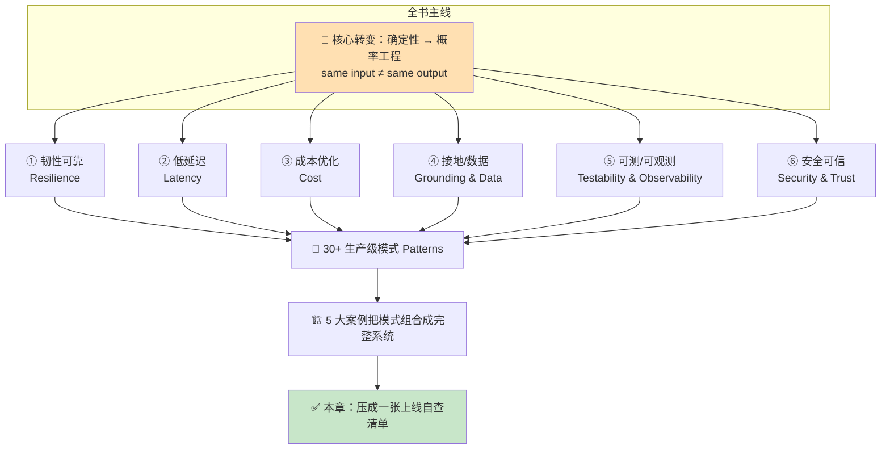
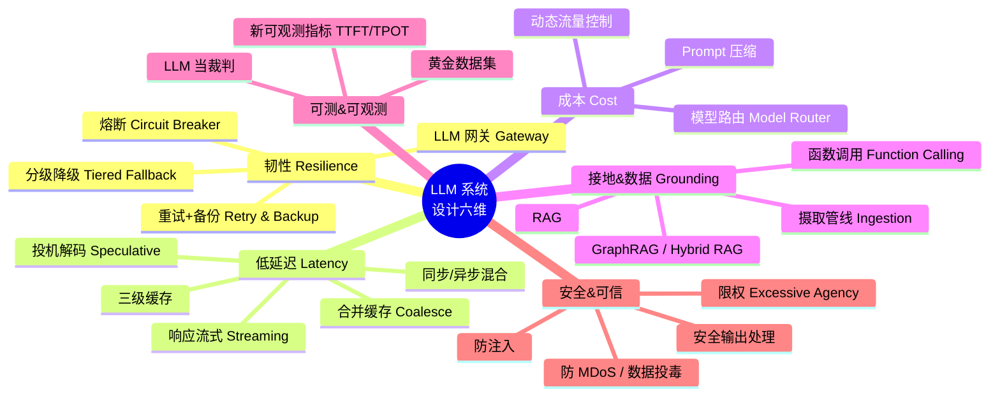
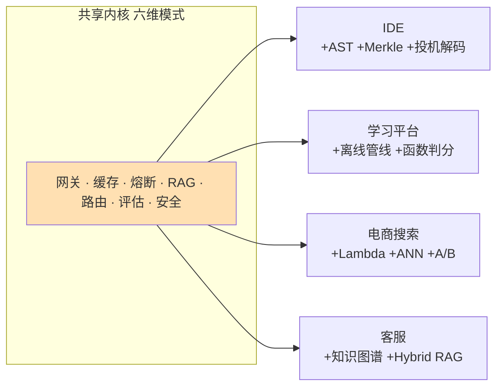
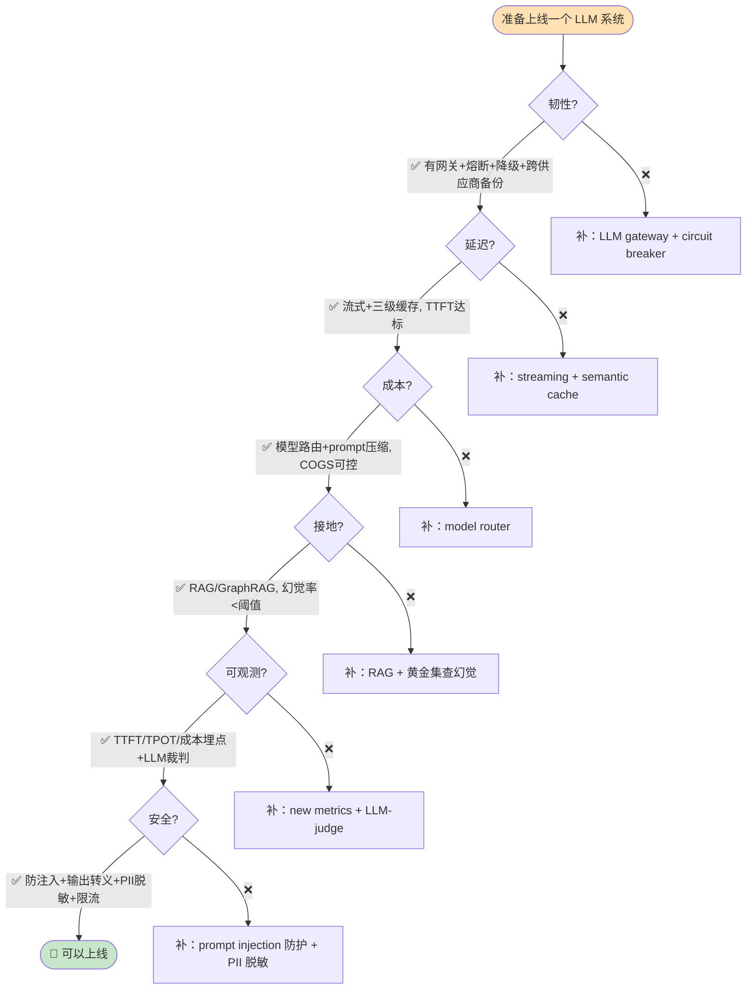
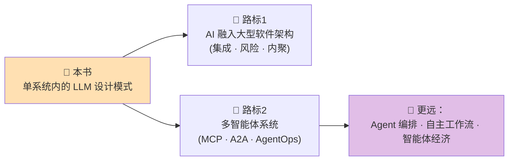
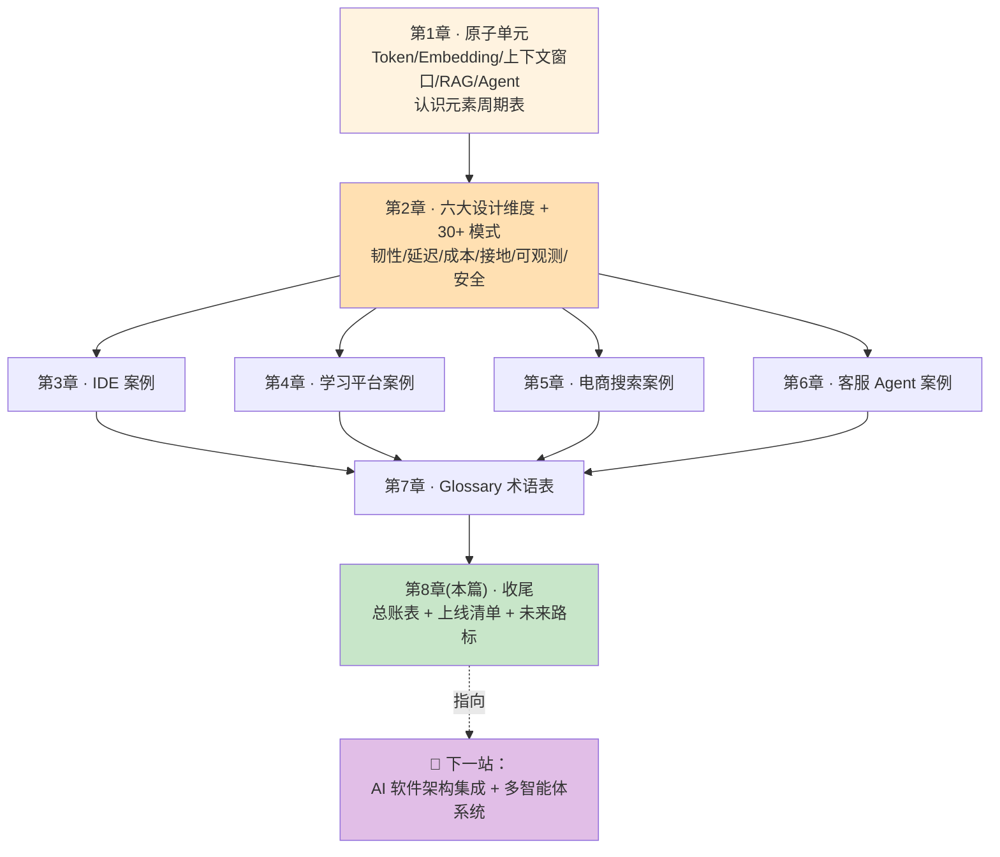

# 第 8 章 · 收尾与展望：把全书的系统设计原则串成一张网

> 对应原书：《Systems Design in the LLM Era》(Sampriti Mitra)。本篇取材于原书 PDF 第 258–272 页的**收尾章（Chapter 8「Unlock Your Exclusive Benefits」+ 参考/延伸书目 + Index 索引）**，并回收第 7 章 Glossary（术语表，PDF 252–256 页）作为"全书原则总账"。
> 本篇是逐章精讲 + 中文补充实战。术语中英并列、从零基础到进阶。

---

## 🗺️ 本章地图：这一章在全书的位置

翻到这里，纸质书剩下的其实是**"售后页"**：一段解锁专属福利的操作指南（`packtpub.com/unlock` 三步走）、一段订阅广告、两本延伸阅读推荐（*Architecting AI Software Systems*、*Agentic Architectural Patterns*）、一句求好评，以及一份**长达 7 页的索引（Index）**。

作者没有专门写一章叫"总结/未来展望"。**这正是本篇的任务**——所谓"读章定题"：当原书没有现成的收尾章时，讲师要**自己判断这段材料该讲什么主题**（总结 / 未来 / 清单），然后**把散落在全书 6 章里的系统设计原则重新收束成一张网**。

> 💡 **"读章定题"是什么意思？**
> 这是给逐章精讲设定的一条纪律：先 Read 原书对应页码，**看清这段到底有什么内容**，再决定这一篇讲"总结回顾"、"未来展望"还是"上线清单"。收尾段的原始材料（福利页 + 索引 + 术语表）天然指向三件事：
> ① **总结**——索引本身就是全书概念的完整清单；
> ② **未来**——两本延伸书（AI 软件架构、Agentic 多智能体）指出了作者认为的下一站；
> ③ **清单**——术语表 + 索引可以反向压缩成一张"上线自查表"。
> 所以本篇定题为：**"总结 + 展望 + 清单"三合一的收官章。**

读完这一章，你应该能：

- 用**一句话主线 + 六大设计维度**复述全书骨架，不再是一堆零散 pattern；
- 拿到一张 **30+ 模式的总账表**（每个 pattern：解决什么问题 / 代价 / 在哪一章用过）；
- 会用一张**"上线自查清单（production checklist）"**给自己的 LLM 系统体检；
- 看懂作者留下的**两条"下一站"路标**（AI 软件架构 / Agentic 多智能体），知道该往哪读；
- 把这本书接回 llm-action 仓库里的 `llm-inference/`、`ai-infra-architecture/` 等既有内容。



---

## 1️⃣ 先看原书这几页真正写了什么（不夸大、不虚构）

作为讲师要诚实：PDF 258–272 页**几乎全是出版社的运营内容**，不是技术正文。逐页对照如下：

| PDF 页 | 原书标题 | 到底写了什么 | 对我们有用的信息 |
|---|---|---|---|
| 258 | Unlock Your Exclusive Benefits | 你买的书含专属福利，跟着 3 步解锁 | 无技术内容 |
| 259–260 | Unlock in 3 Easy Steps | Step1 备发票 → Step2 扫码/`packtpub.com/unlock` → Step3 登录上传发票 | 纯操作，Packt 直购免发票 |
| 262 | Why subscribe? | 订阅 7000+ 电子书/视频的广告 | 无技术内容 |
| 263 | Other Books You May Enjoy ① | 推荐 *Architecting AI Software Systems*（Avila & Ahmad）| ⭐ **下一站路标 1** |
| 264 | Other Books You May Enjoy ② | 推荐 *Agentic Architectural Patterns for Building Multi-Agent Systems*（Arsanjani & Bustos）| ⭐ **下一站路标 2** |
| 265 | Packt is searching for authors / Share your thoughts | 招作者 + 求 Amazon 好评 | 无技术内容 |
| 266–272 | **Index** | 全书概念索引，7 页 | ⭐⭐⭐ **全书原则的完整清单** |

> ⚠️ **常见坑：把"售后页"当成正文精读。**
> 很多人读技术书读到最后，会下意识地想在末尾找一段"作者的深刻总结"。这本书没有。**真正的金矿是 Index（索引）和上一章的 Glossary（术语表）**——它们是全书概念的"哈希表"。本篇的做法就是：**把这两张表当成结构化数据，反向重建全书的知识图谱。**

🔬 **第一性原理：一本书的索引 = 它的"知识 API"。**
索引把全书每个概念映射到页码（`concept → pages`）。如果一个概念在索引里反复出现、被多个案例引用，说明它是**全书的"高频承重墙"**。下面我们就用出现频次给原则排个序。

---

## 2️⃣ 全书主线：一句话 + 六个设计维度

整本书其实在回答**一个问题**：

> **传统软件是确定性的（deterministic）——`same input → same output`，一次单测通过就永远通过。用 LLM 搭系统，是转向"概率工程（probabilistic / stochastic engineering）"——同样的输入可能吐出不同结果。如何在这种不确定性之上，搭出生产级（production-grade）可靠系统？**

作者在第 2 章把答案拆成**六个"designing for …"设计维度**（这是全书的脊椎，Index 第 241 页 `designing` 词条把它们并列列出）：



**为什么恰好是这六维？** 因为它们一一对应 LLM 系统区别于传统系统的**六个新痛点**：

| 设计维度 | 传统系统的老问题 | LLM 时代的**新变数** | 一句话本质 |
|---|---|---|---|
| ① 韧性 Resilience | 服务器会宕机 | **外部 LLM API 会超时/限流/涨价**，你不掌控它 | 把不可控依赖包起来，能熔断能降级 |
| ② 延迟 Latency | 请求要快 | **生成是逐 token 吐的**，首 token 就要等几百 ms | 用流式+缓存把"感知延迟"压下去 |
| ③ 成本 Cost | 算力要省 | **按 token 计费**，一个贵模型能烧掉利润（COGS） | 便宜模型能扛的活别派给贵模型 |
| ④ 接地 Grounding | 数据要准 | **模型会一本正经地胡说（hallucination）** | 用 RAG 把答案焊死在事实上 |
| ⑤ 可观测 Observability | 要有日志监控 | **输出是概率的，没有"对错"只有"好坏"** | 用黄金集+LLM 裁判量化质量 |
| ⑥ 安全 Security | 防 SQL 注入 | **自然语言即攻击面（prompt injection）** | 把 prompt 当成不可信用户输入 |

> 💡 **面试高频：** 被问"LLM 系统设计和传统系统设计最大的区别是什么？"——不要只说"多了个调模型"。标准答案是上表这一句：**从确定性工程转向概率工程，由此派生出韧性/延迟/成本/接地/可观测/安全六个新维度，每个维度都有对应的设计模式。** 能说出这个框架，面试官就知道你读过系统的东西。

---

## 3️⃣ 全书 30+ 模式总账表（这就是"清单"主题）

下面这张表是本篇最有价值的产物：**把全书所有 pattern 收成一张总账**，每个都标注「解决什么 / 代价 trade-off / 在哪个案例里用过」。数据来自 Index 各词条 + 第 2 章模式目录。

### 3.1 韧性 & 可靠（Resilience）

| 模式 Pattern | 解决什么 | 代价 / 坑 | 用在哪个案例 |
|---|---|---|---|
| **LLM 网关 / GenAI Service** | 所有 LLM 调用的单一入口，统管路由/鉴权/限流/failover | 多一跳、成单点故障（要自己做高可用） | IDE、电商搜索、客服 |
| **熔断 Circuit Breaker** | 检测下游 LLM 失败就"开闸"停发，防级联雪崩 | 阈值难调；开太早误伤、开太晚雪崩 | 全部 5 案例 |
| **分级降级 Tiered Fallback** | 主模型挂了自动切备用模型/缓存/静态答复 | 备用链质量下降；要定义好降级语义 | IDE、自适应学习 |
| **重试 + 指数退避 Backoff** | 瞬时抖动自动重试 | 重试放大流量、可能击穿限流 | 客服、学习平台 |
| **备份模型策略 Backup Model** | 跨供应商冗余（OpenAI 挂了切 Anthropic 等） | 双份成本；prompt 要跨供应商兼容 | IDE、电商 |

### 3.2 低延迟（Latency）

| 模式 Pattern | 解决什么 | 代价 / 坑 | 用在哪个案例 |
|---|---|---|---|
| **同步/异步混合 Hybrid Processing** | 快活走同步、慢活（Agent 任务）走队列异步 | 异步要做任务状态管理 + 回调投递 | IDE、学习平台 |
| **响应流式 Streaming（SSE）** | 逐 token 推给前端，首 token 就出字，感知延迟骤降 | 前端要处理增量；错误处理更复杂 | IDE、客服 |
| **三级缓存 Caching** | L1 精确匹配 → L2 语义匹配 → L3 主动预热 | 语义缓存可能命中"看着像其实不对"的答案 | 全部案例 |
| **合并缓存 Coalesce Caching** | 高并发下相同 in-flight 请求只打一次 LLM，其余等结果 | 只对"同一时刻的重复请求"有效 | 客服、IDE |
| **投机解码 Speculative Decoding** | 小模型先猜、大模型验证，加速生成 | 实现复杂；猜错反而浪费 | IDE（进阶） |
| **归一化缓存键 Normalized Key** | prompt 归一化（去空格/大小写）提升命中率 | 归一化过头会撞不该撞的键 | IDE |

### 3.3 成本优化（Cost）

| 模式 Pattern | 解决什么 | 代价 / 坑 | 用在哪个案例 |
|---|---|---|---|
| **模型路由 Model Router** | 按任务复杂度选便宜/贵模型 | 路由判断本身要花一次（小）推理 | 学习平台、电商 |
| **动态流量控制 Utilization-based Routing** | 按供应商利用率把流量导向不拥堵的 | 需要实时利用率信号 | 电商搜索 |
| **Prompt 工程 & 压缩 Compression** | 精简 prompt 直接省 token 费 | 压太狠会掉质量 | 全部案例 |

### 3.4 接地 & 数据管理（Grounding & Data）

| 模式 Pattern | 解决什么 | 代价 / 坑 | 用在哪个案例 |
|---|---|---|---|
| **RAG 检索增强生成** | 把私有事实注入上下文，防幻觉 | naive RAG 对关系型问题无力 | 全部案例 |
| **GraphRAG / 知识图谱** | 沿实体关系遍历，答"多跳"问题 | 建图/维护图成本高 | 客服（重点） |
| **Hybrid RAG** | 向量库（语义）+ 知识图谱（结构）双查 | 两套存储、两套一致性 | 客服 |
| **摄取管线 Ingestion Pipeline** | 异步清洗→分块→嵌入→入库 | 新鲜度 vs 成本；要做增量 | 客服、学习平台 |
| **函数调用 Function Calling** | LLM 输出结构化调用（如确定性判分） | 工具要严格校验、防越权 | 学习平台（判分） |

### 3.5 可测 & 可观测（Testability & Observability）

| 模式 Pattern | 解决什么 | 代价 / 坑 | 用在哪个案例 |
|---|---|---|---|
| **黄金数据集 Golden Dataset** | 人工标注的"标准答案"，回归测试基线 | 维护成本高；会过时 | 电商、客服 |
| **LLM 当裁判 LLM-as-a-Judge** | 用强模型给弱模型输出打分 | 裁判自己也会偏；要防"自我偏袒" | 电商、客服 |
| **新可观测指标** | TTFT / TPOT / TPS / 总延迟 / token 成本 | 传统 APM 不采这些，要自建埋点 | 全部案例 |
| **变异测试 Mutation Testing** | 故意改代码看测试抓不抓得住 | 生成变异体成本 | IDE |
| **负向 prompt 测试 Negative Prompt** | 专测"应该拒答/不该回答"的场景 | 场景难穷举 | IDE、客服 |

### 3.6 安全 & 可信（Security & Trust）

| 模式 Pattern | 解决什么 | 代价 / 坑 | 用在哪个案例 |
|---|---|---|---|
| **防提示注入 Prompt Injection** | 把用户输入当不可信，隔离系统指令 | 无法 100% 防；要纵深防御 | 全部案例 |
| **安全输出处理 Secure Output** | LLM 输出当不可信（防 XSS 等） | 要在渲染前转义/校验 | 全部案例 |
| **限权 Mitigating Excessive Agency** | 给 Agent/工具最小权限 | 权限设计要细粒度 | 学习平台、客服 |
| **防敏感信息泄露 / PII 脱敏** | 中间件擦除 PII、查询期过滤 | 脱敏漏一处就出事 | IDE、客服 |
| **防模型拒绝服务 MDoS** | 限流/配额防恶意超长 prompt 打爆 | 阈值误伤正常长文 | 全部案例 |
| **防数据投毒 / 供应链** | 校验训练/插件来源 | 供应链审计成本 | 通用 |

> 💡 **实战用法：** 把这 6 张表打印出来贴墙上。**你设计任何 LLM 系统，都是从这 30 个模式里"点菜"。** 5 个案例的差别，本质只是"点了哪几道菜、怎么摆盘"。下一节我们看它们各点了什么。

### 3.7 三个"承重墙"模式的伪码逐行拆解

光看表格记不牢。下面挑全书**出现频次最高的三个模式**（Index 里几乎每个案例都引用），用伪码把"它到底怎么写"落到地上——每一行都配中文讲解。这三堵墙分别对应六维里最先崩的三处：**韧性、延迟、可观测**。

#### 🧱 墙一：LLM 网关 = 熔断 + 分级降级（韧性）

这是全书第一号模式（`LLM gateway pattern`，Index 反复出现）。核心思想：**别让业务代码直连模型 API，而是让所有调用穿过一个"带保险丝的总闸"。**

```python
# 一个最小可用的 LLM 网关：把"调模型"这件危险事包起来
class LLMGateway:
    def __init__(self):
        self.breaker = CircuitBreaker(fail_threshold=5, cooldown=30)  # ①
        self.models  = ["gpt-4o", "gpt-4o-mini", "cache", "static"]   # ②

    def complete(self, prompt, task_complexity):
        model = self.route(prompt, task_complexity)                   # ③
        for candidate in self.fallback_chain(model):                  # ④
            if self.breaker.is_open(candidate):                       # ⑤
                continue                                              # ⑥ 这个供应商正在"熔断"，跳过
            try:
                resp = call_provider(candidate, prompt, timeout=2.0)  # ⑦ 严格超时
                self.breaker.record_success(candidate)                # ⑧
                return resp
            except (Timeout, ProviderError):
                self.breaker.record_failure(candidate)                # ⑨ 记一次失败，逼近阈值就开闸
                continue                                              # ⑩ 自动降到下一档
        return static_fallback(prompt)                                # ⑪ 全挂了，返回兜底静态答复
```

**逐行讲解：**
- **① 熔断器**：连续失败 5 次就"开闸"，冷却 30 秒内不再打这个供应商——这就是 Glossary 里 Circuit Breaker 的定义"检测失败→暂停发送→防级联雪崩"。
- **② 降级链**：从贵模型 → 便宜模型 → 缓存 → 静态兜底，**质量逐级下降但可用性逐级上升**。
- **③ 路由**：先按任务复杂度选一个"起点模型"（这就是 §3.3 的 Model Router，省钱的关键）。
- **④ 遍历降级链**：从起点往下逐个尝试。
- **⑤⑥ 熔断检查**：如果这个供应商正处于"开闸"状态，直接跳过——**不浪费一次注定超时的调用**（这正是熔断防雪崩的机制）。
- **⑦ 严格超时**：`timeout=2.0`。⚠️ 没有超时的 LLM 调用是生产事故之源——慢供应商会把你的线程池全占满。
- **⑧⑨ 记账**：成功/失败都要记，熔断器靠这个计数决定何时开闸。
- **⑩ 自动降级**：这一档挂了就 `continue` 到下一档，业务层无感。
- **⑪ 最终兜底**：宁可返回一句"系统繁忙请稍后"，也不要把异常抛给用户。

> ⚠️ **常见坑：熔断阈值拍脑袋。** 阈值太小（如失败 1 次就开）→ 一次网络抖动就误伤；太大（如失败 50 次）→ 雪崩已经发生。**必须用压测数据校准**，这也是为什么 §6 清单里写"阈值经过压测校准"。

#### 🧱 墙二：语义缓存（延迟 + 成本双杀）

普通缓存只能命中**一字不差**的重复请求。但用户问"怎么退款"和"如何申请退货款"是**同一个意图、不同字面**——普通缓存全 miss。语义缓存（`semantic caching`，Index 244 页）用 embedding 解决这个问题。

```python
def semantic_cache_lookup(query, threshold=0.92):
    q_vec = embed(normalize(query))                     # ① 归一化 + 向量化
    hit, score = vector_db.nearest(q_vec, top_k=1)      # ② 找最近邻缓存项
    if score >= threshold:                              # ③ 相似度够高才算命中
        return hit.cached_response                      # ④ 直接返回，省掉一次 LLM 调用
    resp = llm_gateway.complete(query)                  # ⑤ miss 才真调模型
    vector_db.upsert(q_vec, resp, ttl="1h")             # ⑥ 写回缓存，带 TTL
    return resp
```

**逐行讲解：**
- **① 归一化 + 向量化**：先去空格/统一大小写（`normalize`，对应 Index 的"归一化缓存键"），再转成 embedding。
- **② 最近邻搜索**：在向量库里找"意思最像"的一条历史缓存。
- **③ 阈值门槛**：`0.92` 是关键旋钮——**这就是本模式最大的坑**。
- **④ 命中**：直接返回历史答案，**这一次省掉了整个 LLM 调用**（延迟从秒级降到毫秒级，token 费用为零）。
- **⑤⑥ 未命中**：老老实实调模型，然后把结果写回缓存，带 `TTL=1h`（Glossary: Time-to-live，到期自动删，防陈旧）。

> ⚠️ **常见坑：阈值调太低导致"张冠李戴"。** 若 `threshold=0.75`，"苹果手机退款"可能命中"苹果电脑退款"的缓存——**返回一个看着对其实错的答案**。这就是 §3.2 表里标注的"语义缓存可能命中'看着像其实不对'的答案"。宁可高阈值多 miss，也别低阈值答错。

🔬 **第一性原理：语义缓存为什么是"延迟+成本"双杀？**
一次缓存命中同时省下**两样东西**：网络往返 + GPU 推理时间（延迟↓）、按 token 计费的调用（成本↓）。在高重复率场景（客服 FAQ、电商热门查询），命中率 30–60% 很常见——**等于凭空砍掉一半的推理账单**。这就是为什么 5 个案例全都上了缓存。

#### 🧱 墙三：LLM-as-a-Judge（可观测 / 质量量化）

传统测试写 `assertEqual(output, expected)`。但 LLM 输出是概率的、开放的，没有唯一正确值——`assertEqual` 直接失效。作者的答案：**用一个强模型当"裁判"给弱模型的输出打分**（Glossary + Index 216–218 页，客服案例给了三个完整例子）。

```python
JUDGE_PROMPT = """
你是严格的评审。对照【标准答案】评估【待评回答】。
只依据【上下文】判断，不要用你自己的知识。
输出 JSON：{{"groundedness": 0-5, "helpfulness": 0-5, "reason": "..."}}
上下文: {context}
标准答案: {golden}
待评回答: {candidate}
"""

def llm_judge(context, golden, candidate):
    verdict = strong_model.complete(                       # ① 用最强模型当裁判
        JUDGE_PROMPT.format(context=context,
                            golden=golden,
                            candidate=candidate),
        temperature=0.0)                                   # ② 温度=0，判分要确定
    score = parse_json(verdict)                            # ③ 解析结构化打分
    if score["groundedness"] < 3:                          # ④ 接地分过低 = 疑似幻觉
        alert("possible hallucination", candidate)         # ⑤ 触发告警
    return score
```

**逐行讲解：**
- **① 用最强模型当裁判**：裁判必须比被评者更强（如用 GPT-4 评 mini 的输出），否则"瞎子给瞎子打分"。
- **② `temperature=0.0`**：判分是要**确定性**的（Glossary: 低温→聚焦/确定），不能今天打 4 分明天打 2 分。
- **③ 结构化输出**：强制 JSON，方便下游聚合成 dashboard 指标。
- **④ groundedness（接地分）**：专门衡量"这句回答有没有超出上下文乱编"——**这是自动查幻觉的核心指标**。
- **⑤ 告警**：接地分低于 3 就报警，把"幻觉"从"用户投诉后才发现"变成"上线前/实时就拦截"。

> 💡 **面试高频：** "LLM 输出没有标准答案，你怎么做回归测试？" 标准答案链：**黄金数据集提供参照 → LLM-as-a-Judge 自动打分 → groundedness 分查幻觉 → A/B 灰度对比 → TTFT/token 埋点看性能成本。** 这套"概率系统测试观"能说全，面试基本稳了。
>
> ⚠️ **裁判自己的坑：** LLM 裁判有"自我偏袒（self-preference）"倾向——容易给同家族模型打高分；也可能被长回答"唬住"。所以 §3.5 表里标注"要防自我偏袒"，实践中常配人工抽检（human-in-the-loop）做校准。

---

## 4️⃣ 五大案例：同一套原则的五种"排列组合"

全书第 3–6 章是 5 个案例（Index 里各占一大段词条）。它们看着差别很大，其实是**同一套六维模式的不同组合**。用一张对比表看清"骨架相同、器官不同"：

| 维度 | 🖥️ AI-Native IDE（第3章） | 🎓 自适应学习平台（第4章） | 🛒 电商 AI 搜索（第5章） | 🎧 客服 Agent（第6章） |
|---|---|---|---|---|
| **核心难点** | 代码库上下文、低延迟补全 | 内容离线批量生成 + 在线秒级投喂 | 长尾查询、P99 延迟 | 多跳事实、防幻觉 |
| **主打接地** | AST 语义分块 + 向量搜索 | 题库 RAG | 语义+关键词混合搜索 | **Hybrid RAG（图+向量）** |
| **主打延迟** | 语义缓存 + 投机解码 + Race-to-response | 主动预热（warm/cold path） | L1/L2/语义三级缓存 + ANN | 响应/prompt 缓存 + 合并缓存 |
| **主打韧性** | 熔断 + 备份模型 | 熔断 + 多供应商 + 分级 | 负载均衡 + DB failover | Spark 弹性 + OpenSearch 自伸缩 |
| **主打可观测** | 变异/负向测试 | 混沌测试（杀实例/注延迟/降级） | LLM 裁判 + 黄金集 + A/B | 端到端 RAG 延迟 + FMA 故障模式分析 |
| **同步 vs 异步** | 补全同步 / Agent 任务异步 | 内容生成异步 / 投喂同步 | 搜索同步 / 离线管线批处理 | 对话同步 / 摄取异步 |
| **特色武器** | Merkle 树增量同步 | 函数调用做确定性判分 | Lambda 架构 + HNSW/倒排分区 | 知识图谱 + LLM 裁判查幻觉 |



> 🔬 **第一性原理：为什么 5 个案例能共用一套模式？**
> 因为它们的**约束是同构的**：都要调用一个"慢、贵、会胡说、可能挂"的外部大脑。约束相同，解法家族就相同——只是每个案例里**哪个约束最刺眼**不一样：IDE 最怕延迟、客服最怕幻觉、电商最怕长尾、学习平台最怕生成成本。**看清"主要矛盾"，就知道该重仓哪几个模式。**

> ⚠️ **常见坑：抄案例架构图，不抄"取舍逻辑"。**
> 新手容易把书里某个案例的架构图整张搬到自己项目里。正确姿势是：**先定位你系统的"主要矛盾"（延迟？成本？幻觉？），再回到 §3 的总账表点对应的模式。** 架构是"点菜"的结果，不是可以照抄的模板。

---

## 5️⃣ 「读章定题」之总结主题：全书 12 条核心原则（浓缩版）

如果把这本书压成 12 句话（每句都能在 Index/Glossary 里找到出处），就是下面这份"原则清单"。这是本篇"**总结**"主题的交付物：

| # | 原则（一句话） | 出处线索 |
|---|---|---|
| 1 | **拥抱不确定性**：LLM 是 stochastic 的，设计时假设"同输入不同输出" | Glossary: Stochastic/Deterministic |
| 2 | **一切 LLM 调用走网关**：单一入口统管路由/鉴权/限流/降级 | LLM gateway pattern |
| 3 | **默认会失败**：熔断 + 分级降级 + 跨供应商备份是标配 | Circuit breaker / Tiered fallback |
| 4 | **延迟靠"感知"而非"真实"取胜**：流式 + 三级缓存 | Streaming / Caching |
| 5 | **贵活派给贵模型**：模型路由按复杂度分流省钱 | Model router |
| 6 | **答案必须接地**：RAG 是防幻觉的第一道墙 | RAG / Grounding |
| 7 | **关系型问题上图**：naive RAG 不够时用 GraphRAG / Hybrid RAG | GraphRAG / Hybrid RAG |
| 8 | **确定性的活别交给 LLM**：判分/计算用函数调用 | Function calling |
| 9 | **质量要量化**：黄金集 + LLM 裁判，把"好不好"变成分数 | Golden dataset / LLM-as-a-Judge |
| 10 | **埋新指标**：TTFT/TPOT/token 成本，传统 APM 看不见 | New observability metrics |
| 11 | **自然语言即攻击面**：把 prompt 和输出都当不可信 | Prompt injection / Secure output |
| 12 | **隐私内建**：PII 脱敏 + 查询期过滤 + 摄取隔离 | PII / Privacy patterns |

用一个 LaTeX 式子把"该不该上一个模式"的判断收束成一条经验法则——**期望收益 > 期望代价**才做：

$$
\text{采用某模式} \iff \underbrace{P_\text{fail}\cdot C_\text{fail}}_{\text{它避免的损失}} \;>\; \underbrace{C_\text{impl}+C_\text{runtime}}_{\text{它的实现+运行代价}}
$$

- $P_\text{fail}$：不用这个模式时故障/劣化的概率（比如不熔断时雪崩的概率）；
- $C_\text{fail}$：故障一次的损失（宕机、烧钱、答错被投诉）；
- $C_\text{impl}$：实现这个模式的一次性工程成本；
- $C_\text{runtime}$：它带来的常态开销（多一跳延迟、多一份缓存内存）。

> 💡 这条式子解释了为什么 §3 每张表都有"代价"列：**没有免费的模式。** 熔断省了雪崩但阈值调错会误伤；缓存降了延迟但语义缓存可能返回"看着对其实错"的答案。**工程 = 在这条不等式两边做加减法。**

---

## 6️⃣ 「读章定题」之清单主题：LLM 系统上线自查表（Production Checklist）

把 §5 的原则翻译成**可勾选的上线清单**。这是本篇"**清单**"主题的交付物——你可以直接拿去给自己的项目做 code review 前的体检。



**逐项自查清单（配可量化门槛）：**

- **韧性 Resilience**
  - [ ] 所有 LLM 调用走**统一网关**（不是散在各服务里直连）
  - [ ] 关键路径有**熔断器**，阈值经过压测校准
  - [ ] 有**降级链**：主模型 → 备用模型 → 缓存 → 静态兜底
  - [ ] 跨**≥2 供应商**冗余（防单一供应商宕机/涨价/限流）
- **延迟 Latency**
  - [ ] 用户可见场景开**流式响应**（SSE）
  - [ ] **TTFT** 有 SLO（如 < 500ms）并监控 P99
  - [ ] 至少 **L1 精确 + L2 语义**两级缓存，命中率被监控
- **成本 Cost**
  - [ ] 有**模型路由**：简单任务不派给旗舰模型
  - [ ] 监控**单请求 token 成本**和整体 **COGS**
  - [ ] Prompt 做过压缩/精简
- **接地 Grounding**
  - [ ] 事实类回答走 **RAG**，不裸调模型
  - [ ] 多跳/关系类问题评估过 **GraphRAG / Hybrid RAG**
  - [ ] 确定性计算/判分用**函数调用**，不让 LLM"心算"
- **可观测 Observability**
  - [ ] 埋点 **TTFT / TPOT / TPS / token 成本 / 幻觉率**
  - [ ] 有**黄金数据集**做回归，CI 里跑
  - [ ] 上线用 **LLM-as-a-Judge + A/B** 而非"拍脑袋觉得变好了"
- **安全 Security**
  - [ ] 把用户输入当**不可信**，做 prompt injection 防护
  - [ ] LLM 输出**渲染前转义/校验**（防 XSS 等）
  - [ ] **PII 脱敏**在摄取和查询两处都有
  - [ ] 有**限流/配额**防 MDoS（超长 prompt 打爆）

> ⚠️ **面试高频陷阱：** 被问"你怎么保证 LLM 系统上线质量？"——只答"写单元测试"会当场减分，因为**LLM 输出没有唯一正确值，传统断言 `assertEqual` 用不了**。要答上面这条链：**黄金集回归 + LLM 裁判打分 + A/B 灰度 + TTFT/token 成本埋点**。这套"概率系统的测试观"正是本书区别于普通系统设计书的核心。

---

## 7️⃣ 「读章定题」之未来主题：作者留下的两条路标

原书第 263–264 页推荐的两本延伸书，恰好指出了作者认为的**下一站**——本篇"**未来展望**"主题就落在这两条路标上：

| 路标 | 延伸书 | 它补齐了这本书的哪块空白 | 你该带着什么问题去读 |
|---|---|---|---|
| **路标 1：把 AI 焊进大型软件系统** | *Architecting AI Software Systems*（R. Avila & I. Ahmad, ISBN 9781804615973） | 本书讲"LLM 系统内部怎么设计"；这本讲"**如何把 AI 集成进已有的传统大系统**、管理性能不达标/成本超支等风险" | 我的 AI 模块如何与遗留系统、既有 SLA 共存？如何用架构模型保证整体内聚？ |
| **路标 2：从单模型走向多智能体** | *Agentic Architectural Patterns for Building Multi-Agent Systems*（A. Arsanjani & J.P. Bustos, ISBN 9781806029570） | 本书的 Agent 只是"一个 ReAct 循环"；这本讲"**多 Agent 协作**：函数调用 → 工具协议（MCP）→ A2A 协作三层栈，以及 LangGraph/CrewAI/ADK 框架、AgentOps" | 多个 Agent 如何协调、如何防指令漂移（instruction drift）、如何容错？ |



> 🔬 **第一性原理：技术的"下一站"往往是"上一站的组合爆炸"。**
> 这本书教你把 **1 个 LLM** 做成可靠系统；路标 2 的问题是把 **N 个 Agent** 做成可靠系统。规模从 1→N，六大维度不会消失反而**放大**：延迟变成"多跳链路延迟"、幻觉变成"错误在 Agent 间传染"、安全变成"一个 Agent 被注入污染全链"。**所以本书这套六维框架不是过时了，而是多智能体时代的地基。** 先把单体做扎实，再谈协作。

---

## 8️⃣ 复习速查：Glossary + Index 反查表（背这个就够）

把第 7 章 Glossary 的核心术语按"你最容易搞混的对子"整理成对照表，方便临考/面试前 10 分钟扫一遍：

| 易混对子 | 区别（一句话） |
|---|---|
| **Deterministic vs Stochastic** | 前者同输入必同输出（传统软件）；后者按概率选 token，同输入可不同输出（LLM 的本质） |
| **Temperature 高 vs 低** | 低（0.1）→ 聚焦/确定；高（0.8）→ 创意/随机 |
| **Pre-training vs Fine-tuning** | 前者从零学语言/世界知识（贵）；后者在通才上加领域专精（便宜） |
| **LLM vs SLM** | 大模型万金油、慢贵；小模型专才、能跑本地、低延迟低成本 |
| **RAG vs GraphRAG** | RAG 靠向量相似度取事实；GraphRAG 沿知识图谱**关系遍历**答多跳 |
| **naive RAG vs Hybrid RAG** | 前者只查向量库；后者向量库 + 知识图谱双查 |
| **TTFT vs TPOT** | 首 token 到达时间 vs 每个后续 token 的生成间隔 |
| **Circuit Breaker vs Retry** | 熔断=下游坏了就停手防雪崩；重试=瞬时抖动再试一次 |
| **Model Router vs LLM Gateway** | 网关=所有 LLM 调用的总入口；路由=网关里"选哪个模型"的那段逻辑 |
| **Golden Dataset vs LLM-as-a-Judge** | 前者是人工标注的标准答案（静态基线）；后者用强模型动态打分 |
| **Coalesce Caching vs 普通缓存** | 普通缓存存"过去的答案"；合并缓存合并"此刻同时在飞的相同请求" |
| **Prompt Injection vs Secure Output** | 前者防"输入"骗模型；后者防"输出"被当代码执行（如 XSS） |

> 💡 **实战：** 这张对照表本质是把 Glossary（PDF 252–256）压成"面试弹药库"。**面试官问的 90% LLM 系统设计术语都在这 12 个对子里。** 每个都能说清"是什么 + 为什么 + 代价"，基础分就稳了。

---

## 9️⃣ 一张图收束全书：从原子单元到生产系统

最后用一张总图把全书六章串成一条**从"认元素"到"上线自查"的完整链路**：



**这条链路的读法：**
1. **第 1 章**给你"元素"（原子单元）；
2. **第 2 章**给你"化学反应规则"（六维 + 30 模式）；
3. **第 3–6 章**给你"四个合成实例"（案例把模式组合成完整系统）；
4. **第 7 章**给你"元素周期表速查"（术语表）；
5. **第 8 章（本篇）**帮你**把上面全部收成一张能上线自查的网**，并指出继续深造的两条路。

---

## 📌 小结

- 原书 PDF 258–272 页是**出版社售后页 + 索引**，没有专门的"总结章"——所以本篇用"**读章定题**"的方法，判定这段材料指向 **总结 / 未来 / 清单** 三个主题并全部交付。
- **全书主线一句话**：从**确定性工程**转向**概率工程**，由此派生**六大设计维度**（韧性/延迟/成本/接地/可观测/安全）。
- **30+ 模式总账表**（§3）是全书的"菜单"；**5 大案例**（§4）只是同一套模式的不同"点菜组合"，看清各自的"主要矛盾"就知道重仓哪几个模式。
- **12 条核心原则**（§5）+ **上线自查清单**（§6）可以直接拿去给你自己的 LLM 系统做体检；判断"该不该上某模式"用一条不等式：**它避免的期望损失 > 它的期望代价**。
- **未来两条路标**（§7）：把 AI 集成进**大型软件架构**，以及从单模型走向**多智能体系统**——本书的六维框架正是这两站的地基。
- **易混术语对照表**（§8）把 Glossary 压成面试弹药库，10 分钟能扫完。

一句话收尾：**这本书教你的不是"怎么调用一个大模型"，而是"如何在一个会胡说、会挂、按 token 收费的概率大脑之上，搭出你敢让老板签字上线的系统"。**

---

## 🔗 延伸阅读

**本书内其它章（book-guide/）：**
- [第 1 章 · LLM 系统的原子单元](../01_LLM%20系统的原子单元.md) —— 回看 Token/Embedding/RAG/Agent 这些"元素"的定义
- 第 2 章 · 核心架构模式 —— §3 总账表里 30+ 模式的详细出处
- 第 3–6 章 · 5 大案例 —— §4 对比表逐案例展开（IDE / 学习平台 / 电商搜索 / 客服 Agent，在 `06_案例/`）
- 第 7 章 · Glossary 术语表 —— §8 对照表的原始定义来源

**原书作者留下的两条路标（延伸书）：**
- *Architecting AI Software Systems*（Avila & Ahmad）—— 把 AI 集成进大型软件架构
- *Agentic Architectural Patterns for Building Multi-Agent Systems*（Arsanjani & Bustos）—— MCP / A2A / AgentOps 多智能体

**llm-action 仓库既有内容（横向对照）：**
- `llm-inference/` —— 本书 §3.2「低延迟」模式（流式 / KV 缓存 / 投机解码 / TTFT-TPOT）的工程细节与真实框架（vLLM / TGI 等）实现
- `ai-infra-architecture/`（`ai-infra/`）—— 本书六维里「韧性 / 成本」在集群/网关/调度层的落地：模型服务网关、多副本容灾、GPU 利用率驱动的路由
- `llm-interview/` —— §5 的 12 条原则、§6 的上线清单、§8 的术语对照表可直接并入面试题库（LLM 系统设计高频考点）
- 仓库内 RAG / 向量检索相关章节 —— 对照本书 §3.4「接地」：RAG → GraphRAG → Hybrid RAG 的递进
