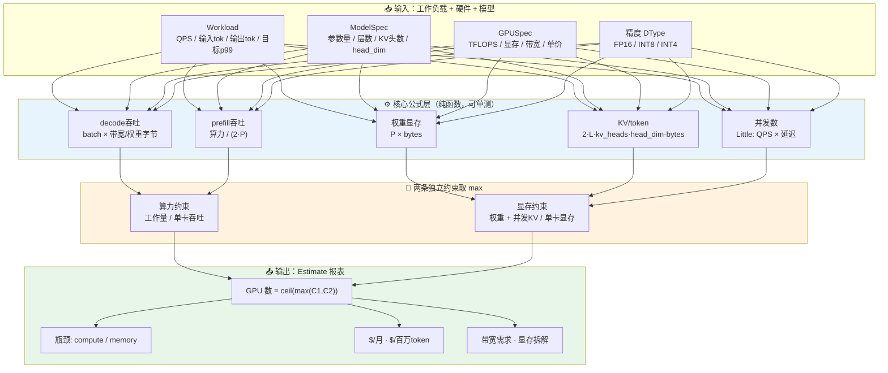
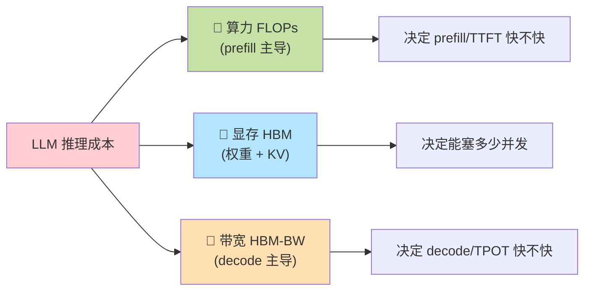
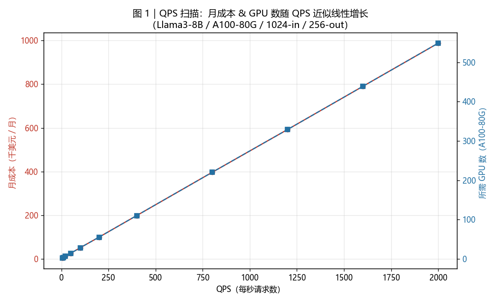
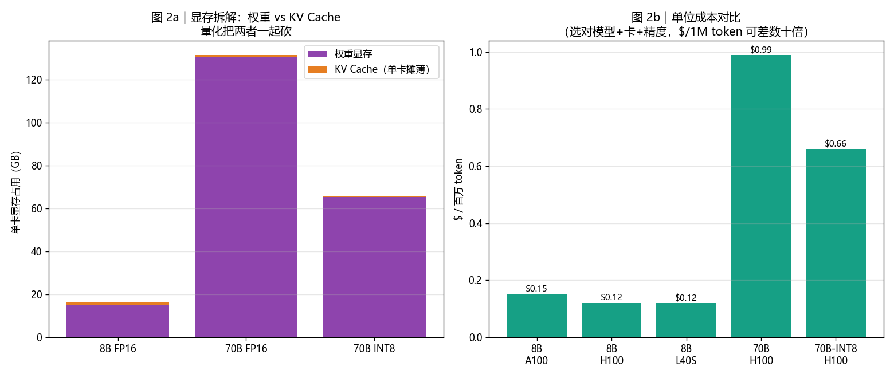
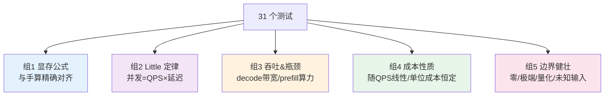

# 🧮 项目 01 · LLM 系统容量 & 成本估算器（Capacity & Cost Estimator）

> 配套书：《Systems Design in the LLM Era》(Sampriti Mitra)，对应"为成本优化设计（Designing for Cost Optimization）"一节的动手实现。
> 一句话：**给我 QPS、平均输入/输出 token、模型规模、目标 p99，我在一张公式表里就告诉你——要几张 GPU、显存够不够、带宽卡不卡、每月烧多少钱、每百万 token 成本是多少。**

这是一个 **纯解析（analytical）模型**：不跑真模型、不联网、不要 GPU、不要 key，几毫秒算完。它的价值不在"精确"，而在**上线前就能把数量级算对**，把"架构决策"翻译成"财务决策"——这正是本书第 2 章反复强调的：

> **Architectural decisions are now financial decisions.（架构决策现在就是财务决策。）**

---

## 📑 目录

1. [这个项目解决什么问题](#1)
2. [30 秒跑起来](#2)
3. [全局架构：一张图看懂数据流](#3)
4. [第一性原理：LLM 成本到底由什么决定](#4)
5. [核心公式逐条推导（含 LaTeX）](#5)
6. [代码逐行讲解 `estimator.py`](#6)
7. [两张图讲的故事 `run_demo.py`](#7)
8. [测试在验证什么 `tests/`](#8)
9. [💡 面试高频问答](#9)
10. [⚠️ 常见坑合集](#10)
11. [📌 小结 & 🔗 延伸](#11)

---

<a name="1"></a>
## 1️⃣ 这个项目解决什么问题

你是一个 AI 平台工程师。产品经理丢给你一句话：

> "我们要上一个客服 AI，预计**高峰 50 QPS**，平均**输入 1000 token、输出 250 token**，用 **Llama3-8B**，p99 要在 **2 秒**内。给我算算要多少机器、一个月多少钱。"

不会估算的人：上线跑一周看账单，被 42 万美元/月吓一跳，回来砍需求。
会估算的人：**打开这个工具，5 秒给出答案**，然后告诉 PM：

- 用 **A100-80G 需要约 14 张卡**，瓶颈是**算力（compute-bound）**；
- 显存**绰绰有余**（并发 KV 才 15GB，一张卡就装下）；
- 月成本约 **2.5 万美元**，单位成本 **$0.15 / 百万 token**；
- 如果换 **H100 或 INT8 量化**，成本还能再降 30%~50%。

> 💡 **实战价值**：这类"容量规划表（capacity planning sheet）"是每个 AI-Infra 团队的标配。面试时被问"如何为一个 LLM 服务做容量规划"，你能**说清每条约束（算力/显存/带宽）+ 每条公式**，就是资深工程师的水准。本项目就是把这张表**代码化 + 可测试化 + 可视化**。

### 本项目的边界（scope）

| ✅ 覆盖 | ❌ 不覆盖（刻意简化） |
|---|---|
| 权重显存、KV Cache 显存、并发 KV | 激活值（activation）的精确显存（只给裕量系数） |
| Little 定律算并发 | 排队论 M/M/c 的精确 p99（用目标 p99 反推并发） |
| prefill（算力瓶颈）/ decode（带宽瓶颈）分离建模 | chunked-prefill、投机解码等引擎级优化的精确增益 |
| GPU 数 = max(算力约束, 显存约束) | 张量并行（TP）的通信开销（只给提示） |
| $/月、$/百万 token | 电费、网络、存储、人力等非 GPU 成本 |

**记住**：解析模型的目标是**数量级正确（order-of-magnitude right）**，误差 2× 以内即达标。要精确，得上真实压测（benchmark）——那是下一个项目的事。

---

<a name="2"></a>
## 2️⃣ 30 秒跑起来

```bash
# 1) 装依赖（核心逻辑零依赖，这步只为出图+测试）
pip install -r requirements.txt

# 2) 跑测试（应显示 31 passed）
python -m pytest -q

# 3) 跑 demo：打印三个场景报表 + 生成两张 PNG
python run_demo.py

# 4) 也可以直接 import 用
python -c "from estimator import estimate_by_name, format_report; print(format_report(estimate_by_name(qps=50, avg_input_tokens=1024, avg_output_tokens=256)))"
```

产物：
- `fig_qps_scan.png` —— QPS vs (月成本, GPU 数) 曲线
- `fig_cost_breakdown.png` —— 显存拆解 + 单位成本对比

> ⚠️ **Windows 中文乱码坑**：直接 `python estimator.py`，PowerShell 默认 GBK 输出会把中文变成方框/乱码（但**文件内容和图都是好的**）。要在终端看到中文，设 `PYTHONIOENCODING=utf-8`：
> ```bash
> PYTHONIOENCODING=utf-8 python run_demo.py
> ```

---

<a name="3"></a>
## 3️⃣ 全局架构：一张图看懂数据流



**核心思想只有一句**：LLM 服务要几张卡，取决于**两条独立的墙**——

1. **算力墙（compute wall）**：每秒要产出这么多 token，单卡吞吐够不够？不够就加卡。
2. **显存墙（memory wall）**：权重 + 所有并发请求的 KV Cache，一张卡装不下就加卡。

**你需要的卡数 = 两条墙里更高的那一条**。哪条更高，哪条就是**瓶颈（bottleneck）**。

---

<a name="4"></a>
## 4️⃣ 第一性原理：LLM 成本到底由什么决定

在写任何公式前，先建立物理直觉。LLM 推理的成本，归根到底是三种物理资源的消耗：



### 🔬 第一性原理 1｜为什么"1 token ≈ 2P FLOPs"

一次前向传播的绝大部分计算，是**矩阵乘**（linear 层、attention 的 QKV 投影和输出投影）。考虑 $y = W x$，权重矩阵 $W$ 有 $P$ 个元素。矩阵-向量乘里，**每个权重元素都参与一次"乘"和一次"加"** = 2 次浮点运算。所以：

$$\text{FLOPs}_{\text{fwd}}(\text{1 token}) \approx 2 \times P$$

这就是 Kaplan、Chinchilla 等论文里的经典近似。8B 模型处理 1 个 token ≈ $2 \times 8 \times 10^9 = 1.6 \times 10^{10}$ FLOPs。

### 🔬 第一性原理 2｜为什么 prefill 吃算力，decode 吃带宽

这是**整个 LLM 推理优化的分水岭**，必须搞透。

| 阶段 | 在算什么 | 矩阵形状 | 瓶颈 | 关键指标 |
|---|---|---|---|---|
| **Prefill（预填充）** | 一次性处理整个 prompt（几百上千 token） | "胖"矩阵（大 batch × seq） | **算力（compute-bound）** | TTFT（首 token 时间） |
| **Decode（解码）** | 每步只生成 **1 个** 新 token | "瘦"矩阵（batch × 1） | **带宽（memory-bound）** | TPOT（每 token 时间） |

**为什么 decode 是带宽瓶颈？** 关键概念是**算术强度（arithmetic intensity）= FLOPs / 读取字节数**。

- Decode 每步：要把**整个模型权重**从 HBM 读进计算单元（$P$ 个字节 × dtype），但只算了 1 个 token 的量（$2P$ FLOPs）。**算得少、读得多** → GPU 的计算核心大半时间在**等数据搬运**。
- 此时的上限不是算力，而是"把权重读一遍要多久"：

$$T_{\text{decode 1 step}} \geq \frac{\text{权重字节数}}{\text{HBM 带宽}}$$

$$\text{单序列吞吐上限} = \frac{\text{HBM 带宽}}{\text{权重字节数}} \ \text{(tokens/s)}$$

### 🔬 第一性原理 3｜连续批处理（continuous batching）为什么是"省钱头号手段"

Decode 单序列吞吐低得可怜（8B 在 A100 上约 140 tok/s）。但注意：**一次权重读，可以被 batch 里所有序列共享！** 读一遍 16GB 权重，同时给 32 个序列各产 1 个 token。于是：

$$\text{单卡 decode 聚合吞吐} \approx \text{batch\_size} \times \frac{\text{HBM 带宽}}{\text{权重字节数}} \times \text{MFU}$$

batch 越大，带宽墙被摊得越薄，单位 token 成本越低。**这就是 vLLM / TensorRT-LLM 连续批处理的核心价值。** 代价是 batch 越大越吃 KV 显存——于是又回到"显存墙"。**算力墙和显存墙，通过 batch_size 这个旋钮相互制约。**

> 💡 **面试高频**：被问"为什么 LLM 推理要 batching？"标准答案就是这一段——decode 是带宽瓶颈，batching 把一次权重读摊给多个序列，**几乎免费地**成倍提升吞吐、摊薄成本。追问"batch 无限大好不好？"答：不行，受 KV 显存限制，且会拉高延迟/TTFT。

---

<a name="5"></a>
## 5️⃣ 核心公式逐条推导

下面每条公式，代码里都有一个**同名纯函数** + **pytest 精确验证**。

### 5.1 权重显存

$$\text{Weight}_{\text{GB}} = \frac{P \times \text{bytes\_per\_param}}{2^{30}}$$

- $P$ = 参数量，$\text{bytes\_per\_param}$ = FP16 是 2、INT8 是 1、INT4 是 0.5。
- 例：8B × FP16 = $8\times10^9 \times 2 / 2^{30} = 14.9$ GB。**这就是"7B 模型至少要 ~14-16GB 显存"的由来。**

### 5.2 KV Cache（每 token）——本项目最易错的公式 ⚠️

$$\text{KV}_{\text{per token}} = \underbrace{2}_{K\text{和}V} \times \underbrace{L}_{\text{层数}} \times \underbrace{n_{kv}}_{\text{KV头数}} \times \underbrace{d_{head}}_{\text{每头维度}} \times \text{bytes}$$

- 例（Llama3-8B）：$2 \times 32 \times 8 \times 128 \times 2 = 131072$ 字节 = **128 KB/token**。
- ⚠️ **最致命的坑**：用 **num_q_heads**（32）而不是 **num_kv_heads**（8）。GQA（分组查询注意力）下二者差 4-8 倍，用错直接**高估 KV 显存 4 倍**。

> 🔬 **第一性原理｜GQA 为什么省 KV**：标准多头注意力（MHA）每个 Query 头配一套独立的 K/V。GQA（Grouped-Query Attention）让**多个 Q 头共享一套 K/V**（如 32 个 Q 头共享 8 套 KV）。Attention 的计算里 Q 头数不变（表达力基本不掉），但**要缓存的 K/V 只剩 1/4**。这是长上下文时代最重要的显存优化之一。MQA（Multi-Query）是极端版：所有 Q 头共享 1 套 KV。

### 5.3 并发数：Little 定律（Little's Law）

$$L = \lambda \times W$$

- $L$ = 系统内平均并发请求数，$\lambda$ = 到达率（QPS），$W$ = 每请求停留时间（延迟，秒）。
- 例：50 QPS × 2s = **100 个"在飞"请求**。
- **意义**：这 100 个请求**同时**占着 KV 显存 → 并发数 × 单请求 KV = 你要预留的 KV 总量。

> 🔬 **第一性原理｜Little 定律为什么恒成立**：它是**排队论里唯一不依赖分布假设**的定律。无论到达是泊松还是突发、服务时间是什么分布，只要系统稳定（不无限堆积），长期平均下 $L=\lambda W$ 必然成立。因为"停留时间的总和"从两个角度数是同一个面积。这让我们能用最简单的乘法估并发，不必解复杂的排队方程。

### 5.4 单卡吞吐

**Decode（带宽瓶颈）**：

$$\text{decode\_tps} = \text{batch} \times \frac{\text{HBM\_BW}}{\text{weight\_bytes}} \times \text{MFU}$$

**Prefill（算力瓶颈）**：

$$\text{prefill\_tps} = \frac{\text{TFLOPS}_{\text{peak}}}{2 \times P} \times \text{MFU}$$

- MFU（Model FLOPs Utilization，模型算力利用率）：实际达不到理论峰值的修正系数，典型 0.3~0.5。

### 5.5 GPU 数量 = 两条约束取 max

**算力约束**（工作量 / 单卡产能）：

$$N_{\text{compute}} = \frac{\text{QPS} \times \text{out\_tok}}{\text{decode\_tps}} + \frac{\text{QPS} \times \text{in\_tok}}{\text{prefill\_tps}}$$

**显存约束**（并发 KV / 每卡可用 KV 预算）：

$$N_{\text{memory}} = \max\left(N_{\text{weight}},\ \frac{\text{并发KV}_{\text{GB}}}{\text{HBM}_{\text{GB}} \times \text{max\_kv\_util} - \text{Weight}_{\text{GB}}}\right)$$

**最终**：

$$N_{\text{GPU}} = \max\left(1,\ \lceil \max(N_{\text{compute}}, N_{\text{memory}}) \rceil\right)$$

### 5.6 成本

$$\text{Cost}_{\text{month}} = N_{\text{GPU}} \times \text{price}_{\text{/hr}} \times \frac{2{,}592{,}000\text{ s/月}}{3600\text{ s/hr}}$$

$$\text{Cost}_{\text{/1M tok}} = \frac{\text{Cost}_{\text{month}}}{\text{QPS} \times (\text{in}+\text{out}) \times 2{,}592{,}000} \times 10^6$$

> 💡 **为什么 $/百万 token 与 QPS 无关**：分子（成本）和分母（总 token）都随 QPS 同比例放大，约掉了。所以 **$/1M token 是"单位成本"，反映的是你的架构效率**，与流量大小无关（忽略 ceil 取整抖动）。这也是对外报价、和 API 厂商比价的标准单位。

---

<a name="6"></a>
## 6️⃣ 代码逐行讲解 `estimator.py`

整个模块 **纯 Python 标准库**（`dataclasses` / `math` / `enum`），零第三方依赖 → 离线、可移植、每条公式可精确单测。

### 6.1 常量与精度枚举

```python
SECONDS_PER_MONTH = 30 * 24 * 3600  # 2_592_000，按 30 天算月
FLOPS_PER_PARAM_PER_TOKEN_FWD = 2.0  # 1 token ≈ 2P FLOPs（第一性原理 1）
BYTES_PER_GB = 1024 ** 3
BYTES_PER_TB = 1024 ** 4

class DType(Enum):
    FP32 = 4; FP16 = 2; BF16 = 2; FP8 = 1; INT8 = 1; INT4 = 0.5
```

- **逐行**：`DType` 的**枚举值直接就是"每个元素占几字节"**。这是刻意设计——显存公式里直接 `dtype.value` 就能拿到字节数，`FP16→INT8` 只是 `2→1`，显存自动砍半。`INT4 = 0.5` 表示 4 bit = 半字节。
- ⚠️ **坑**：`Enum` 允许 `FP16` 和 `BF16` 值相同（都是 2），Python 会把后者当**别名**。这里不影响，因为我们只用 `.value`。

### 6.2 三个规格 dataclass

```python
@dataclass(frozen=True)
class GPUSpec:
    name: str
    fp16_tflops: float        # 稠密 FP16 算力
    hbm_gb: float             # 显存容量
    hbm_bandwidth_tbs: float  # 显存带宽（decode 真正瓶颈）
    hourly_cost_usd: float    # 按需单价
```

- `frozen=True`：**不可变**。规格是"硬件事实"，不该被误改。也让它可 hash、可安全共享。
- ⚠️ **坑**：厂商标称 TFLOPS 常是"带稀疏（sparse）"的翻倍值。这里存的是**稠密（dense）实际值**（A100 = 312，H100 = 989），别拿营销数字算。

```python
@dataclass(frozen=True)
class ModelSpec:
    name: str; num_params_b: float; num_layers: int; hidden_dim: int
    num_q_heads: int; num_kv_heads: int          # ← GQA 的关键：二者可不等
    head_dim: Optional[int] = None

    def resolved_head_dim(self) -> int:
        if self.head_dim is not None:
            return self.head_dim
        return self.hidden_dim // self.num_q_heads  # 默认 d_model / n_q_heads
```

- **为什么要显式建模层数/KV头数**：因为 KV 显存**不能只看总参数量**，它由"层数 × KV头数 × head_dim"决定。两个参数量相同的模型，KV 显存能差好几倍（取决于是 MHA 还是 GQA）。
- `resolved_head_dim`：允许不填 head_dim，用 `hidden_dim / num_q_heads` 推。这是 Transformer 的标准关系。

### 6.3 权重显存公式

```python
def weight_memory_gb(model: ModelSpec, dtype: DType) -> float:
    total_bytes = model.num_params_b * 1e9 * dtype.value
    return total_bytes / BYTES_PER_GB
```

- **逐行**：参数量（十亿为单位，`× 1e9` 还原）× 每参数字节数 = 总字节 → 除 $2^{30}$ 得 GiB。一行公式，一个测试断言它精确等于手算。

### 6.4 KV Cache 公式（核心！）

```python
def kv_cache_bytes_per_token(model: ModelSpec, kv_dtype: DType) -> float:
    head_dim = model.resolved_head_dim()
    return 2 * model.num_layers * model.num_kv_heads * head_dim * kv_dtype.value
    #      ↑K和V   ↑每层都缓存    ↑用 kv_heads 不是 q_heads！  ↑精度字节
```

- **逐项对应 5.2 的公式**。注释里特意标了"用 kv_heads 不是 q_heads"——这是本项目最想让你记住的一件事。
- 对应的测试 `test_kv_uses_kv_heads_not_q_heads` 专门构造 MHA(40 KV头) vs GQA(8 KV头) 两个模型，断言 KV 比例恰为 40/8 = 5 倍。

### 6.5 Little 定律

```python
def little_law_concurrency(qps: float, latency_s: float) -> float:
    return qps * latency_s
```

- 一行。简单到值得强调：**容量规划的第一公式往往就是一个乘法**。别把它想复杂。

### 6.6 Decode 吞吐（含 batching）

```python
def decode_throughput_per_gpu(gpu, model, dtype, mfu=0.4, batch_size=32):
    weight_bytes = model.num_params_b * 1e9 * dtype.value
    bandwidth_bytes_per_s = gpu.hbm_bandwidth_tbs * BYTES_PER_TB
    per_seq = bandwidth_bytes_per_s / weight_bytes   # 单序列上限 = 带宽/权重字节
    return per_seq * batch_size * mfu                # × batch × 利用率
```

- **逐行**：先算单序列上限（带宽 / 权重字节，对应第一性原理 2），再 `× batch_size`（连续批处理摊薄，第一性原理 3），最后 `× mfu` 修正。
- 测试 `test_decode_scales_with_batch` 验证 batch=32 恰好是 batch=1 的 32 倍；`test_decode_scales_with_bandwidth` 验证带宽翻倍吞吐翻倍（坐实"带宽瓶颈"）。

### 6.7 Prefill 吞吐

```python
def prefill_throughput_per_gpu(gpu, model, mfu=0.4):
    flops_per_token = FLOPS_PER_PARAM_PER_TOKEN_FWD * model.num_params_b * 1e9
    peak_flops = gpu.fp16_tflops * 1e12
    return (peak_flops / flops_per_token) * mfu
```

- **逐行**：每 token 需 `2P` FLOPs，GPU 每秒能做 `peak_flops`，相除得 token/s，× mfu。测试 `test_prefill_scales_with_flops` 验证算力翻倍吞吐翻倍。

### 6.8 主函数 `estimate()`——把一切串起来

主函数按 9 步走（代码里有 `# ---- N) ----` 注释分段）：

```python
# ---- 3) 并发数（Little 定律）----
latency_s = workload.target_p99_ms / 1000.0
concurrency = little_law_concurrency(workload.qps, latency_s)
kv_concurrent_gb = kv_per_req_gb * concurrency   # 并发 KV 总量
```

```python
# ---- 5) GPU 数量：两条独立约束 ----
gpus_for_decode  = output_tps_needed / dec_tps    # 输出走 decode
gpus_for_prefill = input_tps_needed / pre_tps     # 输入走 prefill
gpus_for_compute = gpus_for_decode + gpus_for_prefill  # 相加近似"时间占比之和"

kv_budget_per_gpu = gpu.hbm_gb * max_kv_util - w_gb    # 每卡扣掉权重后能给 KV 的显存
gpus_for_kv = kv_concurrent_gb / kv_budget_per_gpu
gpus_for_memory = max(gpus_for_weight, gpus_for_kv)

raw = max(gpus_for_compute, gpus_for_memory)
num_gpus = max(1, math.ceil(raw))                 # 向上取整，至少 1 张
```

- **为什么算力约束是相加而非取 max**：因为一张卡的时间要**分给** prefill 和 decode 两件事，二者时间占比之和 ≤ 1。用"各自需要的卡数之和"来近似这个时间分配，是保守但合理的估计。
- **为什么显存约束要先扣权重**：每张卡都得放一份完整权重（不做 TP 时），剩下的显存才能给 KV。若 `kv_budget_per_gpu <= 0`（权重都放不下），代码会**给出张量并行提示**并退化处理（见 `test_weight_too_big_triggers_tp_note`）。

```python
# ---- 6) 瓶颈判定 ----
bottleneck = "memory" if gpus_for_memory > gpus_for_compute else "compute"
```

```python
# ---- 8) 带宽：decode 每卡每秒读多少 HBM ----
steps_per_s = dec_tps / batch_size          # 每秒 decode 步数
hbm_read_bytes_per_s = steps_per_s * weight_bytes   # 每步读一遍权重
```

- **关键洞察**：因为 batching，每步读一遍权重产 `batch_size` 个 token，所以每秒读 `dec_tps/batch_size` 遍权重。这个值算出来会**逼近 GPU 标称带宽 × mfu**——正好印证"decode 打满带宽"。测试 `test_hbm_read_bounded_by_bandwidth` 断言它不超过标称带宽。

```python
# ---- 9) 成本 ----
cost_per_hour = num_gpus * gpu.hourly_cost_usd
cost_per_month = cost_per_hour * (SECONDS_PER_MONTH / 3600.0)
cost_per_million = cost_per_month / total_tokens_per_month * 1e6
```

- 三行出成本。整个 `estimate()` **无副作用、纯计算**，所以能被 pytest 精确验证。

---

<a name="7"></a>
## 7️⃣ 两张图讲的故事 `run_demo.py`

图由 `run_demo.py` 生成，用 `matplotlib.use("Agg")`（无头后端，不弹窗）+ Microsoft YaHei 字体（中文不乱码）。

### 图 1：QPS 扫描 —— 成本与 GPU 数随 QPS **线性**增长



- **红线（月成本）和蓝线（GPU 数）几乎重合成一条直线** → 坐实"成本随 QPS 线性"。
- 低 QPS 处有轻微阶梯 → 那是 `ceil` 取整（不足一张也得配一张）。
- demo 还打印出：$/1M token 从低 QPS 到高 QPS **基本恒定**（0.16→0.15，差异全来自 ceil），印证"单位成本与 QPS 无关"。

### 图 2：显存拆解 + 单位成本对比



- **左图（2a）**：堆叠条显示单卡显存 = 权重（紫）+ KV（橙）。**70B FP16 权重 130GB 一张卡放不下**（触发 TP 提示）；**INT8 量化后砍到 65GB**，一张 H100 装得下。直观看到"量化把权重和 KV 一起砍半"。
- **右图（2b）**：同一负载下 $/百万 token 对比。**8B 只要 $0.12~0.15，70B 要 $0.99**——差近 7 倍！INT8 把 70B 从 $0.99 降到 $0.66。**这张图就是"选对模型+卡+精度能省数倍成本"的铁证。**

> 💡 **面试高频**：被问"如何降低 LLM 服务成本？"，把这两张图的结论背下来就是满分答案——① **模型路由**：简单请求走小模型（8B 比 70B 便宜 7 倍）；② **量化**：INT8/INT4 砍权重和 KV 显存，减卡；③ **提高 batch/MFU**：摊薄带宽墙；④ **缓存**：命中就是 0 成本（见第 2 章语义缓存）。

---

<a name="8"></a>
## 8️⃣ 测试在验证什么 `tests/test_estimator.py`

**31 个测试，5 组**，跑一次 `python -m pytest -q` 全绿。测试不是走过场，每条都在守护一个物理性质：



几个有代表性的：

| 测试 | 守护的性质 |
|---|---|
| `test_kv_per_token_exact_formula` | KV = 2·32·8·128·2 = 131072 字节，一字节不差 |
| `test_kv_uses_kv_heads_not_q_heads` | GQA 用 kv_heads，MHA/GQA 比例恰 5:1 |
| `test_little_law_scales_with_both_factors` | QPS 或延迟翻倍，并发都翻倍 |
| `test_decode_scales_with_bandwidth` | 带宽翻倍→decode 吞吐翻倍（坐实带宽瓶颈） |
| `test_memory_bound_when_huge_concurrency` | 长上下文+高并发→瓶颈翻转成 memory |
| `test_cost_scales_roughly_linear_with_qps` | QPS×10→成本约×10（比值落在 [8,12]） |
| `test_cost_per_million_tokens_independent_of_qps` | 单位成本与 QPS 无关（±5%） |
| `test_at_least_one_gpu` / `test_unknown_model_raises` | 边界与防呆 |

> ⚠️ **建"memory-bound"测试的坑**：一开始我用"70B + 高 QPS"想凑显存瓶颈，结果 70B 太吃算力，**算力约束反而更高**（compute-bound）。真正能触发 memory-bound 的配方是：**小模型（算力便宜）+ 超长输入（KV 巨大）+ 短输出（decode 算力小）+ 极长延迟（并发飙升）**。这个调试过程本身就说明：**瓶颈不是拍脑袋定的，是算出来的。**

---

<a name="9"></a>
## 9️⃣ 💡 面试高频问答

**Q1：给你一个 LLM 服务的 QPS 和 token 数，怎么估要几张 GPU？**
A：分两条独立约束取 max。① **算力约束**：每秒要产的 token（输出走 decode、输入走 prefill）除以单卡吞吐；② **显存约束**：权重（每卡一份）+ 所有并发请求的 KV（并发数由 Little 定律 = QPS×延迟 得出）除以单卡显存。哪条高哪条是瓶颈，`ceil(max(两者))` 就是卡数。

**Q2：KV Cache 怎么算？为什么长上下文这么吃显存？**
A：`KV/token = 2 × 层数 × KV头数 × head_dim × 精度字节`。吃显存是因为它**随并发数 × 上下文长度线性增长**——100 个并发、每个 32k 上下文，KV 能到几百 GB，远超权重。解法：GQA/MQA（减 KV 头）、KV 量化（INT8）、PagedAttention（减碎片）、KV offload。

**Q3：为什么 decode 慢、是带宽瓶颈？**
A：decode 每步只产 1 token 却要读整份权重，算术强度极低，GPU 算力用不满，卡在 HBM 带宽上。上限 ≈ 带宽/权重字节。这也是为什么 H100（3.35TB/s）decode 明显快于 A100（2TB/s）。

**Q4：如何降低 $/百万 token？**
A：① 模型路由（简单请求走小模型，8B 比 70B 便宜近 7 倍）；② 量化（INT8/INT4 减显存减卡）；③ 加大 batch 提 MFU（摊薄带宽墙）；④ 语义缓存（命中 = 0 成本）；⑤ 选性价比更高的卡。

**Q5：Little 定律为什么能直接用来估并发，不用排队论？**
A：Little 定律 $L=\lambda W$ **不依赖任何分布假设**，只要系统稳定就恒成立。做容量规划要的是数量级，用它一个乘法就够；要精确 p99 分布才需要 M/M/c 等排队模型。

**Q6：70B 模型一张 80G 卡放不下怎么办？**
A：需要**张量并行（TP）**把权重切到多卡，或**量化**（INT8 把 70B 从 140GB 降到 70GB，一张 H100 勉强放下）。本工具检测到权重超单卡会给出 TP 提示。代价：TP 引入卡间通信（AllReduce），要高速互联（NVLink）。

---

<a name="10"></a>
## 🔟 ⚠️ 常见坑合集

| # | 坑 | 后果 | 正解 |
|---|---|---|---|
| 1 | KV 用 **q_heads** 而非 **kv_heads** | GQA 下高估 KV 4-8 倍 | 永远用 `num_kv_heads` |
| 2 | 用厂商**带稀疏的 TFLOPS** | 高估算力 2 倍 | 用稠密（dense）实际值 |
| 3 | 以为 decode 是**算力瓶颈** | 加算力不加带宽，钱白花 | decode 是**带宽**瓶颈 |
| 4 | 忘了 **batching** | 单序列吞吐估算，高估卡数几十倍 | 聚合吞吐 = batch × 单序列 |
| 5 | 只算权重显存，**忘 KV** | 长上下文时显存爆炸、OOM | 权重 + 并发 KV + 激活裕量 |
| 6 | Windows 直接跑，**中文乱码** | 终端一堆方框（文件其实没事） | `PYTHONIOENCODING=utf-8`；出图设 YaHei 字体 |
| 7 | matplotlib **忘设 Agg** | 无头/服务器环境找不到显示器报错 | `matplotlib.use("Agg")` 且在 import pyplot **之前** |
| 8 | 忘设 `axes.unicode_minus=False` | 负号显示成方框 | rcParams 里关掉 |
| 9 | 把 $/百万token 当成随 QPS 变 | 报价逻辑错 | 它是**单位成本**，与 QPS 无关 |
| 10 | 认为解析模型能**精确**预测 | 上线发现差很多 | 解析求"数量级正确"，精确要压测 |

---

<a name="11"></a>
## 📌 小结

- LLM 服务的容量，取决于**两条独立的墙**：算力墙（prefill 主导）和显存墙（权重 + 并发 KV）。**卡数 = 两者取 max，向上取整。**
- **三个必背公式**：权重显存 = P×bytes；KV/token = 2·L·kv_heads·head_dim·bytes；并发 = QPS×延迟（Little 定律）。
- **prefill 吃算力、decode 吃带宽**是一切推理优化的分水岭；**batching 摊薄带宽墙**是省钱头号手段。
- **$/百万 token 是单位成本**，反映架构效率、与流量无关，是对外报价和比价的标准单位。
- 解析模型的目标是**数量级正确**（2× 以内），让你在**上线前**把"架构决策"当"财务决策"来做。

## 🔗 延伸

**本书其它章节**（`../../book-guide/`）：
- [`01_LLM 系统的原子单元.md`](../../book-guide/01_LLM%20系统的原子单元.md) —— Token / 上下文窗口是本项目所有公式的输入源头。
- [`02_LLM 系统设计的核心架构模式.md`](../../book-guide/02_LLM%20系统设计的核心架构模式.md) —— "为成本优化设计"一节（模型路由、成本天花板、语义缓存）是本项目的理论出处。

**仓库既有深入内容**：
- [`../../llm-inference/KV-Cache优化.md`](../../llm-inference/KV-Cache优化.md) —— KV Cache 的工程优化（PagedAttention、前缀缓存、量化压缩）。
- [`../../ai-infra-architecture/07_KVCache深入_PagedAttention_前缀缓存_量化压缩.md`](../../ai-infra-architecture/07_KVCache深入_PagedAttention_前缀缓存_量化压缩.md) —— KV 显存公式的深入版。
- [`../../ai-infra-architecture/09_推理引擎架构_连续批处理_调度_投机解码_chunked_prefill.md`](../../ai-infra-architecture/09_推理引擎架构_连续批处理_调度_投机解码_chunked_prefill.md) —— 连续批处理（本项目 decode 吞吐建模的现实基础）。
- [`../../ai-infra-architecture/01_PD分离架构_Prefill_Decode_Disaggregation.md`](../../ai-infra-architecture/01_PD分离架构_Prefill_Decode_Disaggregation.md) —— prefill/decode 分离（本项目把二者分开建模的架构对应）。
- [`../../ai-infra-architecture/08_量化与低精度_INT8_INT4_FP8_GPTQ_AWQ_SmoothQuant.md`](../../ai-infra-architecture/08_量化与低精度_INT8_INT4_FP8_GPTQ_AWQ_SmoothQuant.md) —— 量化如何砍显存（本项目 DType 旋钮的原理）。

---

> 📂 **文件清单**
> - `estimator.py` —— 核心解析模型（纯标准库，可 import）
> - `run_demo.py` —— 三场景报表 + 两张图（Agg + YaHei）
> - `tests/test_estimator.py` —— 31 个测试，`python -m pytest -q` 全绿
> - `requirements.txt` —— 仅 matplotlib + pytest（核心逻辑零依赖）
> - `fig_qps_scan.png` / `fig_cost_breakdown.png` —— demo 产物
