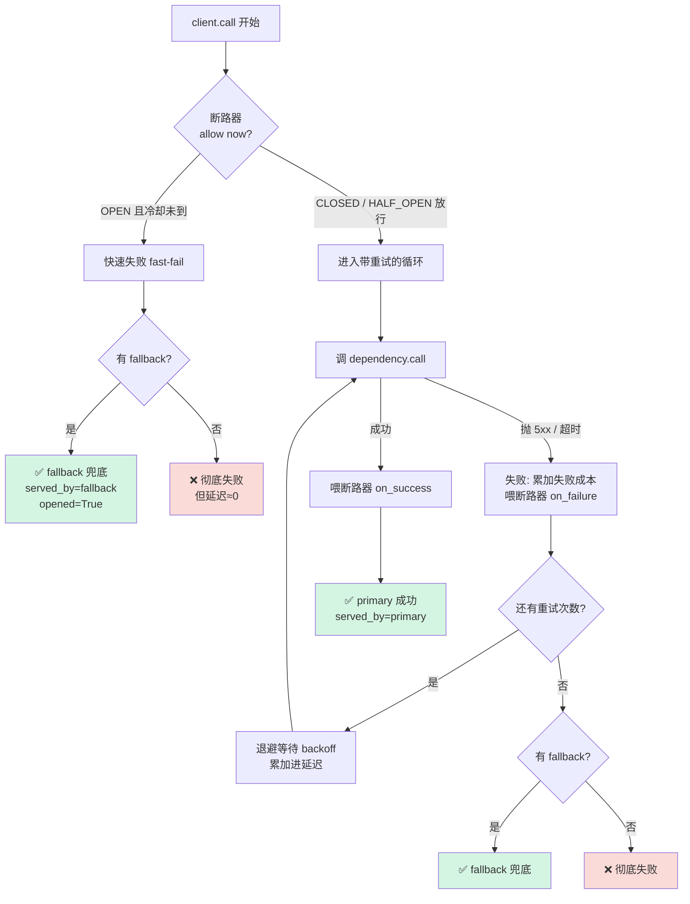
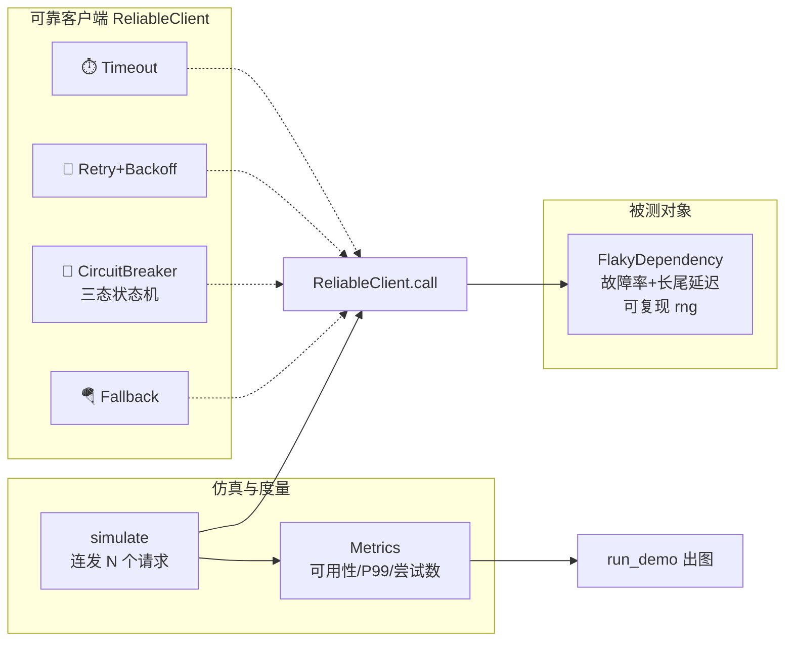
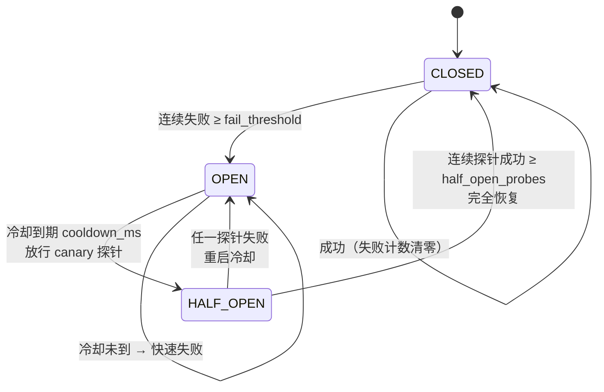

# 🛡️ 项目 02：可靠性模式模拟器（Reliability Patterns Simulator）

> 配套《Systems Design in the LLM Era》第 2 章 **"断路器 + 分层降级"（Circuit Breakers with Tiered Fallbacks）** 一节。
>
> 用**能跑、能测、能画图**的代码，把书里四种可靠性模式——**重试（Retry）、超时（Timeout）、断路器（Circuit Breaker）、降级（Fallback）**——在"有故障率的下游依赖"上做仿真，量化它们对**可用性 / 尾延迟 / 成功率**的影响。
>
> 全程**离线、确定性**：不联网、不下模型、不需要 key，同 seed 必得同结果。

---

## 📑 目录

1. [这个项目解决什么问题](#1-这个项目解决什么问题)
2. [30 秒快速上手](#2-30-秒快速上手)
3. [四种可靠性模式：是什么·为什么·怎么用·代价](#3-四种可靠性模式是什么为什么怎么用代价)
4. [整体架构（含 mermaid 图）](#4-整体架构含-mermaid-图)
5. [核心代码逐行精讲](#5-核心代码逐行精讲)
6. [断路器状态机（本项目的灵魂）](#6-断路器状态机本项目的灵魂)
7. [如何运行 & 看懂输出](#7-如何运行--看懂输出)
8. [实验结论：五种模式的对比](#8-实验结论五种模式的对比)
9. [测试怎么设计的](#9-测试怎么设计的)
10. [💡 面试高频 & ⚠️ 常见坑 合集](#10--面试高频--常见坑-合集)
11. [📌 小结 & 🔗 延伸](#11--小结--延伸)

---

## 1. 这个项目解决什么问题

在 LLM 时代，你的服务几乎一定要调**别人家的东西**：OpenAI / Anthropic 的 API、向量数据库、内部微服务……这些下游会**慢、会宕机、会返回垃圾**。书里给的原话很扎心：

> 供应商可能**慢、宕机、或返回垃圾数据**。像对付外部服务 503 那样"简单重试"往往是**错的**——如果整个 OpenAI 区域挂了，你的重试只会雪上加霜（打爆对方、拖死自己）。

于是工程界沉淀出四件"护身符"。但**每一件都是权衡（trade-off），不是银弹**：

| 模式 | 一句话 | 它换来了什么 | 它的代价 |
|---|---|---|---|
| 🔁 **重试 Retry** | 失败了再试几次 | 成功率↑ | 延迟↑、放大下游负载 |
| ⏱️ **超时 Timeout** | 等太久就放弃 | 尾延迟可控、连接池不被占死 | 会把"慢"直接判成"失败" |
| 🔌 **断路器 Circuit Breaker** | 下游明显病了就别再打了 | 坏时段尾延迟↓、保护下游 | 需要状态机、恢复逻辑复杂 |
| 🪂 **降级 Fallback** | 主的挂了用备胎/缓存兜底 | 可用性↑（甚至焊死 100%） | 降级答案质量下降 |

**光背概念没用，工程师要能量化。** 本项目就是一台"风洞"：给定一个故障率 30%、还偶尔抽风变慢的假下游，我们把这四个模式一个个装上去，用 800 次仿真请求测出**可用性、P50/P99 延迟、平均尝试次数**怎么变，最后画成三张对比图。

> 🔬 **第一性原理**：可靠性的本质是**用某种成本，把"故障"这个坏事件的概率或影响降下来**。重试用"时间成本"换"成功概率"；超时用"放弃部分慢请求"换"尾延迟可控"；断路器用"暂时放弃主依赖"换"不被拖死"；降级用"答案质量"换"有答案"。**没有免费的可靠性**——这是贯穿全项目的一句话。

---

## 2. 30 秒快速上手

```bash
# 1) 进入项目目录
cd book-systems-design-llm-era/projects/02_reliability_patterns_sim

# 2)（可选）装依赖。核心库零依赖，只有测试和画图要
pip install -r requirements.txt

# 3) 跑测试（应当全绿）
python -m pytest -q
#  => 25 passed in 0.04s

# 4) 跑仿真 + 出图（figures/ 下生成 3 张 png，终端打印对比表）
python run_demo.py
```

项目文件树：

```
02_reliability_patterns_sim/
├── README.md              # 你正在读的这份（极详教程）
├── reliability.py         # 核心库：4 种模式 + 仿真引擎 + 指标（零第三方依赖）
├── run_demo.py            # 跑仿真、出 3 张对比图（Agg 后端 + YaHei 中文字体）
├── requirements.txt       # pytest / matplotlib
├── figures/               # run_demo 产出的图（自动生成）
│   ├── fig1_patterns_compare.png
│   ├── fig2_availability_vs_failrate.png
│   └── fig3_retry_tradeoff.png
└── tests/
    └── test_reliability.py # 25 个测试：状态机 / 退避 / 集成命题
```

---

## 3. 四种可靠性模式：是什么·为什么·怎么用·代价

### 3.1 🔁 重试 + 退避（Retry with Backoff）

**是什么**：调用失败后，隔一小段时间再试，最多试 N 次。

**为什么要"退避（backoff）"而不是立刻重试**：如果下游是因为**过载**才失败，你立刻重试等于火上浇油。退避给下游"喘口气"的时间。三种退避策略：

$$
\text{delay}(k) =
\begin{cases}
b & \text{固定（fixed）} \\[4pt]
b \cdot 2^{\,k-1} & \text{指数（exponential）} \\[4pt]
\min\!\big(b \cdot 2^{\,k-1},\ c\big) & \text{封顶（capped，上限 } c\text{）}
\end{cases}
$$

其中 $b$ 是基准延迟，$k$ 是第几次重试，$c$ 是封顶上限。

**书里最锋利的一刀**——重试策略必须看"有没有用户在等"：

| 场景 | 推荐策略 | 原因 |
|---|---|---|
| **交互式/同步** | **封顶退避**（起步 500ms、最多 1s）或直接 fail-fast 到降级 | 用户在等！一个 60 秒的重试**等于宕机** |
| **异步** | 指数退避（等 1 分、2 分、4 分） | 没人在等，可以耗着，扛过 5 分钟供应商故障 |

**还要加抖动（jitter）**：$\text{delay} \leftarrow \text{delay} \times \text{Uniform}(0.5, 1.0)$。为什么？——如果 1000 个客户端在同一毫秒失败、都精确等 200ms，它们会在 200ms 后**再次同时**打下游，形成"重试风暴 / 惊群（thundering herd）"。抖动把它们打散。

**代价**：延迟线性上升、下游负载被放大（本项目 fig3 会量化这个权衡）。

> 💡 **面试高频金句**：**"If a user is waiting, a 60-second retry is effectively downtime."**（用户在等的时候，60 秒的重试就等于宕机。）这句话把"重试"从"总是好的"拉回到"要看上下文"。

### 3.2 ⏱️ 超时（Timeout）

**是什么**：一次调用超过 $T$ 毫秒还没返回，就主动放弃（当作失败）。

**为什么关键**：没有超时，一个卡住的下游会**占满你的连接池 / 线程池**，几个慢请求就能拖垮整个服务（级联故障 cascading failure）。

**代价 / ⚠️ 大坑**：超时会把"**慢但本来会成功**"的请求**直接判成失败**。所以**超时几乎必须搭配重试或降级**——单独开超时，可用性反而会掉（本项目 fig1 的模式②就是刻意保留的这个"坑演示"，可用性从 63.9% 掉到 47.8%）。

### 3.3 🔌 断路器（Circuit Breaker）

**是什么**：一个**三态状态机**，盯着下游的健康度。下游连续失败太多次就"跳闸（trip）"，之后一段时间内**请求根本不发出去**，直接快速失败（fail-fast）。

**为什么**：当整个下游区域挂了，继续发请求只有两个后果——① 你自己每个请求都要等到超时才失败，**尾延迟爆炸**；② 你还在**打一个已经倒下的服务**，妨碍它恢复。断路器让你"识时务"。

**三态**（命名反直觉，务必记牢）：

- **CLOSED（闭合 = 正常）**：像电路闭合，电流（请求）能过。正常放行。
- **OPEN（打开 = 跳闸/故障）**：熔断中，所有请求 fast-fail，不碰下游。
- **HALF_OPEN（半开 = 试探）**：冷却期满后放少量"金丝雀（canary）"探针，成功就恢复、失败就重新跳闸。

**代价**：断路器**不提升可用性**（那是 fallback 的活）！它降低的是"坏时段"的**尾延迟**和对下游的**无效冲击**。本项目 fig1 里，模式⑤加上断路器后可用性照样 100%，但 **P99 从 821ms 暴降到 5ms** —— 这才是断路器的真正价值。

### 3.4 🪂 降级 / 分层降级（Fallback / Tiered Fallback）

**是什么**：主依赖挂了，用一个"次一等但可用"的东西兜底。书里的经典分层表：

| 层级 | 例子 | 特点 |
|---|---|---|
| **Tier 1（主）** | GPT-5 | 最贵、最聪明 |
| **Tier 2（降级）** | Claude 3 Haiku | 中成本、快 |
| **Tier 3（降级）** | Llama 3 8B（本地自托管） | 免费、没那么聪明 |
| **Tier 4（最终兜底）** | 缓存的"够用"响应，或优雅错误提示 | "我们的 AI 助手当前繁忙，请稍后重试" |

**为什么**：宁可给用户一个"不那么聪明但可用"的答案，也不给一个 500 错误页。这就是**优雅降级（graceful degradation）**。

**代价**：降级时**质量下降**（换了更笨/更便宜的模型，或返回缓存/静态默认值）。

> 🔬 **第一性原理**：分层降级的本质是**优雅降级**——用"降级时质量下降"换"可用性"。这与分布式系统里"降级返回默认值"是同一个思想，只不过 LLM 的"降级"是**换一个更笨/更便宜的模型**。

---

## 4. 整体架构（含 mermaid 图）

### 4.1 一次 `client.call()` 的完整决策链

这张图是**整个项目最值得记的一张**。把它看懂，四种模式怎么咬合就全通了：



**读图要点**：
- **断路器是第一道闸门**——它决定"这次请求要不要发出去"。OPEN 时直接跳到兜底，省下所有重试和超时的等待（这就是它压低尾延迟的原理）。
- **重试是一个循环**——每次失败都喂断路器、退避、再来，直到用尽次数。
- **fallback 是最后的安全网**——无论前面怎么失败，只要配了它，用户视角就是成功。

### 4.2 组件关系



---

## 5. 核心代码逐行精讲

> 下面抄录 `reliability.py` 的关键片段并**逐行**中文讲解。完整代码见文件本身。

### 5.1 会抽风的下游 `FlakyDependency`

```python
def call(self) -> float:
    # 第一步：先决定这次是否"变慢"
    if self.rng.random() < self.slow_rate:
        latency = self.slow_ms * self.rng.uniform(0.8, 1.2)   # 慢请求：±20% 浮动
    else:
        latency = self.base_ms * self.rng.uniform(0.7, 1.3)   # 正常：±30% 浮动
    # 第二步：再决定这次是否"失败"（返回 5xx）
    if self.rng.random() < self.fail_rate:
        raise DependencyError(f"依赖返回 5xx（耗时 {latency:.1f}ms）")
    return latency
```

- **第 2 行** `self.rng.random() < self.slow_rate`：`rng` 是注入的 `random.Random(seed)`。`random()` 返回 $[0,1)$ 均匀数，小于 `slow_rate` 就命中"慢请求"。**注入 rng 是本项目可测的地基**——同 seed → 同一串故障序列。
- **第 3 / 5 行**：延迟不是定值，用 `uniform` 加噪声，模拟真实抖动。
- **第 8~9 行**：注意——**失败也是有耗时的**！错误响应也要等下游处理完。很多人写模拟器时让失败"零成本"，这是不真实的。
- **⚠️ 关键设计**：这里**不真正 `sleep`**，只返回一个"虚拟耗时"数字。这叫**逻辑时间（logical time）**代替物理时间——1 万次仿真在几毫秒内跑完，而不是真等几秒。

### 5.2 退避计算 `compute_backoff_ms`

```python
def compute_backoff_ms(attempt, cfg, rng):
    if cfg.mode == "fixed":
        delay = cfg.base_delay_ms
    elif cfg.mode == "exp":
        delay = cfg.base_delay_ms * (2 ** (attempt - 1))          # 100,200,400...
    elif cfg.mode == "capped":
        delay = min(cfg.base_delay_ms * (2 ** (attempt - 1)), cfg.cap_ms)  # 指数但封顶
    if cfg.jitter:
        delay = delay * rng.uniform(0.5, 1.0)                     # 抖动：打散惊群
    return delay
```

- **`exp` 分支**：`2 ** (attempt - 1)`，`attempt` 从 1 开始 → 倍数 1,2,4,8……即指数翻倍。
- **`capped` 分支**：先算指数，再 `min` 封顶。这对应书里交互式场景的"起步 500ms、最多 1s"。
- **`jitter` 那行**：乘一个 $[0.5, 1.0]$ 的随机因子。这是生产级退避的**必备项**，缺了它就会有重试风暴。

### 5.3 客户端主循环 `ReliableClient.call`（精简版）

```python
# 阶段 1：断路器闸门
if self.enable_breaker and not self.breaker.allow(self._clock_ms):
    if self.enable_fallback:
        ...  # OPEN 且冷却未到 → 直接兜底，opened=True，几乎 0 延迟
        return CallResult(True, total_latency, served_by="fallback", opened=True)
    return CallResult(False, total_latency, served_by=None, opened=True)

# 阶段 2：带重试的调用循环
max_attempts = self.retry_cfg.max_attempts if self.enable_retry else 1
for attempt in range(1, max_attempts + 1):
    try:
        latency = self._try_once()            # 可能抛 5xx / 超时
        total_latency += latency
        if self.enable_breaker: self.breaker.on_success()
        return CallResult(True, total_latency, served_by="primary")
    except (DependencyError, TimeoutError_):
        fail_cost = self.timeout_ms if self.enable_timeout else self.dep.base_ms
        total_latency += fail_cost            # 失败也花时间！
        if self.enable_breaker:
            self.breaker.on_failure(self._clock_ms + total_latency)
        if attempt < max_attempts:            # 还有重试次数？
            total_latency += compute_backoff_ms(attempt, self.retry_cfg, self.rng)
            continue
        break                                 # 用尽 → 去兜底

# 阶段 3：兜底
if self.enable_fallback:
    return CallResult(True, total_latency + self.fallback(), served_by="fallback")
return CallResult(False, total_latency, served_by=None)
```

- **阶段 1** 的关键：断路器 OPEN 时**根本不进重试循环**，`total_latency` 只加了个极小的 fallback 耗时 → 这就是断路器把 P99 从数百 ms 压到个位数的原因。
- **`max_attempts = ... if self.enable_retry else 1`**：不开重试就强制只试一次。一个开关统一控制。
- **`except` 块里 `fail_cost`**：**失败的延迟成本**。开了超时按 `timeout_ms` 算（因为你等到超时才放弃），否则按下游基础延迟算。这个细节决定了延迟统计是否真实。
- **`total_latency += compute_backoff_ms(...)`**：退避等待**也算进端到端延迟**。这就是为什么重试会推高延迟。
- **`_try_once` 里的超时判断**：`if self.enable_timeout and latency > self.timeout_ms: raise TimeoutError_`——把"慢"转成"失败"。

> ⚠️ **常见坑**：很多人把退避等待算在延迟外面，导致"重试免费提升成功率"的错觉。**退避时间用户是实打实在等的**，必须计入。本项目 fig3 正是靠正确计入才画出"成功率↑但 P99↑"的权衡曲线。

---

## 6. 断路器状态机（本项目的灵魂）

断路器是四个模式里唯一**有状态**的，也是面试最爱问的。它的状态转移：



**四条不变量（invariant）**，本项目用测试逐条钉死：

1. **初始 CLOSED**：`test_breaker_starts_closed`。
2. **CLOSED 下连续失败达阈值 → OPEN**，且 OPEN 下 `allow()` 返回 False（快速失败）：`test_breaker_opens_after_threshold`。
3. **注意是"连续"失败**：中间有一次成功就清零，不会跳闸：`test_breaker_success_resets_failure_count`。
4. **OPEN → HALF_OPEN → CLOSED / 回 OPEN** 的完整恢复链：`test_breaker_half_open_*` 三个测试。

**关键设计：逻辑时钟 `now_ms`**。断路器的 `allow` / `on_failure` 都接收一个"当前逻辑时间"参数，而不是内部读 `time.time()`。好处是**测试能精确控制"过了多久"**，无需真的 `sleep`：

```python
b.on_failure(now_ms=0)           # t=0 跳闸
assert b.allow(now_ms=500) is False   # 冷却 1000ms，500ms 还没到
assert b.allow(now_ms=1000) is True   # 到期 → 进 HALF_OPEN 放行探针
```

> 💡 **面试高频**：被问"断路器怎么恢复"，标准答案就是 **HALF_OPEN 半开态 + canary 探针**。不能从 OPEN 直接跳回 CLOSED——那样一旦下游还没好，会瞬间被全量流量再打垮。半开态是"小流量试水"。

> 🔬 **第一性原理：断路器 = 闭环控制**。CLOSED→OPEN 靠的是"失败率"这个反馈信号。书里点明这些 `429`/`5xx` 指标是**回灌给断路器（feed your circuit breakers）**的——断路器不是凭空跳闸，正是靠可观测性（observability）数据驱动。整章的模式**彼此咬合**成一个闭环。

---

## 7. 如何运行 & 看懂输出

### 7.1 跑测试

```bash
python -m pytest -q
# .........................                                                [100%]
# 25 passed in 0.04s
```

### 7.2 跑仿真出图

```bash
python run_demo.py
```

终端会打印一张对比表（真实运行结果）：

```
==============================================================================
模式                         可用性       成功率   P50(ms)   P99(ms)    均延(ms)     均尝试
------------------------------------------------------------------------------
① 裸奔 (无保护)               63.9%     63.9%      20.0     579.2      96.5    1.00
② 仅超时 (反成坑)              47.8%     47.8%     200.0     200.0     113.9    1.00
③ 超时+重试                  87.2%     87.2%     262.4     816.2     258.6    1.77
④ +降级兜底                 100.0%    100.0%     262.4     821.2     259.3    1.77
⑤ 全副武装 (+断路器)           100.0%    100.0%       5.0       5.0       7.5    0.02
==============================================================================
```

并在 `figures/` 下生成三张图：

| 图 | 内容 | 看点 |
|---|---|---|
| **fig1_patterns_compare.png** | 五模式的 可用性 / P99 / 均延 三面板柱状图 | 一眼看清每加一个模式换来/付出了什么 |
| **fig2_availability_vs_failrate.png** | 故障率 0→100% 扫描，各模式可用性曲线 | **只有 fallback 能在下游全挂时保住可用性** |
| **fig3_retry_tradeoff.png** | 重试次数 1→6，成功率 vs P99 双轴曲线 | 成功率**收益递减**、P99**线性增长**的权衡 |

> ⚙️ **matplotlib 中文 & 无界面配置**（run_demo 顶部，务必照抄）：
> ```python
> import matplotlib; matplotlib.use("Agg")          # 无显示器也能出图（CI/服务器）
> from matplotlib import rcParams
> rcParams["font.sans-serif"] = ["Microsoft YaHei", "SimHei"]  # 中文不乱码
> rcParams["axes.unicode_minus"] = False             # 负号正常显示
> ```

---

## 8. 实验结论：五种模式的对比

把上面那张表**读透**，就是这个项目的全部价值：

- **① 裸奔（63.9%）** —— 基线。P99 高达 579ms（被长尾慢请求拖的）。
- **② 仅超时（47.8%，↓↓）** —— ⚠️ **可用性反而掉了！** 超时把"慢但会成功"的请求判成了失败，又没配兜底/重试。这证明**超时不能单独用**。
- **③ 超时+重试（87.2%，↑↑）** —— 重试把成功率救回来了，但**代价明显**：平均尝试 1.77 次、P99 飙到 816ms。这就是 fig3 那条权衡曲线的现实版。
- **④ +降级兜底（100%）** —— fallback 把可用性**焊死在 100%**。但注意 P99 还是 821ms——因为它是"重试全用尽后才兜底"，前面的等待省不掉。
- **⑤ 全副武装 +断路器（100%，P99=5ms！）** —— 可用性照样 100%，但**断路器让坏时段的请求直接 fast-fail 到兜底**，P99 从 821ms **暴降到 5ms**，平均尝试从 1.77 降到 0.02。

**这组数字讲了一个完整的故事**：

> 可用性靠 **fallback** 保，尾延迟和下游保护靠 **断路器** 保，成功率靠 **重试** 提，连接池靠 **超时** 护。**四者缺一不可，且各管一摊**——这正是"模式即权衡"最好的量化演示。

---

## 9. 测试怎么设计的

`tests/test_reliability.py` 共 **25 个测试**，分九组，把"直觉"变成"可验证命题"：

| 组 | 覆盖 | 代表测试 |
|---|---|---|
| A | 下游行为 | 0/1 故障率边界、**确定性复现** |
| B | 退避计算 | 指数翻倍、封顶不越界、抖动在区间内 |
| C | **断路器状态机** | 起始 CLOSED、达阈值跳闸、半开恢复/重跳 |
| D | **命题1：高故障→断路器打开** | `test_circuit_opens_under_high_failure_rate` |
| E | **命题2：重试提成功率但增延迟** | `test_retry_improves_success_rate` + `..._increases_latency` |
| F | **命题3：fallback 保底** | `test_fallback_guarantees_success_even_when_primary_dead` |
| G | 超时 | 慢请求被判失败、超时+fallback 恢复 |
| H | 指标工具 | 百分位、可用性算术 |
| I | 组合拳 | 四模式全开可用性=100% |

**设计哲学**：
- **确定性优先**：所有测试都用固定 seed，断言的是"**必然**会打开"而非"大概率打开"。这样测试**永不 flaky**（不会偶发失败）。
- **对照实验**：`test_retry_improves_success_rate` 用**同一个 seed** 分别跑"开/不开重试"，保证两组面对**同一串故障**，对比才公平。

> 💡 **面试点**：随机系统怎么写稳定的测试？——**注入随机源 + 固定种子**，把"概率命题"转成"确定命题"。这是本项目所有测试能秒过的根本。

---

## 10. 💡 面试高频 & ⚠️ 常见坑 合集

### 💡 面试高频

1. **"设计一个调外部 LLM API 的可靠客户端"** —— 画出第 4.1 节那张决策链图：断路器闸门 → 带退避的重试循环 → 分层降级兜底。一句话点题：**"可用性靠 fallback，尾延迟靠断路器，成功率靠重试，连接池靠超时。"**
2. **"断路器怎么从故障中恢复？"** —— HALF_OPEN 半开态 + canary 探针，不能从 OPEN 直接回 CLOSED。
3. **"CLOSED 和 OPEN 哪个是正常？"** —— 陷阱题！**CLOSED = 正常放行**（电路闭合），OPEN = 熔断。
4. **"重试一定是好的吗？"** —— 不。**"If a user is waiting, a 60-second retry is effectively downtime."** 交互式用封顶退避或直接降级；异步才用指数退避。
5. **"为什么退避要加 jitter？"** —— 防重试风暴 / 惊群（thundering herd）。
6. **"超时设多少？"** —— 看你的 SLA 和下游 P99；且超时**必须**配重试或降级，否则可用性会掉（本项目模式②实测）。

### ⚠️ 常见坑

1. **超时单独用会降可用性**：把"慢但会成功"判成失败。见模式②（63.9%→47.8%）。
2. **傻重试打爆下游**：下游过载时的重试是火上浇油；退避 + 断路器才是正解。
3. **退避不加 jitter → 重试风暴**：所有客户端同步重试，尖峰打死下游。
4. **只重试不区分错误类型**：4xx（参数错误）重试多少次都没用，只有 5xx/超时/429 才该重试。本项目用 `DependencyError` 统一了可重试故障，真实项目要区分。
5. **退避时间不计入延迟**：造成"重试免费"的错觉。用户是实打实在等退避的。
6. **断路器 OPEN 直接回 CLOSED**：跳过半开，下游没好就被全量流量二次打垮。
7. **断路器当成可用性神器**：它**不提升可用性**，只降尾延迟/保护下游。可用性是 fallback 的活。

---

## 11. 📌 小结 & 🔗 延伸

### 📌 小结

- 四种可靠性模式**各管一摊、缺一不可**：重试提成功率、超时护连接池、断路器压尾延迟护下游、降级保可用性。
- **每个模式都是权衡**，没有免费的可靠性。本项目用 800 次确定性仿真把这些权衡**量化成了数字和图**。
- 断路器是唯一有状态的模式，其 **CLOSED/OPEN/HALF_OPEN 三态状态机 + canary 恢复**是面试核心考点。
- 工程上的黄金组合：**超时 + 封顶退避重试（交互式）+ 断路器 + 分层降级**，落地在 LLM 网关（Gateway）里统一实现。

### 🔗 延伸

**本书其它章节**：
- [`../../book-guide/02_LLM 系统设计的核心架构模式.md`](../../book-guide/02_LLM%20系统设计的核心架构模式.md) —— 本项目的理论出处（断路器 + 分层降级、重试策略、可观测性回灌）。
- [`../../book-guide/01_LLM 系统的原子单元.md`](../../book-guide/01_LLM%20系统的原子单元.md) —— 为什么 LLM 系统天然不确定、更需要可靠性兜底。
- [`../../book-guide/05_案例：电商 AI 搜索.md`](../../book-guide/05_案例：电商%20AI%20搜索.md) —— 可靠性模式在真实业务里的落地。

**仓库既有资料**：
- [`../../../llm-inference/README.md`](../../../llm-inference/README.md) —— LLM 推理服务的工程实践，可靠性模式作用的场景。
- [`../../../ai-infra-architecture/09_推理引擎架构_连续批处理_调度_投机解码_chunked_prefill.md`](../../../ai-infra-architecture/09_推理引擎架构_连续批处理_调度_投机解码_chunked_prefill.md) —— 引擎内部"调度层"思想，与本项目"服务编排层"的网关互补。
- [`../../../ai-infra-architecture/10_集群调度与编排_k8s_slurm_gang_弹性_容错.md`](../../../ai-infra-architecture/10_集群调度与编排_k8s_slurm_gang_弹性_容错.md) —— 集群级容错，与本项目请求级容错互为上下层。

> 🚀 **动手改一改**：
> - 把 `FlakyDependency` 的故障做成**时间相关**（比如前 100 个请求正常、之后突然全挂），观察断路器多快跳闸、多快恢复。
> - 实现**真正的分层降级**：primary → secondary（更便宜模型）→ cache，各有不同故障率和延迟。
> - 加一个 **bulkhead（舱壁隔离）** 模式：限制并发，防止一类请求拖垮全局。
