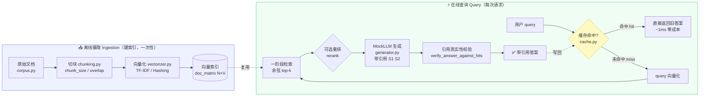
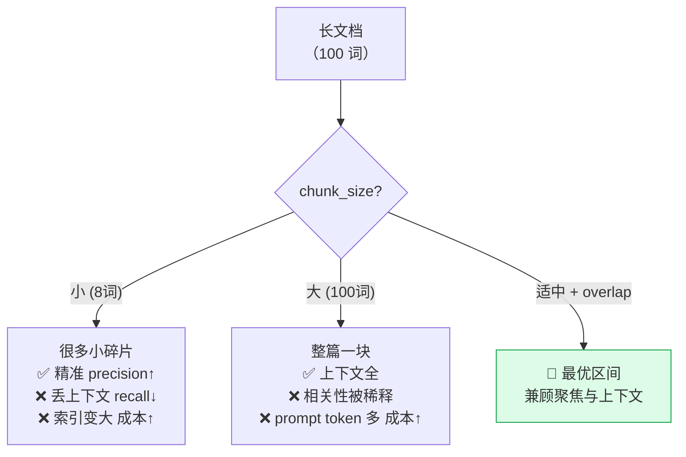
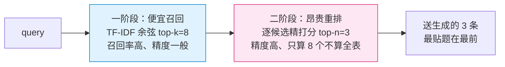
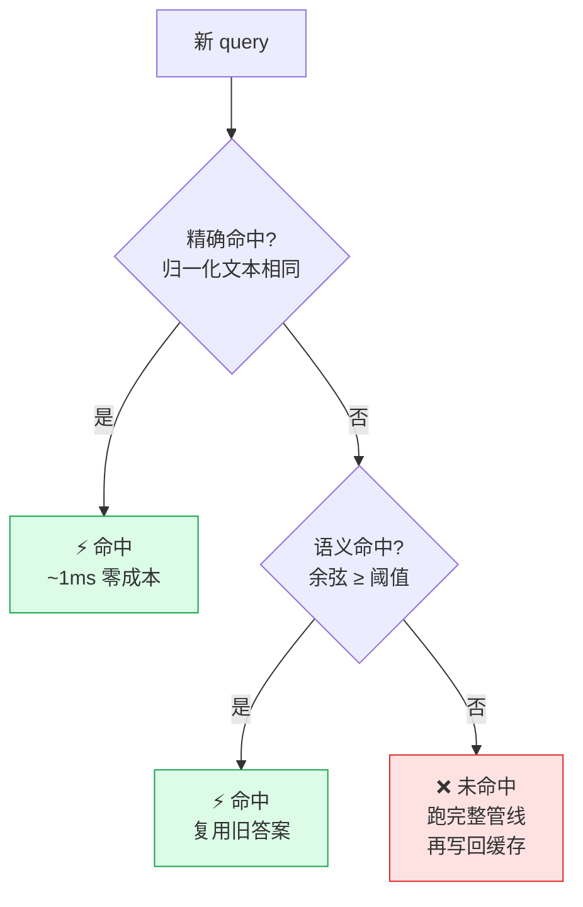

# 🔎 03 · RAG 系统设计实验室（RAG Design Lab）

> 配套《Systems Design in the LLM Era》（Sampriti Mitra）第 2 章「核心架构模式」之 **grounding（接地）/ 低延迟 / 成本 / 可测性** 四大维度的**动手实验**。
>
> 一句话：**用纯 numpy 手写一条完整 RAG（Retrieval-Augmented Generation，检索增强生成）管线**，把"chunk 大小 / top-k / 缓存 / 重排"这些设计旋钮拧一拧，**用真实数据画出「检索质量 ↔ 延迟/成本」的权衡曲线**，并让离线 MockLLM 生成**每句都可回溯到真实片段的带引用答案**。
>
> 🧩 **完全离线**：不联网、不下模型、不需要任何 API key。核心检索是纯 numpy；`torch` 仅作可选打分演示，缺了也照跑。

---

## 🎯 你将学到什么（读完能回答的问题）

| # | 问题 | 本项目怎么回答 |
|---|------|--------------|
| 1 | RAG 到底由哪几块组成？数据怎么流动？ | 手写 `chunking → vectorizer → retriever → rerank → cache → generator` 全链路 |
| 2 | 怎么**量化**"检索好不好"？ | `recall@k / precision@k / MRR`，全部有 gold labels 对照 |
| 3 | `top-k` 调大调小，到底换来了什么、赔上了什么？ | 实验 1 权衡曲线：recall↑ 但 precision↓、延迟↑、成本↑ |
| 4 | `chunk` 切大切小有什么讲究？ | 实验 2：太小碎片化、太大稀释相关性，存在最优区间 |
| 5 | 缓存凭什么能降本增效？降多少？ | 实验 3：语义缓存按**命中率**比例砍平均延迟（本例 ↓88%） |
| 6 | 怎么让 RAG 的答案**可信、可审计**？ | MockLLM 生成 `[S1][S2]` 引用，且每条引用**必是原文子串**，有自动校验守卫 |

> 🔬 **贯穿全书的第一性原理**：作者说了无数遍 —— **"Patterns are Trade-offs（模式即权衡）"**。本实验室就是把这句话**变成可运行、可画图、可测的代码**。

---

## 🗺️ 0. 全局架构图（先看整体，再抠细节）



这张图对应《Systems Design in the LLM Era》第 2 章的 **RAG 三步**（Retrieve → Augment → Generate）+ 该章「低延迟」维度的**多级缓存**思想，再叠加「可测性」维度的**引用校验**。下面逐块拆开讲。

---

## 📦 1. 项目结构与运行

```
03_rag_design_lab/
├── README.md              ← 你在读的这份（极详教程）
├── requirements.txt       ← numpy / matplotlib / pytest（torch 可选）
├── corpus.py              ← 语料 + 带 gold labels 的评测查询集（黄金数据集）
├── chunking.py            ← 文档切块（chunk_size / overlap）
├── vectorizer.py          ← 纯 numpy 向量化：TF-IDF + Hashing + 余弦
├── retriever.py           ← 索引 + top-k 检索 + 可选重排
├── metrics.py             ← recall@k / precision@k / MRR
├── cache.py               ← 精确 + 语义缓存（含命中统计、FIFO 淘汰）
├── generator.py           ← 离线 MockLLM：抽取式生成 + 引用契约与校验
├── pipeline.py            ← 端到端管线 + 延迟/成本解析模型
├── run_demo.py            ← 一键出 3 张权衡图 + 打印带引用示例
└── tests/
    ├── test_retriever.py  ← 检索排序 / recall@k 数学正确
    ├── test_cache.py      ← 缓存命中降延迟 / 统计正确 / FIFO
    ├── test_tradeoffs.py  ← chunk / top-k 权衡 / 重排效果 / 成本单调
    └── test_citations.py  ← 引用映射真实片段 / 造假被拒
```

### ▶️ 怎么运行

```bash
# 1) 安装依赖（本机通常已装 numpy/matplotlib/pytest/torch-cpu）
pip install -r requirements.txt

# 2) 跑测试（必须全绿）
python -m pytest -q
# 期望：31 passed

# 3) 跑演示，出 3 张权衡图 + 打印一条带引用答案
python run_demo.py
# 产物：fig_topk_tradeoff.png / fig_chunk_tradeoff.png / fig_cache_effect.png
```

> ⚠️ **Windows 终端中文乱码不是 bug**：`run_demo.py` 输出是 UTF-8，而老式 `cmd`/GBK 代码页会显示成乱码。数据本身完全正确；PNG 图里的中文（用微软雅黑渲染）是清晰的。想在终端看清中文可先 `chcp 65001`。

---

## 🧱 2. 语料与黄金数据集（`corpus.py`）—— 一切评测的地基

### 2.1 为什么必须有"带标注"的数据？

要回答"检索好不好"，就必须先定义"什么叫对"。这就是 **golden dataset（黄金数据集）** ——《Systems Design in the LLM Era》第 2 章「可测性」维度的核心武器：

> 非确定性系统（LLM）没法用传统"断言相等"写单元测试。**唯一可靠的做法是：准备一批查询 + 人工标注的正确答案，用指标（如 recall）打分。**

我们构造了 14 篇围绕"LLM 系统设计"的英文短文档（每篇聚焦一个概念，如 RAG / chunking / caching / reranking…），和 8 条评测查询，**每条查询手工标注了它的相关文档 id**：

```python
LabeledQuery("q1", "how does retrieval augmented generation reduce hallucination",
             ["d01", "d08", "d11"])     # 这三篇才是"正确答案"
```

> 💡 **为什么用英文语料？** 为了让**纯 numpy 的 TF-IDF 分词**能跑（英文按空格/正则切词即可，无需中文分词库），从而 **100% 离线、零依赖**。换成中文只需把分词器换掉，管线不变。
>
> 💡 **为什么每条查询标多篇相关文档？** 只有"相关文档 > 1"时，`recall@k` 才有梯度可测（若每题只有 1 篇相关，recall 只会是 0 或 1，画不出权衡曲线）。

### 2.2 数据结构（逐行）

```python
@dataclass
class Document:
    doc_id: str      # 文档唯一 id，如 "d02"
    title: str       # 标题，生成答案引用时展示
    text: str        # 正文（英文，词频密集，便于 TF-IDF 拉开区分度）

@dataclass
class LabeledQuery:
    qid: str                       # 查询 id，如 "q1"
    question: str                  # 问题文本
    relevant_doc_ids: List[str]    # gold labels：正确文档 id 集合
```

- `@dataclass`：Python 自动生成 `__init__/__repr__`，省去样板代码。
- `gold_map()` 返回 `{qid: [doc_id,...]}`，供 `metrics.py` O(1) 查表。

> ⚠️ **坑：标注要"够准"但"别太满"**。如果把关系不大的文档也标成相关，recall 会虚高、precision 会虚低，权衡曲线失真。标注原则：**只标"直接回答该问题所必需"的文档**。

---

## ✂️ 3. 切块 Chunking（`chunking.py`）—— 第一个权衡旋钮

### 3.1 是什么 / 为什么

**Chunking** = 把长文档切成小段（passage），再逐段索引。为什么不整篇索引？

- 整篇索引：命中一篇 = 把整篇塞进 prompt，**又贵又稀释相关性**（真正有用的可能只有一句）。
- 切成小段：**命中更聚焦**（precision↑），塞进 prompt 的 token 更少（成本↓）。

但切太碎又有代价：**一段可能丢掉上下文**（比如代词指代、跨句逻辑断裂），反而漏掉答案（recall↓）。



### 3.2 核心代码（逐行讲）

```python
def chunk_document(doc, chunk_size, overlap=0):
    words = tokenize(doc.text)             # ① 先把正文切成词列表
    step = max(1, chunk_size - overlap)    # ② 窗口每次前进 step 个词
    while start < len(words):
        window = words[start:start + chunk_size]   # ③ 取一个定长窗口
        chunks.append(Chunk(chunk_id=f"{doc.doc_id}#{pos}", ...))  # ④ 记来源 doc_id
        start += step                      # ⑤ 滑动窗口
```

- **① tokenize**：小写化 + 正则抽词，保证和向量化用的是同一套分词（坐标系一致）。
- **② step = chunk_size − overlap**：`overlap`（重叠）让相邻 chunk 共享一部分词，**缓解"切在句子中间丢上下文"**。`max(1, …)` 是**关键兜底**。
- **④ chunk_id = `d02#0`**：全局唯一，且**记住来源 `doc_id`** —— 这是后面 recall 评测「按文档归并」和引用「回溯到文档」的命脉。

> ⚠️ **经典 bug：`overlap >= chunk_size` 会让窗口不前进 → 死循环 / chunk 爆炸**。本项目用 `step = max(1, chunk_size - overlap)` 强制窗口至少前进 1 个词。测试 `test_overlap_does_not_infinite_loop` 专门守这个坑。

> 💡 **面试高频**：「chunk 应该切多大？」标准答案不是一个数字，而是**"取决于你的文档结构、embedding 模型的最优输入长度、以及延迟/成本预算，需要用 recall@k 在你自己的数据上扫一遍找最优区间"** —— 而这正是本项目实验 2 干的事。

---

## 🔢 4. 向量化 Vectorizer（`vectorizer.py`）—— 检索的坐标系

### 4.1 第一性原理

> 检索的本质：给 query 和每篇 chunk **各算一个向量**，再比"谁离得近"（相似度）。**向量化器决定了「语义用什么坐标表示」。**

真实系统用 dense embedding（如 bge/e5，需要神经网络）。本项目为了**纯离线**，用两种**稀疏词向量化器**（无需任何预训练模型）：

### 4.2 TF-IDF（词频 × 逆文档频率）

$$
\text{tf}(t,d)=\text{词 }t\text{ 在文档 }d\text{ 中出现次数}
$$
$$
\text{idf}(t)=\ln\!\frac{1+N}{1+\text{df}(t)}+1 \quad(\text{+1 平滑，避免除零})
$$
$$
w(t,d)=\text{tf}(t,d)\cdot\text{idf}(t),\qquad \vec{v}_d = \frac{\vec{w}_d}{\lVert \vec{w}_d\rVert_2}
$$

直觉：**稀有词权重高**（区分度大），"the/is"这种到处都有的词权重低。最后 L2 归一化，让**余弦相似度退化成点积**（更快）。

```python
def fit(self, docs):
    for toks in tokenized:
        for t in set(toks):        # ① set：同一文档一个词只计一次 df
            df[t] += 1
    idf[i] = math.log((1 + n_docs) / (1 + df[t])) + 1.0   # ② +1 平滑
```

- **① `set(toks)`**：document frequency（文档频率）统计的是"词出现在**多少篇**文档里"，同一篇里出现 10 次也只算 1。
- **② 平滑**：`+1` 保证分母不为 0、且 idf 恒为正（避免出现在所有文档里的词权重变负）。

### 4.3 Hashing（特征哈希 / hashing trick）

```python
col  = h % self.n_features                 # ① 主哈希：词落进哪个桶
sign = 1.0 if (h >> 16) & 1 else -1.0      # ② 副哈希：决定 +1/-1
mat[row, col] += sign
```

- **无需词表**：直接把词哈希到固定 `n_features` 维 → **内存恒定、天然增量**（新词不改变维度），适合流式/超大词表。
- **代价：哈希冲突**（两个不同词落同一桶 = 噪声）。**② 带符号哈希**用第二个哈希位决定 +1/−1，让冲突**部分抵消**，减少系统性偏差。
- ⚠️ **坑**：这里**不能用 Python 内置 `hash()`** —— 它带随机盐、跨进程不稳定，会让索引**不可复现**。我们手写 FNV-1a 变体保证确定性。

### 4.4 余弦相似度

```python
def cosine_scores(query_vec, doc_matrix):
    q = query_vec.reshape(-1)
    return doc_matrix @ q          # 向量已 L2 归一化 → 余弦 == 点积，一次矩阵乘搞定全部
```

$$
\cos(\vec q,\vec d)=\frac{\vec q\cdot\vec d}{\lVert\vec q\rVert\,\lVert\vec d\rVert}\;\xrightarrow{\text{已归一化}}\;\vec q\cdot\vec d
$$

> 💡 **面试点**：为什么归一化后能直接点积？因为 $\lVert\vec q\rVert=\lVert\vec d\rVert=1$，分母消掉了。**一次 `doc_matrix @ q`（矩阵×向量）就算完了对所有文档的相似度**，这是向量检索快的根本原因。真实系统把这一步换成 FAISS/HNSW 做**近似最近邻（ANN）**，把 $O(N)$ 降到 $O(\log N)$。

> 💡 **可插拔设计**：`TfidfVectorizer` 和 `HashingVectorizer` 有**相同接口**（`fit_transform / transform`），`Retriever` 对二者一视同仁。把它俩换成 dense embedding 类，**下游一行都不用改** —— 这就是好的系统设计：**用接口隔离"会变的部分"**。

---

## 🔍 5. 检索器 Retriever（`retriever.py`）—— 排序 + 两阶段

### 5.1 一阶段检索：向量 + top-k

```python
def search(self, query, top_k=5):
    q_vec  = self.vectorizer.transform([query])[0]   # ① 用同一向量化器编码 query
    scores = cosine_scores(q_vec, self.doc_matrix)   # ② 一次矩阵乘算全部相似度
    top_idx = np.argpartition(-scores, k - 1)[:k]    # ③ O(N) 选出 top-k（不排全表）
    top_idx = top_idx[np.argsort(-scores[top_idx])]  # ④ 只对 k 个精确排序
```

- **① 关键**：query 必须用**已 fit 的同一个向量化器** transform，否则坐标系错位、分数无意义。
- **③ `argpartition`**：只把第 k 大的挪到位、不排整表，复杂度 $O(N)$，比 `argsort` 的 $O(N\log N)$ 快。
- **④** 再对这 k 个 $O(k\log k)$ 精确排序 —— **"粗筛 + 精排"** 是检索系统的通用套路。

### 5.2 二阶段：重排 Rerank（`rerank`）



**为什么要两阶段？** 精排模型（真实系统里是 **cross-encoder**：把 query 和 passage 拼一起过一遍网络，精度高但慢）**贵到不能对全表跑**。于是：**一阶段用便宜方法召回一小批候选，二阶段只对这批候选精排**。这是**召回率 ↔ 成本**的经典折衷。

本项目的重排打分是个便宜但有效的信号 —— query 与 passage 的**词重叠度**（几何平均归一，避免长段占便宜）：

```python
def _lexical_overlap_score(query, passage):
    q, p = set(tokenize(query)), set(tokenize(passage))
    return len(q & p) / (len(q) ** 0.5 * len(p) ** 0.5)
```

还提供一个**可选的 torch 实现** `_try_torch_score`（数值等价），用来演示 **"打分器是可插拔组件"**：装了 CPU 版 torch 就用它，没装自动回退 numpy，**功能完全不受影响**。

> ⚠️ **重排救不了召回的漏**：重排只能在**一阶段召回的候选集内**重新排序。如果一阶段 `top_k` 设太小、正确 chunk 根本没进候选，**再强的重排也捞不回来**。所以：**一阶段 top_k 决定 recall 上限，二阶段 rerank 决定 precision**。这是理解两阶段检索最重要的一句话。

---

## 📏 6. 评测指标 Metrics（`metrics.py`）—— 把"好不好"变成数字

### 6.1 三个核心指标

| 指标 | 公式 | 直觉 | 在 RAG 里意味着 |
|------|------|------|----------------|
| **recall@k** | $\dfrac{\lvert\text{相关}\cap\text{top-k}\rvert}{\lvert\text{相关}\rvert}$ | top-k 捞回了多少比例的相关文档 | **最关键**：漏了证据就答不对 |
| **precision@k** | $\dfrac{\lvert\text{相关}\cap\text{top-k}\rvert}{k}$ | top-k 里有多少是相关的 | 塞进 prompt 的**噪声/成本**程度 |
| **MRR** | $\dfrac{1}{\text{第一个相关的排名}}$ | 最相关的排得多靠前 | 用户/模型能不能**一眼看到**答案 |

### 6.2 关键实现细节：chunk 结果要先按 doc 归并

```python
def retrieved_doc_ids(hits):
    for h in hits:
        if h.chunk.doc_id not in seen:   # 一篇文档被切成多块，命中任一块 = 命中该文档
            out.append(h.chunk.doc_id)
```

> ⚠️ **粒度陷阱**：检索返回的是 **chunk**，但 gold labels 标的是 **文档**。必须**先把 chunk 结果按 `doc_id` 去重归并成文档排名**，再和 gold 比。否则一篇文档的 3 个 chunk 都命中会被错算成"3 个命中"，recall 虚高。`test_recall_at_k_math_is_correct` 用手工构造的例子逐值核对了这套定义。

> 💡 **面试点**：「你会用什么指标评估检索？」 —— **recall@k 是 RAG 的头号指标**（因为"漏证据"是 RAG 出错的头号原因），precision@k 反映噪声与成本，MRR 反映排序质量。生产里还会补 **nDCG**（带位置折扣）、**端到端答案正确率**（用 LLM-as-a-Judge）。

---

## 💾 7. 缓存 Cache（`cache.py`）—— 低延迟维度的核武器

### 7.1 为什么缓存能"降本增效"

LLM 生成**又慢（5–10s）又贵（按 token 计费）**。如果两个用户问的问题**语义几乎一样**，第二次没必要再跑整条管线 —— **把第一次的答案存起来直接返回**。



### 7.2 两种命中判定（各自的权衡）

| 类型 | 判定 | 优点 | 代价 |
|------|------|------|------|
| **精确 exact** | 归一化文本完全相同 | 简单、**零误命中** | 复用率低（改一个字就 miss） |
| **语义 semantic** | query 向量余弦 ≥ 阈值 | 复用率高（同义句也命中） | 阈值太低会**误命中**（答非所问） |

```python
def get(self, query, query_vec=None):
    idx = self._exact_index.get(norm)          # ① 先试 O(1) 精确命中
    if idx is not None: return ...hit...
    if query_vec is not None:                  # ② 再试语义命中：找最相似的
        sim = float(np.dot(q, e.vector))       #    双方已归一化，点积即余弦
        if best_sim >= self.threshold: return ...hit...
    self.stats.misses += 1                     # ③ 都没中 → miss
```

> ⚠️ **阈值是把双刃剑**：`test_semantic_hit_on_paraphrase`（阈值放宽 → 改写句命中）和 `test_high_threshold_avoids_false_hit`（阈值=1.0 → 不同问题不误命中）一正一反地守住了这个权衡。**生产里阈值设太低会"张冠李戴"，是 RAG 缓存最危险的坑。**

> 💡 **面试点**：「语义缓存怎么防误命中？」 —— 提高阈值、对命中结果做**二次校验**（如再比较 query 关键词覆盖）、给缓存条目加 **TTL**（避免返回过期答案）。本项目还实现了 **FIFO 淘汰**（`max_size` 满了踢最老的），对应"缓存有容量上限"这一现实约束（`test_cache_fifo_eviction`）。

---

## 🤖 8. 离线生成器 MockLLM（`generator.py`）—— 可信、可审计的答案

### 8.1 为什么用 MockLLM 而不是真 LLM

本项目**必须离线**。真实生成器（Claude / GPT）在这里被替换成一个**确定性的抽取式 MockLLM**：它**不发明事实**，只从检索到的 chunk 里挑**最贴题的句子**拼成答案，并给每句挂 `[S1] [S2]` 引用标记。

好处有二：
1. **确定性** → 同输入同输出 → **可写单元测试**。
2. **引用可严格校验** → 这正是"可信 RAG"的核心可测点。

> 💡 真实系统只需把 `generate()` 内部换成**一次 LLM 调用**（prompt 里塞检索到的 chunk + 要求它引用来源），**引用契约（citation contract）完全不变**。本项目训练你把"可验证性"焊进接口，而不是事后补。

### 8.2 抽取式生成 + 引用契约

```python
def generate(self, question, hits):
    if not hits:
        return Answer("I don't know — no relevant context was retrieved.")  # ① 宁拒答不幻觉
    for i, h in enumerate(used, start=1):
        sent = _best_sentence(question, h.chunk.text)     # ② 从 chunk 挑最贴题的句子
        parts.append(f"{sent} [S{i}]")                    # ③ 句子后紧跟引用标记 [S{i}]
        citations.append(Citation(marker=i, chunk_id=h.chunk.chunk_id, ...))  # ④ 建映射
```

- **① 拒答**：没检索到证据就明确说"我不知道" —— 可信 RAG 的铁律：**宁可拒答，不可幻觉**。
- **② 抽取式**：`_best_sentence` 从 chunk 里挑**和问题词重叠最多**的句子，**只搬运原文、绝不编造**。
- **③④ 引用契约**：答案里第 $i$ 个标记 `[S{i}]` ⟷ `citations[i-1]` ⟷ 第 $i$ 个检索 chunk，**严格一一对应**。

### 8.3 引用真实性校验（本项目的"可信"守卫）

```python
def verify_answer_against_hits(answer, hits):
    # 1) [S{n}] 编号必须连续从 1 起、且和声明的 citations 完全对齐
    # 2) 每条 citation.snippet 必须是被引 chunk 的【真实原文子串】
    # 3) citation.doc_id 必须和被引 chunk 的 doc_id 一致
    if norm_snip not in norm_full:  return False   # snippet 不是原文 → 判定造假
    if c.doc_id != chunk.doc_id:    return False   # 映射错乱 → 拒
    if by_id.get(c.chunk_id) is None: return False # 引用了没检索到的 chunk → 凭空捏造
```

这套校验能**自动抓出三类造假**，对应三个测试：
- `test_forged_citation_is_rejected`：snippet 写了 chunk 里没有的话 → 拒。
- `test_citation_to_unretrieved_chunk_is_rejected`：引用一个根本没被检索到的 chunk → 拒。
- `test_marker_gap_is_rejected`：引用编号跳号（只有 `[S2]` 没有 `[S1]`）→ 拒。

> 🔬 **第一性原理**：可信 RAG 的关键不是"让模型别撒谎"（做不到），而是**"让每个claim都可回溯、可自动校验"**。校验通不过就拦下来（降级/拒答），把"信任"变成"可验证"。这与本仓库 `Desktop\递归迭代` 里 **RLVR（可验证奖励）** 的思路一脉相承。

---

## ⚙️ 9. 端到端管线 + 延迟/成本模型（`pipeline.py`）

### 9.1 延迟/成本为什么用"解析模型"而非真计时

真实 LLM 延迟受网络/负载抖动，且本机离线无法调用。工程做**容量规划**时普遍先用**参数化解析模型**估量级、画曲线，再用真实压测校准：

$$
\text{Latency} = \underbrace{c_{\text{ret}}\cdot N_{\text{chunks}}}_{\text{检索}} + \underbrace{c_{\text{rr}}\cdot N_{\text{cand}}}_{\text{重排}} + \underbrace{c_{\text{base}} + c_{\text{tok}}\cdot T_{\text{prompt}}}_{\text{生成}}
$$
$$
\text{Cost} = \frac{T_{\text{prompt}}}{1000}\cdot c_{\text{usd/1k}},\qquad T_{\text{prompt}}=\sum_{\text{chunk}\in\text{context}}\lvert\text{tokens}\rvert
$$

命中缓存则**短路整条管线**：`latency = cache_hit_ms ≈ 1ms, cost = 0`。系数（每 token 毫秒/美元）都在 `CostModel` 里，**量级对齐"CPU 检索便宜、LLM 生成贵"** 的现实，可自行调。

### 9.2 管线主流程（逐段）

```python
def run(self, query):
    if self.use_cache and cached is not None:          # ① 缓存命中 → 1ms 返回
        return QueryTrace(cache_hit=True, latency_ms=1.0, cost_usd=0.0, ...)
    hits = self.retriever.search(query, top_k=self.top_k)          # ② 一阶段检索
    if self.use_rerank: hits = rerank(query, hits, self.rerank_top_n)  # ③ 可选重排
    ptoks = self.cost.prompt_tokens(context_chunks)               # ④ 上下文 token 数 → 成本
    answer = self.generator.generate(query, hits)                 # ⑤ 生成带引用答案
    self.cache.put(query, (answer, hits, ptoks), q_vec)           # ⑥ 写回缓存
```

每一步都累加延迟/成本，最终打包成 `QueryTrace`（**可观测记录**：结果 + 各阶段延迟 + 是否命中缓存），这正是《Systems Design in the LLM Era》第 2 章「可观测性」维度要的东西 —— **每次请求都留痕，才能事后分析瓶颈**。

---

## 📊 10. 三个实验读什么（`run_demo.py` 产物）

### 实验 1：top-k 的权衡（`fig_topk_tradeoff.png`）

跑 `python run_demo.py` 得到的真实数据（本机复现）：

| k | recall | precision | 延迟(ms) | 成本($/千次) |
|---|--------|-----------|----------|--------------|
| 1 | 0.292 | **0.875** | 323.8 | 0.062 |
| 3 | 0.542 | 0.583 | 591.8 | 0.196 |
| 5 | 0.708 | 0.438 | 878.3 | 0.339 |
| 10 | **0.792** | 0.244 | 878.3 | 0.339 |

**读图结论（教科书级"模式即权衡"）**：
- **recall 随 k 单调上升**（捞得越多越不容易漏）——蓝线。
- **precision 随 k 单调下降**（捞得越多噪声越多）——绿线。
- **延迟/成本随 k 上升**（上下文越多、生成越贵）——红线。
- ⟹ **不存在"免费的 k"**。工程上：**先定延迟/成本预算，再在预算内把 recall 拉到最高的那个 k**。

### 实验 2：chunk 大小的权衡（`fig_chunk_tradeoff.png`）

| chunk 大小 | recall@5 | chunk 数 |
|-----------|----------|----------|
| 8 | 0.625 | 75 |
| 24 | 0.667 | 28 |
| 40 | **0.708** | 15 |
| 100 | 0.708 | 14 |

**结论**：chunk 太小（8 词）→ 碎片化、上下文丢失，recall 反而低、索引还膨胀到 75 块；适中（40 词）→ recall 最高。**存在最优区间**，必须在**你自己的数据**上扫出来。

### 实验 3：缓存效果（`fig_cache_effect.png`）

模拟一个"40% 概率复读上一条"的查询流（近似真实热点分布）：

- 无缓存平均延迟 ≈ **592.5 ms**
- 有缓存平均延迟 ≈ **69.7 ms**（命中率 88%）
- **延迟下降 ≈ 88%**

**结论**：缓存把平均延迟**按命中率的比例**压下来。命中率越高（热点越集中），收益越大。这就是为什么真实 RAG 系统**几乎都会上多级缓存**。

---

## 🧪 11. 测试怎么覆盖这些结论（`tests/`）

```bash
python -m pytest -q     # 31 passed
```

| 测试文件 | 守住的性质 |
|---------|-----------|
| `test_retriever.py` | 结果按分数降序、相关文档排前、recall@k **数学定义**正确、recall 关于 k 单调、Hashing 也能排序 |
| `test_cache.py` | 重复查询**第二次命中且延迟骤降**、命中率统计正确、语义命中/严格阈值不误命中、FIFO 淘汰 |
| `test_tradeoffs.py` | **top-k↑ → recall↑ & precision↓**、chunk 越小块越多、无重叠不丢词、overlap 不死循环、重排不降 top-1、成本随上下文单调、重排加延迟 |
| `test_citations.py` | 引用条数=上下文数、**snippet 是原文真实子串**、marker 映射正确、无证据拒答、**造假/跳号/凭空引用全被拒** |

> 💡 **这套测试本身就是"黄金数据集 + 断言"的范式**：非确定性系统测不了"输出等于某个字符串"，但能测**性质**（单调、命中、可回溯）。这是 LLM 时代写测试的正确姿势。

---

## 🕳️ 12. 常见坑速查（⚠️ Checklist）

| # | 坑 | 后果 | 本项目怎么防 |
|---|-----|------|------------|
| 1 | `overlap >= chunk_size` | 切块死循环 | `step = max(1, chunk_size - overlap)` |
| 2 | query 和 doc 用**不同**向量化器 | 坐标系错位、分数无意义 | 强制 query 走**同一个**已 fit 的 vectorizer |
| 3 | 用内置 `hash()` 做特征哈希 | 索引跨进程不可复现 | 手写确定性 FNV-1a |
| 4 | chunk 结果不按 doc 归并就算 recall | recall 虚高 | `retrieved_doc_ids` 先去重归并 |
| 5 | 语义缓存阈值太低 | 误命中、张冠李戴 | 阈值可调 + 双测试守正反 |
| 6 | 一阶段 top_k 太小 | recall 上限被锁死，重排也救不回 | 实验 1 说明 top_k 决定 recall 天花板 |
| 7 | 让 LLM"自由发挥"不校验引用 | 幻觉/编造来源 | `verify_answer_against_hits` 硬校验子串 |
| 8 | 把成本当成"检索便宜就无所谓" | 上下文塞太多，账单爆炸 | 成本模型显式随 prompt token 增长 |

---

## 📌 小结

- **RAG = 检索 + 增强 + 生成**，每一段都是**可调旋钮**，每个旋钮都是**权衡**。
- **检索质量**用 `recall@k`（头号）/ `precision@k` / `MRR` 量化，前提是有**黄金数据集**。
- **top-k**：recall↑ 但 precision↓、延迟↑、成本↑ —— 在预算内取最高 recall。
- **chunk 大小**：太小碎片化、太大稀释，**有最优区间**，得在自己数据上扫。
- **缓存**：按**命中率**比例砍平均延迟/成本，是低延迟维度的核武器，但要防**语义误命中**。
- **重排**：以**少量延迟**换**精度**，但救不了一阶段的漏。
- **可信**：把**引用契约 + 自动校验**焊进生成接口，让"信任"变成"可验证"。
- 一切都是那句话：**Patterns are Trade-offs（模式即权衡）**。

---

## 🔗 延伸阅读

**本书其它章 / 本仓库其它项目**：
- 📖 `book-systems-design-llm-era/book-guide/02_LLM 系统设计的核心架构模式.md` —— 本项目的理论总纲（RAG 三步、多级缓存、可测性、可观测性、混合 RAG/GraphRAG）。
- 📖 `book-guide/05_案例：电商 AI 搜索.md` —— RAG 在电商搜索的落地案例，可把本实验的检索器换进去。
- 🛠️ `book-hands-on-llm-serving/projects/01_serving_slo_harness` —— 把本项目的"延迟/成本模型"接到真实 serving SLO 压测。
- 🛠️ `book-ai-model-evaluation/projects/01_offline_metrics_lab` —— 评测指标的姊妹项目，扩展到端到端答案质量（LLM-as-a-Judge）。
- 🏗️ `ai-infra-architecture/` —— 向量检索在生产架构中的位置（ANN 索引、向量库选型、在线/离线分层）。
- 🚀 `llm-inference/` —— 生成阶段的真实推理优化（KV cache、连续批处理、量化），本项目的 MockLLM 换成真实推理时的下一站。

**下一步可以自己动手扩展**：
1. 把 `HashingVectorizer` 换成一个**离线的 dense embedding**（如导出一个小模型权重），对比 recall。
2. 实现 **hybrid retrieval**（稀疏 + 稠密分数融合，对应语料 d10），画三方对比曲线。
3. 给缓存加 **TTL + 命中后二次校验**，量化"误命中率 vs 复用率"曲线。
4. 把重排换成真正的 **cross-encoder**（torch CPU 小模型），量化"精度增益 vs 延迟代价"。

---

> 🧭 **一句话记住这个项目**：*RAG 的每一个设计选择，都能用 `recall@k` 和 `延迟/成本` 两把尺子量出来 —— 拧旋钮、画曲线、读权衡，这就是「LLM 时代的系统设计」。*
