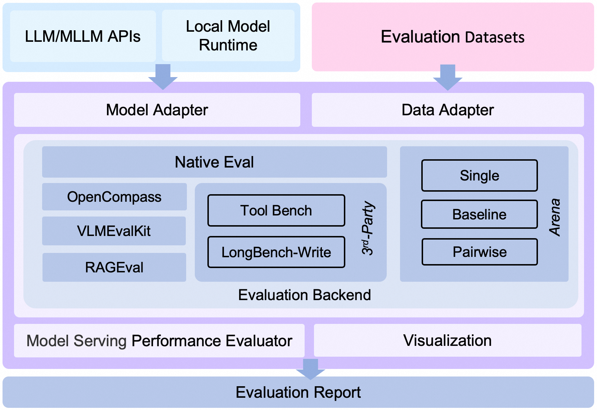

# EvalScope：大模型评测与性能压测一体化框架

> 一句话定位：EvalScope 是 ModelScope 出品的「效果评测 + 推理性能压测」一站式框架，用一套 CLI/Python API 同时回答「模型答得对不对」和「模型跑得快不快」两个问题。📍 导航：[[00-知识地图]]
> 🔗 相关：[[llm-eval/README]] · [[llm-eval/llm-performance/大模型场景下训练和推理性能指标名词解释]] · [[llm-inference/vllm/README]] · [[llm-inference/README]]

## 阅读地图

| 小节 | 你会得到什么 | 关键词 |
| --- | --- | --- |
| 0. 一句话锚点 | 评测 = 效果 + 性能两条腿 | Accuracy / Throughput |
| 1. 地基 | 为什么需要专门的评测框架 | 数据污染 / 复现性 |
| 2. 整体架构 | 6 大组件如何串成流水线（原文架构图） | Adapter / Backend |
| 3. 四大评测后端 | Native / OpenCompass / VLMEvalKit / RAGEval 怎么选 | 后端复用 |
| 4. 效果测评原理 | 选择题/生成题如何自动判分 | exact-match / LLM-judge |
| 5. 性能压测原理 | 并发拉满后测的到底是什么 | TTFT / TPOT / QPS |
| 6. 数据集管理 | 数据集从哪来、怎么离线下载（原文命令） | modelscope download |
| 实操命令 | 安装 + 效果评测 + 压测一把梭 | evalscope eval/perf |
| 常见问题/坑 | 数据污染、并发、tokenizer 不一致 | 8 个高频坑 |

## 0. 一句话锚点

评测一个大模型，本质上是在两个正交维度上打分：

```
            效果(Quality)  →  答案对不对？     用 数据集 + 判分规则
模型评测  ┤
            性能(Speed)    →  服务快不快稳不稳？ 用 压测器 + 性能指标
```

EvalScope 把这两条腿合进一个框架：`evalscope eval`（效果）+ `evalscope perf`（性能）。
官方最佳实践入口（原文保留）：Qwen3 模型评测最佳实践 https://evalscope.readthedocs.io/zh-cn/latest/best_practice/qwen3.html

## 1. 地基 / 前置：为什么需要专门的评测框架

手写一个 `for` 循环调用模型、对答案，看起来很简单，但工程上有四个绕不开的难题，这正是 EvalScope 这类框架存在的理由：

| 难题 | 朴素脚本的问题 | 框架怎么解决 |
| --- | --- | --- |
| 数据集千差万别 | CEval 是选择题、GSM8K 是数学推理、MMLU 又是另一种格式 | **Data Adapter** 统一成内部格式 |
| 模型接口不统一 | 本地 transformers / vLLM OpenAI API / 远程 API 各调一套 | **Model Adapter** 统一抽象 |
| 判分逻辑复杂 | 选择题抠选项、生成题要正则/LLM 裁判 | 内置 metric，可插 LLM-judge |
| 性能与效果割裂 | 测完准确率还要换一套工具压测延迟 | **Performance Evaluator** 同框架内 |

一句话：**评测的工程量主要花在「适配」和「判分」上，不在「调模型」上**。框架的价值就是把这些胶水代码沉淀成可复用组件。

## 2. 整体架构：6 大组件串成一条流水线

原文架构图（保留）：

```
<p align="center">
    
    <br>EvalScope 整体架构图.
</p>
```

下面把架构图翻译成数据流 ASCII：

```
                ┌─────────────────────────────────────────────────────┐
   输入数据集 ─▶│ Data Adapter  数据适配器：转换/清洗成框架内部统一格式  │
                └───────────────┬─────────────────────────────────────┘
                                ▼
   被测模型 ───▶┌─────────────────────────────────────────────────────┐
 (API/本地)     │ Model Adapter 模型适配器：把模型输出转成框架要的格式  │
                └───────────────┬─────────────────────────────────────┘
                                ▼
                ┌─────────────────────────────────────────────────────┐
                │ Evaluation Backend 评测后端（四选一/混用）            │
                │   Native │ OpenCompass │ VLMEvalKit │ RAGEval        │
                └───────────────┬─────────────────────────────────────┘
                                ▼
                ┌──────────────────────────┐   ┌───────────────────────┐
                │ Performance Evaluator     │   │ Evaluation Report      │
                │ 性能/压测：TTFT/吞吐/报告 │   │ 评测报告：汇总打分     │
                └───────────┬──────────────┘   └───────────┬───────────┘
                            └──────────────┬───────────────┘
                                           ▼
                              ┌──────────────────────────┐
                              │ Visualization 可视化对比  │
                              └──────────────────────────┘
```

原文「架构介绍」逐条保留并补充「为什么这么设计」：

1. **Model Adapter**：模型适配器，用于将特定模型的输出转换为框架所需的格式，支持 API 调用的模型和本地运行的模型。
   - 为什么：本地 `transformers` 返回 logits/文本、vLLM 走 OpenAI 兼容 HTTP、远程 API 又是 JSON，**判分逻辑不应该关心模型从哪来**，适配器把差异隔离在最外层。

2. **Data Adapter**：数据适配器，负责转换和处理输入数据，以便适应不同的评测需求和格式。
   - 为什么：同一个 benchmark 可能有几十种 prompt 模板（few-shot / CoT / 选项排列），适配器把「原始题目 → 喂给模型的 prompt」这步标准化，保证**复现性**。

3. **Evaluation Backend**（评测后端，EvalScope 的核心可插拔层）：
   - **Native**：EvalScope 自身的**默认评测框架**，支持多种评测模式，包括单模型评测、竞技场模式、Baseline 模型对比模式等。
   - **OpenCompass**：支持 [OpenCompass](https://github.com/open-compass/opencompass) 作为评测后端，对其进行了高级封装和任务简化，您可以更轻松地提交任务进行评测。
   - **VLMEvalKit**：支持 [VLMEvalKit](https://github.com/open-compass/VLMEvalKit) 作为评测后端，轻松发起多模态评测任务，支持多种多模态模型和数据集。
   - **RAGEval**：支持 RAG 评测，支持使用 [MTEB/CMTEB](https://evalscope.readthedocs.io/zh-cn/latest/user_guides/backend/rageval_backend/mteb.html) 进行 embedding 模型和 reranker 的独立评测，以及使用 [RAGAS](https://evalscope.readthedocs.io/zh-cn/latest/user_guides/backend/rageval_backend/ragas.html) 进行端到端评测。
   - **ThirdParty**：其他第三方评测任务，如 ToolBench。

4. **Performance Evaluator**：模型性能评测，负责具体衡量模型推理服务性能，包括性能评测、压力测试、性能评测报告生成、可视化。

5. **Evaluation Report**：最终生成的评测报告，总结模型的性能表现，报告可以用于决策和进一步的模型优化。

6. **Visualization**：可视化结果，帮助用户更直观地理解评测结果，便于分析和比较不同模型的表现。

> 设计要点：**Adapter 在两端、Backend 在中间**。换模型只动 Model Adapter，换榜单只动 Data Adapter，换评测引擎只切 Backend——三者解耦，这是框架可维护性的核心。

## 3. 四大评测后端怎么选（对照表）

EvalScope 不重复造轮子，而是把成熟的评测框架「封装复用」，自己只做编排。选型对照：

| 场景 | 选哪个后端 | 理由 |
| --- | --- | --- |
| 通用文本模型、要竞技场/Baseline 对比 | **Native** | 框架原生、零额外依赖、模式最全 |
| 想直接跑 OpenCompass 的海量榜单 | **OpenCompass** | 复用其题库，EvalScope 简化提交 |
| 多模态（图文/视频）模型 | **VLMEvalKit** | 专为 VLM 设计的数据/判分 |
| 评 embedding / reranker / RAG 链路 | **RAGEval** | MTEB 独立评 + RAGAS 端到端 |
| 工具调用 Agent | **ThirdParty(ToolBench)** | 第三方专项任务 |

口诀：**纯文本走 Native，多模态走 VLMEvalKit，检索走 RAGEval，海量榜单借 OpenCompass。**

## 4. 效果测评原理：自动判分到底怎么打分

效果评测入口（原文保留）：
- 基础用法 https://evalscope.readthedocs.io/zh-cn/latest/get_started/basic_usage.html
- 推理模型评估（DeepSeek-R1 蒸馏）https://github.com/modelscope/evalscope/blob/main/docs/zh/best_practice/deepseek_r1_distill.md

判分方式按题型分两类，这是理解评测分数的关键：

```
题型                判分方式            示例数据集
─────────────────  ─────────────────  ───────────────
选择题(单选/多选)   exact-match 抠选项   C-Eval / CMMLU / MMLU
数学/推理(自由生成) 答案抽取 + 数值比对  GSM8K（抽 "#### 42" 后比对）
开放式生成          LLM-as-Judge 打分    AlpacaEval 类
```

**数值示例（手算准确率）**：某模型在 CMMLU 的「计算机科学」子集 100 题中答对 73 题：

$$\text{Accuracy} = \frac{\text{答对题数}}{\text{总题数}} = \frac{73}{100} = 73\%$$

**推理模型的坑**（DeepSeek-R1 蒸馏类）：模型先输出一大段 `<think>...</think>` 思维链再给答案。如果判分时不剥离 think 段直接做 exact-match，会因为思维链里出现别的数字而误判。所以推理模型评测必须配「答案抽取」规则，这正是官方单列 deepseek_r1_distill 最佳实践的原因。

## 5. 性能压测原理：并发拉满后测的是什么

性能压测参数文档（原文保留）：https://evalscope.readthedocs.io/zh-cn/latest/user_guides/stress_test/parameters.html

压测器向推理服务（vLLM / TGI / API）发起并发请求，测的是「服务级」指标，而非单条延迟。核心指标关系图：

```
   请求到达 ─────────────────────────────────────▶ 时间轴
      │                                              │
      ├── TTFT ──┤                                   │
      │ (首 token │                                   │
      │  时延)    │◀──── 每个新 token 间隔 TPOT ────▶│
      │           ▼   ▼   ▼   ▼   ▼   ▼   ▼   ▼      │
      │           t1  t2  t3  ...            tn      │
      │◀──────────────  端到端时延 E2E  ──────────────▶│
```

| 指标 | 含义 | 受什么影响 |
| --- | --- | --- |
| **TTFT** (Time To First Token) | 首 token 时延 | prefill 长度、排队、KV cache |
| **TPOT** (Time Per Output Token) | 每个输出 token 平均间隔 | decode 速度、batch 大小 |
| **E2E Latency** | 单请求端到端时延 | ≈ TTFT + (输出长度-1)×TPOT |
| **Throughput / QPS** | 系统每秒处理 token / 请求数 | 并发数、显存、调度 |

**数值示例（手算端到端时延）**：TTFT=0.3s，TPOT=20ms，输出 200 个 token：

$$E2E \approx TTFT + (N_{out}-1)\times TPOT = 0.3 + 199 \times 0.02 \approx 4.28\,\text{s}$$

**吞吐 vs 时延的权衡**：并发越高，单请求 TPOT 变慢（GPU 被瓜分），但整体 QPS 上升，直到显存/算力打满后 QPS 饱和、时延继续恶化。压测的目的就是找到这条曲线的「拐点」——即 SLA 约束下的最大可用并发。详见 [[llm-eval/llm-performance/大模型场景下训练和推理性能指标名词解释]]。

## 6. 数据集管理（原文命令保留）

EvalScope 评测前需要把数据集拉到本地。原文给出的三条 ModelScope 下载命令（中文榜单常用）：

```bash
modelscope download --dataset modelscope/cmmlu       --local_dir ./cmmlu
modelscope download --dataset modelscope/ceval-exam  --local_dir ./ceval
modelscope download --dataset modelscope/gsm8k       --local_dir gsm8k
```

| 数据集 | 类型 | 用途 |
| --- | --- | --- |
| CMMLU | 中文多学科选择题 | 中文综合知识能力 |
| C-Eval (ceval-exam) | 中文学科考试 | 中文学科推理 |
| GSM8K | 小学数学应用题 | 数学/链式推理能力 |

为什么先离线下载：评测机器常无外网或受限速，**先 download 到 `--local_dir` 再离线评测**可保证复现且不被网络抖动打断；同一份本地数据也避免了「不同时间拉到不同版本」导致分数不可比。

## 实操：安装 + 效果评测 + 压测一把梭

> 下方命令为基于原文链接与框架通用用法的最小可跑示例，参数以官方文档为准；原文已有的 URL/命令均保留在上文对应小节。

```bash
# 1) 安装（含性能压测依赖）
pip install 'evalscope[perf]'

# 2) 效果评测：本地/远程模型跑 CMMLU + GSM8K（先用第6节命令把数据集下到本地）
evalscope eval \
  --model Qwen/Qwen3-8B \
  --datasets cmmlu gsm8k

# 3) 性能压测：对 OpenAI 兼容服务（如 vLLM 起的服务）发起并发压测
evalscope perf \
  --url http://127.0.0.1:8000/v1/chat/completions \
  --model Qwen3-8B \
  --parallel 16          # 并发数，配合官方 parameters 文档逐项调
```

评测产物：每次运行生成结构化 **Evaluation Report**（各子集准确率）与性能报告（TTFT/TPOT/吞吐），并可走 **Visualization** 看板做多模型对比。

## 常见问题 / 坑

| 坑 | 现象 | 解法 |
| --- | --- | --- |
| 数据污染 (contamination) | 分数虚高，测试题进过训练集 | 用新榜/私有题集交叉验证，别只信单一公开榜 |
| 推理模型未剥离 think 段 | R1 类模型准确率异常偏低 | 配答案抽取，参考 deepseek_r1_distill 最佳实践 |
| 数据集没离线下载 | 评测中途网络中断/拉到不同版本 | 先 `modelscope download` 到 `--local_dir` |
| 压测并发开太大 | 服务 OOM 或时延爆炸，QPS 反降 | 从小并发起步，沿曲线找拐点 |
| tokenizer 不一致 | 压测的 token 数与服务实际计费不符 | 压测器与服务用同一 tokenizer |
| 选错后端 | 多模态/RAG 用 Native 评得不准 | 多模态→VLMEvalKit，RAG→RAGEval |
| 只看平均分 | 掩盖了子集（如数学）短板 | 看分子集报告 + 可视化对比 |
| 效果好≠服务可用 | 准确率高但 TTFT 慢、吞吐低 | 效果与性能两条腿都要压，缺一不可 |

## 🔗 跳转链接

- 枢纽总图：[[00-知识地图]]
- 同目录：[[llm-eval/README]] · [[llm-eval/llm-performance/大模型场景下训练和推理性能指标名词解释]]
- 被测的推理服务：[[llm-inference/README]] · [[llm-inference/vllm/README]] · [[llm-inference/解码策略]] · [[llm-inference/PD分离]]
- 压测对象的优化：[[llm-optimizer/FlashAttention]] · [[llm-optimizer/kv-cache]]
- 被评模型的来源：[[llm-algo/transformer/模型架构]] · [[llm-algo/moe/README]] · [[llm-train/README]] · [[llm-alignment/RLHF]] · [[llm-alignment/DPO]]
- 影响性能的底层：[[ai-infra/算力/GPU工作原理]] · [[ai-infra/ai-hardware/硬件对比]] · [[docs/transformer内存估算]]
