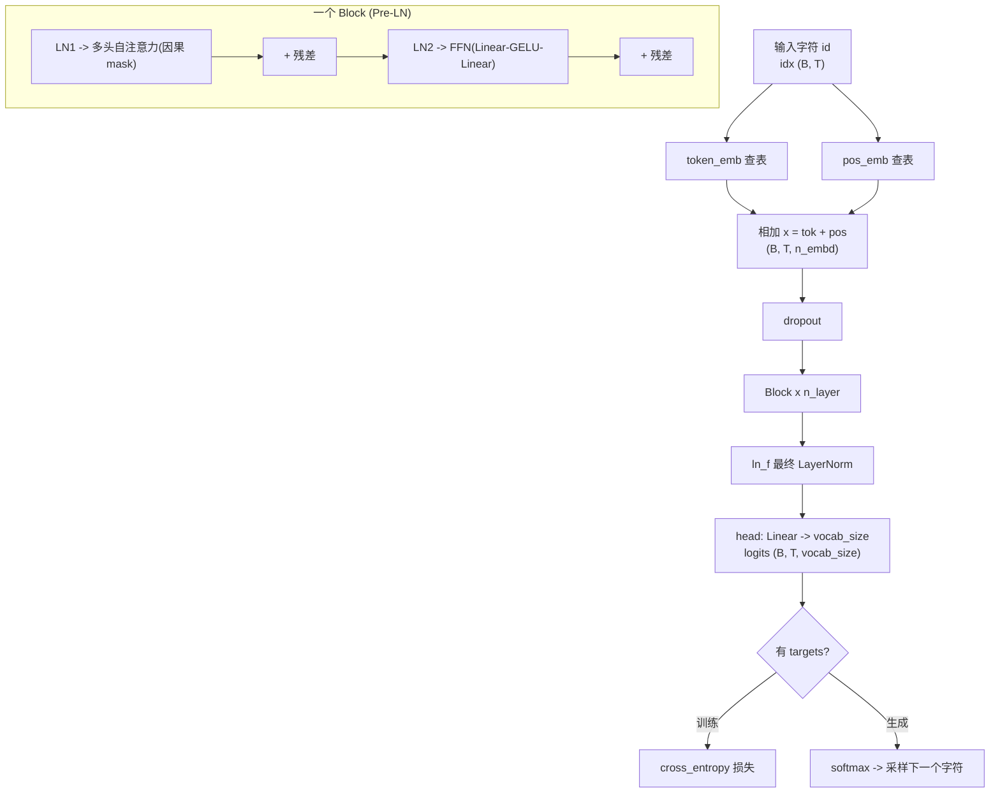

# 手把手教学：从零搭建并预训练一个字符级 GPT

> 一句话导览：本篇带你逐行读懂 `tiny_gpt.py`——一个用纯 PyTorch 写的、几十秒就能在 CPU 上跑完的最小 GPT。学完这一篇你能掌握：
>
> 1. **decoder-only Transformer 的完整结构**：token/位置嵌入 → 若干个 `Block`(注意力 + FFN)→ 最终 LayerNorm → 输出层 logits，每一块为什么存在、放在哪里。
> 2. **多头自注意力 + 因果 mask 的数学与实现**：$\text{softmax}(QK^\top/\sqrt{d})V$ 怎么算，因果 mask 怎么保证"只看左边"。
> 3. **自回归语言建模的训练信号**：为什么 `y` 是 `x` 右移一位、交叉熵损失怎么算、随机基线 $\ln(\text{vocab\_size})$ 是什么。
> 4. **一个真实可跑的训练循环**：`get_batch → forward → zero_grad → backward → step`，以及为什么是这个顺序。
> 5. **自回归采样(生成)**：训练完的模型怎么"一个字一个字"地写出带训练文本风格的文字。

---

## 0. 前置知识与环境

### 你需要会一点点什么
- **Python 基础**：函数、类、列表推导式即可，不需要高级特性。
- **张量(tensor)的直觉**：把它当成"带形状的多维数组"。本文出现的形状我都会用 `(B, T, C)` 这种记号标出来，并解释每个字母含义,看不懂也没关系,跟着读。
- **一点点高数/线代**：知道"矩阵乘法""向量点积""softmax 把一组数变成和为 1 的概率"就够了。完全不会也能读完,数学部分都配了直觉。

> 真的零基础也能跟上。代码只有 **416 行**,而且作者把每块都拆开了。

### 安装环境

```bash
pip install torch
pip install matplotlib   # 可选,只用来画 loss 曲线;没有也不会崩
```

CPU 版 PyTorch 就够了,**不需要 GPU**。Python 3.x 即可(README 标注用 3.13 验证过)。

### 怎么打开跑

```bash
cd practical-projects/01-tiny-gpt-from-scratch
python tiny_gpt.py
```

全程纯 CPU,**几十秒内**跑完。代码里固定了随机种子 `SEED = 1337`,所以你每次跑的数字都一样,方便和本文对照。

---

## 1. 问题背景：不用这个技术会怎样

假设你想让计算机"学会写莎士比亚风格的对白",最朴素的想法是什么?

**朴素想法一:写一堆 if-else 规则。** "如果上一个词是 `First Citizen:`,就换行……" 你会发现规则永远写不完,语言的组合是无穷的。

**朴素想法二:统计 n-gram。** 记录"前 2 个字符是 `Th` 时,下一个字符是 `e` 的概率"。这能跑,但有两个致命问题:
- **上下文太短**:只看前 2~3 个字符,记不住"现在正处在 `All:` 这个角色的台词里"这种长距离信息。
- **稀疏**:稍微长一点的前缀(比如前 10 个字符)在数据里几乎只出现一次,统计不出可靠概率。

**GPT 的做法**:用一个**神经网络**来建模"给定前面所有字符,下一个字符是什么"这个条件概率分布。它的优势:
- 用 **self-attention** 让每个位置都能"回头看"前面**整个**上下文窗口(本项目是 64 个字符),而不是只看前 2~3 个。
- 用**连续向量**(embedding)表示字符,相似的上下文会得到相似的表示,**不再稀疏**。
- 网络的参数是**学出来的**,不用人手写规则。

这就是动机:我们要的是一个能"看一段历史、预测下一个字符"的可训练函数。`tiny_gpt.py` 把这个函数从零搭出来,并真的训练它收敛。下面我们把它讲透。

---

## 2. 核心原理详解

GPT 是一个 **decoder-only Transformer**,训练目标叫**自回归语言建模(autoregressive language modeling)**,说人话就是**"预测下一个 token"**。

### 2.1 自回归:把一句话拆成一连串"预测下一个字符"

一段文本 $c_1 c_2 \dots c_n$ 的概率,可以用链式法则拆开:

$$
P(c_1, c_2, \dots, c_n) = \prod_{t=1}^{n} P(c_t \mid c_1, \dots, c_{t-1})
$$

也就是说,只要我们有一个模型能算 $P(c_t \mid c_{<t})$(给定前面所有字符,下一个字符的分布),就能建模任意长文本。**这正是训练目标**:在每个位置 $t$,让模型预测的下一个字符尽量接近真实的下一个字符。

这也解释了代码里 `get_batch()` 为什么把目标 `y` 设成输入 `x` 右移一位——在位置 $t$,输入是 $c_1\dots c_t$,要预测的答案就是 $c_{t+1}$。

### 2.2 token 嵌入 + 位置嵌入:把字符变成"带位置的向量"

字符本身是离散符号,网络只吃向量。于是:
- **token embedding**:用一张查找表,把字符 id 映射成一个 $n\_embd$ 维向量(语义/词义信息)。
- **positional embedding**:Transformer 的注意力对顺序**天生不敏感**(把输入打乱,注意力算出来的集合是一样的)。所以必须**显式**告诉它"这是第几个位置",再用一张位置查找表给每个位置一个向量。

两者**相加**,得到每个 token 的初始表示:

$$
x_t = \text{TokEmb}(c_t) + \text{PosEmb}(t)
$$

### 2.3 缩放点积自注意力(scaled dot-product attention)

注意力的核心思想:**每个位置去"问"序列里的其他位置,按相关性加权汇总它们的信息**。每个 token 算出三个向量:
- **Query(Q)**:我想找什么。
- **Key(K)**:我能提供什么(用来被匹配)。
- **Value(V)**:如果被选中,我实际贡献的内容。

注意力公式:

$$
\text{Attention}(Q, K, V) = \text{softmax}\!\left(\frac{Q K^\top}{\sqrt{d_k}}\right) V
$$

- $QK^\top$:每个位置的 Query 和所有位置的 Key 做点积,得到"相关性得分"矩阵,形状 $(T, T)$。
- 除以 $\sqrt{d_k}$(代码里 `head_size`):**缩放**。维度大时点积数值会很大,直接 softmax 会饱和(梯度趋近 0),除以 $\sqrt{d_k}$ 把方差拉回来。
- `softmax`:把每一行的得分变成和为 1 的**注意力权重**。
- 乘 $V$:用权重加权求和所有位置的 Value,得到该位置的新表示。

### 2.4 因果 mask(causal mask):GPT "只能看左边"的关键

GPT 是生成模型,预测第 $t$ 个字符时**绝对不能偷看**第 $t+1$ 个及以后的字符(否则就是抄答案)。做法:在 softmax **之前**,把"未来位置"的得分置成 $-\infty$:

$$
\text{att}_{ij} =
\begin{cases}
\dfrac{q_i \cdot k_j}{\sqrt{d_k}}, & j \le i \quad(\text{j 在 i 左边或就是 i}) \\[2mm]
-\infty, & j > i \quad(\text{j 在未来})
\end{cases}
$$

$e^{-\infty} = 0$,所以 softmax 后未来位置权重正好是 0。代码用一个**下三角矩阵**(`torch.tril`)实现这件事。

### 2.5 多头(multi-head):在多个子空间并行看关系

把 $n\_embd$ 维切成 `n_head` 份,每份独立做一次注意力,最后拼回来。直觉:不同的头可以学不同类型的关系(有的头管"找冒号",有的头管"找上一个角色名")。本项目 `n_embd=96, n_head=4`,所以 `head_size = 96 / 4 = 24`。

### 2.6 残差 + Pre-LN + FFN:让深层网络稳定可训练

一个 Transformer `Block` 做两件事,每件都包在**残差连接**里(GPT-2 的 **Pre-LN** 写法,先归一化再进子层):

$$
x \leftarrow x + \text{Attn}(\text{LN}(x)) \qquad x \leftarrow x + \text{FFN}(\text{LN}(x))
$$

- **残差连接** `x + ...`:让梯度有一条"高速公路"直接回传,深层网络才训得动。
- **LayerNorm**:对每个 token 的特征做归一化(减均值除标准差),稳定数值与梯度。
- **FFN(前馈网络)**:对每个位置**独立**地做 `Linear → GELU → Linear`,中间层放大到 $4\times$。一句话分工:**注意力负责"在序列内交换信息",FFN 负责"逐位置加工特征"**。

### 2.7 整体数据流(mermaid 图)



---

## 3. 代码逐段精讲

下面把 `tiny_gpt.py` 按逻辑拆成 8 段,逐段贴出关键代码并解释"在干嘛、为什么这么写、对应原理哪一步"。

### 3.1 可复现 + 数据(内置文本)

```python
SEED = 1337
torch.manual_seed(SEED)

TEXT = """First Citizen:
Before we proceed any further, hear me speak.
...
speak this in hunger for bread, not in thirst for revenge.
"""
```

- `torch.manual_seed(SEED)`:固定随机数发生器。模型初始化、采样 batch、生成时的随机采样全都由它决定,所以你每次跑的结果都一样,能和本文的数字对上。
- `TEXT`:**硬编码**的一段莎士比亚风格独白(几 KB),直接写在源码里。这样**不依赖任何外部数据集 / 网络下载**,clone 下来就能跑。
- 用**英文**是因为这是字符级建模,英文字符表小、风格直观。

> 易困惑点:这只是个 toy 数据集(~1KB)。因为太小,模型很容易"背书"(过拟合),所以你会看到 loss 降得非常低——这是预期的,不代表它能泛化。

### 3.2 构建字符级词表(vocabulary)

```python
chars = sorted(list(set(TEXT)))
vocab_size = len(chars)
stoi = {ch: i for i, ch in enumerate(chars)}
itos = {i: ch for i, ch in enumerate(chars)}

def encode(s):
    return [stoi[c] for c in s]

def decode(ids):
    return "".join(itos[int(i)] for i in ids)

data = torch.tensor(encode(TEXT), dtype=torch.long)
```

- `set(TEXT)` 取出文本里**所有不同的字符**,`sorted(...)` 排序后让每个字符有一个固定的编号。这就是字符级 GPT 的"分词器(tokenizer)"——最简单的一种:**一个字符就是一个 token**。
- `stoi`(string-to-int):字符 → 整数 id;`itos`(int-to-string):整数 id → 字符。互为逆映射。
- `encode`:把字符串变成 id 列表;`decode`:把 id 列表还原成字符串。
- `data`:把整段文本编码成一个一维 `long` 张量(注意必须是 `long`,因为 embedding 查表的索引要整数)。后面训练时就从这个一维张量里切片采样。

> 为什么字符级不用训练分词器?因为词表就是"出现过的字符"集合,**自包含、零下载**,特别适合教学和 CI 冒烟测试。

### 3.3 超参数

```python
block_size = 64      # 上下文长度: 一次最多看多少个历史字符
batch_size = 32      # 每步并行训练多少条序列
n_embd = 96          # 嵌入维度 (d_model)
n_head = 4           # 多头注意力头数 (n_embd 必须能被 n_head 整除)
n_layer = 3          # Transformer Block 堆叠层数
dropout = 0.1
learning_rate = 3e-3
max_iters = 600      # 训练步数
eval_interval = 100  # 每隔多少步评估打印一次
eval_iters = 50      # 评估时平均多少个 batch
assert n_embd % n_head == 0, "n_embd must be divisible by n_head"
head_size = n_embd // n_head   # 每个头的维度 = 96 / 4 = 24
```

逐个理解:
- `block_size = 64`:上下文窗口。模型一次最多"回看"64 个字符。也是位置嵌入表的大小。
- `batch_size = 32`:每步同时训练 32 条序列,梯度更稳。
- `n_embd = 96`:每个 token 向量的长度(即 $d_{model}$)。
- `n_head = 4` → `head_size = 24`:4 个头,每头 24 维。`assert` 保证 `n_embd` 能被 `n_head` 整除,否则切不开。
- `n_layer = 3`:堆 3 个 `Block`。
- `learning_rate = 3e-3`:AdamW 的学习率,toy 模型可以用比大模型大不少的学习率。
- `max_iters = 600`、`eval_interval = 100`:训练 600 步,每 100 步评估一次,共看到 0/100/200/.../600 这几个点。
- `eval_iters = 50`:评估 loss 时跑 50 个 batch 取平均,让打印的数字更平滑可信(单个 batch 的 loss 抖动大)。

### 3.4 取一个 mini-batch(自回归训练信号的来源)

```python
def get_batch():
    ix = torch.randint(len(data) - block_size, (batch_size,))
    x = torch.stack([data[i:i + block_size] for i in ix])
    y = torch.stack([data[i + 1:i + 1 + block_size] for i in ix])
    return x, y
```

- `ix`:随机抽 `batch_size` 个起点。范围是 `len(data) - block_size`,保证从起点切出 `block_size+1` 个字符不会越界。
- `x`:从每个起点切 `block_size` 个字符,堆成 `(batch_size, block_size)`。
- `y`:**整体右移一位**——`x` 是 `data[i : i+block_size]`,`y` 是 `data[i+1 : i+1+block_size]`。

这就是 **2.1 节** 讲的自回归信号:在位置 $t$,输入看到的是 `x[:t+1]`,要预测的目标是 `y[t] = x[t+1]`(下一个字符)。

> 易困惑点:`x` 和 `y` 不是两段不同的文本,而是**同一段文本错开一位**。这一个 batch 里其实同时提供了 `block_size` 个"预测下一个字符"的训练样本(每个位置一个)。

### 3.5 多头因果自注意力(本项目最核心的一段)

```python
class MultiHeadSelfAttention(nn.Module):
    def __init__(self):
        super().__init__()
        self.qkv = nn.Linear(n_embd, 3 * n_embd, bias=False)
        self.proj = nn.Linear(n_embd, n_embd)
        self.attn_dropout = nn.Dropout(dropout)
        self.resid_dropout = nn.Dropout(dropout)
        self.register_buffer(
            "mask",
            torch.tril(torch.ones(block_size, block_size)).view(1, 1, block_size, block_size),
        )
```

- `self.qkv`:一个线性层一次性算出 Q、K、V(输出维度是 `3 * n_embd`,合并比分三次算更高效)。`bias=False` 是常见简化。
- `self.proj`:多头拼回来之后的**输出投影**。
- 两个 dropout:`attn_dropout` 作用在注意力权重上,`resid_dropout` 作用在输出上(残差路径前)。
- `register_buffer("mask", ...)`:注册因果 mask。`torch.tril(torch.ones(block_size, block_size))` 是一个**下三角全 1、上三角全 0** 的矩阵。`view(1, 1, block_size, block_size)` 加两个维度,方便和 `(B, n_head, T, T)` 的注意力得分广播。
  - 用 `register_buffer` 而不是普通张量:它**不是参数**(不参与梯度更新),但会随模型 `.to(device)` / 保存一起搬移。

```python
    def forward(self, x):
        B, T, C = x.shape  # batch, time(序列长度), channels(=n_embd)
        q, k, v = self.qkv(x).split(n_embd, dim=2)
        q = q.view(B, T, n_head, head_size).transpose(1, 2)
        k = k.view(B, T, n_head, head_size).transpose(1, 2)
        v = v.view(B, T, n_head, head_size).transpose(1, 2)

        att = (q @ k.transpose(-2, -1)) / math.sqrt(head_size)
        att = att.masked_fill(self.mask[:, :, :T, :T] == 0, float("-inf"))
        att = F.softmax(att, dim=-1)
        att = self.attn_dropout(att)

        out = att @ v
        out = out.transpose(1, 2).contiguous().view(B, T, C)
        out = self.resid_dropout(self.proj(out))
        return out
```

逐块对应 **2.3 ~ 2.5 节**:
1. `self.qkv(x).split(n_embd, dim=2)`:算出大矩阵后,沿最后一维切成 q、k、v 三份,每份 `(B, T, n_embd)`。
2. `.view(B, T, n_head, head_size).transpose(1, 2)`:把 `n_embd` 拆成 `n_head × head_size`,再把头维换到前面,得到 `(B, n_head, T, head_size)`——多头并行的关键。
3. `att = (q @ k.transpose(-2, -1)) / math.sqrt(head_size)`:**缩放点积得分**,形状 `(B, n_head, T, T)`。`q @ k^T` 让每个位置的 Query 和所有位置的 Key 打分,除以 $\sqrt{\text{head\_size}}$ 缩放。
4. `att.masked_fill(self.mask[:, :, :T, :T] == 0, float("-inf"))`:**因果 mask**。mask 里为 0 的位置(未来位置)填成 $-\infty$。`[:T, :T]` 是为了支持 `T < block_size` 的情况(比如生成早期序列还很短)。
5. `F.softmax(att, dim=-1)`:对最后一维做 softmax,$-\infty$ 处变成 0,其余归一化成注意力权重。
6. `att @ v`:用权重加权求和 Value,得到 `(B, n_head, T, head_size)`。
7. `out.transpose(1, 2).contiguous().view(B, T, C)`:把多头**拼回** `(B, T, n_embd)`。`.contiguous()` 是因为 `transpose` 后内存不连续,`view` 前需要它。
8. `self.resid_dropout(self.proj(out))`:输出投影 + dropout。

> 易困惑点:`transpose(-2, -1)` 是把 K 的最后两维转置,这样 `q @ k^T` 才能做矩阵乘。整个注意力都是"批量矩阵乘",`B` 和 `n_head` 维只是跟着广播,不参与运算逻辑。

### 3.6 FFN + Block(把组件拼成一层)

```python
class FeedForward(nn.Module):
    def __init__(self):
        super().__init__()
        self.net = nn.Sequential(
            nn.Linear(n_embd, 4 * n_embd),
            nn.GELU(),
            nn.Linear(4 * n_embd, n_embd),
            nn.Dropout(dropout),
        )
    def forward(self, x):
        return self.net(x)
```

- 标准 FFN:`Linear` 升维到 `4 * n_embd`(= 384)→ `GELU` 非线性 → `Linear` 降回 `n_embd`(= 96)→ dropout。中间放大 4 倍是 Transformer 的惯例,给模型更多非线性容量。对应 **2.6 节** 的"逐位置加工特征"。

```python
class Block(nn.Module):
    def __init__(self):
        super().__init__()
        self.ln1 = nn.LayerNorm(n_embd)
        self.attn = MultiHeadSelfAttention()
        self.ln2 = nn.LayerNorm(n_embd)
        self.ffn = FeedForward()
    def forward(self, x):
        x = x + self.attn(self.ln1(x))  # 残差 + 注意力子层
        x = x + self.ffn(self.ln2(x))   # 残差 + 前馈子层
        return x
```

这就是 **2.6 节** 的两行公式落地:**Pre-LN**(先 `ln1`/`ln2` 再进子层),外面套**残差** `x + ...`。注意 LayerNorm 在子层**里面**、残差加法在**外面**——这是 GPT-2 风格,训练更稳。

### 3.7 TinyGPT 主模型:前向 + 损失 + 生成

```python
class TinyGPT(nn.Module):
    def __init__(self):
        super().__init__()
        self.token_emb = nn.Embedding(vocab_size, n_embd)
        self.pos_emb = nn.Embedding(block_size, n_embd)
        self.drop = nn.Dropout(dropout)
        self.blocks = nn.ModuleList([Block() for _ in range(n_layer)])
        self.ln_f = nn.LayerNorm(n_embd)
        self.head = nn.Linear(n_embd, vocab_size)
```

- `token_emb`:词表大小 × `n_embd` 的查找表(对应 **2.2 节** token 嵌入)。
- `pos_emb`:`block_size` × `n_embd` 的位置查找表(可学习的**绝对位置嵌入**,GPT-2 风格)。
- `blocks`:用 `ModuleList` 堆 `n_layer`(=3)个 `Block`。
- `ln_f`:最后一个 LayerNorm。
- `head`:输出层,把 `n_embd` 投影到 `vocab_size`,得到每个位置对"下一个字符"的打分(logits)。

```python
    def forward(self, idx, targets=None):
        B, T = idx.shape
        pos = torch.arange(T, device=idx.device)
        x = self.token_emb(idx) + self.pos_emb(pos)
        x = self.drop(x)
        for block in self.blocks:
            x = block(x)
        x = self.ln_f(x)
        logits = self.head(x)  # (B, T, vocab_size)

        loss = None
        if targets is not None:
            loss = F.cross_entropy(
                logits.view(-1, vocab_size), targets.view(-1)
            )
        return logits, loss
```

- `pos = torch.arange(T)`:生成 `[0, 1, ..., T-1]` 位置索引。
- `self.token_emb(idx) + self.pos_emb(pos)`:**词义 + 位置相加**(对应 **2.2 节** 公式 $x_t = \text{TokEmb} + \text{PosEmb}$)。这里用了广播:token 嵌入是 `(B,T,C)`,位置嵌入是 `(T,C)`,自动对齐到每条序列。
- 过 dropout → 依次过 3 个 `Block` → `ln_f` → `head`,得到 `logits` 形状 `(B, T, vocab_size)`。
- 损失:只有传了 `targets` 才算。`logits.view(-1, vocab_size)` 把前两维拍平成 `(B*T, vocab_size)`,`targets.view(-1)` 拍成 `(B*T,)`,再做**交叉熵**。这等价于:把 batch 里每个位置都当成一个"多分类:下一个字符是哪个"的样本。

> 易困惑点:`forward` 一个函数干两件事——传 `targets` 就是训练(返回 loss),不传就是纯推理(只返回 logits,用于生成)。这是 nanoGPT 的经典写法。

```python
    @torch.no_grad()
    def generate(self, idx, max_new_tokens):
        for _ in range(max_new_tokens):
            idx_cond = idx[:, -block_size:]
            logits, _ = self(idx_cond)
            logits = logits[:, -1, :]
            probs = F.softmax(logits, dim=-1)
            next_id = torch.multinomial(probs, num_samples=1)
            idx = torch.cat((idx, next_id), dim=1)
        return idx
```

这是**自回归采样**(对应 **2.1 节**),一次生成一个字符,循环 `max_new_tokens` 次:
1. `idx_cond = idx[:, -block_size:]`:只取最后 `block_size` 个字符当上下文(窗口有限,前面的丢掉)。
2. `logits, _ = self(idx_cond)`:前向,得到每个位置的预测。
3. `logits[:, -1, :]`:**只要最后一个位置**的预测——因为我们只关心"下一个字符"。
4. `F.softmax(...)`:logits → 概率分布。
5. `torch.multinomial(probs, 1)`:**按概率采样**一个字符(不是取最大,而是随机抽,这样生成有多样性)。
6. `torch.cat(..., dim=1)`:把新字符接到序列末尾,进入下一轮。

`@torch.no_grad()` 装饰器:生成时不需要梯度,关掉省内存、加速。

### 3.8 评估 + 训练循环(主流程)

```python
@torch.no_grad()
def estimate_loss(model):
    model.eval()
    losses = torch.zeros(eval_iters)
    for k in range(eval_iters):
        x, y = get_batch()
        _, loss = model(x, y)
        losses[k] = loss.item()
    model.train()
    return losses.mean().item()
```

- 跑 `eval_iters`(=50)个 batch,把 loss 平均,得到更平滑的估计。
- `model.eval()` / `model.train()`:切换模式,主要影响 **dropout**(eval 时关闭 dropout,保证评估确定)。评估前切 eval、评估后切回 train。
- `@torch.no_grad()`:评估不更新参数,关梯度。

训练循环(在 `main()` 里):

```python
optimizer = torch.optim.AdamW(model.parameters(), lr=learning_rate)
...
for it in range(1, max_iters + 1):
    xb, yb = get_batch()
    _, loss = model(xb, yb)
    optimizer.zero_grad(set_to_none=True)
    loss.backward()
    optimizer.step()

    if it % eval_interval == 0 or it == max_iters:
        eval_loss = estimate_loss(model)
        print("step %4d | eval loss %.4f" % (it, eval_loss))
```

这是**最经典的 PyTorch 训练五步**,顺序很重要:
1. `get_batch()`:取一个训练 batch。
2. `model(xb, yb)`:前向,算 loss。
3. `optimizer.zero_grad(set_to_none=True)`:**清空上一步的梯度**(PyTorch 梯度默认累加,不清会叠加)。`set_to_none=True` 把梯度设为 None 而非 0,更省内存。
4. `loss.backward()`:**反向传播**,自动算出所有参数的梯度。
5. `optimizer.step()`:AdamW 根据梯度**更新参数**。

每 `eval_interval` 步(以及最后一步)用 `estimate_loss` 评估并打印。

> 易困惑点:为什么 `zero_grad` 在 `backward` **之前**?因为 PyTorch 会把每次 `backward` 的梯度**累加**到 `.grad` 上。如果不清零,这一步会带上上一步的残留梯度,更新就错了。

主流程开头还打印模型信息、训练前后对比、最后采样:

```python
random_baseline = math.log(vocab_size)
...
init_loss = estimate_loss(model)          # 训练前 loss
...
success = final_loss < random_baseline * 0.8   # 量化"成功"信号
...
start = torch.tensor([encode("\n")], dtype=torch.long)
out = model.generate(start, max_new_tokens=300)[0]
sample = decode(out)
```

- `random_baseline = math.log(vocab_size)`:**随机猜测的理论 loss**。如果模型完全不学、对每个字符给均匀分布,交叉熵就是 $\ln(\text{vocab\_size})$。这是衡量"有没有学到东西"的标尺。
- `success = final_loss < random_baseline * 0.8`:量化判据——训练后 loss 低于随机基线的 0.8 倍才算 "YES"。
- 采样从换行符 `"\n"` 起手,生成 300 个字符,`decode` 回字符串打印。

---

## 4. 跑起来 + 逐行读懂输出

运行命令:

```bash
python tiny_gpt.py
```

预期输出(README 里的真实运行摘录,因固定种子,你的应当几乎一致):

```
parameters      : 349870 (349.87K)
random-guess loss (ln vocab_size) ~ 3.8286
step    0 | eval loss 3.9875  (before training)
step  100 | eval loss 1.3142
step  200 | eval loss 0.2880
step  300 | eval loss 0.1230
step  400 | eval loss 0.0929
step  500 | eval loss 0.0815
step  600 | eval loss 0.0776
------------------------------------------------------------
SUMMARY
  init  eval loss : 3.9875
  final eval loss : 0.0776
  loss reduction  : 3.9099  (98.1% lower)
  beats 0.8x random-baseline : YES
```

逐条解释每个数字:

- `parameters : 349870 (349.87K)`:模型一共约 **35 万个**可训练参数(`sum(p.numel() for p in model.parameters())` 数出来的)。对比真实 GPT(数十亿~万亿),这是真正的"tiny"。
- `random-guess loss (ln vocab_size) ~ 3.8286`:**随机基线**。$\ln(\text{vocab\_size})$。它表示"如果对每个字符瞎猜均匀分布"会有多大 loss。后面的 loss 要明显低于它,才说明学到了东西。
- `step 0 | eval loss 3.9875 (before training)`:**训练前**的 loss,接近(甚至略高于)随机基线 3.83——符合预期,因为参数还是随机初始化的,模型啥也不会。
- `step 100 ~ 600`:训练过程中的 eval loss,**单调下降**:3.99 → 1.31 → 0.29 → 0.12 → 0.093 → 0.082 → 0.078。
  - 为什么前期降得猛(100 步就从 3.99 到 1.31)?因为最容易学的是"字符频率""换行/冒号的格式"这类粗规律。
  - 为什么后期变慢(500→600 只从 0.082 到 0.078)?容易学的都学完了,剩下的是细节,收益递减。
- `SUMMARY` 段:
  - `init eval loss : 3.9875` / `final eval loss : 0.0776`:训练前后对比。
  - `loss reduction : 3.9099 (98.1% lower)`:loss 降了 3.91,降幅 98.1%。
  - `beats 0.8x random-baseline : YES`:最终 loss(0.078)远低于 `3.83 × 0.8 ≈ 3.06`,判定成功。

> 为什么 loss 能低到 0.078 这么夸张?因为数据集只有 ~1KB,模型把训练文本**几乎背下来了**(过拟合)。这是 toy demo 的预期,不代表泛化能力。真实预训练会用海量数据并划验证集防过拟合。

接着是训练后采样(从换行符起手,生成 300 字符),你会看到类似:

```
First Citizen:
Before we proced any further, hear me speak.

All:
Speak, speak.
...
```

它**学会了训练文本的对话格式**:角色名 + 冒号 + 换行 + 对白。注意偶尔会有拼写小错(如 `proced`),因为是按概率采样、字符级生成。

最后:

```
[plot] saved loss curve to .../loss_curve.png
DONE.
```

- 如果装了 matplotlib,会在当前目录生成 `loss_curve.png`(loss 下降曲线)。
- 如果没装,会打印 `[plot] matplotlib unavailable (...); skip figure.` 然后照常结束,**不会崩**(代码用 try/except 兜住了)。

---

## 5. 动手改造(练习)

由易到难,改完都重新 `python tiny_gpt.py` 看变化。

### 练习 1（易）：调小模型,观察 loss 变化
把 `n_layer = 3` 改成 `n_layer = 1`,或把 `n_embd = 96` 改成 `n_embd = 32`。
- **预期**:参数量明显变少(打印的 `parameters` 数字变小),最终 loss 可能略高一点、采样质量变差。
- **提示**:改 `n_embd` 时记得它仍要能被 `n_head=4` 整除(32 可以)。

### 练习 2（易）：延长/缩短训练
把 `max_iters = 600` 改成 `200` 或 `2000`。
- **预期**:200 步时 loss 还没降到底(采样更乱);2000 步 loss 更低但收益递减、跑得更久。
- **提示**:同时可把 `eval_interval` 改小(如 50)看到更密的 loss 点。

### 练习 3（中）：换你自己的数据
把 `TEXT = """..."""` 换成你自己的一段文本(比如一首中文古诗或一段歌词)。
- **预期**:词表(`vocab_size`)随新字符集自动变化,模型会学新文本的风格。中文字符也能直接当 token。
- **提示**:换成中文后,采样打印那行 `sample.encode("ascii", "replace")` 会把中文替换成 `?`。想看中文输出,把那行改成直接 `print(sample)`(在 GBK 控制台可能需先 `chcp 65001` 切 UTF-8)。

### 练习 4（中）：给生成加 temperature(温度)
在 `generate` 里,把 `probs = F.softmax(logits, dim=-1)` 改成先除以温度:
```python
logits = logits / temperature   # temperature 作为参数传进来
probs = F.softmax(logits, dim=-1)
```
- **预期**:`temperature < 1`(如 0.5)生成更"确定"、更像背书;`> 1`(如 1.5)更随机、更有创意但易出错。
- **提示**:给 `generate` 加一个 `temperature=1.0` 形参,从 `main` 里传不同值对比。

### 练习 5（难）：加 top-k 采样
在采样前,只保留概率最高的 k 个候选,其余置 0 再归一化。
- **预期**:能砍掉长尾"低概率烂字符",生成更干净。
- **提示**:用 `torch.topk(logits, k)` 取出 top-k,把其余 logits 设成 `-inf` 再 softmax,然后照旧 `multinomial` 采样。

---

## 6. 常见坑与排错

- **`ModuleNotFoundError: No module named 'torch'`**:没装 PyTorch。`pip install torch`。
- **`[plot] matplotlib unavailable`**:没装 matplotlib。这是**正常**提示,不影响训练,想要曲线图就 `pip install matplotlib`。
- **`AssertionError: n_embd must be divisible by n_head`**:你把 `n_embd` 改成了不能被 `n_head` 整除的值。保证 `n_embd % n_head == 0`(如 96/4、64/4、32/4)。
- **换中文数据后控制台报 `UnicodeEncodeError`**:Windows GBK 控制台打印中文会崩。代码默认只输出 ASCII 来规避;若你改成直接 `print(sample)`,先在终端运行 `chcp 65001` 切到 UTF-8。
- **loss 不下降 / 变成 NaN**:多半是学习率太大。把 `learning_rate` 调小(如 `1e-3`)。
- **改了超参后跑得很慢**:`block_size`、`n_embd`、`n_layer`、`batch_size` 调大都会显著变慢(注意力是 $O(T^2)$)。toy 教学保持小规模即可。
- **采样结果几乎和训练文本一字不差**:这是**过拟合**(数据太小),属于 toy demo 的正常现象,不是 bug。想看泛化,需要更大、更多样的数据并划验证集。
- **`view` 报 "not contiguous"**:如果你自己改注意力代码,记得 `transpose` 之后、`view` 之前要加 `.contiguous()`(原代码里已有)。

---

## 7. 一图速查 / 知识卡片

### 关键公式
| 名称 | 公式 |
|------|------|
| 自回归分解 | $P(c_{1:n}) = \prod_t P(c_t \mid c_{<t})$ |
| token 初始表示 | $x_t = \text{TokEmb}(c_t) + \text{PosEmb}(t)$ |
| 缩放点积注意力 | $\text{softmax}(QK^\top/\sqrt{d_k})\,V$ |
| 因果 mask | $j>i$ 处得分 $\to -\infty$,softmax 后权重为 0 |
| Block(Pre-LN) | $x \mathrel{+}= \text{Attn}(\text{LN}(x));\ x \mathrel{+}= \text{FFN}(\text{LN}(x))$ |
| 随机基线 loss | $\ln(\text{vocab\_size})$ |

### 训练五步(顺序不能乱)
1. `get_batch()` 取数据 → 2. `model(xb, yb)` 前向算 loss → 3. `optimizer.zero_grad()` 清梯度 → 4. `loss.backward()` 反向 → 5. `optimizer.step()` 更新

### 关键超参速查
| 超参 | 值 | 含义 |
|------|----|------|
| `block_size` | 64 | 上下文窗口(也是位置嵌入表大小) |
| `batch_size` | 32 | 每步序列数 |
| `n_embd` | 96 | 嵌入维度 $d_{model}$ |
| `n_head` | 4 | 注意力头数(`head_size`=24) |
| `n_layer` | 3 | Block 层数 |
| `dropout` | 0.1 | 正则比例 |
| `learning_rate` | 3e-3 | AdamW 学习率 |
| `max_iters` | 600 | 训练步数 |
| `eval_interval` | 100 | 评估间隔 |
| `eval_iters` | 50 | 评估平均 batch 数 |

### 张量形状速查(前向过程)
| 阶段 | 形状 |
|------|------|
| 输入 `idx` | `(B, T)` |
| 嵌入相加后 `x` | `(B, T, n_embd)` |
| Q/K/V 多头 | `(B, n_head, T, head_size)` |
| 注意力得分 `att` | `(B, n_head, T, T)` |
| 输出 `logits` | `(B, T, vocab_size)` |

### 核心类一览
| 类/函数 | 职责 |
|---------|------|
| `get_batch()` | 采样 `(x, y=x右移一位)` 训练对 |
| `MultiHeadSelfAttention` | 多头因果自注意力 |
| `FeedForward` | 逐位置 MLP(`Linear-GELU-Linear`) |
| `Block` | Pre-LN 残差包裹的 注意力 + FFN |
| `TinyGPT` | 嵌入 → blocks → ln_f → head;`forward`(训练)+ `generate`(采样) |
| `estimate_loss` | 多 batch 平均 loss |

---

## 8. 延伸阅读

### 本仓库相关文档
- Transformer 原理与模型架构:[`../../llm-algo/transformer`](../../llm-algo/transformer)
- GPT 系列:[`../../llm-algo/gpt`](../../llm-algo/gpt)
- 多头注意力 / FFN 等细节:[`../../llm-algo/transformer.md`](../../llm-algo/transformer.md)
- 旋转位置编码 RoPE(本项目用的是可学习位置嵌入,RoPE 是更现代的替代):[`../../llm-algo/旋转编码RoPE.md`](../../llm-algo/旋转编码RoPE.md)
- 基本概念:[`../../llm-algo/基本概念.md`](../../llm-algo/基本概念.md)
- 本项目说明:[`README.md`](./README.md)

### 经典论文 / 社区资源
- Vaswani et al., *Attention Is All You Need*(2017)——Transformer 原始论文。
- Radford et al., *Language Models are Unsupervised Multitask Learners*(GPT-2)——本项目的 Pre-LN/绝对位置嵌入风格来源。
- [karpathy/nanoGPT](https://github.com/karpathy/nanoGPT)——本项目结构与命名深受其影响,强烈推荐进阶。
- [datawhalechina/happy-llm](https://github.com/datawhalechina/happy-llm)——中文 LLM 从零入门系统教程。
- [mlabonne LLM course](https://huggingface.co/blog/mlabonne/llm-course)——体系化 LLM 学习路线。

---

*所属:llm-action / practical-projects(动手可跑实战系列)。本文严格基于 `tiny_gpt.py` 的真实实现编写。*
