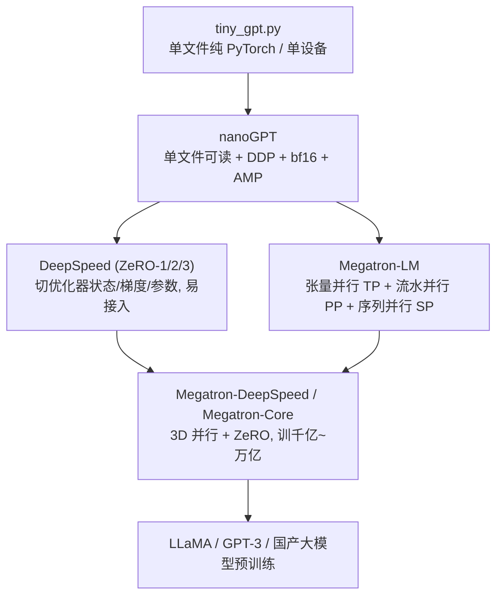

# 字符级 GPT / Transformer · 进阶与生产实践

> 本篇承接 [`手把手教学.md`](./手把手教学.md) 和 [`tiny_gpt.py`](./tiny_gpt.py)。教学篇讲清了一个 ~35 万参数、CPU 几十秒跑完的 toy GPT「是什么、怎么搭」。本篇要回答的是另一个问题:**同样这套结构,放大到 LLaMA-7B / 70B、放到几百上千张 GPU 上预训练,工程上到底差在哪、为什么要那么做。** 把玩具实现和业界真实系统逐点打通,术语保留英文,数字给量级直觉而非编造的精确 benchmark。

---

## 0. 本项目 toy 与生产的差距

`tiny_gpt.py` 为了「看得见、摸得着、零依赖、CPU 几十秒」,**故意**砍掉了所有工程复杂度。下表逐项对照「toy 怎么做 / 生产必须补什么 / 为什么」。

| 维度 | `tiny_gpt.py` 的做法 | 生产(LLaMA / nanoGPT / Megatron)必须补什么 | 为什么 |
|------|----------------------|--------------------------------------------|--------|
| 位置编码 | 可学习绝对位置嵌入 `nn.Embedding(block_size, n_embd)` | **RoPE**(旋转位置编码) | 绝对嵌入外推差、占参数、不支持变长;RoPE 把相对位置写进注意力,长度外推与长上下文友好 |
| 归一化 | `nn.LayerNorm`(带 mean 中心化 + bias) | **RMSNorm** | 去掉减均值与 bias,算更少、更稳,效果几乎无损 |
| FFN 激活 | `Linear → GELU → Linear`,中间 4× | **SwiGLU**(门控,3 个矩阵,中间约 8/3×) | 门控激活在同算力下质量更高,LLaMA 全系采用 |
| 注意力实现 | 显式 `(B,H,T,T)` 矩阵 + `masked_fill` + `softmax` | **Flash Attention**(融合 kernel,不落 S=QKᵀ) | 朴素实现要把 T×T 注意力矩阵写回 HBM,显存 O(T²)、带宽瓶颈;Flash 分块在 SRAM 上算,省显存又快 |
| 注意力 KV 头数 | MHA,每头独立 K/V | **GQA / MQA**(多 query 头共享少量 KV 头) | 推理时 KV-Cache 显存与 KV 头数成正比,GQA 大幅压 KV 又不太掉点 |
| 精度 | 全程 fp32 | **bf16 混合精度**(+ fp32 master weights / 部分 fp8) | fp32 太慢太占显存;bf16 动态范围大、训练稳,主流默认 |
| 显存换算 | 不在乎(模型 1.3MB) | **梯度检查点 (activation checkpointing)**、ZeRO 分片 | 大模型激活/优化器状态吃光显存,必须用算力换显存 |
| 数据 | 内置 1KB 文本,`get_batch` 内存随机切片 | TB 级语料 + 分词器 + 流式/分片 dataloader + 去重清洗 | toy 直接过拟合「背书」;生产靠数据规模与质量 |
| 分词 | 字符级,`vocab≈40` | **BPE / SentencePiece**,`vocab=32k~150k` | 字符级序列太长、信息密度低;子词在压缩率与词表间平衡 |
| 优化器细节 | `AdamW`,固定 `lr=3e-3` | warmup + cosine decay、grad clip、weight decay 分组、`β₂=0.95` | 大模型对超参极敏感,缺一个就发散或浪费算力 |
| 上下文长度 | `block_size=64` | 4k → 32k → 128k+(RoPE 缩放 / 长上下文训练) | 真实任务要长上下文 |
| 并行 | 单进程单设备 | **DP + TP + PP + SP + ZeRO** 多维并行 | 单卡放不下、也算不快;必须切模型与数据 |
| 容错 | 无 | checkpoint/restart、弹性训练、loss 监控 | 千卡训练几小时必有节点挂,不能从头再来 |

一句话:**toy 关心「逻辑正确、能收敛」;生产关心「在固定算力/显存/时间预算内,把更大的模型训得又快又稳又省」。** 下面按系统、变体、权衡、估算、动手路线展开。

---

## 1. 业界系统怎么做

### 1.1 训练栈的两条主线

- **nanoGPT**(Karpathy):本项目结构的「成年版」。同样单文件可读,但补了 DDP 多卡、bf16 + `torch.amp` 自动混合精度、梯度累积、cosine LR、Flash Attention(`F.scaled_dot_product_attention`)、`torch.compile`。是从 toy 到生产最自然的下一站。
- **DeepSpeed**:微软,核心是 **ZeRO**——把优化器状态(ZeRO-1)、梯度(ZeRO-2)、参数(ZeRO-3)按 data-parallel rank **分片**,每张卡只存 1/N,用通信换显存。接入成本低(包一层 engine),适合「模型能切就靠 ZeRO,不想改模型代码」。
- **Megatron-LM**:NVIDIA,核心是把**模型本身**切开:**张量并行 (Tensor Parallel, TP)** 把每个 Linear/Attention 的权重按列/行切到多卡(机内 NVLink 高速通信);**流水并行 (Pipeline Parallel, PP)** 把层切成段、跨节点流水;**序列并行 (Sequence Parallel, SP)** 进一步切 LayerNorm/Dropout 的激活。
- **Megatron-DeepSpeed**:两者合体,Megatron 切模型 + DeepSpeed ZeRO 切数据维,组成 **3D/4D 并行**,是 BLOOM、国产千亿模型的常用底座。

### 1.2 LLaMA 架构 = 在 toy 的每个槽位换上「更现代的零件」

LLaMA 和本项目的 `Block` **拓扑完全一样**(Pre-Norm 残差 + Attention + FFN),只是把每个零件升级:

| 槽位 | toy | LLaMA |
|------|-----|-------|
| 位置 | 绝对嵌入 | **RoPE**(在 Q/K 上旋转) |
| Norm | LayerNorm | **RMSNorm** |
| FFN | GELU MLP | **SwiGLU** |
| Attn | MHA | **GQA**(7B 仍 MHA,34B/70B 用 GQA) |
| Attn kernel | 朴素 softmax | **Flash Attention** |
| 精度 | fp32 | **bf16** |

这正是本系列的价值:**你已经懂 toy 的骨架,进阶就是逐个槽位「换更好的零件」**,而不是重学一套体系。

---

## 2. 关键变体与优化

逐个讲清:解决什么问题、代价是什么、数据流怎么变。

### 2.1 RoPE(旋转位置编码)

- **解决什么**:绝对位置嵌入 `pos_emb` 是查表,只学过 `0..block_size-1`,**外推到更长序列基本失效**,且占参数。RoPE 不加任何可学参数,把位置信息以**旋转**形式注入 Q、K:对第 m 个位置的向量,按维度成对地乘上旋转矩阵 $R_{\Theta,m}$。
- **关键性质**:$\langle R_m q,\ R_n k\rangle$ 只依赖**相对位置** $m-n$。于是注意力天然变成「相对位置感知」,可通过 NTK/线性插值缩放外推到训练时没见过的长度。
- **代价**:实现要对 Q/K 做成对旋转;长度缩放需调 base θ。换掉 toy 里 `x = token_emb + pos_emb` 中的 `pos_emb`,改成在注意力里对 q、k 应用 RoPE。
- 详见 [`../../llm-algo/旋转编码RoPE.md`](../../llm-algo/旋转编码RoPE.md)。

### 2.2 RMSNorm

- **解决什么**:LayerNorm 要算均值、方差、再缩放平移($\gamma,\beta$)。RMSNorm 去掉减均值与 bias:$\text{RMSNorm}(x)=\dfrac{x}{\sqrt{\frac{1}{d}\sum x_i^2+\epsilon}}\cdot\gamma$。
- **代价/收益**:少一次归约、少一组参数,kernel 更简单、数值更稳,质量基本无损。toy 里 `nn.LayerNorm(n_embd)` 直接换成 RMSNorm 即可。

### 2.3 SwiGLU

- **解决什么**:把 FFN 从 `Linear→GELU→Linear` 升级为门控:$\text{SwiGLU}(x)=(\text{Swish}(xW_1)\odot xW_3)W_2$,三个矩阵而非两个。
- **代价**:多一个矩阵,所以中间维通常取约 $\frac{8}{3}d$(而非 4d)以保持总参数量相当。同算力下质量更高,LLaMA 全系标配。toy 的 `FeedForward` 换成 SwiGLU 即可。

### 2.4 Flash Attention

- **解决什么**:toy 里 `att = q @ k^T`(形状 `(B,H,T,T)`)要把整个 T×T 注意力矩阵**实例化并写回 HBM**,显存 O(T²)、且受显存带宽限制。FlashAttention 用 **tiling + online softmax**,把 Q/K/V 分块载入片上 SRAM、边算边累加,**从不把完整 S 矩阵落显存**。
- **收益**:显存从 O(T²) 降到 O(T),长序列尤其明显;IO 减少带来明显加速(算子级,质量等价、非近似)。
- **代价**:需要专用 kernel(CUDA);PyTorch 已内置 `F.scaled_dot_product_attention` 自动选择 Flash 后端,nanoGPT 一行就能用。
- 数据流对比:
  - toy:`Q,K,V → S=QKᵀ (落显存) → mask → softmax (落显存) → S·V`
  - Flash:`分块 Q,K,V → 在 SRAM 内逐块算局部 softmax 并在线合并 → 直接出 O`,中间 S 不落 HBM。
- 详见 [`../../llm-optimizer/FlashAttention.md`](../../llm-optimizer/FlashAttention.md)。

### 2.5 GQA / MQA

- **解决什么**:推理时 KV-Cache 显存 ∝ KV 头数。**MQA**(Multi-Query)所有 query 头共享 1 组 K/V,KV 显存最省但质量略降;**GQA**(Grouped-Query)折中,每组 query 头共享 1 组 K/V(如 8 组),质量接近 MHA、KV 大幅下降。
- **代价**:训练时需用 GQA 结构训(直接把预训练 MHA 转 GQA 要做 uptraining)。LLaMA-2-70B、LLaMA-3 全系用 GQA。
- 架构细节见 [`../../llm-algo/llama/模型架构.md`](../../llm-algo/llama/模型架构.md)。

### 2.6 bf16 混合精度

- **解决什么**:fp32 占 4 字节、算力低。**bf16** 与 fp32 同为 8 位指数(动态范围一样大),只是尾数少,**不易溢出**,比 fp16 更不需要 loss scaling。
- **生产配方**:前向/反向用 bf16,**优化器保留 fp32 master weights**(否则小梯度被吃掉),部分 reduce/accumulate 用 fp32。更激进的 fp8 训练(H100 + Transformer Engine)进一步省显存/提吞吐,见 [`../../llm-train/fp8.md`](../../llm-train/fp8.md)。

### 2.7 梯度检查点(Activation Checkpointing)

- **解决什么**:反向需要前向的中间激活,显存 ∝ 层数 × batch × seq。梯度检查点**只存每个 Block 的输入**,反向时**重算**前向激活。
- **权衡**:激活显存从 O(L) 降到约 O(√L)(分段策略),代价是**多一次前向**(约 +30% 计算)。是「拿算力换显存」最常用的开关。

### 2.8 Scaling Law

- **是什么**:Kaplan(2020)/Chinchilla(2022)给出 loss 关于参数量 N、数据量 D、算力 C 的幂律关系。**Chinchilla 结论**:给定算力,N 和 D 应**同比放大**,经验上 **D ≈ 20×N tokens** 才算训得「充分」。
- **怎么用**:它把「该用多大模型、喂多少数据、花多少卡时」从拍脑袋变成可估算。toy 数据 1KB 远远「训过头」(过拟合背书);真实预训练在算力预算下按 scaling law 配 N 和 D。

---

## 3. 真实工程权衡与坑

### 3.1 显存账本(7B 训练为例,bf16)

一个参数在训练时不止占 2 字节:

| 项 | 每参数字节(bf16 + Adam) |
|----|--------------------------|
| 参数 (bf16) | 2 |
| 梯度 (bf16) | 2 |
| Adam m、v (fp32) | 8 |
| fp32 master weight | 4 |
| **小计(模型状态)** | **约 16 字节/参数** |

→ 7B 模型光「模型状态」就约 **112 GB**,**单张 80GB 卡放不下**。这就是为什么必须 ZeRO 分片或 TP/PP。**激活**显存另算,且随 batch×seq×层数涨——这正是梯度检查点要砍的部分。

### 3.2 并行方式的取舍

- **DP / ZeRO**:实现简单、扩展性好;ZeRO-3 通信量大(每步 all-gather 参数),小模型/慢网络会被通信拖垮。
- **TP(张量并行)**:每层都要 all-reduce,通信频繁且延迟敏感,**只适合机内 NVLink**(一般 TP≤8)。
- **PP(流水并行)**:跨节点带宽友好,但有 **pipeline bubble**(气泡),需要 micro-batch 数 ≫ 流水级数才能摊薄。
- **经验组合**:TP 放机内、PP 跨机、DP/ZeRO 在最外层。Megatron-DeepSpeed 的 3D 并行就是这么拼的。详见 [`../../llm-train/megatron/README.md`](../../llm-train/megatron/README.md)、[`../../llm-train/megatron-deepspeed/README.md`](../../llm-train/megatron-deepspeed/README.md)。

### 3.3 线上常见故障与调优

- **loss 变 NaN / spike**:lr 太大、没 warmup、没 grad clip、fp16 溢出。对策:warmup + cosine、`clip_grad_norm_=1.0`、用 bf16、必要时回滚到 spike 前 checkpoint。toy 教学篇也提到「loss NaN → 调小 lr」,生产只是把这套做成自动监控。
- **吞吐上不去(MFU 低)**:MFU(Model FLOPs Utilization)是实际 FLOPs / 峰值 FLOPs,大集群常只有 30~50%。瓶颈多在:通信没和计算重叠、PP 气泡、dataloader 喂不上、kernel 没融合。对策:Flash Attention、`torch.compile`/kernel fusion、计算通信重叠(见 [`../../llm-optimizer/计算通信重叠.md`](../../llm-optimizer/计算通信重叠.md))、调 TP/PP/micro-batch。
- **节点挂掉**:千卡跑几小时必挂。必须定期 checkpoint + 弹性恢复,否则一挂全废。
- **数据问题**:重复数据导致记忆、脏数据导致 loss 抖、长度分布不均导致 padding 浪费。预训练前的去重/清洗/打包(packing)比调模型更影响最终质量。
- **过拟合 vs 欠拟合**:toy 因数据太小必然过拟合(loss→0.078 是「背书」);生产用海量数据 + 验证集监控,真正考验的是泛化。

---

## 4. 性能直觉与估算(可手算)

> 这些量级估算公式不用记精确常数,关键是建立「改一个超参,显存/算力/通信怎么变」的直觉。

### 4.1 参数量

decoder-only,主要来自每层的 attention(4·d²)+ FFN(约 8·d²,标准 4× MLP)≈ **12·d²·L**(d=hidden,L=层数),外加 embedding `vocab×d`。
- toy 自检:d=96, L=3 → 12×96²×3 ≈ 332k,加 embedding/head 与本项目实测约 35 万参数吻合。

### 4.2 训练算力(经验法则)

预训练总算力 **C ≈ 6 · N · D** FLOPs(N=参数量,D=训练 token 数;前向 2ND + 反向 4ND)。
- 推理(每 token)≈ 2N FLOPs。
- 用法:7B 模型(N=7e9)按 Chinchilla 喂 D≈140B token,C≈6×7e9×1.4e11 ≈ **6e21 FLOPs**;除以 (单卡有效算力 × 卡数 × MFU) 即得卡时估算。

### 4.3 训练显存(bf16 + Adam)

模型状态 ≈ **16 · N 字节**(见 §3.1)。
- 7B → 112GB;70B → 1.1TB,显然要分到 N_gpu 张卡:每卡 ≈ 16N / N_gpu(ZeRO-3 理想情形)。

### 4.4 注意力与 KV-Cache

- 注意力计算/显存(朴素)∝ **T²**;Flash 把**显存**降到 ∝ T(计算仍 ∝ T²)。这解释了 toy 教学篇「block_size 调大显著变慢」。
- 推理 KV-Cache 显存 ≈ **2 · L · n_kv_head · head_dim · T · batch · 2字节**。GQA 把 `n_kv_head` 从 32 降到 8 → KV 直接省 4×,这是长上下文推理的关键。KV 优化详见 [`../../llm-inference/KV-Cache优化.md`](../../llm-inference/KV-Cache优化.md)。

### 4.5 通信量直觉

- DP all-reduce 每步通信 ∝ 参数量(梯度);ZeRO-3 还要 all-gather 参数。
- TP 每层一次 all-reduce,通信 ∝ batch×seq×d，且**每层都来一次**→ 必须高带宽 NVLink。
- 估「会不会被通信拖死」:比较 `通信时间 = 通信量 / 带宽` 与 `计算时间`,前者远小才划算。

---

## 5. 动手进阶路线(把本 toy 升级到接近生产)

分 5 步,每步都能在 `tiny_gpt.py` 基础上小步验证(先小数据看 loss 仍降,再放大)。

1. **零件现代化(架构升级)**:把 `pos_emb` 换成 **RoPE**、`LayerNorm` 换 **RMSNorm**、`FeedForward` 换 **SwiGLU**、MHA 换 **GQA**。每换一个跑一遍确认 loss 仍正常下降。这一步把 toy 变成「LLaMA-mini」,结构与生产对齐。

2. **换真实数据 + 分词器**:字符级换成 **BPE / SentencePiece**(或先用 tiktoken),数据从内置 1KB 换成 enwik8 / TinyShakespeare 全本 / 中文语料,**划训练/验证集**,观察过拟合何时出现。这一步把「背书」变成「学规律」。

3. **训练工程化(对齐 nanoGPT)**:加 **bf16 + `torch.amp`** 混合精度、**梯度累积**、**warmup + cosine LR**、**grad clip**、checkpoint 保存/恢复、`F.scaled_dot_product_attention`(自动 Flash)、`torch.compile`。这一步让单卡训练「又快又稳又省」。

4. **多卡扩展**:先上 **DDP**(数据并行),再接 **DeepSpeed ZeRO-2/3** 体验「单卡放不下也能训」。理解每步通信量和 MFU,学会看 nvidia-smi/profiler 找瓶颈。

5. **走向 Megatron 级**:阅读并跑通 [`../../llm-train/megatron/README.md`](../../llm-train/megatron/README.md) 的 GPT-2 训练,理解 **TP/PP/SP** 怎么切、3D 并行怎么配。此时再回看本 toy,会发现「逻辑没变,变的全是工程」。

---

## 6. 延伸阅读

### 本仓库已有深度文档
- Transformer 原理与架构:[`../../llm-algo/transformer`](../../llm-algo/transformer)、[`../../llm-algo/transformer.md`](../../llm-algo/transformer.md)
- GPT 系列:[`../../llm-algo/gpt`](../../llm-algo/gpt)
- LLaMA 架构(RoPE/RMSNorm/SwiGLU/GQA):[`../../llm-algo/llama/模型架构.md`](../../llm-algo/llama/模型架构.md)、[`../../llm-algo/llama.md`](../../llm-algo/llama.md)
- RoPE 旋转位置编码:[`../../llm-algo/旋转编码RoPE.md`](../../llm-algo/旋转编码RoPE.md)
- FlashAttention:[`../../llm-optimizer/FlashAttention.md`](../../llm-optimizer/FlashAttention.md)
- KV-Cache 优化:[`../../llm-inference/KV-Cache优化.md`](../../llm-inference/KV-Cache优化.md)
- 计算通信重叠:[`../../llm-optimizer/计算通信重叠.md`](../../llm-optimizer/计算通信重叠.md)
- FP8 训练:[`../../llm-train/fp8.md`](../../llm-train/fp8.md)
- Megatron-LM:[`../../llm-train/megatron/README.md`](../../llm-train/megatron/README.md)
- Megatron-DeepSpeed:[`../../llm-train/megatron-deepspeed/README.md`](../../llm-train/megatron-deepspeed/README.md)
- FLOPs 估算:[`../../llm-algo/FLOPs.md`](../../llm-algo/FLOPs.md)
- 本项目教学篇:[`手把手教学.md`](./手把手教学.md)

### 经典论文 / 社区
- Vaswani et al., *Attention Is All You Need* (2017)——Transformer 原始论文。
- Touvron et al., *LLaMA / LLaMA 2* (2023)——RoPE + RMSNorm + SwiGLU + GQA 的工程组合。
- Su et al., *RoFormer: RoPE* (2021);Zhang & Sennrich, *RMSNorm* (2019);Shazeer, *GLU Variants Improve Transformer (SwiGLU)* (2020)。
- Dao et al., *FlashAttention / FlashAttention-2* (2022/2023)——IO-aware 精确注意力。
- Ainslie et al., *GQA* (2023)。
- Kaplan et al. (2020) & Hoffmann et al., *Chinchilla* (2022)——scaling law。
- Shoeybi et al., *Megatron-LM* (2019);Rajbhandari et al., *ZeRO* (2020)。
- [karpathy/nanoGPT](https://github.com/karpathy/nanoGPT)——从 toy 到生产最自然的下一站,强烈推荐。
- [NVIDIA/Megatron-LM](https://github.com/NVIDIA/Megatron-LM)、[microsoft/DeepSpeed](https://github.com/microsoft/DeepSpeed)。

---

*所属:llm-action / practical-projects(动手可跑实战系列)。本文严格基于 `tiny_gpt.py` 的真实实现,对比业界系统编写;benchmark 数字均为量级直觉,非精确实测。*
