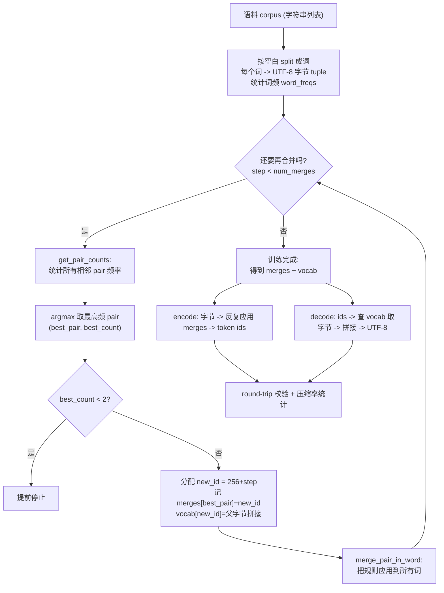

# 手把手教学：从零实现 BPE 分词器（Byte-level BPE Tokenizer）

> 一句话导览：跟着本文一行行读懂 `bpe_tokenizer.py`，你将能够——
> 1. 说清楚「子词切分（subword tokenization）」要解决什么问题，以及为什么大模型不用「按字符」或「按整词」切；
> 2. 亲手推导并实现 BPE 的训练三件套：**统计相邻 pair 频率 → 反复合并最高频 pair → 形成 merges / vocab**；
> 3. 用 `encode` / `decode` 做到 **无损 round-trip**（`decode(encode(text)) == text` 永远为 True，即使是中文、emoji、生僻词）；
> 4. 量化理解 **压缩率（compression ratio = tokens / bytes）**，并明白「词表越大 → 序列越短 → 推理越省算力」是怎么一回事；
> 5. 知道这份 toy 实现和生产级 tiktoken / HuggingFace tokenizers 的差距在哪，下一步该读什么。

本文严格基于本目录下的真实代码 `bpe_tokenizer.py`，所有出现的函数名、类名、变量名、超参数都能在该文件里逐一对上。

---

## 0. 前置知识与环境

### 你需要会一点点什么

- **Python 基础**：会读 `for`、`while`、`dict`、`tuple`、列表推导式、函数与类。本项目核心算法没有任何「黑魔法」，全是基础语法。
- **一点点字节与编码常识**：知道字符串可以用 `text.encode("utf-8")` 变成一串 `0..255` 的字节，再用 `.decode("utf-8")` 变回来。这就够了，不懂也没关系，第 1、2 节会讲透。
- **不需要**会深度学习、不需要 GPU、不需要会数学证明。BPE 是一个纯算法，CPU 几十秒跑完。

### 环境安装

```bash
# 核心算法零第三方依赖；numpy 仅用于设随机种子，matplotlib 仅用于画图（缺了会自动跳过、不崩）
pip install numpy
pip install matplotlib   # 可选，只为生成压缩率曲线图
```

代码顶部确实 `import numpy as np` 且 `np.random.seed(42)`，所以 numpy 是必装的；matplotlib 在 `try_plot()` 里是 `try/except` 包着的，缺失只会打印 `[plot skipped]`，不影响主流程。

### 怎么打开跑

```bash
cd practical-projects/02-bpe-tokenizer
python bpe_tokenizer.py
```

整个文件只有一个入口 `main()`，由文件末尾的 `if __name__ == "__main__": main()` 触发。跑完会在当前目录生成 `compression_curve.png`。

---

## 1. 问题背景：不用这个技术会怎样

大模型只能吃「整数」。任何文本进模型前，都要先被切成一串整数 token id。怎么切？历史上有三条路线，各有致命问题：

### 路线 A：按「字符 / 字节」切（字符级）

把每个字符（或字节）当一个 token。比如 `"low"` → `['l','o','w']` → 3 个 token。

- 优点：词表极小（ASCII 才 128，字节才 256），**永远不会有未登录词（OOV，Out-Of-Vocabulary）**。
- 致命缺点：**序列太长**。一句 50 个字符的英文要 50 个 token；模型上下文窗口被严重浪费，注意力计算量是序列长度的平方 $O(n^2)$，序列翻倍算力翻 4 倍。

### 路线 B：按「整词」切（词级）

把 `"tokenization"` 当成一个 token。

- 优点：序列短。
- 致命缺点：**词表爆炸 + OOV**。英语单词几十万个，加上各种时态、拼写、新词，词表动辄上百万还是装不下；遇到训练时没见过的词（比如 `"hippopotamus"` 拼错成 `"hipopotamus"`）直接变 `<UNK>`，信息全丢。中文、emoji、代码符号更是灾难。

### 路线 C：子词切分（subword）—— BPE 走的路

折中：**让数据自己决定哪些片段值得当一个 token**。高频的整词（`the`、`tokenization`）合成一个 token；低频或没见过的词，退化成更小的片段甚至单字节，照样能拼出来。

> 直觉痛点：你想要「序列短」（路线 B）又想要「永不 OOV」（路线 A）。BPE 用「从字节出发，反复把最高频的相邻片段粘成一个新符号」同时拿到这两个好处——这正是 GPT-2 / GPT-3 / LLaMA 都采用 byte-level BPE 的原因。

代码注释里也点明了这点（文件第 18–23 行）：从 UTF-8 字节出发，初始词表天然只有 256 个，**任何 Unicode 文本都能表示为字节，因此 round-trip 永远无损**。

---

## 2. 核心原理详解

### 2.1 一句话定义

BPE（Byte-Pair Encoding，字节对编码）原本是一个**数据压缩**算法：反复找出文本里**出现最多的相邻符号对**，把它替换成一个**新的、没用过的符号**，循环直到满意。把这个压缩思路搬到分词上，就成了「学词表」。

### 2.2 训练（train）的三步循环

设语料被切成若干「词」，每个词初始是它的 UTF-8 字节序列。比如 `"low"` 的字节是 `(108, 111, 119)`（即 `'l','o','w'`）。

**第 1 步：统计相邻 pair 频率。** 把所有词里相邻的两个 token `(a, b)` 数一遍，按词频加权。设词 $w$ 出现 $f_w$ 次，则 pair $(a,b)$ 的总频率：

$$
\text{count}(a,b) = \sum_{w} f_w \cdot \big[\,(a,b)\ \text{在}\ w\ \text{中相邻出现的次数}\,\big]
$$

**第 2 步：选最高频 pair 并合并。** 取频率最大的那一对（贪心 argmax）：

$$
(a^\*, b^\*) = \arg\max_{(a,b)} \text{count}(a,b)
$$

给它分配一个**新 token id**：`new_id = 256 + step`（第 0 轮是 256，第 1 轮 257……）。把这条规则记进 `merges[(a*,b*)] = new_id`，并把所有词里的 `(a*,b*)` 替换成 `new_id`。

**第 3 步：回到第 1 步**，在「更新后的词序列」上重新统计、再合并。重复 `num_merges = vocab_size - 256` 次。

> 关键直觉：每合并一次，词表 +1，所有词里那条最高频组合就「短了一截」。高频组合优先被吃掉，所以最终常见词（如 `tokenization`）会被一路合成单个 token，而生僻词只能停留在小片段。

### 2.3 两张表：merges 与 vocab

- **`merges`：`dict[(int,int) -> int]`**。学到的合并规则，key 是被合并的 pair，value 是合并后的新 id。**dict 的插入顺序 = 学习顺序 = encode 时的优先级**（越早学到，id 越小，优先级越高）。这是整份代码最关键的设计，务必记住。
- **`vocab`：`dict[int -> bytes]`**。每个 token id 对应的**字节串**。`0..255` 是单字节；`>=256` 的新 token 的字节 = 它两个「父 token」字节的拼接。正因为 vocab 存的是字节，`decode` 才能无损还原。

### 2.4 编码（encode）与解码（decode）

- **encode**：文本 → 字节序列 → 反复应用 merges（每步选当前序列里「最早学到」的可合并 pair）→ token id 列表。
- **decode**：token id 列表 → 每个 id 查 vocab 取字节 → 拼接 → UTF-8 解码回字符串。

因为 decode 只是「按 id 查字节再拼起来」，而每个新 token 的字节就是父 token 字节的拼接，所以无论怎么 encode，decode 都能精确还原 → **无损 round-trip**。

### 2.5 压缩率（compression ratio）

$$
\text{ratio} = \frac{\text{总 token 数}}{\text{总字节数}}
$$

不学任何 merge 时（纯字节），每个字节就是一个 token，ratio = 1.0（baseline）。每学一条 merge，高频组合被压短，token 数下降，ratio 跟着下降。**ratio 越小，压得越狠，序列越短。**

### 2.6 一图看懂整个流程



---

## 3. 代码逐段精讲

下面把 `bpe_tokenizer.py` 按逻辑拆成 7 段。每段先贴关键代码，再讲「在干什么、为什么这么写、对应原理哪一步」，并标出新手易困惑点。

### 3.1 导入与随机种子

```python
import os
import random
from collections import Counter

import numpy as np

# 设随机种子,保证(本 demo 中任何随机环节)可复现
random.seed(42)
np.random.seed(42)
```

- `Counter` 是这份代码的主力数据结构：它是 `dict` 的子类，专门用来计数，还自带 `.most_common(1)` 直接取最高频项——后面统计 pair 频率和取 argmax 全靠它。
- 设 `seed(42)`：本 demo 其实没有真正的随机分支，设种子是为了「严谨可复现」的好习惯。
- **易困惑点**：numpy 在这里几乎只用于设种子，核心 BPE 算法是纯标准库实现的，别被 `import numpy` 吓到。

### 3.2 统计相邻 pair 频率：`get_pair_counts`

```python
def get_pair_counts(word_freqs):
    pair_counts = Counter()
    for symbols, freq in word_freqs.items():
        # zip(symbols, symbols[1:]) 取出所有相邻对 (a,b)
        for pair in zip(symbols, symbols[1:]):
            pair_counts[pair] += freq  # 用词频加权
    return pair_counts
```

这对应原理 **2.2 第 1 步**。

- 入参 `word_freqs` 是 `dict[tuple(int,...), int]`：key 是一个词被切成的 token 序列（初始为字节元组），value 是这个词出现了多少次。
- `zip(symbols, symbols[1:])` 是取相邻对的经典写法。比如 `symbols = (108, 111, 119)`，`symbols[1:] = (111, 119)`，zip 出 `(108,111)` 和 `(111,119)` 两个相邻 pair。
- `pair_counts[pair] += freq`：**用词频加权**。如果 `"low"` 出现 60 次，那它内部的 pair 也各算 60 次。这是为什么内置语料要把每行 `* 5` 重复——放大频率信号，让 BPE 学出清晰的 merge。
- **易困惑点**：为什么按词统计而不是把整篇文章拼起来统计？因为我们不希望「上一个词的最后一个字节」和「下一个词的第一个字节」被算成相邻对——词与词之间不该跨界合并。按词存 `word_freqs` 天然就隔开了。

### 3.3 应用一条合并规则：`merge_pair_in_word`

```python
def merge_pair_in_word(symbols, pair, new_id):
    a, b = pair
    merged = []
    i = 0
    while i < len(symbols):
        if i < len(symbols) - 1 and symbols[i] == a and symbols[i + 1] == b:
            merged.append(new_id)
            i += 2
        else:
            merged.append(symbols[i])
            i += 1
    return tuple(merged)
```

这是「执行一条 merge」的最小操作，训练和 encode 都会调用它。对应原理 **2.2 第 2 步**的「替换」动作。

- 从左到右扫描 `symbols`。当发现位置 `i` 和 `i+1` 正好是 `(a, b)`，就 append 一个 `new_id` 并 **跳两格**（`i += 2`），否则照抄当前符号、走一格。
- `i < len(symbols) - 1` 的判断保证 `symbols[i+1]` 不越界。
- 返回 `tuple`：因为后面要把它当 dict 的 key，必须是不可变的 tuple。
- **易困惑点**：从左到右贪心扫描，遇到 `(a, a, a)` 这种连续重叠时，会先合并前两个、跳过、再看第三个——不会重叠合并。这是 BPE 的标准约定，足够教学使用。

### 3.4 分词器骨架：`BPETokenizer.__init__`

```python
class BPETokenizer:
    def __init__(self):
        self.merges = {}
        self.vocab = {i: bytes([i]) for i in range(256)}
```

对应原理 **2.3 的两张表**。

- `self.merges = {}`：空字典，训练时一条条往里塞。**它的插入顺序就是学习优先级**，这点在 encode 里至关重要。
- `self.vocab = {i: bytes([i]) for i in range(256)}`：初始化 256 个基础 token，id `i` 对应单字节 `bytes([i])`。比如 `vocab[108] = b'l'`。
- **易困惑点**：`bytes([i])` 是「用一个整数列表造字节串」，`bytes([108])` 得到 `b'l'`。不是 `bytes(108)`（那会造 108 个零字节）。

### 3.5 训练主循环：`train`（最核心）

```python
def train(self, corpus, vocab_size, verbose=False):
    assert vocab_size > 256, "vocab_size must be > 256 (256 byte base tokens)"
    num_merges = vocab_size - 256

    # 把语料按空白切成"词",每个词转成 UTF-8 字节元组,并统计词频。
    word_freqs = Counter()
    for line in corpus:
        for word in line.split():
            word_bytes = tuple(word.encode("utf-8"))
            word_freqs[word_bytes] += 1

    for step in range(num_merges):
        pair_counts = get_pair_counts(word_freqs)
        if not pair_counts:
            break  # 没有可合并的 pair 了(语料太小)
        best_pair, best_count = pair_counts.most_common(1)[0]
        if best_count < 2:
            break  # 再合并也只是合并只出现 1 次的对,提前停

        new_id = 256 + step
        self.merges[best_pair] = new_id
        self.vocab[new_id] = self.vocab[best_pair[0]] + self.vocab[best_pair[1]]

        word_freqs = {
            merge_pair_in_word(symbols, best_pair, new_id): freq
            for symbols, freq in word_freqs.items()
        }
```

逐块拆解：

**(1) 参数校验与合并次数**
- `assert vocab_size > 256`：词表必须大于 256，否则没有空间放任何 merge。
- `num_merges = vocab_size - 256`：要做多少次合并。比如 `vocab_size=300` → 做 44 次。这就是训练循环的长度。对应原理「重复 `vocab_size - 256` 次」。

**(2) 预切分（pre-tokenization）+ 初始化 word_freqs**
- `line.split()`：按空白把每行切成词。这是 **toy 版预切分**。代码注释明确说真实 GPT-2 用正则做更细的预切分，这里用空白简化。
- `tuple(word.encode("utf-8"))`：把词变成 UTF-8 字节元组。注意此时**词间空格被丢弃了**（split 吃掉了空格）——这是本实现的已知简化，README「局限」表里也列了。
- `word_freqs[word_bytes] += 1`：统计词频。

**(3) 主循环：找最高频 pair → 记规则 → 应用**
- `get_pair_counts(word_freqs)`：原理第 1 步。
- `pair_counts.most_common(1)[0]`：原理第 2 步的 argmax。`Counter.most_common(1)` 返回 `[(pair, count)]`，取 `[0]` 解包成 `best_pair, best_count`。
- 两个**提前停止**条件：
  - `if not pair_counts: break`：连一个 pair 都没有了（每个词只剩 1 个 token），停。
  - `if best_count < 2: break`：最高频的也只出现 1 次，再合下去没意义，停。**这就是为什么实际跑 `vocab_size=300`（理论 44 次）时，可能学不满 44 条**——toy 语料太小会提前触顶。
- `new_id = 256 + step`：新 id 紧接字节后递增分配。
- `self.merges[best_pair] = new_id`：记下规则（同时确立优先级顺序）。
- `self.vocab[new_id] = self.vocab[best_pair[0]] + self.vocab[best_pair[1]]`：**新 token 的字节 = 两个父 token 字节拼接**。这是无损 decode 的根基。比如把 `(256='ow')` 和 `(108='l')`……不对，顺序是 `vocab[best_pair[0]] + vocab[best_pair[1]]`，先父在前。例如 `('l','ow') -> 'low'` 就是 `b'l' + b'ow' = b'low'`。
- 最后用字典推导式重建 `word_freqs`：把每个词都过一遍 `merge_pair_in_word`，得到合并后的新序列，频率不变。下一轮就在这个更短的序列上继续统计。对应原理第 3 步「回到第 1 步」。

**(4) verbose 打印（可选）**
```python
if verbose:
    a = self.vocab[best_pair[0]].decode("utf-8", errors="replace")
    b = self.vocab[best_pair[1]].decode("utf-8", errors="replace")
    merged = self.vocab[new_id].decode("utf-8", errors="replace")
    print("  merge {:>3}: ({!r:>6}, {!r:>6}) -> id {:>3}  {!r:>8}  (count={})".format(
        step, a, b, new_id, merged, best_count))
```
- 把每条学到的规则人类可读地打印出来：第几步、合并了谁和谁、得到哪个 id、字节内容、出现次数。`errors="replace"` 防止半个 UTF-8 字符解码报错。
- **易困惑点**：打印里 `merge 4` 可能「跳号」——如果某步 `best_count < 2` 提前 break，就不会打满。另外不同的 pair 可能并列最高频，`most_common` 取谁取决于 Counter 内部顺序，所以你本机打印的具体合并顺序可能和 README 摘录略有出入，但趋势（先合 `ow`、`es` 这类高频片段）是一致的。

### 3.6 编码：`encode`（优先级合并是精髓）

```python
def encode(self, text):
    ids = list(text.encode("utf-8"))  # 起点:原始字节
    while len(ids) >= 2:
        pairs = set(zip(ids, ids[1:]))
        candidate = min(pairs, key=lambda p: self.merges.get(p, float("inf")))
        if candidate not in self.merges:
            break  # 没有任何可应用的规则了,结束
        ids = list(merge_pair_in_word(ids, candidate, self.merges[candidate]))
    return ids
```

对应原理 **2.4 的 encode**。

- 起点是原始字节 `list(text.encode("utf-8"))`。
- `pairs = set(zip(ids, ids[1:]))`：当前序列里所有相邻 pair（去重，用 set）。
- **核心一行**：`candidate = min(pairs, key=lambda p: self.merges.get(p, float("inf")))`。
  - 对每个 pair `p`，查它在 merges 里的 id：`self.merges.get(p, inf)`。学到的 pair 返回它的 new_id（越早学的越小），没学过的返回 `inf`。
  - `min(...)` 取 id 最小的那个 → **就是最早学到、优先级最高的可合并 pair**。这保证 encode 的合并顺序和 train 的学习顺序一致，否则会切出和训练分布不一样的 token。
- `if candidate not in self.merges: break`：如果连最优候选都没在 merges 里（即所有 pair 的 id 都是 inf），说明没有任何规则可用了，结束。
- 命中就调用 `merge_pair_in_word` 合并，循环继续，直到序列长度 < 2 或无规则可用。
- **易困惑点 1**：为什么不像 train 那样「按学习顺序逐条 merge 走一遍」？因为 train 是「先学到 A 再学到 B」，encode 时也必须「先尽量用 A 再用 B」。这里用 `min by id` 在每一轮挑全局优先级最高的 pair，是等价且简洁的写法。
- **易困惑点 2**：这是 $O(n^2)$ 级的——每轮都重扫整条序列找最优 pair。教学没问题，生产级 tiktoken 会用缓存和并行加速。README「局限」表已点明。

### 3.7 解码：`decode`（无损的本质）

```python
def decode(self, ids):
    token_bytes = b"".join(self.vocab[i] for i in ids)
    return token_bytes.decode("utf-8", errors="replace")
```

对应原理 **2.4 的 decode**。

- 每个 id 查 `vocab` 取出字节串，`b"".join(...)` 全部拼接，再 `.decode("utf-8")` 还原成字符串。
- **为什么无损？** 因为每个新 token 的字节就是父 token 字节的拼接（见 3.5），所以无论 encode 把字节怎么粘成大 token，decode 拆回字节后拼起来一定和原始字节序列**逐字节相同** → `decode(encode(text)) == text`。这就是 byte-level 的最大好处：中文、emoji、没见过的词全都无损。
- `errors="replace"`：兜底用，防止极端情况下半个字符解码崩。

### 3.8 评估辅助：`compression_ratio` 与 `try_plot`

```python
def compression_ratio(tokenizer, texts):
    total_bytes = sum(len(t.encode("utf-8")) for t in texts)
    total_tokens = sum(len(tokenizer.encode(t)) for t in texts)
    return total_tokens / total_bytes, total_tokens, total_bytes
```

- 对应原理 **2.5**。返回三元组 `(ratio, total_tokens, total_bytes)`。注意分母是**字节数**不是字符数（中文一个字 3 字节）。
- `try_plot` 用 `matplotlib`（无界面 `Agg` 后端）画「vocab size vs ratio」曲线存成 png，整个包在 `try/except` 里，画图失败只打印 `[plot skipped]`，绝不让主流程崩。

### 3.9 内置语料 `TINY_CORPUS`

```python
TINY_CORPUS = [
    "low low low low low",
    "lower lower lowest",
    ...
    "a quick brown fox the lazy dog the quick fox",
] * 5
```

- 10 行短英文，`* 5` 重复 5 遍 → 50 行。重复是为了**放大高频信号**，让 toy 训练能学出清晰的 merge（如 `low`、`est`、`the`）。
- 故意全用英文：注释说明「为保证 print 安全」（Windows 控制台打印非 ASCII 容易乱码），中文只放进注释和 README。

---

## 4. 跑起来 + 逐行读懂输出

运行命令：

```bash
python bpe_tokenizer.py
```

下面是 `main()` 会打印的内容（数值取自 README 真实跑通摘录，你本机可能因 Counter 取序略有差异，但趋势一致）。

### 4.1 语料统计

```
corpus: 50 lines, ... words, 1750 bytes
```
- `50 lines`：10 行 `* 5`。`1750 bytes`：整个语料的 UTF-8 字节总数，后面压缩率的分母就是它。

### 4.2 学到的 merges（可量化信号 1）

```
[train] target vocab_size = 300  (= 256 bytes + 44 merges)
learned merges (highest-frequency byte pairs first):
  merge   0: (   'o',    'w') -> id 256      'ow'  (count=65)
  merge   1: (   'l',   'ow') -> id 257     'low'  (count=60)
  merge   2: (   'e',    's') -> id 258      'es'  (count=50)
  merge   3: (  'es',    't') -> id 259     'est'  (count=50)
  merge   5: (  'th',    'e') -> id 261     'the'  (count=45)
  ...
  merge  21: ('tokenizatio',  'n') -> id 277  'tokenization'  (count=20)
[train] done. learned 44 merges, final vocab = 300
```

逐项读懂：
- `merge 0: ('o','w') -> id 256 'ow' (count=65)`：**第一条规则**。在整个语料里 `o` 后面紧跟 `w` 出现了 65 次，是当前最高频对，于是把 `(o,w)` 合成新 token `id=256`，字节是 `'ow'`。
- `merge 1: ('l','ow') -> 'low'`：注意它合并的是 `'l'` 和**上一步刚造出来的** `'ow'`。这就是 BPE「滚雪球」：新片段会成为下一轮合并的原料，于是逐步长成整词。
- `merge 21: ('tokenizatio','n') -> 'tokenization'`：高频整词被一路合并成**单个 token**。这正是序列变短的来源。
- `count` 单调不增地往下走（65 → 60 → 50 → 45 → 20）：因为每轮都先吃最高频的，剩下的越来越低频。
- `learned 44 merges, final vocab = 300`：成功学满 44 条（`300 - 256`），最终词表 300。若语料更小可能因 `best_count < 2` 提前停，学不满。

### 4.3 round-trip 无损校验（可量化信号 2）

```
[round-trip] decode(encode(x)) == x  ?
  ok= True  bytes= 24 -> tokens=  7   'the lowest newest widest'
  ok= True  bytes= 17 -> tokens= 15   'a quick brown fox'
  ok= True  bytes= 33 -> tokens= 32   'unseen words like hippopotamus!!!'
  ok= True  bytes= 34 -> tokens= 34   '?????? round-trip ?'
[round-trip] ALL LOSSLESS = True
```

逐项读懂：
- `ok=True`：`decode(encode(x)) == x`，无损。**必须全 True**，这是正确性底线。
- `bytes=24 -> tokens=7`：训练里见过的高频词（`the/lowest/newest/widest`），24 字节被压成 7 个 token，压得很狠。
- `'a quick brown fox'`：17 字节 → 15 token，压得少——因为这些词在语料里不算高频，合并机会少。
- `'unseen words like hippopotamus!!!'`：训练**没见过**的词，照样 `ok=True`——字节级保证永不 OOV。
- `'中文也能无损 round-trip 🚀'`（打印成 `??????`，因为只打 ASCII 安全字段，见 3.5 同款处理）：34 字节 → 34 token（几乎没合并，因为这些字节在英文语料里没学过组合），但 **`ok=True`**——这就是 byte-level BPE 对非 ASCII 的关键优势：哪怕一条规则都没学到，也能逐字节无损还原。

### 4.4 压缩率（可量化信号 3）

```
[compression] ratio = tokens / bytes  (lower is better)
  vocab= 256  tokens= 1750  bytes= 1750  ratio=1.0000   # 不学 merge = baseline
  vocab= 280  tokens= 1015  bytes= 1750  ratio=0.5800
  vocab= 300  tokens=  760  bytes= 1750  ratio=0.4343
  vocab= 350  tokens=  590  bytes= 1750  ratio=0.3371
[compression] best ratio = 0.3371  -> sequence shrunk 2.97x
```

逐项读懂：
- `vocab=256, ratio=1.0000`：不学任何 merge，token 数 = 字节数，这是 **baseline**。代码里 `if vs > 256` 才训练，所以 256 时是纯字节。
- `vocab=280, ratio=0.5800`：只学 24 条 merge，token 数就从 1750 砍到 1015，几乎腰斩——因为最高频的几条规则贡献最大。
- `vocab` 越大 → ratio 越小（0.58 → 0.43 → 0.34）：词表越大，越多组合被合并，序列越短。**但收益递减**——后面学的都是低频对，省得越来越少。
- `shrunk 2.97x` = `ratios[0] / ratios[-1]` = `1.0000 / 0.3371 ≈ 2.97`。意思是同样一段文本，序列长度缩短到原来的约 1/3。对模型而言这直接等价于**上下文窗口翻 3 倍、注意力算力大降**。

### 4.5 最终判定

```
RESULT: round_trip_lossless=True  compression_ratio=0.3371  shrink=2.97x
SUCCESS
```
- `success = all_ok and (best < 1.0) and (speedup > 1.0)`：三个条件全满足才打印 `SUCCESS`——无损、确实压缩了、序列确实变短了。

---

## 5. 动手改造（练习）

由易到难，建议每改一处只改一处，对比输出。

### 练习 1（易）：把 target_vocab 改大或改小
在 `main()` 里把 `target_vocab = 300` 改成 `258` 或 `500`。
- 预期：258 时只学 2 条 merge，verbose 只打印 2 行，压缩率几乎还是 1.0；500 时学更多条，但因 toy 语料小，很可能在 `best_count < 2` 处提前 break，实际学到的 merge 数 < 244。借此体会**提前停止**条件。

### 练习 2（易）：换一段你自己的语料
把 `TINY_CORPUS` 换成你自己的句子（记得也乘个 `* 5` 放大频率），重跑。
- 预期：学到的 merge 会变成**你语料里的高频组合**。如果放一段中文（注意 print 会显示 `?`，但 round-trip 仍 True），你会看到中文字节也开始被合并。

### 练习 3（中）：观察 encode 的中间过程
在 `encode` 的 `while` 循环里临时加一行 `print(ids)`，对 `tok.encode("lowest")` 单独调用看看。
- 预期：你会看到字节序列一步步被合并、越来越短，直到没有规则可用。亲眼看到「优先级最高的 pair 先合并」。提示：跑完记得删掉这行 print。

### 练习 4（中）：验证「不保留空格」的局限
试 `tok.encode("low  low")`（两个空格）和 `tok.encode("low low")`，再 decode。
- 预期：因为 `train`/`encode` 都基于 `text.encode("utf-8")`，encode **是保留空格字节的**（空格字节是 32），所以单条 encode/decode 其实能还原空格；但 **train 时** `line.split()` 丢了词间空格，所以空格永远不会参与 merge。体会「训练预切分」和「编码」对空格处理的不同。提示：观察 round-trip 是否仍 True。

### 练习 5（难）：实现 GPT-2 风格的空格前缀
仿照 README「局限」表，给每个词的首字节前加一个特殊标记（如把 `" "` 也并入词，类似 GPT-2 的 `Ġ`），让空格信息进入 merge。
- 提示：改 `train` 里的预切分逻辑，把 `line.split()` 换成保留前导空格的切法（例如对每个词前缀一个空格再 encode）。预期：merge 里会出现带空格前缀的整词，decode 能完全还原原始排版。这一步做完，你就摸到了真实 GPT-2 tokenizer 的门槛。

---

## 6. 常见坑与排错

| 现象 | 原因 | 解决 |
| --- | --- | --- |
| `AssertionError: vocab_size must be > 256` | 传了 `vocab_size <= 256` | 词表必须 > 256，前 256 是字节基座 |
| verbose 打印的 merge 行数 < `vocab_size-256` | toy 语料太小，触发 `best_count < 2` 提前停 | 正常现象；想学更多就加大/重复语料 |
| 中文/emoji 在控制台打印成 `?` | 代码故意只打 ASCII 安全字段（`encode("ascii","replace")`） | 这是设计，不是 bug；看 `ok=True` 即可确认无损 |
| `ModuleNotFoundError: numpy` | 没装 numpy | `pip install numpy` |
| 没生成 `compression_curve.png` 但程序正常结束 | 没装 matplotlib，`try_plot` 走了 except | 想要图就 `pip install matplotlib`，不影响主流程 |
| 我本机的 merge 顺序和 README 不完全一样 | 并列最高频时 `Counter.most_common` 的取序 | 正常；趋势（先合高频片段、整词后合）一致即可 |
| `bytes(108)` 造出一堆零字节 | 误用 `bytes(int)` | 要用 `bytes([108])`（列表）才得到 `b'l'` |
| encode 很慢 | 每步 $O(n)$ 重扫，整体 $O(n^2)$ | toy 实现的已知局限，生产用 tiktoken |

---

## 7. 一图速查 / 知识卡片

**三件事**
- `train(corpus, vocab_size, verbose)` → 学出 `merges` + `vocab`
- `encode(text)` → token id 列表
- `decode(ids)` → 字符串

**核心数据结构**
- `merges: dict[(int,int)->int]`，插入顺序 = 学习顺序 = encode 优先级
- `vocab: dict[int->bytes]`，0..255 单字节，≥256 = 父字节拼接

**关键公式**
- pair 频率（词频加权）：$\text{count}(a,b)=\sum_w f_w\cdot[\,(a,b)\text{ 在 }w\text{ 相邻}\,]$
- 贪心选对：$(a^\*,b^\*)=\arg\max \text{count}(a,b)$
- 新 id：`new_id = 256 + step`
- 新字节：`vocab[new_id] = vocab[a*] + vocab[b*]`
- 压缩率：$\text{ratio}=\dfrac{\#\text{tokens}}{\#\text{bytes}}$，baseline=1.0，越小越好
- 序列缩短倍数：`speedup = ratios[0] / ratios[-1]`

**训练循环 checklist**
1. 预切分：`line.split()` → 每词 `tuple(encode("utf-8"))` → `word_freqs`
2. `get_pair_counts` 统计相邻 pair
3. `most_common(1)` 取最高频
4. 提前停：`not pair_counts` 或 `best_count < 2`
5. 记 `merges` + `vocab`，`merge_pair_in_word` 更新所有词
6. 重复 `vocab_size - 256` 次

**默认超参（真实代码值）**
- 随机种子 `42`；`target_vocab = 300`（256 + 44 merges）
- 压缩实验词表序列 `[256, 280, 300, 350, 400]`
- 语料 `TINY_CORPUS`（10 行 `* 5` = 50 行，约 1750 字节）

**无损 round-trip 为何成立**：vocab 存的是字节，新 token 字节=父字节拼接 → decode 拆回字节逐字节等于原始 → `decode(encode(x))==x`，对任意 Unicode 都成立。

---

## 8. 延伸阅读

本仓库相关文档（相对路径）：
- 数据工程 / 分词与数据清洗：[`../../llm-data-engineering`](../../llm-data-engineering)
- 词表 / tokenizer 在训练流程中的位置：[`../../llm-train`](../../llm-train)
- 同目录原始简介与局限对比表：[`./README.md`](./README.md)

经典论文与源码：
- GPT-2：Radford et al., *Language Models are Unsupervised Multitask Learners* (2019)，首次系统采用 byte-level BPE。官方实现 [openai/gpt-2 `encoder.py`](https://github.com/openai/gpt-2/blob/master/src/encoder.py)。
- BPE 原始算法：Sennrich et al., *Neural Machine Translation of Rare Words with Subword Units* (2016)。
- [karpathy/minbpe](https://github.com/karpathy/minbpe)：Karpathy 的最小 BPE 实现，本项目思路一脉相承，读完本文再去读它会非常顺。
- 生产级实现：[openai/tiktoken](https://github.com/openai/tiktoken)、[huggingface/tokenizers](https://github.com/huggingface/tokenizers)。

> 学完本文后的下一步：动手做练习 5（GPT-2 风格空格前缀），然后对照 minbpe 源码，你就能从「读懂 toy」过渡到「读懂工业实现」。
