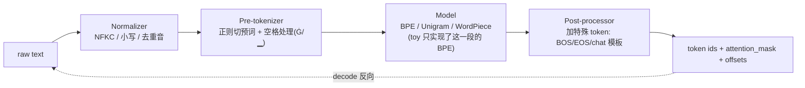

# BPE 分词 · 进阶与生产实践

> 本文承接同目录的 `bpe_tokenizer.py`(toy 实现)与 `手把手教学.md`(逐行精讲)，把这份「教学最小版 byte-level BPE」与业界真实系统(tiktoken / SentencePiece / HuggingFace tokenizers)逐项打通：本 demo **故意简化了什么**、生产里**必须补什么**、为什么要那样做。
>
> 阅读前提：你已经懂 toy 版的三件事——`train`(统计 pair → 贪心合并最高频对 → 得到 `merges`/`vocab`)、`encode`(字节序列反复应用 merges)、`decode`(查 vocab 拼字节)。本文不再重复算法本身，只讲「从 toy 到生产」的鸿沟。
>
> 全文不编造精确 benchmark 数字，凡涉及性能一律用定性或「约」表述，量级估算给出可手算公式。

---

## 0. 本项目 toy 与生产的差距

toy 版用约 120 行纯 Python 把 BPE 的「灵魂」讲清楚了，但它为了教学可读性，砍掉了一切工程细节。下面这张表是全文的总纲——左边是 toy 里的具体代码事实，右边是生产里**必须**补的东西及原因。

| 维度 | toy 版怎么做(代码事实) | 生产必须补什么 | 为什么 |
| --- | --- | --- | --- |
| **预切分(pre-tokenization)** | `line.split()` 按空白切词，**词间空格直接丢弃** | 用正则把文本切成更细的「预词」，且**保留空格**(GPT-2 把空格编进 `Ġ`，LLaMA/tiktoken 用更复杂 regex) | 空格携带信息(代码缩进、英文分词)；不切分会让 merge 跨标点/数字乱合，词表质量崩 |
| **空格/前缀处理** | split 吃掉空格，merge 永远不含空格 | 空格归属到「下一个词的前缀」(GPT-2 `Ġthe`)或显式 `▁`(SentencePiece) | decode 要无损还原排版；`" the"` 与 `"the"` 必须是不同 token |
| **encode 速度** | `min(pairs, key=...)` 每轮重扫整条序列，**O(n²)** | 优先队列 / 链表 + 缓存 + Rust/C++ 重写 + 多线程 | toy 几十字节没问题；生产要对 TB 级语料编码、对每个推理请求实时编码 |
| **train 速度** | 每轮 `get_pair_counts` 重新全量统计，字典推导式重建 `word_freqs`，**O(merges × corpus)** | 增量更新 pair 频率(只改受影响的词)、倒排索引、并行分片统计 | toy 语料 1750 字节；生产在数百 GB ~ TB 语料上训词表 |
| **词表大小** | `target_vocab = 300`(256 + 44) | 30k ~ 200k+(GPT-2 50257、LLaMA 32k、GPT-4 约 10万、Qwen 约 15万) | 词表是压缩率/embedding 显存/softmax 算力的核心权衡 |
| **特殊 token** | 完全没有 | `<|endoftext|>`、`<pad>`、`<unk>`、chat 模板 token、FIM token 等，且需防注入 | 训练边界、对话格式、控制行为全靠它 |
| **多语言/Unicode** | byte-level 天然无损，但未做 NFC/NFD 归一化 | Unicode normalization(NFKC 等)、是否大小写折叠的策略 | `é` 有两种编码；不归一化会把同一字符切成不同 token |
| **数字处理** | 不特殊处理 | 很多 tokenizer 把数字按单 digit 切(LLaMA)或限制 merge | 数字 merge 会让 `123`/`124` 共享子结构差，损害算术能力 |
| **序列化/版本** | 内存里的 dict，跑完即丢 | 词表文件(.model/.json)+ 版本哈希 + 与模型权重绑定 | tokenizer 一旦改，所有已训权重作废；必须可复现、可分发 |
| **正确性边界** | round-trip 无损(byte-level) | 同样无损，但要测**对抗输入**(畸形 UTF-8、超长重复、特殊 token 注入) | 线上会遇到任意脏数据 |
| **batch/并发** | 单条 `encode` | 批量 encode、truncation、padding、attention_mask、offset_mapping | 训练/推理都是 batch 喂数据 |

一句话：**toy 教的是「BPE 是什么」，生产解决的是「BPE 在 PB 级语料和百万 QPS 推理下怎么又快又对又可复现」。**

---

## 1. 业界系统怎么做

三大主流分词器，定位与取舍各不相同。

### 1.1 三者对照

| 系统 | 语言/形态 | 算法 | 训练能力 | 典型使用方 | 一句话定位 |
| --- | --- | --- | --- | --- | --- |
| **tiktoken** (OpenAI) | Rust 核心 + Python 绑定 | byte-level BPE | **不带训练**，只做 encode/decode；词表是预置文件 | GPT-2/3/4、o 系列 | 极致快的**推理期** BPE 编码器 |
| **SentencePiece** (Google) | C++ 核心 + 多语言绑定 | BPE **或** Unigram LM | 自带训练(从原始文本直接训) | T5、LLaMA、PaLM、Mistral 等 | 「语言无关」的训练+推理一体框架 |
| **HuggingFace tokenizers** | Rust 核心 + Python 绑定 | BPE / WordPiece / Unigram(可插拔) | 自带训练 | HF 生态几乎所有模型 | 模块化流水线，训练+推理全包 |

> toy 版同时实现了 train 和 encode，对应的是「SentencePiece / HF tokenizers」那一类；而 tiktoken **只负责 encode**——它假定词表已经训好、随模型一起发布。这是生产里很重要的分工:**训词表是离线一次性的事，encode 是每个请求都要做的高频事**。

### 1.2 现代 tokenizer 的标准流水线

HF tokenizers 把分词显式拆成五段可插拔流水线，生产里几乎都是这个结构(SentencePiece 内部也等价):



**toy 版只覆盖了正中间的 Model 段(BPE 本体)**，而且把 Normalizer 省了、把 Pre-tokenizer 退化成 `split()`、Post-processor 完全没有。生产的工程量大头其实在两端的 Normalizer / Pre-tokenizer / Post-processor，以及把整条流水线做到又快又可序列化。

### 1.3 关键设计取舍

- **为什么 tiktoken 不带训练？** OpenAI 的词表是内部用海量数据训好的、固定下来随模型分发。推理期只需要一个超快的 encoder。把训练剥离让推理库极简且可极致优化(Rust + 正则一次切分 + BPE rank 查表)。
- **为什么 SentencePiece 强调「语言无关 + 从 raw text 训」？** 它面向多语言(包括无空格分词的中日韩、泰语)，所以它**不依赖外部分词器做预切分**，而是把空格也当成普通字符(用 `▁` 表示)，整段文本直接训。这让同一套代码处理任意语言，对 toy 版「靠 `split()` 切词」是根本性的升级。
- **为什么 HF 要做成可插拔流水线？** HF 要承载成百上千种模型，每个模型的 normalizer/pre-tokenizer/特殊 token 都不同，模块化才能复用 Rust 内核同时支持差异化配置。

---

## 2. 关键变体与优化

逐个讲清每个变体「解决什么问题、代价是什么」。

### 2.1 BBPE(Byte-level BPE)——toy 版用的就是它

- **解决什么**:在「字符级 BPE」里，初始符号是 Unicode 字符，词表基座可能上万且仍可能 OOV(没见过的字符)。BBPE 改成在 **UTF-8 字节(0..255)** 上做 BPE，基座恒为 256，**永不 OOV**,任意 Unicode 无损。
- **代价**:非 ASCII 文本(中文/emoji)一个字符就是 2~4 字节，若词表没学到这些字节组合，会被切成多个 token——**中文压缩率天然差于英文**。这正是 toy 版里「中文 round-trip True 但 tokens 几乎等于 bytes」的现象。
- **生产补法**:在大规模多语言语料上训词表，让常见中文/代码字节组合也被合并;扩大词表;Qwen/LLaMA 等都为中文/代码额外扩了词表。

### 2.2 Unigram LM(SentencePiece 的另一条路)

- **解决什么**:BPE 是**贪心、确定性**的(每步合最高频对)，切分结果唯一但不一定全局最优。Unigram 反过来:先建一个大候选子词集，给每个子词一个概率，用 EM 迭代**删掉**对似然贡献最小的子词，直到目标词表大小。它能给出**概率最优切分**，还支持 **subword regularization**(训练时随机采样多种切分增强鲁棒性)。
- **代价**:训练更复杂(EM、维特比解码)，比 BPE 慢;实现门槛高。
- **何时选**:T5、ALBERT、很多多语言模型用 Unigram;经验上多语言/形态丰富语言上 Unigram 略优，英文为主时与 BPE 差距不大。

### 2.3 WordPiece(BERT 系)

- **解决什么**:与 BPE 几乎同构，区别在合并准则不是「最高频对」，而是「最大化语言模型似然增益」的对，即按 `count(a,b) / (count(a)·count(b))` 这类互信息式打分选对。
- **代价/现状**:主要在 BERT/DistilBERT 等编码器模型;生成式 LLM 基本不用。

### 2.4 dropout / regularization 变体(BPE-dropout)

- **解决什么**:确定性切分让模型只见过每个词的一种切法，鲁棒性差。BPE-dropout 在 encode 时以概率 p 随机跳过某些 merge，制造多样切分作数据增强。
- **代价**:只在训练期开;推理期仍用确定性切分。收益在小数据/低资源更明显。

### 2.5 词表与压缩率(最核心的工程权衡)

这是 toy 版 `compression_ratio` 实验的生产放大版。压缩率(token/byte 或更常说 **token/word**、**bytes/token**)直接决定:

- **序列长度** → 注意力是 O(n²)，序列短 1 倍，长上下文算力/显存大降;
- **训练吞吐** → 同样语料 token 数更少，训练步数更少;
- **推理成本** → API 按 token 计费，压缩率好 = 同样文本更便宜更快;
- **embedding/softmax 开销** → 词表大 V，输入 embedding 和输出 softmax 都是 O(V·d)。

**权衡公式直觉**:词表越大压缩率越好(toy 里 ratio 从 1.0 → 0.34)，但**收益递减**(后学的都是低频对)，而 embedding 参数 `V·d` 线性涨、输出 softmax 算力线性涨。所以词表大小是在「序列变短的收益」和「V 变大的显存/算力代价」之间取拐点。业界经验拐点常落在 **3万 ~ 15万**:

| 词表量级 | 代表 | 特点 |
| --- | --- | --- |
| ~32k | LLaMA-1/2、Mistral | 紧凑，embedding 省，英文为主 |
| ~50k | GPT-2 | 经典基线 |
| ~10万 | GPT-4(cl100k)、GPT-3.5 turbo | 大词表换更好压缩,尤其代码/多语言 |
| ~15万 | GPT-4o(o200k)、Qwen | 进一步压缩 + 强多语言/代码 |

> 直觉:从 32k 加到 100k，英文压缩率提升有限，但**中文/代码**压缩率明显改善(更多 CJK 字节组合、缩进/符号串被合并),代价是 embedding 表大几倍。这就是为什么「面向中文/代码」的模型普遍用大词表。

### 2.6 特殊 token(toy 完全没有)

生产 tokenizer 必带一组保留 id:

- `<|endoftext|>` / BOS / EOS:标训练文档边界、生成起止;
- chat 模板 token:如 `<|im_start|>` / `<|im_end|>`(ChatML)、role 标记——对齐/对话格式全靠它;
- FIM(Fill-In-Middle)token:`<|fim_prefix|>` 等，代码补全用;
- `<pad>` / `<unk>`(byte-level 其实用不到 unk)。

**坑(安全)**:必须区分「特殊 token 是程序注入的」还是「用户文本里恰好出现这串字符」。若把用户输入里的 `"<|im_end|>"` 当成真的结束符,就是 **prompt injection**。生产 encode 默认**不允许**用户文本编码出特殊 token(tiktoken 的 `allowed_special` / `disallowed_special` 就是干这个)。

### 2.7 tokenizer-free / byte-level 模型趋势

近年一条研究路线试图**干掉显式 tokenizer**:

- **ByT5 / CANINE**:直接吃字节/字符,无词表。好处:零 OOV、零 tokenizer 维护、对拼写/形态鲁棒;代价:序列暴长(无压缩)、算力激增。
- **MegaByte / 分层字节模型**:用 patch/分层结构在字节上建模,缓解序列过长。
- **学习型/动态切分(如 BLT, Byte Latent Transformer 思路)**:用熵/小模型动态决定 patch 边界,等于把分词「学」进网络。

**为什么还没取代 BPE?** BPE 的压缩(序列变短)目前仍是性价比最高的「免费午餐」,纯字节模型的算力代价短期难抵消。但 tokenizer 的诸多顽疾(数字、多语言不公平、词表锁死模型)使这条路线持续受关注。**判断**:BPE 仍是当下生产默认,tokenizer-free 是值得跟踪的中长期方向。

---

## 3. 真实工程权衡与坑

### 3.1 显存 / 算力:词表大小的双刃

- 输入 embedding 表 `V × d` 和输出 lm_head `V × d`(常 tie 权重)直接吃显存。V=15万、d=4096、fp16 → 单张表约 `150000 × 4096 × 2 B ≈ 1.2 GB`,输入输出两张(若不 tie)翻倍。
- 输出 softmax 每步算力 `O(V·d)`,大词表让最后一层变重(长序列下被 attention 摊薄,但短序列不可忽视)。

### 3.2 吞吐 / 延迟:encode 必须够快

- toy 的 O(n²) encode 在生产不可接受。tiktoken 用 **Rust + 一次正则预切分 + 每个预词内 BPE rank 合并**,并对短串做缓存,达到极高吞吐(官方宣称比纯 Python 实现快约一个数量级以上)。
- **训练数据预处理**是隐形大头:对数百 GB 语料做一遍 encode,单机串行可能要很久,生产用**多进程/分片 + 缓存 token 化结果到磁盘**(`.bin`/memmap),避免每个 epoch 重切。

### 3.3 精度 / 行为坑

- **数字与算术**:把 `1234` 合成单 token 会让模型对数字泛化差(`1234` 和 `1235` 表示无关)。LLaMA 等改为**逐 digit 切分**改善算术。toy 不处理数字,生产要决策。
- **空格/缩进**:代码模型对空格极敏感,tab vs 4空格、行尾空格都会变成不同 token,影响代码生成。GPT-4 的 cl100k 专门优化了连续空格的合并(把多个空格合成单 token),省 token。
- **大小写/Unicode 归一化**:不做 NFC 归一化,`café`(组合字符)和 `café`(预组合)会切成不同 token,污染统计。
- **token 化偏置(多语言不公平)**:同样语义,英文 token 数远少于中文/泰语/印地语,导致非英语用户「上下文更短、API 更贵」。这是 byte-level BPE 在 Unicode 上的结构性问题,只能靠扩词表缓解。

### 3.4 线上常见故障

| 故障 | 根因 | 应对 |
| --- | --- | --- |
| 模型加载后输出乱码 | tokenizer 版本与权重不匹配 | tokenizer 必须随权重版本绑定、打哈希校验 |
| 用户能触发隐藏行为/越权 | 特殊 token 注入 | encode 默认禁止用户文本产出特殊 token |
| 长文本截断错位 | truncation 策略未对齐 chat 模板 | 在 post-processor 层统一处理 BOS/EOS + 截断 |
| 训练 loss 异常 | 预处理 encode 与训练框架 tokenizer 不一致 | 全链路用同一 tokenizer 实例/同一 .model 文件 |
| 词表中途想加词 | 加 token 会移动 id、作废 embedding | 预留「保留 id」区;或只在 embedding 末尾追加新行 |

### 3.5 调优经验

- **训词表的语料要和目标分布一致**(代码模型用代码语料训,否则缩进/符号压不动)。
- **先定词表再训模型**:词表是 frozen 的契约,一旦开训不可改。
- **监控 fertility**(平均每词被切成几个 token):跨语言对比,异常高说明该语言覆盖不足。

---

## 4. 性能直觉与估算

给几个能手算的量级公式。

### 4.1 压缩率 → 序列长度 → 算力

toy 的核心指标可直接放大:

```
压缩率 ratio = tokens / bytes          (toy 里 baseline 1.0 → 0.34)
等价序列缩短倍数 speedup = ratio_baseline / ratio_best
```

注意力算力随序列长度平方:序列缩短 k 倍,**attention 算力降约 k² 倍**(在 attention 主导的长上下文场景)。toy 里 shrink 2.97x → 长上下文下注意力开销可降约 9x(粗略上界,实际被 FFN/embedding 摊薄)。

更实用的生产指标是 **bytes/token**(= 1/ratio,越大越好):英文常见约 4 bytes/token,中文 byte-level 若词表覆盖好可达约 1.5~2 bytes/token,覆盖差则接近 1(每个汉字 3 字节切成 2~3 token)。

### 4.2 embedding 显存

```
embedding 显存 ≈ V × d × bytes_per_param × (1 if tied else 2)
例:V=128000, d=4096, fp16(2B), tied → 128000×4096×2 ≈ 1.05 GB
```

把 V 从 32k 加到 128k(×4),这块显存也约 ×4。这就是大词表的直接成本。

### 4.3 训练 token 预算的换算

```
若语料 = B 字节, 压缩率 = ratio, 则 token 数 ≈ B × ratio
模型一次 forward 算力 ≈ 2 × N_params × tokens (经验近似, 训练再 ×3)
```

压缩率改善 10%,等价训练 token 减少 10% → 训练成本同比下降。这是大词表「省训练费」的来路。

### 4.4 encode 复杂度

- toy `encode`:每轮重扫 O(n) 找最优 pair,最多 O(n) 轮 → **O(n²)**。
- 生产(预切分后逐预词 BPE + rank 查表 + 链表/堆):接近 **O(n log n)** 甚至近似 O(n),且预词通常很短(几到十几字节),常数极小。

经验:一条几百 token 的请求,生产 tokenizer encode 耗时通常在**微秒~毫秒**量级,相对模型 forward(几十~几百毫秒)可忽略——但**批量预处理 TB 语料**时,它会变成必须并行化的大头。

---

## 5. 动手进阶路线

把 toy 一步步推向接近生产,每步给方向(不贴大段代码)。

### 第 1 步:补 GPT-2 风格预切分 + 空格保留

- 把 `line.split()` 换成 GPT-2 那条正则预切分(切出词、标点、连续空格为独立块),并给每个词的前导空格编进 token(类似 `Ġ`)。
- 验证点:decode 能**完整还原原始排版**(包括多个空格);merge 里开始出现带空格前缀的整词。这一步做完就摸到了真实 GPT-2 tokenizer 的门槛(对应 `手把手教学.md` 练习 5)。

### 第 2 步:加特殊 token + 安全编码

- 在 vocab 末尾保留若干 id 给 `<|endoftext|>` 等;encode 时支持「显式注入特殊 token」与「禁止用户文本产出特殊 token」两种模式。
- 验证点:用户输入字符串 `"<|endoftext|>"` 被切成普通字节而不是那个保留 id。

### 第 3 步:序列化 + 版本绑定

- 把 `merges`/`vocab`/特殊 token 存成文件(参考 tiktoken 的 rank 文件或 HF 的 `tokenizer.json`),加一个内容哈希。加载后跑 round-trip 自检。
- 验证点:换台机器加载同一文件,encode 结果逐 id 一致(可复现)。

### 第 4 步:训练增量化 + 编码加速

- train:不再每轮全量 `get_pair_counts`,改成只更新「受本次 merge 影响的词」的 pair 计数(倒排索引 + 增量)。
- encode:每个预词内用优先队列/链表合并,加 LRU 缓存常见词;有余力把热路径用 Rust(PyO3)或 C 扩展重写。
- 验证点:在 10~100 MB 语料上训词表能在合理时间跑完;encode 吞吐显著上升。

### 第 5 步:对接真实框架 + 多语言评估

- 用 HF `tokenizers` 的 BPE trainer 复现你的词表,或用 SentencePiece 在同语料训一个 Unigram 词表做对比。
- 评估:在中/英/代码各采一批文本,算 bytes/token 与 fertility,画跨语言对比;体会大词表与 Unigram 的取舍。

---

## 6. 延伸阅读

**本仓库相关深度文档(相对路径)**:

- 数据工程 / 分词在数据清洗流水线中的位置:[`../../llm-data-engineering`](../../llm-data-engineering)
- 词表 / tokenizer 在训练全流程中的位置:[`../../llm-train`](../../llm-train)
- 推理期 encode 与吞吐/延迟相关:[`../../llm-inference`](../../llm-inference)
- 面试视角的 tokenizer 高频问题:[`../../llm-interview`](../../llm-interview)
- 同目录:[`./手把手教学.md`](./手把手教学.md)(逐行精讲)、[`./README.md`](./README.md)、[`./面试题.md`](./面试题.md)

**经典论文与工程实现**:

- BPE 原始(NMT 子词):Sennrich et al., *Neural Machine Translation of Rare Words with Subword Units* (2016)
- byte-level BPE 系统化:Radford et al., *Language Models are Unsupervised Multitask Learners* (GPT-2, 2019);官方 [`openai/gpt-2 encoder.py`](https://github.com/openai/gpt-2/blob/master/src/encoder.py)
- Unigram LM / subword regularization:Kudo, *Subword Regularization* (2018)
- SentencePiece:Kudo & Richardson, *SentencePiece: A simple and language independent subword tokenizer* (2018)
- WordPiece:见 Schuster & Nakajima (2012) 及 BERT 论文
- tokenizer-free:*ByT5* (Xue et al., 2021)、*CANINE* (Clark et al., 2021)、*MegaByte* (2023)、Byte Latent Transformer 路线

**源码(从 toy 到工业)**:

- [`karpathy/minbpe`](https://github.com/karpathy/minbpe):与本 toy 一脉相承的最小实现,读完本文再读它最顺
- [`openai/tiktoken`](https://github.com/openai/tiktoken):推理期极速 BPE encoder(Rust)
- [`huggingface/tokenizers`](https://github.com/huggingface/tokenizers):可插拔流水线(Rust),训练+推理全包
- [`google/sentencepiece`](https://github.com/google/sentencepiece):语言无关、BPE/Unigram 一体

> 下一步建议:做完第 1~2 步(预切分 + 特殊 token),对照 `tiktoken` 的 encode 实现读它的 Rust 热路径,你就能从「读懂 toy」过渡到「读懂工业级 tokenizer」。
