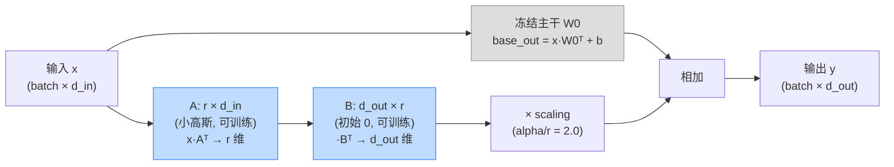

# 从零实现 LoRA 参数高效微调 —— 手把手教学

> 一句话导览:学完这篇,你将能够——
>
> 1. 彻底讲清 LoRA 的核心公式 `W_eff = W0 + (alpha/r)·B@A`,以及它为什么省参数；
> 2. 读懂并复述 `lora.py` 里 `LoRALinear` 的每一行代码（为什么 B 初始化为 0、为什么先降维再升维、scaling 怎么来）；
> 3. 亲手跑通 demo，并**逐个数字**看懂输出里的 `trainable / %trainable / acc / loss / merge check`；
> 4. 解释「冻结 base 只训 A/B」「缩放 alpha/r」「可训练参数占比」「推理时合并的数值等价」这几个高频面试点；
> 5. 通过 3-5 个小实验，亲手观察改 `r`、改 `alpha`、改 `lr` 后效果如何变化。

本文严格基于 `practical-projects/03-lora-from-scratch/lora.py` 的真实实现来讲，所有函数名 / 变量名 / 默认超参 / 打印数字都与代码一致，不掺杂代码里没有的东西。

---

## 0. 前置知识与环境

### 你需要会什么（不会也能跟，下面会补）

- **Python 基础**：函数、类、`for` 循环。
- **PyTorch 入门**：知道 `nn.Module`、`nn.Linear`、`tensor`、`.backward()` 大概是干嘛的即可，不熟也没关系，正文会逐行解释。
- **一点线性代数**：矩阵乘法 `@`、转置 `.t()`、矩阵的「形状（shape）」。如果你知道 `(m×k) @ (k×n) = (m×n)`，就够用了。
- **不需要**：GPU、显卡、外部数据集、预训练大模型权重、联网。全程纯 CPU、几秒钟跑完。

### 安装环境

代码只用到 `math`(标准库)、`torch`,作图是可选的 `matplotlib`(没有也不报错):

```bash
pip install torch
pip install matplotlib   # 可选，用于生成柱状图 lora_results.png；不装也能跑
```

README 里记录的真实跑通环境是 `Python 3.13 / numpy 2.3 / torch 2.12 (CPU)`。你不用严格对齐版本，torch 1.x / 2.x 一般都能跑。

### 怎么打开跑

```bash
cd practical-projects/03-lora-from-scratch
python lora.py
```

整个文件只有一个入口 `if __name__ == "__main__": main()`，没有命令行参数，直接跑就行。

---

## 1. 问题背景：不用 LoRA 会怎样

### 一个真实痛点

假设你有一个已经训练好的大模型（在本 demo 里是一个小 MLP，对应真实世界的「7B 大模型」）。现在来了一个**新任务**，模型在新任务上表现很差，你想微调它。

最朴素的做法叫 **full fine-tune（全量微调）**：把模型**所有参数**都解冻，一起用新数据训练。问题是：

- **参数量爆炸**：真实 7B 模型有 70 亿个参数，全量微调要为这 70 亿个参数都算梯度、都更新。
- **优化器状态翻倍再翻倍**：用 Adam 优化器时，每个可训练参数还要额外存两份状态（动量 `m`、二阶矩 `v`）。所以 70 亿参数训练时显存里要塞下「参数 + 梯度 + m + v」约 4 份。
- **每个任务存一份**：有 10 个下游任务，就要存 10 份 7B 的完整权重。

在本 demo 里，这个痛点被「缩小」成可观察的数字：full fine-tune 要训练 **18696** 个参数（见后文输出），而 LoRA 只训练 **2336** 个。

### 另一个极端：完全不训练（frozen）

那干脆不微调，直接拿旧模型用新任务行不行？demo 里这叫 **frozen**。结果是：base 模型在有「分布漂移」的任务 B 上准确率只有 **0.156**(8 分类，瞎猜也有 0.125,几乎等于瞎猜)。显然不行。

### LoRA 的承诺

LoRA 站在中间：**冻结绝大部分参数，只额外训练极少量的「低秩旁路」参数**，却能把效果拉到接近全量微调。本 demo 的真实结果是：LoRA 用比 full 少 **8 倍**的可训练参数，把准确率从 frozen 的 **0.156** 拉到 **0.994**，补回了「frozen→full 差距」的 **99.3%**。

这就是我们要从零实现并亲眼验证的东西。

---

## 2. 核心原理详解

### 2.1 低秩分解：为什么旁路是 `B @ A`

设原始线性层的权重是 $W_0 \in \mathbb{R}^{d_{out} \times d_{in}}$（PyTorch 的 `nn.Linear` 权重就是这个形状，前向是 $y = x W_0^\top + b$）。

微调的本质是给 $W_0$ 加一个增量 $\Delta W$，得到新权重 $W_0 + \Delta W$。全量微调直接把整个 $\Delta W$（$d_{out}\times d_{in}$ 个自由参数）都当作可学习的。

LoRA 的核心假设（来自论文 arXiv:2106.09685）是：**微调所需要的 $\Delta W$ 其实是「低秩」的**——也就是说，它可以用两个又瘦又长的小矩阵相乘来近似表达：

$$
\Delta W = B A, \quad A \in \mathbb{R}^{r \times d_{in}}, \quad B \in \mathbb{R}^{d_{out} \times r}, \quad r \ll \min(d_{in}, d_{out})
$$

直觉：$A$ 先把 $d_{in}$ 维「压缩」到 $r$ 维（降维），$B$ 再把 $r$ 维「还原」到 $d_{out}$ 维（升维）。中间的 $r$ 就是**秩(rank)**,它像一个瓶颈,强制这个增量只能携带 $r$ 个维度的信息。

**参数量对比**——这是 LoRA 省钱的根源:

$$
\underbrace{d_{out}\times d_{in}}_{\text{全量 } \Delta W} \quad\longrightarrow\quad \underbrace{r\times d_{in} + d_{out}\times r = r(d_{in}+d_{out})}_{\text{LoRA 的 }A,B}
$$

代入 demo 的 `fc1`(in=64, out=256, r=4)：全量是 $256\times64 = 16384$，LoRA 是 $4\times(64+256)=1280$。一眼看出小了一个量级。

### 2.2 缩放系数 alpha/r

LoRA 不直接用 $\Delta W = BA$，而是乘一个缩放系数：

$$
\Delta W = \frac{\alpha}{r}\, B A, \qquad \text{scaling} = \frac{\alpha}{r}
$$

为什么要这个 scaling？**为了解耦「秩的大小」和「更新的幅度」**。如果你把 $r$ 从 4 调大到 8，$BA$ 的数值规模会变（更多项相加），训练动态会跟着变。除以 $r$ 之后，改 $r$ 时更新幅度大致稳定，你就不必每次改 $r$ 都重新调学习率。$\alpha$ 则是一个独立的「旋钮」，专门控制旁路相对主干的强弱。

demo 里 `alpha=8, r=4`，所以 `scaling = 8/4 = 2.0`。

### 2.3 为什么 B 初始化为 0(关键!)

LoRA 要求：**训练刚开始时，模型行为必须和原始 base 完全一样**（$\Delta W = 0$）。这样起点稳定、安全，不会一上来就把好不容易预训练好的模型打乱。

怎么保证 $\Delta W = BA = 0$ 但又不让 $A$、$B$ 都死掉（全 0 会导致梯度也为 0，永远学不动）？答案：

- $A$ 用小高斯随机初始化（非零，保证有梯度流）；
- $B$ 初始化为 **全 0**。

于是起点 $BA = B\cdot A = 0 \cdot A = 0$，$\Delta W=0$ ✅。同时反向传播时，$A$ 的梯度依赖 $B$（一开始为 0，A 暂时不更新）、$B$ 的梯度依赖 $A$（非零，B 立刻开始更新），整体不会卡死。这是「既要起点等于 base，又要训练得动」的巧妙平衡。

### 2.4 前向的高效写法

天真的做法是先算出 $\Delta W = \frac{\alpha}{r}BA$（一个 $d_{out}\times d_{in}$ 的大矩阵），再做 $x(W_0+\Delta W)^\top$。但这样就白白构造了一个和原权重一样大的矩阵，没省内存。

聪明的做法是利用结合律，**永远不显式构造大矩阵**：

$$
y = x W_0^\top + \frac{\alpha}{r}\,(x A^\top) B^\top
$$

读法：先 $xA^\top$ 把输入投影到 $r$ 维（很小），再 $\cdot B^\top$ 升回 $d_{out}$ 维，最后乘 scaling。中间产物最大也只是 $(\text{batch}\times r)$，极省。

### 2.5 推理时合并：数值等价

训练完后，部署时可以把旁路**合并**回主干，得到一个普通权重：

$$
W_{eff} = W_0 + \frac{\alpha}{r}\,BA
$$

之后用 $W_{eff}$ 做一个标准线性层即可，**没有任何额外推理开销**（不需要额外算旁路）。demo 会数值验证「合并前的前向」和「合并后的前向」结果几乎完全相等（误差 ~3.8e-5，来自浮点精度）。

### 2.6 一图看懂



灰色块 = 冻结、不算梯度；蓝色块 = 可训练的低秩旁路。

---

## 3. 代码逐段精讲

下面把 `lora.py` 按逻辑拆成 7 段。每段都贴关键代码 + 逐块解释 + 标注新手易困惑点。

### 3.1 导包与随机种子

```python
import math
import torch
import torch.nn as nn
import torch.nn.functional as F

SEED = 42
torch.manual_seed(SEED)
```

- `math`：只为后面 `math.sqrt(5)`（A 的初始化）服务。
- `torch.nn`：神经网络层（`nn.Linear`、`nn.Module`、`nn.Parameter`）。
- `torch.nn.functional as F`：函数式 API，用到 `F.relu`、`F.cross_entropy`。
- `torch.manual_seed(SEED)`：固定全局随机种子，保证你每次跑结果都一样（可复现）。后面还会再建一个独立的 `Generator` 专门给造数据用，理由见 3.4。

> 易困惑点：这里设了全局种子，3.4 里又设了一个 `g = torch.Generator().manual_seed(SEED)`。两者不冲突——全局种子管 `nn.Linear` 权重的初始化、A 的随机初始化；`g` 这个独立发生器专管「造数据」，把数据生成和模型初始化的随机性隔离开，更干净。

### 3.2 核心:LoRALinear 类

这是整个项目的灵魂,对应原理第 2 节。

```python
class LoRALinear(nn.Module):
    def __init__(self, base_linear: nn.Linear, r: int = 4, alpha: int = 8):
        super().__init__()
        assert r > 0, "rank r must be positive"
        self.in_features = base_linear.in_features
        self.out_features = base_linear.out_features
        self.r = r
        self.alpha = alpha
        self.scaling = alpha / r
```

- `LoRALinear` **包装**一个已有的 `nn.Linear`（叫 `base_linear`），不是从头建权重。
- 默认 `r=4, alpha=8`。`self.scaling = alpha / r = 8/4 = 2.0`，对应原理 2.2 的 $\alpha/r$。
- `assert r > 0`：秩必须是正整数，否则除以 0 / 没有旁路。

```python
        self.base = base_linear
        for p in self.base.parameters():
            p.requires_grad = False
```

- 这三行就是「**冻结 base**」：把传进来的线性层存为 `self.base`，然后把它的所有参数（`weight` 和 `bias`）的 `requires_grad` 设为 `False`。`requires_grad=False` 意味着**反向传播不会为它们算梯度，优化器也不会更新它们**。这正是原理 2.1 里被冻结的 $W_0$。

```python
        self.lora_A = nn.Parameter(torch.empty(r, self.in_features))
        self.lora_B = nn.Parameter(torch.zeros(self.out_features, r))
        nn.init.kaiming_uniform_(self.lora_A, a=math.sqrt(5))
```

- `lora_A`：形状 `(r, in_features)` = $(r\times d_{in})$，对应原理里的 $A$。用 `nn.Parameter` 包起来 → 它**默认 `requires_grad=True`，是可训练的**。
- `lora_B`：形状 `(out_features, r)` = $(d_{out}\times r)$，对应 $B$。**初始化为全 0**（`torch.zeros`），这就是原理 2.3 的关键——保证起点 $\Delta W = BA = 0$。
- `nn.init.kaiming_uniform_(self.lora_A, a=math.sqrt(5))`：给 A 做 kaiming 均匀初始化（小随机值），注释说明「与 PEFT 实现一致」。这是 HuggingFace PEFT 库里 LoRA 的标准做法。

> 易困惑点 1：`torch.empty` 会得到「未初始化的垃圾值」，但紧接着被 `kaiming_uniform_` 覆盖了，所以没问题。
>
> 易困惑点 2：为什么 A 随机、B 是 0，而不是反过来或都随机？见原理 2.3——必须保证 $BA=0$ 起步，又不能两个都 0（否则梯度全 0 学不动）。一随机一 0 是最经典的搭配。

```python
    def forward(self, x: torch.Tensor) -> torch.Tensor:
        base_out = self.base(x)
        lora_out = (x @ self.lora_A.t()) @ self.lora_B.t() * self.scaling
        return base_out + lora_out
```

这就是原理 2.4 的高效前向。逐块拆：

- `base_out = self.base(x)`：主干输出 $x W_0^\top + b$。因为 base 冻结，这一路不参与反传。
- `(x @ self.lora_A.t())`：`x` 形状 `(batch, in)`，`lora_A.t()` 形状 `(in, r)`，相乘得 `(batch, r)`——**降维到 r**。
- `@ self.lora_B.t()`：再乘 `lora_B.t()` 形状 `(r, out)`，得 `(batch, out)`——**升维回 out**。
- `* self.scaling`：乘缩放 $\alpha/r$。
- 整条 `lora_out` 对应 $\frac{\alpha}{r}(xA^\top)B^\top$，全程没构造 $d_{out}\times d_{in}$ 大矩阵。
- 最后 `base_out + lora_out` = 主干 + 旁路。

> 易困惑点：为什么用 `.t()`？因为 PyTorch 里 `nn.Linear(in,out)` 的 `weight` 形状是 `(out,in)`，前向是 `x @ weight.t()`。这里 A、B 也按「数学上的 A、B」存（A 是 `(r,in)`、B 是 `(out,r)`），所以前向时要转置成「右乘」形式。

```python
    def merged_weight(self) -> torch.Tensor:
        delta_w = self.scaling * (self.lora_B @ self.lora_A)  # (out, in)
        return self.base.weight.data + delta_w
```

- 对应原理 2.5 的合并：$W_{eff} = W_0 + \frac{\alpha}{r}BA$。
- `self.lora_B @ self.lora_A`：`(out,r)@(r,in) = (out,in)`，即 $BA$，形状和 $W_0$ 一致。
- 乘 scaling、加上 `self.base.weight.data`（`.data` 取出底层 tensor，不带梯度），得到合并后的等效权重。这一步**只在评估/部署时调用**，训练时用的是 `forward`。

### 3.3 Toy 模型 MLP 与注入函数

```python
class MLP(nn.Module):
    def __init__(self, in_dim: int, hidden: int, n_classes: int):
        super().__init__()
        self.fc1 = nn.Linear(in_dim, hidden)
        self.fc2 = nn.Linear(hidden, n_classes)

    def forward(self, x):
        h = F.relu(self.fc1(x))
        return self.fc2(h)
```

- 极简两层 MLP：`fc1`(输入→隐藏) → ReLU → `fc2`(隐藏→类别)。它扮演「被微调的 base 大模型」，注释说它像「迷你 transformer 的 FFN」。
- 两个 `nn.Linear` 就是后面要被 LoRA 注入的目标。

```python
def inject_lora(model: MLP, r: int, alpha: int) -> MLP:
    model.fc1 = LoRALinear(model.fc1, r=r, alpha=alpha)
    model.fc2 = LoRALinear(model.fc2, r=r, alpha=alpha)
    return model
```

- 「注入 LoRA」= 把模型里的每个 `nn.Linear` **就地替换**成 `LoRALinear(原层)`。替换后，原层变成被冻结的 `self.base`，外面套上可训练的 A、B。
- 替换后 `model.fc1` 的类型从 `nn.Linear` 变成 `LoRALinear`，但 `model.forward` 里调用 `self.fc1(x)` 的写法完全不变（因为 `LoRALinear` 也是 `nn.Module` 且实现了 `forward`）——这就是「无侵入注入」的优雅之处。

> 易困惑点：真实工程（PEFT）通常只注入注意力的部分投影（如 q/v），由 `target_modules` 控制；这里为了最小演示，把所有 `nn.Linear` 都注入了。README「局限」第 3 条也明确说了这点。

### 3.4 人造数据：制造「分布漂移」

```python
def make_task(n_per_class, in_dim, n_classes, center_scale, generator):
    centers = torch.randn(n_classes, in_dim, generator=generator) * center_scale
    xs, ys = [], []
    for c in range(n_classes):
        pts = centers[c] + 1.3 * torch.randn(n_per_class, in_dim, generator=generator)
        xs.append(pts)
        ys.append(torch.full((n_per_class,), c, dtype=torch.long))
    X = torch.cat(xs, 0)
    y = torch.cat(ys, 0)
    perm = torch.randperm(X.size(0), generator=generator)
    return X[perm], y[perm]
```

- 造一个**高斯混合分类**任务：每个类是一团以随机 `centers[c]` 为中心的高斯点云。
- `1.3 * torch.randn(...)`：噪声幅度 1.3，**故意偏大**，让不同类的点云有重叠 → 任务不能被完美分开 → 准确率不会轻易饱和到 1.0（更真实）。
- `torch.full((n_per_class,), c, ...)`：给这一类的所有点打上标签 `c`。
- 最后 `torch.randperm` 打乱顺序，返回特征 `X` 和标签 `y`。
- `generator=generator`：用传入的独立随机发生器 `g`，保证数据生成可复现且与模型初始化隔离（见 3.1）。

任务 A 和任务 B 的「漂移」在 `main` 里制造：

```python
Xa, ya = make_task(N_PER_CLASS, IN_DIM, N_CLASSES, center_scale=2.2, generator=g)
Xb, yb = make_task(N_PER_CLASS, IN_DIM, N_CLASSES, center_scale=2.2, generator=g)
drift = torch.randn(IN_DIM, IN_DIM, generator=g) * 0.25
Xb = Xb + Xb @ drift + 0.8
```

- 任务 A、B 各自是一套高斯混合。
- 关键是 `Xb = Xb + Xb @ drift + 0.8`：给 B 的特征施加一个**固定的线性变换（旋转 `Xb @ drift`）+ 平移(`+0.8`)**。这模拟「下游数据分布变了」。
- 后果：在 A 上训好的 base，直接拿到 B 上会失效（准确率掉到 0.156），从而**制造出「需要适配」的动机**。这是整个 demo 的剧本设定。

### 3.5 参数统计 / 评估 / 训练 三个工具函数

```python
def count_params(model: nn.Module):
    total = sum(p.numel() for p in model.parameters())
    trainable = sum(p.numel() for p in model.parameters() if p.requires_grad)
    return trainable, total
```

- `p.numel()`：一个参数张量里的元素个数。
- `total`：所有参数元素总数。
- `trainable`：只统计 `requires_grad=True` 的——这正是「可训练参数量」。LoRA 注入后，base 的权重 `requires_grad=False` 不计入，只有 A、B 计入。这就是后面打印 `%trainable` 的来源。

```python
@torch.no_grad()
def evaluate(model, X, y):
    model.eval()
    logits = model(X)
    loss = F.cross_entropy(logits, y).item()
    acc = (logits.argmax(1) == y).float().mean().item()
    return loss, acc
```

- `@torch.no_grad()`：评估时不需要梯度，关掉省内存、加速。
- `model.eval()`：切到评估模式（本模型没 dropout/BN，影响不大，但是好习惯）。
- `logits = model(X)`：前向得到每个样本对每个类的分数 `(N, n_classes)`。
- `loss = F.cross_entropy(logits, y)`：交叉熵损失，衡量预测分布和真实标签的差距，越小越好。
- `acc = (logits.argmax(1) == y).float().mean()`：`argmax(1)` 取每行分数最大的类作为预测，和真标签比对，求平均 = 准确率。
- `.item()`：把单元素张量转成普通 Python 数。

```python
def train(model, X, y, steps, lr, log_every=0):
    opt = torch.optim.Adam((p for p in model.parameters() if p.requires_grad), lr=lr)
    model.train()
    for step in range(1, steps + 1):
        opt.zero_grad()
        loss = F.cross_entropy(model(X), y)
        loss.backward()
        opt.step()
        if log_every and (step % log_every == 0 or step == 1):
            print(f"    step {step:4d}  train_loss {loss.item():.4f}")
    return model
```

这是标准训练循环，逐行：

- `torch.optim.Adam((p for ... if p.requires_grad), lr=lr)`：**只把 `requires_grad=True` 的参数交给优化器**。这一行是「只训 A/B」的执行点——LoRA 模式下 base 不在这个迭代器里，自然不会被更新。
- `model.train()`：切训练模式。
- `opt.zero_grad()`：清空上一步的梯度（PyTorch 梯度默认累加，必须先清零）。
- `loss = F.cross_entropy(model(X), y)`：**全 batch**前向 + 算损失（X 是整份训练集，没分 mini-batch，因为数据小）。
- `loss.backward()`：反向传播，算出每个可训练参数的梯度。
- `opt.step()`：用梯度更新参数。
- `log_every`：每隔若干步打印一次 `train_loss`（`:4d` 是右对齐 4 位整数，`:.4f` 是 4 位小数）。

> 易困惑点：三种方法（frozen/lora/full）用的是**同一个 `train` 函数**，区别全在「哪些参数 `requires_grad=True`」。这体现了 PyTorch 里「冻结 vs 训练」的本质就是 `requires_grad` 这一个开关。

### 3.6 主流程 main：四个阶段

#### 超参与数据准备

```python
IN_DIM, HIDDEN, N_CLASSES = 64, 256, 8
N_PER_CLASS = 250
LORA_R, LORA_ALPHA = 4, 8
```

- 输入 64 维、隐藏层 256、8 分类、每类 250 个样本、LoRA 秩 4、alpha 8。
- 注释强调：`HIDDEN` 故意取大(256),让 base 主干参数很多,从而 LoRA 旁路相对显小——这正是 LoRA 在真实大模型上优势的来源(base 越大,旁路占比越低)。

#### Phase 0：预训练 base 并冻结

```python
base = MLP(IN_DIM, HIDDEN, N_CLASSES)
train(base, Xa_tr, ya_tr, steps=300, lr=1e-2)
la, aa = evaluate(base, Xa, ya)
lb0, ab0 = evaluate(base, Xb_te, yb_te)
```

- 新建 MLP，在**任务 A**上训练 300 步、学习率 0.01 → 得到一个「预训练好的 base」。
- 在 A 上评估：acc≈1.000（学得好）；在 B 上评估：acc≈0.156（漂移导致失效，需要适配）。

```python
base_state = {k: v.clone() for k, v in base.state_dict().items()}
def fresh_base():
    m = MLP(IN_DIM, HIDDEN, N_CLASSES)
    m.load_state_dict(base_state)
    return m
```

- 把 base 训练好的权重**克隆保存**为 `base_state`。
- `fresh_base()` 每次都返回一个「权重完全相同的全新 base」——**保证 frozen / lora / full 三种方法从同一起点出发，对比才公平**。

#### Method 1：frozen（下界基线）

```python
m_frozen = fresh_base()
tr, tot = count_params_frozen(m_frozen)
loss, acc = evaluate(m_frozen, Xb_te, yb_te)
```

- `count_params_frozen`（定义在文件末尾）把所有参数 `requires_grad=False`，返回 `(0, total)`——可训练参数 0。
- 不训练，直接评估 B：acc≈0.156。这是「啥都不做」的下界。

#### Method 2：LoRA（主角）

```python
m_lora = inject_lora(fresh_base(), r=LORA_R, alpha=LORA_ALPHA)
tr, tot = count_params(m_lora)
train(m_lora, Xb_tr, yb_tr, steps=300, lr=5e-2, log_every=100)
loss, acc = evaluate(m_lora, Xb_te, yb_te)
```

- 取新 base → 注入 LoRA → 统计可训练参数(只有 A、B,2336 个)。
- 在**任务 B**上训练 300 步,学习率 **5e-2**(注意比 base 预训练的 1e-2 大,LoRA 旁路参数少、需要更激进的学习率)。
- 评估 B：acc≈0.994。用极少参数逼近 full。

> 易困惑点:为什么 LoRA 用 lr=5e-2 而 full 用 1e-2?LoRA 可训练参数极少、且有 scaling 放大,通常能/需要用更大的学习率;这是经验值,demo 直接给定。

#### Method 3：full fine-tune（上界参考）

```python
m_full = fresh_base()
for p in m_full.parameters():
    p.requires_grad = True
tr, tot = count_params(m_full)
train(m_full, Xb_tr, yb_tr, steps=300, lr=1e-2, log_every=100)
loss, acc = evaluate(m_full, Xb_te, yb_te)
```

- 取新 base → **解冻全部参数** → 全量训练 300 步、lr=0.01。
- 可训练参数 = 全部 18696。评估 B：acc≈1.000。这是「不计成本」的上界。

### 3.7 合并等价验证 + 汇总打印

```python
with torch.no_grad():
    x_probe = Xb_te[:8]
    unmerged = m_lora.fc1(x_probe)
    W_eff = m_lora.fc1.merged_weight()
    b_eff = m_lora.fc1.base.bias
    merged = x_probe @ W_eff.t() + b_eff
    merge_err = (unmerged - merged).abs().max().item()
```

这段验证原理 2.5 的「数值等价」：

- `unmerged`：走 LoRALinear 的正常 forward（主干 + 旁路）。
- `W_eff = merged_weight()`：算出合并权重 $W_0+\frac{\alpha}{r}BA$。
- `merged`：用合并权重 + base 的 bias 重新算一遍标准线性层 `x @ W_eff.t() + b_eff`。
- `merge_err`：两者逐元素差的绝对值的最大值。理论上应为 0，实际 ≈3.8e-5（纯浮点舍入误差）。这证明「合并回主干」前后前向一致——部署时合并即可，零额外推理开销。

```python
ratio = full_tr / max(lora_tr, 1)
gap = max(acc_full - acc_frozen, 1e-9)
recovered = (acc_lora - acc_frozen) / gap * 100
```

- `ratio`：full 可训练参数 / LoRA 可训练参数 = 18696/2336 ≈ 8.0×。
- `gap`：full 相对 frozen 的准确率提升空间（可改进的「全部差距」）。`max(..., 1e-9)` 防除零。
- `recovered`：LoRA 补回了多少比例的差距 = (LoRA 提升)/(full 提升) ×100% ≈ 99.3%。

最后三行 `CHECK / RESULT` 是自检判据：

```python
ok_param = lora_tr < 0.30 * full_tr          # LoRA 可训练参数 < full 的 30%
ok_lift  = acc_lora > acc_frozen + 0.05      # LoRA 比 frozen 高 0.05 以上
ok_merge = merge_err < 1e-4                   # 合并误差 < 1e-4
```

三个都 True 才打印 `RESULT: PASS`。这是项目「成功」的可量化定义。

---

## 4. 跑起来 + 逐行读懂输出

### 运行命令

```bash
cd practical-projects/03-lora-from-scratch
python lora.py
```

### 预期输出（README 记录的真实跑通摘录）

```
[Phase 0] pretrain base model on task A ...
    base on task A : acc=1.000 loss=0.0000  (good, as expected)
    base on task B : acc=0.156 loss=15.1037  (poor -> needs adapt)
    base total params = 18696

SUMMARY (task B test set)
----------------------------------------------------------------
method           trainable  %trainable     acc     loss
frozen                   0       0.00%   0.156  15.1037
lora                  2336      11.11%   0.994   0.0056
full                 18696     100.00%   1.000   0.0000
----------------------------------------------------------------
LoRA trains 2336 params vs full 18696  -> 8.0x fewer trainable params
acc lift over frozen baseline: +0.837 (lora), +0.844 (full)
LoRA recovered 99.3% of the frozen->full accuracy gap
merge check (max |unmerged - merged|): 3.81e-05  (~0 => merged weight is exact)
================================================================
CHECK trainable<30% of full : True
CHECK lora beats frozen     : True
CHECK merge is exact        : True
RESULT: PASS
```

### 逐个数字读懂

| 输出 | 含义 | 为什么是这个趋势 |
|---|---|---|
| `base on task A : acc=1.000` | base 在它被预训练的任务 A 上准确率 100% | 训练充分、任务相对可分，几乎完美 |
| `base on task B : acc=0.156` | base 直接拿到任务 B（有漂移）上 | 接近瞎猜(8 类瞎猜 0.125)，证明漂移使 base 失效，**需要适配** |
| `base total params = 18696` | base 总参数：fc1(64×256+256)+fc2(256×8+8)=16640+2056=18696 | 包含 weight 和 bias |
| `frozen ... 0  0.00%  acc=0.156` | 不训练，可训练参数 0 | 等于 base 在 B 上的表现，下界 |
| `lora ... 2336  11.11%  acc=0.994` | 只训 A/B：fc1 旁路 4×(64+256)=1280，fc2 旁路 4×(256+8)=1056，共 2336 | 用 11.11% 的可训练占比，把 acc 从 0.156 拉到 0.994 |
| `full ... 18696  100.00%  acc=1.000` | 全量微调，全部可训练 | 上界，acc 最高，但参数最多 |
| `8.0x fewer trainable params` | 18696 / 2336 ≈ 8.0 | LoRA 省了 8 倍可训练参数 |
| `acc lift ... +0.837 (lora), +0.844 (full)` | LoRA 相对 frozen 提升 0.837，full 提升 0.844 | LoRA 的提升几乎追平 full |
| `LoRA recovered 99.3%` | LoRA 补回了 frozen→full 差距的 99.3% | 0.837/0.844≈99.3%，核心卖点 |
| `merge check: 3.81e-05` | 合并前后前向差的最大绝对值 | ≈0（纯浮点误差），证明合并数值等价 |
| `RESULT: PASS` | 三个自检全过 | 参数<30%、显著优于 frozen、合并精确 |

> 关于 `%trainable = 11.11%`:README「局限」第 1 条已说明——本 demo 只有 2 个线性层,占比天然在 ~10%。真实深层 transformer(几十~上百个大矩阵、且常只注入 q/v)上,同样 rank-r 旁路占比会摊薄到 <1%。结论（用极少参数逼近全量）是一致的，只是数字尺度不同。

如果装了 matplotlib，还会多一行 `[plot] saved bar chart to lora_results.png`，并在当前目录生成一张三方对比柱状图。

---

## 5. 动手改造（练习）

按由易到难顺序。每个都给「怎么改 + 预期观察 + 提示」。

### 练习 1（入门）：调小秩 r

把 `main` 里的 `LORA_R, LORA_ALPHA = 4, 8` 改成 `LORA_R = 1`（alpha 暂不动）。

- **预期**：可训练参数从 2336 降到约 1/4（fc1 旁路 1×320=320，fc2 旁路 1×264=264，共 584）。acc 可能略降但通常仍明显优于 frozen。
- **提示**：观察 `%trainable` 怎么变；想想为什么 r=1 还能学到东西（因为这个 toy 任务的「漂移」本身可能是低秩的）。

### 练习 2（入门）：调缩放 alpha

保持 `r=4`，把 `alpha` 从 8 改成 16（scaling 从 2.0 变 4.0），再改成 4（scaling=1.0）。

- **预期**：scaling 变大相当于把旁路「放大」，等效于更大的有效学习率，可能更快收敛或更不稳定；scaling=1.0 时旁路较弱，可能收敛稍慢。
- **提示**：观察 LoRA 训练打印的 `train_loss` 下降速度（`log_every=100` 会打印 step 1/100/200/300）。

### 练习 3（中等）：改学习率

把 Method 2 里 LoRA 的 `lr=5e-2` 改成 `lr=1e-2`（和 full 一样）。

- **预期**：LoRA 收敛变慢，300 步内 acc 可能达不到 0.994。这说明「LoRA 通常需要更大的学习率」不是随便设的。
- **提示**：可以把 `steps` 加到 1000 看看是否追回来。

### 练习 4（中等）：加大漂移让任务更难

把 `drift = torch.randn(...) * 0.25` 的系数 0.25 改成 0.6，或把 `+ 0.8` 改成 `+ 2.0`。

- **预期**：frozen 的 acc 会更低（base 更不适用），LoRA 和 full 的差距可能略微拉大；`recovered%` 可能下降一点，但 LoRA 仍应大幅优于 frozen。
- **提示**：这是在测试「LoRA 的低秩假设在更剧烈漂移下是否仍成立」。

### 练习 5（进阶）：只给 fc1 注入 LoRA

修改 `inject_lora`，只替换 `fc1`，保留 `fc2` 为冻结的普通 `nn.Linear`（即 fc2 完全冻结，不训练也不加旁路）。

- **预期**：可训练参数进一步减少；acc 可能下降，因为最后一层（分类头）没法适配漂移。这模拟真实工程里「只对部分层注入 LoRA」（PEFT 的 `target_modules`）的取舍。
- **提示**：注意 `fc2` 若是普通 `nn.Linear` 且没冻结，会被 `train` 当可训练参数；要冻结它，需手动 `requires_grad=False`。想清楚你要的是哪种对照。

---

## 6. 常见坑与排错

1. **`ModuleNotFoundError: No module named 'torch'`**：没装 PyTorch，`pip install torch`。
2. **matplotlib 报错 / 没有图**：代码已用 `try/except` 兜底，没装 matplotlib 只会打印 `[plot] skipped`，不影响主结果。想要图就 `pip install matplotlib`。
3. **改了 r 但忘了重看 scaling**：`scaling = alpha/r` 是自动算的，改 r 会改 scaling。如果你想「只改容量不改幅度」，要同步改 alpha 让 alpha/r 不变。
4. **以为 frozen 应该有提升**：frozen 完全不训练，它的 acc 永远等于 base 在 B 上的表现（0.156），这是「对照下界」，不是 bug。
5. **B 不初始化为 0 会怎样**：如果你手贱把 `lora_B` 改成随机初始化，训练起点 $\Delta W \ne 0$，模型一开始就偏离 base，可能不稳定。这正是 demo 强调 B=0 的原因。
6. **把 A 和 B 都初始化为 0**：那 $\Delta W=0$ 且梯度也为 0，旁路**永远学不动**，LoRA 等于没注入。必须一个随机、一个 0。
7. **merge_err 不是恰好 0**：浮点运算必然有舍入误差，3.8e-5 这个量级是正常的「数值等价」，自检阈值是 `< 1e-4`。
8. **改成 mini-batch 后结果波动**：原代码是全 batch 训练（数据小）。若改成分 batch，随机性增加，单次结果会抖动，属正常。
9. **`assert r > 0` 触发**：你把 r 设成了 0 或负数。秩必须是正整数。
10. **以为 LoRA 占比应该 <1%**：本 toy demo 是 ~11%，真实大模型才 <1%（层多、矩阵大）。别拿 demo 的占比去对标论文。

---

## 7. 一图速查 / 知识卡片

### 核心公式

| 名称 | 公式 |
|---|---|
| 低秩增量 | $\Delta W = \frac{\alpha}{r} B A$，$A\in\mathbb{R}^{r\times d_{in}}$, $B\in\mathbb{R}^{d_{out}\times r}$ |
| 前向（高效） | $y = x W_0^\top + \frac{\alpha}{r}(xA^\top)B^\top$ |
| 合并权重 | $W_{eff} = W_0 + \frac{\alpha}{r}BA$ |
| 参数量 | 全量 $d_{out}d_{in}$ → LoRA $r(d_{in}+d_{out})$ |
| 缩放 | $\text{scaling}=\alpha/r$（demo: 8/4=2.0） |

### 关键代码地标（lora.py）

| 概念 | 代码位置 |
|---|---|
| 冻结 base | `for p in self.base.parameters(): p.requires_grad = False` |
| A 小高斯初始化 | `nn.init.kaiming_uniform_(self.lora_A, a=math.sqrt(5))` |
| B 初始化为 0 | `self.lora_B = nn.Parameter(torch.zeros(out, r))` |
| 高效前向 | `(x @ lora_A.t()) @ lora_B.t() * self.scaling` |
| 合并 | `merged_weight()` → `scaling * (lora_B @ lora_A)` |
| 只训可训练参数 | `Adam((p for p in ... if p.requires_grad), lr)` |
| 注入 | `inject_lora` 把 `nn.Linear` 换成 `LoRALinear` |

### 默认超参（demo）

| 超参 | 值 | 说明 |
|---|---|---|
| `IN_DIM / HIDDEN / N_CLASSES` | 64 / 256 / 8 | 输入/隐藏/类别 |
| `LORA_R / LORA_ALPHA` | 4 / 8 | 秩 / 缩放分子（scaling=2.0） |
| base 预训练 | steps=300, lr=1e-2 | 任务 A |
| LoRA 训练 | steps=300, lr=5e-2 | 任务 B（学习率更大） |
| full 训练 | steps=300, lr=1e-2 | 任务 B |
| SEED | 42 | 可复现 |

### LoRA 三句话总结

1. **冻结主干 + 低秩可训练旁路**：base 不动，只学 $A、B$。
2. **B=0 起步**：训练起点等于原模型，稳定安全。
3. **可合并、零推理开销**：部署时 $W_{eff}=W_0+\frac{\alpha}{r}BA$，等价为普通线性层。

---

## 8. 延伸阅读

### 本仓库相关文档（相对路径）

- LoRA / QLoRA 原理：[`../../llm-train/peft/LoRA-QLoRA.md`](../../llm-train/peft/LoRA-QLoRA.md)
- PEFT 总览与 API：[`../../llm-train/peft`](../../llm-train/peft) · [`../../llm-train/peft/PEFT-API.md`](../../llm-train/peft/PEFT-API.md)
- 其它 PEFT 方法对照：[`../../llm-train/peft/Prefix-Tuning.md`](../../llm-train/peft/Prefix-Tuning.md) · [`../../llm-train/peft/Prompt-Tuning.md`](../../llm-train/peft/Prompt-Tuning.md)
- 工程化 LoRA 微调示例：[`../../llm-train/alpaca-lora`](../../llm-train/alpaca-lora) · [`../../llm-train/qlora`](../../llm-train/qlora) · [`../../llm-train/chatglm-lora`](../../llm-train/chatglm-lora)
- 本项目自身简介：[`README.md`](./README.md)

### 经典论文与社区资源

- [LoRA 论文 arXiv:2106.09685](https://arxiv.org/abs/2106.09685) —— 低秩适配原始论文。
- [QLoRA 论文 arXiv:2305.14314](https://arxiv.org/abs/2305.14314) —— 4-bit NF4 量化 + LoRA。
- [HuggingFace PEFT](https://github.com/huggingface/peft) —— LoRA/QLoRA 等的工业级实现，A 的初始化与本 demo 一致。

> 一句话收尾：这份代码教的是 LoRA「**冻结主干 + 低秩可训练旁路 + 可合并**」的机制骨架，是理解 PEFT/QLoRA 工程实现的最小起点。把本文的原理、代码地标、自检三件套吃透，你就能在面试里把 LoRA 从公式讲到工程落地。
