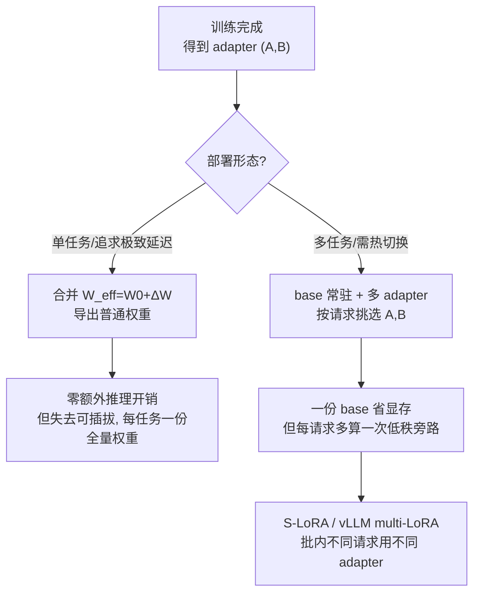

# LoRA 微调 · 进阶与生产实践

> 本文承接 `lora.py` 与 `手把手教学.md`：那两份讲清了 LoRA 的**机制骨架**（冻结主干 + 低秩可训练旁路 `W_eff = W0 + (alpha/r)·B@A` + 可合并）。
> 本文回答另一个问题——**把这套机制放到真实 7B/70B 模型与线上服务里，要补什么、怎么权衡、会踩什么坑**。
> 所有 benchmark 数字用定性或「约」表述，不编造精确值。术语保留英文。

---

## 0. 本项目 toy 与生产的差距

`lora.py` 是一个 CPU 上几秒跑完的「机制正确性 demo」：它把 LoRA 的数学和 PyTorch 实现讲对了，但为了可读性**故意省掉了所有工程复杂度**。下表是 toy 与生产的逐项对照——右列就是真实落地必须补的部分。

| 维度 | 本 toy（`lora.py`） | 生产必须做的 |
|---|---|---|
| 主干精度 | base 全 fp32，不量化 | 主干常 4-bit 量化（QLoRA / NF4），否则 65B 装不进单卡 |
| 注入范围 | 把**所有** `nn.Linear` 都换成 `LoRALinear` | 只注入 `target_modules`（q/k/v/o/gate/up/down），且通过名字正则匹配 |
| 旁路占比 | ~11%（只有 2 层，分母小） | <1%（深层 transformer，分母是几十~上百个大矩阵） |
| 框架 | 手写 `LoRALinear` + 手写 `inject_lora` | HuggingFace PEFT / `get_peft_model`，自动遍历、保存/加载 adapter |
| 数据规模 | 全 batch、人造高斯、CPU | mini-batch + 梯度累积、真实 instruction 数据、多 GPU / DeepSpeed ZeRO |
| 优化器 | 普通 Adam | paged AdamW（QLoRA）、bf16/fp16 混合精度、gradient checkpointing |
| dropout / 正则 | 无 | LoRA 在旁路上加 dropout（`lora_dropout`），防过拟合小数据集 |
| 多任务 | 单 adapter，训完即评 | 一个 base + N 个 adapter，运行时按请求切换（S-LoRA / 多租户服务） |
| 合并 | `merged_weight()` 验证数值等价即止 | 决定「合并部署（零开销但失去可插拔）」还是「不合并（可热切换）」 |
| 保存 | 不落盘 | 只存 adapter（几 MB ~ 几百 MB），不存全量权重；可与 base 解耦分发 |
| 稳定性 | 单跑、固定 seed | 量化误差、NaN、rank 选择、alpha 调参、loss spike 监控 |

一句话：**toy 证明了「低秩旁路能逼近全量」这一原理；生产则在「把巨大主干塞进显存 + 高效训 + 多 adapter 服务化 + 不丢精度」上做了大量工程**。下文逐层展开。

---

## 1. 业界系统怎么做

### 1.1 训练侧：HuggingFace PEFT 是事实标准

真实工程几乎不会手写 `inject_lora`，而是用 PEFT。它做的事和 toy 同构，但工程化：

```python
from peft import LoraConfig, get_peft_model
cfg = LoraConfig(
    r=16, lora_alpha=32, lora_dropout=0.05,
    target_modules=["q_proj", "k_proj", "v_proj", "o_proj"],  # 只注入注意力投影
    task_type="CAUSAL_LM",
)
model = get_peft_model(base_model, cfg)   # 自动遍历、冻结主干、挂上 A/B
model.print_trainable_parameters()        # 典型输出 trainable ~0.1%-1%
```

对照 toy：`LoraConfig.r/lora_alpha` 就是 toy 的 `r/alpha`；`get_peft_model` 就是 `inject_lora` 的工业版（差别在于它按 `target_modules` 正则匹配，而 toy 是无脑全注入）；A 的 `kaiming_uniform_(a=sqrt(5))` 初始化、B 置零，toy 与 PEFT **完全一致**（toy 注释也明说了「与 PEFT 实现一致」）。

### 1.2 推理侧：合并 vs 多 adapter 服务



- **合并部署**：调用 `merged_weight()`（toy 已实现并验证数值等价），把 ΔW 焊回主干，得到一个标准模型。优点是推理路径和原模型完全一样、零额外开销；缺点是失去「一份 base 配多 adapter」的弹性，且每个任务都要存一份全量权重。
- **不合并 / 多 adapter 服务**：base 权重只存一份常驻显存，每个请求带上自己的 adapter id，前向时额外算一次 `(x@A)@B*scaling`。代表系统是 **S-LoRA** 和 vLLM 的 multi-LoRA：它们能在**同一个 batch 里**让不同请求用不同 adapter，把成百上千个 adapter 服务在一张卡上。

### 1.3 主流 LoRA 全家桶定位

| 系统/变体 | 解决什么 | 一句话 |
|---|---|---|
| LoRA（原始） | 全量微调太贵 | 冻结主干 + 低秩旁路 |
| QLoRA | 大模型连「装载」都装不下 | 主干 4-bit NF4 + LoRA 在其上训 |
| DoRA | LoRA 与全量微调的方向/幅度差异 | 把权重拆成幅度+方向分别更新 |
| rsLoRA | 高 rank 时 scaling 不稳 | 把 `alpha/r` 改成 `alpha/√r` |
| PEFT | 手写注入太繁琐 | 统一 API + 多方法 + adapter 存取 |
| S-LoRA / vLLM-LoRA | 多 adapter 在线服务 | 一份 base 服务海量 adapter |

---

## 2. 关键变体与优化

### 2.1 QLoRA：NF4 + 双量化 + paged optimizer

QLoRA（arXiv:2305.14314）回答的是「**单卡微调 65B**」这个 toy 完全碰不到的问题。它叠了三个互相独立的招：

1. **4-bit NormalFloat（NF4）量化主干**。toy 的 base 是 fp32（每参数 4 字节）；QLoRA 把**冻结的主干**量化到 4-bit（每参数 0.5 字节，约 8 倍压缩）。NF4 是为「正态分布的权重」量身设计的非均匀量化数据类型——它假设权重近似 N(0,σ)，把量化级别按正态分位点排布，使每个 bucket 落进的权重数量大致均等，信息论上比普通 int4 更优。**关键洞察**：主干只做前向（被冻结），量化误差不会在反传里累积；可训练的 A/B 仍是高精度（bf16），梯度照常精确。
2. **Double Quantization（双量化）**。量化要存「每个 block 的缩放常数（quantization constant）」，这些常数本身也占显存。双量化把这些常数**再量化一次**，平均每参数再省约 0.4 bit。
3. **Paged Optimizer**。训练时偶发的显存尖峰（如长序列）会 OOM。paged AdamW 借用 NVIDIA unified memory，在显存吃紧时把优化器状态**临时换出到 CPU**，像操作系统的内存分页一样，避免硬 OOM。

数据流（对照 toy 的 `forward`）：

```
toy:   y = x @ W0^T            + (x@A^T)@B^T * scaling     # W0 是 fp32
QLoRA: y = x @ dequant(W0_nf4) + (x@A^T)@B^T * scaling     # W0 是 4-bit, 前向时反量化
```

代价：每次前向都要把 NF4 反量化回 bf16 算矩阵乘，**计算变多、吞吐变低**（典型比 16-bit LoRA 慢，定性上「省显存换时间」）。所以 QLoRA 是「显存受限」场景的解法，不是「追求最快」的解法。

### 2.2 DoRA：Weight-Decomposed LoRA

DoRA 想修补 LoRA 的一个经验观察：LoRA 学到的更新，其「幅度（magnitude）」和「方向（direction）」的变化模式，与全量微调不太一样，导致某些任务上 LoRA 略逊于 full。

做法：把权重列向量分解为 **幅度 m（标量/向量）× 方向 V（单位向量）**：`W = m · V/||V||`。微调时
- 方向 V 用 LoRA 低秩更新（`V + ΔV`，ΔV = B@A）；
- 幅度 m 单独作为可训练参数。

直觉：分离「转多大角度」与「拉多长」，让低秩旁路只负责方向、把幅度交给一个独立旋钮，更贴近全量微调的更新结构。代价是多了幅度参数和一点点计算，但参数量增加很小，在不少任务上精度优于同 rank 的 LoRA。

### 2.3 rsLoRA：rank-stabilized scaling

toy 的 scaling 是 `alpha/r`（demo 里 8/4=2.0）。`手把手教学.md` 2.2 节解释了这个除以 r 是为了「解耦 rank 与更新幅度」。但**当 r 很大时**（如 r=64/128），`alpha/r` 会把旁路压得过小，梯度信号变弱，高 rank 反而学不动——这违背直觉。

rsLoRA 的修正：把缩放从 `alpha/r` 改成 **`alpha/√r`**。理论分析表明 `√r` 才能在不同 rank 下保持旁路输出的方差稳定，于是高 rank 真正发挥容量。这是一行代码的改动，但让「调大 r」变成有意义的旋钮。toy 里 r 只到 4，看不出区别；生产里要扫 rank 时这个修正很重要。

### 2.4 S-LoRA：多适配器在线服务

toy 训完一个 adapter 就评估结束，从不考虑「同时服务很多 adapter」。S-LoRA 把 LoRA 推到**服务化**：

- **Unified Paging**：把 base 的 KV cache 和成百上千个 adapter 的 A/B 矩阵放进一个统一的分页内存池，动态换入换出，避免显存碎片。
- **Heterogeneous batching / 自定义 CUDA kernel**：一个 batch 里不同请求用不同 adapter，普通 BMM 没法高效处理「每行权重不同」，S-LoRA 写了专门的 kernel（如 SGMV）把这些异构低秩乘法批起来。
- 效果：一张 GPU 上可服务**数千个 adapter**，相比「每个 adapter 合并成一个全量模型分别部署」省下大量显存与切换成本。

对照 toy：toy 的 `forward` 是「一份 A、一份 B」；S-LoRA 是「一份 base + 一堆 (A_i, B_i)，运行时按请求 i 路由」——本质还是 `base_out + (x@A_i)@B_i*scaling`，只是 i 在 batch 维度上变化。

---

## 3. 真实工程权衡与坑

### 3.1 显存：省在哪、没省在哪

LoRA 省的是**优化器状态 + 梯度**，不是激活值。`手把手教学.md` 1 节算过：Adam 全量微调要存「参数 + 梯度 + 一阶矩 m + 二阶矩 v」约 4 份。LoRA 让其中「梯度 + m + v」只针对极少的 A/B，于是这部分几乎归零。

但要注意**没省的**：
- **主干参数本身**仍要装载（这正是 QLoRA 要量化主干的原因）。
- **激活值（activations）** 该多少还是多少——LoRA 不减少前向激活，长序列/大 batch 仍可能 OOM。要省激活得叠 **gradient checkpointing**（用重算换显存）。
- **base 前向**照样要算（toy 的 `base_out = self.base(x)` 占大头计算）。LoRA 省的是「训练显存」，不太省「前向计算量」。

### 3.2 吞吐与延迟

- **训练吞吐**：LoRA 比全量微调略快（少算大量梯度），但主干前向仍是大头，提速没有「参数省到 1%」那么夸张。QLoRA 因反量化开销，吞吐反而比 16-bit LoRA 低。
- **推理延迟**：不合并时每层多一次低秩旁路（`(x@A)@B`），rank 小则开销小但非零；合并后（toy 的 `merged_weight`）**零额外延迟**。多 adapter 服务下，旁路开销 × adapter 数量 + 路由开销都要算进延迟预算。

### 3.3 精度与稳定性坑

1. **`target_modules` 选错**：toy 全注入，生产只注入 q/v 是经典起点；只注入太少（如漏掉 `o_proj`/MLP）会欠拟合，全注入又增参数。需要按任务实验。
2. **rank 太小欠拟合 / 太大过拟合**：toy 的 r=4 在低秩漂移任务上够用；真实任务 r 常取 8~64。r 太大且小数据时会过拟合，需配 `lora_dropout`。
3. **alpha/r 调参**：经验上 `alpha = 2r` 是常见默认（toy 是 alpha=8,r=4 即 2 倍）。改 r 别忘了 scaling 跟着变（`手把手教学.md` 坑 #3 已警告）。高 rank 想稳定就上 rsLoRA。
4. **QLoRA 量化误差导致 loss 不降 / NaN**：4-bit 主干在某些层（尤其 LayerNorm、embedding、lm_head）不该量化；这些通常保持高精度。量化配置错会引发训练不稳。
5. **B 必须置零起步**：toy 2.3 节与坑 #5/#6 强调过——B 非零则训练起点偏离 base 不稳；A、B 都零则梯度全死。生产同理。
6. **合并回 4-bit 主干会掉精度**：QLoRA 训完想合并部署时，若把 bf16 的 ΔW 加到「反量化又重量化」的主干上，会引入额外误差；通常做法是合并到**反量化后的 16-bit 主干**再部署，或干脆不合并。
7. **多 adapter 服务的尾延迟**：冷 adapter 换入显存（page-in）会造成偶发延迟尖峰，需要缓存热 adapter。

### 3.4 通信（分布式）

LoRA 对多卡训练是利好：需要 all-reduce 的**梯度只剩 A/B 那一点点**，通信量相比全量微调大幅下降。这让 LoRA 在带宽受限的多机环境下扩展性更好。但主干参数仍需在各卡有副本（或被 ZeRO/张量并行切分），LoRA 不改变主干的切分策略。

---

## 4. 性能直觉与估算

### 4.1 可训练参数量（toy 公式直接放大）

单层旁路参数：`r·(d_in + d_out)`（toy 的 `count_params` 统计的就是它）。

对一个 L 层 transformer、hidden=d、每层注入 n 个方阵投影（d×d）：
```
LoRA 可训练参数 ≈ L · n · r · 2d
全量参数        ≈ L · n · d²  (+ MLP 等)
可训练占比      ≈ 2r / d
```
代入直觉：d=4096、r=16 → 占比 ≈ 2·16/4096 ≈ **0.78%**。这就是为什么真实模型能到 <1%，而 toy（d=256、r=4 → 2·4/256≈3%，且只 2 层分母小）显示 ~11%。**结论一致，数字尺度不同**——`手把手教学.md` 反复提醒的这点，用这个公式就能定量解释。

### 4.2 训练显存量级（为什么 LoRA + QLoRA 能单卡）

用 P = 模型参数量。粗略量级（bytes）：

| 方案 | 主干装载 | 梯度+优化器(Adam) | 量级直觉 |
|---|---|---|---|
| 全量 fp16 + Adam | 2P | ≈ 14P（grad 2P + m/v fp32 各 4P + 主参 fp32 4P）| ~16P，7B 需上百 GB |
| LoRA（16-bit 主干） | 2P | 只针对 A/B（≈0），≈ ε | ~2P + 激活 |
| QLoRA（4-bit 主干） | 0.5P | A/B 的 ≈ ε | ~0.5P + 激活 |

所以 65B 全量微调要几百 GB（多机），而 QLoRA 把主干压到约 0.5P ≈ 30+ GB，**单张 48GB 卡可塞下**——这是 QLoRA 的标志性卖点。注意上表只算了权重与优化器，**激活值另计**，长序列时仍可能成为瓶颈（用 checkpointing 缓解）。

### 4.3 adapter 文件大小

adapter 只存 A/B（toy 的 2336 个数）。真实 7B、r=16、注入 q/v：约几千万参数 × 2 bytes ≈ **几十 MB**。这就是「一个 base 配几百个几十 MB 的 adapter」在存储和分发上的巨大优势——对照「每任务存一份 14GB 全量权重」。

### 4.4 多 adapter 服务的旁路开销

每层每请求旁路额外 FLOPs ≈ `2·batch·seq·r·2d`，相对主干每层 `2·batch·seq·d²`，比值 ≈ `2r/d`（同 4.1）。r=16、d=4096 → 旁路只增约 0.8% 计算。**所以多 adapter 服务的瓶颈通常不是算力，而是显存管理与 kernel 调度**（S-LoRA 主攻的正是后两者）。

---

## 5. 动手进阶路线

把本 toy 升级到接近生产，建议分 5 步，每步只引入一个新复杂度：

1. **换真实 base + PEFT 接管注入**。把 `MLP` 换成 HuggingFace 上的小 LLM（如 GPT-2 / TinyLlama），用 `get_peft_model(LoraConfig(...))` 替代手写 `inject_lora`，但保留你对 toy `LoRALinear` 的理解去读 PEFT 源码——你会发现一一对应。方向：先验证 `print_trainable_parameters()` 落到 <1%。

2. **加 `target_modules` 与 dropout，做 rank/alpha 扫描**。只注入 `q_proj,v_proj`，对比全注入；扫 r∈{4,8,16,32}、alpha∈{r,2r}，画出「参数量 vs 验证精度」曲线，亲手复现 4.1 的占比公式。方向：理解「注入哪些层、多大 rank」的取舍，而非默认值。

3. **上 QLoRA**。用 `bitsandbytes` 4-bit 加载主干（`load_in_4bit`, `bnb_4bit_quant_type="nf4"`, 双量化开启），优化器用 `paged_adamw_8bit`。对照 toy 的 fp32 base，观察显存从「装不下」到「单卡能训」。方向：亲眼看 NF4 + 双量化 + paged optimizer 三件套的显存账。

4. **实现合并与两种部署**。复用 toy 的 `merged_weight` 思路调 PEFT 的 `merge_and_unload()` 导出普通模型测延迟；再用 vLLM 的 multi-LoRA 加载多个 adapter 不合并服务，对比延迟与显存。方向：理解「合并零开销但失弹性 vs 不合并可热切换」这条 §1.2 的主轴。

5. **跑一个变体并量化收益**。挑 DoRA(`use_dora=True`) 或 rsLoRA(`use_rslora=True`)，在同一数据上对比同 rank 的 vanilla LoRA 的验证精度/loss 曲线。方向：把 §2 的「变体解决什么问题」从文字变成你自己的曲线，知道何时值得用。

---

## 6. 延伸阅读

### 本仓库已有深度文档（相对路径）

- LoRA / QLoRA 原理深讲：[`../../llm-train/peft/LoRA-QLoRA.md`](../../llm-train/peft/LoRA-QLoRA.md)
- PEFT 总览与 API：[`../../llm-train/peft`](../../llm-train/peft) · [`../../llm-train/peft/PEFT-API.md`](../../llm-train/peft/PEFT-API.md)
- 工程化 LoRA / QLoRA 微调实战：[`../../llm-train/alpaca-lora`](../../llm-train/alpaca-lora) · [`../../llm-train/qlora`](../../llm-train/qlora) · [`../../llm-train/chatglm-lora`](../../llm-train/chatglm-lora)
- 推理与部署（多 adapter 服务背景）：[`../../llm-inference`](../../llm-inference)
- 本项目机制与逐行讲解：[`手把手教学.md`](./手把手教学.md) · [`README.md`](./README.md) · [`lora.py`](./lora.py)

### 经典论文与社区

- [LoRA arXiv:2106.09685](https://arxiv.org/abs/2106.09685) —— 低秩适配原始论文。
- [QLoRA arXiv:2305.14314](https://arxiv.org/abs/2305.14314) —— NF4 + 双量化 + paged optimizer。
- [DoRA arXiv:2402.09353](https://arxiv.org/abs/2402.09353) —— 权重分解的 LoRA。
- [rsLoRA arXiv:2312.03732](https://arxiv.org/abs/2312.03732) —— rank-stabilized scaling（`alpha/√r`）。
- [S-LoRA arXiv:2311.03285](https://arxiv.org/abs/2311.03285) —— 多 adapter 可扩展服务。
- [HuggingFace PEFT](https://github.com/huggingface/peft) —— 工业级实现；A 的初始化与本 toy 一致。
- [bitsandbytes](https://github.com/bitsandbytes-foundation/bitsandbytes) —— 4-bit/8-bit 量化与 paged optimizer 后端。

> 收尾：toy 教你「LoRA 为什么对」，本文教你「生产为什么要那么做」。把 §0 的对照表、§4 的估算公式、§2 的变体动机吃透，你就能在面试里从 `B@A` 一路讲到 QLoRA 单卡微调和 S-LoRA 多租户服务的架构判断。
