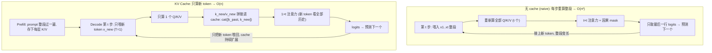

# 从零实现 KV Cache 推理加速 —— 手把手教学

> 一句话导览：本篇带你逐行读懂 `kv_cache.py`，亲手搭起一个 toy GPT，并把"自回归生成为什么慢、KV Cache 凭什么快"彻底讲透。学完你能掌握：
>
> 1. 自回归(autoregressive)生成中**重复计算**到底重复在哪，为什么朴素做法是 $O(n^2)$。
> 2. KV Cache 的核心洞察——**因果性 → 历史 K/V 不变 → 可缓存复用**，把 decode 阶段降到 $O(n)$。
> 3. 为什么"有 cache"和"无 cache"两条路径在**数学上严格等价**，必须逐 token 输出相同。
> 4. 加速比为什么**随序列变长而增大**，以及它和真实 LLM 服务(vLLM / TGI)的关系。
> 5. 看懂脚本每一行打印的数字含义，并能动手改超参验证你的理解。

---

## 0. 前置知识与环境

**你需要会一点点：**

- Python 基础(函数、类、`for` 循环)。
- 知道 PyTorch 的张量(tensor)是个多维数组,会看 `(B, T, C)` 这样的形状注释就够了。
- 听说过 Transformer / 注意力(attention)。**没系统学过也没关系**,本文第 2 节会把用到的部分讲清楚。

**不需要会:** 训练、数据集、GPU。本项目的模型是**随机初始化、不训练**的——我们只验证"两条推理路径等价 + 加速",不关心生成内容是否有意义。

**装环境(CPU 即可):**

```bash
pip install numpy torch
# 可选:想看加速比曲线图就再装 matplotlib(没装也不会崩)
pip install matplotlib
```

**跑起来:**

```bash
cd practical-projects/04-kv-cache
python kv_cache.py
```

整个脚本在 CPU 上几十秒内跑完,**无需联网、无需数据**。

---

## 1. 问题背景:不用 KV Cache 会怎样

大模型生成文本是**一个 token 一个 token 往外蹦**的过程,这叫**自回归(autoregressive)生成**:把"已经有的序列"喂进模型 → 模型预测下一个 token → 把它接到序列末尾 → 再喂回去预测下一个……如此循环。

来看朴素(naive)做法的痛点。假设 prompt 有 4 个 token,我们要再生成 8 个:

| 第几步 | 喂进模型的序列长度 | 这一步要算多少个 token 的 Q/K/V |
|:------:|:------:|:------:|
| 1 | 5 | 5 |
| 2 | 6 | 6 |
| 3 | 7 | 7 |
| … | … | … |
| 8 | 12 | 12 |

每生成一个新 token,都把"到目前为止的整段序列"**重新从头喂一遍**,把所有 token 的 Q/K/V 与注意力**全部重算**。第 $t$ 步要算 $t$ 个 token,生成 $n$ 个 token 的总计算量是:

$$1 + 2 + 3 + \cdots + n = \frac{n(n+1)}{2} \approx O(n^2)$$

**痛点很直观:** 前面那些 token,我上一步明明已经算过它们的 K/V 了,这一步又把它们重算了一遍——纯粹的浪费。序列越长,浪费越严重。真实场景里上下文动辄几千上万 token,$O(n^2)$ 会让生成慢到不可接受。

那能不能"算过的就别再算了"?能。这就是 KV Cache。

---

## 2. 核心原理详解

### 2.1 关键洞察:因果性 → 历史 K/V 不变

decoder-only 的 Transformer 用的是**因果注意力(causal self-attention)**:位置 $i$ 的 token **只能看到 $\le i$ 的位置**,看不到未来。

现在盯住注意力的三个量 Query / Key / Value。对位置 $j$ 的 token,它的 $K_j, V_j$ 只由"位置 $j$ 自己的输入"决定,**不依赖任何排在它后面的 token**。所以:

> **当我在序列末尾追加一个新 token 时,前面所有历史 token 的 $K, V$ 完全不变。**

既然不变,何必重算?把它们**缓存(cache)**起来,下一步直接拿来用——这就是 KV Cache 的全部精髓。

### 2.2 一步注意力的数学

注意力的计算(单个头,head 维度 $d$)是:

$$\text{Attention}(Q, K, V) = \mathrm{softmax}\!\left(\frac{Q K^\top}{\sqrt{d}}\right) V$$

代码里对应这一行(`head_dim` 就是 $d$):

```python
att = (q @ k.transpose(-2, -1)) / math.sqrt(self.head_dim)
```

**无 cache 路径**:每步把整段 $X = [x_1, \dots, x_t]$ 喂进去,算出全部 $Q, K, V \in \mathbb{R}^{t \times d}$,做 $t \times t$ 的注意力,加因果 mask,但**只取最后一行**(位置 $t$ 的输出)来预测下一个 token——前 $t-1$ 行的输出这一步根本用不上,白算了。

**有 cache 路径**:只对新 token 算 $q_{\text{new}}, k_{\text{new}}, v_{\text{new}} \in \mathbb{R}^{1 \times d}$,然后

$$K = [\,K_{\text{past}};\, k_{\text{new}}\,], \qquad V = [\,V_{\text{past}};\, v_{\text{new}}\,]$$

(把新的拼到历史后面),再做一次 $1 \times t$ 的注意力:

$$y_{\text{new}} = \mathrm{softmax}\!\left(\frac{q_{\text{new}} K^\top}{\sqrt{d}}\right) V$$

**结果和无 cache 的"最后一行"逐位相同**——因为算的本来就是同一个东西,只是无 cache 把不需要的前 $t-1$ 行也算了。这就是两条路径**数学等价**的根源。

### 2.3 复杂度:$O(n^2) \to O(n)$

- 无 cache:每步算的 token 数 $= 1, 2, \dots, n$,总和 $\approx O(n^2)$。
- 有 cache:每步只算 **1 个**新 token 的 Q/K/V,总和 $= n$,即 $O(n)$。

注意力打分本身仍是"新 token 对全部历史"的 $1 \times t$,但**省掉的是对历史 token 重新计算 Q/K/V 和它们之间注意力**那块二次开销。所以序列越长,省得越多,**加速比随长度增大**。

### 2.4 一张图看懂两条路径



记住两个真实系统术语:**Prefill**(把 prompt 整段过一遍、建立初始 cache)和 **Decode**(之后每步只喂 1 个新 token)。代码里 `generate_with_cache` 就是严格按这两阶段写的。

---

## 3. 代码逐段精讲

下面按逻辑把 `kv_cache.py` 拆成 6 段。建议对照原文件一起看。

### 3.1 复现性设置:让数字可复现

```python
SEED = 0
torch.manual_seed(SEED)
np.random.seed(SEED)
torch.set_num_threads(1)  # 单线程,让计时更稳定、更能反映算法复杂度差异
```

- `torch.manual_seed(SEED)` / `np.random.seed(SEED)`:固定随机种子。模型权重是随机初始化的,固定种子后**每次运行权重一样**,生成的 token 序列、断言结果都可复现。
- `torch.set_num_threads(1)`:强制单线程。**这是计时的关键**——多线程会让 CPU 并行度干扰计时,单线程下"算多少 token"几乎线性反映到"花多少时间",这样 $O(n^2)$ 和 $O(n)$ 的差异才看得清。

> 新手易困惑点:为什么要单线程?难道不是越多线程越快吗?这里我们**不是要它跑得最快,而是要它跑得"诚实"**——让时间真实反映计算量,从而验证复杂度结论。

### 3.2 因果自注意力层 `CausalSelfAttention` —— 全篇的心脏

这是整个 KV Cache 逻辑发生的地方。先看构造:

```python
class CausalSelfAttention(nn.Module):
    def __init__(self, n_embd, n_head):
        super().__init__()
        assert n_embd % n_head == 0
        self.n_head = n_head
        self.head_dim = n_embd // n_head
        self.qkv = nn.Linear(n_embd, 3 * n_embd)   # 一次性投影出 Q、K、V
        self.proj = nn.Linear(n_embd, n_embd)
```

- `n_embd` 是嵌入维度,`n_head` 是注意力头数,`head_dim = n_embd // n_head` 是每个头的维度。`assert n_embd % n_head == 0` 保证能整除。
- `self.qkv` 用**一个** `Linear` 同时把输入投影成 Q、K、V 三份(所以输出维度是 `3 * n_embd`)。这是 GPT 常见写法,比分三个 Linear 更高效。
- `self.proj` 是注意力输出后的投影,把多头结果重新混合回 `n_embd` 维。

辅助函数把维度拆成多头:

```python
def _split_heads(self, t):
    # (B, T, n_embd) -> (B, n_head, T, head_dim)
    B, T, C = t.shape
    return t.view(B, T, self.n_head, self.head_dim).transpose(1, 2)
```

把 `(B, T, n_embd)` 重排成 `(B, n_head, T, head_dim)`,这样每个头能独立做注意力。`B` 是 batch,`T` 是序列长度。

**核心 `forward`:**

```python
def forward(self, x, kv_cache=None):
    B, T, C = x.shape
    q, k, v = self.qkv(x).split(C, dim=2)          # 各 (B, T, C)
    q = self._split_heads(q)                        # (B, nh, T, hd)
    k = self._split_heads(k)
    v = self._split_heads(v)
```

- `x` 的形状:**无 cache 时 `T` = 整段长度;有 cache 时 `T = 1`(只传新 token)**。这一个参数把两条路径统一进了同一个函数,非常巧妙。
- `self.qkv(x).split(C, dim=2)`:一次投影后,沿最后一维切成三块,得到 Q、K、V,每块 `(B, T, C)`。

接下来是**整篇最关键的几行**——KV Cache 的拼接:

```python
    if kv_cache is not None:
        # ---- KV Cache 的关键一步 ----
        k_past, v_past = kv_cache
        k = torch.cat([k_past, k], dim=2)           # 沿时间维拼接
        v = torch.cat([v_past, v], dim=2)
    new_kv_cache = (k, v)                            # 更新后的 cache 交回上层
```

- 如果传入了 `kv_cache`(decode 阶段),取出历史 `k_past, v_past`,把这一步新 token 的 `k, v` **沿时间维(`dim=2`)拼到历史后面**。这就是"复用历史、只追加新的"——省下重复计算的地方。
- `new_kv_cache = (k, v)`:把扩展后的 cache 返回上层,供下一步继续用。
- 注意:`q` **不缓存**!因为下一步用的是下一个 token 的全新 Q,旧 Q 没用。**只缓存 K 和 V**——名字"KV Cache"由此而来。

> 新手易困惑点:为什么只 cache K/V 不 cache Q?因为注意力是"用**当前** Q 去查询**所有历史** K/V"。Q 是每步都换的(查询者),K/V 是被查询的历史库,可以累积。

然后是注意力打分 + 因果 mask:

```python
    att = (q @ k.transpose(-2, -1)) / math.sqrt(self.head_dim)  # (B,nh,Tq,Tk)

    Tq, Tk = att.shape[-2], att.shape[-1]
    if kv_cache is None:
        # 无 cache:Tq == Tk == 整段长度,用标准下三角 mask。
        mask = torch.tril(torch.ones(Tq, Tk, dtype=torch.bool))
        att = att.masked_fill(~mask, float("-inf"))
    else:
        # 有 cache:Tq == 1(新 token),它在序列末尾,能看到所有 Tk 个历史
        pass

    att = F.softmax(att, dim=-1)
    y = att @ v                                     # (B, nh, Tq, hd)
    y = y.transpose(1, 2).contiguous().view(B, Tq, C)  # 合并多头
    return self.proj(y), new_kv_cache
```

- `att = (q @ k.transpose(-2, -1)) / sqrt(head_dim)`:就是公式 $\frac{QK^\top}{\sqrt{d}}$。形状 `(B, nh, Tq, Tk)`,`Tq` 是 query 数,`Tk` 是 key 数。
- **无 cache 分支**:`Tq == Tk ==` 整段长度,用 `torch.tril`(下三角)造因果 mask,把"看未来"的位置填 `-inf`,softmax 后变 0。
- **有 cache 分支**:`Tq == 1`(只有新 token 一个 query),它在序列**最末尾**,本来就该看到**全部** `Tk` 个历史(含自己),所以**根本不需要 mask**,直接 `pass`。这正体现了"只算新 token 对全部历史的注意力"。
- `F.softmax` → `att @ v` → `transpose/view` 合并多头 → `self.proj`:标准注意力收尾,返回输出和更新后的 cache。

> 新手易困惑点:有 cache 时为什么不用 mask 就对了?因为新 token 是序列里"最新、最靠后"的位置,因果约束(只看 $\le$ 自己)对它来说就是"看全部历史",天然满足,无需额外屏蔽。

### 3.3 Transformer Block:注意力 + 前馈

```python
class Block(nn.Module):
    def __init__(self, n_embd, n_head):
        super().__init__()
        self.ln1 = nn.LayerNorm(n_embd)
        self.attn = CausalSelfAttention(n_embd, n_head)
        self.ln2 = nn.LayerNorm(n_embd)
        self.mlp = nn.Sequential(
            nn.Linear(n_embd, 4 * n_embd),
            nn.GELU(),
            nn.Linear(4 * n_embd, n_embd),
        )

    def forward(self, x, kv_cache=None):
        attn_out, new_kv = self.attn(self.ln1(x), kv_cache=kv_cache)
        x = x + attn_out
        x = x + self.mlp(self.ln2(x))
        return x, new_kv
```

- 标准 **pre-norm** 结构:先 `LayerNorm` 再进子层,子层结果用残差(`x = x + ...`)加回。
- `mlp` 是经典的"扩 4 倍 → GELU → 缩回"前馈网络(`4 * n_embd` 是 Transformer 惯例)。
- **为什么 KV Cache 能等价,这里藏着另一半原因**:代码注释点明了——`LayerNorm` 和 `MLP` 都是**逐 token(per-token)**的运算,对"单个新 token"算 和 对"整段"算,**对应位置的结果完全一致**。它们不像注意力那样跨 token 混合,所以只喂新 token 不会出错。注意力那一半的等价性在 3.2 已讲。

### 3.4 TinyGPT:两套前向接口

```python
class TinyGPT(nn.Module):
    def __init__(self, vocab_size, block_size, n_embd, n_head, n_layer):
        super().__init__()
        self.block_size = block_size
        self.tok_emb = nn.Embedding(vocab_size, n_embd)   # token 嵌入
        self.pos_emb = nn.Embedding(block_size, n_embd)   # 位置嵌入(绝对位置)
        self.blocks = nn.ModuleList([Block(n_embd, n_head) for _ in range(n_layer)])
        self.ln_f = nn.LayerNorm(n_embd)
        self.head = nn.Linear(n_embd, vocab_size, bias=False)
```

- `tok_emb`:把 token id 查表成向量。`pos_emb`:**绝对位置嵌入**,把位置下标也查表成向量,二者相加。
- `blocks`:`n_layer` 个 `Block` 堆叠。`ln_f`:最后的 LayerNorm。`head`:把 `n_embd` 投回 `vocab_size`,得到每个词的 logits。

**路径 (a) 无 cache 前向:**

```python
def forward_full(self, idx):
    B, T = idx.shape
    pos = torch.arange(T)
    x = self.tok_emb(idx) + self.pos_emb(pos)         # (B, T, n_embd)
    for blk in self.blocks:
        x, _ = blk(x, kv_cache=None)                  # 丢弃 cache
    x = self.ln_f(x)
    logits = self.head(x)                             # (B, T, vocab)
    return logits[:, -1, :]                           # 只要最后一步的预测
```

- 喂整段 `idx`,位置是 `0..T-1`。
- 每个 block 都传 `kv_cache=None`(走无 cache 分支),返回的 cache 用 `_` **直接丢弃**——朴素做法不存历史。
- `return logits[:, -1, :]`:**只取最后一个位置**的 logits 来预测下一个 token。前面位置的 logits 全部白算了——这正是浪费所在。

**路径 (b) 有 cache 单步前向:**

```python
def forward_step(self, idx_new, caches, pos_offset):
    B, T = idx_new.shape  # T == 1
    pos = torch.arange(pos_offset, pos_offset + T)
    x = self.tok_emb(idx_new) + self.pos_emb(pos)     # 只嵌入这 1 个 token
    new_caches = []
    for blk, cache in zip(self.blocks, caches):
        x, new_kv = blk(x, kv_cache=cache)            # 复用历史 K/V
        new_caches.append(new_kv)
    x = self.ln_f(x)
    logits = self.head(x)                             # (B, 1, vocab)
    return logits[:, -1, :], new_caches
```

- `idx_new` 只有 1 个 token(`T == 1`)。
- `pos_offset` 是这个新 token 的**绝对位置下标**(= 已生成长度)。**这点至关重要**:因为用的是绝对位置嵌入,必须给新 token 配对它真实位置的 `pos_emb`,否则结果会和无 cache 不一致。`pos = torch.arange(pos_offset, pos_offset + T)` 就是取这个正确位置。
- 每层把对应的 `cache` 传进去(走有 cache 分支,复用 K/V),收集 `new_kv` 进 `new_caches`,返回新 cache 列表。

> 新手易困惑点:`pos_offset` 为什么不能省?如果你给新 token 一直用位置 0,它的位置嵌入就错了,生成的 token 会和无 cache 路径不一样,最后的 `assert match` 会失败。位置编码必须对齐——这是 KV Cache 实现里最常见的 bug 来源。

### 3.5 两个生成函数:naive vs cache

**无 cache 生成(每步整段重算):**

```python
@torch.no_grad()
def generate_no_cache(model, prompt, n_new):
    idx = prompt.clone()
    for _ in range(n_new):
        idx_cond = idx[:, -model.block_size:]            # 截断到上下文窗口
        logits = model.forward_full(idx_cond)            # 整段重算
        next_id = torch.argmax(logits, dim=-1, keepdim=True)
        idx = torch.cat([idx, next_id], dim=1)
    return idx
```

- `@torch.no_grad()`:推理不需要梯度,关掉省内存省时间。
- 每步把当前整段 `idx`(截断到 `block_size` 防越界)整个喂进 `forward_full`,**重算一遍**。
- `torch.argmax(...)`:**贪心解码(greedy decode)**——永远取概率最高的那个 token。用贪心是为了让输出**确定**,这样两条路径才能逐 token 比较是否一致。

**有 cache 生成(prefill + decode):**

```python
@torch.no_grad()
def generate_with_cache(model, prompt, n_new):
    idx = prompt.clone()
    B, T0 = idx.shape

    # ---- Prefill 阶段:把 prompt 整段过一遍,建立初始 KV cache ----
    pos = torch.arange(T0)
    x = model.tok_emb(idx) + model.pos_emb(pos)
    caches = []
    for blk in model.blocks:
        x, new_kv = blk(x, kv_cache=None)
        caches.append(new_kv)                            # 保存 prompt 的 K/V
    x = model.ln_f(x)
    logits = model.head(x)[:, -1, :]
    next_id = torch.argmax(logits, dim=-1, keepdim=True)
    idx = torch.cat([idx, next_id], dim=1)

    # ---- Decode 阶段:每步只喂 1 个新 token,复用并扩展 cache ----
    for step in range(1, n_new):
        pos_offset = idx.shape[1] - 1                    # 新 token 的绝对位置
        logits, caches = model.forward_step(next_id, caches, pos_offset)
        next_id = torch.argmax(logits, dim=-1, keepdim=True)
        idx = torch.cat([idx, next_id], dim=1)
    return idx
```

- **Prefill**:prompt 整段过一遍。注意它仍传 `kv_cache=None`(整段算),但这次**把每层返回的 `new_kv` 存进 `caches`**——这就是 prompt 的初始 K/V。这一步是一次性的整段计算(真实系统也是这样)。然后用最后位置 logits 预测出第一个新 token。
- **Decode**:循环 `n_new - 1` 次(prefill 已产出 1 个),每次:
  - `pos_offset = idx.shape[1] - 1`:新 token 的绝对位置 = 当前序列长度 - 1。
  - `forward_step(next_id, caches, pos_offset)`:**只喂上一个新 token**,复用并扩展 cache。
  - 贪心取下一个,接到 `idx`。

> 新手易困惑点:为什么 decode 循环从 `range(1, n_new)` 开始?因为 prefill 末尾已经生成了第 1 个新 token,decode 只需再补 `n_new - 1` 个,凑齐总共 `n_new` 个。

### 3.6 主流程:计时、断言、复杂度直觉、画图

```python
def main():
    vocab_size = 64
    block_size = 256
    n_embd = 64
    n_head = 4
    n_layer = 4
    model = TinyGPT(vocab_size, block_size, n_embd, n_head, n_layer).eval()
```

toy 超参:词表 64、上下文 256、嵌入维 64、4 个头、4 层。`.eval()` 切到推理模式。

```python
    prompt = torch.randint(0, vocab_size, (1, 4))
    lengths = [16, 32, 64, 128]
    speedups = []
    for n_new in lengths:
        out_no, t_no = timed(generate_no_cache, model, prompt, n_new)
        out_kv, t_kv = timed(generate_with_cache, model, prompt, n_new)
        match = torch.equal(out_no, out_kv)
        speedup = t_no / t_kv if t_kv > 0 else float("inf")
        speedups.append(speedup)
        ...
        assert match, f"MISMATCH at gen_len={n_new}! KV cache is not equivalent."
```

- 用同一个随机 prompt(4 个 token),在 4 个生成长度上分别跑两条路径。
- `timed(fn, *args)` 是个计时小工具(`time.perf_counter()` 前后差),返回 `(输出, 耗时)`。
- `torch.equal(out_no, out_kv)`:**逐 token 完全相等**才返回 `True`——这是正确性的硬校验。
- `speedup = t_no / t_kv`:加速比。
- `assert match`:一旦不一致立刻报错,说明实现有 bug(通常是位置编码或 mask 没对齐)。

最后的复杂度直觉打印,把"每步算多少 token"显式列出来:`no_cache` 是 `[1,2,...,8]` 求和 36($O(n^2)$),`with_cache` 是 `[1,1,...,1]` 求和 8($O(n)$)。还会(可选)用 matplotlib 画加速比曲线存成 `kv_cache_speedup.png`,**没装 matplotlib 也会优雅降级为文本,绝不崩**。

---

## 4. 跑起来 + 逐行读懂输出

运行:

```bash
python kv_cache.py
```

预期输出(真实跑通摘录,你机器上的绝对秒数会略有不同,但**趋势一致**):

```
================================================================
KV Cache demo: naive (recompute all) vs cached (compute new only)
================================================================
model: vocab=64 block=256 d=64 heads=4 layers=4 params=...

 gen_len |  no_cache(s) |   cache(s) |  speedup |  match
----------------------------------------------------------------
      16 |       0.0420 |     0.0268 |    1.57x |   True
      32 |       0.0663 |     0.0378 |    1.75x |   True
      64 |       0.1339 |     0.0661 |    2.03x |   True
     128 |       0.1868 |     0.0801 |    2.33x |   True
----------------------------------------------------------------
All sequences MATCH -> KV cache is mathematically equivalent. PASS

Complexity intuition (work = #tokens whose Q/K/V are computed):
  generating 8 tokens, no_cache attends to: [1, 2, 3, 4, 5, 6, 7, 8]  -> total 36 (O(n^2))
  generating 8 tokens, with_cache computes:  [1, 1, 1, 1, 1, 1, 1, 1]  -> total 8 (O(n))

speedup grows with length: ['1.57x', '1.75x', '2.03x', '2.33x']
max speedup observed: 2.33x at gen_len=128
================================================================
```

**逐条读懂每个数字:**

- `model: vocab=64 block=256 d=64 heads=4 layers=4 params=...`：模型规模一览。`params` 是参数总量(`sum(p.numel() for p in model.parameters())`),toy 级别很小。
- 表格 `no_cache(s)` / `cache(s)`:两条路径各自的**生成耗时(秒)**。看 `cache` 那列——128 长度只要约 0.08 秒,而 `no_cache` 要约 0.19 秒。
- `speedup`:`no_cache 时间 / cache 时间`。**重点看它随 gen_len 单调上升**:`1.57x → 1.75x → 2.03x → 2.33x`。
  - **为什么上升?** 序列越长,无 cache 的二次浪费越大,而 cache 始终是线性的,差距自然拉大。这就是 $O(n^2) \to O(n)$ 在时间上的体现。
- `match`:全是 `True`,代表两条路径**逐 token 输出完全相同**——KV Cache 没改变结果,只是更快。这是正确性证明。
- `All sequences MATCH -> ... PASS`:所有断言通过的总结。
- **Complexity intuition 那两行**:把"工作量 = 需要算 Q/K/V 的 token 数"摊开给你看。生成 8 个 token,无 cache 累计算了 `1+2+...+8 = 36` 个($O(n^2)$),有 cache 只算了 `1×8 = 8` 个($O(n)$)。**这是脱离计时噪声、最干净的复杂度证据。**
- `max speedup observed: 2.33x at gen_len=128`:本次最大加速比。

> 为什么 toy 模型加速比只有 2x 左右,而不是几十倍?因为模型太小,固定开销(嵌入、LayerNorm、Python 循环、张量创建)占比高,把"省下的注意力计算"稀释了。真实大模型规模下,注意力开销占主导,加速比可达数十倍——但**趋势(随长度增大)在 toy 上已清晰可见**。

---

## 5. 动手改造(练习)

由易到难,每个都建议先**预测结果**再跑验证。

**练习 1（最易):把生成长度加大。** 把 `main()` 里的 `lengths = [16, 32, 64, 128]` 改成 `[64, 128, 256, 512]`。
- 预期:加速比进一步上升(序列越长,二次浪费越大)。注意 `block_size=256`,无 cache 路径会被 `idx[:, -model.block_size:]` 截断,但 cache 路径不会截——这里可以观察到一个细微差异点(见练习 5)。

**练习 2（易):改模型规模,放大加速比。** 把 `n_layer = 4` 改成 `8`、`n_embd = 64` 改成 `128`。
- 预期:注意力计算占比上升,**同样长度下加速比变大**,更接近真实场景。代价是跑得更久。

**练习 3（中):换贪心为随机采样,体会"为什么用贪心"。** 把两个 `torch.argmax(...)` 换成基于 softmax 概率的采样(`torch.multinomial`)。
- 预期:`match` 很可能变 `False` 并触发 `assert`!**为什么?** 随机采样引入了随机性,两条路径在浮点细节上极小的差异会被采样放大成不同 token。这正说明:为了**可比较**,本项目必须用确定性的贪心解码。(想保留采样又对齐,需要两条路径共享同一随机状态——较难,可作为思考题。)

**练习 4（中):亲手制造一个 bug,看 assert 抓它。** 在 `forward_step` 里把 `pos = torch.arange(pos_offset, pos_offset + T)` 改成 `pos = torch.arange(0, T)`(让新 token 永远用位置 0)。
- 预期:`assert match` **立刻失败**。这直观证明了位置编码必须对齐——`pos_offset` 不是可有可无的。

**练习 5（难):验证"无 cache 截断"会破坏等价。** 当生成长度超过 `block_size` 时,`generate_no_cache` 会截断上下文,而 `generate_with_cache` 的 cache 不截。把 `block_size` 改小(如 `16`)、`lengths` 设到超过它(如 `[32]`)。
- 预期:超过窗口后两条路径"看到的历史"不同,`match` 可能变 `False`。思考:真实系统如何处理超长上下文(滑动窗口 / 丢弃旧 cache)?

---

## 6. 常见坑与排错

- **`assert match` 失败 / MISMATCH。** 最常见原因:位置编码没对齐(`pos_offset` 写错,见练习 4),或在 decode 分支误加了 mask。检查 `forward_step` 的 `pos` 和有 cache 分支的 mask 逻辑。
- **改成采样后报 MISMATCH。** 这不是 bug,是预期行为(见练习 3)。本项目靠**贪心解码**保证确定可比;采样请只在不需要对比时用。
- **加速比看起来 <1(cache 反而更慢)或波动大。** toy 模型太小,固定开销占主导,加速比本就偏小;首次跑还有 warmup。多跑几次取稳定值,或加大模型/长度(练习 2)放大差距。别忘了 `torch.set_num_threads(1)` 已设,别擅自改大,否则计时会被并行干扰。
- **`pip install torch` 慢或失败。** 用清华/阿里镜像:`pip install torch -i https://pypi.tuna.tsinghua.edu.cn/simple`。CPU 版即可,无需 CUDA。
- **没装 matplotlib 报错?** 不会。脚本用 `try/except` 包住画图,缺库只打印一行提示并继续,不影响主结论。
- **想用 GPU 跑。** 可以,但绝对秒数会变(GPU 并行度高、访存模式不同),且 toy 模型在 GPU 上启动开销可能盖过收益。**$O(n^2)\to O(n)$ 的趋势不变**,但教学建议就用 CPU 单线程,数字最"诚实"。

---

## 7. 一图速查 / 知识卡片

**核心对比表:**

| 维度 | 无 cache (naive) | KV Cache |
|---|---|---|
| 每步喂入 | 整段序列 (`T=t`) | 仅新 token (`T=1`) |
| 每步算 Q/K/V | $t$ 个 token | 1 个 token |
| 历史 K/V | 每步重算 | **缓存复用**(`torch.cat` 追加) |
| Decode 复杂度 | $1+2+\cdots+n \approx O(n^2)$ | $O(n)$ |
| 因果 mask | 需要下三角 mask | 新 token 在末尾,**无需 mask** |
| 缓存什么 | 不缓存 | **只缓存 K 和 V**(Q 每步全新) |
| 输出 | —— | 与 naive **逐 token 相同** |
| 加速比 | 基准 | 随序列长度**增大** |

**关键公式:**

- 注意力:$\mathrm{softmax}\!\left(\dfrac{QK^\top}{\sqrt{d}}\right)V$,代码 `head_dim` = $d$。
- 朴素总工作量:$\sum_{t=1}^{n} t = \dfrac{n(n+1)}{2} = O(n^2)$。
- KV Cache 总工作量:$\sum_{t=1}^{n} 1 = n = O(n)$。

**两条路径等价的两个支柱:**
1. 注意力:历史 K/V 因因果性不变 → 缓存复用结果不变。
2. LayerNorm / MLP:逐 token 运算 → 单算新 token 与整段算结果一致。

**关键函数地图:**

| 函数 / 类 | 作用 |
|---|---|
| `CausalSelfAttention.forward` | KV Cache 拼接(`torch.cat`)发生处 |
| `TinyGPT.forward_full` | 无 cache,整段重算 |
| `TinyGPT.forward_step` | 有 cache,只算新 token(需 `pos_offset`) |
| `generate_no_cache` | naive 生成循环,$O(n^2)$ |
| `generate_with_cache` | prefill + decode,$O(n)$ |

**toy 超参速记:** `vocab=64`、`block=256`、`d=64`、`heads=4`、`layers=4`、`lengths=[16,32,64,128]`、贪心解码、`seed=0`、单线程。

---

## 8. 延伸阅读

**本仓库相关文档(相对路径):**

- [`../../llm-inference/KV-Cache优化.md`](../../llm-inference/KV-Cache优化.md) —— KV Cache 优化专题。
- [`../../llm-inference`](../../llm-inference) —— 大模型推理目录(vLLM、PD 分离、Flash-Decoding 等)。
- [`../../llm-inference/解码策略.md`](../../llm-inference/解码策略.md) —— 解码策略(本例用贪心解码保证输出确定可比较)。

**经典论文与社区资源:**

- [vLLM PagedAttention 论文 (arXiv:2309.06180)](https://arxiv.org/abs/2309.06180) —— 把 KV Cache 当"分页内存"管理,解决碎片与浪费。理解本 toy 后必读。
- [Inside vLLM anatomy](https://blog.vllm.ai/2025/09/05/anatomy-of-vllm.html) —— vLLM 内部结构剖析,含 KV Cache / 调度的工程视角。
- 进阶关键词:**MQA / GQA**(多 query 共享 K/V 头省 cache)、**KV Cache 量化**(int8/fp8)、**KV offload**(显存↔内存↔磁盘)、**prefix caching**(共享前缀 cache)、**continuous batching**(连续批处理)、**RoPE 下的 cache 适配**(对已缓存 K 应用对应位置旋转)。

> 收尾提醒:本项目刻意保持 toy 与"未训练"(随机权重,生成无语义),目的只为**验证两条路径等价 + 演示加速趋势**。真实工程的 KV Cache 还要解决内存增长(随长度线性膨胀)、碎片、共享等问题——那正是 PagedAttention 等系统级优化的舞台。地基已打好,去看那些优化吧。
