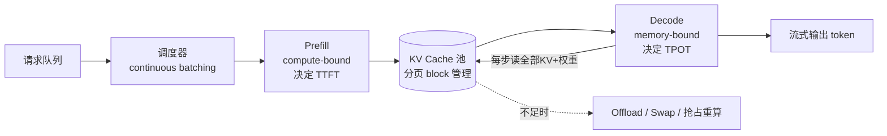

# KV Cache · 进阶与生产实践

> 把本项目的 toy KV Cache(`kv_cache.py`)与真实推理引擎(vLLM / TGI / TensorRT-LLM / SGLang / LMDeploy)打通。本 demo 已经讲清"为什么 cache"(因果性 → 历史 K/V 不变 → 复用),本篇讲清生产为什么要 PagedAttention、GQA/MLA、KV 量化、prefix caching、KV offload、滑动窗口、PD 分离——以及它们各自解决什么、代价是什么、怎么估算。
>
> 阅读前提:已读 `kv_cache.py` 与 `手把手教学.md`。本篇所有 benchmark 用定性或"约",不编造精确数字。

---

## 0. 本项目 toy 与生产的差距

toy 用一行 `torch.cat([k_past, k], dim=2)` 把 KV Cache 讲透了——这恰恰是它的价值,也是它与生产最大的距离。`torch.cat` 每步分配一块新的连续显存、把旧 cache 整段拷贝过去。在 toy 规模(几十 token、CPU)无所谓;在生产(并发上千请求、每条几千 token、GPU)这是灾难:显存碎片、拷贝带宽打满、无法预分配。生产系统几乎把所有工程量都花在"如何管理这块持续增长的 cache"上。

| 维度 | 本 toy 实现 | 生产必须补什么 |
|---|---|---|
| cache 存储 | `torch.cat` 每步新建连续张量 | **预分配 + 分页**(PagedAttention),避免反复 alloc/copy 与碎片 |
| 内存形状 | 每请求一条连续 K/V,随长度线性增长 | **block/page 化**,以固定大小块(如 16 token/block)为单位分配回收 |
| 批处理 | 单条 prompt,无 batch | **continuous batching**(请求随到随入/完成即出),decode 阶段动态拼 batch |
| 注意力 kernel | 朴素 `q @ k.T` + softmax(materialize 整个 score 矩阵) | **FlashAttention / FlashDecoding / PagedAttention kernel**(融合、不落地 score、按页 gather) |
| K/V 头数 | 每头独立 K/V(MHA) | **GQA / MQA / MLA** 共享或压缩 K/V,直接砍 cache 数倍~数十倍 |
| 数值精度 | fp32 K/V | **fp16/bf16 是底线;int8/fp8 KV 量化**进一步省一半显存 |
| 位置编码 | 绝对 `pos_emb` | **RoPE**(对 K 按位置旋转后再 cache),长上下文外推 |
| 上下文长度 | `block_size=256`,naive 路径还会截断 | **滑动窗口 / 长上下文**(局部注意力 + 全局补偿),或 sink token |
| 前缀复用 | 无 | **prefix caching**:相同 system prompt/few-shot 的 KV 跨请求复用 |
| 显存不够时 | 直接放显存 | **KV offload**(显存↔CPU↔NVMe 分级)、抢占式 swap、recompute |
| Prefill/Decode | 同一进程顺序跑 | **PD 分离**:prefill(compute-bound)与 decode(memory-bound)拆到不同实例 |
| 采样 | 贪心(为对比可复现) | top-k/top-p/温度/beam,且与 continuous batching 共存 |

一句话:toy 证明了"cache 是对的、是等价的、是 O(n) 的";生产解决的是"在有限 HBM 里、对成百上千条并发请求,把这块 O(n) 增长的 cache 管到高吞吐、低延迟、不 OOM"。

---

## 1. 业界系统怎么做

### 1.1 共同骨架:Prefill / Decode 两阶段 + KV Cache 池

所有现代引擎都把生成切成 toy 里那两段,但把它们当成性质完全不同的两类负载:

- **Prefill**:把整段 prompt 一次性过一遍,建立初始 KV。算力密集(compute-bound),一次大矩阵乘,GPU 利用率高,延迟体现为 **TTFT(Time To First Token)**。
- **Decode**:每步只算 1 个新 token(toy 的 `forward_step`)。FLOPs 很小但每步都要读**全部** KV + 全部权重,是**访存密集(memory-bound)**,延迟体现为 **TPOT/ITL(每 token 间隔)**。



### 1.2 vLLM:PagedAttention + continuous batching(事实标准)

vLLM 的核心洞察:把 KV Cache 当**操作系统的虚拟内存**来管。物理显存切成固定大小的 **block**(如每 block 存 16 个 token 的 K/V),每个请求维护一张 **block table**(逻辑 token 位置 → 物理 block 的映射),就像页表。带来三件事:

1. **几乎零碎片**:按 block 分配,内部碎片最多 1 个 block,外部碎片消失。对比 toy/早期系统按"最大可能长度"预留连续显存(浪费巨大),vLLM 把可服务的并发数提高了数倍。
2. **写时复制(copy-on-write)与共享**:多个请求若共享前缀(同一 system prompt、beam search 的多个分支),可让 block table 指向同一物理 block,只在写入分叉时复制——这是 prefix caching 的物理基础。
3. **continuous batching**:不等整个 batch 跑完,新请求随到随插入 decode batch、完成的立即退出释放 block。GPU 不再因"等最慢的那条"而空转,吞吐大幅提升。

PagedAttention 还需配套的**注意力 kernel**:K/V 不再连续,要按 block table **gather** 后计算,因此 vLLM 实现了 paged 版的 attention kernel(并随版本演进到 FlashAttention/FlashInfer 后端)。

### 1.3 其他引擎的侧重

| 系统 | KV/注意力侧重 |
|---|---|
| **HuggingFace TGI** | 早期 continuous batching 推动者;后来吸收 paged KV、FlashAttention |
| **TensorRT-LLM** | in-flight batching(同 continuous batching)、paged KV、fp8 KV、深度 kernel 融合 |
| **SGLang** | **RadixAttention**:用前缀树(radix tree)自动跨请求复用 KV,prefix caching 做到极致;适合多轮/agent |
| **LMDeploy(TurboMind)** | blocked KV、KV int8/int4、persistent batch |
| **DeepSpeed-Inference / FastGen** | dynamic SplitFuse:把 prefill 切片与 decode 混排("chunked prefill"),平滑 TTFT 与 TPOT |

本仓库已有专题:[`../../llm-inference/KV-Cache优化.md`](../../llm-inference/KV-Cache优化.md)、[`../../llm-inference/vllm`](../../llm-inference/vllm)、[`../../llm-inference/Flash-Decoding.md`](../../llm-inference/Flash-Decoding.md)、[`../../llm-inference/FlashInfer.md`](../../llm-inference/FlashInfer.md)。

---

## 2. 关键变体与优化

下面每个变体,讲清:**解决什么 → 怎么做 → 代价**。

### 2.1 MQA / GQA / MLA —— 从源头砍 KV 大小

toy 是标准 **MHA(Multi-Head Attention)**:`n_head` 个头,每头都有独立的 K、V。KV Cache 大小 ∝ `n_head`。这是 decode 阶段访存量的主要来源。

- **MQA(Multi-Query Attention)**:所有 query 头**共享同一对 K/V 头**。KV 直接缩小 `n_head` 倍(如 32→1)。代价:表达力下降,质量略损,训练不稳。
- **GQA(Grouped-Query Attention)**:折中。把 query 头分成 `g` 组,每组共享一对 K/V(如 32 个 q 头 → 8 个 kv 头,group=4)。KV 缩小 `n_head/n_kv_head` 倍。**质量几乎无损、cache 显著下降**,是 Llama-2/3、Mistral 等的默认。
- **MLA(Multi-head Latent Attention,DeepSeek-V2/V3)**:不直接共享头,而是把 K/V **低秩压缩**到一个小的 latent 向量再 cache,推理时上投影还原。cache 大小可比 GQA 再小一个量级,同时通过解耦的 RoPE 维持位置编码。代价:实现复杂,需要专门 kernel,矩阵吸收(absorption)技巧。

> 直觉:GQA/MLA 是"在模型结构层面"省 cache,**乘性收益**且与下面所有运行时优化正交叠加。先有 GQA,再叠 paged + 量化,效果相乘。

```
MHA:   q1 q2 q3 q4    每个 q 配独立 k/v          KV 基准 1.0x
       k1 k2 k3 k4
GQA-2: q1 q2 q3 q4    每 2 个 q 共享一对 k/v     KV ≈ 0.5x
       (k1v1)(k2v2)
MQA:   q1 q2 q3 q4    全部共享一对 k/v           KV ≈ 1/n_head
       (k v)
MLA:   q1..qn         K/V 压成低秩 latent 再cache KV 更小(取决于压缩比)
```

### 2.2 PagedAttention —— 解决碎片与浪费(见 1.2)

解决的核心问题:toy 的 `torch.cat`/连续预留导致的**内部碎片(预留多用得少)+ 外部碎片(空隙拼不出连续块)**。代价:注意力要按 block table 间接寻址(gather),kernel 更复杂;block size 选择有权衡(太小元数据开销大,太大内部碎片回升)。

### 2.3 KV 量化(int8 / fp8)—— 用精度换显存与带宽

decode 是访存密集的,**KV 占的不只是显存,还是每步要搬运的带宽**。把 K/V 从 fp16(2 字节)量化到 **int8/fp8(1 字节)**,cache 减半、访存减半 → 吞吐升、可服务上下文更长。

- 做法:per-token 或 per-head/per-channel 量化,存 scale(+zero-point)。fp8(E4M3/E5M2)在新硬件(Hopper/Ada)上有原生支持,精度损失通常小于 int8。
- 难点:**K 通常比 V 更难量化**(K 参与 softmax,有 outlier channel,误差被放大);常见做法是 K/V 用不同策略,或对 outlier 通道特殊处理。
- 代价:轻微精度损失(长生成会累积),需要校准/反量化开销;int4 更激进、风险更大,一般用于显存极度受限场景。

### 2.4 Prefix Caching —— 复用相同前缀的 KV

大量请求共享同一段前缀:固定 system prompt、few-shot 示例、RAG 拼接的同一文档、多轮对话的历史。这些前缀的 KV **算一次就够**——因果性保证前缀 KV 不受后续 token 影响(正是 toy 第 2.1 节那条洞察的跨请求版本)。

- vLLM:基于 paged block 的 hash 匹配 + 共享物理 block(automatic prefix caching)。
- SGLang:**RadixAttention**,用前缀树自动检测最长公共前缀并复用。
- 收益:命中时直接**跳过那段 prefill**,TTFT 骤降、prefill 算力省下。agent/多轮场景收益巨大。
- 代价:维护 cache 索引、淘汰策略(LRU);命中依赖前缀**逐 token 相同**(连空格都要对齐)。

### 2.5 KV Offload —— 显存放不下时的分级存储

当并发或上下文超出 HBM 容量:把暂时不活跃请求(或冷 KV)从 **GPU HBM → CPU DRAM → NVMe** 逐级下放,需要时再 swap 回。

- vLLM 的**抢占(preemption)**:显存不足时,选中某请求,要么 **swap** 其 KV 到 CPU,要么直接**丢弃并 recompute**(重算往往比搬运快,取决于带宽)。
- 代价:offload/swap 走 PCIe(数十 GB/s,远低于 HBM 的 TB/s),会拉高延迟;是"宁可慢一点也别 OOM/拒绝服务"的取舍。
- 相关:[`../../llm-inference/offload.md`](../../llm-inference/offload.md)。

### 2.6 滑动窗口注意力(Sliding Window Attention)—— 给 cache 封顶

标准注意力 KV 随长度**无界线性增长**。滑动窗口(Mistral 等)让每个 token 只看最近 `w` 个 token,**KV Cache 上限固定为 `w`**(环形缓冲覆盖最旧的)。信息通过层数堆叠间接传递更远(感受野 ≈ `w × layers`)。

- 代价:严格丢失窗口外的精确信息;长程依赖任务可能受损。
- 改进:**Attention Sink / StreamingLLM** —— 保留最初几个 "sink" token + 滑动窗口,显著改善流式长生成的稳定性(发现模型把注意力"倾倒"在最初 token 上,丢了它会崩)。

### 2.7 PD 分离(Prefill-Decode Disaggregation)

prefill(compute-bound,吃算力)与 decode(memory-bound,吃带宽 + KV 容量)放同一 GPU 会**互相干扰**:长 prefill 卡住 decode → 已有用户的 token 间隔抖动(TPOT 飙升)。PD 分离把两者拆到**不同实例/不同硬件配比**:

- Prefill 实例算完 KV → 通过高速互联(NVLink/RDMA)**传输 KV** 到 Decode 实例 → Decode 实例只做生成。
- 各自独立扩缩容、独立 batching 策略,SLO(TTFT 与 TPOT)可分别优化。
- 代价:**KV 传输开销**成为关键(KV 可能很大);需要 KV 传输层(如 Mooncake 的 KV store)。
- 相关:[`../../llm-inference/PD分离.md`](../../llm-inference/PD分离.md)、[`../../llm-inference/分离式推理架构.md`](../../llm-inference/分离式推理架构.md)、[`../../llm-inference/Mooncake.md`](../../llm-inference/Mooncake.md)。

---

## 3. 真实工程权衡与坑

**显存账本:KV 往往比想象中大。** 很多人以为权重占满显存就完了,实际**KV Cache 才是限制并发的瓶颈**。一个 70B 模型权重 fp16 约 140GB,但在长上下文 + 高并发下,KV 可吃掉与权重相当甚至更多的显存。GQA/量化的收益正在于此。

**吞吐 vs 延迟。** continuous batching 把 batch 做大 → 吞吐(tokens/s 总量)高,但单请求的 TPOT 可能变长。生产要按 SLO 设 `max_num_seqs`/`max_num_batched_tokens` 等做权衡。chunked prefill 是平衡 TTFT 与 TPOT 的常用手段。

**Decode 是 memory-bound,别只看 FLOPs。** 每生成 1 token,要把**全部模型权重 + 全部 KV**从 HBM 读一遍。所以 decode 速度由**显存带宽**而非算力决定;省 KV(GQA/量化/MLA)= 省带宽 = 直接提速。这解释了为什么"小 FLOPs 的 decode"反而是优化重点。

**精度坑。** KV int8/int4 在短输出看不出问题,**长生成会累积漂移**,表现为后段质量下降/重复/跑题。上线前务必在长输出、目标任务上评测,而不只看 perplexity。

**prefix caching 的隐形失效。** 前缀必须**逐 token 完全相同**才命中。模板里一个动态时间戳、一个变化的 user id、tokenizer 对空格的处理差异,都会让命中率暴跌。把可变部分挪到前缀之后。

**通信成为新瓶颈(PD 分离 / TP)。** 张量并行(TP)下 KV 也按头切分到多卡,decode 每步有 all-reduce;PD 分离要传 KV。互联带宽不足时,通信会吃掉计算省下的时间。相关:[`../../llm-inference/大模型推理张量并行.md`](../../llm-inference/大模型推理张量并行.md)。

**常见线上故障:**
- **OOM / 请求被拒**:并发或上下文突增,KV 池耗尽。对策:开 offload/swap、限流、设 KV 量化、降 `max_num_seqs`。
- **TTFT 尖刺**:超长 prompt 的 prefill 占满 GPU,堵住 decode。对策:chunked prefill、PD 分离。
- **TPOT 抖动**:大 batch 或抢占重算引入毛刺。对策:调度优先级、限制单批 prefill 量。
- **长上下文崩坏**:超出训练长度且无外推(RoPE scaling)、或滑动窗口丢了 sink token。对策:RoPE 外推 / StreamingLLM sink。
- **量化后质量回归**:见上,需任务级评测兜底。

---

## 4. 性能直觉与估算

### 4.1 KV Cache 显存(最该背的一条)

每个 token、每一层,要存 K 和 V 各一份:

```
KV_bytes ≈ batch × seq_len × n_layer × 2(K和V) × n_kv_head × head_dim × dtype_bytes
         = batch × seq_len × n_layer × 2 × d_kv × dtype_bytes
```

其中 `d_kv = n_kv_head × head_dim`(MHA 时 = `d_model`;GQA 时按 kv 头数缩小)。

**手算例子**(单条请求,直觉量级):
- 设 `n_layer=80, d_model=8192`(类 70B,MHA),fp16(2B),`seq_len=4096`:
  每 token 每层 KV ≈ `2 × 8192 × 2B = 32 KB`;乘 80 层 ≈ `2.5 MB/token`;乘 4096 token ≈ **约 10 GB,单条请求**。
- 改 **GQA(kv 头数为 q 头 1/8)**:`d_kv` 降 8 倍 → 约 **1.3 GB**。
- 再叠 **int8 KV**:再减半 → 约 **0.65 GB**。

看出收益是**乘性叠加**的:GQA × 量化 ×(prefix 命中跳过)层层相乘。能服务的并发数 ≈ `(总显存 − 权重 − 激活)/ 单请求KV`。

### 4.2 加速比(toy 与生产的关系)

toy 的加速比只有约 2x,因为模型太小、固定开销(Python 循环、emb、LN)稀释了收益。复杂度本身:

```
naive 总工作量 = 1+2+...+n = n(n+1)/2 ≈ O(n²)
KV cache 总工作量 = n × 1        ≈ O(n)
理论 decode 加速比 ∝ n / 2(序列越长越大)
```

生产里注意力开销占主导、batch 大、kernel 高效,所以实际加速可达数十倍量级——但**"随长度增大"这条趋势在 toy 上已清晰可见**,机理一致。

### 4.3 Decode 是否被带宽限制(roofline 直觉)

每步 decode 读取字节 ≈ `权重字节 + 当前KV字节`;算术强度低 → 落在 roofline 的**带宽区**。所以:

```
单 token decode 时间 ≈ (权重字节 + KV字节) / 显存带宽
```

提升手段全是"减少要搬的字节":量化权重、量化 KV、GQA/MLA 减 KV、增大 batch 摊薄权重读取(权重读一次服务整个 batch,这正是 continuous batching 提吞吐的根源)。

### 4.4 PD 分离的 KV 传输估算

Prefill→Decode 要搬的 KV ≈ 4.1 的 `KV_bytes`(prompt 部分)。传输时间 ≈ `KV_bytes / 互联带宽`。若该时间 < prefill 计算时间且 < 可容忍 TTFT 预算,分离才划算——这也是为什么 PD 分离常配 GQA/量化(KV 越小越好传)和 RDMA/NVLink。

---

## 5. 动手进阶路线

把本 toy 一步步推向接近生产,每步只动一处、可单测验证(沿用 toy 的"两路径逐 token 相等"断言做回归)。

1. **加 GQA**:把 `CausalSelfAttention` 的 K/V 投影头数改为 `n_kv_head < n_head`,attention 前对 K/V 做 `repeat_interleave` 广播到 q 头数。验证:KV cache 张量第 2 维变小、输出仍合理。这是收益最大、改动最小的一步。
   方向:再加 MQA(`n_kv_head=1`)对比 cache 大小。

2. **换成分页 cache(mini PagedAttention)**:把每请求一条连续 K/V 改成"固定大小 block 列表 + block table"。decode 时按 block table gather 出 K/V 再算注意力。先用纯 PyTorch indexing 实现正确性,不求快。验证:与连续版输出逐 token 相等。这一步让你真正理解 vLLM。

3. **加 continuous batching**:支持多条 prompt,prefill 完成的进入共享 decode 循环,长度不一时用 padding/变长。新请求可中途加入。验证:多请求结果与各自单跑一致,GPU(或 CPU)利用率不再被最长请求拖累。

4. **加 KV int8 量化**:存 K/V 时按 per-token scale 量化到 int8,读时反量化。对比 fp32/fp16 输出的偏差与显存占用。验证:短输出近似一致、长输出观察漂移——亲手感受 §3 的精度坑。

5. **加 prefix caching**:对相同 prompt 前缀做 hash,命中则复用已建的 KV(共享或拷贝),跳过那段 prefill。验证:命中时 TTFT 明显下降、输出与不复用时一致。

进阶可选:RoPE 替换绝对位置(并验证"对已 cache 的 K 应用对应位置旋转")、滑动窗口 + sink token、把 prefill 与 decode 拆成两个进程并传 KV(mini PD 分离)。

---

## 6. 延伸阅读

**本仓库深度文档(优先读):**

- [`../../llm-inference/KV-Cache优化.md`](../../llm-inference/KV-Cache优化.md) —— KV Cache 优化总览(本篇的系统级配套)。
- [`../../llm-inference/PD分离.md`](../../llm-inference/PD分离.md) · [`../../llm-inference/分离式推理架构.md`](../../llm-inference/分离式推理架构.md) —— Prefill/Decode 分离架构。
- [`../../llm-inference/Mooncake.md`](../../llm-inference/Mooncake.md) —— 以 KV Cache 为中心的分离式架构与 KV store。
- [`../../llm-inference/Flash-Decoding.md`](../../llm-inference/Flash-Decoding.md) · [`../../llm-inference/FlashInfer.md`](../../llm-inference/FlashInfer.md) —— decode 阶段注意力 kernel 加速。
- [`../../llm-inference/offload.md`](../../llm-inference/offload.md) —— 显存/内存/磁盘分级 offload。
- [`../../llm-inference/vllm`](../../llm-inference/vllm) · [`../../llm-inference/sglang`](../../llm-inference/sglang) · [`../../llm-inference/tensorrt-llm`](../../llm-inference/tensorrt-llm) · [`../../llm-inference/lmdeploy`](../../llm-inference/lmdeploy) —— 各引擎实战。
- [`../../llm-inference/大模型推理张量并行.md`](../../llm-inference/大模型推理张量并行.md) —— TP 下 KV 的切分与通信。
- [`../../llm-inference/解码策略.md`](../../llm-inference/解码策略.md) —— 采样/贪心/beam(本 toy 用贪心保证可比)。

**经典论文与社区:**

- PagedAttention / vLLM(arXiv:2309.06180)—— KV Cache 当虚拟内存管,理解本 toy 后必读。
- GQA(arXiv:2305.13245)、MQA(arXiv:1911.02150)—— 从结构上砍 KV。
- DeepSeek-V2 / MLA(arXiv:2405.04434)—— 低秩压缩 KV 的 latent attention。
- FlashAttention(arXiv:2205.14135)、Flash-Decoding —— 不落地 score 的融合注意力。
- StreamingLLM / Attention Sink(arXiv:2309.17453)—— 滑动窗口 + sink token 的长流式稳定。
- SGLang / RadixAttention(arXiv:2312.07104)—— 前缀树自动复用 KV。
- Mooncake —— 以 KVCache 为中心的 PD 分离服务系统。
- Inside vLLM(blog.vllm.ai/2025/09/05/anatomy-of-vllm.html)—— 引擎内部结构剖析。

> 收尾:toy 的 `torch.cat` 一行回答了"为什么 cache 是对的、是 O(n) 的";生产的全部工程量,是回答"在有限 HBM 里、对成百上千条并发请求,如何把这块持续增长的 cache 管到高吞吐、低延迟、不 OOM"。GQA/MLA 从结构上减小它,PagedAttention 高效地装它,量化压缩它,prefix caching 复用它,offload 兜底它,滑动窗口给它封顶,PD 分离让 prefill 与 decode 各得其所。机理你已掌握,去读上面的系统文档。
