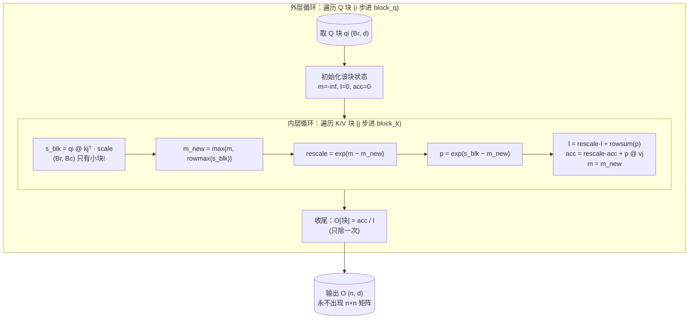

# 从零实现 FlashAttention：分块 tiling + 在线 softmax 手把手教学

> 一句话导览：本文带你逐行读懂 `flash_attention.py`，把 FlashAttention 这个"听起来很玄"的工程优化彻底讲透。学完这篇你能掌握：
>
> 1. 为什么朴素注意力会被那张 `n×n` 的分数矩阵卡死显存（`O(n²)` 的来源）。
> 2. **online softmax** 的 running max / running sum / running 输出 三个累加器，以及它们的合并公式（含 `rescale = exp(m_old − m_new)` 这个灵魂修正因子）的**完整数学推导**。
> 3. FlashAttention 的**两层分块循环**（外层遍历 Q 块、内层遍历 K/V 块）是怎么写出来的，每一行对应原理的哪一步。
> 4. 为什么 FlashAttention 是**精确的内存重排**而不是近似 —— 用 `torch.allclose` 逐位对拍证明。
> 5. 显存复杂度怎么从 `O(n²)` 降到 `O(n)`，以及"省显存不省 FLOPs"到底是什么意思。

---

## 0. 前置知识与环境

**你需要会一点点：**

- Python 基础（`for` 循环、函数、切片 `a[i:i+k]`）。
- 矩阵乘法的形状规则：`(a,b) @ (b,c) -> (a,c)`。看不太熟也没关系，本文每处矩阵乘都会标形状。
- softmax 是什么：把一行数 `x` 变成一行和为 1 的概率 `softmax(x)_i = e^{x_i} / Σ_j e^{x_j}`。
- 注意力的一句话定义：`O = softmax(Q Kᵀ / √d) · V`。

**完全不用会的：** CUDA、Triton、GPU 编程。本 demo 在 **CPU** 上就能跑，且故意用纯 PyTorch 的 `for` 循环把控制流写得很清楚。

**环境安装：**

```bash
# 只需要 PyTorch（CPU 版即可，不需要 GPU、不需要联网、不需要数据集）
pip install torch
```

**怎么打开跑：**

```bash
cd practical-projects/05-flash-attention-tiled
python flash_attention.py
```

几秒钟就会打印一大段对拍结果。第 4 节会逐行解释每个数字。

**这个项目只有一个文件** `flash_attention.py`，约 210 行，包含 4 个函数：`naive_attention`（朴素基线）、`flash_attention`（主角）、`memory_footprint_elements`（显存账估算）、`main`（跑对拍并打印）。

---

## 1. 问题背景：不用这个技术会怎样

先看朴素注意力到底"贵"在哪。代码里 `naive_attention` 第一步就是：

```python
S = (Q @ K.transpose(-1, -2)) * scale          # (n, n) 整张物化  <-- O(n^2)
```

`Q` 形状是 `(n, d)`，`K` 也是 `(n, d)`。`Q @ Kᵀ` 得到 `S`，形状 `(n, n)`。注意：**这张矩阵的大小和序列长 `n` 的平方成正比。**

直觉上的痛点用具体数字感受一下（这正是代码里 `memory_footprint_elements` 算的东西）：

| 序列长 `n` | `S` 的元素个数 (`n×n`) | 还要再来一张 `P`（softmax 后） |
|---|---|---|
| 128 | 16,384 | 16,384 |
| 2048 | 4,194,304 | 4,194,304 |
| 8192 | 67,108,864 | 67,108,864 |

当 `n = 8192` 时，光是 `S + P` 两张中间矩阵就是 **1.34 亿个元素**（代码输出里那个 `134,217,728`）。如果用 fp16，约 256 MB —— 而这还只是一个注意力头、一层、一条样本。长上下文（几万 token）下，这张 `n×n` 矩阵直接撑爆显存。

更糟的是：注意力在 GPU 上是**访存受限（memory-bound）**的。瓶颈不是算得慢，而是这张巨大的 `n×n` 矩阵要反复在显存（HBM）里**写出来、再读回去**做 softmax，再读回去乘 `V`。HBM 带宽就是被这反复读写吃光的。

**核心矛盾：** 我们最终只想要输出 `O`（形状 `(n, d)`，很小），但朴素做法被迫先造出一张和 `n²` 一样大的中间矩阵。**FlashAttention 的目标就是：在不造出这张 `n×n` 矩阵的前提下，算出完全一样的 `O`。**

---

## 2. 核心原理详解

### 2.1 难点：softmax 需要"看全一行"才能归一化

softmax 的分母是 `Σ_j e^{x_j}`，要对**整行**求和。这就是为什么朴素做法要先把一整行 `S` 都物化出来 —— 你得先看完这一行的所有分数，才知道分母是多少，才能归一化。

FlashAttention 的破局点：**我能不能一块一块地看，看一块就更新一次"部分答案"，看完最后一块时部分答案恰好等于完整答案？** 这就是 online softmax。

### 2.2 数值稳定 softmax：先减最大值

直接算 `e^{x_j}` 会上溢（`x` 大一点 `e^x` 就爆 `inf`）。标准技巧是先减去这一行的最大值 `m`：

$$\text{softmax}(x)_i = \frac{e^{x_i - m}}{\sum_j e^{x_j - m}}, \quad m = \max_j x_j$$

因为分子分母同乘 `e^{-m}`，结果不变，但所有指数的输入都 `≤ 0`，`e` 的值都在 `(0, 1]`，绝不上溢。代码 `naive_attention` 里就是这么做的：

```python
m = S.max(dim=-1, keepdim=True).values          # 每行最大值 (n, 1)
P = torch.exp(S - m)                            # 减去最大值再 exp
P = P / P.sum(dim=-1, keepdim=True)             # 按行归一化
```

问题来了：分块时我**不能一次看到整行**，所以也不知道整行的最大值 `m`。怎么办？**边看边维护一个 running max。**

### 2.3 online softmax 的递推公式（灵魂推导）

设这一行被切成若干块，逐块到来。我们维护三个 running 状态（针对**每一个 query 行**）：

- `m`：到目前为止见过的最大分数（running max）。
- `l`：到目前为止的分母累加（running sum of exp）。
- `acc`（代码里的 `acc`，即未归一化的输出累加器）：到目前为止 `Σ e^{s−m} · v` 的累加。

来了一个新块，块内分数为 `S_blk`，对应的 `V_blk`。更新分四步：

**第 1 步：更新 max（只增不减）**

$$m_{\text{new}} = \max(m_{\text{old}},\ \text{rowmax}(S_{\text{blk}}))$$

**第 2 步：算 rescale 修正因子**

这是整个算法的灵魂。旧的累加器 `l_old`、`acc_old` 都是"以 `m_old` 为基准"算出来的（即里面的项是 `e^{s − m_old}`）。现在基准变成了更大的 `m_new`，所有旧项都要乘上 `e^{m_old − m_new}` 才能换算到新基准：

$$e^{s - m_{\text{old}}} \cdot e^{m_{\text{old}} - m_{\text{new}}} = e^{s - m_{\text{new}}}$$

所以定义：

$$\text{rescale} = e^{m_{\text{old}} - m_{\text{new}}} \quad (\le 1)$$

因为 `m_new ≥ m_old`，指数 `≤ 0`，所以 `rescale ∈ (0, 1]`。它把"按旧基准算的旧累加值"缩到"按新基准"。

**第 3 步：算新块在新基准下的未归一化权重**

$$p = e^{S_{\text{blk}} - m_{\text{new}}}$$

**第 4 步：合并旧累加器与新块贡献**

$$l_{\text{new}} = \text{rescale} \cdot l_{\text{old}} + \text{rowsum}(p)$$
$$acc_{\text{new}} = \text{rescale} \cdot acc_{\text{old}} + p \cdot V_{\text{blk}}$$

**收尾（所有块处理完）：只做一次归一化**

$$O = \frac{acc}{l}$$

**为什么这等于标准 softmax？** 把所有块展开，最终 `l = Σ_全行 e^{s − m_final}`，`acc = Σ_全行 e^{s − m_final} · v`，其中 `m_final` 就是整行最大值。于是 `O = acc / l = Σ p_j v_j / Σ p_j`，正是标准注意力。rescale 因子保证了"分块累加"和"一次看全行"完全代数等价 —— **所以是精确的，不是近似的。**

### 2.4 一图看懂数据流



记住这张图的两个关键点：内层每次只产生 `(Br, Bc)` 的小块 `s_blk`，**全程没有任何 `(n, n)` 的张量**；归一化（除以 `l`）只在每个 Q 块收尾时做一次。

---

## 3. 代码逐段精讲

`flash_attention.py` 没有"模型/数据集/训练循环"这种结构（它不是训练任务，而是一个**算法正确性 demo**）。它的主干是：**朴素基线（baseline）→ Flash 实现（前向）→ 显存账估算 → 对拍验证（相当于评估）**。我们按这条主干拆。

### 3.0 文件头：可复现设置

```python
import math
import torch

torch.manual_seed(0)
DTYPE = torch.float64  # 用 float64 做对拍，把数值误差从「算法」里彻底剥离出来
```

- `torch.manual_seed(0)`：固定随机种子，让每次跑出来的随机 `Q/K/V` 都一样，结果可复现。
- `DTYPE = torch.float64`：**这是个很讲究的选择**。用 64 位双精度浮点，机器精度约 `1e-16`。这样如果 Flash 和朴素对不上，那一定是**算法写错了**，而不是低精度舍入。真实工程跑 fp16/bf16 会有正常的低精度误差，但那是另一回事。
- **新手易困惑点**：为什么 demo 用 float64 而不是 GPU 上常用的 fp16？因为本文的目的是证明"算法精确等价"，要把"低精度舍入"这个干扰项彻底排除掉，让误差小到接近机器精度（`~4e-16`）才有说服力。

### 3.1 朴素基线 `naive_attention`（对照组，故意物化 n×n）

```python
def naive_attention(Q, K, V):
    n, d = Q.shape
    scale = 1.0 / math.sqrt(d)
    S = (Q @ K.transpose(-1, -2)) * scale          # (n, n) 整张物化  <-- O(n^2)
    m = S.max(dim=-1, keepdim=True).values          # 每行最大值 (n, 1)
    P = torch.exp(S - m)                            # (n, n) 又一张 O(n^2) 矩阵
    P = P / P.sum(dim=-1, keepdim=True)             # 按行归一化
    O = P @ V                                       # (n, d)
    return O
```

逐行：

- `scale = 1.0 / math.sqrt(d)`：注意力的缩放因子 `1/√d`，防止点积随维度 `d` 增大而方差爆炸。`d=32` 时 `scale ≈ 0.177`。
- `S = (Q @ K.transpose(-1, -2)) * scale`：`K.transpose(-1,-2)` 把 `K` 从 `(n, d)` 转成 `(d, n)`，于是 `Q(n,d) @ Kᵀ(d,n) = S(n,n)`。**这就是被诟病的 `O(n²)` 矩阵**，注释 `<-- O(n^2)` 标得很清楚。
- `m = S.max(dim=-1, keepdim=True).values`：每行最大值，形状 `(n, 1)`。`keepdim=True` 保留维度便于广播相减。
- `P = torch.exp(S - m)`：减最大值再 exp，数值稳定 softmax 的标准操作。**又一张 `(n,n)` 矩阵**。
- `P = P / P.sum(dim=-1, keepdim=True)`：按行归一化，每行和为 1。
- `O = P @ V`：`P(n,n) @ V(n,d) = O(n,d)`，得到最终输出。

**这个函数存在的唯一目的就是当"标准答案"**，用来和 Flash 版对拍。它故意把 `S`、`P` 两张 `(n,n)` 矩阵都显式造出来 —— 这正是 FlashAttention 要消灭的东西。

### 3.2 主角 `flash_attention`：函数签名与状态初始化

```python
def flash_attention(Q, K, V, block_q=16, block_k=16):
    n, d = Q.shape
    scale = 1.0 / math.sqrt(d)
    device, dtype = Q.device, Q.dtype

    O = torch.zeros(n, d, device=device, dtype=dtype)
```

- `block_q=16, block_k=16`：默认块大小。`block_q` 是 Q 块的行数（论文里的 `Br`），`block_k` 是 K/V 块的行数（论文里的 `Bc`）。真实 kernel 里这俩由 SRAM 容量决定（典型 64/128），这里取小值便于在 toy 规模看清分块逻辑。
- `O = torch.zeros(n, d, ...)`：唯一的"大"输出缓冲，形状 `(n, d)`。注意它是 `O(n·d)` 不是 `O(n²)`，本来就是要返回的结果，不算"额外中间状态"。
- **新手易困惑点**：`device, dtype = Q.device, Q.dtype` 是为了让新建的张量和输入在同一设备、同一精度上，避免 CPU/GPU 或 float32/float64 混用报错。

### 3.3 外层循环：遍历 Q 块，每块独立维护 online softmax 状态

```python
    for i in range(0, n, block_q):
        qi = Q[i : i + block_q]                     # (Br, d)，放进「片上」的那块
        br = qi.shape[0]

        # ---- 每个 query 行的 running 状态（online softmax 的全部记忆）----
        m = torch.full((br, 1), float("-inf"), device=device, dtype=dtype)  # running max
        l = torch.zeros((br, 1), device=device, dtype=dtype)               # running 分母 sum
        acc = torch.zeros((br, d), device=device, dtype=dtype)            # running 未归一化输出
```

- `for i in range(0, n, block_q)`：`i` 取 `0, 16, 32, ...`，把序列按 `block_q` 切成 Q 块。
- `qi = Q[i : i + block_q]`：取出当前 Q 块。**注意切片越界是安全的** —— 当 `i + block_q > n` 时，Python 切片自动只取到 `n`，这就是为什么尾块（除不尽时的最后一块）能正确处理。
- `br = qi.shape[0]`：当前块**实际**行数。多数块是 `block_q`，但尾块可能更小，所以这里读实际值，**不能写死成 `block_q`**。
- `m / l / acc` 三个累加器，对应 2.3 节推导的三个 running 状态：
  - `m` 初始化为 `-inf`：因为 max 要"只增不减"，初始得是最小可能值，第一次 `max(-inf, 任何分数)` 就等于那个分数。
  - `l` 初始化为 0：分母从 0 开始累加。
  - `acc` 初始化为全 0：未归一化输出从 0 开始累加。形状 `(br, d)`，**每行只占 `O(d)`**。
- **关键认知**：这三个状态总共只占 `O(Br·1 + Br·1 + Br·d) = O(Br·d)`，和 `n` 的平方完全无关。这就是 `O(n)` 显存的来源 —— 一行的状态是常数大小，外层循环最多同时活着一个 Q 块的状态。

### 3.4 内层循环：把 K/V 块逐块"融合"进当前状态（算法核心 6 步）

```python
        for j in range(0, n, block_k):
            kj = K[j : j + block_k]                 # (Bc, d)
            vj = V[j : j + block_k]                 # (Bc, d)

            # (1) 算当前小块的分数：只有 Br×Bc 大，绝不会是 n×n
            s_blk = (qi @ kj.transpose(-1, -2)) * scale   # (Br, Bc)

            # (2) 块内每行最大值，并更新全局 running max（只增不减）
            m_blk = s_blk.max(dim=-1, keepdim=True).values    # (Br, 1)
            m_new = torch.maximum(m, m_blk)                   # (Br, 1)

            # (3) rescale 修正因子 = exp(m_old - m_new) <= 1
            rescale = torch.exp(m - m_new)                    # (Br, 1)

            # (4) 当前块的未归一化权重 p = exp(S_blk - m_new)
            p = torch.exp(s_blk - m_new)                      # (Br, Bc)

            # (5) 在线更新分母 l 和 未归一化输出累加器 acc：
            l = rescale * l + p.sum(dim=-1, keepdim=True)     # (Br, 1)
            acc = rescale * acc + p @ vj                      # (Br, d)

            # (6) 滚动 running max
            m = m_new
```

这 6 步**逐一对应 2.3 节的数学推导**，是整个 FlashAttention 的心脏：

- `for j in range(0, n, block_k)` + `kj/vj` 切片：把 K、V 同样按 `block_k` 切块。`kj/vj` 形状 `(Bc, d)`，尾块同样靠 Python 切片自动截断保证安全。
- **(1)** `s_blk = (qi @ kj.transpose(-1, -2)) * scale`：当前 Q 块和当前 K 块的分数，形状 `(Br, Bc)`。**这是全函数最大的临时张量**，但它只有 `Br×Bc`（默认 `16×24=384` 个元素），永远不是 `n×n`。这一行就是"永不物化 n×n 矩阵"的体现。
- **(2)** `m_blk` 是这个块内每行最大值；`m_new = torch.maximum(m, m_blk)` 是更新后的 running max。对应推导第 1 步 `m_new = max(m_old, rowmax(S_blk))`。`torch.maximum` 是逐元素取大（不是降维 max）。
- **(3)** `rescale = torch.exp(m - m_new)`：灵魂修正因子。注意这里用的是 `m`（旧值，还没被覆盖），所以是 `exp(m_old − m_new) ≤ 1`。对应推导第 2 步。
- **(4)** `p = torch.exp(s_blk - m_new)`：新块在**新基准** `m_new` 下的未归一化权重，形状 `(Br, Bc)`。对应推导第 3 步。
- **(5)** 两行合并，对应推导第 4 步：
  - `l = rescale * l + p.sum(dim=-1, keepdim=True)`：旧分母乘 rescale 缩到新基准，再加上新块的 exp 之和。
  - `acc = rescale * acc + p @ vj`：旧输出累加器乘 rescale，再加上新块贡献 `p(Br,Bc) @ vj(Bc,d) = (Br,d)`。
- **(6)** `m = m_new`：滚动更新 running max，供下一个块用。**必须放在最后**，因为第 (3) 步还要用旧的 `m`。
- **新手易困惑点 1**：为什么 `rescale` 要乘到 `l` 和 `acc` 上，而不是乘到 `p`？因为 `p` 已经是按新基准 `m_new` 算的（第 4 步），无需修正；要修正的是"按旧基准 `m_old` 算出来的旧累加值"。
- **新手易困惑点 2**：第一次进内层循环时 `m = -inf`，`rescale = exp(-inf − m_new)`。`-inf − 有限数 = -inf`，`exp(-inf) = 0`。于是 `l = 0·0 + ...`、`acc = 0·0 + ...`，旧的全 0 累加器被乘以 0（甚至原本就是 0），第一块的贡献干净地写入，完全正确 —— 边界自动成立，不需要特判第一块。

### 3.5 收尾：每个 Q 块只归一化一次

```python
        # ---- 收尾：所有 K/V 块处理完，对该 Q 块做唯一一次归一化（除以 l）----
        O[i : i + block_q] = acc / l

    return O
```

- `O[i : i + block_q] = acc / l`：内层循环跑完所有 K/V 块后，`acc` 是该 Q 块的完整未归一化输出，`l` 是完整分母。**这一次除法就是 softmax 的归一化**，对应推导收尾 `O = acc / l`。
- 注意归一化**只在每个 Q 块收尾做一次**，不是每个内层块都做。这既省计算也是算法的正确形态（中间过程保持未归一化才能正确累加）。
- **新手易困惑点**：左边写 `O[i : i + block_q]` 而右边 `acc/l` 是 `(br, d)`。当尾块时 `br < block_q`，但 `O[i : i+block_q]` 切片也自动只到 `n`，两边形状一致，赋值成功。

### 3.6 显存账估算 `memory_footprint_elements`

```python
def memory_footprint_elements(n, d, block_q, block_k):
    naive_extra = 2 * n * n                                  # S + P，两张 n×n
    flash_extra = block_q * block_k + 2 * block_q + block_q * d
    return naive_extra, flash_extra
```

- `naive_extra = 2 * n * n`：朴素要物化 `S` 和 `P` 两张 `n×n`，所以是 `2n²`。**随 `n` 平方增长。**
- `flash_extra = block_q * block_k + 2 * block_q + block_q * d`：Flash 每个 Q 块的额外状态：
  - `block_q * block_k`：临时分数块 `s_blk`（`Br×Bc`）。
  - `2 * block_q`：两个 `(Br, 1)` 的行状态 `m` 和 `l`。
  - `block_q * d`：累加器 `acc`（`Br×d`）。
  - 用默认 `block_q=16, block_k=24, d=32`：`16×24 + 2×16 + 16×32 = 384 + 32 + 512 = 928`。这就是输出里那个恒定的 `928`。
- **关键**：`flash_extra` 里**没有任何 `n`**，所以它是常数，不随序列长增长。这就是 `O(n²) → O(n)` 的账（整体 `O(n)` 来自最终输出 `O` 本身 `n×d`，而"额外中间状态"甚至是 `O(1)` 每块）。

### 3.7 `main`：toy 规模 + 三类验证（相当于"评估"）

`main` 是这个 demo 的"评估"环节，做三件事：正确性对拍、边角案例、显存账打印，外加压力测试。

```python
    n, d = 128, 32                  # 序列长 128、头维 32
    block_q, block_k = 16, 24       # 故意取「除不尽 n」的块，测试尾块/边界正确性
```

- `n=128, d=32`：toy 规模，CPU 几秒跑完，又够大到能跑出多个块、暴露边界逻辑。
- `block_q=16, block_k=24`：**故意让 `block_k=24` 除不尽 `n=128`**（128/24 = 5 块余 8）。这样最后一个 K/V 块只有 8 行，专门考验 3.4/3.5 节说的"尾块"是否正确。这是很好的测试设计：用故意不整除的块大小逼出边界 bug。

```python
    O_naive = naive_attention(Q, K, V)
    O_flash = flash_attention(Q, K, V, block_q=block_q, block_k=block_k)

    max_abs_err = (O_naive - O_flash).abs().max().item()
    mean_abs_err = (O_naive - O_flash).abs().mean().item()
    is_close = torch.allclose(O_naive, O_flash, atol=1e-10, rtol=1e-8)
```

- 跑两个版本，做差取绝对值，分别求最大误差、平均误差。
- `torch.allclose(O_naive, O_flash, atol=1e-10, rtol=1e-8)`：**这是"精确等价"的判定**。容差 `atol=1e-10` 远小于 float64 实际误差（`~4e-16`），所以 PASS 是有说服力的。

```python
    O_oneblock = flash_attention(Q, K, V, block_q=n, block_k=n)
    one_err = (O_naive - O_oneblock).abs().max().item()
```

- **边角案例**：`block_q=block_k=n` 表示"整张序列就是一个块"。这时内层循环只跑一次，online softmax 退化成普通 softmax，应当和朴素完全一致。这验证了算法在"单块"极端下也对。

```python
    for nn in [128, 512, 2048, 8192]:
        nv, fl = memory_footprint_elements(nn, d, block_q, block_k)
        print(f"  {nn:>6} | {nv:>14,} | {fl:>16,} | {nv / fl:>9.1f}x")
```

- 对 4 个递增的 `n` 打印显存账，直观展示 `naive` 爆炸而 `flash` 恒定，比值线性放大。

```python
    worst = 0.0
    trials = 20
    for t in range(trials):
        q = torch.randn(n, d, dtype=DTYPE); ...
        e = (naive_attention(q, k, v)
             - flash_attention(q, k, v, ...)).abs().max().item()
        worst = max(worst, e)
```

- **压力测试**：换 20 组不同随机输入重复对拍，取最坏误差。这是为了证明"PASS 不是某一组输入的偶然"，而是稳定成立。

---

## 4. 跑起来 + 逐行读懂输出

运行命令：

```bash
cd practical-projects/05-flash-attention-tiled
python flash_attention.py
```

预期输出（这是真实跑出来的，数值在不同机器上末位可能略有浮动，但量级一致）：

```
================================================================
FlashAttention from scratch: tiling + online softmax
================================================================
seq_len n = 128, head_dim d = 32
block_q (Br) = 16, block_k (Bc) = 24  (n not divisible -> exercises ragged tail blocks)
----------------------------------------------------------------
[correctness] flash vs naive attention output
  max  abs error = 4.441e-16
  mean abs error = 4.594e-17
  torch.allclose(atol=1e-10) = True
  -> RESULT: PASS (numerically identical)
----------------------------------------------------------------
[edge case] single block (Br=Bc=n) degenerates to plain softmax
  max abs error = 6.661e-16  (PASS)
----------------------------------------------------------------
[memory] extra intermediate-state elements (NOT counting Q/K/V/O)
       n |   naive O(n^2) | flash (per Qblk) |      ratio
     128 |         32,768 |              928 |      35.3x
     512 |        524,288 |              928 |     565.0x
    2048 |      8,388,608 |              928 |    9039.4x
    8192 |    134,217,728 |              928 |  144631.2x
----------------------------------------------------------------
[stress] 20 random trials, worst-case max abs error = 1.554e-15
  -> ALL PASS
================================================================
DONE. FlashAttention reproduces naive attention exactly; extra memory is O(n), not O(n^2).
```

**逐条解释每个数字：**

- `seq_len n = 128, head_dim d = 32`：本次跑的规模。`n` 是序列长（128 个 token），`d` 是每个头的维度（32）。
- `block_q (Br) = 16, block_k (Bc) = 24 (n not divisible ...)`：块大小。括号里提示 `block_k=24` 除不尽 `n=128`，所以会跑到 ragged tail（参差不齐的尾块），是有意为之的边界测试。
- `max abs error = 4.441e-16`：Flash 输出和朴素输出**每个元素**差的绝对值里最大的那个。`~4e-16` 正好是 **float64 的机器精度量级**（双精度约 16 位有效数字）。这意味着两者**逐位相等**，差异只来自浮点最后一两位的舍入，而非算法。**这就是"精确而非近似"的硬证据。**
- `mean abs error = 4.594e-17`：所有元素误差的平均，比最大误差还小一个量级，说明绝大多数元素误差更小。
- `torch.allclose(atol=1e-10) = True`：用 `1e-10` 的容差判定"足够接近"。`4e-16 << 1e-10`，所以 `True`。
- `-> RESULT: PASS (numerically identical)`：综合结论 —— 数值上完全一致。
- 边角案例 `max abs error = 6.661e-16 (PASS)`：单块退化成普通 softmax 时，误差同样在机器精度量级，PASS。
- 显存账表格：
  - `naive O(n^2)` 列：`2n²`。`n=128` 是 `32,768`，`n=8192` 飙到 `134,217,728`（1.34 亿）。**每当 `n` 翻 4 倍，这个数翻 16 倍**（因为是平方），可以自己核对：`32768 → 524288` 正好 ×16。
  - `flash (per Qblk)` 列：**恒为 `928`**，不论 `n` 多大都不变（因为只和块大小、`d` 有关）。
  - `ratio` 列：朴素 / Flash 的比值，从 `35.3×` 一路涨到 `144631.2×`。`n` 越大，FlashAttention 省得越夸张。**这条趋势就是长上下文（long context）能跑起来的根本原因。**
- 压力测试 `worst-case max abs error = 1.554e-15`：20 组随机输入里最坏的那次误差，仍在机器精度量级，`ALL PASS`。说明等价性是稳定的，不是某组输入的运气。

> 补充：本 demo 在 CPU 上跑，**不会复现 GPU 的 wall-clock 加速**（CPU 没有 SRAM/HBM 的内存层级）。它证明的是**数值等价 + 显存复杂度**这两件事，这恰恰是 FlashAttention 思想的内核。

---

## 5. 动手改造（练习）

按由易到难的顺序，建议依次做。每个都给了预期现象和提示。

**练习 1（最易）：改块大小，验证等价性不变。**
把 `main` 里的 `block_q, block_k` 改成别的值，比如 `(8, 8)`、`(32, 7)`、`(64, 64)`。
- 预期：无论怎么改，`[correctness]` 都应保持 `PASS`，误差仍在 `~1e-16`。因为 FlashAttention 对任意块大小都精确。
- 提示：试一个很小的质数块（如 `block_k=7`）专门压尾块逻辑。

**练习 2（易）：改序列长和头维。**
把 `n, d = 128, 32` 改成 `n, d = 256, 64` 或 `n, d = 100, 16`。
- 预期：仍 PASS；显存账表格里的 `flash (per Qblk)` 数字会随 `d` 变化（因为 `acc` 是 `block_q*d`），但仍然**不随表格里的 `nn` 变化**。
- 提示：`n=100` 这种"奇怪"的长度能进一步考验切片边界。

**练习 3（中）：打印中间状态，亲眼看 online softmax 滚动。**
在内层循环第 (6) 步后面加一行：
```python
print(f"  block j={j}: m={m.flatten()[:3].tolist()}, l={l.flatten()[:3].tolist()}")
```
- 预期：随着 `j` 增大，`m`（running max）**只增不减或持平**，`l`（running sum）**单调增大**。
- 提示：只打印每行的前 3 个值（`[:3]`）避免刷屏。

**练习 4（中难）：加因果掩码（causal mask）。**
让每个 query 只能看到自己及之前的 key（自回归生成必需）。在第 (1) 步算完 `s_blk` 后，把"未来位置"的分数设为 `-inf`：
```python
# qi 对应的全局行号 i..i+br，kj 对应的全局列号 j..j+bc
row_idx = torch.arange(i, i + br).unsqueeze(1)        # (br, 1)
col_idx = torch.arange(j, j + kj.shape[0]).unsqueeze(0)  # (1, bc)
s_blk = s_blk.masked_fill(col_idx > row_idx, float("-inf"))
```
- 预期：和"朴素注意力 + 同样的 causal mask"对拍仍应 PASS。`exp(-inf)=0`，被遮的位置贡献为 0，online softmax 自然处理。
- 提示：你得同时给 `naive_attention` 加同样的 mask 才能对拍。

**练习 5（难）：扩展到 batch + 多头。**
把 `Q/K/V` 形状从 `(n, d)` 扩到 `(B, H, n, d)`，在最外面再套 `for b, for h` 两层循环复用现有逻辑。
- 预期：每个 `(b, h)` 都是一次独立的注意力，对拍仍 PASS。
- 提示：先不追求高效，能正确就好；这正是真实 kernel 用 CUDA grid 并行化的那两层。

---

## 6. 常见坑与排错

- **尾块写死成 `block_q` 导致越界/形状错。** 必须用 `br = qi.shape[0]` 读实际行数（代码已经这么做）。如果你新增逻辑硬编码 `block_q`，在除不尽时会崩。
- **`rescale` 用了新 `m` 而不是旧 `m`。** 第 (3) 步 `rescale = exp(m - m_new)` 里的 `m` 必须是**还没更新**的旧值，所以第 (6) 步 `m = m_new` 一定要放在最后。顺序写反会算错。
- **把归一化放进内层循环。** `acc / l` 只能在每个 Q 块**收尾**做一次。若每个内层块都除一次，中间值就不再是"未归一化累加器"，后续累加全错。
- **`m` 初始化没用 `-inf`。** 若用 0 或别的有限值，第一块的 max 可能被错误地压住，导致结果偏差。`float("-inf")` 是 running max 的正确起点。
- **用 fp16/fp32 对拍却期望 `1e-16` 误差。** 低精度本来就有更大舍入误差。若你把 `DTYPE` 改成 `torch.float32`，应把 `atol` 放宽到 `1e-5` 量级再判 PASS，否则会误报 FAIL（但这不是算法错）。
- **指望 CPU 上看到加速。** 本 demo 用 Python `for` 循环逐块，**比朴素还慢**。它证明的是数值等价和显存账，**不是速度**。真实加速来自把分块融进一个 CUDA/Triton kernel。
- **忘了 `keepdim=True`。** `max(dim=-1)` / `sum(dim=-1)` 不加 `keepdim` 会丢掉维度，导致后面广播相减/相除形状对不上。

---

## 7. 一图速查 / 知识卡片

**online softmax 合并公式（背下来）：**

| 步骤 | 公式 | 代码 |
|---|---|---|
| 更新 max | `m_new = max(m_old, rowmax(S_blk))` | `m_new = torch.maximum(m, m_blk)` |
| 修正因子 | `rescale = exp(m_old − m_new) ≤ 1` | `rescale = torch.exp(m - m_new)` |
| 新块权重 | `p = exp(S_blk − m_new)` | `p = torch.exp(s_blk - m_new)` |
| 更新分母 | `l = rescale·l + rowsum(p)` | `l = rescale * l + p.sum(...)` |
| 更新输出 | `acc = rescale·acc + p·V_blk` | `acc = rescale * acc + p @ vj` |
| 滚动 max | `m ← m_new` | `m = m_new` |
| 收尾归一 | `O = acc / l`（每 Q 块一次） | `O[i:i+block_q] = acc / l` |

**关键超参（来自真实代码）：**

| 名称 | 默认值 | 含义 |
|---|---|---|
| `block_q` (Br) | 16 | Q 块行数 |
| `block_k` (Bc) | 16（main 里用 24） | K/V 块行数 |
| `n` | 128 | 序列长 |
| `d` | 32 | 头维 |
| `DTYPE` | `float64` | 对拍用双精度 |
| `atol` | `1e-10` | allclose 容差 |

**三个 running 状态速记：**
- `m` = running max（只增不减，初始 `-inf`，形状 `(br,1)`）。
- `l` = running 分母 sum（单调增，初始 `0`，形状 `(br,1)`）。
- `acc` = running 未归一化输出（初始 `0`，形状 `(br,d)`）。

**一句话结论：** FlashAttention = 分块 tiling + online softmax，**精确等价**于朴素注意力（误差仅机器精度），把额外中间状态从 `O(n²)` 降到 `O(n)`（每块状态甚至恒定），**省的是显存与 HBM 访存，不省 FLOPs**。

---

## 8. 延伸阅读

- **原理详解（强烈先读）**：[`../../llm-optimizer/FlashAttention.md`](../../llm-optimizer/FlashAttention.md) —— 含 GPU 内存层级、online softmax 完整推导、v1/v2/v3 演进、反向传播、手算示例。本代码的两层循环（外 Q 块 / 内 K-V 块）与该文档伪代码 1:1 对应。
- **相关优化**：[`../../llm-optimizer/kv-cache.md`](../../llm-optimizer/kv-cache.md)、[`../../llm-optimizer/`](../../llm-optimizer/)（注意力 / 推理优化合集）。
- **本项目简介**：[`./README.md`](./README.md) —— 含真实输出与工程局限说明。
- **原始论文**：[FlashAttention arXiv:2205.14135](https://arxiv.org/abs/2205.14135) —— *FlashAttention: Fast and Memory-Efficient Exact Attention with IO-Awareness*；后续 [FlashAttention-2 arXiv:2307.08691](https://arxiv.org/abs/2307.08691)。
- **online softmax 的源头**：[Online normalizer calculation for softmax arXiv:1805.02867](https://arxiv.org/abs/1805.02867)。
- **社区合集**：[xlite-dev/Awesome-LLM-Inference](https://github.com/xlite-dev/Awesome-LLM-Inference) —— LLM 推理优化论文 / 代码合集。

---

> 这是 `llm-action` 的「动手可跑」实战系列之一：CPU 可跑通、自包含的最小实现，把对应文档里的原理「跑出来」、并逐行读懂。
