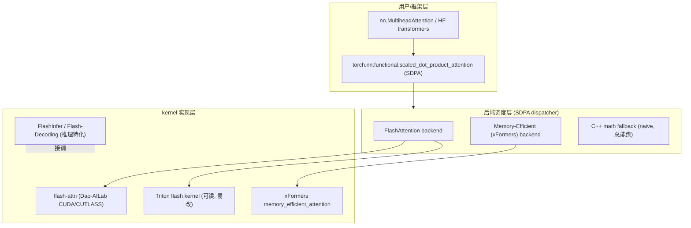
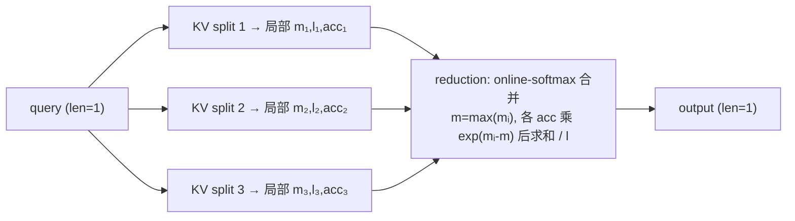

# FlashAttention · 进阶与生产实践

> 本文承接同目录的 [`flash_attention.py`](./flash_attention.py) 与 [`手把手教学.md`](./手把手教学.md)。
> toy 用纯 PyTorch + Python `for` 循环在 CPU 上证明了一件事：**分块 tiling + online softmax 与朴素注意力逐位精确等价，额外中间状态从 O(n²) 降到 O(n)。**
> 但「数值等价 + 显存账」只是 FlashAttention 思想的内核。要把它变成 H100 上真正跑得飞快的生产 kernel，中间隔着一整套 GPU 体系结构、并行化、变长/causal/MQA 支持与数值精度工程。本文就把这条「从 toy 到生产」的路打通。

本文中精确的 benchmark 数字一律用定性描述或「约」字标注，避免编造。术语保留英文。

---

## 0. 本项目 toy 与生产的差距

toy 故意只做对了「算法骨架」，把所有与硬件、并行、性能相关的东西全部省略——因为它的目标是**让你看懂 online softmax 的递推**，而不是跑得快。下面这张对照表逐项说明「demo 简化了什么 / 生产必须补什么」。

| 维度 | 本 toy 实现 | 生产实现（FlashAttention-2/3、SDPA、Triton…） | 为什么必须补 |
|---|---|---|---|
| **执行载体** | Python `for` 循环逐块 | 单个融合 CUDA/Triton kernel，整个分块循环跑在 SM 内 | Python 解释器 + 逐 op launch 开销巨大；融合才能让 S_blk 永远活在 SRAM/寄存器、不回 HBM |
| **内存层级** | 只有「一块内存」，无 SRAM/HBM 区分 | 显式管理 HBM↔SRAM 搬运，QKV tile 进 SRAM，S_blk 留寄存器/shared mem | FlashAttention 省的就是 HBM 访存；CPU 无此层级，所以 demo **看不到加速** |
| **并行维度** | 完全串行 | grid 并行：batch × head × Q-block 三维并行（v2 把 Q-block 提到最外） | 没有并行就没有吞吐；GPU 靠成千上万线程块填满 SM |
| **精度（dtype）** | `float64` 对拍（机器精度 ~1e-16） | fp16/bf16 计算，fp32 累加器（l、acc、softmax 统计量在 fp32） | 生产追求速度用低精度，但累加器必须升精度防误差累积 |
| **causal mask** | 无（练习里才加） | 内建 causal，且**跳过完全在对角线上方的块**（省掉一半计算） | 自回归生成必需；不跳块会白算被 mask 的下三角 |
| **变长 / padding** | 固定 `n`，无 batch | varlen 接口（cu_seqlens 累积长度），无 padding 浪费 | 真实 batch 句长不一，padding 到 max 会浪费大量算力 |
| **MQA / GQA** | 每个 head 独立 KV | KV head 数 < Q head 数，kernel 内广播复用 KV | 省 KV cache 显存与带宽，是现代 LLM 标配 |
| **反向传播** | 无（只有前向） | 重计算（recomputation）S/P 而非存 n×n，反向也分块 | 训练必需；存 n×n attention 矩阵会爆显存 |
| **dropout / bias / ALiBi** | 无 | kernel 内支持 attention bias、relative position、dropout | 不同模型族需要 |
| **block 大小** | 16/24，随手取 | 64/128，按 SRAM 容量、head_dim、warp 数精调 | 块太大放不进 SRAM，太小并行度/带宽利用率低 |
| **decode 阶段** | 不区分 prefill/decode | Flash-Decoding：单 query 时沿 **KV 序列维**再切分并行 | 解码时 query 只有 1 行，原始 FA 并行度严重不足 |

**一句话**：toy 证明了「算法是对的」；生产解决的是「在特定硬件上把这个对的算法跑到接近峰值带宽/算力」。两者是「数学正确」与「systems 工程」的关系。

---

## 1. 业界系统怎么做

### 1.1 整体格局：一个算法，多层封装



关键认知：**绝大多数工程师不该手写 attention kernel**，而是调 `F.scaled_dot_product_attention`（PyTorch 2.x 内建，自动选最优后端）或直接装 `flash-attn` 包。手写 Triton/CUDA 只在「需要新特性（自定义 mask/bias）」或「极致性能」时才做。

### 1.2 PyTorch SDPA：生产里的默认入口

`torch.nn.functional.scaled_dot_product_attention(q, k, v, attn_mask=, is_causal=, dropout_p=)` 是 PyTorch 2.0+ 的统一注意力 API。它在运行时**根据输入形状、dtype、是否 causal、硬件能力**自动 dispatch 到三个后端之一：

- **FlashAttention backend**：满足条件（fp16/bf16、head_dim ≤ 256、连续内存等）时优先用，最快。
- **Memory-Efficient backend**（源自 xFormers）：约束更宽松，支持任意 attn_bias，作为次优选择。
- **Math backend**：纯 PyTorch 实现的 naive 路径，**总能跑**，作为正确性兜底与 fallback。

工程取舍：SDPA 把「选哪个 kernel」这件事自动化了，代价是有时它选不到 Flash（比如你传了个不规则 mask），需要用 `torch.backends.cuda.sdp_kernel(...)` 上下文管理器强制指定后端来排查。

### 1.3 flash-attn 官方包（Dao-AILab）

`pip install flash-attn` 提供的是用 CUDA/CUTLASS 手写、针对 Ampere/Hopper 深度优化的 kernel，是性能天花板的参考实现。它暴露 `flash_attn_func`、`flash_attn_varlen_func`（变长）、`flash_attn_with_kvcache`（推理 decode）等接口。本仓库 [`../../llm-optimizer/FlashAttention.md`](../../llm-optimizer/FlashAttention.md) 对其原理（GPU 内存层级、v1/v2/v3 演进、反向）有完整推导。

### 1.4 xFormers：更早、更通用的「内存高效注意力」

xFormers 的 `memory_efficient_attention` 思路与 FlashAttention 同源（都是不物化 n×n），但更强调**通用性**：支持任意 attention bias（block-diagonal、causal、ALiBi 等）与可组合的 mask 抽象（`BlockDiagonalMask` 等），在变长/复杂 mask 场景下常比 flash-attn 更灵活。代价是某些规整场景下峰值性能略逊于专门优化的 flash-attn。详见 [`../../llm-optimizer/xformers.md`](../../llm-optimizer/xformers.md)。

### 1.5 Triton kernel：可读、可改的中间路线

OpenAI Triton 用 Python 语法写 GPU kernel，自动处理 tiling、shared memory、向量化。官方仓库带一个 ~200 行的 flash attention Triton 实现，**和本 toy 的两层循环结构几乎一一对应**：`tl.load` 把 Q/K/V tile 搬进 SRAM，循环内维护 `m_i`、`l_i`、`acc`，最后 `acc / l_i`。它是从 toy 进阶到「能在 GPU 上跑且能读懂」的最佳跳板——可读性接近本 demo，性能接近 flash-attn。

---

## 2. 关键变体与优化

### 2.1 FlashAttention-1（2022）：奠基

核心贡献：**IO-awareness**。指出 attention 在 GPU 上是 **memory-bound**（瓶颈是 HBM 读写 n×n 矩阵，不是 FLOPs），通过 tiling + online softmax 把 HBM 访存从 O(n²) 降到 O(n²/M)（M 为 SRAM 容量相关），反向用 recomputation 避免存 n×n。**这正是本 toy 复现的算法。** 论文：[arXiv:2205.14135](https://arxiv.org/abs/2205.14135)。

### 2.2 FlashAttention-2（2023）：把 GPU 喂饱

v1 的问题：并行度不足、非矩阵乘运算（rescale、exp）占比偏高，A100 上利用率约只有理论 FLOPs 的 30~40%。v2 的改动：

- **循环顺序调换**：外层遍历 **Q-block**（本 toy 正是 v2 视角！），内层遍历 K/V。这样每个 Q-block 独立，可分配给不同线程块并行，**沿序列维增加并行度**。
- **减少非 matmul 操作**：把 rescale 推迟到收尾，循环内尽量只做 matmul（GPU 上 matmul 通过 Tensor Core 远快于逐元素 exp/除法）。
- **更好的 work partitioning**：warp 间分工优化，减少 shared memory 通信。

结果：A100 上利用率提升到约 50~70%，相对 v1 约 2× 吞吐。论文：[arXiv:2307.08691](https://arxiv.org/abs/2307.08691)。

> 本 toy 第 (5) 步 `l = rescale*l + ...; acc = rescale*acc + ...` 是「每块都 rescale」的 v1 写法；v2 的优化是把 rescale 累积到最后一次性做。toy 为了可读性保留了逐块 rescale，二者数值等价。

### 2.3 FlashAttention-3（2024）：榨干 Hopper

针对 H100 的硬件特性专门优化：

- **异步 + warp specialization**：用 Hopper 的 TMA（Tensor Memory Accelerator）与异步 WGMMA，让数据搬运（producer warp）与计算（consumer warp）流水线重叠，隐藏 HBM 延迟。
- **FP8 支持**：用 H100 的 FP8 Tensor Core，配合 block quantization 控制精度损失，进一步提速。

结果：H100 上 fp16 利用率约达 75% 以上，FP8 更高。

### 2.4 Flash-Decoding：解码阶段的并行救星

**问题**：推理 decode 阶段，每步只生成 1 个 token，query 长度 = 1。此时 FA 的并行维度（batch × head × Q-block）里 Q-block 维度退化为 1，**并行度严重不足**，长 KV cache（几万 token）时整个 kernel 只有少数线程块在干活，GPU 大量 SM 空闲。

**方案**：沿 **KV 序列维**把长 KV cache 切成若干 split，每个 split 用一个线程块独立算「局部 online softmax 部分结果（局部 m、l、acc）」，最后再用一个 reduction kernel 把各 split 的部分结果**用 online softmax 合并规则归并**（正是本 toy 第 2~6 步的合并公式！）。



效果：长上下文 decode 时显著提升 GPU 利用率与吞吐。本仓库专门有 [`../../llm-inference/Flash-Decoding.md`](../../llm-inference/Flash-Decoding.md)；FlashInfer（[`../../llm-inference/FlashInfer.md`](../../llm-inference/FlashInfer.md)）则把这套思路与 PagedAttention KV cache 深度整合，是 vLLM/SGLang 等引擎的注意力后端。

### 2.5 causal / 变长 / MQA-GQA：生产三件套

- **causal mask**：不是简单 `masked_fill(-inf)`。生产 kernel 会**跳过完全位于对角线上方的 K-block**（这些块全被 mask，算了也是 0），把因果注意力的计算量近似砍半。只有跨对角线的块才真正做 mask。
- **变长（varlen）**：用 `cu_seqlens`（cumulative sequence lengths，前缀和数组）把一个 batch 的多条变长序列**首尾拼成一条**，kernel 内按 cu_seqlens 边界判定每个 Q 只在自己句子内做 attention。**完全避免 padding 浪费**——这是训练/推理吞吐的关键优化。
- **MQA/GQA**：Q 有 H 个 head，但 K/V 只有 H_kv 个（H_kv < H，GQA）或 1 个（MQA）。kernel 内让多个 Q head **共享/广播**同一份 KV，不复制 KV，省下 KV cache 显存（decode 时 KV cache 常是显存大头）与 HBM 带宽。

### 2.6 一张图看变体定位

| 变体 | 解决什么 | 代价 / 约束 | 适用阶段 |
|---|---|---|---|
| FA-1 | n×n 物化 → O(n) 显存 | 非 matmul 占比高、并行不足 | 训练/prefill |
| FA-2 | 并行度、matmul 占比 | 仅算法/调度优化，无新硬件依赖 | 训练/prefill（默认） |
| FA-3 | Hopper 异步 + FP8 | 仅 H100+、FP8 需控精度 | 训练/prefill（H100） |
| Flash-Decoding | decode 单 query 并行度 | 多一次 reduction kernel | decode |
| varlen | padding 浪费 | 需维护 cu_seqlens | 训练/推理 batch |
| MQA/GQA | KV cache 显存/带宽 | 模型架构需如此设计训练 | 训练+推理 |

---

## 3. 真实工程权衡与坑

### 3.1 显存 / 吞吐 / 延迟 / 精度 / 通信 的取舍

- **显存 vs 重计算**：训练反向时，FA 选择**不存** n×n 的 S/P 矩阵，而是在反向时**重算（recompute）**。这是「省显存 vs 多花 FLOPs」的经典权衡——多算一遍 forward 的局部，换来不存巨大中间矩阵。因为 attention 是 memory-bound，重算的 FLOPs 开销通常被省下的 HBM 访存收益盖过，净赚。
- **block 大小**：太大 → 放不进 SRAM（约 100~228KB/SM 量级），kernel launch 失败或 spill；太小 → 并行度够但 matmul 太小、Tensor Core 利用率低、HBM 带宽吃不满。生产里按 head_dim 和 GPU 架构调（常见 64/128）。head_dim 越大，能放进 SRAM 的块越小。
- **精度**：低精度（fp16/bf16）跑 matmul，但 **softmax 统计量（m、l）和累加器 acc 必须用 fp32**。否则长序列下 l（分母）的累加会损失有效位，输出明显偏差。bf16 因动态范围大（指数位多）通常比 fp16 更稳，是训练首选。
- **延迟 vs 吞吐**：Flash-Decoding 的 KV-split 提升吞吐（喂饱 GPU），但引入额外 reduction kernel，对极短 KV 的单请求**可能略增延迟**——所以引擎会按 KV 长度/batch 决定要不要启用 split。
- **通信**：单卡 attention 不涉通信；但 **context parallelism / sequence parallelism / Ring Attention** 把序列切到多卡时，需要把 KV block 在卡间环形传递，online softmax 的合并规则天然支持这种「分块再归并」（和 Flash-Decoding 的 reduction 同构）。这是长上下文训练（百万 token）的关键。

### 3.2 线上常见故障与调优

- **SDPA 静默回退到 math backend → 慢且费显存**。常因：传了非连续 mask、head_dim 超界、dtype 不符。排查：用 `torch.backends.cuda.sdp_kernel(enable_math=False)` 强制禁用 fallback，让它报错暴露真因；或开 `TORCH_LOGS` 看 dispatch。
- **`flash-attn` 装不上 / ABI 不匹配**。它需要和 CUDA、PyTorch 版本严格匹配编译，pip 编译耗时极长。生产用预编译 wheel 或锁定镜像。
- **变长忘了传/传错 cu_seqlens** → 跨句注意力（句子 A 的 token 看到句子 B），表现为 loss 异常或生成串味。务必校验 cu_seqlens 是前缀和且首 0 尾 total。
- **fp16 长序列输出 NaN/精度崩**：累加器没升 fp32，或某行全被 mask（全 -inf → l=0 → 除零）。FA 内部对「整行被 mask」有特判，自写 kernel 要注意。
- **causal 没跳块**：自写朴素 causal 把下三角也算了再 mask，白白浪费约一半算力。
- **head_dim 非 2 的幂 / 超 256**：很多 kernel 对 head_dim 有约束（≤128 或 ≤256，最好是 8/16 的倍数），不满足就回退或报错。
- **小序列上 FA 反而不快**：n 很小时 n×n 本就放得下，FA 的分块调度开销可能盖过收益。SDPA 会据此自动选 backend，手写时要按 n 设阈值。

---

## 4. 性能直觉与估算

给几个能在脑内/纸上手算的量级公式，建立数字直觉。

### 4.1 朴素 attention 中间矩阵显存

物化 S + P 两张 n×n（每元素 b 字节）：

```
M_naive ≈ 2 · n² · b   (单 head 单层单样本)
```

例：n=8192、fp16（b=2），单 head：2 × 8192² × 2 ≈ 256 MB。乘上 head 数 × layer 数 × batch，朴素法在长上下文下瞬间爆显存。FA 把这项降到 O(n·d)（只剩输出与片上小状态），这就是长上下文能跑的根因。本 toy 的 `memory_footprint_elements` 算的正是这笔账（n=8192 时朴素 1.34 亿元素 vs flash 每块恒定 928）。

### 4.2 attention 的 FLOPs 与「省 FLOPs 与否」

```
FLOPs(attention) ≈ 4 · n² · d   (QKᵀ 约 2n²d + PV 约 2n²d)
```

**FA 不改这个数**（甚至训练反向因重算略增）。FA 省的是 **HBM 访存量**，不是 FLOPs——这是最常被误解的点。

### 4.3 算术强度（arithmetic intensity）：判断 memory-bound

```
强度 = FLOPs / HBM字节数
```

朴素 attention 强度低（每读写一个 n×n 元素只做少量算），落在 GPU roofline 的 **memory-bound** 区——所以瓶颈是带宽。FA 通过把 S_blk 留在 SRAM、只把 Q/K/V/O 读写 HBM，**大幅提高算术强度**，把 attention 从 memory-bound 推向 compute-bound，于是能逼近峰值算力。

### 4.4 HBM 访存量的量级对比

```
朴素 ≈ O(n²)        (要写出再读回 n×n 的 S、P)
FA   ≈ O(n² · d / M) (M 为 SRAM 可容纳的元素数, 等价于把 n² 按块复用)
```

加速比直觉：**约正比于 HBM 访存量的下降比**，在长序列、带宽受限时收益最大；序列越长，FA 相对朴素的优势越夸张（toy 输出里 ratio 从 35× 涨到 14 万× 的趋势就是这个意思，只是 toy 算的是显存而非时间）。

### 4.5 KV cache 显存（与 MQA/GQA 收益）

```
M_kv ≈ 2 · n · d · H_kv · L · b   (2 = K和V, L=层数, H_kv=KV head 数)
```

MQA（H_kv=1）相对 MHA（H_kv=H）把 KV cache 显存与 decode 时的 HBM 读取量降到约 1/H；GQA 居中。这是 decode 阶段（memory-bound 于 KV cache 读取）提速的关键，和 Flash-Decoding 互补。

---

## 5. 动手进阶路线

把本 toy 升级到「接近生产」，建议按下面 5 步走，每步都能独立验证。

1. **加 causal + varlen + 多头/batch（仍 PyTorch）**。在现有两层循环外套 `for b, for h`，把 Q/K/V 扩到 `(B,H,n,d)`；按教学文「练习 4/5」加 causal mask，并实现「跳过对角线上方 K-block」的逻辑；再引入 cu_seqlens 模拟变长。验证：与「naive + 同 mask」对拍仍 PASS。**目标**：把功能补齐到生产语义，逻辑仍可读。

2. **改精度对拍，理解数值工程**。把 `DTYPE` 改成 fp32 再 fp16，观察误差从 ~1e-16 升到 ~1e-3；然后把 `m/l/acc` 强制 fp32 而 matmul 用低精度，看误差回落。**目标**：亲手验证「累加器必须升精度」这条生产铁律。

3. **重写成 Triton kernel**。这是从 CPU demo 跨到 GPU 的关键一跳。用 `tl.load` 把 Q/K/V tile 搬进 SRAM，循环内维护 `m_i/l_i/acc`，结构与本 toy 一一对应。先不追性能，能在 GPU 上数值对上 flash-attn 即可。**目标**：第一次写出真正跑在 SM 上、看得到 wall-clock 加速的 attention。**方向**：参考 Triton 官方 flash attention 教程。

4. **加反向（recomputation）**。前向只存 m/l（不存 n×n），反向时重算 S/P 分块求梯度。验证：与 `torch.autograd` 对 naive 的梯度对拍。**目标**：理解训练态 FA 的「省显存 vs 重算」权衡。

5. **做 Flash-Decoding split + reduction**。模拟 decode：query=1，把长 KV 切 split 并行算局部 (m,l,acc)，再用本 toy 的合并公式归并。验证：与不切分的 FA 输出一致。**目标**：理解推理特化与 online-softmax 合并规则的通用性（context parallel / Ring Attention 同理）。

> 进阶后别忘了「不要手写」原则：上述是为了**理解**；生产中优先 `F.scaled_dot_product_attention` 或 `flash-attn` 包，只有需要新特性时才落到 Triton。

---

## 6. 延伸阅读

**本仓库已有深度文档（优先读）：**

- [`../../llm-optimizer/FlashAttention.md`](../../llm-optimizer/FlashAttention.md) —— 原理详解：GPU 内存层级、online softmax 完整推导、v1/v2/v3 演进、反向传播、手算示例。本 toy 的两层循环与其伪代码 1:1 对应。
- [`../../llm-inference/Flash-Decoding.md`](../../llm-inference/Flash-Decoding.md) —— 解码阶段沿 KV 维并行的特化变体（第 2.4 节）。
- [`../../llm-inference/FlashInfer.md`](../../llm-inference/FlashInfer.md) —— Flash-Decoding + PagedAttention 整合的推理注意力后端（vLLM/SGLang 用）。
- [`../../llm-optimizer/xformers.md`](../../llm-optimizer/xformers.md) —— xFormers memory-efficient attention，通用 mask/bias 路线。
- [`../../llm-optimizer/kv-cache.md`](../../llm-optimizer/kv-cache.md) —— KV cache 与 MQA/GQA、decode 显存账（第 4.5 节）。
- [`../../llm-optimizer/`](../../llm-optimizer/) 与 [`../../llm-inference/`](../../llm-inference/) —— 注意力 / 推理优化合集。
- 本项目入口：[`./README.md`](./README.md)、[`./手把手教学.md`](./手把手教学.md)、[`./flash_attention.py`](./flash_attention.py)。

**经典论文与社区：**

- FlashAttention-1：[arXiv:2205.14135](https://arxiv.org/abs/2205.14135) —— *Fast and Memory-Efficient Exact Attention with IO-Awareness*。
- FlashAttention-2：[arXiv:2307.08691](https://arxiv.org/abs/2307.08691) —— 并行化与 work partitioning 优化。
- FlashAttention-3：[arXiv:2407.08608](https://arxiv.org/abs/2407.08608) —— Hopper 异步 + FP8。
- online softmax 源头：[arXiv:1805.02867](https://arxiv.org/abs/1805.02867) —— *Online normalizer calculation for softmax*。
- GQA：[arXiv:2305.13245](https://arxiv.org/abs/2305.13245) —— *GQA: Training Generalized Multi-Query Transformer Models*。
- Dao-AILab/flash-attention（官方 CUDA kernel + varlen/kvcache 接口）、OpenAI Triton flash attention 教程（可读 GPU 实现）。
- PyTorch SDPA 文档：`torch.nn.functional.scaled_dot_product_attention`。
- 社区合集：[xlite-dev/Awesome-LLM-Inference](https://github.com/xlite-dev/Awesome-LLM-Inference)。

---

> 这是 `llm-action`「动手可跑」实战系列的进阶篇：从本目录 CPU 可跑的最小 toy，打通到 FlashAttention-1/2/3、Flash-Decoding、SDPA、xFormers、Triton 的真实生产实现。**记住内核：FA 是精确的内存重排，省 HBM 访存而非 FLOPs；toy 证明算法正确，生产解决在硬件上跑满带宽/算力。**
