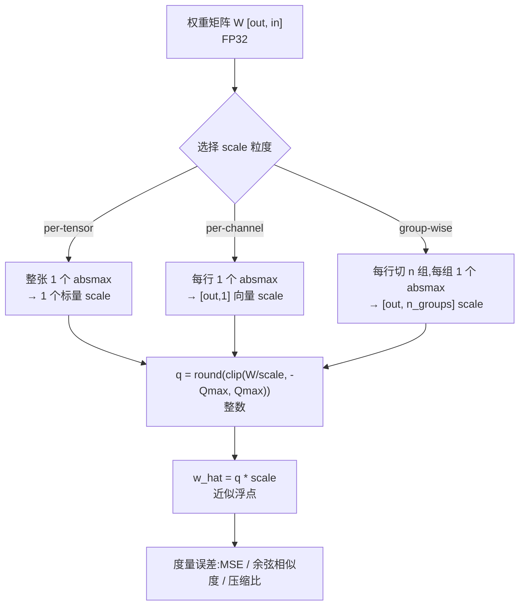

# 手把手教学:从零实现权重量化 INT8/INT4

> 一句话导览:本文带你逐行读懂 `quantization.py`,在一个 CPU 几十秒可跑通的 toy MLP 上,把"权重量化"从最底层走一遍。学完这篇你能:
>
> 1. 彻底搞懂**对称量化(symmetric quantization)**的三个核心公式:`q = round(clip(w/scale, -Qmax, Qmax))`、`w_hat = q*scale`、`scale = absmax/Qmax`;
> 2. 讲清 **absmax / per-tensor / per-channel / 分组(group-wise)** 四种 scale 粒度的区别与适用场景;
> 3. 用 **MSE / 余弦相似度 / 压缩比**三把尺子量化"误差 vs 压缩"的权衡,知道为什么 INT8 近乎无损而 INT4 误差明显放大;
> 4. 看懂脚本每一行打印的数字代表什么、为什么呈现那样的趋势;
> 5. 动手改超参做小实验,并能预判结果。

---

## 0. 前置知识与环境

**你需要会一点点:**

- Python 基础(函数、类、`for` 循环);
- 知道 PyTorch 里 `torch.Tensor` 是个"多维数组",`weight.shape` 是它的形状;矩阵乘 `y = x @ W.T` 就是神经网络一层在做的事;
- 中学/大一的数学:绝对值、四舍五入、均方误差。**不需要**会 CUDA、不需要 GPU、不需要训练过模型。

**环境安装(CPU 即可,不联网):**

```bash
pip install numpy torch
# 可选:装了它会额外存一张误差柱状图,不装也完全不影响主流程
pip install matplotlib
```

参考版本:Python 3.13 / numpy 2.3 / torch 2.12(CPU)。

**怎么打开跑:**

```bash
cd practical-projects/06-quantization-int8-int4
python quantization.py
```

整个脚本不读任何数据集、不联网、不需要 gym,所有"数据"都是脚本内部用固定随机种子(`SEED = 0`)生成的,因此**每次运行结果完全一致、可复现**。这对教学很重要——你看到的数字和本文贴的数字应当一模一样。

---

## 1. 问题背景:不用量化会怎样

设想一个真实的大模型,比如 7B(70 亿参数)。每个参数如果用 FP32(32 位浮点)存储:

$$
7 \times 10^9 \text{ 个参数} \times 4 \text{ 字节} = 28 \text{ GB}
$$

光是把权重塞进显存就要 28 GB——一张消费级显卡(8~24 GB)根本装不下。即便换成 FP16(16 位),也要 14 GB。

**核心痛点有两个:**

1. **显存装不下**:模型权重太大,放不进 GPU,更别说还要留空间给激活值和 KV cache。
2. **带宽喂不饱**:推理时算力往往不是瓶颈,**把权重从显存搬到计算单元**才是瓶颈(memory-bound)。权重越小,搬得越快,生成 token 越快。

量化的思路:**用更少的比特表示同一个权重**。

- FP32 → INT8:每个数从 4 字节变 1 字节,**理论压缩 4 倍**,28 GB → 7 GB;
- FP32 → INT4:每个数变 0.5 字节,**理论压缩 8 倍**,28 GB → 3.5 GB。

但天下没有免费的午餐:用 8 位整数只能表示 256 个不同的值,4 位只能表示 16 个值。把连续的浮点"塞进"这么少的格点,必然产生**量化误差**。本项目就是要让你**亲眼看到**这个误差有多大、用什么技巧能把它压下来。

> 这就是贯穿全文的主线:**精度 vs 压缩的权衡(accuracy-compression trade-off)**。

---

## 2. 核心原理详解

### 2.1 对称量化:把浮点投影到整数格点

"对称"的意思是:整数区间关于 0 对称,即 $[-Q_{max}, +Q_{max}]$。给定位宽 `bits`:

$$
Q_{max} = 2^{(\text{bits}-1)} - 1
$$

- INT8:$2^{7}-1 = 127$,可用整数 $\{-127, \dots, -1, 0, 1, \dots, 127\}$;
- INT4:$2^{3}-1 = 7$,可用整数 $\{-7, \dots, 7\}$。

**为什么是 $2^{(\text{bits}-1)}-1$ 而不是 $2^{(\text{bits}-1)}$?** 8 位本可以表示 $-128 \sim 127$ 共 256 个值。但对称量化故意**牺牲一个码位**(不用 $-128$),换来区间关于 0 严格对称。好处是:**零点(zero-point)恒为 0**,反量化只需一次乘法 `q * scale`,不需要再加偏移量,硬件实现最简单、最友好。这是工程上的经典取舍。

### 2.2 scale:浮点世界与整数世界之间的"汇率"

`scale` 是连接浮点和整数的桥梁。它回答一个问题:**"整数 1 代表多大的浮点量?"**

量化(浮点 → 整数):

$$
q = \mathrm{round}\!\left(\mathrm{clip}\!\left(\frac{w}{scale},\ -Q_{max},\ +Q_{max}\right)\right)
$$

反量化(整数 → 近似浮点):

$$
\hat{w} = q \times scale
$$

把两步合起来,反量化得到的 $\hat{w}$ 与原始 $w$ 之间的差,就是**量化误差** $|w - \hat{w}|$。

### 2.3 absmax:scale 怎么选

对称量化里,`scale` 用 **absmax(最大绝对值)** 思路确定:让权重里**绝对值最大**的那个数,恰好映射到整数边界 $Q_{max}$ 上(不浪费、也不溢出)。

$$
scale = \frac{\mathrm{absmax}(w)}{Q_{max}}, \qquad \mathrm{absmax}(w) = \max_i |w_i|
$$

直觉:如果某行权重最大绝对值是 0.508,INT8 的 $Q_{max}=127$,那么 $scale = 0.508/127 \approx 0.004$。意思是"整数 127 代表 0.508,整数 1 代表 0.004",量化格点间距就是 0.004。

### 2.4 粒度:absmax 在多大范围内取

关键洞察:**absmax 取的范围越"局部",误差越小**。原因是——如果一行里有一个特别大的离群值(outlier),它会把 absmax 撑得很大,导致 scale 很大、格点很稀,其余的小数值就被"压扁"到很少几个格点上,误差暴涨。范围取得越小,离群值的"污染"范围就越小。

三种粒度,从粗到细:

| 粒度 | absmax 取值范围 | scale 个数(权重 `[out, in]`) | 典型用途 |
|------|----------------|------------------------------|---------|
| **per-tensor** | 整张权重 1 个 | 1 | 最省、最糙 |
| **per-channel(逐行)** | 每个输出通道(行)1 个 | `out` 个 | LLM INT8 标配,误差大幅下降 |
| **group-wise(分组)** | 每行再切成小组,每组 1 个 | `out × n_groups` 个 | INT4(GPTQ/AWQ)常用,4bit 下压住误差 |



粒度越细,scale 个数越多(要多存一点),但误差越小。这是**误差 vs scale 存储开销**的次级权衡——在 INT4 下,多存一点 scale 仍然很划算。

---

## 3. 代码逐段精讲

下面按逻辑把 `quantization.py` 拆成 7 段。每段先贴关键代码,再逐块解释"在干什么、为什么这么写、对应原理哪一步",并标出新手易困惑点。

### 3.1 顶部:固定随机种子(可复现)

```python
import numpy as np
import torch

SEED = 0
np.random.seed(SEED)
torch.manual_seed(SEED)
```

- 只依赖 `numpy` 和 `torch`,纯 CPU。
- `np.random.seed` / `torch.manual_seed` 把随机数发生器钉死在 `SEED = 0`。这样每次运行,`ToyMLP` 的随机初始化权重都一样,你看到的所有数字都可复现。**教学代码必须可复现**,否则你没法验证自己学对没。

> 易困惑点:脚本里**并没有训练**任何模型,权重就是 PyTorch 默认的随机初始化值。我们关心的不是"模型准不准",而是"量化前后权重/输出差多少"。

### 3.2 量化最小内核:对称量化 / 反量化

```python
def qmax_for_bits(bits: int) -> int:
    """返回该位宽下对称量化能表示的最大正整数。"""
    return (1 << (bits - 1)) - 1  # 2^(bits-1) - 1


def symmetric_quantize(weight: torch.Tensor, scale: torch.Tensor, bits: int):
    qmax = qmax_for_bits(bits)
    q = torch.round(weight / scale)
    q = torch.clamp(q, min=-qmax, max=qmax)
    return q


def symmetric_dequantize(q: torch.Tensor, scale: torch.Tensor):
    return q * scale
```

- `qmax_for_bits`:`1 << (bits-1)` 是位移运算,等于 $2^{(\text{bits}-1)}$;减 1 得到 $Q_{max}$。`bits=8` 返回 127,`bits=4` 返回 7。**这正对应 2.1 的公式。**
- `symmetric_quantize` 严格实现 2.2 的量化公式:
  - `weight / scale`:把浮点缩放到整数尺度(这步是"投影到格点");
  - `torch.round(...)`:四舍五入到最近整数;
  - `torch.clamp(..., -qmax, qmax)`:夹紧到 $[-Q_{max}, Q_{max}]$,防止溢出。
- `symmetric_dequantize`:就是一行 `q * scale`,对应 $\hat{w} = q \times scale$。

> 易困惑点 1:这里返回的 `q` 是**整数值**,但它的 dtype 仍然是浮点张量(只是数值是整数)。教学代码用浮点"模拟"整数,真实推理才会以 int8/int4 真正存储。所以本项目的压缩比是"估算值",没有真实内存节省。
>
> 易困惑点 2:`scale` 既可以是标量(per-tensor),也可以是能广播(broadcast)回 `weight` 形状的向量(per-channel/group)。`weight / scale` 借助 PyTorch 的广播机制,自动让每行/每组用对应的 scale。这是整段代码能"一套公式吃三种粒度"的关键。

### 3.3 三种 scale 计算策略

```python
def per_tensor_scale(weight, bits):
    absmax = weight.abs().max()
    scale = absmax / qmax_for_bits(bits)
    return scale  # 标量

def per_channel_scale(weight, bits):
    absmax = weight.abs().amax(dim=1, keepdim=True)  # 每行取一个最大绝对值
    scale = absmax / qmax_for_bits(bits)
    return scale  # [out, 1]

def grouped_quantize(weight, bits, group_size):
    out_features, in_features = weight.shape
    assert in_features % group_size == 0
    n_groups = in_features // group_size
    w_g = weight.reshape(out_features, n_groups, group_size)
    absmax = w_g.abs().amax(dim=2, keepdim=True)   # [out, n_groups, 1]
    scale_g = absmax / qmax_for_bits(bits)
    q_g = torch.round(w_g / scale_g)
    q_g = torch.clamp(q_g, -qmax_for_bits(bits), qmax_for_bits(bits))
    q = q_g.reshape(out_features, in_features)
    scale = scale_g.reshape(out_features, n_groups)  # [out, n_groups]
    return q, scale, group_size
```

这三个函数全在实现 2.4 的"粒度",区别只在 **absmax 在多大范围内取**:

- **per_tensor**:`weight.abs().max()` 对**整张张量**取一个标量最大绝对值 → 一个标量 scale。
- **per_channel**:`amax(dim=1, keepdim=True)` 沿 `dim=1`(输入维)取最大,**每行保留一个值**。`keepdim=True` 让结果形状是 `[out, 1]` 而不是 `[out]`,这样后面 `weight / scale` 能自动广播回每一行。
- **grouped_quantize**:先 `assert in_features % group_size == 0` 保证能整除(toy 权重已对齐);再把每行 `reshape` 成 `[out, n_groups, group_size]`,沿**最后一维(组内)**取 absmax,于是**每组一个 scale**。算完整数后 `reshape` 回原形状返回。

> 易困惑点:`amax` 和 `max` 的区别。`max(dim=...)` 会返回 `(values, indices)` 元组;`amax(dim=...)` 只返回最大值张量,更干净,所以这里用 `amax`。
>
> 形状追踪很重要:`W1` 是 `[128, 64]`(`out=128, in=64`)。per_channel 的 scale 是 `[128, 1]`(128 个);group=32 时 `n_groups = 64/32 = 2`,scale 是 `[128, 2]`(256 个)。粒度越细,scale 越多。

对应的分组反量化:

```python
def grouped_dequantize(q, scale, group_size):
    out_features, in_features = q.shape
    n_groups = in_features // group_size
    q_g = q.reshape(out_features, n_groups, group_size)
    scale_g = scale.reshape(out_features, n_groups, 1)
    w_hat_g = q_g * scale_g
    return w_hat_g.reshape(out_features, in_features)
```

逻辑是 `grouped_quantize` 的逆:reshape 成分组形状,逐组 `q * scale`,再还原形状。`scale_g` 最后补一个维度 `, 1)` 是为了广播到组内每个元素。

### 3.4 误差 / 压缩比度量(三把尺子)

```python
def mse(a, b):
    return torch.mean((a - b) ** 2).item()

def cosine_sim(a, b):
    a_flat = a.reshape(-1)
    b_flat = b.reshape(-1)
    return torch.nn.functional.cosine_similarity(a_flat, b_flat, dim=0).item()

def compression_ratio(bits, scale_numel, weight_numel, fp_bits=32):
    original_bits = weight_numel * fp_bits
    quantized_bits = weight_numel * bits + scale_numel * 16  # scale 按 FP16 估
    return original_bits / quantized_bits
```

- **MSE(均方误差)**:$\frac{1}{N}\sum (w_i - \hat w_i)^2$。**越小越好**,直接反映反量化后权重多接近原始权重。`.item()` 把单元素张量转成 Python float。
- **余弦相似度**:把权重拉平成向量后算 $\cos\theta = \frac{a \cdot b}{\|a\|\|b\|}$。**越接近 1 越好**。它衡量"方向"是否一致,对整体缩放很稳健,常用来判断量化是否"伤筋动骨"。
- **压缩比**:`original_bits / quantized_bits`。分子是 $N \times 32$;分母是 $N \times \text{bits}$(权重整数位)$+$ `scale_numel × 16`(scale 仍按 FP16 存,粗略按 16 位)。

> 易困惑点:为什么 per_channel/group 的压缩比**低于**理论值?因为它们要**多存 scale**。per-tensor 只有 1 个 scale,几乎不占地方,压缩比最接近理论值(INT8≈4x、INT4≈8x);粒度越细 scale 越多,分母变大,压缩比略降。这正是 2.4 末尾说的次级权衡。这是教学级估算,真实框架还有 zero-point、bit-packing 等细节。

### 3.5 toy MLP:把误差传导到"模型输出"

```python
class ToyMLP(torch.nn.Module):
    def __init__(self, in_dim=64, hidden=128, out_dim=32):
        super().__init__()
        self.fc1 = torch.nn.Linear(in_dim, hidden, bias=False)
        self.act = torch.nn.ReLU()
        self.fc2 = torch.nn.Linear(hidden, out_dim, bias=False)

    def forward(self, x):
        return self.fc2(self.act(self.fc1(x)))

def clone_with_weights(model, w1, w2):
    new = ToyMLP(model.fc1.in_features, model.fc1.out_features, model.fc2.out_features)
    with torch.no_grad():
        new.fc1.weight.copy_(w1)
        new.fc2.weight.copy_(w2)
    return new
```

- `ToyMLP` 是个极小的两层 MLP:`fc1`(64→128)→ `ReLU` → `fc2`(128→32),都 `bias=False`(没有偏置,简化)。它**不训练**,纯粹用来观察"量化权重后,前向输出变了多少"。
- `clone_with_weights`:造一个结构相同的新模型,把两层权重换成(量化反量化后的)`w1`、`w2`。`with torch.no_grad()` 关掉梯度追踪(只做推理,不需要梯度),`.copy_()` 原地拷贝权重。

> 为什么要这一步?光看权重 MSE 还不够直观,我们真正关心的是**最终输出**变了多少。把量化误差喂进前向,看输出的变化,才贴近真实工程关心的指标。

> 易困惑点:`model.fc1.out_features` 就是 hidden=128,`model.fc2.out_features` 就是 out_dim=32,所以 `clone_with_weights` 里 `ToyMLP(in, out_features_of_fc1, out_features_of_fc2)` 恰好还原出 `(64, 128, 32)` 的结构。

### 3.6 统一接口:一个函数封装三种方案

```python
def quantize_weight(weight, method, bits, group_size=32):
    if method == "per_tensor":
        scale = per_tensor_scale(weight, bits)
        q = symmetric_quantize(weight, scale, bits)
        w_hat = symmetric_dequantize(q, scale)
        scale_numel = 1
    elif method == "per_channel":
        scale = per_channel_scale(weight, bits)            # [out, 1]
        q = symmetric_quantize(weight, scale, bits)
        w_hat = symmetric_dequantize(q, scale)
        scale_numel = scale.numel()
    elif method == "group":
        q, scale, gs = grouped_quantize(weight, bits, group_size)
        w_hat = grouped_dequantize(q, scale, gs)
        scale_numel = scale.numel()
    else:
        raise ValueError(f"unknown method: {method}")
    return w_hat, scale_numel
```

这是个"分发器":根据 `method` 字符串走不同分支,统一返回**反量化后的权重 `w_hat`** 和 **scale 元素个数 `scale_numel`**(后者用来算压缩比)。`group_size` 默认 32,只有 `group` 分支用得到。`scale.numel()` 返回 scale 张量的元素总数。

> 这种"统一接口"的封装让后面的对比循环非常干净——同一行代码就能横向比较所有方案。

### 3.7 demo 主流程:A / B / C 三段实验

`run_demo()` 是整个脚本的主入口,分三段。

**构造模型,取出第一层权重:**

```python
model = ToyMLP(in_dim=64, hidden=128, out_dim=32)
W1 = model.fc1.weight.detach().clone()  # 形状 [128, 64]
W2 = model.fc2.weight.detach().clone()  # 形状 [32, 128]
```

`.detach()` 切断梯度,`.clone()` 拷贝一份,避免后续操作影响原模型。`W1` 是主要的量化对象。

**[A] 在 fc1 权重上对比误差 + 压缩比:**

```python
configs = [
    ("per_tensor",  8,  None),
    ("per_channel", 8,  None),
    ("per_tensor",  4,  None),
    ("per_channel", 4,  None),
    ("group",       4,  32),
    ("group",       4,  16),
]
for method, bits, gs in configs:
    kwargs = {"group_size": gs} if gs else {}
    w_hat, scale_numel = quantize_weight(W1, method, bits, **(kwargs or {}))
    err = mse(W1, w_hat)
    cos = cosine_sim(W1, w_hat)
    cr = compression_ratio(bits, scale_numel, W1.numel())
    ...
```

6 个配置覆盖了 INT8/INT4 × per_tensor/per_channel/group(g32、g16)。循环里对每个配置:量化反量化得 `w_hat`,算 MSE、余弦、压缩比,打印一行。`kwargs = {"group_size": gs} if gs else {}` 只在 group 方案传 `group_size`。

**[B] 端到端前向:量化权重后输出差多少:**

```python
x = torch.randn(8, 64)               # 一个 toy batch
with torch.no_grad():
    y_fp = model(x)                  # FP32 参考输出
for name, method, bits, gs in fwd_configs:
    w1_hat, _ = quantize_weight(W1, method, bits, **(kwargs or {}))
    w2_hat, _ = quantize_weight(W2, method, bits, **(kwargs or {}))
    qmodel = clone_with_weights(model, w1_hat, w2_hat)
    with torch.no_grad():
        y_q = qmodel(x)
    out_mse = mse(y_fp, y_q)
    out_cos = cosine_sim(y_fp, y_q)
    max_dy = (y_fp - y_q).abs().max().item()
```

造一个 batch=8 的随机输入 `x`,先跑 FP32 得参考输出 `y_fp`;再对**两层权重都量化**,造量化模型 `qmodel`,跑出 `y_q`;对比输出的 MSE、余弦、最大逐元素绝对差 `max|dy|`。**这步把权重误差传导到了最终输出**,是更贴近实际的指标。

**[C] 一次"量化-反量化"的整数轨迹:**

```python
row0 = W1[0]
scale8 = per_channel_scale(W1, 8)[0]   # 该行的 INT8 scale(标量)
q8 = symmetric_quantize(row0, scale8, 8)
w8 = symmetric_dequantize(q8, scale8)
scale4 = per_channel_scale(W1, 4)[0]
q4 = symmetric_quantize(row0, scale4, 4)
w4 = symmetric_dequantize(q4, scale4)
```

取 `W1` 第 0 行的前 6 个权重,逐个打印 `fp32 → int8_q → int8_hat / int4_q → int4_hat`。这让你**亲眼看到**:一个浮点数怎么变成整数、再变回近似浮点,以及 INT8 和 INT4 的 scale 大小差异(INT4 的 scale 大得多,因为 $Q_{max}$ 只有 7)。

**[可选] 画图 + 结论:** 脚本尝试用 matplotlib 存一张误差柱状图 `quant_error.png`(`matplotlib.use("Agg")` 用无界面后端);用 `try/except` 包住,**没装 matplotlib 也不崩**,自动降级为纯文本提示。最后打印 `[summary]` 四条结论。

> 易困惑点:为什么全程只用 ASCII 打印、中文只在注释里?因为 Windows 控制台默认 GBK 编码,直接 `print` 中文容易 `UnicodeEncodeError`。这是 Windows 中文环境的常见坑,脚本特意规避了。

---

## 4. 跑起来 + 逐行读懂输出

运行命令:

```bash
python quantization.py
```

### 4.1 [A] 段输出:权重误差 & 压缩比

```
[A] quantization error & compression on fc1.weight (FP32 baseline)
method         bits           MSE      cosine   compress
--------------------------------------------------------
per_tensor        8     8.115e-08    0.999992      4.00x
per_channel       8     7.751e-08    0.999992      3.88x
per_tensor        4     2.643e-05    0.997466      8.00x
per_channel       4     2.528e-05    0.997579      7.53x
group/g32         4     2.403e-05    0.997696      7.11x
group/g16         4     2.207e-05    0.997888      6.40x
```

逐列含义:

- **MSE**:反量化权重与原始权重的均方误差,**越小越好**。
- **cosine**:余弦相似度,**越接近 1 越好**。
- **compress**:压缩比,**越大越省**。

逐行读趋势:

1. **INT8(两行)MSE 都是 `~1e-8` 级,余弦 0.999992**——INT8 近乎无损。256 个格点对这种温和分布的权重绰绰有余。
2. **INT4(四行)MSE 跳到 `~1e-5` 级**——比 INT8 大了约 1000 倍!因为只有 15 个格点(-7~7),格点稀疏,误差自然大。
3. **同位宽下,粒度越细误差越小**:INT4 里 `per_tensor(2.643e-05) > per_channel(2.528e-05) > group/g32(2.403e-05) > group/g16(2.207e-05)`,误差逐级下降,余弦逐级上升。这验证了 2.4 的核心结论。
4. **压缩比**:INT8 per_tensor 正好 `4.00x`(理论值,scale 只占 1 个数可忽略);INT4 per_tensor `8.00x`。粒度越细 scale 越多,压缩比略降(g16 的 `6.40x` 比 g32 的 `7.11x` 低,因为 g16 的 scale 数量翻倍)。**这就是"误差 vs scale 存储"的权衡**。

> 注意 toy 权重是随机初始化、分布很温和的,所以连 per_tensor INT8 都几乎无损。真实 LLM 权重有离群值,per_tensor 误差会远大于这里——这正是 per_channel/group 在工程上必要的原因。

### 4.2 [B] 段输出:端到端前向差异

```
[B] end-to-end forward: FP32 output vs quantized-weight output
scheme                       out-MSE    out-cosine     max|dy|
--------------------------------------------------------------
INT8 per_tensor            1.824e-06      0.999986      0.0043
INT8 per_channel           1.773e-06      0.999987      0.0056
INT4 per_channel           6.381e-04      0.995316      0.0948
INT4 group=32              5.970e-04      0.995377      0.0727
```

逐列含义:

- **out-MSE**:量化模型输出 vs FP32 输出的均方误差;
- **out-cosine**:两个输出向量的余弦;
- **max|dy|**:逐元素最大绝对差(最坏情况的单点误差)。

逐行读趋势:

1. **INT8 两行 out-MSE `~1e-6`,余弦 0.99998,max|dy| 仅 ~0.004~0.006**——前向输出几乎不变,**INT8 端到端近乎无损**。
2. **INT4 out-MSE 跳到 `~6e-4`(放大约 300 倍),余弦掉到 0.9953,max|dy| ~0.07~0.09**——误差明显放大,但余弦仍 >0.99,**仍然可用**。
3. **INT4 group=32 比 per_channel 更好**(out-MSE `5.970e-04 < 6.381e-04`,max|dy| `0.0727 < 0.0948`),再次印证更细粒度压住误差。

> 易困惑点:[B] 把**两层权重都量化**(fc1 和 fc2),误差会比单层略有累积,所以即便 INT8 的 max|dy| 也比权重层面看起来"更明显"一点——这是误差在网络里传播的正常现象。

### 4.3 [C] 段输出:量化-反量化轨迹

```
[C] quantize-dequantize trace on first 6 weights of fc1 row 0
  INT8 scale=0.00xxx   INT4 scale=0.0xxxx
        fp32   int8_q   int8_hat   int4_q   int4_hat
     0.xxxx      ...      0.xxxx      ...     0.xxxx
     ...
```

读法:每行是一个原始 fp32 权重,经过 INT8/INT4 量化成整数(`int8_q`/`int4_q`),再反量化回近似浮点(`int8_hat`/`int4_hat`)。你会观察到:

- **INT8 的 scale 比 INT4 小很多**(因为 $Q_{max}$ 是 127 vs 7,同样 absmax 下 scale 相差约 18 倍);
- **int8_hat 几乎等于 fp32**(格点密),**int4_hat 偏差肉眼可见**(格点稀);
- 整数列 `int8_q` 取值范围在 ±127 内、`int4_q` 在 ±7 内,绝对值最大的那个权重对应的整数恰好接近 $Q_{max}$(absmax 的作用)。

### 4.4 [summary] 段

```
[summary]
  - INT8 per_channel: near-lossless (cosine ~1.0, tiny MSE).
  - INT4 error is larger but group-wise quant brings it back down.
  - finer groups -> lower error, slightly more scale storage.
  - compression ratio grows as bits drop (FP32 -> INT8 ~4x, INT4 ~8x).

DONE. Quantization demo finished successfully.
```

看到 `DONE. Quantization demo finished successfully.` 就说明全流程跑通了。

---

## 5. 动手改造(练习)

按由易到难的顺序,改完都重跑 `python quantization.py` 观察。

### 练习 1(易):加一个更细的分组 group=8
在 `configs` 列表里加一行 `("group", 4, 8)`。
**预期**:MSE 比 g16 更低、余弦更高,但压缩比进一步下降(scale 又翻倍)。提示:`in_features=64` 能被 8 整除,合法。

### 练习 2(易):试试 INT2 会怎样
在 `configs` 里加 `("per_channel", 2, None)`。`qmax_for_bits(2)` 返回 $2^1-1=1$,即只有 {-1, 0, 1} 三个格点。
**预期**:MSE 暴涨、余弦明显下降,前向输出可能"面目全非"。这直观告诉你**位宽过低的代价**,也说明为什么 2bit 量化需要更复杂的算法(本朴素实现远不够)。

### 练习 3(中):放大权重里的离群值
在取出 `W1` 后,人为制造一个离群值:`W1[0, 0] = W1.abs().max() * 20`。
**预期**:`per_tensor` 的误差会**大幅恶化**(一个离群值撑大了整张的 scale,其余权重被压扁),而 `per_channel`/`group` 受影响小得多(离群值只污染它所在的行/组)。这复现了真实 LLM 里 per-tensor 失效、per-channel/group 必要的根本原因。

### 练习 4(中):换非对称(加 zero-point)
当前是对称量化(零点=0)。试着新增一个 `asymmetric_quantize`:`scale = (max-min)/(2^bits-1)`,`zero_point = round(-min/scale)`,`q = round(w/scale)+zero_point`,反量化 `w_hat = (q-zero_point)*scale`。
**预期**:对**偏态**(不关于 0 对称)的数据,非对称量化误差更小。提示:激活值常偏态,所以激活量化常用非对称。

### 练习 5(难):用真实预训练权重替换 toy 权重
加载一个真实小模型的某层 Linear 权重(比如从 HuggingFace 取一层),替换 `W1`。
**预期**:真实权重分布有重尾/离群值,per_tensor INT4 误差会远大于本 toy 例子,per_channel 与 group 的收益会比这里**明显得多**。这是从"toy 直觉"迈向"真实工程"的关键一跳。

---

## 6. 常见坑与排错

1. **`AssertionError: in_features must be divisible by group_size`**:`group_size` 必须能整除 `in_features`(本例 64)。改 group 时只能选 64 的因数(64/32/16/8/4/...)。
2. **Windows 控制台打印中文报 `UnicodeEncodeError`**:脚本已规避(只打印 ASCII)。如果你自己加了中文 `print`,要么 `chcp 65001` 切 UTF-8,要么继续用英文打印。
3. **没装 matplotlib**:不影响主流程,`try/except` 会打印 `[plot] skipped (...)` 并继续。想看柱状图就 `pip install matplotlib`。
4. **scale 出现 0 导致除零/NaN**:若某行/某组**全为 0**,absmax=0 → scale=0 → `w/scale` 变 NaN。toy 随机权重不会全 0,但用真实数据或人为构造时要警惕,真实框架会给 scale 加一个极小下限(eps)。
5. **以为压缩比是"真实省了内存"**:本项目用浮点张量**模拟**整数,没有真正 bit-packing,压缩比是估算值,**没有真实内存/速度收益**。真实加速要靠 int4 打包 + 定制 CUDA kernel。
6. **改了代码结果没变**:别忘了固定的 `SEED=0` 让权重可复现;如果你改的分支没被 `configs`/`fwd_configs` 选中,自然看不到变化——确认你改对了被执行的配置。
7. **混淆 `max` 与 `amax`**:`tensor.max(dim=)` 返回 `(values, indices)` 元组,直接拿来当数用会出错;本项目用 `amax` 只取值,别替换成 `max`。

---

## 7. 一图速查 / 知识卡片

**三个核心公式:**

| 步骤 | 公式 |
|------|------|
| 量化 | `q = round(clip(w/scale, -Qmax, +Qmax))` |
| 反量化 | `w_hat = q * scale` |
| scale(absmax) | `scale = absmax / Qmax` |
| Qmax | `Qmax = 2^(bits-1) - 1`(INT8=127,INT4=7) |

**三种粒度对照:**

| 函数 | 粒度 | scale 形状(W=[out,in]) | 误差 | 压缩比 |
|------|------|------------------------|------|--------|
| `per_tensor_scale` | 整张 | 标量(1) | 最大 | 最接近理论 |
| `per_channel_scale` | 逐行 | `[out,1]` | 中 | 略降 |
| `grouped_quantize` | 逐组 | `[out, n_groups]` | 最小 | 最低(scale 多) |

**三把度量尺子:**

| 指标 | 函数 | 好的方向 | 看什么 |
|------|------|---------|--------|
| MSE | `mse` | 越小越好 | 权重/输出数值偏差 |
| 余弦相似度 | `cosine_sim` | 越接近 1 越好 | 方向是否一致 |
| 压缩比 | `compression_ratio` | 越大越省 | 存储节省(估算) |

**关键超参 / 数值清单:**

- `SEED = 0`(可复现);`ToyMLP(in_dim=64, hidden=128, out_dim=32)`;`W1=[128,64]`、`W2=[32,128]`;
- `quantize_weight(..., group_size=32)` 默认分组 32;batch `x = torch.randn(8, 64)`;
- 经验趋势:**INT8 ≈ 4x 压缩、近乎无损**;**INT4 ≈ 8x 压缩、误差明显但可用**;**粒度越细越准、scale 越多**。

---

## 8. 延伸阅读

**本仓库相关文档(相对路径):**

- 量化文档总目录:[`../../llm-compression/quantization`](../../llm-compression/quantization)
- 量化基础:[`../../llm-compression/quantization/量化基础.md`](../../llm-compression/quantization/量化基础.md)
- 大模型量化概述:[`../../llm-compression/quantization/大模型量化概述.md`](../../llm-compression/quantization/大模型量化概述.md)
- LLM.int8():[`../../llm-compression/quantization/LLM-int8.md`](../../llm-compression/quantization/LLM-int8.md)
- GPTQ:[`../../llm-compression/quantization/GPTQ.md`](../../llm-compression/quantization/GPTQ.md)
- SmoothQuant:[`../../llm-compression/quantization/SmoothQuant.md`](../../llm-compression/quantization/SmoothQuant.md)
- 本项目简介:[`./README.md`](./README.md)

**经典论文(理解本项目后再读,会顺很多):**

- [LLM.int8(): 8-bit Matrix Multiplication for Transformers at Scale — arXiv:2208.07339](https://arxiv.org/abs/2208.07339) —— 激活离群值分解,本项目未涉及激活量化的难点。
- [GPTQ: Accurate Post-Training Quantization — arXiv:2210.17323](https://arxiv.org/abs/2210.17323) —— 基于 Hessian 的逐列误差补偿,比本项目的朴素 round-to-nearest 更准。
- [SmoothQuant — arXiv:2211.10438](https://arxiv.org/abs/2211.10438) —— 把激活的离群难度"平滑"迁移到权重上。
- [AWQ: Activation-aware Weight Quantization — arXiv:2306.00978](https://arxiv.org/abs/2306.00978) —— 4bit group-wise 的代表作,正是本项目 group 布局的工程升级版。

**下一步学习路线(从本项目的三件套出发):**

1. 你已掌握 **scale / per-channel / group** 三件套(本项目);
2. → 加 **zero-point**(非对称/仿射量化),理解为什么激活量化要它;
3. → 学 **GPTQ 的误差补偿**(为什么逐列纠错比朴素 round 更准);
4. → 学 **激活量化与离群值**(LLM.int8()、SmoothQuant);
5. → 了解 **真实 bit-packing + CUDA kernel**(为什么本项目压缩比只是"估算")。

> 与真实工程的差距(本项目刻意省略,作为延伸钩子):只做对称量化、只量化权重不碰激活、无真实位打包、PTQ 且无误差补偿、toy 规模。理解了本项目,再读上面的论文会顺畅很多。
