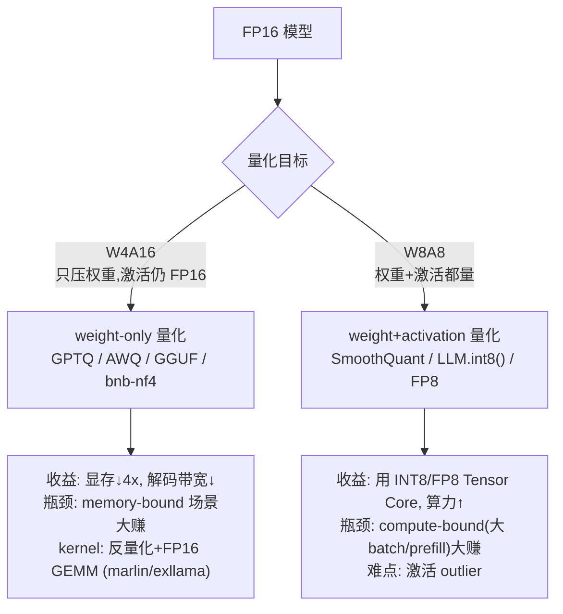

# 量化 · 进阶与生产实践

> 本文承接 `quantization.py` 与 [`手把手教学.md`](./手把手教学.md)。toy 脚本带你把**对称量化 + per-channel/group + absmax**走通了,误差/压缩比也能手算。但那只是"原理对了"。本文回答的是另一个问题:**真实把一个 70B 模型量化到 4bit、丢进 vLLM/TGI/llama.cpp 上线服务,中间隔着哪些工程?为什么 GPTQ/AWQ/SmoothQuant 要那样设计?线上会踩哪些坑?** 术语保留英文,精确 benchmark 用定性或"约"。

---

## 0. 本项目 toy 与生产的差距

toy 脚本是"教科书量化":对称、只量权重、round-to-nearest(RTN)、用浮点张量模拟整数、没有真实 kernel。生产系统每一条都得补齐。先看对照表:

| 维度 | 本项目 toy 实现 | 生产必须补什么 | 在仓库哪里展开 |
|------|----------------|----------------|----------------|
| **量化算法** | RTN(round-to-nearest),逐元素独立取整 | GPTQ(Hessian 误差补偿)/ AWQ(activation-aware 缩放)/ SpinQuant(旋转) | `GPTQ.md`、`SpinQuant.md` |
| **量化对象** | 只量 weight | weight + activation(W8A8)、KV cache、有时连 embedding/lm_head 都要决策 | `kv-cache-quant.md`、`SmoothQuant.md` |
| **离群值(outlier)** | toy 权重分布温和,RTN 就够 | 激活有 ~100x 的系统性 outlier,必须 LLM.int8() 分解 / SmoothQuant 迁移 / AWQ 保护 | `LLM-int8.md`、`SmoothQuant.md` |
| **对称 vs 非对称** | 只有对称(zero-point=0) | 激活/偏态分布常用非对称(asymmetric/affine),多存 zero-point | `量化基础.md` |
| **数据类型** | INT8/INT4 整数 | INT4/INT8 + **FP8(E4M3/E5M2)**、**FP4(MXFP4/NVFP4)**、INT3、混合精度 | `fp8.md`、`fp4.md` |
| **存储** | 浮点张量"模拟",无真实压缩 | 真实 **bit-packing**(8 个 int4 塞进 1 个 int32)+ 打包/解包 kernel | — |
| **计算** | `q*scale` 用 FP32 算,无加速 | 定制 **fused dequant + GEMM** CUDA kernel(W4A16 的 marlin / exllama,W8A8 的 cutlass INT8 Tensor Core) | `llm-inference/` |
| **校准(calibration)** | 无,scale 直接 absmax | PTQ 要跑 128~512 条 calibration 样本估激活范围;clip 而非 absmax | `大模型量化概述.md` |
| **精度验证** | toy MSE/cosine | PPL(WikiText)+ 下游 benchmark(MMLU/GSM8K)+ 人工抽检,防"PPL 没掉但能力塌方" | `llm-eval/` |
| **格式/互操作** | 自定义返回值 | **GGUF**(llama.cpp)、GPTQ/AWQ checkpoint、`bitsandbytes` 在线量化、compressed-tensors | `tools.md` |
| **规模** | 64×128 toy MLP,秒级 | 7B~405B,量化本身要几十分钟~几小时,layer-by-layer 省显存 | — |

**一句话:toy 证明了"量化能省、误差可控";生产要解决的是"在有 outlier、要真加速、要不掉点、还要能被推理引擎加载"这四件事。**

---

## 1. 业界系统怎么做

主流量化分两大流派,核心区别是**量不量激活**,这决定了用什么硬件指令、能省多少:



**weight-only(W4A16)—— 当前开源主流。** 权重量到 4bit,激活保持 FP16。推理时 kernel 先把 int4 反量化回 FP16,再做 FP16 GEMM。

- **GPTQ**:PTQ 的事实标准之一。不是逐元素 RTN,而是基于 **Hessian** 的逐列量化 + 误差补偿——量化某列后,把引入的误差用还没量化的列"吸收"掉。需要 calibration 数据估 Hessian。group-size 常用 128。
- **AWQ**(Activation-aware Weight Quantization):观察到"不是所有权重一样重要",由**激活幅度**决定哪些权重通道是 salient 的(约 1%),给这些通道乘一个保护性 scale 再量化,等价于把量化难度从重要通道转走。精度常优于/持平 GPTQ,且无需反向,量化更快。
- **GGUF / llama.cpp**:CPU/边缘端事实标准。一套 k-quant 方案(Q4_K_M、Q5_K_M、Q6_K…),本质是 **group-wise + 混合精度**(不同张量用不同位宽,attention/ffn 关键层位宽高一点),还有 super-block 两级 scale。`_M`/`_S`/`_L` 是精度/体积档位。
- **bitsandbytes**:HF 生态"开箱即用",`load_in_8bit`(LLM.int8() 算法)/`load_in_4bit`(NF4,4bit NormalFloat,假设权重近高斯用非均匀格点)。优点是**加载即量化无需 calibration**,适合微调(QLoRA);缺点是 kernel 通用、峰值吞吐不如 marlin。

**weight+activation(W8A8 / FP8)—— 大 batch / 高吞吐服务的方向。**

- **SmoothQuant**:激活有 outlier 难量,权重好量。它做一个数学等价变换 `(X·diag(s)⁻¹)·(diag(s)·W)`,把激活的量化难度按通道**平滑迁移**一部分到权重上,让两边都能 INT8。
- **LLM.int8()**:把激活中 outlier 维度(系统性出现在固定几个 channel)挑出来用 FP16 算,其余 99%+ 走 INT8,再拼回。是"混合精度分解",不丢点但有额外开销。
- **FP8(H100/Ada 起)**:E4M3(精度高,做权重/激活)+ E5M2(动态范围大,做梯度)。硬件原生 Tensor Core 支持,近乎无损,是当前**训练/推理 SOTA 数据类型**,DeepSeek-V3 即 FP8 训练。

---

## 2. 关键变体与优化

逐个讲清"解决什么问题、代价是什么"。

### 2.1 GPTQ —— 用 Hessian 补偿,不让误差累积
toy 的 RTN 把每个权重独立取整,误差是"撒胡椒面"式累加。GPTQ 的洞察:量化是有顺序的,量化第 j 列引入的误差,可以**更新尚未量化的列**来补偿。误差更新方向由该层的 Hessian `H = 2·XᵀX`(X 为 calibration 激活)给出。
- 解决:同样 4bit,PPL 比 RTN 明显更低。
- 代价:需要 calibration 数据 + 算 Hessian 逆,量化慢、显存占用高;对 calibration 分布有依赖(领域偏移可能掉点)。
- 仓库:[`../../llm-compression/quantization/GPTQ.md`](../../llm-compression/quantization/GPTQ.md)

### 2.2 AWQ —— 保护"重要"权重,而非平均对待
toy 里所有通道一视同仁。AWQ:由 activation 幅度找出 salient 通道(约 0.1%~1%),量化前给它们乘一个 per-channel scale `s`(并反向除回激活,保持等价),让重要通道的有效分辨率更高。
- 解决:低 bit(4bit、甚至 3bit)下精度更稳,且不需要反传 → 量化快。
- 代价:需要 calibration 估 activation 统计;scale 搜索有超参。
- 直觉:与本 toy 的 group-wise 是互补关系——group 是"细化 scale 粒度",AWQ 是"按重要性重分配格点"。

### 2.3 SmoothQuant —— 把激活的难度搬给权重
激活 outlier 让 per-tensor 激活量化崩盘(正是 toy 练习 3 那个现象的真实放大版)。等价变换:
```
Y = X · W  =  (X · diag(s)⁻¹) · (diag(s) · W)
```
逐通道 `s = (max|X_j|)^α / (max|W_j|)^(1-α)`(α≈0.5)把激活幅度"借"给权重。
- 解决:让 W8A8 可行,吃上 INT8 Tensor Core 算力。
- 代价:s 是离线统计的,分布漂移会失效;权重被放大后自身量化误差略升,需平衡 α。
- 仓库:[`../../llm-compression/quantization/SmoothQuant.md`](../../llm-compression/quantization/SmoothQuant.md)

### 2.4 W4A16 vs W8A8 —— 不是谁更好,是看 batch
这是生产**最重要的选型判断**,直接由 roofline 决定:

| | W4A16(weight-only) | W8A8(含激活) |
|---|---|---|
| 谁受益 | **小 batch / 单请求解码**(memory-bound):省的是权重搬运带宽 | **大 batch / prefill**(compute-bound):吃的是 INT8/FP8 算力 |
| 显存 | 权重 ~4x↓,激活不变 | 权重 ~2x↓ + 激活/KV 也能省 |
| kernel | 需 dequant→FP16 GEMM,小 batch 极快;大 batch 反量化反成瓶颈 | 原生 INT8 GEMM,大 batch 吞吐高 |
| 难度 | 只动权重,简单、不掉点 | 要处理激活 outlier(SmoothQuant 等) |
| 典型 | 本地/低并发对话(AWQ/GPTQ/GGUF) | 高并发 API 服务(FP8 + KV 量化) |

经验法则:**单用户、追延迟 → W4A16;高并发、追吞吐/成本 → W8A8 或 FP8。** 很多生产部署是 **W4A8** 折中(权重 4bit 省显存,激活 8bit 吃算力,见 `QQQ-W4A8.md`)。

### 2.5 KV cache 量化 —— 长上下文的真正瓶颈
权重量化省的是"模型本身",但长 context、大 batch 下,**KV cache 显存常常超过权重**(每 token 每层都要存 K、V)。把 KV 从 FP16 量到 INT8/FP8/INT4:
- 收益:KV 显存 2~4x↓ → 能开更长 context、更大 batch → 吞吐直接涨。
- 难点:KV(尤其 K)也有 outlier,per-token 或 per-channel scale;太激进(INT4 KV)会伤长程依赖、影响 needle-in-haystack。
- 实践:vLLM/TGI 支持 `kv_cache_dtype=fp8`,通常近乎无损;INT4 KV 要谨慎评测。
- 仓库:[`../../llm-compression/quantization/kv-cache-quant.md`](../../llm-compression/quantization/kv-cache-quant.md)

### 2.6 FP8 / FP4 —— 浮点格式回归
INT4 是均匀格点;权重近高斯,均匀格点在尾部浪费。浮点格点(FP4 的 E2M1、NF4)在 0 附近密、尾部疏,更贴分布。
- **FP8**:H100/Ada 原生,训练推理都能用,近乎无损,是趋势。E4M3 做前向,E5M2 做大动态范围。
- **FP4(MXFP4 / NVFP4)**:Blackwell 起硬件支持,block 内共享一个 micro-scale(类似 toy 的 group,但更细 + 硬件原生)。是 4bit 的下一代,精度比 INT4 RTN 好。
- 仓库:[`../../llm-compression/quantization/fp8.md`](../../llm-compression/quantization/fp8.md)、[`../../llm-compression/quantization/fp4.md`](../../llm-compression/quantization/fp4.md)

---

## 3. 真实工程权衡与坑

**(1) "PPL 没涨但模型变笨了"。** PPL/MSE 是平均指标,对**长尾能力**(代码、数学、多轮指令)不敏感。INT4 量化常见:WikiText PPL 只涨一点点,但 GSM8K/HumanEval 掉好几个点。**必须跑下游 benchmark 而非只看 PPL/cosine**(toy 的 cosine 0.995 看着很美,真实模型这个 cosine 可能已经掉了关键能力)。

**(2) 激活 outlier 是 W8A8 的头号杀手。** 它系统性集中在少数 channel、幅度可达常规值的~100x。直接 per-tensor 激活量化 → scale 被撑大 → 普通激活全被压成几个格点 → 模型崩。这就是 LLM.int8()/SmoothQuant 存在的根本原因,也正是 toy "练习 3 放大离群值"想让你体会的现象。

**(3) calibration 数据的坑。** GPTQ/AWQ 用的 128 条 calibration 样本,分布要贴近线上。拿纯英文 wiki 校准、上线服务中文/代码 → 系统性掉点。校准集太小过拟合、太大变慢。

**(4) group-size 的甜区。** group-size=128 几乎是社区默认:再大(per-channel)误差升,再小(g32)scale 存储和访存开销升、kernel 效率掉。这是 toy "粒度越细越准、scale 越多"权衡的工程落点——**不是越细越好,kernel 友好度也要算进去**。

**(5) kernel 缺失 = 量了不快甚至更慢。** 量化省的是带宽/显存,但若没有融合 kernel(在线 dequant 走慢路径),大 batch 下反量化开销可能吃掉收益,出现"量化后比 FP16 还慢"。务必用匹配的高性能 kernel(marlin/exllamav2 之于 W4A16,cutlass INT8 之于 W8A8),并在**目标 batch size**上压测。

**(6) outlier 之外的数值坑。** scale=0(某组全零)→ 除零 NaN(toy 练习里点过,真实框架加 eps);量化后 lm_head/embedding 误差被 softmax 放大,常**保留这两层为高精度**;BatchNorm/LayerNorm 融合顺序错会引入偏差。

**(7) 格式互锁。** GPTQ checkpoint 不能直接喂给只认 AWQ 的 kernel;GGUF 是 llama.cpp 专用;`bitsandbytes` 是运行时在线量化、不产出可分发的量化权重。**先确定推理引擎,再选量化格式**,否则量完发现加载不了。

**(8) 通信视角(分布式推理)。** TP(tensor parallel)下权重切分跨卡,量化降低了 per-card 权重体积但不直接降 all-reduce 通信量(激活/KV 量化才降通信);量化权重的切分要保证 group 不跨 TP 边界,否则 scale 对不齐。

---

## 4. 性能直觉与估算

几个能口算的量级公式(数量级直觉,非精确)。

**(a) 权重显存。** 参数量 `P`,位宽 `b` bits:
```
权重显存 ≈ P × b / 8  字节  (+ scale 开销，group-size=g 时 scale 约占 P/g × 2 字节)
```
- 7B FP16:`7e9 × 2 ≈ 14 GB`;INT8 ≈ 7 GB;INT4 ≈ 3.5 GB(+ g128 scale 约 +0.1 GB)。
- 70B INT4 ≈ 35 GB → 单张 48GB 卡可上;FP16 的 140 GB 则要多卡。

**(b) 解码带宽 → token 速率(memory-bound 直觉)。** 自回归解码每出 1 token 要把**全部权重读一遍**:
```
单 token 解码时间 ≈ 权重字节 / 显存带宽
理论最大 tok/s ≈ 显存带宽(GB/s) / 权重字节(GB)
```
- 7B FP16(14GB)在 ~1 TB/s 带宽卡:上限 ~70 tok/s;
- 同卡 INT4(3.5GB):上限 ~280 tok/s。**这就是 W4A16 在单请求解码上约 ~3-4x 的来源——省的是带宽,不是算力。**

**(c) 加速比上限。** weight-only 解码加速 ≈ 位宽比(FP16→INT4 ≈ 4x 上限),实际因 dequant 开销、激活仍 FP16,常达 ~2-3x。W8A8 大 batch 的加速来自算力(INT8 Tensor Core 约 FP16 的 ~2x TFLOPS),与 batch 强相关。

**(d) KV cache 显存。**
```
KV 字节 ≈ 2(K,V) × layers × 2(FP16) × n_kv_heads × head_dim × seq_len × batch
```
- 量化 KV 到 INT8 → 此式 ×0.5,FP8 同理。长 context 下这块常和权重一个量级,**量 KV 的边际收益经常高于再压权重**。

**(e) 压缩比为何达不到理论值(toy 已埋伏笔)。** 实际位宽 ≈ `b + 16/g`(每 g 个权重摊一个 FP16 scale)。g=128、b=4 → 有效 ~4.125 bit,压缩比 ≈ 32/4.125 ≈ 7.8x,略低于理论 8x。非对称再加 zero-point 还要 +。

---

## 5. 动手进阶路线

把本 toy 往生产推,分 5 步,每步给方向(不必一次写完,逐级加难度):

**Step 1 — 加非对称量化 + 真实 bit-packing。** 在 toy 上实现 `asymmetric_quantize`(scale=(max-min)/(2^bits-1),zero_point=round(-min/scale)),并用 `torch` 把 8 个 int4 真正打包进 int32(`>>`/`&`/`|`),写对应 unpack。目标:让"压缩比"从估算变成**真实内存下降**,体会 packing 的复杂度。

**Step 2 — 上真实权重 + calibration + clip。** 用 HF 取一个真实小模型(如 OPT-125M / TinyLlama)某层 Linear 权重替换 W1,跑几十条文本拿激活统计,把 scale 从 absmax 换成 **percentile clip**(如 99.9% 分位裁离群)。目标:复现"真实权重 per-tensor 崩、per-channel/group 救场"的工程现象。

**Step 3 — 实现 GPTQ 风格误差补偿。** 在你的真实层上实现"逐列量化 + 用 Hessian(`XᵀX`)更新剩余列"的最简 GPTQ,对比 RTN 的 PPL/输出 MSE。目标:亲手验证"为什么有 calibration + 补偿就更准"。

**Step 4 — 处理激活 outlier(SmoothQuant 迷你版)。** 给该层加 per-channel smoothing scale,把激活难度迁移给权重,做一把 W8A8,对比直接 per-tensor 激活量化的崩坏程度。目标:理解 weight-only 之外、含激活量化的真正难点。

**Step 5 — 接入真实推理引擎。** 用 `auto-gptq`/`autoawq` 量化一个 7B,导出 checkpoint,丢进 **vLLM**(或用 `llama.cpp` 转 GGUF),在目标 batch 上压测 tok/s 与显存,再跑 MMLU/GSM8K 看掉点。目标:把"算法对"变成"线上能服务、可度量、不掉关键能力"。

---

## 6. 延伸阅读

**本仓库已有深度文档(优先读):**

- 量化总目录:[`../../llm-compression/quantization`](../../llm-compression/quantization)
- 量化基础(对称/非对称/zero-point):[`../../llm-compression/quantization/量化基础.md`](../../llm-compression/quantization/量化基础.md)
- 大模型量化概述(PTQ/QAT、calibration):[`../../llm-compression/quantization/大模型量化概述.md`](../../llm-compression/quantization/大模型量化概述.md)
- GPTQ:[`../../llm-compression/quantization/GPTQ.md`](../../llm-compression/quantization/GPTQ.md)
- SmoothQuant:[`../../llm-compression/quantization/SmoothQuant.md`](../../llm-compression/quantization/SmoothQuant.md)
- LLM.int8()(激活 outlier 分解):[`../../llm-compression/quantization/LLM-int8.md`](../../llm-compression/quantization/LLM-int8.md)
- SpinQuant(旋转消除 outlier):[`../../llm-compression/quantization/SpinQuant.md`](../../llm-compression/quantization/SpinQuant.md)
- W4A8:[`../../llm-compression/quantization/QQQ-W4A8.md`](../../llm-compression/quantization/QQQ-W4A8.md)
- KV cache 量化:[`../../llm-compression/quantization/kv-cache-quant.md`](../../llm-compression/quantization/kv-cache-quant.md)
- FP8 / FP4 / FP6:[`../../llm-compression/quantization/fp8.md`](../../llm-compression/quantization/fp8.md)、[`../../llm-compression/quantization/fp4.md`](../../llm-compression/quantization/fp4.md)、[`../../llm-compression/quantization/fp6.md`](../../llm-compression/quantization/fp6.md)
- ZeroQuant 系列:[`../../llm-compression/quantization/ZeroQuant.md`](../../llm-compression/quantization/ZeroQuant.md)、[`../../llm-compression/quantization/ZeroQuant(4+2).md`](../../llm-compression/quantization/ZeroQuant(4+2).md)
- MoE 模型量化:[`../../llm-compression/quantization/moe模型量化.md`](../../llm-compression/quantization/moe模型量化.md)
- QAT(量化感知训练):[`../../llm-compression/quantization/llm-qat`](../../llm-compression/quantization/llm-qat)
- 工具与生态:[`../../llm-compression/quantization/tools.md`](../../llm-compression/quantization/tools.md)
- 本项目入门:[`./手把手教学.md`](./手把手教学.md)、[`./README.md`](./README.md)
- 推理引擎(kernel/部署):[`../../llm-inference`](../../llm-inference)、评测:[`../../llm-eval`](../../llm-eval)

**经典论文:**

- LLM.int8() — [arXiv:2208.07339](https://arxiv.org/abs/2208.07339)
- GPTQ — [arXiv:2210.17323](https://arxiv.org/abs/2210.17323)
- SmoothQuant — [arXiv:2211.10438](https://arxiv.org/abs/2211.10438)
- AWQ — [arXiv:2306.00978](https://arxiv.org/abs/2306.00978)
- QLoRA(NF4)— [arXiv:2305.14314](https://arxiv.org/abs/2305.14314)
- SpinQuant — [arXiv:2405.16406](https://arxiv.org/abs/2405.16406)
- FP8 Formats for Deep Learning — [arXiv:2209.05433](https://arxiv.org/abs/2209.05433)

**社区/工程:**

- `auto-gptq` / `AutoAWQ` / `bitsandbytes` / `llama.cpp`(GGUF k-quant)/ `vllm`(marlin、FP8 KV)/ `compressed-tensors`(统一量化 checkpoint 格式)。

> 心法回顾:toy 教会你"量化的数学是对的";生产把这套数学放进**有 outlier、要真加速、不能掉关键能力、还要被引擎加载**的现实里。读懂本文的对照表与选型判断(W4A16 vs W8A8、量不量 KV),再回头看上面的论文与仓库文档,会非常顺。
