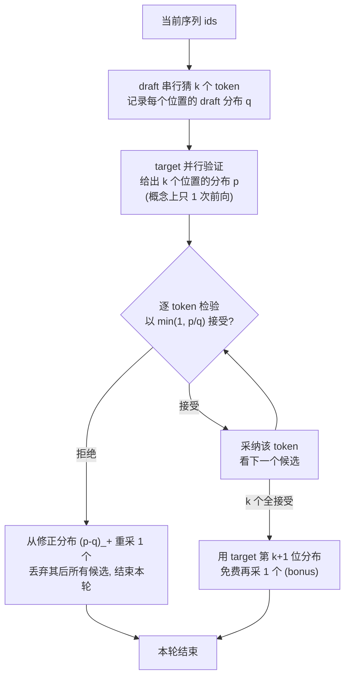

# 手把手教学：从零实现投机采样（Speculative Decoding）

> 配套代码：本目录下 `speculative_decoding.py`（纯 numpy，CPU 几秒跑完）。
> 本文是「逐段精讲 + 逐行读输出」的完整教程，没接触过投机采样的同学也能照着学会。

**一句话导览 —— 学完这篇你能掌握什么：**

1. 说清楚投机采样为什么能给大模型推理加速，加速到底来自哪里（一次 target 前向产出 > 1 个 token）。
2. 亲手推导「接受概率 `min(1, p/q)` + 修正分布 `(p-q)_+`」，并理解它为什么是**分布无损**的（输出分布和纯 target 采样一模一样）。
3. 读懂 `speculative_decoding.py` 里每一个函数（`CharNGramLM` / `autoregressive_sample` / `speculative_sample` / `verify_distribution`）的每一步在干什么。
4. 跑通脚本，逐条解释屏幕上每个数字（`avg_accept_len`、`speedup`、`TV distance`）是什么意思、为什么是这个趋势。
5. 自己动手改超参做 3~5 个小实验，预测并验证「draft 越准 → 接受长度越高 → 加速越大」。

---

## 0. 前置知识与环境

**需要会的（不会也能边学边补）：**

- Python 基础：`list`、`dict`、`tuple`、`for/while` 循环。
- 一点点概率：什么是「概率分布」（一个长度为 V 的向量，每项 ≥ 0、加起来为 1），什么是「按分布采样」（`rng.choice(V, p=probs)`）。
- 知道「自回归语言模型」干的事：给定前面的字 `x_<t`，吐出下一个字的概率分布 `P(x_t | x_<t)`。**注意：本项目里我们要的是完整的概率分布，不是只取最可能的那个字。** 这点是投机采样能成立的前提。

**环境：** 只需要 numpy，`matplotlib` 可选（缺了会自动降级成纯文本，不会崩）。

```bash
# 如果还没装
pip install numpy
pip install matplotlib   # 可选，用来画接受长度直方图
```

**怎么跑：**

```bash
cd practical-projects/07-speculative-decoding
python speculative_decoding.py
```

整段约 1.5 秒跑完。读代码不需要任何 GPU。

---

## 1. 问题背景：不用这个技术会怎样

大模型生成文本是**自回归**的：要写第 100 个字，必须先把前 99 个字写出来，因为第 100 个字依赖前面所有字。于是解码是**严格串行**的——

```
前向1 → 出 token1
前向2 → 出 token2
...
前向200 → 出 token200     # 想要 200 个 token，就得跑 200 次大模型前向
```

代码里 `autoregressive_sample` 就是这个朴素做法，它的统计变量 `target_forwards` 每产出 1 个 token 就 `+1`，跑完正好等于 `n_new`（脚本里 = 200）。

**痛点在哪？** 一次大模型前向，无论你只要 1 个 token 的概率还是要 100 个位置的概率，**访存（把上百亿权重从显存搬到计算单元）的代价几乎一样**。也就是说：「只产出 1 个 token」严重浪费了这次前向的带宽。大模型推理是**访存受限（memory-bound）**的，算力其实没吃满。

**朴素的省钱思路有什么问题？**

- 「干脆用小模型生成」→ 速度快了，但小模型笨，质量掉了。**改变了输出分布**，不可接受。
- 「小模型生成、大模型只在不确定时介入」→ 没有严格的数学保证，分布会偏。

投机采样的高明之处：**用小模型（draft）猜一串，用大模型（target）一次前向批量验证，再用一个精巧的接受/回退规则把分布纠回 target 的真实分布**。结果是：速度借了小模型的光，分布却和「纯大模型采样」**逐 token 完全一致**——这就是「无损（lossless）」。

---

## 2. 核心原理详解

### 2.1 一轮投机采样在干什么

设当前已生成序列为 `ids`。一轮的流程（对应代码 `speculative_sample` 的 while 循环）：



关键点：**本轮无论接受几个 token，target 只算 1 次前向**（代码里 `target_forwards += 1` 在循环里只出现一次）。所以如果平均每轮能确认 2~3 个 token，target 的前向次数就降到原来的 1/2~1/3，这就是加速。

### 2.2 接受/回退采样准则（最核心的数学）

记号：对某个候选位置，draft 给出分布 $q$，target 给出分布 $p$，draft 已经从 $q$ 采出了候选 token $x$。准则是：

$$
\text{以概率 } \alpha(x) = \min\!\left(1, \frac{p(x)}{q(x)}\right) \text{ 接受 } x.
$$

直觉拆解：

- 若 $p(x) \ge q(x)$（target 比 draft 更看好 $x$）：$\alpha = 1$，**必接受**。draft 没有「过度自信」，没问题。
- 若 $p(x) < q(x)$（draft 比 target 更看好 $x$，可能是 draft 瞎猜）：以比例 $p(x)/q(x)$ 接受，**按比例打折**，把 draft 多采的那部分概率质量「退回去」。

如果**拒绝**了，不能就这么结束——这个位置还没产出 token。我们从**修正分布（residual / corrected distribution）**重采一个：

$$
p_{\text{res}}(\cdot) = \frac{\big(p(\cdot) - q(\cdot)\big)_+}{\sum_y \big(p(y) - q(y)\big)_+},
\qquad (z)_+ \triangleq \max(z, 0).
$$

直觉：`(p - q)_+` 只保留「target 比 draft 更想要、但 draft 给少了」的那些 token 上的概率质量缺口，归一化后采样，正好把漏掉的补回来。代码里就是：

```python
residual = np.clip(p - q, 0.0, None)   # (p - q)_+
residual = residual / residual.sum()   # 归一化
x_fix = rng.choice(len(residual), p=residual)
```

### 2.3 为什么这样就「无损」？—— 一行推导

只要证明：经过「先从 $q$ 采 $x$、按 $\alpha$ 接受、否则从 $p_{\text{res}}$ 重采」之后，**最终产出 token 等于某个值 $x$ 的总概率正好等于 $p(x)$**。

最终产出 $x$ 有两条路径：

1. **接受路径**：draft 采到 $x$（概率 $q(x)$）且被接受（概率 $\alpha(x)=\min(1, p(x)/q(x))$）：
$$
q(x)\cdot \min\!\Big(1,\tfrac{p(x)}{q(x)}\Big) = \min\big(q(x),\, p(x)\big).
$$

2. **回退路径**：发生了一次拒绝（任意被拒），然后从 $p_{\text{res}}$ 采到了 $x$。一次拒绝的总概率是
$$
\beta = \sum_y q(y)\big(1-\alpha(y)\big) = \sum_y \big(q(y)-\min(q(y),p(y))\big) = \sum_y \big(q(y)-p(y)\big)_+ = \sum_y \big(p(y)-q(y)\big)_+,
$$
（最后一步因为 $\sum p=\sum q=1$，正缺口和负缺口绝对值相等）。而从 $p_{\text{res}}$ 采到 $x$ 的概率是 $\dfrac{(p(x)-q(x))_+}{\beta}$。两者相乘，$\beta$ 约掉：
$$
\beta\cdot \frac{(p(x)-q(x))_+}{\beta} = \big(p(x)-q(x)\big)_+.
$$

把两条路径相加：

$$
\min\big(q(x),p(x)\big) + \big(p(x)-q(x)\big)_+ = p(x).
$$

（因为若 $p(x)\le q(x)$，第一项 $=p(x)$、第二项 $=0$；若 $p(x)>q(x)$，第一项 $=q(x)$、第二项 $=p(x)-q(x)$，相加 $=p(x)$。）

**结论：产出 $x$ 的概率恰好是 $p(x)$，与纯 target 采样一致。无论 draft $q$ 多烂，分布都不偏——draft 只影响速度（接受率），不影响分布。** 这正是 Leviathan et al. 2022（arXiv:2211.17192）定理 1。

### 2.4 平均接受长度与加速比

设每个位置被接受的概率近似为 $\alpha$（接受率，由 draft 与 target 的接近程度决定）。一轮中接受的 token 数服从「连续接受直到第一次失败」的几何型分布，每轮**确认的 token 期望**约为

$$
\mathbb{E}[\text{accepted per round}] \approx \frac{1-\alpha^{k}}{1-\alpha}\cdot(\text{近似}),
$$

直观地说：$\alpha$ 越接近 1、$k$ 越大，每轮能确认越多 token。代码里这个量就是 `avg_accept_len`。

加速比定义为「产出同样多 token 时，target 前向次数减少多少」：

$$
\text{speedup} = \frac{\text{target forwards (纯自回归)}}{\text{target forwards (投机采样)}}.
$$

注意脚本里还有「免费 bonus 一步」：一轮里 k 个全接受，就用 target 第 k+1 位的分布再免费采 1 个，于是**每轮最多前进 k+1 个 token**。所以「每次 target 前向产出的 token 数」会比 `avg_accept_len` 还大（输出里 `tokens per target forward` 通常 = `avg_accept_len + 1` 量级）。

---

## 3. 代码逐段精讲

下面把 `speculative_decoding.py` 按逻辑拆成 6 段，每段：贴关键代码 → 解释在干嘛 → 标新手易困惑点。

### 3.1 数据：toy 语料 + 词表

```python
def build_corpus():
    base = "the quick brown fox jumps over the lazy dog . "
    return base * 60

def build_vocab(text):
    chars = sorted(set(text))
    stoi = {c: i for i, c in enumerate(chars)}
    itos = {i: c for c, i in stoi.items()}
    return stoi, itos
```

- `build_corpus`：把那句英文 pangram **重复 60 遍**。为什么要重复？因为「**规律越强，draft 越容易猜中 target**」。语料越有规律，1-gram 的 draft 也能蒙对很多，接受长度就高，加速效果就明显、好观察。
- `build_vocab`：建立「字符 ↔ 整数 id」的双向字典。`stoi`（string→int）把字符变成模型能算的 id，`itos`（int→string）反过来把生成的 id 还原成字符。`sorted(set(text))` 去重并排序，保证可复现。
- 易困惑点：这里的「token」就是**单个字符**（包括空格、`.`）。词表 V ≈ 28，很小，正好让我们能枚举整个分布、严格验证无损。

### 3.2 模型：字符级 n-gram 语言模型 `CharNGramLM`

```python
class CharNGramLM:
    def __init__(self, order, vocab_size, smoothing):
        self.order = order              # 上下文长度
        self.V = vocab_size
        self.smoothing = smoothing      # 加性平滑系数；越大分布越“糊”
        self.counts = {}                # counts[context_tuple] -> np.array(V,)

    def fit(self, ids):
        order = self.order
        for i in range(order, len(ids)):
            ctx = tuple(ids[i - order:i])
            if ctx not in self.counts:
                self.counts[ctx] = np.zeros(self.V, dtype=np.float64)
            self.counts[ctx][ids[i]] += 1.0
        return self
```

- 这是一个**统计语言模型**：用前 `order` 个字符当上下文，数「在这个上下文后面，每个字符各出现了多少次」。`fit` 就是滑窗扫一遍语料做计数。`ctx = tuple(...)` 用 tuple 当字典 key（list 不能当 key）。
- 为什么用 n-gram 而不是 Transformer？因为**投机采样的接受准则与修正分布是「与模型无关」的概率算法**。换成可枚举的小模型，能在 CPU 上几十秒内严格验证「分布等价」，教学信号最干净。真实工程里把 draft/target 换成两个 Transformer，**算法一字不改**。

```python
    def dist(self, context_ids):
        ctx = list(context_ids[-self.order:])
        while len(ctx) < self.order:
            ctx = [0] + ctx          # 上下文不够长，左侧补 0 号 token
        ctx = tuple(ctx)

        counts = self.counts.get(ctx)
        if counts is None:
            probs = np.ones(self.V, dtype=np.float64)   # 没见过 -> 均匀分布
        else:
            probs = counts + self.smoothing             # 加性平滑
        probs = probs / probs.sum()
        return probs
```

- `dist` 是**全篇最关键的方法**：给定上下文，返回**下一个字符的完整概率分布**（长度 V 的向量）。投机采样需要 draft 和 target 都能吐出「分布」，而不只是一个 token——因为接受准则要逐 token 比较 `p[x]` 和 `q[x]`。
- **加性（拉普拉斯）平滑** `counts + self.smoothing`：保证每个字符概率都 > 0。这对投机采样**至关重要**——否则修正分布 `(p-q)_+ / Z` 可能出现除零，或某个 `q[x]=0` 导致 `p[x]/q[x]` 爆炸。`smoothing` 越大，分布越「糊」（越接近均匀），模型越「糙」。
- 易困惑点：`order` 大 + `smoothing` 小 → 分布更**尖锐**、更「聪明」；`order` 小 + `smoothing` 大 → 更**糙**、更快、更接近瞎猜。这正是 target 与 draft 的区别（见 3.6 的超参）。

### 3.3 基线：纯 target 自回归采样

```python
def autoregressive_sample(target_lm, prompt_ids, n_new, rng):
    ids = list(prompt_ids)
    target_forwards = 0
    for _ in range(n_new):
        p = target_lm.dist(ids)      # 一次 target 前向
        target_forwards += 1
        nxt = rng.choice(len(p), p=p)
        ids.append(int(nxt))
    return ids, target_forwards
```

- 这就是第 1 节说的朴素串行解码：每步算一次 target 分布、采 1 个 token、追加。`target_forwards` 跑完正好 = `n_new`。
- 它是投机采样要对齐的**「黄金分布」**，也是加速比的分母基准。
- 易困惑点：`rng.choice(len(p), p=p)` 是「按分布 p 随机采样」，不是取 argmax。投机采样要无损的是「采样分布」，所以基线也必须是采样（而非贪心）。

### 3.4 投机采样核心 `speculative_sample`（重点中的重点）

整个函数对应 2.1 的流程图，分 4 步。

**步骤 1：draft 串行猜 k 个 token，记录每个位置的 draft 分布 q**

```python
draft_seq = list(ids)
proposals = []           # draft 提议的 token
q_list = []              # 每个提议处的 draft 分布
steps = min(k, n_new - produced)
for _ in range(steps):
    q = draft_lm.dist(draft_seq)   # 一次 draft 前向（便宜）
    draft_forwards += 1
    x = int(rng.choice(len(q), p=q))
    proposals.append(x)
    q_list.append(q)
    draft_seq.append(x)
```

- draft 像一个迷你版的自回归：连猜 `steps` 个 token（`steps` 一般 = k，临近结尾会被 `n_new - produced` 截短）。每猜一个就把它接到 `draft_seq` 上，再猜下一个。
- **必须把每个位置的 `q` 存进 `q_list`**，因为后面接受准则要用 `q[x]`。`draft_forwards` 只用于观察（小模型便宜，不计入加速比分母）。

**步骤 2：target 并行验证，给出 k 个位置的分布 p（概念上 1 次前向）**

```python
p_list = []
ctx = list(ids)
for j in range(steps):
    p_list.append(target_lm.dist(ctx))   # P_target(next | ids + proposals[:j])
    ctx.append(proposals[j])
p_extra = target_lm.dist(ctx)            # 全接受后那一位的 target 分布（给 bonus 用）
target_forwards += 1                     # 本轮 target 只计 1 次前向！
```

- `p_list[j]` = 「在 `ids` + 前 j 个 draft 提议」之后，target 认为下一个 token 的分布。逐位算出来。
- **最关键的一行：`target_forwards += 1` 在整轮里只出现一次。** 这反映真实工程：把 k+1 个位置拼成一个 batch、配 attention mask，**一次前向**就拿到所有位置的分布。toy 实现用循环逐位算只是为了好懂，但代价计为 1 次，这正是加速的来源。
- `p_extra`：算到「假设 k 个全接受」之后那一位的 target 分布，留给步骤 4 的免费 bonus。
- 易困惑点：这里看到「for 循环逐位调用 target」别误以为 target 跑了 k 次。**真实推理是并行 1 次**；脚本用 1 次计数来如实反映成本。

**步骤 3：逐 token 接受 / 拒绝**

```python
n_accept = 0
rejected = False
for j in range(steps):
    x = proposals[j]
    p = p_list[j]
    q = q_list[j]
    accept_prob = min(1.0, p[x] / q[x])      # 接受概率 min(1, p(x)/q(x))
    if rng.random() < accept_prob:
        ids.append(x); produced += 1; n_accept += 1
        if produced >= n_new:
            break
    else:
        residual = np.clip(p - q, 0.0, None)  # 修正分布 (p - q)_+
        s = residual.sum()
        if s <= 0:
            residual = p; s = residual.sum()  # 数值兜底（平滑后几乎不发生）
        residual = residual / s
        x_fix = int(rng.choice(len(residual), p=residual))
        ids.append(x_fix); produced += 1
        rejected = True
        break
accepted_lengths.append(n_accept)
```

- 这就是 2.2/2.3 的代码化：从左到右逐个验证 draft 的提议。
  - 接受（`rng.random() < accept_prob`）：采纳 `x`，`n_accept` 加 1，继续看下一个。
  - 拒绝：在**第一个被拒位置**从修正分布 `(p-q)_+ / Z` 重采一个 `x_fix`，然后 `break`——**丢弃这个位置之后所有 draft 候选**，结束本轮。
- `if s <= 0` 是数值兜底：理论上平滑保证了 `(p-q)_+` 不会全 0（除非 p==q），所以这分支几乎不触发。
- `accepted_lengths.append(n_accept)` 记录每轮接受了几个，用来算 `avg_accept_len` 和画直方图。
- 易困惑点：**为什么拒绝后要丢掉后面的候选？** 因为 `proposals[j+1]` 是基于「假设前面都被接受」生成的；一旦第 j 位被改成了 `x_fix`，后面那些提议的上下文就失效了，必须从新位置重新开始下一轮。

**步骤 4：全接受时的免费 bonus**

```python
if (not rejected) and produced < n_new and n_accept == steps:
    x_bonus = int(rng.choice(len(p_extra), p=p_extra))
    ids.append(x_bonus); produced += 1
```

- 如果这一轮 k 个**全部接受**且还没采够，就用 `p_extra`（target 第 k+1 位分布）免费多采 1 个。于是一轮最多前进 **k+1** 个 token，而这一切只花了 1 次 target 前向。这是「白捡的一步」，把加速比再往上推一截。

**返回统计**

```python
stats = {
    "target_forwards": target_forwards,
    "draft_forwards": draft_forwards,
    "avg_accept_len": float(np.mean(accepted_lengths)) if accepted_lengths else 0.0,
    "rounds": len(accepted_lengths),
}
```

- `target_forwards`：加速比的核心分母。`avg_accept_len`：平均每轮接受的 token 数（不含 bonus）。`rounds`：跑了多少轮 while。

### 3.5 无损性验证 `verify_distribution`

```python
def verify_distribution(target_lm, draft_lm, prompt_ids, k, rng, n_trials):
    V = target_lm.V
    counts_ar = np.zeros(V); counts_sp = np.zeros(V)
    plen = len(prompt_ids)
    for _ in range(n_trials):
        out_ar, _ = autoregressive_sample(target_lm, prompt_ids, 1, rng)
        counts_ar[out_ar[plen]] += 1            # 基线采的「下一个 token」
    for _ in range(n_trials):
        out_sp, _ = speculative_sample(target_lm, draft_lm, prompt_ids, 1, k, rng)
        counts_sp[out_sp[plen]] += 1            # 投机采的「下一个 token」
    emp_ar = counts_ar / counts_ar.sum()
    emp_sp = counts_sp / counts_sp.sum()
    true_p = target_lm.dist(prompt_ids)
    tv_sp_vs_ar   = 0.5 * np.abs(emp_sp - emp_ar).sum()
    tv_sp_vs_true = 0.5 * np.abs(emp_sp - true_p).sum()
    tv_ar_vs_true = 0.5 * np.abs(emp_ar - true_p).sum()
    return tv_sp_vs_ar, tv_sp_vs_true, tv_ar_vs_true
```

- **思路**：固定同一个 prompt，分别用基线和投机采样各采 `n_trials=8000` 次「下一个 token」，统计两个**经验分布**，再算它们的**总变差距离（TV distance）**：
$$
\mathrm{TV}(P, Q) = \tfrac{1}{2}\sum_x |P(x) - Q(x)|.
$$
TV ∈ [0,1]，越接近 0 越说明两个分布不可区分。
- 如果投机采样真无损，随采样次数增大两个经验分布应收敛到一致（TV → 0）。脚本还把它们都和 target 的**理论真分布** `true_p` 比，作为参照。
- 易困惑点：经验分布永远有**采样噪声**（采 8000 次不可能精确等于真分布），所以 TV 不会是 0。判定无损的标准不是「TV=0」，而是「投机 vs 真分布的 TV ≤ 基线 vs 真分布的 TV + 0.02」（见 3.6 `ok_lossless`）——即投机采样的偏差和基线**自己的采样噪声同量级**。

### 3.6 main：把上面拼起来 + 关键超参

```python
target_lm = CharNGramLM(order=3, vocab_size=V, smoothing=0.01).fit(ids)  # 尖锐、聪明
draft_lm  = CharNGramLM(order=1, vocab_size=V, smoothing=0.30).fit(ids)  # 糙、快
prompt = "the quick brown "
n_new = 200
k = 4
```

- **target**：`order=3`（上下文更长）+ `smoothing=0.01`（更尖锐）→ 充当「真理」。
- **draft**：`order=1`（上下文更短）+ `smoothing=0.30`（更糊）→ 充当「猜测者」。
- `n_new=200`（要生成 200 个 token）、`k=4`（draft 每轮提议 4 个）。
- main 依次：建数据/词表 → 训两个模型 → 跑基线 → 跑投机 → 算加速比 → 跑无损验证 → 收集接受长度直方图 → 画图（`maybe_plot`，缺 matplotlib 自动降级）→ 打印 SUMMARY。
- 判定无损的那行：

```python
ok_lossless = tv_sp_true <= tv_ar_true + 0.02
```

注意 `verify_distribution` 用的 prompt 是 `"the "`，与生成用的 `"the quick brown "` 不同——前者只是为了验证「下一个 token」的边缘分布。

---

## 4. 跑起来 + 逐行读懂输出

**运行命令：**

```bash
python speculative_decoding.py
```

**预期输出（真实运行摘录）：**

```
[autoregressive] target_forwards=200 (one per token)
[autoregressive] sample: 'fox jumps over the lazy dog . the lazy dog . the lazy dog . '
----------------------------------------------------------------------
[speculative]  k=4  rounds=84
[speculative]  target_forwards=84  draft_forwards=333
[speculative]  avg_accept_len=1.393 (tokens accepted per target forward, before bonus)
----------------------------------------------------------------------
[speedup] target forwards: AR=200 -> SPEC=84
[speedup] tokens per target forward = 2.381
[speedup] relative speedup (fewer target forwards) = 2.38x
----------------------------------------------------------------------
[lossless check] TV(speculative , autoregressive) = 0.0084
[lossless check] TV(speculative , target_true)    = 0.0036
[lossless check] TV(autoregress , target_true)    = 0.0056
[lossless check] speculative matches target within sampling noise: YES
----------------------------------------------------------------------
SUMMARY
  - speculative produced 200 tokens using only 84 target forwards
  - speedup vs pure autoregressive: 2.38x (target forwards)
  - distribution lossless vs target: PASS
```

**逐条解释每个数字：**

- `[autoregressive] target_forwards=200`：基线要 200 个 token 就跑 200 次 target 前向（一 token 一次），这是分母基准。
- `[autoregressive] sample: 'fox jumps over the lazy dog ...'`：基线生成的文本片段。语料很有规律，所以生成结果也很规整。
- `[speculative] k=4 rounds=84`：投机采样每轮 draft 提议 4 个，一共跑了 **84 轮 while** 就凑够 200 个 token。轮数远小于 200，因为每轮平均前进 > 2 个 token。
- `target_forwards=84`：投机采样**只用了 84 次 target 前向**就产出 200 个 token（每轮 1 次，所以 = rounds）。这是省下来的核心。
- `draft_forwards=333`：draft 总共猜了 333 次（小模型便宜，不计入加速比分母，仅供观察）。
- `avg_accept_len=1.393`：平均每轮接受 1.393 个 draft 提议（**不含 bonus**）。draft 是 1-gram 比较糙，所以接受长度不算高。
- `tokens per target forward = 2.381`：每次 target 前向平均产出 2.381 个 token（= 200/84）。比 `avg_accept_len` 大约多 1，那 ≈ 1 来自「免费 bonus 一步」。
- `relative speedup = 2.38x`：产出同样 200 个 token，target 前向从 200 降到 84，**加速 2.38 倍**（= 200/84）。这是本项目最核心的成果数字。
- `TV(speculative, autoregressive) = 0.0084`：投机经验分布 vs 基线经验分布的总变差，很小。
- `TV(speculative, target_true) = 0.0036`：投机经验分布 vs target **理论真分布**的总变差。
- `TV(autoregress, target_true) = 0.0056`：**基线自己** vs 真分布的总变差——这就是「纯采样噪声」的参照线。
- 关键观察：**`0.0036 < 0.0056`**，即投机采样和真分布的差距，比基线自己和真分布的差距**还小**！说明投机采样的偏差完全淹没在采样噪声里 → 统计上不可区分 → `YES` / `PASS`。这就是无损性的实证。
- 接着会打印「接受长度直方图」，按「本轮接受了 0/1/2/3/4 个 token」分组计数；draft 越准，长接受（accepted=3/4）占比越高。matplotlib 可用时还会存 `accept_length_hist.png`。

> 注意：你机器上的具体数字（84、2.38x、0.0036…）可能略有不同，因为依赖 numpy 版本与随机实现，但**趋势一定一致**：target 前向显著减少、TV 很小且与基线噪声同量级、判定 PASS。

---

## 5. 动手改造（练习）

建议每次只改一个量，跑前先**预测**结果，再跑验证。

**练习 1（易）：把 draft 调得更准。** 把 `draft_lm` 改成 `CharNGramLM(order=2, smoothing=0.05)`（上下文更长、平滑更小）。
- 预期：draft 更接近 target → 接受率 α 上升 → `avg_accept_len` 变大 → `speedup` 提高。无损判定仍 PASS（draft 质量**只**影响速度）。

**练习 2（易）：把 draft 调得更烂。** 把 draft 的 `smoothing` 提到 `1.0` 甚至更大（接近均匀）。
- 预期：draft 经常猜错 → 接受率下降 → `avg_accept_len` 趋近很小 → `speedup` 退化接近 1x（甚至因为 draft 也要算而「净亏」，但本脚本不计 draft 成本，所以最差也约 1x）。**无损依旧 PASS**——这是最该亲眼看到的一点：再烂的 draft 也不破坏分布。

**练习 3（中）：扫描 k。** 把 `k` 从 1 试到 8，记录每个 k 的 `tokens per target forward` 和 `speedup`，列个表。
- 预期：k 增大初期加速上升，但**收益递减**——因为一旦中途某位被拒，后面的提议全废，k 太大时多猜的部分白费。会看到一个「最优 k」。

**练习 4（中）：换更难的语料。** 把 `build_corpus` 改成随机性更强的文本（比如多句不重复的英文，或把 `base * 60` 改成拼接多个不同句子）。
- 预期：规律变弱 → 1-gram draft 更难猜中 → 接受长度下降 → 加速下降。这说明**真实加速强依赖 draft 与 target 的对齐度**。

**练习 5（难）：把「免费 bonus」关掉再对比。** 注释掉步骤 4 那段 `if (not rejected) ...` 的 bonus 代码。
- 预期：`tokens per target forward` 会从约 `avg_accept_len + 1` 掉到约 `avg_accept_len`，加速比明显变小。这量化了 bonus 那一步白捡的价值。提示：改完顺手把 `verify_distribution` 也跑一遍，确认去掉 bonus 不影响无损（bonus 用的是 target 自己的分布，本就无损）。

---

## 6. 常见坑与排错

- **以为加速来自「少跑前向」，其实来自「一次前向产出多 token」。** target 前向次数（84）才是分母，draft 前向（333）不算钱。理解这点才理解为什么 draft 越准越好。
- **`q[x]` 为 0 导致 `p[x]/q[x]` 除零 / nan。** 这是没做平滑的典型 bug。脚本用 `smoothing` 保证所有概率 > 0。自己实现时务必平滑或对 q 加 epsilon。
- **修正分布 `(p-q)_+` 全为 0 报错。** 当 p 与 q 几乎相等时可能出现，脚本里有 `if s <= 0: residual = p` 的兜底。别忘了写这个分支。
- **拒绝后没有丢弃后续候选。** 一旦某位回退，后面 draft 的提议上下文就失效，必须 `break` 结束本轮。漏了会产生分布错误且文本错乱。
- **拿 argmax 当采样去验证无损。** 无损保证的是**采样分布**一致，验证和基线都必须用 `rng.choice(p=...)`，不能用贪心 argmax。
- **指望 TV 严格等于 0。** 经验分布永远有采样噪声，正确判定是「投机 vs 真分布 ≤ 基线 vs 真分布 + 容差」，脚本用 `+ 0.02`。
- **以为这就是真实工程实现。** 本脚本的「并行验证」是概念上的（用循环逐位算、计 1 次），没有真正的 batch kernel，也**没有 KV-Cache 回滚**——真实系统接受/回退时要正确复用接受前缀的 KV、丢弃被拒之后的 KV，这才是工程最难处。
- **matplotlib 没装就崩？不会。** `maybe_plot` 用 try/except 包住，缺了会打印 `[plot] skipped` 并继续，不影响主流程。

---

## 7. 一图速查 / 知识卡片

**核心公式：**

| 名称 | 公式 | 含义 |
| --- | --- | --- |
| 接受概率 | $\alpha(x)=\min(1, p(x)/q(x))$ | target 比 draft 更看好就必接受，否则按比例打折 |
| 修正分布 | $p_{\text{res}}=\dfrac{(p-q)_+}{\sum_y(p-q)_+}$ | 拒绝时从这里重采，补回 draft 漏掉的质量 |
| 无损保证 | $\min(q,p)+(p-q)_+ = p$ | 最终产出每个 token 都服从 target 分布 p |
| 总变差距离 | $\mathrm{TV}=\tfrac12\sum_x|P(x)-Q(x)|$ | 衡量两分布差异，越接近 0 越一致 |
| 加速比 | $\text{speedup}=\dfrac{\text{AR 前向}}{\text{SPEC 前向}}$ | 产出同样 token 时 target 前向减少倍数 |

**一轮流程清单：** draft 猜 k 个（记 q）→ target 并行打分得 p（计 1 次前向）→ 逐 token `min(1,p/q)` 接受 → 第一个被拒位置用 `(p-q)_+` 重采并 break → 全接受则 bonus 再采 1 个。

**关键超参（脚本默认值）：**

| 超参 | 默认值 | 作用 / 调大会怎样 |
| --- | --- | --- |
| target `order` | 3 | 上下文长度，越大越尖锐越聪明 |
| target `smoothing` | 0.01 | 越小分布越尖锐 |
| draft `order` | 1 | 越大 draft 越准 → 接受率↑ → 加速↑ |
| draft `smoothing` | 0.30 | 越大 draft 越糙 → 接受率↓ |
| `k` | 4 | 每轮提议数，调大初期加速↑后收益递减 |
| `n_new` | 200 | 要生成的 token 数 |
| `n_trials` | 8000 | 无损验证的蒙特卡洛次数，越大 TV 噪声越小 |
| `SEED` | 20240621 | 随机种子，保证可复现 |

**关键变量速查：** `target_forwards`（加速分母核心）、`draft_forwards`（仅观察）、`avg_accept_len`（每轮接受数，不含 bonus）、`rounds`（while 轮数 = target 前向数）、`tokens per target forward`（= n_new / target_forwards）。

---

## 8. 延伸阅读

**本仓库相关文档：**

- [`../../llm-inference`](../../llm-inference) — 大模型推理目录总览（本项目理论出处所在分区）。
- [`../../llm-inference/README.md`](../../llm-inference/README.md) **第 5.5 节**「解码加速：投机解码（Speculative Decoding）」——本项目对应理论。
- [`../../llm-inference/KV-Cache优化.md`](../../llm-inference/KV-Cache优化.md) — 投机采样与 KV-Cache 配合：验证阶段需对接受/回退的 token 维护正确的 KV，是真实工程的难点。

**经典论文与社区资源：**

- Leviathan et al., 2022, *Fast Inference from Transformers via Speculative Decoding*（arXiv:2211.17192）——本项目接受准则与无损性证明的原始出处（定理 1）。
- Chen et al., 2023, *Accelerating Large Language Model Decoding with Speculative Sampling*（DeepMind，arXiv:2302.01318）——同期独立工作，工程视角。
- [vLLM Speculative Decoding 文档](https://docs.vllm.ai/en/latest/features/speculative_decoding/) — 生产级实现（含 draft model / n-gram / EAGLE / Medusa 等多种 proposer）。
- Medusa / EAGLE — 用「附加解码头」替代独立 draft 模型的进阶方案，可作为练习 1 之后的进一步阅读。
