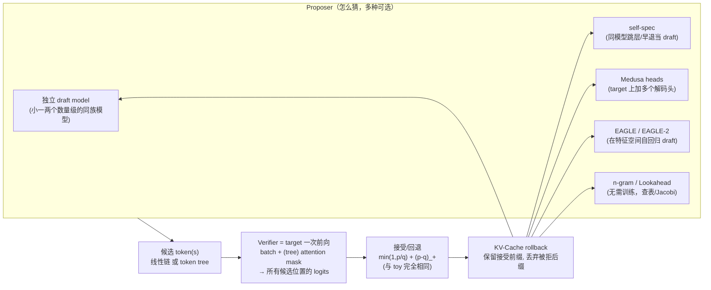

# 投机采样（Speculative Decoding）· 进阶与生产实践

> 配套 toy：本目录 `speculative_decoding.py`（纯 numpy、CPU 秒级）+ `手把手教学.md`。
> 本文把 toy 的「概念正确」一路推到「生产可用」：业界系统怎么做、有哪些变体与优化、真实工程的取舍与坑、怎么估算量级、以及把本 toy 升级到接近生产的路线。
> 原则：准确优先；不编造精确 benchmark，加速比一律用定性或「约」。术语保留英文。

---

## 0. 本项目 toy 与生产的差距

本 toy 故意把「算法正确性」与「系统工程」解耦：它用两个字符级 n-gram（target=3-gram、draft=1-gram）在 CPU 上严格验证了「接受概率 `min(1,p/q)` + 修正分布 `(p-q)_+`」是**分布无损**的，并用 `target_forwards` 的下降量化加速。这部分**和真实系统完全一致**——算法与模型无关。但它刻意跳过了所有让投机采样真正变快的系统机制。下表逐项对照。

| 维度 | 本 toy 的做法 | 生产必须补什么 | 在哪一节展开 |
| --- | --- | --- | --- |
| target 验证前向 | 循环逐位调用 `dist()`，**计 1 次**前向（概念上的并行） | 真正把 k+1 个候选拼成 1 个 batch，配 **tree/causal attention mask**，一次 GPU kernel 出全部 logits | §1, §2 |
| KV-Cache | 完全没有；每步从头算分布 | 接受/回退时**复用接受前缀的 KV、丢弃被拒之后的 KV**（KV rollback），这是工程最难处 | §3 |
| draft 模型 | 独立的 1-gram 统计模型 | 独立小模型 / 自投机 / **Medusa 头** / **EAGLE 特征级 draft** / n-gram / Lookahead，各有取舍 | §1, §2 |
| 候选结构 | 一条**线性链**（k 个串行提议） | **token tree**：一次提多条候选分支，树形并行验证，期望接受长度更高 | §2 |
| 批处理 | 单序列、单请求 | 与 **continuous batching** 共存：每个请求接受长度不同 → ragged，需 padding/掩码与调度 | §3 |
| 采样温度 | 固定按分布采（`rng.choice`） | 支持 greedy / temperature / top-p；greedy 时退化为「逐 token 对齐则接受」 | §3 |
| draft 成本 | **不计入**加速比分母 | draft 也吃显存/算力/调度；净加速 = target 省下的 − draft 花掉的 | §4 |
| 加速度量 | `target_forwards` 比值 | 真实 wall-clock：受 batch size、序列长、draft 开销、kernel 效率影响，可能远小于理论值 | §3, §4 |
| 数值兜底 | 平滑保证 `q[x]>0`；`(p-q)_+` 全 0 兜底 | fp16/bf16 下 `p/q` 的数值稳定、log 空间计算、采样器一致性 | §3 |

**一句话**：toy 证明了「为什么无损 + 加速从哪来」；生产解决的是「怎么让这次省下的前向真的兑现成 wall-clock，且不破坏吞吐」。

---

## 1. 业界系统怎么做

主流推理引擎（vLLM、TGI、TensorRT-LLM、SGLang）都把投机采样做成一个**可插拔的 proposer + 统一 verifier** 框架：proposer 负责「猜」，verifier（target 一次前向）负责「验」，接受/回退逻辑与 toy 完全同构。差异在 proposer 的形态与验证的并行结构。

**关键设计与取舍：**

- **proposer/verifier 解耦**：算法层（接受准则）固定不变，工程把「猜」做成策略插件。vLLM 的 spec config、TGI 的 medusa/n-gram 支持都是这个结构。
- **draft 与 target 必须共享 tokenizer/词表**：否则 `p[x]/q[x]` 无法对齐。独立 draft 通常选**同族的小模型**（如 70B 配 7B/1B、7B 配 1B/68M）。
- **一次前向出全部候选 logits**：verifier 把候选位置拼 batch，用 causal（链）或 tree mask（树），这正是 toy 里「`target_forwards += 1` 只出现一次」对应的真实 kernel。
- **接受/回退后必须修 KV**：被接受的前缀 KV 保留并继续复用，被拒之后的 KV 丢弃，draft 从新位置继续。没有 KV-Cache，投机采样在长序列上根本不可能快。
- **与 continuous batching 一等公民集成**：不是「先跑投机再排队」，而是把投机当成「一步前进多 token 的调度单元」融进 batching 循环（§3）。

---

## 2. 关键变体与优化

每个变体解决的核心问题都一样：**让 proposer 既便宜又准（高接受率），并尽量让一次 target 前向确认更多 token**。区别在「draft 从哪来」「候选是链还是树」。

### 2.1 独立 draft model（vanilla / Leviathan & Chen 2022–23）
- **做什么**：用同族小模型串行提 k 个 token，target 一次验证。toy 的直接放大版。
- **代价**：要**多养一个模型**（额外显存 + 额外串行 k 步的 draft 延迟）；draft 与 target 的「对齐度」决定接受率 α，选型敏感。
- **何时好**：有现成高质量小模型、且 batch size 不大（access-bound 区间）时。

### 2.2 self-speculative（自投机）
- **做什么**：不引入第二个模型，用**同一个 target 的「廉价模式」当 draft**——典型是**跳过部分层/早退（layer skip / early exit）**或部分量化前向。
- **解决**：省掉独立 draft 的显存与运维（只有一套权重）。
- **代价**：draft 与 target 强相关 → 接受率可能不如专门训练的 draft；跳层会改 KV 共享逻辑，实现更绕。

### 2.3 Medusa
- **做什么**：冻结 target，在最后一层 hidden 上**并接多个解码头**（Medusa heads），第 i 个头直接预测「未来第 i+1 个位置」的 token 分布。一次 target 前向就同时拿到「当前 token + 多个未来候选」。
- **解决**：**无需独立 draft 模型、无需串行 draft 步**（draft 就是几个轻量 MLP 头，几乎免费）。
- **代价**：各头独立预测、缺乏「token 间条件依赖」→ 单链接受率有限，因此 Medusa 配 **token tree + tree attention**：每个头出 top-几个候选，笛卡尔展开成树，一次验证。需要少量训练（训头）。Medusa 默认用 **typical acceptance**（不是严格 `min(1,p/q)` 的无损，而是基于阈值的放松采样），换更高接受率，**不再严格无损**——这是它和 vanilla 的关键取舍。

### 2.4 EAGLE / EAGLE-2
- **做什么**：洞察是「在 **feature（倒数第二层特征）空间**做自回归，比在 token 空间更可预测」。EAGLE 训一个**轻量自回归头**，输入 = target 的特征 + 已采 token 的 embedding，**在特征层 draft**，再投影回 token。比 Medusa 的「各头独立」更准，因为 draft 步之间有真实的自回归依赖。
- **EAGLE-2**：把 token tree 从「静态结构」升级为**上下文自适应的动态树**——用 draft 的置信度动态决定哪些分支值得展开/剪枝，相同验证预算下期望接受长度更高。
- **解决**：在「几乎不增显存（只加一个小头）」前提下，把接受率与 tokens/forward 推到当前较高水平。是目前社区与多家引擎重点支持的方案之一。
- **代价**：需要训练 draft 头（依赖 target 的特征分布）；实现上要拿到 target 中间特征并维护树。

### 2.5 Lookahead decoding（Jacobi 类）
- **做什么**：**完全不需要 draft 模型/不训练**。用 **Jacobi 迭代**并行猜多个未来位置，同时维护一个 **n-gram pool**（从历史生成里攒 n-gram）作为候选来源，再用 target 一次验证。
- **解决**：零额外模型、零训练、即插即用；对**重复性强/格式化**输出（代码、表格、JSON）尤其有效。
- **代价**：对开放式自然文本，n-gram 命中率有限，加速不如训练过的 EAGLE/Medusa 稳定；并行宽度大时 verifier 单次 batch 变大，显存与 compute 上升。

### 2.6 token tree（树形验证）——横切所有变体的关键优化
- **链 vs 树**：toy 是线性链，一旦中途某位被拒，**后面全废**（见 toy §3.4「拒绝后 break」）。token tree 同一轮提**多条候选分支**（如第一位给 top-2、第二位各再 top-2…），target 用 **tree attention mask** 一次前向验证整棵树，接受**最长的合法路径**。
- **收益**：相同 target 前向预算下，期望接受长度更高（多给了几条"备胎"路径）。Medusa/EAGLE-2 都靠它。
- **数据流（树 verifier）**：把树按某种拓扑展平成一维 token 序列，构造一个**自定义 attention mask**——每个节点只能看到「从根到自己」的祖先，互不为祖先的兄弟节点互相不可见。一次前向出所有节点 logits，再沿树做接受/回退。
- **代价**：mask 构造 + 验证 batch 变大（树越宽，单次前向 FLOPs/显存越多），存在「树大小 vs 期望接受」的最优点。

| 变体 | 是否额外模型 | 是否需训练 | 候选结构 | 是否严格无损 | 主要卖点 |
| --- | --- | --- | --- | --- | --- |
| vanilla draft | 是（独立小模型） | 否（用现成） | 链（可树） | 是 | 简单、通用 |
| self-spec | 否（同模型廉价模式） | 否/轻 | 链 | 是 | 省显存、单套权重 |
| Medusa | 否（加头） | 是（训头） | 树 | 默认否（typical accept） | 几乎免费的 draft |
| EAGLE/EAGLE-2 | 否（加特征头） | 是（训头） | 树（EAGLE-2 动态） | 可无损 | 接受率高、增显存少 |
| Lookahead | 否 | 否 | 并行 n-gram | 是 | 零训练、即插即用 |

---

## 3. 真实工程权衡与坑

### 3.1 核心权衡（投机采样不是「免费午餐」）

- **显存**：独立 draft 要额外权重 + 额外 KV；Medusa/EAGLE 只加小头，显存友好。token tree 越宽，验证时的临时激活/KV 越多。**显存换吞吐**要算账。
- **吞吐 vs 延迟**：投机采样优化的是**单序列延迟（latency / TPOT）**。它在 **batch 小、access-bound** 时收益最大；当 batch 已经很大、GPU 已 **compute-bound** 时，target 一次前向本就吃满算力，验证 k+1 个候选反而**增加 FLOPs 却换不来更多 wall-clock**——此时投机可能**净亏吞吐**。这是最重要的判断：**大 batch 高吞吐场景慎用，或动态关闭**。
- **接受率 α 是命门**：α 由 draft 与 target 的对齐度决定。α 高→tokens/forward 高→真加速；α 低→白猜（draft 成本 + 多算的 verifier FLOPs 全浪费）。线上要**监控 α / 平均接受长度**。
- **精度**：vanilla / EAGLE（无损模式）严格不改分布；Medusa 的 typical acceptance、以及把接受阈值放松以提速的做法**会改变分布**，要在「质量可接受」前提下使用，需评测把关。
- **通信（多卡）**：target 用 TP 切分时，draft 的放置是个问题——draft 也 TP（通信开销摊到小模型上不划算）还是单卡跑（要从 target 的卡取上下文）。EAGLE/Medusa 把 draft 焊在 target 上，天然共享并行布局，省去这层麻烦，这也是它们工程上更顺的原因之一。

### 3.2 与 continuous batching 结合（生产最关键的一环）

朴素投机假设单序列。生产是**几十上百个请求共享一个 batch**，难点在：

- **ragged 接受长度**：同一步里，请求 A 接受了 4 个、B 接受了 1 个、C 全拒。每个请求前进的步数不同 → batch 内对齐困难，需要 padding + 掩码，或把投机做成「每序列独立推进、统一调度」。
- **draft 与 verify 的两阶段调度**：draft 阶段（小模型/头）和 verify 阶段（target）交替，调度器要把它们编进同一个 batching 循环，避免 GPU 空转。
- **动态开关**：很多生产实现会根据**当前 batch size / 负载**决定开不开投机——低负载（access-bound）开，高负载（compute-bound）关，避免吞吐倒退。
- vLLM 把投机解码做成与 PagedAttention/continuous batching 协同的特性（n-gram / draft model / EAGLE / Medusa 等多种 proposer）；TGI 支持 Medusa 与 n-gram。这两套都把「KV 复用 + 批调度 + 投机」拧在一起，正是 toy 没有的部分。

### 3.3 线上常见故障与调优

- **「打开投机反而变慢/吞吐掉了」**：八成是 batch 太大已 compute-bound，或 α 太低。先量 α 和平均接受长度，再决定关投机或换更准的 draft。
- **KV rollback 写错**：接受前缀的 KV 没正确保留、或被拒后缀的 KV 没丢干净 → 后续生成串味/乱码。这是自研投机最易出的 bug（toy 完全没这一层，见 toy §6 末尾提醒）。
- **draft/target tokenizer 不一致**：词表/特殊 token 不对齐 → `p[x]/q[x]` 索引错位 → 分布崩。
- **fp16/bf16 数值**：`p[x]/q[x]` 在低精度下不稳，draft 的 `q[x]` 接近 0 时比值爆炸。生产在 **log 空间**算、对 q 加 epsilon、并保证 draft/target 采样器（temperature/top-p 顺序）严格一致，否则「看起来无损实际偏」。
- **k / 树大小没调**：k 太小没榨干、太大白猜（见 toy §5 练习 3 的「最优 k」）；树太宽 verifier FLOPs 爆。需按模型/数据集**离线扫一遍**定参。
- **greedy 模式的等价实现**：温度=0 时无损投机退化为「draft token == target argmax 才接受」，很多实现走这条快路径；要确认采样路径与验证路径用的是同一套 logits 处理。

---

## 4. 性能直觉与估算

### 4.1 加速比上界（理论）
设每个候选位置的平均接受率为 α（0~1），每轮 draft 提 k 个并有「全接受 bonus 一步」。一轮期望确认 token 数（含 bonus，几何型）约：

$$
\mathbb{E}[\text{tokens/round}] \approx \frac{1-\alpha^{\,k+1}}{1-\alpha}.
$$

而一轮只花 **1 次 target 前向**，所以理论加速（按 target 前向计，忽略 draft 成本）约等于这个期望值。直觉量级：

| α（接受率） | k=4 时约 tokens/forward | 说明 |
| --- | --- | --- |
| 0.5 | ≈ 2.0 | draft 一般，约 2x |
| 0.7 | ≈ 2.8 | 较好 draft |
| 0.8 | ≈ 3.4 | 强 draft（EAGLE 量级常在此附近或更高） |
| 0.9 | ≈ 4.5 | 接近 k+1 上界 |

toy 里 1-gram draft 较糙，tokens/forward 约 2.4（α≈0.5 量级），与上表自洽。

### 4.2 真实 wall-clock 加速（要打折）
理论加速假设「verifier 验 k+1 个候选 ≈ 验 1 个的成本」「draft 免费」。现实要扣掉：

$$
\text{speedup}_{\text{real}} \approx
\underbrace{\frac{\mathbb{E}[\text{tokens/round}]}{1}}_{\text{理论}}
\times
\underbrace{\frac{T_{\text{verify-1}}}{T_{\text{verify-}(k+1)}}}_{\substack{\text{batch 验证}\\ \text{的额外开销, }\le 1}}
\;-\;
\underbrace{\frac{T_{\text{draft}}}{T_{\text{target}}}}_{\text{draft 占比, 越小越好}}.
$$

- **access-bound 区间**（小 batch、短 batch）：$T_{\text{verify-}(k+1)} \approx T_{\text{verify-1}}$（多验几个 token 几乎不增延迟，因为瓶颈是搬权重），第二项 ≈1，加速接近理论值。这正是投机采样的甜区。
- **compute-bound 区间**（大 batch）：$T_{\text{verify-}(k+1)}$ 随候选数线性涨，第二项远小于 1，可能把加速吃没。
- **draft 占比**：独立 draft（如 1B 配 70B）draft 串行 k 步的开销不可忽略；Medusa/EAGLE 的头几乎免费，$T_{\text{draft}}/T_{\text{target}}\to 0$，这是它们 wall-clock 更优的根因。

### 4.3 显存估算
- 独立 draft 额外显存 ≈ draft 权重 + draft KV（按 draft 隐藏维/层数算，通常远小于 target）。
- Medusa/EAGLE 额外显存 ≈ 几个小头的权重（MB~GB 级，相对 target 可忽略）+ 树验证时的临时激活（随树宽增长）。
- token tree 单次验证显存 ≈ 普通前向 × (树节点数)（节点都进同一个 batch）。树越宽越吃显存，需与期望接受长度权衡。

### 4.4 怎么估「该不该开投机」
经验判据：**当前 batch 下 GPU 是否 access-bound？** 估算 arithmetic intensity（FLOPs/byte）或直接看：batch size 小、目标是低延迟 → 开；batch 大、目标是高吞吐、GPU 利用率已高 → 多半别开或动态关。再看 α：离线测一把平均接受长度，<1.5 基本不值得。

---

## 5. 动手进阶路线（把本 toy 升级到接近生产）

> 每步都建立在前一步之上，难度递增。目标不是「写出 vLLM」，而是把 toy 缺的系统机制逐个补回来，亲手踩到生产的坑。

1. **换成真 Transformer + 真并行验证**：把 `CharNGramLM` 换成两个 HF Transformer（如同族的小/大模型），把 toy 里「循环逐位调 `dist`」换成**真的一次 batch 前向 + causal attention mask**，对比 wall-clock 而非 `target_forwards`。方向：先验证算法不变（接受/回退逻辑原样照搬），再看真实加速。

2. **加 KV-Cache 与 rollback**：给 target 接上 KV-Cache，实现「接受前缀的 KV 保留、被拒后缀的 KV 丢弃、draft 从新位置续猜」。这是工程最难也最长经验值的一步（参考本仓库 KV-Cache 文档）。方向：先单序列跑对，再压测乱码/串味确认 rollback 正确。

3. **从链升级到 token tree**：proposer 一次提多条分支（如每位 top-2），构造 **tree attention mask**，verifier 一次前向验证整棵树，接受最长合法路径。方向：先静态树，量化 tokens/forward 相对线性链的提升，再做剪枝。

4. **换 proposer 形态**：把独立 draft 换成 **Medusa 风格的多解码头** 或 **n-gram/Lookahead**（零训练），对比三者的 α、显存、wall-clock。方向：体会「draft 免费 vs draft 准」的取舍；有条件再读 EAGLE 在特征空间 draft 的思路。

5. **接入批处理与动态开关**：把投机融进一个简化的 continuous batching 循环（可复用本仓库 `11-paged-attention-batching-sim` 的思路），处理 ragged 接受长度，并按 batch size 动态开/关投机。方向：复现「大 batch 时投机净亏吞吐」这一关键现象，才算真懂它的适用边界。

---

## 6. 延伸阅读

**本仓库相关文档（相对路径）：**

- [`../../llm-inference/README.md`](../../llm-inference/README.md) — 大模型推理总览，第 5.5 节「解码加速：投机解码」是本项目理论出处。
- [`../../llm-inference/解码策略.md`](../../llm-inference/解码策略.md) — 解码策略（greedy/sampling/top-p/温度），理解投机在不同采样模式下的退化形态。
- [`../../llm-inference/KV-Cache优化.md`](../../llm-inference/KV-Cache优化.md) — KV-Cache 与 rollback，进阶路线第 2 步的核心，工程最难处。
- [`../../llm-inference/Flash-Decoding.md`](../../llm-inference/Flash-Decoding.md) — 解码阶段 attention 优化，与投机验证 kernel 互补。
- [`../../llm-inference/vllm`](../../llm-inference/vllm) — vLLM 实现与启动参数，生产级投机解码（多种 proposer）落地参考。
- [`../../llm-inference/huggingface-tgi`](../../llm-inference/huggingface-tgi) — TGI（支持 Medusa / n-gram）。
- [`../../llm-inference/sglang`](../../llm-inference/sglang) — SGLang 服务，另一套生产推理栈。
- [`../04-kv-cache`](../04-kv-cache) — 本系列 KV-Cache 实战，配合进阶第 2 步。
- [`../11-paged-attention-batching-sim`](../11-paged-attention-batching-sim) — 连续批处理/分页注意力模拟，配合进阶第 5 步。

**经典论文与社区资源：**

- Leviathan et al., 2022, *Fast Inference from Transformers via Speculative Decoding*（arXiv:2211.17192）— 接受准则与无损性证明（定理 1）。
- Chen et al., 2023, *Accelerating LLM Decoding with Speculative Sampling*（DeepMind，arXiv:2302.01318）— 同期独立工作，工程视角。
- Cai et al., 2024, *Medusa: Simple LLM Inference Acceleration with Multiple Decoding Heads*（arXiv:2401.10774）。
- Li et al., 2024, *EAGLE: Speculative Sampling Requires Rethinking Feature Uncertainty*（arXiv:2401.15077）及 *EAGLE-2*（arXiv:2406.16858）。
- Fu et al., 2024, *Break the Sequential Dependency of LLM Inference Using Lookahead Decoding*（arXiv:2402.02057）。
- [vLLM Speculative Decoding 文档](https://docs.vllm.ai/en/latest/features/speculative_decoding/) — 生产实现与 proposer 选项。
