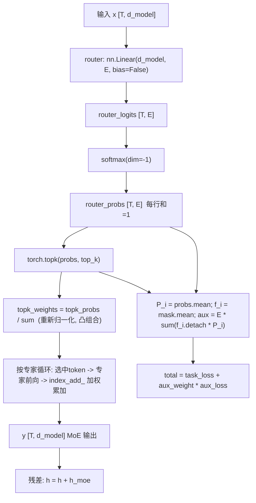

# 从零实现 MoE:手把手教学(top-k 路由 + 负载均衡 aux loss)

> 配套代码:本目录下的 `moe.py`(纯 PyTorch / CPU,几十秒跑完)。
> 本文是一份"零基础也能跟上"的逐段精讲,所有讲解严格对应 `moe.py` 里**真实存在**的函数名、类名、变量名、默认超参与打印格式。

**一句话导览——学完这篇你能掌握:**

1. **稀疏门控 router**:为什么一个 `nn.Linear(d_model, num_experts, bias=False)` 就能当"路由器",`softmax` 后的每一行是什么含义。
2. **top-k 路由**:`torch.topk` 怎么只挑出概率最高的 `top_k` 个专家,以及为什么要对选中的权重做"重新归一化"(凸组合)。
3. **专家加权组合**:`torch.where` + `index_add_` 是怎么把"路由到同一专家的 token 聚在一起算、再加权累加回去"的。
4. **负载均衡 aux loss**:Switch Transformer 的 `aux = E · Σ_i f_i · P_i` 每个符号是什么、为什么 `f_i` 要 `detach()`、梯度到底走哪条路。
5. **专家分化 与 "专家饿死"(load collapse)**:为什么不加 aux 时会有专家占比塌成 `0.00`、`imbalance` 变 `inf`,加了之后怎么一步步被推回 `1/8 = 0.125` 的均匀线。

---

## 0. 前置知识与环境

**你需要会一点点:**

- Python 基础(函数、类、`for` 循环、张量切片)。
- PyTorch 最最基础的概念:`nn.Module`、`nn.Linear`、`forward`、`loss.backward()`、优化器 `opt.step()`。**不会也没关系**,第 3 节会逐行解释。
- 一点点线性代数直觉:矩阵乘法把 `[T, d_model]` 变成 `[T, num_experts]` 就是"给每个 token 对每个专家打一个分"。
- `softmax` 的含义:把一行实数变成"和为 1 的概率"。

**环境(与 README 一致):**

```bash
# Python 3.13 / numpy 2.3 / torch 2.12 (CPU 即可,不需要 GPU)
pip install torch
# 可选:想看一张"各专家负载随训练变化"的曲线图,再装 matplotlib
pip install matplotlib
```

**怎么跑:**

```bash
cd practical-projects/08-moe-from-scratch
python moe.py
```

无需任何外部数据集、无需联网。脚本内部用 `make_toy_data` 现造数据。matplotlib 没装也不会报错(代码里用 `try/except` 包住了画图)。

---

## 1. 问题背景:不用这个技术会怎样

假设你想让模型"更聪明",最朴素的办法是**把 FFN(前馈层)做大**:`d_hidden` 从 48 变成 480、4800……参数越多,容量越大。但有个致命问题:

> **稠密(dense)模型里,参数量和每个 token 的计算量是绑死的。** 你把 FFN 放大 100 倍,每个 token 的前向计算也跟着涨 100 倍。训练和推理都会贵到跑不动。

**MoE(Mixture of Experts)的核心动机就是把这两者"解绑":**

- 准备 **很多个专家**(每个专家就是一个小 FFN,对应代码里的 `class Expert`)。所有专家加起来参数量很大。
- 但**每个 token 只激活其中很少几个**(本项目 `top_k=2`,共 `num_experts=8`)。所以单个 token 的计算量只相当于 2 个小 FFN,而不是 8 个。

这就是 README 里反复强调的那句话:**参数量大、单 token 计算量小**(sparse activation,稀疏激活)。

**那"不用这个技术 / 用得不好"会怎样?** 这正是本项目要演示的痛点——光有 router 还不够。如果你只是"让 router 自由选专家",训练会出现一个非常隐蔽但致命的故障:

> **赢者通吃(winner-take-all)→ 专家饿死(load collapse)。** router 一旦稍微偏爱某几个专家,这几个专家就得到更多训练、变得更强,于是被选得更多……正反馈滚雪球,最后只有少数专家在干活,其余专家**占比塌成 0**,等于白白浪费了大半参数。

`moe.py` 的实验 A(`no_aux`)就是故意复现这个故障:你会看到有专家占比变 `0.00`,`imbalance` 直接是 `inf`。实验 B(`with_aux`)加上负载均衡损失后,负载被推回均匀。这一对照就是整个项目的灵魂。

---

## 2. 核心原理详解

### 2.1 一层 MoE 的数据流

设一个 batch 有 `T` 个 token,每个 token 是 `d_model` 维向量,记作矩阵 $x \in \mathbb{R}^{T \times d}$。

**第一步:路由打分(router logits)。** 用一个无偏置线性层 $W_r \in \mathbb{R}^{d \times E}$($E$ = `num_experts`):

$$
\text{logits} = x W_r \in \mathbb{R}^{T \times E}, \qquad
p_{t} = \mathrm{softmax}(\text{logits}_{t,:}) \in \mathbb{R}^{E}
$$

$p_{t,i}$ 就是"token $t$ 应该交给专家 $i$"的概率,每一行(对一个 token)所有专家的概率加起来 = 1。

**第二步:top-k 选择 + 重新归一化。** 对每个 token 只保留概率最大的 $k$ 个专家(本项目 $k=2$),其余忽略。设被选中的索引集合为 $\mathcal{T}_t$,对应概率为 $p_{t,i}$。为了让这 $k$ 个权重之和为 1(变成一个**凸组合**,数值更稳),做归一化:

$$
g_{t,i} = \frac{p_{t,i}}{\sum_{j \in \mathcal{T}_t} p_{t,j} + \varepsilon}, \qquad i \in \mathcal{T}_t
$$

$g_{t,i}$ 就是代码里的 `topk_weights`,$\varepsilon = 10^{-9}$ 防止除零。这正是 Mixtral 的做法。

**第三步:加权组合(weighted combine)。** token $t$ 的输出 = 它选中的几个专家各自前向、再按门控权重加权求和:

$$
y_t = \sum_{i \in \mathcal{T}_t} g_{t,i} \cdot E_i(x_t)
$$

其中 $E_i(\cdot)$ 是第 $i$ 个专家(一个两层 FFN:`fc2(GELU(fc1(x)))`)。没被选中的专家对这个 token 贡献为 0。

### 2.2 负载均衡 aux loss(Switch Transformer)

为什么需要它?见第 1 节的"赢者通吃"。我们希望**所有专家被用得差不多均匀**。Switch Transformer 给出的辅助损失(代码注释里写得很清楚):

$$
\text{aux} = E \cdot \sum_{i=1}^{E} f_i \cdot P_i
$$

- $f_i$ = **被路由到专家 $i$ 的 token 比例**(由"硬"的 top-k 选择统计而来,是 0/1 命中的平均,**不可导**)。代码里是 `f_i = expert_mask.float().mean(dim=0)`。
- $P_i$ = **专家 $i$ 在所有 token 上的平均路由概率**(由连续的 softmax 概率求平均,**可导**)。代码里是 `P_i = router_probs.mean(dim=0)`。

**直觉(非常关键):** 当某个专家**既被选得多($f_i$ 大)又平均概率高($P_i$ 大)**,这一项 $f_i \cdot P_i$ 就很大,惩罚就重。梯度会去**压低**这个热门专家的 logits、**抬高**冷门专家的 logits,从而把负载推向均匀。

**为什么 $f_i$ 要 `detach()`?** $f_i$ 来自不可导的 top-k 硬选择,没法回传梯度;我们把它当成一个"权重系数"固定住,真正的梯度通路走在**可导的 $P_i$** 上。代码里写作 `aux_loss = self.num_experts * torch.sum(f_i.detach() * P_i)`。

**理想最小值是多少?** 若负载完全均匀,$f_i = P_i = 1/E$,则 $\text{aux} = E \cdot \sum_i (1/E)(1/E) = E \cdot E \cdot (1/E^2) = 1$。所以 **aux 的理论下界 = 1.0**,越接近 1 越均衡。

### 2.3 一张图看懂整层



---

## 3. 代码逐段精讲

下面把 `moe.py` 按逻辑拆成 7 段。每段先贴**真实代码**,再逐块解释。

### 3.1 单个专家 `class Expert`——专家就是一个普通 FFN

```python
class Expert(nn.Module):
    def __init__(self, d_model: int, d_hidden: int):
        super().__init__()
        self.fc1 = nn.Linear(d_model, d_hidden)
        self.fc2 = nn.Linear(d_hidden, d_model)

    def forward(self, x: torch.Tensor) -> torch.Tensor:
        # 经典 FFN: Linear -> GELU -> Linear
        return self.fc2(F.gelu(self.fc1(x)))
```

- 一个专家 = 两层 MLP:`fc1` 把 `d_model`(24)升到 `d_hidden`(48),`GELU` 非线性,`fc2` 再降回 `d_model`。输入输出维度相同,这样才能做残差。
- **为什么这么写**:在真实 Transformer-MoE 里,"专家"就是替换掉原本 FFN 子层的那个前馈网络。这里一模一样,只是规模缩小成 toy。
- **新手易困惑点**:专家本身**毫无特殊之处**,它就是个普通 FFN。MoE 的"魔法"全在外面的 router 和组合逻辑,不在专家内部。

### 3.2 稀疏 MoE 层的构造 `SparseMoE.__init__`

```python
class SparseMoE(nn.Module):
    def __init__(self, d_model: int, d_hidden: int, num_experts: int, top_k: int):
        super().__init__()
        assert 1 <= top_k <= num_experts
        self.num_experts = num_experts
        self.top_k = top_k

        # router/gating:把每个 token 映射到 num_experts 个打分(无偏置更接近论文实现)
        self.router = nn.Linear(d_model, num_experts, bias=False)
        # num_experts 个独立专家
        self.experts = nn.ModuleList(
            [Expert(d_model, d_hidden) for _ in range(num_experts)]
        )
```

- `assert 1 <= top_k <= num_experts`:护栏,top_k 不能比专家总数还大,也不能 < 1。
- `self.router = nn.Linear(d_model, num_experts, bias=False)`:**这就是整个门控的全部**——一个无偏置线性层。输入 `d_model`、输出 `num_experts` 个分数。**为什么 `bias=False`**:更接近论文实现;偏置会给某些专家一个与输入无关的固定偏好,容易加剧不均衡。
- `self.experts = nn.ModuleList([...])`:用 `ModuleList` 装 `num_experts`(默认 8)个独立的 `Expert`。**必须用 `ModuleList`**(而不是普通 Python list),否则这些专家的参数不会被 PyTorch 注册、`opt.step()` 不会更新它们。

### 3.3 前向之 (a)(b):路由打分 + top-k 选择

```python
    def forward(self, x: torch.Tensor):
        num_tokens = x.shape[0]

        # ---- (a) 路由打分 ----
        router_logits = self.router(x)                       # [T, E]
        router_probs = F.softmax(router_logits, dim=-1)      # [T, E],每行和为 1

        # ---- (b) top-k 选择 ----
        topk_probs, topk_idx = torch.topk(router_probs, self.top_k, dim=-1)  # [T, k]
        # 把 top-k 的门控权重重新归一化,使被选中的 k 个权重之和为 1
        topk_weights = topk_probs / (topk_probs.sum(dim=-1, keepdim=True) + 1e-9)
```

- `router_logits = self.router(x)`:形状 `[T, E]`,对应原理第一步的 $xW_r$。
- `F.softmax(..., dim=-1)`:对**最后一维**(专家维)做 softmax,于是 `router_probs` 每一行(一个 token)所有专家概率之和 = 1。
- `torch.topk(router_probs, self.top_k, dim=-1)`:返回**两个**张量——`topk_probs` 是每个 token 最大的 `k` 个概率值,`topk_idx` 是这些概率对应的**专家编号**。两者形状都是 `[T, k]`(本项目 `[T, 2]`)。
- `topk_weights = topk_probs / (topk_probs.sum(...) + 1e-9)`:对应原理的归一化公式。**为什么要归一化**:top-2 选出的两个概率(比如 0.4 和 0.3)加起来只有 0.7,不是 1;除以它们的和后变成 0.571 和 0.429,和为 1,组合输出成为凸组合,数值更稳。`+ 1e-9` 是防止除零的 $\varepsilon$。
- **新手易困惑点**:`topk_idx` 里存的是**专家的编号**(0~7),不是概率。后面要用它来判断"哪些 token 选了专家 e"。

### 3.4 前向之 (c):各专家前向 + 加权组合(全场最绕)

```python
        # ---- (c) 各专家前向 + 加权组合 ----
        y = torch.zeros_like(x)
        for e in range(self.num_experts):
            # 找出本 batch 中把专家 e 选进 top-k 的 token,以及它对应的 slot 位置
            sel_token, sel_slot = torch.where(topk_idx == e)  # 两个 1D 索引张量
            if sel_token.numel() == 0:
                continue  # 这个专家这一步没被任何 token 选中
            expert_in = x[sel_token]                      # 该专家要处理的 token
            expert_out = self.experts[e](expert_in)       # 专家前向
            weight = topk_weights[sel_token, sel_slot].unsqueeze(-1)  # 对应门控权重
            # 把加权输出累加回这些 token 的输出位置(同一 token 的多个专家会累加)
            y.index_add_(0, sel_token, expert_out * weight)
```

这一段是教学实现的核心,慢慢看:

- `y = torch.zeros_like(x)`:输出先全置 0,后面往里累加。
- `for e in range(self.num_experts)`:**按专家循环**(不是按 token)。这样每个专家只前向一次,把所有路由到它的 token 打成一个 batch 一起算,比按 token 循环高效得多。
- `sel_token, sel_slot = torch.where(topk_idx == e)`:`topk_idx == e` 得到一个 `[T, k]` 的布尔矩阵,`True` 表示"该 token 的第几个 slot 选了专家 e"。`torch.where` 返回两个 1D 索引:
  - `sel_token`:哪些 token 选了专家 e(行号);
  - `sel_slot`:这些 token 是在它的第几个 slot(0 或 1)选的(列号)。
  - **为什么需要 `sel_slot`**:同一个 token 的 2 个 slot 各有自己的归一化权重,要用 `(token, slot)` 这对坐标才能从 `topk_weights` 里取对正确的那个权重。
- `if sel_token.numel() == 0: continue`:这个专家这一步没被任何 token 选中,跳过(**这正是"专家饿死"在代码层面的表现**:某些 e 长期走 continue)。
- `expert_in = x[sel_token]`:把选了专家 e 的那些 token 的输入抽出来。
- `expert_out = self.experts[e](expert_in)`:专家 e 一次性前向所有这些 token。
- `weight = topk_weights[sel_token, sel_slot].unsqueeze(-1)`:用 `(token, slot)` 坐标取出对应门控权重,`unsqueeze(-1)` 变成 `[N, 1]` 以便和 `[N, d_model]` 的输出广播相乘。
- `y.index_add_(0, sel_token, expert_out * weight)`:把"加权后的专家输出"按 `sel_token` 行号**累加**回 `y`。**为什么用 `index_add_` 而不是 `y[sel_token] = ...`**:同一个 token 可能在不同专家的循环里都被处理(它选了 2 个专家),用 `=` 会覆盖,用 `index_add_` 才能把 2 个专家的加权输出**相加**,这正是 $y_t = \sum_{i} g_{t,i} E_i(x_t)$。
- **新手易困惑点**:这是**可读优先**的教学写法。README 明确指出真实高性能实现会用 dispatch/combine 矩阵或分组 GEMM,这里的 for 循环只为看得懂。

### 3.5 前向之 (d):负载均衡 aux loss + 返回值

```python
        # ---- (d) 负载均衡辅助损失(Switch Transformer 式) ----
        expert_mask = F.one_hot(topk_idx, num_classes=self.num_experts).sum(dim=1)  # [T, E]
        tokens_per_expert = expert_mask.sum(dim=0).float()          # [E] 每个专家命中数
        route_frac = tokens_per_expert / tokens_per_expert.sum()    # 归一化成占比(打印用)
        f_i = expert_mask.float().mean(dim=0)                       # [E] 平均命中率
        P_i = router_probs.mean(dim=0)                              # [E] 平均路由概率(可导)
        aux_loss = self.num_experts * torch.sum(f_i.detach() * P_i)

        return y, aux_loss, route_frac.detach()
```

- `expert_mask = F.one_hot(topk_idx, num_classes=E).sum(dim=1)`:`topk_idx` 是 `[T, k]`,one-hot 后是 `[T, k, E]`,在 slot 维 `sum(dim=1)` 得到 `[T, E]` 的 0/1 命中矩阵——"token t 是否选了专家 i"。
- `tokens_per_expert = expert_mask.sum(dim=0).float()`:对 token 维求和,得到 `[E]`,每个专家这一 batch 总共被命中多少次。
- `route_frac = tokens_per_expert / tokens_per_expert.sum()`:归一化成占比,这就是**打印出来的 `route_frac`**(每个专家占比,加起来 = 1)。
- `f_i = expert_mask.float().mean(dim=0)`:对应原理的 $f_i$(每个专家的平均命中率)。注意它和 `route_frac` 只差一个常数缩放(`f_i` 除以 T,`route_frac` 除以总命中数 = T·k),都反映"硬选择"的负载。
- `P_i = router_probs.mean(dim=0)`:对应原理的 $P_i$,**可导**,梯度通路在这里。
- `aux_loss = self.num_experts * torch.sum(f_i.detach() * P_i)`:这就是 $\text{aux} = E \cdot \sum_i f_i \cdot P_i$。`f_i.detach()` 切断 $f_i$ 的梯度(它来自不可导的硬选择)。
- `return y, aux_loss, route_frac.detach()`:返回三样——MoE 输出、aux 损失、用于打印观察的占比(`detach` 因为它只是个监控指标)。
- **新手易困惑点**:`route_frac` 和 `f_i` 都是"硬负载"的统计,只是归一化分母不同。`route_frac` 用来给人看(各专家占比),`f_i` 用来进 aux 公式。

### 3.6 把 MoE 装进一个分类模型 `MoEClassifier`

```python
class MoEClassifier(nn.Module):
    def __init__(self, d_in, d_model, d_hidden, num_experts, top_k, num_classes):
        super().__init__()
        self.embed = nn.Linear(d_in, d_model)
        self.moe = SparseMoE(d_model, d_hidden, num_experts, top_k)
        self.head = nn.Linear(d_model, num_classes)

    def forward(self, x):
        h = F.gelu(self.embed(x))
        h_moe, aux_loss, route_frac = self.moe(h)
        h = h + h_moe  # 残差连接(和 Transformer 里 FFN 子层一致)
        logits = self.head(h)
        return logits, aux_loss, route_frac
```

- `embed`:把原始 `d_in`(16)维输入升到 `d_model`(24),过一个 GELU。
- `self.moe(h)`:核心 MoE 层,返回输出、aux、占比。
- `h = h + h_moe`:**残差连接**。这和 Transformer 里 FFN 子层 `x + FFN(x)` 完全一致。**为什么重要**:即使某个 token 路由很差,残差保证原始信息还能往后传,训练更稳。
- `head`:把 `d_model` 映射到 `num_classes`(10)个分类 logits。
- **新手易困惑点**:模型把 `aux_loss` 一路 `return` 出来,是因为它要在训练循环里和任务损失**相加**,而不是在层内部直接 backward。

### 3.7 toy 数据 + 工具函数 + 训练循环

**(i) 造数据 `make_toy_data`:**

```python
def make_toy_data(num_samples, d_in, num_classes, seed=0):
    g = torch.Generator().manual_seed(seed)
    centers = torch.randn(num_classes, d_in, generator=g) * 2.0
    labels = torch.randint(0, num_classes, (num_samples,), generator=g)
    noise = torch.randn(num_samples, d_in, generator=g) * 1.5
    x = centers[labels] + noise
    return x, labels
```

- 每个类别一个随机簇中心(`* 2.0` 把中心拉开),样本 = 中心 + 噪声(`* 1.5`,噪声偏大让类别**有重叠**,任务非平凡)。
- `centers[labels]`:用标签做花式索引,给每个样本取它所属类别的中心。
- **设计意图**:数据天然由 `num_classes` 个簇组成,正好适合"分工"——我们**期望** router 学会把不同簇交给不同专家(专家分化)。

**(ii) 两个打印工具:**

```python
def fmt_frac(frac):  # 把占比格式化成 [0.30 0.05 ...]
    return "[" + " ".join(f"{v:0.2f}" for v in frac.tolist()) + "]"

def imbalance_ratio(frac):  # 不均衡度 = 最大占比 / 最小占比
    mn = float(frac.min()); mx = float(frac.max())
    return mx / mn if mn > 1e-9 else float("inf")
```

- `imbalance_ratio`:**最大占比 / 最小占比**。完全均衡 = 1.0;若有专家占比 = 0(饿死),`mn` 接近 0,返回 `inf`。**这就是为什么 no_aux 实验里 imbalance 会打印 `inf`**。

**(iii) 训练循环 `train`(关键默认超参就在这里):**

```python
def train(num_experts=8, top_k=2, aux_weight=0.0, steps=600, log_every=100, tag=""):
    torch.manual_seed(SEED)  # 每次实验同一初始化,保证可比
    d_in = 16; d_model = 24; d_hidden = 48
    num_classes = 10; num_samples = 4096; batch_size = 256; lr = 2e-3

    x_all, y_all = make_toy_data(num_samples, d_in, num_classes, seed=SEED)
    model = MoEClassifier(d_in, d_model, d_hidden, num_experts, top_k, num_classes)
    opt = torch.optim.Adam(model.parameters(), lr=lr)

    for step in range(1, steps + 1):
        idx = torch.randint(0, num_samples, (batch_size,), generator=g)
        xb, yb = x_all[idx], y_all[idx]

        logits, aux_loss, route_frac = model(xb)
        task_loss = F.cross_entropy(logits, yb)
        loss = task_loss + aux_weight * aux_loss   # 总损失

        opt.zero_grad()
        loss.backward()
        opt.step()
        ...
```

- **默认超参一览**:`num_experts=8`、`top_k=2`、`steps=600`、`log_every=100`、`d_in=16`、`d_model=24`、`d_hidden=48`、`num_classes=10`、`num_samples=4096`、`batch_size=256`、`lr=2e-3`、`SEED=0`、aux 公式 `eps=1e-9`。
- `torch.manual_seed(SEED)`:**两次实验用同一初始化**,这样 no_aux / with_aux 才公平可比。
- `loss = task_loss + aux_weight * aux_loss`:**总损失 = 任务损失 + aux_weight × 负载均衡损失**。`aux_weight=0` 就等于不加(实验 A),`0.01` 就是加(实验 B)。
- 标准三件套:`opt.zero_grad()` → `loss.backward()` → `opt.step()`。
- 每 `log_every` 步记录一次 `task_loss / acc / route_frac / imbalance`,最后统一打印。

**(iv) `main` 跑两个对照实验:**

```python
hist_no_aux = train(aux_weight=0.0, tag="no_aux")    # A: 不加 aux
hist_aux    = train(aux_weight=0.01, tag="with_aux") # B: 加 aux
```

之后比较两者的 `final imbalance` 与 `final task_loss`,若 `imb_aux < imb_no` 打印 `RESULT: PASS`。最后(可选)用 matplotlib 存一张 `expert_load.png`,画出 with_aux 实验里**各专家负载随训练变化**的曲线(含一条 `1/E` 的均匀参考虚线),装不了 matplotlib 也只是打印 `[plot] skipped`,不崩。

---

## 4. 跑起来 + 逐行读懂输出

运行:

```bash
python moe.py
```

预期输出(摘自 README,CPU ~22s):

```text
--- experiment: no_aux (num_experts=8, top_k=2, aux_weight=0.0) ---
 step | task_loss |   acc | imbalance | route_frac
    1 |    2.5922 |  0.10 |     15.00 | [0.02 0.06 0.05 0.23 0.13 0.03 0.15 0.32]
  100 |    0.0264 |  0.99 |       inf | [0.00 0.00 0.08 0.18 0.30 0.07 0.17 0.19]
  600 |    0.0021 |  1.00 |       inf | [0.01 0.00 0.11 0.17 0.30 0.14 0.13 0.15]
summary[no_aux]: final_task_loss=0.0021 final_acc=1.00 final_imbalance=inf

--- experiment: with_aux (num_experts=8, top_k=2, aux_weight=0.01) ---
 step | task_loss |   acc | imbalance | route_frac
    1 |    2.5922 |  0.10 |     15.00 | [0.02 0.06 0.05 0.23 0.13 0.03 0.15 0.32]
  100 |    0.0302 |  0.99 |      2.97 | [0.09 0.11 0.13 0.15 0.21 0.07 0.11 0.12]
  200 |    0.0118 |  1.00 |      2.09 | [0.14 0.10 0.13 0.18 0.18 0.10 0.09 0.08]
  300 |    0.0078 |  1.00 |      1.69 | [0.10 0.10 0.15 0.15 0.17 0.12 0.10 0.11]
  600 |    0.0019 |  1.00 |      1.24 | [0.12 0.11 0.14 0.12 0.12 0.13 0.13 0.12]
summary[with_aux]: final_task_loss=0.0019 final_acc=1.00 final_imbalance=1.24

CONCLUSION
final imbalance  : no_aux=inf  with_aux=1.24  (lower is more balanced)
final task_loss  : no_aux=0.0021  with_aux=0.0019  (both should be low -> task still learned)
RESULT: PASS -- load-balancing aux loss reduced expert imbalance.
```

**逐个指标读懂:**

- **`step`**:训练步(共 600)。只在 step=1、每 100 步、最后一步记录。
- **`task_loss`**:交叉熵任务损失。**应当下降**。step=1 时是 `2.5922`——这正是 10 类随机猜的理论水平 $\ln 10 \approx 2.3026$ 附近(初始略高很正常)。最后降到 ≈0.002,说明任务学会了。
- **`acc`**:当前 batch 准确率。从 `0.10`(= 1/10,纯随机)涨到 `1.00`(全对)。**为什么能到 1.00**:toy 数据简单、模型对这个 batch 过拟合得很好,这是教学预期,不代表真实任务。
- **`imbalance`**:最大占比 / 最小占比。**这是全篇的主角**。
  - **no_aux**:从 `15.00` 恶化到 `inf`——因为有专家占比塌成 `0.00`(看 route_frac 第 1、2 个专家),分母为 0 → `inf`。这就是**专家饿死 / load collapse**。
  - **with_aux**:**单调下降** `2.97 → 2.09 → 1.69 → ... → 1.24`,越来越接近理想的 1.0。
- **`route_frac`**:当前 batch 每个专家被路由到的 token 占比(8 个数,和≈1)。理想均匀值是 `1/8 = 0.125`。
  - **no_aux** 最后:`[0.01 0.00 0.11 0.17 0.30 0.14 0.13 0.15]`——有专家是 `0.00`(饿死),有专家高达 `0.30`(被宠幸),极不均衡。
  - **with_aux** 最后:`[0.12 0.11 0.14 0.12 0.12 0.13 0.13 0.12]`——**全部逼近 0.125**,非常均衡。

**结论(CONCLUSION)怎么读:**

- `final imbalance: no_aux=inf  with_aux=1.24`:aux 把不均衡从"无穷大(有专家死了)"压到 1.24。
- `final task_loss: no_aux=0.0021  with_aux=0.0019`:**两者都很低**——这说明均衡**不是靠牺牲任务效果换来的**,鱼和熊掌兼得。
- `RESULT: PASS`:因为 `imb_aux(1.24) < imb_no(inf)`,aux 确实改善了负载均衡。

> 一句话:**no_aux 演示病(专家饿死),with_aux 演示药(aux loss),对照实验证明药有效。**

---

## 5. 动手改造(练习)

由易到难,改完重跑 `python moe.py` 观察变化。

**练习 1(最简单):放大 aux 权重。** 把 `main` 里 with_aux 那行改成 `train(aux_weight=0.1, ...)`(放大 10 倍)。
*预期*:imbalance 收敛更快、final 更接近 1.0;但 aux_weight 太大可能轻微拖慢任务收敛(task_loss 早期略高)。体会"均衡 vs 任务"的权衡。

**练习 2:改 top_k。** 在 `train` 调用里加 `top_k=1`(变成 Switch Transformer 的硬 top-1)。
*提示*:`top_k=1` 时每个 token 只走 1 个专家,`topk_weights` 归一化后恒为 1。
*预期*:不加 aux 时塌缩更猛(top-1 没有"第二选择"缓冲,更容易赢者通吃);加 aux 仍能拉回均衡。

**练习 3:改专家数。** 把 `train(num_experts=4, top_k=2, ...)`。
*预期*:理想均匀线从 `1/8=0.125` 变成 `1/4=0.25`;aux 的理论下界仍是 1.0(与 E 无关)。观察 route_frac 是否逼近 0.25。

**练习 4:让任务更难。** 进 `train` 把 `noise` 调大(改 `make_toy_data` 里 `* 1.5` → `* 3.0`)或把 `centers` 拉近(`* 2.0` → `* 1.0`)。
*预期*:类别重叠加重,task_loss 不再降到接近 0、acc 也到不了 1.00。这更像真实任务,便于观察 aux 在"任务没那么容易"时是否仍维持均衡。

**练习 5(进阶):加 router 噪声(noisy top-k)。** 在 `router_logits` 上加一点高斯噪声再 softmax(`router_logits = router_logits + torch.randn_like(router_logits) * 0.1`),训练时鼓励探索。
*提示*:这是 GShard/Switch 里 "jitter / noisy gating" 的简化。
*预期*:早期路由更分散,有助于打破赢者通吃的初期正反馈(即使不加 aux 也能缓解一点塌缩)。

---

## 6. 常见坑与排错

- **专家参数不更新**:专家必须放进 `nn.ModuleList`(代码已正确这么做)。若你改成普通 Python list,`model.parameters()` 收不到它们,`opt.step()` 不更新,loss 几乎不降。
- **imbalance 打印 inf 吓到了**:这是**正常的、预期的**——`no_aux` 里专家饿死(占比 0)时 `imbalance_ratio` 按设计返回 `inf`。不是 bug,是要演示的现象。
- **route_frac 八个数加起来不等于 1?** 它们应当≈1(浮点显示只保留 2 位小数,四舍五入会有微小偏差)。
- **以为 acc=1.00 / task_loss≈0 代表模型很强**:不是。toy 数据简单 + 对单 batch 过拟合,真实语言建模 loss 不会到 0(README"局限"表里讲了)。
- **改了 SEED 后两实验"对不上"**:`train` 内部每次都 `torch.manual_seed(SEED)` 重置,保证 no_aux/with_aux 同初始化可比。你自己改超参时,若想公平对比,记得保持种子一致。
- **`index_add_` 用成了 `y[sel_token] = ...`**:会**覆盖**而非累加,同一 token 选的第二个专家会冲掉第一个,结果错误。必须用 `index_add_` 做加法累加。
- **`f_i` 忘了 `detach()`**:会让梯度试图从不可导的硬选择回传,数值/语义都不对。aux 的梯度必须只走可导的 `P_i`。
- **matplotlib 没装报错?** 不会——画图被 `try/except` 包住,装不了只打印 `[plot] skipped (matplotlib unavailable: ...)`。
- **Windows 控制台中文乱码**:脚本所有 `print` 故意只用 ASCII(GBK 兼容),中文只在注释里。所以输出里看到的是 `step / task_loss / imbalance` 等英文,正常。

---

## 7. 一图速查 / 知识卡片

**核心公式速查:**

| 名称 | 公式 / 代码 | 含义 |
| --- | --- | --- |
| 路由概率 | `softmax(self.router(x))` → $p_{t,i}$ | token t 选专家 i 的概率,每行和=1 |
| top-k 权重 | `topk_probs / (topk_probs.sum + 1e-9)` → $g_{t,i}$ | 选中 k 个专家的归一化凸组合权重 |
| 层输出 | $y_t = \sum_{i\in\mathcal T_t} g_{t,i} E_i(x_t)$ | 选中专家加权求和(`index_add_`) |
| 硬负载 | $f_i$ = `expert_mask.float().mean(0)` | 专家 i 的平均命中率(不可导,detach) |
| 软负载 | $P_i$ = `router_probs.mean(0)` | 专家 i 的平均路由概率(可导) |
| aux loss | $E\cdot\sum_i f_i P_i$,下界=1.0 | 推负载均匀;`f_i.detach()` |
| 总损失 | `task_loss + aux_weight * aux_loss` | aux_weight=0 不加 / 0.01 加 |
| 不均衡度 | max(frac)/min(frac) | 1.0=完全均衡,inf=有专家饿死 |

**默认超参清单:** `num_experts=8`、`top_k=2`、`steps=600`、`log_every=100`、`d_in=16`、`d_model=24`、`d_hidden=48`、`num_classes=10`、`num_samples=4096`、`batch_size=256`、`lr=2e-3`、`SEED=0`、`aux_weight`:A=0.0 / B=0.01。

**五步流程清单:** ① router 打分 softmax → ② topk 选 k 个并重归一化 → ③ 按专家循环前向 + `index_add_` 加权累加 → ④ 算 `f_i / P_i` 得 aux → ⑤ `total = task + aux_weight*aux` 反传。

**两个判据:** 任务学好了看 `task_loss↓ / acc↑`;负载均衡看 `imbalance→1.0 / route_frac→1/E`。

---

## 8. 延伸阅读

**本仓库相关文档(相对路径):**

- MoE 原理:[`../../llm-algo/moe`](../../llm-algo/moe)
- Mixtral(稀疏 MoE 代表作):[`../../llm-algo/mixtral`](../../llm-algo/mixtral)
- 普通 FFN / MLP(专家的本体):[`../../llm-algo/mlp.md`](../../llm-algo/mlp.md)
- Transformer 架构(MoE 替换的是 FFN 子层):[`../../llm-algo/transformer.md`](../../llm-algo/transformer.md)

**经典论文 / 社区资源:**

- Switch Transformers(arXiv:2101.03961)—— 本项目 aux loss `E·Σ f_i·P_i` 出处(Sec. 2.2)。
- GShard(arXiv:2006.16668)—— top-2 路由 + 专家并行的奠基工作。
- Mixtral of Experts(arXiv:2401.04088)—— top-2 稀疏 MoE 开源代表;本项目"top-k 权重重新归一化"与之一致。

**与真实工程的差异(README"局限"表要点):** 本实现用 Python for 循环 + `index_add_`(可读优先),无 expert capacity / token dropping,单进程 CPU,只有 aux loss(无 router z-loss / noisy top-k / jitter),toy 高斯数据。要上规模需换成批量 dispatch/combine、加容量管理、接入专家并行(EP)+ all-to-all 通信。
